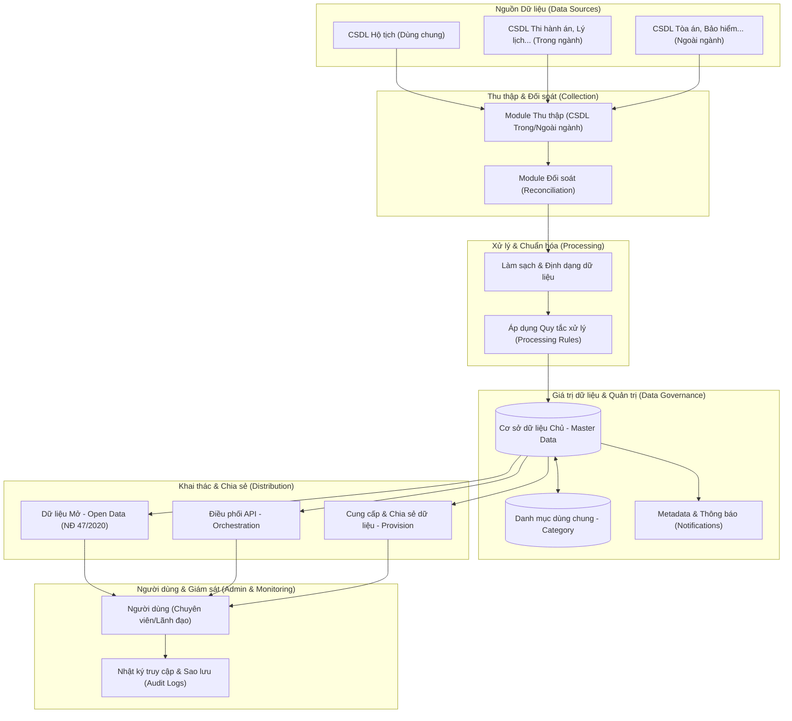

# Hệ thống Quản lý và Khai thác Kho dữ liệu DLDC_1

Tài liệu này mô tả chi tiết luồng xử lý và luân chuyển dữ liệu (Data Flow) trong hệ thống DLDC_1, bao gồm các module mới được thiết lập.

## 1. Sơ đồ Luồng Dữ liệu Tổng thể

Hệ thống được thiết kế theo mô hình khép kín từ khâu thu thập, đối soát, xử lý đến khi công bố và chia sẻ dữ liệu.

---

## 2. Chi tiết các Module chính

### 2.1. Module Thu thập & Đối soát (Collection & Reconciliation)
- **Thu thập**: Tự động hoặc thủ công lấy dữ liệu từ các hệ thống thành phần.
- **Đối soát**: So sánh dữ liệu thu thập được với dữ liệu gốc (trên Firebase/Local) để phát hiện sai lệch hoặc trùng lặp.

### 2.2. Module Xử lý & Chuẩn hóa (Processing & Cleaning)
- **Làm sạch**: Loại bỏ các ký tự thừa, chuẩn hóa định dạng ngày tháng, giới tính, dân tộc theo danh mục chuẩn.
- **Quy tắc (Rules)**: Thiết lập các filter để lọc dữ liệu rác trước khi đưa vào kho dữ liệu chủ.

### 2.3. Module Dữ liệu Chủ & Danh mục (Master Data & Category)
- **Master Data**: Nơi lưu giữ "nguồn sự thật duy nhất" (Single Source of Truth) của dữ liệu dân cư và hạ tầng.
- **Category**: Quản lý tập trung các danh mục mã dùng chung cho toàn bộ hệ thống.

### 2.4. Module Dữ liệu Mở & Điều phối (Open Data & Orchestration)
- **Open Data**: Công bố các tập dữ liệu không bảo mật phục vụ người dân và doanh nghiệp theo Nghị định 47.
- **Orchestration**: Quản lý các dịch vụ API, giám sát (Monitoring) hiện trạng kết nối và hiệu năng hệ thống.

### 2.5. Module Quản trị & Giám sát (Admin & Security)
- **Phân quyền**: Chặt chẽ cho từng cấp Chuyên viên, Lãnh đạo, Quản trị viên.
- **Audit Logs**: Lưu trữ mọi vết thao tác (Edit History), đăng nhập và cấu hình hệ thống.

---

## 3. Quy trình Luân chuyển tiêu biểu

1.  **Dữ liệu thô** được đẩy từ CSDL Hộ tịch sang module **Thu thập**.
2.  Chuyên viên thực hiện **Đối soát** để kiểm tra tính toàn vẹn.
3.  Module **Xử lý** tự động chạy các script chuẩn hóa.
4.  Dữ liệu sau chuẩn hóa được cập nhật vào **Master Data**.
5.  Dữ liệu hợp lệ được cấp quyền thông qua module **Orchestration** để chia sẻ qua API hoặc công bố tại trang **Open Data**.
