# 4.2.3. DC102.QLTT.TN – CSDL Trong ngành

## 4.2.3.1. CSDL Hộ tịch điện tử

### 4.2.3.1.1 Dashboard CSDL Hộ tịch điện tử

Màn hình

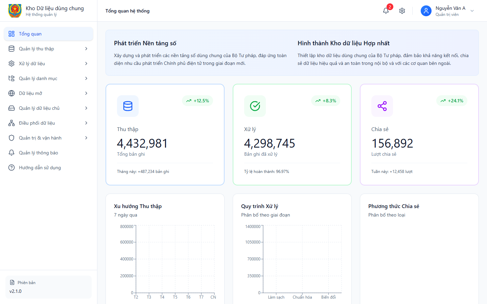

*Hình 1 – Màn hình Dashboard CSDL Hộ tịch điện tử*

#### 4.2.3.1.1.1 Mô tả thông tin trên màn hình
| **STT** | **Tên trường thông tin** | **Kiểu dữ liệu** | **Bắt buộc** | **Mặc định** | **Mô tả** |
| --- | --- | --- | --- | --- | --- |
| 1 | Thẻ thống kê | Card/Number | | | Hiển thị các chỉ số thống kê tổng hợp của CSDL. |
| 2 | Biểu đồ xu hướng | Chart | | | Biểu đồ trực quan hóa tình hình thu thập dữ liệu. |

#### 4.2.3.1.1.2 Chức năng trên màn hình
| **STT** | **Tên chức năng** | **Định dạng** | **Mô tả** |
| --- | --- | --- | --- |
| 1 | Kết xuất | Button | Xuất báo cáo tổng hợp dưới dạng file. |
| 2 | Đồng bộ | Button | Kích hoạt tiến trình đồng bộ dữ liệu tổng thể. |

### 4.2.3.1.2 PM02.QLTT.TN.KS  Hồ sơ đăng ký khai sinh

#### 4.2.3.1.2.1 Màn danh sách dữ liệu Hồ sơ đăng ký khai sinh

Màn hình

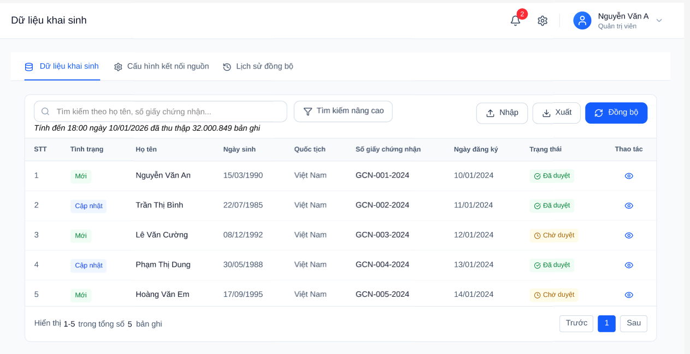

*Hình 24  Màn danh sách dữ liệu Hồ sơ đăng ký khai sinh*

##### 4.2.3.1.2.1.1 Mô tả thông tin trên màn hình
| **STT** | **Tên trường thông tin** | **Kiểu dữ liệu** | **Bắt buộc** | **Mặc định** | **Mô tả** |
| --- | --- | --- | --- | --- | --- |
| 1 | Từ khóa tìm kiếm | Text | Không | | Nhập họ tên hoặc số hồ sơ để tìm kiếm. |
| 2 | Bảng danh sách | Table | Có | | Hiển thị danh sách hồ sơ: STT, Họ tên, Ngày sinh, Trạng thái... |

##### 4.2.3.1.2.1.2 Chức năng trên màn hình
| **STT** | **Tên chức năng** | **Định dạng** | **Mô tả** |
| --- | --- | --- | --- |
| 1 | Tìm kiếm | Button | Thực hiện lọc dữ liệu theo điều kiện nhập. |
| 2 | Xem chi tiết | Icon Eye | Mở popup xem chi tiết thông tin hồ sơ. |
| 3 | Đồng bộ | Button | Kích hoạt tiến trình đồng bộ dữ liệu. |

---

#### 4.2.3.1.2.2 Màn hình thông tin chi tiết Hồ sơ đăng ký khai sinh

Màn hình

*Hình 25  Màn hình thông tin chi tiết Hồ sơ đăng ký khai sinh*

##### 4.2.3.1.2.2.1 Mô tả thông tin trên màn hình
| **STT** | **Tên trường thông tin** | **Kiểu dữ liệu** | **Bắt buộc** | **Mặc định** | **Mô tả** |
| --- | --- | --- | --- | --- | --- |
| 1 | Thông tin cá nhân | Section | Có | | Các trường: Họ tên, Ngày sinh, Giới tính... |
| 2 | Thông tin đăng ký | Section | Có | | Các trường: Số quyết định, Ngày đăng ký, Nơi đăng ký. |

##### 4.2.3.1.2.2.2 Chức năng trên màn hình
| **STT** | **Tên chức năng** | **Định dạng** | **Mô tả** |
| --- | --- | --- | --- |
| 1 | Đóng | Button | Đóng popup chi tiết, quay lại danh sách. |
| 2 | Xuất file | Button | Tải file chi tiết hồ sơ về máy. |

---

#### 4.2.3.1.2.3 Tab Lịch sử chỉnh sửa kết nối Hồ sơ đăng ký khai sinh

Màn hình

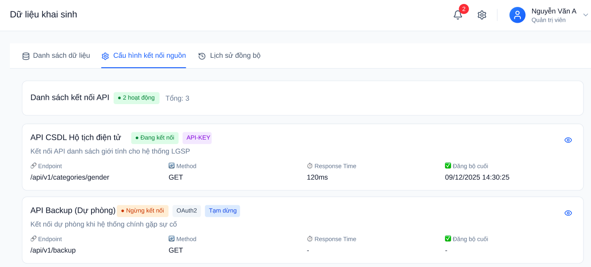

*Hình 26  Tab Lịch sử chỉnh sửa kết nối Hồ sơ đăng ký khai sinh*

##### 4.2.3.1.2.3.1 Mô tả thông tin trên màn hình
| **STT** | **Tên trường thông tin** | **Kiểu dữ liệu** | **Bắt buộc** | **Mặc định** | **Mô tả** |
| --- | --- | --- | --- | --- | --- |
| 1 | Bảng lịch sử | Table | Có | | Ghi lại các lần thay đổi thông tin hoặc trạng thái đồng bộ. |

##### 4.2.3.1.2.3.2 Chức năng trên màn hình
| **STT** | **Tên chức năng** | **Định dạng** | **Mô tả** |
| --- | --- | --- | --- |
| 1 | Xem log | Link | Nhấn để xem chi tiết nội dung thay đổi. |

---

#### 4.2.3.1.2.4 Tab Lịch sử đồng bộ Hồ sơ đăng ký khai sinh

Màn hình

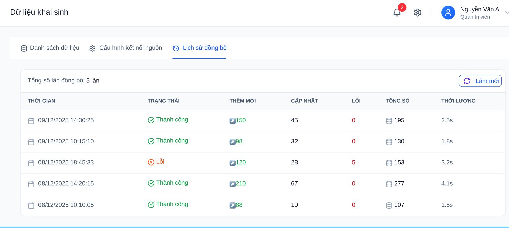

*Hình 27  Tab Lịch sử đồng bộ Hồ sơ đăng ký khai sinh*

##### 4.2.3.1.2.4.1 Mô tả thông tin trên màn hình
| **STT** | **Tên trường thông tin** | **Kiểu dữ liệu** | **Bắt buộc** | **Mặc định** | **Mô tả** |
| --- | --- | --- | --- | --- | --- |
| 1 | Bảng lịch sử | Table | Có | | Ghi lại các lần thay đổi thông tin hoặc trạng thái đồng bộ. |

##### 4.2.3.1.2.4.2 Chức năng trên màn hình
| **STT** | **Tên chức năng** | **Định dạng** | **Mô tả** |
| --- | --- | --- | --- |
| 1 | Xem log | Link | Nhấn để xem chi tiết nội dung thay đổi. |

---

### 4.2.3.1.3 PM02.QLTT.TN.KH  Hồ sơ đăng ký kết hôn

#### 4.2.3.1.3.1 Màn danh sách dữ liệu Hồ sơ đăng ký kết hôn

Màn hình

*Hình 28  Màn danh sách dữ liệu Hồ sơ đăng ký kết hôn*

##### 4.2.3.1.3.1.1 Mô tả thông tin trên màn hình
| **STT** | **Tên trường thông tin** | **Kiểu dữ liệu** | **Bắt buộc** | **Mặc định** | **Mô tả** |
| --- | --- | --- | --- | --- | --- |
| 1 | Từ khóa tìm kiếm | Text | Không | | Nhập họ tên hoặc số hồ sơ để tìm kiếm. |
| 2 | Bảng danh sách | Table | Có | | Hiển thị danh sách hồ sơ: STT, Họ tên, Ngày sinh, Trạng thái... |

##### 4.2.3.1.3.1.2 Chức năng trên màn hình
| **STT** | **Tên chức năng** | **Định dạng** | **Mô tả** |
| --- | --- | --- | --- |
| 1 | Tìm kiếm | Button | Thực hiện lọc dữ liệu theo điều kiện nhập. |
| 2 | Xem chi tiết | Icon Eye | Mở popup xem chi tiết thông tin hồ sơ. |
| 3 | Đồng bộ | Button | Kích hoạt tiến trình đồng bộ dữ liệu. |

---

#### 4.2.3.1.3.2 Màn hình thông tin chi tiết Hồ sơ đăng ký kết hôn

Màn hình

*Hình 29  Màn hình thông tin chi tiết Hồ sơ đăng ký kết hôn*

##### 4.2.3.1.3.2.1 Mô tả thông tin trên màn hình
| **STT** | **Tên trường thông tin** | **Kiểu dữ liệu** | **Bắt buộc** | **Mặc định** | **Mô tả** |
| --- | --- | --- | --- | --- | --- |
| 1 | Thông tin cá nhân | Section | Có | | Các trường: Họ tên, Ngày sinh, Giới tính... |
| 2 | Thông tin đăng ký | Section | Có | | Các trường: Số quyết định, Ngày đăng ký, Nơi đăng ký. |

##### 4.2.3.1.3.2.2 Chức năng trên màn hình
| **STT** | **Tên chức năng** | **Định dạng** | **Mô tả** |
| --- | --- | --- | --- |
| 1 | Đóng | Button | Đóng popup chi tiết, quay lại danh sách. |
| 2 | Xuất file | Button | Tải file chi tiết hồ sơ về máy. |

---

#### 4.2.3.1.3.3 Tab Lịch sử chỉnh sửa kết nối Hồ sơ đăng ký kết hôn

Màn hình

*Hình 30  Tab Lịch sử chỉnh sửa kết nối Hồ sơ đăng ký kết hôn*

##### 4.2.3.1.3.3.1 Mô tả thông tin trên màn hình
| **STT** | **Tên trường thông tin** | **Kiểu dữ liệu** | **Bắt buộc** | **Mặc định** | **Mô tả** |
| --- | --- | --- | --- | --- | --- |
| 1 | Bảng lịch sử | Table | Có | | Ghi lại các lần thay đổi thông tin hoặc trạng thái đồng bộ. |

##### 4.2.3.1.3.3.2 Chức năng trên màn hình
| **STT** | **Tên chức năng** | **Định dạng** | **Mô tả** |
| --- | --- | --- | --- |
| 1 | Xem log | Link | Nhấn để xem chi tiết nội dung thay đổi. |

---

#### 4.2.3.1.3.4 Tab Lịch sử đồng bộ Hồ sơ đăng ký kết hôn

Màn hình

*Hình 31  Tab Lịch sử đồng bộ Hồ sơ đăng ký kết hôn*

##### 4.2.3.1.3.4.1 Mô tả thông tin trên màn hình
| **STT** | **Tên trường thông tin** | **Kiểu dữ liệu** | **Bắt buộc** | **Mặc định** | **Mô tả** |
| --- | --- | --- | --- | --- | --- |
| 1 | Bảng lịch sử | Table | Có | | Ghi lại các lần thay đổi thông tin hoặc trạng thái đồng bộ. |

##### 4.2.3.1.3.4.2 Chức năng trên màn hình
| **STT** | **Tên chức năng** | **Định dạng** | **Mô tả** |
| --- | --- | --- | --- |
| 1 | Xem log | Link | Nhấn để xem chi tiết nội dung thay đổi. |

---

### 4.2.3.1.4 PM02.QLTT.TN.GDKN  Hồ sơ cấp GĐKN kết hôn

#### 4.2.3.1.4.1 Màn danh sách dữ liệu Hồ sơ cấp GĐKN kết hôn

Màn hình

*Hình 32  Màn danh sách dữ liệu Hồ sơ cấp GĐKN kết hôn*

##### 4.2.3.1.4.1.1 Mô tả thông tin trên màn hình
| **STT** | **Tên trường thông tin** | **Kiểu dữ liệu** | **Bắt buộc** | **Mặc định** | **Mô tả** |
| --- | --- | --- | --- | --- | --- |
| 1 | Từ khóa tìm kiếm | Text | Không | | Nhập họ tên hoặc số hồ sơ để tìm kiếm. |
| 2 | Bảng danh sách | Table | Có | | Hiển thị danh sách hồ sơ: STT, Họ tên, Ngày sinh, Trạng thái... |

##### 4.2.3.1.4.1.2 Chức năng trên màn hình
| **STT** | **Tên chức năng** | **Định dạng** | **Mô tả** |
| --- | --- | --- | --- |
| 1 | Tìm kiếm | Button | Thực hiện lọc dữ liệu theo điều kiện nhập. |
| 2 | Xem chi tiết | Icon Eye | Mở popup xem chi tiết thông tin hồ sơ. |
| 3 | Đồng bộ | Button | Kích hoạt tiến trình đồng bộ dữ liệu. |

---

#### 4.2.3.1.4.2 Màn hình thông tin chi tiết Hồ sơ cấp GĐKN kết hôn

Màn hình

*Hình 33  Màn hình thông tin chi tiết Hồ sơ cấp GĐKN kết hôn*

##### 4.2.3.1.4.2.1 Mô tả thông tin trên màn hình
| **STT** | **Tên trường thông tin** | **Kiểu dữ liệu** | **Bắt buộc** | **Mặc định** | **Mô tả** |
| --- | --- | --- | --- | --- | --- |
| 1 | Thông tin cá nhân | Section | Có | | Các trường: Họ tên, Ngày sinh, Giới tính... |
| 2 | Thông tin đăng ký | Section | Có | | Các trường: Số quyết định, Ngày đăng ký, Nơi đăng ký. |

##### 4.2.3.1.4.2.2 Chức năng trên màn hình
| **STT** | **Tên chức năng** | **Định dạng** | **Mô tả** |
| --- | --- | --- | --- |
| 1 | Đóng | Button | Đóng popup chi tiết, quay lại danh sách. |
| 2 | Xuất file | Button | Tải file chi tiết hồ sơ về máy. |

---

#### 4.2.3.1.4.3 Tab Lịch sử chỉnh sửa kết nối Hồ sơ cấp GĐKN kết hôn

Màn hình

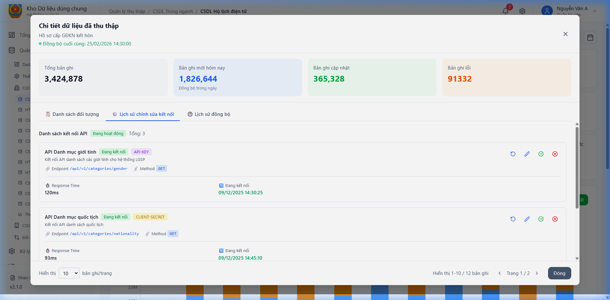

*Hình 34  Tab Lịch sử chỉnh sửa kết nối Hồ sơ cấp GĐKN kết hôn*

##### 4.2.3.1.4.3.1 Mô tả thông tin trên màn hình
| **STT** | **Tên trường thông tin** | **Kiểu dữ liệu** | **Bắt buộc** | **Mặc định** | **Mô tả** |
| --- | --- | --- | --- | --- | --- |
| 1 | Bảng lịch sử | Table | Có | | Ghi lại các lần thay đổi thông tin hoặc trạng thái đồng bộ. |

##### 4.2.3.1.4.3.2 Chức năng trên màn hình
| **STT** | **Tên chức năng** | **Định dạng** | **Mô tả** |
| --- | --- | --- | --- |
| 1 | Xem log | Link | Nhấn để xem chi tiết nội dung thay đổi. |

---

#### 4.2.3.1.4.4 Tab Lịch sử đồng bộ Hồ sơ cấp GĐKN kết hôn

Màn hình

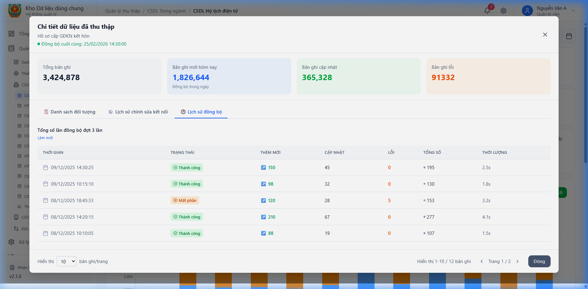

*Hình 35  Tab Lịch sử đồng bộ Hồ sơ cấp GĐKN kết hôn*

##### 4.2.3.1.4.4.1 Mô tả thông tin trên màn hình
| **STT** | **Tên trường thông tin** | **Kiểu dữ liệu** | **Bắt buộc** | **Mặc định** | **Mô tả** |
| --- | --- | --- | --- | --- | --- |
| 1 | Bảng lịch sử | Table | Có | | Ghi lại các lần thay đổi thông tin hoặc trạng thái đồng bộ. |

##### 4.2.3.1.4.4.2 Chức năng trên màn hình
| **STT** | **Tên chức năng** | **Định dạng** | **Mô tả** |
| --- | --- | --- | --- |
| 1 | Xem log | Link | Nhấn để xem chi tiết nội dung thay đổi. |

---

### 4.2.3.1.5 PM02.QLTT.TN.KT  Hồ sơ đăng ký khai tử

#### 4.2.3.1.5.1 Màn danh sách dữ liệu Hồ sơ đăng ký khai tử

Màn hình

*Hình 36  Màn danh sách dữ liệu Hồ sơ đăng ký khai tử*

##### 4.2.3.1.5.1.1 Mô tả thông tin trên màn hình
| **STT** | **Tên trường thông tin** | **Kiểu dữ liệu** | **Bắt buộc** | **Mặc định** | **Mô tả** |
| --- | --- | --- | --- | --- | --- |
| 1 | Từ khóa tìm kiếm | Text | Không | | Nhập họ tên hoặc số hồ sơ để tìm kiếm. |
| 2 | Bảng danh sách | Table | Có | | Hiển thị danh sách hồ sơ: STT, Họ tên, Ngày sinh, Trạng thái... |

##### 4.2.3.1.5.1.2 Chức năng trên màn hình
| **STT** | **Tên chức năng** | **Định dạng** | **Mô tả** |
| --- | --- | --- | --- |
| 1 | Tìm kiếm | Button | Thực hiện lọc dữ liệu theo điều kiện nhập. |
| 2 | Xem chi tiết | Icon Eye | Mở popup xem chi tiết thông tin hồ sơ. |
| 3 | Đồng bộ | Button | Kích hoạt tiến trình đồng bộ dữ liệu. |

---

#### 4.2.3.1.5.2 Màn hình thông tin chi tiết Hồ sơ đăng ký khai tử

Màn hình

*Hình 37  Màn hình thông tin chi tiết Hồ sơ đăng ký khai tử*

##### 4.2.3.1.5.2.1 Mô tả thông tin trên màn hình
| **STT** | **Tên trường thông tin** | **Kiểu dữ liệu** | **Bắt buộc** | **Mặc định** | **Mô tả** |
| --- | --- | --- | --- | --- | --- |
| 1 | Thông tin cá nhân | Section | Có | | Các trường: Họ tên, Ngày sinh, Giới tính... |
| 2 | Thông tin đăng ký | Section | Có | | Các trường: Số quyết định, Ngày đăng ký, Nơi đăng ký. |

##### 4.2.3.1.5.2.2 Chức năng trên màn hình
| **STT** | **Tên chức năng** | **Định dạng** | **Mô tả** |
| --- | --- | --- | --- |
| 1 | Đóng | Button | Đóng popup chi tiết, quay lại danh sách. |
| 2 | Xuất file | Button | Tải file chi tiết hồ sơ về máy. |

---

#### 4.2.3.1.5.3 Tab Lịch sử chỉnh sửa kết nối Hồ sơ đăng ký khai tử

Màn hình

*Hình 38  Tab Lịch sử chỉnh sửa kết nối Hồ sơ đăng ký khai tử*

##### 4.2.3.1.5.3.1 Mô tả thông tin trên màn hình
| **STT** | **Tên trường thông tin** | **Kiểu dữ liệu** | **Bắt buộc** | **Mặc định** | **Mô tả** |
| --- | --- | --- | --- | --- | --- |
| 1 | Bảng lịch sử | Table | Có | | Ghi lại các lần thay đổi thông tin hoặc trạng thái đồng bộ. |

##### 4.2.3.1.5.3.2 Chức năng trên màn hình
| **STT** | **Tên chức năng** | **Định dạng** | **Mô tả** |
| --- | --- | --- | --- |
| 1 | Xem log | Link | Nhấn để xem chi tiết nội dung thay đổi. |

---

#### 4.2.3.1.5.4 Tab Lịch sử đồng bộ Hồ sơ đăng ký khai tử

Màn hình

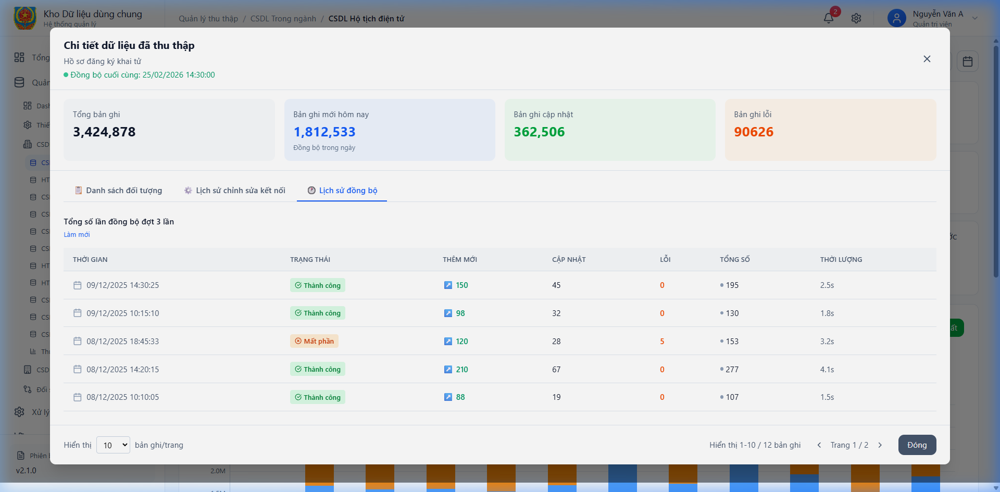

*Hình 39  Tab Lịch sử đồng bộ Hồ sơ đăng ký khai tử*

##### 4.2.3.1.5.4.1 Mô tả thông tin trên màn hình
| **STT** | **Tên trường thông tin** | **Kiểu dữ liệu** | **Bắt buộc** | **Mặc định** | **Mô tả** |
| --- | --- | --- | --- | --- | --- |
| 1 | Bảng lịch sử | Table | Có | | Ghi lại các lần thay đổi thông tin hoặc trạng thái đồng bộ. |

##### 4.2.3.1.5.4.2 Chức năng trên màn hình
| **STT** | **Tên chức năng** | **Định dạng** | **Mô tả** |
| --- | --- | --- | --- |
| 1 | Xem log | Link | Nhấn để xem chi tiết nội dung thay đổi. |

---

### 4.2.3.1.6 PM02.QLTT.TN.NC  Hồ sơ DK nhận cha, mẹ, con

#### 4.2.3.1.6.1 Màn danh sách dữ liệu Hồ sơ DK nhận cha, mẹ, con

Màn hình

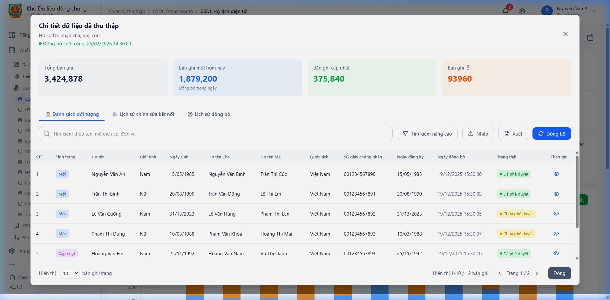

*Hình 40  Màn danh sách dữ liệu Hồ sơ DK nhận cha, mẹ, con*

##### 4.2.3.1.6.1.1 Mô tả thông tin trên màn hình
| **STT** | **Tên trường thông tin** | **Kiểu dữ liệu** | **Bắt buộc** | **Mặc định** | **Mô tả** |
| --- | --- | --- | --- | --- | --- |
| 1 | Từ khóa tìm kiếm | Text | Không | | Nhập họ tên hoặc số hồ sơ để tìm kiếm. |
| 2 | Bảng danh sách | Table | Có | | Hiển thị danh sách hồ sơ: STT, Họ tên, Ngày sinh, Trạng thái... |

##### 4.2.3.1.6.1.2 Chức năng trên màn hình
| **STT** | **Tên chức năng** | **Định dạng** | **Mô tả** |
| --- | --- | --- | --- |
| 1 | Tìm kiếm | Button | Thực hiện lọc dữ liệu theo điều kiện nhập. |
| 2 | Xem chi tiết | Icon Eye | Mở popup xem chi tiết thông tin hồ sơ. |
| 3 | Đồng bộ | Button | Kích hoạt tiến trình đồng bộ dữ liệu. |

---

#### 4.2.3.1.6.2 Màn hình thông tin chi tiết Hồ sơ DK nhận cha, mẹ, con

Màn hình

*Hình 41  Màn hình thông tin chi tiết Hồ sơ DK nhận cha, mẹ, con*

##### 4.2.3.1.6.2.1 Mô tả thông tin trên màn hình
| **STT** | **Tên trường thông tin** | **Kiểu dữ liệu** | **Bắt buộc** | **Mặc định** | **Mô tả** |
| --- | --- | --- | --- | --- | --- |
| 1 | Thông tin cá nhân | Section | Có | | Các trường: Họ tên, Ngày sinh, Giới tính... |
| 2 | Thông tin đăng ký | Section | Có | | Các trường: Số quyết định, Ngày đăng ký, Nơi đăng ký. |

##### 4.2.3.1.6.2.2 Chức năng trên màn hình
| **STT** | **Tên chức năng** | **Định dạng** | **Mô tả** |
| --- | --- | --- | --- |
| 1 | Đóng | Button | Đóng popup chi tiết, quay lại danh sách. |
| 2 | Xuất file | Button | Tải file chi tiết hồ sơ về máy. |

---

#### 4.2.3.1.6.3 Tab Lịch sử chỉnh sửa kết nối Hồ sơ DK nhận cha, mẹ, con

Màn hình

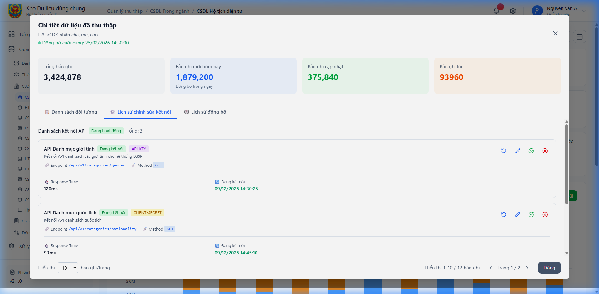

*Hình 42  Tab Lịch sử chỉnh sửa kết nối Hồ sơ DK nhận cha, mẹ, con*

##### 4.2.3.1.6.3.1 Mô tả thông tin trên màn hình
| **STT** | **Tên trường thông tin** | **Kiểu dữ liệu** | **Bắt buộc** | **Mặc định** | **Mô tả** |
| --- | --- | --- | --- | --- | --- |
| 1 | Bảng lịch sử | Table | Có | | Ghi lại các lần thay đổi thông tin hoặc trạng thái đồng bộ. |

##### 4.2.3.1.6.3.2 Chức năng trên màn hình
| **STT** | **Tên chức năng** | **Định dạng** | **Mô tả** |
| --- | --- | --- | --- |
| 1 | Xem log | Link | Nhấn để xem chi tiết nội dung thay đổi. |

---

#### 4.2.3.1.6.4 Tab Lịch sử đồng bộ Hồ sơ DK nhận cha, mẹ, con

Màn hình

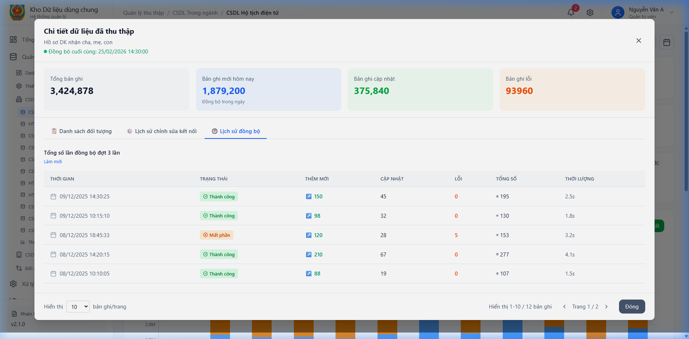

*Hình 43  Tab Lịch sử đồng bộ Hồ sơ DK nhận cha, mẹ, con*

##### 4.2.3.1.6.4.1 Mô tả thông tin trên màn hình
| **STT** | **Tên trường thông tin** | **Kiểu dữ liệu** | **Bắt buộc** | **Mặc định** | **Mô tả** |
| --- | --- | --- | --- | --- | --- |
| 1 | Bảng lịch sử | Table | Có | | Ghi lại các lần thay đổi thông tin hoặc trạng thái đồng bộ. |

##### 4.2.3.1.6.4.2 Chức năng trên màn hình
| **STT** | **Tên chức năng** | **Định dạng** | **Mô tả** |
| --- | --- | --- | --- |
| 1 | Xem log | Link | Nhấn để xem chi tiết nội dung thay đổi. |

---

### 4.2.3.1.7 PM02.QLTT.TN.NN  Hồ sơ đăng ký nuôi con nuôi

#### 4.2.3.1.7.1 Màn danh sách dữ liệu Hồ sơ đăng ký nuôi con nuôi

Màn hình

*Hình 44  Màn danh sách dữ liệu Hồ sơ đăng ký nuôi con nuôi*

##### 4.2.3.1.7.1.1 Mô tả thông tin trên màn hình
| **STT** | **Tên trường thông tin** | **Kiểu dữ liệu** | **Bắt buộc** | **Mặc định** | **Mô tả** |
| --- | --- | --- | --- | --- | --- |
| 1 | Từ khóa tìm kiếm | Text | Không | | Nhập họ tên hoặc số hồ sơ để tìm kiếm. |
| 2 | Bảng danh sách | Table | Có | | Hiển thị danh sách hồ sơ: STT, Họ tên, Ngày sinh, Trạng thái... |

##### 4.2.3.1.7.1.2 Chức năng trên màn hình
| **STT** | **Tên chức năng** | **Định dạng** | **Mô tả** |
| --- | --- | --- | --- |
| 1 | Tìm kiếm | Button | Thực hiện lọc dữ liệu theo điều kiện nhập. |
| 2 | Xem chi tiết | Icon Eye | Mở popup xem chi tiết thông tin hồ sơ. |
| 3 | Đồng bộ | Button | Kích hoạt tiến trình đồng bộ dữ liệu. |

---

#### 4.2.3.1.7.2 Màn hình thông tin chi tiết Hồ sơ đăng ký nuôi con nuôi

Màn hình

*Hình 45  Màn hình thông tin chi tiết Hồ sơ đăng ký nuôi con nuôi*

##### 4.2.3.1.7.2.1 Mô tả thông tin trên màn hình
| **STT** | **Tên trường thông tin** | **Kiểu dữ liệu** | **Bắt buộc** | **Mặc định** | **Mô tả** |
| --- | --- | --- | --- | --- | --- |
| 1 | Thông tin cá nhân | Section | Có | | Các trường: Họ tên, Ngày sinh, Giới tính... |
| 2 | Thông tin đăng ký | Section | Có | | Các trường: Số quyết định, Ngày đăng ký, Nơi đăng ký. |

##### 4.2.3.1.7.2.2 Chức năng trên màn hình
| **STT** | **Tên chức năng** | **Định dạng** | **Mô tả** |
| --- | --- | --- | --- |
| 1 | Đóng | Button | Đóng popup chi tiết, quay lại danh sách. |
| 2 | Xuất file | Button | Tải file chi tiết hồ sơ về máy. |

---

#### 4.2.3.1.7.3 Tab Lịch sử chỉnh sửa kết nối Hồ sơ đăng ký nuôi con nuôi

Màn hình

*Hình 46  Tab Lịch sử chỉnh sửa kết nối Hồ sơ đăng ký nuôi con nuôi*

##### 4.2.3.1.7.3.1 Mô tả thông tin trên màn hình
| **STT** | **Tên trường thông tin** | **Kiểu dữ liệu** | **Bắt buộc** | **Mặc định** | **Mô tả** |
| --- | --- | --- | --- | --- | --- |
| 1 | Bảng lịch sử | Table | Có | | Ghi lại các lần thay đổi thông tin hoặc trạng thái đồng bộ. |

##### 4.2.3.1.7.3.2 Chức năng trên màn hình
| **STT** | **Tên chức năng** | **Định dạng** | **Mô tả** |
| --- | --- | --- | --- |
| 1 | Xem log | Link | Nhấn để xem chi tiết nội dung thay đổi. |

---

#### 4.2.3.1.7.4 Tab Lịch sử đồng bộ Hồ sơ đăng ký nuôi con nuôi

Màn hình

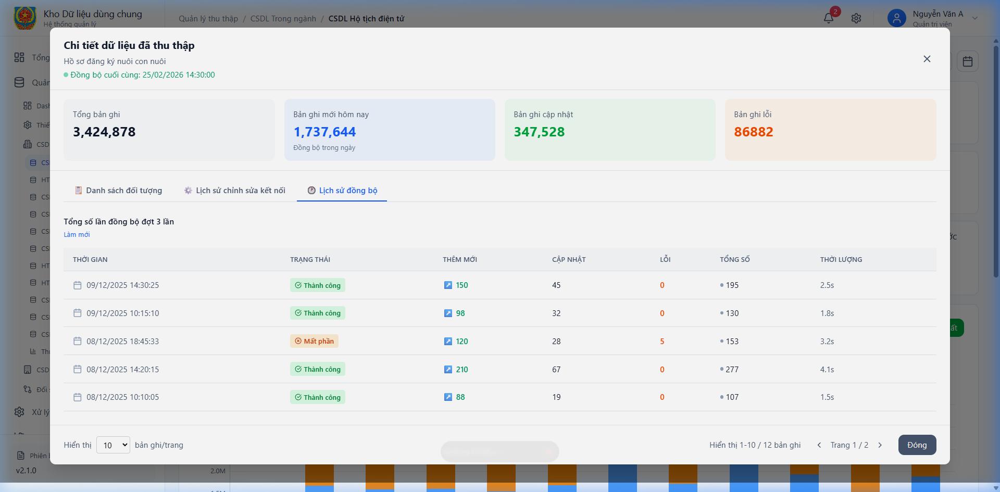

*Hình 47  Tab Lịch sử đồng bộ Hồ sơ đăng ký nuôi con nuôi*

##### 4.2.3.1.7.4.1 Mô tả thông tin trên màn hình
| **STT** | **Tên trường thông tin** | **Kiểu dữ liệu** | **Bắt buộc** | **Mặc định** | **Mô tả** |
| --- | --- | --- | --- | --- | --- |
| 1 | Bảng lịch sử | Table | Có | | Ghi lại các lần thay đổi thông tin hoặc trạng thái đồng bộ. |

##### 4.2.3.1.7.4.2 Chức năng trên màn hình
| **STT** | **Tên chức năng** | **Định dạng** | **Mô tả** |
| --- | --- | --- | --- |
| 1 | Xem log | Link | Nhấn để xem chi tiết nội dung thay đổi. |

---

### 4.2.3.1.8 PM02.QLTT.TN.GH  Hồ sơ đăng ký giám hộ

#### 4.2.3.1.8.1 Màn danh sách dữ liệu Hồ sơ đăng ký giám hộ

Màn hình

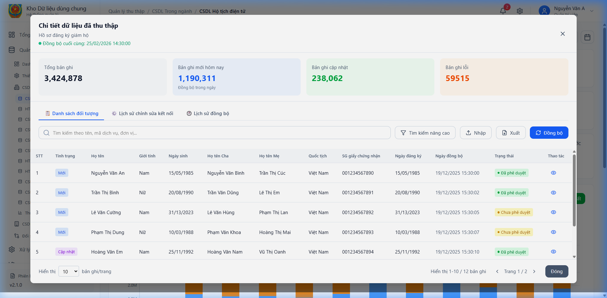

*Hình 48  Màn danh sách dữ liệu Hồ sơ đăng ký giám hộ*

##### 4.2.3.1.8.1.1 Mô tả thông tin trên màn hình
| **STT** | **Tên trường thông tin** | **Kiểu dữ liệu** | **Bắt buộc** | **Mặc định** | **Mô tả** |
| --- | --- | --- | --- | --- | --- |
| 1 | Từ khóa tìm kiếm | Text | Không | | Nhập họ tên hoặc số hồ sơ để tìm kiếm. |
| 2 | Bảng danh sách | Table | Có | | Hiển thị danh sách hồ sơ: STT, Họ tên, Ngày sinh, Trạng thái... |

##### 4.2.3.1.8.1.2 Chức năng trên màn hình
| **STT** | **Tên chức năng** | **Định dạng** | **Mô tả** |
| --- | --- | --- | --- |
| 1 | Tìm kiếm | Button | Thực hiện lọc dữ liệu theo điều kiện nhập. |
| 2 | Xem chi tiết | Icon Eye | Mở popup xem chi tiết thông tin hồ sơ. |
| 3 | Đồng bộ | Button | Kích hoạt tiến trình đồng bộ dữ liệu. |

---

#### 4.2.3.1.8.2 Màn hình thông tin chi tiết Hồ sơ đăng ký giám hộ

Màn hình

*Hình 49  Màn hình thông tin chi tiết Hồ sơ đăng ký giám hộ*

##### 4.2.3.1.8.2.1 Mô tả thông tin trên màn hình
| **STT** | **Tên trường thông tin** | **Kiểu dữ liệu** | **Bắt buộc** | **Mặc định** | **Mô tả** |
| --- | --- | --- | --- | --- | --- |
| 1 | Thông tin cá nhân | Section | Có | | Các trường: Họ tên, Ngày sinh, Giới tính... |
| 2 | Thông tin đăng ký | Section | Có | | Các trường: Số quyết định, Ngày đăng ký, Nơi đăng ký. |

##### 4.2.3.1.8.2.2 Chức năng trên màn hình
| **STT** | **Tên chức năng** | **Định dạng** | **Mô tả** |
| --- | --- | --- | --- |
| 1 | Đóng | Button | Đóng popup chi tiết, quay lại danh sách. |
| 2 | Xuất file | Button | Tải file chi tiết hồ sơ về máy. |

---

#### 4.2.3.1.8.3 Tab Lịch sử chỉnh sửa kết nối Hồ sơ đăng ký giám hộ

Màn hình

*Hình 50  Tab Lịch sử chỉnh sửa kết nối Hồ sơ đăng ký giám hộ*

##### 4.2.3.1.8.3.1 Mô tả thông tin trên màn hình
| **STT** | **Tên trường thông tin** | **Kiểu dữ liệu** | **Bắt buộc** | **Mặc định** | **Mô tả** |
| --- | --- | --- | --- | --- | --- |
| 1 | Bảng lịch sử | Table | Có | | Ghi lại các lần thay đổi thông tin hoặc trạng thái đồng bộ. |

##### 4.2.3.1.8.3.2 Chức năng trên màn hình
| **STT** | **Tên chức năng** | **Định dạng** | **Mô tả** |
| --- | --- | --- | --- |
| 1 | Xem log | Link | Nhấn để xem chi tiết nội dung thay đổi. |

---

#### 4.2.3.1.8.4 Tab Lịch sử đồng bộ Hồ sơ đăng ký giám hộ

Màn hình

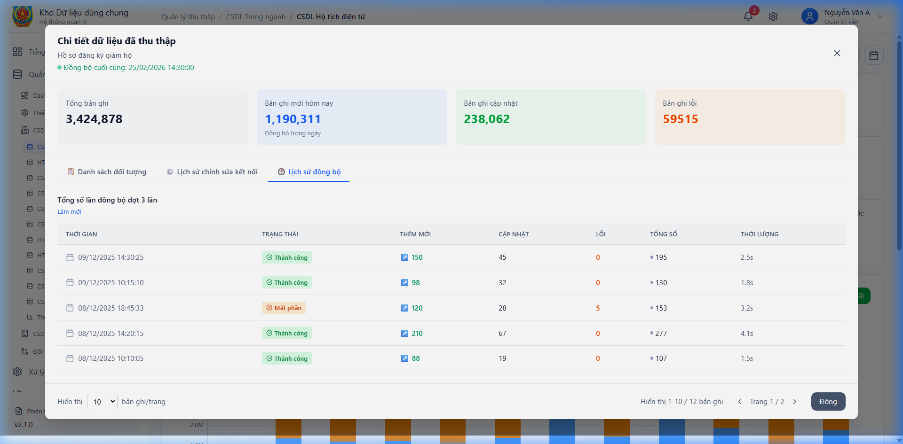

*Hình 51  Tab Lịch sử đồng bộ Hồ sơ đăng ký giám hộ*

##### 4.2.3.1.8.4.1 Mô tả thông tin trên màn hình
| **STT** | **Tên trường thông tin** | **Kiểu dữ liệu** | **Bắt buộc** | **Mặc định** | **Mô tả** |
| --- | --- | --- | --- | --- | --- |
| 1 | Bảng lịch sử | Table | Có | | Ghi lại các lần thay đổi thông tin hoặc trạng thái đồng bộ. |

##### 4.2.3.1.8.4.2 Chức năng trên màn hình
| **STT** | **Tên chức năng** | **Định dạng** | **Mô tả** |
| --- | --- | --- | --- |
| 1 | Xem log | Link | Nhấn để xem chi tiết nội dung thay đổi. |

---

### 4.2.3.1.9 PM02.QLTT.TN.CDGH  Hồ sơ DK chấm dứt giám hộ

#### 4.2.3.1.9.1 Màn danh sách dữ liệu Hồ sơ DK chấm dứt giám hộ

Màn hình

*Hình 52  Màn danh sách dữ liệu Hồ sơ DK chấm dứt giám hộ*

##### 4.2.3.1.9.1.1 Mô tả thông tin trên màn hình
| **STT** | **Tên trường thông tin** | **Kiểu dữ liệu** | **Bắt buộc** | **Mặc định** | **Mô tả** |
| --- | --- | --- | --- | --- | --- |
| 1 | Từ khóa tìm kiếm | Text | Không | | Nhập họ tên hoặc số hồ sơ để tìm kiếm. |
| 2 | Bảng danh sách | Table | Có | | Hiển thị danh sách hồ sơ: STT, Họ tên, Ngày sinh, Trạng thái... |

##### 4.2.3.1.9.1.2 Chức năng trên màn hình
| **STT** | **Tên chức năng** | **Định dạng** | **Mô tả** |
| --- | --- | --- | --- |
| 1 | Tìm kiếm | Button | Thực hiện lọc dữ liệu theo điều kiện nhập. |
| 2 | Xem chi tiết | Icon Eye | Mở popup xem chi tiết thông tin hồ sơ. |
| 3 | Đồng bộ | Button | Kích hoạt tiến trình đồng bộ dữ liệu. |

---

#### 4.2.3.1.9.2 Màn hình thông tin chi tiết Hồ sơ DK chấm dứt giám hộ

Màn hình

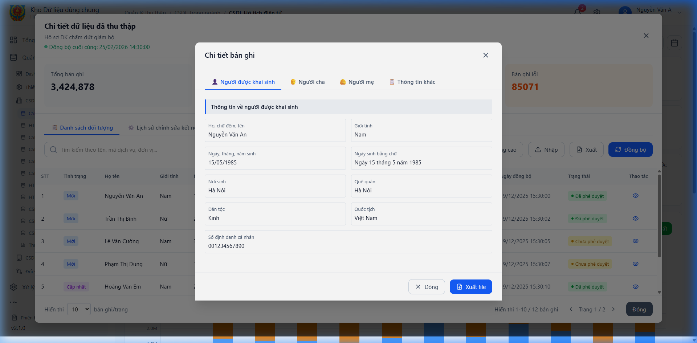

*Hình 53  Màn hình thông tin chi tiết Hồ sơ DK chấm dứt giám hộ*

##### 4.2.3.1.9.2.1 Mô tả thông tin trên màn hình
| **STT** | **Tên trường thông tin** | **Kiểu dữ liệu** | **Bắt buộc** | **Mặc định** | **Mô tả** |
| --- | --- | --- | --- | --- | --- |
| 1 | Thông tin cá nhân | Section | Có | | Các trường: Họ tên, Ngày sinh, Giới tính... |
| 2 | Thông tin đăng ký | Section | Có | | Các trường: Số quyết định, Ngày đăng ký, Nơi đăng ký. |

##### 4.2.3.1.9.2.2 Chức năng trên màn hình
| **STT** | **Tên chức năng** | **Định dạng** | **Mô tả** |
| --- | --- | --- | --- |
| 1 | Đóng | Button | Đóng popup chi tiết, quay lại danh sách. |
| 2 | Xuất file | Button | Tải file chi tiết hồ sơ về máy. |

---

#### 4.2.3.1.9.3 Tab Lịch sử chỉnh sửa kết nối Hồ sơ DK chấm dứt giám hộ

Màn hình

*Hình 54  Tab Lịch sử chỉnh sửa kết nối Hồ sơ DK chấm dứt giám hộ*

##### 4.2.3.1.9.3.1 Mô tả thông tin trên màn hình
| **STT** | **Tên trường thông tin** | **Kiểu dữ liệu** | **Bắt buộc** | **Mặc định** | **Mô tả** |
| --- | --- | --- | --- | --- | --- |
| 1 | Bảng lịch sử | Table | Có | | Ghi lại các lần thay đổi thông tin hoặc trạng thái đồng bộ. |

##### 4.2.3.1.9.3.2 Chức năng trên màn hình
| **STT** | **Tên chức năng** | **Định dạng** | **Mô tả** |
| --- | --- | --- | --- |
| 1 | Xem log | Link | Nhấn để xem chi tiết nội dung thay đổi. |

---

#### 4.2.3.1.9.4 Tab Lịch sử đồng bộ Hồ sơ DK chấm dứt giám hộ

Màn hình

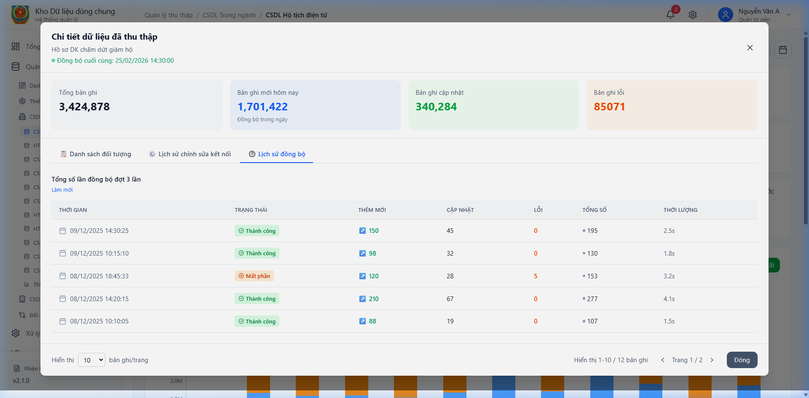

*Hình 55  Tab Lịch sử đồng bộ Hồ sơ DK chấm dứt giám hộ*

##### 4.2.3.1.9.4.1 Mô tả thông tin trên màn hình
| **STT** | **Tên trường thông tin** | **Kiểu dữ liệu** | **Bắt buộc** | **Mặc định** | **Mô tả** |
| --- | --- | --- | --- | --- | --- |
| 1 | Bảng lịch sử | Table | Có | | Ghi lại các lần thay đổi thông tin hoặc trạng thái đồng bộ. |

##### 4.2.3.1.9.4.2 Chức năng trên màn hình
| **STT** | **Tên chức năng** | **Định dạng** | **Mô tả** |
| --- | --- | --- | --- |
| 1 | Xem log | Link | Nhấn để xem chi tiết nội dung thay đổi. |

---

### 4.2.3.1.10 PM02.QLTT.TN.TDHT  Hồ sơ DK thay đổi TT hộ tịch...

#### 4.2.3.1.10.1 Màn danh sách dữ liệu Hồ sơ DK thay đổi TT hộ tịch...

Màn hình

*Hình 56  Màn danh sách dữ liệu Hồ sơ DK thay đổi TT hộ tịch...*

##### 4.2.3.1.10.1.1 Mô tả thông tin trên màn hình
| **STT** | **Tên trường thông tin** | **Kiểu dữ liệu** | **Bắt buộc** | **Mặc định** | **Mô tả** |
| --- | --- | --- | --- | --- | --- |
| 1 | Từ khóa tìm kiếm | Text | Không | | Nhập họ tên hoặc số hồ sơ để tìm kiếm. |
| 2 | Bảng danh sách | Table | Có | | Hiển thị danh sách hồ sơ: STT, Họ tên, Ngày sinh, Trạng thái... |

##### 4.2.3.1.10.1.2 Chức năng trên màn hình
| **STT** | **Tên chức năng** | **Định dạng** | **Mô tả** |
| --- | --- | --- | --- |
| 1 | Tìm kiếm | Button | Thực hiện lọc dữ liệu theo điều kiện nhập. |
| 2 | Xem chi tiết | Icon Eye | Mở popup xem chi tiết thông tin hồ sơ. |
| 3 | Đồng bộ | Button | Kích hoạt tiến trình đồng bộ dữ liệu. |

---

#### 4.2.3.1.10.2 Màn hình thông tin chi tiết Hồ sơ DK thay đổi TT hộ tịch...

Màn hình

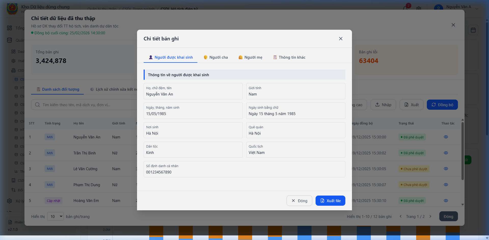

*Hình 57  Màn hình thông tin chi tiết Hồ sơ DK thay đổi TT hộ tịch...*

##### 4.2.3.1.10.2.1 Mô tả thông tin trên màn hình
| **STT** | **Tên trường thông tin** | **Kiểu dữ liệu** | **Bắt buộc** | **Mặc định** | **Mô tả** |
| --- | --- | --- | --- | --- | --- |
| 1 | Thông tin cá nhân | Section | Có | | Các trường: Họ tên, Ngày sinh, Giới tính... |
| 2 | Thông tin đăng ký | Section | Có | | Các trường: Số quyết định, Ngày đăng ký, Nơi đăng ký. |

##### 4.2.3.1.10.2.2 Chức năng trên màn hình
| **STT** | **Tên chức năng** | **Định dạng** | **Mô tả** |
| --- | --- | --- | --- |
| 1 | Đóng | Button | Đóng popup chi tiết, quay lại danh sách. |
| 2 | Xuất file | Button | Tải file chi tiết hồ sơ về máy. |

---

#### 4.2.3.1.10.3 Tab Lịch sử chỉnh sửa kết nối Hồ sơ DK thay đổi TT hộ tịch...

Màn hình

*Hình 58  Tab Lịch sử chỉnh sửa kết nối Hồ sơ DK thay đổi TT hộ tịch...*

##### 4.2.3.1.10.3.1 Mô tả thông tin trên màn hình
| **STT** | **Tên trường thông tin** | **Kiểu dữ liệu** | **Bắt buộc** | **Mặc định** | **Mô tả** |
| --- | --- | --- | --- | --- | --- |
| 1 | Bảng lịch sử | Table | Có | | Ghi lại các lần thay đổi thông tin hoặc trạng thái đồng bộ. |

##### 4.2.3.1.10.3.2 Chức năng trên màn hình
| **STT** | **Tên chức năng** | **Định dạng** | **Mô tả** |
| --- | --- | --- | --- |
| 1 | Xem log | Link | Nhấn để xem chi tiết nội dung thay đổi. |

---

#### 4.2.3.1.10.4 Tab Lịch sử đồng bộ Hồ sơ DK thay đổi TT hộ tịch...

Màn hình

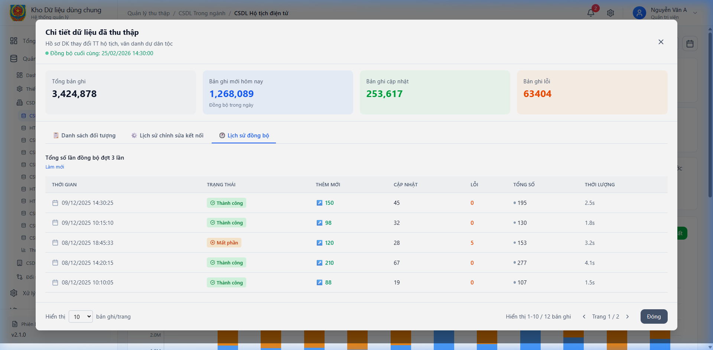

*Hình 59  Tab Lịch sử đồng bộ Hồ sơ DK thay đổi TT hộ tịch...*

##### 4.2.3.1.10.4.1 Mô tả thông tin trên màn hình
| **STT** | **Tên trường thông tin** | **Kiểu dữ liệu** | **Bắt buộc** | **Mặc định** | **Mô tả** |
| --- | --- | --- | --- | --- | --- |
| 1 | Bảng lịch sử | Table | Có | | Ghi lại các lần thay đổi thông tin hoặc trạng thái đồng bộ. |

##### 4.2.3.1.10.4.2 Chức năng trên màn hình
| **STT** | **Tên chức năng** | **Định dạng** | **Mô tả** |
| --- | --- | --- | --- |
| 1 | Xem log | Link | Nhấn để xem chi tiết nội dung thay đổi. |

---

### 4.2.3.1.11 PM02.QLTT.TN.KSGH  Hồ sơ đăng ký kiểm sát việc giám hộ

#### 4.2.3.1.11.1 Màn danh sách dữ liệu Hồ sơ đăng ký kiểm sát việc giám hộ

Màn hình

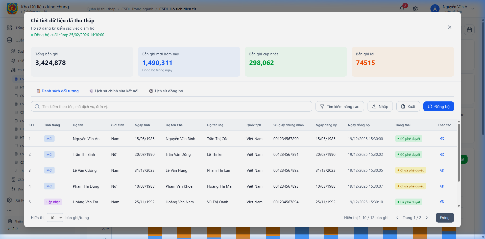

*Hình 60  Màn danh sách dữ liệu Hồ sơ đăng ký kiểm sát việc giám hộ*

##### 4.2.3.1.11.1.1 Mô tả thông tin trên màn hình
| **STT** | **Tên trường thông tin** | **Kiểu dữ liệu** | **Bắt buộc** | **Mặc định** | **Mô tả** |
| --- | --- | --- | --- | --- | --- |
| 1 | Từ khóa tìm kiếm | Text | Không | | Nhập họ tên hoặc số hồ sơ để tìm kiếm. |
| 2 | Bảng danh sách | Table | Có | | Hiển thị danh sách hồ sơ: STT, Họ tên, Ngày sinh, Trạng thái... |

##### 4.2.3.1.11.1.2 Chức năng trên màn hình
| **STT** | **Tên chức năng** | **Định dạng** | **Mô tả** |
| --- | --- | --- | --- |
| 1 | Tìm kiếm | Button | Thực hiện lọc dữ liệu theo điều kiện nhập. |
| 2 | Xem chi tiết | Icon Eye | Mở popup xem chi tiết thông tin hồ sơ. |
| 3 | Đồng bộ | Button | Kích hoạt tiến trình đồng bộ dữ liệu. |

---

#### 4.2.3.1.11.2 Màn hình thông tin chi tiết Hồ sơ đăng ký kiểm sát việc giám hộ

Màn hình

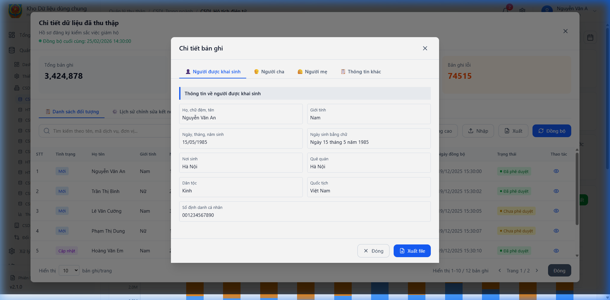

*Hình 61  Màn hình thông tin chi tiết Hồ sơ đăng ký kiểm sát việc giám hộ*

##### 4.2.3.1.11.2.1 Mô tả thông tin trên màn hình
| **STT** | **Tên trường thông tin** | **Kiểu dữ liệu** | **Bắt buộc** | **Mặc định** | **Mô tả** |
| --- | --- | --- | --- | --- | --- |
| 1 | Thông tin cá nhân | Section | Có | | Các trường: Họ tên, Ngày sinh, Giới tính... |
| 2 | Thông tin đăng ký | Section | Có | | Các trường: Số quyết định, Ngày đăng ký, Nơi đăng ký. |

##### 4.2.3.1.11.2.2 Chức năng trên màn hình
| **STT** | **Tên chức năng** | **Định dạng** | **Mô tả** |
| --- | --- | --- | --- |
| 1 | Đóng | Button | Đóng popup chi tiết, quay lại danh sách. |
| 2 | Xuất file | Button | Tải file chi tiết hồ sơ về máy. |

---

#### 4.2.3.1.11.3 Tab Lịch sử chỉnh sửa kết nối Hồ sơ đăng ký kiểm sát việc giám hộ

Màn hình

*Hình 62  Tab Lịch sử chỉnh sửa kết nối Hồ sơ đăng ký kiểm sát việc giám hộ*

##### 4.2.3.1.11.3.1 Mô tả thông tin trên màn hình
| **STT** | **Tên trường thông tin** | **Kiểu dữ liệu** | **Bắt buộc** | **Mặc định** | **Mô tả** |
| --- | --- | --- | --- | --- | --- |
| 1 | Bảng lịch sử | Table | Có | | Ghi lại các lần thay đổi thông tin hoặc trạng thái đồng bộ. |

##### 4.2.3.1.11.3.2 Chức năng trên màn hình
| **STT** | **Tên chức năng** | **Định dạng** | **Mô tả** |
| --- | --- | --- | --- |
| 1 | Xem log | Link | Nhấn để xem chi tiết nội dung thay đổi. |

---

#### 4.2.3.1.11.4 Tab Lịch sử đồng bộ Hồ sơ đăng ký kiểm sát việc giám hộ

Màn hình

*Hình 63  Tab Lịch sử đồng bộ Hồ sơ đăng ký kiểm sát việc giám hộ*

##### 4.2.3.1.11.4.1 Mô tả thông tin trên màn hình
| **STT** | **Tên trường thông tin** | **Kiểu dữ liệu** | **Bắt buộc** | **Mặc định** | **Mô tả** |
| --- | --- | --- | --- | --- | --- |
| 1 | Bảng lịch sử | Table | Có | | Ghi lại các lần thay đổi thông tin hoặc trạng thái đồng bộ. |

##### 4.2.3.1.11.4.2 Chức năng trên màn hình
| **STT** | **Tên chức năng** | **Định dạng** | **Mô tả** |
| --- | --- | --- | --- |
| 1 | Xem log | Link | Nhấn để xem chi tiết nội dung thay đổi. |

---

### 4.2.3.1.12 PM02.QLTT.TN.GSGH  Hồ sơ đăng ký giám sát việc giám hộ

#### 4.2.3.1.12.1 Màn danh sách dữ liệu Hồ sơ đăng ký giám sát việc giám hộ

Màn hình

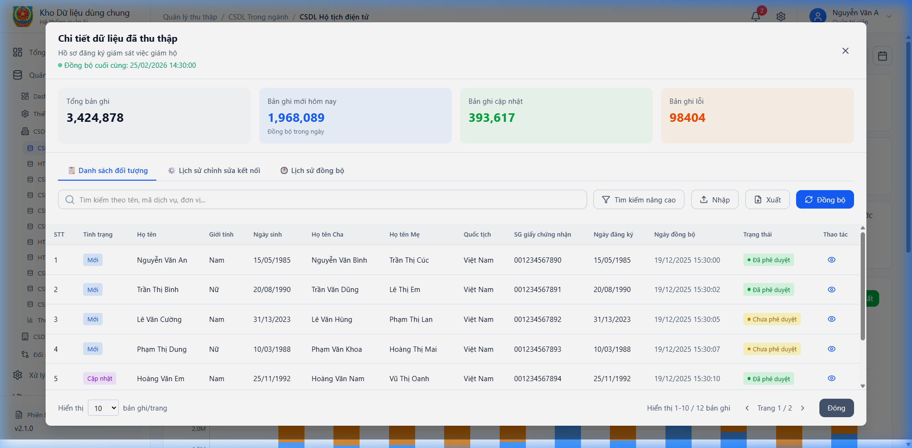

*Hình 64  Màn danh sách dữ liệu Hồ sơ đăng ký giám sát việc giám hộ*

##### 4.2.3.1.12.1.1 Mô tả thông tin trên màn hình
| **STT** | **Tên trường thông tin** | **Kiểu dữ liệu** | **Bắt buộc** | **Mặc định** | **Mô tả** |
| --- | --- | --- | --- | --- | --- |
| 1 | Từ khóa tìm kiếm | Text | Không | | Nhập họ tên hoặc số hồ sơ để tìm kiếm. |
| 2 | Bảng danh sách | Table | Có | | Hiển thị danh sách hồ sơ: STT, Họ tên, Ngày sinh, Trạng thái... |

##### 4.2.3.1.12.1.2 Chức năng trên màn hình
| **STT** | **Tên chức năng** | **Định dạng** | **Mô tả** |
| --- | --- | --- | --- |
| 1 | Tìm kiếm | Button | Thực hiện lọc dữ liệu theo điều kiện nhập. |
| 2 | Xem chi tiết | Icon Eye | Mở popup xem chi tiết thông tin hồ sơ. |
| 3 | Đồng bộ | Button | Kích hoạt tiến trình đồng bộ dữ liệu. |

---

#### 4.2.3.1.12.2 Màn hình thông tin chi tiết Hồ sơ đăng ký giám sát việc giám hộ

Màn hình

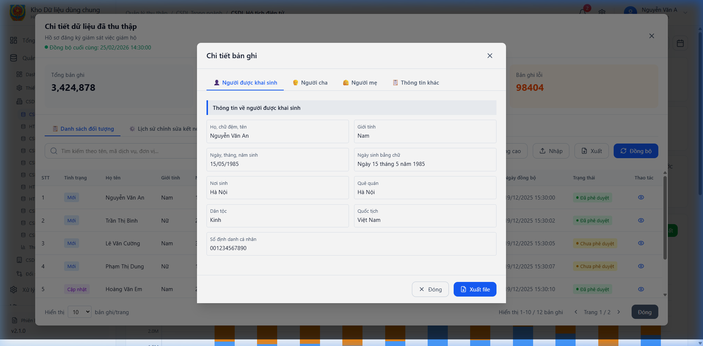

*Hình 65  Màn hình thông tin chi tiết Hồ sơ đăng ký giám sát việc giám hộ*

##### 4.2.3.1.12.2.1 Mô tả thông tin trên màn hình
| **STT** | **Tên trường thông tin** | **Kiểu dữ liệu** | **Bắt buộc** | **Mặc định** | **Mô tả** |
| --- | --- | --- | --- | --- | --- |
| 1 | Thông tin cá nhân | Section | Có | | Các trường: Họ tên, Ngày sinh, Giới tính... |
| 2 | Thông tin đăng ký | Section | Có | | Các trường: Số quyết định, Ngày đăng ký, Nơi đăng ký. |

##### 4.2.3.1.12.2.2 Chức năng trên màn hình
| **STT** | **Tên chức năng** | **Định dạng** | **Mô tả** |
| --- | --- | --- | --- |
| 1 | Đóng | Button | Đóng popup chi tiết, quay lại danh sách. |
| 2 | Xuất file | Button | Tải file chi tiết hồ sơ về máy. |

---

#### 4.2.3.1.12.3 Tab Lịch sử chỉnh sửa kết nối Hồ sơ đăng ký giám sát việc giám hộ

Màn hình

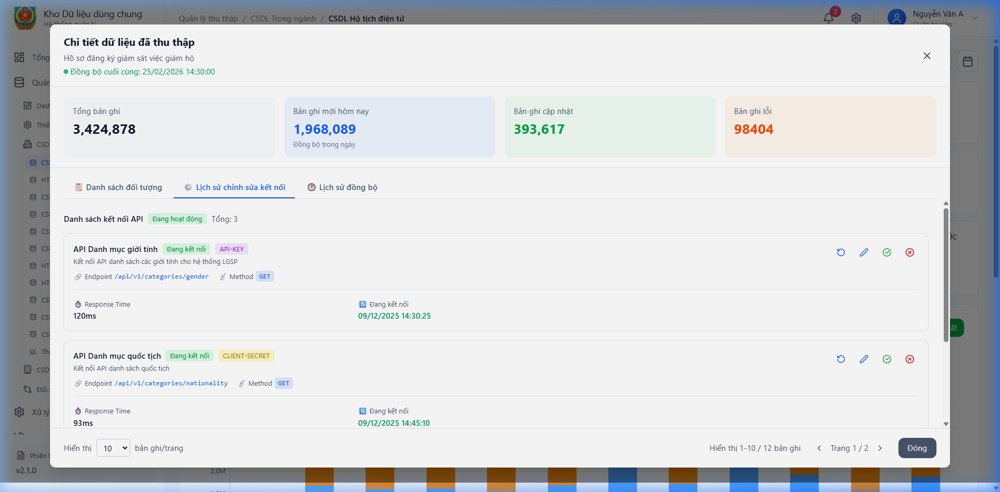

*Hình 66  Tab Lịch sử chỉnh sửa kết nối Hồ sơ đăng ký giám sát việc giám hộ*

##### 4.2.3.1.12.3.1 Mô tả thông tin trên màn hình
| **STT** | **Tên trường thông tin** | **Kiểu dữ liệu** | **Bắt buộc** | **Mặc định** | **Mô tả** |
| --- | --- | --- | --- | --- | --- |
| 1 | Bảng lịch sử | Table | Có | | Ghi lại các lần thay đổi thông tin hoặc trạng thái đồng bộ. |

##### 4.2.3.1.12.3.2 Chức năng trên màn hình
| **STT** | **Tên chức năng** | **Định dạng** | **Mô tả** |
| --- | --- | --- | --- |
| 1 | Xem log | Link | Nhấn để xem chi tiết nội dung thay đổi. |

---

#### 4.2.3.1.12.4 Tab Lịch sử đồng bộ Hồ sơ đăng ký giám sát việc giám hộ

Màn hình

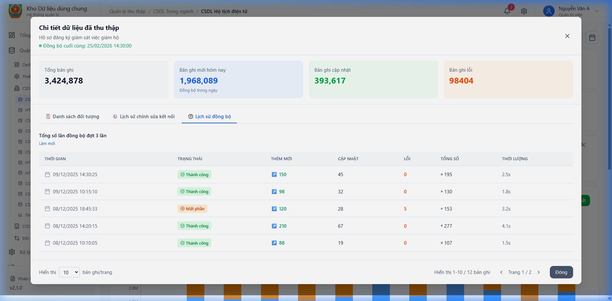

*Hình 67  Tab Lịch sử đồng bộ Hồ sơ đăng ký giám sát việc giám hộ*

##### 4.2.3.1.12.4.1 Mô tả thông tin trên màn hình
| **STT** | **Tên trường thông tin** | **Kiểu dữ liệu** | **Bắt buộc** | **Mặc định** | **Mô tả** |
| --- | --- | --- | --- | --- | --- |
| 1 | Bảng lịch sử | Table | Có | | Ghi lại các lần thay đổi thông tin hoặc trạng thái đồng bộ. |

##### 4.2.3.1.12.4.2 Chức năng trên màn hình
| **STT** | **Tên chức năng** | **Định dạng** | **Mô tả** |
| --- | --- | --- | --- |
| 1 | Xem log | Link | Nhấn để xem chi tiết nội dung thay đổi. |

---

### 4.2.3.1.13 PM02.QLTT.TN.LH  Hồ sơ ly hôn/hủy kết hôn ở nước ngoài

#### 4.2.3.1.13.1 Màn danh sách dữ liệu Hồ sơ ly hôn/hủy kết hôn ở nước ngoài

Màn hình

*Hình 68  Màn danh sách dữ liệu Hồ sơ ly hôn/hủy kết hôn ở nước ngoài*

##### 4.2.3.1.13.1.1 Mô tả thông tin trên màn hình
| **STT** | **Tên trường thông tin** | **Kiểu dữ liệu** | **Bắt buộc** | **Mặc định** | **Mô tả** |
| --- | --- | --- | --- | --- | --- |
| 1 | Từ khóa tìm kiếm | Text | Không | | Nhập họ tên hoặc số hồ sơ để tìm kiếm. |
| 2 | Bảng danh sách | Table | Có | | Hiển thị danh sách hồ sơ: STT, Họ tên, Ngày sinh, Trạng thái... |

##### 4.2.3.1.13.1.2 Chức năng trên màn hình
| **STT** | **Tên chức năng** | **Định dạng** | **Mô tả** |
| --- | --- | --- | --- |
| 1 | Tìm kiếm | Button | Thực hiện lọc dữ liệu theo điều kiện nhập. |
| 2 | Xem chi tiết | Icon Eye | Mở popup xem chi tiết thông tin hồ sơ. |
| 3 | Đồng bộ | Button | Kích hoạt tiến trình đồng bộ dữ liệu. |

---

#### 4.2.3.1.13.2 Màn hình thông tin chi tiết Hồ sơ ly hôn/hủy kết hôn ở nước ngoài

Màn hình

*Hình 69  Màn hình thông tin chi tiết Hồ sơ ly hôn/hủy kết hôn ở nước ngoài*

##### 4.2.3.1.13.2.1 Mô tả thông tin trên màn hình
| **STT** | **Tên trường thông tin** | **Kiểu dữ liệu** | **Bắt buộc** | **Mặc định** | **Mô tả** |
| --- | --- | --- | --- | --- | --- |
| 1 | Thông tin cá nhân | Section | Có | | Các trường: Họ tên, Ngày sinh, Giới tính... |
| 2 | Thông tin đăng ký | Section | Có | | Các trường: Số quyết định, Ngày đăng ký, Nơi đăng ký. |

##### 4.2.3.1.13.2.2 Chức năng trên màn hình
| **STT** | **Tên chức năng** | **Định dạng** | **Mô tả** |
| --- | --- | --- | --- |
| 1 | Đóng | Button | Đóng popup chi tiết, quay lại danh sách. |
| 2 | Xuất file | Button | Tải file chi tiết hồ sơ về máy. |

---

#### 4.2.3.1.13.3 Tab Lịch sử chỉnh sửa kết nối Hồ sơ ly hôn/hủy kết hôn ở nước ngoài

Màn hình

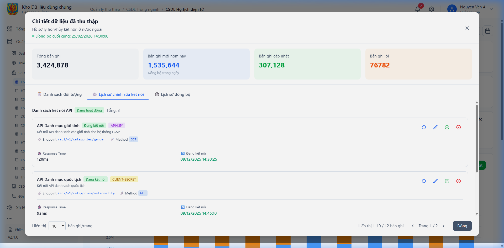

*Hình 70  Tab Lịch sử chỉnh sửa kết nối Hồ sơ ly hôn/hủy kết hôn ở nước ngoài*

##### 4.2.3.1.13.3.1 Mô tả thông tin trên màn hình
| **STT** | **Tên trường thông tin** | **Kiểu dữ liệu** | **Bắt buộc** | **Mặc định** | **Mô tả** |
| --- | --- | --- | --- | --- | --- |
| 1 | Bảng lịch sử | Table | Có | | Ghi lại các lần thay đổi thông tin hoặc trạng thái đồng bộ. |

##### 4.2.3.1.13.3.2 Chức năng trên màn hình
| **STT** | **Tên chức năng** | **Định dạng** | **Mô tả** |
| --- | --- | --- | --- |
| 1 | Xem log | Link | Nhấn để xem chi tiết nội dung thay đổi. |

---

#### 4.2.3.1.13.4 Tab Lịch sử đồng bộ Hồ sơ ly hôn/hủy kết hôn ở nước ngoài

Màn hình

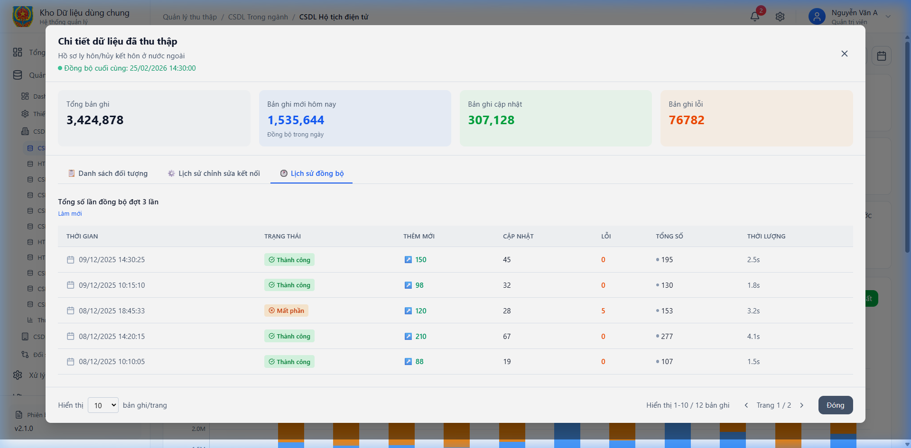

*Hình 71  Tab Lịch sử đồng bộ Hồ sơ ly hôn/hủy kết hôn ở nước ngoài*

##### 4.2.3.1.13.4.1 Mô tả thông tin trên màn hình
| **STT** | **Tên trường thông tin** | **Kiểu dữ liệu** | **Bắt buộc** | **Mặc định** | **Mô tả** |
| --- | --- | --- | --- | --- | --- |
| 1 | Bảng lịch sử | Table | Có | | Ghi lại các lần thay đổi thông tin hoặc trạng thái đồng bộ. |

##### 4.2.3.1.13.4.2 Chức năng trên màn hình
| **STT** | **Tên chức năng** | **Định dạng** | **Mô tả** |
| --- | --- | --- | --- |
| 1 | Xem log | Link | Nhấn để xem chi tiết nội dung thay đổi. |

---

