# 4.2.3. DC102.QLTT.TN – CSDL Trong ngành

## 4.2.3.2. Hệ thống quản lý hồ sơ quốc tịch

### 4.2.3.2.1 Dashboard Hệ thống quản lý hồ sơ quốc tịch

Màn hình

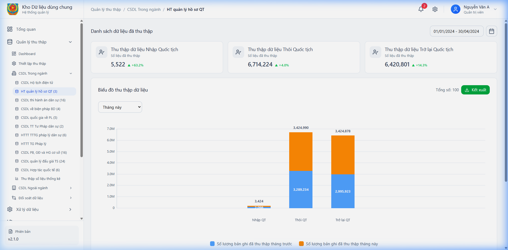

*Hình 2 – Màn hình Dashboard Hệ thống quản lý hồ sơ quốc tịch*

#### 4.2.3.2.1.1 Mô tả thông tin trên màn hình
| **STT** | **Tên trường thông tin** | **Kiểu dữ liệu** | **Bắt buộc** | **Mặc định** | **Mô tả** |
| --- | --- | --- | --- | --- | --- |
| 1 | Thẻ thống kê | Card/Number | | | Hiển thị các chỉ số thống kê tổng hợp của CSDL. |
| 2 | Biểu đồ xu hướng | Chart | | | Biểu đồ trực quan hóa tình hình thu thập dữ liệu. |

#### 4.2.3.2.1.2 Chức năng trên màn hình
| **STT** | **Tên chức năng** | **Định dạng** | **Mô tả** |
| --- | --- | --- | --- |
| 1 | Kết xuất | Button | Xuất báo cáo tổng hợp dưới dạng file. |
| 2 | Đồng bộ | Button | Kích hoạt tiến trình đồng bộ dữ liệu tổng thể. |

---

### 4.2.3.2.2 PM02.QLTT.TN.QT  Hệ thống quản lý hồ sơ quốc tịch

#### 4.2.3.2.2.1 DC1-QT-DB-01 Dashboard Thu thập quốc tịch

Màn hình

*Hình 72  Màn hình Dashboard Thu thập quốc tịch*

##### 4.2.3.2.2.1.1 Mô tả thông tin trên màn hình

| **STT** | **Tên trường thông tin** | **Kiểu dữ liệu** | **Bắt buộc** | **Mặc định** | **Mô tả** |
| --- | --- | --- | --- | --- | --- |
| 1 | Thống kê số liệu | Card | | | Các con số thống kê hồ sơ Nhập, Thôi, Trở lại QT. |
| 2 | Biểu đồ thu thập | Chart | | | Biểu đồ trực quan hóa dữ liệu theo thời gian. |

##### 4.2.3.2.2.1.2 Chức năng trên màn hình

| **STT** | **Tên chức năng** | **Định dạng** | **Mô tả** |
| --- | --- | --- | --- |
| 1 | Kết xuất | Button | Xuất dữ liệu dashboard ra file báo cáo. |
---

#### 4.2.3.2.2.2 Màn danh sách hồ sơ Nhập Quốc tịch

Màn hình

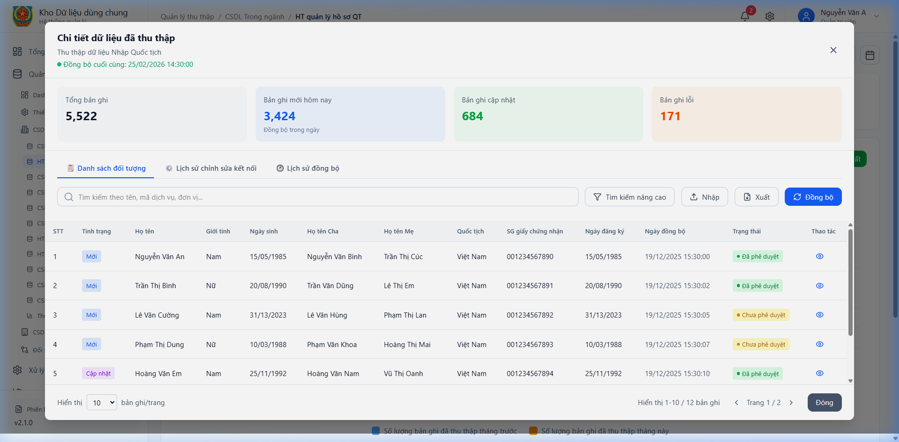

*Hình 73  Màn danh sách hồ sơ Nhập Quốc tịch*

##### 4.2.3.2.2.2.1 Mô tả thông tin trên màn hình
| **STT** | **Tên trường thông tin** | **Kiểu dữ liệu** | **Bắt buộc** | **Mặc định** | **Mô tả** |
| --- | --- | --- | --- | --- | --- |
| 1 | Từ khóa tìm kiếm | Text | Không | | Nhập họ tên hoặc số hồ sơ để tìm kiếm. |
| 2 | Bảng danh sách | Table | Có | | Hiển thị danh sách hồ sơ: STT, Họ tên, Ngày sinh, Trạng thái... |

##### 4.2.3.2.2.2.2 Chức năng trên màn hình
| **STT** | **Tên chức năng** | **Định dạng** | **Mô tả** |
| --- | --- | --- | --- |
| 1 | Tìm kiếm | Button | Thực hiện lọc dữ liệu theo điều kiện nhập. |
| 2 | Xem chi tiết | Icon Eye | Mở popup xem chi tiết thông tin hồ sơ. |
| 3 | Đồng bộ | Button | Kích hoạt tiến trình đồng bộ dữ liệu. |

---

#### 4.2.3.2.2.3 Màn hình chi tiết hồ sơ Nhập Quốc tịch

Màn hình

*Hình 74  Màn hình chi tiết hồ sơ Nhập Quốc tịch*

##### 4.2.3.2.2.3.1 Mô tả thông tin trên màn hình
| **STT** | **Tên trường thông tin** | **Kiểu dữ liệu** | **Bắt buộc** | **Mặc định** | **Mô tả** |
| --- | --- | --- | --- | --- | --- |
| 1 | Thông tin cá nhân | Section | Có | | Các trường: Họ tên, Ngày sinh, Giới tính... |
| 2 | Thông tin đăng ký | Section | Có | | Các trường: Số quyết định, Ngày đăng ký, Nơi đăng ký. |

##### 4.2.3.2.2.3.2 Chức năng trên màn hình
| **STT** | **Tên chức năng** | **Định dạng** | **Mô tả** |
| --- | --- | --- | --- |
| 1 | Đóng | Button | Đóng popup chi tiết, quay lại danh sách. |
| 2 | Xuất file | Button | Tải file chi tiết hồ sơ về máy. |

---

#### 4.2.3.2.2.4 Tab Lịch sử kết nối Nhập Quốc tịch

Màn hình

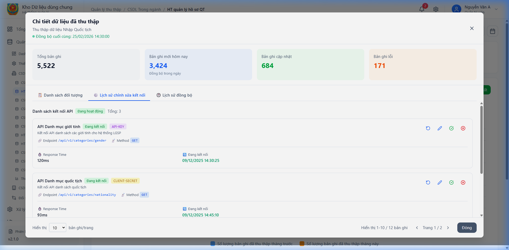

*Hình 75  Tab Lịch sử kết nối Nhập Quốc tịch*

##### 4.2.3.2.2.4.1 Mô tả thông tin trên màn hình
| **STT** | **Tên trường thông tin** | **Kiểu dữ liệu** | **Bắt buộc** | **Mặc định** | **Mô tả** |
| --- | --- | --- | --- | --- | --- |
| 1 | Bảng lịch sử | Table | Có | | Ghi lại các lần thay đổi thông tin hoặc trạng thái đồng bộ. |

##### 4.2.3.2.2.4.2 Chức năng trên màn hình
| **STT** | **Tên chức năng** | **Định dạng** | **Mô tả** |
| --- | --- | --- | --- |
| 1 | Xem log | Link | Nhấn để xem chi tiết nội dung thay đổi. |

---

#### 4.2.3.2.2.5 Tab Lịch sử đồng bộ Nhập Quốc tịch

Màn hình

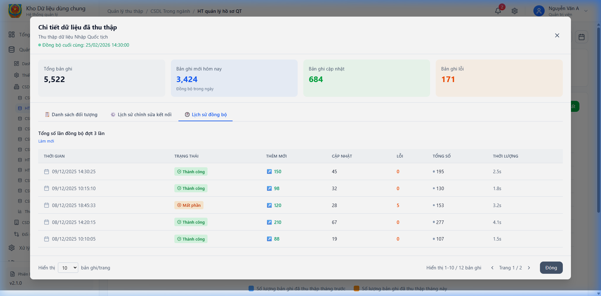

*Hình 76  Tab Lịch sử đồng bộ Nhập Quốc tịch*

##### 4.2.3.2.2.5.1 Mô tả thông tin trên màn hình
| **STT** | **Tên trường thông tin** | **Kiểu dữ liệu** | **Bắt buộc** | **Mặc định** | **Mô tả** |
| --- | --- | --- | --- | --- | --- |
| 1 | Bảng lịch sử | Table | Có | | Ghi lại các lần thay đổi thông tin hoặc trạng thái đồng bộ. |

##### 4.2.3.2.2.5.2 Chức năng trên màn hình
| **STT** | **Tên chức năng** | **Định dạng** | **Mô tả** |
| --- | --- | --- | --- |
| 1 | Xem log | Link | Nhấn để xem chi tiết nội dung thay đổi. |

---

#### 4.2.3.2.2.6 Màn danh sách hồ sơ Thôi Quốc tịch

Màn hình

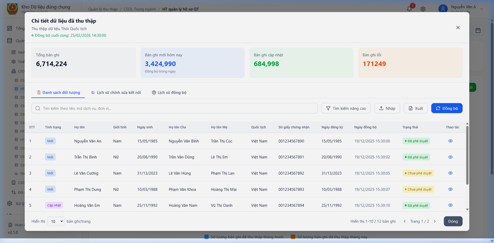

*Hình 77  Màn danh sách hồ sơ Thôi Quốc tịch*

##### 4.2.3.2.2.6.1 Mô tả thông tin trên màn hình
| **STT** | **Tên trường thông tin** | **Kiểu dữ liệu** | **Bắt buộc** | **Mặc định** | **Mô tả** |
| --- | --- | --- | --- | --- | --- |
| 1 | Từ khóa tìm kiếm | Text | Không | | Nhập họ tên hoặc số hồ sơ để tìm kiếm. |
| 2 | Bảng danh sách | Table | Có | | Hiển thị danh sách hồ sơ: STT, Họ tên, Ngày sinh, Trạng thái... |

##### 4.2.3.2.2.6.2 Chức năng trên màn hình
| **STT** | **Tên chức năng** | **Định dạng** | **Mô tả** |
| --- | --- | --- | --- |
| 1 | Tìm kiếm | Button | Thực hiện lọc dữ liệu theo điều kiện nhập. |
| 2 | Xem chi tiết | Icon Eye | Mở popup xem chi tiết thông tin hồ sơ. |
| 3 | Đồng bộ | Button | Kích hoạt tiến trình đồng bộ dữ liệu. |

---

#### 4.2.3.2.2.7 Màn hình chi tiết hồ sơ Thôi Quốc tịch

Màn hình

*Hình 78  Màn hình chi tiết hồ sơ Thôi Quốc tịch*

##### 4.2.3.2.2.7.1 Mô tả thông tin trên màn hình
| **STT** | **Tên trường thông tin** | **Kiểu dữ liệu** | **Bắt buộc** | **Mặc định** | **Mô tả** |
| --- | --- | --- | --- | --- | --- |
| 1 | Thông tin cá nhân | Section | Có | | Các trường: Họ tên, Ngày sinh, Giới tính... |
| 2 | Thông tin đăng ký | Section | Có | | Các trường: Số quyết định, Ngày đăng ký, Nơi đăng ký. |

##### 4.2.3.2.2.7.2 Chức năng trên màn hình
| **STT** | **Tên chức năng** | **Định dạng** | **Mô tả** |
| --- | --- | --- | --- |
| 1 | Đóng | Button | Đóng popup chi tiết, quay lại danh sách. |
| 2 | Xuất file | Button | Tải file chi tiết hồ sơ về máy. |

---

#### 4.2.3.2.2.8 Tab Lịch sử kết nối Thôi Quốc tịch

Màn hình

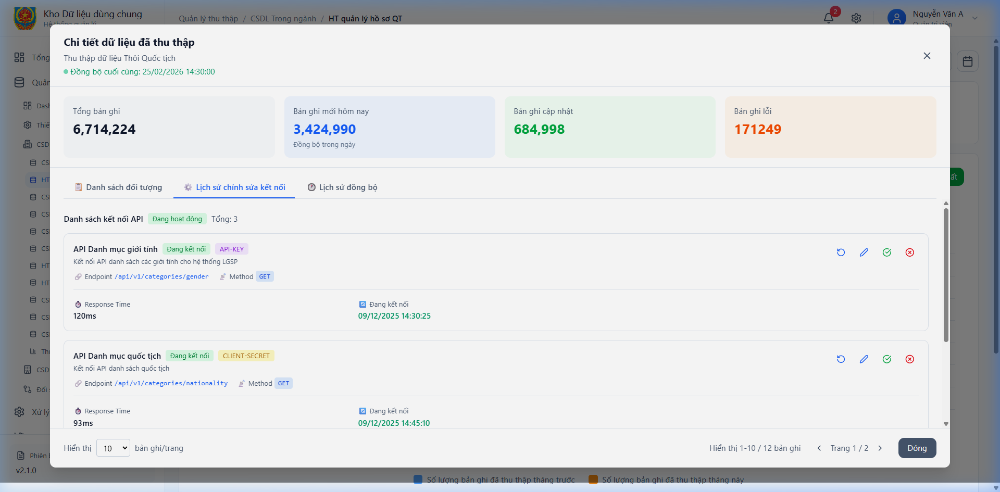

*Hình 79  Tab Lịch sử kết nối Thôi Quốc tịch*

##### 4.2.3.2.2.8.1 Mô tả thông tin trên màn hình
| **STT** | **Tên trường thông tin** | **Kiểu dữ liệu** | **Bắt buộc** | **Mặc định** | **Mô tả** |
| --- | --- | --- | --- | --- | --- |
| 1 | Bảng lịch sử | Table | Có | | Ghi lại các lần thay đổi thông tin hoặc trạng thái đồng bộ. |

##### 4.2.3.2.2.8.2 Chức năng trên màn hình
| **STT** | **Tên chức năng** | **Định dạng** | **Mô tả** |
| --- | --- | --- | --- |
| 1 | Xem log | Link | Nhấn để xem chi tiết nội dung thay đổi. |

---

#### 4.2.3.2.2.9 Tab Lịch sử đồng bộ Thôi Quốc tịch

Màn hình

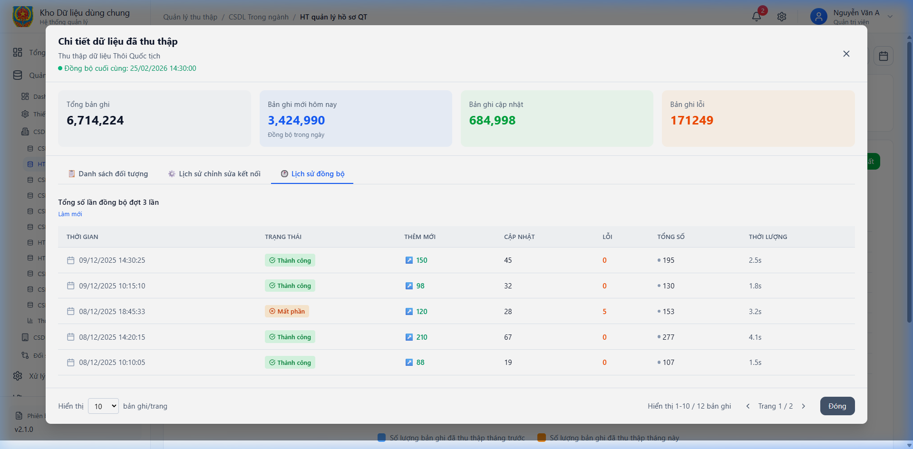

*Hình 80  Tab Lịch sử đồng bộ Thôi Quốc tịch*

##### 4.2.3.2.2.9.1 Mô tả thông tin trên màn hình
| **STT** | **Tên trường thông tin** | **Kiểu dữ liệu** | **Bắt buộc** | **Mặc định** | **Mô tả** |
| --- | --- | --- | --- | --- | --- |
| 1 | Bảng lịch sử | Table | Có | | Ghi lại các lần thay đổi thông tin hoặc trạng thái đồng bộ. |

##### 4.2.3.2.2.9.2 Chức năng trên màn hình
| **STT** | **Tên chức năng** | **Định dạng** | **Mô tả** |
| --- | --- | --- | --- |
| 1 | Xem log | Link | Nhấn để xem chi tiết nội dung thay đổi. |

---

#### 4.2.3.2.2.10 Màn danh sách hồ sơ Trở lại Quốc tịch

Màn hình

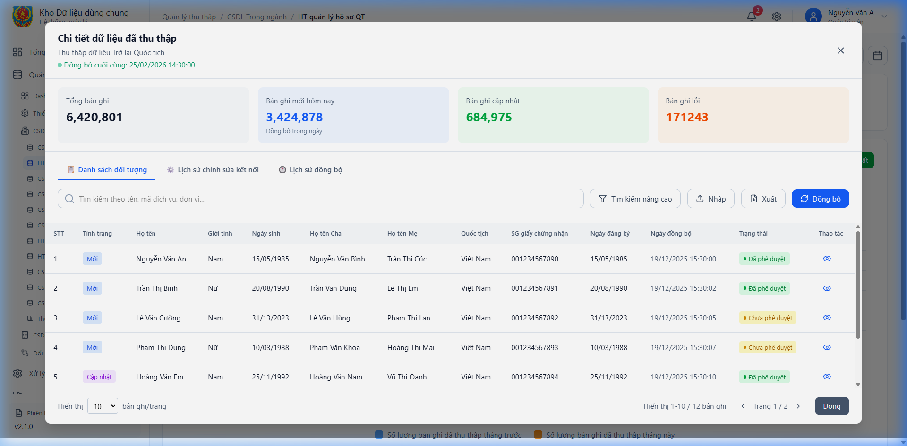

*Hình 81  Màn danh sách hồ sơ Trở lại Quốc tịch*

##### 4.2.3.2.2.10.1 Mô tả thông tin trên màn hình
| **STT** | **Tên trường thông tin** | **Kiểu dữ liệu** | **Bắt buộc** | **Mặc định** | **Mô tả** |
| --- | --- | --- | --- | --- | --- |
| 1 | Từ khóa tìm kiếm | Text | Không | | Nhập họ tên hoặc số hồ sơ để tìm kiếm. |
| 2 | Bảng danh sách | Table | Có | | Hiển thị danh sách hồ sơ: STT, Họ tên, Ngày sinh, Trạng thái... |

##### 4.2.3.2.2.10.2 Chức năng trên màn hình
| **STT** | **Tên chức năng** | **Định dạng** | **Mô tả** |
| --- | --- | --- | --- |
| 1 | Tìm kiếm | Button | Thực hiện lọc dữ liệu theo điều kiện nhập. |
| 2 | Xem chi tiết | Icon Eye | Mở popup xem chi tiết thông tin hồ sơ. |
| 3 | Đồng bộ | Button | Kích hoạt tiến trình đồng bộ dữ liệu. |

---

#### 4.2.3.2.2.11 Màn hình chi tiết hồ sơ Trở lại Quốc tịch

Màn hình

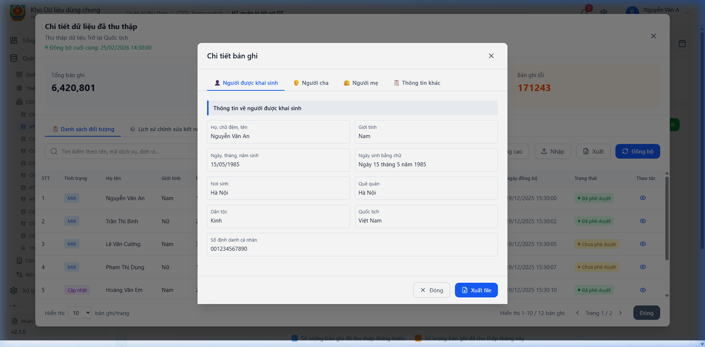

*Hình 82  Màn hình chi tiết hồ sơ Trở lại Quốc tịch*

##### 4.2.3.2.2.11.1 Mô tả thông tin trên màn hình
| **STT** | **Tên trường thông tin** | **Kiểu dữ liệu** | **Bắt buộc** | **Mặc định** | **Mô tả** |
| --- | --- | --- | --- | --- | --- |
| 1 | Thông tin cá nhân | Section | Có | | Các trường: Họ tên, Ngày sinh, Giới tính... |
| 2 | Thông tin đăng ký | Section | Có | | Các trường: Số quyết định, Ngày đăng ký, Nơi đăng ký. |

##### 4.2.3.2.2.11.2 Chức năng trên màn hình
| **STT** | **Tên chức năng** | **Định dạng** | **Mô tả** |
| --- | --- | --- | --- |
| 1 | Đóng | Button | Đóng popup chi tiết, quay lại danh sách. |
| 2 | Xuất file | Button | Tải file chi tiết hồ sơ về máy. |

---

#### 4.2.3.2.2.12 Tab Lịch sử kết nối Trở lại Quốc tịch

Màn hình

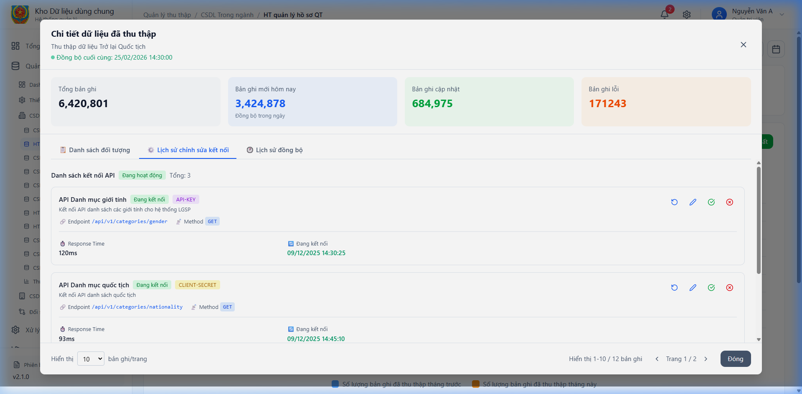

*Hình 83  Tab Lịch sử kết nối Trở lại Quốc tịch*

##### 4.2.3.2.2.12.1 Mô tả thông tin trên màn hình
| **STT** | **Tên trường thông tin** | **Kiểu dữ liệu** | **Bắt buộc** | **Mặc định** | **Mô tả** |
| --- | --- | --- | --- | --- | --- |
| 1 | Bảng lịch sử | Table | Có | | Ghi lại các lần thay đổi thông tin hoặc trạng thái đồng bộ. |

##### 4.2.3.2.2.12.2 Chức năng trên màn hình
| **STT** | **Tên chức năng** | **Định dạng** | **Mô tả** |
| --- | --- | --- | --- |
| 1 | Xem log | Link | Nhấn để xem chi tiết nội dung thay đổi. |

---

#### 4.2.3.2.2.13 Tab Lịch sử đồng bộ Trở lại Quốc tịch

Màn hình

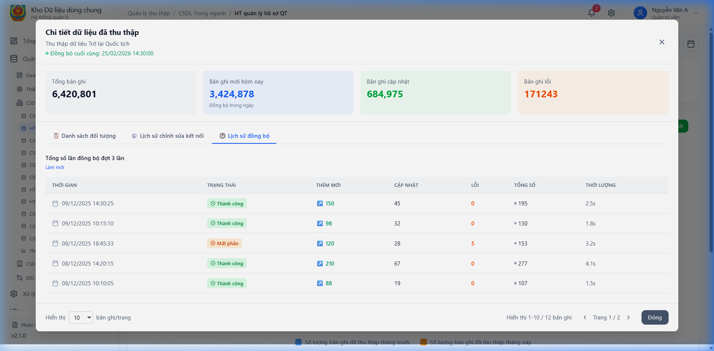

*Hình 84  Tab Lịch sử đồng bộ Trở lại Quốc tịch*

##### 4.2.3.2.2.13.1 Mô tả thông tin trên màn hình
| **STT** | **Tên trường thông tin** | **Kiểu dữ liệu** | **Bắt buộc** | **Mặc định** | **Mô tả** |
| --- | --- | --- | --- | --- | --- |
| 1 | Bảng lịch sử | Table | Có | | Ghi lại các lần thay đổi thông tin hoặc trạng thái đồng bộ. |

##### 4.2.3.2.2.13.2 Chức năng trên màn hình
| **STT** | **Tên chức năng** | **Định dạng** | **Mô tả** |
| --- | --- | --- | --- |
| 1 | Xem log | Link | Nhấn để xem chi tiết nội dung thay đổi. |

---

