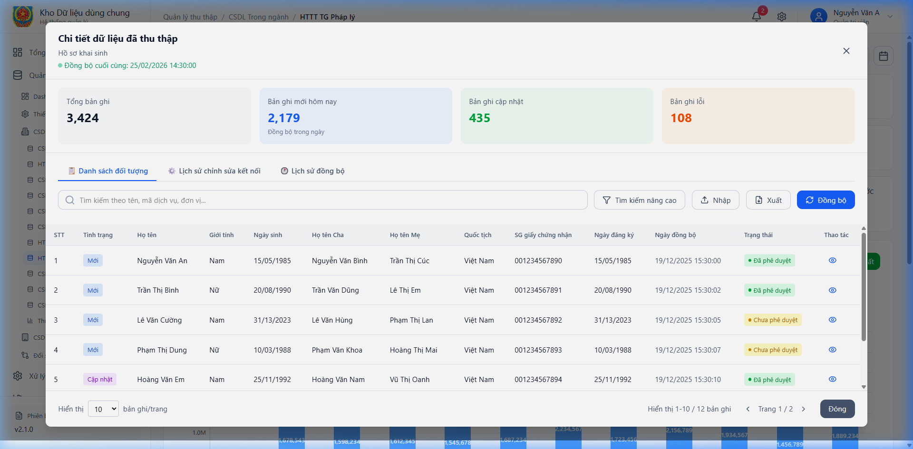
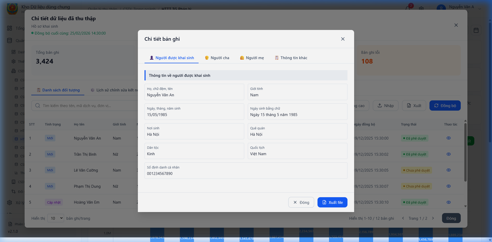
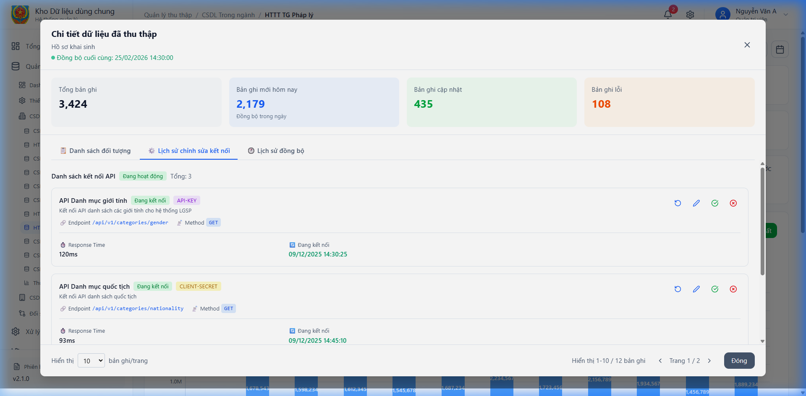
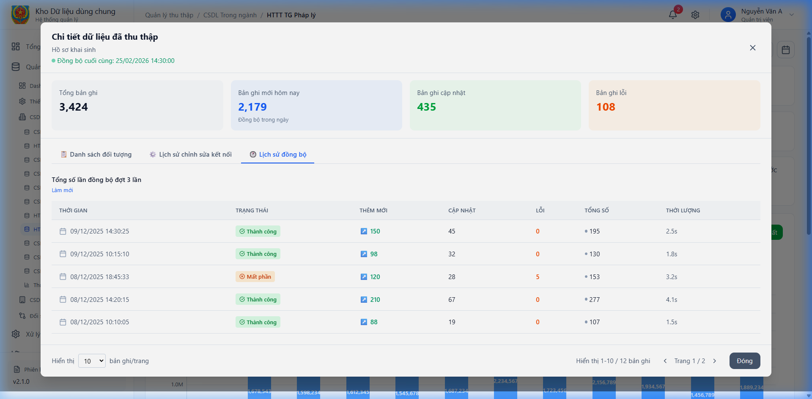

# 4.2.3. DC102.QLTT.TN  CSDL Trong ngành

## 4.2.3.19. PM02.QLTT.TN.TGPL – HTTT Trợ giúp pháp lý

### 4.2.3.19.1 Dashboard HTTT Trợ giúp pháp lý

Màn hình

*Hình 112 – Màn hình Dashboard HTTT Trợ giúp pháp lý*

#### 4.2.3.19.1.1 Mô tả thông tin trên màn hình
| **STT** | **Tên trường thông tin** | **Kiểu dữ liệu** | **Bắt buộc** | **Mặc định** | **Mô tả** |
| --- | --- | --- | --- | --- | --- |
| 1 | Thống kê số liệu | Card | | | Các con số thống kê hồ sơ HTTT Trợ giúp pháp lý. |
| 2 | Biểu đồ thu thập | Chart | | | Biểu đồ trực quan hóa dữ liệu theo thời gian. |

#### 4.2.3.19.1.2 Chức năng trên màn hình
| **STT** | **Tên chức năng** | **Định dạng** | **Mô tả** |
| --- | --- | --- | --- |
| 1 | Kết xuất | Button | Xuất dữ liệu dashboard ra file báo cáo. |
---

### 4.2.3.19.2 Màn danh sách dữ liệu HTTT Trợ giúp pháp lý

Màn hình

*Hình 113 – Màn danh sách dữ liệu HTTT Trợ giúp pháp lý*

#### 4.2.3.19.2.1 Mô tả thông tin trên màn hình
| **STT** | **Tên trường thông tin** | **Kiểu dữ liệu** | **Bắt buộc** | **Mặc định** | **Mô tả** |
| --- | --- | --- | --- | --- | --- |
| 1 | Từ khóa tìm kiếm | Text | Không | | Nhập từ khóa để tìm kiếm bản ghi. |
| 2 | Bảng danh sách | Table | Có | | Hiển thị danh sách hồ sơ: STT, Mã hồ sơ, Trạng thái... |

#### 4.2.3.19.2.2 Chức năng trên màn hình
| **STT** | **Tên chức năng** | **Định dạng** | **Mô tả** |
| --- | --- | --- | --- |
| 1 | Tìm kiếm | Button | Thực hiện lọc dữ liệu theo điều kiện nhập. |
| 2 | Xem chi tiết | Icon Eye | Mở popup xem chi tiết thông tin hồ sơ. |
---

### 4.2.3.19.3 Màn hình thông tin chi tiết HTTT Trợ giúp pháp lý

Màn hình

*Hình 114 – Màn hình thông tin chi tiết HTTT Trợ giúp pháp lý*

#### 4.2.3.19.3.1 Mô tả thông tin trên màn hình
| **STT** | **Tên trường thông tin** | **Kiểu dữ liệu** | **Bắt buộc** | **Mặc định** | **Mô tả** |
| --- | --- | --- | --- | --- | --- |
| 1 | Thông tin hồ sơ | Section | Có | | Các trường thông tin chi tiết của bản ghi. |

#### 4.2.3.19.3.2 Chức năng trên màn hình
| **STT** | **Tên chức năng** | **Định dạng** | **Mô tả** |
| --- | --- | --- | --- |
| 1 | Đóng | Button | Đóng popup chi tiết, quay lại danh sách. |
---

### 4.2.3.19.4 Tab Lịch sử chỉnh sửa kết nối HTTT Trợ giúp pháp lý

Màn hình

*Hình 115 – Tab Lịch sử chỉnh sửa kết nối HTTT Trợ giúp pháp lý*

#### 4.2.3.19.4.1 Mô tả thông tin trên màn hình
| **STT** | **Tên trường thông tin** | **Kiểu dữ liệu** | **Bắt buộc** | **Mặc định** | **Mô tả** |
| --- | --- | --- | --- | --- | --- |
| 1 | Bảng lịch sử | Table | Có | | Ghi lại các lần thay đổi thông tin kết nối. |

#### 4.2.3.19.4.2 Chức năng trên màn hình
| **STT** | **Tên chức năng** | **Định dạng** | **Mô tả** |
| --- | --- | --- | --- |
| 1 | Xem log | Link | Nhấn để xem chi tiết nội dung thay đổi. |
---

### 4.2.3.19.5 Tab Lịch sử đồng bộ HTTT Trợ giúp pháp lý

Màn hình

*Hình 116 – Tab Lịch sử đồng bộ HTTT Trợ giúp pháp lý*

#### 4.2.3.19.5.1 Mô tả thông tin trên màn hình
| **STT** | **Tên trường thông tin** | **Kiểu dữ liệu** | **Bắt buộc** | **Mặc định** | **Mô tả** |
| --- | --- | --- | --- | --- | --- |
| 1 | Bảng lịch sử | Table | Có | | Ghi lại các lần thay đổi trạng thái đồng bộ. |

#### 4.2.3.19.5.2 Chức năng trên màn hình
| **STT** | **Tên chức năng** | **Định dạng** | **Mô tả** |
| --- | --- | --- | --- |
| 1 | Xem log | Link | Nhấn để xem chi tiết nội dung thay đổi. |