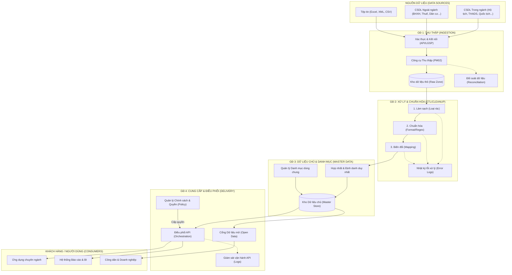

# Tổng quan Luồng dữ liệu (Data Flow) Toàn diện - Kho DLDC

Tài liệu này cung cấp cái nhìn chi tiết nhất về dòng chảy dữ liệu xuyên suốt toàn bộ các hệ thống thành phần của Kho DLDC.

## 1. Sơ đồ Luồng dữ liệu Chi tiết (Master Data Flow)

## 2. Mô tả chi tiết các giai đoạn

### 2.1. Giai đoạn 1: Thu thập (Module PM02)
- **Cơ chế**: Sử dụng các Endpoint API (REST/SOAP) hoặc trục liên thông LGSP để lấy dữ liệu.
- **Đối soát**: Sau khi thu thập, hệ thống thực hiện đối soát tự động giữa "Bản ghi nguồn" và "Bản ghi kho DLDC" để đảm bảo không mất mát dữ liệu.
- **Trạng thái**: Dữ liệu ở giai đoạn này được coi là "Raw" (Thô).

### 2.2. Giai đoạn 2: Xử lý dữ liệu (Module PM04)
- **Làm sạch**: Loại bỏ các bản ghi trùng lặp thô, xử lý giá trị rỗng (Null/Empty).
- **Chuẩn hóa**: Kiểm tra định dạng (Regex) cho CCCD, Số điện thoại, Email. Chuẩn hóa ngày tháng về định dạng ISO.
- **Biến đổi**: Áp dụng các quy tắc Mapping để chuyển đổi dữ liệu từ cấu trúc nguồn sang cấu trúc chuẩn của Kho DLDC.
- **Xử lý lỗi**: Các bản ghi không vượt qua bộ lọc sẽ đẩy vào "Danh sách lỗi" để phản hồi lại hệ thống nguồn hoặc chỉnh sửa thủ công.

### 2.3. Giai đoạn 3: Quản trị Dữ liệu chủ (Module PM05)
- **Định danh**: Áp dụng quy tắc tạo mã định danh duy nhất (Unique Identifier).
- **Hợp nhất (Merge)**: Sử dụng các chiến lược (Mới nhất, Ưu tiên nguồn) để hợp nhất thông tin từ nhiều nguồn về một thực thể duy nhất (ví dụ: gộp thông tin một công dân từ CSDL Hộ tịch và CSDL Bảo hiểm).
- **Phê duyệt**: Mọi thay đổi quan trọng trong Dữ liệu chủ phải được cán bộ quản lý phê duyệt trước khi lưu vào kho chính thức.

### 2.4. Giai đoạn 4: Cung cấp & Điều phối (Module PM06 & PM08)
- **Cấp quyền (Provisioning)**: Thiết lập gói dữ liệu và giới hạn bản ghi (Rate Limit) cho từng tổ chức/đơn vị.
- **Điều phối (Orchestration)**: 
    - **API Chủ động**: Kho DLDC đẩy dữ liệu ra các hệ thống đích.
    - **API Thụ động**: Cổng dịch vụ công hoặc đơn vị ngoài gọi vào lấy dữ liệu.
- **Giám sát**: Ghi nhật ký chi tiết từng lượt gọi (Time, IP, Payload, Status) để đảm bảo an toàn thông tin.

## 3. Quản lý Vòng đời Dòng dữ liệu (Data Lifecycle)

| Thành phần | Chu kỳ | Kiểm soát chất lượng |
| :--- | :--- | :--- |
| **Dữ liệu Danh mục** | Theo phiên bản | Trạng thái: Nháp -> Chờ duyệt -> Đã công bố. |
| **Dữ liệu Nghiệp vụ** | Hàng ngày/Real-time | Đối soát (Reconciliation) 3 lớp: Nguồn - Kho - Đích. |
| **Dữ liệu Nhật ký** | Tức thời | Ghi lại mọi thao tác Thêm/Sửa/Xóa của người dùng (Audit Trail). |
