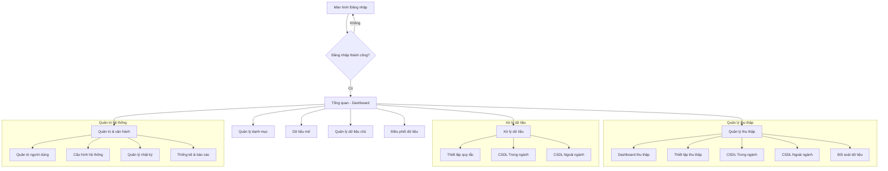
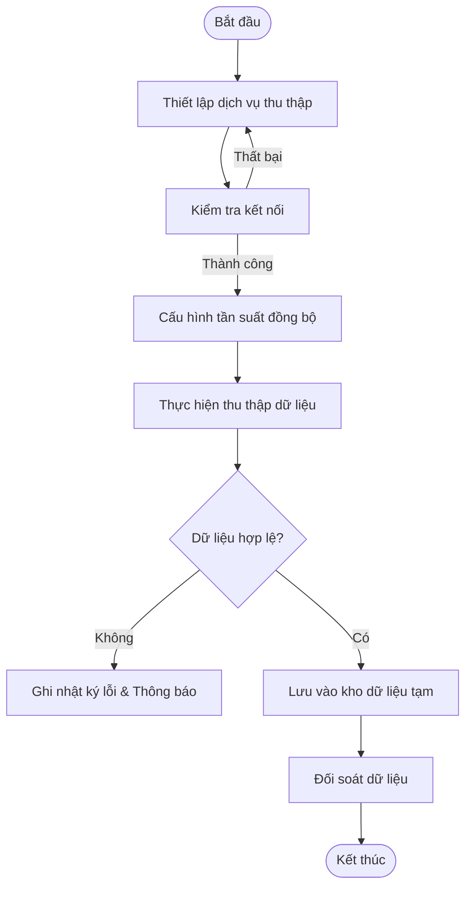
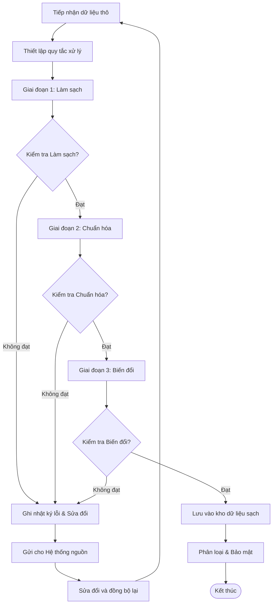
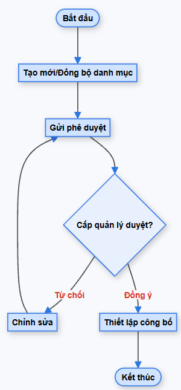
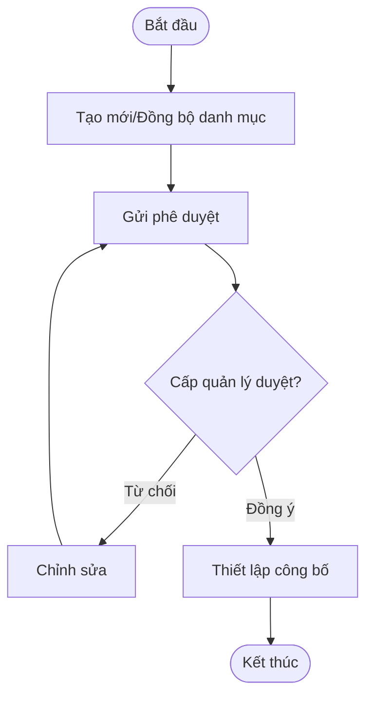
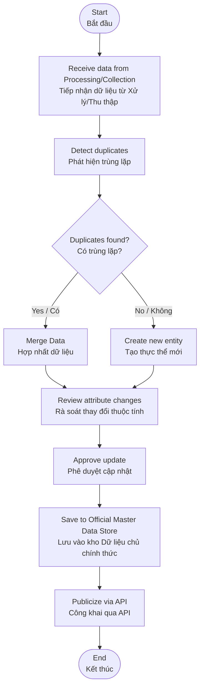

# TỔNG HỢP CÁC LUỒNG MÀN HÌNH (SCREEN FLOWS)

Tài liệu này tổng hợp toàn bộ các sơ đồ luồng màn hình của hệ thống Kho dữ liệu dùng chung (Kho DLDC), được trình bày dưới dạng sơ đồ chuyên nghiệp (Draw.io style) và mã nguồn Mermaid.

## 1. Luồng ứng dụng tổng quan

Sơ đồ thể hiện luồng điều hướng chính sau khi người dùng đăng nhập thành công:


### Mã Mermaid tham chiếu:


**Mô tả quy trình:**
1. **Đăng nhập:** Người dùng truy cập hệ thống qua màn hình đăng nhập.
2. **Dashboard:** Sau khi xác thực thành công, hệ thống chuyển hướng đến Dashboard tổng quan.
3. **Điều hướng:** Từ Dashboard, người dùng có thể truy cập nhanh vào 7 phân hệ chính của hệ thống Kho DLDC.

---

## 2. Luồng theo từng chức năng (Menu)

### 2.1. Quản lý thu thập (Data Collection)
Sơ đồ quy trình thiết lập và thực hiện thu thập dữ liệu:


#### Mã Mermaid tham chiếu:


**Mô tả quy trình:**
1. **Thiết lập:** Khai báo nguồn dữ liệu và thực hiện kiểm tra kết nối kỹ thuật.
2. **Cấu hình:** Thiết lập lịch trình và tần suất đồng bộ dữ liệu tự động.
3. **Thu thập:** Hệ thống thực hiện quét và lấy dữ liệu từ nguồn về kho tạm.
4. **Kiểm tra & Đối soát:** Dữ liệu được kiểm tra tính hợp lệ và thực hiện đối soát số lượng trước khi kết thúc luồng.

### 2.2. Xử lý dữ liệu (Data Processing)
Sơ đồ quy trình làm sạch, chuẩn hóa và biến đổi dữ liệu:


#### Mã Mermaid tham chiếu:


**Mô tả quy trình:**
1. **Tiếp nhận:** Dữ liệu thô từ kho tạm được đưa vào quy trình xử lý theo các quy tắc thiết lập sẵn.
2. **Xử lý đa tầng có kiểm soát:** Dữ liệu trải qua 3 giai đoạn (Làm sạch, Chuẩn hóa, Biến đổi). **Điểm quan trọng:** Sau mỗi giai đoạn, hệ thống thực hiện kiểm tra (Check) ngay lập tức. Chỉ khi đạt yêu cầu mới được chuyển sang giai đoạn tiếp theo.
3. **Xử lý lỗi:** Nếu bất kỳ bước kiểm tra nào không đạt, bản ghi lỗi sẽ được ghi nhật ký và gửi trở lại Hệ thống nguồn để tiến hành sửa đổi, đồng bộ lại từ bước tiếp nhận dữ liệu sơ khởi.
4. **Lưu trữ:** Dữ liệu sau khi vượt qua tất cả các tầng kiểm tra sẽ được phân loại bảo mật và lưu vào kho dữ liệu sạch chính thức.

### 2.3. Quản lý danh mục (Category Management)
Sơ đồ vòng đời của một danh mục:



#### Mã Mermaid tham chiếu:


**Mô tả quy trình:**
1. **Khởi tạo:** Tạo mới hoặc đồng bộ danh mục từ các nguồn dùng chung về hệ thống.
2. **Gửi phê duyệt:** Gửi dữ liệu danh mục lên cấp quản lý để xem xét.
3. **Phê duyệt & Chỉnh sửa:** Quản lý duyệt định nghĩa danh mục. Nếu bị suy xét từ chối, người tạo sẽ tiến hành chỉnh sửa và gửi phê duyệt lại.
4. **Công bố:** Sau khi được lãnh đạo đồng ý, quản trị viên thiết lập phạm vi và thực hiện công bố để các hệ thống khác sử dụng.

### 2.4. Dữ liệu mở (Open Data)
Sơ đồ quy trình công bố tập dữ liệu mở:


#### Mã Mermaid tham chiếu:


**Mô tả quy trình:**
1. **Cấu hình Dataset:** Thiết lập tập dữ liệu mới, chọn định dạng xuất (JSON, CSV, API) và tần suất cập nhật.
2. **Quy trình duyệt:** Gửi hồ sơ công bố dữ liệu mở lên cấp lãnh đạo phê duyệt.
3. **Thực hiện công bố:** Sau khi được duyệt, hệ thống cấu hình phạm vi truy cập và đẩy dữ liệu lên cổng dữ liệu mở.
4. **Giám sát:** Theo dõi hiệu quả khai thác qua các chỉ số thống kê lượt truy cập và tải về.

### 2.5. Quản lý dữ liệu chủ (Master Data)
Sơ đồ quy trình định danh và hợp nhất thực thể dữ liệu gốc:


#### Mã Mermaid tham chiếu:


**Mô tả quy trình:**
1. **Nhận diện:** Tiếp nhận dữ liệu sạch, thực hiện thuật toán so khớp để phát hiện các bản ghi trùng lặp.
2. **Xử lý trùng:** Nếu trùng, thực hiện hợp nhất (Merge) các thuộc tính tốt nhất; nếu không, tạo mã định danh duy nhất (Unique ID) mới.
3. **Cập nhật:** Rà soát và phê duyệt các thay đổi đối với thực thể dữ liệu gốc.
4. **Lưu trữ & Chia sẻ:** Lưu vào kho Master Data chính thức và cung cấp quyền truy xuất qua API cho toàn hệ thống.

### 2.6. Điều phối dữ liệu (Data Orchestration/API)
Sơ đồ quy trình quản trị vận hành các API cung cấp dữ liệu:


#### Mã Mermaid tham chiếu:
```mermaid
graph TD
    A([Bắt đầu]) --> B[Thiết lập API mới (Chủ động/Thụ động)]
    B --> C[Cấu hình Endpoint & Security]
    C --> D[Thiết lập Rate Limiting]
    D --> E[Kiểm tra API]
    E --> F{Kiểm tra đạt?}
    F -- Không --> C
    F -- Có --> G[Kích hoạt vận hành]
    G --> H[Giám sát & Nhật ký]
```

**Mô tả quy trình:**
1. **Thiết lập API:** Khai báo các Endpoint cung cấp dữ liệu (Push/Pull).
2. **Cấu hình bảo mật:** Thiết lập phương thức xác thực (Token, IP,...) và các giới hạn về băng thông (Rate Limiting).
3. **Kiểm thử:** Thực hiện test kết nối và hiệu năng API.
4. **Vận hành:** Kích hoạt API và thực hiện giám sát nhật ký truy cập theo thời gian thực.

### 2.7. Quản trị & vận hành (Admin Operations)
Sơ đồ các hoạt động quản trị hệ thống:


#### Mã Mermaid tham chiếu:


**Mô tả quy trình:**
1. **Đăng nhập quản trị:** Tài khoản có quyền Admin truy cập vào phân hệ quản trị.
2. **Lựa chọn tác vụ:** Thực hiện các chức năng cốt lõi như Phân quyền, Cấu hình thông số hệ thống, hoặc Giám sát nhật ký hoạt động.
3. **Kiểm soát (Audit):** Mọi thao tác thay đổi cấu hình hoặc người dùng đều được hệ thống ghi nhật ký Audit Log để phục vụ hậu kiểm.
