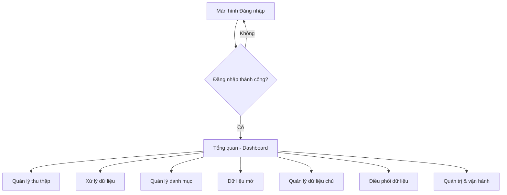
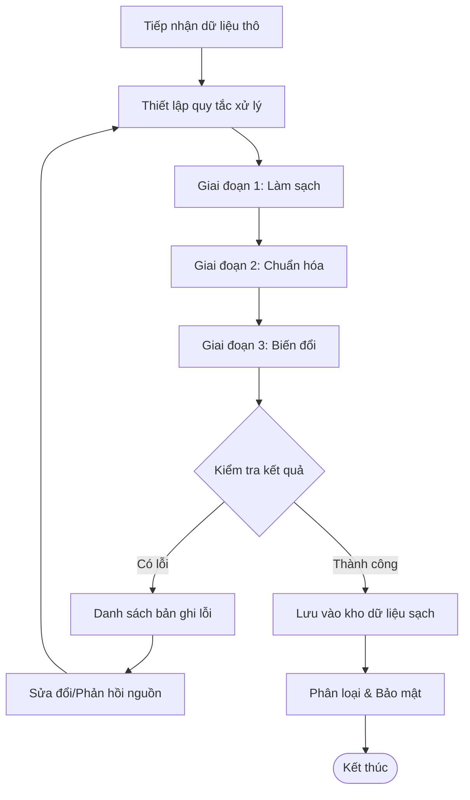
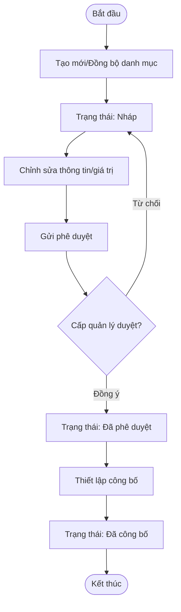
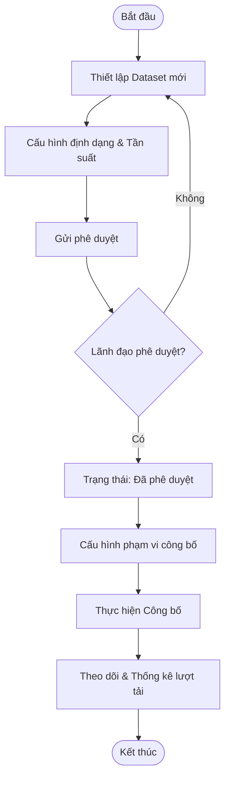
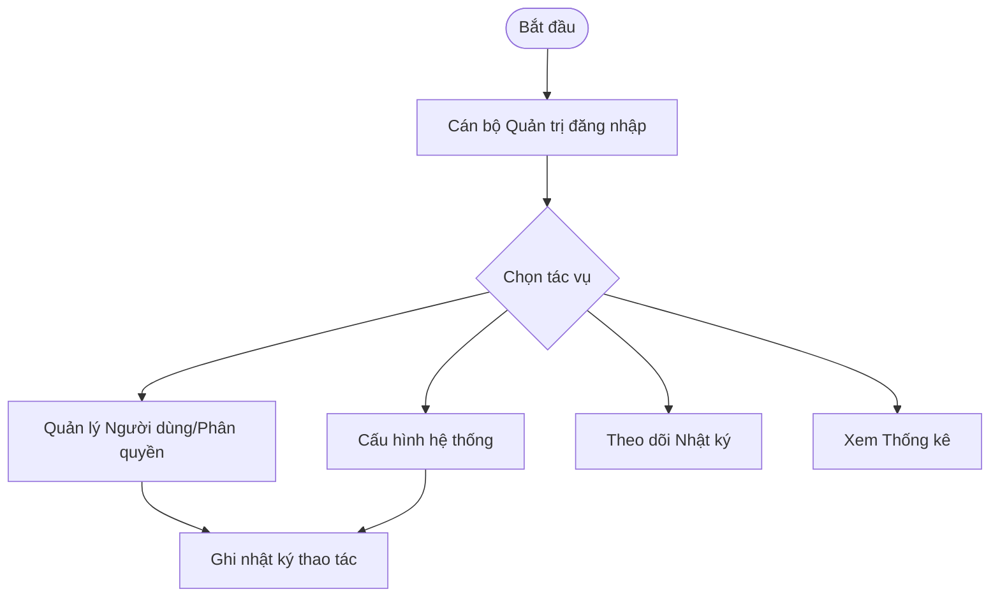

# TỔNG HỢP CÁC LUỒNG MÀN HÌNH (SCREEN FLOWS)

Tài liệu này tổng hợp toàn bộ các sơ đồ luồng màn hình của hệ thống Kho dữ liệu dùng chung (Kho DLDC), được trình bày dưới dạng sơ đồ chuyên nghiệp (Draw.io style) và mã nguồn Mermaid.

## 1. Luồng ứng dụng tổng quan

Sơ đồ thể hiện luồng điều hướng chính sau khi người dùng đăng nhập thành công:


### Mã Mermaid tham chiếu:


---

## 2. Luồng theo từng chức năng (Menu)

### 2.1. Quản lý thu thập (Data Collection)
Sơ đồ quy trình thiết lập và thực hiện thu thập dữ liệu:


#### Mã Mermaid tham chiếu:


### 2.2. Xử lý dữ liệu (Data Processing)
Sơ đồ quy trình làm sạch, chuẩn hóa và biến đổi dữ liệu:


#### Mã Mermaid tham chiếu:


### 2.3. Quản lý danh mục (Category Management)
Sơ đồ vòng đời của một danh mục:


#### Mã Mermaid tham chiếu:


### 2.4. Dữ liệu mở (Open Data)
Sơ đồ quy trình công bố tập dữ liệu mở:


#### Mã Mermaid tham chiếu:


### 2.5. Quản lý dữ liệu chủ (Master Data)
Sơ đồ quy trình định danh và hợp nhất thực thể dữ liệu gốc:


#### Mã Mermaid tham chiếu:
```mermaid
graph TD
    A([Bắt đầu]) --> B[Tiếp nhận dữ liệu từ Xử lý/Thu thập]
    B --> C[Phát hiện trùng lặp]
    C --> D{Có trùng lặp?}
    D -- Có --> E[Hợp nhất dữ liệu (Merge)]
    D -- Không --> F[Tạo thực thể mới]
    E --> G[Rà soát thay đổi thuộc tính]
    F --> G
    G --> H[Phê duyệt cập nhật]
    H --> I[Lưu vào kho Dữ liệu chủ chính thức]
    I --> J[Công khai qua API]
    J --> End([Kết thúc])
```

### 2.6. Điều phối dữ liệu (Data Orchestration/API)
Sơ đồ quy trình quản trị vận hành các API cung cấp dữ liệu:


#### Mã Mermaid tham chiếu:
```mermaid
graph TD
    A([Bắt đầu]) --> B[Thiết lập API mới (Chủ động/Thụ động)]
    B --> C[Cấu hình Endpoint & Security]
    C --> D[Thiết lập Rate Limiting]
    D --> E[Kiểm tra API]
    E --> F{Kiểm tra đạt?}
    F -- Không --> C
    F -- Có --> G[Kích hoạt vận hành]
    G --> H[Giám sát & Nhật ký]
```

### 2.7. Quản trị & vận hành (Admin Operations)
Sơ đồ các hoạt động quản trị hệ thống:


#### Mã Mermaid tham chiếu:

