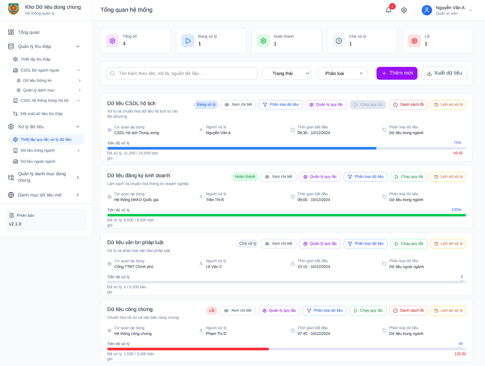

4.2 Quản lý xử lý dữ liệu

4.2.1. Thiết lập quy tắc xử lý dữ liệu

4.2.1.1. XLTL01\_Danh sách thiết lập quy tắc xử lý dữ liệu

Màn hình

*Hình 41 – Màn danh sách quy tắc xử lý dữ liệu*

4.2.1.1.1 Mô tả thông tin trên màn hình

| **STT** | **Tên trường thông tin** | **Kiểu dữ liệu** | **Bắt buộc** | **Mặc định** | **Mô tả** |
| --- | --- | --- | --- | --- | --- |
| 1 | Thẻ thống kê (Tổng số, Đang xử lý,...) | Card/Number |  |  | Hiển thị tổng số lượng bộ dữ liệu theo từng trạng thái cụ thể. |
| 2 | Ô tìm kiếm | Search Box |  |  | Cho phép nhập từ khóa tìm kiếm theo tên, mô tả hoặc nguồn dữ liệu. |
| 3 | Bộ lọc Trạng thái | Dropdown |  | Tất cả | Lọc danh sách dữ liệu theo trạng thái (Đang xử lý, Hoàn thành, Lỗi...). |
| 4 | Bộ lọc Phân loại | Dropdown |  | Tất cả | Lọc danh sách dữ liệu theo nhóm phân loại. |
| 5 | Tên bộ dữ liệu | Text |  |  | Tên định danh của tiến trình xử lý dữ liệu. |
| 6 | Trạng thái | Badge |  |  | Label hiển thị trạng thái hiện tại của bộ dữ liệu (Màu sắc thay đổi theo trạng thái). |
| 7 | Thông tin chi tiết (Cơ quan, Người xử lý,...) | Text/Icon |  |  | Hiển thị các thông tin định danh đi kèm của từng mục dữ liệu. |
| 8 | Tiến độ xử lý | Progress Bar |  |  | Thanh biểu diễn phần trăm (%) đã hoàn thành của tiến trình. |
| 9 | Chỉ số bản ghi | Label |  |  | Hiển thị chi tiết số lượng: Đã xử lý / Tổng số bản ghi. |
| 10 | Số bản ghi lỗi | Text (Red) |  |  | Hiển thị số lượng bản ghi gặp lỗi trong quá trình xử lý (nếu có). |

4.2.1.1.2 Chức năng trên màn hình

|  |  |  |  |
| --- | --- | --- | --- |
| **STT** | **Tên chức năng** | **Định dạng** | **Mô tả** |
| 1 | Thêm mới | Button | Mở cửa sổ popup XLTL02\_Thêm mới thiết lập quy tắc xử lý dữ liệu để tạo mới một tiến trình xử lý dữ liệu. |
| 2 | Xuất dữ liệu | Button | Xuất danh sách quản lý hiện tại ra file báo cáo (Excel/CSV). |
| 3 | Xem chi tiết | Button | Điều hướng đến màn hình XLTL03\_Xem chi tiết thiết lập quy tắc xử lý dữ liệu Để xem chi tiết cấu hình và tiến độ của bộ dữ liệu đó. |
| 4 | Phân loại dữ liệu | Button | Chuyển đến màn hình XLTL05\_Phân loại dữ liệu thiết lập quy tắc xử lý dữ liệu Để thực hiện phân loại cho bộ dữ liệu. |
| 5 | Quản lý quy tắc | Button | Mở giao diện XLTL04\_Quản lý quy tắc thiết lập quy tắc xử lý dữ liệu cấu hình các quy tắc áp dụng cho bộ dữ liệu này. |
| 6 | Chạy quy tắc | Button | Mở XLTL06\_Chạy quy tắc thiết lập quy tắc xử lý dữ liệu Kích hoạt tiến trình xử lý dữ liệu theo các quy tắc đã cấu hình. |
| 7 | Danh sách lỗi | Button | Mở XLTL07\_Danh sách lỗi thiết lập quy tắc xử lý dữ liệu nhanh danh sách các bản ghi bị lỗi để kiểm tra và xử lý. |
| 8 | Lịch sử xử lý | Button | Mở XLTL08\_Lịch sử xử lý thiết lập quy tắc xử lý dữ liệu Xem nhật ký các lần thực hiện xử lý của bộ dữ liệu trong quá khứ. |