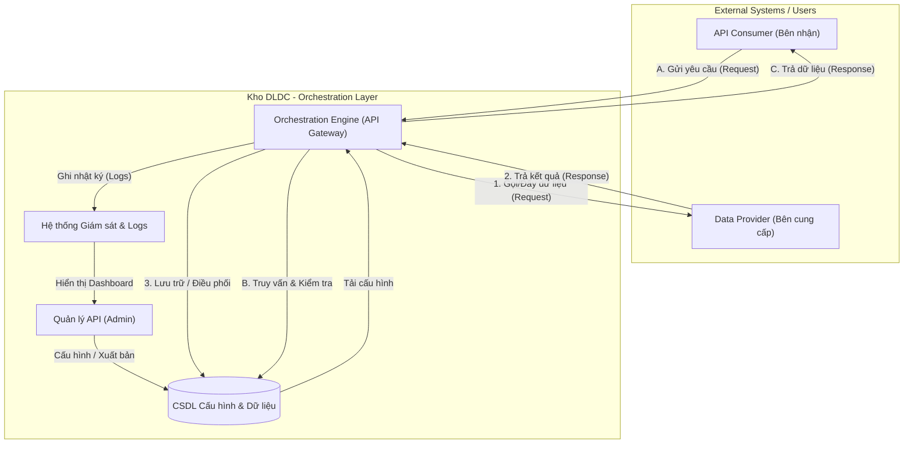

# 4.6. PM06.QLDLC_Điều phối dữ liệu (Data Orchestration/API)

## 4.6.1. PM06.QLDLC.TC – Quản lý API cung cấp dữ liệu

### *4.6.1.1. Mục đích*
Quản lý tập trung việc cung cấp, điều phối và chia sẻ dữ liệu thông qua các giao diện lập trình ứng dụng (API), nhằm đảm bảo an toàn, bảo mật, hiệu năng và khả năng kiểm soát toàn bộ luồng dữ liệu trao đổi.

### 4.6.1.2. PM06.QLDLC.TC.MH01 – Giao diện Quản lý API

#### 4.6.1.2.1. MH01 Màn hình quản lý API
##### Màn hình
- Màn hình:

Hình 1 - Màn hình giao diện quản lý API

##### Mô tả thông tin trên màn hình

**A. Nhóm Tab chức năng**
| Tab | Mô tả |
| :--- | :--- |
| Quản lý API | Hiển thị danh sách toàn bộ các API đã cấu hình trong hệ thống. |
| Giám sát | Chuyển sang Dashboard theo dõi hiệu năng, trạng thái API sống/chết, nhật ký giao dịch. |
| Lịch sử | Xem các thay đổi cấu hình và hoạt động trong quá khứ. |

**B. Các chỉ số thống kê cơ bản (Stats)**
| Trường thông tin | Kiểu dữ liệu | Bắt buộc | Mặc định | Mô tả |
| :--- | :--- | :--- | :--- | :--- |
| Tổng API | NUMBER | - | - | Tổng số API hỏ thống đang quản lý. |
| Đang hoạt động | NUMBER | - | - | Số API đang ở trạng thái Active (sống). |
| Tổng request hôm nay | NUMBER | - | - | Tổng lượt gọi API trong ngày.  |
| Tỉ lệ lỗi | NUMBER(5,2) | - | - | Phần trăm request thất bại so với tổng request. |

**C. Danh sách API (Data Table)**
| Trường thông tin | Kiểu dữ liệu | Bắt buộc | Mặc định | Mô tả |
| :--- | :--- | :--- | :--- | :--- |
| Tên API | VARCHAR2(255) | - | - | Tên định danh của dịch vụ API. |
| Endpoint | VARCHAR2(500) | - | - | Địa chỉ URL được cấu hình cho API. |
| Phương thức | VARCHAR2(10) | - | - | HTTP Method: GET, POST, PUT, DELETE. |
| Trạng thái | VARCHAR2(20) | - | - | Active (hoạt động) hoặc Inactive (tạm dừng). |
| Lượt gọi hôm nay | NUMBER | - | - | Số request đã thực hiện trong ngày hiện tại. |

##### Chức năng trên màn hình
| STT | Mã chức năng | Định dạng | Mô tả |
| :--- | :--- | :--- | :--- |
| 1 | CN01 | Button text | Mở popup để tạo mới/cập nhật một cấu hình API (MH01.P01). |
| 2 | CN02 | Search input | Tìm kiếm nhanh API theo tên, mã hoặc endpoint. |
| 3 | CN03 | Button text | Xuất danh sách API hiện tại ra các định dạng file (Excel, JSON, CSV, XML). |
| 4 | CN04 | Button icon | Mở popup xem toàn bộ thông tin cấu hình chi tiết của API (MH01.P01). |
| 5 | CN06 | Button icon | Chuyển đến màn hình giám sát, hiển thị biểu đồ và nhật ký riêng của API đó (MH02). |
| 6 | CN07 | Button icon | Mở công cụ kiểm thử API (API tester) để thực thi API trực tuyến (MH01.P02). |

#### 4.6.1.2.2. MH01.P01 – Cấu hình API
##### Màn hình
- Màn hình:

Hình 3 - Màn hình Cấu hình API

##### Mô tả thông tin trên màn hình
| Trường thông tin | Kiểu dữ liệu | Bắt buộc | Mặc định | Mô tả |
| :--- | :--- | :--- | :--- | :--- |
| Security | CLOB | - | - | Tab cấu hình bảo mật: Quản lý API Key, danh sách IP được phép (Whitelist). |
| Rate Limiting | CLOB | - | - | Tab cấu hình giới hạn: Số request mỗi phút/giờ/ngày/tháng. |
| Endpoint | CLOB | - | - | Tab cấu hình kỹ thuật: URL, Method, Timeout, Content-Type. |

##### Chức năng trên màn hình
| STT | Mã chức năng | Định dạng | Mô tả |
| :--- | :--- | :--- | :--- |
| 1 | CN01 | Button text | Ghi nhận và lưu lại cấu hình API. |
| 2 | CN02 | Button text | Đóng Popup mà không lưu thay đổi. |

#### 4.6.1.2.3. MH01.P02 – Kiểm tra API
##### Màn hình
- Màn hình:

Hình 4 - Màn hình thử nghiệm API

##### Mô tả thông tin trên màn hình
| Trường thông tin | Kiểu dữ liệu | Bắt buộc | Mặc định | Mô tả |
| :--- | :--- | :--- | :--- | :--- |
| Request | CLOB | - | - | Khu vực để người dùng nhập các thông tin của yêu cầu: URL, Header, Params, Body. |
| Response | CLOB | - | - | Khu vực hiển thị kết quả trả về từ API: Status code, Header và Body. |

##### Chức năng trên màn hình
| STT | Mã chức năng | Định dạng | Mô tả |
| :--- | :--- | :--- | :--- |
| 1 | CN01 | Button text | Gửi yêu cầu (Request) đến API endpoint đã nhập. |
| 2 | CN02 | Button text | Xóa toàn bộ dữ liệu đã nhập trong khu vực Request. |

## 4.6.2. PM06.QLDLC.GS – Giám sát và Nhật ký vận hành

### *4.6.2.1. Mục đích*
Theo dõi hiệu năng hệ thống, tình trạng của các API, và ghi nhận nhật ký vận hành để phân tích, xử lý sự cố và đảm bảo tính sẵn sàng, ổn định của toàn bộ hệ thống chia sẻ dữ liệu.

### 4.6.2.2. PM06.QLDLC.GS.MH02 – Dashboard Giám sát (Monitoring)

#### 4.6.2.2.1. MH02 Màn hình Dashboard Giám sát (Monitoring)
##### Màn hình
- Màn hình:

Hình 2 - Màn hình Dashboard Giám sát (Monitoring)

##### Mô tả thông tin trên màn hình
| Trường thông tin | Kiểu dữ liệu | Bắt buộc | Mặc định | Mô tả |
| :--- | :--- | :--- | :--- | :--- |
| Biểu đồ hiệu năng | CHART | - | - | Đồ thị thể hiện lượng request, thời gian phản hồi (Latency) và tỉ lệ lỗi theo thời gian thực hoặc theo khung giờ. |
| Trạng thái API | TABLE | - | - | Bảng hiển thị tình trạng từng API (đang sống/chết), thời điểm kiểm tra gần nhất. |
| Nhật ký giao dịch | CLOB | - | - | Ghi chép chi tiết các request gần đây: Thời gian, IP, Tên API, Status code (200, 401, 500...). |

##### Chức năng trên màn hình
| STT | Mã chức năng | Định dạng | Mô tả |
| :--- | :--- | :--- | :--- |
| 1 | CN01 | DROPDOWN | Chọn khoảng thời gian xem dữ liệu: 1 giờ, 24 giờ, 7 ngày, 30 ngày. |
| 2 | CN02 | Button text | Làm mới dữ liệu Dashboard để cập nhật thông tin mới nhất. |
| 3 | CN03 | Button text | Xuất báo cáo nhật ký và hiệu năng ra file Excel hoặc CSV. |

## 4.6.3. Luồng dữ liệu (Data Flow)

### *4.6.3.1. Sơ đồ luồng dữ liệu tổng quát*

### *4.6.3.2. Chi tiết các luồng dữ liệu*

| Loại luồng | Thành phần tham gia | Mô tả chi tiết |
| :--- | :--- | :--- |
| **Luồng quản trị (Management)** | Cán bộ quản trị, CSDL cấu hình | Cán bộ quản trị thiết lập thông tin Endpoint, Phương thức, Bảo mật (API Key) và Trạng thái hoạt động của từng API. Các cấu hình này được lưu vào CSDL. |
| **Luồng API Chủ động (Active)** | Kho DLDC, Hệ thống nguồn | Hệ thống chủ động kích hoạt các yêu cầu lấy dữ liệu từ các CSDL chuyên ngành (Hộ tịch, ĐKKD...) theo lịch trình định kỳ hoặc theo sự kiện. |
| **Luồng API Thụ động (Passive)** | Bên ngoài, API Gateway | Hệ thống tiếp nhận yêu cầu từ các hệ thống bên ngoài (Cổng DVC, các Bộ/Ngành). Gateway thực hiện xác thực, kiểm soát lưu lượng (Rate Limit) trước khi trả dữ liệu. |
| **Luồng Giám sát (Monitoring)** | API Gateway, Log Collector, UI | Mọi giao dịch qua API đều được ghi vết (IP, User, Thời gian, Trạng thái). Dữ liệu log này được tổng hợp lên Dashboard để theo dõi hiệu năng và phát hiện lỗi. |

