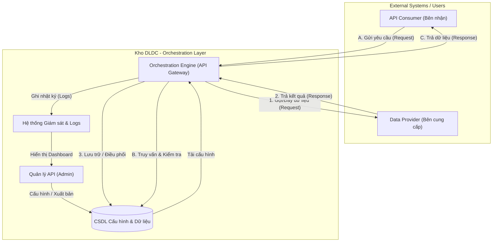

# 4.6. PM06.QLDLC_Điều phối dữ liệu (Data Orchestration/API)

## 4.6.1. PM06.QLDLC.TC – Quản lý API cung cấp dữ liệu

### 4.6.1.1. Mục đích
Quản lý việc cung cấp, điều phối và chia sẻ dữ liệu thông qua các giao diện lập trình ứng dụng (API), đảm bảo an toàn, bảo mật và hiệu năng.

### 4.6.1.2. PM06.QLDLC.TC.MH01 – Giao diện Quản lý API
*(Giao diện tham chiếu: [APIManagementPage.tsx](file:///d:/Tư%20pháp/KhoDLDC/DLDC_1/src/components/pages/orchestration/APIManagementPage.tsx))*

#### 4.6.1.2.1. Màn hình
- Màn hình:

Hình - Màn hình giao diện quản lý API

#### 4.6.1.2.2. Mô tả thông tin trên màn hình

**A. Nhóm Tab chức năng**
- **API chủ động**: Các API do hệ thống Kho DLDC chủ động gọi/đẩy dữ liệu.
- **API thụ động**: Các API cung cấp cho bên ngoài gọi vào để nhận dữ liệu.

**B. Các chỉ số thống kê cơ bản (Stats)**
| Trường thông tin | Kiểu dữ liệu | Bắt buộc | Mặc định | Mô tả |
| :--- | :--- | :--- | :--- | :--- |
| Tổng số API | Số | - | - | Số lượng API đang được quản lý. |
| API chủ động/thụ động | Số | - | - | Phân bổ số lượng theo loại. |
| Đang hoạt động | Số | - | - | Số API có trạng thái Active. |
| Lỗi | Số | - | - | Số API đang gặp sự cố (Status: Error). |

**C. Danh sách API (Data Table)**
| Trường thông tin | Kiểu dữ liệu | Bắt buộc | Mặc định | Mô tả |
| :--- | :--- | :--- | :--- | :--- |
| Mã API | Ký tự | - | - | Mã định danh kỹ thuật (VD: API001). |
| Tên API | Ký tự | - | - | Tên hiển thị kèm Endpoint. |
| Loại | Nhãn | - | - | Chủ động / Thụ động. |
| Phương thức | Nhãn | - | - | GET, POST, PUT, DELETE. |
| Nguồn -> Đích | Ký tự | - | - | Luồng luân chuyển dữ liệu. |
| Số lượt gọi | Số | - | - | Tổng lượt truy cập tích lũy. |
| Tỷ lệ thành công | % | - | - | Tỷ lệ phản hồi thành công (2xx). |
| Trạng thái | Nhãn | - | - | Hoạt động, Tạm dừng, Lỗi. |

#### 4.6.1.2.3. Chức năng trên màn hình
| STT | Tên chức năng | Định dạng | Mô tả |
| :--- | :--- | :--- | :--- |
| 1 | Thêm API mới | Nút | Mở form tạo mới cấu hình API. |
| 2 | Tìm kiếm | Ô nhập | Tìm theo tên, mã hoặc endpoint. |
| 3 | Xuất dữ liệu | Nút | Xuất danh sách API ra Excel/JSON/CSV/XML. |
| 4 | Xem chi tiết | Icon | Mở popup xem toàn bộ cấu hình. |
| 5 | Chỉnh sửa | Icon | Cập nhật cấu hình API. |
| 6 | Giám sát | Icon | Xem biểu đồ và nhật ký riêng của API đó. |
| 7 | Test API | Icon | Mở công cụ kiểm tra API trực tuyến. |

## 4.6.2. PM06.QLDLC.GS – Giám sát và Nhật ký vận hành

### 4.6.2.1. Mục đích
Theo dõi hiệu năng hệ thống, tình trạng của các API, và ghi nhận nhật ký vận hành để đảm bảo tính sẵn sàng cao.

### 4.6.2.2. PM06.QLDLC.GS.MH01 – Dashboard Giám sát (Monitoring)
*(Giao diện tham chiếu: [MonitoringPage.tsx](file:///d:/Tư%20pháp/KhoDLDC/DLDC_1/src/components/pages/orchestration/MonitoringPage.tsx))*

#### 4.6.2.2.1. Màn hình
- Màn hình:

Hình - Màn hình Dashboard Giám sát (Monitoring)

#### 4.6.2.2.2. Mô tả thông tin trên màn hình

**A. Biểu đồ xu hướng (Charts)**
| Trường thông tin | Kiểu dữ liệu | Bắt buộc | Mặc định | Mô tả |
| :--- | :--- | :--- | :--- | :--- |
| Lượng request | Biểu đồ vùng | - | - | Biểu đồ vùng (Area Chart) theo thời gian. |
| Thành công vs Lỗi | Biểu đồ cột | - | - | Biểu đồ cột chồng (Stacked Bar). |
| Thời gian phản hồi | Biểu đồ đường | - | - | Biểu đồ đường (Line Chart) xu hướng ms. |

**B. Nhật ký hoạt động chi tiết (Action Logs)**
| Trường thông tin | Kiểu dữ liệu | Bắt buộc | Mặc định | Mô tả |
| :--- | :--- | :--- | :--- | :--- |
| Thời gian | Ngày giờ | - | - | Thời điểm phát sinh sự kiện. |
| Người dùng | Ký tự | - | - | Cán bộ thực hiện thao tác. |
| Địa chỉ IP | Ký tự | - | - | IP máy trạm thực hiện. |
| Hành động | Ký tự | - | - | Loại thao tác (Khởi tạo, Sửa, Duyệt, Xóa...). |
| Chi tiết | Văn bản | - | - | Nội dung cụ thể của thay đổi. |
| Trạng thái | Nhãn | - | - | Thành công / Thất bại. |

#### 4.6.2.2.3. Chức năng trên màn hình
| STT | Tên chức năng | Định dạng | Mô tả |
| :--- | :--- | :--- | :--- |
| 1 | Lọc ngày | Component | Chọn ngày để xem thống kê. |

## 4.6.3. PM06.QLDLC.PD – Các màn hình Popup hỗ trợ

### 4.6.3.1. PM06.QLDLC.PD.MH01 – Cấu hình API (Popup)

#### 4.6.3.1.1. Màn hình
- Màn hình:

Hình - Màn hình Cấu hình API

#### 4.6.3.1.2. Mô tả thông tin trên màn hình
| Trường thông tin | Kiểu dữ liệu | Bắt buộc | Mặc định | Mô tả |
| :--- | :--- | :--- | :--- | :--- |
| Security | Cấu hình | - | - | Quản lý API Key, IP Whitelist. |
| Rate Limiting | Cấu hình | - | - | Giới hạn req per min/hour/day/month. |
| Endpoint | Cấu hình | - | - | URL, Method, Timeout, Content-Type. |

#### 4.6.3.1.3. Chức năng trên màn hình
| STT | Tên chức năng | Định dạng | Mô tả |
| :--- | :--- | :--- | :--- |
| 1 | Lưu cấu hình | Nút | Ghi nhận cấu hình API. |
| 2 | Đóng | Nút | Đóng Popup. |

### 4.6.3.2. PM06.QLDLC.PD.MH02 – Kiểm tra API (Test Tool Popup)

#### 4.6.3.2.1. Màn hình
- Màn hình:

Hình - Màn hình thử nghiệm API

#### 4.6.3.2.2. Mô tả thông tin trên màn hình
| Trường thông tin | Kiểu dữ liệu | Bắt buộc | Mặc định | Mô tả |
| :--- | :--- | :--- | :--- | :--- |
| Request | Khung nhập liệu | - | - | Nhập URL, Header, Params, Body. |
| Response | Khung hiển thị | - | - | Hiển thị Status, Header và Body kết quả trả về. |

#### 4.6.3.2.3. Chức năng trên màn hình
| STT | Tên chức năng | Định dạng | Mô tả |
| :--- | :--- | :--- | :--- |
| 1 | Gửi Test | Nút | Gửi Request API. |
| 2 | Xóa trắng | Nút | Xóa dữ liệu Request. |

## 4.6.4. Luồng dữ liệu (Data Flow)

### 4.6.4.1. Sơ đồ luồng dữ liệu tổng quát

### 4.6.4.2. Chi tiết các luồng dữ liệu

| Loại luồng | Thành phần tham gia | Mô tả chi tiết |
| :--- | :--- | :--- |
| **Luồng quản trị (Management)** | Cán bộ quản trị, CSDL cấu hình | Thiết lập thông tin Endpoint, Phương thức, Bảo mật (API Key) và Trạng thái hoạt động của từng API. |
| **Luồng API Chủ động (Active)** | Kho DLDC, Hệ thống nguồn | Hệ thống chủ động kích hoạt các yêu cầu lấy dữ liệu từ các CSDL chuyên ngành (Hộ tịch, ĐKKD...) theo định kỳ hoặc sự kiện. |
| **Luồng API Thụ động (Passive)** | Bên ngoài, API Gateway | Tiếp nhận yêu cầu từ các hệ thống bên ngoài (Cổng DVC, các Bộ/Ngành). Hệ thống thực hiện xác thực, kiểm soát lưu lượng (Rate Limit) trước khi trả dữ liệu. |
| **Luồng Giám sát (Monitoring)** | API Gateway, Log Collector, UI | Mọi giao dịch qua API đều được ghi vết (IP, User, Thời gian, Trạng thái). Dữ liệu này được tổng hợp lên Dashboard để theo dõi hiệu năng và lỗi. |

