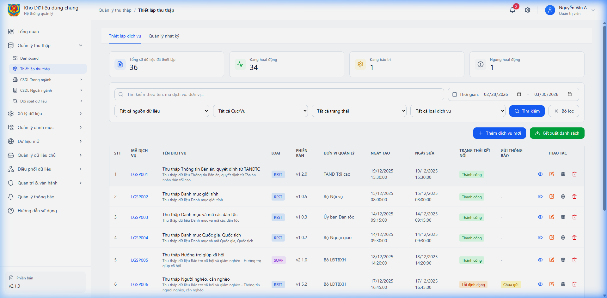
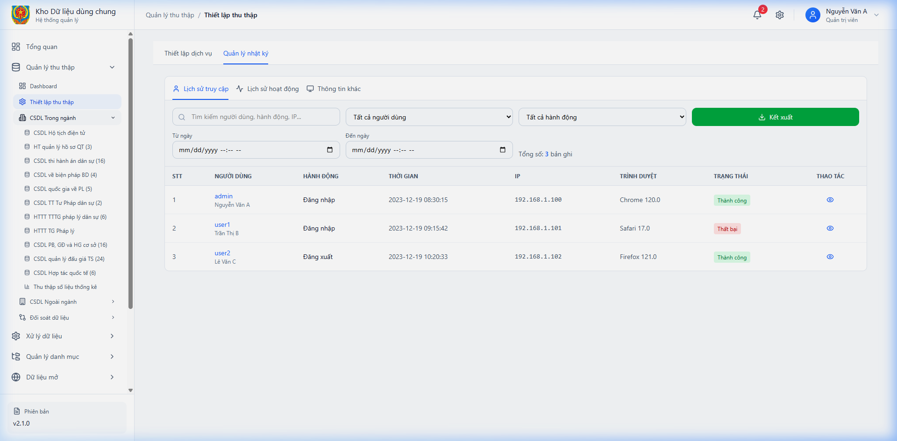
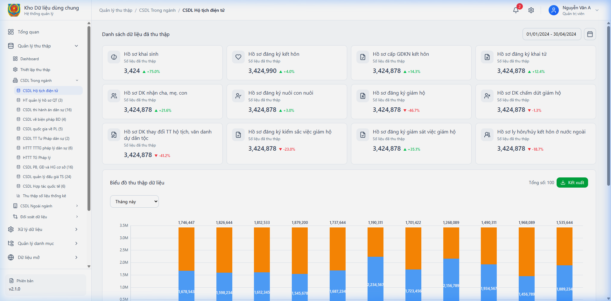
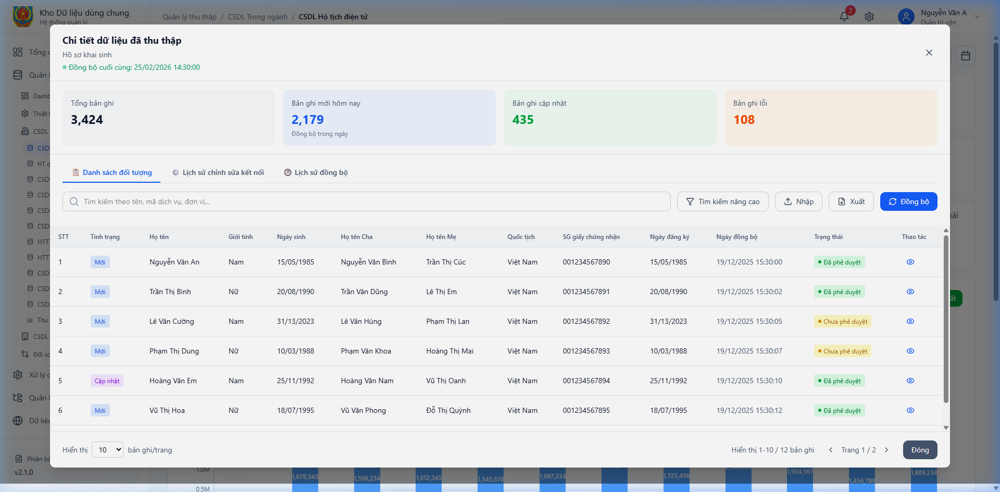
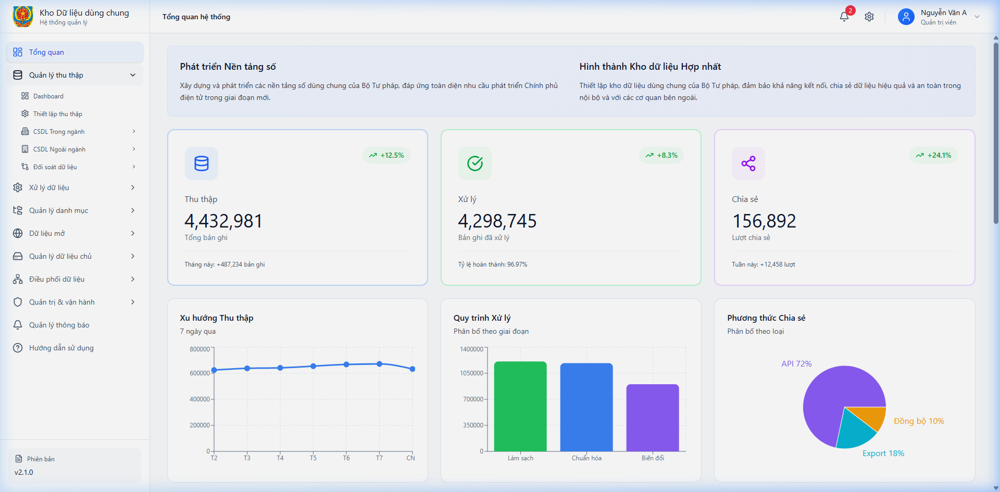
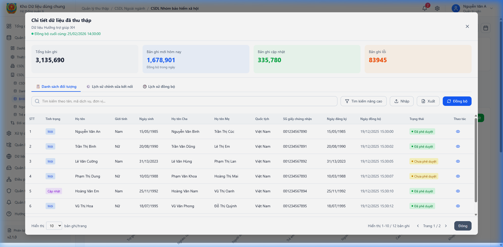

# 4.2. PM02.QLTT_Quản lý thu thập

## 4.2.1. PM02.QLTT.DB – Dashboard Thu thập

### *4.2.1.1. Mục đích*
Cung cấp cái nhìn tổng quan về tình trạng thu thập dữ liệu từ các nguồn khác nhau. Giúp người dùng theo dõi tiến độ, số lượng bản ghi đã thu thập và phát hiện sớm các lỗi phát sinh trong quá trình đồng bộ dữ liệu thông qua các biểu đồ và thống kê trực quan.

*+ Phân quyền*
Cán bộ quản trị và khai thác dữ liệu có quyền xem các số liệu thống kê chung.

*+ Điều kiện thực hiện*
Người dùng đăng nhập thành công vào hệ thống.

### 4.2.1.2. PM02.QLTT.DB.MH01 – Dashboard Thu thập

#### 4.2.1.2.1. MH01 Màn hình Dashboard Thu thập

##### Màn hình
- Màn hình:

Hình 1 - Màn hình Dashboard Thu thập

##### Mô tả thông tin trên màn hình
| Trường thông tin | Kiểu dữ liệu | Bắt buộc | Mặc định | Mô tả |
| :--- | :--- | :--- | :--- | :--- |
| Thống kê tổng | NUMBER | - | - | Tổng số hồ sơ đã thu thập thành công. |
| Trạng thái kết nối | VARCHAR2(50) | - | - | Đang kết nối / Mất kết nối. |
| Biểu đồ tiến độ | CHART | - | - | Biểu đồ thể hiện lượng dữ liệu theo thời gian. |

##### Chức năng trên màn hình
| STT | Mã chức năng | Định dạng | Mô tả |
| :--- | :--- | :--- | :--- |
| 1 | CN01 | Select | Lọc dữ liệu theo thời gian (Ngày, Tuần, Tháng). |
| 2 | CN02 | Button | Làm mới dữ liệu thống kê. |

---

## 4.2.2. PM02.QLTT.TL – Thiết lập thu thập

### *4.2.2.1. Mục đích*
Quản lý các cấu hình thu thập dữ liệu từ các Endpoint dịch vụ ngoài. Cho phép người dùng cấu hình tham số xác thực, tần suất và quy tắc đồng bộ.

*+ Phân quyền*
Cán bộ kỹ thuật và quản trị viên hệ thống.

*+ Điều kiện thực hiện*
Có thông tin về dịch vụ nguồn (URL, API Key...).

### 4.2.2.2. PM02.QLTT.TL.MH02 – Quản lý thiết lập thu thập

#### 4.2.2.2.1. MH02 Màn hình danh sách thiết lập thu thập
##### Màn hình
- Màn hình:

Hình 2 - Màn hình danh sách thiết lập thu thập

##### Mô tả thông tin trên màn hình
| Trường thông tin | Kiểu dữ liệu | Bắt buộc | Mặc định | Mô tả |
| :--- | :--- | :--- | :--- | :--- |
| Tên dịch vụ | VARCHAR2(255) | - | - | Tên gợi nhớ luồng thu thập. |
| Trạng thái | VARCHAR2(50) | - | - | Hoạt động / Tạm dừng. |

##### Chức năng trên màn hình
| STT | Mã chức năng | Định dạng | Mô tả |
| :--- | :--- | :--- | :--- |
| 1 | CN01 | Button text | Thêm dịch vụ mới (MH02.P01a). |
| 2 | CN02 | Button icon | Sửa thiết lập (MH02.P01b). |
| 3 | CN03 | Button icon | Xem chi tiết thiết lập (MH02.P02). |
| 4 | CN04 | Button icon | Xóa thiết lập (MH02.P03). |

#### 4.2.2.2.2. MH02.P01a Thêm mới thiết lập
##### Màn hình
- Màn hình:

Hình 3 - Màn hình Thêm mới thiết lập dịch vụ (Thông tin kết nối)

##### Mô tả thông tin trên màn hình

###### a. Tab Thông tin chung
| Trường thông tin | Kiểu dữ liệu | Bắt buộc | Mặc định | Mô tả |
| :--- | :--- | :--- | :--- | :--- |
| Tên service | VARCHAR2(255) | Có | - | Nhập tên API dịch vụ dữ liệu (VD: API dịch vụ dữ liệu quốc tịch). |
| Tên đơn vị | VARCHAR2(255) | Có | - | Chọn hoặc nhập tên đơn vị chủ quản. |
| Hệ thống | VARCHAR2(255) | Có | - | Hệ thống cung cấp dữ liệu. |
| Nguồn thu thập | SELECT | Có | - | Chọn phân loại nguồn dữ liệu. |
| Mức độ bảo mật dữ liệu | SELECT | Có | - | Chọn mức độ bảo mật. |
| Mô tả | VARCHAR2(1000) | Không | - | Mô tả chi tiết về service. |
| Đính kèm văn bản | FILE | Không | - | Hỗ trợ PDF, DOC, DOCX (tối đa 10MB). |

###### b. Tab Thông tin đơn vị cung cấp
| Trường thông tin | Kiểu dữ liệu | Bắt buộc | Mặc định | Mô tả |
| :--- | :--- | :--- | :--- | :--- |
| Tên đơn vị | VARCHAR2(255) | - | - | Tên đơn vị cung cấp dữ liệu (VD: Cục Hộ tịch, quốc tịch...). |
| Địa chỉ | VARCHAR2(500) | - | - | Địa chỉ của đơn vị cung cấp. |
| Số điện thoại | VARCHAR2(20) | - | - | Số điện thoại liên hệ. |
| Địa chỉ email | VARCHAR2(100) | - | - | Email nhận thông báo. |
| Người đầu mối kỹ thuật | VARCHAR2(255) | - | - | Cán bộ kỹ thuật phụ trách. |
| Ghi chú | VARCHAR2(1000) | - | - | Thông tin bổ sung. |

###### c. Tab Cấu hình kết nối
| Trường thông tin | Kiểu dữ liệu | Bắt buộc | Mặc định | Mô tả |
| :--- | :--- | :--- | :--- | :--- |
| Base URL | VARCHAR2(500) | Có | - | Địa chỉ URL gốc của API. |
| Content Type | SELECT | - | Application/json | Định dạng dữ liệu. |
| Method | SELECT | - | GET | HTTP Method. |
| Loại API | SELECT | - | API KEY | Phương thức xác thực. |
| Authentication | VARCHAR2(1000) | - | Bearer token | Mã token xác thực. |
| Endpoint Path | VARCHAR2(255) | - | /api/v1/users | Đường dẫn chi tiết. |
| Timeout (ms) | NUMBER | - | 1000 | Thời gian tối đa chờ phản hồi. |
| Page Size | SELECT | - | 100 | Số lượng bản ghi/fetch. |
| HTTP Success Codes | VARCHAR2(50) | - | 200 | Mã code thành công. |
| HTTP Error Codes | VARCHAR2(100) | - | 400, 500 | Mã code lỗi. |
| SSL Required | SELECT | - | true | Yêu cầu SSL. |

###### d. Tab Cấu hình thu thập
| Trường thông tin | Kiểu dữ liệu | Bắt buộc | Mặc định | Mô tả |
| :--- | :--- | :--- | :--- | :--- |
| Phương thức đồng bộ | SELECT | Có | - | Chọn cách thức đồng bộ. |
| Tần suất thu thập | SELECT | Có | - | Chọn tần suất. |

##### Chức năng trên màn hình
| STT | Mã chức năng | Định dạng | Mô tả |
| :--- | :--- | :--- | :--- |
| 1 | CN01 | Tab | Chuyển đổi giữa 4 tab thông tin. |
| 2 | CN02 | Button blue | Lưu thông tin kết nối và nhập vào hệ thống. |
| 3 | CN03 | Button white | Hủy bỏ. |

#### 4.2.2.2.3. MH02.P01b Chỉnh sửa thiết lập
##### Màn hình
- Màn hình:

Hình 4 - Màn hình Chỉnh sửa thiết lập dịch vụ

##### Mô tả thông tin trên màn hình
*(Cấu hình tương tự MH02.P01a nhưng hiển thị giá trị đã cấu hình trước đó)*

##### Chức năng trên màn hình
| STT | Mã chức năng | Định dạng | Mô tả |
| :--- | :--- | :--- | :--- |
| 1 | CN01 | Button blue | Cập nhật các thay đổi. |
| 2 | CN02 | Button white | Hủy bỏ. |

#### 4.2.2.2.4. MH02.P02 Xem chi tiết thiết lập
##### Màn hình
- Màn hình:

Hình 5 - Màn hình xem chi tiết thiết lập

##### Mô tả thông tin trên màn hình
| Trường thông tin | Kiểu dữ liệu | Bắt buộc | Mặc định | Mô tả |
| :--- | :--- | :--- | :--- | :--- |
| Tên service | VARCHAR2(255) | - | - | Tên dịch vụ đang xem. |
| Đơn vị quản lý | VARCHAR2(255) | - | - | Cơ quan chủ quản cung cấp API. |
| Trạng thái | VARCHAR2(50) | - | - | Hoạt động / Tạm dừng. |
| Thông tin kết nối | TEXT | - | - | Bao gồm: Base URL, Method, Content Type, Authentication. |

##### Chức năng trên màn hình
| STT | Mã chức năng | Định dạng | Mô tả |
| :--- | :--- | :--- | :--- |
| 1 | CN01 | Button text | Đóng popup. |
| 2 | CN02 | Link | Xem lịch sử dữ liệu đã thu thập của dịch vụ này. |

##### Chức năng trên màn hình
| STT | Mã chức năng | Định dạng | Mô tả |
| :--- | :--- | :--- | :--- |
| 1 | CN01 | Button text | Đóng popup. |
| 2 | CN02 | Link | Xem lịch sử dữ liệu đã thu thập của dịch vụ này. |

#### 4.2.2.2.5. MH02.P03 Xác nhận xóa thiết lập
##### Màn hình
- Màn hình:

Hình 6 - Màn hình xác nhận xóa thiết lập

##### Mô tả thông tin trên màn hình
| Trường thông tin | Kiểu dữ liệu | Bắt buộc | Mặc định | Mô tả |
| :--- | :--- | :--- | :--- | :--- |
| Thông báo xác nhận | TEXT | - | - | Nội dung: "Bạn có chắc chắn muốn xóa dịch vụ...?" |
| Cảnh báo | TEXT | - | - | "Hành động này không thể hoàn tác..." |

##### Chức năng trên màn hình
| STT | Mã chức năng | Định dạng | Mô tả |
| :--- | :--- | :--- | :--- |
| 1 | CN01 | Button red | Đồng ý xóa vĩnh viễn. |
| 2 | CN02 | Button white | Hủy bỏ. |

#### 4.2.2.2.6. MH02.P04 Cài đặt dịch vụ
##### Màn hình
- Màn hình:

Hình 7 - Màn hình cài đặt dịch vụ thu thập

##### Mô tả thông tin trên màn hình
| Trường thông tin | Kiểu dữ liệu | Bắt buộc | Mặc định | Mô tả |
| :--- | :--- | :--- | :--- | :--- |
| Tự động đồng bộ | TOGGLE | - | Bật | Bật/tắt chế độ tự động chạy theo lịch. |
| Thông báo lỗi | TOGGLE | - | Bật | Gửi thông báo khi tiến trình thất bại. |
| Ghi nhật ký chi tiết | TOGGLE | - | Tắt | Lưu log kỹ thuật chi tiết. |

##### Chức năng trên màn hình
| STT | Mã chức năng | Định dạng | Mô tả |
| :--- | :--- | :--- | :--- |
| 1 | CN01 | Button text | Kiểm tra Endpoint (MH02.P05). |
| 2 | CN02 | Button blue | Lưu cấu hình cài đặt. |

#### 4.2.2.2.7. MH02.P05 Kiểm tra Endpoint
##### Màn hình
- Màn hình:

Hình 8 - Màn hình kiểm tra kết nối Endpoint

##### Mô tả thông tin trên màn hình
| Trường thông tin | Kiểu dữ liệu | Bắt buộc | Mặc định | Mô tả |
| :--- | :--- | :--- | :--- | :--- |
| Endpoint URL | VARCHAR2(500) | - | - | URL đang được kiểm tra. |
| Trạng thái | VARCHAR2(100) | - | - | Kết quả trả về (Success/Error). |
| Kết quả (Body) | JSON | - | - | Dữ liệu thô nhận được từ API. |
| Latency | NUMBER | - | - | Thời gian phản hồi (ms). |

##### Chức năng trên màn hình
| STT | Mã chức năng | Định dạng | Mô tả |
| :--- | :--- | :--- | :--- |
| 1 | CN01 | Button blue | Chạy kiểm tra (Run Test). |
| 2 | CN02 | Button text | Đóng. |

---

## 4.2.3. PM02.QLTT.NK – Quản lý nhật ký

### *4.2.3.1. Mục đích*
Theo dõi lịch sử truy cập và các sự kiện hệ thống.

*+ Phân quyền*
Quản trị viên và Cán bộ kỹ thuật.

*+ Điều kiện thực hiện*
Hệ thống phát sinh dữ liệu nhật ký.

### 4.2.3.2. PM02.QLTT.NK.MH03 – Nhật ký thu thập

#### 4.2.3.2.1. MH03 Màn hình danh sách nhật ký
##### Màn hình
- Màn hình:

Hình 9 - Màn hình danh sách nhật ký

##### Mô tả thông tin trên màn hình
| Trường thông tin | Kiểu dữ liệu | Bắt buộc | Mặc định | Mô tả |
| :--- | :--- | :--- | :--- | :--- |
| Thời gian | DATE | - | - | Thời điểm xảy ra sự kiện. |
| Nội dung | VARCHAR2(1000) | - | - | Tóm tắt sự kiện. |

##### Chức năng trên màn hình
| STT | Mã chức năng | Định dạng | Mô tả |
| :--- | :--- | :--- | :--- |
| 1 | CN01 | Button icon | Xem chi tiết log (MH03.P01). |

#### 4.2.3.2.2. MH03.P01 Chi tiết nhật ký
##### Màn hình
- Màn hình:

Hình 10 - Màn hình xem chi tiết nhật ký

##### Mô tả thông tin trên màn hình
| Trường thông tin | Kiểu dữ liệu | Bắt buộc | Mặc định | Mô tả |
| :--- | :--- | :--- | :--- | :--- |
| Thông tin cơ bản | TEXT | - | - | ID nhật ký, Tên đăng nhập, Họ và tên cán bộ. |
| Hành động | VARCHAR2(255) | - | - | Loại thao tác (Thêm/Sửa/Xóa/Export), Module, Thời gian. |
| Thông tin kết nối | VARCHAR2(255) | - | - | Địa chỉ IP, Thiết bị, Trình duyệt. |
| Nội dung log | TEXT | - | - | Chi tiết thay đổi hoặc thông điệp hệ thống. |

##### Chức năng trên màn hình
| STT | Mã chức năng | Định dạng | Mô tả |
| :--- | :--- | :--- | :--- |
| 1 | CN01 | Button text | Đóng popup. |

---

## 4.2.4. PM02.QLTT.CSDLTN – CSDL Trong ngành

### *4.2.4.1. Mục đích*
Khai thác và theo dõi dữ liệu thu thập được từ các hệ thống nghiệp vụ nội bộ của ngành (Hộ tịch, Thi hành án, Đấu giá, Tư pháp...). Phục vụ công tác quản lý tập trung và phân tích dữ liệu ngành.

*+ Phân quyền*
Cán bộ nghiệp vụ các đơn vị trong ngành.

*+ Điều kiện thực hiện*
Dữ liệu đã được định nghĩa luồng kết nối và đồng bộ vào kho dùng chung.

### 4.2.4.2. PM02.QLTT.CSDLTN.MH04 – Khai thác CSDL Trong ngành

#### 4.2.4.2.1. MH04.M01 Danh mục CSDL Trong ngành
##### Màn hình
- Màn hình:

Hình 11 - Danh mục CSDL Trong ngành

##### Mô tả thông tin trên màn hình
| Trường thông tin | Kiểu dữ liệu | Bắt buộc | Mặc định | Mô tả |
| :--- | :--- | :--- | :--- | :--- |
| Sidebar menu | TREE LIST | - | - | Danh sách các hệ thống trong ngành: Hộ tịch điện tử, Quản lý hồ sơ QT, Thi hành án dân sự, Biện pháp bảo đảm, PBGD và HG cơ sở, Quản lý đấu giá TS, Hợp tác quốc tế, v.v. |

##### Chức năng trên màn hình
| STT | Mã chức năng | Định dạng | Mô tả |
| :--- | :--- | :--- | :--- |
| 1 | CN01 | Click Item | Mở màn hình tổng quan CSDL tương ứng (MH04.M02). |

#### 4.2.4.2.2. MH04.M02 Tổng quan từng CSDL Trong ngành
##### Màn hình
- Màn hình:

Hình 12 - Màn hình tổng quan dữ liệu trong ngành (Dashboard)

##### Mô tả thông tin trên màn hình
| Trường thông tin | Kiểu dữ liệu | Bắt buộc | Mặc định | Mô tả |
| :--- | :--- | :--- | :--- | :--- |
| Thời gian lọc | DATE RANGE | - | Tháng này | Lọc dữ liệu theo khoảng thời gian báo cáo. |
| Dashboard Cards | CARD LIST | - | - | Hiển thị các khối dữ liệu con (VD: Hồ sơ khai sinh, Đăng ký kết hôn...). |

##### Chức năng trên màn hình
| STT | Mã chức năng | Định dạng | Mô tả |
| :--- | :--- | :--- | :--- |
| 1 | CN01 | SELECT | Chọn nhanh khoảng thời gian (Hôm nay, Tháng này...). |
| 2 | CN02 | Button text | Kết xuất báo cáo tổng quan. |
| 3 | CN03 | Click Card | Xem danh sách chi tiết bản ghi (MH04.M04). |

#### 4.2.4.2.3. MH04.M04 Xem chi tiết dữ liệu Trong ngành
##### Màn hình
- Màn hình:

Hình 13 - Màn hình danh sách bản ghi chi tiết

##### Mô tả thông tin trên màn hình
| Trường thông tin | Kiểu dữ liệu | Bắt buộc | Mặc định | Mô tả |
| :--- | :--- | :--- | :--- | :--- |
| Tìm kiếm nhanh | VARCHAR2(255) | - | - | Nhập tên, mã dịch vụ, đơn vị để tìm kiếm. |
| Bảng dữ liệu | TABLE | - | - | Các cột: STT, Tình trạng, Họ tên, Giới tính, Ngày sinh, Họ tên Cha/Mẹ, Quốc tịch, Số giấy chứng nhận, Ngày đăng ký, Ngày đồng bộ, Trạng thái. |

##### Chức năng trên màn hình
| STT | Mã chức năng | Định dạng | Mô tả |
| :--- | :--- | :--- | :--- |
| 1 | CN01 | Button text | Tìm kiếm nâng cao. |
| 2 | CN02 | Button blue | Nhập dữ liệu và lưu vào kho. |
| 3 | CN03 | Button green | Xuất dữ liệu ra Excel. |
| 4 | CN04 | Button orange | Thực hiện đồng bộ tức thời. |
| 5 | CN05 | Button white | Đóng popup. |

---

## 4.2.5. PM02.QLTT.CSDLNN – CSDL Ngoài ngành

### *4.2.5.1. Mục đích*
Khai thác dữ liệu từ các nguồn bên ngoài thông qua kết nối LGSP hoặc các trục liên thông dữ liệu khác, phục vụ công tác đối soát và làm sạch dữ liệu dùng chung.

*+ Phân quyền*
Cán bộ nghiệp vụ và cán bộ khai thác dữ liệu Ngoài ngành.

*+ Điều kiện thực hiện*
Hệ thống đã kết nối thành công với các trục dữ liệu quốc gia/ngành.

### 4.2.5.2. PM02.QLTT.CSDLNN.MH05 – Khai thác CSDL Ngoài ngành

#### 4.2.5.2.1. MH05.M01 Danh mục CSDL Ngoài ngành
##### Màn hình
- Màn hình:

Hình 14 - Danh mục CSDL Ngoài ngành

##### Mô tả thông tin trên màn hình
| Trường thông tin | Kiểu dữ liệu | Bắt buộc | Mặc định | Mô tả |
| :--- | :--- | :--- | :--- | :--- |
| Sidebar menu | TREE LIST | - | - | Danh sách phân cấp các CSDL Ngoài ngành: Thông tin Bản án (1), Danh mục (8), BHXH & Giảm nghèo (7), Người có công (3), Trẻ em (1). |

##### Chức năng trên màn hình
| STT | Mã chức năng | Định dạng | Mô tả |
| :--- | :--- | :--- | :--- |
| 1 | CN01 | Click Item | Mở màn hình tổng quan của CSDL tương ứng (MH05.M02). |

#### 4.2.5.2.2. MH05.M02a CSDL Thông tin Bản án
##### Màn hình
- Màn hình: (Tổng quan)

Hình 15a - Màn hình tổng quan CSDL Thông tin Bản án

##### Mô tả thông tin trên màn hình
| Trường thông tin | Kiểu dữ liệu | Bắt buộc | Mặc định | Mô tả |
| :--- | :--- | :--- | :--- | :--- |
| Thời gian lọc | DATE RANGE | - | Tháng này | Lọc dữ liệu theo khoảng thời gian đồng bộ. |
| Dashboard Cards | CARD LIST | - | - | Hiển thị các khối dữ liệu bản án, quyết định từ TAND tối cao. |

##### Chức năng trên màn hình
| STT | Mã chức năng | Định dạng | Mô tả |
| :--- | :--- | :--- | :--- |
| 1 | CN01 | Select | Chọn nhanh khoảng thời gian. |
| 2 | CN02 | Button text | Kết xuất báo cáo tổng quan. |
| 3 | CN03 | Click Card | Xem chi tiết bản ghi (MH05.M04). |

#### 4.2.5.2.3. MH05.M02b Nhóm Danh mục quốc gia
##### Màn hình
- Màn hình: (Tổng quan)

Hình 15b - Màn hình tổng quan Nhóm Danh mục (8 loại)

##### Mô tả thông tin trên màn hình
*(Hỗ trợ 8 loại: Giới tính, Dân tộc, Quốc gia, Tôn giáo, Cơ quan, ĐV Hành chính, Mối quan hệ, Giấy tờ tùy thân)*

| Trường thông tin | Kiểu dữ liệu | Bắt buộc | Mặc định | Mô tả |
| :--- | :--- | :--- | :--- | :--- |
| Tìm kiếm danh mục | VARCHAR2(255) | - | - | Tìm nhanh mã hoặc tên mục. |
| Bảng dữ liệu | TABLE | - | - | Hiển thị: Mã code, Tên hiển thị, Trạng thái hoạt động. |

#### 4.2.5.2.4. MH05.M02c Nhóm BHXH và Giảm nghèo
##### Màn hình
- Màn hình: (Tổng quan)

Hình 15c - Màn hình tổng quan Nhóm BHXH và Giảm nghèo (7 loại)

##### Mô tả thông tin trên màn hình
*(Hỗ trợ khai thác 7 loại hồ sơ: Trợ giúp XH, Hộ nghèo/cận nghèo, Người đơn thân, Trẻ em đối tượng BTXH, Người có HIV, Người cao tuổi, Người khuyết tật)*

| Trường thông tin | Kiểu dữ liệu | Bắt buộc | Mặc định | Mô tả |
| :--- | :--- | :--- | :--- | :--- |
| Thời gian lọc | DATE RANGE | - | Tháng này | Lọc dữ liệu theo khoảng thời gian đồng bộ. |
| Các khối dữ liệu | CARD LIST | - | - | Tổng số bản ghi theo từng loại đối tượng BHXH/Giảm nghèo. |

##### Chức năng trên màn hình
| STT | Mã chức năng | Định dạng | Mô tả |
| :--- | :--- | :--- | :--- |
| 1 | CN01 | Select | Lọc theo thời gian. |
| 2 | CN02 | Click Card | Xem chi tiết danh sách (MH05.M04). |

#### 4.2.5.2.5. MH05.M02d Nhóm Người có công
##### Màn hình
- Màn hình: (Tổng quan)

Hình 15d - Màn hình tổng quan Nhóm Người có công (3 loại)

##### Mô tả thông tin trên màn hình
*(Hỗ trợ khai thác 3 loại hồ sơ: Người có công, Hồ sơ liệt sĩ, Thân nhân người có công)*

| Trường thông tin | Kiểu dữ liệu | Bắt buộc | Mặc định | Mô tả |
| :--- | :--- | :--- | :--- | :--- |
| Thời gian lọc | DATE RANGE | - | Tháng này | Khoảng thời gian dữ liệu. |
| Dashboard Cards | CARD LIST | - | - | Các loại hồ sơ người có công. |

##### Chức năng trên màn hình
| STT | Mã chức năng | Định dạng | Mô tả |
| :--- | :--- | :--- | :--- |
| 1 | CN01 | Click Card | Xem chi tiết danh sách (MH05.M04). |

#### 4.2.5.2.6. MH05.M02e CSDL Trẻ em
##### Màn hình
- Màn hình: (Tổng quan)

Hình 15e - Màn hình tổng quan CSDL Trẻ em

##### Mô tả thông tin trên màn hình
| Trường thông tin | Kiểu dữ liệu | Bắt buộc | Mặc định | Mô tả |
| :--- | :--- | :--- | :--- | :--- |
| Thời gian lọc | DATE RANGE | - | Tháng này | Thời điểm thu thập dữ liệu trẻ em. |
| Thống kê | CARD | - | - | Tổng số bản ghi trẻ em được đồng bộ. |

##### Chức năng trên màn hình
| STT | Mã chức năng | Định dạng | Mô tả |
| :--- | :--- | :--- | :--- |
| 1 | CN01 | Click Card | Xem chi tiết danh sách (MH05.M04). |

#### 4.2.5.2.7. MH05.M04 Xem chi tiết dữ liệu Ngoài ngành (Popup)
##### Màn hình
- Màn hình:

Hình 16 - Màn hình xem chi tiết bản ghi ngoài ngành

##### Mô tả thông tin trên màn hình

###### a. Tab Danh sách đối tượng
| Trường thông tin | Kiểu dữ liệu | Bắt buộc | Mặc định | Mô tả |
| :--- | :--- | :--- | :--- | :--- |
| Tìm kiếm | VARCHAR2(255) | - | - | Tìm kiếm theo tên, mã... |
| Bảng dữ liệu | TABLE | - | - | Hiển thị: STT, Tình trạng, Họ tên, Giới tính, v.v. (tương tự MH04.M04). |

###### b. Tab Lịch sử chỉnh sửa kết nối
| Trường thông tin | Kiểu dữ liệu | Bắt buộc | Mặc định | Mô tả |
| :--- | :--- | :--- | :--- | :--- |
| Nhật ký thay đổi | TABLE | - | - | Ghi lại các lần thay đổi tham số cấu hình dịch vụ. |

###### c. Tab Lịch sử đồng bộ
| Trường thông tin | Kiểu dữ liệu | Bắt buộc | Mặc định | Mô tả |
| :--- | :--- | :--- | :--- | :--- |
| Phiên đồng bộ | TABLE | - | - | Thời gian, kết quả, số bản ghi đã fetch. |

##### Chức năng trên màn hình
| STT | Mã chức năng | Định dạng | Mô tả |
| :--- | :--- | :--- | :--- |
| 1 | CN01 | Tab | Chuyển đổi giữa 3 tab thông tin chi tiết. |
| 2 | CN02 | Button blue | Nhập dữ liệu và lưu hồ sơ. |
| 3 | CN03 | Button green | Xuất dữ liệu ra Excel. |
| 4 | CN04 | Button orange | Thực hiện đồng bộ tức thời. |
| 5 | CN05 | Button white | Đóng popup. |

---

## 4.2.6. PM02.QLTT.DSTN – Đối soát hệ thống trong ngành

### *4.2.6.1. Mục đích*
Đối chiếu dữ liệu giữa kho dùng chung và các hệ thống nội bộ.

*+ Phân quyền*
Cán bộ kỹ thuật.

### 4.2.6.2. PM02.QLTT.DSTN.MH06 – Đối soát Trong ngành

#### 4.2.6.2.1. MH06.M01 Danh sách đối soát Trong ngành
##### Màn hình
- Màn hình:

##### Mô tả thông tin trên màn hình
| Trường thông tin | Kiểu dữ liệu | Bắt buộc | Mặc định | Mô tả |
| :--- | :--- | :--- | :--- | :--- |
| Thống kê nhanh | NUMBER | - | - | Tổng bộ dữ liệu, Khớp, Không khớp, Lỗi. |
| Tìm kiếm | VARCHAR2(255) | - | - | Tìm theo mã hồ sơ, hệ thống, loại đối soát. |
| Kết quả đối soát | TABLE | - | - | STT, Mã hồ sơ, Hồ sơ dữ liệu cung cấp, Loại đối soát, Số bản ghi, Ngày nhận, Trạng thái. |

##### Chức năng trên màn hình
| STT | Mã chức năng | Định dạng | Mô tả |
| :--- | :--- | :--- | :--- |
| 1 | CN01 | Select | Lọc theo trạng thái đối soát. |
| 2 | CN02 | Button icon | Xem chi tiết đối soát (MH06.M02). |

#### 4.2.6.2.2. MH06.M02 Chi tiết dữ liệu đối soát
##### Màn hình
- Màn hình: (Popup)

##### Mô tả thông tin trên màn hình
| Trường thông tin | Kiểu dữ liệu | Bắt buộc | Mặc định | Mô tả |
| :--- | :--- | :--- | :--- | :--- |
| Thông tin bộ dữ liệu | TEXT | - | - | Mã, Tên bộ dữ liệu, Hệ thống cung cấp, Loại dữ liệu. |
| Chỉ số đối soát | NUMBER | - | - | Số bản ghi, Lần đối soát cuối, Tỷ lệ khớp (%). |

##### Chức năng trên màn hình
| STT | Mã chức năng | Định dạng | Mô tả |
| :--- | :--- | :--- | :--- |
| 1 | CN01 | Button text | Đóng popup. |

#### 4.2.6.2.3. MH06.M03 Chi tiết lỗi đối soát
##### Màn hình
- Màn hình:

##### Mô tả thông tin trên màn hình
| Trường thông tin | Kiểu dữ liệu | Bắt buộc | Mặc định | Mô tả |
| :--- | :--- | :--- | :--- | :--- |
| Thống kê lỗi | NUMBER | - | - | Số lượng lỗi Nghiêm trọng, Trung bình, Nhẹ. |
| Danh sách lỗi | TABLE | - | - | Mã bản ghi, Trường dữ liệu, Giá trị nguồn, Giá trị đích, Mức độ. |

##### Chức năng trên màn hình
| STT | Mã chức năng | Định dạng | Mô tả |
| :--- | :--- | :--- | :--- |
| 1 | CN01 | Button green | Xuất báo cáo lỗi (Excel). |
| 2 | CN02 | Button text | Quay lại. |

#### 4.2.6.2.4. MH06.M04 Thiết lập dịch vụ đối soát
##### Màn hình
- Màn hình: (Tab Thiết lập)

##### Mô tả thông tin trên màn hình
| Trường thông tin | Kiểu dữ liệu | Bắt buộc | Mặc định | Mô tả |
| :--- | :--- | :--- | :--- | :--- |
| Thống kê cấu hình | NUMBER | - | - | Tổng cấu hình API, Đang hoạt động, Tổng lần gọi. |
| Danh sách cấu hình | TABLE | - | - | Hệ thống đầu, Endpoint, Phương thức, Trạng thái, Lần gọi gần nhất. |

##### Chức năng trên màn hình
| STT | Mã chức năng | Định dạng | Mô tả |
| :--- | :--- | :--- | :--- |
| 1 | CN01 | Button blue | Thêm cấu hình API (MH06.M05). |
| 2 | CN02 | Button icon | Sửa/Xóa cấu hình. |

#### 4.2.6.2.5. MH06.M05 Thêm cấu hình đối soát
##### Màn hình
- Màn hình:

##### Mô tả thông tin trên màn hình
| Trường thông tin | Kiểu dữ liệu | Bắt buộc | Mặc định | Mô tả |
| :--- | :--- | :--- | :--- | :--- |
| Thông tin chung | TEXT | Có | - | Tên cấu hình, Hệ thống gửi/nhận, Loại đối soát. |
| Cấu hình kỹ thuật | TEXT | Có | - | LGSP Service, Endpoint, Method, Authen, Cert. |
| Phạm vi dữ liệu | DATE range | - | - | Từ ngày, Đến ngày, Số bản ghi dự kiến. |

##### Chức năng trên màn hình
| STT | Mã chức năng | Định dạng | Mô tả |
| :--- | :--- | :--- | :--- |
| 1 | CN01 | Button blue | Lưu cấu hình. |
| 2 | CN02 | Button text | Hủy bỏ. |

#### 4.2.6.2.6. MH06.M06 Sửa cấu hình đối soát
##### Màn hình
- Màn hình:

Hình 22 - Màn hình chỉnh sửa cấu hình

#### 4.2.6.2.7. MH06.M07 Xác nhận xóa cấu hình
##### Màn hình
- Màn hình:

##### Mô tả thông tin trên màn hình
| Trường thông tin | Kiểu dữ liệu | Bắt buộc | Mặc định | Mô tả |
| :--- | :--- | :--- | :--- | :--- |
| Thông báo | TEXT | - | - | Xác nhận xóa cấu hình không thể hoàn tác. |

##### Chức năng trên màn hình
| STT | Mã chức năng | Định dạng | Mô tả |
| :--- | :--- | :--- | :--- |
| 1 | CN01 | Button red | Xác nhận xóa. |
| 2 | CN02 | Button white | Hủy. |

#### 4.2.6.2.8. MH06.M08 Lịch sử đối soát
##### Màn hình
- Màn hình: (Tab Lịch sử)

##### Mô tả thông tin trên màn hình
| Trường thông tin | Kiểu dữ liệu | Bắt buộc | Mặc định | Mô tả |
| :--- | :--- | :--- | :--- | :--- |
| Lịch sử đồng bộ | TABLE | - | - | Thời gian, Gói tin, Hệ thống đích, Hành động, Số bản ghi, Dung lượng, Trạng thái. |

##### Chức năng trên màn hình
| STT | Mã chức năng | Định dạng | Mô tả |
| :--- | :--- | :--- | :--- |
| 1 | CN01 | Button green | Xuất lịch sử Excel. |

#### 4.2.6.2.9. MH06.M09 Nhật ký đối soát
##### Màn hình
- Màn hình: (Tab Nhật ký)

##### Mô tả thông tin trên màn hình
| Trường thông tin | Kiểu dữ liệu | Bắt buộc | Mặc định | Mô tả |
| :--- | :--- | :--- | :--- | :--- |
| Nhật ký hệ thống | TABLE | - | - | Thời gian, Gói tin, Hành động, Người thực hiện, IP, Chi tiết, Trạng thái. |

##### Chức năng trên màn hình
| STT | Mã chức năng | Định dạng | Mô tả |
| :--- | :--- | :--- | :--- |
| 1 | CN01 | Button green | Xuất nhật ký Excel. |

---

## 4.2.7. PM02.QLTT.DSNN – Đối soát hệ thống ngoài ngành

### *4.2.7.1. Mục đích*
Đối soát với các nguồn dữ liệu ngoài ngành.

*+ Phân quyền*
Cán bộ kỹ thuật.

### 4.2.7.2. PM02.QLTT.DSNN.MH07 – Đối soát Ngoài ngành

#### 4.2.7.2.1. MH07.M01 Danh sách đối soát Ngoài ngành
##### Màn hình
- Màn hình:

Hình 26 - Màn hình danh sách đối soát ngoài ngành

##### Mô tả thông tin trên màn hình
| Trường thông tin | Kiểu dữ liệu | Bắt buộc | Mặc định | Mô tả |
| :--- | :--- | :--- | :--- | :--- |
| Tìm kiếm gói tin | VARCHAR2(255) | - | - | Tìm kiếm theo tên hoặc mã gói tin đối soát. |
| Bảng dữ liệu | TABLE | - | - | Hiển thị: STT, Mã gói tin, Tên gói tin, Ngày tạo, Tần suất, Trạng thái. |

##### Chức năng trên màn hình
| STT | Mã chức năng | Định dạng | Mô tả |
| :--- | :--- | :--- | :--- |
| 1 | CN01 | Button blue | Thêm cấu hình mới (MH07.M05). |
| 2 | CN02 | Button icon | Xem chi tiết (MH07.M02). |
| 3 | CN03 | Button icon | Sửa cấu hình (MH07.M06). |
| 4 | CN04 | Button icon | Xóa (MH07.M07). |

#### 4.2.7.2.2. MH07.M02 Chi tiết đối soát Ngoài ngành
##### Màn hình
- Màn hình:

Hình 27 - Màn hình chi tiết đối soát ngoài ngành

##### Mô tả thông tin trên màn hình
| Trường thông tin | Kiểu dữ liệu | Bắt buộc | Mặc định | Mô tả |
| :--- | :--- | :--- | :--- | :--- |
| Thông tin chung | TEXT | - | - | Mã bộ dữ liệu, Tên bộ dữ liệu, Hệ thống cung cấp. |
| Kết quả đối soát | NUMBER | - | - | Tổng số bản ghi, Tỷ lệ khớp, Lần đối soát cuối. |

##### Chức năng trên màn hình
| STT | Mã chức năng | Định dạng | Mô tả |
| :--- | :--- | :--- | :--- |
| 1 | CN01 | Button text | Đóng. |

#### 4.2.7.2.3. MH07.M04 Thiết lập đối soát Ngoài ngành
##### Màn hình
- Màn hình: (Tab Thiết lập)

Hình 28 - Màn hình thiết lập đối soát ngoài ngành

##### Mô tả thông tin trên màn hình
| Trường thông tin | Kiểu dữ liệu | Bắt buộc | Mặc định | Mô tả |
| :--- | :--- | :--- | :--- | :--- |
| Chỉ số thiết lập | NUMBER | - | - | Tổng cấu hình kết nối, Đang hoạt động, Số lần gọi. |
| Bảng cấu hình | TABLE | - | - | Hệ thống ngoài, API Endpoint, Phương thức, Trạng thái. |

##### Chức năng trên màn hình
| STT | Mã chức năng | Định dạng | Mô tả |
| :--- | :--- | :--- | :--- |
| 1 | CN01 | Button blue | Thêm cấu hình Ngoài ngành (MH07.M05). |
| 2 | CN02 | Button icon | Sửa/Xóa cấu hình. |

#### 4.2.7.2.4. MH07.M05 Thêm cấu hình Ngoài ngành
##### Màn hình
- Màn hình:

Hình 29 - Màn hình thêm cấu hình ngoài ngành

##### Mô tả thông tin trên màn hình
| Trường thông tin | Kiểu dữ liệu | Bắt buộc | Mặc định | Mô tả |
| :--- | :--- | :--- | :--- | :--- |
| Tên cấu hình | VARCHAR2(255) | Có | - | Nhập tên gợi nhớ cho kết nối. |
| Hệ thống nguồn | VARCHAR2(255) | Có | - | Chọn hệ thống ngoài cung cấp dữ liệu. |
| Tham số API | TEXT | Có | - | Endpoint, Service Name, Method, Key/Cert. |

##### Chức năng trên màn hình
| STT | Mã chức năng | Định dạng | Mô tả |
| :--- | :--- | :--- | :--- |
| 1 | CN01 | Button blue | Lưu thông tin. |
| 2 | CN02 | Button text | Hủy. |

#### 4.2.7.2.5. MH07.M06 Sửa cấu hình Ngoài ngành
##### Màn hình
- Màn hình:

Hình 30 - Màn hình chỉnh sửa cấu hình ngoài ngành

##### Mô tả thông tin trên màn hình
*(Tương tự MH07.M05 nhưng cho phép chỉnh sửa các thông số kết nối hiện tại)*

##### Chức năng trên màn hình
| STT | Mã chức năng | Định dạng | Mô tả |
| :--- | :--- | :--- | :--- |
| 1 | CN01 | Button blue | Cập nhật thay đổi. |
| 2 | CN02 | Button text | Hủy bỏ. |

#### 4.2.7.2.6. MH07.M07 Xác nhận xóa cấu hình Ngoài ngành
##### Màn hình
- Màn hình:

Hình 30b - Màn hình xác nhận xóa cấu hình ngoài ngành

##### Mô tả thông tin trên màn hình
| Trường thông tin | Kiểu dữ liệu | Bắt buộc | Mặc định | Mô tả |
| :--- | :--- | :--- | :--- | :--- |
| Thông báo | TEXT | - | - | "Bạn có chắc chắn muốn xóa cấu hình đối soát này?" |

##### Chức năng trên màn hình
| STT | Mã chức năng | Định dạng | Mô tả |
| :--- | :--- | :--- | :--- |
| 1 | CN01 | Button red | Xóa vĩnh viễn. |
| 2 | CN02 | Button white | Hủy. |

#### 4.2.7.2.7. MH07.M08 Lịch sử đối soát Ngoài ngành
##### Màn hình
- Màn hình: (Tab Lịch sử)

Hình 31 - Màn hình lịch sử đối soát ngoài ngành

##### Mô tả thông tin trên màn hình
| Trường thông tin | Kiểu dữ liệu | Bắt buộc | Mặc định | Mô tả |
| :--- | :--- | :--- | :--- | :--- |
| Lịch sử đồng bộ | TABLE | - | - | Thời gian, Gói tin, Hệ thống nguồn, Số bản ghi, Trạng thái. |

##### Chức năng trên màn hình
| STT | Mã chức năng | Định dạng | Mô tả |
| :--- | :--- | :--- | :--- |
| 1 | CN01 | Button green | Xuất báo cáo lịch sử (Excel). |

#### 4.2.7.2.8. MH07.M09 Nhật ký đối soát Ngoài ngành
##### Màn hình
- Màn hình: (Tab Nhật ký)

Hình 32 - Màn hình nhật ký đối soát ngoài ngành

##### Mô tả thông tin trên màn hình
| Trường thông tin | Kiểu dữ liệu | Bắt buộc | Mặc định | Mô tả |
| :--- | :--- | :--- | :--- | :--- |
| Tìm kiếm log | VARCHAR2(255) | - | - | Tìm kiếm theo gói tin, hành động, người thực hiện. |
| Bảng nhật ký | TABLE | - | - | Hiển thị: Thời gian, Gói tin, Hành động, Người thực hiện, IP, Chi tiết, Trạng thái (Thành công/Lỗi/Cảnh báo). |

##### Chức năng trên màn hình
| STT | Mã chức năng | Định dạng | Mô tả |
| :--- | :--- | :--- | :--- |
| 1 | CN01 | Tab | Chuyển đổi giữa các tab nghiệp vụ. |
| 2 | CN02 | Button blue | Xuất log đối soát ra file Excel. |

---

*(Tài liệu đã được hoàn thiện đầy đủ cấu trúc 38 màn hình/tab/popup với việc chi tiết hóa mức cao các trường thông tin và chức năng cho CSDL Trong ngành và Ngoài ngành)*
