# 4.1. DC1.TQ - TỔNG QUAN (DASHBOARD)

## 4.1.1. DC1.TQ.DB – Dashboard tổng quan

### *4.1.1.1. Mục đích*
Cung cấp một cái nhìn toàn cảnh, tập trung về hiệu năng và tình trạng hoạt động của toàn bộ hệ thống Kho DLDC. Màn hình này giúp lãnh đạo và cán bộ quản trị nhanh chóng nắm bắt các chỉ số KPI quan trọng, theo dõi xu hướng và phát hiện các vấn đề cần chú ý thông qua các biểu đồ trực quan.

### 4.1.1.2. DC1-TQ-DB-001 – Màn hình Tổng quan hệ thống

#### 4.1.1.2.1. MH01 Màn hình Tổng quan hệ thống
- **Mã chức năng:** DC1-TQ-DB-001
- **Mã màn hình:** MH01

Màn hình

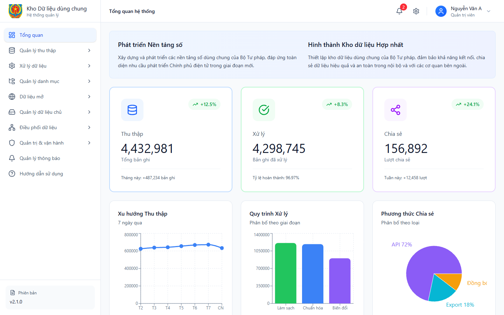

*Hình 1 – Màn hình Dashboard Tổng quan hệ thống*

4.1.1.2.1.1 Mô tả thông tin trên màn hình

**A. Nhóm chỉ số chính (KPI Cards)**
Hiển thị các con số quan trọng nhất của hệ thống. Người dùng có thể nhấn vào từng thẻ để xem chi tiết.
| Chỉ số | Mô tả | Chi tiết hiển thị |
| :--- | :--- | :--- |
| **Thu thập** | Tổng số bản ghi đã được thu về kho. | Số lượng bản ghi tăng thêm trong tháng. |
| **Xử lý** | Số lượng bản ghi đã qua quy trình làm sạch/chuẩn hóa. | Tỷ lệ hoàn thành xử lý (%). |
| **Chia sẻ** | Tổng lượt truy xuất và cung cấp dữ liệu. | Số lượt phát sinh trong tuần. |

**B. Hệ thống biểu đồ thống kê**
| Tên biểu đồ | Loại | Mô tả |
| :--- | :--- | :--- |
| **Xu hướng Thu thập** | Line Chart | Theo dõi lượng dữ liệu thu thập trong 7 ngày gần nhất. |
| **Quy trình Xử lý** | Bar Chart | Thống kê số lượng theo giai đoạn: Làm sạch -> Chuẩn hóa -> Biến đổi. |
| **Phương thức Chia sẻ** | Pie Chart | Tỷ lệ chia sẻ qua: API, Export file, Đồng bộ hệ thống. |
| **Top 5 Dịch vụ** | Mixed Bar | 5 dịch vụ có lượt chia sẻ cao nhất (Phân loại Trong/Ngoài ngành). |
| **Xu hướng Dữ liệu chủ**| Area Chart | Biểu đồ tăng trưởng của kho dữ liệu gốc trong 6 tháng. |
| **Danh mục dùng chung** | Horiz. Bar | Thống kê số lượng danh mục (Giới tính, Dân tộc, Đơn vị hành chính...). |
| **Dữ liệu mở** | Stacked Bar | Tỷ lệ dữ liệu đã công bố và đang chờ phê duyệt theo lĩnh vực. |

4.1.1.2.1.2 Chức năng trên màn hình
|  |  |  |  |
| --- | --- | --- | --- |
| **STT** | **Tên chức năng** | **Định dạng** | **Mô tả** |
| 1 | CN01 | Click | Nhấn vào một thẻ KPI để mở popup chi tiết (MH01.P01). |
| 2 | CN02 | Hover | Di chuột qua các cột/phần của biểu đồ để xem số liệu chi tiết. |
| 3 | CN03 | Dropdown | Lọc dữ liệu trên toàn bộ dashboard theo khoảng thời gian (7 ngày, 30 ngày...). |

#### 4.1.1.2.2. MH01.P01 – Chi tiết chỉ số Thu thập (Popup)
- **Mã chức năng:** DC1-TQ-DB-001
- **Mã màn hình:** MH01.P01

Màn hình

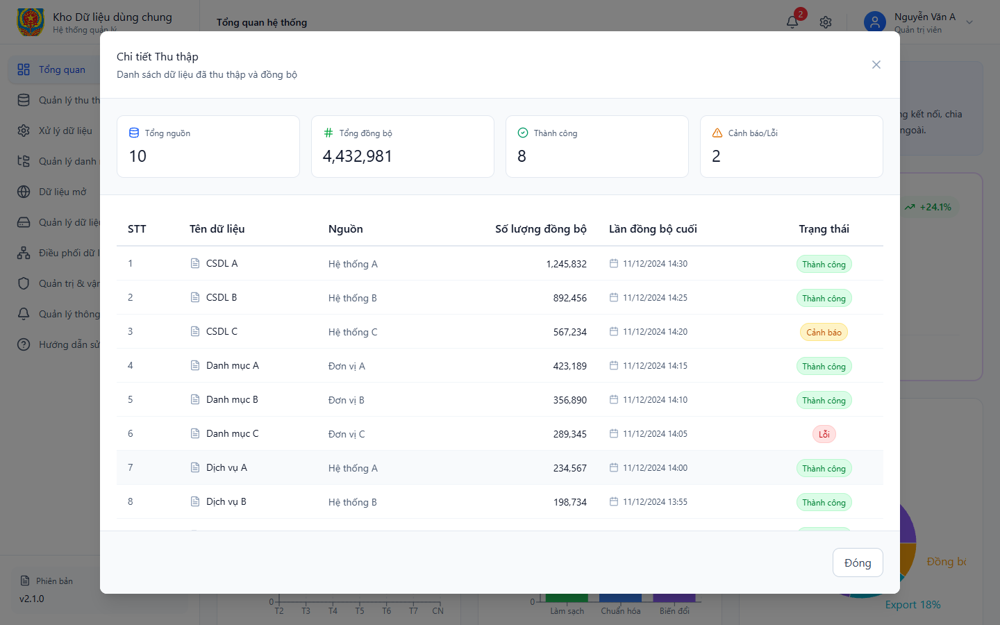

*Hình 2 – Màn hình Popup chi tiết các chỉ số Thu thập*

4.1.1.2.2.1 Mô tả thông tin trên màn hình
Hiển thị khi người dùng nhấn vào thẻ **Thu thập** ở màn hình Tổng quan.

**A. Các thẻ tổng hợp (Summary Cards)**
| **STT** | **Tên trường thông tin** | **Kiểu dữ liệu** | **Bắt buộc** | **Mặc định** | **Mô tả** |
| --- | --- | --- | --- | --- | --- |
| **Tổng nguồn** | NUMBER | V | Hiển thị số lượng các hệ thống/đơn vị đang kết nối thu thập dữ liệu (Ví dụ: 10). |
| **Tổng đồng bộ** | NUMBER | V | Tổng số lượng bản ghi đã được tải về kho dữ liệu (Ví dụ: 4,432,981). |
| **Thành công** | NUMBER | V | Số lượng nguồn dữ liệu đang hoạt động ổn định (Ví dụ: 8). |
| **Cảnh báo/Lỗi** | NUMBER | V | Số lượng nguồn dữ liệu đang gặp sự cố kết nối hoặc đồng bộ (Ví dụ: 2). |

**B. Bảng danh sách chi tiết**
| **STT** | **Tên trường thông tin** | **Kiểu dữ liệu** | **Bắt buộc** | **Mặc định** | **Mô tả** |
| --- | --- | --- | --- | --- | --- |
| **STT** | NUMBER | V | Số thứ tự dòng. |
| **Tên dữ liệu** | VARCHAR2(255) | V | Tên CSDL hoặc Danh mục được thu thập. |
| **Nguồn** | VARCHAR2(255) | V | Tên hệ thống hoặc đơn vị cung cấp dữ liệu. |
| **Số lượng đồng bộ** | NUMBER | V | Số lượng bản ghi thực tế thu thập từ nguồn cụ thể. |
| **Lần đồng bộ cuối** | DATE | V | Thời điểm gần nhất hệ thống thực hiện tác vụ thu thập. |
| **Trạng thái** | VARCHAR2(50) | V | Trạng thái đồng bộ (`Thành công`, `Cảnh báo`, `Lỗi`). |

4.1.1.2.2.2 Chức năng trên màn hình
|  |  |  |  |
| --- | --- | --- | --- |
| **STT** | **Tên chức năng** | **Định dạng** | **Mô tả** |
| 1 | CN01 | Button | Nút **Đóng** để thoát màn hình chi tiết. |

#### 4.1.1.2.3. MH01.P02 – Chi tiết chỉ số Xử lý (Popup)
- **Mã chức năng:** DC1-TQ-DB-001
- **Mã màn hình:** MH01.P02

Màn hình

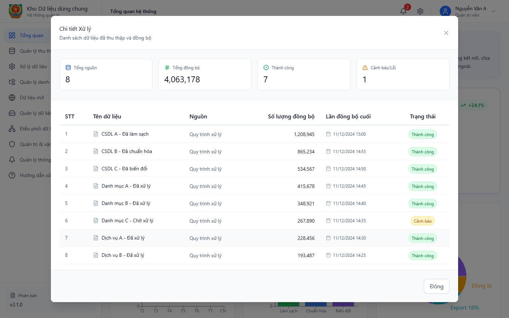

*Hình 3 – Màn hình Popup chi tiết các chỉ số Xử lý*

4.1.1.2.3.1 Mô tả thông tin trên màn hình
Hiển thị khi người dùng nhấn vào thẻ **Xử lý** ở màn hình Tổng quan.

**A. Các thẻ tổng hợp (Summary Cards)**
| **STT** | **Tên trường thông tin** | **Kiểu dữ liệu** | **Bắt buộc** | **Mặc định** | **Mô tả** |
| --- | --- | --- | --- | --- | --- |
| **Tổng nguồn** | NUMBER | V | Số lượng các luồng dữ liệu đang thực hiện quy trình xử lý (Ví dụ: 8). |
| **Tổng xử lý** | NUMBER | V | Tổng số bản ghi đã đi qua các bước làm sạch và chuẩn hóa (Ví dụ: 4,063,178). |
| **Thành công** | NUMBER | V | Số lượng luồng xử lý hoàn tất không có lỗi quy tắc (Ví dụ: 7). |
| **Cảnh báo/Lỗi** | NUMBER | V | Số lượng luồng đang gặp lỗi dữ liệu hoặc quy tắc (Ví dụ: 1). |

**B. Bảng danh sách chi tiết**
| **STT** | **Tên trường thông tin** | **Kiểu dữ liệu** | **Bắt buộc** | **Mặc định** | **Mô tả** |
| --- | --- | --- | --- | --- | --- |
| **STT** | NUMBER | V | Số thứ tự dòng. |
| **Tên dữ liệu** | VARCHAR2(255) | V | Tên tập dữ liệu đang được xử lý. |
| **Nguồn** | VARCHAR2(255) | V | Quy trình hoặc đơn vị chịu trách nhiệm xử lý. |
| **Số lượng xử lý** | NUMBER | V | Số lượng bản ghi đã được chuẩn hóa thành công. |
| **Lần xử lý cuối** | DATE | V | Thời điểm cập nhật trạng thái xử lý gần nhất. |
| **Trạng thái** | VARCHAR2(50) | V | Tiến độ (`Thành công`, `Đang xử lý`, `Lỗi quy tắc`). |

4.1.1.2.3.2 Chức năng trên màn hình
|  |  |  |  |
| --- | --- | --- | --- |
| **STT** | **Tên chức năng** | **Định dạng** | **Mô tả** |
| 1 | CN01 | Button | Nút **Đóng** để thoát màn hình chi tiết. |

#### 4.1.1.2.4. MH01.P03 – Chi tiết chỉ số Chia sẻ (Popup)
- **Mã chức năng:** DC1-TQ-DB-001
- **Mã màn hình:** MH01.P03

Màn hình

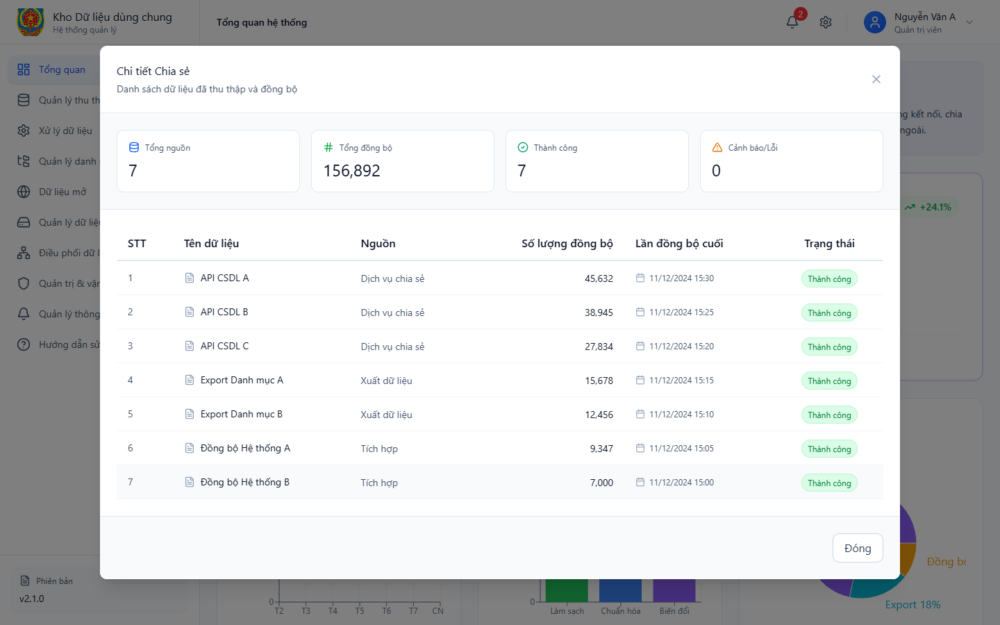

*Hình 4 – Màn hình Popup chi tiết lượt Chia sẻ dữ liệu*

4.1.1.2.4.1 Mô tả thông tin trên màn hình
Hiển thị khi người dùng nhấn vào thẻ **Chia sẻ** ở màn hình Tổng quan.

**A. Các thẻ tổng hợp (Summary Cards)**
| **STT** | **Tên trường thông tin** | **Kiểu dữ liệu** | **Bắt buộc** | **Mặc định** | **Mô tả** |
| --- | --- | --- | --- | --- | --- |
| **Tổng nguồn** | NUMBER | V | Số lượng các dịch vụ API hoặc tệp tin đang được chia sẻ (Ví dụ: 7). |
| **Tổng lượt chia sẻ**| NUMBER | V | Tổng số yêu cầu truy xuất dữ liệu thành công từ các đơn vị (Ví dụ: 156,892). |
| **Thành công** | NUMBER | V | Số lượng dịch vụ đang hoạt động sẵn sàng (Ví dụ: 7). |
| **Cảnh báo/Lỗi** | NUMBER | V | Số lượng dịch vụ đang tạm dừng hoặc gặp lỗi kết nối (Ví dụ: 0). |

**B. Bảng danh sách chi tiết**
| **STT** | **Tên trường thông tin** | **Kiểu dữ liệu** | **Bắt buộc** | **Mặc định** | **Mô tả** |
| --- | --- | --- | --- | --- | --- |
| **STT** | NUMBER | V | Số thứ tự dòng. |
| **Tên dịch vụ** | VARCHAR2(255) | V | Tên API hoặc dịch vụ chia sẻ dữ liệu. |
| **Đối tượng** | VARCHAR2(255) | V | Tên đơn vị hoặc hệ thống bên ngoài khai thác dữ liệu. |
| **Số lượt chia sẻ** | NUMBER | V | Tổng số yêu cầu phát sinh từ dịch vụ/đối tượng đó. |
| **Lần truy cập cuối**| DATE | V | Thời điểm phát sinh lượt truy xuất gần nhất. |
| **Trạng thái** | VARCHAR2(50) | V | Trạng thái dịch vụ (`Hoạt động`, `Tạm dừng`). |

4.1.1.2.4.2 Chức năng trên màn hình
|  |  |  |  |
| --- | --- | --- | --- |
| **STT** | **Tên chức năng** | **Định dạng** | **Mô tả** |
| 1 | CN01 | Button | Nút **Đóng** để thoát màn hình chi tiết. |

# 4.2. DC102.QLTT_Quản lý thu thập

## 4.2.1. DC102.QLTT.DB – Dashboard Thu thập

### *4.2.1.1. Mục đích*
Cung cấp cái nhìn tổng quan về tình trạng thu thập dữ liệu từ các nguồn khác nhau. Giúp người dùng theo dõi tiến độ, số lượng bản ghi đã thu thập và phát hiện sớm các lỗi phát sinh trong quá trình đồng bộ dữ liệu thông qua các biểu đồ và thống kê trực quan.

*+ Phân quyền*
Cán bộ quản trị và khai thác dữ liệu có quyền xem các số liệu thống kê chung.

*+ Điều kiện thực hiện*
Người dùng đăng nhập thành công vào hệ thống.

### 4.2.1.2. DC1-TQ-DB-001 – Dashboard Thu thập

#### 4.2.1.2.1. DC1-UC003-MH1 Màn hình Dashboard Thu thập 

Màn hình

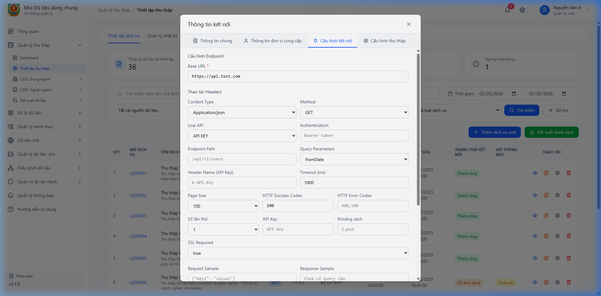

*Hình 1 – Màn hình Dashboard Thu thập*

4.2.1.2.1.1 Mô tả thông tin trên màn hình
| **STT** | **Tên trường thông tin** | **Kiểu dữ liệu** | **Bắt buộc** | **Mặc định** | **Mô tả** |
| --- | --- | --- | --- | --- | --- |
| Thống kê tổng | NUMBER | - | - | Tổng số hồ sơ đã thu thập thành công. |
| Trạng thái kết nối | VARCHAR2(50) | - | - | Đang kết nối / Mất kết nối. |
| Biểu đồ tiến độ | CHART | - | - | Biểu đồ thể hiện lượng dữ liệu theo thời gian. |

4.2.1.2.1.2 Chức năng trên màn hình
|  |  |  |  |
| --- | --- | --- | --- |
| **STT** | **Tên chức năng** | **Định dạng** | **Mô tả** |
| 1 | CN01 | Select | Lọc dữ liệu theo thời gian (Ngày, Tuần, Tháng). |
| 2 | CN02 | Button | Làm mới dữ liệu thống kê. |

#### 4.2.1.2.2. DC1-UC003-MH1 Màn hình Dashboard Thu thập Xem thông tin thu thập dữ liệu theo phương thức thu thập dữ liệu dưới dạng biểu đồ.

Màn hình

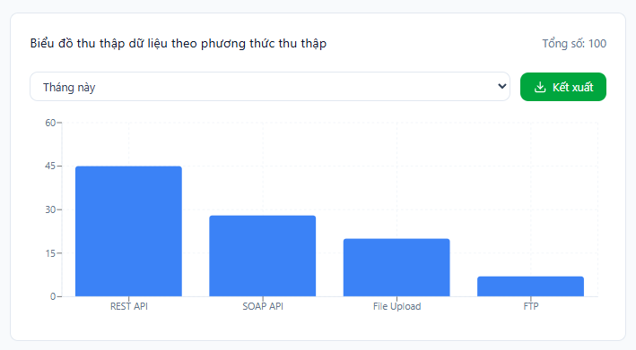

*Hình 2 – Thu thập Xem thông tin thu thập dữ liệu theo phương thức thu thập dữ liệu dưới dạng biểu đồ*

4.2.1.2.1.1 Mô tả thông tin trên màn hình
| **STT** | **Tên trường thông tin** | **Kiểu dữ liệu** | **Bắt buộc** | **Mặc định** | **Mô tả** |
| --- | --- | --- | --- | --- | --- |
| Biểu đồ tiến độ | CHART | - | - |Xem thông tin thu thập dữ liệu theo phương thức thu thập dữ liệu dưới dạng biểu đồ. |

4.2.1.2.1.2 Chức năng trên màn hình
|  |  |  |  |
| --- | --- | --- | --- |
| **STT** | **Tên chức năng** | **Định dạng** | **Mô tả** |
| 1 | CN01 | Select | Lọc dữ liệu theo thời gian (Ngày, Tuần, Tháng). |
| 2 | CN02 | Button | Làm mới dữ liệu thống kê. |
#### 4.2.1.2.3. DC1-UC003-MH2 Màn hình Dashboard Thu thập Thu thập dữ liệu theo nguồn cung cấp dữ liệu dưới dạng biểu đồ.

Màn hình

*Hình 3 – Thu thập dữ liệu theo nguồn cung cấp dữ liệu dưới dạng biểu đồ*

4.2.1.2.1.1 Mô tả thông tin trên màn hình
| **STT** | **Tên trường thông tin** | **Kiểu dữ liệu** | **Bắt buộc** | **Mặc định** | **Mô tả** |
| --- | --- | --- | --- | --- | --- |
| Biểu đồ tiến độ | CHART | - | - |Thu thập dữ liệu theo nguồn cung cấp dữ liệu dưới dạng biểu đồ. |

4.2.1.2.1.2 Chức năng trên màn hình
|  |  |  |  |
| --- | --- | --- | --- |
| **STT** | **Tên chức năng** | **Định dạng** | **Mô tả** |
| 1 | CN01 | Select | Lọc dữ liệu theo thời gian (Ngày, Tuần, Tháng). |
| 2 | CN02 | Button | Làm mới dữ liệu thống kê. |
#### 4.2.1.2.4. DC1-UC003-MH3 Màn hình Dashboard Thu thập Theo phương thức thu thập.

Màn hình

*Hình 3 – Thu thập dữ liệu theo nguồn cung cấp dữ liệu dưới dạng biểu đồ*

4.2.1.2.1.1 Mô tả thông tin trên màn hình
| **STT** | **Tên trường thông tin** | **Kiểu dữ liệu** | **Bắt buộc** | **Mặc định** | **Mô tả** |
| --- | --- | --- | --- | --- | --- |
| Biểu đồ tiến độ | CHART | - | - |Thu thập dữ liệu theo phương thức thu thập dưới dạng biểu đồ. |

4.2.1.2.1.2 Chức năng trên màn hình
|  |  |  |  |
| --- | --- | --- | --- |
| **STT** | **Tên chức năng** | **Định dạng** | **Mô tả** |
| 1 | CN01 | Select | Lọc dữ liệu theo thời gian (Ngày, Tuần, Tháng). |
| 2 | CN02 | Button | Làm mới dữ liệu thống kê. |

#### 4.2.1.2.4. DC1-UC003-MH4 Màn hình Dashboard Thu thập Theo thời gian.

Màn hình

*Hình 3 – Thu thập dữ liệu theo nguồn cung cấp dữ liệu dưới dạng biểu đồ*

4.2.1.2.1.1 Mô tả thông tin trên màn hình
| **STT** | **Tên trường thông tin** | **Kiểu dữ liệu** | **Bắt buộc** | **Mặc định** | **Mô tả** |
| --- | --- | --- | --- | --- | --- |
| Biểu đồ tiến độ | CHART | - | - |Thu thập dữ liệu theo thời gian dưới dạng biểu đồ. |

4.2.1.2.1.2 Chức năng trên màn hình
|  |  |  |  |
| --- | --- | --- | --- |   
| **STT** | **Tên chức năng** | **Định dạng** | **Mô tả** |
| 1 | CN01 | Select | Lọc dữ liệu theo thời gian (Ngày, Tuần, Tháng). |
| 2 | CN02 | Button | Làm mới dữ liệu thống kê. |

## 4.2.2. DC102.QLTT.TL – Thiết lập thu thập

### *4.2.2.1. Mục đích*
Quản lý các cấu hình thu thập dữ liệu từ các Endpoint dịch vụ ngoài. Cho phép người dùng cấu hình tham số xác thực, tần suất và quy tắc đồng bộ.

*+ Phân quyền*
Cán bộ kỹ thuật và quản trị viên hệ thống.

*+ Điều kiện thực hiện*
Có thông tin về dịch vụ nguồn (URL, API Key...).

### 4.2.2.2. DC1-TT-QT-001 – Quản lý thiết lập thu thập

#### 4.2.2.2.1. DC1-UC001-MH5 Màn hình danh sách thiết lập thu thập
- **Mã chức năng:** DC1-TT-QT-001
- **Mã màn hình:** DC1-UC001-MH5

Màn hình

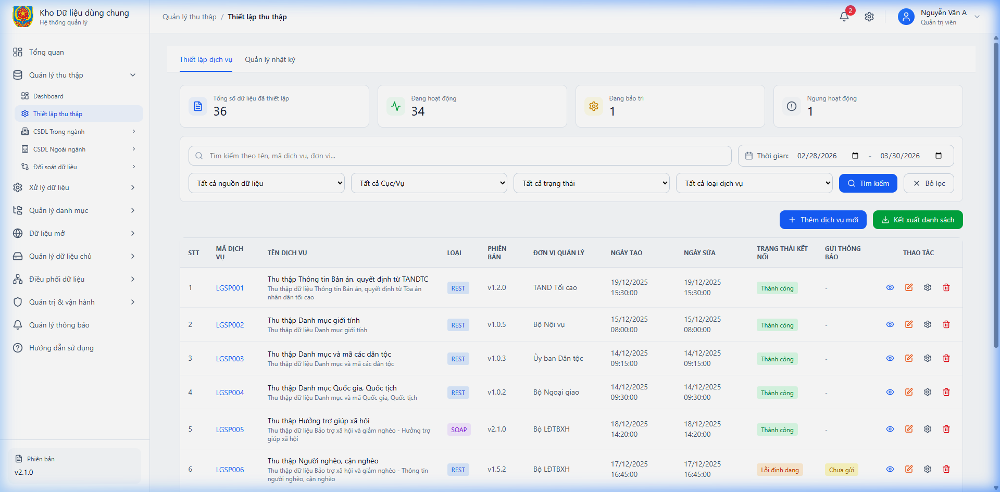

*Hình 2 – Màn hình danh sách thiết lập thu thập*

4.2.2.2.1.1 Mô tả thông tin trên màn hình
| **STT** | **Tên trường thông tin** | **Kiểu dữ liệu** | **Bắt buộc** | **Mặc định** | **Mô tả** |
| --- | --- | --- | --- | --- | --- |
| Tên dịch vụ | VARCHAR2(255) | - | - | Tên gợi nhớ luồng thu thập. |
| Trạng thái | VARCHAR2(50) | - | - | Hoạt động / Tạm dừng. |

4.2.2.2.1.2 Chức năng trên màn hình
|  |  |  |  |
| --- | --- | --- | --- |
| **STT** | **Tên chức năng** | **Định dạng** | **Mô tả** |
| 1 | CN01 | Button text | Thêm dịch vụ mới (MH02.P01a). |
| 2 | CN02 | Button icon | Sửa thiết lập (MH02.P01b). |
| 3 | CN03 | Button icon | Xem chi tiết thiết lập (MH02.P02). |
| 4 | CN04 | Button icon | Xóa thiết lập (MH02.P03). |

#### 4.2.2.2.2. DC1-UC001-MH1 Thêm mới thiết lập
- **Mã chức năng:** DC1-TT-QT-001
- **Mã màn hình:** DC1-UC001-MH1

Màn hình

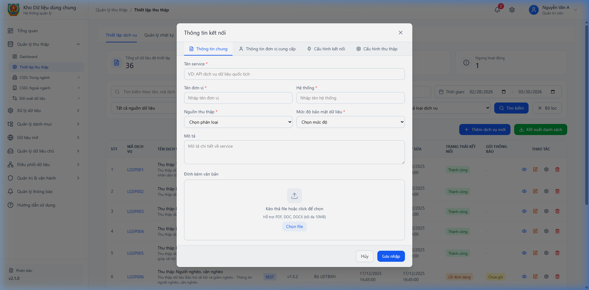

*Hình 3 – Màn hình Thêm mới thiết lập dịch vụ (Thông tin kết nối)*

4.2.2.2.2.1 Mô tả thông tin trên màn hình

###### a. Tab Thông tin chung
| **STT** | **Tên trường thông tin** | **Kiểu dữ liệu** | **Bắt buộc** | **Mặc định** | **Mô tả** |
| --- | --- | --- | --- | --- | --- |
| Tên service | VARCHAR2(255) | Có | - | Nhập tên API dịch vụ dữ liệu (VD: API dịch vụ dữ liệu quốc tịch). |
| Tên đơn vị | VARCHAR2(255) | Có | - | Chọn hoặc nhập tên đơn vị chủ quản. |
| Hệ thống | VARCHAR2(255) | Có | - | Hệ thống cung cấp dữ liệu. |
| Nguồn thu thập | SELECT | Có | - | Chọn phân loại nguồn dữ liệu. |
| Mức độ bảo mật dữ liệu | SELECT | Có | - | Chọn mức độ bảo mật. |
| Mô tả | VARCHAR2(1000) | Không | - | Mô tả chi tiết về service. |
| Đính kèm văn bản | FILE | Không | - | Hỗ trợ PDF, DOC, DOCX (tối đa 10MB). |

###### b. Tab Thông tin đơn vị cung cấp
| **STT** | **Tên trường thông tin** | **Kiểu dữ liệu** | **Bắt buộc** | **Mặc định** | **Mô tả** |
| --- | --- | --- | --- | --- | --- |
| Tên đơn vị | VARCHAR2(255) | - | - | Tên đơn vị cung cấp dữ liệu (VD: Cục Hộ tịch, quốc tịch...). |
| Địa chỉ | VARCHAR2(500) | - | - | Địa chỉ của đơn vị cung cấp. |
| Số điện thoại | VARCHAR2(20) | - | - | Số điện thoại liên hệ. |
| Địa chỉ email | VARCHAR2(100) | - | - | Email nhận thông báo. |
| Người đầu mối kỹ thuật | VARCHAR2(255) | - | - | Cán bộ kỹ thuật phụ trách. |
| Ghi chú | VARCHAR2(1000) | - | - | Thông tin bổ sung. |

###### c. Tab Cấu hình kết nối
| **STT** | **Tên trường thông tin** | **Kiểu dữ liệu** | **Bắt buộc** | **Mặc định** | **Mô tả** |
| --- | --- | --- | --- | --- | --- |
| Base URL | VARCHAR2(500) | Có | - | Địa chỉ URL gốc của API. |
| Content Type | SELECT | - | Application/json | Định dạng dữ liệu. |
| Method | SELECT | - | GET | HTTP Method. |
| Loại API | SELECT | - | API KEY | Phương thức xác thực. |
| Authentication | VARCHAR2(1000) | - | Bearer token | Mã token xác thực. |
| Endpoint Path | VARCHAR2(255) | - | /api/v1/users | Đường dẫn chi tiết. |
| Timeout (ms) | NUMBER | - | 1000 | Thời gian tối đa chờ phản hồi. |
| Page Size | SELECT | - | 100 | Số lượng bản ghi/fetch. |
| HTTP Success Codes | VARCHAR2(50) | - | 200 | Mã code thành công. |
| HTTP Error Codes | VARCHAR2(100) | - | 400, 500 | Mã code lỗi. |
| SSL Required | SELECT | - | true | Yêu cầu SSL. |

###### d. Tab Cấu hình thu thập
| **STT** | **Tên trường thông tin** | **Kiểu dữ liệu** | **Bắt buộc** | **Mặc định** | **Mô tả** |
| --- | --- | --- | --- | --- | --- |
| Phương thức đồng bộ | SELECT | Có | - | Chọn cách thức đồng bộ. |
| Tần suất thu thập | SELECT | Có | - | Chọn tần suất. |

4.2.2.2.2.2 Chức năng trên màn hình
|  |  |  |  |
| --- | --- | --- | --- |
| **STT** | **Tên chức năng** | **Định dạng** | **Mô tả** |
| 1 | CN01 | Tab | Chuyển đổi giữa 4 tab thông tin. |
| 2 | CN02 | Button blue | Lưu thông tin kết nối và nhập vào hệ thống. |
| 3 | CN03 | Button white | Hủy bỏ. |

#### 4.2.2.2.3. DC1-UC001-MH2 Chỉnh sửa thiết lập
Màn hình

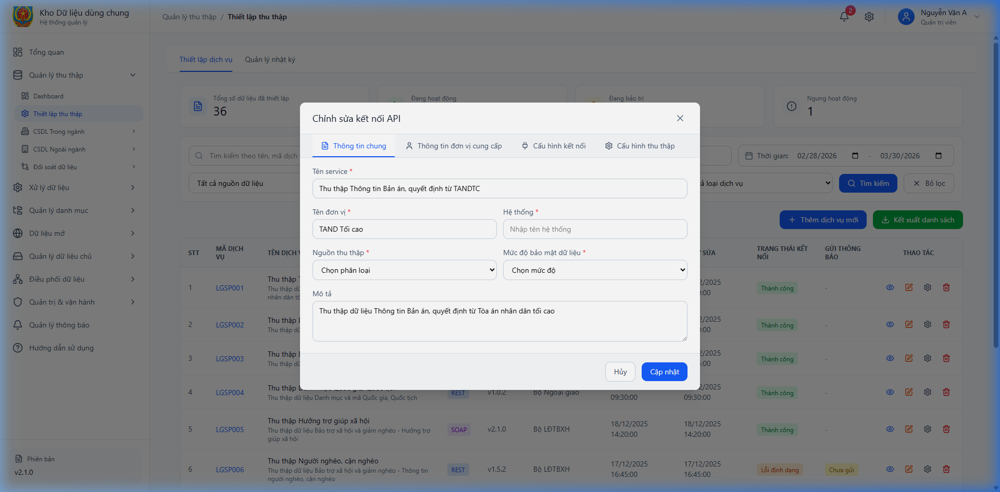

*Hình 4 – Màn hình Chỉnh sửa thiết lập dịch vụ*

4.2.2.2.3.1 Mô tả thông tin trên màn hình
*(Cấu hình tương tự MH02.P01a nhưng hiển thị giá trị đã cấu hình trước đó)*

4.2.2.2.3.2 Chức năng trên màn hình
|  |  |  |  |
| --- | --- | --- | --- |
| **STT** | **Tên chức năng** | **Định dạng** | **Mô tả** |
| 1 | CN01 | Button blue | Cập nhật các thay đổi. |
| 2 | CN02 | Button white | Hủy bỏ. |

#### 4.2.2.2.4. DC1-UC001-MH4 Xem chi tiết thiết lập
- **Mã chức năng:** DC1-TT-QT-001
- **Mã màn hình:** DC1-UC001-MH4

Màn hình

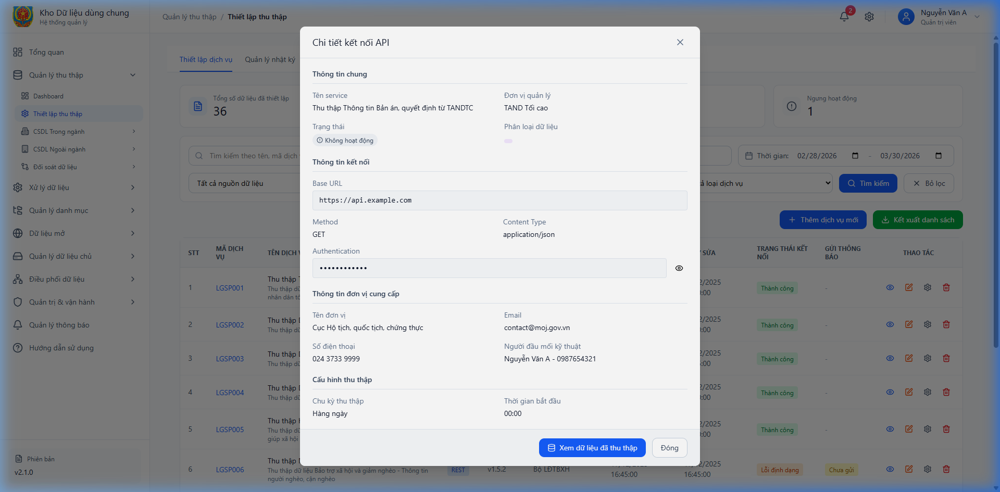

*Hình 5 – Màn hình xem chi tiết thiết lập*

4.2.2.2.4.1 Mô tả thông tin trên màn hình
| **STT** | **Tên trường thông tin** | **Kiểu dữ liệu** | **Bắt buộc** | **Mặc định** | **Mô tả** |
| --- | --- | --- | --- | --- | --- |
| Tên service | VARCHAR2(255) | - | - | Tên dịch vụ đang xem. |
| Đơn vị quản lý | VARCHAR2(255) | - | - | Cơ quan chủ quản cung cấp API. |
| Trạng thái | VARCHAR2(50) | - | - | Hoạt động / Tạm dừng. |
| Thông tin kết nối | TEXT | - | - | Bao gồm: Base URL, Method, Content Type, Authentication. |

4.2.2.2.4.2 Chức năng trên màn hình
|  |  |  |  |
| --- | --- | --- | --- |
| **STT** | **Tên chức năng** | **Định dạng** | **Mô tả** |
| 1 | CN01 | Button text | Đóng popup. |
| 2 | CN02 | Link | Xem lịch sử dữ liệu đã thu thập của dịch vụ này. |

4.2.2.2.4.2 Chức năng trên màn hình
|  |  |  |  |
| --- | --- | --- | --- |
| **STT** | **Tên chức năng** | **Định dạng** | **Mô tả** |
| 1 | CN01 | Button text | Đóng popup. |
| 2 | CN02 | Link | Xem lịch sử dữ liệu đã thu thập của dịch vụ này. |

#### 4.2.2.2.5. DC1-UC001-MH3 Xác nhận xóa thiết lập
- **Mã chức năng:** DC1-TT-QT-001
- **Mã màn hình:** DC1-UC001-MH3

Màn hình

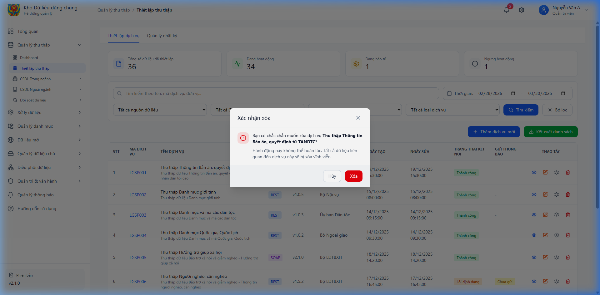

*Hình 6 – Màn hình xác nhận xóa thiết lập*

4.2.2.2.5.1 Mô tả thông tin trên màn hình
| **STT** | **Tên trường thông tin** | **Kiểu dữ liệu** | **Bắt buộc** | **Mặc định** | **Mô tả** |
| --- | --- | --- | --- | --- | --- |
| Thông báo xác nhận | TEXT | - | - | Nội dung: "Bạn có chắc chắn muốn xóa dịch vụ...?" |
| Cảnh báo | TEXT | - | - | "Hành động này không thể hoàn tác..." |

4.2.2.2.5.2 Chức năng trên màn hình
|  |  |  |  |
| --- | --- | --- | --- |
| **STT** | **Tên chức năng** | **Định dạng** | **Mô tả** |
| 1 | CN01 | Button red | Đồng ý xóa vĩnh viễn. |
| 2 | CN02 | Button white | Hủy bỏ. |

#### 4.2.2.2.6. MH02.P04 Cài đặt dịch vụ
Màn hình

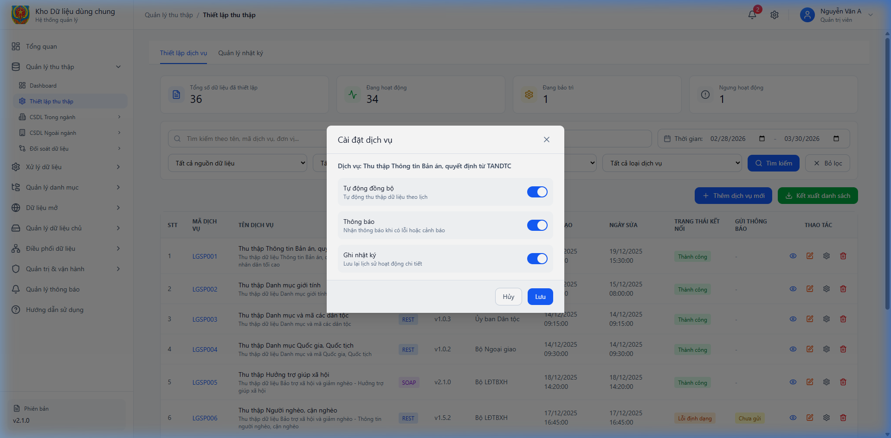

*Hình 7 – Màn hình cài đặt dịch vụ thu thập*

4.2.2.2.6.1 Mô tả thông tin trên màn hình
| **STT** | **Tên trường thông tin** | **Kiểu dữ liệu** | **Bắt buộc** | **Mặc định** | **Mô tả** |
| --- | --- | --- | --- | --- | --- |
| Tự động đồng bộ | TOGGLE | - | Bật | Bật/tắt chế độ tự động chạy theo lịch. |
| Thông báo lỗi | TOGGLE | - | Bật | Gửi thông báo khi tiến trình thất bại. |
| Ghi nhật ký chi tiết | TOGGLE | - | Tắt | Lưu log kỹ thuật chi tiết. |

4.2.2.2.6.2 Chức năng trên màn hình
|  |  |  |  |
| --- | --- | --- | --- |
| **STT** | **Tên chức năng** | **Định dạng** | **Mô tả** |
| 1 | CN01 | Button text | Kiểm tra Endpoint (MH02.P05). |
| 2 | CN02 | Button blue | Lưu cấu hình cài đặt. |

#### 4.2.2.2.7. DC1-UC004-MH1 Màn hình thông báo lỗi tiếp nhận dữ liệu Thông tin Bản án, quyết định
- **Mã chức năng:** DC1-TT-QT-001
- **Mã màn hình:** DC1-UC004-MH1

Màn hình

*Hình 7 – Màn hình cài đặt dịch vụ thu thập*

4.2.2.2.7.1 Mô tả thông tin trên màn hình
| **STT** | **Tên trường thông tin** | **Kiểu dữ liệu** | **Bắt buộc** | **Mặc định** | **Mô tả** |
| --- | --- | --- | --- | --- | --- |
| Tự động đồng bộ | TOGGLE | - | Bật | Bật/tắt chế độ tự động chạy theo lịch. |
| Thông báo lỗi | TOGGLE | - | Bật | Gửi thông báo khi tiến trình thất bại. |
| Ghi nhật ký chi tiết | TOGGLE | - | Tắt | Lưu log kỹ thuật chi tiết. |

4.2.2.2.7.2 Chức năng trên màn hình
|  |  |  |  |
| --- | --- | --- | --- |
| **STT** | **Tên chức năng** | **Định dạng** | **Mô tả** |
| 1 | CN01 | Button text | Kiểm tra Endpoint (MH02.P05). |
| 2 | CN02 | Button blue | Lưu cấu hình cài đặt. |

#### 4.2.2.2.8. DC1-UC005-MH1 Màn hình thông báo lỗi tiếp nhận dữ liệu Danh mục giới tính
- **Mã chức năng:** DC1-TT-QT-001
- **Mã màn hình:** DC1-UC005-MH1

Màn hình

*Hình 7 – Màn hình cài đặt dịch vụ thu thập*

4.2.2.2.8.1 Mô tả thông tin trên màn hình
| **STT** | **Tên trường thông tin** | **Kiểu dữ liệu** | **Bắt buộc** | **Mặc định** | **Mô tả** |
| --- | --- | --- | --- | --- | --- |
| Tự động đồng bộ | TOGGLE | - | Bật | Bật/tắt chế độ tự động chạy theo lịch. |
| Thông báo lỗi | TOGGLE | - | Bật | Gửi thông báo khi tiến trình thất bại. |
| Ghi nhật ký chi tiết | TOGGLE | - | Tắt | Lưu log kỹ thuật chi tiết. |

4.2.2.2.8.2 Chức năng trên màn hình
|  |  |  |  |
| --- | --- | --- | --- |
| **STT** | **Tên chức năng** | **Định dạng** | **Mô tả** |
| 1 | CN01 | Button text | Kiểm tra Endpoint (MH02.P05). |
| 2 | CN02 | Button blue | Lưu cấu hình cài đặt. |

#### 4.2.2.2.9. DC1-UC008-MH1 Màn hình thông báo lỗi tiếp nhận dữ liệu Danh mục và mã các Tôn giáo
- **Mã chức năng:** DC1-TT-QT-001
- **Mã màn hình:** DC1-UC008-MH1

Màn hình

*Hình 7 – Màn hình cài đặt dịch vụ thu thập*

4.2.2.2.9.1 Mô tả thông tin trên màn hình
| **STT** | **Tên trường thông tin** | **Kiểu dữ liệu** | **Bắt buộc** | **Mặc định** | **Mô tả** |
| --- | --- | --- | --- | --- | --- |
| Tự động đồng bộ | TOGGLE | - | Bật | Bật/tắt chế độ tự động chạy theo lịch. |
| Thông báo lỗi | TOGGLE | - | Bật | Gửi thông báo khi tiến trình thất bại. |
| Ghi nhật ký chi tiết | TOGGLE | - | Tắt | Lưu log kỹ thuật chi tiết. |

4.2.2.2.9.2 Chức năng trên màn hình
|  |  |  |  |
| --- | --- | --- | --- |
| **STT** | **Tên chức năng** | **Định dạng** | **Mô tả** |
| 1 | CN01 | Button text | Kiểm tra Endpoint (MH02.P05). |
| 2 | CN02 | Button blue | Lưu cấu hình cài đặt. |

#### 4.2.2.2.10. DC1-UC009-MH1 Màn hình thông báo lỗi tiếp nhận dữ liệu Danh mục cơ quan
- **Mã chức năng:** DC1-TT-QT-001
- **Mã màn hình:** DC1-UC009-MH1

Màn hình

*Hình 7 – Màn hình cài đặt dịch vụ thu thập*

4.2.2.2.10.1 Mô tả thông tin trên màn hình
| **STT** | **Tên trường thông tin** | **Kiểu dữ liệu** | **Bắt buộc** | **Mặc định** | **Mô tả** |
| --- | --- | --- | --- | --- | --- |
| Tự động đồng bộ | TOGGLE | - | Bật | Bật/tắt chế độ tự động chạy theo lịch. |
| Thông báo lỗi | TOGGLE | - | Bật | Gửi thông báo khi tiến trình thất bại. |
| Ghi nhật ký chi tiết | TOGGLE | - | Tắt | Lưu log kỹ thuật chi tiết. |

4.2.2.2.10.2 Chức năng trên màn hình
|  |  |  |  |
| --- | --- | --- | --- |
| **STT** | **Tên chức năng** | **Định dạng** | **Mô tả** |
| 1 | CN01 | Button text | Kiểm tra Endpoint (MH02.P05). |
| 2 | CN02 | Button blue | Lưu cấu hình cài đặt. |

#### 4.2.2.2.11. DC1-UC010-MH1 Màn hình thông báo lỗi tiếp nhận dữ liệu Danh mục đơn vị hành chính
- **Mã chức năng:** DC1-TT-QT-001
- **Mã màn hình:** DC1-UC010-MH1

Màn hình

*Hình 7 – Màn hình cài đặt dịch vụ thu thập*

4.2.2.2.11.1 Mô tả thông tin trên màn hình
| **STT** | **Tên trường thông tin** | **Kiểu dữ liệu** | **Bắt buộc** | **Mặc định** | **Mô tả** |
| --- | --- | --- | --- | --- | --- |
| Tự động đồng bộ | TOGGLE | - | Bật | Bật/tắt chế độ tự động chạy theo lịch. |
| Thông báo lỗi | TOGGLE | - | Bật | Gửi thông báo khi tiến trình thất bại. |
| Ghi nhật ký chi tiết | TOGGLE | - | Tắt | Lưu log kỹ thuật chi tiết. |

4.2.2.2.11.2 Chức năng trên màn hình
|  |  |  |  |
| --- | --- | --- | --- |
| **STT** | **Tên chức năng** | **Định dạng** | **Mô tả** |
| 1 | CN01 | Button text | Kiểm tra Endpoint (MH02.P05). |
| 2 | CN02 | Button blue | Lưu cấu hình cài đặt. |

#### 4.2.2.2.12. DC1-UC011-MH1 Màn hình thông báo lỗi tiếp nhận dữ liệu Danh mục và mã mối quan hệ trong gia đình
- **Mã chức năng:** DC1-TT-QT-001
- **Mã màn hình:** DC1-UC011-MH1

Màn hình

*Hình 7 – Màn hình cài đặt dịch vụ thu thập*

4.2.2.2.12.1 Mô tả thông tin trên màn hình
| **STT** | **Tên trường thông tin** | **Kiểu dữ liệu** | **Bắt buộc** | **Mặc định** | **Mô tả** |
| --- | --- | --- | --- | --- | --- |
| Tự động đồng bộ | TOGGLE | - | Bật | Bật/tắt chế độ tự động chạy theo lịch. |
| Thông báo lỗi | TOGGLE | - | Bật | Gửi thông báo khi tiến trình thất bại. |
| Ghi nhật ký chi tiết | TOGGLE | - | Tắt | Lưu log kỹ thuật chi tiết. |

4.2.2.2.12.2 Chức năng trên màn hình
|  |  |  |  |
| --- | --- | --- | --- |
| **STT** | **Tên chức năng** | **Định dạng** | **Mô tả** |
| 1 | CN01 | Button text | Kiểm tra Endpoint (MH02.P05). |
| 2 | CN02 | Button blue | Lưu cấu hình cài đặt. |

#### 4.2.2.2.13. DC1-UC012-MH1 Màn hình thông báo lỗi tiếp nhận dữ liệu Danh mục mã giấy tờ tùy thân
- **Mã chức năng:** DC1-TT-QT-001
- **Mã màn hình:** DC1-UC012-MH1

Màn hình

*Hình 7 – Màn hình cài đặt dịch vụ thu thập*

4.2.2.2.13.1 Mô tả thông tin trên màn hình
| **STT** | **Tên trường thông tin** | **Kiểu dữ liệu** | **Bắt buộc** | **Mặc định** | **Mô tả** |
| --- | --- | --- | --- | --- | --- |
| Tự động đồng bộ | TOGGLE | - | Bật | Bật/tắt chế độ tự động chạy theo lịch. |
| Thông báo lỗi | TOGGLE | - | Bật | Gửi thông báo khi tiến trình thất bại. |
| Ghi nhật ký chi tiết | TOGGLE | - | Tắt | Lưu log kỹ thuật chi tiết. |

4.2.2.2.13.2 Chức năng trên màn hình
|  |  |  |  |
| --- | --- | --- | --- |
| **STT** | **Tên chức năng** | **Định dạng** | **Mô tả** |
| 1 | CN01 | Button text | Kiểm tra Endpoint (MH02.P05). |
| 2 | CN02 | Button blue | Lưu cấu hình cài đặt. |

#### 4.2.2.2.14. DC1-UC013-MH1 Màn hình thông báo lỗi tiếp nhận dữ liệu Bảo trợ xã hội và giảm nghèo - Hưởng trợ giúp xã hội
- **Mã chức năng:** DC1-TT-QT-001
- **Mã màn hình:** DC1-UC013-MH1

Màn hình

*Hình 7 – Màn hình cài đặt dịch vụ thu thập*

4.2.2.2.14.1 Mô tả thông tin trên màn hình
| **STT** | **Tên trường thông tin** | **Kiểu dữ liệu** | **Bắt buộc** | **Mặc định** | **Mô tả** |
| --- | --- | --- | --- | --- | --- |
| Tự động đồng bộ | TOGGLE | - | Bật | Bật/tắt chế độ tự động chạy theo lịch. |
| Thông báo lỗi | TOGGLE | - | Bật | Gửi thông báo khi tiến trình thất bại. |
| Ghi nhật ký chi tiết | TOGGLE | - | Tắt | Lưu log kỹ thuật chi tiết. |

4.2.2.2.14.2 Chức năng trên màn hình
|  |  |  |  |
| --- | --- | --- | --- |
| **STT** | **Tên chức năng** | **Định dạng** | **Mô tả** |
| 1 | CN01 | Button text | Kiểm tra Endpoint (MH02.P05). |
| 2 | CN02 | Button blue | Lưu cấu hình cài đặt. |

#### 4.2.2.2.15. DC1-UC015-MH1 Màn hình thông báo lỗi tiếp nhận dữ liệu Bảo trợ xã hội và giảm nghèo - Thông tin người nghèo, cận nghèo
- **Mã chức năng:** DC1-TT-QT-001
- **Mã màn hình:** DC1-UC015-MH1

Màn hình

*Hình 7 – Màn hình cài đặt dịch vụ thu thập*

4.2.2.2.15.1 Mô tả thông tin trên màn hình
| **STT** | **Tên trường thông tin** | **Kiểu dữ liệu** | **Bắt buộc** | **Mặc định** | **Mô tả** |
| --- | --- | --- | --- | --- | --- |
| Tự động đồng bộ | TOGGLE | - | Bật | Bật/tắt chế độ tự động chạy theo lịch. |
| Thông báo lỗi | TOGGLE | - | Bật | Gửi thông báo khi tiến trình thất bại. |
| Ghi nhật ký chi tiết | TOGGLE | - | Tắt | Lưu log kỹ thuật chi tiết. |

4.2.2.2.15.2 Chức năng trên màn hình
|  |  |  |  |
| --- | --- | --- | --- |
| **STT** | **Tên chức năng** | **Định dạng** | **Mô tả** |
| 1 | CN01 | Button text | Kiểm tra Endpoint (MH02.P05). |
| 2 | CN02 | Button blue | Lưu cấu hình cài đặt. |

#### 4.2.2.2.16. DC1-UC016-MH1 Màn hình thông báo lỗi tiếp nhận dữ liệu Bảo trợ xã hội và giảm nghèo - Người đơn thân
- **Mã chức năng:** DC1-TT-QT-001
- **Mã màn hình:** DC1-UC016-MH1

Màn hình

*Hình 7 – Màn hình cài đặt dịch vụ thu thập*

4.2.2.2.16.1 Mô tả thông tin trên màn hình
| **STT** | **Tên trường thông tin** | **Kiểu dữ liệu** | **Bắt buộc** | **Mặc định** | **Mô tả** |
| --- | --- | --- | --- | --- | --- |
| Tự động đồng bộ | TOGGLE | - | Bật | Bật/tắt chế độ tự động chạy theo lịch. |
| Thông báo lỗi | TOGGLE | - | Bật | Gửi thông báo khi tiến trình thất bại. |
| Ghi nhật ký chi tiết | TOGGLE | - | Tắt | Lưu log kỹ thuật chi tiết. |

4.2.2.2.16.2 Chức năng trên màn hình
|  |  |  |  |
| --- | --- | --- | --- |
| **STT** | **Tên chức năng** | **Định dạng** | **Mô tả** |
| 1 | CN01 | Button text | Kiểm tra Endpoint (MH02.P05). |
| 2 | CN02 | Button blue | Lưu cấu hình cài đặt. |

#### 4.2.2.2.17. DC1-UC017-MH1 Màn hình thông báo lỗi tiếp nhận dữ liệu Bảo trợ xã hội và giảm nghèo - Trẻ em là đối tượng bảo trợ xã hội
- **Mã chức năng:** DC1-TT-QT-001
- **Mã màn hình:** DC1-UC017-MH1

Màn hình

*Hình 7 – Màn hình cài đặt dịch vụ thu thập*

4.2.2.2.17.1 Mô tả thông tin trên màn hình
| **STT** | **Tên trường thông tin** | **Kiểu dữ liệu** | **Bắt buộc** | **Mặc định** | **Mô tả** |
| --- | --- | --- | --- | --- | --- |
| Tự động đồng bộ | TOGGLE | - | Bật | Bật/tắt chế độ tự động chạy theo lịch. |
| Thông báo lỗi | TOGGLE | - | Bật | Gửi thông báo khi tiến trình thất bại. |
| Ghi nhật ký chi tiết | TOGGLE | - | Tắt | Lưu log kỹ thuật chi tiết. |

4.2.2.2.17.2 Chức năng trên màn hình
|  |  |  |  |
| --- | --- | --- | --- |
| **STT** | **Tên chức năng** | **Định dạng** | **Mô tả** |
| 1 | CN01 | Button text | Kiểm tra Endpoint (MH02.P05). |
| 2 | CN02 | Button blue | Lưu cấu hình cài đặt. |

#### 4.2.2.2.18. DC1-UC018-MH1 Màn hình thông báo lỗi tiếp nhận dữ liệu Bảo trợ xã hội và giảm nghèo -Người có HIV
- **Mã chức năng:** DC1-TT-QT-001
- **Mã màn hình:** DC1-UC018-MH1

Màn hình

*Hình 7 – Màn hình cài đặt dịch vụ thu thập*

4.2.2.2.18.1 Mô tả thông tin trên màn hình
| **STT** | **Tên trường thông tin** | **Kiểu dữ liệu** | **Bắt buộc** | **Mặc định** | **Mô tả** |
| --- | --- | --- | --- | --- | --- |
| Tự động đồng bộ | TOGGLE | - | Bật | Bật/tắt chế độ tự động chạy theo lịch. |
| Thông báo lỗi | TOGGLE | - | Bật | Gửi thông báo khi tiến trình thất bại. |
| Ghi nhật ký chi tiết | TOGGLE | - | Tắt | Lưu log kỹ thuật chi tiết. |

4.2.2.2.18.2 Chức năng trên màn hình
|  |  |  |  |
| --- | --- | --- | --- |
| **STT** | **Tên chức năng** | **Định dạng** | **Mô tả** |
| 1 | CN01 | Button text | Kiểm tra Endpoint (MH02.P05). |
| 2 | CN02 | Button blue | Lưu cấu hình cài đặt. |

#### 4.2.2.2.19. DC1-UC019-MH1 Màn hình thông báo lỗi tiếp nhận dữ liệu Bảo trợ xã hội và giảm nghèo -Người cao tuổi
- **Mã chức năng:** DC1-TT-QT-001
- **Mã màn hình:** DC1-UC019-MH1

Màn hình

*Hình 7 – Màn hình cài đặt dịch vụ thu thập*

4.2.2.2.19.1 Mô tả thông tin trên màn hình
| **STT** | **Tên trường thông tin** | **Kiểu dữ liệu** | **Bắt buộc** | **Mặc định** | **Mô tả** |
| --- | --- | --- | --- | --- | --- |
| Tự động đồng bộ | TOGGLE | - | Bật | Bật/tắt chế độ tự động chạy theo lịch. |
| Thông báo lỗi | TOGGLE | - | Bật | Gửi thông báo khi tiến trình thất bại. |
| Ghi nhật ký chi tiết | TOGGLE | - | Tắt | Lưu log kỹ thuật chi tiết. |

4.2.2.2.19.2 Chức năng trên màn hình
|  |  |  |  |
| --- | --- | --- | --- |
| **STT** | **Tên chức năng** | **Định dạng** | **Mô tả** |
| 1 | CN01 | Button text | Kiểm tra Endpoint (MH02.P05). |
| 2 | CN02 | Button blue | Lưu cấu hình cài đặt. |

#### 4.2.2.2.20. DC1-UC020-MH1 Màn hình thông báo lỗi tiếp nhận dữ liệu Bảo trợ xã hội và giảm nghèo - Thông tin về người khuyết tật
- **Mã chức năng:** DC1-TT-QT-001
- **Mã màn hình:** DC1-UC020-MH1

Màn hình

*Hình 7 – Màn hình cài đặt dịch vụ thu thập*

4.2.2.2.20.1 Mô tả thông tin trên màn hình
| **STT** | **Tên trường thông tin** | **Kiểu dữ liệu** | **Bắt buộc** | **Mặc định** | **Mô tả** |
| --- | --- | --- | --- | --- | --- |
| Tự động đồng bộ | TOGGLE | - | Bật | Bật/tắt chế độ tự động chạy theo lịch. |
| Thông báo lỗi | TOGGLE | - | Bật | Gửi thông báo khi tiến trình thất bại. |
| Ghi nhật ký chi tiết | TOGGLE | - | Tắt | Lưu log kỹ thuật chi tiết. |

4.2.2.2.20.2 Chức năng trên màn hình
|  |  |  |  |
| --- | --- | --- | --- |
| **STT** | **Tên chức năng** | **Định dạng** | **Mô tả** |
| 1 | CN01 | Button text | Kiểm tra Endpoint (MH02.P05). |
| 2 | CN02 | Button blue | Lưu cấu hình cài đặt. |

#### 4.2.2.2.21. DC1-UC021-MH1 Màn hình thông báo lỗi tiếp nhận dữ liệu Người có công - Hồ sơ công nhận người có công
- **Mã chức năng:** DC1-TT-QT-001
- **Mã màn hình:** DC1-UC021-MH1

Màn hình

*Hình 7 – Màn hình cài đặt dịch vụ thu thập*

4.2.2.2.21.1 Mô tả thông tin trên màn hình
| **STT** | **Tên trường thông tin** | **Kiểu dữ liệu** | **Bắt buộc** | **Mặc định** | **Mô tả** |
| --- | --- | --- | --- | --- | --- |
| Tự động đồng bộ | TOGGLE | - | Bật | Bật/tắt chế độ tự động chạy theo lịch. |
| Thông báo lỗi | TOGGLE | - | Bật | Gửi thông báo khi tiến trình thất bại. |
| Ghi nhật ký chi tiết | TOGGLE | - | Tắt | Lưu log kỹ thuật chi tiết. |

4.2.2.2.21.2 Chức năng trên màn hình
|  |  |  |  |
| --- | --- | --- | --- |
| **STT** | **Tên chức năng** | **Định dạng** | **Mô tả** |
| 1 | CN01 | Button text | Kiểm tra Endpoint (MH02.P05). |
| 2 | CN02 | Button blue | Lưu cấu hình cài đặt. |

#### 4.2.2.2.22. DC1-UC022-MH1 Màn hình thông báo lỗi tiếp nhận dữ liệu Người có công - Hồ sơ liệt sĩ:
- **Mã chức năng:** DC1-TT-QT-001
- **Mã màn hình:** DC1-UC022-MH1

Màn hình

*Hình 7 – Màn hình cài đặt dịch vụ thu thập*

4.2.2.2.22.1 Mô tả thông tin trên màn hình
| **STT** | **Tên trường thông tin** | **Kiểu dữ liệu** | **Bắt buộc** | **Mặc định** | **Mô tả** |
| --- | --- | --- | --- | --- | --- |
| Tự động đồng bộ | TOGGLE | - | Bật | Bật/tắt chế độ tự động chạy theo lịch. |
| Thông báo lỗi | TOGGLE | - | Bật | Gửi thông báo khi tiến trình thất bại. |
| Ghi nhật ký chi tiết | TOGGLE | - | Tắt | Lưu log kỹ thuật chi tiết. |

4.2.2.2.22.2 Chức năng trên màn hình
|  |  |  |  |
| --- | --- | --- | --- |
| **STT** | **Tên chức năng** | **Định dạng** | **Mô tả** |
| 1 | CN01 | Button text | Kiểm tra Endpoint (MH02.P05). |
| 2 | CN02 | Button blue | Lưu cấu hình cài đặt. |

#### 4.2.2.2.23. DC1-UC023-MH1 Màn hình thông báo lỗi tiếp nhận dữ liệu Người có công - Hồ sơ công nhận thân nhân người có công
- **Mã chức năng:** DC1-TT-QT-001
- **Mã màn hình:** DC1-UC023-MH1

Màn hình

*Hình 7 – Màn hình cài đặt dịch vụ thu thập*

4.2.2.2.23.1 Mô tả thông tin trên màn hình
| **STT** | **Tên trường thông tin** | **Kiểu dữ liệu** | **Bắt buộc** | **Mặc định** | **Mô tả** |
| --- | --- | --- | --- | --- | --- |
| Tự động đồng bộ | TOGGLE | - | Bật | Bật/tắt chế độ tự động chạy theo lịch. |
| Thông báo lỗi | TOGGLE | - | Bật | Gửi thông báo khi tiến trình thất bại. |
| Ghi nhật ký chi tiết | TOGGLE | - | Tắt | Lưu log kỹ thuật chi tiết. |

4.2.2.2.23.2 Chức năng trên màn hình
|  |  |  |  |
| --- | --- | --- | --- |
| **STT** | **Tên chức năng** | **Định dạng** | **Mô tả** |
| 1 | CN01 | Button text | Kiểm tra Endpoint (MH02.P05). |
| 2 | CN02 | Button blue | Lưu cấu hình cài đặt. |

#### 4.2.2.2.24. DC1-UC024-MH1 Màn hình thông báo lỗi tiếp nhận dữ liệu Trẻ em -Trẻ em
- **Mã chức năng:** DC1-TT-QT-001
- **Mã màn hình:** DC1-UC024-MH1

Màn hình

*Hình 7 – Màn hình cài đặt dịch vụ thu thập*

4.2.2.2.24.1 Mô tả thông tin trên màn hình
| **STT** | **Tên trường thông tin** | **Kiểu dữ liệu** | **Bắt buộc** | **Mặc định** | **Mô tả** |
| --- | --- | --- | --- | --- | --- |
| Tự động đồng bộ | TOGGLE | - | Bật | Bật/tắt chế độ tự động chạy theo lịch. |
| Thông báo lỗi | TOGGLE | - | Bật | Gửi thông báo khi tiến trình thất bại. |
| Ghi nhật ký chi tiết | TOGGLE | - | Tắt | Lưu log kỹ thuật chi tiết. |

4.2.2.2.24.2 Chức năng trên màn hình
|  |  |  |  |
| --- | --- | --- | --- |
| **STT** | **Tên chức năng** | **Định dạng** | **Mô tả** |
| 1 | CN01 | Button text | Kiểm tra Endpoint (MH02.P05). |
| 2 | CN02 | Button blue | Lưu cấu hình cài đặt. |

#### 4.2.2.2.25. DC1-UC025-MH1 Màn hình thông báo lỗi tiếp nhận dữ liệu hồ sơ đăng ký khai sinh
- **Mã chức năng:** DC1-TT-QT-001
- **Mã màn hình:** DC1-UC025-MH1

Màn hình

*Hình 7 – Màn hình cài đặt dịch vụ thu thập*

4.2.2.2.25.1 Mô tả thông tin trên màn hình
| **STT** | **Tên trường thông tin** | **Kiểu dữ liệu** | **Bắt buộc** | **Mặc định** | **Mô tả** |
| --- | --- | --- | --- | --- | --- |
| Tự động đồng bộ | TOGGLE | - | Bật | Bật/tắt chế độ tự động chạy theo lịch. |
| Thông báo lỗi | TOGGLE | - | Bật | Gửi thông báo khi tiến trình thất bại. |
| Ghi nhật ký chi tiết | TOGGLE | - | Tắt | Lưu log kỹ thuật chi tiết. |

4.2.2.2.25.2 Chức năng trên màn hình
|  |  |  |  |
| --- | --- | --- | --- |
| **STT** | **Tên chức năng** | **Định dạng** | **Mô tả** |
| 1 | CN01 | Button text | Kiểm tra Endpoint (MH02.P05). |
| 2 | CN02 | Button blue | Lưu cấu hình cài đặt. |

#### 4.2.2.2.26. DC1-UC026-MH1 Màn hình thông báo lỗi tiếp nhận dữ liệu hồ sơ đăng ký kết hôn
- **Mã chức năng:** DC1-TT-QT-001
- **Mã màn hình:** DC1-UC026-MH1

Màn hình

*Hình 7 – Màn hình cài đặt dịch vụ thu thập*

4.2.2.2.26.1 Mô tả thông tin trên màn hình
| **STT** | **Tên trường thông tin** | **Kiểu dữ liệu** | **Bắt buộc** | **Mặc định** | **Mô tả** |
| --- | --- | --- | --- | --- | --- |
| Tự động đồng bộ | TOGGLE | - | Bật | Bật/tắt chế độ tự động chạy theo lịch. |
| Thông báo lỗi | TOGGLE | - | Bật | Gửi thông báo khi tiến trình thất bại. |
| Ghi nhật ký chi tiết | TOGGLE | - | Tắt | Lưu log kỹ thuật chi tiết. |

4.2.2.2.26.2 Chức năng trên màn hình
|  |  |  |  |
| --- | --- | --- | --- |
| **STT** | **Tên chức năng** | **Định dạng** | **Mô tả** |
| 1 | CN01 | Button text | Kiểm tra Endpoint (MH02.P05). |
| 2 | CN02 | Button blue | Lưu cấu hình cài đặt. |

#### 4.2.2.2.27. DC1-UC027-MH1 Màn hình thông báo lỗi tiếp nhận dữ liệu hồ sơ cấp Giấy xác nhận tình trạng hôn nhân
- **Mã chức năng:** DC1-TT-QT-001
- **Mã màn hình:** DC1-UC027-MH1

Màn hình

*Hình 7 – Màn hình cài đặt dịch vụ thu thập*

4.2.2.2.27.1 Mô tả thông tin trên màn hình
| **STT** | **Tên trường thông tin** | **Kiểu dữ liệu** | **Bắt buộc** | **Mặc định** | **Mô tả** |
| --- | --- | --- | --- | --- | --- |
| Tự động đồng bộ | TOGGLE | - | Bật | Bật/tắt chế độ tự động chạy theo lịch. |
| Thông báo lỗi | TOGGLE | - | Bật | Gửi thông báo khi tiến trình thất bại. |
| Ghi nhật ký chi tiết | TOGGLE | - | Tắt | Lưu log kỹ thuật chi tiết. |

4.2.2.2.27.2 Chức năng trên màn hình
|  |  |  |  |
| --- | --- | --- | --- |
| **STT** | **Tên chức năng** | **Định dạng** | **Mô tả** |
| 1 | CN01 | Button text | Kiểm tra Endpoint (MH02.P05). |
| 2 | CN02 | Button blue | Lưu cấu hình cài đặt. |

#### 4.2.2.2.28. DC1-UC028-MH1 Màn hình thông báo lỗi tiếp nhận dữ liệu hồ sơ đăng ký khai tử
- **Mã chức năng:** DC1-TT-QT-001
- **Mã màn hình:** DC1-UC028-MH1

Màn hình

*Hình 7 – Màn hình cài đặt dịch vụ thu thập*

4.2.2.2.28.1 Mô tả thông tin trên màn hình
| **STT** | **Tên trường thông tin** | **Kiểu dữ liệu** | **Bắt buộc** | **Mặc định** | **Mô tả** |
| --- | --- | --- | --- | --- | --- |
| Tự động đồng bộ | TOGGLE | - | Bật | Bật/tắt chế độ tự động chạy theo lịch. |
| Thông báo lỗi | TOGGLE | - | Bật | Gửi thông báo khi tiến trình thất bại. |
| Ghi nhật ký chi tiết | TOGGLE | - | Tắt | Lưu log kỹ thuật chi tiết. |

4.2.2.2.28.2 Chức năng trên màn hình
|  |  |  |  |
| --- | --- | --- | --- |
| **STT** | **Tên chức năng** | **Định dạng** | **Mô tả** |
| 1 | CN01 | Button text | Kiểm tra Endpoint (MH02.P05). |
| 2 | CN02 | Button blue | Lưu cấu hình cài đặt. |

#### 4.2.2.2.29. DC1-UC029-MH1 Màn hình thông báo lỗi tiếp nhận dữ liệu hồ sơ đăng ký nhận cha, mẹ, con
- **Mã chức năng:** DC1-TT-QT-001
- **Mã màn hình:** DC1-UC029-MH1

Màn hình

*Hình 7 – Màn hình cài đặt dịch vụ thu thập*

4.2.2.2.29.1 Mô tả thông tin trên màn hình
| **STT** | **Tên trường thông tin** | **Kiểu dữ liệu** | **Bắt buộc** | **Mặc định** | **Mô tả** |
| --- | --- | --- | --- | --- | --- |
| Tự động đồng bộ | TOGGLE | - | Bật | Bật/tắt chế độ tự động chạy theo lịch. |
| Thông báo lỗi | TOGGLE | - | Bật | Gửi thông báo khi tiến trình thất bại. |
| Ghi nhật ký chi tiết | TOGGLE | - | Tắt | Lưu log kỹ thuật chi tiết. |

4.2.2.2.29.2 Chức năng trên màn hình
|  |  |  |  |
| --- | --- | --- | --- |
| **STT** | **Tên chức năng** | **Định dạng** | **Mô tả** |
| 1 | CN01 | Button text | Kiểm tra Endpoint (MH02.P05). |
| 2 | CN02 | Button blue | Lưu cấu hình cài đặt. |

#### 4.2.2.2.30. DC1-UC030-MH1 Màn hình thông báo lỗi tiếp nhận dữ liệu hồ sơ đăng ký nuôi con nuôi
- **Mã chức năng:** DC1-TT-QT-001
- **Mã màn hình:** DC1-UC030-MH1

Màn hình

*Hình 7 – Màn hình cài đặt dịch vụ thu thập*

4.2.2.2.30.1 Mô tả thông tin trên màn hình
| **STT** | **Tên trường thông tin** | **Kiểu dữ liệu** | **Bắt buộc** | **Mặc định** | **Mô tả** |
| --- | --- | --- | --- | --- | --- |
| Tự động đồng bộ | TOGGLE | - | Bật | Bật/tắt chế độ tự động chạy theo lịch. |
| Thông báo lỗi | TOGGLE | - | Bật | Gửi thông báo khi tiến trình thất bại. |
| Ghi nhật ký chi tiết | TOGGLE | - | Tắt | Lưu log kỹ thuật chi tiết. |

4.2.2.2.30.2 Chức năng trên màn hình
|  |  |  |  |
| --- | --- | --- | --- |
| **STT** | **Tên chức năng** | **Định dạng** | **Mô tả** |
| 1 | CN01 | Button text | Kiểm tra Endpoint (MH02.P05). |
| 2 | CN02 | Button blue | Lưu cấu hình cài đặt. |

#### 4.2.2.2.31. DC1-UC031-MH1 Màn hình thông báo lỗi tiếp nhận dữ liệu hồ sơ đăng ký giám hộ
- **Mã chức năng:** DC1-TT-QT-001
- **Mã màn hình:** DC1-UC031-MH1

Màn hình

*Hình 7 – Màn hình cài đặt dịch vụ thu thập*

4.2.2.2.31.1 Mô tả thông tin trên màn hình
| **STT** | **Tên trường thông tin** | **Kiểu dữ liệu** | **Bắt buộc** | **Mặc định** | **Mô tả** |
| --- | --- | --- | --- | --- | --- |
| Tự động đồng bộ | TOGGLE | - | Bật | Bật/tắt chế độ tự động chạy theo lịch. |
| Thông báo lỗi | TOGGLE | - | Bật | Gửi thông báo khi tiến trình thất bại. |
| Ghi nhật ký chi tiết | TOGGLE | - | Tắt | Lưu log kỹ thuật chi tiết. |

4.2.2.2.31.2 Chức năng trên màn hình
|  |  |  |  |
| --- | --- | --- | --- |
| **STT** | **Tên chức năng** | **Định dạng** | **Mô tả** |
| 1 | CN01 | Button text | Kiểm tra Endpoint (MH02.P05). |
| 2 | CN02 | Button blue | Lưu cấu hình cài đặt. |

#### 4.2.2.2.32. DC1-UC032-MH1 Màn hình thông báo lỗi tiếp nhận dữ liệu hồ sơ đăng ký chấm dứt giám hộ
- **Mã chức năng:** DC1-TT-QT-001
- **Mã màn hình:** DC1-UC032-MH1

Màn hình

*Hình 7 – Màn hình cài đặt dịch vụ thu thập*

4.2.2.2.32.1 Mô tả thông tin trên màn hình
| **STT** | **Tên trường thông tin** | **Kiểu dữ liệu** | **Bắt buộc** | **Mặc định** | **Mô tả** |
| --- | --- | --- | --- | --- | --- |
| Tự động đồng bộ | TOGGLE | - | Bật | Bật/tắt chế độ tự động chạy theo lịch. |
| Thông báo lỗi | TOGGLE | - | Bật | Gửi thông báo khi tiến trình thất bại. |
| Ghi nhật ký chi tiết | TOGGLE | - | Tắt | Lưu log kỹ thuật chi tiết. |

4.2.2.2.32.2 Chức năng trên màn hình
|  |  |  |  |
| --- | --- | --- | --- |
| **STT** | **Tên chức năng** | **Định dạng** | **Mô tả** |
| 1 | CN01 | Button text | Kiểm tra Endpoint (MH02.P05). |
| 2 | CN02 | Button blue | Lưu cấu hình cài đặt. |

#### 4.2.2.2.33. DC1-UC033-MH1 Màn hình thông báo lỗi tiếp nhận dữ liệu hồ sơ đăng ký thay đổi, cải chính, bổ sung thông tin hộ tịch, xác định lại dân tộc
- **Mã chức năng:** DC1-TT-QT-001
- **Mã màn hình:** DC1-UC033-MH1

Màn hình

*Hình 7 – Màn hình cài đặt dịch vụ thu thập*

4.2.2.2.33.1 Mô tả thông tin trên màn hình
| **STT** | **Tên trường thông tin** | **Kiểu dữ liệu** | **Bắt buộc** | **Mặc định** | **Mô tả** |
| --- | --- | --- | --- | --- | --- |
| Tự động đồng bộ | TOGGLE | - | Bật | Bật/tắt chế độ tự động chạy theo lịch. |
| Thông báo lỗi | TOGGLE | - | Bật | Gửi thông báo khi tiến trình thất bại. |
| Ghi nhật ký chi tiết | TOGGLE | - | Tắt | Lưu log kỹ thuật chi tiết. |

4.2.2.2.33.2 Chức năng trên màn hình
|  |  |  |  |
| --- | --- | --- | --- |
| **STT** | **Tên chức năng** | **Định dạng** | **Mô tả** |
| 1 | CN01 | Button text | Kiểm tra Endpoint (MH02.P05). |
| 2 | CN02 | Button blue | Lưu cấu hình cài đặt. |

#### 4.2.2.2.34. DC1-UC034-MH1 Màn hình thông báo lỗi tiếp nhận dữ liệu hồ sơ đăng ký giám sát việc giám hộ
- **Mã chức năng:** DC1-TT-QT-001
- **Mã màn hình:** DC1-UC034-MH1

Màn hình

*Hình 7 – Màn hình cài đặt dịch vụ thu thập*

4.2.2.2.34.1 Mô tả thông tin trên màn hình
| **STT** | **Tên trường thông tin** | **Kiểu dữ liệu** | **Bắt buộc** | **Mặc định** | **Mô tả** |
| --- | --- | --- | --- | --- | --- |
| Tự động đồng bộ | TOGGLE | - | Bật | Bật/tắt chế độ tự động chạy theo lịch. |
| Thông báo lỗi | TOGGLE | - | Bật | Gửi thông báo khi tiến trình thất bại. |
| Ghi nhật ký chi tiết | TOGGLE | - | Tắt | Lưu log kỹ thuật chi tiết. |

4.2.2.2.34.2 Chức năng trên màn hình
|  |  |  |  |
| --- | --- | --- | --- |
| **STT** | **Tên chức năng** | **Định dạng** | **Mô tả** |
| 1 | CN01 | Button text | Kiểm tra Endpoint (MH02.P05). |
| 2 | CN02 | Button blue | Lưu cấu hình cài đặt. |

#### 4.2.2.2.35. DC1-UC035-MH1 Màn hình thông báo lỗi tiếp nhận dữ liệu hồ sơ đăng ký chấm dứt giám sát việc giám hộ
- **Mã chức năng:** DC1-TT-QT-001
- **Mã màn hình:** DC1-UC035-MH1

Màn hình

*Hình 7 – Màn hình cài đặt dịch vụ thu thập*

4.2.2.2.35.1 Mô tả thông tin trên màn hình
| **STT** | **Tên trường thông tin** | **Kiểu dữ liệu** | **Bắt buộc** | **Mặc định** | **Mô tả** |
| --- | --- | --- | --- | --- | --- |
| Tự động đồng bộ | TOGGLE | - | Bật | Bật/tắt chế độ tự động chạy theo lịch. |
| Thông báo lỗi | TOGGLE | - | Bật | Gửi thông báo khi tiến trình thất bại. |
| Ghi nhật ký chi tiết | TOGGLE | - | Tắt | Lưu log kỹ thuật chi tiết. |

4.2.2.2.35.2 Chức năng trên màn hình
|  |  |  |  |
| --- | --- | --- | --- |
| **STT** | **Tên chức năng** | **Định dạng** | **Mô tả** |
| 1 | CN01 | Button text | Kiểm tra Endpoint (MH02.P05). |
| 2 | CN02 | Button blue | Lưu cấu hình cài đặt. |

#### 4.2.2.2.36. DC1-UC036-MH1 Màn hình thông báo lỗi tiếp nhận dữ liệu hồ sơ ghi vào sổ việc ly hôn/hủy việc kết hôn đã thực hiện tại cơ quan có thẩm quyền của nước ng
- **Mã chức năng:** DC1-TT-QT-001
- **Mã màn hình:** DC1-UC036-MH1

Màn hình

*Hình 7 – Màn hình cài đặt dịch vụ thu thập*

4.2.2.2.36.1 Mô tả thông tin trên màn hình
| **STT** | **Tên trường thông tin** | **Kiểu dữ liệu** | **Bắt buộc** | **Mặc định** | **Mô tả** |
| --- | --- | --- | --- | --- | --- |
| Tự động đồng bộ | TOGGLE | - | Bật | Bật/tắt chế độ tự động chạy theo lịch. |
| Thông báo lỗi | TOGGLE | - | Bật | Gửi thông báo khi tiến trình thất bại. |
| Ghi nhật ký chi tiết | TOGGLE | - | Tắt | Lưu log kỹ thuật chi tiết. |

4.2.2.2.36.2 Chức năng trên màn hình
|  |  |  |  |
| --- | --- | --- | --- |
| **STT** | **Tên chức năng** | **Định dạng** | **Mô tả** |
| 1 | CN01 | Button text | Kiểm tra Endpoint (MH02.P05). |
| 2 | CN02 | Button blue | Lưu cấu hình cài đặt. |

#### 4.2.2.2.37. DC1-UC037-MH1 Màn hình thông báo lỗi tiếp nhận dữ liệu Nhập Quốc tịch
- **Mã chức năng:** DC1-TT-QT-001
- **Mã màn hình:** DC1-UC037-MH1

Màn hình

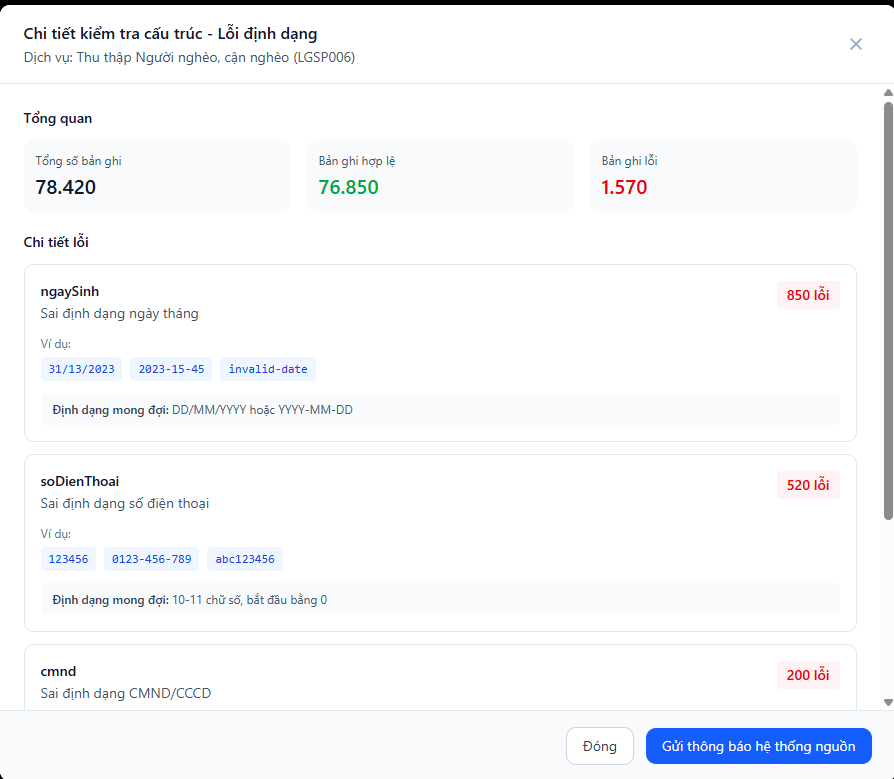

*Hình 7 – Màn hình cài đặt dịch vụ thu thập*

4.2.2.2.37.1 Mô tả thông tin trên màn hình
| **STT** | **Tên trường thông tin** | **Kiểu dữ liệu** | **Bắt buộc** | **Mặc định** | **Mô tả** |
| --- | --- | --- | --- | --- | --- |
| Tự động đồng bộ | TOGGLE | - | Bật | Bật/tắt chế độ tự động chạy theo lịch. |
| Thông báo lỗi | TOGGLE | - | Bật | Gửi thông báo khi tiến trình thất bại. |
| Ghi nhật ký chi tiết | TOGGLE | - | Tắt | Lưu log kỹ thuật chi tiết. |

4.2.2.2.37.2 Chức năng trên màn hình
|  |  |  |  |
| --- | --- | --- | --- |
| **STT** | **Tên chức năng** | **Định dạng** | **Mô tả** |
| 1 | CN01 | Button text | Kiểm tra Endpoint (MH02.P05). |
| 2 | CN02 | Button blue | Lưu cấu hình cài đặt. |

#### 4.2.2.2.38. DC1-UC038-MH1 Màn hình thông báo lỗi tiếp nhận dữ liệu Thôi Quốc tịch
- **Mã chức năng:** DC1-TT-QT-001
- **Mã màn hình:** DC1-UC038-MH1

Màn hình

*Hình 7 – Màn hình cài đặt dịch vụ thu thập*

4.2.2.2.38.1 Mô tả thông tin trên màn hình
| **STT** | **Tên trường thông tin** | **Kiểu dữ liệu** | **Bắt buộc** | **Mặc định** | **Mô tả** |
| --- | --- | --- | --- | --- | --- |
| Tự động đồng bộ | TOGGLE | - | Bật | Bật/tắt chế độ tự động chạy theo lịch. |
| Thông báo lỗi | TOGGLE | - | Bật | Gửi thông báo khi tiến trình thất bại. |
| Ghi nhật ký chi tiết | TOGGLE | - | Tắt | Lưu log kỹ thuật chi tiết. |

4.2.2.2.38.2 Chức năng trên màn hình
|  |  |  |  |
| --- | --- | --- | --- |
| **STT** | **Tên chức năng** | **Định dạng** | **Mô tả** |
| 1 | CN01 | Button text | Kiểm tra Endpoint (MH02.P05). |
| 2 | CN02 | Button blue | Lưu cấu hình cài đặt. |

#### 4.2.2.2.39. DC1-UC039-MH1 Màn hình thông báo lỗi tiếp nhận dữ liệu Trở lại Quốc tịch
- **Mã chức năng:** DC1-TT-QT-001
- **Mã màn hình:** DC1-UC039-MH1

Màn hình

*Hình 7 – Màn hình cài đặt dịch vụ thu thập*

4.2.2.2.39.1 Mô tả thông tin trên màn hình
| **STT** | **Tên trường thông tin** | **Kiểu dữ liệu** | **Bắt buộc** | **Mặc định** | **Mô tả** |
| --- | --- | --- | --- | --- | --- |
| Tự động đồng bộ | TOGGLE | - | Bật | Bật/tắt chế độ tự động chạy theo lịch. |
| Thông báo lỗi | TOGGLE | - | Bật | Gửi thông báo khi tiến trình thất bại. |
| Ghi nhật ký chi tiết | TOGGLE | - | Tắt | Lưu log kỹ thuật chi tiết. |

4.2.2.2.39.2 Chức năng trên màn hình
|  |  |  |  |
| --- | --- | --- | --- |
| **STT** | **Tên chức năng** | **Định dạng** | **Mô tả** |
| 1 | CN01 | Button text | Kiểm tra Endpoint (MH02.P05). |
| 2 | CN02 | Button blue | Lưu cấu hình cài đặt. |

#### 4.2.2.2.40. DC1-UC040-MH1 Màn hình thông báo lỗi tiếp nhận dữ liệu Yêu cầu thi hành án của cá nhân, cơ quan, tổ chức
- **Mã chức năng:** DC1-TT-QT-001
- **Mã màn hình:** DC1-UC040-MH1

Màn hình

*Hình 7 – Màn hình cài đặt dịch vụ thu thập*

4.2.2.2.40.1 Mô tả thông tin trên màn hình
| **STT** | **Tên trường thông tin** | **Kiểu dữ liệu** | **Bắt buộc** | **Mặc định** | **Mô tả** |
| --- | --- | --- | --- | --- | --- |
| Tự động đồng bộ | TOGGLE | - | Bật | Bật/tắt chế độ tự động chạy theo lịch. |
| Thông báo lỗi | TOGGLE | - | Bật | Gửi thông báo khi tiến trình thất bại. |
| Ghi nhật ký chi tiết | TOGGLE | - | Tắt | Lưu log kỹ thuật chi tiết. |

4.2.2.2.40.2 Chức năng trên màn hình
|  |  |  |  |
| --- | --- | --- | --- |
| **STT** | **Tên chức năng** | **Định dạng** | **Mô tả** |
| 1 | CN01 | Button text | Kiểm tra Endpoint (MH02.P05). |
| 2 | CN02 | Button blue | Lưu cấu hình cài đặt. |

#### 4.2.2.2.41. DC1-UC041-MH1 Màn hình thông báo lỗi tiếp nhận dữ liệu Quyết định thi hành án dân sự
- **Mã chức năng:** DC1-TT-QT-001
- **Mã màn hình:** DC1-UC041-MH1

Màn hình

*Hình 7 – Màn hình cài đặt dịch vụ thu thập*

4.2.2.2.41.1 Mô tả thông tin trên màn hình
| **STT** | **Tên trường thông tin** | **Kiểu dữ liệu** | **Bắt buộc** | **Mặc định** | **Mô tả** |
| --- | --- | --- | --- | --- | --- |
| Tự động đồng bộ | TOGGLE | - | Bật | Bật/tắt chế độ tự động chạy theo lịch. |
| Thông báo lỗi | TOGGLE | - | Bật | Gửi thông báo khi tiến trình thất bại. |
| Ghi nhật ký chi tiết | TOGGLE | - | Tắt | Lưu log kỹ thuật chi tiết. |

4.2.2.2.41.2 Chức năng trên màn hình
|  |  |  |  |
| --- | --- | --- | --- |
| **STT** | **Tên chức năng** | **Định dạng** | **Mô tả** |
| 1 | CN01 | Button text | Kiểm tra Endpoint (MH02.P05). |
| 2 | CN02 | Button blue | Lưu cấu hình cài đặt. |

#### 4.2.2.2.42. DC1-UC042-MH1 Màn hình thông báo lỗi tiếp nhận dữ liệu Người phải thi hành án, người được thi hành án, người có quyền lợi nghĩa vụ liên quan
- **Mã chức năng:** DC1-TT-QT-001
- **Mã màn hình:** DC1-UC042-MH1

Màn hình

*Hình 7 – Màn hình cài đặt dịch vụ thu thập*

4.2.2.2.42.1 Mô tả thông tin trên màn hình
| **STT** | **Tên trường thông tin** | **Kiểu dữ liệu** | **Bắt buộc** | **Mặc định** | **Mô tả** |
| --- | --- | --- | --- | --- | --- |
| Tự động đồng bộ | TOGGLE | - | Bật | Bật/tắt chế độ tự động chạy theo lịch. |
| Thông báo lỗi | TOGGLE | - | Bật | Gửi thông báo khi tiến trình thất bại. |
| Ghi nhật ký chi tiết | TOGGLE | - | Tắt | Lưu log kỹ thuật chi tiết. |

4.2.2.2.42.2 Chức năng trên màn hình
|  |  |  |  |
| --- | --- | --- | --- |
| **STT** | **Tên chức năng** | **Định dạng** | **Mô tả** |
| 1 | CN01 | Button text | Kiểm tra Endpoint (MH02.P05). |
| 2 | CN02 | Button blue | Lưu cấu hình cài đặt. |

#### 4.2.2.2.43. DC1-UC043-MH1 Màn hình thông báo lỗi tiếp nhận dữ liệu Nghĩa vụ thi hành án
- **Mã chức năng:** DC1-TT-QT-001
- **Mã màn hình:** DC1-UC043-MH1

Màn hình

*Hình 7 – Màn hình cài đặt dịch vụ thu thập*

4.2.2.2.43.1 Mô tả thông tin trên màn hình
| **STT** | **Tên trường thông tin** | **Kiểu dữ liệu** | **Bắt buộc** | **Mặc định** | **Mô tả** |
| --- | --- | --- | --- | --- | --- |
| Tự động đồng bộ | TOGGLE | - | Bật | Bật/tắt chế độ tự động chạy theo lịch. |
| Thông báo lỗi | TOGGLE | - | Bật | Gửi thông báo khi tiến trình thất bại. |
| Ghi nhật ký chi tiết | TOGGLE | - | Tắt | Lưu log kỹ thuật chi tiết. |

4.2.2.2.43.2 Chức năng trên màn hình
|  |  |  |  |
| --- | --- | --- | --- |
| **STT** | **Tên chức năng** | **Định dạng** | **Mô tả** |
| 1 | CN01 | Button text | Kiểm tra Endpoint (MH02.P05). |
| 2 | CN02 | Button blue | Lưu cấu hình cài đặt. |

#### 4.2.2.2.44. DC1-UC044-MH1 Màn hình thông báo lỗi tiếp nhận dữ liệu Trạng thái thi hành án
- **Mã chức năng:** DC1-TT-QT-001
- **Mã màn hình:** DC1-UC044-MH1

Màn hình

*Hình 7 – Màn hình cài đặt dịch vụ thu thập*

4.2.2.2.44.1 Mô tả thông tin trên màn hình
| **STT** | **Tên trường thông tin** | **Kiểu dữ liệu** | **Bắt buộc** | **Mặc định** | **Mô tả** |
| --- | --- | --- | --- | --- | --- |
| Tự động đồng bộ | TOGGLE | - | Bật | Bật/tắt chế độ tự động chạy theo lịch. |
| Thông báo lỗi | TOGGLE | - | Bật | Gửi thông báo khi tiến trình thất bại. |
| Ghi nhật ký chi tiết | TOGGLE | - | Tắt | Lưu log kỹ thuật chi tiết. |

4.2.2.2.44.2 Chức năng trên màn hình
|  |  |  |  |
| --- | --- | --- | --- |
| **STT** | **Tên chức năng** | **Định dạng** | **Mô tả** |
| 1 | CN01 | Button text | Kiểm tra Endpoint (MH02.P05). |
| 2 | CN02 | Button blue | Lưu cấu hình cài đặt. |

#### 4.2.2.2.45. DC1-UC045-MH1 Màn hình thông báo lỗi tiếp nhận dữ liệu Tài sản thi hành án
- **Mã chức năng:** DC1-TT-QT-001
- **Mã màn hình:** DC1-UC045-MH1

Màn hình

*Hình 7 – Màn hình cài đặt dịch vụ thu thập*

4.2.2.2.45.1 Mô tả thông tin trên màn hình
| **STT** | **Tên trường thông tin** | **Kiểu dữ liệu** | **Bắt buộc** | **Mặc định** | **Mô tả** |
| --- | --- | --- | --- | --- | --- |
| Tự động đồng bộ | TOGGLE | - | Bật | Bật/tắt chế độ tự động chạy theo lịch. |
| Thông báo lỗi | TOGGLE | - | Bật | Gửi thông báo khi tiến trình thất bại. |
| Ghi nhật ký chi tiết | TOGGLE | - | Tắt | Lưu log kỹ thuật chi tiết. |

4.2.2.2.45.2 Chức năng trên màn hình
|  |  |  |  |
| --- | --- | --- | --- |
| **STT** | **Tên chức năng** | **Định dạng** | **Mô tả** |
| 1 | CN01 | Button text | Kiểm tra Endpoint (MH02.P05). |
| 2 | CN02 | Button blue | Lưu cấu hình cài đặt. |

#### 4.2.2.2.46. DC1-UC046-MH1 Màn hình thông báo lỗi tiếp nhận dữ liệu Xác minh điều kiện trong thi hành án dân sự
- **Mã chức năng:** DC1-TT-QT-001
- **Mã màn hình:** DC1-UC046-MH1

Màn hình

*Hình 7 – Màn hình cài đặt dịch vụ thu thập*

4.2.2.2.46.1 Mô tả thông tin trên màn hình
| **STT** | **Tên trường thông tin** | **Kiểu dữ liệu** | **Bắt buộc** | **Mặc định** | **Mô tả** |
| --- | --- | --- | --- | --- | --- |
| Tự động đồng bộ | TOGGLE | - | Bật | Bật/tắt chế độ tự động chạy theo lịch. |
| Thông báo lỗi | TOGGLE | - | Bật | Gửi thông báo khi tiến trình thất bại. |
| Ghi nhật ký chi tiết | TOGGLE | - | Tắt | Lưu log kỹ thuật chi tiết. |

4.2.2.2.46.2 Chức năng trên màn hình
|  |  |  |  |
| --- | --- | --- | --- |
| **STT** | **Tên chức năng** | **Định dạng** | **Mô tả** |
| 1 | CN01 | Button text | Kiểm tra Endpoint (MH02.P05). |
| 2 | CN02 | Button blue | Lưu cấu hình cài đặt. |

#### 4.2.2.2.47. DC1-UC047-MH1 Màn hình thông báo lỗi tiếp nhận dữ liệu Cưỡng chế thi hành án trong thi hành án dân sự
- **Mã chức năng:** DC1-TT-QT-001
- **Mã màn hình:** DC1-UC047-MH1

Màn hình

*Hình 7 – Màn hình cài đặt dịch vụ thu thập*

4.2.2.2.47.1 Mô tả thông tin trên màn hình
| **STT** | **Tên trường thông tin** | **Kiểu dữ liệu** | **Bắt buộc** | **Mặc định** | **Mô tả** |
| --- | --- | --- | --- | --- | --- |
| Tự động đồng bộ | TOGGLE | - | Bật | Bật/tắt chế độ tự động chạy theo lịch. |
| Thông báo lỗi | TOGGLE | - | Bật | Gửi thông báo khi tiến trình thất bại. |
| Ghi nhật ký chi tiết | TOGGLE | - | Tắt | Lưu log kỹ thuật chi tiết. |

4.2.2.2.47.2 Chức năng trên màn hình
|  |  |  |  |
| --- | --- | --- | --- |
| **STT** | **Tên chức năng** | **Định dạng** | **Mô tả** |
| 1 | CN01 | Button text | Kiểm tra Endpoint (MH02.P05). |
| 2 | CN02 | Button blue | Lưu cấu hình cài đặt. |

#### 4.2.2.2.48. DC1-UC048-MH1 Màn hình thông báo lỗi tiếp nhận dữ liệu Áp dụng biện pháp bảo đảm trong thi hành án dân sự
- **Mã chức năng:** DC1-TT-QT-001
- **Mã màn hình:** DC1-UC048-MH1

Màn hình

*Hình 7 – Màn hình cài đặt dịch vụ thu thập*

4.2.2.2.48.1 Mô tả thông tin trên màn hình
| **STT** | **Tên trường thông tin** | **Kiểu dữ liệu** | **Bắt buộc** | **Mặc định** | **Mô tả** |
| --- | --- | --- | --- | --- | --- |
| Tự động đồng bộ | TOGGLE | - | Bật | Bật/tắt chế độ tự động chạy theo lịch. |
| Thông báo lỗi | TOGGLE | - | Bật | Gửi thông báo khi tiến trình thất bại. |
| Ghi nhật ký chi tiết | TOGGLE | - | Tắt | Lưu log kỹ thuật chi tiết. |

4.2.2.2.48.2 Chức năng trên màn hình
|  |  |  |  |
| --- | --- | --- | --- |
| **STT** | **Tên chức năng** | **Định dạng** | **Mô tả** |
| 1 | CN01 | Button text | Kiểm tra Endpoint (MH02.P05). |
| 2 | CN02 | Button blue | Lưu cấu hình cài đặt. |

#### 4.2.2.2.49. DC1-UC049-MH1 Màn hình thông báo lỗi tiếp nhận dữ liệu Chứng từ nghiệp vụ trong thi hành án dân sự
- **Mã chức năng:** DC1-TT-QT-001
- **Mã màn hình:** DC1-UC049-MH1

Màn hình

*Hình 7 – Màn hình cài đặt dịch vụ thu thập*

4.2.2.2.49.1 Mô tả thông tin trên màn hình
| **STT** | **Tên trường thông tin** | **Kiểu dữ liệu** | **Bắt buộc** | **Mặc định** | **Mô tả** |
| --- | --- | --- | --- | --- | --- |
| Tự động đồng bộ | TOGGLE | - | Bật | Bật/tắt chế độ tự động chạy theo lịch. |
| Thông báo lỗi | TOGGLE | - | Bật | Gửi thông báo khi tiến trình thất bại. |
| Ghi nhật ký chi tiết | TOGGLE | - | Tắt | Lưu log kỹ thuật chi tiết. |

4.2.2.2.49.2 Chức năng trên màn hình
|  |  |  |  |
| --- | --- | --- | --- |
| **STT** | **Tên chức năng** | **Định dạng** | **Mô tả** |
| 1 | CN01 | Button text | Kiểm tra Endpoint (MH02.P05). |
| 2 | CN02 | Button blue | Lưu cấu hình cài đặt. |

#### 4.2.2.2.50. DC1-UC050-MH1 Màn hình thông báo lỗi tiếp nhận dữ liệu Biên lai thu tiền thi hành án dân sự
- **Mã chức năng:** DC1-TT-QT-001
- **Mã màn hình:** DC1-UC050-MH1

Màn hình

*Hình 7 – Màn hình cài đặt dịch vụ thu thập*

4.2.2.2.50.1 Mô tả thông tin trên màn hình
| **STT** | **Tên trường thông tin** | **Kiểu dữ liệu** | **Bắt buộc** | **Mặc định** | **Mô tả** |
| --- | --- | --- | --- | --- | --- |
| Tự động đồng bộ | TOGGLE | - | Bật | Bật/tắt chế độ tự động chạy theo lịch. |
| Thông báo lỗi | TOGGLE | - | Bật | Gửi thông báo khi tiến trình thất bại. |
| Ghi nhật ký chi tiết | TOGGLE | - | Tắt | Lưu log kỹ thuật chi tiết. |

4.2.2.2.50.2 Chức năng trên màn hình
|  |  |  |  |
| --- | --- | --- | --- |
| **STT** | **Tên chức năng** | **Định dạng** | **Mô tả** |
| 1 | CN01 | Button text | Kiểm tra Endpoint (MH02.P05). |
| 2 | CN02 | Button blue | Lưu cấu hình cài đặt. |

#### 4.2.2.2.51. DC1-UC051-MH1 Màn hình thông báo lỗi tiếp nhận dữ liệu Vật chứng trong thi hành án dân sự
- **Mã chức năng:** DC1-TT-QT-001
- **Mã màn hình:** DC1-UC051-MH1

Màn hình

*Hình 7 – Màn hình cài đặt dịch vụ thu thập*

4.2.2.2.51.1 Mô tả thông tin trên màn hình
| **STT** | **Tên trường thông tin** | **Kiểu dữ liệu** | **Bắt buộc** | **Mặc định** | **Mô tả** |
| --- | --- | --- | --- | --- | --- |
| Tự động đồng bộ | TOGGLE | - | Bật | Bật/tắt chế độ tự động chạy theo lịch. |
| Thông báo lỗi | TOGGLE | - | Bật | Gửi thông báo khi tiến trình thất bại. |
| Ghi nhật ký chi tiết | TOGGLE | - | Tắt | Lưu log kỹ thuật chi tiết. |

4.2.2.2.51.2 Chức năng trên màn hình
|  |  |  |  |
| --- | --- | --- | --- |
| **STT** | **Tên chức năng** | **Định dạng** | **Mô tả** |
| 1 | CN01 | Button text | Kiểm tra Endpoint (MH02.P05). |
| 2 | CN02 | Button blue | Lưu cấu hình cài đặt. |

#### 4.2.2.2.52. DC1-UC052-MH1 Màn hình thông báo lỗi tiếp nhận dữ liệu Thẩm định giá tài sản trong thi hành án dân sự
- **Mã chức năng:** DC1-TT-QT-001
- **Mã màn hình:** DC1-UC052-MH1

Màn hình

*Hình 7 – Màn hình cài đặt dịch vụ thu thập*

4.2.2.2.52.1 Mô tả thông tin trên màn hình
| **STT** | **Tên trường thông tin** | **Kiểu dữ liệu** | **Bắt buộc** | **Mặc định** | **Mô tả** |
| --- | --- | --- | --- | --- | --- |
| Tự động đồng bộ | TOGGLE | - | Bật | Bật/tắt chế độ tự động chạy theo lịch. |
| Thông báo lỗi | TOGGLE | - | Bật | Gửi thông báo khi tiến trình thất bại. |
| Ghi nhật ký chi tiết | TOGGLE | - | Tắt | Lưu log kỹ thuật chi tiết. |

4.2.2.2.52.2 Chức năng trên màn hình
|  |  |  |  |
| --- | --- | --- | --- |
| **STT** | **Tên chức năng** | **Định dạng** | **Mô tả** |
| 1 | CN01 | Button text | Kiểm tra Endpoint (MH02.P05). |
| 2 | CN02 | Button blue | Lưu cấu hình cài đặt. |

#### 4.2.2.2.53. DC1-UC053-MH1 Màn hình thông báo lỗi tiếp nhận dữ liệu Đấu giá tài sản trong thi hành án dân sự
- **Mã chức năng:** DC1-TT-QT-001
- **Mã màn hình:** DC1-UC053-MH1

Màn hình

*Hình 7 – Màn hình cài đặt dịch vụ thu thập*

4.2.2.2.53.1 Mô tả thông tin trên màn hình
| **STT** | **Tên trường thông tin** | **Kiểu dữ liệu** | **Bắt buộc** | **Mặc định** | **Mô tả** |
| --- | --- | --- | --- | --- | --- |
| Tự động đồng bộ | TOGGLE | - | Bật | Bật/tắt chế độ tự động chạy theo lịch. |
| Thông báo lỗi | TOGGLE | - | Bật | Gửi thông báo khi tiến trình thất bại. |
| Ghi nhật ký chi tiết | TOGGLE | - | Tắt | Lưu log kỹ thuật chi tiết. |

4.2.2.2.53.2 Chức năng trên màn hình
|  |  |  |  |
| --- | --- | --- | --- |
| **STT** | **Tên chức năng** | **Định dạng** | **Mô tả** |
| 1 | CN01 | Button text | Kiểm tra Endpoint (MH02.P05). |
| 2 | CN02 | Button blue | Lưu cấu hình cài đặt. |

#### 4.2.2.2.54. DC1-UC054-MH1 Màn hình thông báo lỗi tiếp nhận dữ liệu Giải quyết khiếu nại, tố cáo trong thi hành án dân sự
- **Mã chức năng:** DC1-TT-QT-001
- **Mã màn hình:** DC1-UC054-MH1

Màn hình

*Hình 7 – Màn hình cài đặt dịch vụ thu thập*

4.2.2.2.54.1 Mô tả thông tin trên màn hình
| **STT** | **Tên trường thông tin** | **Kiểu dữ liệu** | **Bắt buộc** | **Mặc định** | **Mô tả** |
| --- | --- | --- | --- | --- | --- |
| Tự động đồng bộ | TOGGLE | - | Bật | Bật/tắt chế độ tự động chạy theo lịch. |
| Thông báo lỗi | TOGGLE | - | Bật | Gửi thông báo khi tiến trình thất bại. |
| Ghi nhật ký chi tiết | TOGGLE | - | Tắt | Lưu log kỹ thuật chi tiết. |

4.2.2.2.54.2 Chức năng trên màn hình
|  |  |  |  |
| --- | --- | --- | --- |
| **STT** | **Tên chức năng** | **Định dạng** | **Mô tả** |
| 1 | CN01 | Button text | Kiểm tra Endpoint (MH02.P05). |
| 2 | CN02 | Button blue | Lưu cấu hình cài đặt. |

#### 4.2.2.2.55. DC1-UC055-MH1 Màn hình thông báo lỗi tiếp nhận dữ liệu Hướng dẫn nghiệp vụ trong thi hành án dân sự
- **Mã chức năng:** DC1-TT-QT-001
- **Mã màn hình:** DC1-UC055-MH1

Màn hình

*Hình 7 – Màn hình cài đặt dịch vụ thu thập*

4.2.2.2.55.1 Mô tả thông tin trên màn hình
| **STT** | **Tên trường thông tin** | **Kiểu dữ liệu** | **Bắt buộc** | **Mặc định** | **Mô tả** |
| --- | --- | --- | --- | --- | --- |
| Tự động đồng bộ | TOGGLE | - | Bật | Bật/tắt chế độ tự động chạy theo lịch. |
| Thông báo lỗi | TOGGLE | - | Bật | Gửi thông báo khi tiến trình thất bại. |
| Ghi nhật ký chi tiết | TOGGLE | - | Tắt | Lưu log kỹ thuật chi tiết. |

4.2.2.2.55.2 Chức năng trên màn hình
|  |  |  |  |
| --- | --- | --- | --- |
| **STT** | **Tên chức năng** | **Định dạng** | **Mô tả** |
| 1 | CN01 | Button text | Kiểm tra Endpoint (MH02.P05). |
| 2 | CN02 | Button blue | Lưu cấu hình cài đặt. |

#### 4.2.2.2.56. DC1-UC056-MH1 Màn hình thông báo lỗi tiếp nhận dữ liệu Thông tin chung (Bao gồm người đăng ký và Hợp đồng bảo đảm)
- **Mã chức năng:** DC1-TT-QT-001
- **Mã màn hình:** DC1-UC056-MH1

Màn hình

*Hình 7 – Màn hình cài đặt dịch vụ thu thập*

4.2.2.2.56.1 Mô tả thông tin trên màn hình
| **STT** | **Tên trường thông tin** | **Kiểu dữ liệu** | **Bắt buộc** | **Mặc định** | **Mô tả** |
| --- | --- | --- | --- | --- | --- |
| Tự động đồng bộ | TOGGLE | - | Bật | Bật/tắt chế độ tự động chạy theo lịch. |
| Thông báo lỗi | TOGGLE | - | Bật | Gửi thông báo khi tiến trình thất bại. |
| Ghi nhật ký chi tiết | TOGGLE | - | Tắt | Lưu log kỹ thuật chi tiết. |

4.2.2.2.56.2 Chức năng trên màn hình
|  |  |  |  |
| --- | --- | --- | --- |
| **STT** | **Tên chức năng** | **Định dạng** | **Mô tả** |
| 1 | CN01 | Button text | Kiểm tra Endpoint (MH02.P05). |
| 2 | CN02 | Button blue | Lưu cấu hình cài đặt. |

#### 4.2.2.2.57. DC1-UC057-MH1 Màn hình thông báo lỗi tiếp nhận dữ liệu Bên bảo đảm
- **Mã chức năng:** DC1-TT-QT-001
- **Mã màn hình:** DC1-UC057-MH1

Màn hình

*Hình 7 – Màn hình cài đặt dịch vụ thu thập*

4.2.2.2.57.1 Mô tả thông tin trên màn hình
| **STT** | **Tên trường thông tin** | **Kiểu dữ liệu** | **Bắt buộc** | **Mặc định** | **Mô tả** |
| --- | --- | --- | --- | --- | --- |
| Tự động đồng bộ | TOGGLE | - | Bật | Bật/tắt chế độ tự động chạy theo lịch. |
| Thông báo lỗi | TOGGLE | - | Bật | Gửi thông báo khi tiến trình thất bại. |
| Ghi nhật ký chi tiết | TOGGLE | - | Tắt | Lưu log kỹ thuật chi tiết. |

4.2.2.2.57.2 Chức năng trên màn hình
|  |  |  |  |
| --- | --- | --- | --- |
| **STT** | **Tên chức năng** | **Định dạng** | **Mô tả** |
| 1 | CN01 | Button text | Kiểm tra Endpoint (MH02.P05). |
| 2 | CN02 | Button blue | Lưu cấu hình cài đặt. |

#### 4.2.2.2.58. DC1-UC058-MH1 Màn hình thông báo lỗi tiếp nhận dữ liệu Bên nhận bảo đảm
- **Mã chức năng:** DC1-TT-QT-001
- **Mã màn hình:** DC1-UC058-MH1

Màn hình

*Hình 7 – Màn hình cài đặt dịch vụ thu thập*

4.2.2.2.58.1 Mô tả thông tin trên màn hình
| **STT** | **Tên trường thông tin** | **Kiểu dữ liệu** | **Bắt buộc** | **Mặc định** | **Mô tả** |
| --- | --- | --- | --- | --- | --- |
| Tự động đồng bộ | TOGGLE | - | Bật | Bật/tắt chế độ tự động chạy theo lịch. |
| Thông báo lỗi | TOGGLE | - | Bật | Gửi thông báo khi tiến trình thất bại. |
| Ghi nhật ký chi tiết | TOGGLE | - | Tắt | Lưu log kỹ thuật chi tiết. |

4.2.2.2.58.2 Chức năng trên màn hình
|  |  |  |  |
| --- | --- | --- | --- |
| **STT** | **Tên chức năng** | **Định dạng** | **Mô tả** |
| 1 | CN01 | Button text | Kiểm tra Endpoint (MH02.P05). |
| 2 | CN02 | Button blue | Lưu cấu hình cài đặt. |

#### 4.2.2.2.59. DC1-UC059-MH1 Màn hình thông báo lỗi tiếp nhận dữ liệu Tài sản bảo đảm
- **Mã chức năng:** DC1-TT-QT-001
- **Mã màn hình:** DC1-UC059-MH1

Màn hình

*Hình 7 – Màn hình cài đặt dịch vụ thu thập*

4.2.2.2.59.1 Mô tả thông tin trên màn hình
| **STT** | **Tên trường thông tin** | **Kiểu dữ liệu** | **Bắt buộc** | **Mặc định** | **Mô tả** |
| --- | --- | --- | --- | --- | --- |
| Tự động đồng bộ | TOGGLE | - | Bật | Bật/tắt chế độ tự động chạy theo lịch. |
| Thông báo lỗi | TOGGLE | - | Bật | Gửi thông báo khi tiến trình thất bại. |
| Ghi nhật ký chi tiết | TOGGLE | - | Tắt | Lưu log kỹ thuật chi tiết. |

4.2.2.2.59.2 Chức năng trên màn hình
|  |  |  |  |
| --- | --- | --- | --- |
| **STT** | **Tên chức năng** | **Định dạng** | **Mô tả** |
| 1 | CN01 | Button text | Kiểm tra Endpoint (MH02.P05). |
| 2 | CN02 | Button blue | Lưu cấu hình cài đặt. |

#### 4.2.2.2.60. DC1-UC060-MH1 Màn hình thông báo lỗi tiếp nhận dữ liệu Văn bản quy phạm pháp luật
- **Mã chức năng:** DC1-TT-QT-001
- **Mã màn hình:** DC1-UC060-MH1

Màn hình

*Hình 7 – Màn hình cài đặt dịch vụ thu thập*

4.2.2.2.60.1 Mô tả thông tin trên màn hình
| **STT** | **Tên trường thông tin** | **Kiểu dữ liệu** | **Bắt buộc** | **Mặc định** | **Mô tả** |
| --- | --- | --- | --- | --- | --- |
| Tự động đồng bộ | TOGGLE | - | Bật | Bật/tắt chế độ tự động chạy theo lịch. |
| Thông báo lỗi | TOGGLE | - | Bật | Gửi thông báo khi tiến trình thất bại. |
| Ghi nhật ký chi tiết | TOGGLE | - | Tắt | Lưu log kỹ thuật chi tiết. |

4.2.2.2.60.2 Chức năng trên màn hình
|  |  |  |  |
| --- | --- | --- | --- |
| **STT** | **Tên chức năng** | **Định dạng** | **Mô tả** |
| 1 | CN01 | Button text | Kiểm tra Endpoint (MH02.P05). |
| 2 | CN02 | Button blue | Lưu cấu hình cài đặt. |

#### 4.2.2.2.61. DC1-UC061-MH1 Màn hình thông báo lỗi tiếp nhận dữ liệu Nội dung của văn bản quy phạm pháp luật
- **Mã chức năng:** DC1-TT-QT-001
- **Mã màn hình:** DC1-UC061-MH1

Màn hình

*Hình 7 – Màn hình cài đặt dịch vụ thu thập*

4.2.2.2.61.1 Mô tả thông tin trên màn hình
| **STT** | **Tên trường thông tin** | **Kiểu dữ liệu** | **Bắt buộc** | **Mặc định** | **Mô tả** |
| --- | --- | --- | --- | --- | --- |
| Tự động đồng bộ | TOGGLE | - | Bật | Bật/tắt chế độ tự động chạy theo lịch. |
| Thông báo lỗi | TOGGLE | - | Bật | Gửi thông báo khi tiến trình thất bại. |
| Ghi nhật ký chi tiết | TOGGLE | - | Tắt | Lưu log kỹ thuật chi tiết. |

4.2.2.2.61.2 Chức năng trên màn hình
|  |  |  |  |
| --- | --- | --- | --- |
| **STT** | **Tên chức năng** | **Định dạng** | **Mô tả** |
| 1 | CN01 | Button text | Kiểm tra Endpoint (MH02.P05). |
| 2 | CN02 | Button blue | Lưu cấu hình cài đặt. |

#### 4.2.2.2.62. DC1-UC062-MH1 Màn hình thông báo lỗi tiếp nhận dữ liệu Quan hệ giữa các điều khoản trong các văn bản quy phạm pháp luật
- **Mã chức năng:** DC1-TT-QT-001
- **Mã màn hình:** DC1-UC062-MH1

Màn hình

*Hình 7 – Màn hình cài đặt dịch vụ thu thập*

4.2.2.2.62.1 Mô tả thông tin trên màn hình
| **STT** | **Tên trường thông tin** | **Kiểu dữ liệu** | **Bắt buộc** | **Mặc định** | **Mô tả** |
| --- | --- | --- | --- | --- | --- |
| Tự động đồng bộ | TOGGLE | - | Bật | Bật/tắt chế độ tự động chạy theo lịch. |
| Thông báo lỗi | TOGGLE | - | Bật | Gửi thông báo khi tiến trình thất bại. |
| Ghi nhật ký chi tiết | TOGGLE | - | Tắt | Lưu log kỹ thuật chi tiết. |

4.2.2.2.62.2 Chức năng trên màn hình
|  |  |  |  |
| --- | --- | --- | --- |
| **STT** | **Tên chức năng** | **Định dạng** | **Mô tả** |
| 1 | CN01 | Button text | Kiểm tra Endpoint (MH02.P05). |
| 2 | CN02 | Button blue | Lưu cấu hình cài đặt. |

#### 4.2.2.2.63. DC1-UC063-MH1 Màn hình thông báo lỗi tiếp nhận dữ liệu Văn bản hợp nhất
- **Mã chức năng:** DC1-TT-QT-001
- **Mã màn hình:** DC1-UC063-MH1

Màn hình

*Hình 7 – Màn hình cài đặt dịch vụ thu thập*

4.2.2.2.63.1 Mô tả thông tin trên màn hình
| **STT** | **Tên trường thông tin** | **Kiểu dữ liệu** | **Bắt buộc** | **Mặc định** | **Mô tả** |
| --- | --- | --- | --- | --- | --- |
| Tự động đồng bộ | TOGGLE | - | Bật | Bật/tắt chế độ tự động chạy theo lịch. |
| Thông báo lỗi | TOGGLE | - | Bật | Gửi thông báo khi tiến trình thất bại. |
| Ghi nhật ký chi tiết | TOGGLE | - | Tắt | Lưu log kỹ thuật chi tiết. |

4.2.2.2.63.2 Chức năng trên màn hình
|  |  |  |  |
| --- | --- | --- | --- |
| **STT** | **Tên chức năng** | **Định dạng** | **Mô tả** |
| 1 | CN01 | Button text | Kiểm tra Endpoint (MH02.P05). |
| 2 | CN02 | Button blue | Lưu cấu hình cài đặt. |

#### 4.2.2.2.64. DC1-UC064-MH1 Màn hình thông báo lỗi tiếp nhận dữ liệu Hệ thống hóa văn bản quy phạm pháp luật
- **Mã chức năng:** DC1-TT-QT-001
- **Mã màn hình:** DC1-UC064-MH1

Màn hình

*Hình 7 – Màn hình cài đặt dịch vụ thu thập*

4.2.2.2.64.1 Mô tả thông tin trên màn hình
| **STT** | **Tên trường thông tin** | **Kiểu dữ liệu** | **Bắt buộc** | **Mặc định** | **Mô tả** |
| --- | --- | --- | --- | --- | --- |
| Tự động đồng bộ | TOGGLE | - | Bật | Bật/tắt chế độ tự động chạy theo lịch. |
| Thông báo lỗi | TOGGLE | - | Bật | Gửi thông báo khi tiến trình thất bại. |
| Ghi nhật ký chi tiết | TOGGLE | - | Tắt | Lưu log kỹ thuật chi tiết. |

4.2.2.2.64.2 Chức năng trên màn hình
|  |  |  |  |
| --- | --- | --- | --- |
| **STT** | **Tên chức năng** | **Định dạng** | **Mô tả** |
| 1 | CN01 | Button text | Kiểm tra Endpoint (MH02.P05). |
| 2 | CN02 | Button blue | Lưu cấu hình cài đặt. |

#### 4.2.2.2.65. DC1-UC065-MH1 Màn hình thông báo lỗi tiếp nhận dữ liệu Hồ sơ ủy thác tư pháp đến
- **Mã chức năng:** DC1-TT-QT-001
- **Mã màn hình:** DC1-UC065-MH1

Màn hình

*Hình 7 – Màn hình cài đặt dịch vụ thu thập*

4.2.2.2.65.1 Mô tả thông tin trên màn hình
| **STT** | **Tên trường thông tin** | **Kiểu dữ liệu** | **Bắt buộc** | **Mặc định** | **Mô tả** |
| --- | --- | --- | --- | --- | --- |
| Tự động đồng bộ | TOGGLE | - | Bật | Bật/tắt chế độ tự động chạy theo lịch. |
| Thông báo lỗi | TOGGLE | - | Bật | Gửi thông báo khi tiến trình thất bại. |
| Ghi nhật ký chi tiết | TOGGLE | - | Tắt | Lưu log kỹ thuật chi tiết. |

4.2.2.2.65.2 Chức năng trên màn hình
|  |  |  |  |
| --- | --- | --- | --- |
| **STT** | **Tên chức năng** | **Định dạng** | **Mô tả** |
| 1 | CN01 | Button text | Kiểm tra Endpoint (MH02.P05). |
| 2 | CN02 | Button blue | Lưu cấu hình cài đặt. |

#### 4.2.2.2.66. DC1-UC066-MH1 Màn hình thông báo lỗi tiếp nhận dữ liệu Hồ sơ ủy thác tư pháp đi
- **Mã chức năng:** DC1-TT-QT-001
- **Mã màn hình:** DC1-UC066-MH1

Màn hình

*Hình 7 – Màn hình cài đặt dịch vụ thu thập*

4.2.2.2.66.1 Mô tả thông tin trên màn hình
| **STT** | **Tên trường thông tin** | **Kiểu dữ liệu** | **Bắt buộc** | **Mặc định** | **Mô tả** |
| --- | --- | --- | --- | --- | --- |
| Tự động đồng bộ | TOGGLE | - | Bật | Bật/tắt chế độ tự động chạy theo lịch. |
| Thông báo lỗi | TOGGLE | - | Bật | Gửi thông báo khi tiến trình thất bại. |
| Ghi nhật ký chi tiết | TOGGLE | - | Tắt | Lưu log kỹ thuật chi tiết. |

4.2.2.2.66.2 Chức năng trên màn hình
|  |  |  |  |
| --- | --- | --- | --- |
| **STT** | **Tên chức năng** | **Định dạng** | **Mô tả** |
| 1 | CN01 | Button text | Kiểm tra Endpoint (MH02.P05). |
| 2 | CN02 | Button blue | Lưu cấu hình cài đặt. |

#### 4.2.2.2.67. DC1-UC067-MH1 Màn hình thông báo lỗi tiếp nhận dữ liệu Tổ chức thực hiện trợ giúp pháp lý
- **Mã chức năng:** DC1-TT-QT-001
- **Mã màn hình:** DC1-UC067-MH1

Màn hình

*Hình 7 – Màn hình cài đặt dịch vụ thu thập*

4.2.2.2.67.1 Mô tả thông tin trên màn hình
| **STT** | **Tên trường thông tin** | **Kiểu dữ liệu** | **Bắt buộc** | **Mặc định** | **Mô tả** |
| --- | --- | --- | --- | --- | --- |
| Tự động đồng bộ | TOGGLE | - | Bật | Bật/tắt chế độ tự động chạy theo lịch. |
| Thông báo lỗi | TOGGLE | - | Bật | Gửi thông báo khi tiến trình thất bại. |
| Ghi nhật ký chi tiết | TOGGLE | - | Tắt | Lưu log kỹ thuật chi tiết. |

4.2.2.2.67.2 Chức năng trên màn hình
|  |  |  |  |
| --- | --- | --- | --- |
| **STT** | **Tên chức năng** | **Định dạng** | **Mô tả** |
| 1 | CN01 | Button text | Kiểm tra Endpoint (MH02.P05). |
| 2 | CN02 | Button blue | Lưu cấu hình cài đặt. |

#### 4.2.2.2.68. DC1-UC068-MH1 Màn hình thông báo lỗi tiếp nhận dữ liệu Tổ chức đăng ký tham gia trợ giúp pháp lý
- **Mã chức năng:** DC1-TT-QT-001
- **Mã màn hình:** DC1-UC068-MH1

Màn hình

*Hình 7 – Màn hình cài đặt dịch vụ thu thập*

4.2.2.2.68.1 Mô tả thông tin trên màn hình
| **STT** | **Tên trường thông tin** | **Kiểu dữ liệu** | **Bắt buộc** | **Mặc định** | **Mô tả** |
| --- | --- | --- | --- | --- | --- |
| Tự động đồng bộ | TOGGLE | - | Bật | Bật/tắt chế độ tự động chạy theo lịch. |
| Thông báo lỗi | TOGGLE | - | Bật | Gửi thông báo khi tiến trình thất bại. |
| Ghi nhật ký chi tiết | TOGGLE | - | Tắt | Lưu log kỹ thuật chi tiết. |

4.2.2.2.68.2 Chức năng trên màn hình
|  |  |  |  |
| --- | --- | --- | --- |
| **STT** | **Tên chức năng** | **Định dạng** | **Mô tả** |
| 1 | CN01 | Button text | Kiểm tra Endpoint (MH02.P05). |
| 2 | CN02 | Button blue | Lưu cấu hình cài đặt. |

#### 4.2.2.2.69. DC1-UC069-MH1 Màn hình thông báo lỗi tiếp nhận dữ liệu Thông tin văn bản cử người thực hiện trợ giúp pháp lý
- **Mã chức năng:** DC1-TT-QT-001
- **Mã màn hình:** DC1-UC069-MH1

Màn hình

*Hình 7 – Màn hình cài đặt dịch vụ thu thập*

4.2.2.2.69.1 Mô tả thông tin trên màn hình
| **STT** | **Tên trường thông tin** | **Kiểu dữ liệu** | **Bắt buộc** | **Mặc định** | **Mô tả** |
| --- | --- | --- | --- | --- | --- |
| Tự động đồng bộ | TOGGLE | - | Bật | Bật/tắt chế độ tự động chạy theo lịch. |
| Thông báo lỗi | TOGGLE | - | Bật | Gửi thông báo khi tiến trình thất bại. |
| Ghi nhật ký chi tiết | TOGGLE | - | Tắt | Lưu log kỹ thuật chi tiết. |

4.2.2.2.69.2 Chức năng trên màn hình
|  |  |  |  |
| --- | --- | --- | --- |
| **STT** | **Tên chức năng** | **Định dạng** | **Mô tả** |
| 1 | CN01 | Button text | Kiểm tra Endpoint (MH02.P05). |
| 2 | CN02 | Button blue | Lưu cấu hình cài đặt. |

#### 4.2.2.2.70. DC1-UC070-MH1 Màn hình thông báo lỗi tiếp nhận dữ liệu Trung tâm TGPL nhà nước
- **Mã chức năng:** DC1-TT-QT-001
- **Mã màn hình:** DC1-UC070-MH1

Màn hình

*Hình 7 – Màn hình cài đặt dịch vụ thu thập*

4.2.2.2.70.1 Mô tả thông tin trên màn hình
| **STT** | **Tên trường thông tin** | **Kiểu dữ liệu** | **Bắt buộc** | **Mặc định** | **Mô tả** |
| --- | --- | --- | --- | --- | --- |
| Tự động đồng bộ | TOGGLE | - | Bật | Bật/tắt chế độ tự động chạy theo lịch. |
| Thông báo lỗi | TOGGLE | - | Bật | Gửi thông báo khi tiến trình thất bại. |
| Ghi nhật ký chi tiết | TOGGLE | - | Tắt | Lưu log kỹ thuật chi tiết. |

4.2.2.2.70.2 Chức năng trên màn hình
|  |  |  |  |
| --- | --- | --- | --- |
| **STT** | **Tên chức năng** | **Định dạng** | **Mô tả** |
| 1 | CN01 | Button text | Kiểm tra Endpoint (MH02.P05). |
| 2 | CN02 | Button blue | Lưu cấu hình cài đặt. |

#### 4.2.2.2.71. DC1-UC071-MH1 Màn hình thông báo lỗi tiếp nhận dữ liệu Chi nhánh TGPL
- **Mã chức năng:** DC1-TT-QT-001
- **Mã màn hình:** DC1-UC071-MH1

Màn hình

*Hình 7 – Màn hình cài đặt dịch vụ thu thập*

4.2.2.2.71.1 Mô tả thông tin trên màn hình
| **STT** | **Tên trường thông tin** | **Kiểu dữ liệu** | **Bắt buộc** | **Mặc định** | **Mô tả** |
| --- | --- | --- | --- | --- | --- |
| Tự động đồng bộ | TOGGLE | - | Bật | Bật/tắt chế độ tự động chạy theo lịch. |
| Thông báo lỗi | TOGGLE | - | Bật | Gửi thông báo khi tiến trình thất bại. |
| Ghi nhật ký chi tiết | TOGGLE | - | Tắt | Lưu log kỹ thuật chi tiết. |

4.2.2.2.71.2 Chức năng trên màn hình
|  |  |  |  |
| --- | --- | --- | --- |
| **STT** | **Tên chức năng** | **Định dạng** | **Mô tả** |
| 1 | CN01 | Button text | Kiểm tra Endpoint (MH02.P05). |
| 2 | CN02 | Button blue | Lưu cấu hình cài đặt. |

#### 4.2.2.2.72. DC1-UC072-MH1 Màn hình thông báo lỗi tiếp nhận dữ liệu Người thực hiện TGPL
- **Mã chức năng:** DC1-TT-QT-001
- **Mã màn hình:** DC1-UC072-MH1

Màn hình

*Hình 7 – Màn hình cài đặt dịch vụ thu thập*

4.2.2.2.72.1 Mô tả thông tin trên màn hình
| **STT** | **Tên trường thông tin** | **Kiểu dữ liệu** | **Bắt buộc** | **Mặc định** | **Mô tả** |
| --- | --- | --- | --- | --- | --- |
| Tự động đồng bộ | TOGGLE | - | Bật | Bật/tắt chế độ tự động chạy theo lịch. |
| Thông báo lỗi | TOGGLE | - | Bật | Gửi thông báo khi tiến trình thất bại. |
| Ghi nhật ký chi tiết | TOGGLE | - | Tắt | Lưu log kỹ thuật chi tiết. |

4.2.2.2.72.2 Chức năng trên màn hình
|  |  |  |  |
| --- | --- | --- | --- |
| **STT** | **Tên chức năng** | **Định dạng** | **Mô tả** |
| 1 | CN01 | Button text | Kiểm tra Endpoint (MH02.P05). |
| 2 | CN02 | Button blue | Lưu cấu hình cài đặt. |

#### 4.2.2.2.73. DC1-UC073-MH1 Màn hình thông báo lỗi tiếp nhận dữ liệu Báo cáo viên pháp luật
- **Mã chức năng:** DC1-TT-QT-001
- **Mã màn hình:** DC1-UC073-MH1

Màn hình

*Hình 7 – Màn hình cài đặt dịch vụ thu thập*

4.2.2.2.73.1 Mô tả thông tin trên màn hình
| **STT** | **Tên trường thông tin** | **Kiểu dữ liệu** | **Bắt buộc** | **Mặc định** | **Mô tả** |
| --- | --- | --- | --- | --- | --- |
| Tự động đồng bộ | TOGGLE | - | Bật | Bật/tắt chế độ tự động chạy theo lịch. |
| Thông báo lỗi | TOGGLE | - | Bật | Gửi thông báo khi tiến trình thất bại. |
| Ghi nhật ký chi tiết | TOGGLE | - | Tắt | Lưu log kỹ thuật chi tiết. |

4.2.2.2.73.2 Chức năng trên màn hình
|  |  |  |  |
| --- | --- | --- | --- |
| **STT** | **Tên chức năng** | **Định dạng** | **Mô tả** |
| 1 | CN01 | Button text | Kiểm tra Endpoint (MH02.P05). |
| 2 | CN02 | Button blue | Lưu cấu hình cài đặt. |

#### 4.2.2.2.74. DC1-UC074-MH1 Màn hình thông báo lỗi tiếp nhận dữ liệu Tuyên truyền viên pháp luật
- **Mã chức năng:** DC1-TT-QT-001
- **Mã màn hình:** DC1-UC074-MH1

Màn hình

*Hình 7 – Màn hình cài đặt dịch vụ thu thập*

4.2.2.2.74.1 Mô tả thông tin trên màn hình
| **STT** | **Tên trường thông tin** | **Kiểu dữ liệu** | **Bắt buộc** | **Mặc định** | **Mô tả** |
| --- | --- | --- | --- | --- | --- |
| Tự động đồng bộ | TOGGLE | - | Bật | Bật/tắt chế độ tự động chạy theo lịch. |
| Thông báo lỗi | TOGGLE | - | Bật | Gửi thông báo khi tiến trình thất bại. |
| Ghi nhật ký chi tiết | TOGGLE | - | Tắt | Lưu log kỹ thuật chi tiết. |

4.2.2.2.74.2 Chức năng trên màn hình
|  |  |  |  |
| --- | --- | --- | --- |
| **STT** | **Tên chức năng** | **Định dạng** | **Mô tả** |
| 1 | CN01 | Button text | Kiểm tra Endpoint (MH02.P05). |
| 2 | CN02 | Button blue | Lưu cấu hình cài đặt. |

#### 4.2.2.2.75. DC1-UC075-MH1 Màn hình thông báo lỗi tiếp nhận dữ liệu Chương trình, kế hoạch về phổ biến, giáo dục pháp luật
- **Mã chức năng:** DC1-TT-QT-001
- **Mã màn hình:** DC1-UC075-MH1

Màn hình

*Hình 7 – Màn hình cài đặt dịch vụ thu thập*

4.2.2.2.75.1 Mô tả thông tin trên màn hình
| **STT** | **Tên trường thông tin** | **Kiểu dữ liệu** | **Bắt buộc** | **Mặc định** | **Mô tả** |
| --- | --- | --- | --- | --- | --- |
| Tự động đồng bộ | TOGGLE | - | Bật | Bật/tắt chế độ tự động chạy theo lịch. |
| Thông báo lỗi | TOGGLE | - | Bật | Gửi thông báo khi tiến trình thất bại. |
| Ghi nhật ký chi tiết | TOGGLE | - | Tắt | Lưu log kỹ thuật chi tiết. |

4.2.2.2.75.2 Chức năng trên màn hình
|  |  |  |  |
| --- | --- | --- | --- |
| **STT** | **Tên chức năng** | **Định dạng** | **Mô tả** |
| 1 | CN01 | Button text | Kiểm tra Endpoint (MH02.P05). |
| 2 | CN02 | Button blue | Lưu cấu hình cài đặt. |

#### 4.2.2.2.76. DC1-UC076-MH1 Màn hình thông báo lỗi tiếp nhận dữ liệu Hội đồng phối hợp phổ biến, giáo dục pháp luật
- **Mã chức năng:** DC1-TT-QT-001
- **Mã màn hình:** DC1-UC076-MH1

Màn hình

*Hình 7 – Màn hình cài đặt dịch vụ thu thập*

4.2.2.2.76.1 Mô tả thông tin trên màn hình
| **STT** | **Tên trường thông tin** | **Kiểu dữ liệu** | **Bắt buộc** | **Mặc định** | **Mô tả** |
| --- | --- | --- | --- | --- | --- |
| Tự động đồng bộ | TOGGLE | - | Bật | Bật/tắt chế độ tự động chạy theo lịch. |
| Thông báo lỗi | TOGGLE | - | Bật | Gửi thông báo khi tiến trình thất bại. |
| Ghi nhật ký chi tiết | TOGGLE | - | Tắt | Lưu log kỹ thuật chi tiết. |

4.2.2.2.76.2 Chức năng trên màn hình
|  |  |  |  |
| --- | --- | --- | --- |
| **STT** | **Tên chức năng** | **Định dạng** | **Mô tả** |
| 1 | CN01 | Button text | Kiểm tra Endpoint (MH02.P05). |
| 2 | CN02 | Button blue | Lưu cấu hình cài đặt. |

#### 4.2.2.2.77. DC1-UC077-MH1 Màn hình thông báo lỗi tiếp nhận dữ liệu Đề án
- **Mã chức năng:** DC1-TT-QT-001
- **Mã màn hình:** DC1-UC077-MH1

Màn hình

*Hình 7 – Màn hình cài đặt dịch vụ thu thập*

4.2.2.2.77.1 Mô tả thông tin trên màn hình
| **STT** | **Tên trường thông tin** | **Kiểu dữ liệu** | **Bắt buộc** | **Mặc định** | **Mô tả** |
| --- | --- | --- | --- | --- | --- |
| Tự động đồng bộ | TOGGLE | - | Bật | Bật/tắt chế độ tự động chạy theo lịch. |
| Thông báo lỗi | TOGGLE | - | Bật | Gửi thông báo khi tiến trình thất bại. |
| Ghi nhật ký chi tiết | TOGGLE | - | Tắt | Lưu log kỹ thuật chi tiết. |

4.2.2.2.77.2 Chức năng trên màn hình
|  |  |  |  |
| --- | --- | --- | --- |
| **STT** | **Tên chức năng** | **Định dạng** | **Mô tả** |
| 1 | CN01 | Button text | Kiểm tra Endpoint (MH02.P05). |
| 2 | CN02 | Button blue | Lưu cấu hình cài đặt. |

#### 4.2.2.2.78. DC1-UC078-MH1 Màn hình thông báo lỗi tiếp nhận dữ liệu Hội nghị tập huấn (trực tuyến, trực tiếp)
- **Mã chức năng:** DC1-TT-QT-001
- **Mã màn hình:** DC1-UC078-MH1

Màn hình

*Hình 7 – Màn hình cài đặt dịch vụ thu thập*

4.2.2.2.78.1 Mô tả thông tin trên màn hình
| **STT** | **Tên trường thông tin** | **Kiểu dữ liệu** | **Bắt buộc** | **Mặc định** | **Mô tả** |
| --- | --- | --- | --- | --- | --- |
| Tự động đồng bộ | TOGGLE | - | Bật | Bật/tắt chế độ tự động chạy theo lịch. |
| Thông báo lỗi | TOGGLE | - | Bật | Gửi thông báo khi tiến trình thất bại. |
| Ghi nhật ký chi tiết | TOGGLE | - | Tắt | Lưu log kỹ thuật chi tiết. |

4.2.2.2.78.2 Chức năng trên màn hình
|  |  |  |  |
| --- | --- | --- | --- |
| **STT** | **Tên chức năng** | **Định dạng** | **Mô tả** |
| 1 | CN01 | Button text | Kiểm tra Endpoint (MH02.P05). |
| 2 | CN02 | Button blue | Lưu cấu hình cài đặt. |

#### 4.2.2.2.79. DC1-UC079-MH1 Màn hình thông báo lỗi tiếp nhận dữ liệu Hội thảo
- **Mã chức năng:** DC1-TT-QT-001
- **Mã màn hình:** DC1-UC079-MH1

Màn hình

*Hình 7 – Màn hình cài đặt dịch vụ thu thập*

4.2.2.2.79.1 Mô tả thông tin trên màn hình
| **STT** | **Tên trường thông tin** | **Kiểu dữ liệu** | **Bắt buộc** | **Mặc định** | **Mô tả** |
| --- | --- | --- | --- | --- | --- |
| Tự động đồng bộ | TOGGLE | - | Bật | Bật/tắt chế độ tự động chạy theo lịch. |
| Thông báo lỗi | TOGGLE | - | Bật | Gửi thông báo khi tiến trình thất bại. |
| Ghi nhật ký chi tiết | TOGGLE | - | Tắt | Lưu log kỹ thuật chi tiết. |

4.2.2.2.79.2 Chức năng trên màn hình
|  |  |  |  |
| --- | --- | --- | --- |
| **STT** | **Tên chức năng** | **Định dạng** | **Mô tả** |
| 1 | CN01 | Button text | Kiểm tra Endpoint (MH02.P05). |
| 2 | CN02 | Button blue | Lưu cấu hình cài đặt. |

#### 4.2.2.2.80. DC1-UC080-MH1 Màn hình thông báo lỗi tiếp nhận dữ liệu Tổ hoà giải
- **Mã chức năng:** DC1-TT-QT-001
- **Mã màn hình:** DC1-UC080-MH1

Màn hình

*Hình 7 – Màn hình cài đặt dịch vụ thu thập*

4.2.2.2.80.1 Mô tả thông tin trên màn hình
| **STT** | **Tên trường thông tin** | **Kiểu dữ liệu** | **Bắt buộc** | **Mặc định** | **Mô tả** |
| --- | --- | --- | --- | --- | --- |
| Tự động đồng bộ | TOGGLE | - | Bật | Bật/tắt chế độ tự động chạy theo lịch. |
| Thông báo lỗi | TOGGLE | - | Bật | Gửi thông báo khi tiến trình thất bại. |
| Ghi nhật ký chi tiết | TOGGLE | - | Tắt | Lưu log kỹ thuật chi tiết. |

4.2.2.2.80.2 Chức năng trên màn hình
|  |  |  |  |
| --- | --- | --- | --- |
| **STT** | **Tên chức năng** | **Định dạng** | **Mô tả** |
| 1 | CN01 | Button text | Kiểm tra Endpoint (MH02.P05). |
| 2 | CN02 | Button blue | Lưu cấu hình cài đặt. |

#### 4.2.2.2.81. DC1-UC081-MH1 Màn hình thông báo lỗi tiếp nhận dữ liệu Hoà giải viên
- **Mã chức năng:** DC1-TT-QT-001
- **Mã màn hình:** DC1-UC081-MH1

Màn hình

*Hình 7 – Màn hình cài đặt dịch vụ thu thập*

4.2.2.2.81.1 Mô tả thông tin trên màn hình
| **STT** | **Tên trường thông tin** | **Kiểu dữ liệu** | **Bắt buộc** | **Mặc định** | **Mô tả** |
| --- | --- | --- | --- | --- | --- |
| Tự động đồng bộ | TOGGLE | - | Bật | Bật/tắt chế độ tự động chạy theo lịch. |
| Thông báo lỗi | TOGGLE | - | Bật | Gửi thông báo khi tiến trình thất bại. |
| Ghi nhật ký chi tiết | TOGGLE | - | Tắt | Lưu log kỹ thuật chi tiết. |

4.2.2.2.81.2 Chức năng trên màn hình
|  |  |  |  |
| --- | --- | --- | --- |
| **STT** | **Tên chức năng** | **Định dạng** | **Mô tả** |
| 1 | CN01 | Button text | Kiểm tra Endpoint (MH02.P05). |
| 2 | CN02 | Button blue | Lưu cấu hình cài đặt. |

#### 4.2.2.2.82. DC1-UC082-MH1 Màn hình thông báo lỗi tiếp nhận dữ liệu Vụ việc hoà giải
- **Mã chức năng:** DC1-TT-QT-001
- **Mã màn hình:** DC1-UC082-MH1

Màn hình

*Hình 7 – Màn hình cài đặt dịch vụ thu thập*

4.2.2.2.82.1 Mô tả thông tin trên màn hình
| **STT** | **Tên trường thông tin** | **Kiểu dữ liệu** | **Bắt buộc** | **Mặc định** | **Mô tả** |
| --- | --- | --- | --- | --- | --- |
| Tự động đồng bộ | TOGGLE | - | Bật | Bật/tắt chế độ tự động chạy theo lịch. |
| Thông báo lỗi | TOGGLE | - | Bật | Gửi thông báo khi tiến trình thất bại. |
| Ghi nhật ký chi tiết | TOGGLE | - | Tắt | Lưu log kỹ thuật chi tiết. |

4.2.2.2.82.2 Chức năng trên màn hình
|  |  |  |  |
| --- | --- | --- | --- |
| **STT** | **Tên chức năng** | **Định dạng** | **Mô tả** |
| 1 | CN01 | Button text | Kiểm tra Endpoint (MH02.P05). |
| 2 | CN02 | Button blue | Lưu cấu hình cài đặt. |

#### 4.2.2.2.83. DC1-UC083-MH1 Màn hình thông báo lỗi tiếp nhận dữ liệu Tập huấn viên
- **Mã chức năng:** DC1-TT-QT-001
- **Mã màn hình:** DC1-UC083-MH1

Màn hình

*Hình 7 – Màn hình cài đặt dịch vụ thu thập*

4.2.2.2.83.1 Mô tả thông tin trên màn hình
| **STT** | **Tên trường thông tin** | **Kiểu dữ liệu** | **Bắt buộc** | **Mặc định** | **Mô tả** |
| --- | --- | --- | --- | --- | --- |
| Tự động đồng bộ | TOGGLE | - | Bật | Bật/tắt chế độ tự động chạy theo lịch. |
| Thông báo lỗi | TOGGLE | - | Bật | Gửi thông báo khi tiến trình thất bại. |
| Ghi nhật ký chi tiết | TOGGLE | - | Tắt | Lưu log kỹ thuật chi tiết. |

4.2.2.2.83.2 Chức năng trên màn hình
|  |  |  |  |
| --- | --- | --- | --- |
| **STT** | **Tên chức năng** | **Định dạng** | **Mô tả** |
| 1 | CN01 | Button text | Kiểm tra Endpoint (MH02.P05). |
| 2 | CN02 | Button blue | Lưu cấu hình cài đặt. |

#### 4.2.2.2.84. DC1-UC084-MH1 Màn hình thông báo lỗi tiếp nhận dữ liệu Kinh phí phổ biến giáo dục pháp luật
- **Mã chức năng:** DC1-TT-QT-001
- **Mã màn hình:** DC1-UC084-MH1

Màn hình

*Hình 7 – Màn hình cài đặt dịch vụ thu thập*

4.2.2.2.84.1 Mô tả thông tin trên màn hình
| **STT** | **Tên trường thông tin** | **Kiểu dữ liệu** | **Bắt buộc** | **Mặc định** | **Mô tả** |
| --- | --- | --- | --- | --- | --- |
| Tự động đồng bộ | TOGGLE | - | Bật | Bật/tắt chế độ tự động chạy theo lịch. |
| Thông báo lỗi | TOGGLE | - | Bật | Gửi thông báo khi tiến trình thất bại. |
| Ghi nhật ký chi tiết | TOGGLE | - | Tắt | Lưu log kỹ thuật chi tiết. |

4.2.2.2.84.2 Chức năng trên màn hình
|  |  |  |  |
| --- | --- | --- | --- |
| **STT** | **Tên chức năng** | **Định dạng** | **Mô tả** |
| 1 | CN01 | Button text | Kiểm tra Endpoint (MH02.P05). |
| 2 | CN02 | Button blue | Lưu cấu hình cài đặt. |

#### 4.2.2.2.85. DC1-UC085-MH1 Màn hình thông báo lỗi tiếp nhận dữ liệu Tiêu chí, chỉ tiêu tiếp cận pháp luật
- **Mã chức năng:** DC1-TT-QT-001
- **Mã màn hình:** DC1-UC085-MH1

Màn hình

*Hình 7 – Màn hình cài đặt dịch vụ thu thập*

4.2.2.2.85.1 Mô tả thông tin trên màn hình
| **STT** | **Tên trường thông tin** | **Kiểu dữ liệu** | **Bắt buộc** | **Mặc định** | **Mô tả** |
| --- | --- | --- | --- | --- | --- |
| Tự động đồng bộ | TOGGLE | - | Bật | Bật/tắt chế độ tự động chạy theo lịch. |
| Thông báo lỗi | TOGGLE | - | Bật | Gửi thông báo khi tiến trình thất bại. |
| Ghi nhật ký chi tiết | TOGGLE | - | Tắt | Lưu log kỹ thuật chi tiết. |

4.2.2.2.85.2 Chức năng trên màn hình
|  |  |  |  |
| --- | --- | --- | --- |
| **STT** | **Tên chức năng** | **Định dạng** | **Mô tả** |
| 1 | CN01 | Button text | Kiểm tra Endpoint (MH02.P05). |
| 2 | CN02 | Button blue | Lưu cấu hình cài đặt. |

#### 4.2.2.2.86. DC1-UC086-MH1 Màn hình thông báo lỗi tiếp nhận dữ liệu Đánh giá cấp xã đạt chuẩn tiếp cận pháp luật
- **Mã chức năng:** DC1-TT-QT-001
- **Mã màn hình:** DC1-UC086-MH1

Màn hình

*Hình 7 – Màn hình cài đặt dịch vụ thu thập*

4.2.2.2.86.1 Mô tả thông tin trên màn hình
| **STT** | **Tên trường thông tin** | **Kiểu dữ liệu** | **Bắt buộc** | **Mặc định** | **Mô tả** |
| --- | --- | --- | --- | --- | --- |
| Tự động đồng bộ | TOGGLE | - | Bật | Bật/tắt chế độ tự động chạy theo lịch. |
| Thông báo lỗi | TOGGLE | - | Bật | Gửi thông báo khi tiến trình thất bại. |
| Ghi nhật ký chi tiết | TOGGLE | - | Tắt | Lưu log kỹ thuật chi tiết. |

4.2.2.2.86.2 Chức năng trên màn hình
|  |  |  |  |
| --- | --- | --- | --- |
| **STT** | **Tên chức năng** | **Định dạng** | **Mô tả** |
| 1 | CN01 | Button text | Kiểm tra Endpoint (MH02.P05). |
| 2 | CN02 | Button blue | Lưu cấu hình cài đặt. |

#### 4.2.2.2.87. DC1-UC087-MH1 Màn hình thông báo lỗi tiếp nhận dữ liệu Cuộc PBGDPL
- **Mã chức năng:** DC1-TT-QT-001
- **Mã màn hình:** DC1-UC087-MH1

Màn hình

*Hình 7 – Màn hình cài đặt dịch vụ thu thập*

4.2.2.2.87.1 Mô tả thông tin trên màn hình
| **STT** | **Tên trường thông tin** | **Kiểu dữ liệu** | **Bắt buộc** | **Mặc định** | **Mô tả** |
| --- | --- | --- | --- | --- | --- |
| Tự động đồng bộ | TOGGLE | - | Bật | Bật/tắt chế độ tự động chạy theo lịch. |
| Thông báo lỗi | TOGGLE | - | Bật | Gửi thông báo khi tiến trình thất bại. |
| Ghi nhật ký chi tiết | TOGGLE | - | Tắt | Lưu log kỹ thuật chi tiết. |

4.2.2.2.87.2 Chức năng trên màn hình
|  |  |  |  |
| --- | --- | --- | --- |
| **STT** | **Tên chức năng** | **Định dạng** | **Mô tả** |
| 1 | CN01 | Button text | Kiểm tra Endpoint (MH02.P05). |
| 2 | CN02 | Button blue | Lưu cấu hình cài đặt. |

#### 4.2.2.2.88. DC1-UC088-MH1 Màn hình thông báo lỗi tiếp nhận dữ liệu Cuộc thi tìm hiểu về pháp luật
- **Mã chức năng:** DC1-TT-QT-001
- **Mã màn hình:** DC1-UC088-MH1

Màn hình

*Hình 7 – Màn hình cài đặt dịch vụ thu thập*

4.2.2.2.88.1 Mô tả thông tin trên màn hình
| **STT** | **Tên trường thông tin** | **Kiểu dữ liệu** | **Bắt buộc** | **Mặc định** | **Mô tả** |
| --- | --- | --- | --- | --- | --- |
| Tự động đồng bộ | TOGGLE | - | Bật | Bật/tắt chế độ tự động chạy theo lịch. |
| Thông báo lỗi | TOGGLE | - | Bật | Gửi thông báo khi tiến trình thất bại. |
| Ghi nhật ký chi tiết | TOGGLE | - | Tắt | Lưu log kỹ thuật chi tiết. |

4.2.2.2.88.2 Chức năng trên màn hình
|  |  |  |  |
| --- | --- | --- | --- |
| **STT** | **Tên chức năng** | **Định dạng** | **Mô tả** |
| 1 | CN01 | Button text | Kiểm tra Endpoint (MH02.P05). |
| 2 | CN02 | Button blue | Lưu cấu hình cài đặt. |

#### 4.2.2.2.89. DC1-UC089-MH1 Màn hình thông báo lỗi tiếp nhận dữ liệu Đấu giá viên
- **Mã chức năng:** DC1-TT-QT-001
- **Mã màn hình:** DC1-UC089-MH1

Màn hình

*Hình 7 – Màn hình cài đặt dịch vụ thu thập*

4.2.2.2.89.1 Mô tả thông tin trên màn hình
| **STT** | **Tên trường thông tin** | **Kiểu dữ liệu** | **Bắt buộc** | **Mặc định** | **Mô tả** |
| --- | --- | --- | --- | --- | --- |
| Tự động đồng bộ | TOGGLE | - | Bật | Bật/tắt chế độ tự động chạy theo lịch. |
| Thông báo lỗi | TOGGLE | - | Bật | Gửi thông báo khi tiến trình thất bại. |
| Ghi nhật ký chi tiết | TOGGLE | - | Tắt | Lưu log kỹ thuật chi tiết. |

4.2.2.2.89.2 Chức năng trên màn hình
|  |  |  |  |
| --- | --- | --- | --- |
| **STT** | **Tên chức năng** | **Định dạng** | **Mô tả** |
| 1 | CN01 | Button text | Kiểm tra Endpoint (MH02.P05). |
| 2 | CN02 | Button blue | Lưu cấu hình cài đặt. |

#### 4.2.2.2.90. DC1-UC090-MH1 Màn hình thông báo lỗi tiếp nhận dữ liệu Tổ chức hành nghề đấu giá
- **Mã chức năng:** DC1-TT-QT-001
- **Mã màn hình:** DC1-UC090-MH1

Màn hình

*Hình 7 – Màn hình cài đặt dịch vụ thu thập*

4.2.2.2.90.1 Mô tả thông tin trên màn hình
| **STT** | **Tên trường thông tin** | **Kiểu dữ liệu** | **Bắt buộc** | **Mặc định** | **Mô tả** |
| --- | --- | --- | --- | --- | --- |
| Tự động đồng bộ | TOGGLE | - | Bật | Bật/tắt chế độ tự động chạy theo lịch. |
| Thông báo lỗi | TOGGLE | - | Bật | Gửi thông báo khi tiến trình thất bại. |
| Ghi nhật ký chi tiết | TOGGLE | - | Tắt | Lưu log kỹ thuật chi tiết. |

4.2.2.2.90.2 Chức năng trên màn hình
|  |  |  |  |
| --- | --- | --- | --- |
| **STT** | **Tên chức năng** | **Định dạng** | **Mô tả** |
| 1 | CN01 | Button text | Kiểm tra Endpoint (MH02.P05). |
| 2 | CN02 | Button blue | Lưu cấu hình cài đặt. |

#### 4.2.2.2.91. DC1-UC091-MH1 Màn hình thông báo lỗi tiếp nhận dữ liệu Người có tài sản đấu giá
- **Mã chức năng:** DC1-TT-QT-001
- **Mã màn hình:** DC1-UC091-MH1

Màn hình

*Hình 7 – Màn hình cài đặt dịch vụ thu thập*

4.2.2.2.91.1 Mô tả thông tin trên màn hình
| **STT** | **Tên trường thông tin** | **Kiểu dữ liệu** | **Bắt buộc** | **Mặc định** | **Mô tả** |
| --- | --- | --- | --- | --- | --- |
| Tự động đồng bộ | TOGGLE | - | Bật | Bật/tắt chế độ tự động chạy theo lịch. |
| Thông báo lỗi | TOGGLE | - | Bật | Gửi thông báo khi tiến trình thất bại. |
| Ghi nhật ký chi tiết | TOGGLE | - | Tắt | Lưu log kỹ thuật chi tiết. |

4.2.2.2.91.2 Chức năng trên màn hình
|  |  |  |  |
| --- | --- | --- | --- |
| **STT** | **Tên chức năng** | **Định dạng** | **Mô tả** |
| 1 | CN01 | Button text | Kiểm tra Endpoint (MH02.P05). |
| 2 | CN02 | Button blue | Lưu cấu hình cài đặt. |

#### 4.2.2.2.92. DC1-UC092-MH1 Màn hình thông báo lỗi tiếp nhận dữ liệu Thông tin việc đấu giá
- **Mã chức năng:** DC1-TT-QT-001
- **Mã màn hình:** DC1-UC092-MH1

Màn hình

*Hình 7 – Màn hình cài đặt dịch vụ thu thập*

4.2.2.2.92.1 Mô tả thông tin trên màn hình
| **STT** | **Tên trường thông tin** | **Kiểu dữ liệu** | **Bắt buộc** | **Mặc định** | **Mô tả** |
| --- | --- | --- | --- | --- | --- |
| Tự động đồng bộ | TOGGLE | - | Bật | Bật/tắt chế độ tự động chạy theo lịch. |
| Thông báo lỗi | TOGGLE | - | Bật | Gửi thông báo khi tiến trình thất bại. |
| Ghi nhật ký chi tiết | TOGGLE | - | Tắt | Lưu log kỹ thuật chi tiết. |

4.2.2.2.92.2 Chức năng trên màn hình
|  |  |  |  |
| --- | --- | --- | --- |
| **STT** | **Tên chức năng** | **Định dạng** | **Mô tả** |
| 1 | CN01 | Button text | Kiểm tra Endpoint (MH02.P05). |
| 2 | CN02 | Button blue | Lưu cấu hình cài đặt. |

#### 4.2.2.2.93. DC1-UC093-MH1 Màn hình thông báo lỗi tiếp nhận dữ liệu Tài sản đấu giá
- **Mã chức năng:** DC1-TT-QT-001
- **Mã màn hình:** DC1-UC093-MH1

Màn hình

*Hình 7 – Màn hình cài đặt dịch vụ thu thập*

4.2.2.2.93.1 Mô tả thông tin trên màn hình
| **STT** | **Tên trường thông tin** | **Kiểu dữ liệu** | **Bắt buộc** | **Mặc định** | **Mô tả** |
| --- | --- | --- | --- | --- | --- |
| Tự động đồng bộ | TOGGLE | - | Bật | Bật/tắt chế độ tự động chạy theo lịch. |
| Thông báo lỗi | TOGGLE | - | Bật | Gửi thông báo khi tiến trình thất bại. |
| Ghi nhật ký chi tiết | TOGGLE | - | Tắt | Lưu log kỹ thuật chi tiết. |

4.2.2.2.93.2 Chức năng trên màn hình
|  |  |  |  |
| --- | --- | --- | --- |
| **STT** | **Tên chức năng** | **Định dạng** | **Mô tả** |
| 1 | CN01 | Button text | Kiểm tra Endpoint (MH02.P05). |
| 2 | CN02 | Button blue | Lưu cấu hình cài đặt. |

#### 4.2.2.2.94. DC1-UC094-MH1 Màn hình thông báo lỗi tiếp nhận dữ liệu Công chứng viên
- **Mã chức năng:** DC1-TT-QT-001
- **Mã màn hình:** DC1-UC094-MH1

Màn hình

*Hình 7 – Màn hình cài đặt dịch vụ thu thập*

4.2.2.2.94.1 Mô tả thông tin trên màn hình
| **STT** | **Tên trường thông tin** | **Kiểu dữ liệu** | **Bắt buộc** | **Mặc định** | **Mô tả** |
| --- | --- | --- | --- | --- | --- |
| Tự động đồng bộ | TOGGLE | - | Bật | Bật/tắt chế độ tự động chạy theo lịch. |
| Thông báo lỗi | TOGGLE | - | Bật | Gửi thông báo khi tiến trình thất bại. |
| Ghi nhật ký chi tiết | TOGGLE | - | Tắt | Lưu log kỹ thuật chi tiết. |

4.2.2.2.94.2 Chức năng trên màn hình
|  |  |  |  |
| --- | --- | --- | --- |
| **STT** | **Tên chức năng** | **Định dạng** | **Mô tả** |
| 1 | CN01 | Button text | Kiểm tra Endpoint (MH02.P05). |
| 2 | CN02 | Button blue | Lưu cấu hình cài đặt. |

#### 4.2.2.2.95. DC1-UC095-MH1 Màn hình thông báo lỗi tiếp nhận dữ liệu Thông tin ngăn chặn
- **Mã chức năng:** DC1-TT-QT-001
- **Mã màn hình:** DC1-UC095-MH1

Màn hình

*Hình 7 – Màn hình cài đặt dịch vụ thu thập*

4.2.2.2.95.1 Mô tả thông tin trên màn hình
| **STT** | **Tên trường thông tin** | **Kiểu dữ liệu** | **Bắt buộc** | **Mặc định** | **Mô tả** |
| --- | --- | --- | --- | --- | --- |
| Tự động đồng bộ | TOGGLE | - | Bật | Bật/tắt chế độ tự động chạy theo lịch. |
| Thông báo lỗi | TOGGLE | - | Bật | Gửi thông báo khi tiến trình thất bại. |
| Ghi nhật ký chi tiết | TOGGLE | - | Tắt | Lưu log kỹ thuật chi tiết. |

4.2.2.2.95.2 Chức năng trên màn hình
|  |  |  |  |
| --- | --- | --- | --- |
| **STT** | **Tên chức năng** | **Định dạng** | **Mô tả** |
| 1 | CN01 | Button text | Kiểm tra Endpoint (MH02.P05). |
| 2 | CN02 | Button blue | Lưu cấu hình cài đặt. |

#### 4.2.2.2.96. DC1-UC096-MH1 Màn hình thông báo lỗi tiếp nhận dữ liệu Tổ chức hành nghề công chứng
- **Mã chức năng:** DC1-TT-QT-001
- **Mã màn hình:** DC1-UC096-MH1

Màn hình

*Hình 7 – Màn hình cài đặt dịch vụ thu thập*

4.2.2.2.96.1 Mô tả thông tin trên màn hình
| **STT** | **Tên trường thông tin** | **Kiểu dữ liệu** | **Bắt buộc** | **Mặc định** | **Mô tả** |
| --- | --- | --- | --- | --- | --- |
| Tự động đồng bộ | TOGGLE | - | Bật | Bật/tắt chế độ tự động chạy theo lịch. |
| Thông báo lỗi | TOGGLE | - | Bật | Gửi thông báo khi tiến trình thất bại. |
| Ghi nhật ký chi tiết | TOGGLE | - | Tắt | Lưu log kỹ thuật chi tiết. |

4.2.2.2.96.2 Chức năng trên màn hình
|  |  |  |  |
| --- | --- | --- | --- |
| **STT** | **Tên chức năng** | **Định dạng** | **Mô tả** |
| 1 | CN01 | Button text | Kiểm tra Endpoint (MH02.P05). |
| 2 | CN02 | Button blue | Lưu cấu hình cài đặt. |

#### 4.2.2.2.97. DC1-UC097-MH1 Màn hình thông báo lỗi tiếp nhận dữ liệu Tài sản trong giao dịch công chứng
- **Mã chức năng:** DC1-TT-QT-001
- **Mã màn hình:** DC1-UC097-MH1

Màn hình

*Hình 7 – Màn hình cài đặt dịch vụ thu thập*

4.2.2.2.97.1 Mô tả thông tin trên màn hình
| **STT** | **Tên trường thông tin** | **Kiểu dữ liệu** | **Bắt buộc** | **Mặc định** | **Mô tả** |
| --- | --- | --- | --- | --- | --- |
| Tự động đồng bộ | TOGGLE | - | Bật | Bật/tắt chế độ tự động chạy theo lịch. |
| Thông báo lỗi | TOGGLE | - | Bật | Gửi thông báo khi tiến trình thất bại. |
| Ghi nhật ký chi tiết | TOGGLE | - | Tắt | Lưu log kỹ thuật chi tiết. |

4.2.2.2.97.2 Chức năng trên màn hình
|  |  |  |  |
| --- | --- | --- | --- |
| **STT** | **Tên chức năng** | **Định dạng** | **Mô tả** |
| 1 | CN01 | Button text | Kiểm tra Endpoint (MH02.P05). |
| 2 | CN02 | Button blue | Lưu cấu hình cài đặt. |

#### 4.2.2.2.98. DC1-UC098-MH1 Màn hình thông báo lỗi tiếp nhận dữ liệu Kết quả hoạt động công chứng
- **Mã chức năng:** DC1-TT-QT-001
- **Mã màn hình:** DC1-UC098-MH1

Màn hình

*Hình 7 – Màn hình cài đặt dịch vụ thu thập*

4.2.2.2.98.1 Mô tả thông tin trên màn hình
| **STT** | **Tên trường thông tin** | **Kiểu dữ liệu** | **Bắt buộc** | **Mặc định** | **Mô tả** |
| --- | --- | --- | --- | --- | --- |
| Tự động đồng bộ | TOGGLE | - | Bật | Bật/tắt chế độ tự động chạy theo lịch. |
| Thông báo lỗi | TOGGLE | - | Bật | Gửi thông báo khi tiến trình thất bại. |
| Ghi nhật ký chi tiết | TOGGLE | - | Tắt | Lưu log kỹ thuật chi tiết. |

4.2.2.2.98.2 Chức năng trên màn hình
|  |  |  |  |
| --- | --- | --- | --- |
| **STT** | **Tên chức năng** | **Định dạng** | **Mô tả** |
| 1 | CN01 | Button text | Kiểm tra Endpoint (MH02.P05). |
| 2 | CN02 | Button blue | Lưu cấu hình cài đặt. |

#### 4.2.2.2.99. DC1-UC099-MH1 Màn hình thông báo lỗi tiếp nhận dữ liệu Quản tài viên
- **Mã chức năng:** DC1-TT-QT-001
- **Mã màn hình:** DC1-UC099-MH1

Màn hình

*Hình 7 – Màn hình cài đặt dịch vụ thu thập*

4.2.2.2.99.1 Mô tả thông tin trên màn hình
| **STT** | **Tên trường thông tin** | **Kiểu dữ liệu** | **Bắt buộc** | **Mặc định** | **Mô tả** |
| --- | --- | --- | --- | --- | --- |
| Tự động đồng bộ | TOGGLE | - | Bật | Bật/tắt chế độ tự động chạy theo lịch. |
| Thông báo lỗi | TOGGLE | - | Bật | Gửi thông báo khi tiến trình thất bại. |
| Ghi nhật ký chi tiết | TOGGLE | - | Tắt | Lưu log kỹ thuật chi tiết. |

4.2.2.2.99.2 Chức năng trên màn hình
|  |  |  |  |
| --- | --- | --- | --- |
| **STT** | **Tên chức năng** | **Định dạng** | **Mô tả** |
| 1 | CN01 | Button text | Kiểm tra Endpoint (MH02.P05). |
| 2 | CN02 | Button blue | Lưu cấu hình cài đặt. |

#### 4.2.2.2.100. DC1-UC100-MH1 Màn hình thông báo lỗi tiếp nhận dữ liệu Doanh nghiệp quản lý, thanh lý tài sản
- **Mã chức năng:** DC1-TT-QT-001
- **Mã màn hình:** DC1-UC100-MH1

Màn hình

*Hình 7 – Màn hình cài đặt dịch vụ thu thập*

4.2.2.2.100.1 Mô tả thông tin trên màn hình
| **STT** | **Tên trường thông tin** | **Kiểu dữ liệu** | **Bắt buộc** | **Mặc định** | **Mô tả** |
| --- | --- | --- | --- | --- | --- |
| Tự động đồng bộ | TOGGLE | - | Bật | Bật/tắt chế độ tự động chạy theo lịch. |
| Thông báo lỗi | TOGGLE | - | Bật | Gửi thông báo khi tiến trình thất bại. |
| Ghi nhật ký chi tiết | TOGGLE | - | Tắt | Lưu log kỹ thuật chi tiết. |

4.2.2.2.100.2 Chức năng trên màn hình
|  |  |  |  |
| --- | --- | --- | --- |
| **STT** | **Tên chức năng** | **Định dạng** | **Mô tả** |
| 1 | CN01 | Button text | Kiểm tra Endpoint (MH02.P05). |
| 2 | CN02 | Button blue | Lưu cấu hình cài đặt. |

#### 4.2.2.2.101. DC1-UC101-MH1 Màn hình thông báo lỗi tiếp nhận dữ liệu Luật sư Việt Nam
- **Mã chức năng:** DC1-TT-QT-001
- **Mã màn hình:** DC1-UC101-MH1

Màn hình

*Hình 7 – Màn hình cài đặt dịch vụ thu thập*

4.2.2.2.101.1 Mô tả thông tin trên màn hình
| **STT** | **Tên trường thông tin** | **Kiểu dữ liệu** | **Bắt buộc** | **Mặc định** | **Mô tả** |
| --- | --- | --- | --- | --- | --- |
| Tự động đồng bộ | TOGGLE | - | Bật | Bật/tắt chế độ tự động chạy theo lịch. |
| Thông báo lỗi | TOGGLE | - | Bật | Gửi thông báo khi tiến trình thất bại. |
| Ghi nhật ký chi tiết | TOGGLE | - | Tắt | Lưu log kỹ thuật chi tiết. |

4.2.2.2.101.2 Chức năng trên màn hình
|  |  |  |  |
| --- | --- | --- | --- |
| **STT** | **Tên chức năng** | **Định dạng** | **Mô tả** |
| 1 | CN01 | Button text | Kiểm tra Endpoint (MH02.P05). |
| 2 | CN02 | Button blue | Lưu cấu hình cài đặt. |

#### 4.2.2.2.102. DC1-UC102-MH1 Màn hình thông báo lỗi tiếp nhận dữ liệu Người được cấp chứng chỉ hành nghề luật sư
- **Mã chức năng:** DC1-TT-QT-001
- **Mã màn hình:** DC1-UC102-MH1

Màn hình

*Hình 7 – Màn hình cài đặt dịch vụ thu thập*

4.2.2.2.102.1 Mô tả thông tin trên màn hình
| **STT** | **Tên trường thông tin** | **Kiểu dữ liệu** | **Bắt buộc** | **Mặc định** | **Mô tả** |
| --- | --- | --- | --- | --- | --- |
| Tự động đồng bộ | TOGGLE | - | Bật | Bật/tắt chế độ tự động chạy theo lịch. |
| Thông báo lỗi | TOGGLE | - | Bật | Gửi thông báo khi tiến trình thất bại. |
| Ghi nhật ký chi tiết | TOGGLE | - | Tắt | Lưu log kỹ thuật chi tiết. |

4.2.2.2.102.2 Chức năng trên màn hình
|  |  |  |  |
| --- | --- | --- | --- |
| **STT** | **Tên chức năng** | **Định dạng** | **Mô tả** |
| 1 | CN01 | Button text | Kiểm tra Endpoint (MH02.P05). |
| 2 | CN02 | Button blue | Lưu cấu hình cài đặt. |

#### 4.2.2.2.103. DC1-UC103-MH1 Màn hình thông báo lỗi tiếp nhận dữ liệu Tổ chức hành nghề luật sư Việt Nam
- **Mã chức năng:** DC1-TT-QT-001
- **Mã màn hình:** DC1-UC103-MH1

Màn hình

*Hình 7 – Màn hình cài đặt dịch vụ thu thập*

4.2.2.2.103.1 Mô tả thông tin trên màn hình
| **STT** | **Tên trường thông tin** | **Kiểu dữ liệu** | **Bắt buộc** | **Mặc định** | **Mô tả** |
| --- | --- | --- | --- | --- | --- |
| Tự động đồng bộ | TOGGLE | - | Bật | Bật/tắt chế độ tự động chạy theo lịch. |
| Thông báo lỗi | TOGGLE | - | Bật | Gửi thông báo khi tiến trình thất bại. |
| Ghi nhật ký chi tiết | TOGGLE | - | Tắt | Lưu log kỹ thuật chi tiết. |

4.2.2.2.103.2 Chức năng trên màn hình
|  |  |  |  |
| --- | --- | --- | --- |
| **STT** | **Tên chức năng** | **Định dạng** | **Mô tả** |
| 1 | CN01 | Button text | Kiểm tra Endpoint (MH02.P05). |
| 2 | CN02 | Button blue | Lưu cấu hình cài đặt. |

#### 4.2.2.2.104. DC1-UC104-MH1 Màn hình thông báo lỗi tiếp nhận dữ liệu Luật sư nước ngoài
- **Mã chức năng:** DC1-TT-QT-001
- **Mã màn hình:** DC1-UC104-MH1

Màn hình

*Hình 7 – Màn hình cài đặt dịch vụ thu thập*

4.2.2.2.104.1 Mô tả thông tin trên màn hình
| **STT** | **Tên trường thông tin** | **Kiểu dữ liệu** | **Bắt buộc** | **Mặc định** | **Mô tả** |
| --- | --- | --- | --- | --- | --- |
| Tự động đồng bộ | TOGGLE | - | Bật | Bật/tắt chế độ tự động chạy theo lịch. |
| Thông báo lỗi | TOGGLE | - | Bật | Gửi thông báo khi tiến trình thất bại. |
| Ghi nhật ký chi tiết | TOGGLE | - | Tắt | Lưu log kỹ thuật chi tiết. |

4.2.2.2.104.2 Chức năng trên màn hình
|  |  |  |  |
| --- | --- | --- | --- |
| **STT** | **Tên chức năng** | **Định dạng** | **Mô tả** |
| 1 | CN01 | Button text | Kiểm tra Endpoint (MH02.P05). |
| 2 | CN02 | Button blue | Lưu cấu hình cài đặt. |

#### 4.2.2.2.105. DC1-UC105-MH1 Màn hình thông báo lỗi tiếp nhận dữ liệu Tổ chức hành nghề luật sư nước ngoài
- **Mã chức năng:** DC1-TT-QT-001
- **Mã màn hình:** DC1-UC105-MH1

Màn hình

*Hình 7 – Màn hình cài đặt dịch vụ thu thập*

4.2.2.2.105.1 Mô tả thông tin trên màn hình
| **STT** | **Tên trường thông tin** | **Kiểu dữ liệu** | **Bắt buộc** | **Mặc định** | **Mô tả** |
| --- | --- | --- | --- | --- | --- |
| Tự động đồng bộ | TOGGLE | - | Bật | Bật/tắt chế độ tự động chạy theo lịch. |
| Thông báo lỗi | TOGGLE | - | Bật | Gửi thông báo khi tiến trình thất bại. |
| Ghi nhật ký chi tiết | TOGGLE | - | Tắt | Lưu log kỹ thuật chi tiết. |

4.2.2.2.105.2 Chức năng trên màn hình
|  |  |  |  |
| --- | --- | --- | --- |
| **STT** | **Tên chức năng** | **Định dạng** | **Mô tả** |
| 1 | CN01 | Button text | Kiểm tra Endpoint (MH02.P05). |
| 2 | CN02 | Button blue | Lưu cấu hình cài đặt. |

#### 4.2.2.2.106. DC1-UC106-MH1 Màn hình thông báo lỗi tiếp nhận dữ liệu Trọng tài viên
- **Mã chức năng:** DC1-TT-QT-001
- **Mã màn hình:** DC1-UC106-MH1

Màn hình

*Hình 7 – Màn hình cài đặt dịch vụ thu thập*

4.2.2.2.106.1 Mô tả thông tin trên màn hình
| **STT** | **Tên trường thông tin** | **Kiểu dữ liệu** | **Bắt buộc** | **Mặc định** | **Mô tả** |
| --- | --- | --- | --- | --- | --- |
| Tự động đồng bộ | TOGGLE | - | Bật | Bật/tắt chế độ tự động chạy theo lịch. |
| Thông báo lỗi | TOGGLE | - | Bật | Gửi thông báo khi tiến trình thất bại. |
| Ghi nhật ký chi tiết | TOGGLE | - | Tắt | Lưu log kỹ thuật chi tiết. |

4.2.2.2.106.2 Chức năng trên màn hình
|  |  |  |  |
| --- | --- | --- | --- |
| **STT** | **Tên chức năng** | **Định dạng** | **Mô tả** |
| 1 | CN01 | Button text | Kiểm tra Endpoint (MH02.P05). |
| 2 | CN02 | Button blue | Lưu cấu hình cài đặt. |

#### 4.2.2.2.107. DC1-UC107-MH1 Màn hình thông báo lỗi tiếp nhận dữ liệu Trung tâm trọng tài
- **Mã chức năng:** DC1-TT-QT-001
- **Mã màn hình:** DC1-UC107-MH1

Màn hình

*Hình 7 – Màn hình cài đặt dịch vụ thu thập*

4.2.2.2.107.1 Mô tả thông tin trên màn hình
| **STT** | **Tên trường thông tin** | **Kiểu dữ liệu** | **Bắt buộc** | **Mặc định** | **Mô tả** |
| --- | --- | --- | --- | --- | --- |
| Tự động đồng bộ | TOGGLE | - | Bật | Bật/tắt chế độ tự động chạy theo lịch. |
| Thông báo lỗi | TOGGLE | - | Bật | Gửi thông báo khi tiến trình thất bại. |
| Ghi nhật ký chi tiết | TOGGLE | - | Tắt | Lưu log kỹ thuật chi tiết. |

4.2.2.2.107.2 Chức năng trên màn hình
|  |  |  |  |
| --- | --- | --- | --- |
| **STT** | **Tên chức năng** | **Định dạng** | **Mô tả** |
| 1 | CN01 | Button text | Kiểm tra Endpoint (MH02.P05). |
| 2 | CN02 | Button blue | Lưu cấu hình cài đặt. |

#### 4.2.2.2.108. DC1-UC108-MH1 Màn hình thông báo lỗi tiếp nhận dữ liệu Chi nhánh của tổ chức trọng tài
- **Mã chức năng:** DC1-TT-QT-001
- **Mã màn hình:** DC1-UC108-MH1

Màn hình

*Hình 7 – Màn hình cài đặt dịch vụ thu thập*

4.2.2.2.108.1 Mô tả thông tin trên màn hình
| **STT** | **Tên trường thông tin** | **Kiểu dữ liệu** | **Bắt buộc** | **Mặc định** | **Mô tả** |
| --- | --- | --- | --- | --- | --- |
| Tự động đồng bộ | TOGGLE | - | Bật | Bật/tắt chế độ tự động chạy theo lịch. |
| Thông báo lỗi | TOGGLE | - | Bật | Gửi thông báo khi tiến trình thất bại. |
| Ghi nhật ký chi tiết | TOGGLE | - | Tắt | Lưu log kỹ thuật chi tiết. |

4.2.2.2.108.2 Chức năng trên màn hình
|  |  |  |  |
| --- | --- | --- | --- |
| **STT** | **Tên chức năng** | **Định dạng** | **Mô tả** |
| 1 | CN01 | Button text | Kiểm tra Endpoint (MH02.P05). |
| 2 | CN02 | Button blue | Lưu cấu hình cài đặt. |

#### 4.2.2.2.109. DC1-UC109-MH1 Màn hình thông báo lỗi tiếp nhận dữ liệu Văn phòng đại diện của trung tâm trọng tài
- **Mã chức năng:** DC1-TT-QT-001
- **Mã màn hình:** DC1-UC109-MH1

Màn hình

*Hình 7 – Màn hình cài đặt dịch vụ thu thập*

4.2.2.2.109.1 Mô tả thông tin trên màn hình
| **STT** | **Tên trường thông tin** | **Kiểu dữ liệu** | **Bắt buộc** | **Mặc định** | **Mô tả** |
| --- | --- | --- | --- | --- | --- |
| Tự động đồng bộ | TOGGLE | - | Bật | Bật/tắt chế độ tự động chạy theo lịch. |
| Thông báo lỗi | TOGGLE | - | Bật | Gửi thông báo khi tiến trình thất bại. |
| Ghi nhật ký chi tiết | TOGGLE | - | Tắt | Lưu log kỹ thuật chi tiết. |

4.2.2.2.109.2 Chức năng trên màn hình
|  |  |  |  |
| --- | --- | --- | --- |
| **STT** | **Tên chức năng** | **Định dạng** | **Mô tả** |
| 1 | CN01 | Button text | Kiểm tra Endpoint (MH02.P05). |
| 2 | CN02 | Button blue | Lưu cấu hình cài đặt. |

#### 4.2.2.2.110. DC1-UC110-MH1 Màn hình thông báo lỗi tiếp nhận dữ liệu Hòa giải viên thương mại
- **Mã chức năng:** DC1-TT-QT-001
- **Mã màn hình:** DC1-UC110-MH1

Màn hình

*Hình 7 – Màn hình cài đặt dịch vụ thu thập*

4.2.2.2.110.1 Mô tả thông tin trên màn hình
| **STT** | **Tên trường thông tin** | **Kiểu dữ liệu** | **Bắt buộc** | **Mặc định** | **Mô tả** |
| --- | --- | --- | --- | --- | --- |
| Tự động đồng bộ | TOGGLE | - | Bật | Bật/tắt chế độ tự động chạy theo lịch. |
| Thông báo lỗi | TOGGLE | - | Bật | Gửi thông báo khi tiến trình thất bại. |
| Ghi nhật ký chi tiết | TOGGLE | - | Tắt | Lưu log kỹ thuật chi tiết. |

4.2.2.2.110.2 Chức năng trên màn hình
|  |  |  |  |
| --- | --- | --- | --- |
| **STT** | **Tên chức năng** | **Định dạng** | **Mô tả** |
| 1 | CN01 | Button text | Kiểm tra Endpoint (MH02.P05). |
| 2 | CN02 | Button blue | Lưu cấu hình cài đặt. |

#### 4.2.2.2.111. DC1-UC111-MH1 Màn hình thông báo lỗi tiếp nhận dữ liệu Trung tâm hòa giải thương mại
- **Mã chức năng:** DC1-TT-QT-001
- **Mã màn hình:** DC1-UC111-MH1

Màn hình

*Hình 7 – Màn hình cài đặt dịch vụ thu thập*

4.2.2.2.111.1 Mô tả thông tin trên màn hình
| **STT** | **Tên trường thông tin** | **Kiểu dữ liệu** | **Bắt buộc** | **Mặc định** | **Mô tả** |
| --- | --- | --- | --- | --- | --- |
| Tự động đồng bộ | TOGGLE | - | Bật | Bật/tắt chế độ tự động chạy theo lịch. |
| Thông báo lỗi | TOGGLE | - | Bật | Gửi thông báo khi tiến trình thất bại. |
| Ghi nhật ký chi tiết | TOGGLE | - | Tắt | Lưu log kỹ thuật chi tiết. |

4.2.2.2.111.2 Chức năng trên màn hình
|  |  |  |  |
| --- | --- | --- | --- |
| **STT** | **Tên chức năng** | **Định dạng** | **Mô tả** |
| 1 | CN01 | Button text | Kiểm tra Endpoint (MH02.P05). |
| 2 | CN02 | Button blue | Lưu cấu hình cài đặt. |

#### 4.2.2.2.112. DC1-UC112-MH1 Màn hình thông báo lỗi tiếp nhận dữ liệu Giám định viên tư pháp
- **Mã chức năng:** DC1-TT-QT-001
- **Mã màn hình:** DC1-UC112-MH1

Màn hình

*Hình 7 – Màn hình cài đặt dịch vụ thu thập*

4.2.2.2.112.1 Mô tả thông tin trên màn hình
| **STT** | **Tên trường thông tin** | **Kiểu dữ liệu** | **Bắt buộc** | **Mặc định** | **Mô tả** |
| --- | --- | --- | --- | --- | --- |
| Tự động đồng bộ | TOGGLE | - | Bật | Bật/tắt chế độ tự động chạy theo lịch. |
| Thông báo lỗi | TOGGLE | - | Bật | Gửi thông báo khi tiến trình thất bại. |
| Ghi nhật ký chi tiết | TOGGLE | - | Tắt | Lưu log kỹ thuật chi tiết. |

4.2.2.2.112.2 Chức năng trên màn hình
|  |  |  |  |
| --- | --- | --- | --- |
| **STT** | **Tên chức năng** | **Định dạng** | **Mô tả** |
| 1 | CN01 | Button text | Kiểm tra Endpoint (MH02.P05). |
| 2 | CN02 | Button blue | Lưu cấu hình cài đặt. |

#### 4.2.2.2.113. DC1-UC113-MH1 Màn hình thông báo lỗi tiếp nhận dữ liệu Thông tin điều ước quốc tế, thỏa thuận quốc tế
- **Mã chức năng:** DC1-TT-QT-001
- **Mã màn hình:** DC1-UC113-MH1

Màn hình

*Hình 7 – Màn hình cài đặt dịch vụ thu thập*

4.2.2.2.113.1 Mô tả thông tin trên màn hình
| **STT** | **Tên trường thông tin** | **Kiểu dữ liệu** | **Bắt buộc** | **Mặc định** | **Mô tả** |
| --- | --- | --- | --- | --- | --- |
| Tự động đồng bộ | TOGGLE | - | Bật | Bật/tắt chế độ tự động chạy theo lịch. |
| Thông báo lỗi | TOGGLE | - | Bật | Gửi thông báo khi tiến trình thất bại. |
| Ghi nhật ký chi tiết | TOGGLE | - | Tắt | Lưu log kỹ thuật chi tiết. |

4.2.2.2.113.2 Chức năng trên màn hình
|  |  |  |  |
| --- | --- | --- | --- |
| **STT** | **Tên chức năng** | **Định dạng** | **Mô tả** |
| 1 | CN01 | Button text | Kiểm tra Endpoint (MH02.P05). |
| 2 | CN02 | Button blue | Lưu cấu hình cài đặt. |

#### 4.2.2.2.114. DC1-UC114-MH1 Màn hình thông báo lỗi tiếp nhận dữ liệu Thông tin chương trình dự án
- **Mã chức năng:** DC1-TT-QT-001
- **Mã màn hình:** DC1-UC114-MH1

Màn hình

*Hình 7 – Màn hình cài đặt dịch vụ thu thập*

4.2.2.2.114.1 Mô tả thông tin trên màn hình
| **STT** | **Tên trường thông tin** | **Kiểu dữ liệu** | **Bắt buộc** | **Mặc định** | **Mô tả** |
| --- | --- | --- | --- | --- | --- |
| Tự động đồng bộ | TOGGLE | - | Bật | Bật/tắt chế độ tự động chạy theo lịch. |
| Thông báo lỗi | TOGGLE | - | Bật | Gửi thông báo khi tiến trình thất bại. |
| Ghi nhật ký chi tiết | TOGGLE | - | Tắt | Lưu log kỹ thuật chi tiết. |

4.2.2.2.114.2 Chức năng trên màn hình
|  |  |  |  |
| --- | --- | --- | --- |
| **STT** | **Tên chức năng** | **Định dạng** | **Mô tả** |
| 1 | CN01 | Button text | Kiểm tra Endpoint (MH02.P05). |
| 2 | CN02 | Button blue | Lưu cấu hình cài đặt. |

#### 4.2.2.2.115. DC1-UC115-MH1 Màn hình thông báo lỗi tiếp nhận dữ liệu Danh sách chuyên gia
- **Mã chức năng:** DC1-TT-QT-001
- **Mã màn hình:** DC1-UC115-MH1

Màn hình

*Hình 7 – Màn hình cài đặt dịch vụ thu thập*

4.2.2.2.115.1 Mô tả thông tin trên màn hình
| **STT** | **Tên trường thông tin** | **Kiểu dữ liệu** | **Bắt buộc** | **Mặc định** | **Mô tả** |
| --- | --- | --- | --- | --- | --- |
| Tự động đồng bộ | TOGGLE | - | Bật | Bật/tắt chế độ tự động chạy theo lịch. |
| Thông báo lỗi | TOGGLE | - | Bật | Gửi thông báo khi tiến trình thất bại. |
| Ghi nhật ký chi tiết | TOGGLE | - | Tắt | Lưu log kỹ thuật chi tiết. |

4.2.2.2.115.2 Chức năng trên màn hình
|  |  |  |  |
| --- | --- | --- | --- |
| **STT** | **Tên chức năng** | **Định dạng** | **Mô tả** |
| 1 | CN01 | Button text | Kiểm tra Endpoint (MH02.P05). |
| 2 | CN02 | Button blue | Lưu cấu hình cài đặt. |

#### 4.2.2.2.116. DC1-UC116-MH1 Màn hình thông báo lỗi tiếp nhận dữ liệu Thông tin hội nghị, hội thảo
- **Mã chức năng:** DC1-TT-QT-001
- **Mã màn hình:** DC1-UC116-MH1

Màn hình

*Hình 7 – Màn hình cài đặt dịch vụ thu thập*

4.2.2.2.116.1 Mô tả thông tin trên màn hình
| **STT** | **Tên trường thông tin** | **Kiểu dữ liệu** | **Bắt buộc** | **Mặc định** | **Mô tả** |
| --- | --- | --- | --- | --- | --- |
| Tự động đồng bộ | TOGGLE | - | Bật | Bật/tắt chế độ tự động chạy theo lịch. |
| Thông báo lỗi | TOGGLE | - | Bật | Gửi thông báo khi tiến trình thất bại. |
| Ghi nhật ký chi tiết | TOGGLE | - | Tắt | Lưu log kỹ thuật chi tiết. |

4.2.2.2.116.2 Chức năng trên màn hình
|  |  |  |  |
| --- | --- | --- | --- |
| **STT** | **Tên chức năng** | **Định dạng** | **Mô tả** |
| 1 | CN01 | Button text | Kiểm tra Endpoint (MH02.P05). |
| 2 | CN02 | Button blue | Lưu cấu hình cài đặt. |

#### 4.2.2.2.117. DC1-UC117-MH1 Màn hình thông báo lỗi tiếp nhận dữ liệu Thông tin sản phẩm nghiên cứu, truyền thông
- **Mã chức năng:** DC1-TT-QT-001
- **Mã màn hình:** DC1-UC117-MH1

Màn hình

*Hình 7 – Màn hình cài đặt dịch vụ thu thập*

4.2.2.2.117.1 Mô tả thông tin trên màn hình
| **STT** | **Tên trường thông tin** | **Kiểu dữ liệu** | **Bắt buộc** | **Mặc định** | **Mô tả** |
| --- | --- | --- | --- | --- | --- |
| Tự động đồng bộ | TOGGLE | - | Bật | Bật/tắt chế độ tự động chạy theo lịch. |
| Thông báo lỗi | TOGGLE | - | Bật | Gửi thông báo khi tiến trình thất bại. |
| Ghi nhật ký chi tiết | TOGGLE | - | Tắt | Lưu log kỹ thuật chi tiết. |

4.2.2.2.117.2 Chức năng trên màn hình
|  |  |  |  |
| --- | --- | --- | --- |
| **STT** | **Tên chức năng** | **Định dạng** | **Mô tả** |
| 1 | CN01 | Button text | Kiểm tra Endpoint (MH02.P05). |
| 2 | CN02 | Button blue | Lưu cấu hình cài đặt. |

#### 4.2.2.2.118. DC1-UC118-MH1 Màn hình thông báo lỗi tiếp nhận dữ liệu Thông tin Đoàn
- **Mã chức năng:** DC1-TT-QT-001
- **Mã màn hình:** DC1-UC118-MH1

Màn hình

*Hình 7 – Màn hình cài đặt dịch vụ thu thập*

4.2.2.2.118.1 Mô tả thông tin trên màn hình
| **STT** | **Tên trường thông tin** | **Kiểu dữ liệu** | **Bắt buộc** | **Mặc định** | **Mô tả** |
| --- | --- | --- | --- | --- | --- |
| Tự động đồng bộ | TOGGLE | - | Bật | Bật/tắt chế độ tự động chạy theo lịch. |
| Thông báo lỗi | TOGGLE | - | Bật | Gửi thông báo khi tiến trình thất bại. |
| Ghi nhật ký chi tiết | TOGGLE | - | Tắt | Lưu log kỹ thuật chi tiết. |

4.2.2.2.118.2 Chức năng trên màn hình
|  |  |  |  |
| --- | --- | --- | --- |
| **STT** | **Tên chức năng** | **Định dạng** | **Mô tả** |
| 1 | CN01 | Button text | Kiểm tra Endpoint (MH02.P05). |
| 2 | CN02 | Button blue | Lưu cấu hình cài đặt. |

#### 4.2.2.2.119. DC1-UC119-MH1 Màn hình thông báo lỗi tiếp nhận dữ liệu thống kê trong lĩnh vực Xây dựng văn bản quy phạm pháp luật theo Thông tư của Bộ trưởng Bộ Tư pháp
- **Mã chức năng:** DC1-TT-QT-001
- **Mã màn hình:** DC1-UC119-MH1

Màn hình

*Hình 7 – Màn hình cài đặt dịch vụ thu thập*

4.2.2.2.119.1 Mô tả thông tin trên màn hình
| **STT** | **Tên trường thông tin** | **Kiểu dữ liệu** | **Bắt buộc** | **Mặc định** | **Mô tả** |
| --- | --- | --- | --- | --- | --- |
| Tự động đồng bộ | TOGGLE | - | Bật | Bật/tắt chế độ tự động chạy theo lịch. |
| Thông báo lỗi | TOGGLE | - | Bật | Gửi thông báo khi tiến trình thất bại. |
| Ghi nhật ký chi tiết | TOGGLE | - | Tắt | Lưu log kỹ thuật chi tiết. |

4.2.2.2.119.2 Chức năng trên màn hình
|  |  |  |  |
| --- | --- | --- | --- |
| **STT** | **Tên chức năng** | **Định dạng** | **Mô tả** |
| 1 | CN01 | Button text | Kiểm tra Endpoint (MH02.P05). |
| 2 | CN02 | Button blue | Lưu cấu hình cài đặt. |

#### 4.2.2.2.120. DC1-UC120-MH1 Màn hình thông báo lỗi tiếp nhận dữ liệu thống kê trong lĩnh vực Kiểm tra văn bản quy phạm pháp luật theo Thông tư của Bộ trưởng Bộ Tư pháp
- **Mã chức năng:** DC1-TT-QT-001
- **Mã màn hình:** DC1-UC120-MH1

Màn hình

*Hình 7 – Màn hình cài đặt dịch vụ thu thập*

4.2.2.2.120.1 Mô tả thông tin trên màn hình
| **STT** | **Tên trường thông tin** | **Kiểu dữ liệu** | **Bắt buộc** | **Mặc định** | **Mô tả** |
| --- | --- | --- | --- | --- | --- |
| Tự động đồng bộ | TOGGLE | - | Bật | Bật/tắt chế độ tự động chạy theo lịch. |
| Thông báo lỗi | TOGGLE | - | Bật | Gửi thông báo khi tiến trình thất bại. |
| Ghi nhật ký chi tiết | TOGGLE | - | Tắt | Lưu log kỹ thuật chi tiết. |

4.2.2.2.120.2 Chức năng trên màn hình
|  |  |  |  |
| --- | --- | --- | --- |
| **STT** | **Tên chức năng** | **Định dạng** | **Mô tả** |
| 1 | CN01 | Button text | Kiểm tra Endpoint (MH02.P05). |
| 2 | CN02 | Button blue | Lưu cấu hình cài đặt. |

#### 4.2.2.2.121. DC1-UC121-MH1 Màn hình thông báo lỗi tiếp nhận dữ liệu thống kê trong lĩnh vực Rà soát văn bản quy phạm pháp luật theo Thông tư của Bộ trưởng Bộ Tư pháp q
- **Mã chức năng:** DC1-TT-QT-001
- **Mã màn hình:** DC1-UC121-MH1

Màn hình

*Hình 7 – Màn hình cài đặt dịch vụ thu thập*

4.2.2.2.121.1 Mô tả thông tin trên màn hình
| **STT** | **Tên trường thông tin** | **Kiểu dữ liệu** | **Bắt buộc** | **Mặc định** | **Mô tả** |
| --- | --- | --- | --- | --- | --- |
| Tự động đồng bộ | TOGGLE | - | Bật | Bật/tắt chế độ tự động chạy theo lịch. |
| Thông báo lỗi | TOGGLE | - | Bật | Gửi thông báo khi tiến trình thất bại. |
| Ghi nhật ký chi tiết | TOGGLE | - | Tắt | Lưu log kỹ thuật chi tiết. |

4.2.2.2.121.2 Chức năng trên màn hình
|  |  |  |  |
| --- | --- | --- | --- |
| **STT** | **Tên chức năng** | **Định dạng** | **Mô tả** |
| 1 | CN01 | Button text | Kiểm tra Endpoint (MH02.P05). |
| 2 | CN02 | Button blue | Lưu cấu hình cài đặt. |

#### 4.2.2.2.122. DC1-UC122-MH1 Màn hình thông báo lỗi tiếp nhận dữ liệu thống kê trong lĩnh vực Tổ chức và người làm công tác pháp chế theo Thông tư của Bộ trưởng Bộ Tư ph
- **Mã chức năng:** DC1-TT-QT-001
- **Mã màn hình:** DC1-UC122-MH1

Màn hình

*Hình 7 – Màn hình cài đặt dịch vụ thu thập*

4.2.2.2.122.1 Mô tả thông tin trên màn hình
| **STT** | **Tên trường thông tin** | **Kiểu dữ liệu** | **Bắt buộc** | **Mặc định** | **Mô tả** |
| --- | --- | --- | --- | --- | --- |
| Tự động đồng bộ | TOGGLE | - | Bật | Bật/tắt chế độ tự động chạy theo lịch. |
| Thông báo lỗi | TOGGLE | - | Bật | Gửi thông báo khi tiến trình thất bại. |
| Ghi nhật ký chi tiết | TOGGLE | - | Tắt | Lưu log kỹ thuật chi tiết. |

4.2.2.2.122.2 Chức năng trên màn hình
|  |  |  |  |
| --- | --- | --- | --- |
| **STT** | **Tên chức năng** | **Định dạng** | **Mô tả** |
| 1 | CN01 | Button text | Kiểm tra Endpoint (MH02.P05). |
| 2 | CN02 | Button blue | Lưu cấu hình cài đặt. |

#### 4.2.2.2.123. DC1-UC123-MH1 Màn hình thông báo lỗi tiếp nhận dữ liệu thống kê trong lĩnh vực Phổ biến, giáo dục pháp luật theo Thông tư của Bộ trưởng Bộ Tư pháp quy địn
- **Mã chức năng:** DC1-TT-QT-001
- **Mã màn hình:** DC1-UC123-MH1

Màn hình

*Hình 7 – Màn hình cài đặt dịch vụ thu thập*

4.2.2.2.123.1 Mô tả thông tin trên màn hình
| **STT** | **Tên trường thông tin** | **Kiểu dữ liệu** | **Bắt buộc** | **Mặc định** | **Mô tả** |
| --- | --- | --- | --- | --- | --- |
| Tự động đồng bộ | TOGGLE | - | Bật | Bật/tắt chế độ tự động chạy theo lịch. |
| Thông báo lỗi | TOGGLE | - | Bật | Gửi thông báo khi tiến trình thất bại. |
| Ghi nhật ký chi tiết | TOGGLE | - | Tắt | Lưu log kỹ thuật chi tiết. |

4.2.2.2.123.2 Chức năng trên màn hình
|  |  |  |  |
| --- | --- | --- | --- |
| **STT** | **Tên chức năng** | **Định dạng** | **Mô tả** |
| 1 | CN01 | Button text | Kiểm tra Endpoint (MH02.P05). |
| 2 | CN02 | Button blue | Lưu cấu hình cài đặt. |

#### 4.2.2.2.124. DC1-UC124-MH1 Màn hình thông báo lỗi tiếp nhận dữ liệu thống kê trong lĩnh vực Hòa giải ở cơ sở theo Thông tư của Bộ trưởng Bộ Tư pháp quy định một số nội
- **Mã chức năng:** DC1-TT-QT-001
- **Mã màn hình:** DC1-UC124-MH1

Màn hình

*Hình 7 – Màn hình cài đặt dịch vụ thu thập*

4.2.2.2.124.1 Mô tả thông tin trên màn hình
| **STT** | **Tên trường thông tin** | **Kiểu dữ liệu** | **Bắt buộc** | **Mặc định** | **Mô tả** |
| --- | --- | --- | --- | --- | --- |
| Tự động đồng bộ | TOGGLE | - | Bật | Bật/tắt chế độ tự động chạy theo lịch. |
| Thông báo lỗi | TOGGLE | - | Bật | Gửi thông báo khi tiến trình thất bại. |
| Ghi nhật ký chi tiết | TOGGLE | - | Tắt | Lưu log kỹ thuật chi tiết. |

4.2.2.2.124.2 Chức năng trên màn hình
|  |  |  |  |
| --- | --- | --- | --- |
| **STT** | **Tên chức năng** | **Định dạng** | **Mô tả** |
| 1 | CN01 | Button text | Kiểm tra Endpoint (MH02.P05). |
| 2 | CN02 | Button blue | Lưu cấu hình cài đặt. |

#### 4.2.2.2.125. DC1-UC125-MH1 Màn hình thông báo lỗi tiếp nhận dữ liệu thống kê trong lĩnh vực Chuẩn tiếp cận pháp luật theo Thông tư của Bộ trưởng Bộ Tư pháp quy định mộ
- **Mã chức năng:** DC1-TT-QT-001
- **Mã màn hình:** DC1-UC125-MH1

Màn hình

*Hình 7 – Màn hình cài đặt dịch vụ thu thập*

4.2.2.2.125.1 Mô tả thông tin trên màn hình
| **STT** | **Tên trường thông tin** | **Kiểu dữ liệu** | **Bắt buộc** | **Mặc định** | **Mô tả** |
| --- | --- | --- | --- | --- | --- |
| Tự động đồng bộ | TOGGLE | - | Bật | Bật/tắt chế độ tự động chạy theo lịch. |
| Thông báo lỗi | TOGGLE | - | Bật | Gửi thông báo khi tiến trình thất bại. |
| Ghi nhật ký chi tiết | TOGGLE | - | Tắt | Lưu log kỹ thuật chi tiết. |

4.2.2.2.125.2 Chức năng trên màn hình
|  |  |  |  |
| --- | --- | --- | --- |
| **STT** | **Tên chức năng** | **Định dạng** | **Mô tả** |
| 1 | CN01 | Button text | Kiểm tra Endpoint (MH02.P05). |
| 2 | CN02 | Button blue | Lưu cấu hình cài đặt. |

#### 4.2.2.2.126. DC1-UC126-MH1 Màn hình thông báo lỗi tiếp nhận dữ liệu thống kê trong lĩnh vực Hộ tịch theo Thông tư của Bộ trưởng Bộ Tư pháp quy định một số nội dung về
- **Mã chức năng:** DC1-TT-QT-001
- **Mã màn hình:** DC1-UC126-MH1

Màn hình

*Hình 7 – Màn hình cài đặt dịch vụ thu thập*

4.2.2.2.126.1 Mô tả thông tin trên màn hình
| **STT** | **Tên trường thông tin** | **Kiểu dữ liệu** | **Bắt buộc** | **Mặc định** | **Mô tả** |
| --- | --- | --- | --- | --- | --- |
| Tự động đồng bộ | TOGGLE | - | Bật | Bật/tắt chế độ tự động chạy theo lịch. |
| Thông báo lỗi | TOGGLE | - | Bật | Gửi thông báo khi tiến trình thất bại. |
| Ghi nhật ký chi tiết | TOGGLE | - | Tắt | Lưu log kỹ thuật chi tiết. |

4.2.2.2.126.2 Chức năng trên màn hình
|  |  |  |  |
| --- | --- | --- | --- |
| **STT** | **Tên chức năng** | **Định dạng** | **Mô tả** |
| 1 | CN01 | Button text | Kiểm tra Endpoint (MH02.P05). |
| 2 | CN02 | Button blue | Lưu cấu hình cài đặt. |

#### 4.2.2.2.127. DC1-UC127-MH1 Màn hình thông báo lỗi tiếp nhận dữ liệu thống kê trong lĩnh vực Chứng thực theo Thông tư của Bộ trưởng Bộ Tư pháp quy định một số nội dung
- **Mã chức năng:** DC1-TT-QT-001
- **Mã màn hình:** DC1-UC127-MH1

Màn hình

*Hình 7 – Màn hình cài đặt dịch vụ thu thập*

4.2.2.2.127.1 Mô tả thông tin trên màn hình
| **STT** | **Tên trường thông tin** | **Kiểu dữ liệu** | **Bắt buộc** | **Mặc định** | **Mô tả** |
| --- | --- | --- | --- | --- | --- |
| Tự động đồng bộ | TOGGLE | - | Bật | Bật/tắt chế độ tự động chạy theo lịch. |
| Thông báo lỗi | TOGGLE | - | Bật | Gửi thông báo khi tiến trình thất bại. |
| Ghi nhật ký chi tiết | TOGGLE | - | Tắt | Lưu log kỹ thuật chi tiết. |

4.2.2.2.127.2 Chức năng trên màn hình
|  |  |  |  |
| --- | --- | --- | --- |
| **STT** | **Tên chức năng** | **Định dạng** | **Mô tả** |
| 1 | CN01 | Button text | Kiểm tra Endpoint (MH02.P05). |
| 2 | CN02 | Button blue | Lưu cấu hình cài đặt. |

#### 4.2.2.2.128. DC1-UC128-MH1 Màn hình thông báo lỗi tiếp nhận dữ liệu thống kê trong lĩnh vực Lý lịch tư pháp theo Thông tư của Bộ trưởng Bộ Tư pháp quy định một số nội
- **Mã chức năng:** DC1-TT-QT-001
- **Mã màn hình:** DC1-UC128-MH1

Màn hình

*Hình 7 – Màn hình cài đặt dịch vụ thu thập*

4.2.2.2.128.1 Mô tả thông tin trên màn hình
| **STT** | **Tên trường thông tin** | **Kiểu dữ liệu** | **Bắt buộc** | **Mặc định** | **Mô tả** |
| --- | --- | --- | --- | --- | --- |
| Tự động đồng bộ | TOGGLE | - | Bật | Bật/tắt chế độ tự động chạy theo lịch. |
| Thông báo lỗi | TOGGLE | - | Bật | Gửi thông báo khi tiến trình thất bại. |
| Ghi nhật ký chi tiết | TOGGLE | - | Tắt | Lưu log kỹ thuật chi tiết. |

4.2.2.2.128.2 Chức năng trên màn hình
|  |  |  |  |
| --- | --- | --- | --- |
| **STT** | **Tên chức năng** | **Định dạng** | **Mô tả** |
| 1 | CN01 | Button text | Kiểm tra Endpoint (MH02.P05). |
| 2 | CN02 | Button blue | Lưu cấu hình cài đặt. |

#### 4.2.2.2.129. DC1-UC129-MH1 Màn hình thông báo lỗi tiếp nhận dữ liệu thống kê trong lĩnh vực Nuôi con nuôi theo Thông tư của Bộ trưởng Bộ Tư pháp quy định một số nội du
- **Mã chức năng:** DC1-TT-QT-001
- **Mã màn hình:** DC1-UC129-MH1

Màn hình

*Hình 7 – Màn hình cài đặt dịch vụ thu thập*

4.2.2.2.129.1 Mô tả thông tin trên màn hình
| **STT** | **Tên trường thông tin** | **Kiểu dữ liệu** | **Bắt buộc** | **Mặc định** | **Mô tả** |
| --- | --- | --- | --- | --- | --- |
| Tự động đồng bộ | TOGGLE | - | Bật | Bật/tắt chế độ tự động chạy theo lịch. |
| Thông báo lỗi | TOGGLE | - | Bật | Gửi thông báo khi tiến trình thất bại. |
| Ghi nhật ký chi tiết | TOGGLE | - | Tắt | Lưu log kỹ thuật chi tiết. |

4.2.2.2.129.2 Chức năng trên màn hình
|  |  |  |  |
| --- | --- | --- | --- |
| **STT** | **Tên chức năng** | **Định dạng** | **Mô tả** |
| 1 | CN01 | Button text | Kiểm tra Endpoint (MH02.P05). |
| 2 | CN02 | Button blue | Lưu cấu hình cài đặt. |

#### 4.2.2.2.130. DC1-UC130-MH1 Màn hình thông báo lỗi tiếp nhận dữ liệu thống kê trong lĩnh vực Trợ giúp pháp lý theo Thông tư của Bộ trưởng Bộ Tư pháp quy định một số nội
- **Mã chức năng:** DC1-TT-QT-001
- **Mã màn hình:** DC1-UC130-MH1

Màn hình

*Hình 7 – Màn hình cài đặt dịch vụ thu thập*

4.2.2.2.130.1 Mô tả thông tin trên màn hình
| **STT** | **Tên trường thông tin** | **Kiểu dữ liệu** | **Bắt buộc** | **Mặc định** | **Mô tả** |
| --- | --- | --- | --- | --- | --- |
| Tự động đồng bộ | TOGGLE | - | Bật | Bật/tắt chế độ tự động chạy theo lịch. |
| Thông báo lỗi | TOGGLE | - | Bật | Gửi thông báo khi tiến trình thất bại. |
| Ghi nhật ký chi tiết | TOGGLE | - | Tắt | Lưu log kỹ thuật chi tiết. |

4.2.2.2.130.2 Chức năng trên màn hình
|  |  |  |  |
| --- | --- | --- | --- |
| **STT** | **Tên chức năng** | **Định dạng** | **Mô tả** |
| 1 | CN01 | Button text | Kiểm tra Endpoint (MH02.P05). |
| 2 | CN02 | Button blue | Lưu cấu hình cài đặt. |

#### 4.2.2.2.131. DC1-UC131-MH1 Màn hình thông báo lỗi tiếp nhận dữ liệu thống kê trong lĩnh vực Đăng ký giao dịch bảo đảm theo Thông tư của Bộ trưởng Bộ Tư pháp quy định m
- **Mã chức năng:** DC1-TT-QT-001
- **Mã màn hình:** DC1-UC131-MH1

Màn hình

*Hình 7 – Màn hình cài đặt dịch vụ thu thập*

4.2.2.2.131.1 Mô tả thông tin trên màn hình
| **STT** | **Tên trường thông tin** | **Kiểu dữ liệu** | **Bắt buộc** | **Mặc định** | **Mô tả** |
| --- | --- | --- | --- | --- | --- |
| Tự động đồng bộ | TOGGLE | - | Bật | Bật/tắt chế độ tự động chạy theo lịch. |
| Thông báo lỗi | TOGGLE | - | Bật | Gửi thông báo khi tiến trình thất bại. |
| Ghi nhật ký chi tiết | TOGGLE | - | Tắt | Lưu log kỹ thuật chi tiết. |

4.2.2.2.131.2 Chức năng trên màn hình
|  |  |  |  |
| --- | --- | --- | --- |
| **STT** | **Tên chức năng** | **Định dạng** | **Mô tả** |
| 1 | CN01 | Button text | Kiểm tra Endpoint (MH02.P05). |
| 2 | CN02 | Button blue | Lưu cấu hình cài đặt. |

#### 4.2.2.2.132. DC1-UC132-MH1 Màn hình thông báo lỗi tiếp nhận dữ liệu thống kê trong lĩnh vực Luật sư theo Thông tư của Bộ trưởng Bộ Tư pháp quy định một số nội dung về
- **Mã chức năng:** DC1-TT-QT-001
- **Mã màn hình:** DC1-UC132-MH1

Màn hình

*Hình 7 – Màn hình cài đặt dịch vụ thu thập*

4.2.2.2.132.1 Mô tả thông tin trên màn hình
| **STT** | **Tên trường thông tin** | **Kiểu dữ liệu** | **Bắt buộc** | **Mặc định** | **Mô tả** |
| --- | --- | --- | --- | --- | --- |
| Tự động đồng bộ | TOGGLE | - | Bật | Bật/tắt chế độ tự động chạy theo lịch. |
| Thông báo lỗi | TOGGLE | - | Bật | Gửi thông báo khi tiến trình thất bại. |
| Ghi nhật ký chi tiết | TOGGLE | - | Tắt | Lưu log kỹ thuật chi tiết. |

4.2.2.2.132.2 Chức năng trên màn hình
|  |  |  |  |
| --- | --- | --- | --- |
| **STT** | **Tên chức năng** | **Định dạng** | **Mô tả** |
| 1 | CN01 | Button text | Kiểm tra Endpoint (MH02.P05). |
| 2 | CN02 | Button blue | Lưu cấu hình cài đặt. |

#### 4.2.2.2.133. DC1-UC133-MH1 Màn hình thông báo lỗi tiếp nhận dữ liệu thống kê trong lĩnh vực Công chứng theo Thông tư của Bộ trưởng Bộ Tư pháp quy định một số nội dung
- **Mã chức năng:** DC1-TT-QT-001
- **Mã màn hình:** DC1-UC133-MH1

Màn hình

*Hình 7 – Màn hình cài đặt dịch vụ thu thập*

4.2.2.2.133.1 Mô tả thông tin trên màn hình
| **STT** | **Tên trường thông tin** | **Kiểu dữ liệu** | **Bắt buộc** | **Mặc định** | **Mô tả** |
| --- | --- | --- | --- | --- | --- |
| Tự động đồng bộ | TOGGLE | - | Bật | Bật/tắt chế độ tự động chạy theo lịch. |
| Thông báo lỗi | TOGGLE | - | Bật | Gửi thông báo khi tiến trình thất bại. |
| Ghi nhật ký chi tiết | TOGGLE | - | Tắt | Lưu log kỹ thuật chi tiết. |

4.2.2.2.133.2 Chức năng trên màn hình
|  |  |  |  |
| --- | --- | --- | --- |
| **STT** | **Tên chức năng** | **Định dạng** | **Mô tả** |
| 1 | CN01 | Button text | Kiểm tra Endpoint (MH02.P05). |
| 2 | CN02 | Button blue | Lưu cấu hình cài đặt. |

#### 4.2.2.2.134. DC1-UC134-MH1 Màn hình thông báo lỗi tiếp nhận dữ liệu thống kê trong lĩnh vực Giám định tư pháp theo Thông tư của Bộ trưởng Bộ Tư pháp quy định một số nộ
- **Mã chức năng:** DC1-TT-QT-001
- **Mã màn hình:** DC1-UC134-MH1

Màn hình

*Hình 7 – Màn hình cài đặt dịch vụ thu thập*

4.2.2.2.134.1 Mô tả thông tin trên màn hình
| **STT** | **Tên trường thông tin** | **Kiểu dữ liệu** | **Bắt buộc** | **Mặc định** | **Mô tả** |
| --- | --- | --- | --- | --- | --- |
| Tự động đồng bộ | TOGGLE | - | Bật | Bật/tắt chế độ tự động chạy theo lịch. |
| Thông báo lỗi | TOGGLE | - | Bật | Gửi thông báo khi tiến trình thất bại. |
| Ghi nhật ký chi tiết | TOGGLE | - | Tắt | Lưu log kỹ thuật chi tiết. |

4.2.2.2.134.2 Chức năng trên màn hình
|  |  |  |  |
| --- | --- | --- | --- |
| **STT** | **Tên chức năng** | **Định dạng** | **Mô tả** |
| 1 | CN01 | Button text | Kiểm tra Endpoint (MH02.P05). |
| 2 | CN02 | Button blue | Lưu cấu hình cài đặt. |

#### 4.2.2.2.135. DC1-UC135-MH1 Màn hình thông báo lỗi tiếp nhận dữ liệu thống kê trong lĩnh vực Đấu giá tài sản theo Thông tư của Bộ trưởng Bộ Tư pháp quy định một số nội
- **Mã chức năng:** DC1-TT-QT-001
- **Mã màn hình:** DC1-UC135-MH1

Màn hình

*Hình 7 – Màn hình cài đặt dịch vụ thu thập*

4.2.2.2.135.1 Mô tả thông tin trên màn hình
| **STT** | **Tên trường thông tin** | **Kiểu dữ liệu** | **Bắt buộc** | **Mặc định** | **Mô tả** |
| --- | --- | --- | --- | --- | --- |
| Tự động đồng bộ | TOGGLE | - | Bật | Bật/tắt chế độ tự động chạy theo lịch. |
| Thông báo lỗi | TOGGLE | - | Bật | Gửi thông báo khi tiến trình thất bại. |
| Ghi nhật ký chi tiết | TOGGLE | - | Tắt | Lưu log kỹ thuật chi tiết. |

4.2.2.2.135.2 Chức năng trên màn hình
|  |  |  |  |
| --- | --- | --- | --- |
| **STT** | **Tên chức năng** | **Định dạng** | **Mô tả** |
| 1 | CN01 | Button text | Kiểm tra Endpoint (MH02.P05). |
| 2 | CN02 | Button blue | Lưu cấu hình cài đặt. |

#### 4.2.2.2.136. DC1-UC136-MH1 Màn hình thông báo lỗi tiếp nhận dữ liệu thống kê trong lĩnh vực Trọng tài thương mại theo Thông tư của Bộ trưởng Bộ Tư pháp quy định một số
- **Mã chức năng:** DC1-TT-QT-001
- **Mã màn hình:** DC1-UC136-MH1

Màn hình

*Hình 7 – Màn hình cài đặt dịch vụ thu thập*

4.2.2.2.136.1 Mô tả thông tin trên màn hình
| **STT** | **Tên trường thông tin** | **Kiểu dữ liệu** | **Bắt buộc** | **Mặc định** | **Mô tả** |
| --- | --- | --- | --- | --- | --- |
| Tự động đồng bộ | TOGGLE | - | Bật | Bật/tắt chế độ tự động chạy theo lịch. |
| Thông báo lỗi | TOGGLE | - | Bật | Gửi thông báo khi tiến trình thất bại. |
| Ghi nhật ký chi tiết | TOGGLE | - | Tắt | Lưu log kỹ thuật chi tiết. |

4.2.2.2.136.2 Chức năng trên màn hình
|  |  |  |  |
| --- | --- | --- | --- |
| **STT** | **Tên chức năng** | **Định dạng** | **Mô tả** |
| 1 | CN01 | Button text | Kiểm tra Endpoint (MH02.P05). |
| 2 | CN02 | Button blue | Lưu cấu hình cài đặt. |

#### 4.2.2.2.137. DC1-UC137-MH1 Màn hình thông báo lỗi tiếp nhận dữ liệu thống kê trong lĩnh vực Hòa giải thương mại theo Thông tư của Bộ trưởng Bộ Tư pháp quy định một số
- **Mã chức năng:** DC1-TT-QT-001
- **Mã màn hình:** DC1-UC137-MH1

Màn hình

*Hình 7 – Màn hình cài đặt dịch vụ thu thập*

4.2.2.2.137.1 Mô tả thông tin trên màn hình
| **STT** | **Tên trường thông tin** | **Kiểu dữ liệu** | **Bắt buộc** | **Mặc định** | **Mô tả** |
| --- | --- | --- | --- | --- | --- |
| Tự động đồng bộ | TOGGLE | - | Bật | Bật/tắt chế độ tự động chạy theo lịch. |
| Thông báo lỗi | TOGGLE | - | Bật | Gửi thông báo khi tiến trình thất bại. |
| Ghi nhật ký chi tiết | TOGGLE | - | Tắt | Lưu log kỹ thuật chi tiết. |

4.2.2.2.137.2 Chức năng trên màn hình
|  |  |  |  |
| --- | --- | --- | --- |
| **STT** | **Tên chức năng** | **Định dạng** | **Mô tả** |
| 1 | CN01 | Button text | Kiểm tra Endpoint (MH02.P05). |
| 2 | CN02 | Button blue | Lưu cấu hình cài đặt. |

#### 4.2.2.2.138. DC1-UC138-MH1 Màn hình thông báo lỗi tiếp nhận dữ liệu thống kê trong lĩnh vực Quản lý thanh lý tài sản theo Thông tư của Bộ trưởng Bộ Tư pháp quy định mộ
- **Mã chức năng:** DC1-TT-QT-001
- **Mã màn hình:** DC1-UC138-MH1

Màn hình

*Hình 7 – Màn hình cài đặt dịch vụ thu thập*

4.2.2.2.138.1 Mô tả thông tin trên màn hình
| **STT** | **Tên trường thông tin** | **Kiểu dữ liệu** | **Bắt buộc** | **Mặc định** | **Mô tả** |
| --- | --- | --- | --- | --- | --- |
| Tự động đồng bộ | TOGGLE | - | Bật | Bật/tắt chế độ tự động chạy theo lịch. |
| Thông báo lỗi | TOGGLE | - | Bật | Gửi thông báo khi tiến trình thất bại. |
| Ghi nhật ký chi tiết | TOGGLE | - | Tắt | Lưu log kỹ thuật chi tiết. |

4.2.2.2.138.2 Chức năng trên màn hình
|  |  |  |  |
| --- | --- | --- | --- |
| **STT** | **Tên chức năng** | **Định dạng** | **Mô tả** |
| 1 | CN01 | Button text | Kiểm tra Endpoint (MH02.P05). |
| 2 | CN02 | Button blue | Lưu cấu hình cài đặt. |

#### 4.2.2.2.139. DC1-UC139-MH1 Màn hình thông báo lỗi tiếp nhận dữ liệu thống kê trong lĩnh vực Tương trợ tư pháp theo Thông tư của Bộ trưởng Bộ Tư pháp quy định một số nộ
- **Mã chức năng:** DC1-TT-QT-001
- **Mã màn hình:** DC1-UC139-MH1

Màn hình

*Hình 7 – Màn hình cài đặt dịch vụ thu thập*

4.2.2.2.139.1 Mô tả thông tin trên màn hình
| **STT** | **Tên trường thông tin** | **Kiểu dữ liệu** | **Bắt buộc** | **Mặc định** | **Mô tả** |
| --- | --- | --- | --- | --- | --- |
| Tự động đồng bộ | TOGGLE | - | Bật | Bật/tắt chế độ tự động chạy theo lịch. |
| Thông báo lỗi | TOGGLE | - | Bật | Gửi thông báo khi tiến trình thất bại. |
| Ghi nhật ký chi tiết | TOGGLE | - | Tắt | Lưu log kỹ thuật chi tiết. |

4.2.2.2.139.2 Chức năng trên màn hình
|  |  |  |  |
| --- | --- | --- | --- |
| **STT** | **Tên chức năng** | **Định dạng** | **Mô tả** |
| 1 | CN01 | Button text | Kiểm tra Endpoint (MH02.P05). |
| 2 | CN02 | Button blue | Lưu cấu hình cài đặt. |

## 4.2.3. DC102.QLTT.NK – Quản lý nhật ký

### *4.2.3.1. Mục đích*
Theo dõi lịch sử truy cập và các sự kiện hệ thống.

*+ Phân quyền*
Quản trị viên và Cán bộ kỹ thuật.

*+ Điều kiện thực hiện*
Hệ thống phát sinh dữ liệu nhật ký.

### 4.2.3.2. DC1-TT-QT-002 – Nhật ký thu thập

#### 4.2.3.2.1. DC1-UC002-MH1 Màn hình danh sách nhật ký
- **Mã chức năng:** DC1-TT-QT-002
- **Mã màn hình:** DC1-UC002-MH1, DC1-UC002-MH3, DC1-UC002-MH5

Màn hình

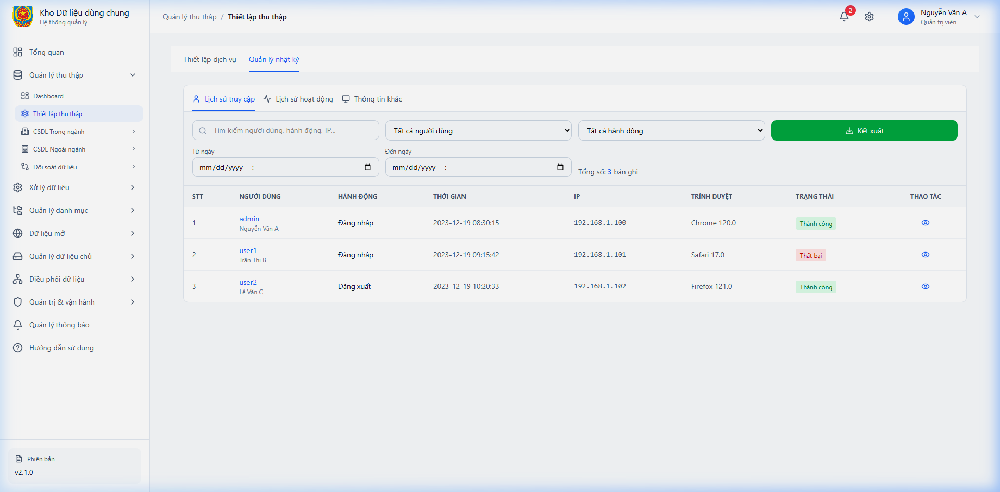

*Hình 9 – Màn hình danh sách nhật ký*

4.2.3.2.1.1 Mô tả thông tin trên màn hình
| **STT** | **Tên trường thông tin** | **Kiểu dữ liệu** | **Bắt buộc** | **Mặc định** | **Mô tả** |
| --- | --- | --- | --- | --- | --- |
| Thời gian | DATE | - | - | Thời điểm xảy ra sự kiện. |
| Nội dung | VARCHAR2(1000) | - | - | Tóm tắt sự kiện. |

4.2.3.2.1.2 Chức năng trên màn hình
|  |  |  |  |
| --- | --- | --- | --- |
| **STT** | **Tên chức năng** | **Định dạng** | **Mô tả** |
| 1 | CN01 | Button icon | Xem chi tiết log (MH03.P01). |

#### 4.2.3.2.2. DC1-UC002-MH4 Chi tiết nhật ký
- **Mã chức năng:** DC1-TT-QT-002
- **Mã màn hình:** DC1-UC002-MH2, DC1-UC002-MH4

Màn hình

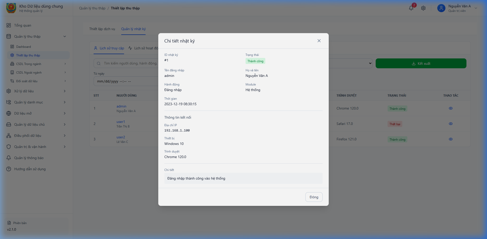

*Hình 10 – Màn hình xem chi tiết nhật ký*

4.2.3.2.2.1 Mô tả thông tin trên màn hình
| **STT** | **Tên trường thông tin** | **Kiểu dữ liệu** | **Bắt buộc** | **Mặc định** | **Mô tả** |
| --- | --- | --- | --- | --- | --- |
| Thông tin cơ bản | TEXT | - | - | ID nhật ký, Tên đăng nhập, Họ và tên cán bộ. |
| Hành động | VARCHAR2(255) | - | - | Loại thao tác (Thêm/Sửa/Xóa/Export), Module, Thời gian. |
| Thông tin kết nối | VARCHAR2(255) | - | - | Địa chỉ IP, Thiết bị, Trình duyệt. |
| Nội dung log | TEXT | - | - | Chi tiết thay đổi hoặc thông điệp hệ thống. |

4.2.3.2.2.2 Chức năng trên màn hình
|  |  |  |  |
| --- | --- | --- | --- |
| **STT** | **Tên chức năng** | **Định dạng** | **Mô tả** |
| 1 | CN01 | Button text | Đóng popup. |

---

## 4.2.4. DC102.QLTT.CSDLTN – CSDL Trong ngành

### *4.2.4.1. Mục đích*
Khai thác và theo dõi dữ liệu thu thập được từ các hệ thống nghiệp vụ nội bộ của ngành (Hộ tịch, Thi hành án, Đấu giá, Tư pháp...). Phục vụ công tác quản lý tập trung và phân tích dữ liệu ngành.

*+ Phân quyền*
Cán bộ nghiệp vụ các đơn vị trong ngành.

*+ Điều kiện thực hiện*
Dữ liệu đã được định nghĩa luồng kết nối và đồng bộ vào kho dùng chung.

### 4.2.4.2. DC102.QLTT.CSDLTN.MH04 – Khai thác CSDL Hộ tịch điện tử

#### 4.2.4.2.1. MH04.M01 Danh mục CSDL Hộ tịch điện tử
- **Mã chức năng:** DC1-TT-QT-003
- **Mã màn hình:** MH04.M01

Màn hình

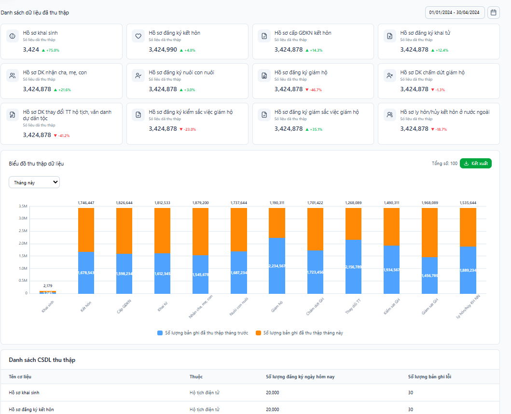

*Hình 11 – Danh mục CSDL Trong ngành*

4.2.4.2.1.1 Mô tả thông tin trên màn hình
| **STT** | **Tên trường thông tin** | **Kiểu dữ liệu** | **Bắt buộc** | **Mặc định** | **Mô tả** |
| --- | --- | --- | --- | --- | --- |
| Sidebar menu | TREE LIST | - | - | Danh sách các hệ thống trong ngành: Hộ tịch điện tử, Quản lý hồ sơ QT, Thi hành án dân sự, Biện pháp bảo đảm, PBGD và HG cơ sở, Quản lý đấu giá TS, Hợp tác quốc tế, v.v. |

4.2.4.2.1.2 Chức năng trên màn hình
|  |  |  |  |
| --- | --- | --- | --- |
| **STT** | **Tên chức năng** | **Định dạng** | **Mô tả** |
| 1 | CN01 | Click Item | Mở màn hình tổng quan CSDL tương ứng (MH04.M02). |

#### 4.2.4.2.2. MH04.M02 Tổng quan CSDL Hộ tịch điện tử
- **Mã chức năng:** DC1-TT-QT-003
- **Mã màn hình:** MH04.M02

Màn hình

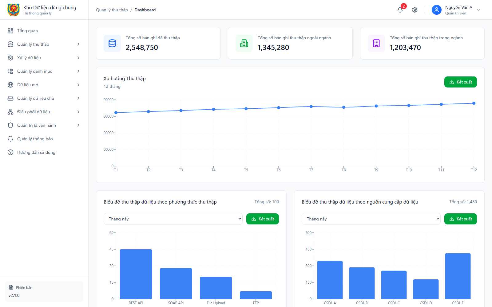

*Hình 12 – Màn hình tổng quan dữ liệu Hộ tịch điện tử*

4.2.4.2.2.1 Mô tả thông tin trên màn hình
| **STT** | **Tên trường thông tin** | **Kiểu dữ liệu** | **Bắt buộc** | **Mặc định** | **Mô tả** |
| --- | --- | --- | --- | --- | --- |
| Khoảng thời gian | DATE RANGE | - | - | Lọc dữ liệu theo khoảng thời gian (VD: 01/01/2024 - 30/04/2024). |
| Danh sách dữ liệu | CARD LIST | - | - | 12 khối dữ liệu thống kê các loại hồ sơ hộ tịch. |

4.2.4.2.2.2 Danh sách các loại hồ sơ (12 loại)
| **STT** | **Tên loại hồ sơ** | **Số liệu đã thu thập** | **Tỷ lệ tăng/giảm** |
| --- | --- | --- | --- |
| 1 | Hồ sơ khai sinh | 3,424 | +75.0% |
| 2 | Hồ sơ đăng ký kết hôn | 3,424,990 | +4.0% |
| 3 | Hồ sơ cấp GĐKN kết hôn | 3,424,878 | +14.3% |
| 4 | Hồ sơ đăng ký khai tử | 3,424,878 | +12.4% |
| 5 | Hồ sơ DK nhận cha, mẹ, con | 3,424,878 | +21.6% |
| 6 | Hồ sơ đăng ký nuôi con nuôi | 3,424,878 | +3.0% |
| 7 | Hồ sơ đăng ký giám hộ | 3,424,878 | -46.7% |
| 8 | Hồ sơ DK chấm dứt giám hộ | 3,424,878 | -1.3% |
| 9 | Hồ sơ DK thay đổi TT hộ tịch, cải chính, bổ sung hộ tịch, xác định lại dân tộc | 3,424,878 | -41.2% |
| 10 | Hồ sơ đăng ký cử người giám hộ | 3,424,878 | -23.0% |
| 11 | Hồ sơ đăng ký giám sát việc giám hộ | 3,424,878 | +35.1% |
| 12 | Hồ sơ ly hôn/hủy kết hôn ở nước ngoài | 3,424,878 | -18.7% |

4.2.4.2.2.3 Chức năng trên màn hình
| **STT** | **Tên chức năng** | **Định dạng** | **Mô tả** |
| --- | --- | --- | --- |
| 1 | Lọc thời gian | Date Picker | Chọn khoảng thời gian để xem thống kê. |
| 2 | Click Card | Click Item | Mở màn hình tổng quan CSDL tương ứng (MH04.M02). |

#### 4.2.4.2.3. DC1-UC003-MH1 Xem chi tiết dữ liệu Khai sinh
- **Mã chức năng:** DC1-TT-QT-003
- **Mã màn hình:** DC1-UC003-MH1, DC1-UC003-MH2, DC1-UC003-MH3, DC1-UC003-MH4

Màn hình

*Hình 13 – Màn hình danh sách bản ghi chi tiết*

4.2.4.2.3.1 Mô tả thông tin trên màn hình
| **STT** | **Tên trường thông tin** | **Kiểu dữ liệu** | **Bắt buộc** | **Mặc định** | **Mô tả** |
| --- | --- | --- | --- | --- | --- |
| Tìm kiếm nhanh | VARCHAR2(255) | - | - | Nhập tên, mã dịch vụ, đơn vị để tìm kiếm. |
| Bảng dữ liệu | TABLE | - | - | Các cột: STT, Tình trạng, Họ tên, Giới tính, Ngày sinh, Họ tên Cha/Mẹ, Quốc tịch, Số giấy chứng nhận, Ngày đăng ký, Ngày đồng bộ, Trạng thái. |

4.2.4.2.3.2 Chức năng trên màn hình
|  |  |  |  |
| --- | --- | --- | --- |
| **STT** | **Tên chức năng** | **Định dạng** | **Mô tả** |
| 1 | CN01 | Button text | Tìm kiếm nâng cao. |
| 2 | CN02 | Button blue | Nhập dữ liệu và lưu vào kho. |
| 3 | CN03 | Button green | Xuất dữ liệu ra Excel. |
| 4 | CN04 | Button orange | Thực hiện đồng bộ tức thời. |
| 5 | CN05 | Button white | Đóng popup. |

#### 4.2.4.2.3. DC1-UC003-MH1 Xem chi tiết dữ liệu Kết hôn
- **Mã chức năng:** DC1-TT-QT-003
- **Mã màn hình:** DC1-UC003-MH1, DC1-UC003-MH2, DC1-UC003-MH3, DC1-UC003-MH4

Màn hình

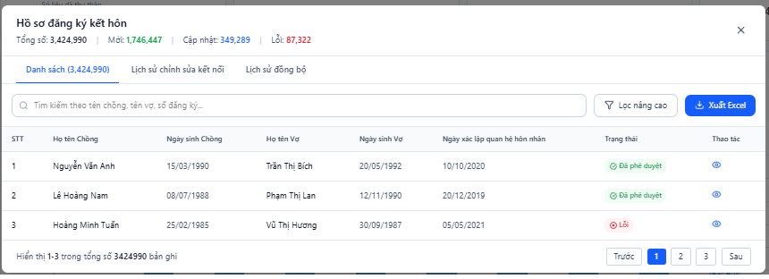

*Hình 13 – Màn hình danh sách bản ghi chi tiết*

4.2.4.2.3.1 Mô tả thông tin trên màn hình
| **STT** | **Tên trường thông tin** | **Kiểu dữ liệu** | **Bắt buộc** | **Mặc định** | **Mô tả** |
| --- | --- | --- | --- | --- | --- |
| Tìm kiếm nhanh | VARCHAR2(255) | - | - | Nhập tên, mã dịch vụ, đơn vị để tìm kiếm. |
| Bảng dữ liệu | TABLE | - | - | Các cột: STT, Tình trạng, Họ tên, Giới tính, Ngày sinh, Họ tên Cha/Mẹ, Quốc tịch, Số giấy chứng nhận, Ngày đăng ký, Ngày đồng bộ, Trạng thái. |

4.2.4.2.3.2 Chức năng trên màn hình
|  |  |  |  |
| --- | --- | --- | --- |
| **STT** | **Tên chức năng** | **Định dạng** | **Mô tả** |
| 1 | CN01 | Button text | Tìm kiếm nâng cao. |
| 2 | CN02 | Button blue | Nhập dữ liệu và lưu vào kho. |
| 3 | CN03 | Button green | Xuất dữ liệu ra Excel. |
| 4 | CN04 | Button orange | Thực hiện đồng bộ tức thời. |
| 5 | CN05 | Button white | Đóng popup. |

#### 4.2.4.2.5. DC1-UC003-MH3 Xem chi tiết dữ liệu Cấp GĐKN kết hôn
- **Mã chức năng:** DC1-TT-QT-003
- **Mã màn hình:** DC1-UC003-MH1, DC1-UC003-MH2, DC1-UC003-MH3, DC1-UC003-MH4

Màn hình

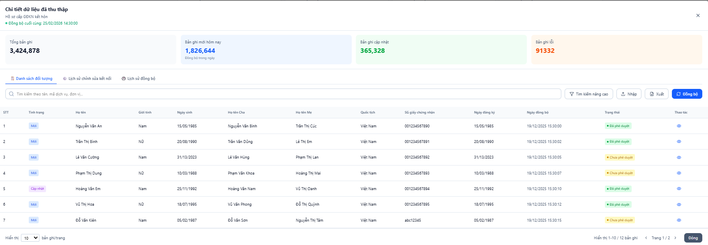

*Hình 15 – Màn hình danh sách bản ghi Cấp GĐKN kết hôn*

4.2.4.2.5.1 Mô tả thông tin trên màn hình
| **STT** | **Tên trường thông tin** | **Kiểu dữ liệu** | **Bắt buộc** | **Mặc định** | **Mô tả** |
| --- | --- | --- | --- | --- | --- |
| Tìm kiếm nhanh | VARCHAR2(255) | - | - | Tìm kiếm theo tên người được cấp hoặc số GĐKN. |
| Bảng dữ liệu | TABLE | - | - | Các cột: STT, Tình trạng, Họ tên người yêu cầu, Ngày sinh, Giới tính, Nơi cư trú, Tình trạng hôn nhân, Số giấy xác nhận, Ngày cấp, Ngày đồng bộ, Trạng thái. |

4.2.4.2.5.2 Chức năng trên màn hình
| **STT** | **Tên chức năng** | **Định dạng** | **Mô tả** |
| --- | --- | --- | --- |
| 1 | CN01 | Button text | Tìm kiếm nâng cao. |
| 2 | CN02 | Button blue | Nhập dữ liệu và lưu vào kho. |
| 3 | CN03 | Button green | Xuất dữ liệu ra Excel. |
| 4 | CN04 | Button orange | Thực hiện đồng bộ tức thời. |
| 5 | CN05 | Button white | Đóng popup. |

#### 4.2.4.2.6. DC1-UC003-MH4 Xem chi tiết dữ liệu Khai tử
- **Mã chức năng:** DC1-TT-QT-003
- **Mã màn hình:** DC1-UC003-MH1, DC1-UC003-MH2, DC1-UC003-MH3, DC1-UC003-MH4

Màn hình

*Hình 16 – Màn hình danh sách bản ghi Khai tử*

4.2.4.2.6.1 Mô tả thông tin trên màn hình
| **STT** | **Tên trường thông tin** | **Kiểu dữ liệu** | **Bắt buộc** | **Mặc định** | **Mô tả** |
| --- | --- | --- | --- | --- | --- |
| Tìm kiếm nhanh | VARCHAR2(255) | - | - | Tìm kiếm theo tên người chết hoặc số giấy khai tử. |
| Bảng dữ liệu | TABLE | - | - | Các cột: STT, Tình trạng, Họ tên người chết, Giới tính, Ngày sinh, Ngày chết, Nơi chết, Số giấy chứng nhận, Ngày đăng ký, Ngày đồng bộ, Trạng thái. |

4.2.4.2.6.2 Chức năng trên màn hình
| **STT** | **Tên chức năng** | **Định dạng** | **Mô tả** |
| --- | --- | --- | --- |
| 1 | CN01 | Button text | Tìm kiếm nâng cao. |
| 2 | CN02 | Button blue | Nhập dữ liệu và lưu vào kho. |
| 3 | CN03 | Button green | Xuất dữ liệu ra Excel. |
| 4 | CN04 | Button orange | Thực hiện đồng bộ tức thời. |
| 5 | CN05 | Button white | Đóng popup. |

#### 4.2.4.2.7. DC1-UC003-MH5 Xem chi tiết dữ liệu Nhận cha mẹ con
- **Mã chức năng:** DC1-TT-QT-003
- **Mã màn hình:** DC1-UC003-MH1..MH4

Màn hình

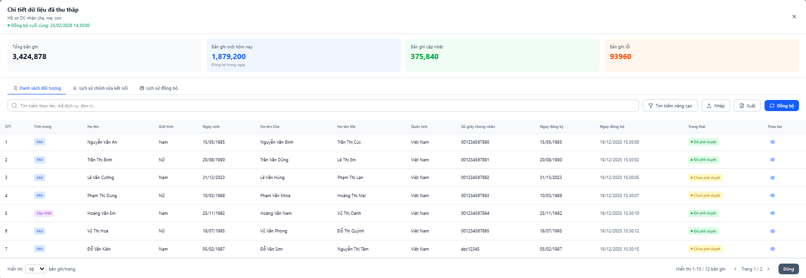

*Hình 17 – Màn hình danh sách bản ghi Nhận cha, mẹ, con*

4.2.4.2.7.1 Mô tả thông tin trên màn hình
| **STT** | **Tên trường thông tin** | **Kiểu dữ liệu** | **Bắt buộc** | **Mặc định** | **Mô tả** |
| --- | --- | --- | --- | --- | --- |
| Tìm kiếm nhanh | VARCHAR2(255) | - | - | Tìm theo tên người nhận hoặc người được nhận. |
| Bảng dữ liệu | TABLE | - | - | Các cột: STT, Tình trạng, Họ tên người nhận, Họ tên người được nhận, Mối quan hệ, Số giấy chứng nhận, Ngày đăng ký, Ngày đồng bộ, Trạng thái. |

4.2.4.2.7.2 Chức năng trên màn hình
| **STT** | **Tên chức năng** | **Định dạng** | **Mô tả** |
| --- | --- | --- | --- |
| 1 | CN01 | Button text | Tìm kiếm nâng cao. |
| ... | ... | ... | ... |
| 5 | CN05 | Button white | Đóng popup. |

#### 4.2.4.2.8. DC1-UC003-MH6 Xem chi tiết dữ liệu Nuôi con nuôi
- **Mã chức năng:** DC1-TT-QT-003
- **Mã màn hình:** DC1-UC003-MH6

Màn hình

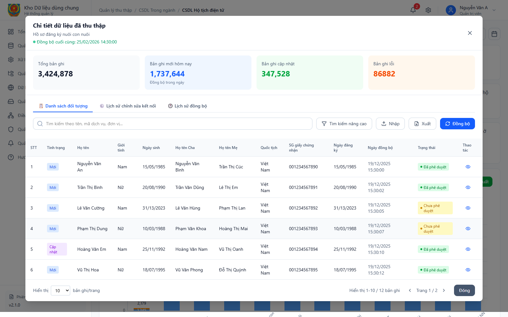

*Hình 18 – Màn hình danh sách bản ghi Nuôi con nuôi*

4.2.4.2.8.1 Mô tả thông tin trên màn hình
| **STT** | **Tên trường thông tin** | **Kiểu dữ liệu** | **Bắt buộc** | **Mặc định** | **Mô tả** |
| --- | --- | --- | --- | --- | --- |
| Tìm kiếm nhanh | VARCHAR2(255) | - | - | Tìm theo tên cha mẹ nuôi hoặc con nuôi. |
| Bảng dữ liệu | TABLE | - | - | Các cột: STT, Tình trạng, Họ tên cha mẹ nuôi, Họ tên con nuôi, Ngày sinh con nuôi, Số giấy chứng nhận, Ngày đăng ký, Ngày đồng bộ, Trạng thái. |

4.2.4.2.8.2 Chức năng trên màn hình
| **STT** | **Tên chức năng** | **Định dạng** | **Mô tả** |
| --- | --- | --- | --- |
| 1 | CN01 | Button text | Tìm kiếm nâng cao. |
| ... | ... | ... | ... |
| 5 | CN05 | Button white | Đóng popup. |

#### 4.2.4.2.9. DC1-UC003-MH7 Xem chi tiết dữ liệu Giám hộ
- **Mã chức năng:** DC1-TT-QT-003
- **Mã màn hình:** DC1-UC003-MH7

Màn hình

*Hình 19 – Màn hình danh sách bản ghi Giám hộ*

4.2.4.2.9.1 Mô tả thông tin trên màn hình
| **STT** | **Tên trường thông tin** | **Kiểu dữ liệu** | **Bắt buộc** | **Mặc định** | **Mô tả** |
| --- | --- | --- | --- | --- | --- |
| Tìm kiếm nhanh | VARCHAR2(255) | - | - | Tìm theo tên người giám hộ hoặc người được giám hộ. |
| Bảng dữ liệu | TABLE | - | - | Các cột: STT, Tình trạng, Họ tên người giám hộ, Họ tên người được giám hộ, Hình thức giám hộ, Số giấy chứng nhận, Ngày đăng ký, Ngày đồng bộ, Trạng thái. |

4.2.4.2.9.2 Chức năng trên màn hình
| **STT** | **Tên chức năng** | **Định dạng** | **Mô tả** |
| --- | --- | --- | --- |
| 1 | CN01 | Button text | Tìm kiếm nâng cao. |
| ... | ... | ... | ... |
| 5 | CN05 | Button white | Đóng popup. |

#### 4.2.4.2.10. DC1-UC003-MH8 Xem chi tiết dữ liệu Chấm dứt giám hộ
- **Mã chức năng:** DC1-TT-QT-003
- **Mã màn hình:** DC1-UC003-MH8

Màn hình

*Hình 20 – Màn hình danh sách bản ghi Chấm dứt giám hộ*

4.2.4.2.10.1 Mô tả thông tin trên màn hình
| **STT** | **Tên trường thông tin** | **Kiểu dữ liệu** | **Bắt buộc** | **Mặc định** | **Mô tả** |
| --- | --- | --- | --- | --- | --- |
| Tìm kiếm nhanh | VARCHAR2(255) | - | - | Tìm kiếm hồ sơ chấm dứt giám hộ. |
| Bảng dữ liệu | TABLE | - | - | Các cột: STT, Tình trạng, Họ tên người giám hộ, Họ tên người được giám hộ, Lý do chấm dứt, Ngày chấm dứt, Ngày đồng bộ, Trạng thái. |

4.2.4.2.10.2 Chức năng trên màn hình
| **STT** | **Tên chức năng** | **Định dạng** | **Mô tả** |
| --- | --- | --- | --- |
| 1 | CN01 | Button text | Tìm kiếm nâng cao. |
| ... | ... | ... | ... |
| 5 | CN05 | Button white | Đóng popup. |

#### 4.2.4.2.11. DC1-UC003-MH9 Xem chi tiết dữ liệu Thay đổi, cải chính, bổ sung hộ tịch, xác định lại dân tộc
- **Mã chức năng:** DC1-TT-QT-003
- **Mã màn hình:** DC1-UC003-MH9

Màn hình

*Hình 21 – Màn hình danh sách bản ghi Thay đổi, cải chính hộ tịch*

4.2.4.2.11.1 Mô tả thông tin trên màn hình
| **STT** | **Tên trường thông tin** | **Kiểu dữ liệu** | **Bắt buộc** | **Mặc định** | **Mô tả** |
| --- | --- | --- | --- | --- | --- |
| Tìm kiếm nhanh | VARCHAR2(255) | - | - | Tìm kiếm theo tên người thay đổi hoặc số GCN. |
| Bảng dữ liệu | TABLE | - | - | Các cột: STT, Tình trạng, Họ tên, Nội dung thay đổi/cải chính, Thông tin cũ, Thông tin mới, Số giấy chứng nhận, Ngày đăng ký, Ngày đồng bộ, Trạng thái. |

4.2.4.2.11.2 Chức năng trên màn hình
| **STT** | **Tên chức năng** | **Định dạng** | **Mô tả** |
| --- | --- | --- | --- |
| 1 | CN01 | Button text | Tìm kiếm nâng cao. |
| ... | ... | ... | ... |
| 5 | CN05 | Button white | Đóng popup. |

#### 4.2.4.2.12. DC1-UC003-MH10 Xem chi tiết dữ liệu Cử người giám hộ
- **Mã chức năng:** DC1-TT-QT-003
- **Mã màn hình:** DC1-UC003-MH10

Màn hình

*Hình 22 – Màn hình danh sách bản ghi Cử người giám hộ*

4.2.4.2.12.1 Mô tả thông tin trên màn hình
| **STT** | **Tên trường thông tin** | **Kiểu dữ liệu** | **Bắt buộc** | **Mặc định** | **Mô tả** |
| --- | --- | --- | --- | --- | --- |
| Tìm kiếm nhanh | VARCHAR2(255) | - | - | Tìm theo tên người cử hoặc người được cử. |
| Bảng dữ liệu | TABLE | - | - | Các cột: STT, Tình trạng, Họ tên người cử, Họ tên người được cử, Họ tên người được giám hộ, Ngày cử, Ngày đồng bộ, Trạng thái. |

#### 4.2.4.2.13. DC1-UC003-MH11 Xem chi tiết dữ liệu Giám sát việc giám hộ
- **Mã chức năng:** DC1-TT-QT-003
- **Mã màn hình:** DC1-UC003-MH11

Màn hình

*Hình 23 – Màn hình danh sách bản ghi Giám sát việc giám hộ*

4.2.4.2.13.1 Mô tả thông tin trên màn hình
| **STT** | **Tên trường thông tin** | **Kiểu dữ liệu** | **Bắt buộc** | **Mặc định** | **Mô tả** |
| --- | --- | --- | --- | --- | --- |
| Tìm kiếm nhanh | VARCHAR2(255) | - | - | Tìm theo tên người giám sát hoặc người được giám sát. |
| Bảng dữ liệu | TABLE | - | - | Các cột: STT, Tình trạng, Họ tên người giám sát, Họ tên người được giám sát (giám hộ), Nội dung giám sát, Ngày bắt đầu, Ngày đồng bộ, Trạng thái. |

#### 4.2.4.2.14. DC1-UC003-MH12 Xem chi tiết dữ liệu Ly hôn/hủy kết hôn ở nước ngoài
- **Mã chức năng:** DC1-TT-QT-003
- **Mã màn hình:** DC1-UC003-MH12

Màn hình

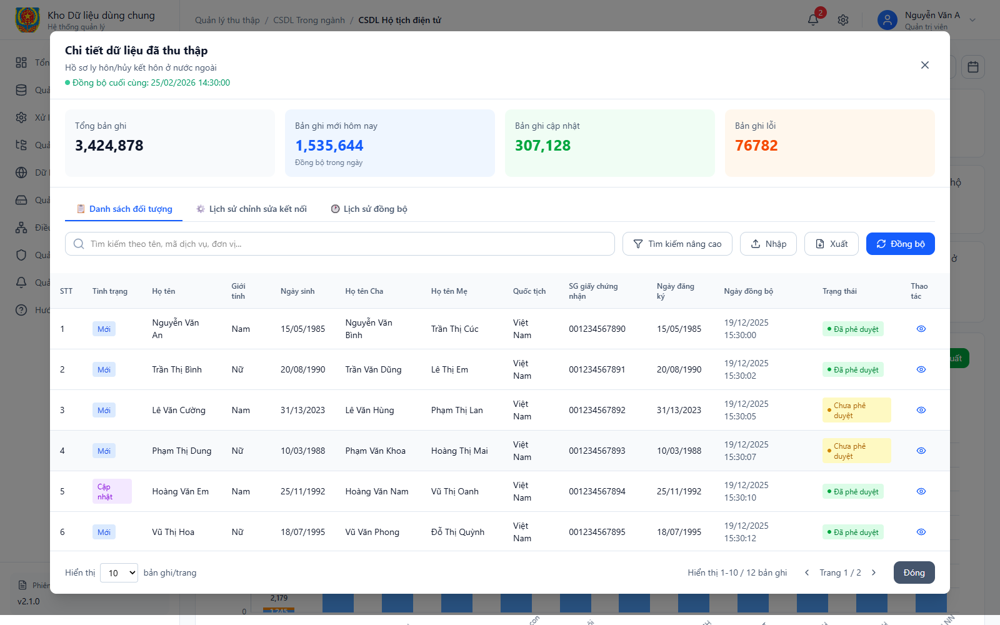

*Hình 24 – Màn hình danh sách bản ghi Ly hôn/hủy kết hôn ở nước ngoài*

4.2.4.2.14.1 Mô tả thông tin trên màn hình
| **STT** | **Tên trường thông tin** | **Kiểu dữ liệu** | **Bắt buộc** | **Mặc định** | **Mô tả** |
| --- | --- | --- | --- | --- | --- |
| Tìm kiếm nhanh | VARCHAR2(255) | - | - | Tìm theo tên vợ/chồng hoặc số bản án. |
| Bảng dữ liệu | TABLE | - | - | Các cột: STT, Tình trạng, Họ tên vợ, Họ tên chồng, Cơ quan giải quyết, Số bản án/quyết định, Ngày có hiệu lực, Ngày đồng bộ, Trạng thái. |

#### 4.2.4.3. HT quản lý hồ sơ QT (3)

##### 4.2.4.3.1. QT01.M01 Tổng quan Quản lý hồ sơ Quốc tịch
- **Mã chức năng:** DC1-TT-QT-003
- **Mã màn hình:** DC1-UC003-MH1

Màn hình

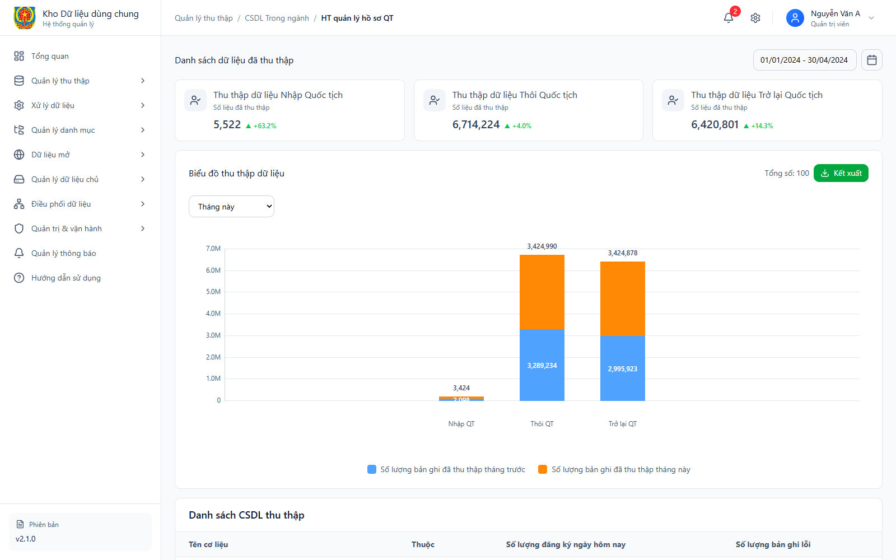

*Hình 25 – Màn hình tổng quan hồ sơ Quốc tịch*

4.2.4.3.1.1 Mô tả thông tin trên màn hình
| **STT** | **Tên trường thông tin** | **Kiểu dữ liệu** | **Bắt buộc** | **Mặc định** | **Mô tả** |
| --- | --- | --- | --- | --- | --- |
| Dashboard Cards | CARD LIST | - | - | Thống kê: Tổng số hồ sơ, Đang xử lý, Đã giải quyết, Từ chối. |

##### 4.2.4.3.2. QT01.M02 Danh sách chi tiết hồ sơ Quốc tịch
- **Mã chức năng:** DC1-TT-QT-003
- **Mã màn hình:** DC1-UC003-MH2, DC1-UC003-MH3, DC1-UC003-MH4

Màn hình

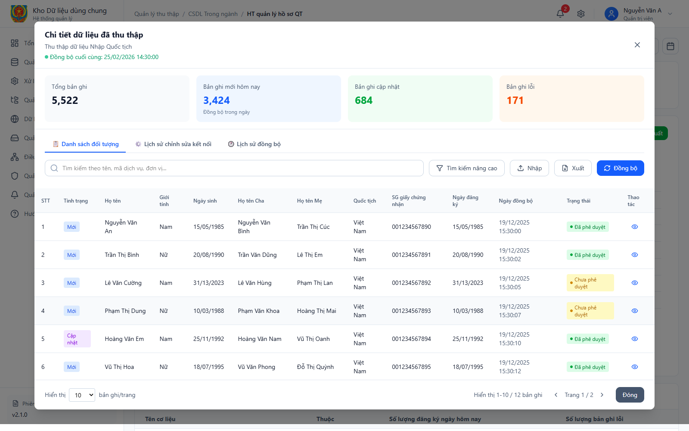

*Hình 26 – Màn hình danh sách bản ghi Quốc tịch*

4.2.4.3.2.1 Mô tả thông tin trên màn hình
| **STT** | **Tên trường thông tin** | **Kiểu dữ liệu** | **Bắt buộc** | **Mặc định** | **Mô tả** |
| --- | --- | --- | --- | --- | --- |
| Tìm kiếm | VARCHAR2(255) | - | - | Tìm theo tên, số quyết định. |
| Bảng dữ liệu | TABLE | - | - | Các cột: STT, Tình trạng, Họ tên, Ngày sinh, Quốc tịch cũ, Quốc tịch mới, Số quyết định, Ngày ký, Trạng thái. |

---

#### 4.2.4.4. CSDL thi hành án dân sự (16)

##### 4.2.4.4.1. THA.M01 Tổng quan Thi hành án dân sự
- **Mã chức năng:** DC1-TT-QT-003
- **Mã màn hình:** DC1-UC003-MH1

Màn hình

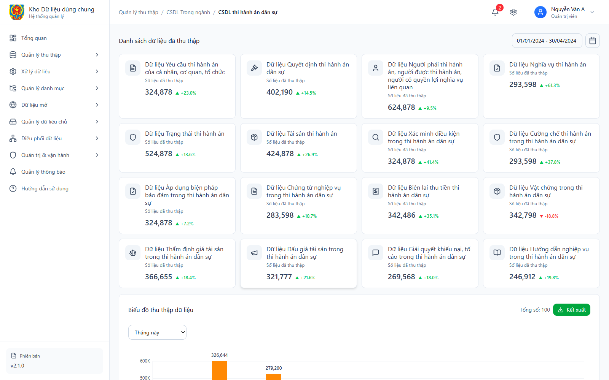

*Hình 27 – Màn hình tổng quan hồ sơ Thi hành án*

4.2.4.4.1.1 Mô tả thông tin trên màn hình
| **STT** | **Tên trường thông tin** | **Kiểu dữ liệu** | **Bắt buộc** | **Mặc định** | **Mô tả** |
| --- | --- | --- | --- | --- | --- |
| Dashboard Cards | CARD LIST | - | - | Thống kê: Tổng số vụ việc, Đã thi hành xong, Chưa có điều kiện, Giá trị thu được. |

##### 4.2.4.4.2. THA.M02 Danh sách chi tiết vụ việc Thi hành án
- **Mã chức năng:** DC1-TT-QT-003
- **Mã màn hình:** THA.M02

Màn hình

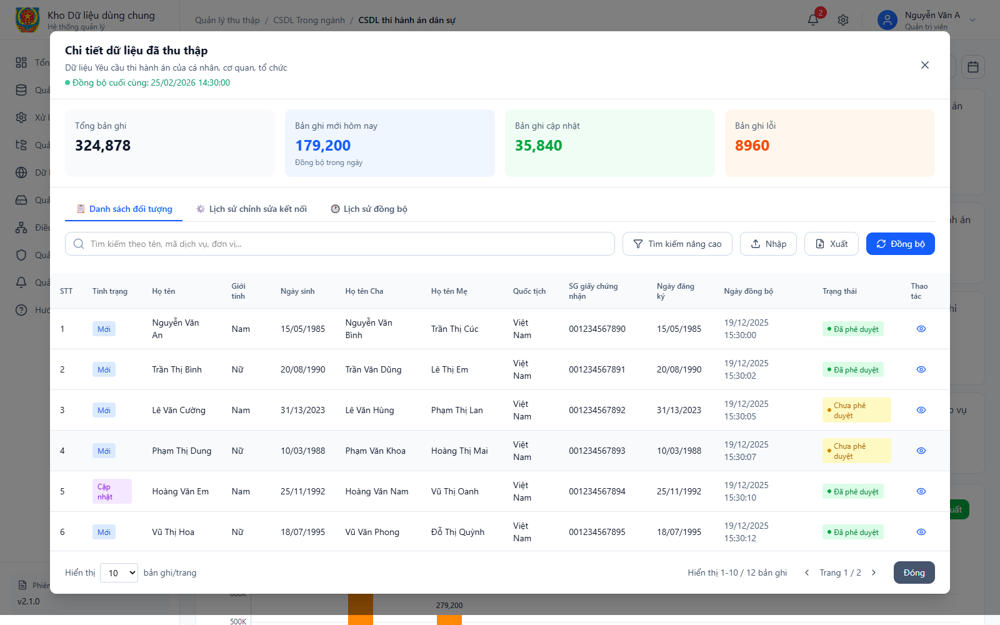

*Hình 28 – Màn hình danh sách bản ghi Thi hành án*

4.2.4.4.2.1 Mô tả thông tin trên màn hình
| **STT** | **Tên trường thông tin** | **Kiểu dữ liệu** | **Bắt buộc** | **Mặc định** | **Mô tả** |
| --- | --- | --- | --- | --- | --- |
| Tìm kiếm | VARCHAR2(255) | - | - | Tìm theo mã hồ sơ, tên đương sự. |
| Bảng dữ liệu | TABLE | - | - | Các cột: STT, Mã hồ sơ, Cơ quan THA, Họ tên người được THA, Họ tên người phải THA, Số bản án, Ngày đồng bộ, Trạng thái. |

---

#### 4.2.4.5. CSDL về biện pháp BD (4)

##### 4.2.4.5.1. BPBD.M01 Tổng quan Biện pháp bảo đảm
- **Mã chức năng:** DC1-TT-QT-003
- **Mã màn hình:** DC1-UC003-MH1

Màn hình

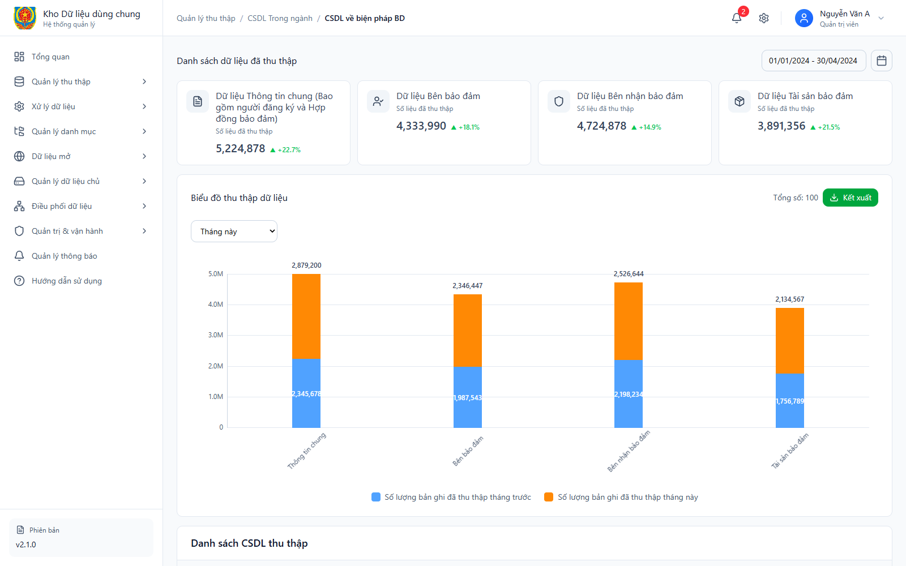

*Hình 29 – Màn hình tổng quan hồ sơ Biện pháp bảo đảm*

4.2.4.5.1.1 Mô tả thông tin trên màn hình
| **STT** | **Tên trường thông tin** | **Kiểu dữ liệu** | **Bắt buộc** | **Mặc định** | **Mô tả** |
| --- | --- | --- | --- | --- | --- |
| Dashboard Cards | CARD LIST | - | - | Thống kê: Đăng ký mới, Thay đổi nội dung, Xóa đăng ký, Cung cấp thông tin. |

##### 4.2.4.5.2. BPBD.M02 Danh sách chi tiết đăng ký Bảo đảm
- **Mã chức năng:** DC1-TT-QT-003
- **Mã màn hình:** BPBD.M02

Màn hình

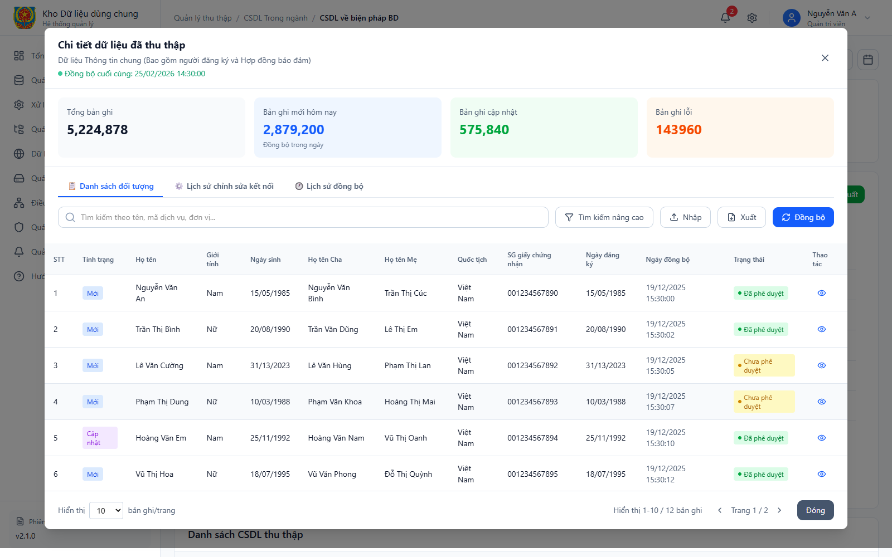

*Hình 30 – Màn hình danh sách bản ghi Bảo đảm*

4.2.4.5.2.1 Mô tả thông tin trên màn hình
| **STT** | **Tên trường thông tin** | **Kiểu dữ liệu** | **Bắt buộc** | **Mặc định** | **Mô tả** |
| --- | --- | --- | --- | --- | --- |
| Tìm kiếm | VARCHAR2(255) | - | - | Tìm theo mã số đăng ký, bên bảo đảm. |
| Bảng dữ liệu | TABLE | - | - | Các cột: STT, Mã số đăng ký, Bên bảo đảm, Bên nhận bảo đảm, Loại tài sản, Ngày đăng ký, Ngày đồng bộ, Trạng thái. |

---

#### 4.2.4.6. CSDL quốc gia về PL (5)

##### 4.2.4.6.1. PL01.M01 Tổng quan CSDL quốc gia về Pháp luật
- **Mã chức năng:** DC1-TT-QT-003
- **Mã màn hình:** DC1-UC003-MH1

Màn hình

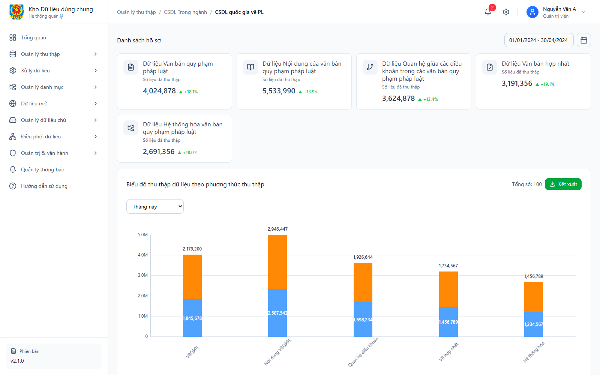

*Hình 31 – Màn hình tổng quan văn bản Pháp luật*

4.2.4.6.1.1 Mô tả thông tin trên màn hình
| **STT** | **Tên trường thông tin** | **Kiểu dữ liệu** | **Bắt buộc** | **Mặc định** | **Mô tả** |
| --- | --- | --- | --- | --- | --- |
| Dashboard Cards | CARD LIST | - | - | Thống kê: Luật/Nghị quyết, Nghị định, Thông tư, Văn bản địa phương. |

##### 4.2.4.6.2. PL01.M02 Danh sách chi tiết văn bản Pháp luật
- **Mã chức năng:** DC1-TT-QT-003
- **Mã màn hình:** PL01.M02

Màn hình

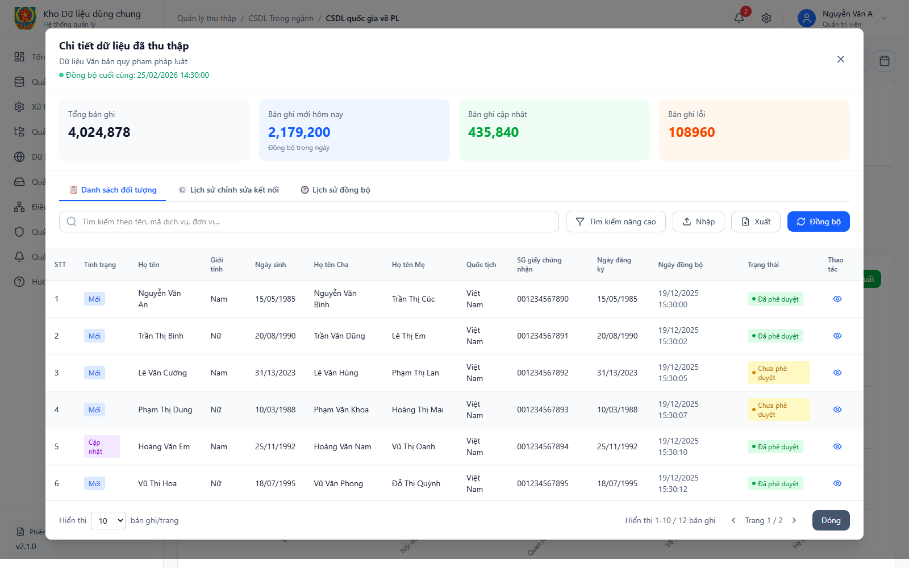

*Hình 32 – Màn hình danh sách bản ghi văn bản*

4.2.4.6.2.1 Mô tả thông tin trên màn hình
| **STT** | **Tên trường thông tin** | **Kiểu dữ liệu** | **Bắt buộc** | **Mặc định** | **Mô tả** |
| --- | --- | --- | --- | --- | --- |
| Tìm kiếm | VARCHAR2(255) | - | - | Tìm theo tên văn bản, số hiệu. |
| Bảng dữ liệu | TABLE | - | - | Các cột: STT, Tên văn bản, Loại văn bản, Cơ quan ban hành, Ngày ban hành, Ngày có hiệu lực, Ngày đồng bộ, Trạng thái. |

---

#### 4.2.4.7. CSDL TT Tư Pháp dân sự (2)

##### 4.2.4.7.1. TPDS.M01 Tổng quan CSDL Thông tin Tư Pháp dân sự
- **Mã chức năng:** DC1-TT-QT-003
- **Mã màn hình:** DC1-UC003-MH1

Màn hình

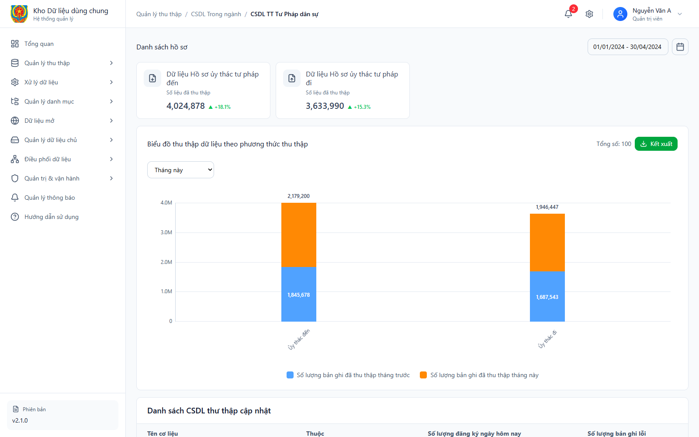

*Hình 33 – Màn hình tổng quan hồ sơ Tư pháp dân sự*

4.2.4.7.1.1 Mô tả thông tin trên màn hình
| **STT** | **Tên trường thông tin** | **Kiểu dữ liệu** | **Bắt buộc** | **Mặc định** | **Mô tả** |
| --- | --- | --- | --- | --- | --- |
| Dashboard Cards | CARD LIST | - | - | Thống kê: Án dân sự, Án hành chính, Án kinh doanh thương mại. |

##### 4.2.4.7.2. TPDS.M02 Danh sách chi tiết hồ sơ Tư pháp dân sự
- **Mã chức năng:** DC1-TT-QT-003
- **Mã màn hình:** TPDS.M02

Màn hình

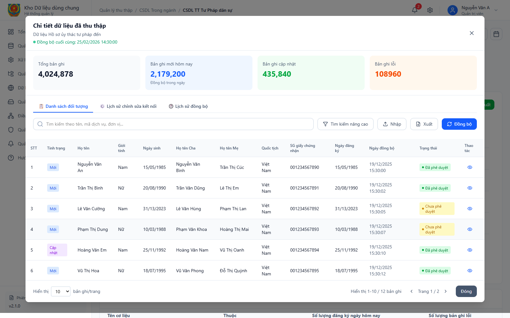

*Hình 34 – Màn hình danh sách bản ghi tư pháp dân sự*

4.2.4.7.2.1 Mô tả thông tin trên màn hình
| **STT** | **Tên trường thông tin** | **Kiểu dữ liệu** | **Bắt buộc** | **Mặc định** | **Mô tả** |
| --- | --- | --- | --- | --- | --- |
| Tìm kiếm | VARCHAR2(255) | - | - | Tìm theo mã hồ sơ, tên đối tượng. |
| Bảng dữ liệu | TABLE | - | - | Các cột: STT, Mã hồ sơ, Loại thông tin, Đối tượng liên quan, Nội dung tóm tắt, Ngày lập, Ngày đồng bộ, Trạng thái. |

---

#### 4.2.4.8. HTTT TTTG pháp lý dân sự (6)

##### 4.2.4.8.1. TTTG.M01 Tổng quan HTTT Trợ giúp pháp lý dân sự
- **Mã chức năng:** DC1-TT-QT-003
- **Mã màn hình:** DC1-UC003-MH1

Màn hình

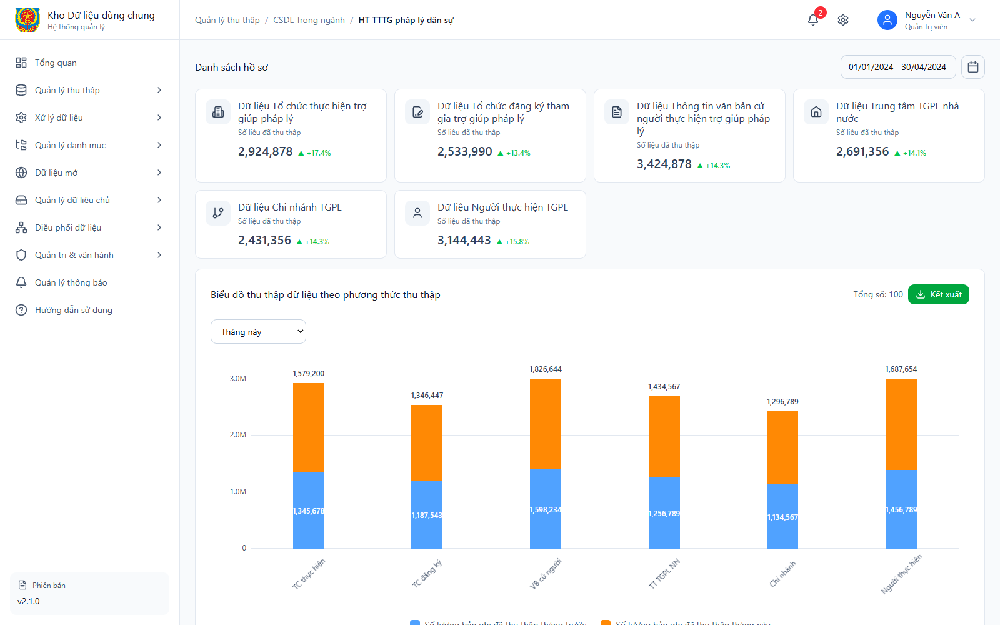

*Hình 35 – Màn hình tổng quan vụ việc Trợ giúp pháp lý*

4.2.4.8.1.1 Mô tả thông tin trên màn hình
| **STT** | **Tên trường thông tin** | **Kiểu dữ liệu** | **Bắt buộc** | **Mặc định** | **Mô tả** |
| --- | --- | --- | --- | --- | --- |
| Dashboard Cards | CARD LIST | - | - | Thống kê: Vụ việc tiếp nhận, Đang thực hiện, Đã kết thúc, Đánh giá chất lượng. |

##### 4.2.4.8.2. TTTG.M02 Danh sách chi tiết vụ việc Trợ giúp pháp lý
- **Mã chức năng:** DC1-TT-QT-003
- **Mã màn hình:** TTTG.M02

Màn hình

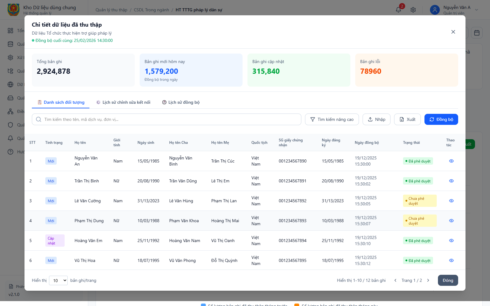

*Hình 36 – Màn hình danh sách bản ghi trợ giúp pháp lý*

4.2.4.8.2.1 Mô tả thông tin trên màn hình
| **STT** | **Tên trường thông tin** | **Kiểu dữ liệu** | **Bắt buộc** | **Mặc định** | **Mô tả** |
| --- | --- | --- | --- | --- | --- |
| Tìm kiếm | VARCHAR2(255) | - | - | Tìm theo tên vụ việc, đơn vị thực hiện. |
| Bảng dữ liệu | TABLE | - | - | Các cột: STT, Tên vụ việc, Đơn vị thực hiện, Nội dung trợ giúp, Hình thức, Ngày tiếp nhận, Ngày đồng bộ, Trạng thái. |

---

#### 4.2.4.9. HTTT TG Pháp lý

##### 4.2.4.9.1. TGPL.M01 Tổng quan HTTT Trợ giúp Pháp lý
- **Mã chức năng:** DC1-TT-QT-003
- **Mã màn hình:** DC1-UC003-MH1

Màn hình

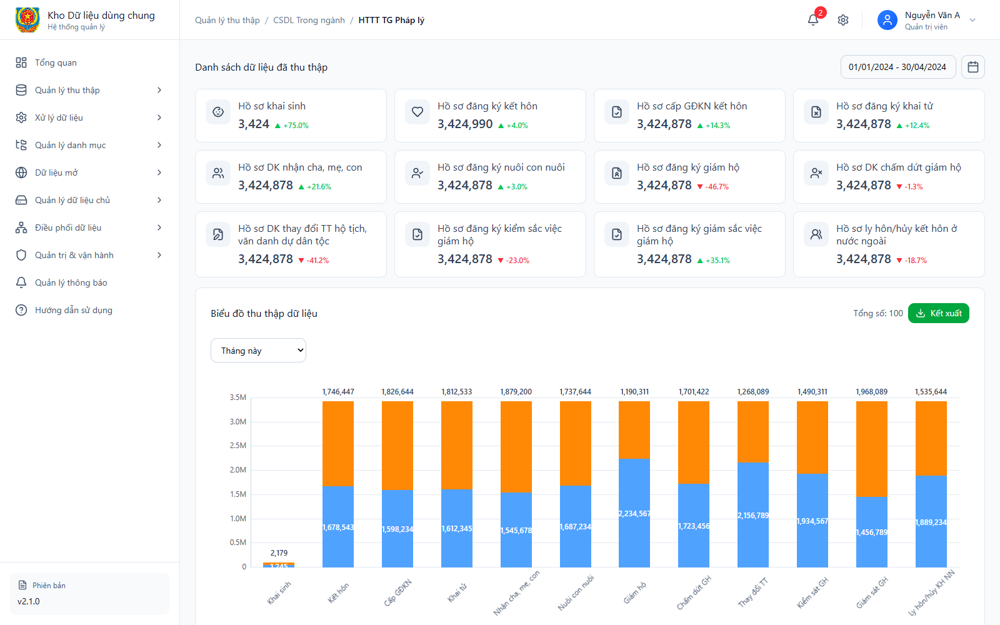

*Hình 37 – Màn hình tổng quan hồ sơ Trợ giúp pháp lý chung*

4.2.4.9.1.1 Mô tả thông tin trên màn hình
| **STT** | **Tên trường thông tin** | **Kiểu dữ liệu** | **Bắt buộc** | **Mặc định** | **Mô tả** |
| --- | --- | --- | --- | --- | --- |
| Dashboard Cards | CARD LIST | - | - | Thống kê: Hồ sơ trực tuyến, Hồ sơ trực tiếp, Tổng số lượt trợ giúp. |

##### 4.2.4.9.2. TGPL.M02 Danh sách chi tiết hồ sơ Trợ giúp pháp lý
- **Mã chức năng:** DC1-TT-QT-003
- **Mã màn hình:** TGPL.M02

Màn hình

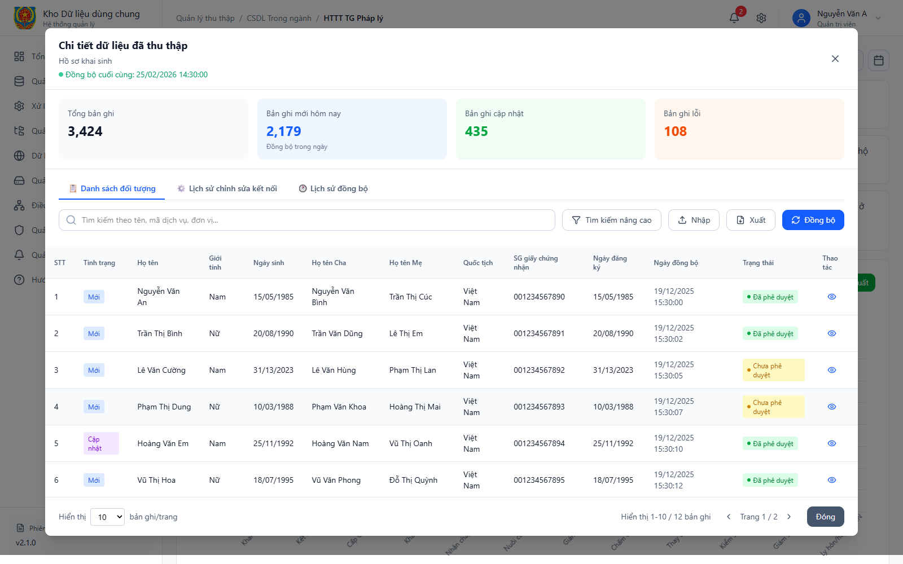

*Hình 38 – Màn hình danh sách bản ghi hồ sơ TGPL*

4.2.4.9.2.1 Mô tả thông tin trên màn hình
| **STT** | **Tên trường thông tin** | **Kiểu dữ liệu** | **Bắt buộc** | **Mặc định** | **Mô tả** |
| --- | --- | --- | --- | --- | --- |
| Tìm kiếm | VARCHAR2(255) | - | - | Tìm theo mã hồ sơ, tên người yêu cầu. |
| Bảng dữ liệu | TABLE | - | - | Các cột: STT, Mã hồ sơ, Người yêu cầu trợ giúp, Nội dung trợ giúp, Luật sư thực hiện, Ngày thụ lý, Ngày đồng bộ, Trạng thái. |

---

#### 4.2.4.10. CSDL PB, GĐ và HG cơ sở (16)

##### 4.2.4.10.1. HGCS.M01 Tổng quan CSDL Phổ biến, Giáo dục và Hòa giải cơ sở
- **Mã chức năng:** DC1-TT-QT-003
- **Mã màn hình:** DC1-UC003-MH1

Màn hình

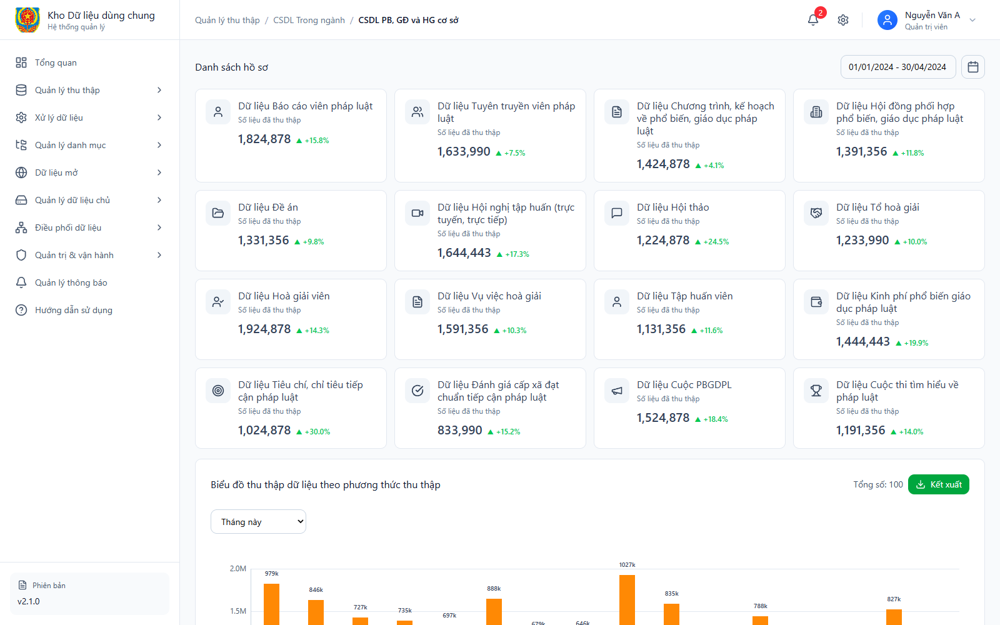

*Hình 39 – Màn hình tổng quan Hòa giải cơ sở*

4.2.4.10.1.1 Mô tả thông tin trên màn hình
| **STT** | **Tên trường thông tin** | **Kiểu dữ liệu** | **Bắt buộc** | **Mặc định** | **Mô tả** |
| --- | --- | --- | --- | --- | --- |
| Dashboard Cards | CARD LIST | - | - | Thống kê: Buổi tuyên truyền, Vụ việc hòa giải, Tỷ lệ hòa giải thành, Số hòa giải viên. |

##### 4.2.4.10.2. HGCS.M02 Danh sách chi tiết vụ việc PBGD & HGCS
- **Mã chức năng:** DC1-TT-QT-003
- **Mã màn hình:** HGCS.M02

Màn hình

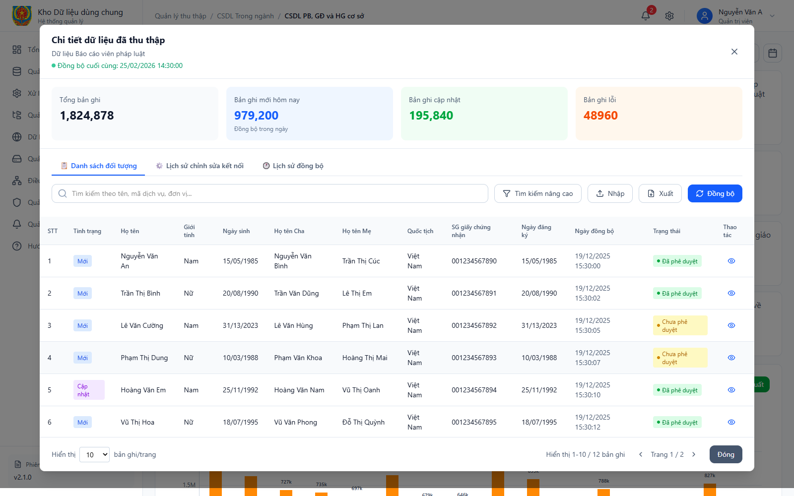

*Hình 40 – Màn hình danh sách bản ghi PBGD & HGCS*

4.2.4.10.2.1 Mô tả thông tin trên màn hình
| **STT** | **Tên trường thông tin** | **Kiểu dữ liệu** | **Bắt buộc** | **Mặc định** | **Mô tả** |
| --- | --- | --- | --- | --- | --- |
| Tìm kiếm | VARCHAR2(255) | - | - | Tìm theo tên vụ việc, đơn vị thực hiện. |
| Bảng dữ liệu | TABLE | - | - | Các cột: STT, Tên vụ việc/buổi PBGD, Đơn vị thực hiện, Địa điểm, Thời gian, Số lượng, Kết quả, Trạng thái. |

---

#### 4.2.4.11. CSDL quản lý đấu giá TS (24)

##### 4.2.4.11.1. DGTS.M01 Tổng quan CSDL Quản lý đấu giá tài sản
- **Mã chức năng:** DC1-TT-QT-003
- **Mã màn hình:** DC1-UC003-MH1

Màn hình

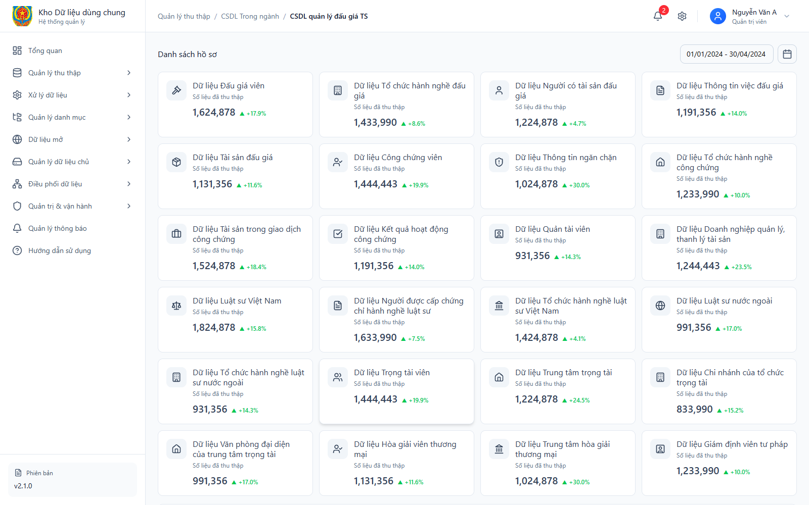

*Hình 41 – Màn hình tổng quan hồ sơ Đấu giá tài sản*

4.2.4.11.1.1 Mô tả thông tin trên màn hình
| **STT** | **Tên trường thông tin** | **Kiểu dữ liệu** | **Bắt buộc** | **Mặc định** | **Mô tả** |
| --- | --- | --- | --- | --- | --- |
| Dashboard Cards | CARD LIST | - | - | Thống kê: Thông báo đấu giá, Cuộc đấu giá thành, Giá trị chênh lệch, Số tổ chức đăng ký. |

##### 4.2.4.11.2. DGTS.M02 Danh sách chi tiết tài sản Đấu giá
- **Mã chức năng:** DC1-TT-QT-003
- **Mã màn hình:** DGTS.M02

Màn hình

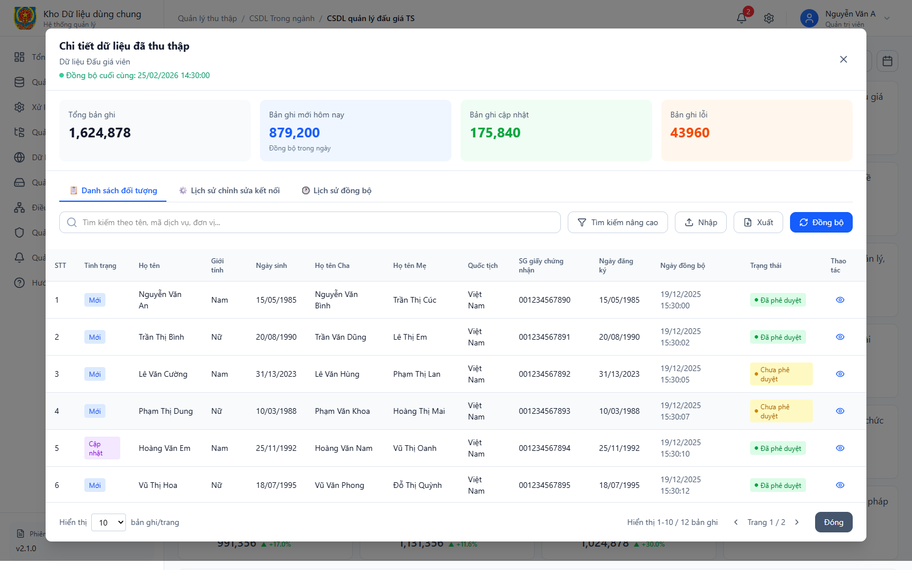

*Hình 42 – Màn hình danh sách bản ghi đấu giá tài sản*

4.2.4.11.2.1 Mô tả thông tin trên màn hình
| **STT** | **Tên trường thông tin** | **Kiểu dữ liệu** | **Bắt buộc** | **Mặc định** | **Mô tả** |
| --- | --- | --- | --- | --- | --- |
| Tìm kiếm | VARCHAR2(255) | - | - | Tìm theo tên tài sản, tổ chức đấu giá. |
| Bảng dữ liệu | TABLE | - | - | Các cột: STT, Tên tài sản, Đơn vị đấu giá, Tổ chức đấu giá, Giá khởi điểm, Giá trúng đấu giá, Ngày đấu giá, Trạng thái. |

---

#### 4.2.4.12. CSDL Hợp tác quốc tế (6)

##### 4.2.4.12.1. HTQT.M01 Tổng quan CSDL Hợp tác quốc tế
- **Mã chức năng:** DC1-TT-QT-003
- **Mã màn hình:** DC1-UC003-MH1

Màn hình

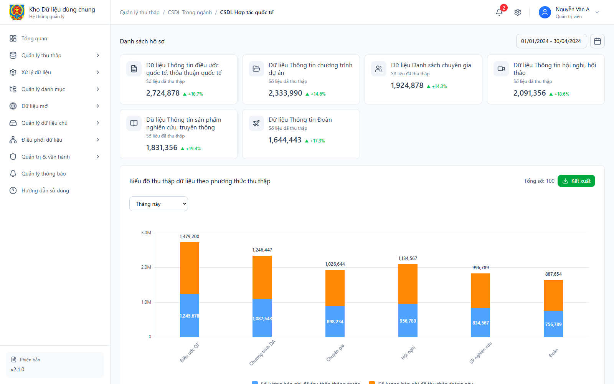

*Hình 43 – Màn hình tổng quan Hợp tác quốc tế*

4.2.4.12.1.1 Mô tả thông tin trên màn hình
| **STT** | **Tên trường thông tin** | **Kiểu dữ liệu** | **Bắt buộc** | **Mặc định** | **Mô tả** |
| --- | --- | --- | --- | --- | --- |
| Dashboard Cards | CARD LIST | - | - | Thống kê: Thỏa thuận ký kết, Dự án ODA, Đoàn ra/đoàn vào, Báo cáo quốc tế. |

##### 4.2.4.12.2. HTQT.M02 Danh sách chi tiết hồ sơ Hợp tác quốc tế
- **Mã chức năng:** DC1-TT-QT-003
- **Mã màn hình:** HTQT.M02

Màn hình

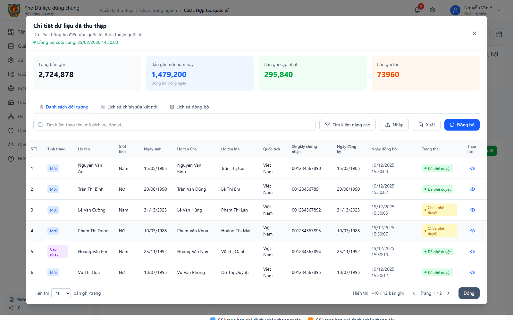

*Hình 44 – Màn hình danh sách bản ghi hợp tác quốc tế*

4.2.4.12.2.1 Mô tả thông tin trên màn hình
| **STT** | **Tên trường thông tin** | **Kiểu dữ liệu** | **Bắt buộc** | **Mặc định** | **Mô tả** |
| --- | --- | --- | --- | --- | --- |
| Tìm kiếm | VARCHAR2(255) | - | - | Tìm theo tên thỏa thuận/dự án, đối tác. |
| Bảng dữ liệu | TABLE | - | - | Các cột: STT, Tên thỏa thuận/dự án, Đối tác quốc tế, Ngày ký, Thời hạn, Ngân sách, Trạng thái. |

---

## 4.2.5. DC102.QLTT.CSDLNN – CSDL Ngoài ngành

### *4.2.5.1. Mục đích*
Khai thác dữ liệu từ các nguồn bên ngoài thông qua kết nối LGSP hoặc các trục liên thông dữ liệu khác, phục vụ công tác đối soát và làm sạch dữ liệu dùng chung.

*+ Phân quyền*
Cán bộ nghiệp vụ và cán bộ khai thác dữ liệu Ngoài ngành.

*+ Điều kiện thực hiện*
Hệ thống đã kết nối thành công với các trục dữ liệu quốc gia/ngành.

### 4.2.5.2. DC102.QLTT.CSDLNN – Khai thác CSDL Ngoài ngành

#### 4.2.5.2.1. CSDL Thông tin Bản án (1)

##### 4.2.5.2.1.1. MH05.M02a Tổng quan Thông tin Bản án
- **Mã chức năng:** DC1-TT-QT-004
- **Mã màn hình:** MH05.M02a

Màn hình

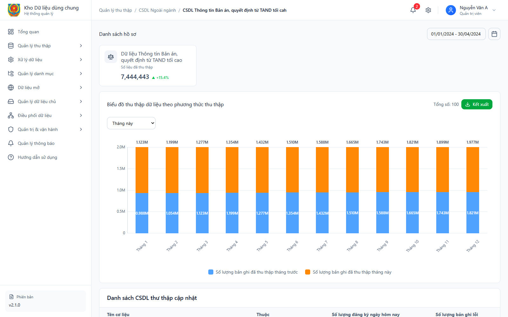

*Hình 45 – Màn hình tổng quan dữ liệu Bản án, quyết định*

4.2.5.2.1.1.1 Mô tả thông tin trên màn hình
| **STT** | **Tên trường thông tin** | **Kiểu dữ liệu** | **Bắt buộc** | **Mặc định** | **Mô tả** |
| --- | --- | --- | --- | --- | --- |
| Lọc thời gian | DATE RANGE | - | - | Lọc theo ngày công bố/đồng bộ. |
| Thẻ thống kê | CARD | - | - | Tổng số bản án, quyết định đã đồng bộ từ Tòa án. |

##### 4.2.5.2.1.2. MH05.M04a Danh sách chi tiết Bản án/Quyết định
- **Mã chức năng:** DC1-TT-QT-004
- **Mã màn hình:** MH05.M04a

Màn hình

*Hình 46 – Màn hình danh sách bản án chi tiết*

4.2.5.2.1.2.1 Mô tả thông tin trên màn hình
| **STT** | **Tên trường thông tin** | **Kiểu dữ liệu** | **Bắt buộc** | **Mặc định** | **Mô tả** |
| --- | --- | --- | --- | --- | --- |
| Tìm kiếm | VARCHAR2(255) | - | - | Tìm theo số bản án, tên vụ án. |
| Bảng dữ liệu | TABLE | - | - | Các cột: STT, Mã bản án, Tên bản án, TAND giải quyết, Ngày tuyên án, Nội dung tóm tắt, Ngày đồng bộ, Trạng thái. |

---

#### 4.2.5.2.2. Danh mục (8)

##### 4.2.5.2.2.1. MH05.M02b Tổng quan Nhóm Danh mục quốc gia
- **Mã chức năng:** DC1-TT-QT-004
- **Mã màn hình:** MH05.M02b

Màn hình

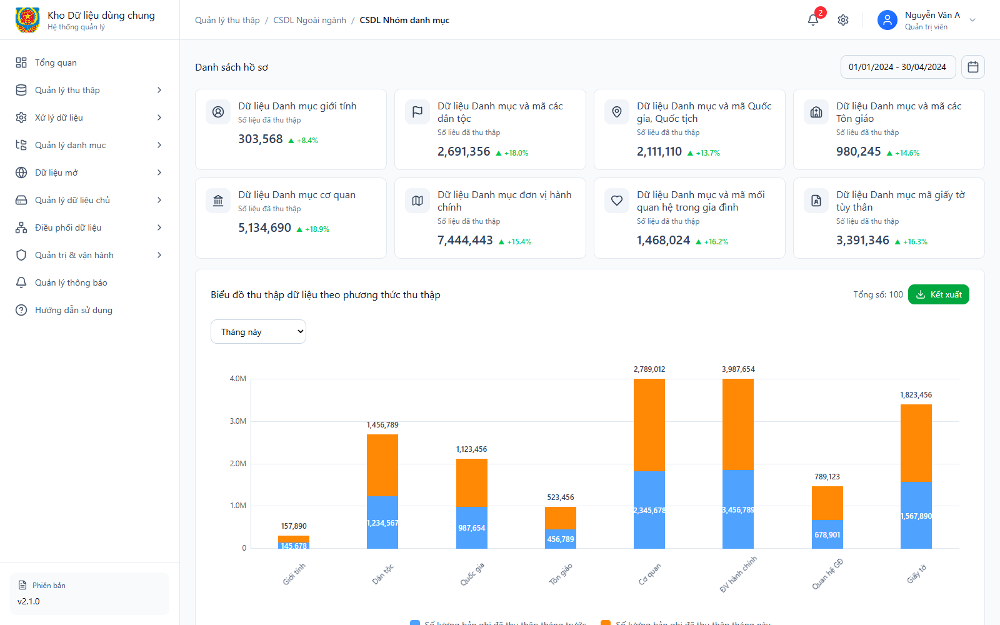

*Hình 47 – Màn hình tổng quan Nhóm Danh mục (8 loại)*

4.2.5.2.2.1.1 Mô tả thông tin trên màn hình
*(Hỗ trợ 8 loại: Giới tính, Dân tộc, Quốc gia, Tôn giáo, Cơ quan, ĐV Hành chính, Mối quan hệ, Giấy tờ tùy thân)*

| **STT** | **Tên trường thông tin** | **Kiểu dữ liệu** | **Bắt buộc** | **Mặc định** | **Mô tả** |
| --- | --- | --- | --- | --- | --- |
| Tìm kiếm danh mục | VARCHAR2(255) | - | - | Tìm nhanh mã hoặc tên mục. |
| Bảng dữ liệu | TABLE | - | - | Hiển thị: Mã code, Tên hiển thị, Trạng thái hoạt động. |

---

#### 4.2.5.2.3. BHXH và Giảm nghèo (7)

##### 4.2.5.2.3.1. MH05.M02c Tổng quan Nhóm BHXH và Giảm nghèo
- **Mã chức năng:** DC1-TT-QT-004
- **Mã màn hình:** MH05.M02c

Màn hình

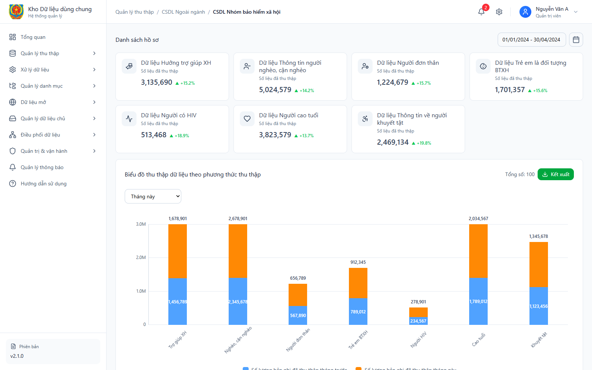

*Hình 48 – Màn hình tổng quan Nhóm BHXH và Giảm nghèo (7 loại)*

4.2.5.2.3.1.1 Mô tả thông tin trên màn hình
*(Hỗ trợ khai thác 7 loại hồ sơ: Trợ giúp XH, Hộ nghèo/cận nghèo, Người đơn thân, Trẻ em đối tượng BTXH, Người có HIV, Người cao tuổi, Người khuyết tật)*

| **STT** | **Tên trường thông tin** | **Kiểu dữ liệu** | **Bắt buộc** | **Mặc định** | **Mô tả** |
| --- | --- | --- | --- | --- | --- |
| Thời gian lọc | DATE RANGE | - | Tháng này | Lọc dữ liệu theo khoảng thời gian đồng bộ. |
| Các khối dữ liệu | CARD LIST | - | - | Tổng số bản ghi theo từng loại đối tượng BHXH/Giảm nghèo. |

##### 4.2.5.2.3.2. MH05.M04c Chi tiết dữ liệu BHXH và Giảm nghèo
- **Mã chức năng:** DC1-TT-QT-004
- **Mã màn hình:** MH05.M04c

Màn hình

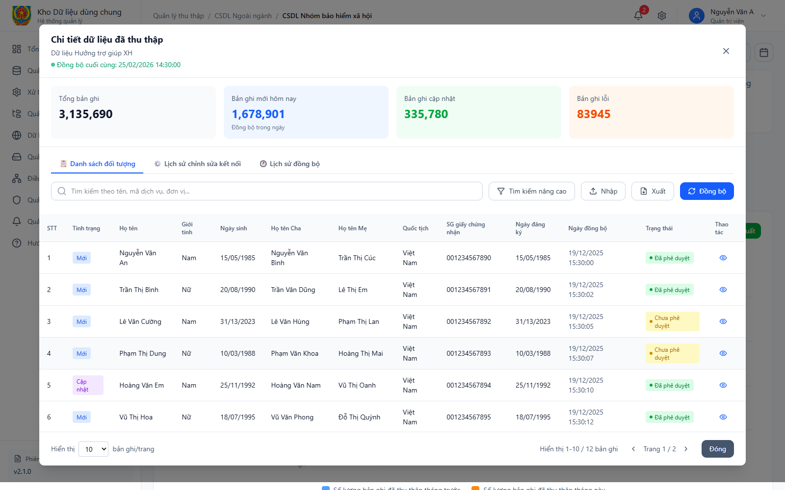

*Hình 49 – Màn hình danh sách bản ghi BHXH & Giảm nghèo*

4.2.5.2.3.2.1 Mô tả thông tin trên màn hình
| **STT** | **Tên trường thông tin** | **Kiểu dữ liệu** | **Bắt buộc** | **Mặc định** | **Mô tả** |
| --- | --- | --- | --- | --- | --- |
| Tìm kiếm | VARCHAR2(255) | - | - | Tìm theo họ tên, số định danh. |
| Bảng dữ liệu | TABLE | - | - | Các cột: STT, Tình trạng, Họ tên, Giới tính, Ngày sinh, Số định danh, Địa chỉ, Loại đối tượng, Ngày đồng bộ, Trạng thái. |

---

#### 4.2.5.2.4. Người có công (3)

##### 4.2.5.2.4.1. MH05.M02d Tổng quan Nhóm Người có công
- **Mã chức năng:** DC1-TT-QT-004
- **Mã màn hình:** MH05.M02d

Màn hình

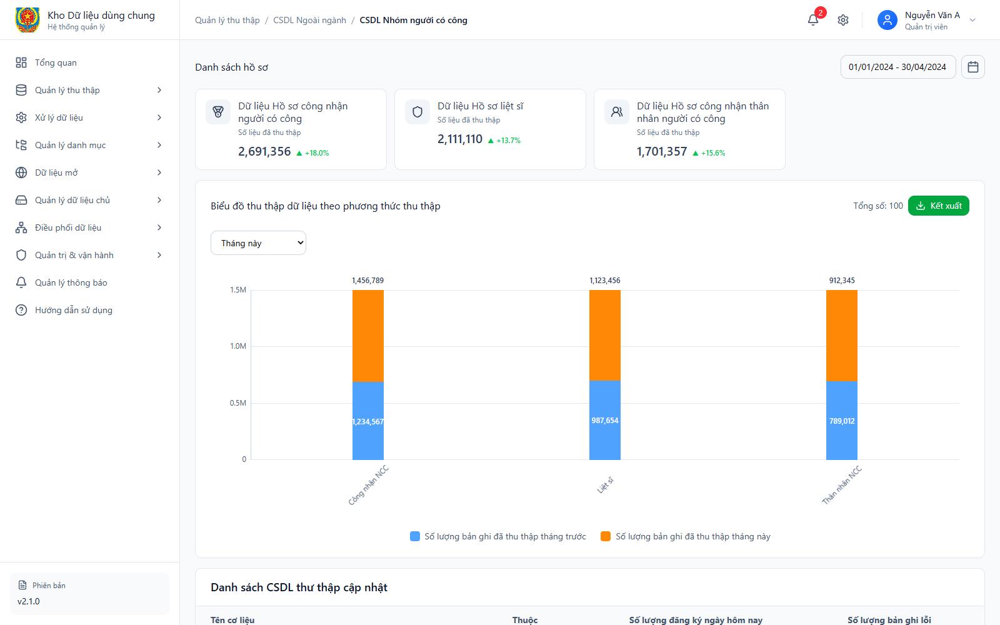

*Hình 50 – Màn hình tổng quan Nhóm Người có công (3 loại)*

4.2.5.2.4.1.1 Mô tả thông tin trên màn hình
*(Hỗ trợ khai thác 3 loại hồ sơ: Người có công, Hồ sơ liệt sĩ, Thân nhân người có công)*

| **STT** | **Tên trường thông tin** | **Kiểu dữ liệu** | **Bắt buộc** | **Mặc định** | **Mô tả** |
| --- | --- | --- | --- | --- | --- |
| Thời gian lọc | DATE RANGE | - | Tháng này | Khoảng thời gian dữ liệu. |
| Dashboard Cards | CARD LIST | - | - | Các loại hồ sơ người có công. |

##### 4.2.5.2.4.2. MH05.M04d Chi tiết dữ liệu Người có công
- **Mã chức năng:** DC1-TT-QT-004
- **Mã màn hình:** MH05.M04d

Màn hình

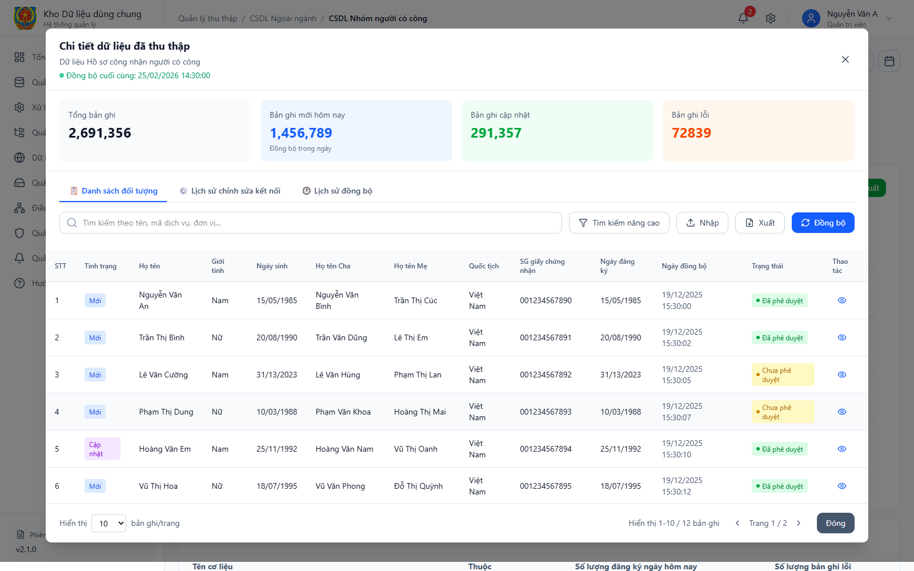

*Hình 51 – Màn hình danh sách bản ghi Người có công*

4.2.5.2.4.2.1 Mô tả thông tin trên màn hình
| **STT** | **Tên trường thông tin** | **Kiểu dữ liệu** | **Bắt buộc** | **Mặc định** | **Mô tả** |
| --- | --- | --- | --- | --- | --- |
| Tìm kiếm | VARCHAR2(255) | - | - | Tìm kiếm theo tên, mã hồ sơ. |
| Bảng dữ liệu | TABLE | - | - | Các cột: STT, Tình trạng, Họ tên, Giới tính, Năm sinh, Nguyên quán, Loại hồ sơ (NCC/Liệt sĩ), Số hiệu hồ sơ, Ngày đồng bộ, Trạng thái. |

---

#### 4.2.5.2.5. Trẻ em (1)

##### 4.2.5.2.5.1. MH05.M02e Tổng quan CSDL Trẻ em
- **Mã chức năng:** DC1-TT-QT-004
- **Mã màn hình:** MH05.M02e

Màn hình

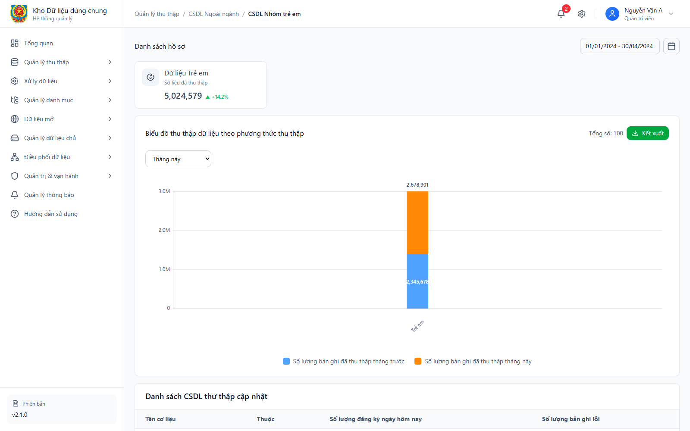

*Hình 52 – Màn hình tổng quan CSDL Trẻ em*

4.2.5.2.5.1.1 Mô tả thông tin trên màn hình
| **STT** | **Tên trường thông tin** | **Kiểu dữ liệu** | **Bắt buộc** | **Mặc định** | **Mô tả** |
| --- | --- | --- | --- | --- | --- |
| Thời gian lọc | DATE RANGE | - | Tháng này | Thời điểm thu thập dữ liệu trẻ em. |
| Thống kê | CARD | - | - | Tổng số bản ghi trẻ em được đồng bộ. |

##### 4.2.5.2.5.2. MH05.M04e Chi tiết dữ liệu CSDL Trẻ em
- **Mã chức năng:** DC1-TT-QT-004
- **Mã màn hình:** MH05.M04e

Màn hình

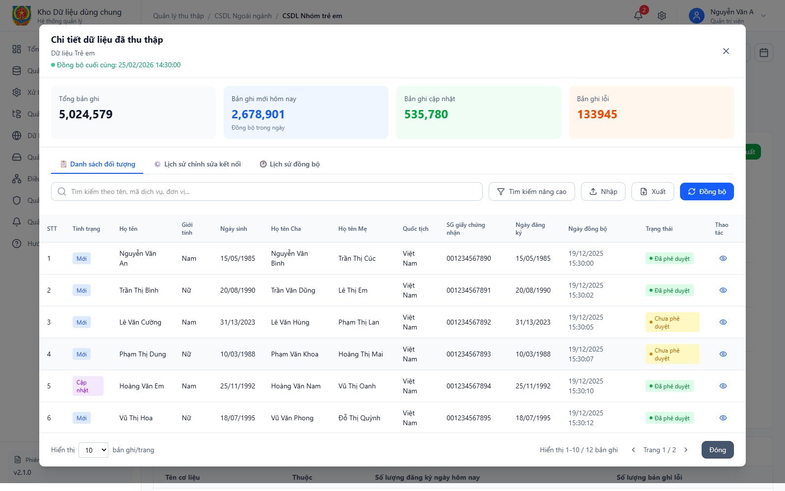

*Hình 53 – Màn hình danh sách bản ghi Trẻ em*

4.2.5.2.5.2.1 Mô tả thông tin trên màn hình
| **STT** | **Tên trường thông tin** | **Kiểu dữ liệu** | **Bắt buộc** | **Mặc định** | **Mô tả** |
| --- | --- | --- | --- | --- | --- |
| Tìm kiếm | VARCHAR2(255) | - | - | Tìm kiếm theo tên trẻ, tên người giám hộ. |
| Bảng dữ liệu | TABLE | - | - | Các cột: STT, Tình trạng, Họ tên trẻ, Giới tính, Ngày sinh, Họ tên Cha/Mẹ/Người giám hộ, Địa chỉ cư trú, Ngày đồng bộ, Trạng thái. |

4.2.5.2.7.2 Chức năng trên màn hình
|  |  |  |  |
| --- | --- | --- | --- |
| **STT** | **Tên chức năng** | **Định dạng** | **Mô tả** |
| 1 | CN01 | Tab | Chuyển đổi giữa 3 tab thông tin chi tiết. |
| 2 | CN02 | Button blue | Nhập dữ liệu và lưu hồ sơ. |
| 3 | CN03 | Button green | Xuất dữ liệu ra Excel. |
| 4 | CN04 | Button orange | Thực hiện đồng bộ tức thời. |
| 5 | CN05 | Button white | Đóng popup. |

---

## 4.2.6. DC102.QLTT.DSTN – Đối soát hệ thống trong ngành

### *4.2.6.1. Mục đích*
Đối chiếu dữ liệu giữa kho dùng chung và các hệ thống nội bộ.

*+ Phân quyền*
Cán bộ kỹ thuật.

### 4.2.6.2. DC102.QLTT.DSTN.MH06 – Đối soát Trong ngành

#### 4.2.6.2.1. MH06.M01 Danh sách đối soát Trong ngành
Màn hình

4.2.6.2.1.1 Mô tả thông tin trên màn hình
| **STT** | **Tên trường thông tin** | **Kiểu dữ liệu** | **Bắt buộc** | **Mặc định** | **Mô tả** |
| --- | --- | --- | --- | --- | --- |
| Thống kê nhanh | NUMBER | - | - | Tổng bộ dữ liệu, Khớp, Không khớp, Lỗi. |
| Tìm kiếm | VARCHAR2(255) | - | - | Tìm theo mã hồ sơ, hệ thống, loại đối soát. |
| Kết quả đối soát | TABLE | - | - | STT, Mã hồ sơ, Hồ sơ dữ liệu cung cấp, Loại đối soát, Số bản ghi, Ngày nhận, Trạng thái. |

4.2.6.2.1.2 Chức năng trên màn hình
|  |  |  |  |
| --- | --- | --- | --- |
| **STT** | **Tên chức năng** | **Định dạng** | **Mô tả** |
| 1 | CN01 | Select | Lọc theo trạng thái đối soát. |
| 2 | CN02 | Button icon | Xem chi tiết đối soát (MH06.M02). |

#### 4.2.6.2.2. DC1-UC005-MH1 Chi tiết dữ liệu đối soát
- **Mã chức năng:** DC1-TT-QT-005
- **Mã màn hình:** DC1-UC005-MH1

Màn hình

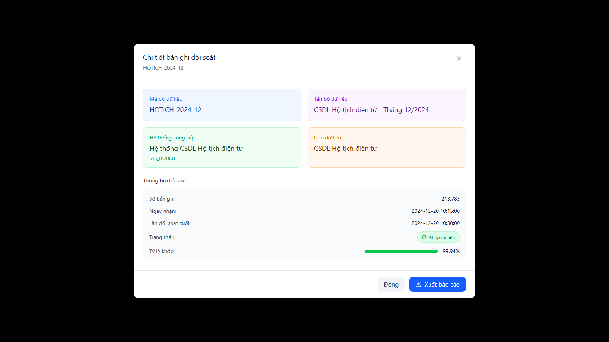

4.2.6.2.2.1 Mô tả thông tin trên màn hình
| **STT** | **Tên trường thông tin** | **Kiểu dữ liệu** | **Bắt buộc** | **Mặc định** | **Mô tả** |
| --- | --- | --- | --- | --- | --- |
| Thông tin bộ dữ liệu | TEXT | - | - | Mã, Tên bộ dữ liệu, Hệ thống cung cấp, Loại dữ liệu. |
| Chỉ số đối soát | NUMBER | - | - | Số bản ghi, Lần đối soát cuối, Tỷ lệ khớp (%). |

4.2.6.2.2.2 Chức năng trên màn hình
|  |  |  |  |
| --- | --- | --- | --- |
| **STT** | **Tên chức năng** | **Định dạng** | **Mô tả** |
| 1 | CN01 | Button text | Đóng popup. |

#### 4.2.6.2.3. DC1-UC005-MH1 Chi tiết lỗi đối soát
- **Mã chức năng:** DC1-TT-QT-005
- **Mã màn hình:** DC1-UC005-MH1

Màn hình

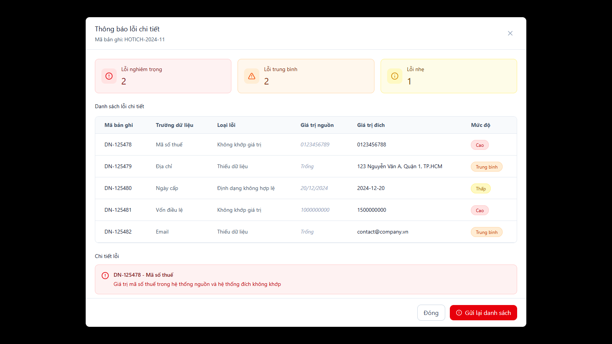

4.2.6.2.3.1 Mô tả thông tin trên màn hình
| **STT** | **Tên trường thông tin** | **Kiểu dữ liệu** | **Bắt buộc** | **Mặc định** | **Mô tả** |
| --- | --- | --- | --- | --- | --- |
| Thống kê lỗi | NUMBER | - | - | Thống kê số lượng theo loại lỗi. |
| Chi tiết lỗi (Mã bản ghi) | TEXT | - | - | Thông tin mã bản ghi và nguyên nhân chi tiết. |

4.2.6.2.3.2 Chức năng trên màn hình
|  |  |  |  |
| --- | --- | --- | --- |
| **STT** | **Tên chức năng** | **Định dạng** | **Mô tả** |
| 1 | CN01 | Button white | Đóng thông báo. |
| 2 | CN02 | Button red | Gửi lại danh sách. |

#### 4.2.6.2.4. MH06.M04 Thiết lập dịch vụ đối soát
Màn hình

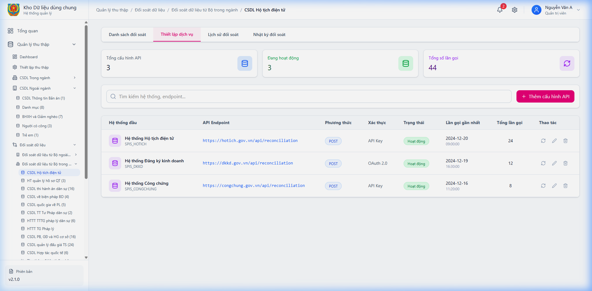

4.2.6.2.4.1 Mô tả thông tin trên màn hình
| **STT** | **Tên trường thông tin** | **Kiểu dữ liệu** | **Bắt buộc** | **Mặc định** | **Mô tả** |
| --- | --- | --- | --- | --- | --- |
| Thống kê cấu hình | NUMBER | - | - | Tổng cấu hình API, Đang hoạt động, Tổng lần gọi. |
| Danh sách cấu hình | TABLE | - | - | Hệ thống đầu, Endpoint, Phương thức, Trạng thái, Lần gọi gần nhất. |

4.2.6.2.4.2 Chức năng trên màn hình
|  |  |  |  |
| --- | --- | --- | --- |
| **STT** | **Tên chức năng** | **Định dạng** | **Mô tả** |
| 1 | CN01 | Button blue | Thêm cấu hình API (MH06.M05). |
| 2 | CN02 | Button icon | Sửa/Xóa cấu hình. |

#### 4.2.6.2.5. MH06.M05 Thêm cấu hình đối soát
Màn hình

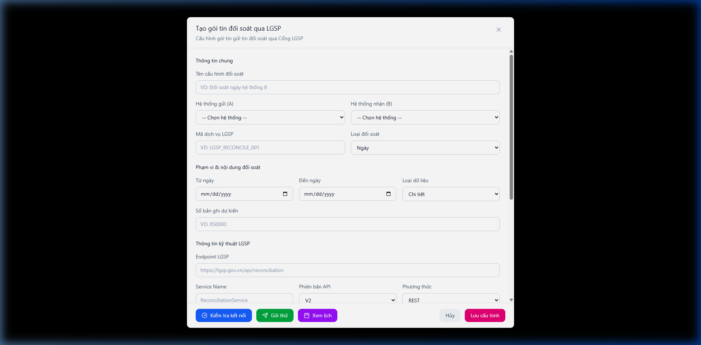

4.2.6.2.5.1 Mô tả thông tin trên màn hình
| **STT** | **Tên trường thông tin** | **Kiểu dữ liệu** | **Bắt buộc** | **Mặc định** | **Mô tả** |
| --- | --- | --- | --- | --- | --- |
| Thông tin chung | TEXT | Có | - | Tên cấu hình, Hệ thống gửi/nhận, Loại đối soát. |
| Cấu hình kỹ thuật | TEXT | Có | - | LGSP Service, Endpoint, Method, Authen, Cert. |
| Phạm vi dữ liệu | DATE range | - | - | Từ ngày, Đến ngày, Số bản ghi dự kiến. |

4.2.6.2.5.2 Chức năng trên màn hình
|  |  |  |  |
| --- | --- | --- | --- |
| **STT** | **Tên chức năng** | **Định dạng** | **Mô tả** |
| 1 | CN01 | Button blue | Lưu cấu hình. |
| 2 | CN02 | Button text | Hủy bỏ. |

#### 4.2.6.2.6. MH06.M06 Sửa cấu hình đối soát
Màn hình

*Hình 22 – Màn hình chỉnh sửa cấu hình*

#### 4.2.6.2.7. MH06.M07 Xác nhận xóa cấu hình
Màn hình

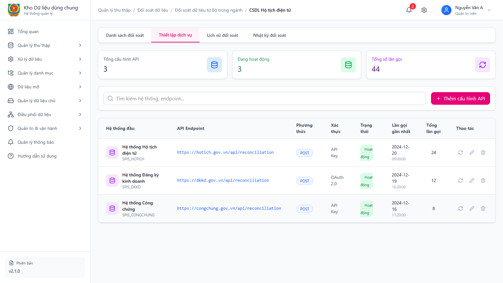

4.2.6.2.7.1 Mô tả thông tin trên màn hình
| **STT** | **Tên trường thông tin** | **Kiểu dữ liệu** | **Bắt buộc** | **Mặc định** | **Mô tả** |
| --- | --- | --- | --- | --- | --- |
| Thông báo | TEXT | - | - | Xác nhận xóa cấu hình không thể hoàn tác. |

4.2.6.2.7.2 Chức năng trên màn hình
|  |  |  |  |
| --- | --- | --- | --- |
| **STT** | **Tên chức năng** | **Định dạng** | **Mô tả** |
| 1 | CN01 | Button red | Xác nhận xóa. |
| 2 | CN02 | Button white | Hủy. |

#### 4.2.6.2.8. MH06.M08 Lịch sử đối soát
Màn hình

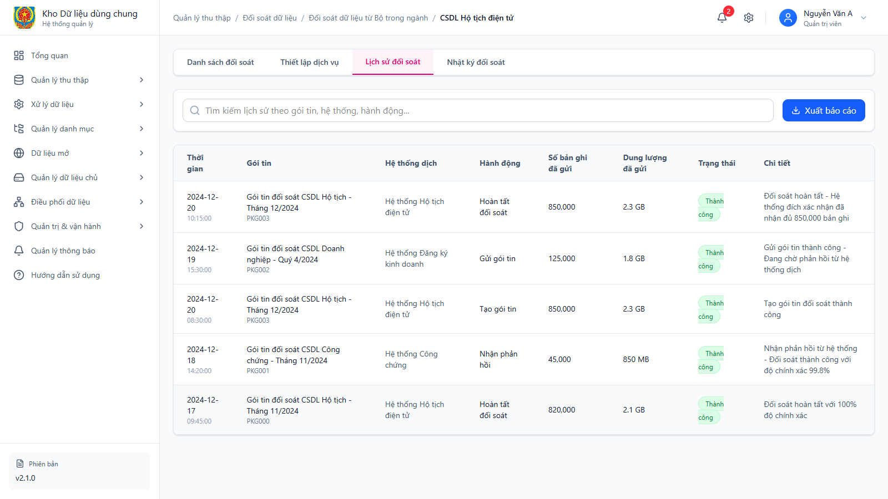

4.2.6.2.8.1 Mô tả thông tin trên màn hình
| **STT** | **Tên trường thông tin** | **Kiểu dữ liệu** | **Bắt buộc** | **Mặc định** | **Mô tả** |
| --- | --- | --- | --- | --- | --- |
| Lịch sử đồng bộ | TABLE | - | - | Thời gian, Gói tin, Hệ thống đích, Hành động, Số bản ghi, Dung lượng, Trạng thái. |

4.2.6.2.8.2 Chức năng trên màn hình
|  |  |  |  |
| --- | --- | --- | --- |
| **STT** | **Tên chức năng** | **Định dạng** | **Mô tả** |
| 1 | CN01 | Button green | Xuất lịch sử Excel. |

#### 4.2.6.2.9. MH06.M09 Nhật ký đối soát
Màn hình

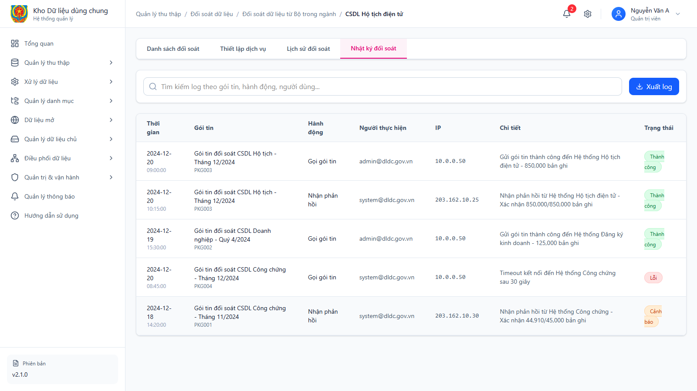

4.2.6.2.9.1 Mô tả thông tin trên màn hình
| **STT** | **Tên trường thông tin** | **Kiểu dữ liệu** | **Bắt buộc** | **Mặc định** | **Mô tả** |
| --- | --- | --- | --- | --- | --- |
| Nhật ký hệ thống | TABLE | - | - | Thời gian, Gói tin, Hành động, Người thực hiện, IP, Chi tiết, Trạng thái. |

4.2.6.2.9.2 Chức năng trên màn hình
|  |  |  |  |
| --- | --- | --- | --- |
| **STT** | **Tên chức năng** | **Định dạng** | **Mô tả** |
| 1 | CN01 | Button green | Xuất nhật ký Excel. |

---

#### 4.2.6.2.10. MH06.M10 Danh sách đối soát dữ liệu CSDL Hộ tịch điện tử

Màn hình

4.2.6.2.10.1 Mô tả thông tin trên màn hình
| **STT** | **Tên trường thông tin** | **Kiểu dữ liệu** | **Bắt buộc** | **Mặc định** | **Mô tả** |
| --- | --- | --- | --- | --- | --- |
| Thống kê | NUMBER | - | - | Số lượng tổng, khớp, không khớp, lỗi. |
| Danh sách | TABLE | - | - | Thể hiện bảng dữ liệu đối soát CSDL Hộ tịch điện tử. |

4.2.6.2.10.2 Chức năng trên màn hình
|  |  |  |  |
| --- | --- | --- | --- |
| **STT** | **Tên chức năng** | **Định dạng** | **Mô tả** |
| 1 | CN01 | Select | Lọc theo trạng thái. |
| 2 | CN02 | Button | Xuất Excel kết quả. |

#### 4.2.6.2.11. MH06.M11 Danh sách đối soát dữ liệu HT quản lý hồ sơ QT

Màn hình

4.2.6.2.11.1 Mô tả thông tin trên màn hình
| **STT** | **Tên trường thông tin** | **Kiểu dữ liệu** | **Bắt buộc** | **Mặc định** | **Mô tả** |
| --- | --- | --- | --- | --- | --- |
| Thống kê | NUMBER | - | - | Số lượng tổng, khớp, không khớp, lỗi. |
| Danh sách | TABLE | - | - | Thể hiện bảng dữ liệu đối soát HT quản lý hồ sơ QT. |

4.2.6.2.11.2 Chức năng trên màn hình
|  |  |  |  |
| --- | --- | --- | --- |
| **STT** | **Tên chức năng** | **Định dạng** | **Mô tả** |
| 1 | CN01 | Select | Lọc theo trạng thái. |
| 2 | CN02 | Button | Xuất Excel kết quả. |

#### 4.2.6.2.12. MH06.M12 Danh sách đối soát dữ liệu CSDL thi hành án dân sự

Màn hình

4.2.6.2.12.1 Mô tả thông tin trên màn hình
| **STT** | **Tên trường thông tin** | **Kiểu dữ liệu** | **Bắt buộc** | **Mặc định** | **Mô tả** |
| --- | --- | --- | --- | --- | --- |
| Thống kê | NUMBER | - | - | Số lượng tổng, khớp, không khớp, lỗi. |
| Danh sách | TABLE | - | - | Thể hiện bảng dữ liệu đối soát CSDL thi hành án dân sự. |

4.2.6.2.12.2 Chức năng trên màn hình
|  |  |  |  |
| --- | --- | --- | --- |
| **STT** | **Tên chức năng** | **Định dạng** | **Mô tả** |
| 1 | CN01 | Select | Lọc theo trạng thái. |
| 2 | CN02 | Button | Xuất Excel kết quả. |

#### 4.2.6.2.13. MH06.M13 Danh sách đối soát dữ liệu CSDL về biện pháp BĐ

Màn hình

4.2.6.2.13.1 Mô tả thông tin trên màn hình
| **STT** | **Tên trường thông tin** | **Kiểu dữ liệu** | **Bắt buộc** | **Mặc định** | **Mô tả** |
| --- | --- | --- | --- | --- | --- |
| Thống kê | NUMBER | - | - | Số lượng tổng, khớp, không khớp, lỗi. |
| Danh sách | TABLE | - | - | Thể hiện bảng dữ liệu đối soát CSDL về biện pháp BĐ. |

4.2.6.2.13.2 Chức năng trên màn hình
|  |  |  |  |
| --- | --- | --- | --- |
| **STT** | **Tên chức năng** | **Định dạng** | **Mô tả** |
| 1 | CN01 | Select | Lọc theo trạng thái. |
| 2 | CN02 | Button | Xuất Excel kết quả. |

#### 4.2.6.2.14. MH06.M14 Danh sách đối soát dữ liệu CSDL quốc gia về PL

Màn hình

4.2.6.2.14.1 Mô tả thông tin trên màn hình
| **STT** | **Tên trường thông tin** | **Kiểu dữ liệu** | **Bắt buộc** | **Mặc định** | **Mô tả** |
| --- | --- | --- | --- | --- | --- |
| Thống kê | NUMBER | - | - | Số lượng tổng, khớp, không khớp, lỗi. |
| Danh sách | TABLE | - | - | Thể hiện bảng dữ liệu đối soát CSDL quốc gia về PL. |

4.2.6.2.14.2 Chức năng trên màn hình
|  |  |  |  |
| --- | --- | --- | --- |
| **STT** | **Tên chức năng** | **Định dạng** | **Mô tả** |
| 1 | CN01 | Select | Lọc theo trạng thái. |
| 2 | CN02 | Button | Xuất Excel kết quả. |

#### 4.2.6.2.15. MH06.M15 Danh sách đối soát dữ liệu CSDL TT Tư Pháp dân sự

Màn hình

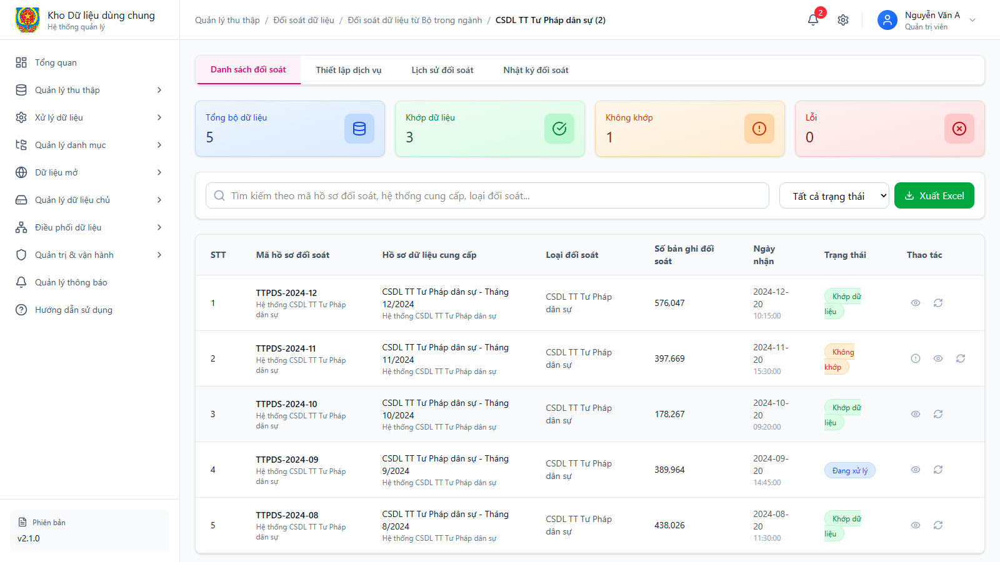

4.2.6.2.15.1 Mô tả thông tin trên màn hình
| **STT** | **Tên trường thông tin** | **Kiểu dữ liệu** | **Bắt buộc** | **Mặc định** | **Mô tả** |
| --- | --- | --- | --- | --- | --- |
| Thống kê | NUMBER | - | - | Số lượng tổng, khớp, không khớp, lỗi. |
| Danh sách | TABLE | - | - | Thể hiện bảng dữ liệu đối soát CSDL TT Tư Pháp dân sự. |

4.2.6.2.15.2 Chức năng trên màn hình
|  |  |  |  |
| --- | --- | --- | --- |
| **STT** | **Tên chức năng** | **Định dạng** | **Mô tả** |
| 1 | CN01 | Select | Lọc theo trạng thái. |
| 2 | CN02 | Button | Xuất Excel kết quả. |

#### 4.2.6.2.16. MH06.M16 Danh sách đối soát dữ liệu HTTT TTTG pháp lý dân sự

Màn hình

4.2.6.2.16.1 Mô tả thông tin trên màn hình
| **STT** | **Tên trường thông tin** | **Kiểu dữ liệu** | **Bắt buộc** | **Mặc định** | **Mô tả** |
| --- | --- | --- | --- | --- | --- |
| Thống kê | NUMBER | - | - | Số lượng tổng, khớp, không khớp, lỗi. |
| Danh sách | TABLE | - | - | Thể hiện bảng dữ liệu đối soát HTTT TTTG pháp lý dân sự. |

4.2.6.2.16.2 Chức năng trên màn hình
|  |  |  |  |
| --- | --- | --- | --- |
| **STT** | **Tên chức năng** | **Định dạng** | **Mô tả** |
| 1 | CN01 | Select | Lọc theo trạng thái. |
| 2 | CN02 | Button | Xuất Excel kết quả. |

#### 4.2.6.2.17. MH06.M17 Danh sách đối soát dữ liệu HTTT TG Pháp lý

Màn hình

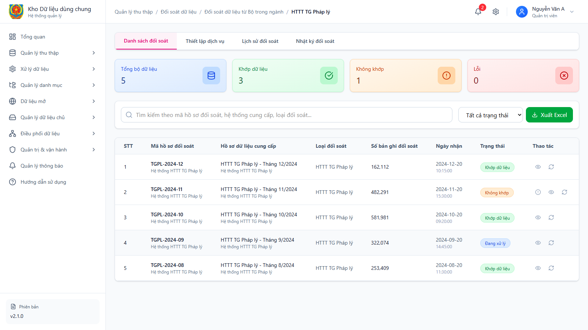

4.2.6.2.17.1 Mô tả thông tin trên màn hình
| **STT** | **Tên trường thông tin** | **Kiểu dữ liệu** | **Bắt buộc** | **Mặc định** | **Mô tả** |
| --- | --- | --- | --- | --- | --- |
| Thống kê | NUMBER | - | - | Số lượng tổng, khớp, không khớp, lỗi. |
| Danh sách | TABLE | - | - | Thể hiện bảng dữ liệu đối soát HTTT TG Pháp lý. |

4.2.6.2.17.2 Chức năng trên màn hình
|  |  |  |  |
| --- | --- | --- | --- |
| **STT** | **Tên chức năng** | **Định dạng** | **Mô tả** |
| 1 | CN01 | Select | Lọc theo trạng thái. |
| 2 | CN02 | Button | Xuất Excel kết quả. |

#### 4.2.6.2.18. MH06.M18 Danh sách đối soát dữ liệu CSDL PB, GĐ và HG cơ sở

Màn hình

4.2.6.2.18.1 Mô tả thông tin trên màn hình
| **STT** | **Tên trường thông tin** | **Kiểu dữ liệu** | **Bắt buộc** | **Mặc định** | **Mô tả** |
| --- | --- | --- | --- | --- | --- |
| Thống kê | NUMBER | - | - | Số lượng tổng, khớp, không khớp, lỗi. |
| Danh sách | TABLE | - | - | Thể hiện bảng dữ liệu đối soát CSDL PB, GĐ và HG cơ sở. |

4.2.6.2.18.2 Chức năng trên màn hình
|  |  |  |  |
| --- | --- | --- | --- |
| **STT** | **Tên chức năng** | **Định dạng** | **Mô tả** |
| 1 | CN01 | Select | Lọc theo trạng thái. |
| 2 | CN02 | Button | Xuất Excel kết quả. |

#### 4.2.6.2.19. MH06.M19 Danh sách đối soát dữ liệu CSDL quản lý đấu giá TS

Màn hình

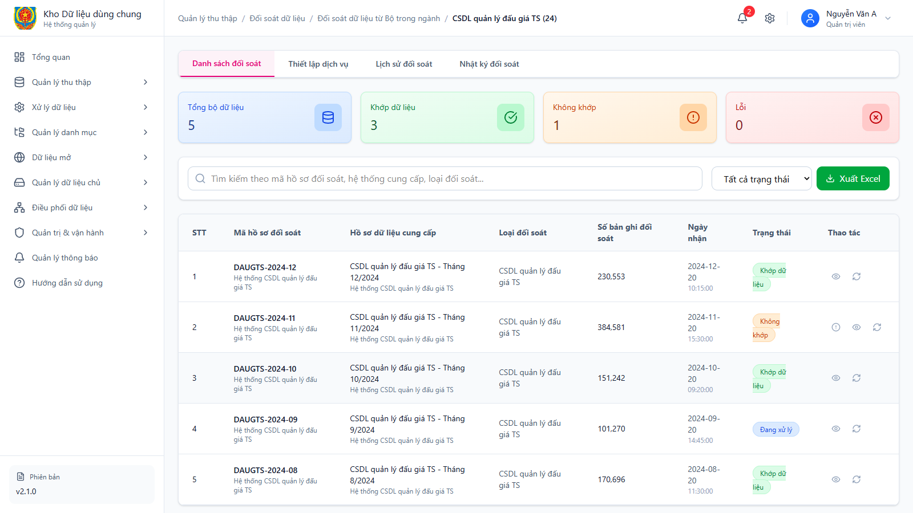

4.2.6.2.19.1 Mô tả thông tin trên màn hình
| **STT** | **Tên trường thông tin** | **Kiểu dữ liệu** | **Bắt buộc** | **Mặc định** | **Mô tả** |
| --- | --- | --- | --- | --- | --- |
| Thống kê | NUMBER | - | - | Số lượng tổng, khớp, không khớp, lỗi. |
| Danh sách | TABLE | - | - | Thể hiện bảng dữ liệu đối soát CSDL quản lý đấu giá TS. |

4.2.6.2.19.2 Chức năng trên màn hình
|  |  |  |  |
| --- | --- | --- | --- |
| **STT** | **Tên chức năng** | **Định dạng** | **Mô tả** |
| 1 | CN01 | Select | Lọc theo trạng thái. |
| 2 | CN02 | Button | Xuất Excel kết quả. |

#### 4.2.6.2.20. MH06.M20 Danh sách đối soát dữ liệu CSDL Hợp tác quốc tế

Màn hình

4.2.6.2.20.1 Mô tả thông tin trên màn hình
| **STT** | **Tên trường thông tin** | **Kiểu dữ liệu** | **Bắt buộc** | **Mặc định** | **Mô tả** |
| --- | --- | --- | --- | --- | --- |
| Thống kê | NUMBER | - | - | Số lượng tổng, khớp, không khớp, lỗi. |
| Danh sách | TABLE | - | - | Thể hiện bảng dữ liệu đối soát CSDL Hợp tác quốc tế. |

4.2.6.2.20.2 Chức năng trên màn hình
|  |  |  |  |
| --- | --- | --- | --- |
| **STT** | **Tên chức năng** | **Định dạng** | **Mô tả** |
| 1 | CN01 | Select | Lọc theo trạng thái. |
| 2 | CN02 | Button | Xuất Excel kết quả. |

#### 4.2.6.2.21. MH06.M21 Danh sách đối soát dữ liệu Thu thập số liệu thống kê

Màn hình

4.2.6.2.21.1 Mô tả thông tin trên màn hình
| **STT** | **Tên trường thông tin** | **Kiểu dữ liệu** | **Bắt buộc** | **Mặc định** | **Mô tả** |
| --- | --- | --- | --- | --- | --- |
| Thống kê | NUMBER | - | - | Số lượng tổng, khớp, không khớp, lỗi. |
| Danh sách | TABLE | - | - | Thể hiện bảng dữ liệu đối soát Thu thập số liệu thống kê. |

4.2.6.2.21.2 Chức năng trên màn hình
|  |  |  |  |
| --- | --- | --- | --- |
| **STT** | **Tên chức năng** | **Định dạng** | **Mô tả** |
| 1 | CN01 | Select | Lọc theo trạng thái. |
| 2 | CN02 | Button | Xuất Excel kết quả. |

#### 4.2.6.2.22. MH06.M22 Danh sách đối soát dữ liệu HTTT các tổ chức hành nghề công chứng

Màn hình

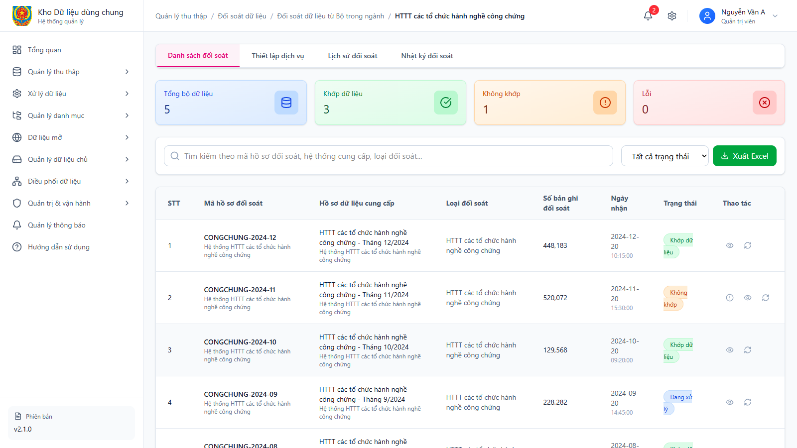

4.2.6.2.22.1 Mô tả thông tin trên màn hình
| **STT** | **Tên trường thông tin** | **Kiểu dữ liệu** | **Bắt buộc** | **Mặc định** | **Mô tả** |
| --- | --- | --- | --- | --- | --- |
| Thống kê | NUMBER | - | - | Số lượng tổng, khớp, không khớp, lỗi. |
| Danh sách | TABLE | - | - | Thể hiện bảng dữ liệu đối soát HTTT các tổ chức hành nghề công chứng. |

4.2.6.2.22.2 Chức năng trên màn hình
|  |  |  |  |
| --- | --- | --- | --- |
| **STT** | **Tên chức năng** | **Định dạng** | **Mô tả** |
| 1 | CN01 | Select | Lọc theo trạng thái. |
| 2 | CN02 | Button | Xuất Excel kết quả. |

#### 4.2.6.2.23. MH06.M23 Danh sách đối soát dữ liệu CSDL chứng thực

Màn hình

4.2.6.2.23.1 Mô tả thông tin trên màn hình
| **STT** | **Tên trường thông tin** | **Kiểu dữ liệu** | **Bắt buộc** | **Mặc định** | **Mô tả** |
| --- | --- | --- | --- | --- | --- |
| Thống kê | NUMBER | - | - | Số lượng tổng, khớp, không khớp, lỗi. |
| Danh sách | TABLE | - | - | Thể hiện bảng dữ liệu đối soát CSDL chứng thực. |

4.2.6.2.23.2 Chức năng trên màn hình
|  |  |  |  |
| --- | --- | --- | --- |
| **STT** | **Tên chức năng** | **Định dạng** | **Mô tả** |
| 1 | CN01 | Select | Lọc theo trạng thái. |
| 2 | CN02 | Button | Xuất Excel kết quả. |

## 4.2.7. DC102.QLTT.DSNN – Đối soát hệ thống ngoài ngành

### *4.2.7.1. Mục đích*
Đối soát với các nguồn dữ liệu ngoài ngành.

*+ Phân quyền*
Cán bộ kỹ thuật.

### 4.2.7.2. DC102.QLTT.DSNN.MH07 – Đối soát Ngoài ngành

#### 4.2.7.2.1. MH07.M01 Danh sách đối soát Ngoài ngành
Màn hình

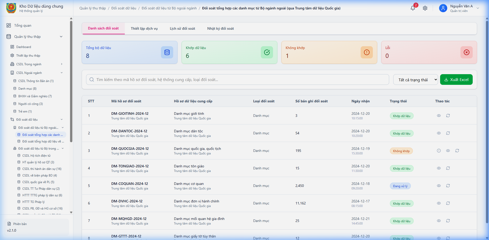

*Hình 26 – Màn hình danh sách đối soát ngoài ngành*

4.2.7.2.1.1 Mô tả thông tin trên màn hình
| **STT** | **Tên trường thông tin** | **Kiểu dữ liệu** | **Bắt buộc** | **Mặc định** | **Mô tả** |
| --- | --- | --- | --- | --- | --- |
| Tìm kiếm gói tin | VARCHAR2(255) | - | - | Tìm kiếm theo tên hoặc mã gói tin đối soát. |
| Bảng dữ liệu | TABLE | - | - | Hiển thị: STT, Mã gói tin, Tên gói tin, Ngày tạo, Tần suất, Trạng thái. |

4.2.7.2.1.2 Chức năng trên màn hình
|  |  |  |  |
| --- | --- | --- | --- |
| **STT** | **Tên chức năng** | **Định dạng** | **Mô tả** |
| 1 | CN01 | Button blue | Thêm cấu hình mới (MH07.M05). |
| 2 | CN02 | Button icon | Xem chi tiết (MH07.M02). |
| 3 | CN03 | Button icon | Sửa cấu hình (MH07.M06). |
| 4 | CN04 | Button icon | Xóa (MH07.M07). |

#### 4.2.7.2.2. MH07.M02 Chi tiết đối soát Ngoài ngành
Màn hình

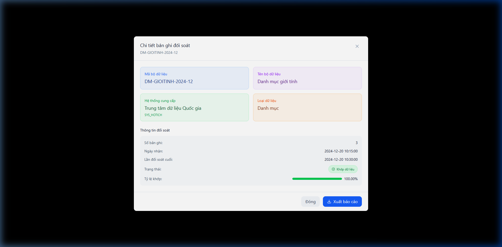

*Hình 27 – Màn hình chi tiết đối soát ngoài ngành*

4.2.7.2.2.1 Mô tả thông tin trên màn hình
| **STT** | **Tên trường thông tin** | **Kiểu dữ liệu** | **Bắt buộc** | **Mặc định** | **Mô tả** |
| --- | --- | --- | --- | --- | --- |
| Thông tin chung | TEXT | - | - | Mã bộ dữ liệu, Tên bộ dữ liệu, Hệ thống cung cấp. |
| Kết quả đối soát | NUMBER | - | - | Tổng số bản ghi, Tỷ lệ khớp, Lần đối soát cuối. |

4.2.7.2.2.2 Chức năng trên màn hình
|  |  |  |  |
| --- | --- | --- | --- |
| **STT** | **Tên chức năng** | **Định dạng** | **Mô tả** |
| 1 | CN01 | Button text | Đóng. |

#### 4.2.7.2.3. MH07.M04 Thiết lập đối soát Ngoài ngành
Màn hình

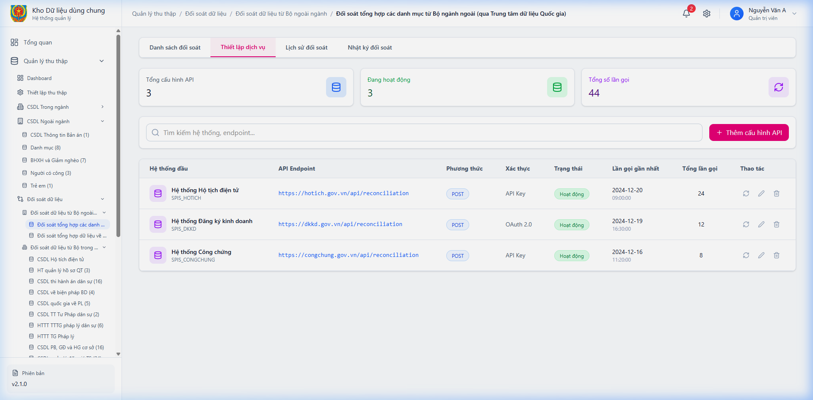

*Hình 28 – Màn hình thiết lập đối soát ngoài ngành*

4.2.7.2.3.1 Mô tả thông tin trên màn hình
| **STT** | **Tên trường thông tin** | **Kiểu dữ liệu** | **Bắt buộc** | **Mặc định** | **Mô tả** |
| --- | --- | --- | --- | --- | --- |
| Chỉ số thiết lập | NUMBER | - | - | Tổng cấu hình kết nối, Đang hoạt động, Số lần gọi. |
| Bảng cấu hình | TABLE | - | - | Hệ thống ngoài, API Endpoint, Phương thức, Trạng thái. |

4.2.7.2.3.2 Chức năng trên màn hình
|  |  |  |  |
| --- | --- | --- | --- |
| **STT** | **Tên chức năng** | **Định dạng** | **Mô tả** |
| 1 | CN01 | Button blue | Thêm cấu hình Ngoài ngành (MH07.M05). |
| 2 | CN02 | Button icon | Sửa/Xóa cấu hình. |

#### 4.2.7.2.4. MH07.M05 Thêm cấu hình Ngoài ngành
Màn hình

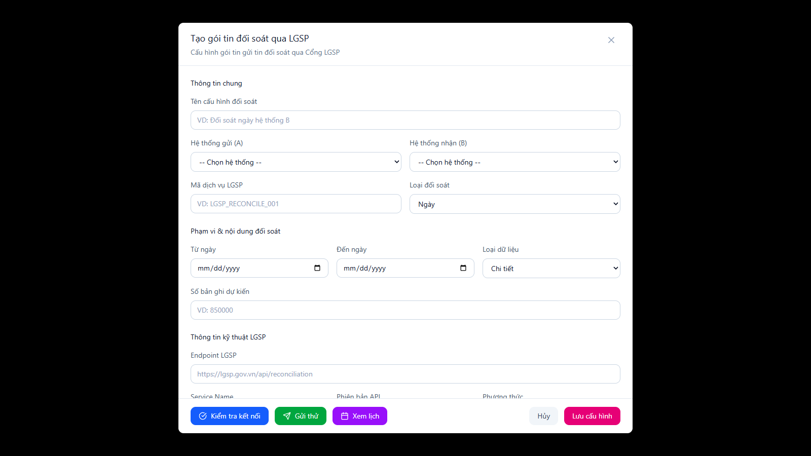

*Hình 29 – Màn hình thêm cấu hình ngoài ngành*

4.2.7.2.4.1 Mô tả thông tin trên màn hình
| **STT** | **Tên trường thông tin** | **Kiểu dữ liệu** | **Bắt buộc** | **Mặc định** | **Mô tả** |
| --- | --- | --- | --- | --- | --- |
| Tên cấu hình | VARCHAR2(255) | Có | - | Nhập tên gợi nhớ cho kết nối. |
| Hệ thống nguồn | VARCHAR2(255) | Có | - | Chọn hệ thống ngoài cung cấp dữ liệu. |
| Tham số API | TEXT | Có | - | Endpoint, Service Name, Method, Key/Cert. |

4.2.7.2.4.2 Chức năng trên màn hình
|  |  |  |  |
| --- | --- | --- | --- |
| **STT** | **Tên chức năng** | **Định dạng** | **Mô tả** |
| 1 | CN01 | Button blue | Lưu thông tin. |
| 2 | CN02 | Button text | Hủy. |

#### 4.2.7.2.5. MH07.M06 Sửa cấu hình Ngoài ngành
Màn hình

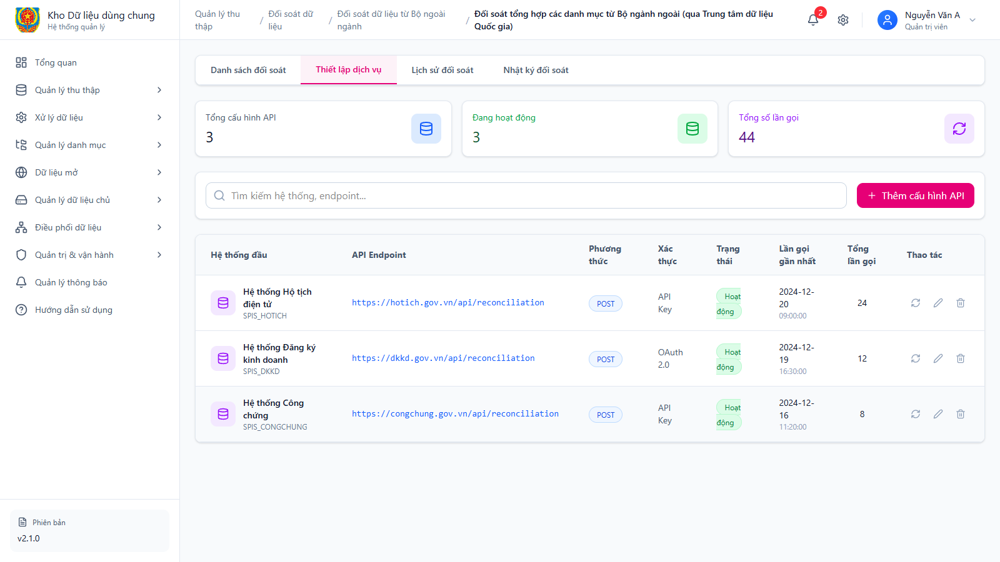

*Hình 30 – Màn hình chỉnh sửa cấu hình ngoài ngành*

4.2.7.2.5.1 Mô tả thông tin trên màn hình
*(Tương tự MH07.M05 nhưng cho phép chỉnh sửa các thông số kết nối hiện tại)*

4.2.7.2.5.2 Chức năng trên màn hình
|  |  |  |  |
| --- | --- | --- | --- |
| **STT** | **Tên chức năng** | **Định dạng** | **Mô tả** |
| 1 | CN01 | Button blue | Cập nhật thay đổi. |
| 2 | CN02 | Button text | Hủy bỏ. |

#### 4.2.7.2.6. MH07.M07 Xác nhận xóa cấu hình Ngoài ngành
Màn hình

*Hình 30b – Màn hình xác nhận xóa cấu hình ngoài ngành*

4.2.7.2.6.1 Mô tả thông tin trên màn hình
| **STT** | **Tên trường thông tin** | **Kiểu dữ liệu** | **Bắt buộc** | **Mặc định** | **Mô tả** |
| --- | --- | --- | --- | --- | --- |
| Thông báo | TEXT | - | - | "Bạn có chắc chắn muốn xóa cấu hình đối soát này?" |

4.2.7.2.6.2 Chức năng trên màn hình
|  |  |  |  |
| --- | --- | --- | --- |
| **STT** | **Tên chức năng** | **Định dạng** | **Mô tả** |
| 1 | CN01 | Button red | Xóa vĩnh viễn. |
| 2 | CN02 | Button white | Hủy. |

#### 4.2.7.2.7. MH07.M08 Lịch sử đối soát Ngoài ngành
Màn hình

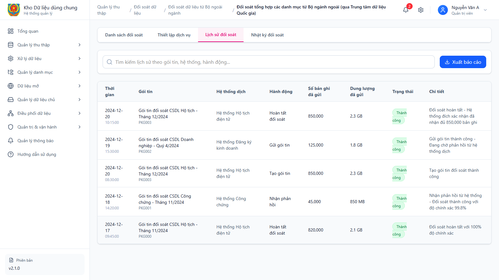

*Hình 31 – Màn hình lịch sử đối soát ngoài ngành*

4.2.7.2.7.1 Mô tả thông tin trên màn hình
| **STT** | **Tên trường thông tin** | **Kiểu dữ liệu** | **Bắt buộc** | **Mặc định** | **Mô tả** |
| --- | --- | --- | --- | --- | --- |
| Lịch sử đồng bộ | TABLE | - | - | Thời gian, Gói tin, Hệ thống nguồn, Số bản ghi, Trạng thái. |

4.2.7.2.7.2 Chức năng trên màn hình
|  |  |  |  |
| --- | --- | --- | --- |
| **STT** | **Tên chức năng** | **Định dạng** | **Mô tả** |
| 1 | CN01 | Button green | Xuất báo cáo lịch sử (Excel). |

#### 4.2.7.2.8. MH07.M09 Nhật ký đối soát Ngoài ngành
Màn hình

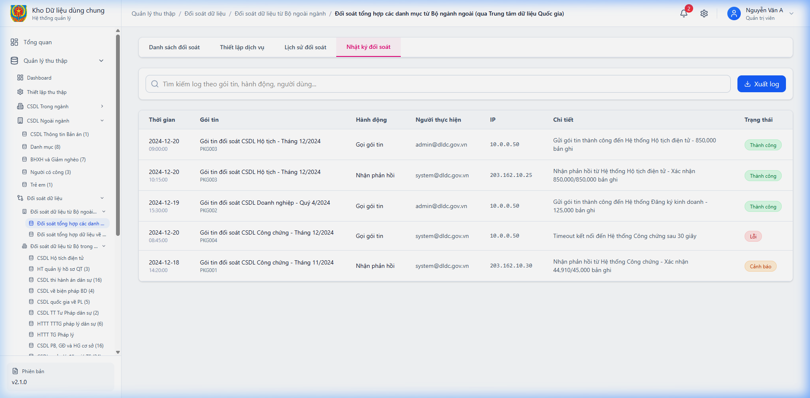

*Hình 32 – Màn hình nhật ký đối soát ngoài ngành*

4.2.7.2.8.1 Mô tả thông tin trên màn hình
| **STT** | **Tên trường thông tin** | **Kiểu dữ liệu** | **Bắt buộc** | **Mặc định** | **Mô tả** |
| --- | --- | --- | --- | --- | --- |
| Tìm kiếm log | VARCHAR2(255) | - | - | Tìm kiếm theo gói tin, hành động, người thực hiện. |
| Bảng nhật ký | TABLE | - | - | Hiển thị: Thời gian, Gói tin, Hành động, Người thực hiện, IP, Chi tiết, Trạng thái (Thành công/Lỗi/Cảnh báo). |

4.2.7.2.8.2 Chức năng trên màn hình
|  |  |  |  |
| --- | --- | --- | --- |
| **STT** | **Tên chức năng** | **Định dạng** | **Mô tả** |
| 1 | CN01 | Tab | Chuyển đổi giữa các tab nghiệp vụ. |
| 2 | CN02 | Button blue | Xuất log đối soát ra file Excel. |

---

#### 4.2.7.2.9. MH07.M10 Danh sách Đối soát tổng hợp các danh mục từ Bộ ngành ngoài

Màn hình

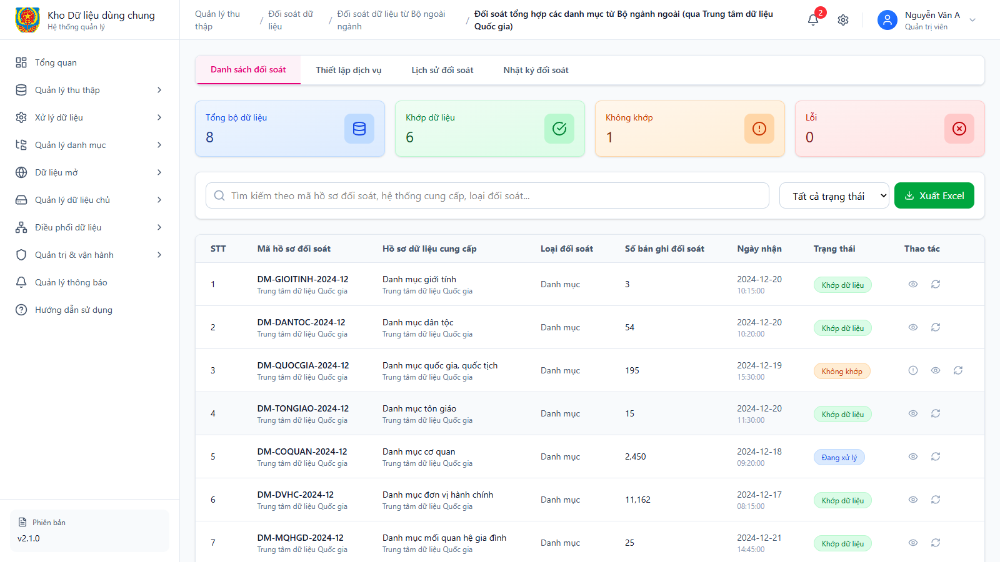

4.2.7.2.9.1 Mô tả thông tin trên màn hình
| **STT** | **Tên trường thông tin** | **Kiểu dữ liệu** | **Bắt buộc** | **Mặc định** | **Mô tả** |
| --- | --- | --- | --- | --- | --- |
| Thống kê | NUMBER | - | - | Số lượng tổng, khớp, không khớp, lỗi của Đối soát tổng hợp các danh mục từ Bộ ngành ngoài. |
| Danh sách | TABLE | - | - | Thể hiện bảng dữ liệu đối soát. |

4.2.7.2.9.2 Chức năng trên màn hình
|  |  |  |  |
| --- | --- | --- | --- |
| **STT** | **Tên chức năng** | **Định dạng** | **Mô tả** |
| 1 | CN01 | Select | Lọc theo trạng thái. |
| 2 | CN02 | Button | Xuất dữ liệu Excel. |

#### 4.2.7.2.10. MH07.M11 Danh sách Đối soát tổng hợp dữ liệu về Thông tin Bản án, quyết định

Màn hình

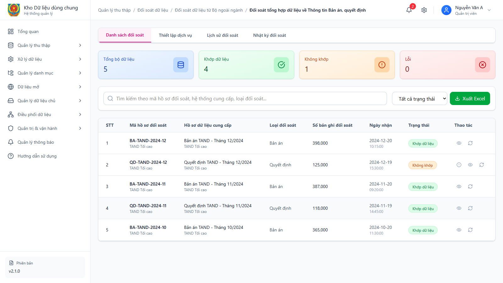

4.2.7.2.10.1 Mô tả thông tin trên màn hình
| **STT** | **Tên trường thông tin** | **Kiểu dữ liệu** | **Bắt buộc** | **Mặc định** | **Mô tả** |
| --- | --- | --- | --- | --- | --- |
| Thống kê | NUMBER | - | - | Số lượng tổng, khớp, không khớp, lỗi của Đối soát tổng hợp dữ liệu về Thông tin Bản án, quyết định. |
| Danh sách | TABLE | - | - | Thể hiện bảng dữ liệu đối soát. |

4.2.7.2.10.2 Chức năng trên màn hình
|  |  |  |  |
| --- | --- | --- | --- |
| **STT** | **Tên chức năng** | **Định dạng** | **Mô tả** |
| 1 | CN01 | Select | Lọc theo trạng thái. |
| 2 | CN02 | Button | Xuất dữ liệu Excel. |

*(Tài liệu đã được hoàn thiện đầy đủ cấu trúc 38 màn hình/tab/popup với việc chi tiết hóa mức cao các trường thông tin và chức năng cho CSDL Trong ngành và Ngoài ngành)*

# 4.4. DC104.QLXL_Quản lý xử lý dữ liệu

## 4.4.1. DC104.QLXL.DB – Dashboard xử lý dữ liệu

### *4.4.1.1. Mục đích*
Cung cấp một bảng điều khiển trung tâm để theo dõi trạng thái, tiến độ và kết quả của các tiến trình làm sạch, chuẩn hóa và biến đổi dữ liệu. Dashboard giúp người quản trị có cái nhìn trực quan, tổng thể về hiệu năng của các quy tắc xử lý tự động và chất lượng dữ liệu Master Data sau khi luồng xử lý hoàn tất.

*+ Phân quyền*
Tài khoản có vai trò Quản trị viên hệ thống / Trưởng ban điều hành Dữ liệu.

*+ Điều kiện thực hiện*
Tiêu thụ dữ liệu từ kho Log xử lý Pipeline ETL nội bộ để trực quan hóa.

### 4.4.1.2. DC1-TQ-DB-001 – Dashboard xử lý

#### 4.4.1.2.1. Mục đích
Giao diện hiển thị các chỉ số cốt lõi và biểu đồ tracking, hỗ trợ Lãnh đạo nắm bắt kịp thời các "điểm nghẽn" (bottlenecks) khi hệ thống dọn dẹp hàng triệu bản ghi thô.

*+ Phân quyền*
Ban Lãnh đạo / Trung tâm vận hành phân tích dữ liệu.

*+ Điều kiện thực hiện*
Chức năng được truy cập qua thanh menu phân hệ Xử lý.

#### 4.4.1.2.2. MH01 Màn hình Dashboard xử lý
- **Mã chức năng:** DC1-TQ-DB-001, DC1-TB-QT-001
- **Mã màn hình:** MH01

Màn hình

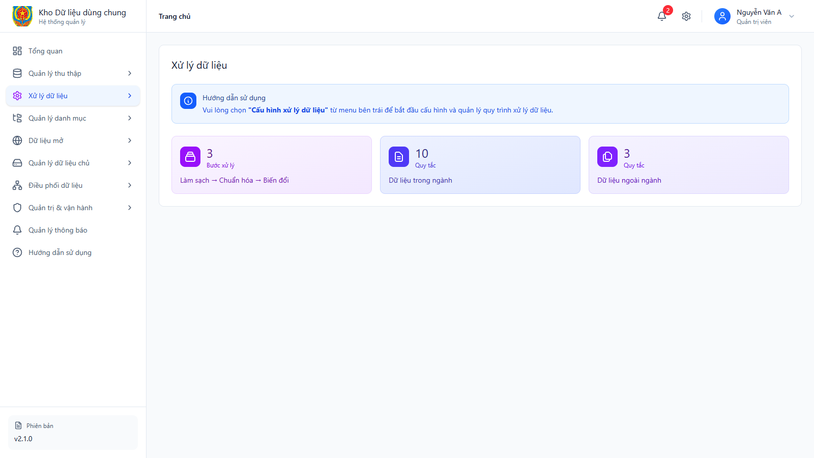

*Hình 1 – Giao diện tổng quan xử lý dữ liệu*

4.4.1.2.2.1 Mô tả thông tin trên màn hình
| **STT** | **Tên trường thông tin** | **Kiểu dữ liệu** | **Bắt buộc** | **Mặc định** | **Mô tả** |
| --- | --- | --- | --- | --- | --- |
| Giai đoạn 1: Làm sạch | NUMBER | - | - | Thống kê số lượng/bản ghi rác (Null, Duplicates) đã được bộ làm sạch xử lý tự động. |
| Giai đoạn 2: Chuẩn hóa | NUMBER | - | - | Tổng số bản ghi đã được ép kiểu định dạng (Format Parsing) về chuẩn duy nhất. |
| Giai đoạn 3: Biến đổi | NUMBER | - | - | Thống kê số lượng record đã được Data Transformation biến đổi thành phần tử có ý nghĩa. |
| Quy tắc trong ngành | NUMBER | - | - | Thẻ Card chỉ báo số lượng rule đang active áp dụng cho nhóm CSDL Core nội sinh. |
| Quy tắc ngoài ngành | NUMBER | - | - | Các rule xử lý đối chiếu chéo với hệ thống của Bộ/Ban/Ngành cấp trên (API ngoài). |

4.4.1.2.2.2 Chức năng trên màn hình
|  |  |  |  |
| --- | --- | --- | --- |
| **STT** | **Tên chức năng** | **Định dạng** | **Mô tả** |
| 1 | CN01 | Icon | Điều hướng nhanh đến phân hệ thiết lập quy tắc chuyên sâu (MH02). |
| 2 | CN02 | Date Picker| Widget Calendar lọc toàn bộ dữ liệu trên dashboard theo thời gian tùy chọn. |

## 4.4.2. DC104.QLXL.QT – Thiết lập & Quản lý quy tắc

### *4.4.2.1. Mục đích*
Hạt nhân của quy trình MDM: Cho phép chuyên gia xử lý cấu hình chi tiết, kết nối chuỗi các quy tắc xử lý (Làm sạch cơ học, Chuẩn hóa Pattern, Biến đổi Dictionary) cho từng nguồn dữ liệu. Qua đây, admin khai hỏa tiến trình Batch Processing và rà soát lỗi cấu hình.

*+ Phân quyền*
Tài khoản Quản trị Data / Kỹ sư dữ liệu (Data Engineer).

*+ Điều kiện thực hiện*
CSDL Dữ liệu thô (Staging) đã có dữ liệu để chạy thử thuật toán.

### 4.4.2.2. DC1-TT-QT-001 – Danh sách cấu hình xử lý

#### 4.4.2.2.1. Mục đích
Giao diện quản lý danh sách các "Luồng Xử Lý" (Data Pipelines), nơi người dùng bật/tắt, khởi động, hoặc kiểm tra tỷ lệ hoành thành của từng luồng.

*+ Phân quyền*
Cán bộ kỹ thuật hệ thống.

*+ Điều kiện thực hiện*
Hệ thống cho phép truy vấn thẳng vào danh sách Pipeline Jobs.

#### 4.4.2.2.2. DC1-UC001-MH2 Màn hình Danh sách cấu hình xử lý
- **Mã chức năng:** DC1-TT-QT-001
- **Mã màn hình:** DC1-UC001-MH2

Màn hình

*Hình 2 – Bảng hiển thị danh sách các cấu hình quy tắc xử lý dữ liệu*

4.4.2.2.2.1 Mô tả thông tin trên màn hình
| **STT** | **Tên trường thông tin** | **Kiểu dữ liệu** | **Bắt buộc** | **Mặc định** | **Mô tả** |
| --- | --- | --- | --- | --- | --- |
| Tên luồng dữ liệu | VARCHAR2(255) | - | - | Tên gợi nhớ tiến trình định kỳ (VD: Chuẩn hóa Hộ Tịch tháng 4). |
| Nguồn dữ liệu | VARCHAR2(255) | - | - | Tên CSDL gốc hoặc Dataset thô đầu vào. |
| Người cấu hình | VARCHAR2(255) | - | - | Account tạo nên bản ghi luồng xử lý. |
| Trạng thái | VARCHAR2(50) | - | - | Tag màu (Chạy ngầm, Hoàn thành, Chờ xử lý, Lỗi System). |
| Tiến độ (Progress) | NUMBER(3,2) | - | - | Thanh Bar hiển thị tỷ lệ % số bản ghi đi qua luồng ETL. |
| Tổng bản ghi (In) | NUMBER | - | - | Đầu vào nguyên liệu thô trước xử lý. |

4.4.2.2.2.2 Chức năng trên màn hình
|  |  |  |  |
| --- | --- | --- | --- |
| **STT** | **Tên chức năng** | **Định dạng** | **Mô tả** |
| 1 | CN01 | Button text | Mở màn hình tạo luồng xử lý Pipeline mới hoàn toàn (MH02.P05). |
| 2 | CN02 | Button text | Mở form quản lý & chêm các Rule quy tắc xử lý chi tiết (MH02.P01). |
| 3 | CN03 | Button text | Bật cấu hình phân loại lớp dữ liệu và dãn nhãn bảo mật kho (MH02.P02). |
| 4 | CN04 | Button icon | Button Execute kích hoạt tiến trình chuẩn hóa Batch (Chạy tay). |
| 5 | CN05 | Button icon | Lập lịch chạy tự động định kỳ Cron Job (MH02.P07). |
| 6 | CN06 | Button icon | Mở danh sách tra cứu các bản ghi gặp lỗi Format trong quá trình chạy (MH02.P03). |
| 7 | CN07 | Button icon | Mở lưới Lịch sử log ghi nhận cho các phiên chạy trước đó (MH02.P04). |
| 8 | CN08 | Button icon | Mở popup Xác nhận xóa cấu hình luồng xử lý (MH02.P06). |

#### 4.4.2.2.3. MH02.P01 – Quản lý Quy tắc Xử lý (Popup)
Màn hình

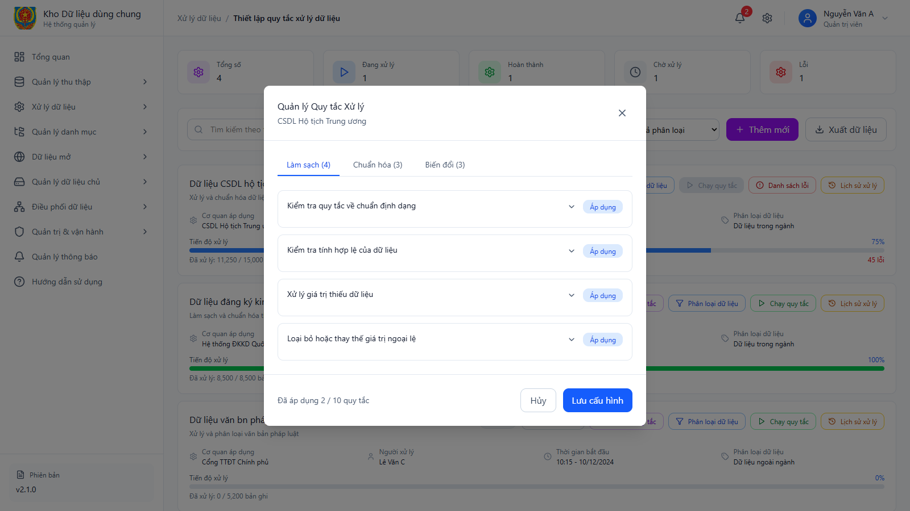

*Hình 3 – Màn hình quản lý các quy tắc làm sạch, chuẩn hóa, biến đổi*

4.4.2.2.3.1 Mô tả thông tin trên màn hình
| **STT** | **Tên trường thông tin** | **Kiểu dữ liệu** | **Bắt buộc** | **Mặc định** | **Mô tả** |
| --- | --- | --- | --- | --- | --- |
| Chọn trường (Column)| VARCHAR2(255) | Có | - | Chọn cột Data thực tế của bảng cần áp dụng dao mổ (VD: Col CCCD). |
| Trạng thái Rule | DROPDOWN | Có | Đang tắt | Switch Bật/Tắt hiệu lực của luật thuật toán này lên chuỗi xử lý. |
| Format Matching | VARCHAR2(500) | Không | - | Regex hoặc Template ép kiểu dịnh dạng (VD: YYYY-MM-DD). |
| Rule Giá trị rỗng | DROPDOWN | Không | Bỏ qua | Hành vi rẽ nhánh khi gặp Null data (Ignore, Default Imputation, Error Throw). |
| Rule Trùng lặp | DROPDOWN | Không | Cảnh báo | Xử lý Duplicate: Gộp trường bản ghi (Merge), Giữ bản Record mới cực/Cũ nhất, Xóa, Cảnh báo. |

4.4.2.2.3.2 Chức năng trên màn hình
|  |  |  |  |
| --- | --- | --- | --- |
| **STT** | **Tên chức năng** | **Định dạng** | **Mô tả** |
| 1 | CN01 | Button text | Commit và Lưu toàn vẹn cấu hình bộ quy tắc gắn với nguồn. |
| 2 | CN02 | Button text | Hủy bỏ cấu hình, đóng cửa sổ lệnh. |

#### 4.4.2.2.4. DC1-UC001-MH4 – Phân loại và Bảo mật dữ liệu (Popup)
- **Mã chức năng:** DC1-TT-QT-001
- **Mã màn hình:** DC1-UC001-MH4

Màn hình

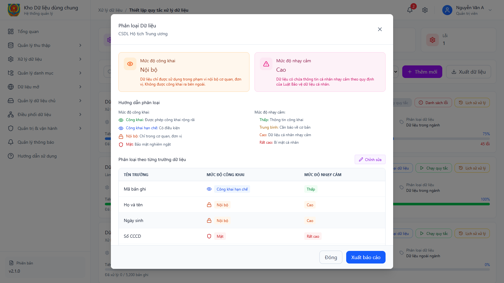

*Hình 4 – Cửa sổ phân loại và cấu hình bảo mật dữ liệu*

4.4.2.2.4.1 Mô tả thông tin trên màn hình
| **STT** | **Tên trường thông tin** | **Kiểu dữ liệu** | **Bắt buộc** | **Mặc định** | **Mô tả** |
| --- | --- | --- | --- | --- | --- |
| Mức độ tiếp cận | DROPDOWN | Có | Công khai | Phân loại quyền truy cập dữ liệu ra ngoài: Công khai tự do, Hạn chế quyền hạn CQNN, Giao dịch nội bộ. |
| Cấp độ Nhạy cảm | DROPDOWN | Có | Thấp | Phân loại mức ảnh hưởng rò rỉ: Thấp, Trung Bình, Cao, Rất Cao (Ảnh hưởng an ninh). |
| Phương pháp Mã hóa | DROPDOWN | Không | Masking 50%| (Nâng cao) Tùy chọn làm mờ CCCD/SDT ở màn Preview. |

4.4.2.2.4.2 Chức năng trên màn hình
|  |  |  |  |
| --- | --- | --- | --- |
| **STT** | **Tên chức năng** | **Định dạng** | **Mô tả** |
| 1 | CN01 | Button text | Nhãn gán phân loại lên cấp độ bảng Data. |
| 2 | CN02 | Button text | Đóng màn hình Popup. |

#### 4.4.2.2.5. DC1-UC001-MH3 – Danh sách Bản ghi Lỗi (Popup)
- **Mã chức năng:** DC1-TT-QT-001
- **Mã màn hình:** DC1-UC001-MH3

Màn hình

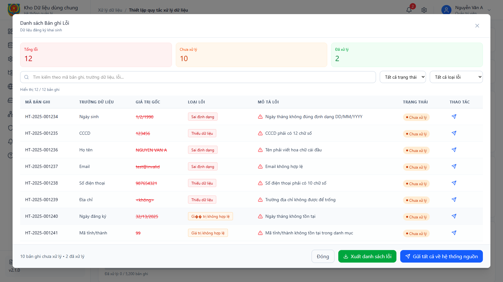

*Hình 5 – Màn hình danh sách bản ghi lỗi Data Quality*

4.4.2.2.5.1 Mô tả thông tin trên màn hình
| **STT** | **Tên trường thông tin** | **Kiểu dữ liệu** | **Bắt buộc** | **Mặc định** | **Mô tả** |
| --- | --- | --- | --- | --- | --- |
| ID Phiên chạy | VARCHAR2(50) | - | - | Tra cứu lại lô Job đã sinh ra lỗi. |
| Mã bản ghi (ID) | VARCHAR2(50) | - | - | Khóa chính của dòng Record bị đẩy văng do không lọt qua màng lọc Validator. |
| Tên cột lỗi | VARCHAR2(50) | - | - | Trường cụ thể trực diện bị phát hiện lỗi (VD: Cột Ngày Sinh quá dải năm). |
| Raw Value | VARCHAR2(1000) | - | - | Giá trị nguyên thủy lấy từ Staging thô ban sơ. |
| Typology Lỗi | VARCHAR2(100) | - | - | Phân tách loại mã lỗi (Thiếu Required, Cấu trúc cú pháp sai, Không khớp Master List ID). |
| Resolution (Gợi ý) | VARCHAR2(1000) | - | - | Đề xuất giải pháp (Force update hoặc Ignore) được mô hình Gen tự động gợi ý. |

4.4.2.2.5.2 Chức năng trên màn hình
|  |  |  |  |
| --- | --- | --- | --- |
| **STT** | **Tên chức năng** | **Định dạng** | **Mô tả** |
| 1 | CN01 | Button text | Đánh dấu yêu cầu Override sửa đổi cưỡng bức hoặc Rollback hệ thống nguồn. |
| 2 | CN02 | Button icon | Trích xuất báo cáo rác (Error Export) dưới dạng tệp Excel Offline để đối tra với bên cung cấp. |
| 3 | CN03 | Button text | Đóng và Thoát hộp theo dõi lỗi. |

#### 4.4.2.2.6. MH02.P04 – Lịch sử Xử lý dữ liệu (Popup)
Màn hình

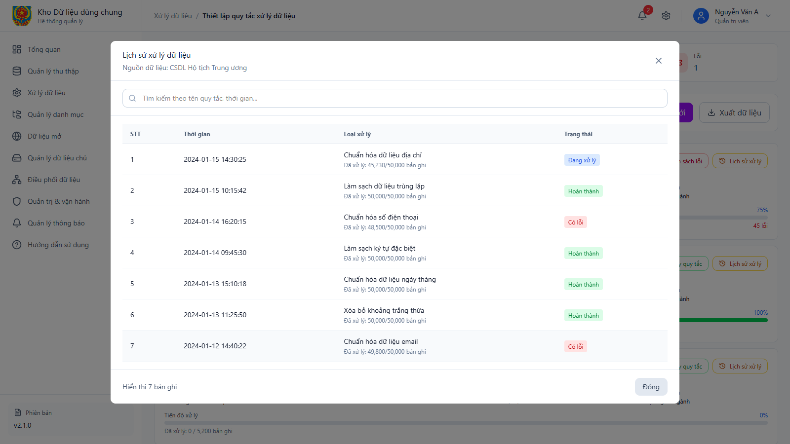

*Hình 6 – Giao diện Activity Log các phiên ETL chạy tay và chạy tự động định kỳ*

4.4.2.2.6.1 Mô tả thông tin trên màn hình
| **STT** | **Tên trường thông tin** | **Kiểu dữ liệu** | **Bắt buộc** | **Mặc định** | **Mô tả** |
| --- | --- | --- | --- | --- | --- |
| Thời điểm khởi chạy| DATE | - | - | Timestamp đánh dấu mốc thời gian Job Queue nhận lệnh (Lệnh tay / Cronjob scheduler). |
| Profile Quy tắc | VARCHAR2(500) | - | - | Cụm danh xưng nhóm các Filter Rule được nhúng trong đợt quét xử lý xử lý. |
| Thống kê Volume | VARCHAR2(255) | - | - | Bảng Cân đối Output (Ví dụ: Dữ liệu thô tải vào 10.000 dòng, Xử lý thành công 9.050, Xóa trùng lập 400, Bị văng lỗi 550). |
| Tình trạng Job | VARCHAR2(50) | - | - | Nhãn Label màu bắt mắt hiển thị Tiến trình: Khởi tạo (Pending), Running, Success, Partially Failed. |
| Executor | VARCHAR2(100) | - | - | Nguồn ra lệnh vận hành hệ thống chạy (Scheduled Bot tự động hoặc Admin Account A đích thân bấm chạy). |

4.4.2.2.6.2 Chức năng trên màn hình
|  |  |  |  |
| --- | --- | --- | --- |
| **STT** | **Tên chức năng** | **Định dạng** | **Mô tả** |
| 1 | CN01 | Button text | Xem Deep Details Log truy vết kỹ thuật từng dòng Process Thread (Dành riêng cho SysAdmin). |
| 2 | CN02 | Button text | Gấp cửa sổ hiển thị lịch sử Log hệ thống. |

#### 4.4.2.2.7. DC1-UC001-MH5 – Thêm mới/Chỉnh sửa cấu hình xử lý (Popup)
- **Mã chức năng:** DC1-TT-QT-001
- **Mã màn hình:** DC1-UC001-MH5, DC1-UC001-MH6

Màn hình

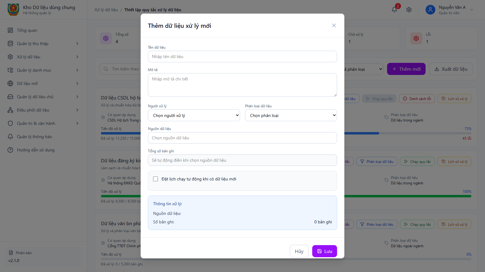

*Hình 7 – Giao diện khai báo và cấu hình luồng xử lý dữ liệu mới*

4.4.2.2.7.1 Mô tả thông tin trên màn hình
| **STT** | **Tên trường thông tin** | **Kiểu dữ liệu** | **Bắt buộc** | **Mặc định** | **Mô tả** |
| --- | --- | --- | --- | --- | --- |
| Tên luồng dữ liệu | VARCHAR2(255) | Có | - | Nhập tên định danh hiển thị của Job xử lý mới. |
| Chọn nguồn dữ liệu | DROPDOWN | Có | - | Truy vấn các CSDL, Bảng, hoặc Dataset Thô vừa được thu thập. |
| Người chịu trách nhiệm| VARCHAR2(255) | Tự động | Tài khoản hiện tại | Gắn ID của chuyên viên thực hiện thiết lập luồng làm sạch này. |
| Ghi chú / Diễn giải | CLOB | Không | - | Ghi chú tóm tắt nội dung quy tắc. |

4.4.2.2.7.2 Chức năng trên màn hình
|  |  |  |  |
| --- | --- | --- | --- |
| **STT** | **Tên chức năng** | **Định dạng** | **Mô tả** |
| 1 | CN01 | Button text | Lưu cấu hình, tạo mới Profile Job thành công trên danh sách. |
| 2 | CN02 | Button text | Hủy thao tác và quay về lưới quản lý. |

#### 4.4.2.2.8. MH02.P06 – Xác nhận xóa luồng xử lý (Popup)
Màn hình

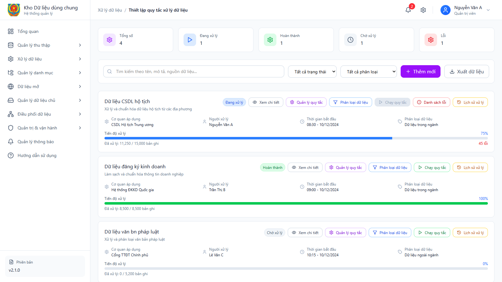

*Hình 8 – Hộp thoại xác nhận yêu cầu xóa bỏ cấu hình quy tắc nguy hiểm*

4.4.2.2.8.1 Mô tả thông tin trên màn hình
| **STT** | **Tên trường thông tin** | **Kiểu dữ liệu** | **Bắt buộc** | **Mặc định** | **Mô tả** |
| --- | --- | --- | --- | --- | --- |
| Thông điệp cảnh báo | VARCHAR2(2000) | Tự động | - | Yêu cầu xác nhận xóa: "Bạn có chắc chắn muốn gỡ luồng xử lý này? Thao tác này sẽ xóa mọi Rules bên trong." |
| Tên luồng xác nhận | VARCHAR2(255) | - | - | (Read Only) Hiển thị tên luồng đang chuẩn bị bị xóa. |

4.4.2.2.8.2 Chức năng trên màn hình
|  |  |  |  |
| --- | --- | --- | --- |
| **STT** | **Tên chức năng** | **Định dạng** | **Mô tả** |
| 1 | CN01 | Button text | Chấp nhận Soft-Delete luồng (Chuyển trạng thái sang Đã Xóa). |
| 2 | CN02 | Button text | Hủy bỏ, trở về an toàn. |

#### 4.4.2.2.9. MH02.P07 – Lập lịch chạy tự động Scheduler (Popup)
Màn hình

*Hình 9 – Giao diện thiết lập thời gian chạy Cron Job tự động cho luồng xử lý*

4.4.2.2.9.1 Mô tả thông tin trên màn hình
| **STT** | **Tên trường thông tin** | **Kiểu dữ liệu** | **Bắt buộc** | **Mặc định** | **Mô tả** |
| --- | --- | --- | --- | --- | --- |
| Tần suất chạy | DROPDOWN | Có | Hàng ngày | Chọn chu kỳ: Hàng giờ, Hàng ngày, Hàng tuần, Hàng tháng, Hoặc một lần. |
| Khung giờ bắt đầu | TIME | Có | 00:00 | Giờ và Phút bắt đầu kích hoạt máy chủ chạy Script xử lý. |
| Ngày bắt đầu hiệu lực | DATE | Có | Hôm nay | Ngày bắt đầu áp dụng chu kỳ tự động. |
| Ngày kết thúc | DATE | Không | - | Sau ngày này luồng sẽ không chạy ngầm nữa. |
| Cấu hình Cron nâng cao| VARCHAR2(100) | Không | - | Cho phép SysAdmin gõ Cron Expression (VD: 0 0 * * *). |

4.4.2.2.9.2 Chức năng trên màn hình
|  |  |  |  |
| --- | --- | --- | --- |
| **STT** | **Tên chức năng** | **Định dạng** | **Mô tả** |
| 1 | CN01 | Button text | Áp dụng cấu hình và đẩy Scheduler vào hàng đợi Hệ thống. |
| 2 | CN02 | Button text | Tạm dừng lập lịch hiện tại (Pause). |
| 3 | CN03 | Button text | Đóng màn hình hiển thị. |

# 4.3. DC103.QLDM_Quản lý danh mục

## 4.3.1. DC103.QLDM.BC – Báo cáo & Tra cứu danh mục

### *4.3.1.1. Mục đích*
Chức năng này cung cấp cho cán bộ nghiệp vụ, cán bộ quản lý và quản trị viên một cái nhìn tổng quan về tình trạng các danh mục trong hệ thống. Nó cho phép người dùng tra cứu, theo dõi tiến độ phê duyệt và tình trạng công bố của các danh mục, với điều kiện là hệ thống đã có dữ liệu danh mục được tạo hoặc đồng bộ.

### 4.3.1.2. DC1-TQ-DB-001 – Báo cáo & Tra cứu

#### 4.3.1.2.1. MH01 Màn hình báo cáo và tra cứu
- **Mã chức năng:** DC1-TQ-DB-001, DC1-TB-QT-001
- **Mã màn hình:** MH01

Màn hình

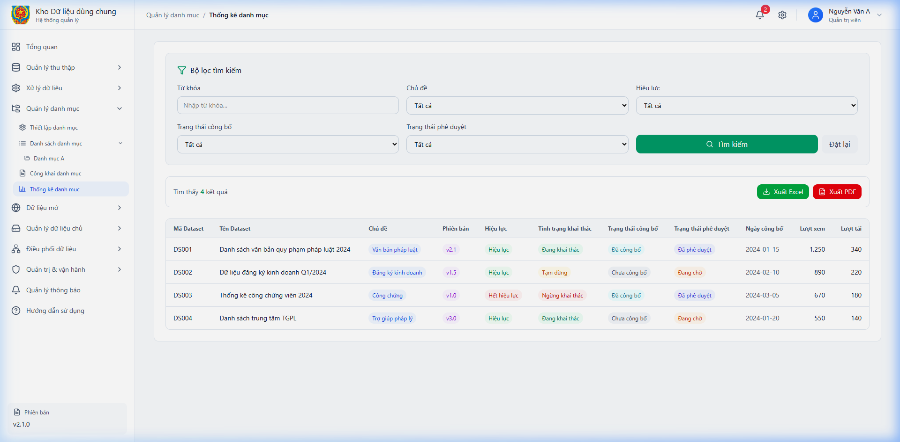

*Hình 1 – Giao diện báo cáo và tra cứu danh mục*

4.3.1.2.1.1 Mô tả thông tin trên màn hình

**A. Khung chỉ số thống kê (Stats Cards)**
| **STT** | **Tên trường thông tin** | **Kiểu dữ liệu** | **Bắt buộc** | **Mặc định** | **Mô tả** |
| --- | --- | --- | --- | --- | --- |
| Tổng danh mục | NUMBER | - | - | Tổng số lượng danh mục hiện có trong hệ thống (tất cả trạng thái). |
| Đã công bố | NUMBER | - | - | Số danh mục đang ở trạng thái "Đã công bố" và có hiệu lực. |
| Chờ phê duyệt | NUMBER | - | - | Số danh mục đang chờ người có thẩm quyền xem xét phê duyệt. |
| Nháp | NUMBER | - | - | Số danh mục đang được soạn thảo, chưa gửi phê duyệt. |

**B. Bộ lọc & Tìm kiếm nâng cao**
| **STT** | **Tên trường thông tin** | **Kiểu dữ liệu** | **Bắt buộc** | **Mặc định** | **Mô tả** |
| --- | --- | --- | --- | --- | --- |
| Từ khóa | VARCHAR2(255) | Không | - | Tìm kiếm nhanh theo tên hoặc mã danh mục. |
| Trạng thái | DROPDOWN | Không | Tất cả | Lọc theo trạng thái: Nháp, Chờ duyệt, Đã phê duyệt, Đã công bố. |
| Loại danh mục | DROPDOWN | Không | Tất cả | Lọc theo loại: Danh mục hành chính, Chuyên ngành, Dùng chung. |

4.3.1.2.1.2 Chức năng trên màn hình
|  |  |  |  |
| --- | --- | --- | --- |
| **STT** | **Tên chức năng** | **Định dạng** | **Mô tả** |
| 1 | CN01 | Button text | Mở popup tìm kiếm nâng cao (MH01.P01). |
| 2 | CN02 | Button text | Kết xuất danh sách danh mục (theo bộ lọc hiện tại) ra file Excel. |
| 3 | CN03 | Button icon | Mở popup hiển thị các giá trị chi tiết (bản ghi) của một danh mục cụ thể (MH01.P02). |

#### 4.3.1.2.2. MH01.P01 – Tìm kiếm nâng cao
- **Mã chức năng:** DC1-TQ-DB-001, DC1-TB-QT-001
- **Mã màn hình:** MH01.P01

Màn hình

*Hình 4 – Popup tìm kiếm nâng cao danh mục*

4.3.1.2.2.1 Mô tả thông tin trên màn hình
| **STT** | **Tên trường thông tin** | **Kiểu dữ liệu** | **Bắt buộc** | **Mặc định** | **Mô tả** |
| --- | --- | --- | --- | --- | --- |
| Tên danh mục | VARCHAR2(255) | Không | - | Tìm kiếm theo tên danh mục. |
| Mã danh mục | VARCHAR2(50) | Không | - | Tìm kiếm chính xác theo mã. |
| Loại danh mục | VARCHAR2(50) | Không | - | Lọc theo loại (Chuyên ngành, Dùng chung). |
| Trạng thái | VARCHAR2(50) | Không | - | Lọc theo trạng thái (Đã công bố, Chờ duyệt...). |

4.3.1.2.2.2 Chức năng trên màn hình
|  |  |  |  |
| --- | --- | --- | --- |
| **STT** | **Tên chức năng** | **Định dạng** | **Mô tả** |
| 1 | CN01 | Button text | Áp dụng bộ lọc tìm kiếm. |
| 2 | CN02 | Button text | Đặt lại các trường lọc về mặc định. |
| 3 | CN03 | Button text | Đóng popup. |

#### 4.3.1.2.3. MH01.P02 – Chi tiết giá trị danh mục
- **Mã chức năng:** DC1-TQ-DB-001, DC1-TB-QT-001
- **Mã màn hình:** MH01.P02

Màn hình

*Hình 5 – Popup hiển thị các bản ghi trong danh mục*

4.3.1.2.3.1 Mô tả thông tin trên màn hình
| **STT** | **Tên trường thông tin** | **Kiểu dữ liệu** | **Bắt buộc** | **Mặc định** | **Mô tả** |
| --- | --- | --- | --- | --- | --- |
| Mã giá trị | VARCHAR2(50) | - | - | Mã định danh giá trị (VD: HN, HCM). |
| Tên giá trị | VARCHAR2(255) | - | - | Tên hiển thị (VD: Hà Nội, TP. Hồ Chí Minh). |
| Mô tả | VARCHAR2(1000) | - | - | Ghi chú thêm về giá trị. |

4.3.1.2.3.2 Chức năng trên màn hình
|  |  |  |  |
| --- | --- | --- | --- |
| **STT** | **Tên chức năng** | **Định dạng** | **Mô tả** |
| 1 | CN01 | Button text | Đóng popup. |
| 2 | CN02 | Button text | Xuất danh sách giá trị ra Excel. |

## 4.3.2. DC103.QLDM.TL – Thiết lập danh mục

### *4.3.2.1. Mục đích*
Chức năng này cho phép cán bộ có thẩm quyền tạo mới, chỉnh sửa và quản lý vòng đời của các loại danh mục trong kho DLDC, từ lúc khởi tạo (Nháp) đến khi sẵn sàng để phê duyệt.

### 4.3.2.2. DC1-TT-QT-001 – Danh sách thiết lập

#### 4.3.2.2.1. DC1-UC001-MH2 Màn hình danh sách thiết lập
- **Mã chức năng:** DC1-TT-QT-001
- **Mã màn hình:** DC1-UC001-MH2

Màn hình

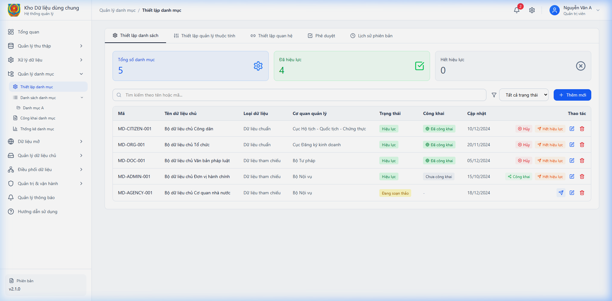

*Hình 2 – Giao diện quản lý thiết lập danh mục*

4.3.2.2.1.1 Mô tả thông tin trên màn hình
| **STT** | **Tên trường thông tin** | **Kiểu dữ liệu** | **Bắt buộc** | **Mặc định** | **Mô tả** |
| --- | --- | --- | --- | --- | --- |
| Danh sách danh mục | Table | - | - | Hiển thị danh sách các danh mục với các cột: Mã danh mục, Tên danh mục, Loại dữ liệu, Trạng thái, Phiên bản, Ngày tạo. |
| Trạng thái | VARCHAR2(50) | - | - | Trạng thái hiện tại của danh mục: Nháp, Chờ duyệt, Đã phê duyệt, Đã công bố. |

4.3.2.2.1.2 Chức năng trên màn hình
|  |  |  |  |
| --- | --- | --- | --- |
| **STT** | **Tên chức năng** | **Định dạng** | **Mô tả** |
| 1 | CN01 | Button text | Mở popup để cấu hình một danh mục mới (MH02.P01). |
| 2 | CN02 | Button icon | Mở popup cập nhật thông tin danh mục (MH02.P01). |
| 3 | CN03 | Button icon | Mở popup xác nhận loại bỏ danh mục (MH02.P02). |
| 4 | CN04 | Button icon | Mở popup xác nhận gửi phê duyệt (MH02.P03). |

#### 4.3.2.2.2. DC1-UC001-MH1 – Thêm mới thiết lập danh mục
- **Mã chức năng:** DC1-TT-QT-001
- **Mã màn hình:** DC1-UC001-MH1

Màn hình

*Hình 6a – Popup khởi tạo cấu trúc danh mục mới*

4.3.2.2.2.1 Mô tả thông tin trên màn hình
| **STT** | **Tên trường thông tin** | **Kiểu dữ liệu** | **Bắt buộc** | **Mặc định** | **Mô tả** |
| --- | --- | --- | --- | --- | --- |
| Mã danh mục | VARCHAR2(50) | Có | - | Mã định danh kỹ thuật duy nhất. |
| Tên danh mục | VARCHAR2(255) | Có | - | Tên hiển thị của danh mục. |
| Loại dữ liệu | VARCHAR2(50) | Có | - | Phân loại: Danh mục hành chính, chuyên ngành... |
| Ghi chú | VARCHAR2(1000) | Không | - | Thông tin diễn giải. |

4.3.2.2.2.2 Chức năng trên màn hình
|  |  |  |  |
| --- | --- | --- | --- |
| **STT** | **Tên chức năng** | **Định dạng** | **Mô tả** |
| 1 | CN01 | Button text | Lưu thông tin danh mục và đóng popup. |
| 2 | CN02 | Button text | Hủy thao tác. |

#### 4.3.2.2.3. MH02.P01b – Chỉnh sửa thiết lập danh mục
Màn hình

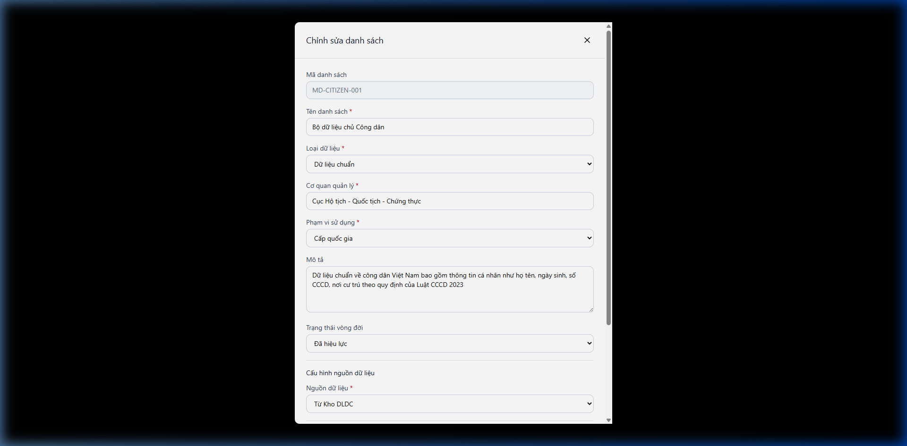

*Hình 6b – Popup cập nhật cấu trúc danh mục hiện có*

4.3.2.2.3.1 Mô tả thông tin trên màn hình
| **STT** | **Tên trường thông tin** | **Kiểu dữ liệu** | **Bắt buộc** | **Mặc định** | **Mô tả** |
| --- | --- | --- | --- | --- | --- |
| Mã danh mục | VARCHAR2(50) | Có | (Giá trị cũ) | Không được phép thay đổi mã sau khi tạo. |
| Tên danh mục | VARCHAR2(255) | Có | (Giá trị cũ) | Thay đổi tên hiển thị. |
| Loại dữ liệu | VARCHAR2(50) | Có | (Giá trị cũ) | Cập nhật phân loại. |
| Ghi chú | VARCHAR2(1000) | Không | (Giá trị cũ) | Cập nhật thông tin diễn giải. |

4.3.2.2.3.2 Chức năng trên màn hình
|  |  |  |  |
| --- | --- | --- | --- |
| **STT** | **Tên chức năng** | **Định dạng** | **Mô tả** |
| 1 | CN01 | Button text | Lưu các thay đổi và đóng popup. |
| 2 | CN02 | Button text | Hủy bỏ thay đổi. |

#### 4.3.2.2.4. DC1-UC001-MH4 – Xác nhận xóa danh mục
- **Mã chức năng:** DC1-TT-QT-001
- **Mã màn hình:** DC1-UC001-MH4

Màn hình

*Hình 7 – Popup xác nhận xóa danh mục*

4.3.2.2.4.1 Mô tả thông tin trên màn hình
| **STT** | **Tên trường thông tin** | **Kiểu dữ liệu** | **Bắt buộc** | **Mặc định** | **Mô tả** |
| --- | --- | --- | --- | --- | --- |
| Cảnh báo | VARCHAR2(500) | - | - | "Bạn có chắc chắn muốn xóa danh mục này? Mọi dữ liệu bản ghi liên quan sẽ bị mất." |

4.3.2.2.4.2 Chức năng trên màn hình
|  |  |  |  |
| --- | --- | --- | --- |
| **STT** | **Tên chức năng** | **Định dạng** | **Mô tả** |
| 1 | CN01 | Button text | Xác nhận xóa vĩnh viễn danh mục. |
| 2 | CN02 | Button text | Hủy bỏ và đóng popup. |

#### 4.3.2.2.5. DC1-UC001-MH3 – Xác nhận gửi phê duyệt
- **Mã chức năng:** DC1-TT-QT-001
- **Mã màn hình:** DC1-UC001-MH3

Màn hình

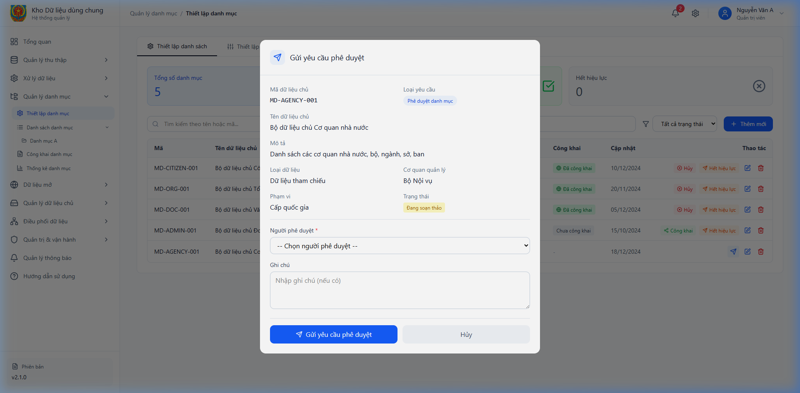

*Hình 8 – Popup xác nhận chuyển trạng thái danh mục sang chờ duyệt*

4.3.2.2.5.1 Mô tả thông tin trên màn hình
| **STT** | **Tên trường thông tin** | **Kiểu dữ liệu** | **Bắt buộc** | **Mặc định** | **Mô tả** |
| --- | --- | --- | --- | --- | --- |
| Cảnh báo | VARCHAR2(500) | - | - | "Bạn có chắc chắn muốn gửi phê duyệt danh mục này? Sau khi gửi, bạn sẽ không thể chỉnh sửa cho đến khi có phản hồi." |

4.3.2.2.5.2 Chức năng trên màn hình
|  |  |  |  |
| --- | --- | --- | --- |
| **STT** | **Tên chức năng** | **Định dạng** | **Mô tả** |
| 1 | CN01 | Button text | Gửi phê duyệt chính thức. |
| 2 | CN02 | Button text | Hủy bỏ. |

#### 4.3.2.3. DC103.QLDM.TL.MH02.T01 – Tab Thiết lập cấu trúc thuộc tính
Màn hình

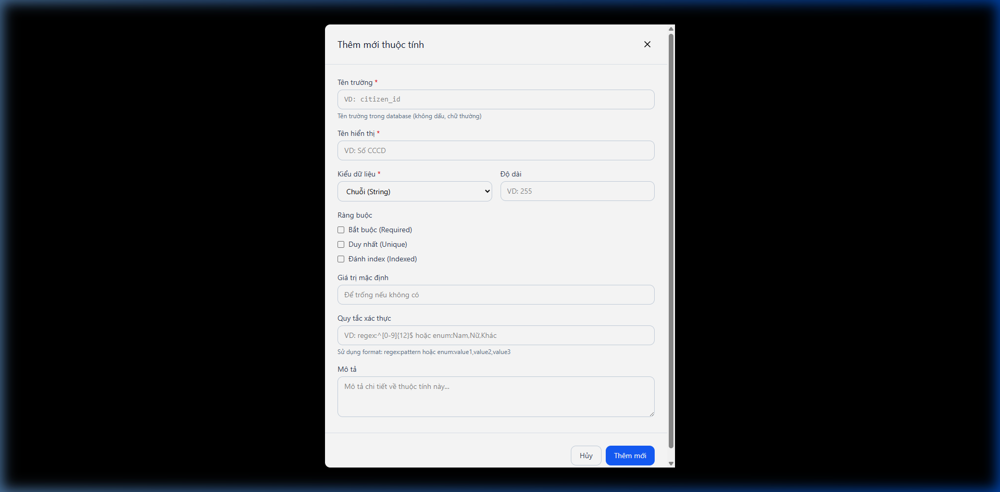

4.3.2.3.1 Mô tả thông tin trên màn hình
| **STT** | **Tên trường thông tin** | **Kiểu dữ liệu** | **Bắt buộc** | **Mặc định** | **Mô tả** |
| --- | --- | --- | --- | --- | --- |
| Tên thuộc tính | VARCHAR2(100) | Có | - | Tên trường dữ liệu (VD: HỌ TÊN). |
| Kiểu dữ liệu | VARCHAR2(50) | Có | - | String, Number, Date, List... |
| Độ dài | NUMBER | Không | - | Giới hạn ký tự. |
| Bắt buộc | CHECKBOX | Không | FALSE | Đánh dấu nếu trường không được để trống. |

4.3.2.3.2 Chức năng trên màn hình
|  |  |  |  |
| --- | --- | --- | --- |
| **STT** | **Tên chức năng** | **Định dạng** | **Mô tả** |
| 1 | CN01 | Button text | Thêm một thuộc tính mới vào cấu trúc danh mục. |
| 2 | CN02 | Button icon | Chỉnh sửa thuộc tính hiện có. |
| 3 | CN03 | Button icon | Xóa thuộc tính khỏi cấu trúc. |

#### 4.3.2.4. DC103.QLDM.TL.MH02.T02 – Tab Thiết lập quan hệ
Màn hình

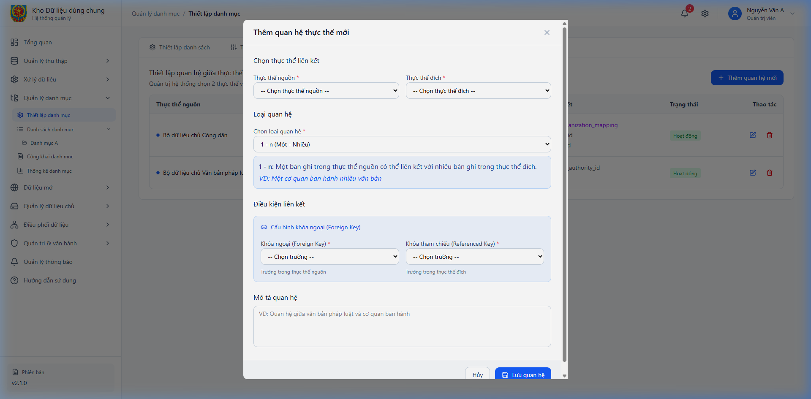

4.3.2.4.1 Mô tả thông tin trên màn hình
| **STT** | **Tên trường thông tin** | **Kiểu dữ liệu** | **Bắt buộc** | **Mặc định** | **Mô tả** |
| --- | --- | --- | --- | --- | --- |
| Danh mục đích | DROPDOWN | Có | - | Chọn danh mục để thiết lập liên kết. |
| Trường liên kết | DROPDOWN | Có | - | Chọn trường (FK) để nối giữa 2 danh mục. |

4.3.2.4.2 Chức năng trên màn hình
|  |  |  |  |
| --- | --- | --- | --- |
| **STT** | **Tên chức năng** | **Định dạng** | **Mô tả** |
| 1 | CN01 | Button text | Lưu thiết lập quan hệ. |

#### 4.3.2.5. DC103.QLDM.TL.MH02.T04 – Tab Lịch sử phiên bản
Màn hình

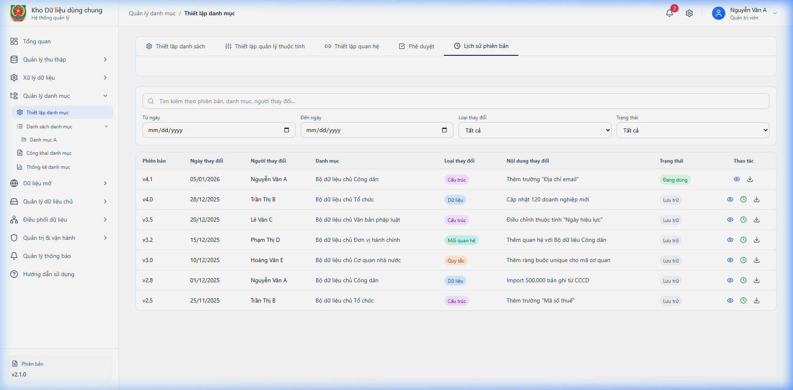

4.3.2.5.1 Mô tả thông tin trên màn hình
| **STT** | **Tên trường thông tin** | **Kiểu dữ liệu** | **Bắt buộc** | **Mặc định** | **Mô tả** |
| --- | --- | --- | --- | --- | --- |
| Phiên bản | VARCHAR2(20) | - | - | Số hiệu phiên bản (VD: 1.0.1). |
| Người cập nhật | VARCHAR2(100) | - | - | Tên định danh người thực hiện thay đổi. |
| Ngày cập nhật | DATE | - | - | Thời điểm lưu phiên bản. |
| Nội dung thay đổi | VARCHAR2(500) | - | - | Tóm tắt các nội dung đã thay đổi. |

## 4.3.3. DC103.QLDM.PD – Phê duyệt danh mục

### *4.3.3.1. Mục đích*
Chức năng này phục vụ cán bộ có thẩm quyền phê duyệt xem xét, chấp thuận hoặc từ chối các danh mục đã được gửi lên từ quá trình thiết lập. Sau khi phê duyệt, danh mục mới được phép chuyển sang bước công bố và đưa vào sử dụng chính thức trong hệ thống.

### 4.3.3.2. DC1-TT-QT-002 – Giao diện phê duyệt

#### 4.3.3.2.1. DC1-UC002-MH1 Màn hình giao diện phê duyệt
- **Mã chức năng:** DC1-TT-QT-002
- **Mã màn hình:** DC1-UC002-MH1, DC1-UC002-MH3, DC1-UC002-MH5

Màn hình

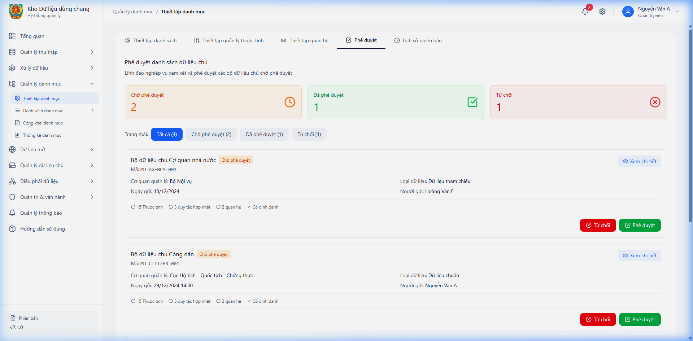

*Hình 3 – Màn hình giao diện phê duyệt danh mục*

4.3.3.2.1.1 Mô tả thông tin trên màn hình
| **STT** | **Tên trường thông tin** | **Kiểu dữ liệu** | **Bắt buộc** | **Mặc định** | **Mô tả** |
| --- | --- | --- | --- | --- | --- |
| Danh sách danh mục chờ duyệt | Table | - | - | Hiển thị các danh mục đang ở trạng thái "Chờ phê duyệt" với thông tin: Mã, Tên, Người tạo, Ngày gửi. |
| Nội dung danh mục | CLOB | - | - | Hiển thị chi tiết cấu trúc thuộc tính và quan hệ của danh mục được chọn để phê duyệt. |

4.3.3.2.1.2 Chức năng trên màn hình
|  |  |  |  |
| --- | --- | --- | --- |
| **STT** | **Tên chức năng** | **Định dạng** | **Mô tả** |
| 1 | CN01 | Button text | Xác nhận danh mục hợp lệ, chuyển trạng thái của danh mục sang "Đã phê duyệt". |
| 2 | CN02 | Button text | Mở popup từ chối phê duyệt (MH03.P01). |

#### 4.3.3.2.2. DC1-UC002-MH2 – Từ chối phê duyệt
- **Mã chức năng:** DC1-TT-QT-002
- **Mã màn hình:** DC1-UC002-MH2, DC1-UC002-MH4

Màn hình

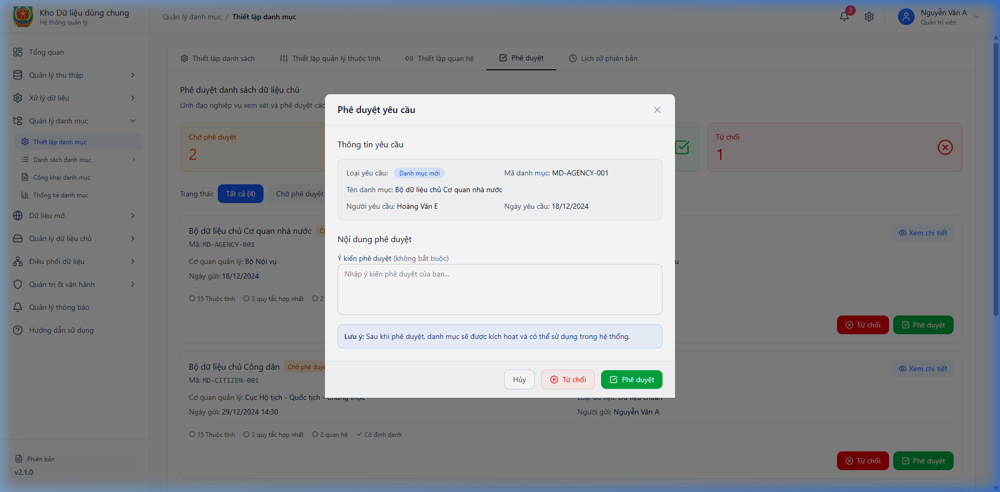

*Hình 9 – Popup nhập lý do từ chối phê duyệt danh mục*

4.3.3.2.2.1 Mô tả thông tin trên màn hình
| **STT** | **Tên trường thông tin** | **Kiểu dữ liệu** | **Bắt buộc** | **Mặc định** | **Mô tả** |
| --- | --- | --- | --- | --- | --- |
| Lý do từ chối | CLOB | Có | - | Nhập chi tiết lý do không phê duyệt danh mục này. |

4.3.3.2.2.2 Chức năng trên màn hình
|  |  |  |  |
| --- | --- | --- | --- |
| **STT** | **Tên chức năng** | **Định dạng** | **Mô tả** |
| 1 | CN01 | Button text | Gửi lý do từ chối và thông báo cho người khởi tạo. |
| 2 | CN02 | Button text | Hủy bỏ và đóng popup. |

### *4.3.4.1. Mục đích*
Chức năng này cho phép cán bộ quản lý công bố chính thức các danh mục đã được phê duyệt lên cổng thông tin, xác định phạm vi chia sẻ (nội bộ, toàn ngành, công khai) và ngày hiệu lực. Chức năng cũng hỗ trợ thu hồi công bố khi cần thiết.

### 4.3.4.2. DC103.QLDM.CB.MH04 – Thiết lập công bố
#### 4.3.4.2.1. MH04 Màn hình thiết lập công bố danh mục
Màn hình

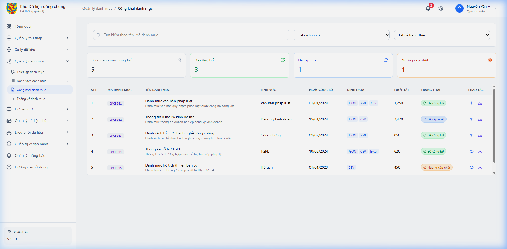

4.3.4.2.1.1 Mô tả thông tin trên màn hình
| **STT** | **Tên trường thông tin** | **Kiểu dữ liệu** | **Bắt buộc** | **Mặc định** | **Mô tả** |
| --- | --- | --- | --- | --- | --- |
| Tên danh mục | VARCHAR2(255) | - | - | Hiển thị tên danh mục được chọn để công bố. |
| Phạm vi công bố | DROPDOWN | Có | Nội bộ | Toàn ngành, Liên ngành, Công khai. |
| Ngày hiệu lực | DATE | Có | Ngày hiện tại | Thời điểm danh mục bắt đầu có hiệu lực công bố. |

4.3.4.2.1.2 Chức năng trên màn hình
|  |  |  |  |
| --- | --- | --- | --- |
| **STT** | **Tên chức năng** | **Định dạng** | **Mô tả** |
| 1 | CN01 | Button text | Xác nhận thực hiện công bố danh mục lên cổng thông tin. |
| 2 | CN02 | Button text | Thu hồi công bố (nếu đang ở trạng thái đã công bố). |

# 4.5. DC105.QLDLC_Dữ liệu chủ (Master Data)

## 4.5.1. DC105.QLDLC.QL – Quản lý thực thể dữ liệu chủ

### *4.5.1.1. Mục đích*
Quản lý các thực thể dữ liệu gốc dùng chung (ví dụ: Người dân, Tổ chức, Hộ gia đình...) nhằm đảm bảo tính duy nhất, chính xác và nhất quán trên toàn hệ thống. Chức năng này cho phép định nghĩa cấu trúc, các thuộc tính, và các quy tắc (định danh, hợp nhất, quan hệ) cho mỗi thực thể dữ liệu chủ.

*+ Phân quyền*
Cán bộ quản trị báo cáo và quản trị dữ liệu master.

*+ Điều kiện thực hiện*
Phải có thẩm quyền cấu hình từ ban quản trị hệ thống mức cao.

### 4.5.1.2. DC1-TQ-DB-001 – Danh sách thực thể dữ liệu chủ

#### 4.5.1.2.1. Mục đích
Cho phép cán bộ tạo mới, định nghĩa và xem danh sách các thực thể dữ liệu chủ cùng với các thuộc tính của chúng.

*+ Phân quyền*
Cán bộ quản trị hệ thống.

*+ Điều kiện thực hiện*
Được cấp quyền tạo mới, tra cứu dữ liệu cơ bản.

#### 4.5.1.2.2. MH01 Màn hình danh sách thực thể dữ liệu chủ
- **Mã chức năng:** DC1-TQ-DB-001, DC1-TB-QT-001
- **Mã màn hình:** MH01

Màn hình

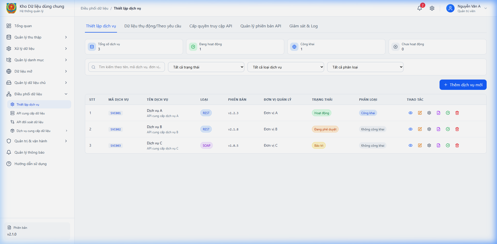

4.5.1.2.2.1 Mô tả thông tin trên màn hình
| **STT** | **Tên trường thông tin** | **Kiểu dữ liệu** | **Bắt buộc** | **Mặc định** | **Mô tả** |
| --- | --- | --- | --- | --- | --- |
| Tên thực thể | VARCHAR2(255) | - | - | Tên của thực thể dữ liệu chủ (VD: Người dân, Doanh nghiệp). |
| Mã thực thể | VARCHAR2(50) | - | - | Mã định danh dạng code (VD: C_CITIZEN). |
| Trạng thái | NUMBER(1) | - | - | 1: Đang hoạt động, 0: Ngừng hoạt động. |
| Cơ quan quản lý | VARCHAR2(255) | - | - | Đơn vị chịu trách nhiệm chính về tính toàn vẹn của dữ liệu này. |
| Nguồn cung cấp chính | VARCHAR2(255) | - | - | Hệ thống gốc cung cấp dữ liệu (VD: HT Thông tin Dân cư). |
| Mô tả | VARCHAR2(1000)| - | - | Mô tả ngắn về mục đích của thực thể. |
| Số thuộc tính | NUMBER | - | - | Số lượng trường thông tin đã được định nghĩa cho thực thể. |
| Ngày tạo | DATE | - | - | Ngày thực thể được tạo ra trong hệ thống. |

4.5.1.2.2.2 Chức năng trên màn hình
|  |  |  |  |
| --- | --- | --- | --- |
| **STT** | **Tên chức năng** | **Định dạng** | **Mô tả** |
| 1 | CN01 | Button text | Mở Wizard 5 bước để tạo mới thực thể (MH01.W01). |
| 2 | CN02 | Button text | Mở popup thêm mới nhanh thực thể (MH01.P01a). |
| 3 | CN03 | Button icon | Mở Tab quản lý thuộc tính (MH01.T02). |
| 4 | CN04 | Button icon | Mở Tab quản lý quy tắc hợp nhất (MH01.T03). |
| 5 | CN05 | Button icon | Mở Tab thiết lập quan hệ (MH01.T04). |
| 6 | CN06 | Button icon | Mở Tab quy tắc định danh (MH01.T05). |
| 7 | CN07 | Button text | Mở chức năng Import định nghĩa Schema thực thể từ file JSON. |
| 8 | CN08 | Button text | Xuất danh sách thực thể ra file Excel/PDF. |

#### 4.5.1.2.3. MH01.W01.S01 – Bước 1: Khởi tạo dữ liệu chủ
Màn hình
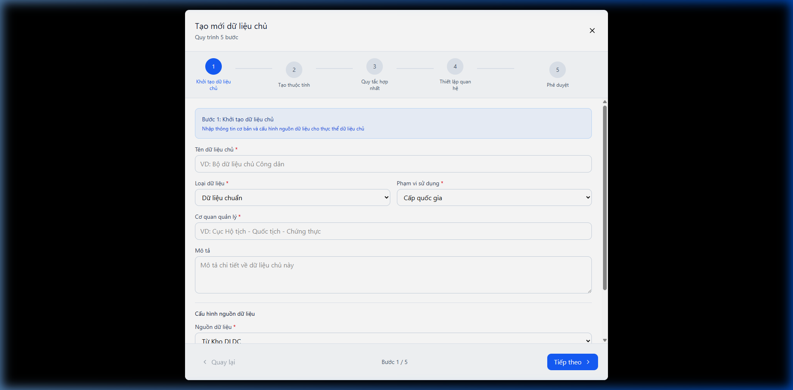

4.5.1.2.3.1 Mô tả thông tin trên màn hình
| **STT** | **Tên trường thông tin** | **Kiểu dữ liệu** | **Bắt buộc** | **Mặc định** | **Mô tả** |
| --- | --- | --- | --- | --- | --- |
| Tên thực thể | VARCHAR2(255) | Có | - | Nhập Tên thực thể để phân biệt. |
| Mã thực thể | VARCHAR2(50) | Có | - | Sinh tự động hoặc nhập tay (viết hoa không dấu). |
| Cơ quan quản lý | DROPDOWN | Có | - | Phân vùng đơn vị chịu trách nhiệm. |
| Mô tả/Ghi chú | VARCHAR2(1000) | Không | - | Thuyết minh thêm về thực thể dữ liệu này. |

4.5.1.2.3.2 Chức năng trên màn hình
|  |  |  |  |
| --- | --- | --- | --- |
| **STT** | **Tên chức năng** | **Định dạng** | **Mô tả** |
| 1 | CN01 | Button text | Chuyển sang bước kế tiếp (Tiếp tục). Nếu có lỗi Validation sẽ báo đỏ. |
| 2 | CN02 | Button text | Hủy bỏ toàn bộ quá trình tạo mới. |

#### 4.5.1.2.4. MH01.W01.S02 – Bước 2: Tạo thuộc tính
Màn hình
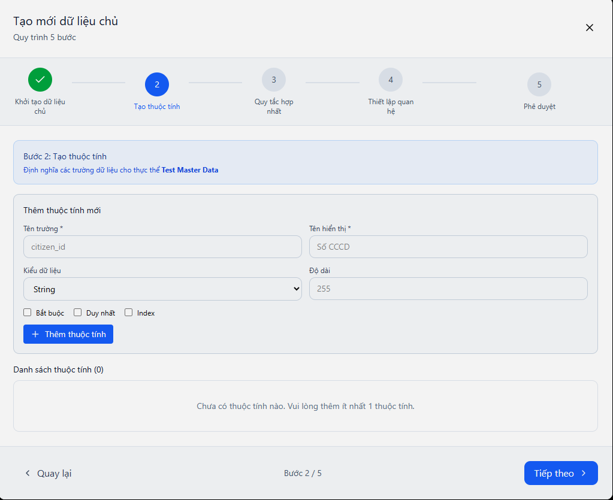

4.5.1.2.4.1 Mô tả thông tin trên màn hình
| **STT** | **Tên trường thông tin** | **Kiểu dữ liệu** | **Bắt buộc** | **Mặc định** | **Mô tả** |
| --- | --- | --- | --- | --- | --- |
| Danh sách Column | CLOB | - | - | Bảng danh sách các thuộc tính (Tên, Kiểu dữ liệu, Bắt buộc, Khóa). |

4.5.1.2.4.2 Chức năng trên màn hình
|  |  |  |  |
| --- | --- | --- | --- |
| **STT** | **Tên chức năng** | **Định dạng** | **Mô tả** |
| 1 | CN01 | Button text | Chuyển sang bước kế tiếp (Tiếp tục). |
| 2 | CN02 | Button text | Quay lại bước trước để sửa thông tin. |
| 3 | CN03 | Button text | Hủy bỏ toàn bộ quá trình tạo mới. |

#### 4.5.1.2.5. MH01.W01.S03 – Bước 3: Quy tắc hợp nhất
Màn hình
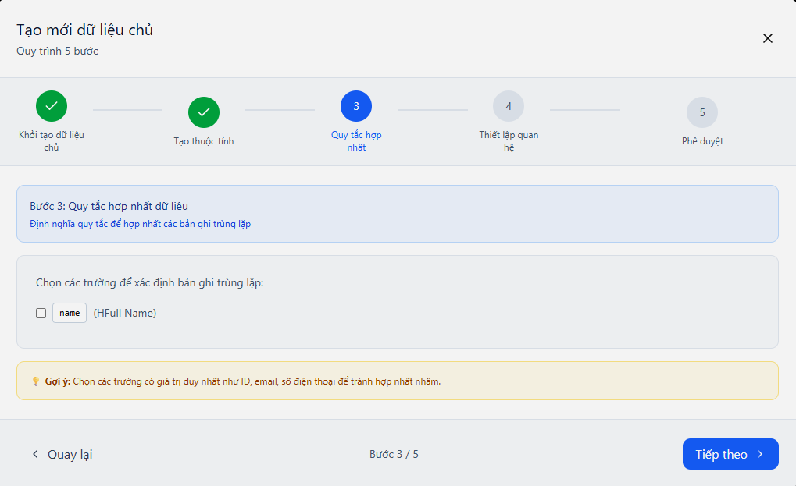

4.5.1.2.5.1 Mô tả thông tin trên màn hình
| **STT** | **Tên trường thông tin** | **Kiểu dữ liệu** | **Bắt buộc** | **Mặc định** | **Mô tả** |
| --- | --- | --- | --- | --- | --- |
| Danh sách Rule match | CLOB | - | - | Bảng định nghĩa các quy luật so khớp tránh trùng lặp. |

4.5.1.2.5.2 Chức năng trên màn hình
|  |  |  |  |
| --- | --- | --- | --- |
| **STT** | **Tên chức năng** | **Định dạng** | **Mô tả** |
| 1 | CN01 | Button text | Chuyển sang bước kế tiếp (Tiếp tục). |
| 2 | CN02 | Button text | Quay lại bước trước để sửa thông tin. |
| 3 | CN03 | Button text | Hủy bỏ toàn bộ quá trình tạo mới. |

#### 4.5.1.2.6. MH01.W01.S04 – Bước 4: Thiết lập quan hệ
Màn hình

4.5.1.2.6.1 Mô tả thông tin trên màn hình
| **STT** | **Tên trường thông tin** | **Kiểu dữ liệu** | **Bắt buộc** | **Mặc định** | **Mô tả** |
| --- | --- | --- | --- | --- | --- |
| Liên kết ngoài | CLOB | - | - | Bảng ghi nhận liên kết khóa ngoại 1-N, N-N. |

4.5.1.2.6.2 Chức năng trên màn hình
|  |  |  |  |
| --- | --- | --- | --- |
| **STT** | **Tên chức năng** | **Định dạng** | **Mô tả** |
| 1 | CN01 | Button text | Chuyển sang bước kế tiếp (Tiếp tục). |
| 2 | CN02 | Button text | Quay lại bước trước để sửa thông tin. |
| 3 | CN03 | Button text | Hủy bỏ toàn bộ quá trình tạo mới. |

#### 4.5.1.2.7. MH01.W01.S05 – Bước 5: Phê duyệt
Màn hình
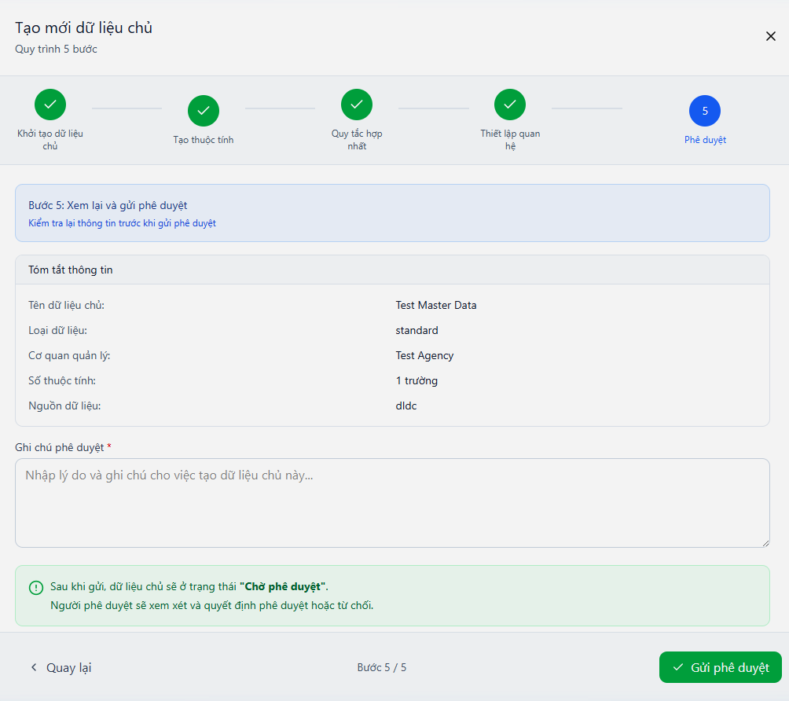

4.5.1.2.7.1 Mô tả thông tin trên màn hình
| **STT** | **Tên trường thông tin** | **Kiểu dữ liệu** | **Bắt buộc** | **Mặc định** | **Mô tả** |
| --- | --- | --- | --- | --- | --- |
| Người trình duyệt | VARCHAR2(255) | Có | Tên cán bộ | Ghi chú người đang xử lý. |
| Nội dung trình | CLOB | Không | - | Giải trình lý do tạo mới cấu trúc thực thể. |

4.5.1.2.7.2 Chức năng trên màn hình
|  |  |  |  |
| --- | --- | --- | --- |
| **STT** | **Tên chức năng** | **Định dạng** | **Mô tả** |
| 1 | CN01 | Button text | Chuyển sang bước kế tiếp (Tiếp tục). Nếu có lỗi Validation sẽ báo đỏ. |
| 2 | CN02 | Button text | Quay lại bước trước để sửa thông tin. |
| 3 | CN03 | Button text | Hủy bỏ toàn bộ quá trình tạo mới. |
| 4 | CN04 | Button text | Lưu cấu hình trình phê duyệt (Chỉ khả dụng tại Bước 5). |

#### 4.5.1.2.8. MH01.P01a – Thêm mới nhanh thực thể
Màn hình

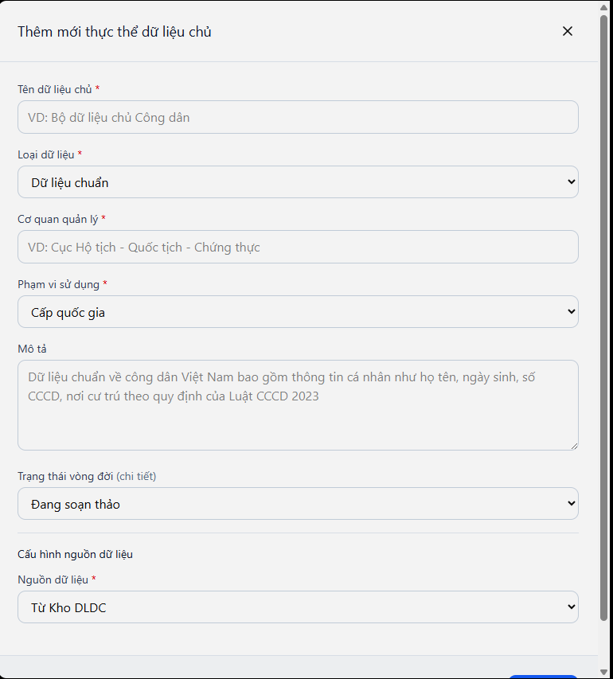

4.5.1.2.8.1 Mô tả thông tin trên màn hình
| **STT** | **Tên trường thông tin** | **Kiểu dữ liệu** | **Bắt buộc** | **Mặc định** | **Mô tả** |
| --- | --- | --- | --- | --- | --- |
| Chọn từ Mẫu (Template) | DROPDOWN | Không | - | Chọn mẫu có sẵn (VD: Mẫu Công dân chuẩn) để auto-fill. |
| Tên thực thể | VARCHAR2(255) | Có | - | Nhập tên thực thể mới. |
| Mã định danh | VARCHAR2(50) | Có | - | Chuỗi Code quản lý hệ thống. |
| Cơ quan quản lý | DROPDOWN | Có | - | Chọn đơn vị chủ quản dữ liệu. |

4.5.1.2.8.2 Chức năng trên màn hình
|  |  |  |  |
| --- | --- | --- | --- |
| **STT** | **Tên chức năng** | **Định dạng** | **Mô tả** |
| 1 | CN01 | Button text | Ghi nhận tạo mới thực thể khung rỗng. |
| 2 | CN02 | Button text | Hủy thao tác, đóng cửa sổ. |

#### 4.5.1.2.9. MH01.P02 – Thêm thuộc tính mới (Popup trong Tab 2)
- **Mã chức năng:** DC1-TQ-DB-001, DC1-TB-QT-001
- **Mã màn hình:** MH01.P02

Màn hình

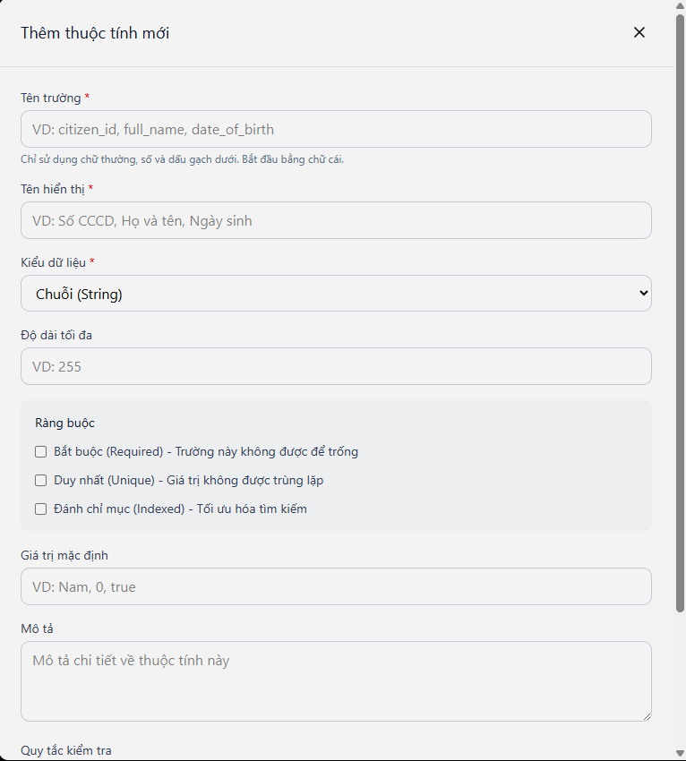

4.5.1.2.9.1 Mô tả thông tin trên màn hình
| **STT** | **Tên trường thông tin** | **Kiểu dữ liệu** | **Bắt buộc** | **Mặc định** | **Mô tả** |
| --- | --- | --- | --- | --- | --- |
| Tên trường (Hiển thị) | VARCHAR2(255) | Có | - | Tên nhãn hiển thị trên Form (VD: Số CCCD). |
| Mã trường vật lý | VARCHAR2(100) | Có | - | Tên vật lý của trường trong DB (VD: CITIZEN_ID). |
| Kiểu dữ liệu | DROPDOWN | Có | String | Lựa chọn String, Number, Date, Boolean, JSON. |
| Độ dài tối đa | NUMBER | Có | 255 | Kích thước cấp phát độ rộng của biến. |
| Bắt buộc nhập (Not Null) | NUMBER(1) | Không | 0 | Đánh dấu nều trường này không được phép rỗng. |
| Là Khóa chính | NUMBER(1) | Không | 0 | Đánh dấu là Master ID của bảng. |
| Giá trị mặc định | VARCHAR2(100) | Không | - | Giá trị sẽ nhận nếu không có dữ liệu truyền vào. |
| Trích xuất từ Tự điển | DROPDOWN | Không | - | Trỏ sang Danh mục hệ thống để làm Combo-box (nếu có). |

4.5.1.2.9.2 Chức năng trên màn hình
|  |  |  |  |
| --- | --- | --- | --- |
| **STT** | **Tên chức năng** | **Định dạng** | **Mô tả** |
| 1 | CN01 | Button text | Áp dụng cấu hình thuộc tính mới. |
| 2 | CN02 | Button text | Đóng popup. |

#### 4.5.1.2.10. MH01.P03 – Thêm quy tắc hợp nhất mới (Popup trong Tab 3)
- **Mã chức năng:** DC1-TQ-DB-001
- **Mã màn hình:** MH01.P03

Màn hình

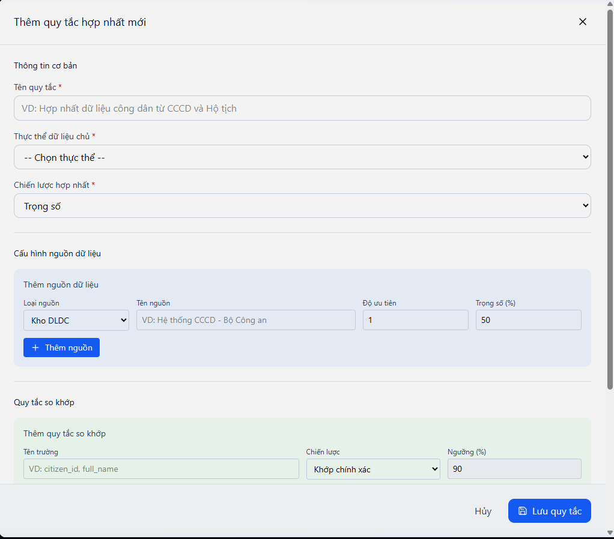

4.5.1.2.10.1 Mô tả thông tin trên màn hình
| **STT** | **Tên trường thông tin** | **Kiểu dữ liệu** | **Bắt buộc** | **Mặc định** | **Mô tả** |
| --- | --- | --- | --- | --- | --- |
| Tên quy tắc | VARCHAR2(255) | Có | - | Tên gợi nhớ (VD: Quy tắc trùng số thẻ). |
| Loại so khớp | DROPDOWN | Có | Tuyệt đối | Exact Match (Khớp 100%), Fuzzy Match, Regex pattern. |
| Thuộc tính phân tích | DROPDOWN | Có | - | Chọn 1 hoặc nhiều trường dùng để so trùng (VD: Số CCCD). |
| Ngưỡng dung sai (%) | NUMBER | Không | 90% | Điểm tệp bao nhiêu % trở lên được coi là nghi ngờ trùng lặp. |
| Trọng số áp dụng | NUMBER | Có | 1 | Độ ưu tiên nếu có nhiều rule cùng lúc (1 là cao nhất). |
| Hành động hệ thống | DROPDOWN | Có | Cảnh báo | Tự động Merge / Cảnh báo và chờ phê duyệt thủ công. |

4.5.1.2.10.2 Chức năng trên màn hình
|  |  |  |  |
| --- | --- | --- | --- |
| **STT** | **Tên chức năng** | **Định dạng** | **Mô tả** |
| 1 | CN01 | Button text | Lưu quy tắc hợp nhất. |
| 2 | CN02 | Button text | Đóng thao tác. |

#### 4.5.1.2.11. MH01.P04 – Thêm quan hệ thực thể mới (Popup trong Tab 4)
Màn hình

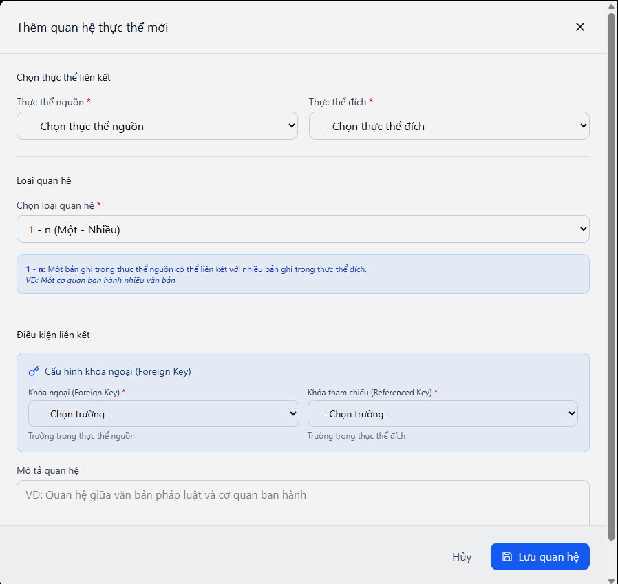

4.5.1.2.11.1 Mô tả thông tin trên màn hình
| **STT** | **Tên trường thông tin** | **Kiểu dữ liệu** | **Bắt buộc** | **Mặc định** | **Mô tả** |
| --- | --- | --- | --- | --- | --- |
| Tên quan hệ | VARCHAR2(255) | Có | - | Mô tả quan hệ (VD: Cá nhân - Tổ chức). |
| Thực thể Nguồn | VARCHAR2(100) | Có | - | Bảng khởi phát kết nối. |
| Thực thể Liên kết | DROPDOWN | Có | - | Chọn thực thể Master Data cần nối vào (VD: Tổ chức). |
| Trường kết nối (Sources)| DROPDOWN | Có | - | Khóa bắt nguồn (VD: ORG_ID). |
| Trường kết nối (Targets)| DROPDOWN | Có | - | Khóa tiếp nhận của thực thể đích. |
| Loại quan hệ | DROPDOWN | Có | 1-N | Biểu diễn: 1-1, 1-N, N-1. |
| Ràng buộc tương tác | DROPDOWN | Có | Restrict | Tùy chọn (Cascade/Restrict) khi hệ thống xóa dữ liệu. |

4.5.1.2.11.2 Chức năng trên màn hình
|  |  |  |  |
| --- | --- | --- | --- |
| **STT** | **Tên chức năng** | **Định dạng** | **Mô tả** |
| 1 | CN01 | Button text | Khởi tạo liên kết khóa ngoại. |
| 2 | CN02 | Button text | Đóng cửa sổ. |

#### 4.5.1.2.12. MH01.P05 – Thêm quy tắc định danh duy nhất (Popup trong Tab 5)
Màn hình

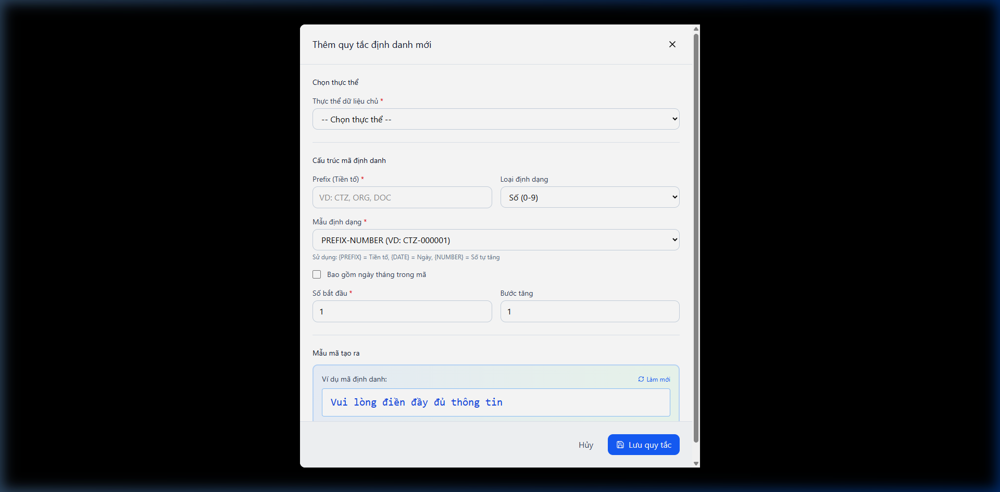

4.5.1.2.12.1 Mô tả thông tin trên màn hình
| **STT** | **Tên trường thông tin** | **Kiểu dữ liệu** | **Bắt buộc** | **Mặc định** | **Mô tả** |
| --- | --- | --- | --- | --- | --- |
| Mã tiền tố (Prefix) | VARCHAR2(20) | Có | - | Ký hiệu định dạng tĩnh phần đầu (VD: C_). |
| Mã hậu tố (Suffix) | VARCHAR2(20) | Không | - | Ký hiệu định dạng tĩnh phần cuối. |
| Độ dài tự tăng | NUMBER | Có | 6 | Số chữ số độ rộng của phần số (VD: 6 sinh ra 000001). |
| Giá trị bắt đầu | NUMBER | Có | 1 | Seed ban đầu của dãy tịnh tiến. |
| Preview hiển thị | VARCHAR2(255) | Tự động | - | Xem trước cách mã được tạo ra (VD: C_000001). |

4.5.1.2.12.2 Chức năng trên màn hình
|  |  |  |  |
| --- | --- | --- | --- |
| **STT** | **Tên chức năng** | **Định dạng** | **Mô tả** |
| 1 | CN01 | Button text | Cập nhật định dạng quy tắc sinh mã. |
| 2 | CN02 | Button text | Hủy lưu. |

#### 4.5.1.2.13. MH01.P06 – Chi tiết phê duyệt (Popup trong Tab 6)
Màn hình

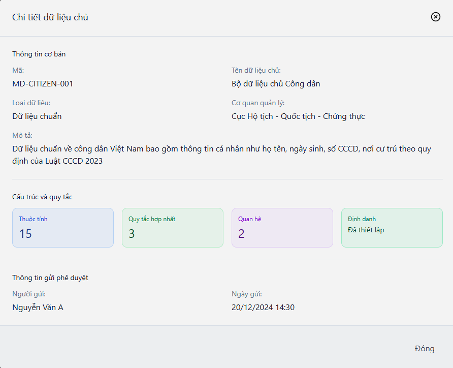

4.5.1.2.13.1 Mô tả thông tin trên màn hình
| **STT** | **Tên trường thông tin** | **Kiểu dữ liệu** | **Bắt buộc** | **Mặc định** | **Mô tả** |
| --- | --- | --- | --- | --- | --- |
| Tên bản mẫu thực thể | VARCHAR2(255) | - | - | Thể hiện tiêu đề của bản kê khai cấu trúc chờ duyệt. |
| Khối lượng thay đổi | VARCHAR2(100) | - | - | Hiển thị tóm tắt: Tạo mới n thuộc tính, tạo m quy tắc. |
| Nội dung yêu cầu | VARCHAR2(1000) | - | - | Tóm tắt các thay đổi cấu trúc dữ liệu chủ từ người soạn thảo. |
| Ý kiến phê duyệt | VARCHAR2(1000) | Có | - | Ghi chú phản hồi do Quản trị viên nhập, gửi lại cho người tạo. |
| Trạng thái trình | VARCHAR2(50) | - | - | Các bước: Chờ duyệt, Đã duyệt, Yêu cầu bổ sung, Từ chối. |

4.5.1.2.13.2 Chức năng trên màn hình
|  |  |  |  |
| --- | --- | --- | --- |
| **STT** | **Tên chức năng** | **Định dạng** | **Mô tả** |
| 1 | CN01 | Button text | Phê duyệt yêu cầu thay đổi hệ thống. |
| 2 | CN02 | Button text | Trả lại / Từ chối yêu cầu kèm theo lỗi cần sửa. |
| 3 | CN03 | Button text | Đóng cửa sổ nhận xét. |

## 4.5.2. DC105.QLDLC.CD – Cập nhật & Công khai dữ liệu chủ

### *4.5.2.1. Mục đích*
Quản lý vòng đời của các bản ghi dữ liệu chủ, bao gồm việc rà soát, phê duyệt các bản ghi mới hoặc được cập nhật, xử lý trùng lặp và cấu hình việc công khai dữ liệu ra bên ngoài thông qua API.

*+ Phân quyền*
Cán bộ quản trị và khai thác dữ liệu.

*+ Điều kiện thực hiện*
Phải có thông tin dữ liệu chủ từ các nguồn truyền về hệ thống để kiểm tra và hợp nhất.

### 4.5.2.2. DC1-TT-QT-001 – Cập nhật dữ liệu chủ

#### 4.5.2.2.1. Mục đích
Rà soát, đối chiếu và cập nhật các bản ghi dữ liệu chủ, hỗ trợ xử lý việc trùng lặp theo quy tắc hợp nhất đã cấu hình.

*+ Phân quyền*
Cán bộ quản trị và khai thác dữ liệu.

*+ Điều kiện thực hiện*
Được quyền truy cập chức năng cập nhật dữ liệu.

#### 4.5.2.2.2. DC1-UC001-MH2 Màn hình Cập nhật dữ liệu chủ
- **Mã chức năng:** DC1-TT-QT-001
- **Mã màn hình:** DC1-UC001-MH2

Màn hình

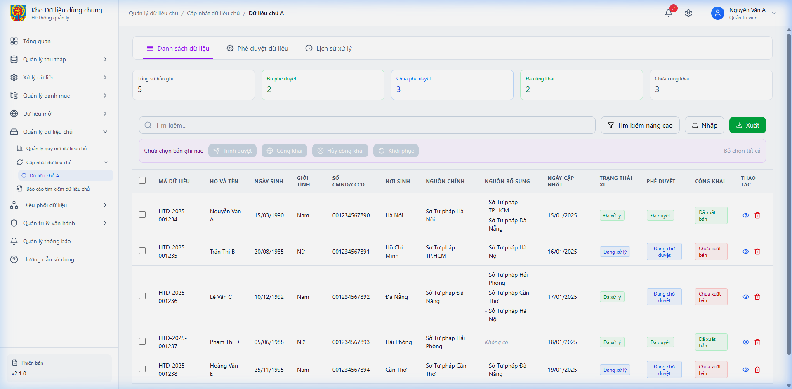

4.5.2.2.2.1 Mô tả thông tin trên màn hình
| **STT** | **Tên trường thông tin** | **Kiểu dữ liệu** | **Bắt buộc** | **Mặc định** | **Mô tả** |
| --- | --- | --- | --- | --- | --- |
| Mã bản ghi Master | VARCHAR2(50) | - | - | Mã golden ID của 1 hàng dữ liệu độc lập. |
| Tên thực thể liên quan | VARCHAR2(255) | - | - | Schema gốc tương ứng (Ví dụ: Công Dân, Pháp Nhân...). |
| Nhóm dữ liệu (Nguồn)| VARCHAR2(255) | - | - | Hệ thống gửi dữ liệu lên (API / Import Excel). |
| Điểm tin cậy (Score)| NUMBER | - | - | Độ chuẩn xác của dữ liệu được đánh giá tự động. |
| Trạng thái vòng đời | VARCHAR2(50) | - | - | Nháp, Chờ Phê Duyệt, Đã Phê Duyệt, Nghi Ngờ Trùng Lặp, Khóa. |
| Ngày cập nhật cuối | DATE | - | - | Thời điểm bản ghi được sửa đổi lần gần nhất. |
| Cán bộ phụ trách | VARCHAR2(100) | - | - | Tên tài khoản thực thi đối soát. |

4.5.2.2.2.2 Chức năng trên màn hình
|  |  |  |  |
| --- | --- | --- | --- |
| **STT** | **Tên chức năng** | **Định dạng** | **Mô tả** |
| 1 | CN01 | Button text | Lọc dữ liệu theo Từ khóa, Loại thực thể, Khoảng thời gian và Tình trạng. |
| 2 | CN02 | Button icon | Mở popup xem chi tiết và giải quyết xung đột hợp nhất bản ghi (MH02.P01). |
| 3 | CN03 | Button icon | Mở form cập nhật chỉnh sửa thủ công thông tin (MH02.P02). |
| 4 | CN04 | Button icon | Mở chức năng Phê duyệt hàng loạt các dữ liệu chuẩn (Golden Record). |
| 5 | CN05 | Button icon | Flag issue (Gắn cờ lỗi dữ liệu cần xử lý ngoại lệ). |

#### 4.5.2.2.3. MH02.P01 – Chi tiết và hợp nhất bản ghi
Màn hình

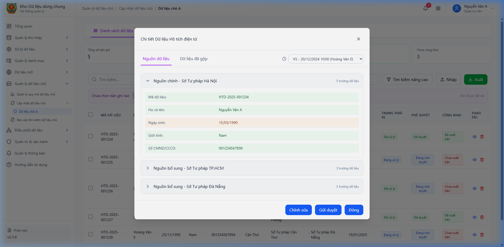

4.5.2.2.3.1 Mô tả thông tin trên màn hình
| **STT** | **Tên trường thông tin** | **Kiểu dữ liệu** | **Bắt buộc** | **Mặc định** | **Mô tả** |
| --- | --- | --- | --- | --- | --- |
| Bản ghi gốc (Master) | CLOB | - | - | Cột lưới hiển thị dữ liệu gốc đang có trên hệ thống lưu trữ. |
| Bản ghi nghi vấn | CLOB | - | - | Cột lưới dữ liệu mới truyền tới (chỉ số trùng lặp cao). |
| Điểm số tương đồng (%) | NUMBER | - | - | Tỷ lệ Match calculation đánh giá bởi thuật toán thông minh. |
| Các trường xung đột | VARCHAR2 | - | - | Các trường giá trị Data không khớp, được Highlight bôi đỏ để cảnh báo. |
| Form tích hợp (Golden) | CLOB | - | - | Form trung tâm hiển thị Data sau khi đã hợp nhất kết quả. |

4.5.2.2.3.2 Chức năng trên màn hình
|  |  |  |  |
| --- | --- | --- | --- |
| **STT** | **Tên chức năng** | **Định dạng** | **Mô tả** |
| 1 | CN01 | Button icon | (Dành riêng từng trường) Nhấp để giữ lại giá trị của Cột Dữ liệu Nguồn (Bên Trái). |
| 2 | CN02 | Button icon | (Dành riêng từng trường) Nhấp để áp dụng đè giá trị của Cột Dữ liệu Mới (Bên Phải). |
| 3 | CN03 | Button text | Xác nhận hành động hợp nhất 2 bản ghi thành 1 Golden Record duy nhất. |
| 4 | CN04 | Button text | Đánh dấu rẽ nhánh không trùng (Tách thành 2 dữ liệu hoàn toàn riêng biệt). |
| 5 | CN05 | Button text | Đóng màn hình hiển thị quay về trang chủ hợp nhất. |

#### 4.5.2.2.4. DC1-UC001-MH4 – Chỉnh sửa bản ghi dữ liệu chủ
- **Mã chức năng:** DC1-TT-QT-001
- **Mã màn hình:** DC1-UC001-MH4

Màn hình

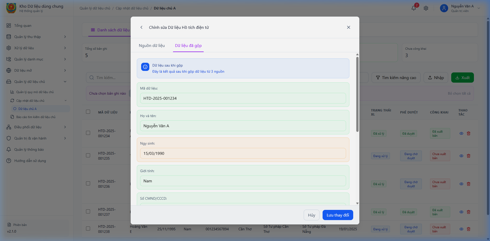

4.5.2.2.4.1 Mô tả thông tin trên màn hình
| **STT** | **Tên trường thông tin** | **Kiểu dữ liệu** | **Bắt buộc** | **Mặc định** | **Mô tả** |
| --- | --- | --- | --- | --- | --- |
| Dữ liệu nội dung động | CLOB | Theo cấu hình | - | Giao diện tự động render Dynamic Form Input theo đúng cấu trúc Thuộc tính đã định nghĩa từ MH01 (ví dụ Textbox, Calendar). |
| Ghi chú thay đổi | VARCHAR2(1000) | Không | - | Lý do cập nhật thủ công dòng Data từ quản trị để lưu vết Audit. |
| Nhãn dán phân loại | VARCHAR2(255) | Không | - | Thẻ Tag đánh giá chuyên sâu (Review note, Fixed tag...). |

4.5.2.2.4.2 Chức năng trên màn hình
|  |  |  |  |
| --- | --- | --- | --- |
| **STT** | **Tên chức năng** | **Định dạng** | **Mô tả** |
| 1 | CN01 | Button text | Lưu cập nhật giá trị mới của bản ghi trực tiếp vào Database. |
| 2 | CN02 | Button text | Tra cứu lịch sử phiên bản trước khi Edit hành động (Phục hồi). |
| 3 | CN03 | Button text | Đóng thao tác và thoát cửa sổ chỉnh sửa. |

### 4.5.2.3. DC1-TT-QT-002 – Công khai dữ liệu chủ

#### 4.5.2.3.1. Mục đích
Báo cáo toàn diện về tình trạng sử dụng và vòng đời của dữ liệu chủ, phục vụ cho quá trình giám sát và chia sẻ thông qua các Dịch vụ mở, API.

*+ Phân quyền*
Lãnh đạo hoặc cán bộ cấp quản lý, cơ quan liên ngành.

*+ Điều kiện thực hiện*
Hệ thống đã phát sinh dữ liệu trong kho chủ và có các Endpoint API đang ở trạng thái Online.

#### 4.5.2.3.2. DC1-UC002-MH1 Màn hình Báo cáo & Tra cứu dữ liệu chủ
- **Mã chức năng:** DC1-TT-QT-002
- **Mã màn hình:** DC1-UC002-MH1, DC1-UC002-MH3, DC1-UC002-MH5

Màn hình

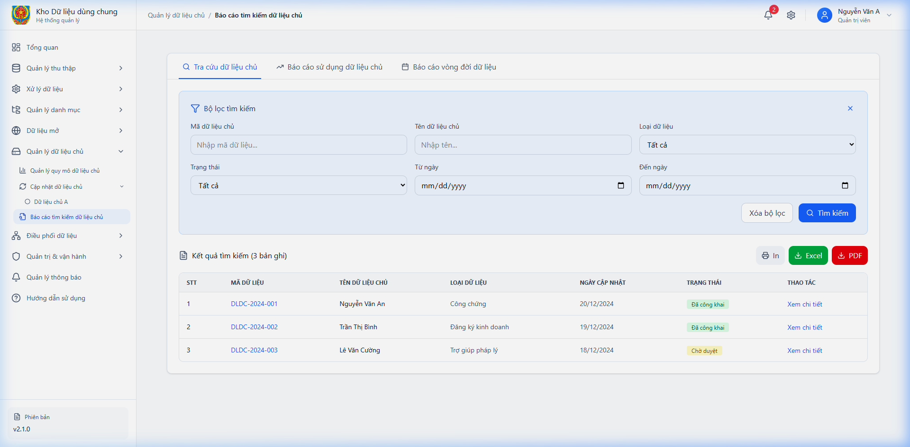

4.5.2.3.2.1 Mô tả thông tin trên màn hình
| **STT** | **Tên trường thông tin** | **Kiểu dữ liệu** | **Bắt buộc** | **Mặc định** | **Mô tả** |
| --- | --- | --- | --- | --- | --- |
| Tab Tra cứu dữ liệu | - | - | - | Tìm kiếm nhanh thông qua từ khóa và xem chi tiết bảo mật bản ghi. |
| Tab Báo cáo sử dụng | - | - | - | Thống kê tần suất Server API bị gọi, lưu lượng kết nối trao đổi. |
| Tab Báo cáo vòng đời | - | - | - | Thống kê biến động Master Data tĩnh (tạo mới, cập nhật). |

4.5.2.3.2.2 Chức năng trên màn hình
|  |  |  |  |
| --- | --- | --- | --- |
| **STT** | **Tên chức năng** | **Định dạng** | **Mô tả** |
| 1 | CN01 | Button text | Thanh Menu Tab chuyển đổi qua lại nhanh các loại báo cáo phân tích. |
| 2 | CN02 | Button icon | Mở popup xem chi tiết 1 bản gốc Master Record trên danh sách tìm kiếm (MH03.P01). |

#### 4.5.2.3.3. DC1-UC002-MH2 – Chi tiết bản ghi tra cứu
- **Mã chức năng:** DC1-TT-QT-002
- **Mã màn hình:** DC1-UC002-MH2, DC1-UC002-MH4

Màn hình

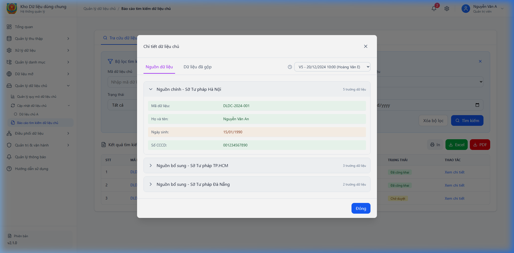

4.5.2.3.3.1 Mô tả thông tin trên màn hình
| **STT** | **Tên trường thông tin** | **Kiểu dữ liệu** | **Bắt buộc** | **Mặc định** | **Mô tả** |
| --- | --- | --- | --- | --- | --- |
| Hình ảnh / Avatar | VARCHAR2 | - | - | Nếu bản ghi có thuộc cấu trúc hỗ trợ File Media, sẽ hiển thị Thumbnail định danh. |
| Trường định danh Code| VARCHAR2(100) | - | - | Chuỗi giá trị Index mã quản trị (Golden Record ID). |
| Bảng thuộc tính Map | CLOB | - | - | Toàn bộ dữ liệu Master Data tĩnh được show ra chi tiết theo dạng 2 cột Name-Value. |
| Thông tin siêu dữ liệu| VARCHAR2 | - | - | Meta info log hệ thống: Người tạo file ban đầu, Thời gian cung cấp qua API. |

4.5.2.3.3.2 Chức năng trên màn hình
|  |  |  |  |
| --- | --- | --- | --- |
| **STT** | **Tên chức năng** | **Định dạng** | **Mô tả** |
| 1 | CN01 | Button text | Đóng màn hình hiển thị trực quan thông tin chi tiết. |
| 2 | CN02 | Button icon | Sao chép URL để tạo đường dẫn chia sẻ liên kết an toàn tới hệ thống ngoài. |

#### 4.5.2.3.4. MH03.T02 – Tab Báo cáo sử dụng dữ liệu chủ
Màn hình

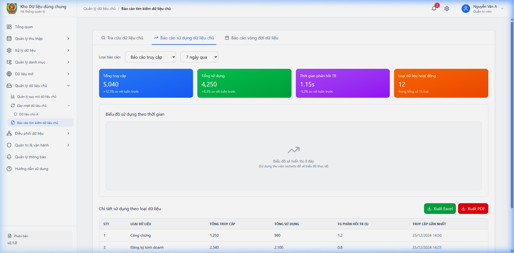

4.5.2.3.4.1 Mô tả thông tin trên màn hình
| **STT** | **Tên trường thông tin** | **Kiểu dữ liệu** | **Bắt buộc** | **Mặc định** | **Mô tả** |
| --- | --- | --- | --- | --- | --- |
| Đơn vị khai thác API | VARCHAR2(255) | - | - | Tên Hệ thống / Ứng dụng thuộc các chi nhánh kết nối vào Datacenter. |
| Lượt truy xuất Calling | NUMBER | - | - | Tổng số lượng Request Response thành công trong mốc thời gian Filter định mức. |
| Lần giao dịch cuối | DATE | - | - | Phiên lấy Data gần nhất (Ping session timestamp). |
| Trạng thái kết nối | VARCHAR2(20) | - | - | Trạng thái Live của cổng chia sẻ (Online, Timeout, Đang bảo trì). |
| Biểu đồ Heatmap | CLOB | - | - | Thể hiện mức độ khai thác theo dạng hình ảnh trực quan tương ứng biểu đồ mốc cột nến. |

4.5.2.3.4.2 Chức năng trên màn hình
|  |  |  |  |
| --- | --- | --- | --- |
| **STT** | **Tên chức năng** | **Định dạng** | **Mô tả** |
| 1 | CN01 | Button text | Box filter chọn lọc dữ liệu theo bộ tham số Thời gian / Từ khóa đơn vị cụ thể. |
| 2 | CN02 | Button text | Chấp nhận xuất khối báo cáo cấu trúc gốc dưới định dạng Excel/PDF chuẩn hóa biểu đồ. |

#### 4.5.2.3.5. MH03.T03 – Tab Báo cáo vòng đời dữ liệu
Màn hình

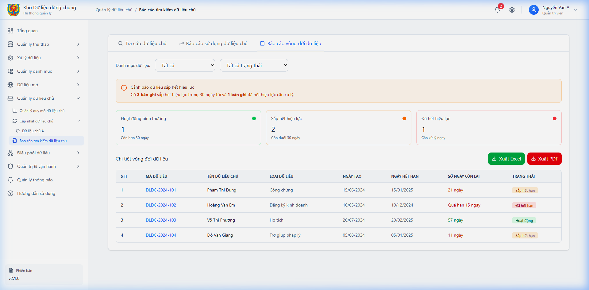

4.5.2.3.5.1 Mô tả thông tin trên màn hình
| **STT** | **Tên trường thông tin** | **Kiểu dữ liệu** | **Bắt buộc** | **Mặc định** | **Mô tả** |
| --- | --- | --- | --- | --- | --- |
| Chỉ mục Tốc độ tăng | NUMBER | - | - | Biểu diễn tỷ lệ phần trăm tốc độ sinh ra bản ghi mới mỗi tuần/tháng theo chu kỳ động lực (Delta %). |
| Tỷ trọng gộp thành công| NUMBER | - | - | Tỷ lệ số bản ghi đã được phát hiện trùng lặp và xác nhận Merge tự động (Automated resolvement). |
| Biểu đồ đường Link | CLOB | - | - | Thể hiện Data flow trực tuyến, mô tả sơ đồ Sink-to-Source bằng biểu đồ phân bổ sinh thái (Sankey Flow) hoặc đường Path. |

4.5.2.3.5.2 Chức năng trên màn hình
|  |  |  |  |
| --- | --- | --- | --- |
| **STT** | **Tên chức năng** | **Định dạng** | **Mô tả** |
| 1 | CN01 | Button text | Thay đổi kỳ đánh giá báo cáo Dashboard (Lọc theo Quý, Theo Tháng, Năm). |
| 2 | CN02 | Button text | Tải trích xuất báo cáo lưu dữ liệu dạng ảnh minh hoạ chụp màn hình PNG độ phân giải cao hoặc chèn Word. |

# 4.5. DC105.QLDLC_Dữ liệu chủ (Master Data)

## 4.5.1. DC105.QLDLC.QL – Quản lý thực thể dữ liệu chủ

### *4.5.1.1. Mục đích*
Quản lý các thực thể dữ liệu gốc dùng chung (ví dụ: Người dân, Tổ chức, Hộ gia đình...) nhằm đảm bảo tính duy nhất, chính xác và nhất quán trên toàn hệ thống. Chức năng này cho phép định nghĩa cấu trúc, các thuộc tính, và các quy tắc (định danh, hợp nhất, quan hệ) cho mỗi thực thể dữ liệu chủ.

*+ Phân quyền*
Cán bộ quản trị báo cáo và quản trị dữ liệu master.

*+ Điều kiện thực hiện*
Phải có thẩm quyền cấu hình từ ban quản trị hệ thống mức cao.

### 4.5.1.2. DC1-TQ-DB-001 – Danh sách thực thể dữ liệu chủ

#### 4.5.1.2.1. Mục đích
Cho phép cán bộ tạo mới, định nghĩa và xem danh sách các thực thể dữ liệu chủ cùng với các thuộc tính của chúng.

*+ Phân quyền*
Cán bộ quản trị hệ thống.

*+ Điều kiện thực hiện*
Được cấp quyền tạo mới, tra cứu dữ liệu cơ bản.

#### 4.5.1.2.2. MH01 Màn hình danh sách thực thể dữ liệu chủ
- **Mã chức năng:** DC1-TQ-DB-001, DC1-TB-QT-001
- **Mã màn hình:** MH01

Màn hình

4.5.1.2.2.1 Mô tả thông tin trên màn hình
| **STT** | **Tên trường thông tin** | **Kiểu dữ liệu** | **Bắt buộc** | **Mặc định** | **Mô tả** |
| --- | --- | --- | --- | --- | --- |
| Tên thực thể | VARCHAR2(255) | - | - | Tên của thực thể dữ liệu chủ (VD: Người dân, Doanh nghiệp). |
| Mã thực thể | VARCHAR2(50) | - | - | Mã định danh dạng code (VD: C_CITIZEN). |
| Trạng thái | NUMBER(1) | - | - | 1: Đang hoạt động, 0: Ngừng hoạt động. |
| Cơ quan quản lý | VARCHAR2(255) | - | - | Đơn vị chịu trách nhiệm chính về tính toàn vẹn của dữ liệu này. |
| Nguồn cung cấp chính | VARCHAR2(255) | - | - | Hệ thống gốc cung cấp dữ liệu (VD: HT Thông tin Dân cư). |
| Mô tả | VARCHAR2(1000)| - | - | Mô tả ngắn về mục đích của thực thể. |
| Số thuộc tính | NUMBER | - | - | Số lượng trường thông tin đã được định nghĩa cho thực thể. |
| Ngày tạo | DATE | - | - | Ngày thực thể được tạo ra trong hệ thống. |

4.5.1.2.2.2 Chức năng trên màn hình
|  |  |  |  |
| --- | --- | --- | --- |
| **STT** | **Tên chức năng** | **Định dạng** | **Mô tả** |
| 1 | CN01 | Button text | Mở Wizard 5 bước để tạo mới thực thể (MH01.W01). |
| 2 | CN02 | Button text | Mở popup thêm mới nhanh thực thể (MH01.P01a). |
| 3 | CN03 | Button icon | Mở Tab quản lý thuộc tính (MH01.T02). |
| 4 | CN04 | Button icon | Mở Tab quản lý quy tắc hợp nhất (MH01.T03). |
| 5 | CN05 | Button icon | Mở Tab thiết lập quan hệ (MH01.T04). |
| 6 | CN06 | Button icon | Mở Tab quy tắc định danh (MH01.T05). |
| 7 | CN07 | Button text | Mở chức năng Import định nghĩa Schema thực thể từ file JSON. |
| 8 | CN08 | Button text | Xuất danh sách thực thể ra file Excel/PDF. |

#### 4.5.1.2.3. MH01.W01.S01 – Bước 1: Khởi tạo dữ liệu chủ
Màn hình

4.5.1.2.3.1 Mô tả thông tin trên màn hình
| **STT** | **Tên trường thông tin** | **Kiểu dữ liệu** | **Bắt buộc** | **Mặc định** | **Mô tả** |
| --- | --- | --- | --- | --- | --- |
| Tên thực thể | VARCHAR2(255) | Có | - | Nhập Tên thực thể để phân biệt. |
| Mã thực thể | VARCHAR2(50) | Có | - | Sinh tự động hoặc nhập tay (viết hoa không dấu). |
| Cơ quan quản lý | DROPDOWN | Có | - | Phân vùng đơn vị chịu trách nhiệm. |
| Mô tả/Ghi chú | VARCHAR2(1000) | Không | - | Thuyết minh thêm về thực thể dữ liệu này. |

4.5.1.2.3.2 Chức năng trên màn hình
|  |  |  |  |
| --- | --- | --- | --- |
| **STT** | **Tên chức năng** | **Định dạng** | **Mô tả** |
| 1 | CN01 | Button text | Chuyển sang bước kế tiếp (Tiếp tục). Nếu có lỗi Validation sẽ báo đỏ. |
| 2 | CN02 | Button text | Hủy bỏ toàn bộ quá trình tạo mới. |

#### 4.5.1.2.4. MH01.W01.S02 – Bước 2: Tạo thuộc tính
Màn hình

4.5.1.2.4.1 Mô tả thông tin trên màn hình
| **STT** | **Tên trường thông tin** | **Kiểu dữ liệu** | **Bắt buộc** | **Mặc định** | **Mô tả** |
| --- | --- | --- | --- | --- | --- |
| Danh sách Column | CLOB | - | - | Bảng danh sách các thuộc tính (Tên, Kiểu dữ liệu, Bắt buộc, Khóa). |

4.5.1.2.4.2 Chức năng trên màn hình
|  |  |  |  |
| --- | --- | --- | --- |
| **STT** | **Tên chức năng** | **Định dạng** | **Mô tả** |
| 1 | CN01 | Button text | Chuyển sang bước kế tiếp (Tiếp tục). |
| 2 | CN02 | Button text | Quay lại bước trước để sửa thông tin. |
| 3 | CN03 | Button text | Hủy bỏ toàn bộ quá trình tạo mới. |

#### 4.5.1.2.5. MH01.W01.S03 – Bước 3: Quy tắc hợp nhất
Màn hình

4.5.1.2.5.1 Mô tả thông tin trên màn hình
| **STT** | **Tên trường thông tin** | **Kiểu dữ liệu** | **Bắt buộc** | **Mặc định** | **Mô tả** |
| --- | --- | --- | --- | --- | --- |
| Danh sách Rule match | CLOB | - | - | Bảng định nghĩa các quy luật so khớp tránh trùng lặp. |

4.5.1.2.5.2 Chức năng trên màn hình
|  |  |  |  |
| --- | --- | --- | --- |
| **STT** | **Tên chức năng** | **Định dạng** | **Mô tả** |
| 1 | CN01 | Button text | Chuyển sang bước kế tiếp (Tiếp tục). |
| 2 | CN02 | Button text | Quay lại bước trước để sửa thông tin. |
| 3 | CN03 | Button text | Hủy bỏ toàn bộ quá trình tạo mới. |

#### 4.5.1.2.6. MH01.W01.S04 – Bước 4: Thiết lập quan hệ
Màn hình

4.5.1.2.6.1 Mô tả thông tin trên màn hình
| **STT** | **Tên trường thông tin** | **Kiểu dữ liệu** | **Bắt buộc** | **Mặc định** | **Mô tả** |
| --- | --- | --- | --- | --- | --- |
| Liên kết ngoài | CLOB | - | - | Bảng ghi nhận liên kết khóa ngoại 1-N, N-N. |

4.5.1.2.6.2 Chức năng trên màn hình
|  |  |  |  |
| --- | --- | --- | --- |
| **STT** | **Tên chức năng** | **Định dạng** | **Mô tả** |
| 1 | CN01 | Button text | Chuyển sang bước kế tiếp (Tiếp tục). |
| 2 | CN02 | Button text | Quay lại bước trước để sửa thông tin. |
| 3 | CN03 | Button text | Hủy bỏ toàn bộ quá trình tạo mới. |

#### 4.5.1.2.7. MH01.W01.S05 – Bước 5: Phê duyệt
Màn hình

4.5.1.2.7.1 Mô tả thông tin trên màn hình
| **STT** | **Tên trường thông tin** | **Kiểu dữ liệu** | **Bắt buộc** | **Mặc định** | **Mô tả** |
| --- | --- | --- | --- | --- | --- |
| Người trình duyệt | VARCHAR2(255) | Có | Tên cán bộ | Ghi chú người đang xử lý. |
| Nội dung trình | CLOB | Không | - | Giải trình lý do tạo mới cấu trúc thực thể. |

4.5.1.2.7.2 Chức năng trên màn hình
|  |  |  |  |
| --- | --- | --- | --- |
| **STT** | **Tên chức năng** | **Định dạng** | **Mô tả** |
| 1 | CN01 | Button text | Chuyển sang bước kế tiếp (Tiếp tục). Nếu có lỗi Validation sẽ báo đỏ. |
| 2 | CN02 | Button text | Quay lại bước trước để sửa thông tin. |
| 3 | CN03 | Button text | Hủy bỏ toàn bộ quá trình tạo mới. |
| 4 | CN04 | Button text | Lưu cấu hình trình phê duyệt (Chỉ khả dụng tại Bước 5). |

#### 4.5.1.2.8. MH01.P01a – Thêm mới nhanh thực thể
Màn hình

4.5.1.2.8.1 Mô tả thông tin trên màn hình
| **STT** | **Tên trường thông tin** | **Kiểu dữ liệu** | **Bắt buộc** | **Mặc định** | **Mô tả** |
| --- | --- | --- | --- | --- | --- |
| Chọn từ Mẫu (Template) | DROPDOWN | Không | - | Chọn mẫu có sẵn (VD: Mẫu Công dân chuẩn) để auto-fill. |
| Tên thực thể | VARCHAR2(255) | Có | - | Nhập tên thực thể mới. |
| Mã định danh | VARCHAR2(50) | Có | - | Chuỗi Code quản lý hệ thống. |
| Cơ quan quản lý | DROPDOWN | Có | - | Chọn đơn vị chủ quản dữ liệu. |

4.5.1.2.8.2 Chức năng trên màn hình
|  |  |  |  |
| --- | --- | --- | --- |
| **STT** | **Tên chức năng** | **Định dạng** | **Mô tả** |
| 1 | CN01 | Button text | Ghi nhận tạo mới thực thể khung rỗng. |
| 2 | CN02 | Button text | Hủy thao tác, đóng cửa sổ. |

#### 4.5.1.2.9. MH01.P02 – Thêm thuộc tính mới (Popup trong Tab 2)
- **Mã chức năng:** DC1-TQ-DB-001, DC1-TB-QT-001
- **Mã màn hình:** MH01.P02

Màn hình

4.5.1.2.9.1 Mô tả thông tin trên màn hình
| **STT** | **Tên trường thông tin** | **Kiểu dữ liệu** | **Bắt buộc** | **Mặc định** | **Mô tả** |
| --- | --- | --- | --- | --- | --- |
| Tên trường (Hiển thị) | VARCHAR2(255) | Có | - | Tên nhãn hiển thị trên Form (VD: Số CCCD). |
| Mã trường vật lý | VARCHAR2(100) | Có | - | Tên vật lý của trường trong DB (VD: CITIZEN_ID). |
| Kiểu dữ liệu | DROPDOWN | Có | String | Lựa chọn String, Number, Date, Boolean, JSON. |
| Độ dài tối đa | NUMBER | Có | 255 | Kích thước cấp phát độ rộng của biến. |
| Bắt buộc nhập (Not Null) | NUMBER(1) | Không | 0 | Đánh dấu nều trường này không được phép rỗng. |
| Là Khóa chính | NUMBER(1) | Không | 0 | Đánh dấu là Master ID của bảng. |
| Giá trị mặc định | VARCHAR2(100) | Không | - | Giá trị sẽ nhận nếu không có dữ liệu truyền vào. |
| Trích xuất từ Tự điển | DROPDOWN | Không | - | Trỏ sang Danh mục hệ thống để làm Combo-box (nếu có). |

4.5.1.2.9.2 Chức năng trên màn hình
|  |  |  |  |
| --- | --- | --- | --- |
| **STT** | **Tên chức năng** | **Định dạng** | **Mô tả** |
| 1 | CN01 | Button text | Áp dụng cấu hình thuộc tính mới. |
| 2 | CN02 | Button text | Đóng popup. |

#### 4.5.1.2.10. MH01.P03 – Thêm quy tắc hợp nhất mới (Popup trong Tab 3)
- **Mã chức năng:** DC1-TQ-DB-001
- **Mã màn hình:** MH01.P03

Màn hình

4.5.1.2.10.1 Mô tả thông tin trên màn hình
| **STT** | **Tên trường thông tin** | **Kiểu dữ liệu** | **Bắt buộc** | **Mặc định** | **Mô tả** |
| --- | --- | --- | --- | --- | --- |
| Tên quy tắc | VARCHAR2(255) | Có | - | Tên gợi nhớ (VD: Quy tắc trùng số thẻ). |
| Loại so khớp | DROPDOWN | Có | Tuyệt đối | Exact Match (Khớp 100%), Fuzzy Match, Regex pattern. |
| Thuộc tính phân tích | DROPDOWN | Có | - | Chọn 1 hoặc nhiều trường dùng để so trùng (VD: Số CCCD). |
| Ngưỡng dung sai (%) | NUMBER | Không | 90% | Điểm tệp bao nhiêu % trở lên được coi là nghi ngờ trùng lặp. |
| Trọng số áp dụng | NUMBER | Có | 1 | Độ ưu tiên nếu có nhiều rule cùng lúc (1 là cao nhất). |
| Hành động hệ thống | DROPDOWN | Có | Cảnh báo | Tự động Merge / Cảnh báo và chờ phê duyệt thủ công. |

4.5.1.2.10.2 Chức năng trên màn hình
|  |  |  |  |
| --- | --- | --- | --- |
| **STT** | **Tên chức năng** | **Định dạng** | **Mô tả** |
| 1 | CN01 | Button text | Lưu quy tắc hợp nhất. |
| 2 | CN02 | Button text | Đóng thao tác. |

#### 4.5.1.2.11. MH01.P04 – Thêm quan hệ thực thể mới (Popup trong Tab 4)
Màn hình

4.5.1.2.11.1 Mô tả thông tin trên màn hình
| **STT** | **Tên trường thông tin** | **Kiểu dữ liệu** | **Bắt buộc** | **Mặc định** | **Mô tả** |
| --- | --- | --- | --- | --- | --- |
| Tên quan hệ | VARCHAR2(255) | Có | - | Mô tả quan hệ (VD: Cá nhân - Tổ chức). |
| Thực thể Nguồn | VARCHAR2(100) | Có | - | Bảng khởi phát kết nối. |
| Thực thể Liên kết | DROPDOWN | Có | - | Chọn thực thể Master Data cần nối vào (VD: Tổ chức). |
| Trường kết nối (Sources)| DROPDOWN | Có | - | Khóa bắt nguồn (VD: ORG_ID). |
| Trường kết nối (Targets)| DROPDOWN | Có | - | Khóa tiếp nhận của thực thể đích. |
| Loại quan hệ | DROPDOWN | Có | 1-N | Biểu diễn: 1-1, 1-N, N-1. |
| Ràng buộc tương tác | DROPDOWN | Có | Restrict | Tùy chọn (Cascade/Restrict) khi hệ thống xóa dữ liệu. |

4.5.1.2.11.2 Chức năng trên màn hình
|  |  |  |  |
| --- | --- | --- | --- |
| **STT** | **Tên chức năng** | **Định dạng** | **Mô tả** |
| 1 | CN01 | Button text | Khởi tạo liên kết khóa ngoại. |
| 2 | CN02 | Button text | Đóng cửa sổ. |

#### 4.5.1.2.12. MH01.P05 – Thêm quy tắc định danh duy nhất (Popup trong Tab 5)
Màn hình

4.5.1.2.12.1 Mô tả thông tin trên màn hình
| **STT** | **Tên trường thông tin** | **Kiểu dữ liệu** | **Bắt buộc** | **Mặc định** | **Mô tả** |
| --- | --- | --- | --- | --- | --- |
| Mã tiền tố (Prefix) | VARCHAR2(20) | Có | - | Ký hiệu định dạng tĩnh phần đầu (VD: C_). |
| Mã hậu tố (Suffix) | VARCHAR2(20) | Không | - | Ký hiệu định dạng tĩnh phần cuối. |
| Độ dài tự tăng | NUMBER | Có | 6 | Số chữ số độ rộng của phần số (VD: 6 sinh ra 000001). |
| Giá trị bắt đầu | NUMBER | Có | 1 | Seed ban đầu của dãy tịnh tiến. |
| Preview hiển thị | VARCHAR2(255) | Tự động | - | Xem trước cách mã được tạo ra (VD: C_000001). |

4.5.1.2.12.2 Chức năng trên màn hình
|  |  |  |  |
| --- | --- | --- | --- |
| **STT** | **Tên chức năng** | **Định dạng** | **Mô tả** |
| 1 | CN01 | Button text | Cập nhật định dạng quy tắc sinh mã. |
| 2 | CN02 | Button text | Hủy lưu. |

#### 4.5.1.2.13. MH01.P06 – Chi tiết phê duyệt (Popup trong Tab 6)
Màn hình

4.5.1.2.13.1 Mô tả thông tin trên màn hình
| **STT** | **Tên trường thông tin** | **Kiểu dữ liệu** | **Bắt buộc** | **Mặc định** | **Mô tả** |
| --- | --- | --- | --- | --- | --- |
| Tên bản mẫu thực thể | VARCHAR2(255) | - | - | Thể hiện tiêu đề của bản kê khai cấu trúc chờ duyệt. |
| Khối lượng thay đổi | VARCHAR2(100) | - | - | Hiển thị tóm tắt: Tạo mới n thuộc tính, tạo m quy tắc. |
| Nội dung yêu cầu | VARCHAR2(1000) | - | - | Tóm tắt các thay đổi cấu trúc dữ liệu chủ từ người soạn thảo. |
| Ý kiến phê duyệt | VARCHAR2(1000) | Có | - | Ghi chú phản hồi do Quản trị viên nhập, gửi lại cho người tạo. |
| Trạng thái trình | VARCHAR2(50) | - | - | Các bước: Chờ duyệt, Đã duyệt, Yêu cầu bổ sung, Từ chối. |

4.5.1.2.13.2 Chức năng trên màn hình
|  |  |  |  |
| --- | --- | --- | --- |
| **STT** | **Tên chức năng** | **Định dạng** | **Mô tả** |
| 1 | CN01 | Button text | Phê duyệt yêu cầu thay đổi hệ thống. |
| 2 | CN02 | Button text | Trả lại / Từ chối yêu cầu kèm theo lỗi cần sửa. |
| 3 | CN03 | Button text | Đóng cửa sổ nhận xét. |

## 4.5.2. DC105.QLDLC.CD – Cập nhật & Công khai dữ liệu chủ

### *4.5.2.1. Mục đích*
Quản lý vòng đời của các bản ghi dữ liệu chủ, bao gồm việc rà soát, phê duyệt các bản ghi mới hoặc được cập nhật, xử lý trùng lặp và cấu hình việc công khai dữ liệu ra bên ngoài thông qua API.

*+ Phân quyền*
Cán bộ quản trị và khai thác dữ liệu.

*+ Điều kiện thực hiện*
Phải có thông tin dữ liệu chủ từ các nguồn truyền về hệ thống để kiểm tra và hợp nhất.

### 4.5.2.2. DC1-TT-QT-001 – Cập nhật dữ liệu chủ

#### 4.5.2.2.1. Mục đích
Rà soát, đối chiếu và cập nhật các bản ghi dữ liệu chủ, hỗ trợ xử lý việc trùng lặp theo quy tắc hợp nhất đã cấu hình.

*+ Phân quyền*
Cán bộ quản trị và khai thác dữ liệu.

*+ Điều kiện thực hiện*
Được quyền truy cập chức năng cập nhật dữ liệu.

#### 4.5.2.2.2. DC1-UC001-MH2 Màn hình Cập nhật dữ liệu chủ
- **Mã chức năng:** DC1-TT-QT-001
- **Mã màn hình:** DC1-UC001-MH2

Màn hình

4.5.2.2.2.1 Mô tả thông tin trên màn hình
| **STT** | **Tên trường thông tin** | **Kiểu dữ liệu** | **Bắt buộc** | **Mặc định** | **Mô tả** |
| --- | --- | --- | --- | --- | --- |
| Mã bản ghi Master | VARCHAR2(50) | - | - | Mã golden ID của 1 hàng dữ liệu độc lập. |
| Tên thực thể liên quan | VARCHAR2(255) | - | - | Schema gốc tương ứng (Ví dụ: Công Dân, Pháp Nhân...). |
| Nhóm dữ liệu (Nguồn)| VARCHAR2(255) | - | - | Hệ thống gửi dữ liệu lên (API / Import Excel). |
| Điểm tin cậy (Score)| NUMBER | - | - | Độ chuẩn xác của dữ liệu được đánh giá tự động. |
| Trạng thái vòng đời | VARCHAR2(50) | - | - | Nháp, Chờ Phê Duyệt, Đã Phê Duyệt, Nghi Ngờ Trùng Lặp, Khóa. |
| Ngày cập nhật cuối | DATE | - | - | Thời điểm bản ghi được sửa đổi lần gần nhất. |
| Cán bộ phụ trách | VARCHAR2(100) | - | - | Tên tài khoản thực thi đối soát. |

4.5.2.2.2.2 Chức năng trên màn hình
|  |  |  |  |
| --- | --- | --- | --- |
| **STT** | **Tên chức năng** | **Định dạng** | **Mô tả** |
| 1 | CN01 | Button text | Lọc dữ liệu theo Từ khóa, Loại thực thể, Khoảng thời gian và Tình trạng. |
| 2 | CN02 | Button icon | Mở popup xem chi tiết và giải quyết xung đột hợp nhất bản ghi (MH02.P01). |
| 3 | CN03 | Button icon | Mở form cập nhật chỉnh sửa thủ công thông tin (MH02.P02). |
| 4 | CN04 | Button icon | Mở chức năng Phê duyệt hàng loạt các dữ liệu chuẩn (Golden Record). |
| 5 | CN05 | Button icon | Flag issue (Gắn cờ lỗi dữ liệu cần xử lý ngoại lệ). |

#### 4.5.2.2.3. MH02.P01 – Chi tiết và hợp nhất bản ghi
Màn hình

4.5.2.2.3.1 Mô tả thông tin trên màn hình
| **STT** | **Tên trường thông tin** | **Kiểu dữ liệu** | **Bắt buộc** | **Mặc định** | **Mô tả** |
| --- | --- | --- | --- | --- | --- |
| Bản ghi gốc (Master) | CLOB | - | - | Cột lưới hiển thị dữ liệu gốc đang có trên hệ thống lưu trữ. |
| Bản ghi nghi vấn | CLOB | - | - | Cột lưới dữ liệu mới truyền tới (chỉ số trùng lặp cao). |
| Điểm số tương đồng (%) | NUMBER | - | - | Tỷ lệ Match calculation đánh giá bởi thuật toán thông minh. |
| Các trường xung đột | VARCHAR2 | - | - | Các trường giá trị Data không khớp, được Highlight bôi đỏ để cảnh báo. |
| Form tích hợp (Golden) | CLOB | - | - | Form trung tâm hiển thị Data sau khi đã hợp nhất kết quả. |

4.5.2.2.3.2 Chức năng trên màn hình
|  |  |  |  |
| --- | --- | --- | --- |
| **STT** | **Tên chức năng** | **Định dạng** | **Mô tả** |
| 1 | CN01 | Button icon | (Dành riêng từng trường) Nhấp để giữ lại giá trị của Cột Dữ liệu Nguồn (Bên Trái). |
| 2 | CN02 | Button icon | (Dành riêng từng trường) Nhấp để áp dụng đè giá trị của Cột Dữ liệu Mới (Bên Phải). |
| 3 | CN03 | Button text | Xác nhận hành động hợp nhất 2 bản ghi thành 1 Golden Record duy nhất. |
| 4 | CN04 | Button text | Đánh dấu rẽ nhánh không trùng (Tách thành 2 dữ liệu hoàn toàn riêng biệt). |
| 5 | CN05 | Button text | Đóng màn hình hiển thị quay về trang chủ hợp nhất. |

#### 4.5.2.2.4. DC1-UC001-MH4 – Chỉnh sửa bản ghi dữ liệu chủ
- **Mã chức năng:** DC1-TT-QT-001
- **Mã màn hình:** DC1-UC001-MH4

Màn hình

4.5.2.2.4.1 Mô tả thông tin trên màn hình
| **STT** | **Tên trường thông tin** | **Kiểu dữ liệu** | **Bắt buộc** | **Mặc định** | **Mô tả** |
| --- | --- | --- | --- | --- | --- |
| Dữ liệu nội dung động | CLOB | Theo cấu hình | - | Giao diện tự động render Dynamic Form Input theo đúng cấu trúc Thuộc tính đã định nghĩa từ MH01 (ví dụ Textbox, Calendar). |
| Ghi chú thay đổi | VARCHAR2(1000) | Không | - | Lý do cập nhật thủ công dòng Data từ quản trị để lưu vết Audit. |
| Nhãn dán phân loại | VARCHAR2(255) | Không | - | Thẻ Tag đánh giá chuyên sâu (Review note, Fixed tag...). |

4.5.2.2.4.2 Chức năng trên màn hình
|  |  |  |  |
| --- | --- | --- | --- |
| **STT** | **Tên chức năng** | **Định dạng** | **Mô tả** |
| 1 | CN01 | Button text | Lưu cập nhật giá trị mới của bản ghi trực tiếp vào Database. |
| 2 | CN02 | Button text | Tra cứu lịch sử phiên bản trước khi Edit hành động (Phục hồi). |
| 3 | CN03 | Button text | Đóng thao tác và thoát cửa sổ chỉnh sửa. |

### 4.5.2.3. DC1-TT-QT-002 – Công khai dữ liệu chủ

#### 4.5.2.3.1. Mục đích
Báo cáo toàn diện về tình trạng sử dụng và vòng đời của dữ liệu chủ, phục vụ cho quá trình giám sát và chia sẻ thông qua các Dịch vụ mở, API.

*+ Phân quyền*
Lãnh đạo hoặc cán bộ cấp quản lý, cơ quan liên ngành.

*+ Điều kiện thực hiện*
Hệ thống đã phát sinh dữ liệu trong kho chủ và có các Endpoint API đang ở trạng thái Online.

#### 4.5.2.3.2. DC1-UC002-MH1 Màn hình Báo cáo & Tra cứu dữ liệu chủ
- **Mã chức năng:** DC1-TT-QT-002
- **Mã màn hình:** DC1-UC002-MH1, DC1-UC002-MH3, DC1-UC002-MH5

Màn hình

4.5.2.3.2.1 Mô tả thông tin trên màn hình
| **STT** | **Tên trường thông tin** | **Kiểu dữ liệu** | **Bắt buộc** | **Mặc định** | **Mô tả** |
| --- | --- | --- | --- | --- | --- |
| Tab Tra cứu dữ liệu | - | - | - | Tìm kiếm nhanh thông qua từ khóa và xem chi tiết bảo mật bản ghi. |
| Tab Báo cáo sử dụng | - | - | - | Thống kê tần suất Server API bị gọi, lưu lượng kết nối trao đổi. |
| Tab Báo cáo vòng đời | - | - | - | Thống kê biến động Master Data tĩnh (tạo mới, cập nhật). |

4.5.2.3.2.2 Chức năng trên màn hình
|  |  |  |  |
| --- | --- | --- | --- |
| **STT** | **Tên chức năng** | **Định dạng** | **Mô tả** |
| 1 | CN01 | Button text | Thanh Menu Tab chuyển đổi qua lại nhanh các loại báo cáo phân tích. |
| 2 | CN02 | Button icon | Mở popup xem chi tiết 1 bản gốc Master Record trên danh sách tìm kiếm (MH03.P01). |

#### 4.5.2.3.3. DC1-UC002-MH2 – Chi tiết bản ghi tra cứu
- **Mã chức năng:** DC1-TT-QT-002
- **Mã màn hình:** DC1-UC002-MH2, DC1-UC002-MH4

Màn hình

4.5.2.3.3.1 Mô tả thông tin trên màn hình
| **STT** | **Tên trường thông tin** | **Kiểu dữ liệu** | **Bắt buộc** | **Mặc định** | **Mô tả** |
| --- | --- | --- | --- | --- | --- |
| Hình ảnh / Avatar | VARCHAR2 | - | - | Nếu bản ghi có thuộc cấu trúc hỗ trợ File Media, sẽ hiển thị Thumbnail định danh. |
| Trường định danh Code| VARCHAR2(100) | - | - | Chuỗi giá trị Index mã quản trị (Golden Record ID). |
| Bảng thuộc tính Map | CLOB | - | - | Toàn bộ dữ liệu Master Data tĩnh được show ra chi tiết theo dạng 2 cột Name-Value. |
| Thông tin siêu dữ liệu| VARCHAR2 | - | - | Meta info log hệ thống: Người tạo file ban đầu, Thời gian cung cấp qua API. |

4.5.2.3.3.2 Chức năng trên màn hình
|  |  |  |  |
| --- | --- | --- | --- |
| **STT** | **Tên chức năng** | **Định dạng** | **Mô tả** |
| 1 | CN01 | Button text | Đóng màn hình hiển thị trực quan thông tin chi tiết. |
| 2 | CN02 | Button icon | Sao chép URL để tạo đường dẫn chia sẻ liên kết an toàn tới hệ thống ngoài. |

#### 4.5.2.3.4. MH03.T02 – Tab Báo cáo sử dụng dữ liệu chủ
Màn hình

4.5.2.3.4.1 Mô tả thông tin trên màn hình
| **STT** | **Tên trường thông tin** | **Kiểu dữ liệu** | **Bắt buộc** | **Mặc định** | **Mô tả** |
| --- | --- | --- | --- | --- | --- |
| Đơn vị khai thác API | VARCHAR2(255) | - | - | Tên Hệ thống / Ứng dụng thuộc các chi nhánh kết nối vào Datacenter. |
| Lượt truy xuất Calling | NUMBER | - | - | Tổng số lượng Request Response thành công trong mốc thời gian Filter định mức. |
| Lần giao dịch cuối | DATE | - | - | Phiên lấy Data gần nhất (Ping session timestamp). |
| Trạng thái kết nối | VARCHAR2(20) | - | - | Trạng thái Live của cổng chia sẻ (Online, Timeout, Đang bảo trì). |
| Biểu đồ Heatmap | CLOB | - | - | Thể hiện mức độ khai thác theo dạng hình ảnh trực quan tương ứng biểu đồ mốc cột nến. |

4.5.2.3.4.2 Chức năng trên màn hình
|  |  |  |  |
| --- | --- | --- | --- |
| **STT** | **Tên chức năng** | **Định dạng** | **Mô tả** |
| 1 | CN01 | Button text | Box filter chọn lọc dữ liệu theo bộ tham số Thời gian / Từ khóa đơn vị cụ thể. |
| 2 | CN02 | Button text | Chấp nhận xuất khối báo cáo cấu trúc gốc dưới định dạng Excel/PDF chuẩn hóa biểu đồ. |

#### 4.5.2.3.5. MH03.T03 – Tab Báo cáo vòng đời dữ liệu
Màn hình

4.5.2.3.5.1 Mô tả thông tin trên màn hình
| **STT** | **Tên trường thông tin** | **Kiểu dữ liệu** | **Bắt buộc** | **Mặc định** | **Mô tả** |
| --- | --- | --- | --- | --- | --- |
| Chỉ mục Tốc độ tăng | NUMBER | - | - | Biểu diễn tỷ lệ phần trăm tốc độ sinh ra bản ghi mới mỗi tuần/tháng theo chu kỳ động lực (Delta %). |
| Tỷ trọng gộp thành công| NUMBER | - | - | Tỷ lệ số bản ghi đã được phát hiện trùng lặp và xác nhận Merge tự động (Automated resolvement). |
| Biểu đồ đường Link | CLOB | - | - | Thể hiện Data flow trực tuyến, mô tả sơ đồ Sink-to-Source bằng biểu đồ phân bổ sinh thái (Sankey Flow) hoặc đường Path. |

4.5.2.3.5.2 Chức năng trên màn hình
|  |  |  |  |
| --- | --- | --- | --- |
| **STT** | **Tên chức năng** | **Định dạng** | **Mô tả** |
| 1 | CN01 | Button text | Thay đổi kỳ đánh giá báo cáo Dashboard (Lọc theo Quý, Theo Tháng, Năm). |
| 2 | CN02 | Button text | Tải trích xuất báo cáo lưu dữ liệu dạng ảnh minh hoạ chụp màn hình PNG độ phân giải cao hoặc chèn Word. |

# 4.8. DC108.DLMO_Dữ liệu mở (Open Data)

## 4.8.1. DC108.DLMO.TL – Thiết lập danh mục dữ liệu mở

### *4.8.1.1. Mục đích*
Quản lý vòng đời của các bộ dữ liệu mở, từ khâu tạo mới hồ sơ, cập nhật thông tin, cho đến khi trình lãnh đạo xem xét, phê duyệt. Chức năng này là bước đầu tiên để chuẩn bị cho việc công bố dữ liệu ra bên ngoài cổng thông tin công cộng.

*+ Phân quyền*
Cán bộ phụ trách dữ liệu / Cán bộ chuyên môn các sở ban ngành.

*+ Điều kiện thực hiện*
Được giao nhiệm vụ cung cấp và cập nhật danh mục dữ liệu mở của đơn vị.

### 4.8.1.2. DC1-TQ-DB-001 – Danh sách thiết lập dữ liệu mở

#### 4.8.1.2.1. Mục đích
Tra cứu, quản lý các danh mục dữ liệu mở đang được xây dựng hoặc biên soạn bởi đơn vị, thực hiện các thao tác quản lý vòng đời hồ sơ trước khi trình.

*+ Phân quyền*
Cán bộ phụ trách dữ liệu.

*+ Điều kiện thực hiện*
Tài khoản có quyền thao tác trên module thiết lập.

#### 4.8.1.2.2. MH01 Màn hình danh sách thiết lập dữ liệu mở
- **Mã chức năng:** DC1-TQ-DB-001, DC1-TB-QT-001
- **Mã màn hình:** MH01

Màn hình

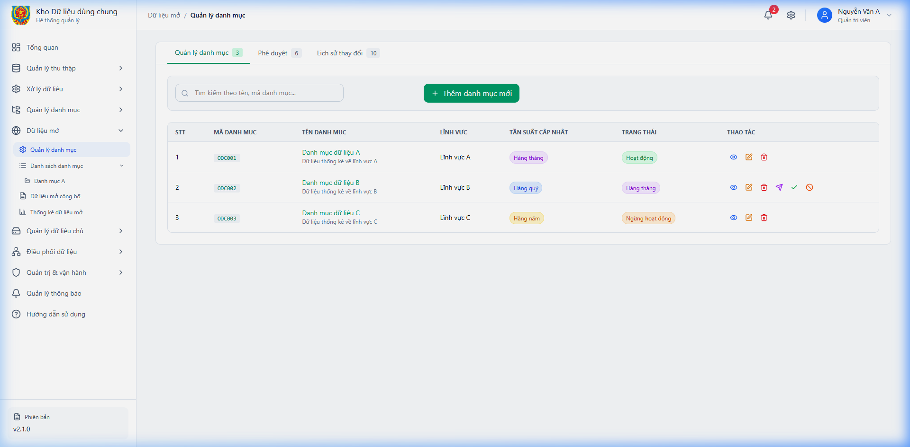

4.8.1.2.2.1 Mô tả thông tin trên màn hình
| **STT** | **Tên trường thông tin** | **Kiểu dữ liệu** | **Bắt buộc** | **Mặc định** | **Mô tả** |
| --- | --- | --- | --- | --- | --- |
| Tên danh mục | VARCHAR2(255) | - | - | Tên của bộ dữ liệu mở. |
| Lĩnh vực | VARCHAR2(100) | - | - | Phân loại chuyên mục dữ liệu (VD: Y tế, Giáo dục). |
| Đơn vị chủ quản | VARCHAR2(255) | - | - | Cơ quan chịu trách nhiệm xuất bản danh mục. |
| Người tạo | VARCHAR2(100) | - | - | Tài khoản soạn thảo hồ sơ mở. |
| Trạng thái | VARCHAR2(50) | - | - | Mới tạo, Chờ duyệt, Yêu cầu chỉnh sửa, Đã duyệt, Đã công bố. |
| Ngày cập nhật | DATE | - | - | Thời điểm lưu bản nháp cuối. |

4.8.1.2.2.2 Chức năng trên màn hình
|  |  |  |  |
| --- | --- | --- | --- |
| **STT** | **Tên chức năng** | **Định dạng** | **Mô tả** |
| 1 | CN01 | Button text | Mở popup để tạo mới một hồ sơ dữ liệu mở (MH01.P01a). |
| 2 | CN02 | Button icon | Mở popup cập nhật thông tin hồ sơ nháp (MH01.P01b). |
| 3 | CN03 | Button icon | Mở màn hình Tab Thiết lập cấu hình / Thuộc tính chờ phê duyệt (MH01.T02). |
| 4 | CN04 | Button icon | Xem lịch sử thay đổi phiên bản của bộ dữ liệu này (MH01.T03). |
| 5 | CN05 | Button icon | Mở popup xác nhận để loại bỏ, xóa hồ sơ (MH01.P02). |
| 6 | CN06 | Button icon | Mở popup xác nhận gửi phê duyệt lên cấp trên (MH01.P03). |

#### 4.8.1.2.3. MH01.T02 – Tab Phê duyệt danh mục (Trình duyệt)
Màn hình
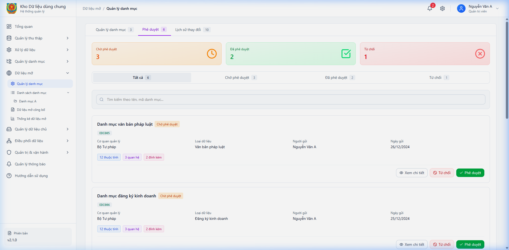

4.8.1.2.3.1 Mô tả thông tin trên màn hình
| **STT** | **Tên trường thông tin** | **Kiểu dữ liệu** | **Bắt buộc** | **Mặc định** | **Mô tả** |
| --- | --- | --- | --- | --- | --- |
| Danh sách trình duyệt| CLOB | - | - | Các luồng và cá nhân/thẩm quyền sẽ xét duyệt theo quy trình cấu hình. |
| Ghi chú trình duyệt | VARCHAR2(1000)| Không | - | Lý do xin phê duyệt hồ sơ Open Data. |
| Tài liệu đính kèm | BLOB | Không | - | Văn bản quyết định mở dữ liệu của cơ quan chuyên trách (Nếu có). |

4.8.1.2.3.2 Chức năng trên màn hình
|  |  |  |  |
| --- | --- | --- | --- |
| **STT** | **Tên chức năng** | **Định dạng** | **Mô tả** |
| 1 | CN01 | Button text | Chấp nhận trình phê duyệt. |
| 2 | CN02 | Button text | Thêm tài liệu tham chiếu trình ký. |

#### 4.8.1.2.4. MH01.T03 – Tab Lịch sử thay đổi
Màn hình
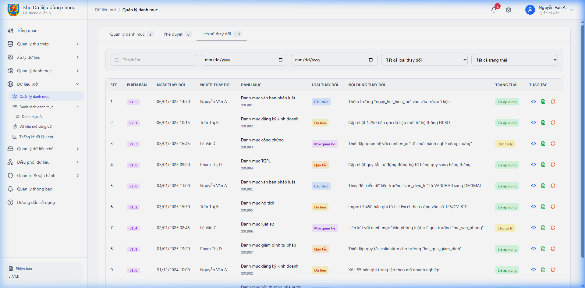

4.8.1.2.4.1 Mô tả thông tin trên màn hình
| **STT** | **Tên trường thông tin** | **Kiểu dữ liệu** | **Bắt buộc** | **Mặc định** | **Mô tả** |
| --- | --- | --- | --- | --- | --- |
| Thời gian | DATE | - | - | Cột mốc diễn ra hành động tác động tới hồ sơ. |
| Người thực hiện | VARCHAR2(255) | - | - | Tài khoản lưu vết thao tác. |
| Hành động | VARCHAR2(100) | - | - | Gửi duyệt, Hủy duyệt, Thay đổi cấu trúc, Cập nhật Data. |
| Chi tiết nội dung | VARCHAR2(1000)| - | - | Giải trình log công việc và khác biệt phiên bản. |

4.8.1.2.4.2 Chức năng trên màn hình
|  |  |  |  |
| --- | --- | --- | --- |
| **STT** | **Tên chức năng** | **Định dạng** | **Mô tả** |
| 1 | CN01 | Button text | Đóng màn hình Tab thống kê. |

#### 4.8.1.2.5. MH01.P01a – Thêm mới hồ sơ dữ liệu mở
Màn hình
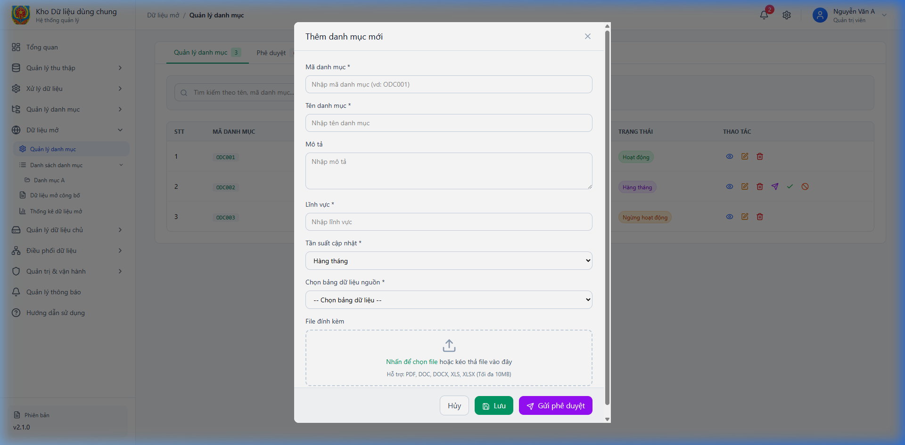

4.8.1.2.5.1 Mô tả thông tin trên màn hình
| **STT** | **Tên trường thông tin** | **Kiểu dữ liệu** | **Bắt buộc** | **Mặc định** | **Mô tả** |
| --- | --- | --- | --- | --- | --- |
| Mã danh mục | VARCHAR2(50) | Có | - | Mã định danh duy nhất của bộ Data. |
| Tên danh mục | VARCHAR2(255) | Có | - | Tên hiển thị công khai trên Portal. |
| Phạm vi chia sẻ | DROPDOWN | Có | Kho dữ liệu mở | Công khai hoàn toàn, Cần đăng ký, Chỉ nội bộ. |
| Lĩnh vực | DROPDOWN | Có | - | Chọn từ hộp từ điển danh mục quy chuẩn quốc gia. |
| Tần suất cập nhật | DROPDOWN | Có | Hàng tháng | Dữ liệu Real-time, Hàng ngày, Tuần, Tháng, Quý, Năm, Tĩnh. |
| Nguồn kết nối | DROPDOWN | Có | - | Lựa chọn từ Bảng dữ liệu chủ, CSDL dùng chung hoặc kho riêng. |
| Định dạng hỗ trợ | VARCHAR2(200) | Có | JSON, CSV | Cấp quyền loại file cho phép tải về. |
| Mô tả phân tích | VARCHAR2(2000)| Không | - | Thuyết minh dữ liệu mở cho trang giới thiệu Public. |

4.8.1.2.5.2 Chức năng trên màn hình
|  |  |  |  |
| --- | --- | --- | --- |
| **STT** | **Tên chức năng** | **Định dạng** | **Mô tả** |
| 1 | CN01 | Button text | Lưu tạo mới hồ sơ khởi tạo gốc. |
| 2 | CN02 | Button text | Đóng form thiết lập, quay ra ngoài. |

#### 4.8.1.2.6. MH01.P01b – Cập nhật hồ sơ dữ liệu mở
Màn hình
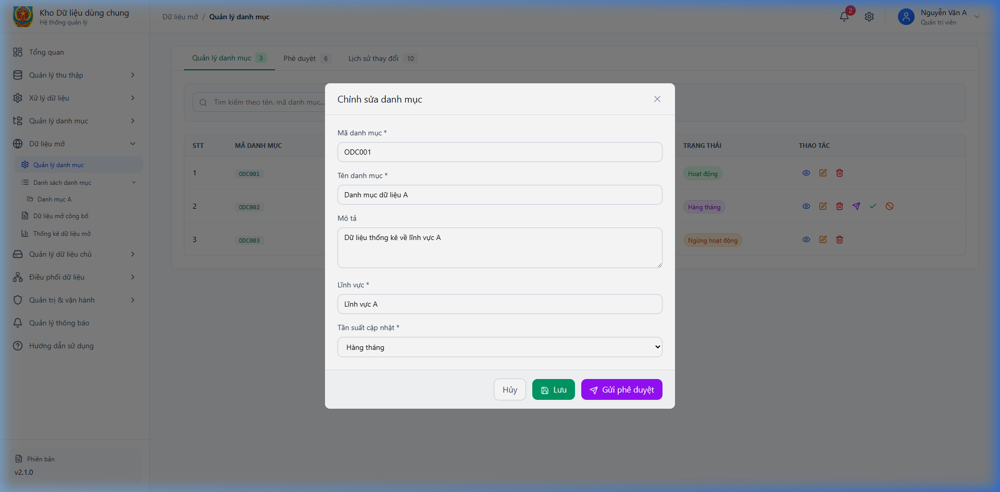

4.8.1.2.6.1 Mô tả thông tin trên màn hình
| **STT** | **Tên trường thông tin** | **Kiểu dữ liệu** | **Bắt buộc** | **Mặc định** | **Mô tả** |
| --- | --- | --- | --- | --- | --- |
| Mã danh mục (ID) | VARCHAR2(50) | Có | Đã có | Khóa không cho phép sửa mã định danh gốc. |
| Thông tin chung | CLOB | Có | Đã có | Toàn bộ các TextBox, Dropdown điền sẵn Data giống màn hình tạo mới. |
| Bảng Cấu hình Metadata| CLOB | Không | - | Danh sách cấu hình trường/Properties sẽ được xuất bản vào URL API nội dung. |
| Thẻ thông tin chia sẻ | VARCHAR2(500) | Không | - | Các tag chuyên đề Data (ví dụ: Địa chính, COVID, Dịch tễ). |

4.8.1.2.6.2 Chức năng trên màn hình
|  |  |  |  |
| --- | --- | --- | --- |
| **STT** | **Tên chức năng** | **Định dạng** | **Mô tả** |
| 1 | CN01 | Button text | Cập nhật hồ sơ để lưu đè thông tin mới. |
| 2 | CN02 | Button text | Hủy bỏ thay đổi của phiên bản nháp hiện hành. |

#### 4.8.1.2.7. MH01.P02 – Xác nhận xóa hồ sơ
- **Mã chức năng:** DC1-TQ-DB-001, DC1-TB-QT-001
- **Mã màn hình:** MH01.P02

Màn hình

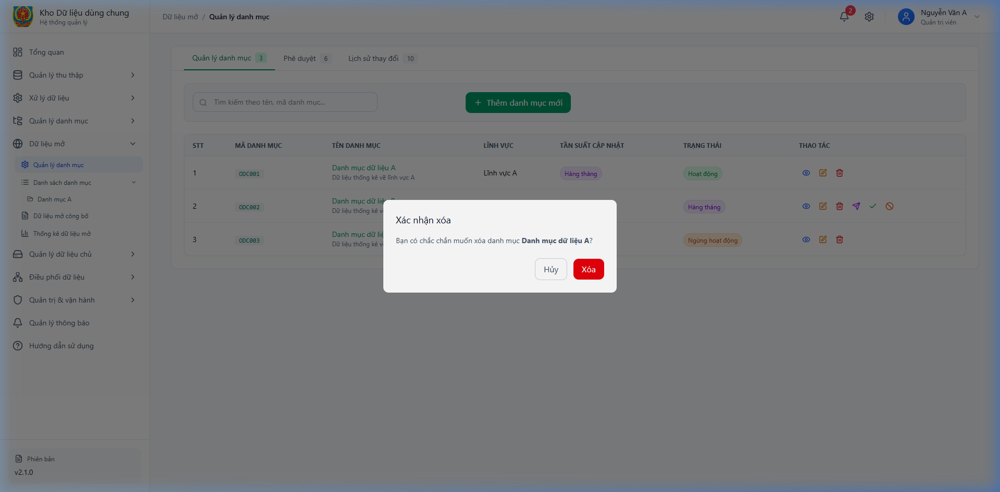

4.8.1.2.7.1 Mô tả thông tin trên màn hình
| **STT** | **Tên trường thông tin** | **Kiểu dữ liệu** | **Bắt buộc** | **Mặc định** | **Mô tả** |
| --- | --- | --- | --- | --- | --- |
| Câu hỏi Cảnh báo | VARCHAR2(500) | - | - | "Bạn có chắc chắn muốn xóa hồ sơ này? Hành động này sẽ gỡ bỏ các thiết lập chưa phê duyệt của bạn." |

4.8.1.2.7.2 Chức năng trên màn hình
|  |  |  |  |
| --- | --- | --- | --- |
| **STT** | **Tên chức năng** | **Định dạng** | **Mô tả** |
| 1 | CN01 | Button text | Xác thực quy trình gỡ bỏ hồ sơ ra khỏi máy chủ. |
| 2 | CN02 | Button text | Hủy thao tác xóa. |

#### 4.8.1.2.8. MH01.P03 – Xác nhận gửi phê duyệt
- **Mã chức năng:** DC1-TQ-DB-001
- **Mã màn hình:** MH01.P03

Màn hình

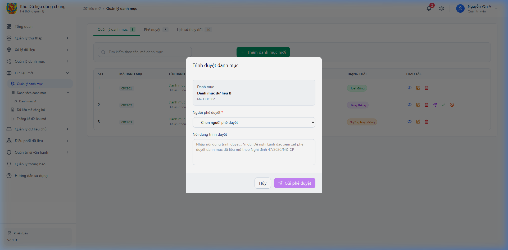

4.8.1.2.8.1 Mô tả thông tin trên màn hình
| **STT** | **Tên trường thông tin** | **Kiểu dữ liệu** | **Bắt buộc** | **Mặc định** | **Mô tả** |
| --- | --- | --- | --- | --- | --- |
| Thông báo chuyển luồng| VARCHAR2(500) | - | - | "Hồ sơ đã hoàn tất thiết lập chuẩn xác chưa? Nếu bạn đồng ý gửi, hệ thống sẽ tạm khóa quyền sửa đổi tới khi có kết quả duyệt." |

4.8.1.2.8.2 Chức năng trên màn hình
|  |  |  |  |
| --- | --- | --- | --- |
| **STT** | **Tên chức năng** | **Định dạng** | **Mô tả** |
| 1 | CN01 | Button text | Chuyển tiếp hồ sơ lên cấp ban bệ lãnh đạo. |
| 2 | CN02 | Button text | Suy nghĩ lại, Hủy bỏ quy trình. |

## 4.8.2. DC108.DLMO.PD – Phê duyệt và Công bố

### *4.8.2.1. Mục đích*
Chức năng này cho phép lãnh đạo có thẩm quyền xem xét và phê duyệt các hồ sơ dữ liệu mở đã được gửi lên, sau đó kiểm soát và công bố chính thức ra cổng thông tin Data Portal chuyên biệt phục vụ đại chúng.

*+ Phân quyền*
Lãnh đạo đơn vị có thẩm quyền Quản trị Dữ liệu / Cấp Cục, Vụ.

*+ Điều kiện thực hiện*
Có trạng thái hồ sơ gửi yêu cầu Trình từ phía chuyên viên lập danh mục Open Data.

### 4.8.2.2. DC1-TT-QT-001 – Giao diện Phê duyệt

#### 4.8.2.2.1. Mục đích
Cung cấp khu vực trang trung tâm (Dashboard) dành cho Ban Lãnh đạo thẩm định cấu trúc, nội dung và các tiêu chuẩn bảo mật trước khi cho phép dữ liệu nội bộ trở thành công khai Data Mở.

*+ Phân quyền*
Người dùng có Role Quyền quản lý hoặc Phê duyệt cấp trưởng đơn vị.

*+ Điều kiện thực hiện*
Truy cập vào ứng dụng Phê Duyệt trên thanh điều hướng.

#### 4.8.2.2.2. DC1-UC001-MH2 Màn hình giao diện Phê duyệt tổng quan
- **Mã chức năng:** DC1-TT-QT-001
- **Mã màn hình:** DC1-UC001-MH2

Màn hình

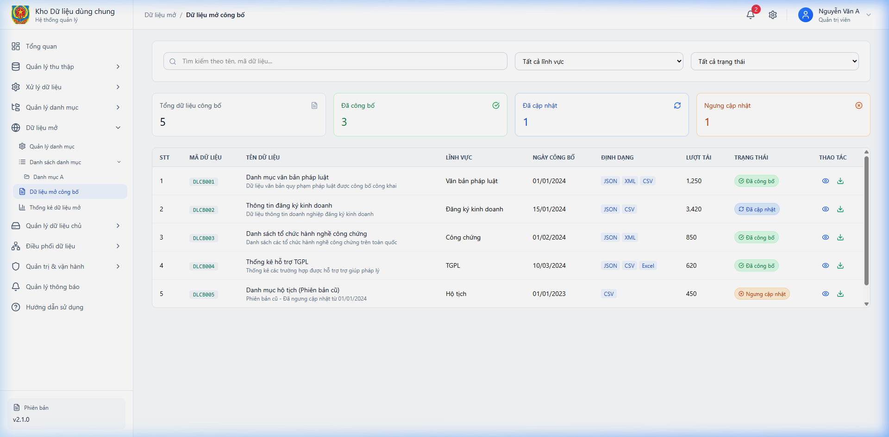

4.8.2.2.2.1 Mô tả thông tin trên màn hình
| **STT** | **Tên trường thông tin** | **Kiểu dữ liệu** | **Bắt buộc** | **Mặc định** | **Mô tả** |
| --- | --- | --- | --- | --- | --- |
| Bảng hồ sơ chờ duyệt | Table | - | - | Hiển thị các hồ sơ dữ liệu mở trạng thái "Chờ phê duyệt" (Tên biểu, Lĩnh vực, Chuyên viên cấp trình, Thời điểm nhận trình). |
| Data Quality Report | CLOB | - | - | Thang điểm chuẩn xác của Dữ liệu / Cảnh báo về tỷ lệ trường thông tin nhạy cảm. |
| Preview Schema Info | CLOB | - | - | Xem định dạng Layout hoặc Json Schema cấu trúc File xuất bản. |

4.8.2.2.2.2 Chức năng trên màn hình
|  |  |  |  |
| --- | --- | --- | --- |
| **STT** | **Tên chức năng** | **Định dạng** | **Mô tả** |
| 1 | CN01 | Button icon | Giải quyết từng hồ sơ (Xem thông tin đầy đủ). |
| 2 | CN02 | Button text | Duyệt nhanh hồ sơ (Hành động gán cờ `Approve`). |
| 3 | CN03 | Button text | Gọi chức năng Từ chối phê duyệt hồ sơ (Và gửi feedback qua MH02.P01). |
| 4 | CN04 | Button icon | Triển khai công bố API Data thực tế ra Portal ngoài (MH02.P02). |

#### 4.8.2.2.3. MH02.P01 – Chi tiết hồ sơ phê duyệt
Màn hình

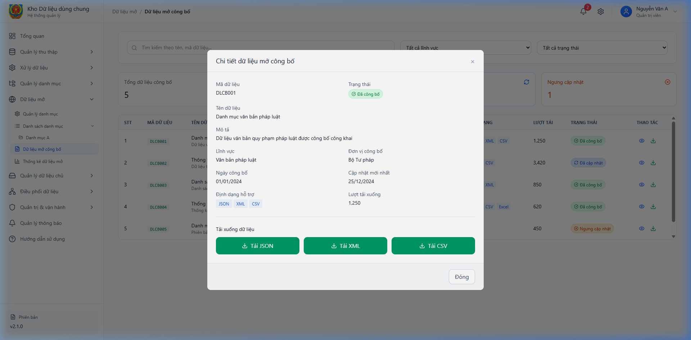

4.8.2.2.3.1 Mô tả thông tin trên màn hình
| **STT** | **Tên trường thông tin** | **Kiểu dữ liệu** | **Bắt buộc** | **Mặc định** | **Mô tả** |
| --- | --- | --- | --- | --- | --- |
| Thông tin chung | CLOB | - | - | Tên bộ hồ sơ, lĩnh vực, tần suất xuất bản, trạng thái duyệt. |
| Bảng Cấu hình Metadata| CLOB | - | - | Chi tiết các trường dữ liệu được cấp phép xuất bản ra ngoài. |
| Lịch sử cập nhật | CLOB | - | - | Quá trình biên soạn và trình ký của chuyên viên. |

4.8.2.2.3.2 Chức năng trên màn hình
|  |  |  |  |
| --- | --- | --- | --- |
| **STT** | **Tên chức năng** | **Định dạng** | **Mô tả** |
| 1 | CN01 | Button text | Chuyển trạng thái sang Phê Duyệt thành công. |
| 2 | CN02 | Button text | Mở form Từ chối phê duyệt (MH02.P02). |
| 3 | CN03 | Button text | Đóng màn hình chi tiết. |

#### 4.8.2.2.4. DC1-UC001-MH4 – Từ chối phê duyệt
- **Mã chức năng:** DC1-TT-QT-001
- **Mã màn hình:** DC1-UC001-MH4

Màn hình

*(Hình ảnh đang được cập nhật)*

4.8.2.2.4.1 Mô tả thông tin trên màn hình
| **STT** | **Tên trường thông tin** | **Kiểu dữ liệu** | **Bắt buộc** | **Mặc định** | **Mô tả** |
| --- | --- | --- | --- | --- | --- |
| Tên bộ hồ sơ trích yếu| VARCHAR2(255) | Tự động | - | (Read Only) Tên mô tả của Open Data. |
| Khung góp ý chỉnh sửa | CLOB | Có | - | Textarea nhập lý do vì sao chưa đạt chuẩn (Vướng nhạy cảm, Lộ bảo mật thông tin). |

4.8.2.2.4.2 Chức năng trên màn hình
|  |  |  |  |
| --- | --- | --- | --- |
| **STT** | **Tên chức năng** | **Định dạng** | **Mô tả** |
| 1 | CN01 | Button text | Gửi Phiếu Trả (Rollback về người dùng nhập) kèm theo Text hướng dẫn. |
| 2 | CN02 | Button text | Bỏ qua thao tác và Thoát. |

#### 4.8.2.2.5. DC1-UC001-MH3 – Công bố dữ liệu mở (Publishing)
- **Mã chức năng:** DC1-TT-QT-001
- **Mã màn hình:** DC1-UC001-MH3

##### Màn hình danh sách

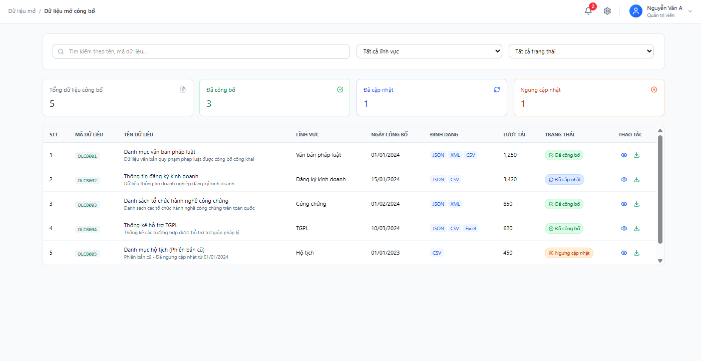

4.8.2.2.5.1 Mô tả thông tin trên màn hình
| **STT** | **Tên trường thông tin** | **Kiểu dữ liệu** | **Bắt buộc** | **Mặc định** | **Mô tả** |
| --- | --- | --- | --- | --- | --- |
| Dataset Name (Tên bản)| VARCHAR2(255) | Tự động | - | Đang công bố bộ dữ liệu đã phê duyệt hợp lệ. |
| Endpoint Platform | DROPDOWN | Có | Portal Tỉnh | Nơi nhận Request Data chia sẻ. |
| Thời điểm Live | DATE | Có | Thời gian thực| Cho phép Schedule lịch chia sẻ trên Portal Public tương lai. |
| Option API/Download | RADIO | Có | Hỗ trợ 2 kiểu| Cho phép User download Offline file CSV hoặc Link cấp JSON Developer. |
| Auto-generated URL | VARCHAR2(500) | Tự động | - | Đường dẫn Link Path sẽ được tạo (VD: /api/v1/opendata/health). |

4.8.2.2.5.2 Chức năng trên màn hình
|  |  |  |  |
| --- | --- | --- | --- |
| **STT** | **Tên chức năng** | **Định dạng** | **Mô tả** |
| 1 | CN01 | Button text | Commit Phát Hành trực tiếp Open Data. |
| 2 | CN02 | Button text | Action Thu Hồi/Tạm dừng phát (Pause Integration). |
| 3 | CN03 | Button text | Đóng màn hình cấu hình. |

##### Màn hình chi tiết

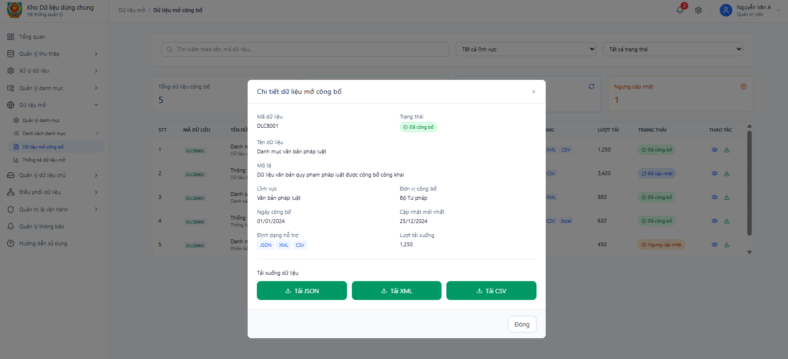

4.8.2.2.5.1 Mô tả thông tin trên màn hình
| **STT** | **Tên trường thông tin** | **Kiểu dữ liệu** | **Bắt buộc** | **Mặc định** | **Mô tả** |
| --- | --- | --- | --- | --- | --- |
| Mã dữ liệu | VARCHAR2(50) | - | - | Mã định danh của bộ dữ liệu đã công bố. |
| Trạng thái | VARCHAR2(50) | - | Đã công bố | Tag trạng thái hiển thị hiện tại của dữ liệu. |
| Tên dữ liệu | VARCHAR2(255) | - | - | Tên hiển thị đầy đủ của bộ dữ liệu (VD: Danh mục văn bản pháp luật). |
| Mô tả | VARCHAR2(1000) | - | - | Thuyết minh ngắn gọn nội dung và mục đích của bộ dữ liệu. |
| Lĩnh vực | VARCHAR2(100) | - | - | Nhóm chuyên ngành phân loại dữ liệu (VD: Văn bản pháp luật). |
| Đơn vị công bố | VARCHAR2(255) | - | - | Cơ quan chịu trách nhiệm cung cấp và duy trì bộ dữ liệu. |
| Ngày công bố | DATE | - | - | Thời điểm dữ liệu chính thức được public lần đầu. |
| Cập nhật mới nhất| DATE | - | - | Thời điểm bản ghi được thiết lập hoặc làm mới gần đây nhất. |
| Định dạng hỗ trợ | VARCHAR2(200) | - | JSON, XML, CSV | Các định dạng file khả dụng cho phép hệ thống bên ngoài tải về. |
| Lượt tải xuống | NUMBER | - | - | Bộ đếm tổng số lần dữ liệu này được người dùng tải về. |

4.8.2.2.5.2 Chức năng trên màn hình
|  |  |  |  |
| --- | --- | --- | --- |
| **STT** | **Tên chức năng** | **Định dạng** | **Mô tả** |
| 1 | CN01 | Button text | Tải xuống toàn bộ dữ liệu dưới cấu trúc JSON. |
| 2 | CN02 | Button text | Tải xuống định dạng XML. |
| 3 | CN03 | Button text | Tải file trích xuất Excel CSV. |
| 4 | CN04 | Button text | Đóng màn hình chi tiết, quay lại lưới danh sách. |

## 4.8.3. DC108.DLMO.BC – Báo cáo và Thống kê

### *4.8.3.1. Mục đích*
Trực quan hóa và đo lường cường độ khai thác thị trường, hiệu suất sử dụng của các kênh Dữ liệu mở, giúp Lãnh đạo đánh giá giá trị và nhu cầu thực tiễn của công chúng/doanh nghiệp đối với CSDL từ đó tái định ra các bộ open data tiếp theo.

*+ Phân quyền*
Tất cả quyền Lãnh đạo cấp ban điều phối dự án / Quản trị hệ thống.

*+ Điều kiện thực hiện*
Log Audit và Api Gateway Open Data đã vận hành và có ghi nhận kết quả lưu lượng (Requests/sec, Downloader count).

### 4.8.3.2. DC1-TT-QT-002 – Giao diện Thống kê báo cáo Open Data

#### 4.8.3.2.1. Mục đích
Giao diện trung tâm phân bổ các loại phân tích biểu đồ liên quan tới sự phát triển và chia sẻ dữ liệu phục vụ báo cáo Chính Phủ Điện Tử và Đô thị thông minh.

*+ Phân quyền*
Ban Lãnh đạo, Trung tâm IT.

*+ Điều kiện thực hiện*
Truy cập qua Module Report Data.

#### 4.8.3.2.2. DC1-UC002-MH1 Màn hình Dashboard Báo cáo chính
- **Mã chức năng:** DC1-TT-QT-002
- **Mã màn hình:** DC1-UC002-MH1, DC1-UC002-MH3, DC1-UC002-MH5

Màn hình
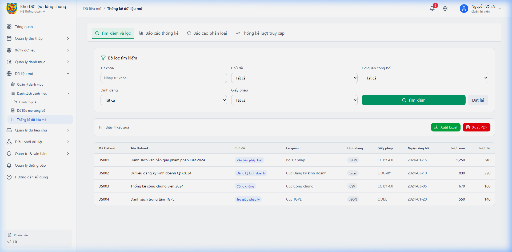

4.8.3.2.2.1 Mô tả thông tin trên màn hình
| **STT** | **Tên trường thông tin** | **Kiểu dữ liệu** | **Bắt buộc** | **Mặc định** | **Mô tả** |
| --- | --- | --- | --- | --- | --- |
| Chỉ mục tĩnh (Card) | NUMERIC | - | - | Hiển thị: Tổng số Danh mục, Tổng lượt API Consume. |
| Trend (Hot List) | CLOB | - | - | Bảng danh mục top Dataset đang được người dân tải/dùng nhiều nhất. |
| Switch Tab Controller | - | - | - | Thanh nút chuyển qua các góc nhìn sâu sắc nghiệp vụ (T01, T02, T03). |

4.8.3.2.2.2 Chức năng trên màn hình
|  |  |  |  |
| --- | --- | --- | --- |
| **STT** | **Tên chức năng** | **Định dạng** | **Mô tả** |
| 1 | CN01 | Nav Tab | Chuyển View xem Thống kê mức tăng trưởng nguồn dữ liệu tải lên (T01). |
| 2 | CN02 | Nav Tab | Chuyển cấu hình báo cáo phân loại theo Sở ngành Cung Cấp (T02). |
| 3 | CN03 | Nav Tab | Chuyển xem Traffic Tracking thời gian thực (T03). |
| 4 | CN04 | Button text | Print nguyên trang Dashboard Overview ra PDF / HTML. |

#### 4.8.3.2.3. MH03.T01 – Tab Báo cáo tăng trưởng
Màn hình
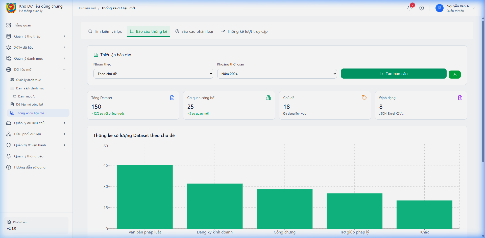

4.8.3.2.3.1 Mô tả thông tin trên màn hình
| **STT** | **Tên trường thông tin** | **Kiểu dữ liệu** | **Bắt buộc** | **Mặc định** | **Mô tả** |
| --- | --- | --- | --- | --- | --- |
| Line Chart Tăng Trưởng | CLOB | - | - | Đồ thị đường Line mô tả sự bổ sung dữ liệu mới mỗi tháng (Tính lũy kế Data size). |

4.8.3.2.3.2 Chức năng trên màn hình
|  |  |  |  |
| --- | --- | --- | --- |
| **STT** | **Tên chức năng** | **Định dạng** | **Mô tả** |
| 1 | CN01 | Custom Filter | Lọc khoảng thời gian (Từ lúc khởi tạo Hệ thống .. đến Nay). |
| 2 | CN02 | Tải Data Raw | Export các mốc Data Raw Line Chart thành định dạng CSV (phục vụ PowerBI). |

#### 4.8.3.2.4. MH03.T02 – Tab Báo cáo phân loại đơn vị
Màn hình
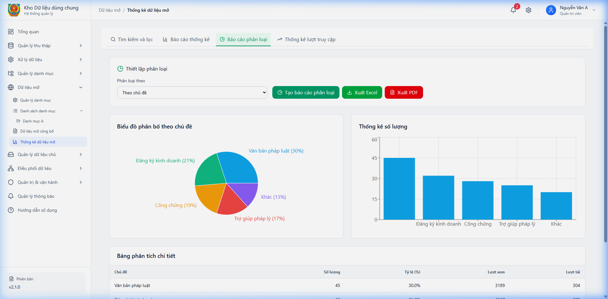

4.8.3.2.4.1 Mô tả thông tin trên màn hình
| **STT** | **Tên trường thông tin** | **Kiểu dữ liệu** | **Bắt buộc** | **Mặc định** | **Mô tả** |
| --- | --- | --- | --- | --- | --- |
| Đồ thị phân mảnh (Pie)| CLOB | - | - | Chia phần bánh Tỷ trọng Lĩnh vực Data (Y tế, Kinh tế, Văn hóa). |
| Đồ thị ngang (Bar) | CLOB | - | - | Bảng xếp hạng nỗ lực của các Đơn Vị đóng góp Open Data. |

4.8.3.2.4.2 Chức năng trên màn hình
|  |  |  |  |
| --- | --- | --- | --- |
| **STT** | **Tên chức năng** | **Định dạng** | **Mô tả** |
| 1 | CN01 | Lọc hạng mục | Có quyền tra Top 10 hoặc đánh trọng số ngành. |
| 2 | CN02 | Tải hình ảnh | Tải ảnh Pie/Bar chất lượng cao dùng trong file Thuyết minh/Báo cáo tháng. |

#### 4.8.3.2.5. MH03.T03 – Tab Thống kê lượt truy cập
Màn hình
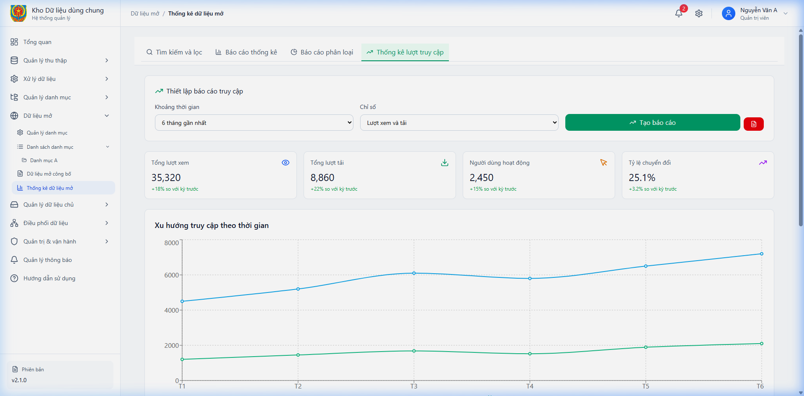

4.8.3.2.5.1 Mô tả thông tin trên màn hình
| **STT** | **Tên trường thông tin** | **Kiểu dữ liệu** | **Bắt buộc** | **Mặc định** | **Mô tả** |
| --- | --- | --- | --- | --- | --- |
| Biểu đồ truy cập kép | CLOB | - | - | So sánh tương quan Hits (Lượt xem) v.s Downloads (Lượt xuất file thực tế) theo Ngày/Giờ. |
| Log Table Clients | CLOB | - | - | Lưới danh sách IP truy vấn và thông số User Agent / Vùng địa chỉ chọc vào Request Gateway. |

4.8.3.2.5.2 Chức năng trên màn hình
|  |  |  |  |
| --- | --- | --- | --- |
| **STT** | **Tên chức năng** | **Định dạng** | **Mô tả** |
| 1 | CN01 | Focus View | Filter sâu chỉ lọc duy nhất 1 Bộ Open Data nổi bật thay vì xem theo Tổng Đài. |
| 2 | CN02 | Trích Audit Log| Sao lưu nhật ký API Hit-rate làm bằng chứng thanh tra (Compliance Auditing). |

# 4.6. DC106.QLDLC_Điều phối dữ liệu (Data Orchestration/API)

## 4.6.1. DC106.QLDLC.TC – Quản lý API cung cấp dữ liệu

### *4.6.1.1. Mục đích*
Quản lý tập trung việc cung cấp, điều phối và chia sẻ dữ liệu thông qua các giao diện lập trình ứng dụng (API), nhằm đảm bảo an toàn, bảo mật, hiệu năng và khả năng kiểm soát toàn bộ luồng dữ liệu trao đổi.

### 4.6.1.2. DC1-TQ-DB-001 – Giao diện Quản lý API

#### 4.6.1.2.1. MH01 Màn hình quản lý API
- **Mã chức năng:** DC1-TQ-DB-001, DC1-TB-QT-001
- **Mã màn hình:** MH01

Màn hình

*Hình 1 – Màn hình giao diện quản lý API*

4.6.1.2.1.1 Mô tả thông tin trên màn hình

**A. Nhóm Tab chức năng**
| Tab | Mô tả |
| :--- | :--- |
| Quản lý API | Hiển thị danh sách toàn bộ các API đã cấu hình trong hệ thống. |
| Giám sát | Chuyển sang Dashboard theo dõi hiệu năng, trạng thái API sống/chết, nhật ký giao dịch. |
| Lịch sử | Xem các thay đổi cấu hình và hoạt động trong quá khứ. |

**B. Các chỉ số thống kê cơ bản (Stats)**
| **STT** | **Tên trường thông tin** | **Kiểu dữ liệu** | **Bắt buộc** | **Mặc định** | **Mô tả** |
| --- | --- | --- | --- | --- | --- |
| Tổng API | NUMBER | - | - | Tổng số API hỏ thống đang quản lý. |
| Đang hoạt động | NUMBER | - | - | Số API đang ở trạng thái Active (sống). |
| Tổng request hôm nay | NUMBER | - | - | Tổng lượt gọi API trong ngày.  |
| Tỉ lệ lỗi | NUMBER(5,2) | - | - | Phần trăm request thất bại so với tổng request. |

**C. Danh sách API (Data Table)**
| **STT** | **Tên trường thông tin** | **Kiểu dữ liệu** | **Bắt buộc** | **Mặc định** | **Mô tả** |
| --- | --- | --- | --- | --- | --- |
| Tên API | VARCHAR2(255) | - | - | Tên định danh của dịch vụ API. |
| Endpoint | VARCHAR2(500) | - | - | Địa chỉ URL được cấu hình cho API. |
| Phương thức | VARCHAR2(10) | - | - | HTTP Method: GET, POST, PUT, DELETE. |
| Trạng thái | VARCHAR2(20) | - | - | Active (hoạt động) hoặc Inactive (tạm dừng). |
| Lượt gọi hôm nay | NUMBER | - | - | Số request đã thực hiện trong ngày hiện tại. |

4.6.1.2.1.2 Chức năng trên màn hình
|  |  |  |  |
| --- | --- | --- | --- |
| **STT** | **Tên chức năng** | **Định dạng** | **Mô tả** |
| 1 | CN01 | Button text | Mở popup để tạo mới/cập nhật một cấu hình API (MH01.P01). |
| 2 | CN02 | Search input | Tìm kiếm nhanh API theo tên, mã hoặc endpoint. |
| 3 | CN03 | Button text | Xuất danh sách API hiện tại ra các định dạng file (Excel, JSON, CSV, XML). |
| 4 | CN04 | Button icon | Mở popup xem toàn bộ thông tin cấu hình chi tiết của API (MH01.P01). |
| 5 | CN06 | Button icon | Chuyển đến màn hình giám sát, hiển thị biểu đồ và nhật ký riêng của API đó (MH02). |
| 6 | CN07 | Button icon | Mở công cụ kiểm thử API (API tester) để thực thi API trực tuyến (MH01.P02). |

#### 4.6.1.2.2. MH01.P01 – Cấu hình API
- **Mã chức năng:** DC1-TQ-DB-001, DC1-TB-QT-001
- **Mã màn hình:** MH01.P01

Màn hình

*Hình 3 – Màn hình Cấu hình API*

4.6.1.2.2.1 Mô tả thông tin trên màn hình
| **STT** | **Tên trường thông tin** | **Kiểu dữ liệu** | **Bắt buộc** | **Mặc định** | **Mô tả** |
| --- | --- | --- | --- | --- | --- |
| Security | CLOB | - | - | Tab cấu hình bảo mật: Quản lý API Key, danh sách IP được phép (Whitelist). |
| Rate Limiting | CLOB | - | - | Tab cấu hình giới hạn: Số request mỗi phút/giờ/ngày/tháng. |
| Endpoint | CLOB | - | - | Tab cấu hình kỹ thuật: URL, Method, Timeout, Content-Type. |

4.6.1.2.2.2 Chức năng trên màn hình
|  |  |  |  |
| --- | --- | --- | --- |
| **STT** | **Tên chức năng** | **Định dạng** | **Mô tả** |
| 1 | CN01 | Button text | Ghi nhận và lưu lại cấu hình API. |
| 2 | CN02 | Button text | Đóng Popup mà không lưu thay đổi. |

#### 4.6.1.2.3. MH01.P02 – Kiểm tra API
- **Mã chức năng:** DC1-TQ-DB-001, DC1-TB-QT-001
- **Mã màn hình:** MH01.P02

Màn hình

*Hình 4 – Màn hình thử nghiệm API*

4.6.1.2.3.1 Mô tả thông tin trên màn hình
| **STT** | **Tên trường thông tin** | **Kiểu dữ liệu** | **Bắt buộc** | **Mặc định** | **Mô tả** |
| --- | --- | --- | --- | --- | --- |
| Request | CLOB | - | - | Khu vực để người dùng nhập các thông tin của yêu cầu: URL, Header, Params, Body. |
| Response | CLOB | - | - | Khu vực hiển thị kết quả trả về từ API: Status code, Header và Body. |

4.6.1.2.3.2 Chức năng trên màn hình
|  |  |  |  |
| --- | --- | --- | --- |
| **STT** | **Tên chức năng** | **Định dạng** | **Mô tả** |
| 1 | CN01 | Button text | Gửi yêu cầu (Request) đến API endpoint đã nhập. |
| 2 | CN02 | Button text | Xóa toàn bộ dữ liệu đã nhập trong khu vực Request. |

## 4.6.2. DC106.QLDLC.GS – Giám sát và Nhật ký vận hành

### *4.6.2.1. Mục đích*
Theo dõi hiệu năng hệ thống, tình trạng của các API, và ghi nhận nhật ký vận hành để phân tích, xử lý sự cố và đảm bảo tính sẵn sàng, ổn định của toàn bộ hệ thống chia sẻ dữ liệu.

### 4.6.2.2. DC1-TT-QT-001 – Dashboard Giám sát (Monitoring)

#### 4.6.2.2.1. DC1-UC001-MH2 Màn hình Dashboard Giám sát (Monitoring)
- **Mã chức năng:** DC1-TT-QT-001
- **Mã màn hình:** DC1-UC001-MH2

Màn hình

*Hình 2 – Màn hình Dashboard Giám sát (Monitoring)*

4.6.2.2.1.1 Mô tả thông tin trên màn hình
| **STT** | **Tên trường thông tin** | **Kiểu dữ liệu** | **Bắt buộc** | **Mặc định** | **Mô tả** |
| --- | --- | --- | --- | --- | --- |
| Biểu đồ hiệu năng | CHART | - | - | Đồ thị thể hiện lượng request, thời gian phản hồi (Latency) và tỉ lệ lỗi theo thời gian thực hoặc theo khung giờ. |
| Trạng thái API | TABLE | - | - | Bảng hiển thị tình trạng từng API (đang sống/chết), thời điểm kiểm tra gần nhất. |
| Nhật ký giao dịch | CLOB | - | - | Ghi chép chi tiết các request gần đây: Thời gian, IP, Tên API, Status code (200, 401, 500...). |

4.6.2.2.1.2 Chức năng trên màn hình
|  |  |  |  |
| --- | --- | --- | --- |
| **STT** | **Tên chức năng** | **Định dạng** | **Mô tả** |
| 1 | CN01 | DROPDOWN | Chọn khoảng thời gian xem dữ liệu: 1 giờ, 24 giờ, 7 ngày, 30 ngày. |
| 2 | CN02 | Button text | Làm mới dữ liệu Dashboard để cập nhật thông tin mới nhất. |
| 3 | CN03 | Button text | Xuất báo cáo nhật ký và hiệu năng ra file Excel hoặc CSV. |

## 4.6.3. Luồng dữ liệu (Data Flow)

### *4.6.3.1. Sơ đồ luồng dữ liệu tổng quát*

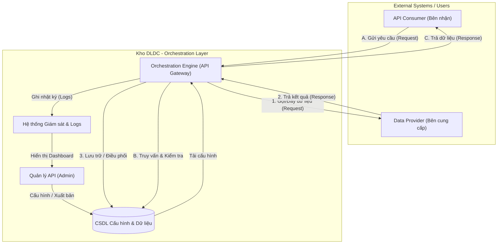
```mermaid
graph TD
    subgraph "External Systems / Users"
        Consumer["API Consumer (Bên nhận)"]
        Provider["Data Provider (Bên cung cấp)"]
    end

    subgraph "Kho DLDC - Orchestration Layer"
        Manager["Quản lý API (Admin)"]
        Engine["Orchestration Engine (API Gateway)"]
        Monitor["Hệ thống Giám sát & Logs"]
        DB[("CSDL Cấu hình & Dữ liệu")]
    end

    %% Luồng quản trị
    Manager -- "Cấu hình / Xuất bản" --> DB
    DB -- "Tải cấu hình" --> Engine

    %% Luồng API Chủ động
    Engine -- "1. Gọi/Đẩy dữ liệu (Request)" --> Provider
    Provider -- "2. Trả kết quả (Response)" --> Engine
    Engine -- "3. Lưu trữ / Điều phối" --> DB

    %% Luồng API Thụ động
    Consumer -- "A. Gửi yêu cầu (Request)" --> Engine
    Engine -- "B. Truy vấn & Kiểm tra" --> DB
    Engine -- "C. Trả dữ liệu (Response)" --> Consumer

    %% Luồng giám sát
    Engine -- "Ghi nhật ký (Logs)" --> Monitor
    Monitor -- "Hiển thị Dashboard" --> Manager
```

### *4.6.3.2. Chi tiết các luồng dữ liệu*

| Loại luồng | Thành phần tham gia | Mô tả chi tiết |
| :--- | :--- | :--- |
| **Luồng quản trị (Management)** | Cán bộ quản trị, CSDL cấu hình | Cán bộ quản trị thiết lập thông tin Endpoint, Phương thức, Bảo mật (API Key) và Trạng thái hoạt động của từng API. Các cấu hình này được lưu vào CSDL. |
| **Luồng API Chủ động (Active)** | Kho DLDC, Hệ thống nguồn | Hệ thống chủ động kích hoạt các yêu cầu lấy dữ liệu từ các CSDL chuyên ngành (Hộ tịch, ĐKKD...) theo lịch trình định kỳ hoặc theo sự kiện. |
| **Luồng API Thụ động (Passive)** | Bên ngoài, API Gateway | Hệ thống tiếp nhận yêu cầu từ các hệ thống bên ngoài (Cổng DVC, các Bộ/Ngành). Gateway thực hiện xác thực, kiểm soát lưu lượng (Rate Limit) trước khi trả dữ liệu. |
| **Luồng Giám sát (Monitoring)** | API Gateway, Log Collector, UI | Mọi giao dịch qua API đều được ghi vết (IP, User, Thời gian, Trạng thái). Dữ liệu log này được tổng hợp lên Dashboard để theo dõi hiệu năng và phát hiện lỗi. |

# 4.8. DC108.QLCC_Quản lý cung cấp dữ liệu

## 4.8.1. DC108.QLCC.CC – Cung cấp dữ liệu dùng chung (Shared Data Provision)

### *4.8.1.1. Mục đích*
Quản lý việc cấp quyền truy cập các gói dữ liệu dùng chung cho các tổ chức, đơn vị trong và ngoài ngành, đảm bảo dữ liệu được chia sẻ đúng mục đích, có kiểm soát và an toàn.

### 4.8.1.2. DC1-TQ-DB-001 – Cung cấp dữ liệu dùng chung

#### 4.8.1.2.1. MH01 Màn hình cung cấp dữ liệu dùng chung
- **Mã chức năng:** DC1-TQ-DB-001, DC1-TB-QT-001
- **Mã màn hình:** MH01

Màn hình

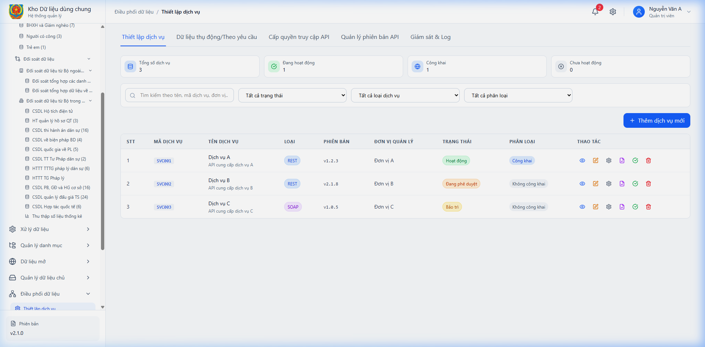

*Hình 1 – Màn hình cung cấp dữ liệu dùng chung*

4.8.1.2.1.1 Mô tả thông tin trên màn hình
| **STT** | **Tên trường thông tin** | **Kiểu dữ liệu** | **Bắt buộc** | **Mặc định** | **Mô tả** |
| --- | --- | --- | --- | --- | --- |
| Danh sách cung cấp | CLOB | - | - | Danh sách các cấu hình cấp quyền truy cập dữ liệu đã được thiết lập. |

4.8.1.2.1.2 Chức năng trên màn hình
|  |  |  |  |
| --- | --- | --- | --- |
| **STT** | **Tên chức năng** | **Định dạng** | **Mô tả** |
| 1 | CN01 | Button text | Mở popup thêm mới quyền truy cập cho một đơn vị (MH01.P01). |
| 2 | CN02 | Button icon | Mở popup xem chi tiết cấu hình quyền đã cấp (MH01.P02). |
| 3 | CN03 | Button icon | Mở popup phê duyệt yêu cầu (MH01.P03). |
| 4 | CN04 | Button icon | Mở popup xác nhận hủy bỏ quyền truy cập (MH01.P04). |

#### 4.8.1.2.2. MH01.P01a – Thêm mới cấu hình quyền truy cập
Màn hình

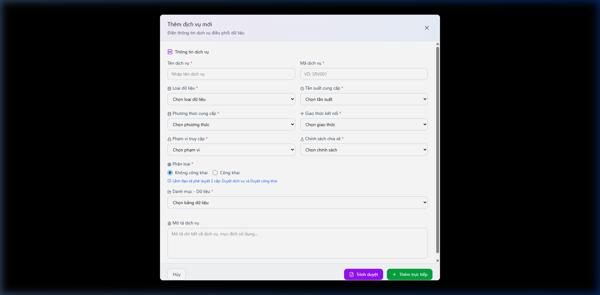

4.8.1.2.2.1 Mô tả thông tin trên màn hình
| **STT** | **Tên trường thông tin** | **Kiểu dữ liệu** | **Bắt buộc** | **Mặc định** | **Mô tả** |
| --- | --- | --- | --- | --- | --- |
| Tổ chức | VARCHAR2(255) | Có | - | Tên đơn vị yêu cầu truy cập. |
| Loại tổ chức | VARCHAR2(50) | Có | - | Phân loại: Bộ/Ngành, Địa phương, Bên ngoài. |
| Gói dữ liệu | VARCHAR2(255) | Có | - | Chọn gói dữ liệu từ danh sách các gói đã được định nghĩa. |
| Mức độ truy cập | VARCHAR2(50) | Có | - | Các mức độ: Đọc, Ghi, Toàn quyền. |
| Giới hạn bản ghi | NUMBER | Không | - | Số lượng bản ghi tối đa được phép truy cập trong một khoảng thời gian. |
| Mục đích | VARCHAR2(1000) | Không | - | Ghi rõ lý do hoặc văn bản căn cứ để cấp quyền. |
| Ngày hết hạn | DATE | Không | - | Thời điểm quyền truy cập tự động hết hiệu lực. |

4.8.1.2.2.2 Chức năng trên màn hình
|  |  |  |  |
| --- | --- | --- | --- |
| **STT** | **Tên chức năng** | **Định dạng** | **Mô tả** |
| 1 | CN01 | Button text | Lưu thông tin cấu hình quyền truy cập mới, chuyển trạng thái thành "Chờ duyệt". |
| 2 | CN02 | Button text | Hủy thao tác và đóng popup. |

#### 4.8.1.2.3. MH01.P01b – Chỉnh sửa cấu hình quyền truy cập
Màn hình

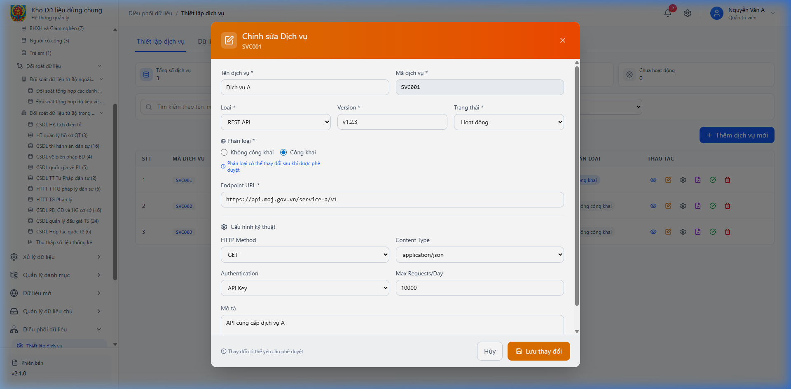

4.8.1.2.3.1 Mô tả thông tin trên màn hình
| **STT** | **Tên trường thông tin** | **Kiểu dữ liệu** | **Bắt buộc** | **Mặc định** | **Mô tả** |
| --- | --- | --- | --- | --- | --- |
| Tổ chức | VARCHAR2(255) | Có | - | Cập nhật tên đơn vị. |
| Gói dữ liệu | VARCHAR2(255) | Có | - | Cập nhật gói dữ liệu. |
| Mức độ truy cập | VARCHAR2(50) | Có | - | Cập nhật mức độ. |
| Mục đích | VARCHAR2(1000) | Không | - | Cập nhật lý do. |

4.8.1.2.3.2 Chức năng trên màn hình
|  |  |  |  |
| --- | --- | --- | --- |
| **STT** | **Tên chức năng** | **Định dạng** | **Mô tả** |
| 1 | CN01 | Button text | Cập nhật thay đổi. |
| 2 | CN02 | Button text | Hủy thao tác. |

#### 4.8.1.2.3. MH01.P02 – Chi tiết cấu hình quyền truy cập
- **Mã chức năng:** DC1-TQ-DB-001, DC1-TB-QT-001
- **Mã màn hình:** MH01.P02

Màn hình

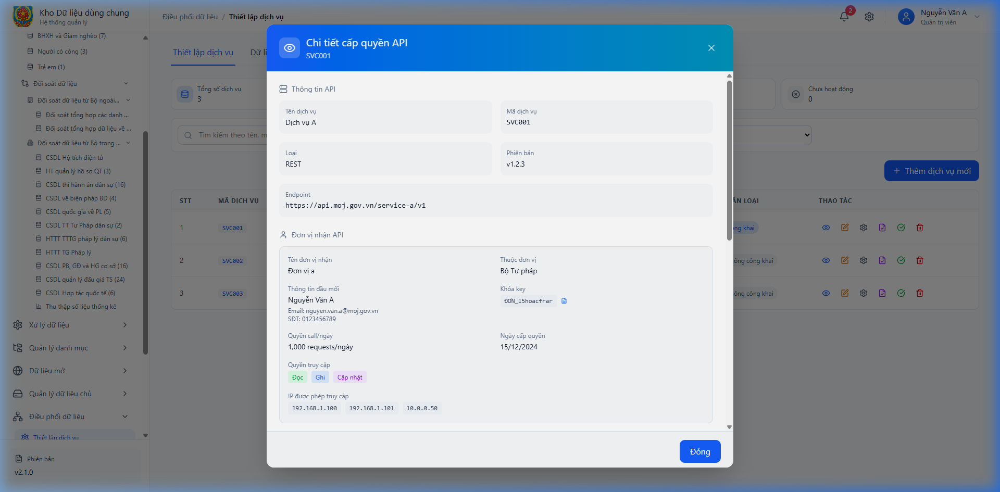

*Hình 3 – Màn hình chi tiết cấu hình quyền truy cập*

4.8.1.2.3.1 Mô tả thông tin trên màn hình
| **STT** | **Tên trường thông tin** | **Kiểu dữ liệu** | **Bắt buộc** | **Mặc định** | **Mô tả** |
| --- | --- | --- | --- | --- | --- |
| Mã quyền | VARCHAR2(50) | - | - | Mã định danh duy nhất của quyền truy cập (VD: PERM_2024_001). |
| Tổ chức | VARCHAR2(255) | - | - | Hiển thị tên và phân loại tổ chức. |
| Gói dữ liệu | VARCHAR2(255) | - | - | Tên gói dữ liệu đã được cấp. |
| Trạng thái | VARCHAR2(50) | - | - | Các trạng thái: Hoạt động, Chờ duyệt, Hết hạn, Thu hồi. |
| Lượt sử dụng | NUMBER | - | - | Số lượng bản ghi đã được truy cập thực tế. |
| Tiến độ | NUMBER(3,2) | - | - | Tỷ lệ phần trăm lượt sử dụng so với giới hạn bản ghi đã cấp. |

4.8.1.2.3.2 Chức năng trên màn hình
|  |  |  |  |
| --- | --- | --- | --- |
| **STT** | **Tên chức năng** | **Định dạng** | **Mô tả** |
| 1 | CN01 | Button text | Đóng popup chi tiết. |

#### 4.8.1.2.4. MH01.P03 – Phê duyệt yêu cầu
- **Mã chức năng:** DC1-TQ-DB-001
- **Mã màn hình:** MH01.P03

Màn hình

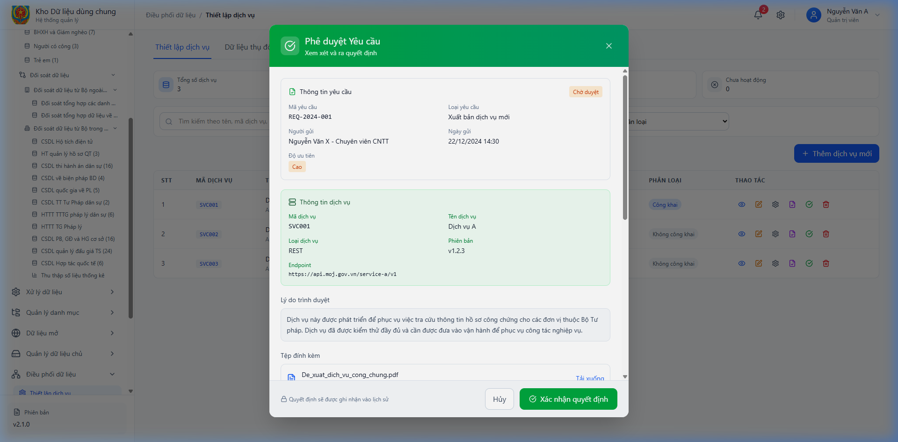

*Hình 7 – Màn hình phê duyệt yêu cầu cung cấp dữ liệu*

4.8.1.2.4.1 Mô tả thông tin trên màn hình
| **STT** | **Tên trường thông tin** | **Kiểu dữ liệu** | **Bắt buộc** | **Mặc định** | **Mô tả** |
| --- | --- | --- | --- | --- | --- |
| Thông tin yêu cầu | CLOB | - | - | Hiển thị chi tiết đơn vị, gói dữ liệu và mục đích yêu cầu. |
| Ý kiến phê duyệt | CLOB | Không | - | Nhập ghi chú hoặc ý kiến của người duyệt. |

4.8.1.2.4.2 Chức năng trên màn hình
|  |  |  |  |
| --- | --- | --- | --- |
| **STT** | **Tên chức năng** | **Định dạng** | **Mô tả** |
| 1 | CN01 | Button text | Phê duyệt yêu cầu, cấp quyền truy cập chính thức. |
| 2 | CN02 | Button text | Từ chối yêu cầu và yêu cầu bổ sung thông tin nếu cần. |
| 3 | CN03 | Button text | Đóng popup. |

#### 4.8.1.2.5. MH01.P04 – Xác nhận hủy quyền truy cập
Màn hình

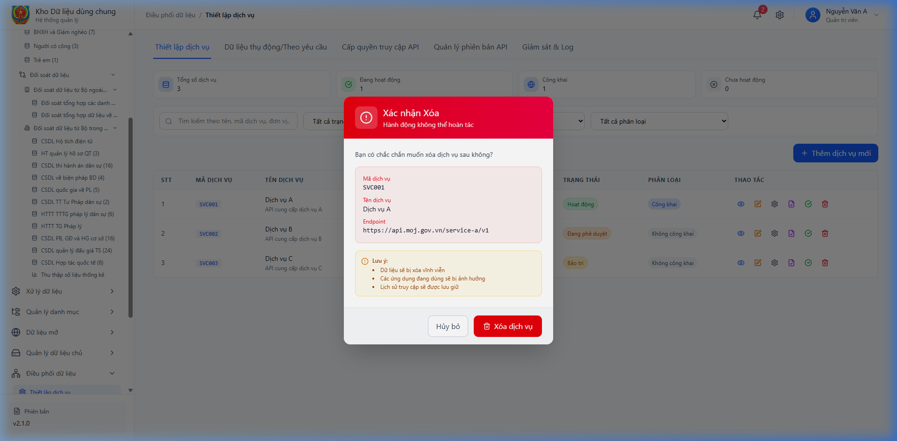

*Hình 8 – Popup xác nhận hủy bỏ quyền truy cập dữ liệu*

4.8.1.2.5.1 Mô tả thông tin trên màn hình
| **STT** | **Tên trường thông tin** | **Kiểu dữ liệu** | **Bắt buộc** | **Mặc định** | **Mô tả** |
| --- | --- | --- | --- | --- | --- |
| Cảnh báo | VARCHAR2(500) | - | - | "Bạn có chắc chắn muốn hủy quyền truy cập này không? Hành động này không thể hoàn tác." |

4.8.1.2.5.2 Chức năng trên màn hình
|  |  |  |  |
| --- | --- | --- | --- |
| **STT** | **Tên chức năng** | **Định dạng** | **Mô tả** |
| 1 | CN01 | Button text | Xác nhận thực hiện hủy quyền. |
| 2 | CN02 | Button text | Hủy thao tác và quay lại màn hình chính. |

## 4.8.2. DC108.QLCC.DC – Cung cấp danh mục (Catalog Provision)

### *4.8.2.1. Mục đích*
Thiết lập và quản lý các cấu trúc gói tin danh mục (catalog) để cung cấp cho các hệ thống nội ngành, đảm bảo tính nhất quán và tái sử dụng thông tin.

### 4.8.2.2. DC108.QLCC.DC.MH04 – Danh sách gói tin danh mục

#### 4.8.2.2.1. MH04 Màn hình danh sách gói tin danh mục
Màn hình

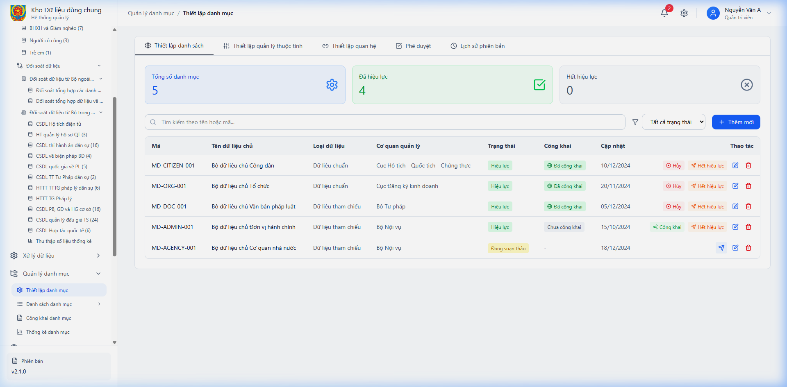

*Hình 4 – Màn hình danh sách gói tin danh mục*

4.8.2.2.1.1 Mô tả thông tin trên màn hình
| **STT** | **Tên trường thông tin** | **Kiểu dữ liệu** | **Bắt buộc** | **Mặc định** | **Mô tả** |
| --- | --- | --- | --- | --- | --- |
| Danh sách gói tin | CLOB | - | - | Hiển thị danh sách các cấu trúc gói tin danh mục đã được tạo. |

4.8.2.2.1.2 Chức năng trên màn hình
|  |  |  |  |
| --- | --- | --- | --- |
| **STT** | **Tên chức năng** | **Định dạng** | **Mô tả** |
| 1 | CN01 | Button text | Mở popup để tạo/cập nhật một cấu trúc gói tin mới (MH04.P01). |
| 2 | CN02 | Button icon | Xem danh sách các trường dữ liệu (metadata) trong gói tin (MH04.P02). |
| 3 | CN03 | Button icon | Mở popup xác nhận loại bỏ gói tin khỏi hệ thống (MH04.P03). |

#### 4.8.2.2.2. MH04.P01a – Thêm mới gói tin danh mục
Màn hình

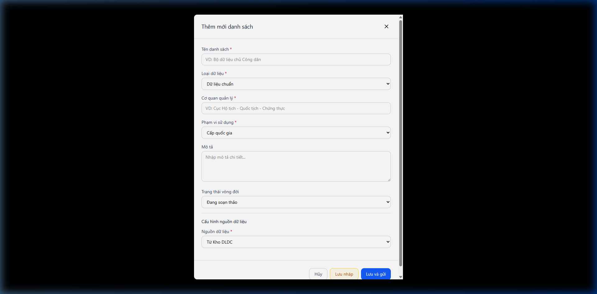

4.8.2.2.2.1 Mô tả thông tin trên màn hình
| **STT** | **Tên trường thông tin** | **Kiểu dữ liệu** | **Bắt buộc** | **Mặc định** | **Mô tả** |
| --- | --- | --- | --- | --- | --- |
| Tên gói tin | VARCHAR2(255) | Có | - | Tên gợi nhớ cho cấu trúc gói tin. |
| Mã gói tin | VARCHAR2(50) | Có | - | Mã kỹ thuật định danh gói tin. |
| Mô tả | VARCHAR2(1000) | Không | - | Ghi chú thêm về nội dung dữ liệu trong gói tin. |

4.8.2.2.2.2 Chức năng trên màn hình
|  |  |  |  |
| --- | --- | --- | --- |
| **STT** | **Tên chức năng** | **Định dạng** | **Mô tả** |
| 1 | CN01 | Button text | Lưu thông tin cấu hình. |
| 2 | CN02 | Button text | Hủy thao tác. |

#### 4.8.2.2.3. MH04.P01b – Chỉnh sửa gói tin danh mục
Màn hình

4.8.2.2.3.1 Mô tả thông tin trên màn hình
| **STT** | **Tên trường thông tin** | **Kiểu dữ liệu** | **Bắt buộc** | **Mặc định** | **Mô tả** |
| --- | --- | --- | --- | --- | --- |
| Tên gói tin | VARCHAR2(255) | Có | - | Cập nhật tên. |
| Mô tả | VARCHAR2(1000) | Không | - | Cập nhật mô tả. |

4.8.2.2.3.2 Chức năng trên màn hình
|  |  |  |  |
| --- | --- | --- | --- |
| **STT** | **Tên chức năng** | **Định dạng** | **Mô tả** |
| 1 | CN01 | Button text | Cập nhật thay đổi. |
| 2 | CN02 | Button text | Hủy thao tác. |

#### 4.8.2.2.3. MH04.P02 – Cấu trúc gói tin (Metadata)
Màn hình

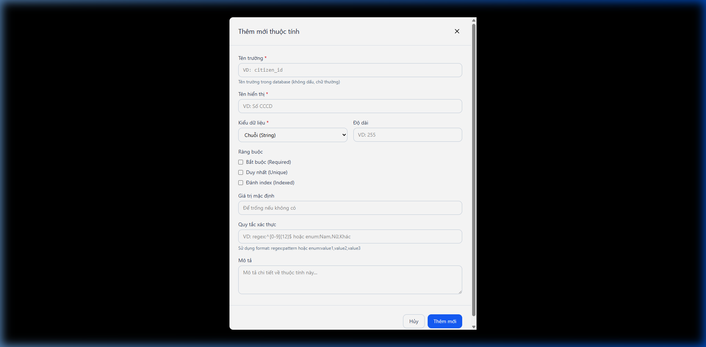

*Hình 5 – Màn hình cấu trúc gói tin*

4.8.2.2.3.1 Mô tả thông tin trên màn hình
| **STT** | **Tên trường thông tin** | **Kiểu dữ liệu** | **Bắt buộc** | **Mặc định** | **Mô tả** |
| --- | --- | --- | --- | --- | --- |
| Tên trường | VARCHAR2(255) | - | - | Tên hiển thị của trường dữ liệu (metadata). |
| Mã trường | VARCHAR2(100) | - | - | Mã kỹ thuật được sử dụng trong XML/JSON khi trao đổi. |
| Kiểu dữ liệu | VARCHAR2(50) | - | - | Các loại: String, Number, Date, Boolean... |
| Độ dài | NUMBER | - | - | Giới hạn số lượng ký tự (nếu áp dụng). |
| Bắt buộc | NUMBER(1) | - | - | Quy định trường này có bắt buộc phải có dữ liệu hay không (1: Có / 0: Không). |

4.8.2.2.3.2 Chức năng trên màn hình
|  |  |  |  |
| --- | --- | --- | --- |
| **STT** | **Tên chức năng** | **Định dạng** | **Mô tả** |
| 1 | CN01 | Button text | Đóng popup. |

#### 4.8.2.2.4. MH04.P03 – Xác nhận loại bỏ gói tin
Màn hình

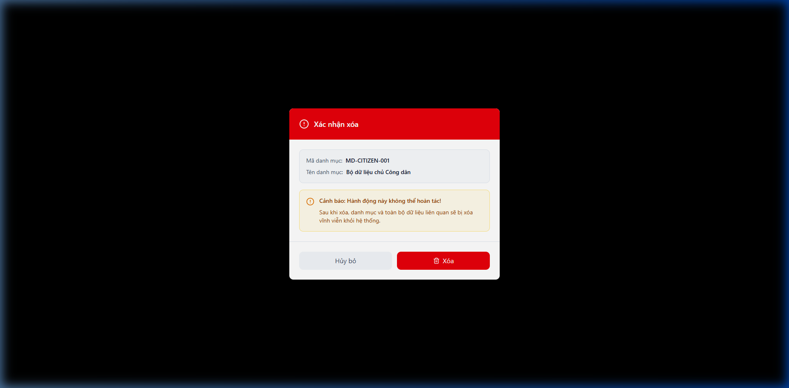

*Hình 9 – Popup xác nhận loại bỏ gói tin danh mục khỏi hệ thống*

4.8.2.2.4.1 Mô tả thông tin trên màn hình
| **STT** | **Tên trường thông tin** | **Kiểu dữ liệu** | **Bắt buộc** | **Mặc định** | **Mô tả** |
| --- | --- | --- | --- | --- | --- |
| Cảnh báo | VARCHAR2(500) | - | - | "Bạn có chắc chắn muốn loại bỏ gói tin này không? Dữ liệu liên quan sẽ bị xóa khỏi hệ thống." |

4.8.2.2.4.2 Chức năng trên màn hình
|  |  |  |  |
| --- | --- | --- | --- |
| **STT** | **Tên chức năng** | **Định dạng** | **Mô tả** |
| 1 | CN01 | Button text | Xác nhận loại bỏ gói tin. |
| 2 | CN02 | Button text | Hủy thao tác. |

## 4.8.3. DC108.QLCC.DL – Cung cấp CSDL DLDC (DLDC Data Provision)

### *4.8.3.1. Mục đích*
Tra cứu và quản lý lịch sử cung cấp dữ liệu định danh công dân cho các hệ thống khác, đảm bảo khả năng giám sát và theo dõi dòng chảy dữ liệu.

### 4.8.3.2. DC108.QLCC.DL.MH06 – Chi tiết dữ liệu và bản ghi cung cấp

#### 4.8.3.2.1. MH06 Màn hình Dashboard CSDL Hộ tịch
Màn hình

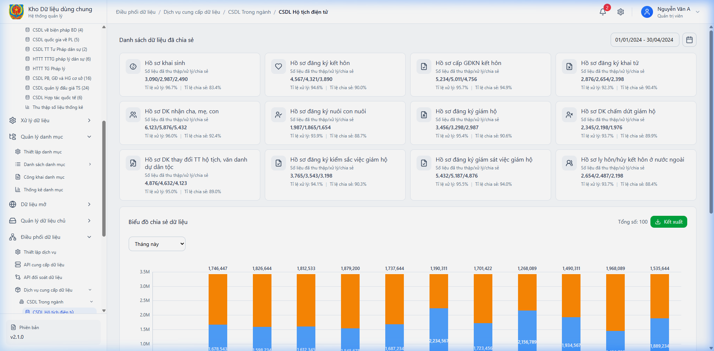

4.8.3.2.1.1 Mô tả thông tin trên màn hình
| **STT** | **Tên trường thông tin** | **Kiểu dữ liệu** | **Bắt buộc** | **Mặc định** | **Mô tả** |
| --- | --- | --- | --- | --- | --- |
| Các loại dữ liệu | Block/Card | - | - | Hiển thị các block dữ liệu: Khai sinh, Kết hôn, Khai tử, Nuôi con nuôi, Giám hộ... |

4.8.3.2.1.2 Chức năng trên màn hình
|  |  |  |  |
| --- | --- | --- | --- |
| **STT** | **Tên chức năng** | **Định dạng** | **Mô tả** |
| 1 | CN01 | Card click | Mở danh sách bản ghi chi tiết của loại dữ liệu đó (MH06.P01). |

#### 4.8.3.2.2. MH06.P01 – Danh sách bản ghi chi tiết
Màn hình

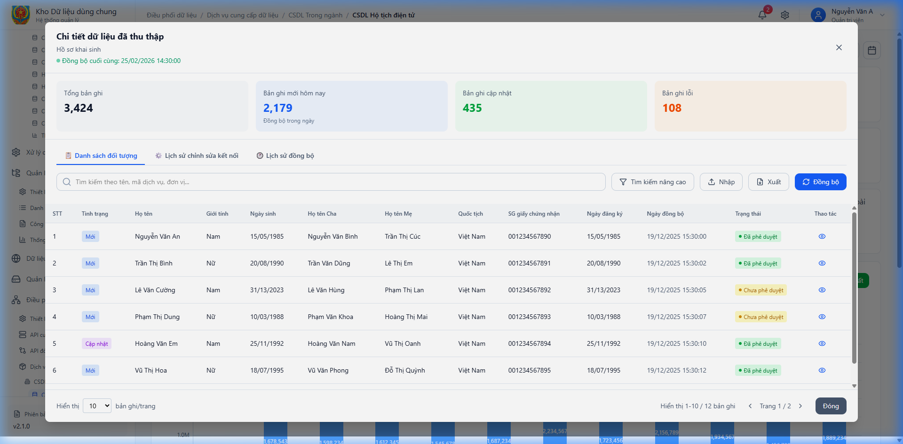

4.8.3.2.2.1 Mô tả thông tin trên màn hình
| **STT** | **Tên trường thông tin** | **Kiểu dữ liệu** | **Bắt buộc** | **Mặc định** | **Mô tả** |
| --- | --- | --- | --- | --- | --- |
| Danh sách bản ghi | Table | - | - | Hiển thị STT, Mã định danh, Họ tên, Ngày sinh, CCCD. |

4.8.3.2.2.2 Chức năng trên màn hình
|  |  |  |  |
| --- | --- | --- | --- |
| **STT** | **Tên chức năng** | **Định dạng** | **Mô tả** |
| 1 | CN01 | Button icon | Mở chi tiết bản ghi cá nhân (MH06.P02). |
| 2 | CN02 | Button text | Đóng popup. |

#### 4.8.3.2.3. MH06.P02 – Chi tiết bản ghi của cá nhân
Màn hình

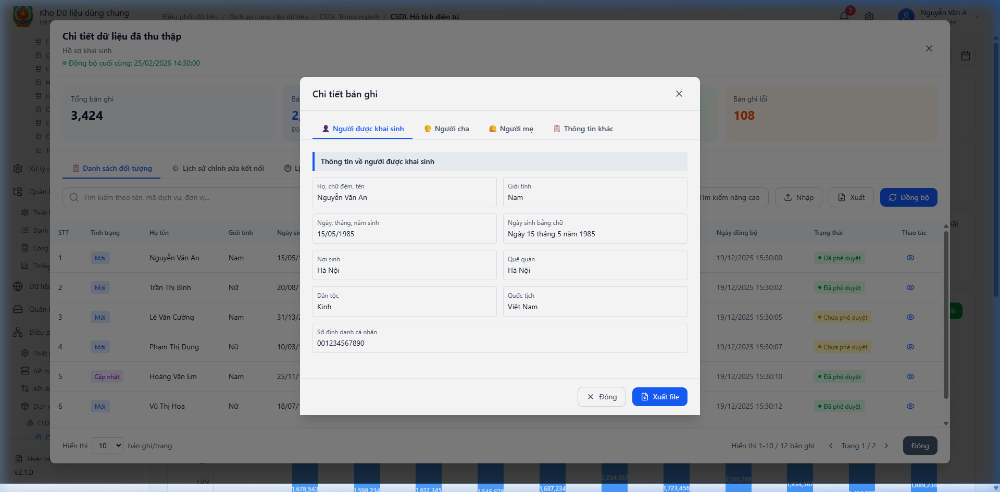

4.8.3.2.3.1 Mô tả thông tin trên màn hình
| **STT** | **Tên trường thông tin** | **Kiểu dữ liệu** | **Bắt buộc** | **Mặc định** | **Mô tả** |
| --- | --- | --- | --- | --- | --- |
| Các tab thông tin | Tab | - | - | Chia thành các tab: Thông tin chung, Người cha, Người mẹ, v.v. |
| Chi tiết dữ liệu | Form | - | - | Hiển thị đầy đủ thông tin định danh của cá nhân. |

4.8.3.2.3.2 Chức năng trên màn hình
|  |  |  |  |
| --- | --- | --- | --- |
| **STT** | **Tên chức năng** | **Định dạng** | **Mô tả** |
| 1 | CN01 | Button text | Đóng popup. |

# 4.9. DC109.QLTB_Quản lý thông báo (Notifications)

## 4.9.1. DC109.QLTB.DS – Quản lý danh sách thông báo

### *4.9.1.1. Mục đích*
Chức năng này hoạt động như một trung tâm kiểm soát, cho phép người dùng theo dõi toàn bộ các sự kiện, cảnh báo, thông báo lỗi hoặc tiến độ công việc phát sinh từ các phân hệ khác trong hệ thống Kho DLDC, giúp nắm bắt tình hình hoạt động của hệ thống một cách kịp thời.

### 4.9.1.2. DC1-TQ-DB-001 – Giao diện Quản lý thông báo

#### 4.9.1.2.1. MH01 Màn hình quản lý thông báo
- **Mã chức năng:** DC1-TQ-DB-001, DC1-TB-QT-001
- **Mã màn hình:** MH01

Màn hình

*Hình 1 – Giao diện danh sách và quản lý thông báo*

4.9.1.2.1.1 Mô tả thông tin trên màn hình
| **STT** | **Tên trường thông tin** | **Kiểu dữ liệu** | **Bắt buộc** | **Mặc định** | **Mô tả** |
| --- | --- | --- | --- | --- | --- |
| Loại thông báo | VARCHAR2(50) | - | - | Phân loại nguồn phát sinh: Hệ thống, Phê duyệt, Cảnh báo lỗi, Tiến độ công việc. |
| Tiêu đề | VARCHAR2(255) | - | - | Nội dung tóm tắt ngắn gọn của thông báo. |
| Nội dung | CLOB | - | - | Mô tả chi tiết sự kiện hoặc hành động cần xử lý. |
| Trạng thái | VARCHAR2(20) | - | Chưa đọc | Trạng thái của thông báo: Chưa đọc, Đã đọc. |
| Thời gian | TIMESTAMP | - | - | Thời điểm thông báo được tạo ra bởi hệ thống. |
| Mức độ ưu tiên | VARCHAR2(20) | - | - | Phân cấp cảnh báo: Thấp, Trung bình, Cao, Khẩn cấp. |

4.9.1.2.1.2 Chức năng trên màn hình
|  |  |  |  |
| --- | --- | --- | --- |
| **STT** | **Tên chức năng** | **Định dạng** | **Mô tả** |
| 1 | CN01 | Button icon | Mở popup để hiển thị toàn bộ nội dung chi tiết của thông báo (MH01.P01). |
| 2 | CN02 | Button icon | Đánh dấu, chuyển trạng thái của một thông báo từ "Chưa đọc" sang "Đã đọc". |
| 3 | CN03 | Button icon | Mở popup xác nhận xóa một thông báo (MH01.P02). |

#### 4.9.1.2.2. MH01.P01 – Chi tiết thông báo
- **Mã chức năng:** DC1-TQ-DB-001, DC1-TB-QT-001
- **Mã màn hình:** MH01.P01

Màn hình

*Hình 2 – Cửa sổ chi tiết nội dung thông báo*

4.9.1.2.2.1 Mô tả thông tin trên màn hình
| **STT** | **Tên trường thông tin** | **Kiểu dữ liệu** | **Bắt buộc** | **Mặc định** | **Mô tả** |
| --- | --- | --- | --- | --- | --- |
| Thông tin chung | CLOB | - | - | Khu vực hiển thị các thông tin tổng quan: loại thông báo (Icon), Tiêu đề, Thời gian và Nguồn phát sinh. |
| Mức độ ưu tiên | VARCHAR2(20) | - | - | Hiển thị nhãn cảnh báo rõ ràng (ví dụ: "Ưu tiên cao"). |
| Nội dung đầy đủ | CLOB | - | - | Hiển thị toàn văn thông điệp chi tiết mà hệ thống đã gửi. |

4.9.1.2.2.2 Chức năng trên màn hình
|  |  |  |  |
| --- | --- | --- | --- |
| **STT** | **Tên chức năng** | **Định dạng** | **Mô tả** |
| 1 | CN01 | Button text | Chức năng "Đánh dấu đã đọc" (chỉ hiển thị với các thông báo chưa đọc). |
| 2 | CN02 | Button text | Đóng Popup chi tiết. |

#### 4.9.1.2.3. MH01.P02 – Xác nhận xóa thông báo
- **Mã chức năng:** DC1-TQ-DB-001, DC1-TB-QT-001
- **Mã màn hình:** MH01.P02

Màn hình

*Hình 3 – Popup xác nhận xóa thông báo khỏi danh sách cá nhân*

4.9.1.2.3.1 Mô tả thông tin trên màn hình
| **STT** | **Tên trường thông tin** | **Kiểu dữ liệu** | **Bắt buộc** | **Mặc định** | **Mô tả** |
| --- | --- | --- | --- | --- | --- |
| Cảnh báo | VARCHAR2(500) | - | - | "Bạn có chắc chắn muốn xóa thông báo này? Hành động này sẽ loại bỏ thông báo khỏi danh sách của bạn." |

4.9.1.2.3.2 Chức năng trên màn hình
|  |  |  |  |
| --- | --- | --- | --- |
| **STT** | **Tên chức năng** | **Định dạng** | **Mô tả** |
| 1 | CN01 | Button text | Xác nhận xóa thông báo. |
| 2 | CN02 | Button text | Hủy thao tác. |

# 4.9. DC1.QLHT_Quản trị & vận hành hệ thống

## 4.9.1. DC1.QLHT.QTND – Quản trị người dùng

### *4.9.1.1. Mục đích*
Quản lý người dùng trong kho dữ liệu dùng chung (DLDC) nhằm đảm bảo việc khai thác và sử dụng dữ liệu **đúng đối tượng, đúng quyền hạn, đúng mục đích và đúng trách nhiệm**.

Thông qua cơ chế quản trị và phân quyền, hệ thống:
- Đảm bảo an toàn, bảo mật dữ liệu trong suốt quá trình vận hành;
- Kiểm soát chặt chẽ quyền truy cập, chỉnh sửa, khai thác và chia sẻ dữ liệu;
- Hỗ trợ cán bộ quản trị trong việc **giám sát, theo dõi, kiểm tra và vận hành kho DLDC một cách hiệu quả**;
- Nâng cao tính minh bạch, trách nhiệm giải trình của các đơn vị, cá nhân khi sử dụng dữ liệu.

*+ Phân quyền*
**Cán bộ quản trị kho DLDC là đối tượng được giao thực hiện chức năng quản lý, vận hành và phân quyền người dùng trong hệ thống, bao gồm các quyền chính:**
• Tạo mới, cập nhật, khóa/mở khóa tài khoản người dùng;
• Phân quyền truy cập, khai thác, cập nhật dữ liệu theo vai trò, chức năng và phạm vi được giao;
• Giám sát hoạt động sử dụng hệ thống, theo dõi nhật ký truy cập và xử lý các vấn đề phát sinh;
• Phối hợp với các đơn vị liên quan trong công tác vận hành, bảo trì và đảm bảo an toàn hệ thống.

*+ Điều kiện thực hiện*
Cán bộ quản trị kho DLDC phải:
• Được cơ quan, đơn vị có thẩm quyền **phân công nhiệm vụ và cấp quyền truy cập quản trị**;
• Có kiến thức, kỹ năng phù hợp để thực hiện công tác quản trị, vận hành hệ thống kho dữ liệu;
• Chịu trách nhiệm trước cơ quan quản lý về các hoạt động quản trị, phân quyền và vận hành kho DLDC theo quy định hiện hành.

### 4.9.1.2. DC1.QLHT.QTND.MH13 – Quản lý người dùng

#### 4.9.1.2.1. Mục đích
Cho phép người quản trị quản lý danh sách người dùng, thực hiện các thao tác như đồng bộ từ LDAP, thêm mới, xem chi tiết, khóa/mở khóa và đặt lại mật khẩu.

*+ Phân quyền*
Cán bộ quản trị hệ thống.

*+ Điều kiện thực hiện*
Người dùng được cấp quyền truy cập vào chức năng quản lý người dùng.

#### 4.9.1.2.2. MH13 Màn hình danh sách người dùng

Màn hình

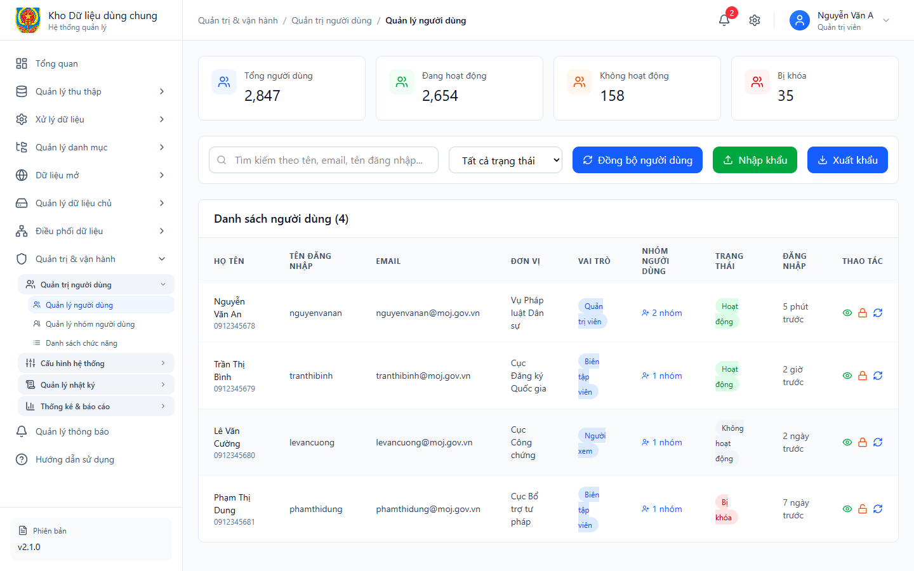

*Hình 1 – Màn hình danh sách người dùng*

4.9.1.2.2.1 Mô tả thông tin trên màn hình
| **STT** | **Tên trường thông tin** | **Kiểu dữ liệu** | **Bắt buộc** | **Mặc định** | **Mô tả** |
| --- | --- | --- | --- | --- | --- |
| Họ tên | VARCHAR2(255) | - | - | Tên đầy đủ của cán bộ. |
| Tài khoản | VARCHAR2(50) | - | - | Tên đăng nhập. |
| Email | VARCHAR2(100) | - | - | Địa chỉ email công vụ. |
| Đơn vị | VARCHAR2(255) | - | - | Cơ quan/đơn vị công tác. |
| Trạng thái | VARCHAR2(20) | - | - | Hoạt động / Đã khóa. |

4.9.1.2.2.2 Chức năng trên màn hình
|  |  |  |  |
| --- | --- | --- | --- |
| **STT** | **Tên chức năng** | **Định dạng** | **Mô tả** |
| 1 | CN01 | Button text | Kích hoạt đồng bộ danh sách người dùng từ hệ thống LDAP/Active Directory. |
| 2 | CN02 | Button text | Mở popup chọn file Excel để upload danh sách người dùng. |
| 3 | CN03 | Button text | Xuất danh sách người dùng hiện tại ra file Excel. |
| 4 | CN04 | Button text | Mở popup gán người dùng vào các nhóm quyền. |
| 5 | CN05 | Button icon | Mở popup xem chi tiết thông tin đầy đủ, nhóm và quyền hạn của người dùng. |
| 6 | CN06 | Button icon | Mở popup xác nhận khóa hoặc mở khóa tài khoản. |
| 7 | CN07 | Button icon | Mở popup thiết lập cấp lại mật khẩu cho người dùng. |

#### 4.9.1.2.3. MH13.P02 Chi tiết người dùng

Màn hình

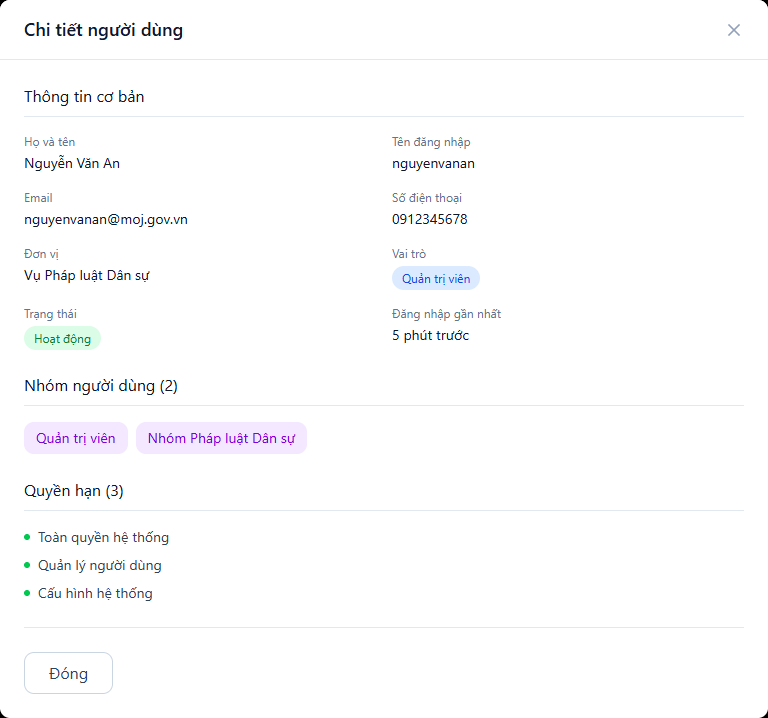

*Hình 2 – Màn hình chi tiết người dùng*

4.9.1.2.3.1 Mô tả thông tin trên màn hình
| **STT** | **Tên trường thông tin** | **Kiểu dữ liệu** | **Bắt buộc** | **Mặc định** | **Mô tả** |
| --- | --- | --- | --- | --- | --- |
| Tên đăng nhập | VARCHAR2(50) | - | - | Tên truy cập LDAP. |
| Họ tên | VARCHAR2(255) | - | - | Hiển thị tên tài khoản. |
| Email / Số điện thoại | VARCHAR2(100) | - | - | Các thông tin liên hệ. |
| Vai trò / Đơn vị | VARCHAR2(255) | - | - | Các thông tin công tác. |
| Giờ đăng nhập gần nhất | DATE | - | - | Tracking thời gian truy cập. |
| Danh sách Nhóm trực thuộc | CLOB | - | - | (Ví dụ: Admin, Viewer). |
| Danh sách Quyền hạn chi tiết | CLOB | - | - | (Ví dụ: Toàn quyền, Xem dữ liệu). |

4.9.1.2.3.2 Chức năng trên màn hình
|  |  |  |  |
| --- | --- | --- | --- |
| **STT** | **Tên chức năng** | **Định dạng** | **Mô tả** |
| 1 | CN01 | Button text | Đóng cửa sổ (Không có nút lưu). |

#### 4.9.1.2.4. MH13.P03 Xác nhận khóa tài khoản

Màn hình

*Hình 3 – Màn hình xác nhận khóa tài khoản*

4.9.1.2.4.1 Mô tả thông tin trên màn hình
| **STT** | **Tên trường thông tin** | **Kiểu dữ liệu** | **Bắt buộc** | **Mặc định** | **Mô tả** |
| --- | --- | --- | --- | --- | --- |
| Cảnh báo | VARCHAR2(500) | - | - | Thông báo xác nhận hành động thay đổi trạng thái đăng nhập ("Bạn có chắc chắn muốn khóa/mở khóa tài khoản của [Tên người dùng]?"). |
| Lý do (nếu có) | VARCHAR2(1000) | Không | - | Người quản trị nhập lý do khóa. |

4.9.1.2.4.2 Chức năng trên màn hình
|  |  |  |  |
| --- | --- | --- | --- |
| **STT** | **Tên chức năng** | **Định dạng** | **Mô tả** |
| 1 | CN01 | Button text | Áp dụng thay đổi trạng thái tài khoản. |
| 2 | CN02 | Button text | Quay lại danh sách. |

#### 4.9.1.2.5. MH13.P04 Xác nhận đặt lại mật khẩu

Màn hình

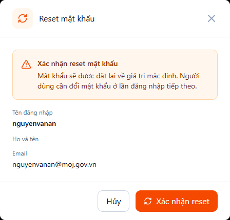

*Hình 8 – Màn hình xác nhận đặt lại mật khẩu*

4.9.1.2.5.1 Mô tả thông tin trên màn hình
| **STT** | **Tên trường thông tin** | **Kiểu dữ liệu** | **Bắt buộc** | **Mặc định** | **Mô tả** |
| --- | --- | --- | --- | --- | --- |
| Thông báo | VARCHAR2(500) | - | - | "Mật khẩu sẽ được đặt lại về giá trị mặc định. Người dùng cần đổi mật khẩu ở lần đăng nhập tiếp theo." |

4.9.1.2.5.2 Chức năng trên màn hình
|  |  |  |  |
| --- | --- | --- | --- |
| **STT** | **Tên chức năng** | **Định dạng** | **Mô tả** |
| 1 | CN01 | Button text | Thực hiện đặt lại mật khẩu và hiển thị mật khẩu mới. |
| 2 | CN02 | Button text | Bỏ qua thao tác. |

### 4.9.1.3. DC1.QLHT.QTND.MH14 – Quản lý nhóm người dùng

#### 4.9.1.3.1. Mục đích
Quản lý các nhóm người dùng trong hệ thống, cho phép định nghĩa vai trò, gán thành viên và phân quyền chức năng cho từng nhóm.

*+ Phân quyền*
Cán bộ quản trị hệ thống.

*+ Điều kiện thực hiện*
Có danh sách các chức năng và người dùng cần gán vào nhóm.

#### 4.9.1.3.2. MH14 Màn hình danh sách nhóm người dùng
Màn hình

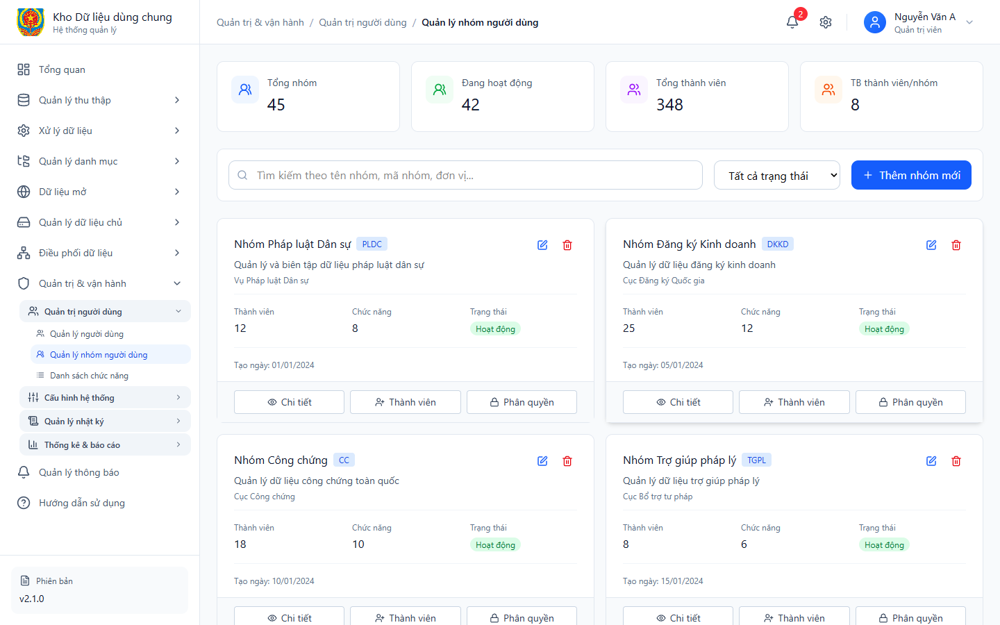

*Hình 4 – Màn hình danh sách nhóm người dùng*

4.9.1.3.2.1 Mô tả thông tin trên màn hình
| **STT** | **Tên trường thông tin** | **Kiểu dữ liệu** | **Bắt buộc** | **Mặc định** | **Mô tả** |
| --- | --- | --- | --- | --- | --- |
| Mã nhóm | VARCHAR2(50) | - | - | Định danh của nhóm. |
| Tên nhóm | VARCHAR2(255) | - | - | Tên hiển thị (VD: Ban Giám đốc, Quản trị viên...). |
| Mô tả | VARCHAR2(1000) | - | - | Diễn giải vai trò của nhóm. |
| Số lượng thành viên | NUMBER | - | - | Số user có trong nhóm. |

4.9.1.3.2.2 Chức năng trên màn hình
|  |  |  |  |
| --- | --- | --- | --- |
| **STT** | **Tên chức năng** | **Định dạng** | **Mô tả** |
| 1 | CN01 | Button text | Mở màn hình thêm nhóm người dùng mới. |
| 2 | CN02 | Button icon | Mở màn hình chỉnh sửa nhóm người dùng. |
| 3 | CN03 | Button icon | Xem thông tin chi tiết nhóm. |
| 4 | CN04 | Thêm thành viên| Button icon | Thêm thành viên vào nhóm. |
| 5 | CN05 | Button icon | Mở màn hình gán quyền cho nhóm. |
| 6 | CN06 | Button icon | Mở màn hình xác nhận xóa nhóm. |

#### 4.9.1.3.3. MH14.P01 Thêm nhóm người dùng mới
Màn hình

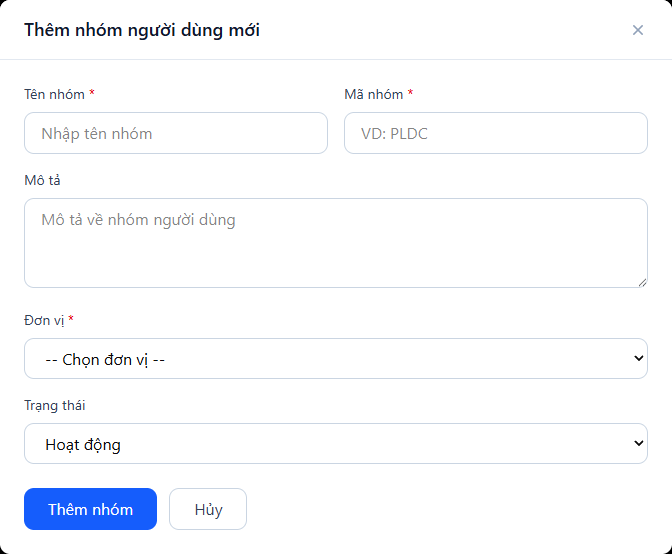

*Hình 5 – Màn hình thêm nhóm người dùng mới*

4.9.1.3.3.1 Mô tả thông tin trên màn hình
| **STT** | **Tên trường thông tin** | **Kiểu dữ liệu** | **Bắt buộc** | **Mặc định** | **Mô tả** |
| --- | --- | --- | --- | --- | --- |
| Mã nhóm | VARCHAR2(50) | Có | - | Mã định danh nhóm, không được trùng lặp. |
| Tên nhóm | VARCHAR2(255) | Có | - | Tên hiển thị đầy đủ của nhóm. |
| Mô tả | VARCHAR2(1000) | Không | - | Ghi chú thêm về vai trò của nhóm này. |

4.9.1.3.3.2 Chức năng trên màn hình
|  |  |  |  |
| --- | --- | --- | --- |
| **STT** | **Tên chức năng** | **Định dạng** | **Mô tả** |
| 1 | CN01 | Button text | Ghi nhận thông tin thêm nhóm mới. |
| 2 | CN02 | Button text | Hủy thao tác thêm nhóm và quay lại danh sách. |

#### 4.9.1.3.4. MH14.P02 Chỉnh sửa nhóm người dùng
Màn hình

*Hình 6 – Màn hình chỉnh sửa nhóm người dùng*

4.9.1.3.4.1 Mô tả thông tin trên màn hình
| **STT** | **Tên trường thông tin** | **Kiểu dữ liệu** | **Bắt buộc** | **Mặc định** | **Mô tả** |
| --- | --- | --- | --- | --- | --- |
| Mã nhóm | VARCHAR2(50) | Có | (Dữ liệu cũ) | Mã định danh nhóm. |
| Tên nhóm | VARCHAR2(255) | Có | (Dữ liệu cũ) | Tên hiển thị đầy đủ của nhóm. |
| Mô tả | VARCHAR2(1000) | Không | (Dữ liệu cũ) | Ghi chú thêm về vai trò của nhóm. |

4.9.1.3.4.2 Chức năng trên màn hình
|  |  |  |  |
| --- | --- | --- | --- |
| **STT** | **Tên chức năng** | **Định dạng** | **Mô tả** |
| 1 | CN01 | Button text | Ghi nhận thay đổi thông tin nhóm. |
| 2 | CN02 | Button text | Hủy thao tác sửa nhóm. |

#### 4.9.1.3.5. MH14.P03 Chi tiết nhóm
Màn hình

*Hình 7 – Màn hình chi tiết nhóm*

4.9.1.3.5.1 Mô tả thông tin trên màn hình
| **STT** | **Tên trường thông tin** | **Kiểu dữ liệu** | **Bắt buộc** | **Mặc định** | **Mô tả** |
| --- | --- | --- | --- | --- | --- |
| Tên nhóm | VARCHAR2(255) | - | - | Hiển thị tên (Ví dụ: Nhóm Đăng ký Kinh doanh). |
| Mã nhóm | VARCHAR2(50) | - | - | Mã định danh nhóm. |
| Các thuộc tính | VARCHAR2(1000) | - | - | Thông tin về hoạt động và vai trò. |

4.9.1.3.5.2 Chức năng trên màn hình
|  |  |  |  |
| --- | --- | --- | --- |
| **STT** | **Tên chức năng** | **Định dạng** | **Mô tả** |
| 1 | CN01 | Button text | Đóng màn hình xem chi tiết. |

#### 4.9.1.3.6. MH14.P04 Thêm thành viên vào nhóm
Màn hình

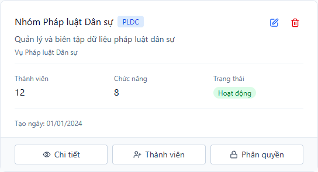

*Hình 9 – Màn hình thêm thành viên vào nhóm*

4.9.1.3.6.1 Mô tả thông tin trên màn hình
| **STT** | **Tên trường thông tin** | **Kiểu dữ liệu** | **Bắt buộc** | **Mặc định** | **Mô tả** |
| --- | --- | --- | --- | --- | --- |
| Danh sách tài khoản | VARCHAR2(1000) | - | - | Lọc và hiển thị các tài khoản hệ thống. |
| Tích chọn | NUMBER(1) | Có | - | Chọn người dùng muốn đưa vào nhóm. |

4.9.1.3.6.2 Chức năng trên màn hình
|  |  |  |  |
| --- | --- | --- | --- |
| **STT** | **Tên chức năng** | **Định dạng** | **Mô tả** |
| 1 | CN01 | Button text | Xác nhận việc bổ sung nhân sự vào nhóm. |
| 2 | CN02 | Button text | Bỏ qua các thay đổi. |

#### 4.9.1.3.7. MH14.P05 Gán quyền cho nhóm
Màn hình

*Hình 10 – Màn hình gán quyền chức năng cho nhóm*

4.9.1.3.7.1 Mô tả thông tin trên màn hình
| **STT** | **Tên trường thông tin** | **Kiểu dữ liệu** | **Bắt buộc** | **Mặc định** | **Mô tả** |
| --- | --- | --- | --- | --- | --- |
| Danh sách chức năng | VARCHAR2(1000) | - | - | Cây các chức năng (Menu cha, menu con). |
| Quyền Xem | NUMBER(1) | Không | 0 | Cho phép truy cập và xem menu. |
| Quyền Thêm | NUMBER(1) | Không | 0 | Cho phép thêm mới dữ liệu. |
| Quyền Sửa | NUMBER(1) | Không | 0 | Cho phép cập nhật dữ liệu. |
| Quyền Xóa | NUMBER(1) | Không | 0 | Cho phép xóa dữ liệu. |
| Quyền Phê duyệt | NUMBER(1) | Không | 0 | Cho phép duyệt/công bố. |

4.9.1.3.7.2 Chức năng trên màn hình
|  |  |  |  |
| --- | --- | --- | --- |
| **STT** | **Tên chức năng** | **Định dạng** | **Mô tả** |
| 1 | CN01 | Button text | Lưu lại các thay đổi quyền hạn. |
| 2 | CN02 | Button text | Hủy các thiết lập chưa lưu, quay về mặc định. |

#### 4.9.1.3.8. MH14.P06 Xác nhận xóa nhóm
Màn hình

*Hình 11 – Màn hình xác nhận xóa nhóm*

4.9.1.3.8.1 Mô tả thông tin trên màn hình
| **STT** | **Tên trường thông tin** | **Kiểu dữ liệu** | **Bắt buộc** | **Mặc định** | **Mô tả** |
| --- | --- | --- | --- | --- | --- |
| Cảnh báo | VARCHAR2(500) | - | - | "Bạn có chắc chắn muốn xóa nhóm này không? Các người dùng thuộc nhóm sẽ bị mất quyền lợi tương ứng." |

4.9.1.3.8.2 Chức năng trên màn hình
|  |  |  |  |
| --- | --- | --- | --- |
| **STT** | **Tên chức năng** | **Định dạng** | **Mô tả** |
| 1 | CN01 | Button text | Thực thi lệnh xóa nhóm. |
| 2 | CN02 | Button text | Không xóa. |

### 4.9.1.4. DC1.QLHT.QTND.MH15 – Danh sách chức năng

#### 4.9.1.4.1. Mục đích
Quản lý danh mục các chức năng (Menu) của hệ thống, bao gồm cấu hình tên, icon, đường dẫn và cấu hình cây menu cha-con.

*+ Phân quyền*
Cán bộ quản trị hệ thống.

*+ Điều kiện thực hiện*
Người dùng có quyền quản trị cấp cao để thay đổi cấu hình menu hệ thống.

#### 4.9.1.4.2. MH15 Màn hình danh sách chức năng
Màn hình

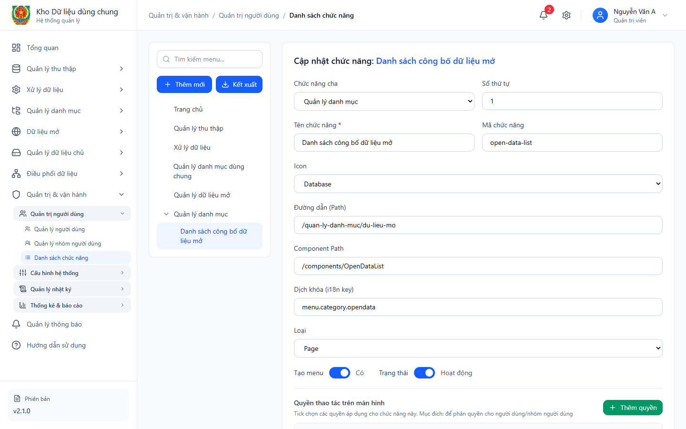

*Hình 12 – Màn hình quản lý danh sách chức năng (Menu)*

4.9.1.4.2.1 Mô tả thông tin trên màn hình
| **STT** | **Tên trường thông tin** | **Kiểu dữ liệu** | **Bắt buộc** | **Mặc định** | **Mô tả** |
| --- | --- | --- | --- | --- | --- |
| Tên chức năng | VARCHAR2(255) | - | - | Tên menu / màn hình. |
| Đường dẫn (URL) | VARCHAR2(500) | - | - | Path truy cập. |
| Icon | VARCHAR2(50) | - | - | Biểu tượng hiển thị trên sidebar. |
| Menu cha | VARCHAR2(255) | - | - | Cấp quy định cha/con trong cấu trúc cây. |

4.9.1.4.2.2 Chức năng trên màn hình
|  |  |  |  |
| --- | --- | --- | --- |
| **STT** | **Tên chức năng** | **Định dạng** | **Mô tả** |
| 1 | CN01 | Button text | Mở popup thêm chức năng mới. |
| 2 | CN02 | Button icon | Mở popup thay đổi đường dẫn/tên nhánh. |
| 3 | CN03 | Button icon | Xóa cấu hình chức năng. |

#### 4.9.1.4.3. MH15.P01 Popup Thêm chức năng mới
Màn hình

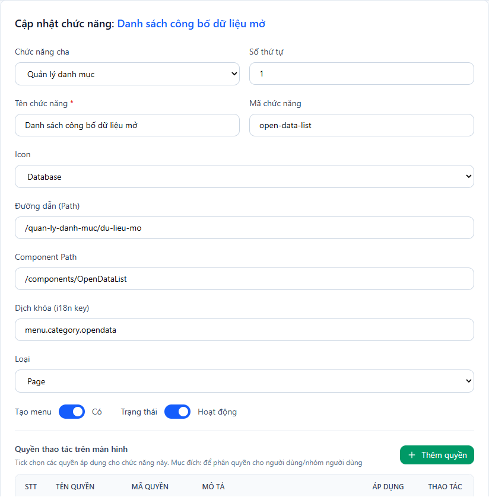

*Hình 13 – Popup thêm cấu hình chức năng menu*

4.9.1.4.3.1 Mô tả thông tin trên màn hình
| **STT** | **Tên trường thông tin** | **Kiểu dữ liệu** | **Bắt buộc** | **Mặc định** | **Mô tả** |
| --- | --- | --- | --- | --- | --- |
| Tên chức năng | VARCHAR2(255) | Có | - | Nhãn hiển thị của menu trên thanh điều hướng. |
| Menu cha | VARCHAR2(255) | Không | - | Chọn menu gốc nếu đây là menu con, bỏ trống nếu là menu gốc. |
| Đường dẫn truy cập | VARCHAR2(500) | Không | - | URL Path ví dụ: `/admin/users`. |
| Icon | VARCHAR2(50) | Không | - | Tên class của Icon (VD: `fas fa-users`). |
| Số thứ tự | NUMBER | Không | 1 | Vị trí hiển thị của menu. |

4.9.1.4.3.2 Chức năng trên màn hình
|  |  |  |  |
| --- | --- | --- | --- |
| **STT** | **Tên chức năng** | **Định dạng** | **Mô tả** |
| 1 | CN01 | Button text | Thêm mới chức năng vào hệ thống. |
| 2 | CN02 | Button text | Đóng cửa sổ popup. |

#### 4.9.1.4.4. MH15.P02 Popup Sửa chức năng
Màn hình

*Hình 14 – Popup sửa cấu hình chức năng menu*

4.9.1.4.4.1 Mô tả thông tin trên màn hình
| **STT** | **Tên trường thông tin** | **Kiểu dữ liệu** | **Bắt buộc** | **Mặc định** | **Mô tả** |
| --- | --- | --- | --- | --- | --- |
| Tên chức năng | VARCHAR2(255) | Có | (Dữ liệu cũ) | Nhãn hiển thị của menu trên thanh điều hướng. |
| Menu cha | VARCHAR2(255) | Không | (Dữ liệu cũ)| Chọn menu gốc nếu đây là menu con. |
| Đường dẫn truy cập | VARCHAR2(500) | Không | (Dữ liệu cũ)| URL Path ví dụ: `/admin/users`. |
| Icon | VARCHAR2(50) | Không | (Dữ liệu cũ)| Tên class của Icon. |
| Số thứ tự | NUMBER | Không | (Dữ liệu cũ)| Vị trí hiển thị của menu. |

4.9.1.4.4.2 Chức năng trên màn hình
|  |  |  |  |
| --- | --- | --- | --- |
| **STT** | **Tên chức năng** | **Định dạng** | **Mô tả** |
| 1 | CN01 | Button text | Lưu thay đổi chức năng. |
| 2 | CN02 | Button text | Đóng cửa sổ popup. |

## 4.9.2. DC1.QLHT.CHHT – Cấu hình hệ thống

### 4.9.2.1. DC1.QLHT.CHHT.MH16 – Thiết lập cấu hình hệ thống

#### 4.9.2.1.1. Mục đích
Thiết lập các tham số vận hành chung của hệ thống như yêu cầu đổi mật khẩu, thời gian khóa tài khoản và lịch trình sao lưu tự động.

*+ Phân quyền*
Cán bộ quản trị hệ thống.

*+ Điều kiện thực hiện*
Người dùng có quyền quản trị cấp cao.

#### 4.9.2.1.2. MH16 Màn hình thiết lập cấu hình
Màn hình

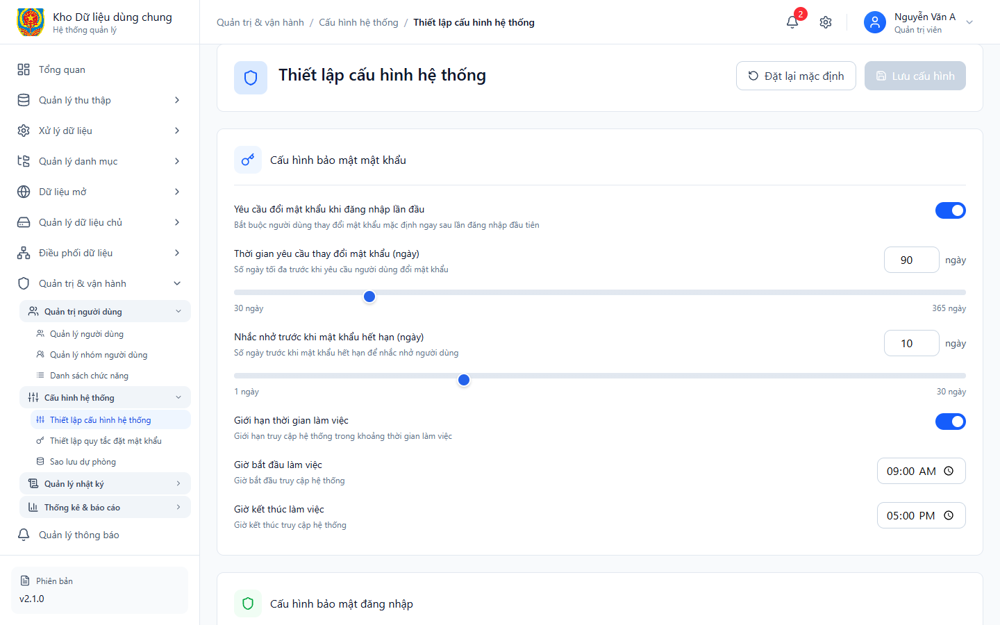

*Hình 15 – Màn hình thiết lập tham số hệ thống*

4.9.2.1.2.1 Mô tả thông tin trên màn hình
| **STT** | **Tên trường thông tin** | **Kiểu dữ liệu** | **Bắt buộc** | **Mặc định** | **Mô tả** |
| --- | --- | --- | --- | --- | --- |
| Yêu cầu đổi mật khẩu khi đăng nhập lần đầu | NUMBER(1) | Có | 1 | Bắt buộc người dùng thay đổi mật khẩu mặc định ngay sau lần đăng nhập đầu tiên. |
| Thời gian yêu cầu thay đổi mật khẩu (ngày) | NUMBER | Có | 90 | Số ngày tối đa trước khi yêu cầu người dùng đổi mật khẩu. |
| Số lần đăng nhập sai tối đa | NUMBER | Có | 5 | Số lần nhập sai mật khẩu liên tiếp trước khi tài khoản bị khóa tạm thời. |
| Thời gian khóa tài khoản (phút) | NUMBER | Có | 15 | Thời gian tài khoản bị khóa sau khi vượt quá số lần đăng nhập sai. |
| Thời gian hết hạn phiên làm việc (phút) | NUMBER | Có | 30 | Tự động đăng xuất người dùng sau khoảng thời gian không có thao tác. |
| Tự động sao lưu | VARCHAR2(50) | Có | Hàng ngày | Cấu hình tần suất sao lưu dữ liệu tự động (Hàng ngày, Hàng tuần, Hàng tháng). |
| Thời gian lưu trữ bản sao lưu (ngày) | NUMBER | Có | 30 | Hệ thống sẽ tự động xóa các bản sao lưu cũ hơn thời gian này. |
| Thời gian thực hiện sao lưu (giờ) | DATE | Có | 02:00 | Thời điểm hệ thống thực hiện sao lưu tự động trong ngày. |

4.9.2.1.2.2 Chức năng trên màn hình
|  |  |  |  |
| --- | --- | --- | --- |
| **STT** | **Tên chức năng** | **Định dạng** | **Mô tả** |
| 1 | CN01 | Button text | Cập nhật và lưu các thiết lập cấu hình. |
| 2 | CN02 | Button text | Khôi phục các thiết lập về giá trị mặc định lúc ban đầu. |

### 4.9.2.2. DC1.QLHT.CHHT.MH17 – Thiết lập quy tắc đặt mật khẩu

#### 4.9.2.2.1. Mục đích
Định nghĩa các tiêu chuẩn kỹ thuật cho mật khẩu người dùng (độ dài, ký tự đặc biệt, chữ hoa/thường) nhằm đảm bảo an toàn bảo mật.

*+ Phân quyền*
Cán bộ quản trị hệ thống.

*+ Điều kiện thực hiện*
Được giao nhiệm vụ quản lý chính sách bảo mật hệ thống.

#### 4.9.2.2.2. MH17 Màn hình thiết lập quy tắc đặt mật khẩu
Màn hình

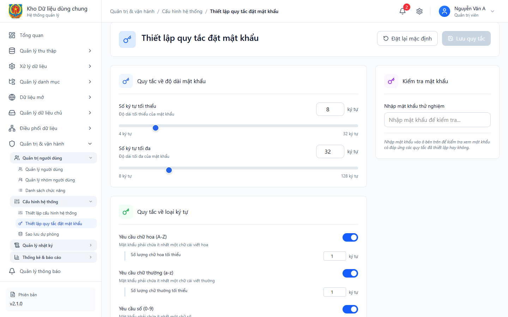

*Hình 16 – Màn hình thiết lập độ an toàn kỹ thuật của mật khẩu*

4.9.2.2.2.1 Mô tả thông tin trên màn hình
| **STT** | **Tên trường thông tin** | **Kiểu dữ liệu** | **Bắt buộc** | **Mặc định** | **Mô tả** |
| --- | --- | --- | --- | --- | --- |
| Độ dài tối thiểu | NUMBER | Có | 8 | Yêu cầu số ký tự tối thiểu của mật khẩu. |
| Độ dài tối đa | NUMBER | Có | 32 | Yêu cầu số ký tự tối đa của mật khẩu. |
| Yêu cầu chứa chữ hoa | NUMBER(1) | Có | Có | Phải có ít nhất 1 chữ hoa (A-Z). |
| Số lượng chữ hoa tối thiểu | NUMBER | Khi tick chọn "Yêu cầu chứa chữ hoa" | 1 | Số lượng ký tự chữ hoa tối thiểu cần có. |
| Yêu cầu chứa chữ thường | NUMBER(1) | Có | Có | Phải có ít nhất 1 chữ thường (a-z). |
| Số lượng chữ thường tối thiểu | NUMBER | Khi tick chọn "Yêu cầu chứa chữ thường" | 1 | Số lượng ký tự chữ thường tối thiểu cần có. |
| Yêu cầu chứa số | NUMBER(1) | Có | Có | Phải có ít nhất 1 chữ số (0-9). |
| Số lượng số tối thiểu | NUMBER | Khi tick chọn "Yêu cầu chứa số" | 1 | Số lượng chữ số tối thiểu cần có. |
| Yêu cầu chứa ký tự đặc biệt | NUMBER(1) | Có | Có | Phải có ít nhất 1 ký tự đặc biệt. |
| Số lượng ký tự đặc biệt tối thiểu | NUMBER | Khi tick chọn "Yêu cầu chứa ký tự đặc biệt" | 1 | Số lượng ký tự đặc biệt tối thiểu cần có. |
| Các ký tự đặc biệt cho phép | VARCHAR2(50) | Khi tick chọn "Yêu cầu chứa ký tự đặc biệt" | !@#$%^&* | Danh sách các ký tự đặc biệt được sử dụng. |
| Không chứa tên đăng nhập | NUMBER(1) | Có | Có | Không cho phép mật khẩu chứa toàn bộ hoặc một phần tên đăng nhập (Username). |
| Không sử dụng mật khẩu phổ biến | NUMBER(1) | Có | Có | Ngăn chặn việc sử dụng các mật khẩu dễ đoán, nằm trong danh sách các mật khẩu phổ biến (123456, password, admin...). |

4.9.2.2.2.2 Chức năng trên màn hình
|  |  |  |  |
| --- | --- | --- | --- |
| **STT** | **Tên chức năng** | **Định dạng** | **Mô tả** |
| 1 | CN01 | Button text | Cập nhật chính sách mật khẩu và làm mới hiển thị. |
| 2 | CN02 | Button text | Khôi phục thiết lập về quy tắc mặc định. |

### 4.9.2.3. DC1.QLHT.CHHT.MH18 – Sao lưu dự phòng

#### 4.9.2.3.1. Mục đích
Quản lý danh sách các bản sao lưu dữ liệu, cho phép thực hiện sao lưu thủ công, tải về hoặc phục hồi hệ thống khi cần thiết.

*+ Phân quyền*
Cán bộ quản trị hệ thống.

*+ Điều kiện thực hiện*
Hệ thống đang ở trạng thái ổn định để thực hiện sao lưu/phục hồi.

#### 4.9.2.3.2. MH18 Màn hình danh sách bản sao lưu
Màn hình

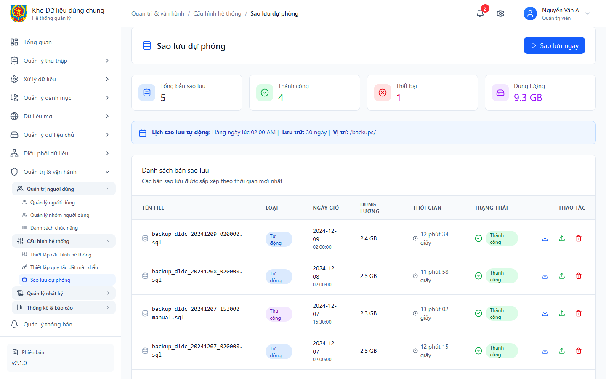

*Hình 17 – Màn hình sao lưu (Backup / Restore) hệ thống*

4.9.2.3.2.1 Mô tả thông tin trên màn hình
| **STT** | **Tên trường thông tin** | **Kiểu dữ liệu** | **Bắt buộc** | **Mặc định** | **Mô tả** |
| --- | --- | --- | --- | --- | --- |
| Tên bản sao lưu | VARCHAR2(255) | - | - | Tên file sao lưu định danh. |
| Kích thước | VARCHAR2(50) | - | - | Dung lượng của bản sao lưu (VD: 2.5 GB). |
| Phân loại | VARCHAR2(20) | - | - | Loại sao lưu (Tự động / Thủ công). |
| Trạng thái | VARCHAR2(50) | - | - | Trạng thái hiện tại của quá trình sao lưu (Hoàn thành / Lỗi / Đang xử lý). |
| Thời gian bắt đầu | DATE | - | - | Thời điểm bắt đầu tiến trình sao lưu. |
| Thời gian kết thúc | DATE | - | - | Thời điểm hoàn tất tiến trình sao lưu. |
| Người thực hiện | VARCHAR2(100) | - | - | Tên admin đã kích hoạt (nếu là thủ công) hoặc "System" (nếu là tự động). |

4.9.2.3.2.2 Chức năng trên màn hình
|  |  |  |  |
| --- | --- | --- | --- |
| **STT** | **Tên chức năng** | **Định dạng** | **Mô tả** |
| 1 | CN01 | Button text | Thực thi tiến trình sao lưu dự phòng thủ công ngay thời điểm hiện tại. |
| 2 | CN02 | Button icon | Tải file sao lưu về máy để lưu trữ cục bộ. |
| 3 | CN03 | Button icon | Mở màn hình xác nhận phục hồi toàn bộ dữ liệu từ bản sao lưu này. |
| 4 | CN04 | Button icon | Xem thông tin chi tiết của bản ghi sao lưu. |
| 5 | CN05 | Button icon | Mở popup xác nhận xóa bản ghi sao lưu và file tương ứng trên hệ thống. |

#### 4.9.2.3.3. MH18.P01 Màn hình Xác nhận phục hồi dữ liệu
Màn hình

<!--  -->
*(Hình ảnh đang được cập nhật)*

*Hình 18 – Màn hình xác nhận phục hồi hệ thống*

4.9.2.3.3.1 Mô tả thông tin trên màn hình
| **STT** | **Tên trường thông tin** | **Kiểu dữ liệu** | **Bắt buộc** | **Mặc định** | **Mô tả** |
| --- | --- | --- | --- | --- | --- |
| Cảnh báo khôi phục | VARCHAR2(500) | - | - | Đặt ra câu hỏi xác nhận kèm một số điểm rủi ro: Quá trình này không thể hoàn tác, tất cả dữ liệu từ sau thời điểm sao lưu sẽ bị xóa, người dùng cần xác nhận bằng cách nhập chữ "Khôi phục dữ liệu". |

4.9.2.3.3.2 Chức năng trên màn hình
|  |  |  |  |
| --- | --- | --- | --- |
| **STT** | **Tên chức năng** | **Định dạng** | **Mô tả** |
| 1 | CN01 | Button text | Tiến hành khôi phục dữ liệu hệ thống từ file backup. |
| 2 | CN02 | Button text | Hủy thao tác và đóng cửa sổ. |

## 4.9.3. DC1.QLHT.NK – Quản lý nhật ký

### 4.9.3.1. DC1.QLHT.NK.MH19 – Nhật ký truy cập

#### 4.9.3.1.1. Mục đích
Theo dõi và giám sát lịch sử đăng nhập/đăng xuất của người dùng, ghi nhận thông tin thiết bị và địa chỉ IP để truy vết bảo mật.

*+ Phân quyền*
Cán bộ quản trị và giám sát hệ thống.

*+ Điều kiện thực hiện*
Hệ thống tự động ghi nhận log mỗi phiên truy cập.

#### 4.9.3.1.2. MH19 Màn hình danh sách nhật ký truy cập
Màn hình

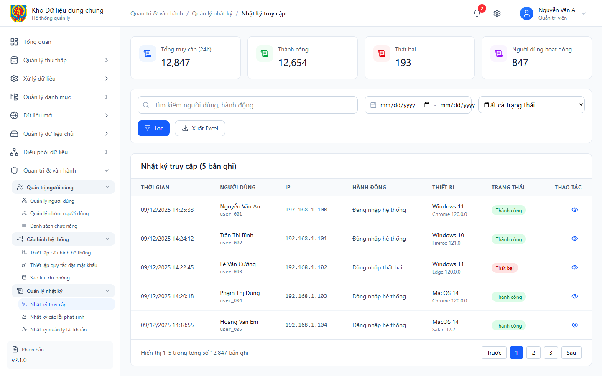

*Hình 19 – Báo cáo nhật ký truy cập hệ thống đăng nhập/đăng xuất*

4.9.3.1.2.1 Mô tả thông tin trên màn hình
| **STT** | **Tên trường thông tin** | **Kiểu dữ liệu** | **Bắt buộc** | **Mặc định** | **Mô tả** |
| --- | --- | --- | --- | --- | --- |
| Tài khoản | VARCHAR2(100) | - | - | Họ tên và Username của người dùng. |
| Thời gian | DATE | - | - | Thời điểm đăng nhập/đăng xuất/thao tác. |
| Sự kiện | VARCHAR2(50) | - | - | Loại sự kiện (Ví dụ: Đăng nhập, Đăng xuất, Đăng nhập thất bại). |
| Trình duyệt/Thiết bị | VARCHAR2(255) | - | - | Thông tin về trình duyệt (Chrome, Firefox...) và Hệ điều hành. |
| Địa chỉ IP | VARCHAR2(50) | - | - | Địa chỉ IP máy trạm của người dùng. |
| Trạng thái | VARCHAR2(20) | - | - | Thành công / Thất bại. |

4.9.3.1.2.2 Chức năng trên màn hình
|  |  |  |  |
| --- | --- | --- | --- |
| **STT** | **Tên chức năng** | **Định dạng** | **Mô tả** |
| 1 | CN01 | Button text | Lọc danh sách theo Từ khóa (Tài khoản, IP), Loại sự kiện, Khoảng thời gian, và Trạng thái. |
| 2 | CN02 | Button icon | Mở màn hình xem chi tiết thông tin của bản ghi truy cập lưu vết. |
| 3 | CN03 | Button text | Tải danh sách nhật ký đang lọc ra file Excel. |

#### 4.9.3.1.3. MH19.P01 Màn hình Chi tiết truy cập
Màn hình

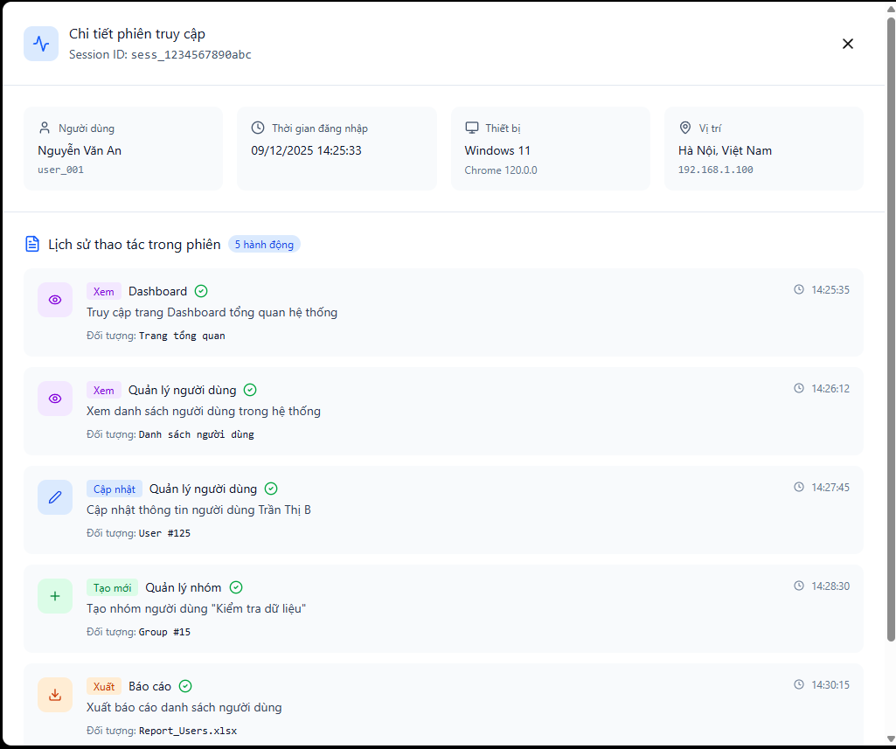

*Hình 20 – Màn hình chi tiết truy cập hệ thống*

4.9.3.1.3.1 Mô tả thông tin trên màn hình
| **STT** | **Tên trường thông tin** | **Kiểu dữ liệu** | **Bắt buộc** | **Mặc định** | **Mô tả** |
| --- | --- | --- | --- | --- | --- |
| Thông tin chung | VARCHAR2(500) | - | - | Bao gồm Thời gian, Sự kiện, Trạng thái. |
| Phân tích thiết bị | VARCHAR2(1000) | - | - | Chi tiết địa chỉ IP, User Agent, Trình duyệt, Hệ điều hành và Ước tính vị trí địa lý. |
| Dữ liệu giao thức | CLOB | - | - | Toàn bộ payload hoặc payload header của phiên truy cập. |

4.9.3.1.3.2 Chức năng trên màn hình
|  |  |  |  |
| --- | --- | --- | --- |
| **STT** | **Tên chức năng** | **Định dạng** | **Mô tả** |
| 1 | CN01 | Button text | Đóng cửa sổ chi tiết. |

### 4.9.3.2. DC1.QLHT.NK.MH20 – Nhật ký các lỗi phát sinh

#### 4.9.3.2.1. Mục đích
Tổng hợp các lỗi kỹ thuật, exceptions từ hệ thống để hỗ trợ cán bộ kỹ thuật phân tích và khắc phục sự cố.

*+ Phân quyền*
Cán bộ quản trị và đội ngũ hỗ trợ kỹ thuật.

*+ Điều kiện thực hiện*
Có lỗi phát sinh trong quá trình vận hành hệ thống.

#### 4.9.3.2.2. MH20 Màn hình danh sách lỗi
Màn hình

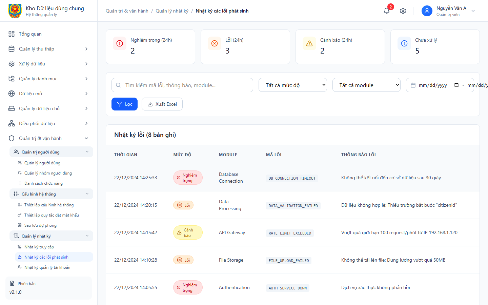

*Hình 21 – Màn hình theo dõi các Exception lỗi hệ thống*

4.9.3.2.2.1 Mô tả thông tin trên màn hình
| **STT** | **Tên trường thông tin** | **Kiểu dữ liệu** | **Bắt buộc** | **Mặc định** | **Mô tả** |
| --- | --- | --- | --- | --- | --- |
| Mã lỗi | VARCHAR2(50) | - | - | Mã định danh duy nhất của lỗi phục vụ tra cứu. |
| Thời gian | DATE | - | - | Thời điểm phát sinh lỗi. |
| Mức độ | VARCHAR2(50) | - | - | Các mức độ: Nghiêm trọng (Critical), Lỗi (Error), Cảnh báo (Warning), Thông tin (Info). |
| Module | VARCHAR2(255) | - | - | Phân hệ (API, DB, UI...) hoặc component xảy ra lỗi. |
| Thông điệp lỗi | VARCHAR2(1000) | - | - | Tóm tắt nguyên nhân hoặc text ngắn của lỗi đó. |
| Trạng thái xử lý | VARCHAR2(50) | - | - | Tình trạng theo dõi (Chưa xử lý, Đang kiểm tra, Đã khắc phục). |

4.9.3.2.2.2 Chức năng trên màn hình
|  |  |  |  |
| --- | --- | --- | --- |
| **STT** | **Tên chức năng** | **Định dạng** | **Mô tả** |
| 1 | CN01 | Button text | Tìm kiếm theo Từ khóa, Mức độ ưu tiên, Khoảng thời gian, và Trạng thái xử lý. |
| 2 | CN02 | Button icon | Mở màn hình xem toàn văn chi tiết của lỗi và stacktrace đi kèm. |
| 3 | CN03 | Button icon | Đánh dấu lỗi đã được khắc phục/bỏ qua. |
| 4 | CN04 | Button text | Xuất dữ liệu lỗi đang hiển thị ra file Excel. |

#### 4.9.3.2.3. MH20.P01 Màn hình Chi tiết lỗi phát sinh
Màn hình

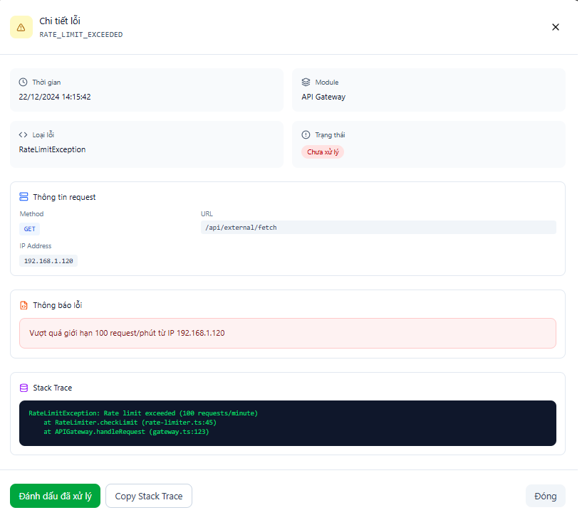

*Hình 22 – Màn hình xem chi tiết log lỗi*

4.9.3.2.3.1 Mô tả thông tin trên màn hình
| **STT** | **Tên trường thông tin** | **Kiểu dữ liệu** | **Bắt buộc** | **Mặc định** | **Mô tả** |
| --- | --- | --- | --- | --- | --- |
| Thông tin cơ bản | VARCHAR2(500) | - | - | Bao gồm Thời gian, Mức độ, Mã lỗi, Module, Trạng thái. |
| Thông điệp lỗi trực tiếp | VARCHAR2(1000) | - | - | Tóm tắt Text Exception. |
| Chi tiết Stacktrace | CLOB | - | - | Nội dung chi tiết call stack từ môi trường server phục vụ việc debug. |
| Thông tin Client/Request | VARCHAR2(1000) | - | - | Payload yêu cầu, IP truy vấn (nếu có tham gia của client). |

4.9.3.2.3.2 Chức năng trên màn hình
|  |  |  |  |
| --- | --- | --- | --- |
| **STT** | **Tên chức năng** | **Định dạng** | **Mô tả** |
| 1 | CN01 | Button text | Cập nhật trạng thái lỗi này sang "Đã khắc phục". |
| 2 | CN02 | Button text | Copy toàn văn đoạn Stacktrace lỗi ra clipboard. |
| 3 | CN03 | Button text | Tắt màn hình chi tiết. |

### 4.9.3.3. DC1.QLHT.NK.MH21 – Nhật ký quản lý tài khoản

#### 4.9.3.3.1. Mục đích
Lưu vết các thao tác thay đổi liên quan đến tài khoản người dùng (tạo mới, khóa, đổi mật khẩu) để kiểm soát trách nhiệm của admin.

*+ Phân quyền*
Cán bộ quản trị và giám sát hệ thống.

*+ Điều kiện thực hiện*
Có hành động tương tác với dữ liệu người dùng từ admin.

#### 4.9.3.3.2. MH21 Màn hình danh sách nhật ký tài khoản
Màn hình

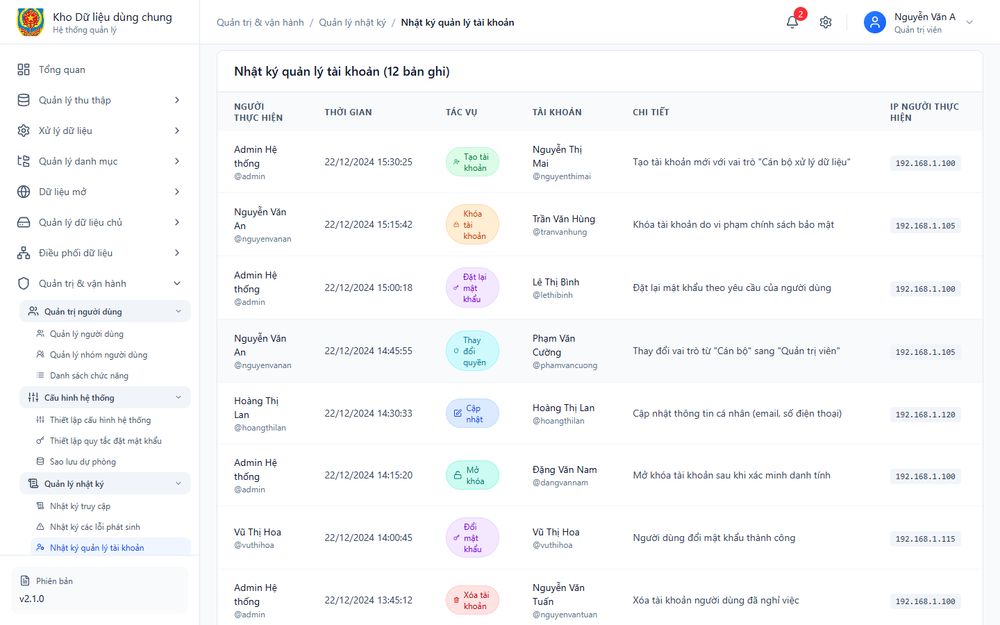

*Hình 23 – Nhật ký giám sát thay đổi trạng thái user*

4.9.3.3.2.1 Mô tả thông tin trên màn hình
| **STT** | **Tên trường thông tin** | **Kiểu dữ liệu** | **Bắt buộc** | **Mặc định** | **Mô tả** |
| --- | --- | --- | --- | --- | --- |
| Người thực hiện | VARCHAR2(100) | - | - | Họ tên và định danh của admin thao tác. |
| Thời gian | DATE | - | - | Thời điểm thực hiện hành động. |
| Tác vụ | VARCHAR2(100) | - | - | Phân loại tác vụ (Tạo tài khoản, Xóa, Khóa, Mở khóa, Đổi mật khẩu, Thay đổi quyền...). |
| Tài khoản đích | VARCHAR2(50) | - | - | Tài khoản bị tác động bởi hành động. |
| Chi tiết | VARCHAR2(1000) | - | - | Mô tả ngắn gọn thay đổi đã xảy ra. |
| IP người thực hiện | VARCHAR2(50) | - | - | Địa chỉ IP của máy admin dùng để thao tác. |
| Trạng thái | VARCHAR2(20) | - | - | Kết quả thực thi (Thành công / Thất bại). |

4.9.3.3.2.2 Chức năng trên màn hình
|  |  |  |  |
| --- | --- | --- | --- |
| **STT** | **Tên chức năng** | **Định dạng** | **Mô tả** |
| 1 | CN01 | Button text | Tra cứu theo tài khoản, tác vụ, thời gian và trạng thái. |
| 2 | CN02 | Button icon | Mở popup xem chi tiết lý do và giá trị đã thay đổi (Old/New value). |
| 3 | CN03 | Button text | Tải danh sách nhật ký quản lý tài khoản theo cấu hình tìm kiếm. |

#### 4.9.3.3.3. MH21.P01 Màn hình Chi tiết nhật ký
Màn hình

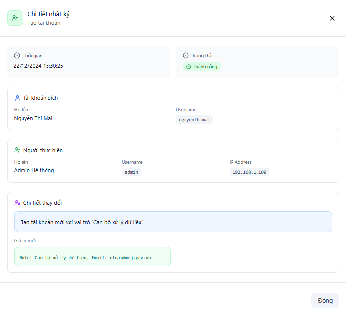

*Hình 24 – Màn hình chi tiết thay đổi tài khoản*

4.9.3.3.3.1 Mô tả thông tin trên màn hình
| **STT** | **Tên trường thông tin** | **Kiểu dữ liệu** | **Bắt buộc** | **Mặc định** | **Mô tả** |
| --- | --- | --- | --- | --- | --- |
| Thời gian, Trạng thái | VARCHAR2(500) | - | - | Thông tin chung của bản ghi lưu vết. |
| Tài khoản đích | VARCHAR2(255) | - | - | Chi tiết User bị tác động. |
| Người thực hiện | VARCHAR2(255) | - | - | Chi tiết Admin (Họ tên, Username, IP). |
| Chi tiết thay đổi | CLOB | - | - | Mô tả lý do (nếu có), chi tiết nội dung bị đổi, giá trị cũ (Old Value), giá trị mới (New Value). |

4.9.3.3.3.2 Chức năng trên màn hình
|  |  |  |  |
| --- | --- | --- | --- |
| **STT** | **Tên chức năng** | **Định dạng** | **Mô tả** |
| 1 | CN01 | Button text | Đóng cửa sổ chi tiết. |

### 4.9.3.4. DC1.QLHT.NK.MH22 – Nhật ký thay đổi cấu hình

#### 4.9.3.4.1. Mục đích
Theo dõi lịch sử thay đổi các tham số cấu hình hệ thống, cho phép kiểm tra giá trị cũ/mới và người thực hiện thay đổi.

*+ Phân quyền*
Cán bộ quản trị hệ thống.

*+ Điều kiện thực hiện*
Có sự thay đổi tham số trong phần cấu hình hệ thống.

#### 4.9.3.4.2. MH22 Màn hình danh sách thay đổi cấu hình
Màn hình

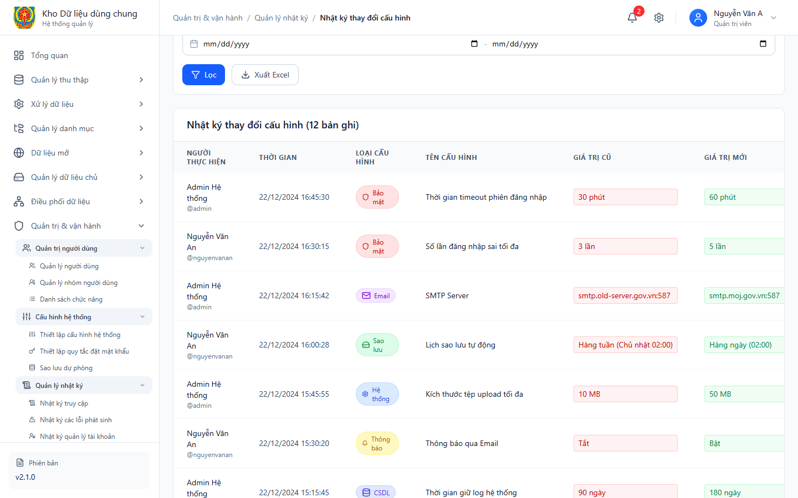

*Hình 25 – Nhật ký thay đổi tham số hệ thống chung*

4.9.3.4.2.1 Mô tả thông tin trên màn hình
| **STT** | **Tên trường thông tin** | **Kiểu dữ liệu** | **Bắt buộc** | **Mặc định** | **Mô tả** |
| --- | --- | --- | --- | --- | --- |
| Thời gian | DATE | - | - | Thời điểm cấu hình bị sửa đổi. |
| Người thực hiện | VARCHAR2(100) | - | - | Quản trị viên thay đổi tham số. |
| Phân loại | VARCHAR2(50) | - | - | Hệ thống, Bảo mật, Mật khẩu, Giao diện... |
| Tham số | VARCHAR2(255) | - | - | Tên setting bị đổi (VD: Thời gian hết hạn phiên làm việc). |
| Giá trị cũ | VARCHAR2(1000) | - | - | Giá trị trước khi tiến hành cập nhật. |
| Giá trị mới | VARCHAR2(1000) | - | - | Giá trị được ghi đè mới. |
| Trạng thái | VARCHAR2(20) | - | - | Thành công / Thất bại. |

4.9.3.4.2.2 Chức năng trên màn hình
|  |  |  |  |
| --- | --- | --- | --- |
| **STT** | **Tên chức năng** | **Định dạng** | **Mô tả** |
| 1 | CN01 | Button icon | Mở màn hình xác nhận Rollback trạng thái tham số về "Giá trị cũ". |
| 2 | CN02 | Button icon | Tham chiếu một số thông số thay đổi phức tạp trên hệ thống (dạng form/JSON). |
| 3 | CN03 | Button text | Tải danh sách thay đổi theo nhóm hệ thống ra file. |

## 4.9.4. DC1.QLHT.TKBC – Thống kê & báo cáo

### 4.9.4.1. DC1.QLHT.TKBC.MH23 – Xem biểu đồ thống kê

#### 4.9.4.1.1. Mục đích
Cung cấp các biểu đồ trực quan về hoạt động hệ thống, tỷ lệ đồng bộ thành công/thất bại theo thời gian và theo nguồn dữ liệu.

*+ Phân quyền*
Lãnh đạo và cán bộ quản trị hệ thống.

*+ Điều kiện thực hiện*
Hệ thống đã có dữ liệu vận hành để tổng hợp báo cáo.

#### 4.9.4.1.2. MH23 Màn hình biểu đồ thống kê
Màn hình

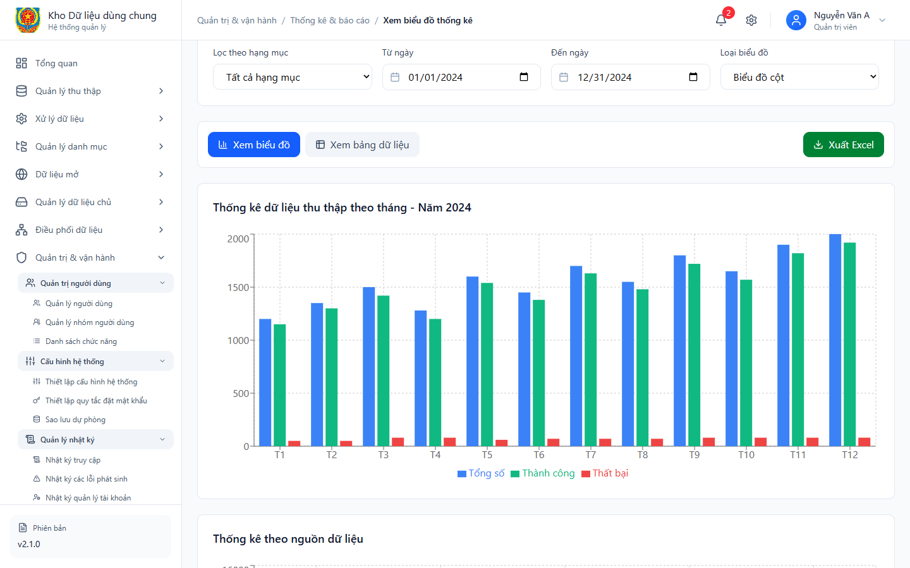

*Hình 26 – Màn hình báo cáo hoạt động hệ thống qua thị giác*

4.9.4.1.2.1 Mô tả thông tin trên màn hình
| **STT** | **Tên trường thông tin** | **Kiểu dữ liệu** | **Bắt buộc** | **Mặc định** | **Mô tả** |
| --- | --- | --- | --- | --- | --- |
| Thẻ thống kê tổng quan | VARCHAR2(500) | - | - | Thể hiện Tổng số bản ghi, Số lượng thành công, Thất bại và Tỷ lệ thành công. |
| Biểu đồ theo tháng | VARCHAR2(1000) | - | - | Có thể chuyển đổi hiển thị Cột/Đường biểu diễn độ biến động dữ liệu đồng bộ theo thời gian. |
| Phân bổ theo nguồn/hạng mục | VARCHAR2(1000) | - | - | Tỷ trọng bản ghi được phân chia theo nguồn (Đăng ký kinh doanh, Công chứng...). |
| Bảng dữ liệu chi tiết | CLOB | - | - | Bảng liệt kê chi tiết số lượng thực hiện theo từng tháng và tỷ lệ (tại chế độ Xem bảng). |

4.9.4.1.2.2 Chức năng trên màn hình
|  |  |  |  |
| --- | --- | --- | --- |
| **STT** | **Tên chức năng** | **Định dạng** | **Mô tả** |
| 1 | CN01 | Button text | Lọc dữ liệu theo Hạng mục, Từ ngày - Đến ngày và Loại biểu đồ. |
| 2 | CN02 | Button text | Chuyển đổi giữa chế độ "Xem biểu đồ" và "Xem bảng dữ liệu". |
| 3 | CN03 | Button text | Tải hình ảnh biểu đồ hiện hành xuống máy tính (PNG). |
| 4 | CN04 | Button text | Xuất toàn bộ Dashboard ra tệp tin báo cáo. |
| 5 | CN05 | Button text | Tải dòng dữ liệu thống kê ra file Excel. |
| 6 | CN06 | Button icon | (Trong Xem bảng) Mở popup hiển thị chỉ tiêu lỗi/thành công chi tiết của một tháng báo cáo. |

#5. PHỤ LỤC

| **STT** | **Function ID (*)** | **Tên CN** | **Mã Màn hình** | **Tên màn hình/API** | **# Mã Màn hình (mamanhinh.md)** | **# Tên màn hình/API (mamanhinh.md)** | **Mã quy trình** | **Tên quy trình** | **Mã UC (*)** | **Phần mềm** |
| --- | --- | --- | --- | --- | --- | --- | --- | --- | --- | --- |
| 1 | DC1-TT-QT-001 | Thêm mới phương thức thu thập dữ liệu (qua API, qua file) đối với một Cơ sở dữ liệu của Bộ ban ngành | DC1-UC001-MH1 | Thêm mới phương thức thu thập | **# MH02.P01a** | **# Thêm mới thiết lập** | DC1-TT | Thu thập | DC1-UC001 | DC1 |
| 2 | DC1-TT-QT-001 | Cập nhật lại phương thức thu thập dữ liệu (qua API, qua file) đối với một Cơ sở dữ liệu của Bộ ban ngành | DC1-UC001-MH2 | Cập nhật phương thức thu thập | **# MH02** | **# Quản lý thiết lập thu thập** | DC1-TT | Thu thập | DC1-UC001 | DC1 |
| 3 | DC1-TT-QT-001 | Xóa bỏ phương thức thu thập dữ liệu từ một Cơ sở dữ liệu của Bộ ban ngành | DC1-UC001-MH3 | Xác nhận xóa bỏ phương thức thu thâp | **# MH02.P03** | **# Xác nhận xóa thiết lập** | DC1-TT | Thu thập | DC1-UC001 | DC1 |
| 4 | DC1-TT-QT-001 | Xem thông tin chi tiết phương thức thu thập dữ liệu từ một Cơ sở dữ liệu của Bộ ban ngành | DC1-UC001-MH4 | Xem thông tin chi tiết | **# MH02.P02** | **# Xem chi tiết thiết lập** | DC1-TT | Thu thập | DC1-UC001 | DC1 |
| 5 | DC1-TT-QT-001 | Tra cứu phương thức thu thập dữ liệu đối với các Cơ sở dữ liệu theo Bộ ban ngành | DC1-UC001-MH5 | Màn danh sách thông tin | **# MH02.P05** | **# Kiểm tra Endpoint** | DC1-TT | Thu thập | DC1-UC001 | DC1 |
| 6 | DC1-TT-QT-001 | Kết xuất kết quả tra cứu phương thức thu thập dữ liệu đối với các Cơ sở dữ liệu theo Bộ ban ngành ra excel, csv... | DC1-UC001-MH6 | Màn danh sách thông tin | **# MH02.P05** | **# Kiểm tra Endpoint** | DC1-TT | Thu thập | DC1-UC001 | DC1 |
| 7 | DC1-TT-QT-002 | Tìm kiếm thông tin truy cập của người dùng | DC1-UC002-MH1 | Màn danh sách thông tin | **# MH03** | **# Nhật ký thu thập** | DC1-TT | Thu thập | DC1-UC002 | DC1 |
| 8 | DC1-TT-QT-002 | Xem chi tiết lịch sử truy cập của người dùng | DC1-UC002-MH2 | Xem chi tiết | **# MH03.P01** | **# Chi tiết nhật ký** | DC1-TT | Thu thập | DC1-UC002 | DC1 |
| 9 | DC1-TT-QT-002 | Tìm kiếm thông tin hoạt động của người dùng theo các tiêu chí | DC1-UC002-MH3 | Màn danh sách thông tin | **# MH03** | **# Nhật ký thu thập** | DC1-TT | Thu thập | DC1-UC002 | DC1 |
| 10 | DC1-TT-QT-002 | Xem chi tiết lịch sử hoạt động của người dùng | DC1-UC002-MH4 | Xem chi tiết | **# MH03.P01** | **# Chi tiết nhật ký** | DC1-TT | Thu thập | DC1-UC002 | DC1 |
| 11 | DC1-TT-QT-002 | Xem các thông tin khác của người dùng (địa chỉ IP, thiết bị sử dụng truy nhập, trình duyệt…) | DC1-UC002-MH5 | Xem danh sách | **# MH03** | **# Nhật ký thu thập** | DC1-TT | Thu thập | DC1-UC002 | DC1 |
| 12 | DC1-TT-QT-003 | Xem thông tin thu thập dữ liệu theo phương thức thu thập dữ liệu dưới dạng biểu đồ. | DC1-UC003-MH1 | Xem danh sách | **# MH04.M04** | **# Xem chi tiết dữ liệu Trong ngành** | DC1-TT | Thu thập | DC1-UC003 | DC1 |
| 13 | DC1-TT-QT-003 | Thu thập dữ liệu theo nguồn cung cấp dữ liệu dưới dạng biểu đồ | DC1-UC003-MH2 | Xem biểu đồ | **# MH04.M04** | **# Xem chi tiết dữ liệu Trong ngành** | DC1-TT | Thu thập | DC1-UC003 | DC1 |
| 14 | DC1-TT-QT-003 | Xem thông tin thu thập dữ liệu theo kết quả thu thập dữ liệu dưới dạng biểu đồ | DC1-UC003-MH3 | Xem danh sách | **# MH04.M04** | **# Xem chi tiết dữ liệu Trong ngành** | DC1-TT | Thu thập | DC1-UC003 | DC1 |
| 15 | DC1-TT-QT-003 | Xem thông tin thu thập dữ liệu theo thời gian dưới dạng biểu đồ. | DC1-UC003-MH4 | Xem danh sách | **# MH04.M04** | **# Xem chi tiết dữ liệu Trong ngành** | DC1-TT | Thu thập | DC1-UC003 | DC1 |
| 16 | DC1-TT-QT-004 | Kho dữ liệu dùng chung tiếp nhận dữ liệu Thông tin Bản án, quyết định từ hệ thống nguồn thông qua kênh tích hợp | DC1-UC004-MH1 | Màn xem chi tiết | **# MH05.M04** | **# Xem chi tiết dữ liệu Ngoài ngành** | DC1-TT | Thu thập | DC1-UC004 | DC1 |
| 17 | DC1-TT-QT-004 | hệ thống gửi thông báo lỗi kèm nguyên nhân. Nếu dữ liệu đạt yêu cầu, hệ thống tiếp nhận dữ liệu và thông báo thành công | DC1-UC004-MH1 | Màn xem chi tiết | **# MH05.M04** | **# Xem chi tiết dữ liệu Ngoài ngành** | DC1-TT | Thu thập | DC1-UC004 | DC1 |
| 18 | DC1-TT-QT-005 | Kho dữ liệu dùng chung tiếp nhận dữ liệu Danh mục giới tính từ hệ thống nguồn thông qua kênh tích hợp | DC1-UC005-MH1 | Màn xem chi tiết | **# MH06.M02** | **# Chi tiết đối soát TN** | DC1-TT | Thu thập | DC1-UC005 | DC1 |
| 19 | DC1-TT-QT-005 | Hệ thống gửi thông báo lỗi kèm nguyên nhân. Nếu dữ liệu đạt yêu cầu, hệ thống tiếp nhận dữ liệu và thông báo thành công | DC1-UC005-MH1 | Màn xem chi tiết | **# MH06.M03** | **# Chi tiết lỗi đối soát TN** | DC1-TT | Thu thập | DC1-UC005 | DC1 |
| 20 | DC1-TT-NN-006 | Kho dữ liệu dùng chung tiếp nhận dữ liệu Danh mục và mã các dân tộc từ hệ thống nguồn thông qua kênh tích hợp | DC1-UC006-MH2 | Màn xem chi tiết | **# N/A** | **# N/A** |  |  | DC1-TT | Thu thập |
| 21 | DC1-TT-NN-006 | Hệ thống gửi thông báo lỗi kèm nguyên nhân. Nếu dữ liệu đạt yêu cầu, hệ thống tiếp nhận dữ liệu và thông báo thành công | DC1-UC006-MH1 | Màn xem chi tiết | **# N/A** | **# N/A** |  |  | DC1-TT | Thu thập |
| 22 | DC1-TT-NN-007 | Kho dữ liệu dùng chung tiếp nhận dữ liệu Danh mục và mã Quốc gia, Quốc tịch từ hệ thống nguồn thông qua kênh tích hợp | DC1-UC007-MH2 | Màn xem chi tiết | **# N/A** | **# N/A** |  |  | DC1-TT | Thu thập |
| 23 | DC1-TT-NN-007 | Hệ thống gửi thông báo lỗi kèm nguyên nhân. Nếu dữ liệu đạt yêu cầu, hệ thống tiếp nhận dữ liệu và thông báo thành công | DC1-UC007-MH3 | Màn xem chi tiết | **# N/A** | **# N/A** |  |  | DC1-TT | Thu thập |
| 24 | DC1-TT-NN-008 | Kho dữ liệu dùng chung tiếp nhận dữ liệu Danh mục và mã các Tôn giáo từ hệ thống nguồn thông qua kênh tích hợp | DC1-UC008-MH1 | Màn xem chi tiết | **# N/A** | **# N/A** |  |  | DC1-TT | Thu thập |
| 25 | DC1-TT-NN-008 | Hệ thống gửi thông báo lỗi kèm nguyên nhân. Nếu dữ liệu đạt yêu cầu, hệ thống tiếp nhận dữ liệu và thông báo thành công | DC1-UC008-MH2 | Màn xem chi tiết | **# N/A** | **# N/A** |  |  | DC1-TT | Thu thập |
| 26 | DC1-TT-NN-009 | Kho dữ liệu dùng chung tiếp nhận dữ liệu Danh mục cơ quan từ hệ thống nguồn thông qua kênh tích hợp | DC1-UC009-MH1 | Màn xem chi tiết | **# N/A** | **# N/A** |  |  | DC1-TT | Thu thập |
| 27 | DC1-TT-NN-009 | Hệ thống gửi thông báo lỗi kèm nguyên nhân. Nếu dữ liệu đạt yêu cầu, hệ thống tiếp nhận dữ liệu và thông báo thành công | DC1-UC009-MH2 | Màn xem chi tiết | **# N/A** | **# N/A** |  |  | DC1-TT | Thu thập |
| 28 | DC1-TT-NN-010 | Kho dữ liệu dùng chung tiếp nhận dữ liệu Danh mục đơn vị hành chính từ hệ thống nguồn thông qua kênh tích hợp | DC1-UC010-MH1 | Màn xem chi tiết | **# N/A** | **# N/A** |  |  | DC1-TT | Thu thập |
| 29 | DC1-TT-NN-010 | Hệ thống gửi thông báo lỗi kèm nguyên nhân. Nếu dữ liệu đạt yêu cầu, hệ thống tiếp nhận dữ liệu và thông báo thành công | DC1-UC010-MH2 | Màn xem chi tiết | **# N/A** | **# N/A** |  |  | DC1-TT | Thu thập |
| 30 | DC1-TT-NN-011 | Kho dữ liệu dùng chung tiếp nhận dữ liệu Danh mục và mã mối quan hệ trong gia đình từ hệ thống nguồn thông qua kênh tích hợp | DC1-UC011-MH1 | Màn xem chi tiết | **# N/A** | **# N/A** |  |  | DC1-TT | Thu thập |
| 31 | DC1-TT-NN-011 | Hệ thống gửi thông báo lỗi kèm nguyên nhân. Nếu dữ liệu đạt yêu cầu, hệ thống tiếp nhận dữ liệu và thông báo thành công | DC1-UC011-MH2 | Màn xem chi tiết | **# N/A** | **# N/A** |  |  | DC1-TT | Thu thập |
| 32 | DC1-TT-NN-012 | Kho dữ liệu dùng chung tiếp nhận dữ liệu Danh mục mã giấy tờ tùy thân từ hệ thống nguồn thông qua kênh tích hợp | DC1-UC012-MH1 | Màn xem chi tiết | **# N/A** | **# N/A** |  |  | DC1-TT | Thu thập |
| 33 | DC1-TT-NN-012 | Hệ thống gửi thông báo lỗi kèm nguyên nhân. Nếu dữ liệu đạt yêu cầu, hệ thống tiếp nhận dữ liệu và thông báo thành công | DC1-UC012-MH2 | Màn xem chi tiết | **# N/A** | **# N/A** |  |  | DC1-TT | Thu thập |
| 34 | DC1-TT-NN-013 | Kho dữ liệu dùng chung tiếp nhận dữ liệu Bảo trợ xã hội và giảm nghèo - Hưởng trợ giúp xã hội từ hệ thống nguồn thông qua kênh tích hợp | DC1-UC013-MH1 | Màn xem chi tiết | **# N/A** | **# N/A** |  |  | DC1-TT | Thu thập |
| 35 | DC1-TT-NN-013 | Hệ thống gửi thông báo lỗi kèm nguyên nhân. Nếu dữ liệu đạt yêu cầu, hệ thống tiếp nhận dữ liệu và thông báo thành công | DC1-UC013-MH2 | Màn xem chi tiết | **# N/A** | **# N/A** |  |  | DC1-TT | Thu thập |
| 36 | DC1-TT-NN-013 | Kho dữ liệu dùng chung tiếp nhận dữ liệu Bảo trợ xã hội và giảm nghèo - Hưởng trợ giúp xã hội từ hệ thống nguồn thông qua kênh tích hợp | DC1-UC013-MH3 | Màn xem chi tiết | **# N/A** | **# N/A** |  |  | DC1-TT | Thu thập |
| 37 | DC1-TT-NN-014 | Kho dữ liệu dùng chung tiếp nhận dữ liệu Bảo trợ xã hội và giảm nghèo - Hưởng trợ giúp xã hội từ hệ thống nguồn thông qua kênh tích hợp | DC1-UC014-MH1 | Màn xem chi tiết | **# N/A** | **# N/A** |  |  | DC1-TT | Thu thập |
| 38 | DC1-TT-NN-014 | Hệ thống gửi thông báo lỗi kèm nguyên nhân. Nếu dữ liệu đạt yêu cầu, hệ thống tiếp nhận dữ liệu và thông báo thành công | DC1-UC014-MH2 | Màn xem chi tiết | **# N/A** | **# N/A** |  |  | DC1-TT | Thu thập |
| 39 | DC1-TT-NN-015 | Kho dữ liệu dùng chung tiếp nhận dữ liệu Bảo trợ xã hội và giảm nghèo - Thông tin người nghèo, cận nghèo từ hệ thống nguồn thông qua kênh tích hợp | DC1-UC015-MH1 | Màn xem chi tiết | **# N/A** | **# N/A** |  |  | DC1-TT | Thu thập |
| 40 | DC1-TT-NN-015 | Hệ thống gửi thông báo lỗi kèm nguyên nhân. Nếu dữ liệu đạt yêu cầu, hệ thống tiếp nhận dữ liệu và thông báo thành công | DC1-UC015-MH2 | Màn xem chi tiết | **# N/A** | **# N/A** |  |  | DC1-TT | Thu thập |
| 41 | DC1-TT-NN-016 | Kho dữ liệu dùng chung tiếp nhận dữ liệu Bảo trợ xã hội và giảm nghèo - Người đơn thân từ hệ thống nguồn thông qua kênh tích hợp | DC1-UC016-MH1 | Màn xem chi tiết | **# N/A** | **# N/A** |  |  | DC1-TT | Thu thập |
| 42 | DC1-TT-NN-016 | Hệ thống gửi thông báo lỗi kèm nguyên nhân. Nếu dữ liệu đạt yêu cầu, hệ thống tiếp nhận dữ liệu và thông báo thành công | DC1-UC016-MH2 | Màn xem chi tiết | **# N/A** | **# N/A** |  |  | DC1-TT | Thu thập |
| 43 | DC1-TT-NN-017 | Kho dữ liệu dùng chung tiếp nhận dữ liệu Bảo trợ xã hội và giảm nghèo - Trẻ em là đối tượng bảo trợ xã hội từ hệ thống nguồn thông qua kênh tích hợp | DC1-UC017-MH1 | Màn xem chi tiết | **# N/A** | **# N/A** |  |  | DC1-TT | Thu thập |
| 44 | DC1-TT-NN-017 | Hệ thống gửi thông báo lỗi kèm nguyên nhân. Nếu dữ liệu đạt yêu cầu, hệ thống tiếp nhận dữ liệu và thông báo thành công | DC1-UC017-MH2 | Màn xem chi tiết | **# N/A** | **# N/A** |  |  | DC1-TT | Thu thập |
| 45 | DC1-TT-NN-018 | Kho dữ liệu dùng chung tiếp nhận dữ liệu Bảo trợ xã hội và giảm nghèo -Người có HIV từ hệ thống nguồn thông qua kênh tích hợp | DC1-UC018-MH1 | Màn xem chi tiết | **# N/A** | **# N/A** |  |  | DC1-TT | Thu thập |
| 46 | DC1-TT-NN-018 | Hệ thống gửi thông báo lỗi kèm nguyên nhân. Nếu dữ liệu đạt yêu cầu, hệ thống tiếp nhận dữ liệu và thông báo thành công | DC1-UC018-MH2 | Màn xem chi tiết | **# N/A** | **# N/A** |  |  | DC1-TT | Thu thập |
| 47 | DC1-TT-NN-019 | Kho dữ liệu dùng chung tiếp nhận dữ liệu Bảo trợ xã hội và giảm nghèo -Người cao tuổi từ hệ thống nguồn thông qua kênh tích hợp | DC1-UC019-MH1 | Màn xem chi tiết | **# N/A** | **# N/A** |  |  | DC1-TT | Thu thập |
| 48 | DC1-TT-NN-019 | Hệ thống gửi thông báo lỗi kèm nguyên nhân. Nếu dữ liệu đạt yêu cầu, hệ thống tiếp nhận dữ liệu và thông báo thành công | DC1-UC019-MH2 | Màn xem chi tiết | **# N/A** | **# N/A** |  |  | DC1-TT | Thu thập |
| 49 | DC1-TT-NN-020 | Kho dữ liệu dùng chung tiếp nhận dữ liệu Bảo trợ xã hội và giảm nghèo - Thông tin về người khuyết tật từ hệ thống nguồn thông qua kênh tích hợp | DC1-UC020-MH1 | Màn xem chi tiết | **# N/A** | **# N/A** |  |  | DC1-TT | Thu thập |
| 50 | DC1-TT-NN-020 | Hệ thống gửi thông báo lỗi kèm nguyên nhân. Nếu dữ liệu đạt yêu cầu, hệ thống tiếp nhận dữ liệu và thông báo thành công | DC1-UC020-MH2 | Màn xem chi tiết | **# N/A** | **# N/A** |  |  | DC1-TT | Thu thập |
| 51 | DC1-TT-NN-021 | Kho dữ liệu dùng chung tiếp nhận dữ liệu Người có công - Hồ sơ công nhận người có công từ hệ thống nguồn thông qua kênh tích hợp | DC1-UC021-MH1 | Màn xem chi tiết | **# N/A** | **# N/A** |  |  | DC1-TT | Thu thập |
| 52 | DC1-TT-NN-021 | Hệ thống gửi thông báo lỗi kèm nguyên nhân. Nếu dữ liệu đạt yêu cầu, hệ thống tiếp nhận dữ liệu và thông báo thành công | DC1-UC021-MH2 | Màn xem chi tiết | **# N/A** | **# N/A** |  |  | DC1-TT | Thu thập |
| 53 | DC1-TT-NN-022 | Kho dữ liệu dùng chung tiếp nhận dữ liệu Người có công - Hồ sơ liệt sĩ: từ hệ thống nguồn thông qua kênh tích hợp | DC1-UC022-MH1 | Màn xem chi tiết | **# N/A** | **# N/A** |  |  | DC1-TT | Thu thập |
| 54 | DC1-TT-NN-022 | Hệ thống gửi thông báo lỗi kèm nguyên nhân. Nếu dữ liệu đạt yêu cầu, hệ thống tiếp nhận dữ liệu và thông báo thành công | DC1-UC022-MH2 | Màn xem chi tiết | **# N/A** | **# N/A** |  |  | DC1-TT | Thu thập |
| 55 | DC1-TT-NN-023 | Kho dữ liệu dùng chung tiếp nhận dữ liệu Người có công - Hồ sơ công nhận thân nhân người có công từ hệ thống nguồn thông qua kênh tích hợp | DC1-UC023-MH1 | Màn xem chi tiết | **# N/A** | **# N/A** |  |  | DC1-TT | Thu thập |
| 56 | DC1-TT-NN-023 | Hệ thống gửi thông báo lỗi kèm nguyên nhân. Nếu dữ liệu đạt yêu cầu, hệ thống tiếp nhận dữ liệu và thông báo thành công | DC1-UC023-MH2 | Màn xem chi tiết | **# N/A** | **# N/A** |  |  | DC1-TT | Thu thập |
| 57 | DC1-TT-NN-024 | Kho dữ liệu dùng chung tiếp nhận dữ liệu Trẻ em -Trẻ em từ hệ thống nguồn thông qua kênh tích hợp | DC1-UC024-MH1 | Màn xem chi tiết | **# N/A** | **# N/A** |  |  | DC1-TT | Thu thập |
| 58 | DC1-TT-NN-024 | Hệ thống gửi thông báo lỗi kèm nguyên nhân. Nếu dữ liệu đạt yêu cầu, hệ thống tiếp nhận dữ liệu và thông báo thành công | DC1-UC024-MH2 | Màn xem chi tiết | **# N/A** | **# N/A** |  |  | DC1-TT | Thu thập |
| 59 | DC1-TT-TN-TP-HT-025 | Kho dữ liệu dùng chung tiếp nhận dữ liệuiệu hồ sơ đăng ký khai sinh từ hệ thống nguồn thông qua kênh tích hợp | DC1-UC025-MH1 | Màn xem chi tiết | **# N/A** | **# N/A** |  |  | DC1-TT | Thu thập |
| 60 | DC1-TT-TN-TP-HT-025 | Hệ thống gửi thông báo lỗi kèm nguyên nhân. Nếu dữ liệu đạt yêu cầu, hệ thống tiếp nhận dữ liệu và thông báo thành công | DC1-UC025-MH2 | Màn xem chi tiết | **# N/A** | **# N/A** |  |  | DC1-TT | Thu thập |
| 61 | DC1-TT-TN-TP-HT-026 | Kho dữ liệu dùng chung tiếp nhận dữ liệuiệu hồ sơ đăng ký kết hôn từ hệ thống nguồn thông qua kênh tích hợp | DC1-UC026-MH1 | Màn xem chi tiết | **# N/A** | **# N/A** |  |  | DC1-TT | Thu thập |
| 62 | DC1-TT-TN-TP-HT-026 | Hệ thống gửi thông báo lỗi kèm nguyên nhân. Nếu dữ liệu đạt yêu cầu, hệ thống tiếp nhận dữ liệu và thông báo thành công | DC1-UC026-MH2 | Màn xem chi tiết | **# N/A** | **# N/A** |  |  | DC1-TT | Thu thập |
| 63 | DC1-TT-TN-TP-HT-027 | Kho dữ liệu dùng chung tiếp nhận dữ liệuiệu hồ sơ cấp Giấy xác nhận tình trạng hôn nhân từ hệ thống nguồn thông qua kênh tích hợp | DC1-UC027-MH1 | Màn xem chi tiết | **# N/A** | **# N/A** |  |  | DC1-TT | Thu thập |
| 64 | DC1-TT-TN-TP-HT-027 | Hệ thống gửi thông báo lỗi kèm nguyên nhân. Nếu dữ liệu đạt yêu cầu, hệ thống tiếp nhận dữ liệu và thông báo thành công | DC1-UC027-MH2 | Màn xem chi tiết | **# N/A** | **# N/A** |  |  | DC1-TT | Thu thập |
| 65 | DC1-TT-TN-TP-HT-028 | Kho dữ liệu dùng chung tiếp nhận dữ liệuiệu hồ sơ đăng ký khai tử từ hệ thống nguồn thông qua kênh tích hợp | DC1-UC028-MH1 | Màn xem chi tiết | **# N/A** | **# N/A** |  |  | DC1-TT | Thu thập |
| 66 | DC1-TT-TN-TP-HT-028 | Hệ thống gửi thông báo lỗi kèm nguyên nhân. Nếu dữ liệu đạt yêu cầu, hệ thống tiếp nhận dữ liệu và thông báo thành công | DC1-UC028-MH2 | Màn xem chi tiết | **# N/A** | **# N/A** |  |  | DC1-TT | Thu thập |
| 67 | DC1-TT-TN-TP-HT-029 | Kho dữ liệu dùng chung tiếp nhận dữ liệuiệu hồ sơ đăng ký nhận cha, mẹ, con từ hệ thống nguồn thông qua kênh tích hợp | DC1-UC029-MH1 | Màn xem chi tiết | **# N/A** | **# N/A** |  |  | DC1-TT | Thu thập |
| 68 | DC1-TT-TN-TP-HT-029 | Hệ thống gửi thông báo lỗi kèm nguyên nhân. Nếu dữ liệu đạt yêu cầu, hệ thống tiếp nhận dữ liệu và thông báo thành công | DC1-UC029-MH2 | Màn xem chi tiết | **# N/A** | **# N/A** |  |  | DC1-TT | Thu thập |
| 69 | DC1-TT-TN-TP-HT-030 | Kho dữ liệu dùng chung tiếp nhận dữ liệuiệu hồ sơ đăng ký nuôi con nuôi từ hệ thống nguồn thông qua kênh tích hợp | DC1-UC030-MH1 | Màn xem chi tiết | **# N/A** | **# N/A** |  |  | DC1-TT | Thu thập |
| 70 | DC1-TT-TN-TP-HT-030 | Hệ thống gửi thông báo lỗi kèm nguyên nhân. Nếu dữ liệu đạt yêu cầu, hệ thống tiếp nhận dữ liệu và thông báo thành công | DC1-UC030-MH2 | Màn xem chi tiết | **# N/A** | **# N/A** |  |  | DC1-TT | Thu thập |
| 71 | DC1-TT-TN-TP-HT-031 | Kho dữ liệu dùng chung tiếp nhận dữ liệuiệu hồ sơ đăng ký giám hộ từ hệ thống nguồn thông qua kênh tích hợp | DC1-UC031-MH1 | Màn xem chi tiết | **# N/A** | **# N/A** |  |  | DC1-TT | Thu thập |
| 72 | DC1-TT-TN-TP-HT-031 | Hệ thống gửi thông báo lỗi kèm nguyên nhân. Nếu dữ liệu đạt yêu cầu, hệ thống tiếp nhận dữ liệu và thông báo thành công | DC1-UC031-MH2 | Màn xem chi tiết | **# N/A** | **# N/A** |  |  | DC1-TT | Thu thập |
| 73 | DC1-TT-TN-TP-HT-032 | Kho dữ liệu dùng chung tiếp nhận dữ liệuiệu hồ sơ đăng ký chấm dứt giám hộ từ hệ thống nguồn thông qua kênh tích hợp | DC1-UC032-MH1 | Màn xem chi tiết | **# N/A** | **# N/A** |  |  | DC1-TT | Thu thập |
| 74 | DC1-TT-TN-TP-HT-032 | Hệ thống gửi thông báo lỗi kèm nguyên nhân. Nếu dữ liệu đạt yêu cầu, hệ thống tiếp nhận dữ liệu và thông báo thành công | DC1-UC032-MH2 | Màn xem chi tiết | **# N/A** | **# N/A** |  |  | DC1-TT | Thu thập |
| 75 | DC1-TT-TN-TP-HT-033 | Kho dữ liệu dùng chung tiếp nhận dữ liệuiệu hồ sơ đăng ký thay đổi, cải chính, bổ sung thông tin hộ tịch, xác định lại dân tộc từ hệ thống nguồn thông qua kênh tích hợp | DC1-UC033-MH1 | Màn xem chi tiết | **# N/A** | **# N/A** |  |  | DC1-TT | Thu thập |
| 76 | DC1-TT-TN-TP-HT-033 | Hệ thống gửi thông báo lỗi kèm nguyên nhân. Nếu dữ liệu đạt yêu cầu, hệ thống tiếp nhận dữ liệu và thông báo thành công | DC1-UC033-MH2 | Màn xem chi tiết | **# N/A** | **# N/A** |  |  | DC1-TT | Thu thập |
| 77 | DC1-TT-TN-TP-HT-034 | Kho dữ liệu dùng chung tiếp nhận dữ liệuiệu hồ sơ đăng ký giám sát việc giám hộ từ hệ thống nguồn thông qua kênh tích hợp | DC1-UC034-MH1 | Màn xem chi tiết | **# N/A** | **# N/A** |  |  | DC1-TT | Thu thập |
| 78 | DC1-TT-TN-TP-HT-034 | Hệ thống gửi thông báo lỗi kèm nguyên nhân. Nếu dữ liệu đạt yêu cầu, hệ thống tiếp nhận dữ liệu và thông báo thành công | DC1-UC034-MH2 | Màn xem chi tiết | **# N/A** | **# N/A** |  |  | DC1-TT | Thu thập |
| 79 | DC1-TT-TN-TP-HT-035 | Kho dữ liệu dùng chung tiếp nhận dữ liệuiệu hồ sơ đăng ký chấm dứt giám sát việc giám hộ từ hệ thống nguồn thông qua kênh tích hợp | DC1-UC035-MH1 | Màn xem chi tiết | **# N/A** | **# N/A** |  |  | DC1-TT | Thu thập |
| 80 | DC1-TT-TN-TP-HT-035 | Hệ thống gửi thông báo lỗi kèm nguyên nhân. Nếu dữ liệu đạt yêu cầu, hệ thống tiếp nhận dữ liệu và thông báo thành công | DC1-UC035-MH2 | Màn xem chi tiết | **# N/A** | **# N/A** |  |  | DC1-TT | Thu thập |
| 81 | DC1-TT-TN-TP-HT-036 | Kho dữ liệu dùng chung tiếp nhận dữ liệuiệu hồ sơ ghi vào sổ việc ly hôn/hủy việc kết hôn đã thực hiện tại cơ quan có thẩm quyền của nước ng từ hệ thống nguồn thông qua kênh tích hợp | DC1-UC036-MH1 | Màn xem chi tiết | **# N/A** | **# N/A** |  |  | DC1-TT | Thu thập |
| 82 | DC1-TT-TN-TP-HT-036 | Hệ thống gửi thông báo lỗi kèm nguyên nhân. Nếu dữ liệu đạt yêu cầu, hệ thống tiếp nhận dữ liệu và thông báo thành công | DC1-UC036-MH2 | Màn xem chi tiết | **# N/A** | **# N/A** |  |  | DC1-TT | Thu thập |
| 83 | DC1-TT-TN-TP-QT-037 | Kho dữ liệu dùng chung tiếp nhận dữ liệu Nhập Quốc tịch từ hệ thống nguồn thông qua kênh tích hợp | DC1-UC037-MH1 | Màn xem chi tiết | **# N/A** | **# N/A** |  |  | DC1-TT | Thu thập |
| 84 | DC1-TT-TN-TP-QT-037 | Hệ thống gửi thông báo lỗi kèm nguyên nhân. Nếu dữ liệu đạt yêu cầu, hệ thống tiếp nhận dữ liệu và thông báo thành công | DC1-UC037-MH2 | Màn xem chi tiết | **# N/A** | **# N/A** |  |  | DC1-TT | Thu thập |
| 85 | DC1-TT-TN-TP-QT-037-038 | Kho dữ liệu dùng chung tiếp nhận dữ liệu Thôi Quốc tịch từ hệ thống nguồn thông qua kênh tích hợp | DC1-UC038-MH1 | Màn xem chi tiết | **# N/A** | **# N/A** |  |  | DC1-TT | Thu thập |
| 86 | DC1-TT-TN-TP-QT-037-038 | Hệ thống gửi thông báo lỗi kèm nguyên nhân. Nếu dữ liệu đạt yêu cầu, hệ thống tiếp nhận dữ liệu và thông báo thành công | DC1-UC038-MH2 | Màn xem chi tiết | **# N/A** | **# N/A** |  |  | DC1-TT | Thu thập |
| 87 | DC1-TT-TN-TP-QT-037-038-039 | Kho dữ liệu dùng chung tiếp nhận dữ liệu Trở lại Quốc tịch từ hệ thống nguồn thông qua kênh tích hợp | DC1-UC039-MH1 | Màn xem chi tiết | **# N/A** | **# N/A** |  |  | DC1-TT | Thu thập |
| 88 | DC1-TT-TN-TP-QT-037-038-039 | Hệ thống gửi thông báo lỗi kèm nguyên nhân. Nếu dữ liệu đạt yêu cầu, hệ thống tiếp nhận dữ liệu và thông báo thành công | DC1-UC039-MH2 | Màn xem chi tiết | **# N/A** | **# N/A** |  |  | DC1-TT | Thu thập |
| 89 | DC1-TT-TN-THADS-040 | Kho dữ liệu dùng chung tiếp nhận dữ liệu Yêu cầu thi hành án của cá nhân, cơ quan, tổ chức từ hệ thống nguồn thông qua kênh tích hợp | DC1-UC040-MH1 | Màn xem chi tiết | **# N/A** | **# N/A** |  |  | DC1-TT | Thu thập |
| 90 | DC1-TT-TN-THADS-040 | Hệ thống gửi thông báo lỗi kèm nguyên nhân. Nếu dữ liệu đạt yêu cầu, hệ thống tiếp nhận dữ liệu và thông báo thành công | DC1-UC040-MH2 | Màn xem chi tiết | **# N/A** | **# N/A** |  |  | DC1-TT | Thu thập |
| 91 | DC1-TT-TN-THADS-041 | Kho dữ liệu dùng chung tiếp nhận dữ liệu Quyết định thi hành án dân sự từ hệ thống nguồn thông qua kênh tích hợp | DC1-UC041-MH1 | Màn xem chi tiết | **# N/A** | **# N/A** |  |  | DC1-TT | Thu thập |
| 92 | DC1-TT-TN-THADS-041 | Hệ thống gửi thông báo lỗi kèm nguyên nhân. Nếu dữ liệu đạt yêu cầu, hệ thống tiếp nhận dữ liệu và thông báo thành công | DC1-UC041-MH2 | Màn xem chi tiết | **# N/A** | **# N/A** |  |  | DC1-TT | Thu thập |
| 93 | DC1-TT-TN-THADS-042 | Kho dữ liệu dùng chung tiếp nhận dữ liệu Người phải thi hành án, người được thi hành án, người có quyền lợi nghĩa vụ liên quan từ hệ thống nguồn thông qua kênh tích hợp | DC1-UC042-MH1 | Màn xem chi tiết | **# N/A** | **# N/A** |  |  | DC1-TT | Thu thập |
| 94 | DC1-TT-TN-THADS-042 | Hệ thống gửi thông báo lỗi kèm nguyên nhân. Nếu dữ liệu đạt yêu cầu, hệ thống tiếp nhận dữ liệu và thông báo thành công | DC1-UC042-MH2 | Màn xem chi tiết | **# N/A** | **# N/A** |  |  | DC1-TT | Thu thập |
| 95 | DC1-TT-TN-THADS-043 | Kho dữ liệu dùng chung tiếp nhận dữ liệu Nghĩa vụ thi hành án từ hệ thống nguồn thông qua kênh tích hợp | DC1-UC043-MH1 | Màn xem chi tiết | **# N/A** | **# N/A** |  |  | DC1-TT | Thu thập |
| 96 | DC1-TT-TN-THADS-043 | Hệ thống gửi thông báo lỗi kèm nguyên nhân. Nếu dữ liệu đạt yêu cầu, hệ thống tiếp nhận dữ liệu và thông báo thành công | DC1-UC043-MH2 | Màn xem chi tiết | **# N/A** | **# N/A** |  |  | DC1-TT | Thu thập |
| 97 | DC1-TT-TN-THADS-044 | Kho dữ liệu dùng chung tiếp nhận dữ liệu Trạng thái thi hành án từ hệ thống nguồn thông qua kênh tích hợp | DC1-UC044-MH1 | Màn xem chi tiết | **# N/A** | **# N/A** |  |  | DC1-TT | Thu thập |
| 98 | DC1-TT-TN-THADS-044 | Hệ thống gửi thông báo lỗi kèm nguyên nhân. Nếu dữ liệu đạt yêu cầu, hệ thống tiếp nhận dữ liệu và thông báo thành công | DC1-UC044-MH2 | Màn xem chi tiết | **# N/A** | **# N/A** |  |  | DC1-TT | Thu thập |
| 99 | DC1-TT-TN-THADS-045 | Kho dữ liệu dùng chung tiếp nhận dữ liệu Tài sản thi hành án từ hệ thống nguồn thông qua kênh tích hợp | DC1-UC045-MH1 | Màn xem chi tiết | **# N/A** | **# N/A** |  |  | DC1-TT | Thu thập |
| 100 | DC1-TT-TN-THADS-045 | Hệ thống gửi thông báo lỗi kèm nguyên nhân. Nếu dữ liệu đạt yêu cầu, hệ thống tiếp nhận dữ liệu và thông báo thành công | DC1-UC045-MH2 | Màn xem chi tiết | **# N/A** | **# N/A** |  |  | DC1-TT | Thu thập |
| 101 | DC1-TT-TN-THADS-046 | Kho dữ liệu dùng chung tiếp nhận dữ liệu Xác minh điều kiện trong thi hành án dân sự từ hệ thống nguồn thông qua kênh tích hợp | DC1-UC046-MH1 | Màn xem chi tiết | **# N/A** | **# N/A** |  |  | DC1-TT | Thu thập |
| 102 | DC1-TT-TN-THADS-046 | Hệ thống gửi thông báo lỗi kèm nguyên nhân. Nếu dữ liệu đạt yêu cầu, hệ thống tiếp nhận dữ liệu và thông báo thành công | DC1-UC046-MH2 | Màn xem chi tiết | **# N/A** | **# N/A** |  |  | DC1-TT | Thu thập |
| 103 | DC1-TT-TN-THADS-047 | Kho dữ liệu dùng chung tiếp nhận dữ liệu Cưỡng chế thi hành án trong thi hành án dân sự từ hệ thống nguồn thông qua kênh tích hợp | DC1-UC047-MH1 | Màn xem chi tiết | **# N/A** | **# N/A** |  |  | DC1-TT | Thu thập |
| 104 | DC1-TT-TN-THADS-047 | Hệ thống gửi thông báo lỗi kèm nguyên nhân. Nếu dữ liệu đạt yêu cầu, hệ thống tiếp nhận dữ liệu và thông báo thành công | DC1-UC047-MH2 | Màn xem chi tiết | **# N/A** | **# N/A** |  |  | DC1-TT | Thu thập |
| 105 | DC1-TT-TN-THADS-048 | Kho dữ liệu dùng chung tiếp nhận dữ liệu Áp dụng biện pháp bảo đảm trong thi hành án dân sự từ hệ thống nguồn thông qua kênh tích hợp | DC1-UC048-MH1 | Màn xem chi tiết | **# N/A** | **# N/A** |  |  | DC1-TT | Thu thập |
| 106 | DC1-TT-TN-THADS-048 | Hệ thống gửi thông báo lỗi kèm nguyên nhân. Nếu dữ liệu đạt yêu cầu, hệ thống tiếp nhận dữ liệu và thông báo thành công | DC1-UC048-MH2 | Màn xem chi tiết | **# N/A** | **# N/A** |  |  | DC1-TT | Thu thập |
| 107 | DC1-TT-TN-THADS-049 | Kho dữ liệu dùng chung tiếp nhận dữ liệu Chứng từ nghiệp vụ trong thi hành án dân sự từ hệ thống nguồn thông qua kênh tích hợp | DC1-UC049-MH1 | Màn xem chi tiết | **# N/A** | **# N/A** |  |  | DC1-TT | Thu thập |
| 108 | DC1-TT-TN-THADS-049 | Hệ thống gửi thông báo lỗi kèm nguyên nhân. Nếu dữ liệu đạt yêu cầu, hệ thống tiếp nhận dữ liệu và thông báo thành công | DC1-UC049-MH2 | Màn xem chi tiết | **# N/A** | **# N/A** |  |  | DC1-TT | Thu thập |
| 109 | DC1-TT-TN-THADS-050 | Kho dữ liệu dùng chung tiếp nhận dữ liệu Biên lai thu tiền thi hành án dân sự từ hệ thống nguồn thông qua kênh tích hợp | DC1-UC050-MH1 | Màn xem chi tiết | **# N/A** | **# N/A** |  |  | DC1-TT | Thu thập |
| 110 | DC1-TT-TN-THADS-050 | Hệ thống gửi thông báo lỗi kèm nguyên nhân. Nếu dữ liệu đạt yêu cầu, hệ thống tiếp nhận dữ liệu và thông báo thành công | DC1-UC050-MH2 | Màn xem chi tiết | **# N/A** | **# N/A** |  |  | DC1-TT | Thu thập |
| 111 | DC1-TT-TN-THADS-051 | Kho dữ liệu dùng chung tiếp nhận dữ liệu Vật chứng trong thi hành án dân sự từ hệ thống nguồn thông qua kênh tích hợp | DC1-UC051-MH1 | Màn xem chi tiết | **# N/A** | **# N/A** |  |  | DC1-TT | Thu thập |
| 112 | DC1-TT-TN-THADS-051 | Hệ thống gửi thông báo lỗi kèm nguyên nhân. Nếu dữ liệu đạt yêu cầu, hệ thống tiếp nhận dữ liệu và thông báo thành công | DC1-UC051-MH2 | Màn xem chi tiết | **# N/A** | **# N/A** |  |  | DC1-TT | Thu thập |
| 113 | DC1-TT-TN-THADS-052 | Kho dữ liệu dùng chung tiếp nhận dữ liệu Thẩm định giá tài sản trong thi hành án dân sự từ hệ thống nguồn thông qua kênh tích hợp | DC1-UC052-MH1 | Màn xem chi tiết | **# N/A** | **# N/A** |  |  | DC1-TT | Thu thập |
| 114 | DC1-TT-TN-THADS-052 | Hệ thống gửi thông báo lỗi kèm nguyên nhân. Nếu dữ liệu đạt yêu cầu, hệ thống tiếp nhận dữ liệu và thông báo thành công | DC1-UC052-MH2 | Màn xem chi tiết | **# N/A** | **# N/A** |  |  | DC1-TT | Thu thập |
| 115 | DC1-TT-TN-THADS-053 | Kho dữ liệu dùng chung tiếp nhận dữ liệu Đấu giá tài sản trong thi hành án dân sự từ hệ thống nguồn thông qua kênh tích hợp | DC1-UC053-MH1 | Màn xem chi tiết | **# N/A** | **# N/A** |  |  | DC1-TT | Thu thập |
| 116 | DC1-TT-TN-THADS-053 | Hệ thống gửi thông báo lỗi kèm nguyên nhân. Nếu dữ liệu đạt yêu cầu, hệ thống tiếp nhận dữ liệu và thông báo thành công | DC1-UC053-MH2 | Màn xem chi tiết | **# N/A** | **# N/A** |  |  | DC1-TT | Thu thập |
| 117 | DC1-TT-TN-THADS-054 | Kho dữ liệu dùng chung tiếp nhận dữ liệu Giải quyết khiếu nại, tố cáo trong thi hành án dân sự từ hệ thống nguồn thông qua kênh tích hợp | DC1-UC054-MH1 | Màn xem chi tiết | **# N/A** | **# N/A** |  |  | DC1-TT | Thu thập |
| 118 | DC1-TT-TN-THADS-054 | Hệ thống gửi thông báo lỗi kèm nguyên nhân. Nếu dữ liệu đạt yêu cầu, hệ thống tiếp nhận dữ liệu và thông báo thành công | DC1-UC054-MH2 | Màn xem chi tiết | **# N/A** | **# N/A** |  |  | DC1-TT | Thu thập |
| 119 | DC1-TT-TN-THADS-055 | Kho dữ liệu dùng chung tiếp nhận dữ liệu Hướng dẫn nghiệp vụ trong thi hành án dân sự từ hệ thống nguồn thông qua kênh tích hợp | DC1-UC055-MH1 | Màn xem chi tiết | **# N/A** | **# N/A** |  |  | DC1-TT | Thu thập |
| 120 | DC1-TT-TN-THADS-055 | Hệ thống gửi thông báo lỗi kèm nguyên nhân. Nếu dữ liệu đạt yêu cầu, hệ thống tiếp nhận dữ liệu và thông báo thành công | DC1-UC055-MH2 | Màn xem chi tiết | **# N/A** | **# N/A** |  |  | DC1-TT | Thu thập |
| 121 | DC1-TT-TN-GDDB-BPDB-056 | Kho dữ liệu dùng chung tiếp nhận dữ liệu Thông tin chung (Bao gồm người đăng ký và Hợp đồng bảo đảm) từ hệ thống nguồn thông qua kênh tích hợp | DC1-UC056-MH1 | Màn xem chi tiết | **# N/A** | **# N/A** |  |  | DC1-TT | Thu thập |
| 122 | DC1-TT-TN-GDDB-BPDB-056 | Hệ thống gửi thông báo lỗi kèm nguyên nhân. Nếu dữ liệu đạt yêu cầu, hệ thống tiếp nhận dữ liệu và thông báo thành công | DC1-UC056-MH2 | Màn xem chi tiết | **# N/A** | **# N/A** |  |  | DC1-TT | Thu thập |
| 123 | DC1-TT-TN-GDDB-BPDB-057 | Kho dữ liệu dùng chung tiếp nhận dữ liệu Bên bảo đảm từ hệ thống nguồn thông qua kênh tích hợp | DC1-UC057-MH1 | Màn xem chi tiết | **# N/A** | **# N/A** |  |  | DC1-TT | Thu thập |
| 124 | DC1-TT-TN-GDDB-BPDB-057 | Hệ thống gửi thông báo lỗi kèm nguyên nhân. Nếu dữ liệu đạt yêu cầu, hệ thống tiếp nhận dữ liệu và thông báo thành công | DC1-UC057-MH2 | Màn xem chi tiết | **# N/A** | **# N/A** |  |  | DC1-TT | Thu thập |
| 125 | DC1-TT-TN-GDDB-BPDB-058 | Kho dữ liệu dùng chung tiếp nhận dữ liệu Bên nhận bảo đảm từ hệ thống nguồn thông qua kênh tích hợp | DC1-UC058-MH1 | Màn xem chi tiết | **# N/A** | **# N/A** |  |  | DC1-TT | Thu thập |
| 126 | DC1-TT-TN-GDDB-BPDB-058 | Hệ thống gửi thông báo lỗi kèm nguyên nhân. Nếu dữ liệu đạt yêu cầu, hệ thống tiếp nhận dữ liệu và thông báo thành công | DC1-UC058-MH2 | Màn xem chi tiết | **# N/A** | **# N/A** |  |  | DC1-TT | Thu thập |
| 127 | DC1-TT-TN-GDDB-BPDB-059 | Kho dữ liệu dùng chung tiếp nhận dữ liệu Tài sản bảo đảm từ hệ thống nguồn thông qua kênh tích hợp | DC1-UC059-MH1 | Màn xem chi tiết | **# N/A** | **# N/A** |  |  | DC1-TT | Thu thập |
| 128 | DC1-TT-TN-GDDB-BPDB-059 | Hệ thống gửi thông báo lỗi kèm nguyên nhân. Nếu dữ liệu đạt yêu cầu, hệ thống tiếp nhận dữ liệu và thông báo thành công | DC1-UC059-MH2 | Màn xem chi tiết | **# N/A** | **# N/A** |  |  | DC1-TT | Thu thập |
| 129 | DC1-TT-TN-KT&XLVP-PL-060 | Kho dữ liệu dùng chung tiếp nhận dữ liệu Văn bản quy phạm pháp luật từ hệ thống nguồn thông qua kênh tích hợp | DC1-UC060-MH1 | Màn xem chi tiết | **# N/A** | **# N/A** |  |  | DC1-TT | Thu thập |
| 130 | DC1-TT-TN-KT&XLVP-PL-060 | Hệ thống gửi thông báo lỗi kèm nguyên nhân. Nếu dữ liệu đạt yêu cầu, hệ thống tiếp nhận dữ liệu và thông báo thành công | DC1-UC060-MH2 | Màn xem chi tiết | **# N/A** | **# N/A** |  |  | DC1-TT | Thu thập |
| 131 | DC1-TT-TN-KT&XLVP-PL-061 | Kho dữ liệu dùng chung tiếp nhận dữ liệu Nội dung của văn bản quy phạm pháp luật từ hệ thống nguồn thông qua kênh tích hợp | DC1-UC061-MH1 | Màn xem chi tiết | **# N/A** | **# N/A** |  |  | DC1-TT | Thu thập |
| 132 | DC1-TT-TN-KT&XLVP-PL-061 | Hệ thống gửi thông báo lỗi kèm nguyên nhân. Nếu dữ liệu đạt yêu cầu, hệ thống tiếp nhận dữ liệu và thông báo thành công | DC1-UC061-MH1 | Màn xem chi tiết | **# N/A** | **# N/A** |  |  | DC1-TT | Thu thập |
| 133 | DC1-TT-TN-KT&XLVP-PL-062 | Kho dữ liệu dùng chung tiếp nhận dữ liệu Quan hệ giữa các điều khoản trong các văn bản quy phạm pháp luật từ hệ thống nguồn thông qua kênh tích hợp | DC1-UC062-MH1 | Màn xem chi tiết | **# N/A** | **# N/A** |  |  | DC1-TT | Thu thập |
| 134 | DC1-TT-TN-KT&XLVP-PL-062 | Hệ thống gửi thông báo lỗi kèm nguyên nhân. Nếu dữ liệu đạt yêu cầu, hệ thống tiếp nhận dữ liệu và thông báo thành công | DC1-UC062-MH1 | Màn xem chi tiết | **# N/A** | **# N/A** |  |  | DC1-TT | Thu thập |
| 135 | DC1-TT-TN-KT&XLVP-PL-063 | Kho dữ liệu dùng chung tiếp nhận dữ liệu Văn bản hợp nhất từ hệ thống nguồn thông qua kênh tích hợp | DC1-UC063-MH1 | Màn xem chi tiết | **# N/A** | **# N/A** |  |  | DC1-TT | Thu thập |
| 136 | DC1-TT-TN-KT&XLVP-PL-063 | Hệ thống gửi thông báo lỗi kèm nguyên nhân. Nếu dữ liệu đạt yêu cầu, hệ thống tiếp nhận dữ liệu và thông báo thành công | DC1-UC063-MH1 | Màn xem chi tiết | **# N/A** | **# N/A** |  |  | DC1-TT | Thu thập |
| 137 | DC1-TT-TN-KT&XLVP-PL-064 | Kho dữ liệu dùng chung tiếp nhận dữ liệu Hệ thống hóa văn bản quy phạm pháp luật từ hệ thống nguồn thông qua kênh tích hợp | DC1-UC064-MH1 | Màn xem chi tiết | **# N/A** | **# N/A** |  |  | DC1-TT | Thu thập |
| 138 | DC1-TT-TN-KT&XLVP-PL-064 | Hệ thống gửi thông báo lỗi kèm nguyên nhân. Nếu dữ liệu đạt yêu cầu, hệ thống tiếp nhận dữ liệu và thông báo thành công | DC1-UC064-MH1 | Màn xem chi tiết | **# N/A** | **# N/A** |  |  | DC1-TT | Thu thập |
| 139 | DC1-TT-TN-KT&XLVP-TTTP-065 | Kho dữ liệu dùng chung tiếp nhận dữ liệu Hồ sơ ủy thác tư pháp đến từ hệ thống nguồn thông qua kênh tích hợp | DC1-UC065-MH1 | Màn xem chi tiết | **# N/A** | **# N/A** |  |  | DC1-TT | Thu thập |
| 140 | DC1-TT-TN-KT&XLVP-TTTP-065 | Hệ thống gửi thông báo lỗi kèm nguyên nhân. Nếu dữ liệu đạt yêu cầu, hệ thống tiếp nhận dữ liệu và thông báo thành công | DC1-UC065-MH1 | Màn xem chi tiết | **# N/A** | **# N/A** |  |  | DC1-TT | Thu thập |
| 141 | DC1-TT-TN-KT&XLVP-TTTP-066 | Kho dữ liệu dùng chung tiếp nhận dữ liệu Hồ sơ ủy thác tư pháp đi từ hệ thống nguồn thông qua kênh tích hợp | DC1-UC066-MH1 | Màn xem chi tiết | **# N/A** | **# N/A** |  |  | DC1-TT | Thu thập |
| 142 | DC1-TT-TN-KT&XLVP-TTTP-066 | Hệ thống gửi thông báo lỗi kèm nguyên nhân. Nếu dữ liệu đạt yêu cầu, hệ thống tiếp nhận dữ liệu và thông báo thành công | DC1-UC066-MH1 | Màn xem chi tiết | **# N/A** | **# N/A** |  |  | DC1-TT | Thu thập |
| 143 | DC1-TT-TN-KT&XLVP-TGPL-067 | Kho dữ liệu dùng chung tiếp nhận dữ liệu Tổ chức thực hiện trợ giúp pháp lý từ hệ thống nguồn thông qua kênh tích hợp | DC1-UC067-MH1 | Màn xem chi tiết | **# N/A** | **# N/A** |  |  | DC1-TT | Thu thập |
| 144 | DC1-TT-TN-KT&XLVP-TGPL-067 | Hệ thống gửi thông báo lỗi kèm nguyên nhân. Nếu dữ liệu đạt yêu cầu, hệ thống tiếp nhận dữ liệu và thông báo thành công | DC1-UC067-MH1 | Màn xem chi tiết | **# N/A** | **# N/A** |  |  | DC1-TT | Thu thập |
| 145 | DC1-TT-TN-KT&XLVP-TGPL-068 | Kho dữ liệu dùng chung tiếp nhận dữ liệu Tổ chức đăng ký tham gia trợ giúp pháp lý từ hệ thống nguồn thông qua kênh tích hợp | DC1-UC068-MH1 | Màn xem chi tiết | **# N/A** | **# N/A** |  |  | DC1-TT | Thu thập |
| 146 | DC1-TT-TN-KT&XLVP-TGPL-068 | Hệ thống gửi thông báo lỗi kèm nguyên nhân. Nếu dữ liệu đạt yêu cầu, hệ thống tiếp nhận dữ liệu và thông báo thành công | DC1-UC068-MH1 | Màn xem chi tiết | **# N/A** | **# N/A** |  |  | DC1-TT | Thu thập |
| 147 | DC1-TT-TN-KT&XLVP-TGPL-069 | Kho dữ liệu dùng chung tiếp nhận dữ liệu Thông tin văn bản cử người thực hiện trợ giúp pháp lý từ hệ thống nguồn thông qua kênh tích hợp | DC1-UC069-MH1 | Màn xem chi tiết | **# N/A** | **# N/A** |  |  | DC1-TT | Thu thập |
| 148 | DC1-TT-TN-KT&XLVP-TGPL-069 | Hệ thống gửi thông báo lỗi kèm nguyên nhân. Nếu dữ liệu đạt yêu cầu, hệ thống tiếp nhận dữ liệu và thông báo thành công | DC1-UC069-MH1 | Màn xem chi tiết | **# N/A** | **# N/A** |  |  | DC1-TT | Thu thập |
| 149 | DC1-TT-TN-KT&XLVP-TGPL-070 | Kho dữ liệu dùng chung tiếp nhận dữ liệu Trung tâm TGPL nhà nước từ hệ thống nguồn thông qua kênh tích hợp | DC1-UC070-MH1 | Màn xem chi tiết | **# N/A** | **# N/A** |  |  | DC1-TT | Thu thập |
| 150 | DC1-TT-TN-KT&XLVP-TGPL-070 | Hệ thống gửi thông báo lỗi kèm nguyên nhân. Nếu dữ liệu đạt yêu cầu, hệ thống tiếp nhận dữ liệu và thông báo thành công | DC1-UC070-MH1 | Màn xem chi tiết | **# N/A** | **# N/A** |  |  | DC1-TT | Thu thập |
| 151 | DC1-TT-TN-KT&XLVP-TGPL-071 | Kho dữ liệu dùng chung tiếp nhận dữ liệu Chi nhánh TGPL từ hệ thống nguồn thông qua kênh tích hợp | DC1-UC071-MH1 | Màn xem chi tiết | **# N/A** | **# N/A** |  |  | DC1-TT | Thu thập |
| 152 | DC1-TT-TN-KT&XLVP-TGPL-071 | Hệ thống gửi thông báo lỗi kèm nguyên nhân. Nếu dữ liệu đạt yêu cầu, hệ thống tiếp nhận dữ liệu và thông báo thành công | DC1-UC071-MH1 | Màn xem chi tiết | **# N/A** | **# N/A** |  |  | DC1-TT | Thu thập |
| 153 | DC1-TT-TN-KT&XLVP-TGPL-072 | Kho dữ liệu dùng chung tiếp nhận dữ liệu Người thực hiện TGPL từ hệ thống nguồn thông qua kênh tích hợp | DC1-UC072-MH1 | Màn xem chi tiết | **# N/A** | **# N/A** |  |  | DC1-TT | Thu thập |
| 154 | DC1-TT-TN-KT&XLVP-TGPL-072 | Hệ thống gửi thông báo lỗi kèm nguyên nhân. Nếu dữ liệu đạt yêu cầu, hệ thống tiếp nhận dữ liệu và thông báo thành công | DC1-UC072-MH1 | Màn xem chi tiết | **# N/A** | **# N/A** |  |  | DC1-TT | Thu thập |
| 155 | DC1-TT-TN-KT&XLVP-GD&HG-073 | Kho dữ liệu dùng chung tiếp nhận dữ liệu Báo cáo viên pháp luật từ hệ thống nguồn thông qua kênh tích hợp | DC1-UC073-MH1 | Màn xem chi tiết | **# N/A** | **# N/A** |  |  | DC1-TT | Thu thập |
| 156 | DC1-TT-TN-KT&XLVP-GD&HG-073 | Hệ thống gửi thông báo lỗi kèm nguyên nhân. Nếu dữ liệu đạt yêu cầu, hệ thống tiếp nhận dữ liệu và thông báo thành công | DC1-UC073-MH1 | Màn xem chi tiết | **# N/A** | **# N/A** |  |  | DC1-TT | Thu thập |
| 157 | DC1-TT-TN-KT&XLVP-GD&HG-074 | Kho dữ liệu dùng chung tiếp nhận dữ liệu Tuyên truyền viên pháp luật từ hệ thống nguồn thông qua kênh tích hợp | DC1-UC074-MH1 | Màn xem chi tiết | **# N/A** | **# N/A** |  |  | DC1-TT | Thu thập |
| 158 | DC1-TT-TN-KT&XLVP-GD&HG-074 | Hệ thống gửi thông báo lỗi kèm nguyên nhân. Nếu dữ liệu đạt yêu cầu, hệ thống tiếp nhận dữ liệu và thông báo thành công | DC1-UC074-MH1 | Màn xem chi tiết | **# N/A** | **# N/A** |  |  | DC1-TT | Thu thập |
| 159 | DC1-TT-TN-KT&XLVP-GD&HG-075 | Kho dữ liệu dùng chung tiếp nhận dữ liệu Chương trình, kế hoạch về phổ biến, giáo dục pháp luật từ hệ thống nguồn thông qua kênh tích hợp | DC1-UC075-MH1 | Màn xem chi tiết | **# N/A** | **# N/A** |  |  | DC1-TT | Thu thập |
| 160 | DC1-TT-TN-KT&XLVP-GD&HG-075 | Hệ thống gửi thông báo lỗi kèm nguyên nhân. Nếu dữ liệu đạt yêu cầu, hệ thống tiếp nhận dữ liệu và thông báo thành công | DC1-UC075-MH1 | Màn xem chi tiết | **# N/A** | **# N/A** |  |  | DC1-TT | Thu thập |
| 161 | DC1-TT-TN-KT&XLVP-GD&HG-076 | Kho dữ liệu dùng chung tiếp nhận dữ liệu Hội đồng phối hợp phổ biến, giáo dục pháp luật từ hệ thống nguồn thông qua kênh tích hợp | DC1-UC076-MH1 | Màn xem chi tiết | **# N/A** | **# N/A** |  |  | DC1-TT | Thu thập |
| 162 | DC1-TT-TN-KT&XLVP-GD&HG-076 | Hệ thống gửi thông báo lỗi kèm nguyên nhân. Nếu dữ liệu đạt yêu cầu, hệ thống tiếp nhận dữ liệu và thông báo thành công | DC1-UC076-MH1 | Màn xem chi tiết | **# N/A** | **# N/A** |  |  | DC1-TT | Thu thập |
| 163 | DC1-TT-TN-KT&XLVP-GD&HG-077 | Kho dữ liệu dùng chung tiếp nhận dữ liệu Đề án từ hệ thống nguồn thông qua kênh tích hợp | DC1-UC077-MH1 | Màn xem chi tiết | **# N/A** | **# N/A** |  |  | DC1-TT | Thu thập |
| 164 | DC1-TT-TN-KT&XLVP-GD&HG-077 | Hệ thống gửi thông báo lỗi kèm nguyên nhân. Nếu dữ liệu đạt yêu cầu, hệ thống tiếp nhận dữ liệu và thông báo thành công | DC1-UC077-MH1 | Màn xem chi tiết | **# N/A** | **# N/A** |  |  | DC1-TT | Thu thập |
| 165 | DC1-TT-TN-KT&XLVP-GD&HG-078 | Kho dữ liệu dùng chung tiếp nhận dữ liệu Hội nghị tập huấn (trực tuyến, trực tiếp) từ hệ thống nguồn thông qua kênh tích hợp | DC1-UC078-MH1 | Màn xem chi tiết | **# N/A** | **# N/A** |  |  | DC1-TT | Thu thập |
| 166 | DC1-TT-TN-KT&XLVP-GD&HG-078 | Hệ thống gửi thông báo lỗi kèm nguyên nhân. Nếu dữ liệu đạt yêu cầu, hệ thống tiếp nhận dữ liệu và thông báo thành công | DC1-UC078-MH1 | Màn xem chi tiết | **# N/A** | **# N/A** |  |  | DC1-TT | Thu thập |
| 167 | DC1-TT-TN-KT&XLVP-GD&HG-079 | Kho dữ liệu dùng chung tiếp nhận dữ liệu Hội thảo từ hệ thống nguồn thông qua kênh tích hợp | DC1-UC079-MH1 | Màn xem chi tiết | **# N/A** | **# N/A** |  |  | DC1-TT | Thu thập |
| 168 | DC1-TT-TN-KT&XLVP-GD&HG-079 | Hệ thống gửi thông báo lỗi kèm nguyên nhân. Nếu dữ liệu đạt yêu cầu, hệ thống tiếp nhận dữ liệu và thông báo thành công | DC1-UC079-MH1 | Màn xem chi tiết | **# N/A** | **# N/A** |  |  | DC1-TT | Thu thập |
| 169 | DC1-TT-TN-KT&XLVP-GD&HG-080 | Kho dữ liệu dùng chung tiếp nhận dữ liệu Tổ hoà giải từ hệ thống nguồn thông qua kênh tích hợp | DC1-UC080-MH1 | Màn xem chi tiết | **# N/A** | **# N/A** |  |  | DC1-TT | Thu thập |
| 170 | DC1-TT-TN-KT&XLVP-GD&HG-080 | Hệ thống gửi thông báo lỗi kèm nguyên nhân. Nếu dữ liệu đạt yêu cầu, hệ thống tiếp nhận dữ liệu và thông báo thành công | DC1-UC080-MH1 | Màn xem chi tiết | **# N/A** | **# N/A** |  |  | DC1-TT | Thu thập |
| 171 | DC1-TT-TN-KT&XLVP-GD&HG-081 | Kho dữ liệu dùng chung tiếp nhận dữ liệu Hoà giải viên từ hệ thống nguồn thông qua kênh tích hợp | DC1-UC081-MH1 | Màn xem chi tiết | **# N/A** | **# N/A** |  |  | DC1-TT | Thu thập |
| 172 | DC1-TT-TN-KT&XLVP-GD&HG-081 | Hệ thống gửi thông báo lỗi kèm nguyên nhân. Nếu dữ liệu đạt yêu cầu, hệ thống tiếp nhận dữ liệu và thông báo thành công | DC1-UC081-MH1 | Màn xem chi tiết | **# N/A** | **# N/A** |  |  | DC1-TT | Thu thập |
| 173 | DC1-TT-TN-KT&XLVP-GD&HG-082 | Kho dữ liệu dùng chung tiếp nhận dữ liệu Vụ việc hoà giải từ hệ thống nguồn thông qua kênh tích hợp | DC1-UC082-MH1 | Màn xem chi tiết | **# N/A** | **# N/A** |  |  | DC1-TT | Thu thập |
| 174 | DC1-TT-TN-KT&XLVP-GD&HG-082 | Hệ thống gửi thông báo lỗi kèm nguyên nhân. Nếu dữ liệu đạt yêu cầu, hệ thống tiếp nhận dữ liệu và thông báo thành công | DC1-UC082-MH1 | Màn xem chi tiết | **# N/A** | **# N/A** |  |  | DC1-TT | Thu thập |
| 175 | DC1-TT-TN-KT&XLVP-GD&HG-083 | Kho dữ liệu dùng chung tiếp nhận dữ liệu Tập huấn viên từ hệ thống nguồn thông qua kênh tích hợp | DC1-UC083-MH1 | Màn xem chi tiết | **# N/A** | **# N/A** |  |  | DC1-TT | Thu thập |
| 176 | DC1-TT-TN-KT&XLVP-GD&HG-083 | Hệ thống gửi thông báo lỗi kèm nguyên nhân. Nếu dữ liệu đạt yêu cầu, hệ thống tiếp nhận dữ liệu và thông báo thành công | DC1-UC083-MH1 | Màn xem chi tiết | **# N/A** | **# N/A** |  |  | DC1-TT | Thu thập |
| 177 | DC1-TT-TN-KT&XLVP-GD&HG-084 | Kho dữ liệu dùng chung tiếp nhận dữ liệu Kinh phí phổ biến giáo dục pháp luật từ hệ thống nguồn thông qua kênh tích hợp | DC1-UC084-MH1 | Màn xem chi tiết | **# N/A** | **# N/A** |  |  | DC1-TT | Thu thập |
| 178 | DC1-TT-TN-KT&XLVP-GD&HG-084 | Hệ thống gửi thông báo lỗi kèm nguyên nhân. Nếu dữ liệu đạt yêu cầu, hệ thống tiếp nhận dữ liệu và thông báo thành công | DC1-UC084-MH1 | Màn xem chi tiết | **# N/A** | **# N/A** |  |  | DC1-TT | Thu thập |
| 179 | DC1-TT-TN-KT&XLVP-GD&HG-085 | Kho dữ liệu dùng chung tiếp nhận dữ liệu Tiêu chí, chỉ tiêu tiếp cận pháp luật từ hệ thống nguồn thông qua kênh tích hợp | DC1-UC085-MH1 | Màn xem chi tiết | **# N/A** | **# N/A** |  |  | DC1-TT | Thu thập |
| 180 | DC1-TT-TN-KT&XLVP-GD&HG-085 | Hệ thống gửi thông báo lỗi kèm nguyên nhân. Nếu dữ liệu đạt yêu cầu, hệ thống tiếp nhận dữ liệu và thông báo thành công | DC1-UC085-MH1 | Màn xem chi tiết | **# N/A** | **# N/A** |  |  | DC1-TT | Thu thập |
| 181 | DC1-TT-TN-KT&XLVP-GD&HG-086 | Kho dữ liệu dùng chung tiếp nhận dữ liệu Đánh giá cấp xã đạt chuẩn tiếp cận pháp luật từ hệ thống nguồn thông qua kênh tích hợp | DC1-UC086-MH1 | Màn xem chi tiết | **# N/A** | **# N/A** |  |  | DC1-TT | Thu thập |
| 182 | DC1-TT-TN-KT&XLVP-GD&HG-086 | Hệ thống gửi thông báo lỗi kèm nguyên nhân. Nếu dữ liệu đạt yêu cầu, hệ thống tiếp nhận dữ liệu và thông báo thành công | DC1-UC086-MH1 | Màn xem chi tiết | **# N/A** | **# N/A** |  |  | DC1-TT | Thu thập |
| 183 | DC1-TT-TN-KT&XLVP-GD&HG-087 | Kho dữ liệu dùng chung tiếp nhận dữ liệu Cuộc PBGDPL từ hệ thống nguồn thông qua kênh tích hợp | DC1-UC087-MH1 | Màn xem chi tiết | **# N/A** | **# N/A** |  |  | DC1-TT | Thu thập |
| 184 | DC1-TT-TN-KT&XLVP-GD&HG-087 | Hệ thống gửi thông báo lỗi kèm nguyên nhân. Nếu dữ liệu đạt yêu cầu, hệ thống tiếp nhận dữ liệu và thông báo thành công | DC1-UC087-MH1 | Màn xem chi tiết | **# N/A** | **# N/A** |  |  | DC1-TT | Thu thập |
| 185 | DC1-TT-TN-KT&XLVP-GD&HG-088 | Kho dữ liệu dùng chung tiếp nhận dữ liệu Cuộc thi tìm hiểu về pháp luật từ hệ thống nguồn thông qua kênh tích hợp | DC1-UC088-MH1 | Màn xem chi tiết | **# N/A** | **# N/A** |  |  | DC1-TT | Thu thập |
| 186 | DC1-TT-TN-KT&XLVP-GD&HG-088 | Hệ thống gửi thông báo lỗi kèm nguyên nhân. Nếu dữ liệu đạt yêu cầu, hệ thống tiếp nhận dữ liệu và thông báo thành công | DC1-UC088-MH1 | Màn xem chi tiết | **# N/A** | **# N/A** |  |  | DC1-TT | Thu thập |
| 187 | DC1-TT-TN-KT&XLVP-DGTS-089 | Kho dữ liệu dùng chung tiếp nhận dữ liệu Đấu giá viên từ hệ thống nguồn thông qua kênh tích hợp | DC1-UC089-MH1 | Màn xem chi tiết | **# N/A** | **# N/A** |  |  | DC1-TT | Thu thập |
| 188 | DC1-TT-TN-KT&XLVP-DGTS-089 | Hệ thống gửi thông báo lỗi kèm nguyên nhân. Nếu dữ liệu đạt yêu cầu, hệ thống tiếp nhận dữ liệu và thông báo thành công | DC1-UC089-MH1 | Màn xem chi tiết | **# N/A** | **# N/A** |  |  | DC1-TT | Thu thập |
| 189 | DC1-TT-TN-KT&XLVP-DGTS-090 | Kho dữ liệu dùng chung tiếp nhận dữ liệu Tổ chức hành nghề đấu giá từ hệ thống nguồn thông qua kênh tích hợp | DC1-UC090-MH1 | Màn xem chi tiết | **# N/A** | **# N/A** |  |  | DC1-TT | Thu thập |
| 190 | DC1-TT-TN-KT&XLVP-DGTS-090 | Hệ thống gửi thông báo lỗi kèm nguyên nhân. Nếu dữ liệu đạt yêu cầu, hệ thống tiếp nhận dữ liệu và thông báo thành công | DC1-UC090-MH1 | Màn xem chi tiết | **# N/A** | **# N/A** |  |  | DC1-TT | Thu thập |
| 191 | DC1-TT-TN-KT&XLVP-DGTS-091 | Kho dữ liệu dùng chung tiếp nhận dữ liệu Người có tài sản đấu giá từ hệ thống nguồn thông qua kênh tích hợp | DC1-UC091-MH1 | Màn xem chi tiết | **# N/A** | **# N/A** |  |  | DC1-TT | Thu thập |
| 192 | DC1-TT-TN-KT&XLVP-DGTS-091 | Hệ thống gửi thông báo lỗi kèm nguyên nhân. Nếu dữ liệu đạt yêu cầu, hệ thống tiếp nhận dữ liệu và thông báo thành công | DC1-UC091-MH1 | Màn xem chi tiết | **# N/A** | **# N/A** |  |  | DC1-TT | Thu thập |
| 193 | DC1-TT-TN-KT&XLVP-DGTS-092 | Kho dữ liệu dùng chung tiếp nhận dữ liệu Thông tin việc đấu giá từ hệ thống nguồn thông qua kênh tích hợp | DC1-UC092-MH1 | Màn xem chi tiết | **# N/A** | **# N/A** |  |  | DC1-TT | Thu thập |
| 194 | DC1-TT-TN-KT&XLVP-DGTS-092 | Hệ thống gửi thông báo lỗi kèm nguyên nhân. Nếu dữ liệu đạt yêu cầu, hệ thống tiếp nhận dữ liệu và thông báo thành công | DC1-UC092-MH1 | Màn xem chi tiết | **# N/A** | **# N/A** |  |  | DC1-TT | Thu thập |
| 195 | DC1-TT-TN-KT&XLVP-DGTS-093 | Kho dữ liệu dùng chung tiếp nhận dữ liệu Tài sản đấu giá từ hệ thống nguồn thông qua kênh tích hợp | DC1-UC093-MH1 | Màn xem chi tiết | **# N/A** | **# N/A** |  |  | DC1-TT | Thu thập |
| 196 | DC1-TT-TN-KT&XLVP-DGTS-093 | Hệ thống gửi thông báo lỗi kèm nguyên nhân. Nếu dữ liệu đạt yêu cầu, hệ thống tiếp nhận dữ liệu và thông báo thành công | DC1-UC093-MH1 | Màn xem chi tiết | **# N/A** | **# N/A** |  |  | DC1-TT | Thu thập |
| 197 | DC1-TT-TN-KT&XLVP-DGTS-094 | Kho dữ liệu dùng chung tiếp nhận dữ liệu Công chứng viên từ hệ thống nguồn thông qua kênh tích hợp | DC1-UC094-MH1 | Màn xem chi tiết | **# N/A** | **# N/A** |  |  | DC1-TT | Thu thập |
| 198 | DC1-TT-TN-KT&XLVP-DGTS-094 | Hệ thống gửi thông báo lỗi kèm nguyên nhân. Nếu dữ liệu đạt yêu cầu, hệ thống tiếp nhận dữ liệu và thông báo thành công | DC1-UC094-MH1 | Màn xem chi tiết | **# N/A** | **# N/A** |  |  | DC1-TT | Thu thập |
| 199 | DC1-TT-TN-KT&XLVP-DGTS-095 | Kho dữ liệu dùng chung tiếp nhận dữ liệu Thông tin ngăn chặn từ hệ thống nguồn thông qua kênh tích hợp | DC1-UC095-MH1 | Màn xem chi tiết | **# N/A** | **# N/A** |  |  | DC1-TT | Thu thập |
| 200 | DC1-TT-TN-KT&XLVP-DGTS-095 | Hệ thống gửi thông báo lỗi kèm nguyên nhân. Nếu dữ liệu đạt yêu cầu, hệ thống tiếp nhận dữ liệu và thông báo thành công | DC1-UC095-MH1 | Màn xem chi tiết | **# N/A** | **# N/A** |  |  | DC1-TT | Thu thập |
| 201 | DC1-TT-TN-KT&XLVP-DGTS-096 | Kho dữ liệu dùng chung tiếp nhận dữ liệu Tổ chức hành nghề công chứng từ hệ thống nguồn thông qua kênh tích hợp | DC1-UC096-MH1 | Màn xem chi tiết | **# N/A** | **# N/A** |  |  | DC1-TT | Thu thập |
| 202 | DC1-TT-TN-KT&XLVP-DGTS-096 | Hệ thống gửi thông báo lỗi kèm nguyên nhân. Nếu dữ liệu đạt yêu cầu, hệ thống tiếp nhận dữ liệu và thông báo thành công | DC1-UC096-MH1 | Màn xem chi tiết | **# N/A** | **# N/A** |  |  | DC1-TT | Thu thập |
| 203 | DC1-TT-TN-KT&XLVP-DGTS-097 | Kho dữ liệu dùng chung tiếp nhận dữ liệu Tài sản trong giao dịch công chứng từ hệ thống nguồn thông qua kênh tích hợp | DC1-UC097-MH1 | Màn xem chi tiết | **# N/A** | **# N/A** |  |  | DC1-TT | Thu thập |
| 204 | DC1-TT-TN-KT&XLVP-DGTS-097 | Hệ thống gửi thông báo lỗi kèm nguyên nhân. Nếu dữ liệu đạt yêu cầu, hệ thống tiếp nhận dữ liệu và thông báo thành công | DC1-UC097-MH1 | Màn xem chi tiết | **# N/A** | **# N/A** |  |  | DC1-TT | Thu thập |
| 205 | DC1-TT-TN-KT&XLVP-DGTS-098 | Kho dữ liệu dùng chung tiếp nhận dữ liệu Kết quả hoạt động công chứng từ hệ thống nguồn thông qua kênh tích hợp | DC1-UC098-MH1 | Màn xem chi tiết | **# N/A** | **# N/A** |  |  | DC1-TT | Thu thập |
| 206 | DC1-TT-TN-KT&XLVP-DGTS-098 | Hệ thống gửi thông báo lỗi kèm nguyên nhân. Nếu dữ liệu đạt yêu cầu, hệ thống tiếp nhận dữ liệu và thông báo thành công | DC1-UC098-MH1 | Màn xem chi tiết | **# N/A** | **# N/A** |  |  | DC1-TT | Thu thập |
| 207 | DC1-TT-TN-KT&XLVP-DGTS-099 | Kho dữ liệu dùng chung tiếp nhận dữ liệu Quản tài viên từ hệ thống nguồn thông qua kênh tích hợp | DC1-UC099-MH1 | Màn xem chi tiết | **# N/A** | **# N/A** |  |  | DC1-TT | Thu thập |
| 208 | DC1-TT-TN-KT&XLVP-DGTS-099 | Hệ thống gửi thông báo lỗi kèm nguyên nhân. Nếu dữ liệu đạt yêu cầu, hệ thống tiếp nhận dữ liệu và thông báo thành công | DC1-UC099-MH1 | Màn xem chi tiết | **# N/A** | **# N/A** |  |  | DC1-TT | Thu thập |
| 209 | DC1-TT-TN-KT&XLVP-DGTS-100 | Kho dữ liệu dùng chung tiếp nhận dữ liệu Doanh nghiệp quản lý, thanh lý tài sản từ hệ thống nguồn thông qua kênh tích hợp | DC1-UC100-MH1 | Màn xem chi tiết | **# N/A** | **# N/A** |  |  | DC1-TT | Thu thập |
| 210 | DC1-TT-TN-KT&XLVP-DGTS-100 | Hệ thống gửi thông báo lỗi kèm nguyên nhân. Nếu dữ liệu đạt yêu cầu, hệ thống tiếp nhận dữ liệu và thông báo thành công | DC1-UC100-MH1 | Màn xem chi tiết | **# N/A** | **# N/A** |  |  | DC1-TT | Thu thập |
| 211 | DC1-TT-TN-KT&XLVP-DGTS-101 | Kho dữ liệu dùng chung tiếp nhận dữ liệu Luật sư Việt Nam từ hệ thống nguồn thông qua kênh tích hợp | DC1-UC101-MH1 | Màn xem chi tiết | **# N/A** | **# N/A** |  |  | DC1-TT | Thu thập |
| 212 | DC1-TT-TN-KT&XLVP-DGTS-101 | Hệ thống gửi thông báo lỗi kèm nguyên nhân. Nếu dữ liệu đạt yêu cầu, hệ thống tiếp nhận dữ liệu và thông báo thành công | DC1-UC101-MH1 | Màn xem chi tiết | **# N/A** | **# N/A** |  |  | DC1-TT | Thu thập |
| 213 | DC1-TT-TN-KT&XLVP-DGTS-102 | Kho dữ liệu dùng chung tiếp nhận dữ liệu Người được cấp chứng chỉ hành nghề luật sư từ hệ thống nguồn thông qua kênh tích hợp | DC1-UC102-MH1 | Màn xem chi tiết | **# N/A** | **# N/A** |  |  | DC1-TT | Thu thập |
| 214 | DC1-TT-TN-KT&XLVP-DGTS-102 | Hệ thống gửi thông báo lỗi kèm nguyên nhân. Nếu dữ liệu đạt yêu cầu, hệ thống tiếp nhận dữ liệu và thông báo thành công | DC1-UC102-MH1 | Màn xem chi tiết | **# N/A** | **# N/A** |  |  | DC1-TT | Thu thập |
| 215 | DC1-TT-TN-KT&XLVP-DGTS-103 | Kho dữ liệu dùng chung tiếp nhận dữ liệu Tổ chức hành nghề luật sư Việt Nam từ hệ thống nguồn thông qua kênh tích hợp | DC1-UC103-MH1 | Màn xem chi tiết | **# N/A** | **# N/A** |  |  | DC1-TT | Thu thập |
| 216 | DC1-TT-TN-KT&XLVP-DGTS-103 | Hệ thống gửi thông báo lỗi kèm nguyên nhân. Nếu dữ liệu đạt yêu cầu, hệ thống tiếp nhận dữ liệu và thông báo thành công | DC1-UC103-MH1 | Màn xem chi tiết | **# N/A** | **# N/A** |  |  | DC1-TT | Thu thập |
| 217 | DC1-TT-TN-KT&XLVP-DGTS-104 | Kho dữ liệu dùng chung tiếp nhận dữ liệu Luật sư nước ngoài từ hệ thống nguồn thông qua kênh tích hợp | DC1-UC104-MH1 | Màn xem chi tiết | **# N/A** | **# N/A** |  |  | DC1-TT | Thu thập |
| 218 | DC1-TT-TN-KT&XLVP-DGTS-104 | Hệ thống gửi thông báo lỗi kèm nguyên nhân. Nếu dữ liệu đạt yêu cầu, hệ thống tiếp nhận dữ liệu và thông báo thành công | DC1-UC104-MH1 | Màn xem chi tiết | **# N/A** | **# N/A** |  |  | DC1-TT | Thu thập |
| 219 | DC1-TT-TN-KT&XLVP-DGTS-105 | Kho dữ liệu dùng chung tiếp nhận dữ liệu Tổ chức hành nghề luật sư nước ngoài từ hệ thống nguồn thông qua kênh tích hợp | DC1-UC105-MH1 | Màn xem chi tiết | **# N/A** | **# N/A** |  |  | DC1-TT | Thu thập |
| 220 | DC1-TT-TN-KT&XLVP-DGTS-105 | Hệ thống gửi thông báo lỗi kèm nguyên nhân. Nếu dữ liệu đạt yêu cầu, hệ thống tiếp nhận dữ liệu và thông báo thành công | DC1-UC105-MH1 | Màn xem chi tiết | **# N/A** | **# N/A** |  |  | DC1-TT | Thu thập |
| 221 | DC1-TT-TN-KT&XLVP-DGTS-106 | Kho dữ liệu dùng chung tiếp nhận dữ liệu Trọng tài viên từ hệ thống nguồn thông qua kênh tích hợp | DC1-UC106-MH1 | Màn xem chi tiết | **# N/A** | **# N/A** |  |  | DC1-TT | Thu thập |
| 222 | DC1-TT-TN-KT&XLVP-DGTS-106 | Hệ thống gửi thông báo lỗi kèm nguyên nhân. Nếu dữ liệu đạt yêu cầu, hệ thống tiếp nhận dữ liệu và thông báo thành công | DC1-UC106-MH1 | Màn xem chi tiết | **# N/A** | **# N/A** |  |  | DC1-TT | Thu thập |
| 223 | DC1-TT-TN-KT&XLVP-DGTS-107 | Kho dữ liệu dùng chung tiếp nhận dữ liệu Trung tâm trọng tài từ hệ thống nguồn thông qua kênh tích hợp | DC1-UC107-MH1 | Màn xem chi tiết | **# N/A** | **# N/A** |  |  | DC1-TT | Thu thập |
| 224 | DC1-TT-TN-KT&XLVP-DGTS-107 | Hệ thống gửi thông báo lỗi kèm nguyên nhân. Nếu dữ liệu đạt yêu cầu, hệ thống tiếp nhận dữ liệu và thông báo thành công | DC1-UC107-MH1 | Màn xem chi tiết | **# N/A** | **# N/A** |  |  | DC1-TT | Thu thập |
| 225 | DC1-TT-TN-KT&XLVP-DGTS-108 | Kho dữ liệu dùng chung tiếp nhận dữ liệu Chi nhánh của tổ chức trọng tài từ hệ thống nguồn thông qua kênh tích hợp | DC1-UC108-MH1 | Màn xem chi tiết | **# N/A** | **# N/A** |  |  | DC1-TT | Thu thập |
| 226 | DC1-TT-TN-KT&XLVP-DGTS-108 | Hệ thống gửi thông báo lỗi kèm nguyên nhân. Nếu dữ liệu đạt yêu cầu, hệ thống tiếp nhận dữ liệu và thông báo thành công | DC1-UC108-MH1 | Màn xem chi tiết | **# N/A** | **# N/A** |  |  | DC1-TT | Thu thập |
| 227 | DC1-TT-TN-KT&XLVP-DGTS-109 | Kho dữ liệu dùng chung tiếp nhận dữ liệu Văn phòng đại diện của trung tâm trọng tài từ hệ thống nguồn thông qua kênh tích hợp | DC1-UC109-MH1 | Màn xem chi tiết | **# N/A** | **# N/A** |  |  | DC1-TT | Thu thập |
| 228 | DC1-TT-TN-KT&XLVP-DGTS-109 | Hệ thống gửi thông báo lỗi kèm nguyên nhân. Nếu dữ liệu đạt yêu cầu, hệ thống tiếp nhận dữ liệu và thông báo thành công | DC1-UC109-MH1 | Màn xem chi tiết | **# N/A** | **# N/A** |  |  | DC1-TT | Thu thập |
| 229 | DC1-TT-TN-KT&XLVP-DGTS-110 | Kho dữ liệu dùng chung tiếp nhận dữ liệu Hòa giải viên thương mại từ hệ thống nguồn thông qua kênh tích hợp | DC1-UC110-MH1 | Màn xem chi tiết | **# N/A** | **# N/A** |  |  | DC1-TT | Thu thập |
| 230 | DC1-TT-TN-KT&XLVP-DGTS-110 | Hệ thống gửi thông báo lỗi kèm nguyên nhân. Nếu dữ liệu đạt yêu cầu, hệ thống tiếp nhận dữ liệu và thông báo thành công | DC1-UC110-MH1 | Màn xem chi tiết | **# N/A** | **# N/A** |  |  | DC1-TT | Thu thập |
| 231 | DC1-TT-TN-KT&XLVP-DGTS-111 | Kho dữ liệu dùng chung tiếp nhận dữ liệu Trung tâm hòa giải thương mại từ hệ thống nguồn thông qua kênh tích hợp | DC1-UC111-MH1 | Màn xem chi tiết | **# N/A** | **# N/A** |  |  | DC1-TT | Thu thập |
| 232 | DC1-TT-TN-KT&XLVP-DGTS-111 | Hệ thống gửi thông báo lỗi kèm nguyên nhân. Nếu dữ liệu đạt yêu cầu, hệ thống tiếp nhận dữ liệu và thông báo thành công | DC1-UC111-MH1 | Màn xem chi tiết | **# N/A** | **# N/A** |  |  | DC1-TT | Thu thập |
| 233 | DC1-TT-TN-KT&XLVP-DGTS-112 | Kho dữ liệu dùng chung tiếp nhận dữ liệu Giám định viên tư pháp từ hệ thống nguồn thông qua kênh tích hợp | DC1-UC112-MH1 | Màn xem chi tiết | **# N/A** | **# N/A** |  |  | DC1-TT | Thu thập |
| 234 | DC1-TT-TN-KT&XLVP-DGTS-112 | Hệ thống gửi thông báo lỗi kèm nguyên nhân. Nếu dữ liệu đạt yêu cầu, hệ thống tiếp nhận dữ liệu và thông báo thành công | DC1-UC112-MH1 | Màn xem chi tiết | **# N/A** | **# N/A** |  |  | DC1-TT | Thu thập |
| 235 | DC1-TT-TN-HTQT-113 | Kho dữ liệu dùng chung tiếp nhận dữ liệu Thông tin điều ước quốc tế, thỏa thuận quốc tế từ hệ thống nguồn thông qua kênh tích hợp | DC1-UC113-MH1 | Màn xem chi tiết | **# N/A** | **# N/A** |  |  | DC1-TT | Thu thập |
| 236 | DC1-TT-TN-HTQT-113 | Hệ thống gửi thông báo lỗi kèm nguyên nhân. Nếu dữ liệu đạt yêu cầu, hệ thống tiếp nhận dữ liệu và thông báo thành công | DC1-UC113-MH1 | Màn xem chi tiết | **# N/A** | **# N/A** |  |  | DC1-TT | Thu thập |
| 237 | DC1-TT-TN-HTQT-114 | Kho dữ liệu dùng chung tiếp nhận dữ liệu Thông tin chương trình dự án từ hệ thống nguồn thông qua kênh tích hợp | DC1-UC114-MH1 | Màn xem chi tiết | **# N/A** | **# N/A** |  |  | DC1-TT | Thu thập |
| 238 | DC1-TT-TN-HTQT-114 | Hệ thống gửi thông báo lỗi kèm nguyên nhân. Nếu dữ liệu đạt yêu cầu, hệ thống tiếp nhận dữ liệu và thông báo thành công | DC1-UC114-MH1 | Màn xem chi tiết | **# N/A** | **# N/A** |  |  | DC1-TT | Thu thập |
| 239 | DC1-TT-TN-HTQT-115 | Kho dữ liệu dùng chung tiếp nhận dữ liệu Danh sách chuyên gia từ hệ thống nguồn thông qua kênh tích hợp | DC1-UC115-MH1 | Màn xem chi tiết | **# N/A** | **# N/A** |  |  | DC1-TT | Thu thập |
| 240 | DC1-TT-TN-HTQT-115 | Hệ thống gửi thông báo lỗi kèm nguyên nhân. Nếu dữ liệu đạt yêu cầu, hệ thống tiếp nhận dữ liệu và thông báo thành công | DC1-UC115-MH1 | Màn xem chi tiết | **# N/A** | **# N/A** |  |  | DC1-TT | Thu thập |
| 241 | DC1-TT-TN-HTQT-116 | Kho dữ liệu dùng chung tiếp nhận dữ liệu Thông tin hội nghị, hội thảo từ hệ thống nguồn thông qua kênh tích hợp | DC1-UC116-MH1 | Màn xem chi tiết | **# N/A** | **# N/A** |  |  | DC1-TT | Thu thập |
| 242 | DC1-TT-TN-HTQT-116 | Hệ thống gửi thông báo lỗi kèm nguyên nhân. Nếu dữ liệu đạt yêu cầu, hệ thống tiếp nhận dữ liệu và thông báo thành công | DC1-UC116-MH1 | Màn xem chi tiết | **# N/A** | **# N/A** |  |  | DC1-TT | Thu thập |
| 243 | DC1-TT-TN-HTQT-117 | Kho dữ liệu dùng chung tiếp nhận dữ liệu Thông tin sản phẩm nghiên cứu, truyền thông từ hệ thống nguồn thông qua kênh tích hợp | DC1-UC117-MH1 | Màn xem chi tiết | **# N/A** | **# N/A** |  |  | DC1-TT | Thu thập |
| 244 | DC1-TT-TN-HTQT-117 | Hệ thống gửi thông báo lỗi kèm nguyên nhân. Nếu dữ liệu đạt yêu cầu, hệ thống tiếp nhận dữ liệu và thông báo thành công | DC1-UC117-MH1 | Màn xem chi tiết | **# N/A** | **# N/A** |  |  | DC1-TT | Thu thập |
| 245 | DC1-TT-TN-HTQT-118 | Kho dữ liệu dùng chung tiếp nhận dữ liệu Thông tin Đoàn từ hệ thống nguồn thông qua kênh tích hợp | DC1-UC118-MH1 | Màn xem chi tiết | **# N/A** | **# N/A** |  |  | DC1-TT | Thu thập |
| 246 | DC1-TT-TN-HTQT-118 | Hệ thống gửi thông báo lỗi kèm nguyên nhân. Nếu dữ liệu đạt yêu cầu, hệ thống tiếp nhận dữ liệu và thông báo thành công | DC1-UC118-MH1 | Màn xem chi tiết | **# N/A** | **# N/A** |  |  | DC1-TT | Thu thập |
| 247 | DC1-TT-TN-KHTC-TKE-119 | Kho dữ liệu dùng chung tiếp nhận dữ liệu thống kê trong lĩnh vực Xây dựng văn bản quy phạm pháp luật theo Thông tư của Bộ trưởng Bộ Tư pháp từ hệ thống nguồn thông qua kênh tích hợp | DC1-UC119-MH1 | Màn xem chi tiết | **# N/A** | **# N/A** |  |  | DC1-TT | Thu thập |
| 248 | DC1-TT-TN-KHTC-TKE-119 | Hệ thống gửi thông báo lỗi kèm nguyên nhân. Nếu dữ liệu đạt yêu cầu, hệ thống tiếp nhận dữ liệu và thông báo thành công | DC1-UC119-MH1 | Màn xem chi tiết | **# N/A** | **# N/A** |  |  | DC1-TT | Thu thập |
| 249 | DC1-TT-TN-KHTC-TKE-120 | Kho dữ liệu dùng chung tiếp nhận dữ liệu thống kê trong lĩnh vực Kiểm tra văn bản quy phạm pháp luật theo Thông tư của Bộ trưởng Bộ Tư pháp từ hệ thống nguồn thông qua kênh tích hợp | DC1-UC120-MH1 | Màn xem chi tiết | **# N/A** | **# N/A** |  |  | DC1-TT | Thu thập |
| 250 | DC1-TT-TN-KHTC-TKE-120 | Hệ thống gửi thông báo lỗi kèm nguyên nhân. Nếu dữ liệu đạt yêu cầu, hệ thống tiếp nhận dữ liệu và thông báo thành công | DC1-UC120-MH1 | Màn xem chi tiết | **# N/A** | **# N/A** |  |  | DC1-TT | Thu thập |
| 251 | DC1-TT-TN-KHTC-TKE-121 | Kho dữ liệu dùng chung tiếp nhận dữ liệu thống kê trong lĩnh vực Rà soát văn bản quy phạm pháp luật theo Thông tư của Bộ trưởng Bộ Tư pháp q từ hệ thống nguồn thông qua kênh tích hợp | DC1-UC121-MH1 | Màn xem chi tiết | **# N/A** | **# N/A** |  |  | DC1-TT | Thu thập |
| 252 | DC1-TT-TN-KHTC-TKE-121 | Hệ thống gửi thông báo lỗi kèm nguyên nhân. Nếu dữ liệu đạt yêu cầu, hệ thống tiếp nhận dữ liệu và thông báo thành công | DC1-UC121-MH1 | Màn xem chi tiết | **# N/A** | **# N/A** |  |  | DC1-TT | Thu thập |
| 253 | DC1-TT-TN-KHTC-TKE-122 | Kho dữ liệu dùng chung tiếp nhận dữ liệu thống kê trong lĩnh vực Tổ chức và người làm công tác pháp chế theo Thông tư của Bộ trưởng Bộ Tư ph từ hệ thống nguồn thông qua kênh tích hợp | DC1-UC122-MH1 | Màn xem chi tiết | **# N/A** | **# N/A** |  |  | DC1-TT | Thu thập |
| 254 | DC1-TT-TN-KHTC-TKE-122 | Hệ thống gửi thông báo lỗi kèm nguyên nhân. Nếu dữ liệu đạt yêu cầu, hệ thống tiếp nhận dữ liệu và thông báo thành công | DC1-UC122-MH1 | Màn xem chi tiết | **# N/A** | **# N/A** |  |  | DC1-TT | Thu thập |
| 255 | DC1-TT-TN-KHTC-TKE-123 | Kho dữ liệu dùng chung tiếp nhận dữ liệu thống kê trong lĩnh vực Phổ biến, giáo dục pháp luật theo Thông tư của Bộ trưởng Bộ Tư pháp quy địn từ hệ thống nguồn thông qua kênh tích hợp | DC1-UC123-MH1 | Màn xem chi tiết | **# N/A** | **# N/A** |  |  | DC1-TT | Thu thập |
| 256 | DC1-TT-TN-KHTC-TKE-123 | Hệ thống gửi thông báo lỗi kèm nguyên nhân. Nếu dữ liệu đạt yêu cầu, hệ thống tiếp nhận dữ liệu và thông báo thành công | DC1-UC123-MH1 | Màn xem chi tiết | **# N/A** | **# N/A** |  |  | DC1-TT | Thu thập |
| 257 | DC1-TT-TN-KHTC-TKE-124 | Kho dữ liệu dùng chung tiếp nhận dữ liệu thống kê trong lĩnh vực Hòa giải ở cơ sở theo Thông tư của Bộ trưởng Bộ Tư pháp quy định một số nội từ hệ thống nguồn thông qua kênh tích hợp | DC1-UC124-MH1 | Màn xem chi tiết | **# N/A** | **# N/A** |  |  | DC1-TT | Thu thập |
| 258 | DC1-TT-TN-KHTC-TKE-124 | Hệ thống gửi thông báo lỗi kèm nguyên nhân. Nếu dữ liệu đạt yêu cầu, hệ thống tiếp nhận dữ liệu và thông báo thành công | DC1-UC124-MH1 | Màn xem chi tiết | **# N/A** | **# N/A** |  |  | DC1-TT | Thu thập |
| 259 | DC1-TT-TN-KHTC-TKE-125 | Kho dữ liệu dùng chung tiếp nhận dữ liệu thống kê trong lĩnh vực Chuẩn tiếp cận pháp luật theo Thông tư của Bộ trưởng Bộ Tư pháp quy định mộ từ hệ thống nguồn thông qua kênh tích hợp | DC1-UC125-MH1 | Màn xem chi tiết | **# N/A** | **# N/A** |  |  | DC1-TT | Thu thập |
| 260 | DC1-TT-TN-KHTC-TKE-125 | Hệ thống gửi thông báo lỗi kèm nguyên nhân. Nếu dữ liệu đạt yêu cầu, hệ thống tiếp nhận dữ liệu và thông báo thành công | DC1-UC125-MH1 | Màn xem chi tiết | **# N/A** | **# N/A** |  |  | DC1-TT | Thu thập |
| 261 | DC1-TT-TN-KHTC-TKE-126 | Kho dữ liệu dùng chung tiếp nhận dữ liệu thống kê trong lĩnh vực Hộ tịch theo Thông tư của Bộ trưởng Bộ Tư pháp quy định một số nội dung về từ hệ thống nguồn thông qua kênh tích hợp | DC1-UC126-MH1 | Màn xem chi tiết | **# N/A** | **# N/A** |  |  | DC1-TT | Thu thập |
| 262 | DC1-TT-TN-KHTC-TKE-126 | Hệ thống gửi thông báo lỗi kèm nguyên nhân. Nếu dữ liệu đạt yêu cầu, hệ thống tiếp nhận dữ liệu và thông báo thành công | DC1-UC126-MH1 | Màn xem chi tiết | **# N/A** | **# N/A** |  |  | DC1-TT | Thu thập |
| 263 | DC1-TT-TN-KHTC-TKE-127 | Kho dữ liệu dùng chung tiếp nhận dữ liệu thống kê trong lĩnh vực Chứng thực theo Thông tư của Bộ trưởng Bộ Tư pháp quy định một số nội dung từ hệ thống nguồn thông qua kênh tích hợp | DC1-UC127-MH1 | Màn xem chi tiết | **# N/A** | **# N/A** |  |  | DC1-TT | Thu thập |
| 264 | DC1-TT-TN-KHTC-TKE-127 | Hệ thống gửi thông báo lỗi kèm nguyên nhân. Nếu dữ liệu đạt yêu cầu, hệ thống tiếp nhận dữ liệu và thông báo thành công | DC1-UC127-MH1 | Màn xem chi tiết | **# N/A** | **# N/A** |  |  | DC1-TT | Thu thập |
| 265 | DC1-TT-TN-KHTC-TKE-128 | Kho dữ liệu dùng chung tiếp nhận dữ liệu thống kê trong lĩnh vực Lý lịch tư pháp theo Thông tư của Bộ trưởng Bộ Tư pháp quy định một số nội từ hệ thống nguồn thông qua kênh tích hợp | DC1-UC128-MH1 | Màn xem chi tiết | **# N/A** | **# N/A** |  |  | DC1-TT | Thu thập |
| 266 | DC1-TT-TN-KHTC-TKE-128 | Hệ thống gửi thông báo lỗi kèm nguyên nhân. Nếu dữ liệu đạt yêu cầu, hệ thống tiếp nhận dữ liệu và thông báo thành công | DC1-UC128-MH1 | Màn xem chi tiết | **# N/A** | **# N/A** |  |  | DC1-TT | Thu thập |
| 267 | DC1-TT-TN-KHTC-TKE-129 | Kho dữ liệu dùng chung tiếp nhận dữ liệu thống kê trong lĩnh vực Nuôi con nuôi theo Thông tư của Bộ trưởng Bộ Tư pháp quy định một số nội du từ hệ thống nguồn thông qua kênh tích hợp | DC1-UC129-MH1 | Màn xem chi tiết | **# N/A** | **# N/A** |  |  | DC1-TT | Thu thập |
| 268 | DC1-TT-TN-KHTC-TKE-129 | Hệ thống gửi thông báo lỗi kèm nguyên nhân. Nếu dữ liệu đạt yêu cầu, hệ thống tiếp nhận dữ liệu và thông báo thành công | DC1-UC129-MH1 | Màn xem chi tiết | **# N/A** | **# N/A** |  |  | DC1-TT | Thu thập |
| 269 | DC1-TT-TN-KHTC-TKE-130 | Kho dữ liệu dùng chung tiếp nhận dữ liệu thống kê trong lĩnh vực Trợ giúp pháp lý theo Thông tư của Bộ trưởng Bộ Tư pháp quy định một số nội từ hệ thống nguồn thông qua kênh tích hợp | DC1-UC130-MH1 | Màn xem chi tiết | **# N/A** | **# N/A** |  |  | DC1-TT | Thu thập |
| 270 | DC1-TT-TN-KHTC-TKE-130 | Hệ thống gửi thông báo lỗi kèm nguyên nhân. Nếu dữ liệu đạt yêu cầu, hệ thống tiếp nhận dữ liệu và thông báo thành công | DC1-UC130-MH1 | Màn xem chi tiết | **# N/A** | **# N/A** |  |  | DC1-TT | Thu thập |
| 271 | DC1-TT-TN-KHTC-TKE-131 | Kho dữ liệu dùng chung tiếp nhận dữ liệu thống kê trong lĩnh vực Đăng ký giao dịch bảo đảm theo Thông tư của Bộ trưởng Bộ Tư pháp quy định m từ hệ thống nguồn thông qua kênh tích hợp | DC1-UC131-MH1 | Màn xem chi tiết | **# N/A** | **# N/A** |  |  | DC1-TT | Thu thập |
| 272 | DC1-TT-TN-KHTC-TKE-131 | Hệ thống gửi thông báo lỗi kèm nguyên nhân. Nếu dữ liệu đạt yêu cầu, hệ thống tiếp nhận dữ liệu và thông báo thành công | DC1-UC131-MH1 | Màn xem chi tiết | **# N/A** | **# N/A** |  |  | DC1-TT | Thu thập |
| 273 | DC1-TT-TN-KHTC-TKE-132 | Kho dữ liệu dùng chung tiếp nhận dữ liệu thống kê trong lĩnh vực Luật sư theo Thông tư của Bộ trưởng Bộ Tư pháp quy định một số nội dung về từ hệ thống nguồn thông qua kênh tích hợp | DC1-UC132-MH1 | Màn xem chi tiết | **# N/A** | **# N/A** |  |  | DC1-TT | Thu thập |
| 274 | DC1-TT-TN-KHTC-TKE-132 | Hệ thống gửi thông báo lỗi kèm nguyên nhân. Nếu dữ liệu đạt yêu cầu, hệ thống tiếp nhận dữ liệu và thông báo thành công | DC1-UC132-MH1 | Màn xem chi tiết | **# N/A** | **# N/A** |  |  | DC1-TT | Thu thập |
| 275 | DC1-TT-TN-KHTC-TKE-133 | Kho dữ liệu dùng chung tiếp nhận dữ liệu thống kê trong lĩnh vực Công chứng theo Thông tư của Bộ trưởng Bộ Tư pháp quy định một số nội dung từ hệ thống nguồn thông qua kênh tích hợp | DC1-UC133-MH1 | Màn xem chi tiết | **# N/A** | **# N/A** |  |  | DC1-TT | Thu thập |
| 276 | DC1-TT-TN-KHTC-TKE-133 | Hệ thống gửi thông báo lỗi kèm nguyên nhân. Nếu dữ liệu đạt yêu cầu, hệ thống tiếp nhận dữ liệu và thông báo thành công | DC1-UC133-MH1 | Màn xem chi tiết | **# N/A** | **# N/A** |  |  | DC1-TT | Thu thập |
| 277 | DC1-TT-TN-KHTC-TKE-134 | Kho dữ liệu dùng chung tiếp nhận dữ liệu thống kê trong lĩnh vực Giám định tư pháp theo Thông tư của Bộ trưởng Bộ Tư pháp quy định một số nộ từ hệ thống nguồn thông qua kênh tích hợp | DC1-UC134-MH1 | Màn xem chi tiết | **# N/A** | **# N/A** |  |  | DC1-TT | Thu thập |
| 278 | DC1-TT-TN-KHTC-TKE-134 | Hệ thống gửi thông báo lỗi kèm nguyên nhân. Nếu dữ liệu đạt yêu cầu, hệ thống tiếp nhận dữ liệu và thông báo thành công | DC1-UC134-MH1 | Màn xem chi tiết | **# N/A** | **# N/A** |  |  | DC1-TT | Thu thập |
| 279 | DC1-TT-TN-KHTC-TKE-135 | Kho dữ liệu dùng chung tiếp nhận dữ liệu thống kê trong lĩnh vực Đấu giá tài sản theo Thông tư của Bộ trưởng Bộ Tư pháp quy định một số nội từ hệ thống nguồn thông qua kênh tích hợp | DC1-UC135-MH1 | Màn xem chi tiết | **# N/A** | **# N/A** |  |  | DC1-TT | Thu thập |
| 280 | DC1-TT-TN-KHTC-TKE-135 | Hệ thống gửi thông báo lỗi kèm nguyên nhân. Nếu dữ liệu đạt yêu cầu, hệ thống tiếp nhận dữ liệu và thông báo thành công | DC1-UC135-MH1 | Màn xem chi tiết | **# N/A** | **# N/A** |  |  | DC1-TT | Thu thập |
| 281 | DC1-TT-TN-KHTC-TKE-136 | Kho dữ liệu dùng chung tiếp nhận dữ liệu thống kê trong lĩnh vực Trọng tài thương mại theo Thông tư của Bộ trưởng Bộ Tư pháp quy định một số từ hệ thống nguồn thông qua kênh tích hợp | DC1-UC136-MH1 | Màn xem chi tiết | **# N/A** | **# N/A** |  |  | DC1-TT | Thu thập |
| 282 | DC1-TT-TN-KHTC-TKE-136 | Hệ thống gửi thông báo lỗi kèm nguyên nhân. Nếu dữ liệu đạt yêu cầu, hệ thống tiếp nhận dữ liệu và thông báo thành công | DC1-UC136-MH1 | Màn xem chi tiết | **# N/A** | **# N/A** |  |  | DC1-TT | Thu thập |
| 283 | DC1-TT-TN-KHTC-TKE-137 | Kho dữ liệu dùng chung tiếp nhận dữ liệu thống kê trong lĩnh vực Hòa giải thương mại theo Thông tư của Bộ trưởng Bộ Tư pháp quy định một số từ hệ thống nguồn thông qua kênh tích hợp | DC1-UC137-MH1 | Màn xem chi tiết | **# N/A** | **# N/A** |  |  | DC1-TT | Thu thập |
| 284 | DC1-TT-TN-KHTC-TKE-137 | Hệ thống gửi thông báo lỗi kèm nguyên nhân. Nếu dữ liệu đạt yêu cầu, hệ thống tiếp nhận dữ liệu và thông báo thành công | DC1-UC137-MH1 | Màn xem chi tiết | **# N/A** | **# N/A** |  |  | DC1-TT | Thu thập |
| 285 | DC1-TT-TN-KHTC-TKE-138 | Kho dữ liệu dùng chung tiếp nhận dữ liệu thống kê trong lĩnh vực Quản lý thanh lý tài sản theo Thông tư của Bộ trưởng Bộ Tư pháp quy định mộ từ hệ thống nguồn thông qua kênh tích hợp | DC1-UC138-MH1 | Màn xem chi tiết | **# N/A** | **# N/A** |  |  | DC1-TT | Thu thập |
| 286 | DC1-TT-TN-KHTC-TKE-138 | Hệ thống gửi thông báo lỗi kèm nguyên nhân. Nếu dữ liệu đạt yêu cầu, hệ thống tiếp nhận dữ liệu và thông báo thành công | DC1-UC138-MH1 | Màn xem chi tiết | **# N/A** | **# N/A** |  |  | DC1-TT | Thu thập |
| 287 | DC1-TT-TN-KHTC-TKE-139 | Kho dữ liệu dùng chung tiếp nhận dữ liệu thống kê trong lĩnh vực Tương trợ tư pháp theo Thông tư của Bộ trưởng Bộ Tư pháp quy định một số nộ từ hệ thống nguồn thông qua kênh tích hợp | DC1-UC139-MH1 | Màn xem chi tiết | **# N/A** | **# N/A** |  |  | DC1-TT | Thu thập |
| 288 | DC1-TT-TN-KHTC-TKE-139 | Hệ thống gửi thông báo lỗi kèm nguyên nhân. Nếu dữ liệu đạt yêu cầu, hệ thống tiếp nhận dữ liệu và thông báo thành công | DC1-UC139-MH1 | Màn xem chi tiết | **# N/A** | **# N/A** |  |  | DC1-TT | Thu thập |
| 289 | DC1-DXTT-NN-140 | Kho DLDC tiếp nhận gói tin đối soát và tự động đối chiếu dữ liệu. Kho dữ liệu dùng chung tổng hợp kết quả đối soát và gửi phản hồi về cho hệ thống nguồn | DC1-UC140-MH1 | Màn xem chi tiết | **# N/A** | **# N/A** |  |  | DC1-DX | Đối soát thu thập |
| 290 | DC1-DXTT-NN-141 | Kho DLDC tiếp nhận gói tin đối soát và tự động đối chiếu dữ liệu. Kho dữ liệu dùng chung tổng hợp kết quả đối soát và gửi phản hồi về cho hệ thống nguồn | DC1-UC141-MH1 | Màn xem chi tiết | **# N/A** | **# N/A** |  |  | DC1-DX | Đối soát thu thập |
| 291 | DC1-DXTT-TN-HCTP-HT-142 | Kho DLDC tiếp nhận gói tin đối soát và tự động đối chiếu dữ liệu. Kho dữ liệu dùng chung tổng hợp kết quả đối soát và gửi phản hồi về cho hệ thống nguồn | DC1-UC142-MH1 | Màn xem chi tiết | **# N/A** | **# N/A** |  |  | DC1-DX | Đối soát thu thập |
| 292 | DC1-DXTT-TN-HCTP-QT-143 | Kho DLDC tiếp nhận gói tin đối soát và tự động đối chiếu dữ liệu. Kho dữ liệu dùng chung tổng hợp kết quả đối soát và gửi phản hồi về cho hệ thống nguồn | DC1-UC143-MH1 | Màn xem chi tiết | **# N/A** | **# N/A** |  |  | DC1-DX | Đối soát thu thập |
| 293 | DC1-DXTT-TN-GDDB-BP-145 | Kho DLDC tiếp nhận gói tin đối soát và tự động đối chiếu dữ liệu. Kho dữ liệu dùng chung tổng hợp kết quả đối soát và gửi phản hồi về cho hệ thống nguồn | DC1-UC145-MH1 | Màn xem chi tiết | **# N/A** | **# N/A** |  |  | DC1-DX | Đối soát thu thập |
| 294 | DC1-DXTT-TN-KT&VLHC-PL-146 | Kho DLDC tiếp nhận gói tin đối soát và tự động đối chiếu dữ liệu. Kho dữ liệu dùng chung tổng hợp kết quả đối soát và gửi phản hồi về cho hệ thống nguồn | DC1-UC146-MH1 | Màn xem chi tiết | **# N/A** | **# N/A** |  |  | DC1-DX | Đối soát thu thập |
| 295 | DC1-DXTT-TN-KT&VLHC-TTTP-147 | Kho DLDC tiếp nhận gói tin đối soát và tự động đối chiếu dữ liệu. Kho dữ liệu dùng chung tổng hợp kết quả đối soát và gửi phản hồi về cho hệ thống nguồn | DC1-UC147-MH1 | Màn xem chi tiết | **# N/A** | **# N/A** |  |  | DC1-DX | Đối soát thu thập |
| 296 | DC1-DXTT-TN-KT&VLHC-TGPL-148 | Kho DLDC tiếp nhận gói tin đối soát và tự động đối chiếu dữ liệu. Kho dữ liệu dùng chung tổng hợp kết quả đối soát và gửi phản hồi về cho hệ thống nguồn | DC1-UC148-MH1 | Màn xem chi tiết | **# N/A** | **# N/A** |  |  | DC1-DX | Đối soát thu thập |
| 297 | DC1-DXTT-TN-KT&VLHC-GDPL&HG-149 | Kho DLDC tiếp nhận gói tin đối soát và tự động đối chiếu dữ liệu. Kho dữ liệu dùng chung tổng hợp kết quả đối soát và gửi phản hồi về cho hệ thống nguồn | DC1-UC149-MH1 | Màn xem chi tiết | **# N/A** | **# N/A** |  |  | DC1-DX | Đối soát thu thập |
| 298 | DC1-DXTT-TN-BTTP-DGTS-150 | Kho DLDC tiếp nhận gói tin đối soát và tự động đối chiếu dữ liệu. Kho dữ liệu dùng chung tổng hợp kết quả đối soát và gửi phản hồi về cho hệ thống nguồn | DC1-UC150-MH1 | Màn xem chi tiết | **# N/A** | **# N/A** |  |  | DC1-DX | Đối soát thu thập |
| 299 | DC1-DXTT-TN-KHTC-TKE-151 | Kho DLDC tiếp nhận gói tin đối soát và tự động đối chiếu dữ liệu. Kho dữ liệu dùng chung tổng hợp kết quả đối soát và gửi phản hồi về cho hệ thống nguồn | DC1-UC151-MH1 | Màn xem chi tiết | **# N/A** | **# N/A** |  |  | DC1-DX | Đối soát thu thập |
| 300 | DC1-XLDL-TLNN-152 | Cấu hình kiểm tra quy tắc biến đổi định dạng | DC1-UC152-MH1 | Cấu hình | **# N/A** | **# N/A** |  |  | DC1-XL | Xử lý dữ liệu |
| 301 | DC1-XLDL-TLNN-152 | Cấu hình biến đổi gộp hoặc tách cột | DC1-UC152-MH2 | Cấu hình | **# N/A** | **# N/A** |  |  | DC1-XL | Xử lý dữ liệu |
| 302 | DC1-XLDL-TLNN-152 | Cấu hình phân loại, gán nhãn | DC1-UC152-MH3 | Cấu hình | **# N/A** | **# N/A** |  |  | DC1-XL | Xử lý dữ liệu |
| 303 | DC1-XLDL-TLNN-153 | cấu hình kiểm tra đối sánh tồn tại dựa trên trường khóa của Đấu giá viên | DC1-UC153-MH4 | Cấu hình | **# N/A** | **# N/A** |  |  | DC1-XL | Xử lý dữ liệu |
| 304 | DC1-XLDL-TLNN-153 | cấu hình xử lý trùng lặp về Đấu giá viên | DC1-UC153-MH5 | Cấu hình | **# N/A** | **# N/A** |  |  | DC1-XL | Xử lý dữ liệu |
| 305 | DC1-XLDL-TLNN-153 | cấu hình xử lý vi phạm về ràng buộc thuộc tính tham chiếu Đấu giá viên | DC1-UC153-MH6 | Cấu hình | **# N/A** | **# N/A** |  |  | DC1-XL | Xử lý dữ liệu |
| 306 | DC1-XLDL-TLNN-154 | Cấu hình kiểm tra quy tắc biến đổi định dạng | DC1-UC154-MH1 | Cấu hình | **# N/A** | **# N/A** |  |  | DC1-XL | Xử lý dữ liệu |
| 307 | DC1-XLDL-TLNN-154 | Cấu hình biến đổi gộp hoặc tách cột | DC1-UC154-MH2 | Cấu hình | **# N/A** | **# N/A** |  |  | DC1-XL | Xử lý dữ liệu |
| 308 | DC1-XLDL-TLNN-154 | Cấu hình phân loại, gán nhãn | DC1-UC154-MH3 | Cấu hình | **# N/A** | **# N/A** |  |  | DC1-XL | Xử lý dữ liệu |
| 309 | DC1-XLDL-TLNN-155 | Cấu hình kiểm tra quy tắc biến đổi định dạng | DC1-UC155-MH4 | Cấu hình | **# N/A** | **# N/A** |  |  | DC1-XL | Xử lý dữ liệu |
| 310 | DC1-XLDL-TLNN-155 | Cấu hình biến đổi gộp hoặc tách cột | DC1-UC155-MH5 | Cấu hình | **# N/A** | **# N/A** |  |  | DC1-XL | Xử lý dữ liệu |
| 311 | DC1-XLDL-TLNN-155 | Cấu hình phân loại, gán nhãn | DC1-UC155-MH6 | Cấu hình | **# N/A** | **# N/A** |  |  | DC1-XL | Xử lý dữ liệu |
| 312 | DC1-XLDL-TLNN-156 | Cấu hình kiểm tra quy tắc biến đổi định dạng | DC1-UC156-MH1 | Cấu hình | **# N/A** | **# N/A** |  |  | DC1-XL | Xử lý dữ liệu |
| 313 | DC1-XLDL-TLNN-156 | Cấu hình biến đổi gộp hoặc tách cột | DC1-UC156-MH2 | Cấu hình | **# N/A** | **# N/A** |  |  | DC1-XL | Xử lý dữ liệu |
| 314 | DC1-XLDL-TLNN-156 | Cấu hình phân loại, gán nhãn | DC1-UC156-MH3 | Cấu hình | **# N/A** | **# N/A** |  |  | DC1-XL | Xử lý dữ liệu |
| 315 | DC1-XLDL-TLNN-157 | Cấu hình kiểm tra quy tắc biến đổi định dạng | DC1-UC157-MH1 | Cấu hình | **# N/A** | **# N/A** |  |  | DC1-XL | Xử lý dữ liệu |
| 316 | DC1-XLDL-TLNN-157 | Cấu hình biến đổi gộp hoặc tách cột | DC1-UC157-MH2 | Cấu hình | **# N/A** | **# N/A** |  |  | DC1-XL | Xử lý dữ liệu |
| 317 | DC1-XLDL-TLNN-157 | Cấu hình phân loại, gán nhãn | DC1-UC157-MH3 | Cấu hình | **# N/A** | **# N/A** |  |  | DC1-XL | Xử lý dữ liệu |
| 318 | DC1-XLDL-TLNN-158 | Cấu hình kiểm tra quy tắc biến đổi định dạng | DC1-UC158-MH1 | Cấu hình | **# N/A** | **# N/A** |  |  | DC1-XL | Xử lý dữ liệu |
| 319 | DC1-XLDL-TLNN-158 | Cấu hình biến đổi gộp hoặc tách cột | DC1-UC158-MH2 | Cấu hình | **# N/A** | **# N/A** |  |  | DC1-XL | Xử lý dữ liệu |
| 320 | DC1-XLDL-TLNN-158 | Cấu hình phân loại, gán nhãn | DC1-UC158-MH3 | Cấu hình | **# N/A** | **# N/A** |  |  | DC1-XL | Xử lý dữ liệu |
| 321 | DC1-XLDL-TLNN-159 | Cấu hình kiểm tra quy tắc biến đổi định dạng | DC1-UC159-MH1 | Cấu hình | **# N/A** | **# N/A** |  |  | DC1-XL | Xử lý dữ liệu |
| 322 | DC1-XLDL-TLNN-159 | Cấu hình biến đổi gộp hoặc tách cột | DC1-UC159-MH2 | Cấu hình | **# N/A** | **# N/A** |  |  | DC1-XL | Xử lý dữ liệu |
| 323 | DC1-XLDL-TLNN-159 | Cấu hình phân loại, gán nhãn | DC1-UC159-MH3 | Cấu hình | **# N/A** | **# N/A** |  |  | DC1-XL | Xử lý dữ liệu |
| 324 | DC1-XLDL-TLNN-160 | Cấu hình kiểm tra quy tắc biến đổi định dạng | DC1-UC160-MH1 | Cấu hình | **# N/A** | **# N/A** |  |  | DC1-XL | Xử lý dữ liệu |
| 325 | DC1-XLDL-TLNN-160 | Cấu hình biến đổi gộp hoặc tách cột | DC1-UC160-MH2 | Cấu hình | **# N/A** | **# N/A** |  |  | DC1-XL | Xử lý dữ liệu |
| 326 | DC1-XLDL-TLNN-160 | Cấu hình phân loại, gán nhãn | DC1-UC160-MH3 | Cấu hình | **# N/A** | **# N/A** |  |  | DC1-XL | Xử lý dữ liệu |
| 327 | DC1-XLDL-TLNN-161 | Cấu hình kiểm tra quy tắc biến đổi định dạng | DC1-UC161-MH1 | Cấu hình | **# N/A** | **# N/A** |  |  | DC1-XL | Xử lý dữ liệu |
| 328 | DC1-XLDL-TLNN-161 | Cấu hình biến đổi gộp hoặc tách cột | DC1-UC161-MH2 | Cấu hình | **# N/A** | **# N/A** |  |  | DC1-XL | Xử lý dữ liệu |
| 329 | DC1-XLDL-TLNN-161 | Cấu hình phân loại, gán nhãn | DC1-UC161-MH3 | Cấu hình | **# N/A** | **# N/A** |  |  | DC1-XL | Xử lý dữ liệu |
| 330 | DC1-XLDL-TLNN-162 | Cấu hình kiểm tra quy tắc biến đổi định dạng | DC1-UC162-MH1 | Cấu hình | **# N/A** | **# N/A** |  |  | DC1-XL | Xử lý dữ liệu |
| 331 | DC1-XLDL-TLNN-162 | Cấu hình biến đổi gộp hoặc tách cột | DC1-UC162-MH2 | Cấu hình | **# N/A** | **# N/A** |  |  | DC1-XL | Xử lý dữ liệu |
| 332 | DC1-XLDL-TLNN-162 | Cấu hình phân loại, gán nhãn | DC1-UC162-MH3 | Cấu hình | **# N/A** | **# N/A** |  |  | DC1-XL | Xử lý dữ liệu |
| 333 | DC1-XLDL-TLNN-163 | Cấu hình kiểm tra quy tắc biến đổi định dạng | DC1-UC163-MH1 | Cấu hình | **# N/A** | **# N/A** |  |  | DC1-XL | Xử lý dữ liệu |
| 334 | DC1-XLDL-TLNN-163 | Cấu hình biến đổi gộp hoặc tách cột | DC1-UC163-MH2 | Cấu hình | **# N/A** | **# N/A** |  |  | DC1-XL | Xử lý dữ liệu |
| 335 | DC1-XLDL-TLNN-163 | Cấu hình phân loại, gán nhãn | DC1-UC163-MH3 | Cấu hình | **# N/A** | **# N/A** |  |  | DC1-XL | Xử lý dữ liệu |
| 336 | DC1-XLDL-TLNN-164 | Cấu hình kiểm tra quy tắc biến đổi định dạng | DC1-UC164-MH1 | Cấu hình | **# N/A** | **# N/A** |  |  | DC1-XL | Xử lý dữ liệu |
| 337 | DC1-XLDL-TLNN-164 | Cấu hình biến đổi gộp hoặc tách cột | DC1-UC164-MH2 | Cấu hình | **# N/A** | **# N/A** |  |  | DC1-XL | Xử lý dữ liệu |
| 338 | DC1-XLDL-TLNN-164 | Cấu hình phân loại, gán nhãn | DC1-UC164-MH3 | Cấu hình | **# N/A** | **# N/A** |  |  | DC1-XL | Xử lý dữ liệu |
| 339 | DC1-XLDL-TLNN-165 | cấu hình kiểm tra quy tắc về chuẩn định dạng Thông tin Bản án, quyết định. Hệ thống ghi nhận quy tắc được thiết lập. | DC1-UC165-MH1 | Cấu hình | **# N/A** | **# N/A** |  |  | DC1-XL | Xử lý dữ liệu |
| 340 | DC1-XLDL-TLNN-165 | cấu hình kiểm tra tính hợp lệ về Thông tin Bản án, quyết định. Hệ thống ghi nhận quy tắc được thiết lập. | DC1-UC165-MH2 | Cấu hình | **# N/A** | **# N/A** |  |  | DC1-XL | Xử lý dữ liệu |
| 341 | DC1-XLDL-TLNN-165 | cấu hình xử lý giá trị thiếu về Thông tin Bản án, quyết định. Hệ thống ghi nhận quy tắc được thiết lập. | DC1-UC165-MH3 | Cấu hình | **# N/A** | **# N/A** |  |  | DC1-XL | Xử lý dữ liệu |
| 342 | DC1-XLDL-TLNN-165 | cấu hình xử lý loại bỏ hoặc thay thế giá trị ngoại lệ về Thông tin Bản án, quyết định. Hệ thống ghi nhận quy tắc được thiết lập | DC1-UC165-MH4 | Cấu hình | **# N/A** | **# N/A** |  |  | DC1-XL | Xử lý dữ liệu |
| 343 | DC1-XLDL-TLNN-166 | cấu hình kiểm tra đối sánh tồn tại dựa trên trường khóa của Thông tin Bản án, quyết định. Hệ thống ghi nhận quy tắc được thiết lập. | DC1-UC166-MH1 | Cấu hình | **# N/A** | **# N/A** |  |  | DC1-XL | Xử lý dữ liệu |
| 344 | DC1-XLDL-TLNN-166 | cấu hình xử lý trùng lặp về Thông tin Bản án, quyết định. Hệ thống ghi nhận quy tắc được thiết lập. | DC1-UC166-MH2 | Cấu hình | **# N/A** | **# N/A** |  |  | DC1-XL | Xử lý dữ liệu |
| 345 | DC1-XLDL-TLNN-166 | cấu hình xử lý vi phạm về ràng buộc thuộc tính tham chiếu Thông tin Bản án, quyết định. Hệ thống ghi nhận quy tắc được thiết lập. | DC1-UC166-MH3 | Cấu hình | **# N/A** | **# N/A** |  |  | DC1-XL | Xử lý dữ liệu |
| 346 | DC1-XLDL-TLNN-167 | Cấu hình kiểm tra quy tắc biến đổi định dạng | DC1-UC167-MH1 | Cấu hình | **# N/A** | **# N/A** |  |  | DC1-XL | Xử lý dữ liệu |
| 347 | DC1-XLDL-TLNN-167 | Cấu hình biến đổi gộp hoặc tách cột | DC1-UC167-MH2 | Cấu hình | **# N/A** | **# N/A** |  |  | DC1-XL | Xử lý dữ liệu |
| 348 | DC1-XLDL-TLNN-167 | Cấu hình phân loại, gán nhãn | DC1-UC167-MH3 | Cấu hình | **# N/A** | **# N/A** |  |  | DC1-XL | Xử lý dữ liệu |
| 349 | DC1-XLDL-TTTN-HCTP-HT-168 | Cấu hình kiểm tra quy tắc về chuẩn định dạng Bộ dữ liệu hồ sơ đăng ký khai sinh. Hệ thống ghi nhận quy tắc được thiết lập. | DC1-UC168-MH1 | Cấu hình | **# N/A** | **# N/A** |  |  | DC1-XL | Xử lý dữ liệu |
| 350 | DC1-XLDL-TTTN-HCTP-HT-168 | Cấu hình kiểm tra tính hợp lệ về Bộ dữ liệu hồ sơ đăng ký khai sinh. Hệ thống ghi nhận quy tắc được thiết lập. | DC1-UC168-MH2 | Cấu hình | **# N/A** | **# N/A** |  |  | DC1-XL | Xử lý dữ liệu |
| 351 | DC1-XLDL-TTTN-HCTP-HT-168 | Cấu hình xử lý giá trị thiếu về Bộ dữ liệu hồ sơ đăng ký khai sinh. Hệ thống ghi nhận quy tắc được thiết lập. | DC1-UC168-MH3 | Cấu hình | **# N/A** | **# N/A** |  |  | DC1-XL | Xử lý dữ liệu |
| 352 | DC1-XLDL-TTTN-HCTP-HT-168 | Cấu hình xử lý loại bỏ hoặc thay thế giá trị ngoại lệ về Bộ dữ liệu hồ sơ đăng ký khai sinh. Hệ thống ghi nhận quy tắc được thiết lập. | DC1-UC168-MH4 | Cấu hình | **# N/A** | **# N/A** |  |  | DC1-XL | Xử lý dữ liệu |
| 353 | DC1-XLDL-TTTN-HCTP-HT-169 | Cấu hình kiểm tra đối sánh tồn tại dựa trên trường khóa của Bộ dữ liệu hồ sơ đăng ký khai sinh. Hệ thống ghi nhận quy tắc được thiết lập. | DC1-UC169-MH1 | Cấu hình | **# N/A** | **# N/A** |  |  | DC1-XL | Xử lý dữ liệu |
| 354 | DC1-XLDL-TTTN-HCTP-HT-169 | Cấu hình xử lý trùng lặp về Bộ dữ liệu hồ sơ đăng ký khai sinh. Hệ thống ghi nhận quy tắc được thiết lập. | DC1-UC169-MH2 | Cấu hình | **# N/A** | **# N/A** |  |  | DC1-XL | Xử lý dữ liệu |
| 355 | DC1-XLDL-TTTN-HCTP-HT-169 | Cấu hình xử lý vi phạm về ràng buộc thuộc tính tham chiếu Bộ dữ liệu hồ sơ đăng ký khai sinh. Hệ thống ghi nhận quy tắc được thiết lập. | DC1-UC169-MH3 | Cấu hình | **# N/A** | **# N/A** |  |  | DC1-XL | Xử lý dữ liệu |
| 356 | DC1-XLDL-TTTN-HCTP-HT-170 | Cấu hình kiểm tra quy tắc biến đổi định dạng | DC1-UC170-MH1 | Cấu hình | **# N/A** | **# N/A** |  |  | DC1-XL | Xử lý dữ liệu |
| 357 | DC1-XLDL-TTTN-HCTP-HT-170 | Cấu hình biến đổi gộp hoặc tách cột | DC1-UC170-MH2 | Cấu hình | **# N/A** | **# N/A** |  |  | DC1-XL | Xử lý dữ liệu |
| 358 | DC1-XLDL-TTTN-HCTP-HT-170 | Cấu hình phân loại, gắn nhãn | DC1-UC170-MH3 | Cấu hình | **# N/A** | **# N/A** |  |  | DC1-XL | Xử lý dữ liệu |
| 359 | DC1-XLDL-TTTN-HCTP-HT-171 | Cấu hình kiểm tra quy tắc về chuẩn định dạng Bộ dữ liệu hồ sơ đăng ký kết hôn. Hệ thống ghi nhận quy tắc được thiết lập. | DC1-UC171-MH1 | Cấu hình | **# N/A** | **# N/A** |  |  | DC1-XL | Xử lý dữ liệu |
| 360 | DC1-XLDL-TTTN-HCTP-HT-171 | Cấu hình kiểm tra tính hợp lệ về Bộ dữ liệu hồ sơ đăng ký kết hôn. Hệ thống ghi nhận quy tắc được thiết lập. | DC1-UC171-MH2 | Cấu hình | **# N/A** | **# N/A** |  |  | DC1-XL | Xử lý dữ liệu |
| 361 | DC1-XLDL-TTTN-HCTP-HT-171 | Cấu hình xử lý giá trị thiếu về Bộ dữ liệu hồ sơ đăng ký kết hôn. Hệ thống ghi nhận quy tắc được thiết lập. | DC1-UC171-MH3 | Cấu hình | **# N/A** | **# N/A** |  |  | DC1-XL | Xử lý dữ liệu |
| 362 | DC1-XLDL-TTTN-HCTP-HT-171 | Cấu hình xử lý loại bỏ hoặc thay thế giá trị ngoại lệ về Bộ dữ liệu hồ sơ đăng ký kết hôn. Hệ thống ghi nhận quy tắc được thiết lập. | DC1-UC171-MH4 | Cấu hình | **# N/A** | **# N/A** |  |  | DC1-XL | Xử lý dữ liệu |
| 363 | DC1-XLDL-TTTN-HCTP-HT-172 | Cấu hình kiểm tra đối sánh tồn tại dựa trên trường khóa của Bộ dữ liệu hồ sơ đăng ký kết hôn. Hệ thống ghi nhận quy tắc được thiết lập. | DC1-UC172-MH1 | Cấu hình | **# N/A** | **# N/A** |  |  | DC1-XL | Xử lý dữ liệu |
| 364 | DC1-XLDL-TTTN-HCTP-HT-172 | Cấu hình xử lý trùng lặp về Bộ dữ liệu hồ sơ đăng ký kết hôn. Hệ thống ghi nhận quy tắc được thiết lập. | DC1-UC172-MH2 | Cấu hình | **# N/A** | **# N/A** |  |  | DC1-XL | Xử lý dữ liệu |
| 365 | DC1-XLDL-TTTN-HCTP-HT-172 | Cấu hình xử lý vi phạm về ràng buộc thuộc tính tham chiếu Bộ dữ liệu hồ sơ đăng ký kết hôn. Hệ thống ghi nhận quy tắc được thiết lập. | DC1-UC172-MH3 | Cấu hình | **# N/A** | **# N/A** |  |  | DC1-XL | Xử lý dữ liệu |
| 366 | DC1-XLDL-TTTN-HCTP-HT-173 | Cấu hình kiểm tra quy tắc biến đổi định dạng | DC1-UC173-MH1 | Cấu hình | **# N/A** | **# N/A** |  |  | DC1-XL | Xử lý dữ liệu |
| 367 | DC1-XLDL-TTTN-HCTP-HT-173 | Cấu hình biến đổi gộp hoặc tách cột | DC1-UC173-MH2 | Cấu hình | **# N/A** | **# N/A** |  |  | DC1-XL | Xử lý dữ liệu |
| 368 | DC1-XLDL-TTTN-HCTP-HT-173 | Cấu hình phân loại, gắn nhãn | DC1-UC173-MH3 | Cấu hình | **# N/A** | **# N/A** |  |  | DC1-XL | Xử lý dữ liệu |
| 369 | DC1-XLDL-TTTN-HCTP-HT-174 | Cấu hình kiểm tra quy tắc về chuẩn định dạng Bộ dữ liệu hồ sơ cấp Giấy xác nhận tình trạng hôn nhân. Hệ thống ghi nhận quy tắc được thiết lập. | DC1-UC174-MH1 | Cấu hình | **# N/A** | **# N/A** |  |  | DC1-XL | Xử lý dữ liệu |
| 370 | DC1-XLDL-TTTN-HCTP-HT-174 | Cấu hình kiểm tra tính hợp lệ về Bộ dữ liệu hồ sơ cấp Giấy xác nhận tình trạng hôn nhân. Hệ thống ghi nhận quy tắc được thiết lập. | DC1-UC174-MH2 | Cấu hình | **# N/A** | **# N/A** |  |  | DC1-XL | Xử lý dữ liệu |
| 371 | DC1-XLDL-TTTN-HCTP-HT-174 | Cấu hình xử lý giá trị thiếu về Bộ dữ liệu hồ sơ cấp Giấy xác nhận tình trạng hôn nhân. Hệ thống ghi nhận quy tắc được thiết lập. | DC1-UC174-MH3 | Cấu hình | **# N/A** | **# N/A** |  |  | DC1-XL | Xử lý dữ liệu |
| 372 | DC1-XLDL-TTTN-HCTP-HT-174 | Cấu hình xử lý loại bỏ hoặc thay thế giá trị ngoại lệ về Bộ dữ liệu hồ sơ cấp Giấy xác nhận tình trạng hôn nhân. Hệ thống ghi nhận quy tắc được thiết lập. | DC1-UC174-MH4 | Cấu hình | **# N/A** | **# N/A** |  |  | DC1-XL | Xử lý dữ liệu |
| 373 | DC1-XLDL-TTTN-HCTP-HT-175 | Cấu hình kiểm tra đối sánh tồn tại dựa trên trường khóa của Bộ dữ liệu hồ sơ cấp Giấy xác nhận tình trạng hôn nhân. Hệ thống ghi nhận quy tắc được thiết lập. | DC1-UC175-MH1 | Cấu hình | **# N/A** | **# N/A** |  |  | DC1-XL | Xử lý dữ liệu |
| 374 | DC1-XLDL-TTTN-HCTP-HT-175 | Cấu hình xử lý trùng lặp về Bộ dữ liệu hồ sơ cấp Giấy xác nhận tình trạng hôn nhân. Hệ thống ghi nhận quy tắc được thiết lập. | DC1-UC175-MH2 | Cấu hình | **# N/A** | **# N/A** |  |  | DC1-XL | Xử lý dữ liệu |
| 375 | DC1-XLDL-TTTN-HCTP-HT-175 | Cấu hình xử lý vi phạm về ràng buộc thuộc tính tham chiếu Bộ dữ liệu hồ sơ cấp Giấy xác nhận tình trạng hôn nhân. Hệ thống ghi nhận quy tắc được thiết lập. | DC1-UC175-MH3 | Cấu hình | **# N/A** | **# N/A** |  |  | DC1-XL | Xử lý dữ liệu |
| 376 | DC1-XLDL-TTTN-HCTP-HT-176 | Cấu hình kiểm tra quy tắc biến đổi định dạng | DC1-UC176-MH1 | Cấu hình | **# N/A** | **# N/A** |  |  | DC1-XL | Xử lý dữ liệu |
| 377 | DC1-XLDL-TTTN-HCTP-HT-176 | Cấu hình biến đổi gộp hoặc tách cột | DC1-UC176-MH2 | Cấu hình | **# N/A** | **# N/A** |  |  | DC1-XL | Xử lý dữ liệu |
| 378 | DC1-XLDL-TTTN-HCTP-HT-176 | Cấu hình phân loại, gắn nhãn | DC1-UC176-MH3 | Cấu hình | **# N/A** | **# N/A** |  |  | DC1-XL | Xử lý dữ liệu |
| 379 | DC1-XLDL-TTTN-HCTP-HT-177 | Cấu hình kiểm tra quy tắc về chuẩn định dạng Bộ dữ liệu hồ sơ đăng ký khai tử. Hệ thống ghi nhận quy tắc được thiết lập. | DC1-UC177-MH1 | Cấu hình | **# N/A** | **# N/A** |  |  | DC1-XL | Xử lý dữ liệu |
| 380 | DC1-XLDL-TTTN-HCTP-HT-177 | Cấu hình kiểm tra tính hợp lệ về Bộ dữ liệu hồ sơ đăng ký khai tử. Hệ thống ghi nhận quy tắc được thiết lập. | DC1-UC177-MH2 | Cấu hình | **# N/A** | **# N/A** |  |  | DC1-XL | Xử lý dữ liệu |
| 381 | DC1-XLDL-TTTN-HCTP-HT-177 | Cấu hình xử lý giá trị thiếu về Bộ dữ liệu hồ sơ đăng ký khai tử. Hệ thống ghi nhận quy tắc được thiết lập. | DC1-UC177-MH3 | Cấu hình | **# N/A** | **# N/A** |  |  | DC1-XL | Xử lý dữ liệu |
| 382 | DC1-XLDL-TTTN-HCTP-HT-177 | Cấu hình xử lý loại bỏ hoặc thay thế giá trị ngoại lệ về Bộ dữ liệu hồ sơ đăng ký khai tử. Hệ thống ghi nhận quy tắc được thiết lập. | DC1-UC177-MH4 | Cấu hình | **# N/A** | **# N/A** |  |  | DC1-XL | Xử lý dữ liệu |
| 383 | DC1-XLDL-TTTN-HCTP-HT-178 | Cấu hình kiểm tra đối sánh tồn tại dựa trên trường khóa của Bộ dữ liệu hồ sơ đăng ký khai tử. Hệ thống ghi nhận quy tắc được thiết lập. | DC1-UC178-MH1 | Cấu hình | **# N/A** | **# N/A** |  |  | DC1-XL | Xử lý dữ liệu |
| 384 | DC1-XLDL-TTTN-HCTP-HT-178 | Cấu hình xử lý trùng lặp về Bộ dữ liệu hồ sơ đăng ký khai tử. Hệ thống ghi nhận quy tắc được thiết lập. | DC1-UC178-MH2 | Cấu hình | **# N/A** | **# N/A** |  |  | DC1-XL | Xử lý dữ liệu |
| 385 | DC1-XLDL-TTTN-HCTP-HT-178 | Cấu hình xử lý vi phạm về ràng buộc thuộc tính tham chiếu Bộ dữ liệu hồ sơ đăng ký khai tử. Hệ thống ghi nhận quy tắc được thiết lập. | DC1-UC178-MH3 | Cấu hình | **# N/A** | **# N/A** |  |  | DC1-XL | Xử lý dữ liệu |
| 386 | DC1-XLDL-TTTN-HCTP-HT-179 | Cấu hình kiểm tra quy tắc biến đổi định dạng | DC1-UC179-MH1 | Cấu hình | **# N/A** | **# N/A** |  |  | DC1-XL | Xử lý dữ liệu |
| 387 | DC1-XLDL-TTTN-HCTP-HT-179 | Cấu hình biến đổi gộp hoặc tách cột | DC1-UC179-MH2 | Cấu hình | **# N/A** | **# N/A** |  |  | DC1-XL | Xử lý dữ liệu |
| 388 | DC1-XLDL-TTTN-HCTP-HT-179 | Cấu hình phân loại, gắn nhãn | DC1-UC179-MH3 | Cấu hình | **# N/A** | **# N/A** |  |  | DC1-XL | Xử lý dữ liệu |
| 389 | DC1-XLDL-TTTN-HCTP-HT-180 | Cấu hình kiểm tra quy tắc về chuẩn định dạng Bộ dữ liệu hồ sơ đăng ký nhận cha, mẹ, con. Hệ thống ghi nhận quy tắc được thiết lập. | DC1-UC180-MH1 | Cấu hình | **# N/A** | **# N/A** |  |  | DC1-XL | Xử lý dữ liệu |
| 390 | DC1-XLDL-TTTN-HCTP-HT-180 | Cấu hình kiểm tra tính hợp lệ về Bộ dữ liệu hồ sơ đăng ký nhận cha, mẹ, con. Hệ thống ghi nhận quy tắc được thiết lập. | DC1-UC180-MH2 | Cấu hình | **# N/A** | **# N/A** |  |  | DC1-XL | Xử lý dữ liệu |
| 391 | DC1-XLDL-TTTN-HCTP-HT-180 | Cấu hình xử lý giá trị thiếu về Bộ dữ liệu hồ sơ đăng ký nhận cha, mẹ, con. Hệ thống ghi nhận quy tắc được thiết lập. | DC1-UC180-MH3 | Cấu hình | **# N/A** | **# N/A** |  |  | DC1-XL | Xử lý dữ liệu |
| 392 | DC1-XLDL-TTTN-HCTP-HT-180 | Cấu hình xử lý loại bỏ hoặc thay thế giá trị ngoại lệ về Bộ dữ liệu hồ sơ đăng ký nhận cha, mẹ, con. Hệ thống ghi nhận quy tắc được thiết lập. | DC1-UC180-MH4 | Cấu hình | **# N/A** | **# N/A** |  |  | DC1-XL | Xử lý dữ liệu |
| 393 | DC1-XLDL-TTTN-HCTP-HT-181 | Cấu hình kiểm tra đối sánh tồn tại dựa trên trường khóa của Bộ dữ liệu hồ sơ đăng ký nhận cha, mẹ, con. Hệ thống ghi nhận quy tắc được thiết lập. | DC1-UC181-MH1 | Cấu hình | **# N/A** | **# N/A** |  |  | DC1-XL | Xử lý dữ liệu |
| 394 | DC1-XLDL-TTTN-HCTP-HT-181 | Cấu hình xử lý trùng lặp về Bộ dữ liệu hồ sơ đăng ký nhận cha, mẹ, con. Hệ thống ghi nhận quy tắc được thiết lập. | DC1-UC181-MH2 | Cấu hình | **# N/A** | **# N/A** |  |  | DC1-XL | Xử lý dữ liệu |
| 395 | DC1-XLDL-TTTN-HCTP-HT-181 | Cấu hình xử lý vi phạm về ràng buộc thuộc tính tham chiếu Bộ dữ liệu hồ sơ đăng ký nhận cha, mẹ, con. Hệ thống ghi nhận quy tắc được thiết lập. | DC1-UC181-MH3 | Cấu hình | **# N/A** | **# N/A** |  |  | DC1-XL | Xử lý dữ liệu |
| 396 | DC1-XLDL-TTTN-HCTP-HT-182 | Cấu hình kiểm tra quy tắc biến đổi định dạng | DC1-UC182-MH1 | Cấu hình | **# N/A** | **# N/A** |  |  | DC1-XL | Xử lý dữ liệu |
| 397 | DC1-XLDL-TTTN-HCTP-HT-182 | Cấu hình biến đổi gộp hoặc tách cột | DC1-UC182-MH2 | Cấu hình | **# N/A** | **# N/A** |  |  | DC1-XL | Xử lý dữ liệu |
| 398 | DC1-XLDL-TTTN-HCTP-HT-182 | Cấu hình phân loại, gắn nhãn | DC1-UC182-MH3 | Cấu hình | **# N/A** | **# N/A** |  |  | DC1-XL | Xử lý dữ liệu |
| 399 | DC1-XLDL-TTTN-HCTP-HT-183 | Cấu hình kiểm tra quy tắc về chuẩn định dạng Bộ dữ liệu hồ sơ đăng ký nuôi con nuôi. Hệ thống ghi nhận quy tắc được thiết lập. | DC1-UC183-MH1 | Cấu hình | **# N/A** | **# N/A** |  |  | DC1-XL | Xử lý dữ liệu |
| 400 | DC1-XLDL-TTTN-HCTP-HT-183 | Cấu hình kiểm tra tính hợp lệ về Bộ dữ liệu hồ sơ đăng ký nuôi con nuôi. Hệ thống ghi nhận quy tắc được thiết lập. | DC1-UC183-MH2 | Cấu hình | **# N/A** | **# N/A** |  |  | DC1-XL | Xử lý dữ liệu |
| 401 | DC1-XLDL-TTTN-HCTP-HT-183 | Cấu hình xử lý giá trị thiếu về Bộ dữ liệu hồ sơ đăng ký nuôi con nuôi. Hệ thống ghi nhận quy tắc được thiết lập. | DC1-UC183-MH3 | Cấu hình | **# N/A** | **# N/A** |  |  | DC1-XL | Xử lý dữ liệu |
| 402 | DC1-XLDL-TTTN-HCTP-HT-183 | Cấu hình xử lý loại bỏ hoặc thay thế giá trị ngoại lệ về Bộ dữ liệu hồ sơ đăng ký nuôi con nuôi. Hệ thống ghi nhận quy tắc được thiết lập. | DC1-UC183-MH4 | Cấu hình | **# N/A** | **# N/A** |  |  | DC1-XL | Xử lý dữ liệu |
| 403 | DC1-XLDL-TTTN-HCTP-HT-184 | Cấu hình kiểm tra đối sánh tồn tại dựa trên trường khóa của Bộ dữ liệu hồ sơ đăng ký nuôi con nuôi. Hệ thống ghi nhận quy tắc được thiết lập. | DC1-UC184-MH1 | Cấu hình | **# N/A** | **# N/A** |  |  | DC1-XL | Xử lý dữ liệu |
| 404 | DC1-XLDL-TTTN-HCTP-HT-184 | Cấu hình xử lý trùng lặp về Bộ dữ liệu hồ sơ đăng ký nuôi con nuôi. Hệ thống ghi nhận quy tắc được thiết lập. | DC1-UC184-MH2 | Cấu hình | **# N/A** | **# N/A** |  |  | DC1-XL | Xử lý dữ liệu |
| 405 | DC1-XLDL-TTTN-HCTP-HT-184 | Cấu hình xử lý vi phạm về ràng buộc thuộc tính tham chiếu Bộ dữ liệu hồ sơ đăng ký nuôi con nuôi. Hệ thống ghi nhận quy tắc được thiết lập. | DC1-UC184-MH3 | Cấu hình | **# N/A** | **# N/A** |  |  | DC1-XL | Xử lý dữ liệu |
| 406 | DC1-XLDL-TTTN-HCTP-HT-185 | Cấu hình kiểm tra quy tắc biến đổi định dạng | DC1-UC185-MH1 | Cấu hình | **# N/A** | **# N/A** |  |  | DC1-XL | Xử lý dữ liệu |
| 407 | DC1-XLDL-TTTN-HCTP-HT-185 | Cấu hình biến đổi gộp hoặc tách cột | DC1-UC185-MH2 | Cấu hình | **# N/A** | **# N/A** |  |  | DC1-XL | Xử lý dữ liệu |
| 408 | DC1-XLDL-TTTN-HCTP-HT-185 | Cấu hình phân loại, gắn nhãn | DC1-UC185-MH3 | Cấu hình | **# N/A** | **# N/A** |  |  | DC1-XL | Xử lý dữ liệu |
| 409 | DC1-XLDL-TTTN-HCTP-HT-186 | Cấu hình kiểm tra quy tắc về chuẩn định dạng Bộ dữ liệu hồ sơ đăng ký giám hộ. Hệ thống ghi nhận quy tắc được thiết lập. | DC1-UC186-MH1 | Cấu hình | **# N/A** | **# N/A** |  |  | DC1-XL | Xử lý dữ liệu |
| 410 | DC1-XLDL-TTTN-HCTP-HT-186 | Cấu hình kiểm tra tính hợp lệ về Bộ dữ liệu hồ sơ đăng ký giám hộ. Hệ thống ghi nhận quy tắc được thiết lập. | DC1-UC186-MH2 | Cấu hình | **# N/A** | **# N/A** |  |  | DC1-XL | Xử lý dữ liệu |
| 411 | DC1-XLDL-TTTN-HCTP-HT-186 | Cấu hình xử lý giá trị thiếu về Bộ dữ liệu hồ sơ đăng ký giám hộ. Hệ thống ghi nhận quy tắc được thiết lập. | DC1-UC186-MH3 | Cấu hình | **# N/A** | **# N/A** |  |  | DC1-XL | Xử lý dữ liệu |
| 412 | DC1-XLDL-TTTN-HCTP-HT-186 | Cấu hình xử lý loại bỏ hoặc thay thế giá trị ngoại lệ về Bộ dữ liệu hồ sơ đăng ký giám hộ. Hệ thống ghi nhận quy tắc được thiết lập. | DC1-UC186-MH4 | Cấu hình | **# N/A** | **# N/A** |  |  | DC1-XL | Xử lý dữ liệu |
| 413 | DC1-XLDL-TTTN-HCTP-HT-187 | Cấu hình kiểm tra đối sánh tồn tại dựa trên trường khóa của Bộ dữ liệu hồ sơ đăng ký giám hộ. Hệ thống ghi nhận quy tắc được thiết lập. | DC1-UC187-MH1 | Cấu hình | **# N/A** | **# N/A** |  |  | DC1-XL | Xử lý dữ liệu |
| 414 | DC1-XLDL-TTTN-HCTP-HT-187 | Cấu hình xử lý trùng lặp về Bộ dữ liệu hồ sơ đăng ký giám hộ. Hệ thống ghi nhận quy tắc được thiết lập. | DC1-UC187-MH2 | Cấu hình | **# N/A** | **# N/A** |  |  | DC1-XL | Xử lý dữ liệu |
| 415 | DC1-XLDL-TTTN-HCTP-HT-187 | Cấu hình xử lý vi phạm về ràng buộc thuộc tính tham chiếu Bộ dữ liệu hồ sơ đăng ký giám hộ. Hệ thống ghi nhận quy tắc được thiết lập. | DC1-UC187-MH3 | Cấu hình | **# N/A** | **# N/A** |  |  | DC1-XL | Xử lý dữ liệu |
| 416 | DC1-XLDL-TTTN-HCTP-HT-188 | Cấu hình kiểm tra quy tắc biến đổi định dạng | DC1-UC188-MH1 | Cấu hình | **# N/A** | **# N/A** |  |  | DC1-XL | Xử lý dữ liệu |
| 417 | DC1-XLDL-TTTN-HCTP-HT-188 | Cấu hình biến đổi gộp hoặc tách cột | DC1-UC188-MH2 | Cấu hình | **# N/A** | **# N/A** |  |  | DC1-XL | Xử lý dữ liệu |
| 418 | DC1-XLDL-TTTN-HCTP-HT-188 | Cấu hình phân loại, gắn nhãn | DC1-UC188-MH3 | Cấu hình | **# N/A** | **# N/A** |  |  | DC1-XL | Xử lý dữ liệu |
| 419 | DC1-XLDL-TTTN-HCTP-HT-189 | Cấu hình kiểm tra quy tắc về chuẩn định dạng Bộ dữ liệu hồ sơ đăng ký chấm dứt giám hộ. Hệ thống ghi nhận quy tắc được thiết lập. | DC1-UC189-MH1 | Cấu hình | **# N/A** | **# N/A** |  |  | DC1-XL | Xử lý dữ liệu |
| 420 | DC1-XLDL-TTTN-HCTP-HT-189 | Cấu hình kiểm tra tính hợp lệ về Bộ dữ liệu hồ sơ đăng ký chấm dứt giám hộ. Hệ thống ghi nhận quy tắc được thiết lập. | DC1-UC189-MH2 | Cấu hình | **# N/A** | **# N/A** |  |  | DC1-XL | Xử lý dữ liệu |
| 421 | DC1-XLDL-TTTN-HCTP-HT-189 | Cấu hình xử lý giá trị thiếu về Bộ dữ liệu hồ sơ đăng ký chấm dứt giám hộ. Hệ thống ghi nhận quy tắc được thiết lập. | DC1-UC189-MH3 | Cấu hình | **# N/A** | **# N/A** |  |  | DC1-XL | Xử lý dữ liệu |
| 422 | DC1-XLDL-TTTN-HCTP-HT-189 | Cấu hình xử lý loại bỏ hoặc thay thế giá trị ngoại lệ về Bộ dữ liệu hồ sơ đăng ký chấm dứt giám hộ. Hệ thống ghi nhận quy tắc được thiết lập. | DC1-UC189-MH4 | Cấu hình | **# N/A** | **# N/A** |  |  | DC1-XL | Xử lý dữ liệu |
| 423 | DC1-XLDL-TTTN-HCTP-HT-190 | Cấu hình kiểm tra đối sánh tồn tại dựa trên trường khóa của Bộ dữ liệu hồ sơ đăng ký chấm dứt giám hộ. Hệ thống ghi nhận quy tắc được thiết lập. | DC1-UC190-MH1 | Cấu hình | **# N/A** | **# N/A** |  |  | DC1-XL | Xử lý dữ liệu |
| 424 | DC1-XLDL-TTTN-HCTP-HT-190 | Cấu hình xử lý trùng lặp về Bộ dữ liệu hồ sơ đăng ký chấm dứt giám hộ. Hệ thống ghi nhận quy tắc được thiết lập. | DC1-UC190-MH2 | Cấu hình | **# N/A** | **# N/A** |  |  | DC1-XL | Xử lý dữ liệu |
| 425 | DC1-XLDL-TTTN-HCTP-HT-190 | Cấu hình xử lý vi phạm về ràng buộc thuộc tính tham chiếu Bộ dữ liệu hồ sơ đăng ký chấm dứt giám hộ. Hệ thống ghi nhận quy tắc được thiết lập. | DC1-UC190-MH3 | Cấu hình | **# N/A** | **# N/A** |  |  | DC1-XL | Xử lý dữ liệu |
| 426 | DC1-XLDL-TTTN-HCTP-HT-191 | Cấu hình kiểm tra quy tắc biến đổi định dạng | DC1-UC191-MH1 | Cấu hình | **# N/A** | **# N/A** |  |  | DC1-XL | Xử lý dữ liệu |
| 427 | DC1-XLDL-TTTN-HCTP-HT-191 | Cấu hình biến đổi gộp hoặc tách cột | DC1-UC191-MH2 | Cấu hình | **# N/A** | **# N/A** |  |  | DC1-XL | Xử lý dữ liệu |
| 428 | DC1-XLDL-TTTN-HCTP-HT-191 | Cấu hình phân loại, gắn nhãn | DC1-UC191-MH3 | Cấu hình | **# N/A** | **# N/A** |  |  | DC1-XL | Xử lý dữ liệu |
| 429 | DC1-XLDL-TTTN-HCTP-HT-192 | Cấu hình kiểm tra quy tắc về chuẩn định dạng Bộ dữ liệu hồ sơ đăng ký thay đổi, cải chính, bổ sung thông tin hộ tịch, xác định lại dân tộc. Hệ thống ghi nhận quy tắc được thiết lập. | DC1-UC192-MH1 | Cấu hình | **# N/A** | **# N/A** |  |  | DC1-XL | Xử lý dữ liệu |
| 430 | DC1-XLDL-TTTN-HCTP-HT-192 | Cấu hình kiểm tra tính hợp lệ về Bộ dữ liệu hồ sơ đăng ký thay đổi, cải chính, bổ sung thông tin hộ tịch, xác định lại dân tộc. Hệ thống ghi nhận quy tắc được thiết lập. | DC1-UC192-MH2 | Cấu hình | **# N/A** | **# N/A** |  |  | DC1-XL | Xử lý dữ liệu |
| 431 | DC1-XLDL-TTTN-HCTP-HT-192 | Cấu hình xử lý giá trị thiếu về Bộ dữ liệu hồ sơ đăng ký thay đổi, cải chính, bổ sung thông tin hộ tịch, xác định lại dân tộc. Hệ thống ghi nhận quy tắc được thiết lập. | DC1-UC192-MH3 | Cấu hình | **# N/A** | **# N/A** |  |  | DC1-XL | Xử lý dữ liệu |
| 432 | DC1-XLDL-TTTN-HCTP-HT-192 | Cấu hình xử lý loại bỏ hoặc thay thế giá trị ngoại lệ về Bộ dữ liệu hồ sơ đăng ký thay đổi, cải chính, bổ sung thông tin hộ tịch, xác định lại dân tộc. Hệ thống ghi nhận quy tắc được thiết lập. | DC1-UC192-MH4 | Cấu hình | **# N/A** | **# N/A** |  |  | DC1-XL | Xử lý dữ liệu |
| 433 | DC1-XLDL-TTTN-HCTP-HT-193 | Cấu hình kiểm tra đối sánh tồn tại dựa trên trường khóa của Bộ dữ liệu hồ sơ đăng ký thay đổi, cải chính, bổ sung thông tin hộ tịch, xác định lại dân tộc. Hệ thống ghi nhận quy tắc được thiết lập. | DC1-UC193-MH1 | Cấu hình | **# N/A** | **# N/A** |  |  | DC1-XL | Xử lý dữ liệu |
| 434 | DC1-XLDL-TTTN-HCTP-HT-193 | Cấu hình xử lý trùng lặp về Bộ dữ liệu hồ sơ đăng ký thay đổi, cải chính, bổ sung thông tin hộ tịch, xác định lại dân tộc. Hệ thống ghi nhận quy tắc được thiết lập. | DC1-UC193-MH2 | Cấu hình | **# N/A** | **# N/A** |  |  | DC1-XL | Xử lý dữ liệu |
| 435 | DC1-XLDL-TTTN-HCTP-HT-193 | Cấu hình xử lý vi phạm về ràng buộc thuộc tính tham chiếu Bộ dữ liệu hồ sơ đăng ký thay đổi, cải chính, bổ sung thông tin hộ tịch, xác định lại dân tộc. Hệ thống ghi nhận quy tắc được thiết lập. | DC1-UC193-MH3 | Cấu hình | **# N/A** | **# N/A** |  |  | DC1-XL | Xử lý dữ liệu |
| 436 | DC1-XLDL-TTTN-HCTP-HT-194 | Cấu hình kiểm tra quy tắc biến đổi định dạng | DC1-UC194-MH1 | Cấu hình | **# N/A** | **# N/A** |  |  | DC1-XL | Xử lý dữ liệu |
| 437 | DC1-XLDL-TTTN-HCTP-HT-194 | Cấu hình biến đổi gộp hoặc tách cột | DC1-UC194-MH2 | Cấu hình | **# N/A** | **# N/A** |  |  | DC1-XL | Xử lý dữ liệu |
| 438 | DC1-XLDL-TTTN-HCTP-HT-194 | Cấu hình phân loại, gắn nhãn | DC1-UC194-MH3 | Cấu hình | **# N/A** | **# N/A** |  |  | DC1-XL | Xử lý dữ liệu |
| 439 | DC1-XLDL-TTTN-HCTP-HT-195 | Cấu hình kiểm tra quy tắc về chuẩn định dạng Bộ dữ liệu hồ sơ đăng ký giám sát việc giám hộ. Hệ thống ghi nhận quy tắc được thiết lập. | DC1-UC195-MH1 | Cấu hình | **# N/A** | **# N/A** |  |  | DC1-XL | Xử lý dữ liệu |
| 440 | DC1-XLDL-TTTN-HCTP-HT-195 | Cấu hình kiểm tra tính hợp lệ về Bộ dữ liệu hồ sơ đăng ký giám sát việc giám hộ. Hệ thống ghi nhận quy tắc được thiết lập. | DC1-UC195-MH2 | Cấu hình | **# N/A** | **# N/A** |  |  | DC1-XL | Xử lý dữ liệu |
| 441 | DC1-XLDL-TTTN-HCTP-HT-195 | Cấu hình xử lý giá trị thiếu về Bộ dữ liệu hồ sơ đăng ký giám sát việc giám hộ. Hệ thống ghi nhận quy tắc được thiết lập. | DC1-UC195-MH3 | Cấu hình | **# N/A** | **# N/A** |  |  | DC1-XL | Xử lý dữ liệu |
| 442 | DC1-XLDL-TTTN-HCTP-HT-195 | Cấu hình xử lý loại bỏ hoặc thay thế giá trị ngoại lệ về Bộ dữ liệu hồ sơ đăng ký giám sát việc giám hộ. Hệ thống ghi nhận quy tắc được thiết lập. | DC1-UC195-MH4 | Cấu hình | **# N/A** | **# N/A** |  |  | DC1-XL | Xử lý dữ liệu |
| 443 | DC1-XLDL-TTTN-HCTP-HT-196 | Cấu hình kiểm tra đối sánh tồn tại dựa trên trường khóa của Bộ dữ liệu hồ sơ đăng ký giám sát việc giám hộ. Hệ thống ghi nhận quy tắc được thiết lập. | DC1-UC196-MH1 | Cấu hình | **# N/A** | **# N/A** |  |  | DC1-XL | Xử lý dữ liệu |
| 444 | DC1-XLDL-TTTN-HCTP-HT-196 | Cấu hình xử lý trùng lặp về Bộ dữ liệu hồ sơ đăng ký giám sát việc giám hộ. Hệ thống ghi nhận quy tắc được thiết lập. | DC1-UC196-MH2 | Cấu hình | **# N/A** | **# N/A** |  |  | DC1-XL | Xử lý dữ liệu |
| 445 | DC1-XLDL-TTTN-HCTP-HT-196 | Cấu hình xử lý vi phạm về ràng buộc thuộc tính tham chiếu Bộ dữ liệu hồ sơ đăng ký giám sát việc giám hộ. Hệ thống ghi nhận quy tắc được thiết lập. | DC1-UC196-MH3 | Cấu hình | **# N/A** | **# N/A** |  |  | DC1-XL | Xử lý dữ liệu |
| 446 | DC1-XLDL-TTTN-HCTP-HT-197 | Cấu hình kiểm tra quy tắc biến đổi định dạng | DC1-UC197-MH1 | Cấu hình | **# N/A** | **# N/A** |  |  | DC1-XL | Xử lý dữ liệu |
| 447 | DC1-XLDL-TTTN-HCTP-HT-197 | Cấu hình biến đổi gộp hoặc tách cột | DC1-UC197-MH2 | Cấu hình | **# N/A** | **# N/A** |  |  | DC1-XL | Xử lý dữ liệu |
| 448 | DC1-XLDL-TTTN-HCTP-HT-197 | Cấu hình phân loại, gắn nhãn | DC1-UC197-MH3 | Cấu hình | **# N/A** | **# N/A** |  |  | DC1-XL | Xử lý dữ liệu |
| 449 | DC1-XLDL-TTTN-HCTP-HT-198 | Cấu hình kiểm tra quy tắc về chuẩn định dạng Bộ dữ liệu hồ sơ đăng ký chấm dứt giám sát việc giám hộ. Hệ thống ghi nhận quy tắc được thiết lập. | DC1-UC198-MH1 | Cấu hình | **# N/A** | **# N/A** |  |  | DC1-XL | Xử lý dữ liệu |
| 450 | DC1-XLDL-TTTN-HCTP-HT-198 | Cấu hình kiểm tra tính hợp lệ về Bộ dữ liệu hồ sơ đăng ký chấm dứt giám sát việc giám hộ. Hệ thống ghi nhận quy tắc được thiết lập. | DC1-UC198-MH2 | Cấu hình | **# N/A** | **# N/A** |  |  | DC1-XL | Xử lý dữ liệu |
| 451 | DC1-XLDL-TTTN-HCTP-HT-198 | Cấu hình xử lý giá trị thiếu về Bộ dữ liệu hồ sơ đăng ký chấm dứt giám sát việc giám hộ. Hệ thống ghi nhận quy tắc được thiết lập. | DC1-UC198-MH3 | Cấu hình | **# N/A** | **# N/A** |  |  | DC1-XL | Xử lý dữ liệu |
| 452 | DC1-XLDL-TTTN-HCTP-HT-198 | Cấu hình xử lý loại bỏ hoặc thay thế giá trị ngoại lệ về Bộ dữ liệu hồ sơ đăng ký chấm dứt giám sát việc giám hộ. Hệ thống ghi nhận quy tắc được thiết lập. | DC1-UC198-MH4 | Cấu hình | **# N/A** | **# N/A** |  |  | DC1-XL | Xử lý dữ liệu |
| 453 | DC1-XLDL-TTTN-HCTP-HT-199 | Cấu hình kiểm tra đối sánh tồn tại dựa trên trường khóa của Bộ dữ liệu hồ sơ đăng ký chấm dứt giám sát việc giám hộ. Hệ thống ghi nhận quy tắc được thiết lập. | DC1-UC199-MH1 | Cấu hình | **# N/A** | **# N/A** |  |  | DC1-XL | Xử lý dữ liệu |
| 454 | DC1-XLDL-TTTN-HCTP-HT-199 | Cấu hình xử lý trùng lặp về Bộ dữ liệu hồ sơ đăng ký chấm dứt giám sát việc giám hộ. Hệ thống ghi nhận quy tắc được thiết lập. | DC1-UC199-MH2 | Cấu hình | **# N/A** | **# N/A** |  |  | DC1-XL | Xử lý dữ liệu |
| 455 | DC1-XLDL-TTTN-HCTP-HT-199 | Cấu hình xử lý vi phạm về ràng buộc thuộc tính tham chiếu Bộ dữ liệu hồ sơ đăng ký chấm dứt giám sát việc giám hộ. Hệ thống ghi nhận quy tắc được thiết lập. | DC1-UC199-MH3 | Cấu hình | **# N/A** | **# N/A** |  |  | DC1-XL | Xử lý dữ liệu |
| 456 | DC1-XLDL-TTTN-HCTP-HT-200 | Cấu hình kiểm tra quy tắc biến đổi định dạng | DC1-UC200-MH1 | Cấu hình | **# N/A** | **# N/A** |  |  | DC1-XL | Xử lý dữ liệu |
| 457 | DC1-XLDL-TTTN-HCTP-HT-200 | Cấu hình biến đổi gộp hoặc tách cột | DC1-UC200-MH2 | Cấu hình | **# N/A** | **# N/A** |  |  | DC1-XL | Xử lý dữ liệu |
| 458 | DC1-XLDL-TTTN-HCTP-HT-200 | Cấu hình phân loại, gắn nhãn | DC1-UC200-MH3 | Cấu hình | **# N/A** | **# N/A** |  |  | DC1-XL | Xử lý dữ liệu |
| 459 | DC1-XLDL-TTTN-HCTP-HT-201 | Cấu hình kiểm tra quy tắc về chuẩn định dạng Bộ dữ liệu hồ sơ ghi chú ly hôn. Hệ thống ghi nhận quy tắc được thiết lập. | DC1-UC201-MH1 | Cấu hình | **# N/A** | **# N/A** |  |  | DC1-XL | Xử lý dữ liệu |
| 460 | DC1-XLDL-TTTN-HCTP-HT-201 | Cấu hình kiểm tra tính hợp lệ về Bộ dữ liệu hồ sơ ghi chú ly hôn. Hệ thống ghi nhận quy tắc được thiết lập. | DC1-UC201-MH2 | Cấu hình | **# N/A** | **# N/A** |  |  | DC1-XL | Xử lý dữ liệu |
| 461 | DC1-XLDL-TTTN-HCTP-HT-201 | Cấu hình xử lý giá trị thiếu về Bộ dữ liệu hồ sơ ghi chú ly hôn. Hệ thống ghi nhận quy tắc được thiết lập. | DC1-UC201-MH3 | Cấu hình | **# N/A** | **# N/A** |  |  | DC1-XL | Xử lý dữ liệu |
| 462 | DC1-XLDL-TTTN-HCTP-HT-201 | Cấu hình xử lý loại bỏ hoặc thay thế giá trị ngoại lệ về Bộ dữ liệu hồ sơ ghi chú ly hôn. Hệ thống ghi nhận quy tắc được thiết lập. | DC1-UC201-MH4 | Cấu hình | **# N/A** | **# N/A** |  |  | DC1-XL | Xử lý dữ liệu |
| 463 | DC1-XLDL-TTTN-HCTP-HT-202 | Cấu hình kiểm tra đối sánh tồn tại dựa trên trường khóa của Bộ dữ liệu hồ sơ ghi chú ly hôn. Hệ thống ghi nhận quy tắc được thiết lập. | DC1-UC202-MH1 | Cấu hình | **# N/A** | **# N/A** |  |  | DC1-XL | Xử lý dữ liệu |
| 464 | DC1-XLDL-TTTN-HCTP-HT-202 | Cấu hình xử lý trùng lặp về Bộ dữ liệu hồ sơ ghi chú ly hôn. Hệ thống ghi nhận quy tắc được thiết lập. | DC1-UC202-MH2 | Cấu hình | **# N/A** | **# N/A** |  |  | DC1-XL | Xử lý dữ liệu |
| 465 | DC1-XLDL-TTTN-HCTP-HT-202 | Cấu hình xử lý vi phạm về ràng buộc thuộc tính tham chiếu Bộ dữ liệu hồ sơ ghi chú ly hôn. Hệ thống ghi nhận quy tắc được thiết lập. | DC1-UC202-MH3 | Cấu hình | **# N/A** | **# N/A** |  |  | DC1-XL | Xử lý dữ liệu |
| 466 | DC1-XLDL-TTTN-HCTP-HT-203 | Cấu hình kiểm tra quy tắc biến đổi định dạng | DC1-UC203-MH1 | Cấu hình | **# N/A** | **# N/A** |  |  | DC1-XL | Xử lý dữ liệu |
| 467 | DC1-XLDL-TTTN-HCTP-HT-203 | Cấu hình biến đổi gộp hoặc tách cột | DC1-UC203-MH2 | Cấu hình | **# N/A** | **# N/A** |  |  | DC1-XL | Xử lý dữ liệu |
| 468 | DC1-XLDL-TTTN-HCTP-HT-203 | Cấu hình phân loại, gắn nhãn | DC1-UC203-MH3 | Cấu hình | **# N/A** | **# N/A** |  |  | DC1-XL | Xử lý dữ liệu |
| 469 | DC1-XLDL-TTTN-HCTP-QT-204 | Cấu hình kiểm tra quy tắc về chuẩn định dạng Nhập Quốc tịch. Hệ thống ghi nhận quy tắc được thiết lập. | DC1-UC204-MH1 | Cấu hình | **# N/A** | **# N/A** |  |  | DC1-XL | Xử lý dữ liệu |
| 470 | DC1-XLDL-TTTN-HCTP-QT-204 | Cấu hình kiểm tra tính hợp lệ về Nhập Quốc tịch. Hệ thống ghi nhận quy tắc được thiết lập. | DC1-UC204-MH2 | Cấu hình | **# N/A** | **# N/A** |  |  | DC1-XL | Xử lý dữ liệu |
| 471 | DC1-XLDL-TTTN-HCTP-QT-204 | Cấu hình xử lý giá trị thiếu về Nhập Quốc tịch. Hệ thống ghi nhận quy tắc được thiết lập. | DC1-UC204-MH3 | Cấu hình | **# N/A** | **# N/A** |  |  | DC1-XL | Xử lý dữ liệu |
| 472 | DC1-XLDL-TTTN-HCTP-QT-204 | Cấu hình xử lý loại bỏ hoặc thay thế giá trị ngoại lệ về Nhập Quốc tịch. Hệ thống ghi nhận quy tắc được thiết lập. | DC1-UC204-MH4 | Cấu hình | **# N/A** | **# N/A** |  |  | DC1-XL | Xử lý dữ liệu |
| 473 | DC1-XLDL-TTTN-HCTP-QT-205 | Cấu hình kiểm tra đối sánh tồn tại dựa trên trường khóa của Nhập Quốc tịch. Hệ thống ghi nhận quy tắc được thiết lập. | DC1-UC205-MH1 | Cấu hình | **# N/A** | **# N/A** |  |  | DC1-XL | Xử lý dữ liệu |
| 474 | DC1-XLDL-TTTN-HCTP-QT-205 | Cấu hình xử lý trùng lặp về Nhập Quốc tịch. Hệ thống ghi nhận quy tắc được thiết lập. | DC1-UC205-MH2 | Cấu hình | **# N/A** | **# N/A** |  |  | DC1-XL | Xử lý dữ liệu |
| 475 | DC1-XLDL-TTTN-HCTP-QT-205 | Cấu hình xử lý vi phạm về ràng buộc thuộc tính tham chiếu Nhập Quốc tịch. Hệ thống ghi nhận quy tắc được thiết lập. | DC1-UC205-MH1 | Cấu hình | **# N/A** | **# N/A** |  |  | DC1-XL | Xử lý dữ liệu |
| 476 | DC1-XLDL-TTTN-HCTP-QT-206 | Cấu hình kiểm tra quy tắc biến đổi định dạng | DC1-UC206-MH2 | Cấu hình | **# N/A** | **# N/A** |  |  | DC1-XL | Xử lý dữ liệu |
| 477 | DC1-XLDL-TTTN-HCTP-QT-206 | Cấu hình biến đổi gộp hoặc tách cột | DC1-UC206-MH3 | Cấu hình | **# N/A** | **# N/A** |  |  | DC1-XL | Xử lý dữ liệu |
| 478 | DC1-XLDL-TTTN-HCTP-QT-206 | Cấu hình phân loại, gắn nhãn | DC1-UC206-MH4 | Cấu hình | **# N/A** | **# N/A** |  |  | DC1-XL | Xử lý dữ liệu |
| 479 | DC1-XLDL-TTTN-HCTP-QT-207 | Cấu hình kiểm tra quy tắc về chuẩn định dạng Thôi Quốc tịch. Hệ thống ghi nhận quy tắc được thiết lập. | DC1-UC207-MH1 | Cấu hình | **# N/A** | **# N/A** |  |  | DC1-XL | Xử lý dữ liệu |
| 480 | DC1-XLDL-TTTN-HCTP-QT-207 | Cấu hình kiểm tra tính hợp lệ về Thôi Quốc tịch. Hệ thống ghi nhận quy tắc được thiết lập. | DC1-UC207-MH2 | Cấu hình | **# N/A** | **# N/A** |  |  | DC1-XL | Xử lý dữ liệu |
| 481 | DC1-XLDL-TTTN-HCTP-QT-207 | Cấu hình xử lý giá trị thiếu về Thôi Quốc tịch. Hệ thống ghi nhận quy tắc được thiết lập. | DC1-UC207-MH3 | Cấu hình | **# N/A** | **# N/A** |  |  | DC1-XL | Xử lý dữ liệu |
| 482 | DC1-XLDL-TTTN-HCTP-QT-207 | Cấu hình xử lý loại bỏ hoặc thay thế giá trị ngoại lệ về Thôi Quốc tịch. Hệ thống ghi nhận quy tắc được thiết lập. | DC1-UC207-MH4 | Cấu hình | **# N/A** | **# N/A** |  |  | DC1-XL | Xử lý dữ liệu |
| 483 | DC1-XLDL-TTTN-HCTP-QT-208 | Cấu hình kiểm tra đối sánh tồn tại dựa trên trường khóa của Thôi Quốc tịch. Hệ thống ghi nhận quy tắc được thiết lập. | DC1-UC208-MH1 | Cấu hình | **# N/A** | **# N/A** |  |  | DC1-XL | Xử lý dữ liệu |
| 484 | DC1-XLDL-TTTN-HCTP-QT-208 | Cấu hình xử lý trùng lặp về Thôi Quốc tịch. Hệ thống ghi nhận quy tắc được thiết lập. | DC1-UC208-MH2 | Cấu hình | **# N/A** | **# N/A** |  |  | DC1-XL | Xử lý dữ liệu |
| 485 | DC1-XLDL-TTTN-HCTP-QT-208 | Cấu hình xử lý vi phạm về ràng buộc thuộc tính tham chiếu Thôi Quốc tịch. Hệ thống ghi nhận quy tắc được thiết lập. | DC1-UC208-MH3 | Cấu hình | **# N/A** | **# N/A** |  |  | DC1-XL | Xử lý dữ liệu |
| 486 | DC1-XLDL-TTTN-HCTP-QT-209 | Cấu hình kiểm tra quy tắc biến đổi định dạng | DC1-UC209-MH1 | Cấu hình | **# N/A** | **# N/A** |  |  | DC1-XL | Xử lý dữ liệu |
| 487 | DC1-XLDL-TTTN-HCTP-QT-209 | Cấu hình biến đổi gộp hoặc tách cột | DC1-UC209-MH2 | Cấu hình | **# N/A** | **# N/A** |  |  | DC1-XL | Xử lý dữ liệu |
| 488 | DC1-XLDL-TTTN-HCTP-QT-209 | Cấu hình phân loại, gắn nhãn | DC1-UC209-MH3 | Cấu hình | **# N/A** | **# N/A** |  |  | DC1-XL | Xử lý dữ liệu |
| 489 | DC1-XLDL-TTTN-HCTP-QT-210 | Cấu hình kiểm tra quy tắc về chuẩn định dạng Trở lại Quốc tịch. Hệ thống ghi nhận quy tắc được thiết lập. | DC1-UC210-MH1 | Cấu hình | **# N/A** | **# N/A** |  |  | DC1-XL | Xử lý dữ liệu |
| 490 | DC1-XLDL-TTTN-HCTP-QT-210 | Cấu hình kiểm tra tính hợp lệ về Trở lại Quốc tịch. Hệ thống ghi nhận quy tắc được thiết lập. | DC1-UC210-MH2 | Cấu hình | **# N/A** | **# N/A** |  |  | DC1-XL | Xử lý dữ liệu |
| 491 | DC1-XLDL-TTTN-HCTP-QT-210 | Cấu hình xử lý giá trị thiếu về Trở lại Quốc tịch. Hệ thống ghi nhận quy tắc được thiết lập. | DC1-UC210-MH3 | Cấu hình | **# N/A** | **# N/A** |  |  | DC1-XL | Xử lý dữ liệu |
| 492 | DC1-XLDL-TTTN-HCTP-QT-210 | Cấu hình xử lý loại bỏ hoặc thay thế giá trị ngoại lệ về Trở lại Quốc tịch. Hệ thống ghi nhận quy tắc được thiết lập. | DC1-UC210-MH4 | Cấu hình | **# N/A** | **# N/A** |  |  | DC1-XL | Xử lý dữ liệu |
| 493 | DC1-XLDL-TTTN-HCTP-QT-211 | Cấu hình kiểm tra đối sánh tồn tại dựa trên trường khóa của Trở lại Quốc tịch. Hệ thống ghi nhận quy tắc được thiết lập. | DC1-UC211-MH1 | Cấu hình | **# N/A** | **# N/A** |  |  | DC1-XL | Xử lý dữ liệu |
| 494 | DC1-XLDL-TTTN-HCTP-QT-211 | Cấu hình xử lý trùng lặp về Trở lại Quốc tịch. Hệ thống ghi nhận quy tắc được thiết lập. | DC1-UC211-MH2 | Cấu hình | **# N/A** | **# N/A** |  |  | DC1-XL | Xử lý dữ liệu |
| 495 | DC1-XLDL-TTTN-HCTP-QT-211 | Cấu hình xử lý vi phạm về ràng buộc thuộc tính tham chiếu Trở lại Quốc tịch. Hệ thống ghi nhận quy tắc được thiết lập. | DC1-UC211-MH3 | Cấu hình | **# N/A** | **# N/A** |  |  | DC1-XL | Xử lý dữ liệu |
| 496 | DC1-XLDL-TTTN-HCTP-QT-212 | Cấu hình kiểm tra quy tắc biến đổi định dạng | DC1-UC212-MH1 | Cấu hình | **# N/A** | **# N/A** |  |  | DC1-XL | Xử lý dữ liệu |
| 497 | DC1-XLDL-TTTN-HCTP-QT-212 | Cấu hình biến đổi gộp hoặc tách cột | DC1-UC212-MH2 | Cấu hình | **# N/A** | **# N/A** |  |  | DC1-XL | Xử lý dữ liệu |
| 498 | DC1-XLDL-TTTN-HCTP-QT-212 | Cấu hình phân loại, gắn nhãn | DC1-UC212-MH3 | Cấu hình | **# N/A** | **# N/A** |  |  | DC1-XL | Xử lý dữ liệu |
| 499 | DC1-XLDL-TTTN--THADS-213 | Cấu hình kiểm tra quy tắc về chuẩn định dạng Yêu cầu thi hành án của cá nhân, cơ quan, tổ chức. Hệ thống ghi nhận quy tắc được thiết lập. | DC1-UC213-MH1 | Cấu hình | **# N/A** | **# N/A** |  |  | DC1-XL | Xử lý dữ liệu |
| 500 | DC1-XLDL-TTTN--THADS-213 | Cấu hình kiểm tra tính hợp lệ về Yêu cầu thi hành án của cá nhân, cơ quan, tổ chức. Hệ thống ghi nhận quy tắc được thiết lập. | DC1-UC213-MH2 | Cấu hình | **# N/A** | **# N/A** |  |  | DC1-XL | Xử lý dữ liệu |
| 501 | DC1-XLDL-TTTN--THADS-213 | Cấu hình xử lý giá trị thiếu về Yêu cầu thi hành án của cá nhân, cơ quan, tổ chức. Hệ thống ghi nhận quy tắc được thiết lập. | DC1-UC213-MH3 | Cấu hình | **# N/A** | **# N/A** |  |  | DC1-XL | Xử lý dữ liệu |
| 502 | DC1-XLDL-TTTN--THADS-213 | Cấu hình xử lý loại bỏ hoặc thay thế giá trị ngoại lệ về Yêu cầu thi hành án của cá nhân, cơ quan, tổ chức. Hệ thống ghi nhận quy tắc được thiết lập. | DC1-UC213-MH4 | Cấu hình | **# N/A** | **# N/A** |  |  | DC1-XL | Xử lý dữ liệu |
| 503 | DC1-XLDL-TTTN--THADS-214 | Cấu hình kiểm tra đối sánh tồn tại dựa trên trường khóa của Yêu cầu thi hành án của cá nhân, cơ quan, tổ chức. Hệ thống ghi nhận quy tắc được thiết lập. | DC1-UC214-MH1 | Cấu hình | **# N/A** | **# N/A** |  |  | DC1-XL | Xử lý dữ liệu |
| 504 | DC1-XLDL-TTTN--THADS-214 | Cấu hình xử lý trùng lặp về Yêu cầu thi hành án của cá nhân, cơ quan, tổ chức. Hệ thống ghi nhận quy tắc được thiết lập. | DC1-UC214-MH2 | Cấu hình | **# N/A** | **# N/A** |  |  | DC1-XL | Xử lý dữ liệu |
| 505 | DC1-XLDL-TTTN--THADS-214 | Cấu hình xử lý vi phạm về ràng buộc thuộc tính tham chiếu Yêu cầu thi hành án của cá nhân, cơ quan, tổ chức. Hệ thống ghi nhận quy tắc được thiết lập. | DC1-UC214-MH3 | Cấu hình | **# N/A** | **# N/A** |  |  | DC1-XL | Xử lý dữ liệu |
| 506 | DC1-XLDL-TTTN--THADS-215 | Cấu hình kiểm tra quy tắc biến đổi định dạng | DC1-UC215-MH1 | Cấu hình | **# N/A** | **# N/A** |  |  | DC1-XL | Xử lý dữ liệu |
| 507 | DC1-XLDL-TTTN--THADS-215 | Cấu hình biến đổi gộp hoặc tách cột | DC1-UC215-MH2 | Cấu hình | **# N/A** | **# N/A** |  |  | DC1-XL | Xử lý dữ liệu |
| 508 | DC1-XLDL-TTTN--THADS-215 | Cấu hình phân loại, gắn nhãn | DC1-UC215-MH3 | Cấu hình | **# N/A** | **# N/A** |  |  | DC1-XL | Xử lý dữ liệu |
| 509 | DC1-XLDL-TTTN--THADS-216 | Cấu hình kiểm tra quy tắc về chuẩn định dạng Quyết định thi hành án dân sự. Hệ thống ghi nhận quy tắc được thiết lập. | DC1-UC216-MH1 | Cấu hình | **# N/A** | **# N/A** |  |  | DC1-XL | Xử lý dữ liệu |
| 510 | DC1-XLDL-TTTN--THADS-216 | Cấu hình kiểm tra tính hợp lệ về Quyết định thi hành án dân sự. Hệ thống ghi nhận quy tắc được thiết lập. | DC1-UC216-MH2 | Cấu hình | **# N/A** | **# N/A** |  |  | DC1-XL | Xử lý dữ liệu |
| 511 | DC1-XLDL-TTTN--THADS-216 | Cấu hình xử lý giá trị thiếu về Quyết định thi hành án dân sự. Hệ thống ghi nhận quy tắc được thiết lập. | DC1-UC216-MH3 | Cấu hình | **# N/A** | **# N/A** |  |  | DC1-XL | Xử lý dữ liệu |
| 512 | DC1-XLDL-TTTN--THADS-216 | Cấu hình xử lý loại bỏ hoặc thay thế giá trị ngoại lệ về Quyết định thi hành án dân sự. Hệ thống ghi nhận quy tắc được thiết lập. | DC1-UC216-MH4 | Cấu hình | **# N/A** | **# N/A** |  |  | DC1-XL | Xử lý dữ liệu |
| 513 | DC1-XLDL-TTTN--THADS-217 | Cấu hình kiểm tra đối sánh tồn tại dựa trên trường khóa của Quyết định thi hành án dân sự. Hệ thống ghi nhận quy tắc được thiết lập. | DC1-UC217-MH1 | Cấu hình | **# N/A** | **# N/A** |  |  | DC1-XL | Xử lý dữ liệu |
| 514 | DC1-XLDL-TTTN--THADS-217 | Cấu hình xử lý trùng lặp về Quyết định thi hành án dân sự. Hệ thống ghi nhận quy tắc được thiết lập. | DC1-UC217-MH2 | Cấu hình | **# N/A** | **# N/A** |  |  | DC1-XL | Xử lý dữ liệu |
| 515 | DC1-XLDL-TTTN--THADS-217 | Cấu hình xử lý vi phạm về ràng buộc thuộc tính tham chiếu Quyết định thi hành án dân sự. Hệ thống ghi nhận quy tắc được thiết lập. | DC1-UC217-MH3 | Cấu hình | **# N/A** | **# N/A** |  |  | DC1-XL | Xử lý dữ liệu |
| 516 | DC1-XLDL-TTTN--THADS-218 | Cấu hình kiểm tra quy tắc biến đổi định dạng | DC1-UC218-MH1 | Cấu hình | **# N/A** | **# N/A** |  |  | DC1-XL | Xử lý dữ liệu |
| 517 | DC1-XLDL-TTTN--THADS-218 | Cấu hình biến đổi gộp hoặc tách cột | DC1-UC218-MH2 | Cấu hình | **# N/A** | **# N/A** |  |  | DC1-XL | Xử lý dữ liệu |
| 518 | DC1-XLDL-TTTN--THADS-218 | Cấu hình phân loại, gắn nhãn | DC1-UC218-MH3 | Cấu hình | **# N/A** | **# N/A** |  |  | DC1-XL | Xử lý dữ liệu |
| 519 | DC1-XLDL-TTTN--THADS-219 | Cấu hình kiểm tra quy tắc về chuẩn định dạng Người phải thi hành án, người được thi hành án, người có quyền lợi nghĩa vụ liên quan. Hệ thống ghi nhận quy tắc được thiết lập. | DC1-UC219-MH1 | Cấu hình | **# N/A** | **# N/A** |  |  | DC1-XL | Xử lý dữ liệu |
| 520 | DC1-XLDL-TTTN--THADS-219 | Cấu hình kiểm tra tính hợp lệ về Người phải thi hành án, người được thi hành án, người có quyền lợi nghĩa vụ liên quan. Hệ thống ghi nhận quy tắc được thiết lập. | DC1-UC219-MH2 | Cấu hình | **# N/A** | **# N/A** |  |  | DC1-XL | Xử lý dữ liệu |
| 521 | DC1-XLDL-TTTN--THADS-219 | Cấu hình xử lý giá trị thiếu về Người phải thi hành án, người được thi hành án, người có quyền lợi nghĩa vụ liên quan. Hệ thống ghi nhận quy tắc được thiết lập. | DC1-UC219-MH3 | Cấu hình | **# N/A** | **# N/A** |  |  | DC1-XL | Xử lý dữ liệu |
| 522 | DC1-XLDL-TTTN--THADS-219 | Cấu hình xử lý loại bỏ hoặc thay thế giá trị ngoại lệ về Người phải thi hành án, người được thi hành án, người có quyền lợi nghĩa vụ liên quan. Hệ thống ghi nhận quy tắc được thiết lập. | DC1-UC219-MH4 | Cấu hình | **# N/A** | **# N/A** |  |  | DC1-XL | Xử lý dữ liệu |
| 523 | DC1-XLDL-TTTN--THADS-220 | Cấu hình kiểm tra đối sánh tồn tại dựa trên trường khóa của Người phải thi hành án, người được thi hành án, người có quyền lợi nghĩa vụ liên quan. Hệ thống ghi nhận quy tắc được thiết lập. | DC1-UC220-MH1 | Cấu hình | **# N/A** | **# N/A** |  |  | DC1-XL | Xử lý dữ liệu |
| 524 | DC1-XLDL-TTTN--THADS-220 | Cấu hình xử lý trùng lặp về Người phải thi hành án, người được thi hành án, người có quyền lợi nghĩa vụ liên quan. Hệ thống ghi nhận quy tắc được thiết lập. | DC1-UC220-MH2 | Cấu hình | **# N/A** | **# N/A** |  |  | DC1-XL | Xử lý dữ liệu |
| 525 | DC1-XLDL-TTTN--THADS-220 | Cấu hình xử lý vi phạm về ràng buộc thuộc tính tham chiếu Người phải thi hành án, người được thi hành án, người có quyền lợi nghĩa vụ liên quan. Hệ thống ghi nhận quy tắc được thiết lập. | DC1-UC220-MH3 | Cấu hình | **# N/A** | **# N/A** |  |  | DC1-XL | Xử lý dữ liệu |
| 526 | DC1-XLDL-TTTN--THADS-221 | Cấu hình kiểm tra quy tắc biến đổi định dạng | DC1-UC221-MH1 | Cấu hình | **# N/A** | **# N/A** |  |  | DC1-XL | Xử lý dữ liệu |
| 527 | DC1-XLDL-TTTN--THADS-221 | Cấu hình biến đổi gộp hoặc tách cột | DC1-UC221-MH2 | Cấu hình | **# N/A** | **# N/A** |  |  | DC1-XL | Xử lý dữ liệu |
| 528 | DC1-XLDL-TTTN--THADS-221 | Cấu hình phân loại, gắn nhãn | DC1-UC221-MH3 | Cấu hình | **# N/A** | **# N/A** |  |  | DC1-XL | Xử lý dữ liệu |
| 529 | DC1-XLDL-TTTN--THADS-222 | Cấu hình kiểm tra quy tắc về chuẩn định dạng Nghĩa vụ thi hành án. Hệ thống ghi nhận quy tắc được thiết lập. | DC1-UC222-MH1 | Cấu hình | **# N/A** | **# N/A** |  |  | DC1-XL | Xử lý dữ liệu |
| 530 | DC1-XLDL-TTTN--THADS-222 | Cấu hình kiểm tra tính hợp lệ về Nghĩa vụ thi hành án. Hệ thống ghi nhận quy tắc được thiết lập. | DC1-UC222-MH2 | Cấu hình | **# N/A** | **# N/A** |  |  | DC1-XL | Xử lý dữ liệu |
| 531 | DC1-XLDL-TTTN--THADS-222 | Cấu hình xử lý giá trị thiếu về Nghĩa vụ thi hành án. Hệ thống ghi nhận quy tắc được thiết lập. | DC1-UC222-MH3 | Cấu hình | **# N/A** | **# N/A** |  |  | DC1-XL | Xử lý dữ liệu |
| 532 | DC1-XLDL-TTTN--THADS-222 | Cấu hình xử lý loại bỏ hoặc thay thế giá trị ngoại lệ về Nghĩa vụ thi hành án. Hệ thống ghi nhận quy tắc được thiết lập. | DC1-UC222-MH4 | Cấu hình | **# N/A** | **# N/A** |  |  | DC1-XL | Xử lý dữ liệu |
| 533 | DC1-XLDL-TTTN--THADS-223 | Cấu hình kiểm tra đối sánh tồn tại dựa trên trường khóa của Nghĩa vụ thi hành án. Hệ thống ghi nhận quy tắc được thiết lập. | DC1-UC223-MH1 | Cấu hình | **# N/A** | **# N/A** |  |  | DC1-XL | Xử lý dữ liệu |
| 534 | DC1-XLDL-TTTN--THADS-223 | Cấu hình xử lý trùng lặp về Nghĩa vụ thi hành án. Hệ thống ghi nhận quy tắc được thiết lập. | DC1-UC223-MH2 | Cấu hình | **# N/A** | **# N/A** |  |  | DC1-XL | Xử lý dữ liệu |
| 535 | DC1-XLDL-TTTN--THADS-223 | Cấu hình xử lý vi phạm về ràng buộc thuộc tính tham chiếu Nghĩa vụ thi hành án. Hệ thống ghi nhận quy tắc được thiết lập. | DC1-UC223-MH3 | Cấu hình | **# N/A** | **# N/A** |  |  | DC1-XL | Xử lý dữ liệu |
| 536 | DC1-XLDL-TTTN--THADS-224 | Cấu hình kiểm tra quy tắc biến đổi định dạng | DC1-UC224-MH1 | Cấu hình | **# N/A** | **# N/A** |  |  | DC1-XL | Xử lý dữ liệu |
| 537 | DC1-XLDL-TTTN--THADS-224 | Cấu hình biến đổi gộp hoặc tách cột | DC1-UC224-MH2 | Cấu hình | **# N/A** | **# N/A** |  |  | DC1-XL | Xử lý dữ liệu |
| 538 | DC1-XLDL-TTTN--THADS-224 | Cấu hình phân loại, gắn nhãn | DC1-UC224-MH3 | Cấu hình | **# N/A** | **# N/A** |  |  | DC1-XL | Xử lý dữ liệu |
| 539 | DC1-XLDL-TTTN--THADS-225 | Cấu hình kiểm tra quy tắc về chuẩn định dạng Trạng thái thi hành án. Hệ thống ghi nhận quy tắc được thiết lập. | DC1-UC225-MH1 | Cấu hình | **# N/A** | **# N/A** |  |  | DC1-XL | Xử lý dữ liệu |
| 540 | DC1-XLDL-TTTN--THADS-225 | Cấu hình kiểm tra tính hợp lệ về Trạng thái thi hành án. Hệ thống ghi nhận quy tắc được thiết lập. | DC1-UC225-MH2 | Cấu hình | **# N/A** | **# N/A** |  |  | DC1-XL | Xử lý dữ liệu |
| 541 | DC1-XLDL-TTTN--THADS-225 | Cấu hình xử lý giá trị thiếu về Trạng thái thi hành án. Hệ thống ghi nhận quy tắc được thiết lập. | DC1-UC225-MH3 | Cấu hình | **# N/A** | **# N/A** |  |  | DC1-XL | Xử lý dữ liệu |
| 542 | DC1-XLDL-TTTN--THADS-225 | Cấu hình xử lý loại bỏ hoặc thay thế giá trị ngoại lệ về Trạng thái thi hành án. Hệ thống ghi nhận quy tắc được thiết lập. | DC1-UC225-MH4 | Cấu hình | **# N/A** | **# N/A** |  |  | DC1-XL | Xử lý dữ liệu |
| 543 | DC1-XLDL-TTTN--THADS-226 | Cấu hình kiểm tra đối sánh tồn tại dựa trên trường khóa của Trạng thái thi hành án. Hệ thống ghi nhận quy tắc được thiết lập. | DC1-UC226-MH1 | Cấu hình | **# N/A** | **# N/A** |  |  | DC1-XL | Xử lý dữ liệu |
| 544 | DC1-XLDL-TTTN--THADS-226 | Cấu hình xử lý trùng lặp về Trạng thái thi hành án. Hệ thống ghi nhận quy tắc được thiết lập. | DC1-UC226-MH2 | Cấu hình | **# N/A** | **# N/A** |  |  | DC1-XL | Xử lý dữ liệu |
| 545 | DC1-XLDL-TTTN--THADS-226 | Cấu hình xử lý vi phạm về ràng buộc thuộc tính tham chiếu Trạng thái thi hành án. Hệ thống ghi nhận quy tắc được thiết lập. | DC1-UC226-MH3 | Cấu hình | **# N/A** | **# N/A** |  |  | DC1-XL | Xử lý dữ liệu |
| 546 | DC1-XLDL-TTTN--THADS-227 | Cấu hình kiểm tra quy tắc biến đổi định dạng | DC1-UC227-MH1 | Cấu hình | **# N/A** | **# N/A** |  |  | DC1-XL | Xử lý dữ liệu |
| 547 | DC1-XLDL-TTTN--THADS-227 | Cấu hình biến đổi gộp hoặc tách cột | DC1-UC227-MH2 | Cấu hình | **# N/A** | **# N/A** |  |  | DC1-XL | Xử lý dữ liệu |
| 548 | DC1-XLDL-TTTN--THADS-227 | Cấu hình phân loại, gắn nhãn | DC1-UC227-MH3 | Cấu hình | **# N/A** | **# N/A** |  |  | DC1-XL | Xử lý dữ liệu |
| 549 | DC1-XLDL-TTTN--THADS-228 | Cấu hình kiểm tra quy tắc về chuẩn định dạng Tài sản thi hành án. Hệ thống ghi nhận quy tắc được thiết lập. | DC1-UC228-MH1 | Cấu hình | **# N/A** | **# N/A** |  |  | DC1-XL | Xử lý dữ liệu |
| 550 | DC1-XLDL-TTTN--THADS-228 | Cấu hình kiểm tra tính hợp lệ về Tài sản thi hành án. Hệ thống ghi nhận quy tắc được thiết lập. | DC1-UC228-MH2 | Cấu hình | **# N/A** | **# N/A** |  |  | DC1-XL | Xử lý dữ liệu |
| 551 | DC1-XLDL-TTTN--THADS-228 | Cấu hình xử lý giá trị thiếu về Tài sản thi hành án. Hệ thống ghi nhận quy tắc được thiết lập. | DC1-UC228-MH3 | Cấu hình | **# N/A** | **# N/A** |  |  | DC1-XL | Xử lý dữ liệu |
| 552 | DC1-XLDL-TTTN--THADS-228 | Cấu hình xử lý loại bỏ hoặc thay thế giá trị ngoại lệ về Tài sản thi hành án. Hệ thống ghi nhận quy tắc được thiết lập. | DC1-UC228-MH4 | Cấu hình | **# N/A** | **# N/A** |  |  | DC1-XL | Xử lý dữ liệu |
| 553 | DC1-XLDL-TTTN--THADS-229 | Cấu hình kiểm tra đối sánh tồn tại dựa trên trường khóa của Tài sản thi hành án. Hệ thống ghi nhận quy tắc được thiết lập. | DC1-UC229-MH1 | Cấu hình | **# N/A** | **# N/A** |  |  | DC1-XL | Xử lý dữ liệu |
| 554 | DC1-XLDL-TTTN--THADS-229 | Cấu hình xử lý trùng lặp về Tài sản thi hành án. Hệ thống ghi nhận quy tắc được thiết lập. | DC1-UC229-MH2 | Cấu hình | **# N/A** | **# N/A** |  |  | DC1-XL | Xử lý dữ liệu |
| 555 | DC1-XLDL-TTTN--THADS-229 | Cấu hình xử lý vi phạm về ràng buộc thuộc tính tham chiếu Tài sản thi hành án. Hệ thống ghi nhận quy tắc được thiết lập. | DC1-UC229-MH3 | Cấu hình | **# N/A** | **# N/A** |  |  | DC1-XL | Xử lý dữ liệu |
| 556 | DC1-XLDL-TTTN--THADS-230 | Cấu hình kiểm tra quy tắc biến đổi định dạng | DC1-UC230-MH1 | Cấu hình | **# N/A** | **# N/A** |  |  | DC1-XL | Xử lý dữ liệu |
| 557 | DC1-XLDL-TTTN--THADS-230 | Cấu hình biến đổi gộp hoặc tách cột | DC1-UC230-MH2 | Cấu hình | **# N/A** | **# N/A** |  |  | DC1-XL | Xử lý dữ liệu |
| 558 | DC1-XLDL-TTTN--THADS-230 | Cấu hình phân loại, gắn nhãn | DC1-UC230-MH3 | Cấu hình | **# N/A** | **# N/A** |  |  | DC1-XL | Xử lý dữ liệu |
| 559 | DC1-XLDL-TTTN--THADS-231 | Cấu hình kiểm tra quy tắc về chuẩn định dạng Xác minh điều kiện trong thi hành án dân sự. Hệ thống ghi nhận quy tắc được thiết lập. | DC1-UC231-MH1 | Cấu hình | **# N/A** | **# N/A** |  |  | DC1-XL | Xử lý dữ liệu |
| 560 | DC1-XLDL-TTTN--THADS-231 | Cấu hình kiểm tra tính hợp lệ về Xác minh điều kiện trong thi hành án dân sự. Hệ thống ghi nhận quy tắc được thiết lập. | DC1-UC231-MH2 | Cấu hình | **# N/A** | **# N/A** |  |  | DC1-XL | Xử lý dữ liệu |
| 561 | DC1-XLDL-TTTN--THADS-231 | Cấu hình xử lý giá trị thiếu về Xác minh điều kiện trong thi hành án dân sự. Hệ thống ghi nhận quy tắc được thiết lập. | DC1-UC231-MH3 | Cấu hình | **# N/A** | **# N/A** |  |  | DC1-XL | Xử lý dữ liệu |
| 562 | DC1-XLDL-TTTN--THADS-231 | Cấu hình xử lý loại bỏ hoặc thay thế giá trị ngoại lệ về Xác minh điều kiện trong thi hành án dân sự. Hệ thống ghi nhận quy tắc được thiết lập. | DC1-UC231-MH4 | Cấu hình | **# N/A** | **# N/A** |  |  | DC1-XL | Xử lý dữ liệu |
| 563 | DC1-XLDL-TTTN--THADS-232 | Cấu hình kiểm tra đối sánh tồn tại dựa trên trường khóa của Xác minh điều kiện trong thi hành án dân sự. Hệ thống ghi nhận quy tắc được thiết lập. | DC1-UC232-MH1 | Cấu hình | **# N/A** | **# N/A** |  |  | DC1-XL | Xử lý dữ liệu |
| 564 | DC1-XLDL-TTTN--THADS-232 | Cấu hình xử lý trùng lặp về Xác minh điều kiện trong thi hành án dân sự. Hệ thống ghi nhận quy tắc được thiết lập. | DC1-UC232-MH2 | Cấu hình | **# N/A** | **# N/A** |  |  | DC1-XL | Xử lý dữ liệu |
| 565 | DC1-XLDL-TTTN--THADS-232 | Cấu hình xử lý vi phạm về ràng buộc thuộc tính tham chiếu Xác minh điều kiện trong thi hành án dân sự. Hệ thống ghi nhận quy tắc được thiết lập. | DC1-UC232-MH3 | Cấu hình | **# N/A** | **# N/A** |  |  | DC1-XL | Xử lý dữ liệu |
| 566 | DC1-XLDL-TTTN--THADS-233 | Cấu hình kiểm tra quy tắc biến đổi định dạng | DC1-UC233-MH1 | Cấu hình | **# N/A** | **# N/A** |  |  | DC1-XL | Xử lý dữ liệu |
| 567 | DC1-XLDL-TTTN--THADS-233 | Cấu hình biến đổi gộp hoặc tách cột | DC1-UC233-MH2 | Cấu hình | **# N/A** | **# N/A** |  |  | DC1-XL | Xử lý dữ liệu |
| 568 | DC1-XLDL-TTTN--THADS-233 | Cấu hình phân loại, gắn nhãn | DC1-UC233-MH3 | Cấu hình | **# N/A** | **# N/A** |  |  | DC1-XL | Xử lý dữ liệu |
| 569 | DC1-XLDL-TTTN--THADS-234 | Cấu hình kiểm tra quy tắc về chuẩn định dạng Cưỡng chế thi hành án trong thi hành án dân sự. Hệ thống ghi nhận quy tắc được thiết lập. | DC1-UC234-MH1 | Cấu hình | **# N/A** | **# N/A** |  |  | DC1-XL | Xử lý dữ liệu |
| 570 | DC1-XLDL-TTTN--THADS-234 | Cấu hình kiểm tra tính hợp lệ về Cưỡng chế thi hành án trong thi hành án dân sự. Hệ thống ghi nhận quy tắc được thiết lập. | DC1-UC234-MH2 | Cấu hình | **# N/A** | **# N/A** |  |  | DC1-XL | Xử lý dữ liệu |
| 571 | DC1-XLDL-TTTN--THADS-234 | Cấu hình xử lý giá trị thiếu về Cưỡng chế thi hành án trong thi hành án dân sự. Hệ thống ghi nhận quy tắc được thiết lập. | DC1-UC234-MH3 | Cấu hình | **# N/A** | **# N/A** |  |  | DC1-XL | Xử lý dữ liệu |
| 572 | DC1-XLDL-TTTN--THADS-234 | Cấu hình xử lý loại bỏ hoặc thay thế giá trị ngoại lệ về Cưỡng chế thi hành án trong thi hành án dân sự. Hệ thống ghi nhận quy tắc được thiết lập. | DC1-UC234-MH4 | Cấu hình | **# N/A** | **# N/A** |  |  | DC1-XL | Xử lý dữ liệu |
| 573 | DC1-XLDL-TTTN--THADS-235 | Cấu hình kiểm tra đối sánh tồn tại dựa trên trường khóa của Cưỡng chế thi hành án trong thi hành án dân sự. Hệ thống ghi nhận quy tắc được thiết lập. | DC1-UC235-MH1 | Cấu hình | **# N/A** | **# N/A** |  |  | DC1-XL | Xử lý dữ liệu |
| 574 | DC1-XLDL-TTTN--THADS-235 | Cấu hình xử lý trùng lặp về Cưỡng chế thi hành án trong thi hành án dân sự. Hệ thống ghi nhận quy tắc được thiết lập. | DC1-UC235-MH2 | Cấu hình | **# N/A** | **# N/A** |  |  | DC1-XL | Xử lý dữ liệu |
| 575 | DC1-XLDL-TTTN--THADS-235 | Cấu hình xử lý vi phạm về ràng buộc thuộc tính tham chiếu Cưỡng chế thi hành án trong thi hành án dân sự. Hệ thống ghi nhận quy tắc được thiết lập. | DC1-UC235-MH3 | Cấu hình | **# N/A** | **# N/A** |  |  | DC1-XL | Xử lý dữ liệu |
| 576 | DC1-XLDL-TTTN--THADS-236 | Cấu hình kiểm tra quy tắc biến đổi định dạng | DC1-UC236-MH1 | Cấu hình | **# N/A** | **# N/A** |  |  | DC1-XL | Xử lý dữ liệu |
| 577 | DC1-XLDL-TTTN--THADS-236 | Cấu hình biến đổi gộp hoặc tách cột | DC1-UC236-MH2 | Cấu hình | **# N/A** | **# N/A** |  |  | DC1-XL | Xử lý dữ liệu |
| 578 | DC1-XLDL-TTTN--THADS-236 | Cấu hình phân loại, gắn nhãn | DC1-UC236-MH3 | Cấu hình | **# N/A** | **# N/A** |  |  | DC1-XL | Xử lý dữ liệu |
| 579 | DC1-XLDL-TTTN--THADS-237 | Cấu hình kiểm tra quy tắc về chuẩn định dạng Áp dụng biện pháp bảo đảm trong thi hành án dân sự. Hệ thống ghi nhận quy tắc được thiết lập. | DC1-UC237-MH1 | Cấu hình | **# N/A** | **# N/A** |  |  | DC1-XL | Xử lý dữ liệu |
| 580 | DC1-XLDL-TTTN--THADS-237 | Cấu hình kiểm tra tính hợp lệ về Áp dụng biện pháp bảo đảm trong thi hành án dân sự. Hệ thống ghi nhận quy tắc được thiết lập. | DC1-UC237-MH2 | Cấu hình | **# N/A** | **# N/A** |  |  | DC1-XL | Xử lý dữ liệu |
| 581 | DC1-XLDL-TTTN--THADS-237 | Cấu hình xử lý giá trị thiếu về Áp dụng biện pháp bảo đảm trong thi hành án dân sự. Hệ thống ghi nhận quy tắc được thiết lập. | DC1-UC237-MH3 | Cấu hình | **# N/A** | **# N/A** |  |  | DC1-XL | Xử lý dữ liệu |
| 582 | DC1-XLDL-TTTN--THADS-237 | Cấu hình xử lý loại bỏ hoặc thay thế giá trị ngoại lệ về Áp dụng biện pháp bảo đảm trong thi hành án dân sự. Hệ thống ghi nhận quy tắc được thiết lập. | DC1-UC237-MH4 | Cấu hình | **# N/A** | **# N/A** |  |  | DC1-XL | Xử lý dữ liệu |
| 583 | DC1-XLDL-TTTN--THADS-238 | Cấu hình kiểm tra đối sánh tồn tại dựa trên trường khóa của Áp dụng biện pháp bảo đảm trong thi hành án dân sự. Hệ thống ghi nhận quy tắc được thiết lập. | DC1-UC238-MH1 | Cấu hình | **# N/A** | **# N/A** |  |  | DC1-XL | Xử lý dữ liệu |
| 584 | DC1-XLDL-TTTN--THADS-238 | Cấu hình xử lý trùng lặp về Áp dụng biện pháp bảo đảm trong thi hành án dân sự. Hệ thống ghi nhận quy tắc được thiết lập. | DC1-UC238-MH2 | Cấu hình | **# N/A** | **# N/A** |  |  | DC1-XL | Xử lý dữ liệu |
| 585 | DC1-XLDL-TTTN--THADS-238 | Cấu hình xử lý vi phạm về ràng buộc thuộc tính tham chiếu Áp dụng biện pháp bảo đảm trong thi hành án dân sự. Hệ thống ghi nhận quy tắc được thiết lập. | DC1-UC238-MH3 | Cấu hình | **# N/A** | **# N/A** |  |  | DC1-XL | Xử lý dữ liệu |
| 586 | DC1-XLDL-TTTN--THADS-239 | Cấu hình kiểm tra quy tắc biến đổi định dạng | DC1-UC239-MH1 | Cấu hình | **# N/A** | **# N/A** |  |  | DC1-XL | Xử lý dữ liệu |
| 587 | DC1-XLDL-TTTN--THADS-239 | Cấu hình biến đổi gộp hoặc tách cột | DC1-UC239-MH2 | Cấu hình | **# N/A** | **# N/A** |  |  | DC1-XL | Xử lý dữ liệu |
| 588 | DC1-XLDL-TTTN--THADS-239 | Cấu hình phân loại, gắn nhãn | DC1-UC239-MH3 | Cấu hình | **# N/A** | **# N/A** |  |  | DC1-XL | Xử lý dữ liệu |
| 589 | DC1-XLDL-TTTN--THADS-240 | Cấu hình kiểm tra quy tắc về chuẩn định dạng Chứng từ nghiệp vụ trong thi hành án dân sự. Hệ thống ghi nhận quy tắc được thiết lập. | DC1-UC240-MH1 | Cấu hình | **# N/A** | **# N/A** |  |  | DC1-XL | Xử lý dữ liệu |
| 590 | DC1-XLDL-TTTN--THADS-240 | Cấu hình kiểm tra tính hợp lệ về Chứng từ nghiệp vụ trong thi hành án dân sự. Hệ thống ghi nhận quy tắc được thiết lập. | DC1-UC240-MH2 | Cấu hình | **# N/A** | **# N/A** |  |  | DC1-XL | Xử lý dữ liệu |
| 591 | DC1-XLDL-TTTN--THADS-240 | Cấu hình xử lý giá trị thiếu về Chứng từ nghiệp vụ trong thi hành án dân sự. Hệ thống ghi nhận quy tắc được thiết lập. | DC1-UC240-MH3 | Cấu hình | **# N/A** | **# N/A** |  |  | DC1-XL | Xử lý dữ liệu |
| 592 | DC1-XLDL-TTTN--THADS-240 | Cấu hình xử lý loại bỏ hoặc thay thế giá trị ngoại lệ về Chứng từ nghiệp vụ trong thi hành án dân sự. Hệ thống ghi nhận quy tắc được thiết lập. | DC1-UC240-MH4 | Cấu hình | **# N/A** | **# N/A** |  |  | DC1-XL | Xử lý dữ liệu |
| 593 | DC1-XLDL-TTTN--THADS-241 | Cấu hình kiểm tra đối sánh tồn tại dựa trên trường khóa của Chứng từ nghiệp vụ trong thi hành án dân sự. Hệ thống ghi nhận quy tắc được thiết lập. | DC1-UC241-MH1 | Cấu hình | **# N/A** | **# N/A** |  |  | DC1-XL | Xử lý dữ liệu |
| 594 | DC1-XLDL-TTTN--THADS-241 | Cấu hình xử lý trùng lặp về Chứng từ nghiệp vụ trong thi hành án dân sự. Hệ thống ghi nhận quy tắc được thiết lập. | DC1-UC241-MH2 | Cấu hình | **# N/A** | **# N/A** |  |  | DC1-XL | Xử lý dữ liệu |
| 595 | DC1-XLDL-TTTN--THADS-241 | Cấu hình xử lý vi phạm về ràng buộc thuộc tính tham chiếu Chứng từ nghiệp vụ trong thi hành án dân sự. Hệ thống ghi nhận quy tắc được thiết lập. | DC1-UC241-MH3 | Cấu hình | **# N/A** | **# N/A** |  |  | DC1-XL | Xử lý dữ liệu |
| 596 | DC1-XLDL-TTTN--THADS-242 | Cấu hình kiểm tra quy tắc biến đổi định dạng | DC1-UC242-MH1 | Cấu hình | **# N/A** | **# N/A** |  |  | DC1-XL | Xử lý dữ liệu |
| 597 | DC1-XLDL-TTTN--THADS-242 | Cấu hình biến đổi gộp hoặc tách cột | DC1-UC242-MH2 | Cấu hình | **# N/A** | **# N/A** |  |  | DC1-XL | Xử lý dữ liệu |
| 598 | DC1-XLDL-TTTN--THADS-242 | Cấu hình phân loại, gắn nhãn | DC1-UC242-MH3 | Cấu hình | **# N/A** | **# N/A** |  |  | DC1-XL | Xử lý dữ liệu |
| 599 | DC1-XLDL-TTTN--THADS-243 | Cấu hình kiểm tra quy tắc về chuẩn định dạng Biên lai thu tiền thi hành án dân sự. Hệ thống ghi nhận quy tắc được thiết lập. | DC1-UC243-MH1 | Cấu hình | **# N/A** | **# N/A** |  |  | DC1-XL | Xử lý dữ liệu |
| 600 | DC1-XLDL-TTTN--THADS-243 | Cấu hình kiểm tra tính hợp lệ về Biên lai thu tiền thi hành án dân sự. Hệ thống ghi nhận quy tắc được thiết lập. | DC1-UC243-MH2 | Cấu hình | **# N/A** | **# N/A** |  |  | DC1-XL | Xử lý dữ liệu |
| 601 | DC1-XLDL-TTTN--THADS-243 | Cấu hình xử lý giá trị thiếu về Biên lai thu tiền thi hành án dân sự. Hệ thống ghi nhận quy tắc được thiết lập. | DC1-UC243-MH3 | Cấu hình | **# N/A** | **# N/A** |  |  | DC1-XL | Xử lý dữ liệu |
| 602 | DC1-XLDL-TTTN--THADS-243 | Cấu hình xử lý loại bỏ hoặc thay thế giá trị ngoại lệ về Biên lai thu tiền thi hành án dân sự. Hệ thống ghi nhận quy tắc được thiết lập. | DC1-UC243-MH4 | Cấu hình | **# N/A** | **# N/A** |  |  | DC1-XL | Xử lý dữ liệu |
| 603 | DC1-XLDL-TTTN--THADS-244 | Cấu hình kiểm tra đối sánh tồn tại dựa trên trường khóa của Biên lai thu tiền thi hành án dân sự. Hệ thống ghi nhận quy tắc được thiết lập. | DC1-UC244-MH1 | Cấu hình | **# N/A** | **# N/A** |  |  | DC1-XL | Xử lý dữ liệu |
| 604 | DC1-XLDL-TTTN--THADS-244 | Cấu hình xử lý trùng lặp về Biên lai thu tiền thi hành án dân sự. Hệ thống ghi nhận quy tắc được thiết lập. | DC1-UC244-MH2 | Cấu hình | **# N/A** | **# N/A** |  |  | DC1-XL | Xử lý dữ liệu |
| 605 | DC1-XLDL-TTTN--THADS-244 | Cấu hình xử lý vi phạm về ràng buộc thuộc tính tham chiếu Biên lai thu tiền thi hành án dân sự. Hệ thống ghi nhận quy tắc được thiết lập. | DC1-UC244-MH3 | Cấu hình | **# N/A** | **# N/A** |  |  | DC1-XL | Xử lý dữ liệu |
| 606 | DC1-XLDL-TTTN--THADS-245 | Cấu hình kiểm tra quy tắc biến đổi định dạng | DC1-UC245-MH1 | Cấu hình | **# N/A** | **# N/A** |  |  | DC1-XL | Xử lý dữ liệu |
| 607 | DC1-XLDL-TTTN--THADS-245 | Cấu hình biến đổi gộp hoặc tách cột | DC1-UC245-MH2 | Cấu hình | **# N/A** | **# N/A** |  |  | DC1-XL | Xử lý dữ liệu |
| 608 | DC1-XLDL-TTTN--THADS-245 | Cấu hình phân loại, gắn nhãn | DC1-UC245-MH3 | Cấu hình | **# N/A** | **# N/A** |  |  | DC1-XL | Xử lý dữ liệu |
| 609 | DC1-XLDL-TTTN--THADS-246 | Cấu hình kiểm tra quy tắc về chuẩn định dạng Vật chứng trong thi hành án dân sự. Hệ thống ghi nhận quy tắc được thiết lập. | DC1-UC246-MH1 | Cấu hình | **# N/A** | **# N/A** |  |  | DC1-XL | Xử lý dữ liệu |
| 610 | DC1-XLDL-TTTN--THADS-246 | Cấu hình kiểm tra tính hợp lệ về Vật chứng trong thi hành án dân sự. Hệ thống ghi nhận quy tắc được thiết lập. | DC1-UC246-MH2 | Cấu hình | **# N/A** | **# N/A** |  |  | DC1-XL | Xử lý dữ liệu |
| 611 | DC1-XLDL-TTTN--THADS-246 | Cấu hình xử lý giá trị thiếu về Vật chứng trong thi hành án dân sự. Hệ thống ghi nhận quy tắc được thiết lập. | DC1-UC246-MH3 | Cấu hình | **# N/A** | **# N/A** |  |  | DC1-XL | Xử lý dữ liệu |
| 612 | DC1-XLDL-TTTN--THADS-246 | Cấu hình xử lý loại bỏ hoặc thay thế giá trị ngoại lệ về Vật chứng trong thi hành án dân sự. Hệ thống ghi nhận quy tắc được thiết lập. | DC1-UC246-MH4 | Cấu hình | **# N/A** | **# N/A** |  |  | DC1-XL | Xử lý dữ liệu |
| 613 | DC1-XLDL-TTTN--THADS-247 | Cấu hình kiểm tra đối sánh tồn tại dựa trên trường khóa của Vật chứng trong thi hành án dân sự. Hệ thống ghi nhận quy tắc được thiết lập. | DC1-UC247-MH1 | Cấu hình | **# N/A** | **# N/A** |  |  | DC1-XL | Xử lý dữ liệu |
| 614 | DC1-XLDL-TTTN--THADS-247 | Cấu hình xử lý trùng lặp về Vật chứng trong thi hành án dân sự. Hệ thống ghi nhận quy tắc được thiết lập. | DC1-UC247-MH2 | Cấu hình | **# N/A** | **# N/A** |  |  | DC1-XL | Xử lý dữ liệu |
| 615 | DC1-XLDL-TTTN--THADS-247 | Cấu hình xử lý vi phạm về ràng buộc thuộc tính tham chiếu Vật chứng trong thi hành án dân sự. Hệ thống ghi nhận quy tắc được thiết lập. | DC1-UC247-MH3 | Cấu hình | **# N/A** | **# N/A** |  |  | DC1-XL | Xử lý dữ liệu |
| 616 | DC1-XLDL-TTTN--THADS-248 | Cấu hình kiểm tra quy tắc biến đổi định dạng | DC1-UC248-MH1 | Cấu hình | **# N/A** | **# N/A** |  |  | DC1-XL | Xử lý dữ liệu |
| 617 | DC1-XLDL-TTTN--THADS-248 | Cấu hình biến đổi gộp hoặc tách cột | DC1-UC248-MH2 | Cấu hình | **# N/A** | **# N/A** |  |  | DC1-XL | Xử lý dữ liệu |
| 618 | DC1-XLDL-TTTN--THADS-248 | Cấu hình phân loại, gắn nhãn | DC1-UC248-MH3 | Cấu hình | **# N/A** | **# N/A** |  |  | DC1-XL | Xử lý dữ liệu |
| 619 | DC1-XLDL-TTTN--THADS-249 | Cấu hình kiểm tra quy tắc về chuẩn định dạng Thẩm định giá tài sản trong thi hành án dân sự. Hệ thống ghi nhận quy tắc được thiết lập. | DC1-UC249-MH1 | Cấu hình | **# N/A** | **# N/A** |  |  | DC1-XL | Xử lý dữ liệu |
| 620 | DC1-XLDL-TTTN--THADS-249 | Cấu hình kiểm tra tính hợp lệ về Thẩm định giá tài sản trong thi hành án dân sự. Hệ thống ghi nhận quy tắc được thiết lập. | DC1-UC249-MH2 | Cấu hình | **# N/A** | **# N/A** |  |  | DC1-XL | Xử lý dữ liệu |
| 621 | DC1-XLDL-TTTN--THADS-249 | Cấu hình xử lý giá trị thiếu về Thẩm định giá tài sản trong thi hành án dân sự. Hệ thống ghi nhận quy tắc được thiết lập. | DC1-UC249-MH3 | Cấu hình | **# N/A** | **# N/A** |  |  | DC1-XL | Xử lý dữ liệu |
| 622 | DC1-XLDL-TTTN--THADS-249 | Cấu hình xử lý loại bỏ hoặc thay thế giá trị ngoại lệ về Thẩm định giá tài sản trong thi hành án dân sự. Hệ thống ghi nhận quy tắc được thiết lập. | DC1-UC249-MH4 | Cấu hình | **# N/A** | **# N/A** |  |  | DC1-XL | Xử lý dữ liệu |
| 623 | DC1-XLDL-TTTN--THADS-250 | Cấu hình kiểm tra đối sánh tồn tại dựa trên trường khóa của Thẩm định giá tài sản trong thi hành án dân sự. Hệ thống ghi nhận quy tắc được thiết lập. | DC1-UC250-MH1 | Cấu hình | **# N/A** | **# N/A** |  |  | DC1-XL | Xử lý dữ liệu |
| 624 | DC1-XLDL-TTTN--THADS-250 | Cấu hình xử lý trùng lặp về Thẩm định giá tài sản trong thi hành án dân sự. Hệ thống ghi nhận quy tắc được thiết lập. | DC1-UC250-MH2 | Cấu hình | **# N/A** | **# N/A** |  |  | DC1-XL | Xử lý dữ liệu |
| 625 | DC1-XLDL-TTTN--THADS-250 | Cấu hình xử lý vi phạm về ràng buộc thuộc tính tham chiếu Thẩm định giá tài sản trong thi hành án dân sự. Hệ thống ghi nhận quy tắc được thiết lập. | DC1-UC250-MH3 | Cấu hình | **# N/A** | **# N/A** |  |  | DC1-XL | Xử lý dữ liệu |
| 626 | DC1-XLDL-TTTN--THADS-251 | Cấu hình kiểm tra quy tắc biến đổi định dạng | DC1-UC251-MH1 | Cấu hình | **# N/A** | **# N/A** |  |  | DC1-XL | Xử lý dữ liệu |
| 627 | DC1-XLDL-TTTN--THADS-251 | Cấu hình biến đổi gộp hoặc tách cột | DC1-UC251-MH2 | Cấu hình | **# N/A** | **# N/A** |  |  | DC1-XL | Xử lý dữ liệu |
| 628 | DC1-XLDL-TTTN--THADS-251 | Cấu hình phân loại, gắn nhãn | DC1-UC251-MH3 | Cấu hình | **# N/A** | **# N/A** |  |  | DC1-XL | Xử lý dữ liệu |
| 629 | DC1-XLDL-TTTN--THADS-252 | Cấu hình kiểm tra quy tắc về chuẩn định dạng Đấu giá tài sản trong thi hành án dân sự. Hệ thống ghi nhận quy tắc được thiết lập. | DC1-UC252-MH1 | Cấu hình | **# N/A** | **# N/A** |  |  | DC1-XL | Xử lý dữ liệu |
| 630 | DC1-XLDL-TTTN--THADS-252 | Cấu hình kiểm tra tính hợp lệ về Đấu giá tài sản trong thi hành án dân sự. Hệ thống ghi nhận quy tắc được thiết lập. | DC1-UC252-MH2 | Cấu hình | **# N/A** | **# N/A** |  |  | DC1-XL | Xử lý dữ liệu |
| 631 | DC1-XLDL-TTTN--THADS-252 | Cấu hình xử lý giá trị thiếu về Đấu giá tài sản trong thi hành án dân sự. Hệ thống ghi nhận quy tắc được thiết lập. | DC1-UC252-MH3 | Cấu hình | **# N/A** | **# N/A** |  |  | DC1-XL | Xử lý dữ liệu |
| 632 | DC1-XLDL-TTTN--THADS-252 | Cấu hình xử lý loại bỏ hoặc thay thế giá trị ngoại lệ về Đấu giá tài sản trong thi hành án dân sự. Hệ thống ghi nhận quy tắc được thiết lập. | DC1-UC252-MH4 | Cấu hình | **# N/A** | **# N/A** |  |  | DC1-XL | Xử lý dữ liệu |
| 633 | DC1-XLDL-TTTN--THADS-253 | Cấu hình kiểm tra đối sánh tồn tại dựa trên trường khóa của Đấu giá tài sản trong thi hành án dân sự. Hệ thống ghi nhận quy tắc được thiết lập. | DC1-UC253-MH1 | Cấu hình | **# N/A** | **# N/A** |  |  | DC1-XL | Xử lý dữ liệu |
| 634 | DC1-XLDL-TTTN--THADS-253 | Cấu hình xử lý trùng lặp về Đấu giá tài sản trong thi hành án dân sự. Hệ thống ghi nhận quy tắc được thiết lập. | DC1-UC253-MH2 | Cấu hình | **# N/A** | **# N/A** |  |  | DC1-XL | Xử lý dữ liệu |
| 635 | DC1-XLDL-TTTN--THADS-253 | Cấu hình xử lý vi phạm về ràng buộc thuộc tính tham chiếu Đấu giá tài sản trong thi hành án dân sự. Hệ thống ghi nhận quy tắc được thiết lập. | DC1-UC253-MH3 | Cấu hình | **# N/A** | **# N/A** |  |  | DC1-XL | Xử lý dữ liệu |
| 636 | DC1-XLDL-TTTN--THADS-254 | Cấu hình kiểm tra quy tắc biến đổi định dạng | DC1-UC254-MH1 | Cấu hình | **# N/A** | **# N/A** |  |  | DC1-XL | Xử lý dữ liệu |
| 637 | DC1-XLDL-TTTN--THADS-254 | Cấu hình biến đổi gộp hoặc tách cột | DC1-UC254-MH2 | Cấu hình | **# N/A** | **# N/A** |  |  | DC1-XL | Xử lý dữ liệu |
| 638 | DC1-XLDL-TTTN--THADS-254 | Cấu hình phân loại, gắn nhãn | DC1-UC254-MH3 | Cấu hình | **# N/A** | **# N/A** |  |  | DC1-XL | Xử lý dữ liệu |
| 639 | DC1-XLDL-TTTN--THADS-255 | Cấu hình kiểm tra quy tắc về chuẩn định dạng Giải quyết khiếu nại, tố cáo trong thi hành án dân sự. Hệ thống ghi nhận quy tắc được thiết lập. | DC1-UC255-MH1 | Cấu hình | **# N/A** | **# N/A** |  |  | DC1-XL | Xử lý dữ liệu |
| 640 | DC1-XLDL-TTTN--THADS-255 | Cấu hình kiểm tra tính hợp lệ về Giải quyết khiếu nại, tố cáo trong thi hành án dân sự. Hệ thống ghi nhận quy tắc được thiết lập. | DC1-UC255-MH2 | Cấu hình | **# N/A** | **# N/A** |  |  | DC1-XL | Xử lý dữ liệu |
| 641 | DC1-XLDL-TTTN--THADS-255 | Cấu hình xử lý giá trị thiếu về Giải quyết khiếu nại, tố cáo trong thi hành án dân sự. Hệ thống ghi nhận quy tắc được thiết lập. | DC1-UC255-MH3 | Cấu hình | **# N/A** | **# N/A** |  |  | DC1-XL | Xử lý dữ liệu |
| 642 | DC1-XLDL-TTTN--THADS-255 | Cấu hình xử lý loại bỏ hoặc thay thế giá trị ngoại lệ về Giải quyết khiếu nại, tố cáo trong thi hành án dân sự. Hệ thống ghi nhận quy tắc được thiết lập. | DC1-UC255-MH4 | Cấu hình | **# N/A** | **# N/A** |  |  | DC1-XL | Xử lý dữ liệu |
| 643 | DC1-XLDL-TTTN--THADS-256 | Cấu hình kiểm tra đối sánh tồn tại dựa trên trường khóa của Giải quyết khiếu nại, tố cáo trong thi hành án dân sự. Hệ thống ghi nhận quy tắc được thiết lập. | DC1-UC256-MH1 | Cấu hình | **# N/A** | **# N/A** |  |  | DC1-XL | Xử lý dữ liệu |
| 644 | DC1-XLDL-TTTN--THADS-256 | Cấu hình xử lý trùng lặp về Giải quyết khiếu nại, tố cáo trong thi hành án dân sự. Hệ thống ghi nhận quy tắc được thiết lập. | DC1-UC256-MH2 | Cấu hình | **# N/A** | **# N/A** |  |  | DC1-XL | Xử lý dữ liệu |
| 645 | DC1-XLDL-TTTN--THADS-256 | Cấu hình xử lý vi phạm về ràng buộc thuộc tính tham chiếu Giải quyết khiếu nại, tố cáo trong thi hành án dân sự. Hệ thống ghi nhận quy tắc được thiết lập. | DC1-UC256-MH3 | Cấu hình | **# N/A** | **# N/A** |  |  | DC1-XL | Xử lý dữ liệu |
| 646 | DC1-XLDL-TTTN--THADS-257 | Cấu hình kiểm tra quy tắc biến đổi định dạng | DC1-UC257-MH1 | Cấu hình | **# N/A** | **# N/A** |  |  | DC1-XL | Xử lý dữ liệu |
| 647 | DC1-XLDL-TTTN--THADS-257 | Cấu hình biến đổi gộp hoặc tách cột | DC1-UC257-MH2 | Cấu hình | **# N/A** | **# N/A** |  |  | DC1-XL | Xử lý dữ liệu |
| 648 | DC1-XLDL-TTTN--THADS-257 | Cấu hình phân loại, gắn nhãn | DC1-UC257-MH3 | Cấu hình | **# N/A** | **# N/A** |  |  | DC1-XL | Xử lý dữ liệu |
| 649 | DC1-XLDL-TTTN--THADS-258 | Cấu hình kiểm tra quy tắc về chuẩn định dạng Hướng dẫn nghiệp vụ trong thi hành án dân sự. Hệ thống ghi nhận quy tắc được thiết lập. | DC1-UC258-MH1 | Cấu hình | **# N/A** | **# N/A** |  |  | DC1-XL | Xử lý dữ liệu |
| 650 | DC1-XLDL-TTTN--THADS-258 | Cấu hình kiểm tra tính hợp lệ về Hướng dẫn nghiệp vụ trong thi hành án dân sự. Hệ thống ghi nhận quy tắc được thiết lập. | DC1-UC258-MH2 | Cấu hình | **# N/A** | **# N/A** |  |  | DC1-XL | Xử lý dữ liệu |
| 651 | DC1-XLDL-TTTN--THADS-258 | Cấu hình xử lý giá trị thiếu về Hướng dẫn nghiệp vụ trong thi hành án dân sự. Hệ thống ghi nhận quy tắc được thiết lập. | DC1-UC258-MH3 | Cấu hình | **# N/A** | **# N/A** |  |  | DC1-XL | Xử lý dữ liệu |
| 652 | DC1-XLDL-TTTN--THADS-258 | Cấu hình xử lý loại bỏ hoặc thay thế giá trị ngoại lệ về Hướng dẫn nghiệp vụ trong thi hành án dân sự. Hệ thống ghi nhận quy tắc được thiết lập. | DC1-UC258-MH4 | Cấu hình | **# N/A** | **# N/A** |  |  | DC1-XL | Xử lý dữ liệu |
| 653 | DC1-XLDL-TTTN--THADS-259 | Cấu hình kiểm tra đối sánh tồn tại dựa trên trường khóa của Hướng dẫn nghiệp vụ trong thi hành án dân sự. Hệ thống ghi nhận quy tắc được thiết lập. | DC1-UC259-MH1 | Cấu hình | **# N/A** | **# N/A** |  |  | DC1-XL | Xử lý dữ liệu |
| 654 | DC1-XLDL-TTTN--THADS-259 | Cấu hình xử lý trùng lặp về Hướng dẫn nghiệp vụ trong thi hành án dân sự. Hệ thống ghi nhận quy tắc được thiết lập. | DC1-UC259-MH2 | Cấu hình | **# N/A** | **# N/A** |  |  | DC1-XL | Xử lý dữ liệu |
| 655 | DC1-XLDL-TTTN--THADS-259 | Cấu hình xử lý vi phạm về ràng buộc thuộc tính tham chiếu Hướng dẫn nghiệp vụ trong thi hành án dân sự. Hệ thống ghi nhận quy tắc được thiết lập. | DC1-UC259-MH3 | Cấu hình | **# N/A** | **# N/A** |  |  | DC1-XL | Xử lý dữ liệu |
| 656 | DC1-XLDL-TTTN--THADS-260 | Cấu hình kiểm tra quy tắc biến đổi định dạng | DC1-UC260-MH1 | Cấu hình | **# N/A** | **# N/A** |  |  | DC1-XL | Xử lý dữ liệu |
| 657 | DC1-XLDL-TTTN--THADS-260 | Cấu hình biến đổi gộp hoặc tách cột | DC1-UC260-MH2 | Cấu hình | **# N/A** | **# N/A** |  |  | DC1-XL | Xử lý dữ liệu |
| 658 | DC1-XLDL-TTTN--THADS-260 | Cấu hình phân loại, gắn nhãn | DC1-UC260-MH3 | Cấu hình | **# N/A** | **# N/A** |  |  | DC1-XL | Xử lý dữ liệu |
| 659 | DC1-XLDL-TTTN-GDDB-BP-261 | Cấu hình kiểm tra quy tắc về chuẩn định dạng Thông tin chung (Bao gồm người đăng ký và Hợp đồng bảo đảm). Hệ thống ghi nhận quy tắc được thiết lập. | DC1-UC261-MH1 | Cấu hình | **# N/A** | **# N/A** |  |  | DC1-XL | Xử lý dữ liệu |
| 660 | DC1-XLDL-TTTN-GDDB-BP-261 | Cấu hình kiểm tra tính hợp lệ về Thông tin chung (Bao gồm người đăng ký và Hợp đồng bảo đảm). Hệ thống ghi nhận quy tắc được thiết lập. | DC1-UC261-MH2 | Cấu hình | **# N/A** | **# N/A** |  |  | DC1-XL | Xử lý dữ liệu |
| 661 | DC1-XLDL-TTTN-GDDB-BP-261 | Cấu hình xử lý giá trị thiếu về Thông tin chung (Bao gồm người đăng ký và Hợp đồng bảo đảm). Hệ thống ghi nhận quy tắc được thiết lập. | DC1-UC261-MH3 | Cấu hình | **# N/A** | **# N/A** |  |  | DC1-XL | Xử lý dữ liệu |
| 662 | DC1-XLDL-TTTN-GDDB-BP-261 | Cấu hình xử lý loại bỏ hoặc thay thế giá trị ngoại lệ về Thông tin chung (Bao gồm người đăng ký và Hợp đồng bảo đảm). Hệ thống ghi nhận quy tắc được thiết lập. | DC1-UC261-MH4 | Cấu hình | **# N/A** | **# N/A** |  |  | DC1-XL | Xử lý dữ liệu |
| 663 | DC1-XLDL-TTTN-GDDB-BP-262 | Cấu hình kiểm tra đối sánh tồn tại dựa trên trường khóa của Thông tin chung (Bao gồm người đăng ký và Hợp đồng bảo đảm). Hệ thống ghi nhận quy tắc được thiết lập. | DC1-UC262-MH1 | Cấu hình | **# N/A** | **# N/A** |  |  | DC1-XL | Xử lý dữ liệu |
| 664 | DC1-XLDL-TTTN-GDDB-BP-262 | Cấu hình xử lý trùng lặp về Thông tin chung (Bao gồm người đăng ký và Hợp đồng bảo đảm). Hệ thống ghi nhận quy tắc được thiết lập. | DC1-UC262-MH2 | Cấu hình | **# N/A** | **# N/A** |  |  | DC1-XL | Xử lý dữ liệu |
| 665 | DC1-XLDL-TTTN-GDDB-BP-262 | Cấu hình xử lý vi phạm về ràng buộc thuộc tính tham chiếu Thông tin chung (Bao gồm người đăng ký và Hợp đồng bảo đảm). Hệ thống ghi nhận quy tắc được thiết lập. | DC1-UC262-MH3 | Cấu hình | **# N/A** | **# N/A** |  |  | DC1-XL | Xử lý dữ liệu |
| 666 | DC1-XLDL-TTTN-GDDB-BP-263 | Cấu hình kiểm tra quy tắc biến đổi định dạng | DC1-UC263-MH1 | Cấu hình | **# N/A** | **# N/A** |  |  | DC1-XL | Xử lý dữ liệu |
| 667 | DC1-XLDL-TTTN-GDDB-BP-263 | Cấu hình biến đổi gộp hoặc tách cột | DC1-UC263-MH2 | Cấu hình | **# N/A** | **# N/A** |  |  | DC1-XL | Xử lý dữ liệu |
| 668 | DC1-XLDL-TTTN-GDDB-BP-263 | Cấu hình phân loại, gắn nhãn | DC1-UC263-MH3 | Cấu hình | **# N/A** | **# N/A** |  |  | DC1-XL | Xử lý dữ liệu |
| 669 | DC1-XLDL-TTTN-GDDB-BP-264 | Cấu hình kiểm tra quy tắc về chuẩn định dạng Bên bảo đảm. Hệ thống ghi nhận quy tắc được thiết lập. | DC1-UC264-MH1 | Cấu hình | **# N/A** | **# N/A** |  |  | DC1-XL | Xử lý dữ liệu |
| 670 | DC1-XLDL-TTTN-GDDB-BP-264 | Cấu hình kiểm tra tính hợp lệ về Bên bảo đảm. Hệ thống ghi nhận quy tắc được thiết lập. | DC1-UC264-MH2 | Cấu hình | **# N/A** | **# N/A** |  |  | DC1-XL | Xử lý dữ liệu |
| 671 | DC1-XLDL-TTTN-GDDB-BP-264 | Cấu hình xử lý giá trị thiếu về Bên bảo đảm. Hệ thống ghi nhận quy tắc được thiết lập. | DC1-UC264-MH3 | Cấu hình | **# N/A** | **# N/A** |  |  | DC1-XL | Xử lý dữ liệu |
| 672 | DC1-XLDL-TTTN-GDDB-BP-264 | Cấu hình xử lý loại bỏ hoặc thay thế giá trị ngoại lệ về Bên bảo đảm. Hệ thống ghi nhận quy tắc được thiết lập. | DC1-UC264-MH4 | Cấu hình | **# N/A** | **# N/A** |  |  | DC1-XL | Xử lý dữ liệu |
| 673 | DC1-XLDL-TTTN-GDDB-BP-265 | Cấu hình kiểm tra đối sánh tồn tại dựa trên trường khóa của Bên bảo đảm. Hệ thống ghi nhận quy tắc được thiết lập. | DC1-UC265-MH1 | Cấu hình | **# N/A** | **# N/A** |  |  | DC1-XL | Xử lý dữ liệu |
| 674 | DC1-XLDL-TTTN-GDDB-BP-265 | Cấu hình xử lý trùng lặp về Bên bảo đảm. Hệ thống ghi nhận quy tắc được thiết lập. | DC1-UC265-MH2 | Cấu hình | **# N/A** | **# N/A** |  |  | DC1-XL | Xử lý dữ liệu |
| 675 | DC1-XLDL-TTTN-GDDB-BP-265 | Cấu hình xử lý vi phạm về ràng buộc thuộc tính tham chiếu Bên bảo đảm. Hệ thống ghi nhận quy tắc được thiết lập. | DC1-UC265-MH3 | Cấu hình | **# N/A** | **# N/A** |  |  | DC1-XL | Xử lý dữ liệu |
| 676 | DC1-XLDL-TTTN-GDDB-BP-266 | Cấu hình kiểm tra quy tắc biến đổi định dạng | DC1-UC266-MH1 | Cấu hình | **# N/A** | **# N/A** |  |  | DC1-XL | Xử lý dữ liệu |
| 677 | DC1-XLDL-TTTN-GDDB-BP-266 | Cấu hình biến đổi gộp hoặc tách cột | DC1-UC266-MH2 | Cấu hình | **# N/A** | **# N/A** |  |  | DC1-XL | Xử lý dữ liệu |
| 678 | DC1-XLDL-TTTN-GDDB-BP-266 | Cấu hình phân loại, gắn nhãn | DC1-UC266-MH3 | Cấu hình | **# N/A** | **# N/A** |  |  | DC1-XL | Xử lý dữ liệu |
| 679 | DC1-XLDL-TTTN-GDDB-BP-267 | Cấu hình kiểm tra quy tắc về chuẩn định dạng Bên nhận bảo đảm. Hệ thống ghi nhận quy tắc được thiết lập. | DC1-UC267-MH1 | Cấu hình | **# N/A** | **# N/A** |  |  | DC1-XL | Xử lý dữ liệu |
| 680 | DC1-XLDL-TTTN-GDDB-BP-267 | Cấu hình kiểm tra tính hợp lệ về Bên nhận bảo đảm. Hệ thống ghi nhận quy tắc được thiết lập. | DC1-UC267-MH2 | Cấu hình | **# N/A** | **# N/A** |  |  | DC1-XL | Xử lý dữ liệu |
| 681 | DC1-XLDL-TTTN-GDDB-BP-267 | Cấu hình xử lý giá trị thiếu về Bên nhận bảo đảm. Hệ thống ghi nhận quy tắc được thiết lập. | DC1-UC267-MH3 | Cấu hình | **# N/A** | **# N/A** |  |  | DC1-XL | Xử lý dữ liệu |
| 682 | DC1-XLDL-TTTN-GDDB-BP-267 | Cấu hình xử lý loại bỏ hoặc thay thế giá trị ngoại lệ về Bên nhận bảo đảm. Hệ thống ghi nhận quy tắc được thiết lập. | DC1-UC267-MH4 | Cấu hình | **# N/A** | **# N/A** |  |  | DC1-XL | Xử lý dữ liệu |
| 683 | DC1-XLDL-TTTN-GDDB-BP-268 | Cấu hình kiểm tra đối sánh tồn tại dựa trên trường khóa của Bên nhận bảo đảm. Hệ thống ghi nhận quy tắc được thiết lập. | DC1-UC268-MH1 | Cấu hình | **# N/A** | **# N/A** |  |  | DC1-XL | Xử lý dữ liệu |
| 684 | DC1-XLDL-TTTN-GDDB-BP-268 | Cấu hình xử lý trùng lặp về Bên nhận bảo đảm. Hệ thống ghi nhận quy tắc được thiết lập. | DC1-UC268-MH2 | Cấu hình | **# N/A** | **# N/A** |  |  | DC1-XL | Xử lý dữ liệu |
| 685 | DC1-XLDL-TTTN-GDDB-BP-268 | Cấu hình xử lý vi phạm về ràng buộc thuộc tính tham chiếu Bên nhận bảo đảm. Hệ thống ghi nhận quy tắc được thiết lập. | DC1-UC268-MH3 | Cấu hình | **# N/A** | **# N/A** |  |  | DC1-XL | Xử lý dữ liệu |
| 686 | DC1-XLDL-TTTN-GDDB-BP-269 | Cấu hình kiểm tra quy tắc biến đổi định dạng | DC1-UC269-MH1 | Cấu hình | **# N/A** | **# N/A** |  |  | DC1-XL | Xử lý dữ liệu |
| 687 | DC1-XLDL-TTTN-GDDB-BP-269 | Cấu hình biến đổi gộp hoặc tách cột | DC1-UC269-MH2 | Cấu hình | **# N/A** | **# N/A** |  |  | DC1-XL | Xử lý dữ liệu |
| 688 | DC1-XLDL-TTTN-GDDB-BP-269 | Cấu hình phân loại, gắn nhãn | DC1-UC269-MH3 | Cấu hình | **# N/A** | **# N/A** |  |  | DC1-XL | Xử lý dữ liệu |
| 689 | DC1-XLDL-TTTN-GDDB-BP-270 | Cấu hình kiểm tra quy tắc về chuẩn định dạng Tài sản bảo đảm. Hệ thống ghi nhận quy tắc được thiết lập. | DC1-UC270-MH1 | Cấu hình | **# N/A** | **# N/A** |  |  | DC1-XL | Xử lý dữ liệu |
| 690 | DC1-XLDL-TTTN-GDDB-BP-270 | Cấu hình kiểm tra tính hợp lệ về Tài sản bảo đảm. Hệ thống ghi nhận quy tắc được thiết lập. | DC1-UC270-MH2 | Cấu hình | **# N/A** | **# N/A** |  |  | DC1-XL | Xử lý dữ liệu |
| 691 | DC1-XLDL-TTTN-GDDB-BP-270 | Cấu hình xử lý giá trị thiếu về Tài sản bảo đảm. Hệ thống ghi nhận quy tắc được thiết lập. | DC1-UC270-MH3 | Cấu hình | **# N/A** | **# N/A** |  |  | DC1-XL | Xử lý dữ liệu |
| 692 | DC1-XLDL-TTTN-GDDB-BP-270 | Cấu hình xử lý loại bỏ hoặc thay thế giá trị ngoại lệ về Tài sản bảo đảm. Hệ thống ghi nhận quy tắc được thiết lập. | DC1-UC270-MH4 | Cấu hình | **# N/A** | **# N/A** |  |  | DC1-XL | Xử lý dữ liệu |
| 693 | DC1-XLDL-TTTN-GDDB-BP-271 | Cấu hình kiểm tra đối sánh tồn tại dựa trên trường khóa của Tài sản bảo đảm. Hệ thống ghi nhận quy tắc được thiết lập. | DC1-UC271-MH1 | Cấu hình | **# N/A** | **# N/A** |  |  | DC1-XL | Xử lý dữ liệu |
| 694 | DC1-XLDL-TTTN-GDDB-BP-271 | Cấu hình xử lý trùng lặp về Tài sản bảo đảm. Hệ thống ghi nhận quy tắc được thiết lập. | DC1-UC271-MH2 | Cấu hình | **# N/A** | **# N/A** |  |  | DC1-XL | Xử lý dữ liệu |
| 695 | DC1-XLDL-TTTN-GDDB-BP-271 | Cấu hình xử lý vi phạm về ràng buộc thuộc tính tham chiếu Tài sản bảo đảm. Hệ thống ghi nhận quy tắc được thiết lập. | DC1-UC271-MH3 | Cấu hình | **# N/A** | **# N/A** |  |  | DC1-XL | Xử lý dữ liệu |
| 696 | DC1-XLDL-TTTN-GDDB-BP-272 | Cấu hình kiểm tra quy tắc biến đổi định dạng | DC1-UC272-MH1 | Cấu hình | **# N/A** | **# N/A** |  |  | DC1-XL | Xử lý dữ liệu |
| 697 | DC1-XLDL-TTTN-GDDB-BP-272 | Cấu hình biến đổi gộp hoặc tách cột | DC1-UC272-MH2 | Cấu hình | **# N/A** | **# N/A** |  |  | DC1-XL | Xử lý dữ liệu |
| 698 | DC1-XLDL-TTTN-GDDB-BP-272 | Cấu hình phân loại, gắn nhãn | DC1-UC272-MH3 | Cấu hình | **# N/A** | **# N/A** |  |  | DC1-XL | Xử lý dữ liệu |
| 699 | DC1-XLDL-TTTN-GDDB-BP-272 |  | DC1-UC272-MH4 |  | **# N/A** | **# N/A** |  |  | DC1-XL | Xử lý dữ liệu |
| 700 | DC1-XLDL-TTTN-KT&VLHC-PL-273 | Cấu hình kiểm tra quy tắc về chuẩn định dạng Văn bản quy phạm pháp luật. Hệ thống ghi nhận quy tắc được thiết lập. | DC1-UC273-MH1 | Cấu hình | **# N/A** | **# N/A** |  |  | DC1-XL | Xử lý dữ liệu |
| 701 | DC1-XLDL-TTTN-KT&VLHC-PL-273 | Cấu hình kiểm tra tính hợp lệ về Văn bản quy phạm pháp luật. Hệ thống ghi nhận quy tắc được thiết lập. | DC1-UC273-MH2 | Cấu hình | **# N/A** | **# N/A** |  |  | DC1-XL | Xử lý dữ liệu |
| 702 | DC1-XLDL-TTTN-KT&VLHC-PL-273 | Cấu hình xử lý giá trị thiếu về Văn bản quy phạm pháp luật. Hệ thống ghi nhận quy tắc được thiết lập. | DC1-UC273-MH3 | Cấu hình | **# N/A** | **# N/A** |  |  | DC1-XL | Xử lý dữ liệu |
| 703 | DC1-XLDL-TTTN-KT&VLHC-PL-273 | Cấu hình xử lý loại bỏ hoặc thay thế giá trị ngoại lệ về Văn bản quy phạm pháp luật. Hệ thống ghi nhận quy tắc được thiết lập. | DC1-UC273-MH4 | Cấu hình | **# N/A** | **# N/A** |  |  | DC1-XL | Xử lý dữ liệu |
| 704 | DC1-XLDL-TTTN-KT&VLHC-PL-274 | Cấu hình kiểm tra đối sánh tồn tại dựa trên trường khóa của Văn bản quy phạm pháp luật. Hệ thống ghi nhận quy tắc được thiết lập. | DC1-UC274-MH1 | Cấu hình | **# N/A** | **# N/A** |  |  | DC1-XL | Xử lý dữ liệu |
| 705 | DC1-XLDL-TTTN-KT&VLHC-PL-274 | Cấu hình xử lý trùng lặp về Văn bản quy phạm pháp luật. Hệ thống ghi nhận quy tắc được thiết lập. | DC1-UC274-MH2 | Cấu hình | **# N/A** | **# N/A** |  |  | DC1-XL | Xử lý dữ liệu |
| 706 | DC1-XLDL-TTTN-KT&VLHC-PL-274 | Cấu hình xử lý vi phạm về ràng buộc thuộc tính tham chiếu Văn bản quy phạm pháp luật. Hệ thống ghi nhận quy tắc được thiết lập. | DC1-UC274-MH3 | Cấu hình | **# N/A** | **# N/A** |  |  | DC1-XL | Xử lý dữ liệu |
| 707 | DC1-XLDL-TTTN-KT&VLHC-PL-275 | Cấu hình kiểm tra quy tắc biến đổi định dạng | DC1-UC275-MH1 | Cấu hình | **# N/A** | **# N/A** |  |  | DC1-XL | Xử lý dữ liệu |
| 708 | DC1-XLDL-TTTN-KT&VLHC-PL-275 | Cấu hình biến đổi gộp hoặc tách cột | DC1-UC275-MH2 | Cấu hình | **# N/A** | **# N/A** |  |  | DC1-XL | Xử lý dữ liệu |
| 709 | DC1-XLDL-TTTN-KT&VLHC-PL-275 | Cấu hình phân loại, gắn nhãn | DC1-UC275-MH3 | Cấu hình | **# N/A** | **# N/A** |  |  | DC1-XL | Xử lý dữ liệu |
| 710 | DC1-XLDL-TTTN-KT&VLHC-PL-276 | Cấu hình kiểm tra quy tắc về chuẩn định dạng Nội dung của văn bản quy phạm pháp luật. Hệ thống ghi nhận quy tắc được thiết lập. | DC1-UC276-MH1 | Cấu hình | **# N/A** | **# N/A** |  |  | DC1-XL | Xử lý dữ liệu |
| 711 | DC1-XLDL-TTTN-KT&VLHC-PL-276 | Cấu hình kiểm tra tính hợp lệ về Nội dung của văn bản quy phạm pháp luật. Hệ thống ghi nhận quy tắc được thiết lập. | DC1-UC276-MH2 | Cấu hình | **# N/A** | **# N/A** |  |  | DC1-XL | Xử lý dữ liệu |
| 712 | DC1-XLDL-TTTN-KT&VLHC-PL-276 | Cấu hình xử lý giá trị thiếu về Nội dung của văn bản quy phạm pháp luật. Hệ thống ghi nhận quy tắc được thiết lập. | DC1-UC276-MH3 | Cấu hình | **# N/A** | **# N/A** |  |  | DC1-XL | Xử lý dữ liệu |
| 713 | DC1-XLDL-TTTN-KT&VLHC-PL-276 | Cấu hình xử lý loại bỏ hoặc thay thế giá trị ngoại lệ về Nội dung của văn bản quy phạm pháp luật. Hệ thống ghi nhận quy tắc được thiết lập. | DC1-UC276-MH4 | Cấu hình | **# N/A** | **# N/A** |  |  | DC1-XL | Xử lý dữ liệu |
| 714 | DC1-XLDL-TTTN-KT&VLHC-PL-277 | Cấu hình kiểm tra đối sánh tồn tại dựa trên trường khóa của Nội dung của văn bản quy phạm pháp luật. Hệ thống ghi nhận quy tắc được thiết lập. | DC1-UC277-MH1 | Cấu hình | **# N/A** | **# N/A** |  |  | DC1-XL | Xử lý dữ liệu |
| 715 | DC1-XLDL-TTTN-KT&VLHC-PL-277 | Cấu hình xử lý trùng lặp về Nội dung của văn bản quy phạm pháp luật. Hệ thống ghi nhận quy tắc được thiết lập. | DC1-UC277-MH2 | Cấu hình | **# N/A** | **# N/A** |  |  | DC1-XL | Xử lý dữ liệu |
| 716 | DC1-XLDL-TTTN-KT&VLHC-PL-277 | Cấu hình xử lý vi phạm về ràng buộc thuộc tính tham chiếu Nội dung của văn bản quy phạm pháp luật. Hệ thống ghi nhận quy tắc được thiết lập. | DC1-UC277-MH3 | Cấu hình | **# N/A** | **# N/A** |  |  | DC1-XL | Xử lý dữ liệu |
| 717 | DC1-XLDL-TTTN-KT&VLHC-PL-278 | Cấu hình kiểm tra quy tắc biến đổi định dạng | DC1-UC278-MH1 | Cấu hình | **# N/A** | **# N/A** |  |  | DC1-XL | Xử lý dữ liệu |
| 718 | DC1-XLDL-TTTN-KT&VLHC-PL-278 | Cấu hình biến đổi gộp hoặc tách cột | DC1-UC278-MH2 | Cấu hình | **# N/A** | **# N/A** |  |  | DC1-XL | Xử lý dữ liệu |
| 719 | DC1-XLDL-TTTN-KT&VLHC-PL-278 | Cấu hình phân loại, gắn nhãn | DC1-UC278-MH3 | Cấu hình | **# N/A** | **# N/A** |  |  | DC1-XL | Xử lý dữ liệu |
| 720 | DC1-XLDL-TTTN-KT&VLHC-PL-279 | Cấu hình kiểm tra quy tắc về chuẩn định dạng Quan hệ giữa các điều khoản trong các văn bản quy phạm pháp luật. Hệ thống ghi nhận quy tắc được thiết lập. | DC1-UC279-MH1 | Cấu hình | **# N/A** | **# N/A** |  |  | DC1-XL | Xử lý dữ liệu |
| 721 | DC1-XLDL-TTTN-KT&VLHC-PL-279 | Cấu hình kiểm tra tính hợp lệ về Quan hệ giữa các điều khoản trong các văn bản quy phạm pháp luật. Hệ thống ghi nhận quy tắc được thiết lập. | DC1-UC279-MH2 | Cấu hình | **# N/A** | **# N/A** |  |  | DC1-XL | Xử lý dữ liệu |
| 722 | DC1-XLDL-TTTN-KT&VLHC-PL-279 | Cấu hình xử lý giá trị thiếu về Quan hệ giữa các điều khoản trong các văn bản quy phạm pháp luật. Hệ thống ghi nhận quy tắc được thiết lập. | DC1-UC279-MH3 | Cấu hình | **# N/A** | **# N/A** |  |  | DC1-XL | Xử lý dữ liệu |
| 723 | DC1-XLDL-TTTN-KT&VLHC-PL-279 | Cấu hình xử lý loại bỏ hoặc thay thế giá trị ngoại lệ về Quan hệ giữa các điều khoản trong các văn bản quy phạm pháp luật. Hệ thống ghi nhận quy tắc được thiết lập. | DC1-UC279-MH4 | Cấu hình | **# N/A** | **# N/A** |  |  | DC1-XL | Xử lý dữ liệu |
| 724 | DC1-XLDL-TTTN-KT&VLHC-PL-280 | Cấu hình kiểm tra đối sánh tồn tại dựa trên trường khóa của Quan hệ giữa các điều khoản trong các văn bản quy phạm pháp luật. Hệ thống ghi nhận quy tắc được thiết lập. | DC1-UC280-MH1 | Cấu hình | **# N/A** | **# N/A** |  |  | DC1-XL | Xử lý dữ liệu |
| 725 | DC1-XLDL-TTTN-KT&VLHC-PL-280 | Cấu hình xử lý trùng lặp về Quan hệ giữa các điều khoản trong các văn bản quy phạm pháp luật. Hệ thống ghi nhận quy tắc được thiết lập. | DC1-UC280-MH2 | Cấu hình | **# N/A** | **# N/A** |  |  | DC1-XL | Xử lý dữ liệu |
| 726 | DC1-XLDL-TTTN-KT&VLHC-PL-280 | Cấu hình xử lý vi phạm về ràng buộc thuộc tính tham chiếu Quan hệ giữa các điều khoản trong các văn bản quy phạm pháp luật. Hệ thống ghi nhận quy tắc được thiết lập. | DC1-UC280-MH3 | Cấu hình | **# N/A** | **# N/A** |  |  | DC1-XL | Xử lý dữ liệu |
| 727 | DC1-XLDL-TTTN-KT&VLHC-PL-281 | Cấu hình kiểm tra quy tắc biến đổi định dạng | DC1-UC281-MH1 | Cấu hình | **# N/A** | **# N/A** |  |  | DC1-XL | Xử lý dữ liệu |
| 728 | DC1-XLDL-TTTN-KT&VLHC-PL-281 | Cấu hình biến đổi gộp hoặc tách cột | DC1-UC281-MH2 | Cấu hình | **# N/A** | **# N/A** |  |  | DC1-XL | Xử lý dữ liệu |
| 729 | DC1-XLDL-TTTN-KT&VLHC-PL-281 | Cấu hình phân loại, gắn nhãn | DC1-UC281-MH3 | Cấu hình | **# N/A** | **# N/A** |  |  | DC1-XL | Xử lý dữ liệu |
| 730 | DC1-XLDL-TTTN-KT&VLHC-PL-282 | Cấu hình kiểm tra quy tắc về chuẩn định dạng Văn bản hợp nhất. Hệ thống ghi nhận quy tắc được thiết lập. | DC1-UC282-MH1 | Cấu hình | **# N/A** | **# N/A** |  |  | DC1-XL | Xử lý dữ liệu |
| 731 | DC1-XLDL-TTTN-KT&VLHC-PL-282 | Cấu hình kiểm tra tính hợp lệ về Văn bản hợp nhất. Hệ thống ghi nhận quy tắc được thiết lập. | DC1-UC282-MH2 | Cấu hình | **# N/A** | **# N/A** |  |  | DC1-XL | Xử lý dữ liệu |
| 732 | DC1-XLDL-TTTN-KT&VLHC-PL-282 | Cấu hình xử lý giá trị thiếu về Văn bản hợp nhất. Hệ thống ghi nhận quy tắc được thiết lập. | DC1-UC282-MH3 | Cấu hình | **# N/A** | **# N/A** |  |  | DC1-XL | Xử lý dữ liệu |
| 733 | DC1-XLDL-TTTN-KT&VLHC-PL-282 | Cấu hình xử lý loại bỏ hoặc thay thế giá trị ngoại lệ về Văn bản hợp nhất. Hệ thống ghi nhận quy tắc được thiết lập. | DC1-UC282-MH4 | Cấu hình | **# N/A** | **# N/A** |  |  | DC1-XL | Xử lý dữ liệu |
| 734 | DC1-XLDL-TTTN-KT&VLHC-PL-283 | Cấu hình kiểm tra đối sánh tồn tại dựa trên trường khóa của Văn bản hợp nhất. Hệ thống ghi nhận quy tắc được thiết lập. | DC1-UC283-MH1 | Cấu hình | **# N/A** | **# N/A** |  |  | DC1-XL | Xử lý dữ liệu |
| 735 | DC1-XLDL-TTTN-KT&VLHC-PL-283 | Cấu hình xử lý trùng lặp về Văn bản hợp nhất. Hệ thống ghi nhận quy tắc được thiết lập. | DC1-UC283-MH2 | Cấu hình | **# N/A** | **# N/A** |  |  | DC1-XL | Xử lý dữ liệu |
| 736 | DC1-XLDL-TTTN-KT&VLHC-PL-283 | Cấu hình xử lý vi phạm về ràng buộc thuộc tính tham chiếu Văn bản hợp nhất. Hệ thống ghi nhận quy tắc được thiết lập. | DC1-UC283-MH3 | Cấu hình | **# N/A** | **# N/A** |  |  | DC1-XL | Xử lý dữ liệu |
| 737 | DC1-XLDL-TTTN-KT&VLHC-PL-284 | Cấu hình kiểm tra quy tắc biến đổi định dạng | DC1-UC284-MH1 | Cấu hình | **# N/A** | **# N/A** |  |  | DC1-XL | Xử lý dữ liệu |
| 738 | DC1-XLDL-TTTN-KT&VLHC-PL-284 | Cấu hình biến đổi gộp hoặc tách cột | DC1-UC284-MH2 | Cấu hình | **# N/A** | **# N/A** |  |  | DC1-XL | Xử lý dữ liệu |
| 739 | DC1-XLDL-TTTN-KT&VLHC-PL-284 | Cấu hình phân loại, gắn nhãn | DC1-UC284-MH3 | Cấu hình | **# N/A** | **# N/A** |  |  | DC1-XL | Xử lý dữ liệu |
| 740 | DC1-XLDL-TTTN-KT&VLHC-PL-285 | Cấu hình kiểm tra quy tắc về chuẩn định dạng Hệ thống hóa văn bản quy phạm pháp luật. Hệ thống ghi nhận quy tắc được thiết lập. | DC1-UC285-MH1 | Cấu hình | **# N/A** | **# N/A** |  |  | DC1-XL | Xử lý dữ liệu |
| 741 | DC1-XLDL-TTTN-KT&VLHC-PL-285 | Cấu hình kiểm tra tính hợp lệ về Hệ thống hóa văn bản quy phạm pháp luật. Hệ thống ghi nhận quy tắc được thiết lập. | DC1-UC285-MH2 | Cấu hình | **# N/A** | **# N/A** |  |  | DC1-XL | Xử lý dữ liệu |
| 742 | DC1-XLDL-TTTN-KT&VLHC-PL-285 | Cấu hình xử lý giá trị thiếu về Hệ thống hóa văn bản quy phạm pháp luật. Hệ thống ghi nhận quy tắc được thiết lập. | DC1-UC285-MH3 | Cấu hình | **# N/A** | **# N/A** |  |  | DC1-XL | Xử lý dữ liệu |
| 743 | DC1-XLDL-TTTN-KT&VLHC-PL-285 | Cấu hình xử lý loại bỏ hoặc thay thế giá trị ngoại lệ về Hệ thống hóa văn bản quy phạm pháp luật. Hệ thống ghi nhận quy tắc được thiết lập. | DC1-UC285-MH4 | Cấu hình | **# N/A** | **# N/A** |  |  | DC1-XL | Xử lý dữ liệu |
| 744 | DC1-XLDL-TTTN-KT&VLHC-PL-286 | Cấu hình kiểm tra đối sánh tồn tại dựa trên trường khóa của Hệ thống hóa văn bản quy phạm pháp luật. Hệ thống ghi nhận quy tắc được thiết lập. | DC1-UC286-MH1 | Cấu hình | **# N/A** | **# N/A** |  |  | DC1-XL | Xử lý dữ liệu |
| 745 | DC1-XLDL-TTTN-KT&VLHC-PL-286 | Cấu hình xử lý trùng lặp về Hệ thống hóa văn bản quy phạm pháp luật. Hệ thống ghi nhận quy tắc được thiết lập. | DC1-UC286-MH2 | Cấu hình | **# N/A** | **# N/A** |  |  | DC1-XL | Xử lý dữ liệu |
| 746 | DC1-XLDL-TTTN-KT&VLHC-PL-286 | Cấu hình xử lý vi phạm về ràng buộc thuộc tính tham chiếu Hệ thống hóa văn bản quy phạm pháp luật. Hệ thống ghi nhận quy tắc được thiết lập. | DC1-UC286-MH3 | Cấu hình | **# N/A** | **# N/A** |  |  | DC1-XL | Xử lý dữ liệu |
| 747 | DC1-XLDL-TTTN-KT&VLHC-PL-287 | Cấu hình kiểm tra quy tắc biến đổi định dạng | DC1-UC287-MH1 | Cấu hình | **# N/A** | **# N/A** |  |  | DC1-XL | Xử lý dữ liệu |
| 748 | DC1-XLDL-TTTN-KT&VLHC-PL-287 | Cấu hình biến đổi gộp hoặc tách cột | DC1-UC287-MH2 | Cấu hình | **# N/A** | **# N/A** |  |  | DC1-XL | Xử lý dữ liệu |
| 749 | DC1-XLDL-TTTN-KT&VLHC-PL-287 | Cấu hình phân loại, gắn nhãn | DC1-UC287-MH3 | Cấu hình | **# N/A** | **# N/A** |  |  | DC1-XL | Xử lý dữ liệu |
| 750 | DC1-XLDL-TTTN-KT&VLHC-TTTP-288 | Cấu hình kiểm tra quy tắc về chuẩn định dạng Hồ sơ ủy thác tư pháp đến. Hệ thống ghi nhận quy tắc được thiết lập. | DC1-UC288-MH1 | Cấu hình | **# N/A** | **# N/A** |  |  | DC1-XL | Xử lý dữ liệu |
| 751 | DC1-XLDL-TTTN-KT&VLHC-TTTP-288 | Cấu hình kiểm tra tính hợp lệ về Hồ sơ ủy thác tư pháp đến. Hệ thống ghi nhận quy tắc được thiết lập. | DC1-UC288-MH2 | Cấu hình | **# N/A** | **# N/A** |  |  | DC1-XL | Xử lý dữ liệu |
| 752 | DC1-XLDL-TTTN-KT&VLHC-TTTP-288 | Cấu hình xử lý giá trị thiếu về Hồ sơ ủy thác tư pháp đến. Hệ thống ghi nhận quy tắc được thiết lập. | DC1-UC288-MH3 | Cấu hình | **# N/A** | **# N/A** |  |  | DC1-XL | Xử lý dữ liệu |
| 753 | DC1-XLDL-TTTN-KT&VLHC-TTTP-288 | Cấu hình xử lý loại bỏ hoặc thay thế giá trị ngoại lệ về Hồ sơ ủy thác tư pháp đến. Hệ thống ghi nhận quy tắc được thiết lập. | DC1-UC288-MH4 | Cấu hình | **# N/A** | **# N/A** |  |  | DC1-XL | Xử lý dữ liệu |
| 754 | DC1-XLDL-TTTN-KT&VLHC-TTTP-289 | Cấu hình kiểm tra đối sánh tồn tại dựa trên trường khóa của Hồ sơ ủy thác tư pháp đến. Hệ thống ghi nhận quy tắc được thiết lập. | DC1-UC289-MH1 | Cấu hình | **# N/A** | **# N/A** |  |  | DC1-XL | Xử lý dữ liệu |
| 755 | DC1-XLDL-TTTN-KT&VLHC-TTTP-289 | Cấu hình xử lý trùng lặp về Hồ sơ ủy thác tư pháp đến. Hệ thống ghi nhận quy tắc được thiết lập. | DC1-UC289-MH2 | Cấu hình | **# N/A** | **# N/A** |  |  | DC1-XL | Xử lý dữ liệu |
| 756 | DC1-XLDL-TTTN-KT&VLHC-TTTP-289 | Cấu hình xử lý vi phạm về ràng buộc thuộc tính tham chiếu Hồ sơ ủy thác tư pháp đến. Hệ thống ghi nhận quy tắc được thiết lập. | DC1-UC289-MH3 | Cấu hình | **# N/A** | **# N/A** |  |  | DC1-XL | Xử lý dữ liệu |
| 757 | DC1-XLDL-TTTN-KT&VLHC-TTTP-290 | Cấu hình kiểm tra quy tắc biến đổi định dạng | DC1-UC290-MH1 | Cấu hình | **# N/A** | **# N/A** |  |  | DC1-XL | Xử lý dữ liệu |
| 758 | DC1-XLDL-TTTN-KT&VLHC-TTTP-290 | Cấu hình biến đổi gộp hoặc tách cột | DC1-UC290-MH2 | Cấu hình | **# N/A** | **# N/A** |  |  | DC1-XL | Xử lý dữ liệu |
| 759 | DC1-XLDL-TTTN-KT&VLHC-TTTP-290 | Cấu hình phân loại, gắn nhãn | DC1-UC290-MH3 | Cấu hình | **# N/A** | **# N/A** |  |  | DC1-XL | Xử lý dữ liệu |
| 760 | DC1-XLDL-TTTN-KT&VLHC-TTTP-291 | Cấu hình kiểm tra quy tắc về chuẩn định dạng Hồ sơ ủy thác tư pháp đi. Hệ thống ghi nhận quy tắc được thiết lập. | DC1-UC291-MH1 | Cấu hình | **# N/A** | **# N/A** |  |  | DC1-XL | Xử lý dữ liệu |
| 761 | DC1-XLDL-TTTN-KT&VLHC-TTTP-291 | Cấu hình kiểm tra tính hợp lệ về Hồ sơ ủy thác tư pháp đi. Hệ thống ghi nhận quy tắc được thiết lập. | DC1-UC291-MH2 | Cấu hình | **# N/A** | **# N/A** |  |  | DC1-XL | Xử lý dữ liệu |
| 762 | DC1-XLDL-TTTN-KT&VLHC-TTTP-291 | Cấu hình xử lý giá trị thiếu về Hồ sơ ủy thác tư pháp đi. Hệ thống ghi nhận quy tắc được thiết lập. | DC1-UC291-MH3 | Cấu hình | **# N/A** | **# N/A** |  |  | DC1-XL | Xử lý dữ liệu |
| 763 | DC1-XLDL-TTTN-KT&VLHC-TTTP-291 | Cấu hình xử lý loại bỏ hoặc thay thế giá trị ngoại lệ về Hồ sơ ủy thác tư pháp đi. Hệ thống ghi nhận quy tắc được thiết lập. | DC1-UC291-MH4 | Cấu hình | **# N/A** | **# N/A** |  |  | DC1-XL | Xử lý dữ liệu |
| 764 | DC1-XLDL-TTTN-KT&VLHC-TTTP-292 | Cấu hình kiểm tra đối sánh tồn tại dựa trên trường khóa của Hồ sơ ủy thác tư pháp đi. Hệ thống ghi nhận quy tắc được thiết lập. | DC1-UC292-MH1 | Cấu hình | **# N/A** | **# N/A** |  |  | DC1-XL | Xử lý dữ liệu |
| 765 | DC1-XLDL-TTTN-KT&VLHC-TTTP-292 | Cấu hình xử lý trùng lặp về Hồ sơ ủy thác tư pháp đi. Hệ thống ghi nhận quy tắc được thiết lập. | DC1-UC292-MH2 | Cấu hình | **# N/A** | **# N/A** |  |  | DC1-XL | Xử lý dữ liệu |
| 766 | DC1-XLDL-TTTN-KT&VLHC-TTTP-292 | Cấu hình xử lý vi phạm về ràng buộc thuộc tính tham chiếu Hồ sơ ủy thác tư pháp đi. Hệ thống ghi nhận quy tắc được thiết lập. | DC1-UC292-MH3 | Cấu hình | **# N/A** | **# N/A** |  |  | DC1-XL | Xử lý dữ liệu |
| 767 | DC1-XLDL-TTTN-KT&VLHC-TTTP-293 | Cấu hình kiểm tra quy tắc biến đổi định dạng | DC1-UC293-MH1 | Cấu hình | **# N/A** | **# N/A** |  |  | DC1-XL | Xử lý dữ liệu |
| 768 | DC1-XLDL-TTTN-KT&VLHC-TTTP-293 | Cấu hình biến đổi gộp hoặc tách cột | DC1-UC293-MH2 | Cấu hình | **# N/A** | **# N/A** |  |  | DC1-XL | Xử lý dữ liệu |
| 769 | DC1-XLDL-TTTN-KT&VLHC-TTTP-293 | Cấu hình phân loại, gắn nhãn | DC1-UC293-MH3 | Cấu hình | **# N/A** | **# N/A** |  |  | DC1-XL | Xử lý dữ liệu |
| 770 | DC1-XLDL-TTTN-KT&VLHC-TGPL-294 | Cấu hình kiểm tra quy tắc về chuẩn định dạng Tổ chức thực hiện trợ giúp pháp lý. Hệ thống ghi nhận quy tắc được thiết lập. | DC1-UC294-MH1 | Cấu hình | **# N/A** | **# N/A** |  |  | DC1-XL | Xử lý dữ liệu |
| 771 | DC1-XLDL-TTTN-KT&VLHC-TGPL-294 | Cấu hình kiểm tra tính hợp lệ về Tổ chức thực hiện trợ giúp pháp lý. Hệ thống ghi nhận quy tắc được thiết lập. | DC1-UC294-MH2 | Cấu hình | **# N/A** | **# N/A** |  |  | DC1-XL | Xử lý dữ liệu |
| 772 | DC1-XLDL-TTTN-KT&VLHC-TGPL-294 | Cấu hình xử lý giá trị thiếu về Tổ chức thực hiện trợ giúp pháp lý. Hệ thống ghi nhận quy tắc được thiết lập. | DC1-UC294-MH3 | Cấu hình | **# N/A** | **# N/A** |  |  | DC1-XL | Xử lý dữ liệu |
| 773 | DC1-XLDL-TTTN-KT&VLHC-TGPL-294 | Cấu hình xử lý loại bỏ hoặc thay thế giá trị ngoại lệ về Tổ chức thực hiện trợ giúp pháp lý. Hệ thống ghi nhận quy tắc được thiết lập. | DC1-UC294-MH4 | Cấu hình | **# N/A** | **# N/A** |  |  | DC1-XL | Xử lý dữ liệu |
| 774 | DC1-XLDL-TTTN-KT&VLHC-TGPL-295 | Cấu hình kiểm tra đối sánh tồn tại dựa trên trường khóa của Tổ chức thực hiện trợ giúp pháp lý. Hệ thống ghi nhận quy tắc được thiết lập. | DC1-UC295-MH1 | Cấu hình | **# N/A** | **# N/A** |  |  | DC1-XL | Xử lý dữ liệu |
| 775 | DC1-XLDL-TTTN-KT&VLHC-TGPL-295 | Cấu hình xử lý trùng lặp về Tổ chức thực hiện trợ giúp pháp lý. Hệ thống ghi nhận quy tắc được thiết lập. | DC1-UC295-MH2 | Cấu hình | **# N/A** | **# N/A** |  |  | DC1-XL | Xử lý dữ liệu |
| 776 | DC1-XLDL-TTTN-KT&VLHC-TGPL-295 | Cấu hình xử lý vi phạm về ràng buộc thuộc tính tham chiếu Tổ chức thực hiện trợ giúp pháp lý. Hệ thống ghi nhận quy tắc được thiết lập. | DC1-UC295-MH3 | Cấu hình | **# N/A** | **# N/A** |  |  | DC1-XL | Xử lý dữ liệu |
| 777 | DC1-XLDL-TTTN-KT&VLHC-TGPL-296 | Cấu hình kiểm tra quy tắc biến đổi định dạng | DC1-UC296-MH1 | Cấu hình | **# N/A** | **# N/A** |  |  | DC1-XL | Xử lý dữ liệu |
| 778 | DC1-XLDL-TTTN-KT&VLHC-TGPL-296 | Cấu hình biến đổi gộp hoặc tách cột | DC1-UC296-MH2 | Cấu hình | **# N/A** | **# N/A** |  |  | DC1-XL | Xử lý dữ liệu |
| 779 | DC1-XLDL-TTTN-KT&VLHC-TGPL-296 | Cấu hình phân loại, gắn nhãn | DC1-UC296-MH3 | Cấu hình | **# N/A** | **# N/A** |  |  | DC1-XL | Xử lý dữ liệu |
| 780 | DC1-XLDL-TTTN-KT&VLHC-TGPL-297 | Cấu hình kiểm tra quy tắc về chuẩn định dạng Tổ chức đăng ký tham gia trợ giúp pháp lý. Hệ thống ghi nhận quy tắc được thiết lập. | DC1-UC297-MH1 | Cấu hình | **# N/A** | **# N/A** |  |  | DC1-XL | Xử lý dữ liệu |
| 781 | DC1-XLDL-TTTN-KT&VLHC-TGPL-297 | Cấu hình kiểm tra tính hợp lệ về Tổ chức đăng ký tham gia trợ giúp pháp lý. Hệ thống ghi nhận quy tắc được thiết lập. | DC1-UC297-MH2 | Cấu hình | **# N/A** | **# N/A** |  |  | DC1-XL | Xử lý dữ liệu |
| 782 | DC1-XLDL-TTTN-KT&VLHC-TGPL-297 | Cấu hình xử lý giá trị thiếu về Tổ chức đăng ký tham gia trợ giúp pháp lý. Hệ thống ghi nhận quy tắc được thiết lập. | DC1-UC297-MH3 | Cấu hình | **# N/A** | **# N/A** |  |  | DC1-XL | Xử lý dữ liệu |
| 783 | DC1-XLDL-TTTN-KT&VLHC-TGPL-297 | Cấu hình xử lý loại bỏ hoặc thay thế giá trị ngoại lệ về Tổ chức đăng ký tham gia trợ giúp pháp lý. Hệ thống ghi nhận quy tắc được thiết lập. | DC1-UC297-MH4 | Cấu hình | **# N/A** | **# N/A** |  |  | DC1-XL | Xử lý dữ liệu |
| 784 | DC1-XLDL-TTTN-KT&VLHC-TGPL-298 | Cấu hình kiểm tra đối sánh tồn tại dựa trên trường khóa của Tổ chức đăng ký tham gia trợ giúp pháp lý. Hệ thống ghi nhận quy tắc được thiết lập. | DC1-UC298-MH1 | Cấu hình | **# N/A** | **# N/A** |  |  | DC1-XL | Xử lý dữ liệu |
| 785 | DC1-XLDL-TTTN-KT&VLHC-TGPL-298 | Cấu hình xử lý trùng lặp về Tổ chức đăng ký tham gia trợ giúp pháp lý. Hệ thống ghi nhận quy tắc được thiết lập. | DC1-UC298-MH2 | Cấu hình | **# N/A** | **# N/A** |  |  | DC1-XL | Xử lý dữ liệu |
| 786 | DC1-XLDL-TTTN-KT&VLHC-TGPL-298 | Cấu hình xử lý vi phạm về ràng buộc thuộc tính tham chiếu Tổ chức đăng ký tham gia trợ giúp pháp lý. Hệ thống ghi nhận quy tắc được thiết lập. | DC1-UC298-MH3 | Cấu hình | **# N/A** | **# N/A** |  |  | DC1-XL | Xử lý dữ liệu |
| 787 | DC1-XLDL-TTTN-KT&VLHC-TGPL-299 | Cấu hình kiểm tra quy tắc biến đổi định dạng | DC1-UC299-MH1 | Cấu hình | **# N/A** | **# N/A** |  |  | DC1-XL | Xử lý dữ liệu |
| 788 | DC1-XLDL-TTTN-KT&VLHC-TGPL-299 | Cấu hình biến đổi gộp hoặc tách cột | DC1-UC299-MH2 | Cấu hình | **# N/A** | **# N/A** |  |  | DC1-XL | Xử lý dữ liệu |
| 789 | DC1-XLDL-TTTN-KT&VLHC-TGPL-299 | Cấu hình phân loại, gắn nhãn | DC1-UC299-MH3 | Cấu hình | **# N/A** | **# N/A** |  |  | DC1-XL | Xử lý dữ liệu |
| 790 | DC1-XLDL-TTTN-KT&VLHC-TGPL-300 | Cấu hình kiểm tra quy tắc về chuẩn định dạng Thông tin văn bản cử người thực hiện trợ giúp pháp lý. Hệ thống ghi nhận quy tắc được thiết lập. | DC1-UC300-MH1 | Cấu hình | **# N/A** | **# N/A** |  |  | DC1-XL | Xử lý dữ liệu |
| 791 | DC1-XLDL-TTTN-KT&VLHC-TGPL-300 | Cấu hình kiểm tra tính hợp lệ về Thông tin văn bản cử người thực hiện trợ giúp pháp lý. Hệ thống ghi nhận quy tắc được thiết lập. | DC1-UC300-MH2 | Cấu hình | **# N/A** | **# N/A** |  |  | DC1-XL | Xử lý dữ liệu |
| 792 | DC1-XLDL-TTTN-KT&VLHC-TGPL-300 | Cấu hình xử lý giá trị thiếu về Thông tin văn bản cử người thực hiện trợ giúp pháp lý. Hệ thống ghi nhận quy tắc được thiết lập. | DC1-UC300-MH3 | Cấu hình | **# N/A** | **# N/A** |  |  | DC1-XL | Xử lý dữ liệu |
| 793 | DC1-XLDL-TTTN-KT&VLHC-TGPL-300 | Cấu hình xử lý loại bỏ hoặc thay thế giá trị ngoại lệ về Thông tin văn bản cử người thực hiện trợ giúp pháp lý. Hệ thống ghi nhận quy tắc được thiết lập. | DC1-UC300-MH1 | Cấu hình | **# N/A** | **# N/A** |  |  | DC1-XL | Xử lý dữ liệu |
| 794 | DC1-XLDL-TTTN-KT&VLHC-TGPL-301 | Cấu hình kiểm tra đối sánh tồn tại dựa trên trường khóa của Thông tin văn bản cử người thực hiện trợ giúp pháp lý. Hệ thống ghi nhận quy tắc được thiết lập. | DC1-UC301-MH2 | Cấu hình | **# N/A** | **# N/A** |  |  | DC1-XL | Xử lý dữ liệu |
| 795 | DC1-XLDL-TTTN-KT&VLHC-TGPL-301 | Cấu hình xử lý trùng lặp về Thông tin văn bản cử người thực hiện trợ giúp pháp lý. Hệ thống ghi nhận quy tắc được thiết lập. | DC1-UC301-MH3 | Cấu hình | **# N/A** | **# N/A** |  |  | DC1-XL | Xử lý dữ liệu |
| 796 | DC1-XLDL-TTTN-KT&VLHC-TGPL-301 | Cấu hình xử lý vi phạm về ràng buộc thuộc tính tham chiếu Thông tin văn bản cử người thực hiện trợ giúp pháp lý. Hệ thống ghi nhận quy tắc được thiết lập. | DC1-UC301-MH1 | Cấu hình | **# N/A** | **# N/A** |  |  | DC1-XL | Xử lý dữ liệu |
| 797 | DC1-XLDL-TTTN-KT&VLHC-TGPL-302 | Cấu hình kiểm tra quy tắc biến đổi định dạng | DC1-UC302-MH2 | Cấu hình | **# N/A** | **# N/A** |  |  | DC1-XL | Xử lý dữ liệu |
| 798 | DC1-XLDL-TTTN-KT&VLHC-TGPL-302 | Cấu hình biến đổi gộp hoặc tách cột | DC1-UC302-MH3 | Cấu hình | **# N/A** | **# N/A** |  |  | DC1-XL | Xử lý dữ liệu |
| 799 | DC1-XLDL-TTTN-KT&VLHC-TGPL-302 | Cấu hình phân loại, gắn nhãn | DC1-UC302-MH4 | Cấu hình | **# N/A** | **# N/A** |  |  | DC1-XL | Xử lý dữ liệu |
| 800 | DC1-XLDL-TTTN-KT&VLHC-TGPL-303 | Cấu hình kiểm tra quy tắc về chuẩn định dạng Trung tâm TGPL nhà nước. Hệ thống ghi nhận quy tắc được thiết lập. | DC1-UC303-MH1 | Cấu hình | **# N/A** | **# N/A** |  |  | DC1-XL | Xử lý dữ liệu |
| 801 | DC1-XLDL-TTTN-KT&VLHC-TGPL-303 | Cấu hình kiểm tra tính hợp lệ về Trung tâm TGPL nhà nước. Hệ thống ghi nhận quy tắc được thiết lập. | DC1-UC303-MH2 | Cấu hình | **# N/A** | **# N/A** |  |  | DC1-XL | Xử lý dữ liệu |
| 802 | DC1-XLDL-TTTN-KT&VLHC-TGPL-303 | Cấu hình xử lý giá trị thiếu về Trung tâm TGPL nhà nước. Hệ thống ghi nhận quy tắc được thiết lập. | DC1-UC303-MH3 | Cấu hình | **# N/A** | **# N/A** |  |  | DC1-XL | Xử lý dữ liệu |
| 803 | DC1-XLDL-TTTN-KT&VLHC-TGPL-303 | Cấu hình xử lý loại bỏ hoặc thay thế giá trị ngoại lệ về Trung tâm TGPL nhà nước. Hệ thống ghi nhận quy tắc được thiết lập. | DC1-UC303-MH4 | Cấu hình | **# N/A** | **# N/A** |  |  | DC1-XL | Xử lý dữ liệu |
| 804 | DC1-XLDL-TTTN-KT&VLHC-TGPL-304 | Cấu hình kiểm tra đối sánh tồn tại dựa trên trường khóa của Trung tâm TGPL nhà nước. Hệ thống ghi nhận quy tắc được thiết lập. | DC1-UC304-MH1 | Cấu hình | **# N/A** | **# N/A** |  |  | DC1-XL | Xử lý dữ liệu |
| 805 | DC1-XLDL-TTTN-KT&VLHC-TGPL-304 | Cấu hình xử lý trùng lặp về Trung tâm TGPL nhà nước. Hệ thống ghi nhận quy tắc được thiết lập. | DC1-UC304-MH2 | Cấu hình | **# N/A** | **# N/A** |  |  | DC1-XL | Xử lý dữ liệu |
| 806 | DC1-XLDL-TTTN-KT&VLHC-TGPL-304 | Cấu hình xử lý vi phạm về ràng buộc thuộc tính tham chiếu Trung tâm TGPL nhà nước. Hệ thống ghi nhận quy tắc được thiết lập. | DC1-UC304-MH3 | Cấu hình | **# N/A** | **# N/A** |  |  | DC1-XL | Xử lý dữ liệu |
| 807 | DC1-XLDL-TTTN-KT&VLHC-TGPL-305 | Cấu hình kiểm tra quy tắc biến đổi định dạng | DC1-UC305-MH1 | Cấu hình | **# N/A** | **# N/A** |  |  | DC1-XL | Xử lý dữ liệu |
| 808 | DC1-XLDL-TTTN-KT&VLHC-TGPL-305 | Cấu hình biến đổi gộp hoặc tách cột | DC1-UC305-MH2 | Cấu hình | **# N/A** | **# N/A** |  |  | DC1-XL | Xử lý dữ liệu |
| 809 | DC1-XLDL-TTTN-KT&VLHC-TGPL-305 | Cấu hình phân loại, gắn nhãn | DC1-UC305-MH3 | Cấu hình | **# N/A** | **# N/A** |  |  | DC1-XL | Xử lý dữ liệu |
| 810 | DC1-XLDL-TTTN-KT&VLHC-TGPL-306 | Cấu hình kiểm tra quy tắc về chuẩn định dạng Chi nhánh TGPL. Hệ thống ghi nhận quy tắc được thiết lập. | DC1-UC306-MH1 | Cấu hình | **# N/A** | **# N/A** |  |  | DC1-XL | Xử lý dữ liệu |
| 811 | DC1-XLDL-TTTN-KT&VLHC-TGPL-306 | Cấu hình kiểm tra tính hợp lệ về Chi nhánh TGPL. Hệ thống ghi nhận quy tắc được thiết lập. | DC1-UC306-MH2 | Cấu hình | **# N/A** | **# N/A** |  |  | DC1-XL | Xử lý dữ liệu |
| 812 | DC1-XLDL-TTTN-KT&VLHC-TGPL-306 | Cấu hình xử lý giá trị thiếu về Chi nhánh TGPL. Hệ thống ghi nhận quy tắc được thiết lập. | DC1-UC306-MH3 | Cấu hình | **# N/A** | **# N/A** |  |  | DC1-XL | Xử lý dữ liệu |
| 813 | DC1-XLDL-TTTN-KT&VLHC-TGPL-306 | Cấu hình xử lý loại bỏ hoặc thay thế giá trị ngoại lệ về Chi nhánh TGPL. Hệ thống ghi nhận quy tắc được thiết lập. | DC1-UC306-MH4 | Cấu hình | **# N/A** | **# N/A** |  |  | DC1-XL | Xử lý dữ liệu |
| 814 | DC1-XLDL-TTTN-KT&VLHC-TGPL-307 | Cấu hình kiểm tra đối sánh tồn tại dựa trên trường khóa của Chi nhánh TGPL. Hệ thống ghi nhận quy tắc được thiết lập. | DC1-UC307-MH1 | Cấu hình | **# N/A** | **# N/A** |  |  | DC1-XL | Xử lý dữ liệu |
| 815 | DC1-XLDL-TTTN-KT&VLHC-TGPL-307 | Cấu hình xử lý trùng lặp về Chi nhánh TGPL. Hệ thống ghi nhận quy tắc được thiết lập. | DC1-UC307-MH2 | Cấu hình | **# N/A** | **# N/A** |  |  | DC1-XL | Xử lý dữ liệu |
| 816 | DC1-XLDL-TTTN-KT&VLHC-TGPL-307 | Cấu hình xử lý vi phạm về ràng buộc thuộc tính tham chiếu Chi nhánh TGPL. Hệ thống ghi nhận quy tắc được thiết lập. | DC1-UC307-MH3 | Cấu hình | **# N/A** | **# N/A** |  |  | DC1-XL | Xử lý dữ liệu |
| 817 | DC1-XLDL-TTTN-KT&VLHC-TGPL-308 | Cấu hình kiểm tra quy tắc biến đổi định dạng | DC1-UC308-MH1 | Cấu hình | **# N/A** | **# N/A** |  |  | DC1-XL | Xử lý dữ liệu |
| 818 | DC1-XLDL-TTTN-KT&VLHC-TGPL-308 | Cấu hình biến đổi gộp hoặc tách cột | DC1-UC308-MH2 | Cấu hình | **# N/A** | **# N/A** |  |  | DC1-XL | Xử lý dữ liệu |
| 819 | DC1-XLDL-TTTN-KT&VLHC-TGPL-308 | Cấu hình phân loại, gắn nhãn | DC1-UC308-MH3 | Cấu hình | **# N/A** | **# N/A** |  |  | DC1-XL | Xử lý dữ liệu |
| 820 | DC1-XLDL-TTTN-KT&VLHC-TGPL-309 | Cấu hình kiểm tra quy tắc về chuẩn định dạng Người thực hiện TGPL. Hệ thống ghi nhận quy tắc được thiết lập. | DC1-UC309-MH1 | Cấu hình | **# N/A** | **# N/A** |  |  | DC1-XL | Xử lý dữ liệu |
| 821 | DC1-XLDL-TTTN-KT&VLHC-TGPL-309 | Cấu hình kiểm tra tính hợp lệ về Người thực hiện TGPL. Hệ thống ghi nhận quy tắc được thiết lập. | DC1-UC309-MH2 | Cấu hình | **# N/A** | **# N/A** |  |  | DC1-XL | Xử lý dữ liệu |
| 822 | DC1-XLDL-TTTN-KT&VLHC-TGPL-309 | Cấu hình xử lý giá trị thiếu về Người thực hiện TGPL. Hệ thống ghi nhận quy tắc được thiết lập. | DC1-UC309-MH3 | Cấu hình | **# N/A** | **# N/A** |  |  | DC1-XL | Xử lý dữ liệu |
| 823 | DC1-XLDL-TTTN-KT&VLHC-TGPL-309 | Cấu hình xử lý loại bỏ hoặc thay thế giá trị ngoại lệ về Người thực hiện TGPL. Hệ thống ghi nhận quy tắc được thiết lập. | DC1-UC309-MH4 | Cấu hình | **# N/A** | **# N/A** |  |  | DC1-XL | Xử lý dữ liệu |
| 824 | DC1-XLDL-TTTN-KT&VLHC-TGPL-310 | Cấu hình kiểm tra đối sánh tồn tại dựa trên trường khóa của Người thực hiện TGPL. Hệ thống ghi nhận quy tắc được thiết lập. | DC1-UC310-MH1 | Cấu hình | **# N/A** | **# N/A** |  |  | DC1-XL | Xử lý dữ liệu |
| 825 | DC1-XLDL-TTTN-KT&VLHC-TGPL-310 | Cấu hình xử lý trùng lặp về Người thực hiện TGPL. Hệ thống ghi nhận quy tắc được thiết lập. | DC1-UC310-MH2 | Cấu hình | **# N/A** | **# N/A** |  |  | DC1-XL | Xử lý dữ liệu |
| 826 | DC1-XLDL-TTTN-KT&VLHC-TGPL-310 | Cấu hình xử lý vi phạm về ràng buộc thuộc tính tham chiếu Người thực hiện TGPL. Hệ thống ghi nhận quy tắc được thiết lập. | DC1-UC310-MH3 | Cấu hình | **# N/A** | **# N/A** |  |  | DC1-XL | Xử lý dữ liệu |
| 827 | DC1-XLDL-TTTN-KT&VLHC-TGPL-311 | Cấu hình kiểm tra quy tắc biến đổi định dạng | DC1-UC311-MH1 | Cấu hình | **# N/A** | **# N/A** |  |  | DC1-XL | Xử lý dữ liệu |
| 828 | DC1-XLDL-TTTN-KT&VLHC-TGPL-311 | Cấu hình biến đổi gộp hoặc tách cột | DC1-UC311-MH2 | Cấu hình | **# N/A** | **# N/A** |  |  | DC1-XL | Xử lý dữ liệu |
| 829 | DC1-XLDL-TTTN-KT&VLHC-TGPL-311 | Cấu hình phân loại, gắn nhãn | DC1-UC311-MH3 | Cấu hình | **# N/A** | **# N/A** |  |  | DC1-XL | Xử lý dữ liệu |
| 830 | DC1-XLDL-TTTN-KT&VLHC-PL&HG-312 | Cấu hình kiểm tra quy tắc về chuẩn định dạng Báo cáo viên pháp luật. Hệ thống ghi nhận quy tắc được thiết lập. | DC1-UC312-MH1 | Cấu hình | **# N/A** | **# N/A** |  |  | DC1-XL | Xử lý dữ liệu |
| 831 | DC1-XLDL-TTTN-KT&VLHC-PL&HG-312 | Cấu hình kiểm tra tính hợp lệ về Báo cáo viên pháp luật. Hệ thống ghi nhận quy tắc được thiết lập. | DC1-UC312-MH2 | Cấu hình | **# N/A** | **# N/A** |  |  | DC1-XL | Xử lý dữ liệu |
| 832 | DC1-XLDL-TTTN-KT&VLHC-PL&HG-312 | Cấu hình xử lý giá trị thiếu về Báo cáo viên pháp luật. Hệ thống ghi nhận quy tắc được thiết lập. | DC1-UC312-MH3 | Cấu hình | **# N/A** | **# N/A** |  |  | DC1-XL | Xử lý dữ liệu |
| 833 | DC1-XLDL-TTTN-KT&VLHC-PL&HG-312 | Cấu hình xử lý loại bỏ hoặc thay thế giá trị ngoại lệ về Báo cáo viên pháp luật. Hệ thống ghi nhận quy tắc được thiết lập. | DC1-UC312-MH4 | Cấu hình | **# N/A** | **# N/A** |  |  | DC1-XL | Xử lý dữ liệu |
| 834 | DC1-XLDL-TTTN-KT&VLHC-PL&HG-313 | Cấu hình kiểm tra đối sánh tồn tại dựa trên trường khóa của Báo cáo viên pháp luật. Hệ thống ghi nhận quy tắc được thiết lập. | DC1-UC313-MH1 | Cấu hình | **# N/A** | **# N/A** |  |  | DC1-XL | Xử lý dữ liệu |
| 835 | DC1-XLDL-TTTN-KT&VLHC-PL&HG-313 | Cấu hình xử lý trùng lặp về Báo cáo viên pháp luật. Hệ thống ghi nhận quy tắc được thiết lập. | DC1-UC313-MH2 | Cấu hình | **# N/A** | **# N/A** |  |  | DC1-XL | Xử lý dữ liệu |
| 836 | DC1-XLDL-TTTN-KT&VLHC-PL&HG-313 | Cấu hình xử lý vi phạm về ràng buộc thuộc tính tham chiếu Báo cáo viên pháp luật. Hệ thống ghi nhận quy tắc được thiết lập. | DC1-UC313-MH3 | Cấu hình | **# N/A** | **# N/A** |  |  | DC1-XL | Xử lý dữ liệu |
| 837 | DC1-XLDL-TTTN-KT&VLHC-PL&HG-314 | Cấu hình kiểm tra quy tắc biến đổi định dạng | DC1-UC314-MH1 | Cấu hình | **# N/A** | **# N/A** |  |  | DC1-XL | Xử lý dữ liệu |
| 838 | DC1-XLDL-TTTN-KT&VLHC-PL&HG-314 | Cấu hình biến đổi gộp hoặc tách cột | DC1-UC314-MH2 | Cấu hình | **# N/A** | **# N/A** |  |  | DC1-XL | Xử lý dữ liệu |
| 839 | DC1-XLDL-TTTN-KT&VLHC-PL&HG-314 | Cấu hình phân loại, gắn nhãn | DC1-UC314-MH3 | Cấu hình | **# N/A** | **# N/A** |  |  | DC1-XL | Xử lý dữ liệu |
| 840 | DC1-XLDL-TTTN-KT&VLHC-PL&HG-315 | Cấu hình kiểm tra quy tắc về chuẩn định dạng Tuyên truyền viên pháp luật. Hệ thống ghi nhận quy tắc được thiết lập. | DC1-UC315-MH1 | Cấu hình | **# N/A** | **# N/A** |  |  | DC1-XL | Xử lý dữ liệu |
| 841 | DC1-XLDL-TTTN-KT&VLHC-PL&HG-315 | Cấu hình kiểm tra tính hợp lệ về Tuyên truyền viên pháp luật. Hệ thống ghi nhận quy tắc được thiết lập. | DC1-UC315-MH2 | Cấu hình | **# N/A** | **# N/A** |  |  | DC1-XL | Xử lý dữ liệu |
| 842 | DC1-XLDL-TTTN-KT&VLHC-PL&HG-315 | Cấu hình xử lý giá trị thiếu về Tuyên truyền viên pháp luật. Hệ thống ghi nhận quy tắc được thiết lập. | DC1-UC315-MH3 | Cấu hình | **# N/A** | **# N/A** |  |  | DC1-XL | Xử lý dữ liệu |
| 843 | DC1-XLDL-TTTN-KT&VLHC-PL&HG-315 | Cấu hình xử lý loại bỏ hoặc thay thế giá trị ngoại lệ về Tuyên truyền viên pháp luật. Hệ thống ghi nhận quy tắc được thiết lập. | DC1-UC315-MH4 | Cấu hình | **# N/A** | **# N/A** |  |  | DC1-XL | Xử lý dữ liệu |
| 844 | DC1-XLDL-TTTN-KT&VLHC-PL&HG-316 | Cấu hình kiểm tra đối sánh tồn tại dựa trên trường khóa của Tuyên truyền viên pháp luật. Hệ thống ghi nhận quy tắc được thiết lập. | DC1-UC316-MH1 | Cấu hình | **# N/A** | **# N/A** |  |  | DC1-XL | Xử lý dữ liệu |
| 845 | DC1-XLDL-TTTN-KT&VLHC-PL&HG-316 | Cấu hình xử lý trùng lặp về Tuyên truyền viên pháp luật. Hệ thống ghi nhận quy tắc được thiết lập. | DC1-UC316-MH2 | Cấu hình | **# N/A** | **# N/A** |  |  | DC1-XL | Xử lý dữ liệu |
| 846 | DC1-XLDL-TTTN-KT&VLHC-PL&HG-316 | Cấu hình xử lý vi phạm về ràng buộc thuộc tính tham chiếu Tuyên truyền viên pháp luật. Hệ thống ghi nhận quy tắc được thiết lập. | DC1-UC316-MH3 | Cấu hình | **# N/A** | **# N/A** |  |  | DC1-XL | Xử lý dữ liệu |
| 847 | DC1-XLDL-TTTN-KT&VLHC-PL&HG-317 | Cấu hình kiểm tra quy tắc biến đổi định dạng | DC1-UC317-MH1 | Cấu hình | **# N/A** | **# N/A** |  |  | DC1-XL | Xử lý dữ liệu |
| 848 | DC1-XLDL-TTTN-KT&VLHC-PL&HG-317 | Cấu hình biến đổi gộp hoặc tách cột | DC1-UC317-MH2 | Cấu hình | **# N/A** | **# N/A** |  |  | DC1-XL | Xử lý dữ liệu |
| 849 | DC1-XLDL-TTTN-KT&VLHC-PL&HG-317 | Cấu hình phân loại, gắn nhãn | DC1-UC317-MH3 | Cấu hình | **# N/A** | **# N/A** |  |  | DC1-XL | Xử lý dữ liệu |
| 850 | DC1-XLDL-TTTN-KT&VLHC-PL&HG-318 | Cấu hình kiểm tra quy tắc về chuẩn định dạng Chương trình, kế hoạch về phổ biến, giáo dục pháp luật. Hệ thống ghi nhận quy tắc được thiết lập. | DC1-UC318-MH1 | Cấu hình | **# N/A** | **# N/A** |  |  | DC1-XL | Xử lý dữ liệu |
| 851 | DC1-XLDL-TTTN-KT&VLHC-PL&HG-318 | Cấu hình kiểm tra tính hợp lệ về Chương trình, kế hoạch về phổ biến, giáo dục pháp luật. Hệ thống ghi nhận quy tắc được thiết lập. | DC1-UC318-MH2 | Cấu hình | **# N/A** | **# N/A** |  |  | DC1-XL | Xử lý dữ liệu |
| 852 | DC1-XLDL-TTTN-KT&VLHC-PL&HG-318 | Cấu hình xử lý giá trị thiếu về Chương trình, kế hoạch về phổ biến, giáo dục pháp luật. Hệ thống ghi nhận quy tắc được thiết lập. | DC1-UC318-MH3 | Cấu hình | **# N/A** | **# N/A** |  |  | DC1-XL | Xử lý dữ liệu |
| 853 | DC1-XLDL-TTTN-KT&VLHC-PL&HG-318 | Cấu hình xử lý loại bỏ hoặc thay thế giá trị ngoại lệ về Chương trình, kế hoạch về phổ biến, giáo dục pháp luật. Hệ thống ghi nhận quy tắc được thiết lập. | DC1-UC318-MH4 | Cấu hình | **# N/A** | **# N/A** |  |  | DC1-XL | Xử lý dữ liệu |
| 854 | DC1-XLDL-TTTN-KT&VLHC-PL&HG-319 | Cấu hình kiểm tra đối sánh tồn tại dựa trên trường khóa của Chương trình, kế hoạch về phổ biến, giáo dục pháp luật. Hệ thống ghi nhận quy tắc được thiết lập. | DC1-UC319-MH1 | Cấu hình | **# N/A** | **# N/A** |  |  | DC1-XL | Xử lý dữ liệu |
| 855 | DC1-XLDL-TTTN-KT&VLHC-PL&HG-319 | Cấu hình xử lý trùng lặp về Chương trình, kế hoạch về phổ biến, giáo dục pháp luật. Hệ thống ghi nhận quy tắc được thiết lập. | DC1-UC319-MH2 | Cấu hình | **# N/A** | **# N/A** |  |  | DC1-XL | Xử lý dữ liệu |
| 856 | DC1-XLDL-TTTN-KT&VLHC-PL&HG-319 | Cấu hình xử lý vi phạm về ràng buộc thuộc tính tham chiếu Chương trình, kế hoạch về phổ biến, giáo dục pháp luật. Hệ thống ghi nhận quy tắc được thiết lập. | DC1-UC319-MH3 | Cấu hình | **# N/A** | **# N/A** |  |  | DC1-XL | Xử lý dữ liệu |
| 857 | DC1-XLDL-TTTN-KT&VLHC-PL&HG-320 | Cấu hình kiểm tra quy tắc biến đổi định dạng | DC1-UC320-MH1 | Cấu hình | **# N/A** | **# N/A** |  |  | DC1-XL | Xử lý dữ liệu |
| 858 | DC1-XLDL-TTTN-KT&VLHC-PL&HG-320 | Cấu hình biến đổi gộp hoặc tách cột | DC1-UC320-MH2 | Cấu hình | **# N/A** | **# N/A** |  |  | DC1-XL | Xử lý dữ liệu |
| 859 | DC1-XLDL-TTTN-KT&VLHC-PL&HG-320 | Cấu hình phân loại, gắn nhãn | DC1-UC320-MH3 | Cấu hình | **# N/A** | **# N/A** |  |  | DC1-XL | Xử lý dữ liệu |
| 860 | DC1-XLDL-TTTN-KT&VLHC-PL&HG-321 | Cấu hình kiểm tra quy tắc về chuẩn định dạng Hội đồng phối hợp phổ biến, giáo dục pháp luật. Hệ thống ghi nhận quy tắc được thiết lập. | DC1-UC321-MH1 | Cấu hình | **# N/A** | **# N/A** |  |  | DC1-XL | Xử lý dữ liệu |
| 861 | DC1-XLDL-TTTN-KT&VLHC-PL&HG-321 | Cấu hình kiểm tra tính hợp lệ về Hội đồng phối hợp phổ biến, giáo dục pháp luật. Hệ thống ghi nhận quy tắc được thiết lập. | DC1-UC321-MH2 | Cấu hình | **# N/A** | **# N/A** |  |  | DC1-XL | Xử lý dữ liệu |
| 862 | DC1-XLDL-TTTN-KT&VLHC-PL&HG-321 | Cấu hình xử lý giá trị thiếu về Hội đồng phối hợp phổ biến, giáo dục pháp luật. Hệ thống ghi nhận quy tắc được thiết lập. | DC1-UC321-MH3 | Cấu hình | **# N/A** | **# N/A** |  |  | DC1-XL | Xử lý dữ liệu |
| 863 | DC1-XLDL-TTTN-KT&VLHC-PL&HG-321 | Cấu hình xử lý loại bỏ hoặc thay thế giá trị ngoại lệ về Hội đồng phối hợp phổ biến, giáo dục pháp luật. Hệ thống ghi nhận quy tắc được thiết lập. | DC1-UC321-MH4 | Cấu hình | **# N/A** | **# N/A** |  |  | DC1-XL | Xử lý dữ liệu |
| 864 | DC1-XLDL-TTTN-KT&VLHC-PL&HG-322 | Cấu hình kiểm tra đối sánh tồn tại dựa trên trường khóa của Hội đồng phối hợp phổ biến, giáo dục pháp luật. Hệ thống ghi nhận quy tắc được thiết lập. | DC1-UC322-MH1 | Cấu hình | **# N/A** | **# N/A** |  |  | DC1-XL | Xử lý dữ liệu |
| 865 | DC1-XLDL-TTTN-KT&VLHC-PL&HG-322 | Cấu hình xử lý trùng lặp về Hội đồng phối hợp phổ biến, giáo dục pháp luật. Hệ thống ghi nhận quy tắc được thiết lập. | DC1-UC322-MH2 | Cấu hình | **# N/A** | **# N/A** |  |  | DC1-XL | Xử lý dữ liệu |
| 866 | DC1-XLDL-TTTN-KT&VLHC-PL&HG-322 | Cấu hình xử lý vi phạm về ràng buộc thuộc tính tham chiếu Hội đồng phối hợp phổ biến, giáo dục pháp luật. Hệ thống ghi nhận quy tắc được thiết lập. | DC1-UC322-MH3 | Cấu hình | **# N/A** | **# N/A** |  |  | DC1-XL | Xử lý dữ liệu |
| 867 | DC1-XLDL-TTTN-KT&VLHC-PL&HG-323 | Cấu hình kiểm tra quy tắc biến đổi định dạng | DC1-UC323-MH1 | Cấu hình | **# N/A** | **# N/A** |  |  | DC1-XL | Xử lý dữ liệu |
| 868 | DC1-XLDL-TTTN-KT&VLHC-PL&HG-323 | Cấu hình biến đổi gộp hoặc tách cột | DC1-UC323-MH2 | Cấu hình | **# N/A** | **# N/A** |  |  | DC1-XL | Xử lý dữ liệu |
| 869 | DC1-XLDL-TTTN-KT&VLHC-PL&HG-323 | Cấu hình phân loại, gắn nhãn | DC1-UC323-MH3 | Cấu hình | **# N/A** | **# N/A** |  |  | DC1-XL | Xử lý dữ liệu |
| 870 | DC1-XLDL-TTTN-KT&VLHC-PL&HG-324 | Cấu hình kiểm tra quy tắc về chuẩn định dạng Đề án. Hệ thống ghi nhận quy tắc được thiết lập. | DC1-UC324-MH1 | Cấu hình | **# N/A** | **# N/A** |  |  | DC1-XL | Xử lý dữ liệu |
| 871 | DC1-XLDL-TTTN-KT&VLHC-PL&HG-324 | Cấu hình kiểm tra tính hợp lệ về Đề án. Hệ thống ghi nhận quy tắc được thiết lập. | DC1-UC324-MH2 | Cấu hình | **# N/A** | **# N/A** |  |  | DC1-XL | Xử lý dữ liệu |
| 872 | DC1-XLDL-TTTN-KT&VLHC-PL&HG-324 | Cấu hình xử lý giá trị thiếu về Đề án. Hệ thống ghi nhận quy tắc được thiết lập. | DC1-UC324-MH3 | Cấu hình | **# N/A** | **# N/A** |  |  | DC1-XL | Xử lý dữ liệu |
| 873 | DC1-XLDL-TTTN-KT&VLHC-PL&HG-324 | Cấu hình xử lý loại bỏ hoặc thay thế giá trị ngoại lệ về Đề án. Hệ thống ghi nhận quy tắc được thiết lập. | DC1-UC324-MH4 | Cấu hình | **# N/A** | **# N/A** |  |  | DC1-XL | Xử lý dữ liệu |
| 874 | DC1-XLDL-TTTN-KT&VLHC-PL&HG-325 | Cấu hình kiểm tra đối sánh tồn tại dựa trên trường khóa của Đề án. Hệ thống ghi nhận quy tắc được thiết lập. | DC1-UC325-MH1 | Cấu hình | **# N/A** | **# N/A** |  |  | DC1-XL | Xử lý dữ liệu |
| 875 | DC1-XLDL-TTTN-KT&VLHC-PL&HG-325 | Cấu hình xử lý trùng lặp về Đề án. Hệ thống ghi nhận quy tắc được thiết lập. | DC1-UC325-MH2 | Cấu hình | **# N/A** | **# N/A** |  |  | DC1-XL | Xử lý dữ liệu |
| 876 | DC1-XLDL-TTTN-KT&VLHC-PL&HG-325 | Cấu hình xử lý vi phạm về ràng buộc thuộc tính tham chiếu Đề án. Hệ thống ghi nhận quy tắc được thiết lập. | DC1-UC325-MH3 | Cấu hình | **# N/A** | **# N/A** |  |  | DC1-XL | Xử lý dữ liệu |
| 877 | DC1-XLDL-TTTN-KT&VLHC-PL&HG-326 | Cấu hình kiểm tra quy tắc biến đổi định dạng | DC1-UC326-MH1 | Cấu hình | **# N/A** | **# N/A** |  |  | DC1-XL | Xử lý dữ liệu |
| 878 | DC1-XLDL-TTTN-KT&VLHC-PL&HG-326 | Cấu hình biến đổi gộp hoặc tách cột | DC1-UC326-MH2 | Cấu hình | **# N/A** | **# N/A** |  |  | DC1-XL | Xử lý dữ liệu |
| 879 | DC1-XLDL-TTTN-KT&VLHC-PL&HG-326 | Cấu hình phân loại, gắn nhãn | DC1-UC326-MH3 | Cấu hình | **# N/A** | **# N/A** |  |  | DC1-XL | Xử lý dữ liệu |
| 880 | DC1-XLDL-TTTN-KT&VLHC-PL&HG-327 | Cấu hình kiểm tra quy tắc về chuẩn định dạng Hội nghị tập huấn. Hệ thống ghi nhận quy tắc được thiết lập. | DC1-UC327-MH1 | Cấu hình | **# N/A** | **# N/A** |  |  | DC1-XL | Xử lý dữ liệu |
| 881 | DC1-XLDL-TTTN-KT&VLHC-PL&HG-327 | Cấu hình kiểm tra tính hợp lệ về Hội nghị tập huấn. Hệ thống ghi nhận quy tắc được thiết lập. | DC1-UC327-MH2 | Cấu hình | **# N/A** | **# N/A** |  |  | DC1-XL | Xử lý dữ liệu |
| 882 | DC1-XLDL-TTTN-KT&VLHC-PL&HG-327 | Cấu hình xử lý giá trị thiếu về Hội nghị tập huấn. Hệ thống ghi nhận quy tắc được thiết lập. | DC1-UC327-MH3 | Cấu hình | **# N/A** | **# N/A** |  |  | DC1-XL | Xử lý dữ liệu |
| 883 | DC1-XLDL-TTTN-KT&VLHC-PL&HG-327 | Cấu hình xử lý loại bỏ hoặc thay thế giá trị ngoại lệ về Hội nghị tập huấn. Hệ thống ghi nhận quy tắc được thiết lập. | DC1-UC327-MH4 | Cấu hình | **# N/A** | **# N/A** |  |  | DC1-XL | Xử lý dữ liệu |
| 884 | DC1-XLDL-TTTN-KT&VLHC-PL&HG-328 | Cấu hình kiểm tra đối sánh tồn tại dựa trên trường khóa của Hội nghị tập huấn. Hệ thống ghi nhận quy tắc được thiết lập. | DC1-UC328-MH1 | Cấu hình | **# N/A** | **# N/A** |  |  | DC1-XL | Xử lý dữ liệu |
| 885 | DC1-XLDL-TTTN-KT&VLHC-PL&HG-328 | Cấu hình xử lý trùng lặp về Hội nghị tập huấn. Hệ thống ghi nhận quy tắc được thiết lập. | DC1-UC328-MH2 | Cấu hình | **# N/A** | **# N/A** |  |  | DC1-XL | Xử lý dữ liệu |
| 886 | DC1-XLDL-TTTN-KT&VLHC-PL&HG-328 | Cấu hình xử lý vi phạm về ràng buộc thuộc tính tham chiếu Hội nghị tập huấn. Hệ thống ghi nhận quy tắc được thiết lập. | DC1-UC328-MH3 | Cấu hình | **# N/A** | **# N/A** |  |  | DC1-XL | Xử lý dữ liệu |
| 887 | DC1-XLDL-TTTN-KT&VLHC-PL&HG-329 | Cấu hình kiểm tra quy tắc biến đổi định dạng | DC1-UC329-MH1 | Cấu hình | **# N/A** | **# N/A** |  |  | DC1-XL | Xử lý dữ liệu |
| 888 | DC1-XLDL-TTTN-KT&VLHC-PL&HG-329 | Cấu hình biến đổi gộp hoặc tách cột | DC1-UC329-MH2 | Cấu hình | **# N/A** | **# N/A** |  |  | DC1-XL | Xử lý dữ liệu |
| 889 | DC1-XLDL-TTTN-KT&VLHC-PL&HG-329 | Cấu hình phân loại, gắn nhãn | DC1-UC329-MH3 | Cấu hình | **# N/A** | **# N/A** |  |  | DC1-XL | Xử lý dữ liệu |
| 890 | DC1-XLDL-TTTN-KT&VLHC-PL&HG-330 | Cấu hình kiểm tra quy tắc về chuẩn định dạng Hội thảo. Hệ thống ghi nhận quy tắc được thiết lập. | DC1-UC330-MH1 | Cấu hình | **# N/A** | **# N/A** |  |  | DC1-XL | Xử lý dữ liệu |
| 891 | DC1-XLDL-TTTN-KT&VLHC-PL&HG-330 | Cấu hình kiểm tra tính hợp lệ về Hội thảo. Hệ thống ghi nhận quy tắc được thiết lập. | DC1-UC330-MH2 | Cấu hình | **# N/A** | **# N/A** |  |  | DC1-XL | Xử lý dữ liệu |
| 892 | DC1-XLDL-TTTN-KT&VLHC-PL&HG-330 | Cấu hình xử lý giá trị thiếu về Hội thảo. Hệ thống ghi nhận quy tắc được thiết lập. | DC1-UC330-MH3 | Cấu hình | **# N/A** | **# N/A** |  |  | DC1-XL | Xử lý dữ liệu |
| 893 | DC1-XLDL-TTTN-KT&VLHC-PL&HG-330 | Cấu hình xử lý loại bỏ hoặc thay thế giá trị ngoại lệ về Hội thảo. Hệ thống ghi nhận quy tắc được thiết lập. | DC1-UC330-MH4 | Cấu hình | **# N/A** | **# N/A** |  |  | DC1-XL | Xử lý dữ liệu |
| 894 | DC1-XLDL-TTTN-KT&VLHC-PL&HG-331 | Cấu hình kiểm tra đối sánh tồn tại dựa trên trường khóa của Hội thảo. Hệ thống ghi nhận quy tắc được thiết lập. | DC1-UC331-MH1 | Cấu hình | **# N/A** | **# N/A** |  |  | DC1-XL | Xử lý dữ liệu |
| 895 | DC1-XLDL-TTTN-KT&VLHC-PL&HG-331 | Cấu hình xử lý trùng lặp về Hội thảo. Hệ thống ghi nhận quy tắc được thiết lập. | DC1-UC331-MH2 | Cấu hình | **# N/A** | **# N/A** |  |  | DC1-XL | Xử lý dữ liệu |
| 896 | DC1-XLDL-TTTN-KT&VLHC-PL&HG-331 | Cấu hình xử lý vi phạm về ràng buộc thuộc tính tham chiếu Hội thảo. Hệ thống ghi nhận quy tắc được thiết lập. | DC1-UC331-MH3 | Cấu hình | **# N/A** | **# N/A** |  |  | DC1-XL | Xử lý dữ liệu |
| 897 | DC1-XLDL-TTTN-KT&VLHC-PL&HG-332 | Cấu hình kiểm tra quy tắc biến đổi định dạng | DC1-UC332-MH1 | Cấu hình | **# N/A** | **# N/A** |  |  | DC1-XL | Xử lý dữ liệu |
| 898 | DC1-XLDL-TTTN-KT&VLHC-PL&HG-332 | Cấu hình biến đổi gộp hoặc tách cột | DC1-UC332-MH2 | Cấu hình | **# N/A** | **# N/A** |  |  | DC1-XL | Xử lý dữ liệu |
| 899 | DC1-XLDL-TTTN-KT&VLHC-PL&HG-332 | Cấu hình phân loại, gắn nhãn | DC1-UC332-MH3 | Cấu hình | **# N/A** | **# N/A** |  |  | DC1-XL | Xử lý dữ liệu |
| 900 | DC1-XLDL-TTTN-KT&VLHC-PL&HG-333 | Cấu hình kiểm tra quy tắc về chuẩn định dạng Tổ hoà giải. Hệ thống ghi nhận quy tắc được thiết lập. | DC1-UC333-MH1 | Cấu hình | **# N/A** | **# N/A** |  |  | DC1-XL | Xử lý dữ liệu |
| 901 | DC1-XLDL-TTTN-KT&VLHC-PL&HG-333 | Cấu hình kiểm tra tính hợp lệ về Tổ hoà giải. Hệ thống ghi nhận quy tắc được thiết lập. | DC1-UC333-MH2 | Cấu hình | **# N/A** | **# N/A** |  |  | DC1-XL | Xử lý dữ liệu |
| 902 | DC1-XLDL-TTTN-KT&VLHC-PL&HG-333 | Cấu hình xử lý giá trị thiếu về Tổ hoà giải. Hệ thống ghi nhận quy tắc được thiết lập. | DC1-UC333-MH3 | Cấu hình | **# N/A** | **# N/A** |  |  | DC1-XL | Xử lý dữ liệu |
| 903 | DC1-XLDL-TTTN-KT&VLHC-PL&HG-333 | Cấu hình xử lý loại bỏ hoặc thay thế giá trị ngoại lệ về Tổ hoà giải. Hệ thống ghi nhận quy tắc được thiết lập. | DC1-UC333-MH4 | Cấu hình | **# N/A** | **# N/A** |  |  | DC1-XL | Xử lý dữ liệu |
| 904 | DC1-XLDL-TTTN-KT&VLHC-PL&HG-334 | Cấu hình kiểm tra đối sánh tồn tại dựa trên trường khóa của Tổ hoà giải. Hệ thống ghi nhận quy tắc được thiết lập. | DC1-UC334-MH1 | Cấu hình | **# N/A** | **# N/A** |  |  | DC1-XL | Xử lý dữ liệu |
| 905 | DC1-XLDL-TTTN-KT&VLHC-PL&HG-334 | Cấu hình xử lý trùng lặp về Tổ hoà giải. Hệ thống ghi nhận quy tắc được thiết lập. | DC1-UC334-MH2 | Cấu hình | **# N/A** | **# N/A** |  |  | DC1-XL | Xử lý dữ liệu |
| 906 | DC1-XLDL-TTTN-KT&VLHC-PL&HG-334 | Cấu hình xử lý vi phạm về ràng buộc thuộc tính tham chiếu Tổ hoà giải. Hệ thống ghi nhận quy tắc được thiết lập. | DC1-UC334-MH3 | Cấu hình | **# N/A** | **# N/A** |  |  | DC1-XL | Xử lý dữ liệu |
| 907 | DC1-XLDL-TTTN-KT&VLHC-PL&HG-335 | Cấu hình kiểm tra quy tắc biến đổi định dạng | DC1-UC335-MH1 | Cấu hình | **# N/A** | **# N/A** |  |  | DC1-XL | Xử lý dữ liệu |
| 908 | DC1-XLDL-TTTN-KT&VLHC-PL&HG-335 | Cấu hình biến đổi gộp hoặc tách cột | DC1-UC335-MH2 | Cấu hình | **# N/A** | **# N/A** |  |  | DC1-XL | Xử lý dữ liệu |
| 909 | DC1-XLDL-TTTN-KT&VLHC-PL&HG-335 | Cấu hình phân loại, gắn nhãn | DC1-UC335-MH3 | Cấu hình | **# N/A** | **# N/A** |  |  | DC1-XL | Xử lý dữ liệu |
| 910 | DC1-XLDL-TTTN-KT&VLHC-PL&HG-336 | Cấu hình kiểm tra quy tắc về chuẩn định dạng Hoà giải viên. Hệ thống ghi nhận quy tắc được thiết lập. | DC1-UC336-MH1 | Cấu hình | **# N/A** | **# N/A** |  |  | DC1-XL | Xử lý dữ liệu |
| 911 | DC1-XLDL-TTTN-KT&VLHC-PL&HG-336 | Cấu hình kiểm tra tính hợp lệ về Hoà giải viên. Hệ thống ghi nhận quy tắc được thiết lập. | DC1-UC336-MH2 | Cấu hình | **# N/A** | **# N/A** |  |  | DC1-XL | Xử lý dữ liệu |
| 912 | DC1-XLDL-TTTN-KT&VLHC-PL&HG-336 | Cấu hình xử lý giá trị thiếu về Hoà giải viên. Hệ thống ghi nhận quy tắc được thiết lập. | DC1-UC336-MH3 | Cấu hình | **# N/A** | **# N/A** |  |  | DC1-XL | Xử lý dữ liệu |
| 913 | DC1-XLDL-TTTN-KT&VLHC-PL&HG-336 | Cấu hình xử lý loại bỏ hoặc thay thế giá trị ngoại lệ về Hoà giải viên. Hệ thống ghi nhận quy tắc được thiết lập. | DC1-UC336-MH4 | Cấu hình | **# N/A** | **# N/A** |  |  | DC1-XL | Xử lý dữ liệu |
| 914 | DC1-XLDL-TTTN-KT&VLHC-PL&HG-337 | Cấu hình kiểm tra đối sánh tồn tại dựa trên trường khóa của Hoà giải viên. Hệ thống ghi nhận quy tắc được thiết lập. | DC1-UC337-MH1 | Cấu hình | **# N/A** | **# N/A** |  |  | DC1-XL | Xử lý dữ liệu |
| 915 | DC1-XLDL-TTTN-KT&VLHC-PL&HG-337 | Cấu hình xử lý trùng lặp về Hoà giải viên. Hệ thống ghi nhận quy tắc được thiết lập. | DC1-UC337-MH2 | Cấu hình | **# N/A** | **# N/A** |  |  | DC1-XL | Xử lý dữ liệu |
| 916 | DC1-XLDL-TTTN-KT&VLHC-PL&HG-337 | Cấu hình xử lý vi phạm về ràng buộc thuộc tính tham chiếu Hoà giải viên. Hệ thống ghi nhận quy tắc được thiết lập. | DC1-UC337-MH3 | Cấu hình | **# N/A** | **# N/A** |  |  | DC1-XL | Xử lý dữ liệu |
| 917 | DC1-XLDL-TTTN-KT&VLHC-PL&HG-338 | Cấu hình kiểm tra quy tắc biến đổi định dạng | DC1-UC338-MH1 | Cấu hình | **# N/A** | **# N/A** |  |  | DC1-XL | Xử lý dữ liệu |
| 918 | DC1-XLDL-TTTN-KT&VLHC-PL&HG-338 | Cấu hình biến đổi gộp hoặc tách cột | DC1-UC338-MH2 | Cấu hình | **# N/A** | **# N/A** |  |  | DC1-XL | Xử lý dữ liệu |
| 919 | DC1-XLDL-TTTN-KT&VLHC-PL&HG-338 | Cấu hình phân loại, gắn nhãn | DC1-UC338-MH3 | Cấu hình | **# N/A** | **# N/A** |  |  | DC1-XL | Xử lý dữ liệu |
| 920 | DC1-XLDL-TTTN-KT&VLHC-PL&HG-339 | Cấu hình kiểm tra quy tắc về chuẩn định dạng Vụ việc hoà giải. Hệ thống ghi nhận quy tắc được thiết lập. | DC1-UC339-MH1 | Cấu hình | **# N/A** | **# N/A** |  |  | DC1-XL | Xử lý dữ liệu |
| 921 | DC1-XLDL-TTTN-KT&VLHC-PL&HG-339 | Cấu hình kiểm tra tính hợp lệ về Vụ việc hoà giải. Hệ thống ghi nhận quy tắc được thiết lập. | DC1-UC339-MH2 | Cấu hình | **# N/A** | **# N/A** |  |  | DC1-XL | Xử lý dữ liệu |
| 922 | DC1-XLDL-TTTN-KT&VLHC-PL&HG-339 | Cấu hình xử lý giá trị thiếu về Vụ việc hoà giải. Hệ thống ghi nhận quy tắc được thiết lập. | DC1-UC339-MH3 | Cấu hình | **# N/A** | **# N/A** |  |  | DC1-XL | Xử lý dữ liệu |
| 923 | DC1-XLDL-TTTN-KT&VLHC-PL&HG-339 | Cấu hình xử lý loại bỏ hoặc thay thế giá trị ngoại lệ về Vụ việc hoà giải. Hệ thống ghi nhận quy tắc được thiết lập. | DC1-UC339-MH4 | Cấu hình | **# N/A** | **# N/A** |  |  | DC1-XL | Xử lý dữ liệu |
| 924 | DC1-XLDL-TTTN-KT&VLHC-PL&HG-340 | Cấu hình kiểm tra đối sánh tồn tại dựa trên trường khóa của Vụ việc hoà giải. Hệ thống ghi nhận quy tắc được thiết lập. | DC1-UC340-MH1 | Cấu hình | **# N/A** | **# N/A** |  |  | DC1-XL | Xử lý dữ liệu |
| 925 | DC1-XLDL-TTTN-KT&VLHC-PL&HG-340 | Cấu hình xử lý trùng lặp về Vụ việc hoà giải. Hệ thống ghi nhận quy tắc được thiết lập. | DC1-UC340-MH2 | Cấu hình | **# N/A** | **# N/A** |  |  | DC1-XL | Xử lý dữ liệu |
| 926 | DC1-XLDL-TTTN-KT&VLHC-PL&HG-340 | Cấu hình xử lý vi phạm về ràng buộc thuộc tính tham chiếu Vụ việc hoà giải. Hệ thống ghi nhận quy tắc được thiết lập. | DC1-UC340-MH3 | Cấu hình | **# N/A** | **# N/A** |  |  | DC1-XL | Xử lý dữ liệu |
| 927 | DC1-XLDL-TTTN-KT&VLHC-PL&HG-341 | Cấu hình kiểm tra quy tắc biến đổi định dạng | DC1-UC341-MH1 | Cấu hình | **# N/A** | **# N/A** |  |  | DC1-XL | Xử lý dữ liệu |
| 928 | DC1-XLDL-TTTN-KT&VLHC-PL&HG-341 | Cấu hình biến đổi gộp hoặc tách cột | DC1-UC341-MH2 | Cấu hình | **# N/A** | **# N/A** |  |  | DC1-XL | Xử lý dữ liệu |
| 929 | DC1-XLDL-TTTN-KT&VLHC-PL&HG-341 | Cấu hình phân loại, gắn nhãn | DC1-UC341-MH3 | Cấu hình | **# N/A** | **# N/A** |  |  | DC1-XL | Xử lý dữ liệu |
| 930 | DC1-XLDL-TTTN-KT&VLHC-PL&HG-342 | Cấu hình kiểm tra quy tắc về chuẩn định dạng Tập huấn viên. Hệ thống ghi nhận quy tắc được thiết lập. | DC1-UC342-MH1 | Cấu hình | **# N/A** | **# N/A** |  |  | DC1-XL | Xử lý dữ liệu |
| 931 | DC1-XLDL-TTTN-KT&VLHC-PL&HG-342 | Cấu hình kiểm tra tính hợp lệ về Tập huấn viên. Hệ thống ghi nhận quy tắc được thiết lập. | DC1-UC342-MH2 | Cấu hình | **# N/A** | **# N/A** |  |  | DC1-XL | Xử lý dữ liệu |
| 932 | DC1-XLDL-TTTN-KT&VLHC-PL&HG-342 | Cấu hình xử lý giá trị thiếu về Tập huấn viên. Hệ thống ghi nhận quy tắc được thiết lập. | DC1-UC342-MH3 | Cấu hình | **# N/A** | **# N/A** |  |  | DC1-XL | Xử lý dữ liệu |
| 933 | DC1-XLDL-TTTN-KT&VLHC-PL&HG-342 | Cấu hình xử lý loại bỏ hoặc thay thế giá trị ngoại lệ về Tập huấn viên. Hệ thống ghi nhận quy tắc được thiết lập. | DC1-UC342-MH4 | Cấu hình | **# N/A** | **# N/A** |  |  | DC1-XL | Xử lý dữ liệu |
| 934 | DC1-XLDL-TTTN-KT&VLHC-PL&HG-343 | Cấu hình kiểm tra đối sánh tồn tại dựa trên trường khóa của Tập huấn viên. Hệ thống ghi nhận quy tắc được thiết lập. | DC1-UC343-MH1 | Cấu hình | **# N/A** | **# N/A** |  |  | DC1-XL | Xử lý dữ liệu |
| 935 | DC1-XLDL-TTTN-KT&VLHC-PL&HG-343 | Cấu hình xử lý trùng lặp về Tập huấn viên. Hệ thống ghi nhận quy tắc được thiết lập. | DC1-UC343-MH2 | Cấu hình | **# N/A** | **# N/A** |  |  | DC1-XL | Xử lý dữ liệu |
| 936 | DC1-XLDL-TTTN-KT&VLHC-PL&HG-343 | Cấu hình xử lý vi phạm về ràng buộc thuộc tính tham chiếu Tập huấn viên. Hệ thống ghi nhận quy tắc được thiết lập. | DC1-UC343-MH3 | Cấu hình | **# N/A** | **# N/A** |  |  | DC1-XL | Xử lý dữ liệu |
| 937 | DC1-XLDL-TTTN-KT&VLHC-PL&HG-344 | Cấu hình kiểm tra quy tắc biến đổi định dạng | DC1-UC344-MH1 | Cấu hình | **# N/A** | **# N/A** |  |  | DC1-XL | Xử lý dữ liệu |
| 938 | DC1-XLDL-TTTN-KT&VLHC-PL&HG-344 | Cấu hình biến đổi gộp hoặc tách cột | DC1-UC344-MH2 | Cấu hình | **# N/A** | **# N/A** |  |  | DC1-XL | Xử lý dữ liệu |
| 939 | DC1-XLDL-TTTN-KT&VLHC-PL&HG-344 | Cấu hình phân loại, gắn nhãn | DC1-UC344-MH3 | Cấu hình | **# N/A** | **# N/A** |  |  | DC1-XL | Xử lý dữ liệu |
| 940 | DC1-XLDL-TTTN-KT&VLHC-PL&HG-345 | Cấu hình kiểm tra quy tắc về chuẩn định dạng Kinh phí phổ biến giáo dục pháp luật. Hệ thống ghi nhận quy tắc được thiết lập. | DC1-UC345-MH1 | Cấu hình | **# N/A** | **# N/A** |  |  | DC1-XL | Xử lý dữ liệu |
| 941 | DC1-XLDL-TTTN-KT&VLHC-PL&HG-345 | Cấu hình kiểm tra tính hợp lệ về Kinh phí phổ biến giáo dục pháp luật. Hệ thống ghi nhận quy tắc được thiết lập. | DC1-UC345-MH2 | Cấu hình | **# N/A** | **# N/A** |  |  | DC1-XL | Xử lý dữ liệu |
| 942 | DC1-XLDL-TTTN-KT&VLHC-PL&HG-345 | Cấu hình xử lý giá trị thiếu về Kinh phí phổ biến giáo dục pháp luật. Hệ thống ghi nhận quy tắc được thiết lập. | DC1-UC345-MH3 | Cấu hình | **# N/A** | **# N/A** |  |  | DC1-XL | Xử lý dữ liệu |
| 943 | DC1-XLDL-TTTN-KT&VLHC-PL&HG-345 | Cấu hình xử lý loại bỏ hoặc thay thế giá trị ngoại lệ về Kinh phí phổ biến giáo dục pháp luật. Hệ thống ghi nhận quy tắc được thiết lập. | DC1-UC345-MH4 | Cấu hình | **# N/A** | **# N/A** |  |  | DC1-XL | Xử lý dữ liệu |
| 944 | DC1-XLDL-TTTN-KT&VLHC-PL&HG-346 | Cấu hình kiểm tra đối sánh tồn tại dựa trên trường khóa của Kinh phí phổ biến giáo dục pháp luật. Hệ thống ghi nhận quy tắc được thiết lập. | DC1-UC346-MH1 | Cấu hình | **# N/A** | **# N/A** |  |  | DC1-XL | Xử lý dữ liệu |
| 945 | DC1-XLDL-TTTN-KT&VLHC-PL&HG-346 | Cấu hình xử lý trùng lặp về Kinh phí phổ biến giáo dục pháp luật. Hệ thống ghi nhận quy tắc được thiết lập. | DC1-UC346-MH2 | Cấu hình | **# N/A** | **# N/A** |  |  | DC1-XL | Xử lý dữ liệu |
| 946 | DC1-XLDL-TTTN-KT&VLHC-PL&HG-346 | Cấu hình xử lý vi phạm về ràng buộc thuộc tính tham chiếu Kinh phí phổ biến giáo dục pháp luật. Hệ thống ghi nhận quy tắc được thiết lập. | DC1-UC346-MH3 | Cấu hình | **# N/A** | **# N/A** |  |  | DC1-XL | Xử lý dữ liệu |
| 947 | DC1-XLDL-TTTN-KT&VLHC-PL&HG-347 | Cấu hình kiểm tra quy tắc biến đổi định dạng | DC1-UC347-MH1 | Cấu hình | **# N/A** | **# N/A** |  |  | DC1-XL | Xử lý dữ liệu |
| 948 | DC1-XLDL-TTTN-KT&VLHC-PL&HG-347 | Cấu hình biến đổi gộp hoặc tách cột | DC1-UC347-MH2 | Cấu hình | **# N/A** | **# N/A** |  |  | DC1-XL | Xử lý dữ liệu |
| 949 | DC1-XLDL-TTTN-KT&VLHC-PL&HG-347 | Cấu hình phân loại, gắn nhãn | DC1-UC347-MH3 | Cấu hình | **# N/A** | **# N/A** |  |  | DC1-XL | Xử lý dữ liệu |
| 950 | DC1-XLDL-TTTN-KT&VLHC-PL&HG-348 | Cấu hình kiểm tra quy tắc về chuẩn định dạng Tiêu chí, chỉ tiêu tiếp cận pháp luật. Hệ thống ghi nhận quy tắc được thiết lập. | DC1-UC348-MH1 | Cấu hình | **# N/A** | **# N/A** |  |  | DC1-XL | Xử lý dữ liệu |
| 951 | DC1-XLDL-TTTN-KT&VLHC-PL&HG-348 | Cấu hình kiểm tra tính hợp lệ về Tiêu chí, chỉ tiêu tiếp cận pháp luật. Hệ thống ghi nhận quy tắc được thiết lập. | DC1-UC348-MH2 | Cấu hình | **# N/A** | **# N/A** |  |  | DC1-XL | Xử lý dữ liệu |
| 952 | DC1-XLDL-TTTN-KT&VLHC-PL&HG-348 | Cấu hình xử lý giá trị thiếu về Tiêu chí, chỉ tiêu tiếp cận pháp luật. Hệ thống ghi nhận quy tắc được thiết lập. | DC1-UC348-MH3 | Cấu hình | **# N/A** | **# N/A** |  |  | DC1-XL | Xử lý dữ liệu |
| 953 | DC1-XLDL-TTTN-KT&VLHC-PL&HG-348 | Cấu hình xử lý loại bỏ hoặc thay thế giá trị ngoại lệ về Tiêu chí, chỉ tiêu tiếp cận pháp luật. Hệ thống ghi nhận quy tắc được thiết lập. | DC1-UC348-MH4 | Cấu hình | **# N/A** | **# N/A** |  |  | DC1-XL | Xử lý dữ liệu |
| 954 | DC1-XLDL-TTTN-KT&VLHC-PL&HG-349 | Cấu hình kiểm tra đối sánh tồn tại dựa trên trường khóa của Tiêu chí, chỉ tiêu tiếp cận pháp luật. Hệ thống ghi nhận quy tắc được thiết lập. | DC1-UC349-MH1 | Cấu hình | **# N/A** | **# N/A** |  |  | DC1-XL | Xử lý dữ liệu |
| 955 | DC1-XLDL-TTTN-KT&VLHC-PL&HG-349 | Cấu hình xử lý trùng lặp về Tiêu chí, chỉ tiêu tiếp cận pháp luật. Hệ thống ghi nhận quy tắc được thiết lập. | DC1-UC349-MH2 | Cấu hình | **# N/A** | **# N/A** |  |  | DC1-XL | Xử lý dữ liệu |
| 956 | DC1-XLDL-TTTN-KT&VLHC-PL&HG-349 | Cấu hình xử lý vi phạm về ràng buộc thuộc tính tham chiếu Tiêu chí, chỉ tiêu tiếp cận pháp luật. Hệ thống ghi nhận quy tắc được thiết lập. | DC1-UC349-MH3 | Cấu hình | **# N/A** | **# N/A** |  |  | DC1-XL | Xử lý dữ liệu |
| 957 | DC1-XLDL-TTTN-KT&VLHC-PL&HG-350 | Cấu hình kiểm tra quy tắc biến đổi định dạng | DC1-UC350-MH1 | Cấu hình | **# N/A** | **# N/A** |  |  | DC1-XL | Xử lý dữ liệu |
| 958 | DC1-XLDL-TTTN-KT&VLHC-PL&HG-350 | Cấu hình biến đổi gộp hoặc tách cột | DC1-UC350-MH2 | Cấu hình | **# N/A** | **# N/A** |  |  | DC1-XL | Xử lý dữ liệu |
| 959 | DC1-XLDL-TTTN-KT&VLHC-PL&HG-350 | Cấu hình phân loại, gắn nhãn | DC1-UC350-MH3 | Cấu hình | **# N/A** | **# N/A** |  |  | DC1-XL | Xử lý dữ liệu |
| 960 | DC1-XLDL-TTTN-KT&VLHC-PL&HG-351 | Cấu hình kiểm tra quy tắc về chuẩn định dạng Đánh giá cấp xã đạt chuẩn tiếp cận pháp luật. Hệ thống ghi nhận quy tắc được thiết lập. | DC1-UC351-MH1 | Cấu hình | **# N/A** | **# N/A** |  |  | DC1-XL | Xử lý dữ liệu |
| 961 | DC1-XLDL-TTTN-KT&VLHC-PL&HG-351 | Cấu hình kiểm tra tính hợp lệ về Đánh giá cấp xã đạt chuẩn tiếp cận pháp luật. Hệ thống ghi nhận quy tắc được thiết lập. | DC1-UC351-MH2 | Cấu hình | **# N/A** | **# N/A** |  |  | DC1-XL | Xử lý dữ liệu |
| 962 | DC1-XLDL-TTTN-KT&VLHC-PL&HG-351 | Cấu hình xử lý giá trị thiếu về Đánh giá cấp xã đạt chuẩn tiếp cận pháp luật. Hệ thống ghi nhận quy tắc được thiết lập. | DC1-UC351-MH3 | Cấu hình | **# N/A** | **# N/A** |  |  | DC1-XL | Xử lý dữ liệu |
| 963 | DC1-XLDL-TTTN-KT&VLHC-PL&HG-351 | Cấu hình xử lý loại bỏ hoặc thay thế giá trị ngoại lệ về Đánh giá cấp xã đạt chuẩn tiếp cận pháp luật. Hệ thống ghi nhận quy tắc được thiết lập. | DC1-UC351-MH4 | Cấu hình | **# N/A** | **# N/A** |  |  | DC1-XL | Xử lý dữ liệu |
| 964 | DC1-XLDL-TTTN-KT&VLHC-PL&HG-352 | Cấu hình kiểm tra đối sánh tồn tại dựa trên trường khóa của Đánh giá cấp xã đạt chuẩn tiếp cận pháp luật. Hệ thống ghi nhận quy tắc được thiết lập. | DC1-UC352-MH1 | Cấu hình | **# N/A** | **# N/A** |  |  | DC1-XL | Xử lý dữ liệu |
| 965 | DC1-XLDL-TTTN-KT&VLHC-PL&HG-352 | Cấu hình xử lý trùng lặp về Đánh giá cấp xã đạt chuẩn tiếp cận pháp luật. Hệ thống ghi nhận quy tắc được thiết lập. | DC1-UC352-MH2 | Cấu hình | **# N/A** | **# N/A** |  |  | DC1-XL | Xử lý dữ liệu |
| 966 | DC1-XLDL-TTTN-KT&VLHC-PL&HG-352 | Cấu hình xử lý vi phạm về ràng buộc thuộc tính tham chiếu Đánh giá cấp xã đạt chuẩn tiếp cận pháp luật. Hệ thống ghi nhận quy tắc được thiết lập. | DC1-UC352-MH3 | Cấu hình | **# N/A** | **# N/A** |  |  | DC1-XL | Xử lý dữ liệu |
| 967 | DC1-XLDL-TTTN-KT&VLHC-PL&HG-353 | Cấu hình kiểm tra quy tắc biến đổi định dạng | DC1-UC353-MH1 | Cấu hình | **# N/A** | **# N/A** |  |  | DC1-XL | Xử lý dữ liệu |
| 968 | DC1-XLDL-TTTN-KT&VLHC-PL&HG-353 | Cấu hình biến đổi gộp hoặc tách cột | DC1-UC353-MH2 | Cấu hình | **# N/A** | **# N/A** |  |  | DC1-XL | Xử lý dữ liệu |
| 969 | DC1-XLDL-TTTN-KT&VLHC-PL&HG-353 | Cấu hình phân loại, gắn nhãn | DC1-UC353-MH3 | Cấu hình | **# N/A** | **# N/A** |  |  | DC1-XL | Xử lý dữ liệu |
| 970 | DC1-XLDL-TTTN-KT&VLHC-PL&HG-354 | Cấu hình kiểm tra quy tắc về chuẩn định dạng Cuộc PBGDPL. Hệ thống ghi nhận quy tắc được thiết lập. | DC1-UC354-MH1 | Cấu hình | **# N/A** | **# N/A** |  |  | DC1-XL | Xử lý dữ liệu |
| 971 | DC1-XLDL-TTTN-KT&VLHC-PL&HG-354 | Cấu hình kiểm tra tính hợp lệ về Cuộc PBGDPL. Hệ thống ghi nhận quy tắc được thiết lập. | DC1-UC354-MH2 | Cấu hình | **# N/A** | **# N/A** |  |  | DC1-XL | Xử lý dữ liệu |
| 972 | DC1-XLDL-TTTN-KT&VLHC-PL&HG-354 | Cấu hình xử lý giá trị thiếu về Cuộc PBGDPL. Hệ thống ghi nhận quy tắc được thiết lập. | DC1-UC354-MH3 | Cấu hình | **# N/A** | **# N/A** |  |  | DC1-XL | Xử lý dữ liệu |
| 973 | DC1-XLDL-TTTN-KT&VLHC-PL&HG-354 | Cấu hình xử lý loại bỏ hoặc thay thế giá trị ngoại lệ về Cuộc PBGDPL. Hệ thống ghi nhận quy tắc được thiết lập. | DC1-UC354-MH4 | Cấu hình | **# N/A** | **# N/A** |  |  | DC1-XL | Xử lý dữ liệu |
| 974 | DC1-XLDL-TTTN-KT&VLHC-PL&HG-355 | Cấu hình kiểm tra đối sánh tồn tại dựa trên trường khóa của Cuộc PBGDPL. Hệ thống ghi nhận quy tắc được thiết lập. | DC1-UC355-MH1 | Cấu hình | **# N/A** | **# N/A** |  |  | DC1-XL | Xử lý dữ liệu |
| 975 | DC1-XLDL-TTTN-KT&VLHC-PL&HG-355 | Cấu hình xử lý trùng lặp về Cuộc PBGDPL. Hệ thống ghi nhận quy tắc được thiết lập. | DC1-UC355-MH2 | Cấu hình | **# N/A** | **# N/A** |  |  | DC1-XL | Xử lý dữ liệu |
| 976 | DC1-XLDL-TTTN-KT&VLHC-PL&HG-355 | Cấu hình xử lý vi phạm về ràng buộc thuộc tính tham chiếu Cuộc PBGDPL. Hệ thống ghi nhận quy tắc được thiết lập. | DC1-UC355-MH3 | Cấu hình | **# N/A** | **# N/A** |  |  | DC1-XL | Xử lý dữ liệu |
| 977 | DC1-XLDL-TTTN-KT&VLHC-PL&HG-356 | Cấu hình kiểm tra quy tắc biến đổi định dạng | DC1-UC356-MH1 | Cấu hình | **# N/A** | **# N/A** |  |  | DC1-XL | Xử lý dữ liệu |
| 978 | DC1-XLDL-TTTN-KT&VLHC-PL&HG-356 | Cấu hình biến đổi gộp hoặc tách cột | DC1-UC356-MH2 | Cấu hình | **# N/A** | **# N/A** |  |  | DC1-XL | Xử lý dữ liệu |
| 979 | DC1-XLDL-TTTN-KT&VLHC-PL&HG-356 | Cấu hình phân loại, gắn nhãn | DC1-UC356-MH3 | Cấu hình | **# N/A** | **# N/A** |  |  | DC1-XL | Xử lý dữ liệu |
| 980 | DC1-XLDL-TTTN-KT&VLHC-PL&HG-357 | Cấu hình kiểm tra quy tắc về chuẩn định dạng Cuộc thi tìm hiểu về pháp luật. Hệ thống ghi nhận quy tắc được thiết lập. | DC1-UC357-MH1 | Cấu hình | **# N/A** | **# N/A** |  |  | DC1-XL | Xử lý dữ liệu |
| 981 | DC1-XLDL-TTTN-KT&VLHC-PL&HG-357 | Cấu hình kiểm tra tính hợp lệ về Cuộc thi tìm hiểu về pháp luật. Hệ thống ghi nhận quy tắc được thiết lập. | DC1-UC357-MH2 | Cấu hình | **# N/A** | **# N/A** |  |  | DC1-XL | Xử lý dữ liệu |
| 982 | DC1-XLDL-TTTN-KT&VLHC-PL&HG-357 | Cấu hình xử lý giá trị thiếu về Cuộc thi tìm hiểu về pháp luật. Hệ thống ghi nhận quy tắc được thiết lập. | DC1-UC357-MH3 | Cấu hình | **# N/A** | **# N/A** |  |  | DC1-XL | Xử lý dữ liệu |
| 983 | DC1-XLDL-TTTN-KT&VLHC-PL&HG-357 | Cấu hình xử lý loại bỏ hoặc thay thế giá trị ngoại lệ về Cuộc thi tìm hiểu về pháp luật. Hệ thống ghi nhận quy tắc được thiết lập. | DC1-UC357-MH4 | Cấu hình | **# N/A** | **# N/A** |  |  | DC1-XL | Xử lý dữ liệu |
| 984 | DC1-XLDL-TTTN-KT&VLHC-PL&HG-358 | Cấu hình kiểm tra đối sánh tồn tại dựa trên trường khóa của Cuộc thi tìm hiểu về pháp luật. Hệ thống ghi nhận quy tắc được thiết lập. | DC1-UC358-MH1 | Cấu hình | **# N/A** | **# N/A** |  |  | DC1-XL | Xử lý dữ liệu |
| 985 | DC1-XLDL-TTTN-KT&VLHC-PL&HG-358 | Cấu hình xử lý trùng lặp về Cuộc thi tìm hiểu về pháp luật. Hệ thống ghi nhận quy tắc được thiết lập. | DC1-UC358-MH2 | Cấu hình | **# N/A** | **# N/A** |  |  | DC1-XL | Xử lý dữ liệu |
| 986 | DC1-XLDL-TTTN-KT&VLHC-PL&HG-358 | Cấu hình xử lý vi phạm về ràng buộc thuộc tính tham chiếu Cuộc thi tìm hiểu về pháp luật. Hệ thống ghi nhận quy tắc được thiết lập. | DC1-UC358-MH3 | Cấu hình | **# N/A** | **# N/A** |  |  | DC1-XL | Xử lý dữ liệu |
| 987 | DC1-XLDL-TTTN-KT&VLHC-PL&HG-359 | Cấu hình kiểm tra quy tắc biến đổi định dạng | DC1-UC359-MH1 | Cấu hình | **# N/A** | **# N/A** |  |  | DC1-XL | Xử lý dữ liệu |
| 988 | DC1-XLDL-TTTN-KT&VLHC-PL&HG-359 | Cấu hình biến đổi gộp hoặc tách cột | DC1-UC359-MH2 | Cấu hình | **# N/A** | **# N/A** |  |  | DC1-XL | Xử lý dữ liệu |
| 989 | DC1-XLDL-TTTN-KT&VLHC-PL&HG-359 | Cấu hình phân loại, gắn nhãn | DC1-UC359-MH3 | Cấu hình | **# N/A** | **# N/A** |  |  | DC1-XL | Xử lý dữ liệu |
| 990 | DC1-XLDL-TTTN-KT&VLHC-PL&HG-359 |  | DC1-UC359-MH4 |  | **# N/A** | **# N/A** |  |  | DC1-XL | Xử lý dữ liệu |
| 991 | DC1-XLDL-TTTN-BTTP-DG-360 | Cấu hình kiểm tra quy tắc về chuẩn định dạng Đấu giá viên. Hệ thống ghi nhận quy tắc được thiết lập. | DC1-UC360-MH1 | Cấu hình | **# N/A** | **# N/A** |  |  | DC1-XL | Xử lý dữ liệu |
| 992 | DC1-XLDL-TTTN-BTTP-DG-360 | Cấu hình kiểm tra tính hợp lệ về Đấu giá viên. Hệ thống ghi nhận quy tắc được thiết lập. | DC1-UC360-MH2 | Cấu hình | **# N/A** | **# N/A** |  |  | DC1-XL | Xử lý dữ liệu |
| 993 | DC1-XLDL-TTTN-BTTP-DG-360 | Cấu hình xử lý giá trị thiếu về Đấu giá viên. Hệ thống ghi nhận quy tắc được thiết lập. | DC1-UC360-MH3 | Cấu hình | **# N/A** | **# N/A** |  |  | DC1-XL | Xử lý dữ liệu |
| 994 | DC1-XLDL-TTTN-BTTP-DG-360 | Cấu hình xử lý loại bỏ hoặc thay thế giá trị ngoại lệ về Đấu giá viên. Hệ thống ghi nhận quy tắc được thiết lập. | DC1-UC360-MH4 | Cấu hình | **# N/A** | **# N/A** |  |  | DC1-XL | Xử lý dữ liệu |
| 995 | DC1-XLDL-TTTN-BTTP-DG-361 | Cấu hình kiểm tra đối sánh tồn tại dựa trên trường khóa của Đấu giá viên. Hệ thống ghi nhận quy tắc được thiết lập. | DC1-UC361-MH1 | Cấu hình | **# N/A** | **# N/A** |  |  | DC1-XL | Xử lý dữ liệu |
| 996 | DC1-XLDL-TTTN-BTTP-DG-361 | Cấu hình xử lý trùng lặp về Đấu giá viên. Hệ thống ghi nhận quy tắc được thiết lập. | DC1-UC361-MH2 | Cấu hình | **# N/A** | **# N/A** |  |  | DC1-XL | Xử lý dữ liệu |
| 997 | DC1-XLDL-TTTN-BTTP-DG-361 | Cấu hình xử lý vi phạm về ràng buộc thuộc tính tham chiếu Đấu giá viên. Hệ thống ghi nhận quy tắc được thiết lập. | DC1-UC361-MH3 | Cấu hình | **# N/A** | **# N/A** |  |  | DC1-XL | Xử lý dữ liệu |
| 998 | DC1-XLDL-TTTN-BTTP-DG-362 | Cấu hình kiểm tra quy tắc biến đổi định dạng | DC1-UC362-MH1 | Cấu hình | **# N/A** | **# N/A** |  |  | DC1-XL | Xử lý dữ liệu |
| 999 | DC1-XLDL-TTTN-BTTP-DG-362 | Cấu hình biến đổi gộp hoặc tách cột | DC1-UC362-MH2 | Cấu hình | **# N/A** | **# N/A** |  |  | DC1-XL | Xử lý dữ liệu |
| 1000 | DC1-XLDL-TTTN-BTTP-DG-362 | Cấu hình phân loại, gắn nhãn | DC1-UC362-MH3 | Cấu hình | **# N/A** | **# N/A** |  |  | DC1-XL | Xử lý dữ liệu |
| 1001 | DC1-XLDL-TTTN-BTTP-DG-363 | Cấu hình kiểm tra quy tắc về chuẩn định dạng Tổ chức hành nghề đấu giá. Hệ thống ghi nhận quy tắc được thiết lập. | DC1-UC363-MH1 | Cấu hình | **# N/A** | **# N/A** |  |  | DC1-XL | Xử lý dữ liệu |
| 1002 | DC1-XLDL-TTTN-BTTP-DG-363 | Cấu hình kiểm tra tính hợp lệ về Tổ chức hành nghề đấu giá. Hệ thống ghi nhận quy tắc được thiết lập. | DC1-UC363-MH2 | Cấu hình | **# N/A** | **# N/A** |  |  | DC1-XL | Xử lý dữ liệu |
| 1003 | DC1-XLDL-TTTN-BTTP-DG-363 | Cấu hình xử lý giá trị thiếu về Tổ chức hành nghề đấu giá. Hệ thống ghi nhận quy tắc được thiết lập. | DC1-UC363-MH3 | Cấu hình | **# N/A** | **# N/A** |  |  | DC1-XL | Xử lý dữ liệu |
| 1004 | DC1-XLDL-TTTN-BTTP-DG-363 | Cấu hình xử lý loại bỏ hoặc thay thế giá trị ngoại lệ về Tổ chức hành nghề đấu giá. Hệ thống ghi nhận quy tắc được thiết lập. | DC1-UC363-MH4 | Cấu hình | **# N/A** | **# N/A** |  |  | DC1-XL | Xử lý dữ liệu |
| 1005 | DC1-XLDL-TTTN-BTTP-DG-364 | Cấu hình kiểm tra đối sánh tồn tại dựa trên trường khóa của Tổ chức hành nghề đấu giá. Hệ thống ghi nhận quy tắc được thiết lập. | DC1-UC364-MH1 | Cấu hình | **# N/A** | **# N/A** |  |  | DC1-XL | Xử lý dữ liệu |
| 1006 | DC1-XLDL-TTTN-BTTP-DG-364 | Cấu hình xử lý trùng lặp về Tổ chức hành nghề đấu giá. Hệ thống ghi nhận quy tắc được thiết lập. | DC1-UC364-MH2 | Cấu hình | **# N/A** | **# N/A** |  |  | DC1-XL | Xử lý dữ liệu |
| 1007 | DC1-XLDL-TTTN-BTTP-DG-364 | Cấu hình xử lý vi phạm về ràng buộc thuộc tính tham chiếu Tổ chức hành nghề đấu giá. Hệ thống ghi nhận quy tắc được thiết lập. | DC1-UC364-MH3 | Cấu hình | **# N/A** | **# N/A** |  |  | DC1-XL | Xử lý dữ liệu |
| 1008 | DC1-XLDL-TTTN-BTTP-DG-365 | Cấu hình kiểm tra quy tắc biến đổi định dạng | DC1-UC365-MH1 | Cấu hình | **# N/A** | **# N/A** |  |  | DC1-XL | Xử lý dữ liệu |
| 1009 | DC1-XLDL-TTTN-BTTP-DG-365 | Cấu hình biến đổi gộp hoặc tách cột | DC1-UC365-MH2 | Cấu hình | **# N/A** | **# N/A** |  |  | DC1-XL | Xử lý dữ liệu |
| 1010 | DC1-XLDL-TTTN-BTTP-DG-365 | Cấu hình phân loại, gắn nhãn | DC1-UC365-MH3 | Cấu hình | **# N/A** | **# N/A** |  |  | DC1-XL | Xử lý dữ liệu |
| 1011 | DC1-XLDL-TTTN-BTTP-DG-366 | Cấu hình kiểm tra quy tắc về chuẩn định dạng Người có tài sản đấu giá. Hệ thống ghi nhận quy tắc được thiết lập. | DC1-UC366-MH1 | Cấu hình | **# N/A** | **# N/A** |  |  | DC1-XL | Xử lý dữ liệu |
| 1012 | DC1-XLDL-TTTN-BTTP-DG-366 | Cấu hình kiểm tra tính hợp lệ về Người có tài sản đấu giá. Hệ thống ghi nhận quy tắc được thiết lập. | DC1-UC366-MH2 | Cấu hình | **# N/A** | **# N/A** |  |  | DC1-XL | Xử lý dữ liệu |
| 1013 | DC1-XLDL-TTTN-BTTP-DG-366 | Cấu hình xử lý giá trị thiếu về Người có tài sản đấu giá. Hệ thống ghi nhận quy tắc được thiết lập. | DC1-UC366-MH3 | Cấu hình | **# N/A** | **# N/A** |  |  | DC1-XL | Xử lý dữ liệu |
| 1014 | DC1-XLDL-TTTN-BTTP-DG-366 | Cấu hình xử lý loại bỏ hoặc thay thế giá trị ngoại lệ về Người có tài sản đấu giá. Hệ thống ghi nhận quy tắc được thiết lập. | DC1-UC366-MH4 | Cấu hình | **# N/A** | **# N/A** |  |  | DC1-XL | Xử lý dữ liệu |
| 1015 | DC1-XLDL-TTTN-BTTP-DG-367 | Cấu hình kiểm tra đối sánh tồn tại dựa trên trường khóa của Người có tài sản đấu giá. Hệ thống ghi nhận quy tắc được thiết lập. | DC1-UC367-MH1 | Cấu hình | **# N/A** | **# N/A** |  |  | DC1-XL | Xử lý dữ liệu |
| 1016 | DC1-XLDL-TTTN-BTTP-DG-367 | Cấu hình xử lý trùng lặp về Người có tài sản đấu giá. Hệ thống ghi nhận quy tắc được thiết lập. | DC1-UC367-MH2 | Cấu hình | **# N/A** | **# N/A** |  |  | DC1-XL | Xử lý dữ liệu |
| 1017 | DC1-XLDL-TTTN-BTTP-DG-367 | Cấu hình xử lý vi phạm về ràng buộc thuộc tính tham chiếu Người có tài sản đấu giá. Hệ thống ghi nhận quy tắc được thiết lập. | DC1-UC367-MH3 | Cấu hình | **# N/A** | **# N/A** |  |  | DC1-XL | Xử lý dữ liệu |
| 1018 | DC1-XLDL-TTTN-BTTP-DG-368 | Cấu hình kiểm tra quy tắc biến đổi định dạng | DC1-UC368-MH1 | Cấu hình | **# N/A** | **# N/A** |  |  | DC1-XL | Xử lý dữ liệu |
| 1019 | DC1-XLDL-TTTN-BTTP-DG-368 | Cấu hình biến đổi gộp hoặc tách cột | DC1-UC368-MH2 | Cấu hình | **# N/A** | **# N/A** |  |  | DC1-XL | Xử lý dữ liệu |
| 1020 | DC1-XLDL-TTTN-BTTP-DG-368 | Cấu hình phân loại, gắn nhãn | DC1-UC368-MH3 | Cấu hình | **# N/A** | **# N/A** |  |  | DC1-XL | Xử lý dữ liệu |
| 1021 | DC1-XLDL-TTTN-BTTP-DG-369 | Cấu hình kiểm tra quy tắc về chuẩn định dạng Thông tin việc đấu giá. Hệ thống ghi nhận quy tắc được thiết lập. | DC1-UC369-MH1 | Cấu hình | **# N/A** | **# N/A** |  |  | DC1-XL | Xử lý dữ liệu |
| 1022 | DC1-XLDL-TTTN-BTTP-DG-369 | Cấu hình kiểm tra tính hợp lệ về Thông tin việc đấu giá. Hệ thống ghi nhận quy tắc được thiết lập. | DC1-UC369-MH2 | Cấu hình | **# N/A** | **# N/A** |  |  | DC1-XL | Xử lý dữ liệu |
| 1023 | DC1-XLDL-TTTN-BTTP-DG-369 | Cấu hình xử lý giá trị thiếu về Thông tin việc đấu giá. Hệ thống ghi nhận quy tắc được thiết lập. | DC1-UC369-MH3 | Cấu hình | **# N/A** | **# N/A** |  |  | DC1-XL | Xử lý dữ liệu |
| 1024 | DC1-XLDL-TTTN-BTTP-DG-369 | Cấu hình xử lý loại bỏ hoặc thay thế giá trị ngoại lệ về Thông tin việc đấu giá. Hệ thống ghi nhận quy tắc được thiết lập. | DC1-UC369-MH4 | Cấu hình | **# N/A** | **# N/A** |  |  | DC1-XL | Xử lý dữ liệu |
| 1025 | DC1-XLDL-TTTN-BTTP-DG-370 | Cấu hình kiểm tra đối sánh tồn tại dựa trên trường khóa của Thông tin việc đấu giá. Hệ thống ghi nhận quy tắc được thiết lập. | DC1-UC370-MH1 | Cấu hình | **# N/A** | **# N/A** |  |  | DC1-XL | Xử lý dữ liệu |
| 1026 | DC1-XLDL-TTTN-BTTP-DG-370 | Cấu hình xử lý trùng lặp về Thông tin việc đấu giá. Hệ thống ghi nhận quy tắc được thiết lập. | DC1-UC370-MH2 | Cấu hình | **# N/A** | **# N/A** |  |  | DC1-XL | Xử lý dữ liệu |
| 1027 | DC1-XLDL-TTTN-BTTP-DG-370 | Cấu hình xử lý vi phạm về ràng buộc thuộc tính tham chiếu Thông tin việc đấu giá. Hệ thống ghi nhận quy tắc được thiết lập. | DC1-UC370-MH3 | Cấu hình | **# N/A** | **# N/A** |  |  | DC1-XL | Xử lý dữ liệu |
| 1028 | DC1-XLDL-TTTN-BTTP-DG-371 | Cấu hình kiểm tra quy tắc biến đổi định dạng | DC1-UC371-MH1 | Cấu hình | **# N/A** | **# N/A** |  |  | DC1-XL | Xử lý dữ liệu |
| 1029 | DC1-XLDL-TTTN-BTTP-DG-371 | Cấu hình biến đổi gộp hoặc tách cột | DC1-UC371-MH2 | Cấu hình | **# N/A** | **# N/A** |  |  | DC1-XL | Xử lý dữ liệu |
| 1030 | DC1-XLDL-TTTN-BTTP-DG-371 | Cấu hình phân loại, gắn nhãn | DC1-UC371-MH3 | Cấu hình | **# N/A** | **# N/A** |  |  | DC1-XL | Xử lý dữ liệu |
| 1031 | DC1-XLDL-TTTN-BTTP-DG-372 | Cấu hình kiểm tra quy tắc về chuẩn định dạng Tài sản đấu giá. Hệ thống ghi nhận quy tắc được thiết lập. | DC1-UC372-MH1 | Cấu hình | **# N/A** | **# N/A** |  |  | DC1-XL | Xử lý dữ liệu |
| 1032 | DC1-XLDL-TTTN-BTTP-DG-372 | Cấu hình kiểm tra tính hợp lệ về Tài sản đấu giá. Hệ thống ghi nhận quy tắc được thiết lập. | DC1-UC372-MH2 | Cấu hình | **# N/A** | **# N/A** |  |  | DC1-XL | Xử lý dữ liệu |
| 1033 | DC1-XLDL-TTTN-BTTP-DG-372 | Cấu hình xử lý giá trị thiếu về Tài sản đấu giá. Hệ thống ghi nhận quy tắc được thiết lập. | DC1-UC372-MH3 | Cấu hình | **# N/A** | **# N/A** |  |  | DC1-XL | Xử lý dữ liệu |
| 1034 | DC1-XLDL-TTTN-BTTP-DG-372 | Cấu hình xử lý loại bỏ hoặc thay thế giá trị ngoại lệ về Tài sản đấu giá. Hệ thống ghi nhận quy tắc được thiết lập. | DC1-UC372-MH4 | Cấu hình | **# N/A** | **# N/A** |  |  | DC1-XL | Xử lý dữ liệu |
| 1035 | DC1-XLDL-TTTN-BTTP-DG-373 | Cấu hình kiểm tra đối sánh tồn tại dựa trên trường khóa của Tài sản đấu giá. Hệ thống ghi nhận quy tắc được thiết lập. | DC1-UC373-MH1 | Cấu hình | **# N/A** | **# N/A** |  |  | DC1-XL | Xử lý dữ liệu |
| 1036 | DC1-XLDL-TTTN-BTTP-DG-373 | Cấu hình xử lý trùng lặp về Tài sản đấu giá. Hệ thống ghi nhận quy tắc được thiết lập. | DC1-UC373-MH2 | Cấu hình | **# N/A** | **# N/A** |  |  | DC1-XL | Xử lý dữ liệu |
| 1037 | DC1-XLDL-TTTN-BTTP-DG-373 | Cấu hình xử lý vi phạm về ràng buộc thuộc tính tham chiếu Tài sản đấu giá. Hệ thống ghi nhận quy tắc được thiết lập. | DC1-UC373-MH3 | Cấu hình | **# N/A** | **# N/A** |  |  | DC1-XL | Xử lý dữ liệu |
| 1038 | DC1-XLDL-TTTN-BTTP-DG-374 | Cấu hình kiểm tra quy tắc biến đổi định dạng | DC1-UC374-MH1 | Cấu hình | **# N/A** | **# N/A** |  |  | DC1-XL | Xử lý dữ liệu |
| 1039 | DC1-XLDL-TTTN-BTTP-DG-374 | Cấu hình biến đổi gộp hoặc tách cột | DC1-UC374-MH2 | Cấu hình | **# N/A** | **# N/A** |  |  | DC1-XL | Xử lý dữ liệu |
| 1040 | DC1-XLDL-TTTN-BTTP-DG-374 | Cấu hình phân loại, gắn nhãn | DC1-UC374-MH3 | Cấu hình | **# N/A** | **# N/A** |  |  | DC1-XL | Xử lý dữ liệu |
| 1041 | DC1-XLDL-TTTN-BTTP-DG-375 | Cấu hình kiểm tra quy tắc về chuẩn định dạng Công chứng viên. Hệ thống ghi nhận quy tắc được thiết lập. | DC1-UC375-MH1 | Cấu hình | **# N/A** | **# N/A** |  |  | DC1-XL | Xử lý dữ liệu |
| 1042 | DC1-XLDL-TTTN-BTTP-DG-375 | Cấu hình kiểm tra tính hợp lệ về Công chứng viên. Hệ thống ghi nhận quy tắc được thiết lập. | DC1-UC375-MH2 | Cấu hình | **# N/A** | **# N/A** |  |  | DC1-XL | Xử lý dữ liệu |
| 1043 | DC1-XLDL-TTTN-BTTP-DG-375 | Cấu hình xử lý giá trị thiếu về Công chứng viên. Hệ thống ghi nhận quy tắc được thiết lập. | DC1-UC375-MH3 | Cấu hình | **# N/A** | **# N/A** |  |  | DC1-XL | Xử lý dữ liệu |
| 1044 | DC1-XLDL-TTTN-BTTP-DG-375 | Cấu hình xử lý loại bỏ hoặc thay thế giá trị ngoại lệ về Công chứng viên. Hệ thống ghi nhận quy tắc được thiết lập. | DC1-UC375-MH4 | Cấu hình | **# N/A** | **# N/A** |  |  | DC1-XL | Xử lý dữ liệu |
| 1045 | DC1-XLDL-TTTN-BTTP-DG-376 | Cấu hình kiểm tra đối sánh tồn tại dựa trên trường khóa của Công chứng viên. Hệ thống ghi nhận quy tắc được thiết lập. | DC1-UC376-MH1 | Cấu hình | **# N/A** | **# N/A** |  |  | DC1-XL | Xử lý dữ liệu |
| 1046 | DC1-XLDL-TTTN-BTTP-DG-376 | Cấu hình xử lý trùng lặp về Công chứng viên. Hệ thống ghi nhận quy tắc được thiết lập. | DC1-UC376-MH2 | Cấu hình | **# N/A** | **# N/A** |  |  | DC1-XL | Xử lý dữ liệu |
| 1047 | DC1-XLDL-TTTN-BTTP-DG-376 | Cấu hình xử lý vi phạm về ràng buộc thuộc tính tham chiếu Công chứng viên. Hệ thống ghi nhận quy tắc được thiết lập. | DC1-UC376-MH3 | Cấu hình | **# N/A** | **# N/A** |  |  | DC1-XL | Xử lý dữ liệu |
| 1048 | DC1-XLDL-TTTN-BTTP-DG-377 | Cấu hình kiểm tra quy tắc biến đổi định dạng | DC1-UC377-MH1 | Cấu hình | **# N/A** | **# N/A** |  |  | DC1-XL | Xử lý dữ liệu |
| 1049 | DC1-XLDL-TTTN-BTTP-DG-377 | Cấu hình biến đổi gộp hoặc tách cột | DC1-UC377-MH2 | Cấu hình | **# N/A** | **# N/A** |  |  | DC1-XL | Xử lý dữ liệu |
| 1050 | DC1-XLDL-TTTN-BTTP-DG-377 | Cấu hình phân loại, gắn nhãn | DC1-UC377-MH3 | Cấu hình | **# N/A** | **# N/A** |  |  | DC1-XL | Xử lý dữ liệu |
| 1051 | DC1-XLDL-TTTN-BTTP-DG-378 | Cấu hình kiểm tra quy tắc về chuẩn định dạng Thông tin ngăn chặn. Hệ thống ghi nhận quy tắc được thiết lập. | DC1-UC378-MH1 | Cấu hình | **# N/A** | **# N/A** |  |  | DC1-XL | Xử lý dữ liệu |
| 1052 | DC1-XLDL-TTTN-BTTP-DG-378 | Cấu hình kiểm tra tính hợp lệ về Thông tin ngăn chặn. Hệ thống ghi nhận quy tắc được thiết lập. | DC1-UC378-MH2 | Cấu hình | **# N/A** | **# N/A** |  |  | DC1-XL | Xử lý dữ liệu |
| 1053 | DC1-XLDL-TTTN-BTTP-DG-378 | Cấu hình xử lý giá trị thiếu về Thông tin ngăn chặn. Hệ thống ghi nhận quy tắc được thiết lập. | DC1-UC378-MH3 | Cấu hình | **# N/A** | **# N/A** |  |  | DC1-XL | Xử lý dữ liệu |
| 1054 | DC1-XLDL-TTTN-BTTP-DG-378 | Cấu hình xử lý loại bỏ hoặc thay thế giá trị ngoại lệ về Thông tin ngăn chặn. Hệ thống ghi nhận quy tắc được thiết lập. | DC1-UC378-MH4 | Cấu hình | **# N/A** | **# N/A** |  |  | DC1-XL | Xử lý dữ liệu |
| 1055 | DC1-XLDL-TTTN-BTTP-DG-379 | Cấu hình kiểm tra đối sánh tồn tại dựa trên trường khóa của Thông tin ngăn chặn. Hệ thống ghi nhận quy tắc được thiết lập. | DC1-UC379-MH1 | Cấu hình | **# N/A** | **# N/A** |  |  | DC1-XL | Xử lý dữ liệu |
| 1056 | DC1-XLDL-TTTN-BTTP-DG-379 | Cấu hình xử lý trùng lặp về Thông tin ngăn chặn. Hệ thống ghi nhận quy tắc được thiết lập. | DC1-UC379-MH2 | Cấu hình | **# N/A** | **# N/A** |  |  | DC1-XL | Xử lý dữ liệu |
| 1057 | DC1-XLDL-TTTN-BTTP-DG-379 | Cấu hình xử lý vi phạm về ràng buộc thuộc tính tham chiếu Thông tin ngăn chặn. Hệ thống ghi nhận quy tắc được thiết lập. | DC1-UC379-MH3 | Cấu hình | **# N/A** | **# N/A** |  |  | DC1-XL | Xử lý dữ liệu |
| 1058 | DC1-XLDL-TTTN-BTTP-DG-380 | Cấu hình kiểm tra quy tắc biến đổi định dạng | DC1-UC380-MH1 | Cấu hình | **# N/A** | **# N/A** |  |  | DC1-XL | Xử lý dữ liệu |
| 1059 | DC1-XLDL-TTTN-BTTP-DG-380 | Cấu hình biến đổi gộp hoặc tách cột | DC1-UC380-MH2 | Cấu hình | **# N/A** | **# N/A** |  |  | DC1-XL | Xử lý dữ liệu |
| 1060 | DC1-XLDL-TTTN-BTTP-DG-380 | Cấu hình phân loại, gắn nhãn | DC1-UC380-MH3 | Cấu hình | **# N/A** | **# N/A** |  |  | DC1-XL | Xử lý dữ liệu |
| 1061 | DC1-XLDL-TTTN-BTTP-DG-381 | Cấu hình kiểm tra quy tắc về chuẩn định dạng Tổ chức hành nghề công chứng. Hệ thống ghi nhận quy tắc được thiết lập. | DC1-UC381-MH1 | Cấu hình | **# N/A** | **# N/A** |  |  | DC1-XL | Xử lý dữ liệu |
| 1062 | DC1-XLDL-TTTN-BTTP-DG-381 | Cấu hình kiểm tra tính hợp lệ về Tổ chức hành nghề công chứng. Hệ thống ghi nhận quy tắc được thiết lập. | DC1-UC381-MH2 | Cấu hình | **# N/A** | **# N/A** |  |  | DC1-XL | Xử lý dữ liệu |
| 1063 | DC1-XLDL-TTTN-BTTP-DG-381 | Cấu hình xử lý giá trị thiếu về Tổ chức hành nghề công chứng. Hệ thống ghi nhận quy tắc được thiết lập. | DC1-UC381-MH3 | Cấu hình | **# N/A** | **# N/A** |  |  | DC1-XL | Xử lý dữ liệu |
| 1064 | DC1-XLDL-TTTN-BTTP-DG-381 | Cấu hình xử lý loại bỏ hoặc thay thế giá trị ngoại lệ về Tổ chức hành nghề công chứng. Hệ thống ghi nhận quy tắc được thiết lập. | DC1-UC381-MH4 | Cấu hình | **# N/A** | **# N/A** |  |  | DC1-XL | Xử lý dữ liệu |
| 1065 | DC1-XLDL-TTTN-BTTP-DG-382 | Cấu hình kiểm tra đối sánh tồn tại dựa trên trường khóa của Tổ chức hành nghề công chứng. Hệ thống ghi nhận quy tắc được thiết lập. | DC1-UC382-MH1 | Cấu hình | **# N/A** | **# N/A** |  |  | DC1-XL | Xử lý dữ liệu |
| 1066 | DC1-XLDL-TTTN-BTTP-DG-382 | Cấu hình xử lý trùng lặp về Tổ chức hành nghề công chứng. Hệ thống ghi nhận quy tắc được thiết lập. | DC1-UC382-MH2 | Cấu hình | **# N/A** | **# N/A** |  |  | DC1-XL | Xử lý dữ liệu |
| 1067 | DC1-XLDL-TTTN-BTTP-DG-382 | Cấu hình xử lý vi phạm về ràng buộc thuộc tính tham chiếu Tổ chức hành nghề công chứng. Hệ thống ghi nhận quy tắc được thiết lập. | DC1-UC382-MH3 | Cấu hình | **# N/A** | **# N/A** |  |  | DC1-XL | Xử lý dữ liệu |
| 1068 | DC1-XLDL-TTTN-BTTP-DG-383 | Cấu hình kiểm tra quy tắc biến đổi định dạng | DC1-UC383-MH1 | Cấu hình | **# N/A** | **# N/A** |  |  | DC1-XL | Xử lý dữ liệu |
| 1069 | DC1-XLDL-TTTN-BTTP-DG-383 | Cấu hình biến đổi gộp hoặc tách cột | DC1-UC383-MH2 | Cấu hình | **# N/A** | **# N/A** |  |  | DC1-XL | Xử lý dữ liệu |
| 1070 | DC1-XLDL-TTTN-BTTP-DG-383 | Cấu hình phân loại, gắn nhãn | DC1-UC383-MH3 | Cấu hình | **# N/A** | **# N/A** |  |  | DC1-XL | Xử lý dữ liệu |
| 1071 | DC1-XLDL-TTTN-BTTP-DG-384 | Cấu hình kiểm tra quy tắc về chuẩn định dạng Tài sản trong giao dịch công chứng. Hệ thống ghi nhận quy tắc được thiết lập. | DC1-UC384-MH1 | Cấu hình | **# N/A** | **# N/A** |  |  | DC1-XL | Xử lý dữ liệu |
| 1072 | DC1-XLDL-TTTN-BTTP-DG-384 | Cấu hình kiểm tra tính hợp lệ về Tài sản trong giao dịch công chứng. Hệ thống ghi nhận quy tắc được thiết lập. | DC1-UC384-MH2 | Cấu hình | **# N/A** | **# N/A** |  |  | DC1-XL | Xử lý dữ liệu |
| 1073 | DC1-XLDL-TTTN-BTTP-DG-384 | Cấu hình xử lý giá trị thiếu về Tài sản trong giao dịch công chứng. Hệ thống ghi nhận quy tắc được thiết lập. | DC1-UC384-MH3 | Cấu hình | **# N/A** | **# N/A** |  |  | DC1-XL | Xử lý dữ liệu |
| 1074 | DC1-XLDL-TTTN-BTTP-DG-384 | Cấu hình xử lý loại bỏ hoặc thay thế giá trị ngoại lệ về Tài sản trong giao dịch công chứng. Hệ thống ghi nhận quy tắc được thiết lập. | DC1-UC384-MH4 | Cấu hình | **# N/A** | **# N/A** |  |  | DC1-XL | Xử lý dữ liệu |
| 1075 | DC1-XLDL-TTTN-BTTP-DG-385 | Cấu hình kiểm tra đối sánh tồn tại dựa trên trường khóa của Tài sản trong giao dịch công chứng. Hệ thống ghi nhận quy tắc được thiết lập. | DC1-UC385-MH1 | Cấu hình | **# N/A** | **# N/A** |  |  | DC1-XL | Xử lý dữ liệu |
| 1076 | DC1-XLDL-TTTN-BTTP-DG-385 | Cấu hình xử lý trùng lặp về Tài sản trong giao dịch công chứng. Hệ thống ghi nhận quy tắc được thiết lập. | DC1-UC385-MH2 | Cấu hình | **# N/A** | **# N/A** |  |  | DC1-XL | Xử lý dữ liệu |
| 1077 | DC1-XLDL-TTTN-BTTP-DG-385 | Cấu hình xử lý vi phạm về ràng buộc thuộc tính tham chiếu Tài sản trong giao dịch công chứng. Hệ thống ghi nhận quy tắc được thiết lập. | DC1-UC385-MH3 | Cấu hình | **# N/A** | **# N/A** |  |  | DC1-XL | Xử lý dữ liệu |
| 1078 | DC1-XLDL-TTTN-BTTP-DG-386 | Cấu hình kiểm tra quy tắc biến đổi định dạng | DC1-UC386-MH1 | Cấu hình | **# N/A** | **# N/A** |  |  | DC1-XL | Xử lý dữ liệu |
| 1079 | DC1-XLDL-TTTN-BTTP-DG-386 | Cấu hình biến đổi gộp hoặc tách cột | DC1-UC386-MH2 | Cấu hình | **# N/A** | **# N/A** |  |  | DC1-XL | Xử lý dữ liệu |
| 1080 | DC1-XLDL-TTTN-BTTP-DG-386 | Cấu hình phân loại, gắn nhãn | DC1-UC386-MH3 | Cấu hình | **# N/A** | **# N/A** |  |  | DC1-XL | Xử lý dữ liệu |
| 1081 | DC1-XLDL-TTTN-BTTP-DG-387 | Cấu hình kiểm tra quy tắc về chuẩn định dạng Kết quả hoạt động công chứng. Hệ thống ghi nhận quy tắc được thiết lập. | DC1-UC387-MH1 | Cấu hình | **# N/A** | **# N/A** |  |  | DC1-XL | Xử lý dữ liệu |
| 1082 | DC1-XLDL-TTTN-BTTP-DG-387 | Cấu hình kiểm tra tính hợp lệ về Kết quả hoạt động công chứng. Hệ thống ghi nhận quy tắc được thiết lập. | DC1-UC387-MH2 | Cấu hình | **# N/A** | **# N/A** |  |  | DC1-XL | Xử lý dữ liệu |
| 1083 | DC1-XLDL-TTTN-BTTP-DG-387 | Cấu hình xử lý giá trị thiếu về Kết quả hoạt động công chứng. Hệ thống ghi nhận quy tắc được thiết lập. | DC1-UC387-MH3 | Cấu hình | **# N/A** | **# N/A** |  |  | DC1-XL | Xử lý dữ liệu |
| 1084 | DC1-XLDL-TTTN-BTTP-DG-387 | Cấu hình xử lý loại bỏ hoặc thay thế giá trị ngoại lệ về Kết quả hoạt động công chứng. Hệ thống ghi nhận quy tắc được thiết lập. | DC1-UC387-MH4 | Cấu hình | **# N/A** | **# N/A** |  |  | DC1-XL | Xử lý dữ liệu |
| 1085 | DC1-XLDL-TTTN-BTTP-DG-388 | Cấu hình kiểm tra đối sánh tồn tại dựa trên trường khóa của Kết quả hoạt động công chứng. Hệ thống ghi nhận quy tắc được thiết lập. | DC1-UC388-MH1 | Cấu hình | **# N/A** | **# N/A** |  |  | DC1-XL | Xử lý dữ liệu |
| 1086 | DC1-XLDL-TTTN-BTTP-DG-388 | Cấu hình xử lý trùng lặp về Kết quả hoạt động công chứng. Hệ thống ghi nhận quy tắc được thiết lập. | DC1-UC388-MH2 | Cấu hình | **# N/A** | **# N/A** |  |  | DC1-XL | Xử lý dữ liệu |
| 1087 | DC1-XLDL-TTTN-BTTP-DG-388 | Cấu hình xử lý vi phạm về ràng buộc thuộc tính tham chiếu Kết quả hoạt động công chứng. Hệ thống ghi nhận quy tắc được thiết lập. | DC1-UC388-MH3 | Cấu hình | **# N/A** | **# N/A** |  |  | DC1-XL | Xử lý dữ liệu |
| 1088 | DC1-XLDL-TTTN-BTTP-DG-389 | Cấu hình kiểm tra quy tắc biến đổi định dạng | DC1-UC389-MH1 | Cấu hình | **# N/A** | **# N/A** |  |  | DC1-XL | Xử lý dữ liệu |
| 1089 | DC1-XLDL-TTTN-BTTP-DG-389 | Cấu hình biến đổi gộp hoặc tách cột | DC1-UC389-MH2 | Cấu hình | **# N/A** | **# N/A** |  |  | DC1-XL | Xử lý dữ liệu |
| 1090 | DC1-XLDL-TTTN-BTTP-DG-389 | Cấu hình phân loại, gắn nhãn | DC1-UC389-MH3 | Cấu hình | **# N/A** | **# N/A** |  |  | DC1-XL | Xử lý dữ liệu |
| 1091 | DC1-XLDL-TTTN-BTTP-DG-390 | Cấu hình kiểm tra quy tắc về chuẩn định dạng Quản tài viên. Hệ thống ghi nhận quy tắc được thiết lập. | DC1-UC390-MH1 | Cấu hình | **# N/A** | **# N/A** |  |  | DC1-XL | Xử lý dữ liệu |
| 1092 | DC1-XLDL-TTTN-BTTP-DG-390 | Cấu hình kiểm tra tính hợp lệ về Quản tài viên. Hệ thống ghi nhận quy tắc được thiết lập. | DC1-UC390-MH2 | Cấu hình | **# N/A** | **# N/A** |  |  | DC1-XL | Xử lý dữ liệu |
| 1093 | DC1-XLDL-TTTN-BTTP-DG-390 | Cấu hình xử lý giá trị thiếu về Quản tài viên. Hệ thống ghi nhận quy tắc được thiết lập. | DC1-UC390-MH3 | Cấu hình | **# N/A** | **# N/A** |  |  | DC1-XL | Xử lý dữ liệu |
| 1094 | DC1-XLDL-TTTN-BTTP-DG-390 | Cấu hình xử lý loại bỏ hoặc thay thế giá trị ngoại lệ về Quản tài viên. Hệ thống ghi nhận quy tắc được thiết lập. | DC1-UC390-MH4 | Cấu hình | **# N/A** | **# N/A** |  |  | DC1-XL | Xử lý dữ liệu |
| 1095 | DC1-XLDL-TTTN-BTTP-DG-391 | Cấu hình kiểm tra đối sánh tồn tại dựa trên trường khóa của Quản tài viên. Hệ thống ghi nhận quy tắc được thiết lập. | DC1-UC391-MH1 | Cấu hình | **# N/A** | **# N/A** |  |  | DC1-XL | Xử lý dữ liệu |
| 1096 | DC1-XLDL-TTTN-BTTP-DG-391 | Cấu hình xử lý trùng lặp về Quản tài viên. Hệ thống ghi nhận quy tắc được thiết lập. | DC1-UC391-MH2 | Cấu hình | **# N/A** | **# N/A** |  |  | DC1-XL | Xử lý dữ liệu |
| 1097 | DC1-XLDL-TTTN-BTTP-DG-391 | Cấu hình xử lý vi phạm về ràng buộc thuộc tính tham chiếu Quản tài viên. Hệ thống ghi nhận quy tắc được thiết lập. | DC1-UC391-MH3 | Cấu hình | **# N/A** | **# N/A** |  |  | DC1-XL | Xử lý dữ liệu |
| 1098 | DC1-XLDL-TTTN-BTTP-DG-392 | Cấu hình kiểm tra quy tắc biến đổi định dạng | DC1-UC392-MH1 | Cấu hình | **# N/A** | **# N/A** |  |  | DC1-XL | Xử lý dữ liệu |
| 1099 | DC1-XLDL-TTTN-BTTP-DG-392 | Cấu hình biến đổi gộp hoặc tách cột | DC1-UC392-MH2 | Cấu hình | **# N/A** | **# N/A** |  |  | DC1-XL | Xử lý dữ liệu |
| 1100 | DC1-XLDL-TTTN-BTTP-DG-392 | Cấu hình phân loại, gắn nhãn | DC1-UC392-MH3 | Cấu hình | **# N/A** | **# N/A** |  |  | DC1-XL | Xử lý dữ liệu |
| 1101 | DC1-XLDL-TTTN-BTTP-DG-393 | Cấu hình kiểm tra quy tắc về chuẩn định dạng Doanh nghiệp quản lý, thanh lý tài sản. Hệ thống ghi nhận quy tắc được thiết lập. | DC1-UC393-MH1 | Cấu hình | **# N/A** | **# N/A** |  |  | DC1-XL | Xử lý dữ liệu |
| 1102 | DC1-XLDL-TTTN-BTTP-DG-393 | Cấu hình kiểm tra tính hợp lệ về Doanh nghiệp quản lý, thanh lý tài sản. Hệ thống ghi nhận quy tắc được thiết lập. | DC1-UC393-MH2 | Cấu hình | **# N/A** | **# N/A** |  |  | DC1-XL | Xử lý dữ liệu |
| 1103 | DC1-XLDL-TTTN-BTTP-DG-393 | Cấu hình xử lý giá trị thiếu về Doanh nghiệp quản lý, thanh lý tài sản. Hệ thống ghi nhận quy tắc được thiết lập. | DC1-UC393-MH3 | Cấu hình | **# N/A** | **# N/A** |  |  | DC1-XL | Xử lý dữ liệu |
| 1104 | DC1-XLDL-TTTN-BTTP-DG-393 | Cấu hình xử lý loại bỏ hoặc thay thế giá trị ngoại lệ về Doanh nghiệp quản lý, thanh lý tài sản. Hệ thống ghi nhận quy tắc được thiết lập. | DC1-UC393-MH4 | Cấu hình | **# N/A** | **# N/A** |  |  | DC1-XL | Xử lý dữ liệu |
| 1105 | DC1-XLDL-TTTN-BTTP-DG-394 | Cấu hình kiểm tra đối sánh tồn tại dựa trên trường khóa của Doanh nghiệp quản lý, thanh lý tài sản. Hệ thống ghi nhận quy tắc được thiết lập. | DC1-UC394-MH1 | Cấu hình | **# N/A** | **# N/A** |  |  | DC1-XL | Xử lý dữ liệu |
| 1106 | DC1-XLDL-TTTN-BTTP-DG-394 | Cấu hình xử lý trùng lặp về Doanh nghiệp quản lý, thanh lý tài sản. Hệ thống ghi nhận quy tắc được thiết lập. | DC1-UC394-MH2 | Cấu hình | **# N/A** | **# N/A** |  |  | DC1-XL | Xử lý dữ liệu |
| 1107 | DC1-XLDL-TTTN-BTTP-DG-394 | Cấu hình xử lý vi phạm về ràng buộc thuộc tính tham chiếu Doanh nghiệp quản lý, thanh lý tài sản. Hệ thống ghi nhận quy tắc được thiết lập. | DC1-UC394-MH3 | Cấu hình | **# N/A** | **# N/A** |  |  | DC1-XL | Xử lý dữ liệu |
| 1108 | DC1-XLDL-TTTN-BTTP-DG-395 | Cấu hình kiểm tra quy tắc biến đổi định dạng | DC1-UC395-MH1 | Cấu hình | **# N/A** | **# N/A** |  |  | DC1-XL | Xử lý dữ liệu |
| 1109 | DC1-XLDL-TTTN-BTTP-DG-395 | Cấu hình biến đổi gộp hoặc tách cột | DC1-UC395-MH2 | Cấu hình | **# N/A** | **# N/A** |  |  | DC1-XL | Xử lý dữ liệu |
| 1110 | DC1-XLDL-TTTN-BTTP-DG-395 | Cấu hình phân loại, gắn nhãn | DC1-UC395-MH3 | Cấu hình | **# N/A** | **# N/A** |  |  | DC1-XL | Xử lý dữ liệu |
| 1111 | DC1-XLDL-TTTN-BTTP-DG-396 | Cấu hình kiểm tra quy tắc về chuẩn định dạng Luật sư Việt Nam. Hệ thống ghi nhận quy tắc được thiết lập. | DC1-UC396-MH1 | Cấu hình | **# N/A** | **# N/A** |  |  | DC1-XL | Xử lý dữ liệu |
| 1112 | DC1-XLDL-TTTN-BTTP-DG-396 | Cấu hình kiểm tra tính hợp lệ về Luật sư Việt Nam. Hệ thống ghi nhận quy tắc được thiết lập. | DC1-UC396-MH2 | Cấu hình | **# N/A** | **# N/A** |  |  | DC1-XL | Xử lý dữ liệu |
| 1113 | DC1-XLDL-TTTN-BTTP-DG-396 | Cấu hình xử lý giá trị thiếu về Luật sư Việt Nam. Hệ thống ghi nhận quy tắc được thiết lập. | DC1-UC396-MH3 | Cấu hình | **# N/A** | **# N/A** |  |  | DC1-XL | Xử lý dữ liệu |
| 1114 | DC1-XLDL-TTTN-BTTP-DG-396 | Cấu hình xử lý loại bỏ hoặc thay thế giá trị ngoại lệ về Luật sư Việt Nam. Hệ thống ghi nhận quy tắc được thiết lập. | DC1-UC396-MH4 | Cấu hình | **# N/A** | **# N/A** |  |  | DC1-XL | Xử lý dữ liệu |
| 1115 | DC1-XLDL-TTTN-BTTP-DG-397 | Cấu hình kiểm tra đối sánh tồn tại dựa trên trường khóa của Luật sư Việt Nam. Hệ thống ghi nhận quy tắc được thiết lập. | DC1-UC397-MH1 | Cấu hình | **# N/A** | **# N/A** |  |  | DC1-XL | Xử lý dữ liệu |
| 1116 | DC1-XLDL-TTTN-BTTP-DG-397 | Cấu hình xử lý trùng lặp về Luật sư Việt Nam. Hệ thống ghi nhận quy tắc được thiết lập. | DC1-UC397-MH2 | Cấu hình | **# N/A** | **# N/A** |  |  | DC1-XL | Xử lý dữ liệu |
| 1117 | DC1-XLDL-TTTN-BTTP-DG-397 | Cấu hình xử lý vi phạm về ràng buộc thuộc tính tham chiếu Luật sư Việt Nam. Hệ thống ghi nhận quy tắc được thiết lập. | DC1-UC397-MH3 | Cấu hình | **# N/A** | **# N/A** |  |  | DC1-XL | Xử lý dữ liệu |
| 1118 | DC1-XLDL-TTTN-BTTP-DG-398 | Cấu hình kiểm tra quy tắc biến đổi định dạng | DC1-UC398-MH1 | Cấu hình | **# N/A** | **# N/A** |  |  | DC1-XL | Xử lý dữ liệu |
| 1119 | DC1-XLDL-TTTN-BTTP-DG-398 | Cấu hình biến đổi gộp hoặc tách cột | DC1-UC398-MH2 | Cấu hình | **# N/A** | **# N/A** |  |  | DC1-XL | Xử lý dữ liệu |
| 1120 | DC1-XLDL-TTTN-BTTP-DG-398 | Cấu hình phân loại, gắn nhãn | DC1-UC398-MH3 | Cấu hình | **# N/A** | **# N/A** |  |  | DC1-XL | Xử lý dữ liệu |
| 1121 | DC1-XLDL-TTTN-BTTP-DG-399 | Cấu hình kiểm tra quy tắc về chuẩn định dạng Người được cấp chứng chỉ hành nghề luật sư. Hệ thống ghi nhận quy tắc được thiết lập. | DC1-UC399-MH1 | Cấu hình | **# N/A** | **# N/A** |  |  | DC1-XL | Xử lý dữ liệu |
| 1122 | DC1-XLDL-TTTN-BTTP-DG-399 | Cấu hình kiểm tra tính hợp lệ về Người được cấp chứng chỉ hành nghề luật sư. Hệ thống ghi nhận quy tắc được thiết lập. | DC1-UC399-MH2 | Cấu hình | **# N/A** | **# N/A** |  |  | DC1-XL | Xử lý dữ liệu |
| 1123 | DC1-XLDL-TTTN-BTTP-DG-399 | Cấu hình xử lý giá trị thiếu về Người được cấp chứng chỉ hành nghề luật sư. Hệ thống ghi nhận quy tắc được thiết lập. | DC1-UC399-MH3 | Cấu hình | **# N/A** | **# N/A** |  |  | DC1-XL | Xử lý dữ liệu |
| 1124 | DC1-XLDL-TTTN-BTTP-DG-399 | Cấu hình xử lý loại bỏ hoặc thay thế giá trị ngoại lệ về Người được cấp chứng chỉ hành nghề luật sư. Hệ thống ghi nhận quy tắc được thiết lập. | DC1-UC399-MH4 | Cấu hình | **# N/A** | **# N/A** |  |  | DC1-XL | Xử lý dữ liệu |
| 1125 | DC1-XLDL-TTTN-BTTP-DG-400 | Cấu hình kiểm tra đối sánh tồn tại dựa trên trường khóa của Người được cấp chứng chỉ hành nghề luật sư. Hệ thống ghi nhận quy tắc được thiết lập. | DC1-UC400-MH1 | Cấu hình | **# N/A** | **# N/A** |  |  | DC1-XL | Xử lý dữ liệu |
| 1126 | DC1-XLDL-TTTN-BTTP-DG-400 | Cấu hình xử lý trùng lặp về Người được cấp chứng chỉ hành nghề luật sư. Hệ thống ghi nhận quy tắc được thiết lập. | DC1-UC400-MH2 | Cấu hình | **# N/A** | **# N/A** |  |  | DC1-XL | Xử lý dữ liệu |
| 1127 | DC1-XLDL-TTTN-BTTP-DG-400 | Cấu hình xử lý vi phạm về ràng buộc thuộc tính tham chiếu Người được cấp chứng chỉ hành nghề luật sư. Hệ thống ghi nhận quy tắc được thiết lập. | DC1-UC400-MH3 | Cấu hình | **# N/A** | **# N/A** |  |  | DC1-XL | Xử lý dữ liệu |
| 1128 | DC1-XLDL-TTTN-BTTP-DG-401 | Cấu hình kiểm tra quy tắc biến đổi định dạng | DC1-UC401-MH1 | Cấu hình | **# N/A** | **# N/A** |  |  | DC1-XL | Xử lý dữ liệu |
| 1129 | DC1-XLDL-TTTN-BTTP-DG-401 | Cấu hình biến đổi gộp hoặc tách cột | DC1-UC401-MH2 | Cấu hình | **# N/A** | **# N/A** |  |  | DC1-XL | Xử lý dữ liệu |
| 1130 | DC1-XLDL-TTTN-BTTP-DG-401 | Cấu hình phân loại, gắn nhãn | DC1-UC401-MH3 | Cấu hình | **# N/A** | **# N/A** |  |  | DC1-XL | Xử lý dữ liệu |
| 1131 | DC1-XLDL-TTTN-BTTP-DG-402 | Cấu hình kiểm tra quy tắc về chuẩn định dạng Tổ chức hành nghề luật sư Việt Nam. Hệ thống ghi nhận quy tắc được thiết lập. | DC1-UC402-MH1 | Cấu hình | **# N/A** | **# N/A** |  |  | DC1-XL | Xử lý dữ liệu |
| 1132 | DC1-XLDL-TTTN-BTTP-DG-402 | Cấu hình kiểm tra tính hợp lệ về Tổ chức hành nghề luật sư Việt Nam. Hệ thống ghi nhận quy tắc được thiết lập. | DC1-UC402-MH2 | Cấu hình | **# N/A** | **# N/A** |  |  | DC1-XL | Xử lý dữ liệu |
| 1133 | DC1-XLDL-TTTN-BTTP-DG-402 | Cấu hình xử lý giá trị thiếu về Tổ chức hành nghề luật sư Việt Nam. Hệ thống ghi nhận quy tắc được thiết lập. | DC1-UC402-MH3 | Cấu hình | **# N/A** | **# N/A** |  |  | DC1-XL | Xử lý dữ liệu |
| 1134 | DC1-XLDL-TTTN-BTTP-DG-402 | Cấu hình xử lý loại bỏ hoặc thay thế giá trị ngoại lệ về Tổ chức hành nghề luật sư Việt Nam. Hệ thống ghi nhận quy tắc được thiết lập. | DC1-UC402-MH4 | Cấu hình | **# N/A** | **# N/A** |  |  | DC1-XL | Xử lý dữ liệu |
| 1135 | DC1-XLDL-TTTN-BTTP-DG-403 | Cấu hình kiểm tra đối sánh tồn tại dựa trên trường khóa của Tổ chức hành nghề luật sư Việt Nam. Hệ thống ghi nhận quy tắc được thiết lập. | DC1-UC403-MH1 | Cấu hình | **# N/A** | **# N/A** |  |  | DC1-XL | Xử lý dữ liệu |
| 1136 | DC1-XLDL-TTTN-BTTP-DG-403 | Cấu hình xử lý trùng lặp về Tổ chức hành nghề luật sư Việt Nam. Hệ thống ghi nhận quy tắc được thiết lập. | DC1-UC403-MH2 | Cấu hình | **# N/A** | **# N/A** |  |  | DC1-XL | Xử lý dữ liệu |
| 1137 | DC1-XLDL-TTTN-BTTP-DG-403 | Cấu hình xử lý vi phạm về ràng buộc thuộc tính tham chiếu Tổ chức hành nghề luật sư Việt Nam. Hệ thống ghi nhận quy tắc được thiết lập. | DC1-UC403-MH3 | Cấu hình | **# N/A** | **# N/A** |  |  | DC1-XL | Xử lý dữ liệu |
| 1138 | DC1-XLDL-TTTN-BTTP-DG-404 | Cấu hình kiểm tra quy tắc biến đổi định dạng | DC1-UC404-MH1 | Cấu hình | **# N/A** | **# N/A** |  |  | DC1-XL | Xử lý dữ liệu |
| 1139 | DC1-XLDL-TTTN-BTTP-DG-404 | Cấu hình biến đổi gộp hoặc tách cột | DC1-UC404-MH2 | Cấu hình | **# N/A** | **# N/A** |  |  | DC1-XL | Xử lý dữ liệu |
| 1140 | DC1-XLDL-TTTN-BTTP-DG-404 | Cấu hình phân loại, gắn nhãn | DC1-UC404-MH3 | Cấu hình | **# N/A** | **# N/A** |  |  | DC1-XL | Xử lý dữ liệu |
| 1141 | DC1-XLDL-TTTN-BTTP-DG-405 | Cấu hình kiểm tra quy tắc về chuẩn định dạng Luật sư nước ngoài. Hệ thống ghi nhận quy tắc được thiết lập. | DC1-UC405-MH1 | Cấu hình | **# N/A** | **# N/A** |  |  | DC1-XL | Xử lý dữ liệu |
| 1142 | DC1-XLDL-TTTN-BTTP-DG-405 | Cấu hình kiểm tra tính hợp lệ về Luật sư nước ngoài. Hệ thống ghi nhận quy tắc được thiết lập. | DC1-UC405-MH2 | Cấu hình | **# N/A** | **# N/A** |  |  | DC1-XL | Xử lý dữ liệu |
| 1143 | DC1-XLDL-TTTN-BTTP-DG-405 | Cấu hình xử lý giá trị thiếu về Luật sư nước ngoài. Hệ thống ghi nhận quy tắc được thiết lập. | DC1-UC405-MH3 | Cấu hình | **# N/A** | **# N/A** |  |  | DC1-XL | Xử lý dữ liệu |
| 1144 | DC1-XLDL-TTTN-BTTP-DG-405 | Cấu hình xử lý loại bỏ hoặc thay thế giá trị ngoại lệ về Luật sư nước ngoài. Hệ thống ghi nhận quy tắc được thiết lập. | DC1-UC405-MH4 | Cấu hình | **# N/A** | **# N/A** |  |  | DC1-XL | Xử lý dữ liệu |
| 1145 | DC1-XLDL-TTTN-BTTP-DG-406 | Cấu hình kiểm tra đối sánh tồn tại dựa trên trường khóa của Luật sư nước ngoài. Hệ thống ghi nhận quy tắc được thiết lập. | DC1-UC406-MH1 | Cấu hình | **# N/A** | **# N/A** |  |  | DC1-XL | Xử lý dữ liệu |
| 1146 | DC1-XLDL-TTTN-BTTP-DG-406 | Cấu hình xử lý trùng lặp về Luật sư nước ngoài. Hệ thống ghi nhận quy tắc được thiết lập. | DC1-UC406-MH2 | Cấu hình | **# N/A** | **# N/A** |  |  | DC1-XL | Xử lý dữ liệu |
| 1147 | DC1-XLDL-TTTN-BTTP-DG-406 | Cấu hình xử lý vi phạm về ràng buộc thuộc tính tham chiếu Luật sư nước ngoài. Hệ thống ghi nhận quy tắc được thiết lập. | DC1-UC406-MH3 | Cấu hình | **# N/A** | **# N/A** |  |  | DC1-XL | Xử lý dữ liệu |
| 1148 | DC1-XLDL-TTTN-BTTP-DG-407 | Cấu hình kiểm tra quy tắc biến đổi định dạng | DC1-UC407-MH1 | Cấu hình | **# N/A** | **# N/A** |  |  | DC1-XL | Xử lý dữ liệu |
| 1149 | DC1-XLDL-TTTN-BTTP-DG-407 | Cấu hình biến đổi gộp hoặc tách cột | DC1-UC407-MH2 | Cấu hình | **# N/A** | **# N/A** |  |  | DC1-XL | Xử lý dữ liệu |
| 1150 | DC1-XLDL-TTTN-BTTP-DG-407 | Cấu hình phân loại, gắn nhãn | DC1-UC407-MH3 | Cấu hình | **# N/A** | **# N/A** |  |  | DC1-XL | Xử lý dữ liệu |
| 1151 | DC1-XLDL-TTTN-BTTP-DG-408 | Cấu hình kiểm tra quy tắc về chuẩn định dạng Tổ chức hành nghề luật sư nước ngoài. Hệ thống ghi nhận quy tắc được thiết lập. | DC1-UC408-MH1 | Cấu hình | **# N/A** | **# N/A** |  |  | DC1-XL | Xử lý dữ liệu |
| 1152 | DC1-XLDL-TTTN-BTTP-DG-408 | Cấu hình kiểm tra tính hợp lệ về Tổ chức hành nghề luật sư nước ngoài. Hệ thống ghi nhận quy tắc được thiết lập. | DC1-UC408-MH2 | Cấu hình | **# N/A** | **# N/A** |  |  | DC1-XL | Xử lý dữ liệu |
| 1153 | DC1-XLDL-TTTN-BTTP-DG-408 | Cấu hình xử lý giá trị thiếu về Tổ chức hành nghề luật sư nước ngoài. Hệ thống ghi nhận quy tắc được thiết lập. | DC1-UC408-MH3 | Cấu hình | **# N/A** | **# N/A** |  |  | DC1-XL | Xử lý dữ liệu |
| 1154 | DC1-XLDL-TTTN-BTTP-DG-408 | Cấu hình xử lý loại bỏ hoặc thay thế giá trị ngoại lệ về Tổ chức hành nghề luật sư nước ngoài. Hệ thống ghi nhận quy tắc được thiết lập. | DC1-UC408-MH4 | Cấu hình | **# N/A** | **# N/A** |  |  | DC1-XL | Xử lý dữ liệu |
| 1155 | DC1-XLDL-TTTN-BTTP-DG-409 | Cấu hình kiểm tra đối sánh tồn tại dựa trên trường khóa của Tổ chức hành nghề luật sư nước ngoài. Hệ thống ghi nhận quy tắc được thiết lập. | DC1-UC409-MH1 | Cấu hình | **# N/A** | **# N/A** |  |  | DC1-XL | Xử lý dữ liệu |
| 1156 | DC1-XLDL-TTTN-BTTP-DG-409 | Cấu hình xử lý trùng lặp về Tổ chức hành nghề luật sư nước ngoài. Hệ thống ghi nhận quy tắc được thiết lập. | DC1-UC409-MH2 | Cấu hình | **# N/A** | **# N/A** |  |  | DC1-XL | Xử lý dữ liệu |
| 1157 | DC1-XLDL-TTTN-BTTP-DG-409 | Cấu hình xử lý vi phạm về ràng buộc thuộc tính tham chiếu Tổ chức hành nghề luật sư nước ngoài. Hệ thống ghi nhận quy tắc được thiết lập. | DC1-UC409-MH3 | Cấu hình | **# N/A** | **# N/A** |  |  | DC1-XL | Xử lý dữ liệu |
| 1158 | DC1-XLDL-TTTN-BTTP-DG-410 | Cấu hình kiểm tra quy tắc biến đổi định dạng | DC1-UC410-MH1 | Cấu hình | **# N/A** | **# N/A** |  |  | DC1-XL | Xử lý dữ liệu |
| 1159 | DC1-XLDL-TTTN-BTTP-DG-410 | Cấu hình biến đổi gộp hoặc tách cột | DC1-UC410-MH2 | Cấu hình | **# N/A** | **# N/A** |  |  | DC1-XL | Xử lý dữ liệu |
| 1160 | DC1-XLDL-TTTN-BTTP-DG-410 | Cấu hình phân loại, gắn nhãn | DC1-UC410-MH3 | Cấu hình | **# N/A** | **# N/A** |  |  | DC1-XL | Xử lý dữ liệu |
| 1161 | DC1-XLDL-TTTN-BTTP-DG-411 | Cấu hình kiểm tra quy tắc về chuẩn định dạng Trọng tài viên. Hệ thống ghi nhận quy tắc được thiết lập. | DC1-UC411-MH1 | Cấu hình | **# N/A** | **# N/A** |  |  | DC1-XL | Xử lý dữ liệu |
| 1162 | DC1-XLDL-TTTN-BTTP-DG-411 | Cấu hình kiểm tra tính hợp lệ về Trọng tài viên. Hệ thống ghi nhận quy tắc được thiết lập. | DC1-UC411-MH2 | Cấu hình | **# N/A** | **# N/A** |  |  | DC1-XL | Xử lý dữ liệu |
| 1163 | DC1-XLDL-TTTN-BTTP-DG-411 | Cấu hình xử lý giá trị thiếu về Trọng tài viên. Hệ thống ghi nhận quy tắc được thiết lập. | DC1-UC411-MH3 | Cấu hình | **# N/A** | **# N/A** |  |  | DC1-XL | Xử lý dữ liệu |
| 1164 | DC1-XLDL-TTTN-BTTP-DG-411 | Cấu hình xử lý loại bỏ hoặc thay thế giá trị ngoại lệ về Trọng tài viên. Hệ thống ghi nhận quy tắc được thiết lập. | DC1-UC411-MH4 | Cấu hình | **# N/A** | **# N/A** |  |  | DC1-XL | Xử lý dữ liệu |
| 1165 | DC1-XLDL-TTTN-BTTP-DG-412 | Cấu hình kiểm tra đối sánh tồn tại dựa trên trường khóa của Trọng tài viên. Hệ thống ghi nhận quy tắc được thiết lập. | DC1-UC412-MH1 | Cấu hình | **# N/A** | **# N/A** |  |  | DC1-XL | Xử lý dữ liệu |
| 1166 | DC1-XLDL-TTTN-BTTP-DG-412 | Cấu hình xử lý trùng lặp về Trọng tài viên. Hệ thống ghi nhận quy tắc được thiết lập. | DC1-UC412-MH2 | Cấu hình | **# N/A** | **# N/A** |  |  | DC1-XL | Xử lý dữ liệu |
| 1167 | DC1-XLDL-TTTN-BTTP-DG-412 | Cấu hình xử lý vi phạm về ràng buộc thuộc tính tham chiếu Trọng tài viên. Hệ thống ghi nhận quy tắc được thiết lập. | DC1-UC412-MH3 | Cấu hình | **# N/A** | **# N/A** |  |  | DC1-XL | Xử lý dữ liệu |
| 1168 | DC1-XLDL-TTTN-BTTP-DG-413 | Cấu hình kiểm tra quy tắc biến đổi định dạng | DC1-UC413-MH1 | Cấu hình | **# N/A** | **# N/A** |  |  | DC1-XL | Xử lý dữ liệu |
| 1169 | DC1-XLDL-TTTN-BTTP-DG-413 | Cấu hình biến đổi gộp hoặc tách cột | DC1-UC413-MH2 | Cấu hình | **# N/A** | **# N/A** |  |  | DC1-XL | Xử lý dữ liệu |
| 1170 | DC1-XLDL-TTTN-BTTP-DG-413 | Cấu hình phân loại, gắn nhãn | DC1-UC413-MH3 | Cấu hình | **# N/A** | **# N/A** |  |  | DC1-XL | Xử lý dữ liệu |
| 1171 | DC1-XLDL-TTTN-BTTP-DG-411 | Cấu hình kiểm tra quy tắc về chuẩn định dạng Trọng tài viên. Hệ thống ghi nhận quy tắc được thiết lập. | DC1-UC411-MH1 | Cấu hình | **# N/A** | **# N/A** |  |  | DC1-XL | Xử lý dữ liệu |
| 1172 | DC1-XLDL-TTTN-BTTP-DG-411 | Cấu hình kiểm tra tính hợp lệ về Trọng tài viên. Hệ thống ghi nhận quy tắc được thiết lập. | DC1-UC411-MH2 | Cấu hình | **# N/A** | **# N/A** |  |  | DC1-XL | Xử lý dữ liệu |
| 1173 | DC1-XLDL-TTTN-BTTP-DG-411 | Cấu hình xử lý giá trị thiếu về Trọng tài viên. Hệ thống ghi nhận quy tắc được thiết lập. | DC1-UC411-MH3 | Cấu hình | **# N/A** | **# N/A** |  |  | DC1-XL | Xử lý dữ liệu |
| 1174 | DC1-XLDL-TTTN-BTTP-DG-411 | Cấu hình xử lý loại bỏ hoặc thay thế giá trị ngoại lệ về Trọng tài viên. Hệ thống ghi nhận quy tắc được thiết lập. | DC1-UC411-MH4 | Cấu hình | **# N/A** | **# N/A** |  |  | DC1-XL | Xử lý dữ liệu |
| 1175 | DC1-XLDL-TTTN-BTTP-DG-412 | Cấu hình kiểm tra đối sánh tồn tại dựa trên trường khóa của Trọng tài viên. Hệ thống ghi nhận quy tắc được thiết lập. | DC1-UC412-MH1 | Cấu hình | **# N/A** | **# N/A** |  |  | DC1-XL | Xử lý dữ liệu |
| 1176 | DC1-XLDL-TTTN-BTTP-DG-412 | Cấu hình xử lý trùng lặp về Trọng tài viên. Hệ thống ghi nhận quy tắc được thiết lập. | DC1-UC412-MH2 | Cấu hình | **# N/A** | **# N/A** |  |  | DC1-XL | Xử lý dữ liệu |
| 1177 | DC1-XLDL-TTTN-BTTP-DG-412 | Cấu hình xử lý vi phạm về ràng buộc thuộc tính tham chiếu Trọng tài viên. Hệ thống ghi nhận quy tắc được thiết lập. | DC1-UC412-MH3 | Cấu hình | **# N/A** | **# N/A** |  |  | DC1-XL | Xử lý dữ liệu |
| 1178 | DC1-XLDL-TTTN-BTTP-DG-413 | Cấu hình kiểm tra quy tắc biến đổi định dạng | DC1-UC413-MH1 | Cấu hình | **# N/A** | **# N/A** |  |  | DC1-XL | Xử lý dữ liệu |
| 1179 | DC1-XLDL-TTTN-BTTP-DG-413 | Cấu hình biến đổi gộp hoặc tách cột | DC1-UC413-MH2 | Cấu hình | **# N/A** | **# N/A** |  |  | DC1-XL | Xử lý dữ liệu |
| 1180 | DC1-XLDL-TTTN-BTTP-DG-413 | Cấu hình phân loại, gắn nhãn | DC1-UC413-MH3 | Cấu hình | **# N/A** | **# N/A** |  |  | DC1-XL | Xử lý dữ liệu |
| 1181 | DC1-XLDL-TTTN-BTTP-DG-417 | Cấu hình kiểm tra quy tắc về chuẩn định dạng Chi nhánh của tổ chức trọng tài. Hệ thống ghi nhận quy tắc được thiết lập. | DC1-UC417-MH1 | Cấu hình | **# N/A** | **# N/A** |  |  | DC1-XL | Xử lý dữ liệu |
| 1182 | DC1-XLDL-TTTN-BTTP-DG-417 | Cấu hình kiểm tra tính hợp lệ về Chi nhánh của tổ chức trọng tài. Hệ thống ghi nhận quy tắc được thiết lập. | DC1-UC417-MH2 | Cấu hình | **# N/A** | **# N/A** |  |  | DC1-XL | Xử lý dữ liệu |
| 1183 | DC1-XLDL-TTTN-BTTP-DG-417 | Cấu hình xử lý giá trị thiếu về Chi nhánh của tổ chức trọng tài. Hệ thống ghi nhận quy tắc được thiết lập. | DC1-UC417-MH3 | Cấu hình | **# N/A** | **# N/A** |  |  | DC1-XL | Xử lý dữ liệu |
| 1184 | DC1-XLDL-TTTN-BTTP-DG-417 | Cấu hình xử lý loại bỏ hoặc thay thế giá trị ngoại lệ về Chi nhánh của tổ chức trọng tài. Hệ thống ghi nhận quy tắc được thiết lập. | DC1-UC417-MH4 | Cấu hình | **# N/A** | **# N/A** |  |  | DC1-XL | Xử lý dữ liệu |
| 1185 | DC1-XLDL-TTTN-BTTP-DG-418 | Cấu hình kiểm tra đối sánh tồn tại dựa trên trường khóa của Chi nhánh của tổ chức trọng tài. Hệ thống ghi nhận quy tắc được thiết lập. | DC1-UC418-MH1 | Cấu hình | **# N/A** | **# N/A** |  |  | DC1-XL | Xử lý dữ liệu |
| 1186 | DC1-XLDL-TTTN-BTTP-DG-418 | Cấu hình xử lý trùng lặp về Chi nhánh của tổ chức trọng tài. Hệ thống ghi nhận quy tắc được thiết lập. | DC1-UC418-MH2 | Cấu hình | **# N/A** | **# N/A** |  |  | DC1-XL | Xử lý dữ liệu |
| 1187 | DC1-XLDL-TTTN-BTTP-DG-418 | Cấu hình xử lý vi phạm về ràng buộc thuộc tính tham chiếu Chi nhánh của tổ chức trọng tài. Hệ thống ghi nhận quy tắc được thiết lập. | DC1-UC418-MH3 | Cấu hình | **# N/A** | **# N/A** |  |  | DC1-XL | Xử lý dữ liệu |
| 1188 | DC1-XLDL-TTTN-BTTP-DG-419 | Cấu hình kiểm tra quy tắc biến đổi định dạng | DC1-UC419-MH1 | Cấu hình | **# N/A** | **# N/A** |  |  | DC1-XL | Xử lý dữ liệu |
| 1189 | DC1-XLDL-TTTN-BTTP-DG-419 | Cấu hình biến đổi gộp hoặc tách cột | DC1-UC419-MH2 | Cấu hình | **# N/A** | **# N/A** |  |  | DC1-XL | Xử lý dữ liệu |
| 1190 | DC1-XLDL-TTTN-BTTP-DG-419 | Cấu hình phân loại, gắn nhãn | DC1-UC419-MH3 | Cấu hình | **# N/A** | **# N/A** |  |  | DC1-XL | Xử lý dữ liệu |
| 1191 | DC1-XLDL-TTTN-BTTP-DG-420 | Cấu hình kiểm tra quy tắc về chuẩn định dạng Văn phòng đại diện của trung tâm trọng tài. Hệ thống ghi nhận quy tắc được thiết lập. | DC1-UC420-MH1 | Cấu hình | **# N/A** | **# N/A** |  |  | DC1-XL | Xử lý dữ liệu |
| 1192 | DC1-XLDL-TTTN-BTTP-DG-420 | Cấu hình kiểm tra tính hợp lệ về Văn phòng đại diện của trung tâm trọng tài. Hệ thống ghi nhận quy tắc được thiết lập. | DC1-UC420-MH2 | Cấu hình | **# N/A** | **# N/A** |  |  | DC1-XL | Xử lý dữ liệu |
| 1193 | DC1-XLDL-TTTN-BTTP-DG-420 | Cấu hình xử lý giá trị thiếu về Văn phòng đại diện của trung tâm trọng tài. Hệ thống ghi nhận quy tắc được thiết lập. | DC1-UC420-MH3 | Cấu hình | **# N/A** | **# N/A** |  |  | DC1-XL | Xử lý dữ liệu |
| 1194 | DC1-XLDL-TTTN-BTTP-DG-420 | Cấu hình xử lý loại bỏ hoặc thay thế giá trị ngoại lệ về Văn phòng đại diện của trung tâm trọng tài. Hệ thống ghi nhận quy tắc được thiết lập. | DC1-UC420-MH4 | Cấu hình | **# N/A** | **# N/A** |  |  | DC1-XL | Xử lý dữ liệu |
| 1195 | DC1-XLDL-TTTN-BTTP-DG-421 | Cấu hình kiểm tra đối sánh tồn tại dựa trên trường khóa của Văn phòng đại diện của trung tâm trọng tài. Hệ thống ghi nhận quy tắc được thiết lập. | DC1-UC421-MH1 | Cấu hình | **# N/A** | **# N/A** |  |  | DC1-XL | Xử lý dữ liệu |
| 1196 | DC1-XLDL-TTTN-BTTP-DG-421 | Cấu hình xử lý trùng lặp về Văn phòng đại diện của trung tâm trọng tài. Hệ thống ghi nhận quy tắc được thiết lập. | DC1-UC421-MH2 | Cấu hình | **# N/A** | **# N/A** |  |  | DC1-XL | Xử lý dữ liệu |
| 1197 | DC1-XLDL-TTTN-BTTP-DG-421 | Cấu hình xử lý vi phạm về ràng buộc thuộc tính tham chiếu Văn phòng đại diện của trung tâm trọng tài. Hệ thống ghi nhận quy tắc được thiết lập. | DC1-UC421-MH3 | Cấu hình | **# N/A** | **# N/A** |  |  | DC1-XL | Xử lý dữ liệu |
| 1198 | DC1-XLDL-TTTN-BTTP-DG-422 | Cấu hình kiểm tra quy tắc biến đổi định dạng | DC1-UC422-MH1 | Cấu hình | **# N/A** | **# N/A** |  |  | DC1-XL | Xử lý dữ liệu |
| 1199 | DC1-XLDL-TTTN-BTTP-DG-422 | Cấu hình biến đổi gộp hoặc tách cột | DC1-UC422-MH2 | Cấu hình | **# N/A** | **# N/A** |  |  | DC1-XL | Xử lý dữ liệu |
| 1200 | DC1-XLDL-TTTN-BTTP-DG-422 | Cấu hình phân loại, gắn nhãn | DC1-UC422-MH3 | Cấu hình | **# N/A** | **# N/A** |  |  | DC1-XL | Xử lý dữ liệu |
| 1201 | DC1-XLDL-TTTN-BTTP-DG-423 | Cấu hình kiểm tra quy tắc về chuẩn định dạng Hòa giải viên thương mại. Hệ thống ghi nhận quy tắc được thiết lập. | DC1-UC423-MH1 | Cấu hình | **# N/A** | **# N/A** |  |  | DC1-XL | Xử lý dữ liệu |
| 1202 | DC1-XLDL-TTTN-BTTP-DG-423 | Cấu hình kiểm tra tính hợp lệ về Hòa giải viên thương mại. Hệ thống ghi nhận quy tắc được thiết lập. | DC1-UC423-MH2 | Cấu hình | **# N/A** | **# N/A** |  |  | DC1-XL | Xử lý dữ liệu |
| 1203 | DC1-XLDL-TTTN-BTTP-DG-423 | Cấu hình xử lý giá trị thiếu về Hòa giải viên thương mại. Hệ thống ghi nhận quy tắc được thiết lập. | DC1-UC423-MH3 | Cấu hình | **# N/A** | **# N/A** |  |  | DC1-XL | Xử lý dữ liệu |
| 1204 | DC1-XLDL-TTTN-BTTP-DG-423 | Cấu hình xử lý loại bỏ hoặc thay thế giá trị ngoại lệ về Hòa giải viên thương mại. Hệ thống ghi nhận quy tắc được thiết lập. | DC1-UC423-MH4 | Cấu hình | **# N/A** | **# N/A** |  |  | DC1-XL | Xử lý dữ liệu |
| 1205 | DC1-XLDL-TTTN-BTTP-DG-424 | Cấu hình kiểm tra đối sánh tồn tại dựa trên trường khóa của Hòa giải viên thương mại. Hệ thống ghi nhận quy tắc được thiết lập. | DC1-UC424-MH1 | Cấu hình | **# N/A** | **# N/A** |  |  | DC1-XL | Xử lý dữ liệu |
| 1206 | DC1-XLDL-TTTN-BTTP-DG-424 | Cấu hình xử lý trùng lặp về Hòa giải viên thương mại. Hệ thống ghi nhận quy tắc được thiết lập. | DC1-UC424-MH2 | Cấu hình | **# N/A** | **# N/A** |  |  | DC1-XL | Xử lý dữ liệu |
| 1207 | DC1-XLDL-TTTN-BTTP-DG-424 | Cấu hình xử lý vi phạm về ràng buộc thuộc tính tham chiếu Hòa giải viên thương mại. Hệ thống ghi nhận quy tắc được thiết lập. | DC1-UC424-MH3 | Cấu hình | **# N/A** | **# N/A** |  |  | DC1-XL | Xử lý dữ liệu |
| 1208 | DC1-XLDL-TTTN-BTTP-DG-425 | Cấu hình kiểm tra quy tắc biến đổi định dạng | DC1-UC425-MH1 | Cấu hình | **# N/A** | **# N/A** |  |  | DC1-XL | Xử lý dữ liệu |
| 1209 | DC1-XLDL-TTTN-BTTP-DG-425 | Cấu hình biến đổi gộp hoặc tách cột | DC1-UC425-MH2 | Cấu hình | **# N/A** | **# N/A** |  |  | DC1-XL | Xử lý dữ liệu |
| 1210 | DC1-XLDL-TTTN-BTTP-DG-425 | Cấu hình phân loại, gắn nhãn | DC1-UC425-MH3 | Cấu hình | **# N/A** | **# N/A** |  |  | DC1-XL | Xử lý dữ liệu |
| 1211 | DC1-XLDL-TTTN-BTTP-DG-426 | Cấu hình kiểm tra quy tắc về chuẩn định dạng Trung tâm hòa giải thương mại. Hệ thống ghi nhận quy tắc được thiết lập. | DC1-UC426-MH1 | Cấu hình | **# N/A** | **# N/A** |  |  | DC1-XL | Xử lý dữ liệu |
| 1212 | DC1-XLDL-TTTN-BTTP-DG-426 | Cấu hình kiểm tra tính hợp lệ về Trung tâm hòa giải thương mại. Hệ thống ghi nhận quy tắc được thiết lập. | DC1-UC426-MH2 | Cấu hình | **# N/A** | **# N/A** |  |  | DC1-XL | Xử lý dữ liệu |
| 1213 | DC1-XLDL-TTTN-BTTP-DG-426 | Cấu hình xử lý giá trị thiếu về Trung tâm hòa giải thương mại. Hệ thống ghi nhận quy tắc được thiết lập. | DC1-UC426-MH3 | Cấu hình | **# N/A** | **# N/A** |  |  | DC1-XL | Xử lý dữ liệu |
| 1214 | DC1-XLDL-TTTN-BTTP-DG-426 | Cấu hình xử lý loại bỏ hoặc thay thế giá trị ngoại lệ về Trung tâm hòa giải thương mại. Hệ thống ghi nhận quy tắc được thiết lập. | DC1-UC426-MH4 | Cấu hình | **# N/A** | **# N/A** |  |  | DC1-XL | Xử lý dữ liệu |
| 1215 | DC1-XLDL-TTTN-BTTP-DG-427 | Cấu hình kiểm tra đối sánh tồn tại dựa trên trường khóa của Trung tâm hòa giải thương mại. Hệ thống ghi nhận quy tắc được thiết lập. | DC1-UC427-MH1 | Cấu hình | **# N/A** | **# N/A** |  |  | DC1-XL | Xử lý dữ liệu |
| 1216 | DC1-XLDL-TTTN-BTTP-DG-427 | Cấu hình xử lý trùng lặp về Trung tâm hòa giải thương mại. Hệ thống ghi nhận quy tắc được thiết lập. | DC1-UC427-MH2 | Cấu hình | **# N/A** | **# N/A** |  |  | DC1-XL | Xử lý dữ liệu |
| 1217 | DC1-XLDL-TTTN-BTTP-DG-427 | Cấu hình xử lý vi phạm về ràng buộc thuộc tính tham chiếu Trung tâm hòa giải thương mại. Hệ thống ghi nhận quy tắc được thiết lập. | DC1-UC427-MH3 | Cấu hình | **# N/A** | **# N/A** |  |  | DC1-XL | Xử lý dữ liệu |
| 1218 | DC1-XLDL-TTTN-BTTP-DG-428 | Cấu hình kiểm tra quy tắc biến đổi định dạng | DC1-UC428-MH1 | Cấu hình | **# N/A** | **# N/A** |  |  | DC1-XL | Xử lý dữ liệu |
| 1219 | DC1-XLDL-TTTN-BTTP-DG-428 | Cấu hình biến đổi gộp hoặc tách cột | DC1-UC428-MH2 | Cấu hình | **# N/A** | **# N/A** |  |  | DC1-XL | Xử lý dữ liệu |
| 1220 | DC1-XLDL-TTTN-BTTP-DG-428 | Cấu hình phân loại, gắn nhãn | DC1-UC428-MH3 | Cấu hình | **# N/A** | **# N/A** |  |  | DC1-XL | Xử lý dữ liệu |
| 1221 | DC1-XLDL-TTTN-BTTP-DG-429 | Cấu hình kiểm tra quy tắc về chuẩn định dạng Giám định viên tư pháp. Hệ thống ghi nhận quy tắc được thiết lập. | DC1-UC429-MH1 | Cấu hình | **# N/A** | **# N/A** |  |  | DC1-XL | Xử lý dữ liệu |
| 1222 | DC1-XLDL-TTTN-BTTP-DG-429 | Cấu hình kiểm tra tính hợp lệ về Giám định viên tư pháp. Hệ thống ghi nhận quy tắc được thiết lập. | DC1-UC429-MH2 | Cấu hình | **# N/A** | **# N/A** |  |  | DC1-XL | Xử lý dữ liệu |
| 1223 | DC1-XLDL-TTTN-BTTP-DG-429 | Cấu hình xử lý giá trị thiếu về Giám định viên tư pháp. Hệ thống ghi nhận quy tắc được thiết lập. | DC1-UC429-MH3 | Cấu hình | **# N/A** | **# N/A** |  |  | DC1-XL | Xử lý dữ liệu |
| 1224 | DC1-XLDL-TTTN-BTTP-DG-429 | Cấu hình xử lý loại bỏ hoặc thay thế giá trị ngoại lệ về Giám định viên tư pháp. Hệ thống ghi nhận quy tắc được thiết lập. | DC1-UC429-MH4 | Cấu hình | **# N/A** | **# N/A** |  |  | DC1-XL | Xử lý dữ liệu |
| 1225 | DC1-XLDL-TTTN-BTTP-DG-430 | Cấu hình kiểm tra đối sánh tồn tại dựa trên trường khóa của Giám định viên tư pháp. Hệ thống ghi nhận quy tắc được thiết lập. | DC1-UC430-MH1 | Cấu hình | **# N/A** | **# N/A** |  |  | DC1-XL | Xử lý dữ liệu |
| 1226 | DC1-XLDL-TTTN-BTTP-DG-430 | Cấu hình xử lý trùng lặp về Giám định viên tư pháp. Hệ thống ghi nhận quy tắc được thiết lập. | DC1-UC430-MH2 | Cấu hình | **# N/A** | **# N/A** |  |  | DC1-XL | Xử lý dữ liệu |
| 1227 | DC1-XLDL-TTTN-BTTP-DG-430 | Cấu hình xử lý vi phạm về ràng buộc thuộc tính tham chiếu Giám định viên tư pháp. Hệ thống ghi nhận quy tắc được thiết lập. | DC1-UC430-MH3 | Cấu hình | **# N/A** | **# N/A** |  |  | DC1-XL | Xử lý dữ liệu |
| 1228 | DC1-XLDL-TTTN-BTTP-DG-431 | Cấu hình kiểm tra quy tắc biến đổi định dạng | DC1-UC431-MH1 | Cấu hình | **# N/A** | **# N/A** |  |  | DC1-XL | Xử lý dữ liệu |
| 1229 | DC1-XLDL-TTTN-BTTP-DG-431 | Cấu hình biến đổi gộp hoặc tách cột | DC1-UC431-MH2 | Cấu hình | **# N/A** | **# N/A** |  |  | DC1-XL | Xử lý dữ liệu |
| 1230 | DC1-XLDL-TTTN-BTTP-DG-431 | Cấu hình phân loại, gắn nhãn | DC1-UC431-MH3 | Cấu hình | **# N/A** | **# N/A** |  |  | DC1-XL | Xử lý dữ liệu |
| 1231 | DC1-XLDL-TTTN-BTTP-DG-432 | Cấu hình kiểm tra quy tắc về chuẩn định dạng Tổ chức giám định tư pháp. Hệ thống ghi nhận quy tắc được thiết lập. | DC1-UC432-MH1 | Cấu hình | **# N/A** | **# N/A** |  |  | DC1-XL | Xử lý dữ liệu |
| 1232 | DC1-XLDL-TTTN-BTTP-DG-432 | Cấu hình kiểm tra tính hợp lệ về Tổ chức giám định tư pháp. Hệ thống ghi nhận quy tắc được thiết lập. | DC1-UC432-MH2 | Cấu hình | **# N/A** | **# N/A** |  |  | DC1-XL | Xử lý dữ liệu |
| 1233 | DC1-XLDL-TTTN-BTTP-DG-432 | Cấu hình xử lý giá trị thiếu về Tổ chức giám định tư pháp. Hệ thống ghi nhận quy tắc được thiết lập. | DC1-UC432-MH3 | Cấu hình | **# N/A** | **# N/A** |  |  | DC1-XL | Xử lý dữ liệu |
| 1234 | DC1-XLDL-TTTN-BTTP-DG-432 | Cấu hình xử lý loại bỏ hoặc thay thế giá trị ngoại lệ về Tổ chức giám định tư pháp. Hệ thống ghi nhận quy tắc được thiết lập. | DC1-UC432-MH4 | Cấu hình | **# N/A** | **# N/A** |  |  | DC1-XL | Xử lý dữ liệu |
| 1235 | DC1-XLDL-TTTN-BTTP-DG-433 | Cấu hình kiểm tra đối sánh tồn tại dựa trên trường khóa của Tổ chức giám định tư pháp. Hệ thống ghi nhận quy tắc được thiết lập. | DC1-UC433-MH1 | Cấu hình | **# N/A** | **# N/A** |  |  | DC1-XL | Xử lý dữ liệu |
| 1236 | DC1-XLDL-TTTN-BTTP-DG-433 | Cấu hình xử lý trùng lặp về Tổ chức giám định tư pháp. Hệ thống ghi nhận quy tắc được thiết lập. | DC1-UC433-MH2 | Cấu hình | **# N/A** | **# N/A** |  |  | DC1-XL | Xử lý dữ liệu |
| 1237 | DC1-XLDL-TTTN-BTTP-DG-433 | Cấu hình xử lý vi phạm về ràng buộc thuộc tính tham chiếu Tổ chức giám định tư pháp. Hệ thống ghi nhận quy tắc được thiết lập. | DC1-UC433-MH3 | Cấu hình | **# N/A** | **# N/A** |  |  | DC1-XL | Xử lý dữ liệu |
| 1238 | DC1-XLDL-TTTN-BTTP-DG-434 | Cấu hình kiểm tra quy tắc biến đổi định dạng | DC1-UC434-MH1 | Cấu hình | **# N/A** | **# N/A** |  |  | DC1-XL | Xử lý dữ liệu |
| 1239 | DC1-XLDL-TTTN-BTTP-DG-434 | Cấu hình biến đổi gộp hoặc tách cột | DC1-UC434-MH2 | Cấu hình | **# N/A** | **# N/A** |  |  | DC1-XL | Xử lý dữ liệu |
| 1240 | DC1-XLDL-TTTN-BTTP-DG-434 | Cấu hình phân loại, gắn nhãn | DC1-UC434-MH3 | Cấu hình | **# N/A** | **# N/A** |  |  | DC1-XL | Xử lý dữ liệu |
| 1241 | DC1-XLDL-TTTN-BTTP-DG-434 |  | DC1-UC434-MH4 |  | **# N/A** | **# N/A** |  |  | DC1-XL | Xử lý dữ liệu |
| 1242 | DC1-XLDL-TTTN--HTQT-435 | Cấu hình kiểm tra quy tắc về chuẩn định dạng Thông tin điều ước quốc tế, thỏa thuận quốc tế. Hệ thống ghi nhận quy tắc được thiết lập. | DC1-UC435-MH1 | Cấu hình | **# N/A** | **# N/A** |  |  | DC1-XL | Xử lý dữ liệu |
| 1243 | DC1-XLDL-TTTN--HTQT-435 | Cấu hình kiểm tra tính hợp lệ về Thông tin điều ước quốc tế, thỏa thuận quốc tế. Hệ thống ghi nhận quy tắc được thiết lập. | DC1-UC435-MH2 | Cấu hình | **# N/A** | **# N/A** |  |  | DC1-XL | Xử lý dữ liệu |
| 1244 | DC1-XLDL-TTTN--HTQT-435 | Cấu hình xử lý giá trị thiếu về Thông tin điều ước quốc tế, thỏa thuận quốc tế. Hệ thống ghi nhận quy tắc được thiết lập. | DC1-UC435-MH3 | Cấu hình | **# N/A** | **# N/A** |  |  | DC1-XL | Xử lý dữ liệu |
| 1245 | DC1-XLDL-TTTN--HTQT-435 | Cấu hình xử lý loại bỏ hoặc thay thế giá trị ngoại lệ về Thông tin điều ước quốc tế, thỏa thuận quốc tế. Hệ thống ghi nhận quy tắc được thiết lập. | DC1-UC435-MH4 | Cấu hình | **# N/A** | **# N/A** |  |  | DC1-XL | Xử lý dữ liệu |
| 1246 | DC1-XLDL-TTTN--HTQT-436 | Cấu hình kiểm tra đối sánh tồn tại dựa trên trường khóa của Thông tin điều ước quốc tế, thỏa thuận quốc tế. Hệ thống ghi nhận quy tắc được thiết lập. | DC1-UC436-MH1 | Cấu hình | **# N/A** | **# N/A** |  |  | DC1-XL | Xử lý dữ liệu |
| 1247 | DC1-XLDL-TTTN--HTQT-436 | Cấu hình xử lý trùng lặp về Thông tin điều ước quốc tế, thỏa thuận quốc tế. Hệ thống ghi nhận quy tắc được thiết lập. | DC1-UC436-MH2 | Cấu hình | **# N/A** | **# N/A** |  |  | DC1-XL | Xử lý dữ liệu |
| 1248 | DC1-XLDL-TTTN--HTQT-436 | Cấu hình xử lý vi phạm về ràng buộc thuộc tính tham chiếu Thông tin điều ước quốc tế, thỏa thuận quốc tế. Hệ thống ghi nhận quy tắc được thiết lập. | DC1-UC436-MH3 | Cấu hình | **# N/A** | **# N/A** |  |  | DC1-XL | Xử lý dữ liệu |
| 1249 | DC1-XLDL-TTTN--HTQT-437 | Cấu hình kiểm tra quy tắc biến đổi định dạng | DC1-UC437-MH1 | Cấu hình | **# N/A** | **# N/A** |  |  | DC1-XL | Xử lý dữ liệu |
| 1250 | DC1-XLDL-TTTN--HTQT-437 | Cấu hình biến đổi gộp hoặc tách cột | DC1-UC437-MH2 | Cấu hình | **# N/A** | **# N/A** |  |  | DC1-XL | Xử lý dữ liệu |
| 1251 | DC1-XLDL-TTTN--HTQT-437 | Cấu hình phân loại, gắn nhãn | DC1-UC437-MH3 | Cấu hình | **# N/A** | **# N/A** |  |  | DC1-XL | Xử lý dữ liệu |
| 1252 | DC1-XLDL-TTTN--HTQT-435 | Cấu hình kiểm tra quy tắc về chuẩn định dạng Thông tin điều ước quốc tế, thỏa thuận quốc tế. Hệ thống ghi nhận quy tắc được thiết lập. | DC1-UC435-MH1 | Cấu hình | **# N/A** | **# N/A** |  |  | DC1-XL | Xử lý dữ liệu |
| 1253 | DC1-XLDL-TTTN--HTQT-435 | Cấu hình kiểm tra tính hợp lệ về Thông tin điều ước quốc tế, thỏa thuận quốc tế. Hệ thống ghi nhận quy tắc được thiết lập. | DC1-UC435-MH2 | Cấu hình | **# N/A** | **# N/A** |  |  | DC1-XL | Xử lý dữ liệu |
| 1254 | DC1-XLDL-TTTN--HTQT-435 | Cấu hình xử lý giá trị thiếu về Thông tin điều ước quốc tế, thỏa thuận quốc tế. Hệ thống ghi nhận quy tắc được thiết lập. | DC1-UC435-MH3 | Cấu hình | **# N/A** | **# N/A** |  |  | DC1-XL | Xử lý dữ liệu |
| 1255 | DC1-XLDL-TTTN--HTQT-435 | Cấu hình xử lý loại bỏ hoặc thay thế giá trị ngoại lệ về Thông tin điều ước quốc tế, thỏa thuận quốc tế. Hệ thống ghi nhận quy tắc được thiết lập. | DC1-UC435-MH4 | Cấu hình | **# N/A** | **# N/A** |  |  | DC1-XL | Xử lý dữ liệu |
| 1256 | DC1-XLDL-TTTN--HTQT-436 | Cấu hình kiểm tra đối sánh tồn tại dựa trên trường khóa của Thông tin điều ước quốc tế, thỏa thuận quốc tế. Hệ thống ghi nhận quy tắc được thiết lập. | DC1-UC436-MH1 | Cấu hình | **# N/A** | **# N/A** |  |  | DC1-XL | Xử lý dữ liệu |
| 1257 | DC1-XLDL-TTTN--HTQT-436 | Cấu hình xử lý trùng lặp về Thông tin điều ước quốc tế, thỏa thuận quốc tế. Hệ thống ghi nhận quy tắc được thiết lập. | DC1-UC436-MH2 | Cấu hình | **# N/A** | **# N/A** |  |  | DC1-XL | Xử lý dữ liệu |
| 1258 | DC1-XLDL-TTTN--HTQT-436 | Cấu hình xử lý vi phạm về ràng buộc thuộc tính tham chiếu Thông tin điều ước quốc tế, thỏa thuận quốc tế. Hệ thống ghi nhận quy tắc được thiết lập. | DC1-UC436-MH3 | Cấu hình | **# N/A** | **# N/A** |  |  | DC1-XL | Xử lý dữ liệu |
| 1259 | DC1-XLDL-TTTN--HTQT-437 | Cấu hình kiểm tra quy tắc biến đổi định dạng | DC1-UC437-MH1 | Cấu hình | **# N/A** | **# N/A** |  |  | DC1-XL | Xử lý dữ liệu |
| 1260 | DC1-XLDL-TTTN--HTQT-437 | Cấu hình biến đổi gộp hoặc tách cột | DC1-UC437-MH2 | Cấu hình | **# N/A** | **# N/A** |  |  | DC1-XL | Xử lý dữ liệu |
| 1261 | DC1-XLDL-TTTN--HTQT-437 | Cấu hình phân loại, gắn nhãn | DC1-UC437-MH3 | Cấu hình | **# N/A** | **# N/A** |  |  | DC1-XL | Xử lý dữ liệu |
| 1262 | DC1-XLDL-TTTN--HTQT-438 | Cấu hình kiểm tra quy tắc về chuẩn định dạng Thông tin chương trình dự án. Hệ thống ghi nhận quy tắc được thiết lập. | DC1-UC438-MH1 | Cấu hình | **# N/A** | **# N/A** |  |  | DC1-XL | Xử lý dữ liệu |
| 1263 | DC1-XLDL-TTTN--HTQT-438 | Cấu hình kiểm tra tính hợp lệ về Thông tin chương trình dự án. Hệ thống ghi nhận quy tắc được thiết lập. | DC1-UC438-MH2 | Cấu hình | **# N/A** | **# N/A** |  |  | DC1-XL | Xử lý dữ liệu |
| 1264 | DC1-XLDL-TTTN--HTQT-438 | Cấu hình xử lý giá trị thiếu về Thông tin chương trình dự án. Hệ thống ghi nhận quy tắc được thiết lập. | DC1-UC438-MH3 | Cấu hình | **# N/A** | **# N/A** |  |  | DC1-XL | Xử lý dữ liệu |
| 1265 | DC1-XLDL-TTTN--HTQT-438 | Cấu hình xử lý loại bỏ hoặc thay thế giá trị ngoại lệ về Thông tin chương trình dự án. Hệ thống ghi nhận quy tắc được thiết lập. | DC1-UC438-MH4 | Cấu hình | **# N/A** | **# N/A** |  |  | DC1-XL | Xử lý dữ liệu |
| 1266 | DC1-XLDL-TTTN--HTQT-439 | Cấu hình kiểm tra đối sánh tồn tại dựa trên trường khóa của Thông tin chương trình dự án. Hệ thống ghi nhận quy tắc được thiết lập. | DC1-UC439-MH1 | Cấu hình | **# N/A** | **# N/A** |  |  | DC1-XL | Xử lý dữ liệu |
| 1267 | DC1-XLDL-TTTN--HTQT-439 | Cấu hình xử lý trùng lặp về Thông tin chương trình dự án. Hệ thống ghi nhận quy tắc được thiết lập. | DC1-UC439-MH2 | Cấu hình | **# N/A** | **# N/A** |  |  | DC1-XL | Xử lý dữ liệu |
| 1268 | DC1-XLDL-TTTN--HTQT-439 | Cấu hình xử lý vi phạm về ràng buộc thuộc tính tham chiếu Thông tin chương trình dự án. Hệ thống ghi nhận quy tắc được thiết lập. | DC1-UC439-MH3 | Cấu hình | **# N/A** | **# N/A** |  |  | DC1-XL | Xử lý dữ liệu |
| 1269 | DC1-XLDL-TTTN--HTQT-440 | Cấu hình kiểm tra quy tắc biến đổi định dạng | DC1-UC440-MH1 | Cấu hình | **# N/A** | **# N/A** |  |  | DC1-XL | Xử lý dữ liệu |
| 1270 | DC1-XLDL-TTTN--HTQT-440 | Cấu hình biến đổi gộp hoặc tách cột | DC1-UC440-MH2 | Cấu hình | **# N/A** | **# N/A** |  |  | DC1-XL | Xử lý dữ liệu |
| 1271 | DC1-XLDL-TTTN--HTQT-440 | Cấu hình phân loại, gắn nhãn | DC1-UC440-MH3 | Cấu hình | **# N/A** | **# N/A** |  |  | DC1-XL | Xử lý dữ liệu |
| 1272 | DC1-XLDL-TTTN--HTQT-441 | Cấu hình kiểm tra quy tắc về chuẩn định dạng Danh sách chuyên gia. Hệ thống ghi nhận quy tắc được thiết lập. | DC1-UC441-MH1 | Cấu hình | **# N/A** | **# N/A** |  |  | DC1-XL | Xử lý dữ liệu |
| 1273 | DC1-XLDL-TTTN--HTQT-441 | Cấu hình kiểm tra tính hợp lệ về Danh sách chuyên gia. Hệ thống ghi nhận quy tắc được thiết lập. | DC1-UC441-MH2 | Cấu hình | **# N/A** | **# N/A** |  |  | DC1-XL | Xử lý dữ liệu |
| 1274 | DC1-XLDL-TTTN--HTQT-441 | Cấu hình xử lý giá trị thiếu về Danh sách chuyên gia. Hệ thống ghi nhận quy tắc được thiết lập. | DC1-UC441-MH3 | Cấu hình | **# N/A** | **# N/A** |  |  | DC1-XL | Xử lý dữ liệu |
| 1275 | DC1-XLDL-TTTN--HTQT-441 | Cấu hình xử lý loại bỏ hoặc thay thế giá trị ngoại lệ về Danh sách chuyên gia. Hệ thống ghi nhận quy tắc được thiết lập. | DC1-UC441-MH4 | Cấu hình | **# N/A** | **# N/A** |  |  | DC1-XL | Xử lý dữ liệu |
| 1276 | DC1-XLDL-TTTN--HTQT-442 | Cấu hình kiểm tra đối sánh tồn tại dựa trên trường khóa của Danh sách chuyên gia. Hệ thống ghi nhận quy tắc được thiết lập. | DC1-UC442-MH1 | Cấu hình | **# N/A** | **# N/A** |  |  | DC1-XL | Xử lý dữ liệu |
| 1277 | DC1-XLDL-TTTN--HTQT-442 | Cấu hình xử lý trùng lặp về Danh sách chuyên gia. Hệ thống ghi nhận quy tắc được thiết lập. | DC1-UC442-MH2 | Cấu hình | **# N/A** | **# N/A** |  |  | DC1-XL | Xử lý dữ liệu |
| 1278 | DC1-XLDL-TTTN--HTQT-442 | Cấu hình xử lý vi phạm về ràng buộc thuộc tính tham chiếu Danh sách chuyên gia. Hệ thống ghi nhận quy tắc được thiết lập. | DC1-UC442-MH3 | Cấu hình | **# N/A** | **# N/A** |  |  | DC1-XL | Xử lý dữ liệu |
| 1279 | DC1-XLDL-TTTN--HTQT-443 | Cấu hình kiểm tra quy tắc biến đổi định dạng | DC1-UC443-MH1 | Cấu hình | **# N/A** | **# N/A** |  |  | DC1-XL | Xử lý dữ liệu |
| 1280 | DC1-XLDL-TTTN--HTQT-443 | Cấu hình biến đổi gộp hoặc tách cột | DC1-UC443-MH2 | Cấu hình | **# N/A** | **# N/A** |  |  | DC1-XL | Xử lý dữ liệu |
| 1281 | DC1-XLDL-TTTN--HTQT-443 | Cấu hình phân loại, gắn nhãn | DC1-UC443-MH3 | Cấu hình | **# N/A** | **# N/A** |  |  | DC1-XL | Xử lý dữ liệu |
| 1282 | DC1-XLDL-TTTN--HTQT-444 | Cấu hình kiểm tra quy tắc về chuẩn định dạng Thông tin hội nghị, hội thảo. Hệ thống ghi nhận quy tắc được thiết lập. | DC1-UC444-MH1 | Cấu hình | **# N/A** | **# N/A** |  |  | DC1-XL | Xử lý dữ liệu |
| 1283 | DC1-XLDL-TTTN--HTQT-444 | Cấu hình kiểm tra tính hợp lệ về Thông tin hội nghị, hội thảo. Hệ thống ghi nhận quy tắc được thiết lập. | DC1-UC444-MH2 | Cấu hình | **# N/A** | **# N/A** |  |  | DC1-XL | Xử lý dữ liệu |
| 1284 | DC1-XLDL-TTTN--HTQT-444 | Cấu hình xử lý giá trị thiếu về Thông tin hội nghị, hội thảo. Hệ thống ghi nhận quy tắc được thiết lập. | DC1-UC444-MH3 | Cấu hình | **# N/A** | **# N/A** |  |  | DC1-XL | Xử lý dữ liệu |
| 1285 | DC1-XLDL-TTTN--HTQT-444 | Cấu hình xử lý loại bỏ hoặc thay thế giá trị ngoại lệ về Thông tin hội nghị, hội thảo. Hệ thống ghi nhận quy tắc được thiết lập. | DC1-UC444-MH4 | Cấu hình | **# N/A** | **# N/A** |  |  | DC1-XL | Xử lý dữ liệu |
| 1286 | DC1-XLDL-TTTN--HTQT-445 | Cấu hình kiểm tra đối sánh tồn tại dựa trên trường khóa của Thông tin hội nghị, hội thảo. Hệ thống ghi nhận quy tắc được thiết lập. | DC1-UC445-MH1 | Cấu hình | **# N/A** | **# N/A** |  |  | DC1-XL | Xử lý dữ liệu |
| 1287 | DC1-XLDL-TTTN--HTQT-445 | Cấu hình xử lý trùng lặp về Thông tin hội nghị, hội thảo. Hệ thống ghi nhận quy tắc được thiết lập. | DC1-UC445-MH2 | Cấu hình | **# N/A** | **# N/A** |  |  | DC1-XL | Xử lý dữ liệu |
| 1288 | DC1-XLDL-TTTN--HTQT-445 | Cấu hình xử lý vi phạm về ràng buộc thuộc tính tham chiếu Thông tin hội nghị, hội thảo. Hệ thống ghi nhận quy tắc được thiết lập. | DC1-UC445-MH3 | Cấu hình | **# N/A** | **# N/A** |  |  | DC1-XL | Xử lý dữ liệu |
| 1289 | DC1-XLDL-TTTN--HTQT-446 | Cấu hình kiểm tra quy tắc biến đổi định dạng | DC1-UC446-MH1 | Cấu hình | **# N/A** | **# N/A** |  |  | DC1-XL | Xử lý dữ liệu |
| 1290 | DC1-XLDL-TTTN--HTQT-446 | Cấu hình biến đổi gộp hoặc tách cột | DC1-UC446-MH2 | Cấu hình | **# N/A** | **# N/A** |  |  | DC1-XL | Xử lý dữ liệu |
| 1291 | DC1-XLDL-TTTN--HTQT-446 | Cấu hình phân loại, gắn nhãn | DC1-UC446-MH3 | Cấu hình | **# N/A** | **# N/A** |  |  | DC1-XL | Xử lý dữ liệu |
| 1292 | DC1-XLDL-TTTN--HTQT-447 | Cấu hình kiểm tra quy tắc về chuẩn định dạng Thông tin sản phẩm nghiên cứu, truyền thông. Hệ thống ghi nhận quy tắc được thiết lập. | DC1-UC447-MH1 | Cấu hình | **# N/A** | **# N/A** |  |  | DC1-XL | Xử lý dữ liệu |
| 1293 | DC1-XLDL-TTTN--HTQT-447 | Cấu hình kiểm tra tính hợp lệ về Thông tin sản phẩm nghiên cứu, truyền thông. Hệ thống ghi nhận quy tắc được thiết lập. | DC1-UC447-MH2 | Cấu hình | **# N/A** | **# N/A** |  |  | DC1-XL | Xử lý dữ liệu |
| 1294 | DC1-XLDL-TTTN--HTQT-447 | Cấu hình xử lý giá trị thiếu về Thông tin sản phẩm nghiên cứu, truyền thông. Hệ thống ghi nhận quy tắc được thiết lập. | DC1-UC447-MH3 | Cấu hình | **# N/A** | **# N/A** |  |  | DC1-XL | Xử lý dữ liệu |
| 1295 | DC1-XLDL-TTTN--HTQT-447 | Cấu hình xử lý loại bỏ hoặc thay thế giá trị ngoại lệ về Thông tin sản phẩm nghiên cứu, truyền thông. Hệ thống ghi nhận quy tắc được thiết lập. | DC1-UC447-MH4 | Cấu hình | **# N/A** | **# N/A** |  |  | DC1-XL | Xử lý dữ liệu |
| 1296 | DC1-XLDL-TTTN--HTQT-448 | Cấu hình kiểm tra đối sánh tồn tại dựa trên trường khóa của Thông tin sản phẩm nghiên cứu, truyền thông. Hệ thống ghi nhận quy tắc được thiết lập. | DC1-UC448-MH1 | Cấu hình | **# N/A** | **# N/A** |  |  | DC1-XL | Xử lý dữ liệu |
| 1297 | DC1-XLDL-TTTN--HTQT-448 | Cấu hình xử lý trùng lặp về Thông tin sản phẩm nghiên cứu, truyền thông. Hệ thống ghi nhận quy tắc được thiết lập. | DC1-UC448-MH2 | Cấu hình | **# N/A** | **# N/A** |  |  | DC1-XL | Xử lý dữ liệu |
| 1298 | DC1-XLDL-TTTN--HTQT-448 | Cấu hình xử lý vi phạm về ràng buộc thuộc tính tham chiếu Thông tin sản phẩm nghiên cứu, truyền thông. Hệ thống ghi nhận quy tắc được thiết lập. | DC1-UC448-MH3 | Cấu hình | **# N/A** | **# N/A** |  |  | DC1-XL | Xử lý dữ liệu |
| 1299 | DC1-XLDL-TTTN--HTQT-449 | Cấu hình kiểm tra quy tắc biến đổi định dạng | DC1-UC449-MH1 | Cấu hình | **# N/A** | **# N/A** |  |  | DC1-XL | Xử lý dữ liệu |
| 1300 | DC1-XLDL-TTTN--HTQT-449 | Cấu hình biến đổi gộp hoặc tách cột | DC1-UC449-MH2 | Cấu hình | **# N/A** | **# N/A** |  |  | DC1-XL | Xử lý dữ liệu |
| 1301 | DC1-XLDL-TTTN--HTQT-449 | Cấu hình phân loại, gắn nhãn | DC1-UC449-MH3 | Cấu hình | **# N/A** | **# N/A** |  |  | DC1-XL | Xử lý dữ liệu |
| 1302 | DC1-XLDL-TTTN--HTQT-450 | Cấu hình kiểm tra quy tắc về chuẩn định dạng Thông tin Đoàn. Hệ thống ghi nhận quy tắc được thiết lập. | DC1-UC450-MH1 | Cấu hình | **# N/A** | **# N/A** |  |  | DC1-XL | Xử lý dữ liệu |
| 1303 | DC1-XLDL-TTTN--HTQT-450 | Cấu hình kiểm tra tính hợp lệ về Thông tin Đoàn. Hệ thống ghi nhận quy tắc được thiết lập. | DC1-UC450-MH2 | Cấu hình | **# N/A** | **# N/A** |  |  | DC1-XL | Xử lý dữ liệu |
| 1304 | DC1-XLDL-TTTN--HTQT-450 | Cấu hình xử lý giá trị thiếu về Thông tin Đoàn. Hệ thống ghi nhận quy tắc được thiết lập. | DC1-UC450-MH3 | Cấu hình | **# N/A** | **# N/A** |  |  | DC1-XL | Xử lý dữ liệu |
| 1305 | DC1-XLDL-TTTN--HTQT-450 | Cấu hình xử lý loại bỏ hoặc thay thế giá trị ngoại lệ về Thông tin Đoàn. Hệ thống ghi nhận quy tắc được thiết lập. | DC1-UC450-MH4 | Cấu hình | **# N/A** | **# N/A** |  |  | DC1-XL | Xử lý dữ liệu |
| 1306 | DC1-XLDL-TTTN--HTQT-451 | Cấu hình kiểm tra đối sánh tồn tại dựa trên trường khóa của Thông tin Đoàn. Hệ thống ghi nhận quy tắc được thiết lập. | DC1-UC451-MH1 | Cấu hình | **# N/A** | **# N/A** |  |  | DC1-XL | Xử lý dữ liệu |
| 1307 | DC1-XLDL-TTTN--HTQT-451 | Cấu hình xử lý trùng lặp về Thông tin Đoàn. Hệ thống ghi nhận quy tắc được thiết lập. | DC1-UC451-MH2 | Cấu hình | **# N/A** | **# N/A** |  |  | DC1-XL | Xử lý dữ liệu |
| 1308 | DC1-XLDL-TTTN--HTQT-451 | Cấu hình xử lý vi phạm về ràng buộc thuộc tính tham chiếu Thông tin Đoàn. Hệ thống ghi nhận quy tắc được thiết lập. | DC1-UC451-MH3 | Cấu hình | **# N/A** | **# N/A** |  |  | DC1-XL | Xử lý dữ liệu |
| 1309 | DC1-XLDL-TTTN--HTQT-452 | Cấu hình kiểm tra quy tắc biến đổi định dạng | DC1-UC452-MH1 | Cấu hình | **# N/A** | **# N/A** |  |  | DC1-XL | Xử lý dữ liệu |
| 1310 | DC1-XLDL-TTTN--HTQT-452 | Cấu hình biến đổi gộp hoặc tách cột | DC1-UC452-MH2 | Cấu hình | **# N/A** | **# N/A** |  |  | DC1-XL | Xử lý dữ liệu |
| 1311 | DC1-XLDL-TTTN--HTQT-452 | Cấu hình phân loại, gắn nhãn | DC1-UC452-MH3 | Cấu hình | **# N/A** | **# N/A** |  |  | DC1-XL | Xử lý dữ liệu |
| 1312 | DC1-DMDC-TL-453 | Thiết lập danh sách các danh mục | DC1-UC453-MH1 | Thiết lập | **# N/A** | **# N/A** |  |  | DC1-DM | Danh mục dùng chung |
| 1313 | DC1-DMDC-TL-454 | Thiết lập cấu trúc danh mục | DC1-UC454-MH1 | Thiết lập | **# N/A** | **# N/A** |  |  | DC1-DM | Danh mục dùng chung |
| 1314 | DC1-DMDC-TL-455 | Thiết lập quan hệ giữa các danh mục | DC1-UC455-MH1 | Thiết lập | **# N/A** | **# N/A** |  |  | DC1-DM | Danh mục dùng chung |
| 1315 | DC1-DMDC-TL-456 | Thiết lập phiên bản danh mục | DC1-UC456-MH1 | Thiết lập | **# N/A** | **# N/A** |  |  | DC1-DM | Danh mục dùng chung |
| 1316 | DC1-DMDC-TL-457 | Phê duyệt danh sách danh mục | DC1-UC457-MH1 | Phê duyệt | **# N/A** | **# N/A** |  |  | DC1-DM | Danh mục dùng chung |
| 1317 | DC1-DMDC-TL-458 | Phê duyệt cấu trúc danh mục | DC1-UC458-MH1 | Phê duyệt | **# N/A** | **# N/A** |  |  | DC1-DM | Danh mục dùng chung |
| 1318 | DC1-DMDC-TL-459 | Phê duyệt phiên bản danh mục | DC1-UC459-MH1 | Phê duyệt | **# N/A** | **# N/A** |  |  | DC1-DM | Danh mục dùng chung |
| 1319 | DC1-DMDC-TL-460 | Hết hiệu lực danh mục | DC1-UC460-MH1 | Phê duyệt | **# N/A** | **# N/A** |  |  | DC1-DM | Danh mục dùng chung |
| 1320 | DC1-DMDC-TL-461 | Phê duyệt hết hiệu lực danh mục | DC1-UC461-MH1 | Phê duyệt | **# N/A** | **# N/A** |  |  | DC1-DM | Danh mục dùng chung |
| 1321 | DC1-DMDC-BT-462 | Biên tập danh mục | DC1-UC462-MH1 | Biên tập | **# N/A** | **# N/A** |  |  | DC1-DM | Danh mục dùng chung |
| 1322 | DC1-DMDC-BT-463 | Phê duyệt danh mục cập nhật | DC1-UC463-MH1 | Phê duyệt | **# N/A** | **# N/A** |  |  | DC1-DM | Danh mục dùng chung |
| 1323 | DC1-DMDC-BT-464 | Quản lý phiên bản danh mục dùng chung | DC1-UC464-MH1 | Màn Quản lý | **# N/A** | **# N/A** |  |  | DC1-DM | Danh mục dùng chung |
| 1324 | DC1-DMDC-BT-465 | Công khai danh mục | DC1-UC465-MH1 | Công khai | **# N/A** | **# N/A** |  |  | DC1-DM | Danh mục dùng chung |
| 1325 | DC1-DMDC-BT-466 | Hủy công khai danh mục | DC1-UC466-MH1 | Công khai | **# N/A** | **# N/A** |  |  | DC1-DM | Danh mục dùng chung |
| 1326 | DC1-DMDC-BC-467 | Tìm kiếm cơ bản | DC1-UC467-MH1 | Màn danh sách thông tin | **# N/A** | **# N/A** |  |  | DC1-DM | Danh mục dùng chung |
| 1327 | DC1-DMDC-BC-468 | Tìm kiếm nâng cao | DC1-UC468-MH1 | Màn danh sách thông tin | **# N/A** | **# N/A** |  |  | DC1-DM | Danh mục dùng chung |
| 1328 | DC1-DMDC-BC-469 | Xuất dữ liệu tra cứu | DC1-UC469-MH1 | Danh sách | **# N/A** | **# N/A** |  |  | DC1-DM | Danh mục dùng chung |
| 1329 | DC1-DMDC-BC-470 | Báo cáo thống kê danh sách danh mục | DC1-UC470-MH1 | Báo cáo | **# N/A** | **# N/A** |  |  | DC1-DM | Danh mục dùng chung |
| 1330 | DC1-DMDC-BC-471 | Báo cáo tình trạng khai thác danh mục | DC1-UC471-MH1 | Báo cáo | **# N/A** | **# N/A** |  |  | DC1-DM | Danh mục dùng chung |
| 1331 | DC1-DMDC-BC-472 | Báo cáo trạng thái danh mục | DC1-UC472-MH1 | Báo cáo | **# N/A** | **# N/A** |  |  | DC1-DM | Danh mục dùng chung |
| 1332 | DC1-DMDC-BC-473 | Báo cáo phiên bản danh mục | DC1-UC473-MH1 | Báo cáo | **# N/A** | **# N/A** |  |  | DC1-DM | Danh mục dùng chung |
| 1333 | DC1-DLM-QL-474 | Quản lý danh mục dữ liệu mở | DC1-UC474-MH1 | Màn Quản lý | **# N/A** | **# N/A** |  |  | DC1-DLM | Dữ liệu mở |
| 1334 | DC1-DLM-QL-475 | Quản lý metadata (siêu dữ liệu) về dữ liệu mở | DC1-UC475-MH1 | Màn Quản lý | **# N/A** | **# N/A** |  |  | DC1-DLM | Dữ liệu mở |
| 1335 | DC1-DLM-QL-476 | Quản lý giấy phép | DC1-UC476-MH1 | Màn Quản lý | **# N/A** | **# N/A** |  |  | DC1-DLM | Dữ liệu mở |
| 1336 | DC1-DLM-QL-CB-477 | Gửi yêu cầu công bố dữ liệu mở | DC1-UC477-MH1 | Công bố | **# N/A** | **# N/A** |  |  | DC1-DLM | Dữ liệu mở |
| 1337 | DC1-DLM-QL-CB-478 | Quản lý phiên bản dữ liệu mở | DC1-UC478-MH1 | Màn Quản lý | **# N/A** | **# N/A** |  |  | DC1-DLM | Dữ liệu mở |
| 1338 | DC1-DLM-QL-CB-479 | Phê duyệt dữ liệu mở | DC1-UC479-MH1 | Phê duyệt | **# N/A** | **# N/A** |  |  | DC1-DLM | Dữ liệu mở |
| 1339 | DC1-DLM-QL-CB-480 | Thiết lập lịch công bố / cập nhật tự động | DC1-UC480-MH1 | Thiết lập | **# N/A** | **# N/A** |  |  | DC1-DLM | Dữ liệu mở |
| 1340 | DC1-DLM-TK-481 | Tìm kiếm và lọc tập dữ liệu mở | DC1-UC481-MH1 | Màn danh sách thông tin | **# N/A** | **# N/A** |  |  | DC1-DLM | Dữ liệu mở |
| 1341 | DC1-DLM-TK-482 | Báo cáo thống kê dữ liệu mở | DC1-UC482-MH1 | Báo cáo | **# N/A** | **# N/A** |  |  | DC1-DLM | Dữ liệu mở |
| 1342 | DC1-DLM-TK-483 | Báo cáo thống kê phân loại dữ liệu mở | DC1-UC483-MH1 | Báo cáo | **# N/A** | **# N/A** |  |  | DC1-DLM | Dữ liệu mở |
| 1343 | DC1-DLM-TK-484 | Thống kê và phân tích lượt truy cập, tải dữ liệu | DC1-UC484-MH1 | Thống kê | **# N/A** | **# N/A** |  |  | DC1-DLM | Dữ liệu mở |
| 1344 | DC1-DLC-QL-485 | Thiết lập dữ liệu chủ | DC1-UC485-MH1 | Thiết lập | **# N/A** | **# N/A** |  |  | DC1-DLC | Dữ liệu chủ |
| 1345 | DC1-DLC-QL-486 | Quản lý thuộc tính dữ liệu chủ | DC1-UC486-MH1 | Màn Quản lý | **# N/A** | **# N/A** |  |  | DC1-DLC | Dữ liệu chủ |
| 1346 | DC1-DLC-QL-487 | Thiết lập quy tắc hợp nhất dữ liệu chủ | DC1-UC487-MH1 | Thiết lập | **# N/A** | **# N/A** |  |  | DC1-DLC | Dữ liệu chủ |
| 1347 | DC1-DLC-QL-488 | Thiết lập quan hệ giữa thực thể | DC1-UC488-MH1 | Thiết lập | **# N/A** | **# N/A** |  |  | DC1-DLC | Dữ liệu chủ |
| 1348 | DC1-DLC-QL-489 | Quy tắc định danh duy nhất | DC1-UC489-MH1 | Quy tắc | **# N/A** | **# N/A** |  |  | DC1-DLC | Dữ liệu chủ |
| 1349 | DC1-DLC-QL-490 | Phê duyệt danh sách dữ liệu chủ | DC1-UC490-MH1 | Phê duyệt | **# N/A** | **# N/A** |  |  | DC1-DLC | Dữ liệu chủ |
| 1350 | DC1-DLC-CN-491 | Rà soát, gửi phê duyệt bản ghi dữ liệu chủ | DC1-UC491-MH1 | Phê duyệt | **# N/A** | **# N/A** |  |  | DC1-DLC | Dữ liệu chủ |
| 1351 | DC1-DLC-CN-492 | Phê duyệt dữ liệu | DC1-UC492-MH1 | Phê duyệt | **# N/A** | **# N/A** |  |  | DC1-DLC | Dữ liệu chủ |
| 1352 | DC1-DLC-CN-493 | Hủy phê duyệt dữ liệu chủ | DC1-UC493-MH1 | Phê duyệt | **# N/A** | **# N/A** |  |  | DC1-DLC | Dữ liệu chủ |
| 1353 | DC1-DLC-CN-494 | Theo dõi lịch sử thay đổi | DC1-UC494-MH1 | Lịch sử | **# N/A** | **# N/A** |  |  | DC1-DLC | Dữ liệu chủ |
| 1354 | DC1-DLC-CN-495 | Xóa và khôi phục bản ghi | DC1-UC495-MH1 | Xóa | **# N/A** | **# N/A** |  |  | DC1-DLC | Dữ liệu chủ |
| 1355 | DC1-DLC-CN-496 | Quản lý phiên bản dữ liệu chủ | DC1-UC496-MH1 | Màn Quản lý | **# N/A** | **# N/A** |  |  | DC1-DLC | Dữ liệu chủ |
| 1356 | DC1-DLC-CN-497 | Công khai dữ liệu chủ | DC1-UC497-MH1 | Công khai | **# N/A** | **# N/A** |  |  | DC1-DLC | Dữ liệu chủ |
| 1357 | DC1-DLC-CN-498 | Hủy công khai dữ liệu chủ | DC1-UC498-MH1 | Công khai | **# N/A** | **# N/A** |  |  | DC1-DLC | Dữ liệu chủ |
| 1358 | DC1-DLC-BC-499 | Tra cứu dữ liệu chủ | DC1-UC499-MH1 | Tra cứu | **# N/A** | **# N/A** |  |  | DC1-DLC | Dữ liệu chủ |
| 1359 | DC1-DLC-BC-500 | Báo cáo sử dụng dữ liệu chủ | DC1-UC500-MH1 | Báo cáo | **# N/A** | **# N/A** |  |  | DC1-DLC | Dữ liệu chủ |
| 1360 | DC1-DLC-BC-501 | Báo cáo vòng đời dữ liệu | DC1-UC501-MH1 | Báo cáo | **# N/A** | **# N/A** |  |  | DC1-DLC | Dữ liệu chủ |
| 1361 | DC1-DPDL-TL&PD-502 | Thiết lập dịch vụ cung cấp dữ liệu | DC1-UC502-MH2 | Thiết lập | **# N/A** | **# N/A** |  |  | DC1-DPDL | Điều phối dữ liệu |
| 1362 | DC1-DPDL-TL&PD-503 | Kiểm tra và phê duyệt dịch vụ dữ liệu | DC1-UC503-MH1 | Phê duyệt | **# N/A** | **# N/A** |  |  | DC1-DPDL | Điều phối dữ liệu |
| 1363 | DC1-DPDL-TL&PD-504 | Từ chối phê duyệt dịch vụ dữ liệu | DC1-UC504-MH1 | Phê duyệt | **# N/A** | **# N/A** |  |  | DC1-DPDL | Điều phối dữ liệu |
| 1364 | DC1-DPDL-TL&PD-505 | Phê duyệt dịch vụ dữ liệu | DC1-UC505-MH1 | Phê duyệt | **# N/A** | **# N/A** |  |  | DC1-DPDL | Điều phối dữ liệu |
| 1365 | DC1-DPDL-TL&PD-506 | Công khai dịch vụ dữ liệu | DC1-UC506-MH1 | Công khai | **# N/A** | **# N/A** |  |  | DC1-DPDL | Điều phối dữ liệu |
| 1366 | DC1-DPDL-QLAPI-507 | Quản lý danh mục API cung cấp dữ liệu | DC1-UC507-MH1 | Màn Quản lý | **# N/A** | **# N/A** |  |  | DC1-DPDL | Điều phối dữ liệu |
| 1367 | DC1-DPDL-QLAPI-508 | Quản lý danh mục API đối soát dữ liệu cung cấp | DC1-UC508-MH1 | Màn Quản lý | **# N/A** | **# N/A** |  |  | DC1-DPDL | Điều phối dữ liệu |
| 1368 | DC1-DPDL-QLAPI-509 | Giám sát và ghi log API | DC1-UC509-MH1 | Nhật ký | **# N/A** | **# N/A** |  |  | DC1-DPDL | Điều phối dữ liệu |
| 1369 | DC1-DPDL-QLAPI-510 | Cấp quyền truy cập API | DC1-UC510-MH1 | Cấp quyền | **# N/A** | **# N/A** |  |  | DC1-DPDL | Điều phối dữ liệu |
| 1370 | DC1-DPDL-QLAPI-511 | Quản lý phiên bản API | DC1-UC511-MH1 | Màn Quản lý | **# N/A** | **# N/A** |  |  | DC1-DPDL | Điều phối dữ liệu |
| 1371 | DC1-DPDL-CCDL-512 | Tiếp nhận yêu cầu cung cấp dữ liệu | DC1-UC512-MH1 | Màn xem chi tiết | **# N/A** | **# N/A** |  |  | DC1-DPDL | Điều phối dữ liệu |
| 1372 | DC1-DPDL-CCDL-513 | Tra cứu dữ liệu theo yêu cầu | DC1-UC513-MH1 | Tra cứu | **# N/A** | **# N/A** |  |  | DC1-DPDL | Điều phối dữ liệu |
| 1373 | DC1-DPDL-CCDL-514 | Tạo dịch vụ dữ liệu theo yêu cầu | DC1-UC514-MH1 | Thêm mới | **# N/A** | **# N/A** |  |  | DC1-DPDL | Điều phối dữ liệu |
| 1374 | DC1-DPDL-CCDL-515 | Xuất dữ liệu định dạng chuẩn | DC1-UC515-MH1 | Danh sách | **# N/A** | **# N/A** |  |  | DC1-DPDL | Điều phối dữ liệu |
| 1375 | DC1-DPDL-CCDL-516 | Công bố dịch vụ dữ liệu | DC1-UC516-MH1 | Công bố | **# N/A** | **# N/A** |  |  | DC1-DPDL | Điều phối dữ liệu |
| 1376 | DC1-DPDL-CCDL-517 | Hủy công bố dịch vụ dữ liệu | DC1-UC517-MH1 | Công bố | **# N/A** | **# N/A** |  |  | DC1-DPDL | Điều phối dữ liệu |
| 1377 | DC1-DPDL-KS&GS-518 | Giám sát luồng cung cấp dữ liệu | DC1-UC518-MH1 | Giám sát | **# N/A** | **# N/A** |  |  | DC1-DPDL | Điều phối dữ liệu |
| 1378 | DC1-DPDL-KS&GS-519 | Báo cáo thống kê dịch vụ dữ liệu | DC1-UC519-MH1 | Báo cáo | **# N/A** | **# N/A** |  |  | DC1-DPDL | Điều phối dữ liệu |
| 1379 | DC1-DPDL-DLDM-520 | Cung cấp dữ liệu Bản án, quyết định của Tòa án được cơ quan thi hành án dân sự đưa ra tổ chức thi hành | DC1-UC520-MH1 | Cung cấp dữ liệu | **# N/A** | **# N/A** |  |  | DC1-DPDL | Điều phối dữ liệu |
| 1380 | DC1-DPDL-DLDM-521 | Cung cấp dữ liệu danh mục | DC1-UC521-MH1 | Cung cấp dữ liệu | **# N/A** | **# N/A** |  |  | DC1-DPDL | Điều phối dữ liệu |
| 1381 | DC1-DPDL-DLDM-522 | Cung cấp dữ liệu Bảo trợ xã hội và giảm nghèo - Hưởng trợ giúp xã hội | DC1-UC522-MH1 | Cung cấp dữ liệu | **# N/A** | **# N/A** |  |  | DC1-DPDL | Điều phối dữ liệu |
| 1382 | DC1-DPDL-DLDM-523 | Cung cấp dữ liệu Bảo trợ xã hội và giảm nghèo - Hưởng trợ giúp xã hội | DC1-UC523-MH1 | Cung cấp dữ liệu | **# N/A** | **# N/A** |  |  | DC1-DPDL | Điều phối dữ liệu |
| 1383 | DC1-DPDL-DLDM-524 | Cung cấp dữ liệu Bảo trợ xã hội và giảm nghèo - Thông tin người nghèo, cận nghèo | DC1-UC524-MH1 | Cung cấp dữ liệu | **# N/A** | **# N/A** |  |  | DC1-DPDL | Điều phối dữ liệu |
| 1384 | DC1-DPDL-DLDM-525 | Cung cấp dữ liệu Bảo trợ xã hội và giảm nghèo - Người đơn thân | DC1-UC525-MH1 | Cung cấp dữ liệu | **# N/A** | **# N/A** |  |  | DC1-DPDL | Điều phối dữ liệu |
| 1385 | DC1-DPDL-DLDM-526 | Cung cấp dữ liệu Bảo trợ xã hội và giảm nghèo - Trẻ em là đối tượng bảo trợ xã hội | DC1-UC526-MH1 | Cung cấp dữ liệu | **# N/A** | **# N/A** |  |  | DC1-DPDL | Điều phối dữ liệu |
| 1386 | DC1-DPDL-DLDM-527 | Cung cấp dữ liệu Bảo trợ xã hội và giảm nghèo -Người có HIV | DC1-UC527-MH1 | Cung cấp dữ liệu | **# N/A** | **# N/A** |  |  | DC1-DPDL | Điều phối dữ liệu |
| 1387 | DC1-DPDL-DLDM-528 | Cung cấp dữ liệu Bảo trợ xã hội và giảm nghèo -Người cao tuổi | DC1-UC528-MH1 | Cung cấp dữ liệu | **# N/A** | **# N/A** |  |  | DC1-DPDL | Điều phối dữ liệu |
| 1388 | DC1-DPDL-DLDM-529 | Cung cấp dữ liệu Bảo trợ xã hội và giảm nghèo - Thông tin về người khuyết tật | DC1-UC529-MH1 | Cung cấp dữ liệu | **# N/A** | **# N/A** |  |  | DC1-DPDL | Điều phối dữ liệu |
| 1389 | DC1-DPDL-DLDM-530 | Cung cấp dữ liệu Người có công - Hồ sơ công nhận người có công | DC1-UC530-MH1 | Cung cấp dữ liệu | **# N/A** | **# N/A** |  |  | DC1-DPDL | Điều phối dữ liệu |
| 1390 | DC1-DPDL-DLDM-531 | Cung cấp dữ liệu Người có công - Hồ sơ liệt sĩ: | DC1-UC531-MH1 | Cung cấp dữ liệu | **# N/A** | **# N/A** |  |  | DC1-DPDL | Điều phối dữ liệu |
| 1391 | DC1-DPDL-DLDM-532 | Cung cấp dữ liệu Người có công - Hồ sơ công nhận thân nhân người có công | DC1-UC532-MH1 | Cung cấp dữ liệu | **# N/A** | **# N/A** |  |  | DC1-DPDL | Điều phối dữ liệu |
| 1392 | DC1-DPDL-DLDM-533 | Cung cấp dữ liệu Trẻ em -Trẻ em | DC1-UC533-MH1 | Cung cấp dữ liệu | **# N/A** | **# N/A** |  |  | DC1-DPDL | Điều phối dữ liệu |
| 1393 | DC1-CCDLDC-HCTP-HT-534 | Cung cấp Bộ dữ liệu hồ sơ đăng ký khai sinh | DC1-UC534-MH1 | Cung cấp dữ liệu | **# N/A** | **# N/A** |  |  | DC1-CCDL | Cung cấp dữ liệu |
| 1394 | DC1-CCDLDC-HCTP-HT-535 | Cung cấp Bộ dữ liệu hồ sơ đăng ký kết hôn | DC1-UC535-MH1 | Cung cấp dữ liệu | **# N/A** | **# N/A** |  |  | DC1-CCDL | Cung cấp dữ liệu |
| 1395 | DC1-CCDLDC-HCTP-HT-536 | Cung cấp Bộ dữ liệu hồ sơ cấp Giấy xác nhận tình trạng hôn nhân | DC1-UC536-MH1 | Cung cấp dữ liệu | **# N/A** | **# N/A** |  |  | DC1-CCDL | Cung cấp dữ liệu |
| 1396 | DC1-CCDLDC-HCTP-HT-537 | Cung cấp Bộ dữ liệu hồ sơ đăng ký khai tử | DC1-UC537-MH1 | Cung cấp dữ liệu | **# N/A** | **# N/A** |  |  | DC1-CCDL | Cung cấp dữ liệu |
| 1397 | DC1-CCDLDC-HCTP-HT-538 | Cung cấp Bộ dữ liệu hồ sơ đăng ký nhận cha, mẹ, con | DC1-UC538-MH1 | Cung cấp dữ liệu | **# N/A** | **# N/A** |  |  | DC1-CCDL | Cung cấp dữ liệu |
| 1398 | DC1-CCDLDC-HCTP-HT-539 | Cung cấp Bộ dữ liệu hồ sơ đăng ký nuôi con nuôi | DC1-UC539-MH1 | Cung cấp dữ liệu | **# N/A** | **# N/A** |  |  | DC1-CCDL | Cung cấp dữ liệu |
| 1399 | DC1-CCDLDC-HCTP-HT-540 | Cung cấp Bộ dữ liệu hồ sơ đăng ký giám hộ | DC1-UC540-MH1 | Cung cấp dữ liệu | **# N/A** | **# N/A** |  |  | DC1-CCDL | Cung cấp dữ liệu |
| 1400 | DC1-CCDLDC-HCTP-HT-541 | Cung cấp Bộ dữ liệu hồ sơ đăng ký chấm dứt giám hộ | DC1-UC541-MH1 | Cung cấp dữ liệu | **# N/A** | **# N/A** |  |  | DC1-CCDL | Cung cấp dữ liệu |
| 1401 | DC1-CCDLDC-HCTP-HT-542 | Cung cấp Bộ dữ liệu hồ sơ đăng ký thay đổi, cải chính, bổ sung thông tin hộ tịch, xác định lại dân tộc | DC1-UC542-MH1 | Cung cấp dữ liệu | **# N/A** | **# N/A** |  |  | DC1-CCDL | Cung cấp dữ liệu |
| 1402 | DC1-CCDLDC-HCTP-HT-543 | Cung cấp Bộ dữ liệu hồ sơ đăng ký giám sát việc giám hộ | DC1-UC543-MH1 | Cung cấp dữ liệu | **# N/A** | **# N/A** |  |  | DC1-CCDL | Cung cấp dữ liệu |
| 1403 | DC1-CCDLDC-HCTP-HT-544 | Cung cấp Bộ dữ liệu hồ sơ đăng ký chấm dứt giám sát việc giám hộ | DC1-UC544-MH1 | Cung cấp dữ liệu | **# N/A** | **# N/A** |  |  | DC1-CCDL | Cung cấp dữ liệu |
| 1404 | DC1-CCDLDC-HCTP-HT-545 | Cung cấp Bộ dữ liệu hồ sơ ghi vào sổ việc ly hôn/hủy việc kết hôn đã thực hiện tại cơ quan có thẩm quyền của nước ngoài (ghi chú ly hôn) | DC1-UC545-MH1 | Cung cấp dữ liệu | **# N/A** | **# N/A** |  |  | DC1-CCDL | Cung cấp dữ liệu |
| 1405 | DC1-CCDLDC-HCTP-QT-546 | Cung cấp dữ liệu Nhập Quốc tịch | DC1-UC546-MH1 | Cung cấp dữ liệu | **# N/A** | **# N/A** |  |  | DC1-CCDL | Cung cấp dữ liệu |
| 1406 | DC1-CCDLDC-HCTP-QT-547 | Cung cấp dữ liệu Thôi Quốc tịch | DC1-UC547-MH1 | Cung cấp dữ liệu | **# N/A** | **# N/A** |  |  | DC1-CCDL | Cung cấp dữ liệu |
| 1407 | DC1-CCDLDC-HCTP-QT-548 | Cung cấp dữ liệu Trở lại Quốc tịch | DC1-UC548-MH1 | Cung cấp dữ liệu | **# N/A** | **# N/A** |  |  | DC1-CCDL | Cung cấp dữ liệu |
| 1408 | DC1-CCDLDC-HCTP-THADS-549 | Cung cấp dữ liệu Yêu cầu thi hành án của cá nhân, cơ quan, tổ chức | DC1-UC549-MH1 | Cung cấp dữ liệu | **# N/A** | **# N/A** |  |  | DC1-CCDL | Cung cấp dữ liệu |
| 1409 | DC1-CCDLDC-HCTP-THADS-550 | Cung cấp dữ liệu Quyết định thi hành án dân sự | DC1-UC550-MH1 | Cung cấp dữ liệu | **# N/A** | **# N/A** |  |  | DC1-CCDL | Cung cấp dữ liệu |
| 1410 | DC1-CCDLDC-HCTP-THADS-551 | Cung cấp dữ liệu Người phải thi hành án, người được thi hành án, người có quyền lợi nghĩa vụ liên quan | DC1-UC551-MH1 | Cung cấp dữ liệu | **# N/A** | **# N/A** |  |  | DC1-CCDL | Cung cấp dữ liệu |
| 1411 | DC1-CCDLDC-HCTP-THADS-552 | Cung cấp dữ liệu Nghĩa vụ thi hành án | DC1-UC552-MH1 | Cung cấp dữ liệu | **# N/A** | **# N/A** |  |  | DC1-CCDL | Cung cấp dữ liệu |
| 1412 | DC1-CCDLDC-HCTP-THADS-553 | Cung cấp dữ liệu Trạng thái thi hành án | DC1-UC553-MH1 | Cung cấp dữ liệu | **# N/A** | **# N/A** |  |  | DC1-CCDL | Cung cấp dữ liệu |
| 1413 | DC1-CCDLDC-HCTP-THADS-554 | Cung cấp dữ liệu Tài sản thi hành án | DC1-UC554-MH1 | Cung cấp dữ liệu | **# N/A** | **# N/A** |  |  | DC1-CCDL | Cung cấp dữ liệu |
| 1414 | DC1-CCDLDC-HCTP-THADS-555 | Cung cấp dữ liệu Xác minh điều kiện trong thi hành án dân sự | DC1-UC555-MH1 | Cung cấp dữ liệu | **# N/A** | **# N/A** |  |  | DC1-CCDL | Cung cấp dữ liệu |
| 1415 | DC1-CCDLDC-HCTP-THADS-556 | Cung cấp dữ liệu Cưỡng chế thi hành án trong thi hành án dân sự | DC1-UC556-MH1 | Cung cấp dữ liệu | **# N/A** | **# N/A** |  |  | DC1-CCDL | Cung cấp dữ liệu |
| 1416 | DC1-CCDLDC-HCTP-THADS-557 | Cung cấp dữ liệu Áp dụng biện pháp bảo đảm trong thi hành án dân sự | DC1-UC557-MH1 | Cung cấp dữ liệu | **# N/A** | **# N/A** |  |  | DC1-CCDL | Cung cấp dữ liệu |
| 1417 | DC1-CCDLDC-HCTP-THADS-558 | Cung cấp dữ liệu Chứng từ nghiệp vụ trong thi hành án dân sự | DC1-UC558-MH1 | Cung cấp dữ liệu | **# N/A** | **# N/A** |  |  | DC1-CCDL | Cung cấp dữ liệu |
| 1418 | DC1-CCDLDC-HCTP-THADS-559 | Cung cấp dữ liệu Biên lai thu tiền thi hành án dân sự | DC1-UC559-MH1 | Cung cấp dữ liệu | **# N/A** | **# N/A** |  |  | DC1-CCDL | Cung cấp dữ liệu |
| 1419 | DC1-CCDLDC-HCTP-THADS-560 | Cung cấp dữ liệu Vật chứng trong thi hành án dân sự | DC1-UC560-MH1 | Cung cấp dữ liệu | **# N/A** | **# N/A** |  |  | DC1-CCDL | Cung cấp dữ liệu |
| 1420 | DC1-CCDLDC-HCTP-THADS-561 | Cung cấp dữ liệu Thẩm định giá tài sản trong thi hành án dân sự | DC1-UC561-MH1 | Cung cấp dữ liệu | **# N/A** | **# N/A** |  |  | DC1-CCDL | Cung cấp dữ liệu |
| 1421 | DC1-CCDLDC-HCTP-THADS-562 | Cung cấp dữ liệu Đấu giá tài sản trong thi hành án dân sự | DC1-UC562-MH1 | Cung cấp dữ liệu | **# N/A** | **# N/A** |  |  | DC1-CCDL | Cung cấp dữ liệu |
| 1422 | DC1-CCDLDC-HCTP-THADS-563 | Cung cấp dữ liệu Giải quyết khiếu nại, tố cáo trong thi hành án dân sự | DC1-UC563-MH1 | Cung cấp dữ liệu | **# N/A** | **# N/A** |  |  | DC1-CCDL | Cung cấp dữ liệu |
| 1423 | DC1-CCDLDC-HCTP-THADS-564 | Cung cấp dữ liệu Hướng dẫn nghiệp vụ trong thi hành án dân sự | DC1-UC564-MH1 | Cung cấp dữ liệu | **# N/A** | **# N/A** |  |  | DC1-CCDL | Cung cấp dữ liệu |
| 1424 | DC1-CCDLDC-HCTP-BP-565 | Cung cấp dữ liệu Thông tin chung (Bao gồm người đăng ký và Hợp đồng bảo đảm) | DC1-UC565-MH1 | Cung cấp dữ liệu | **# N/A** | **# N/A** |  |  | DC1-CCDL | Cung cấp dữ liệu |
| 1425 | DC1-CCDLDC-HCTP-BP-566 | Cung cấp dữ liệu Bên bảo đảm | DC1-UC566-MH1 | Cung cấp dữ liệu | **# N/A** | **# N/A** |  |  | DC1-CCDL | Cung cấp dữ liệu |
| 1426 | DC1-CCDLDC-HCTP-BP-567 | Cung cấp dữ liệu Bên nhận bảo đảm | DC1-UC567-MH1 | Cung cấp dữ liệu | **# N/A** | **# N/A** |  |  | DC1-CCDL | Cung cấp dữ liệu |
| 1427 | DC1-CCDLDC-HCTP-BP-568 | Cung cấp dữ liệu Tài sản bảo đảm | DC1-UC568-MH1 | Cung cấp dữ liệu | **# N/A** | **# N/A** |  |  | DC1-CCDL | Cung cấp dữ liệu |
| 1428 | DC1-CCDLDC-KT&XLVP-PL-569 | Cung cấp dữ liệu Văn bản quy phạm pháp luật | DC1-UC569-MH1 | Cung cấp dữ liệu | **# N/A** | **# N/A** |  |  | DC1-CCDL | Cung cấp dữ liệu |
| 1429 | DC1-CCDLDC-KT&XLVP-PL-570 | Cung cấp dữ liệu Nội dung của văn bản quy phạm pháp luật | DC1-UC570-MH1 | Cung cấp dữ liệu | **# N/A** | **# N/A** |  |  | DC1-CCDL | Cung cấp dữ liệu |
| 1430 | DC1-CCDLDC-KT&XLVP-PL-571 | Cung cấp dữ liệu Quan hệ giữa các điều khoản trong các văn bản quy phạm pháp luật | DC1-UC571-MH1 | Cung cấp dữ liệu | **# N/A** | **# N/A** |  |  | DC1-CCDL | Cung cấp dữ liệu |
| 1431 | DC1-CCDLDC-KT&XLVP-PL-572 | Cung cấp dữ liệu Văn bản hợp nhất | DC1-UC572-MH1 | Cung cấp dữ liệu | **# N/A** | **# N/A** |  |  | DC1-CCDL | Cung cấp dữ liệu |
| 1432 | DC1-CCDLDC-KT&XLVP-PL-573 | Cung cấp dữ liệu Hệ thống hóa văn bản quy phạm pháp luật | DC1-UC573-MH1 | Cung cấp dữ liệu | **# N/A** | **# N/A** |  |  | DC1-CCDL | Cung cấp dữ liệu |
| 1433 | DC1-CCDLDC-KT&XLVP-TTTP-574 | Cung cấp dữ liệu Hồ sơ ủy thác tư pháp đến | DC1-UC574-MH1 | Cung cấp dữ liệu | **# N/A** | **# N/A** |  |  | DC1-CCDL | Cung cấp dữ liệu |
| 1434 | DC1-CCDLDC-KT&XLVP-TTTP-575 | Cung cấp dữ liệu Hồ sơ ủy thác tư pháp đi | DC1-UC575-MH1 | Cung cấp dữ liệu | **# N/A** | **# N/A** |  |  | DC1-CCDL | Cung cấp dữ liệu |
| 1435 | DC1-CCDLDC-KT&XLVP-TTTG-576 | Cung cấp dữ liệu Tổ chức thực hiện trợ giúp pháp lý | DC1-UC576-MH1 | Cung cấp dữ liệu | **# N/A** | **# N/A** |  |  | DC1-CCDL | Cung cấp dữ liệu |
| 1436 | DC1-CCDLDC-KT&XLVP-TTTG-577 | Cung cấp dữ liệu Tổ chức đăng ký tham gia trợ giúp pháp lý | DC1-UC577-MH1 | Cung cấp dữ liệu | **# N/A** | **# N/A** |  |  | DC1-CCDL | Cung cấp dữ liệu |
| 1437 | DC1-CCDLDC-KT&XLVP-TTTG-578 | Cung cấp dữ liệu Thông tin văn bản cử người thực hiện trợ giúp pháp lý | DC1-UC578-MH1 | Cung cấp dữ liệu | **# N/A** | **# N/A** |  |  | DC1-CCDL | Cung cấp dữ liệu |
| 1438 | DC1-CCDLDC-KT&XLVP-TTTG-579 | Cung cấp dữ liệu Trung tâm TGPL nhà nước | DC1-UC579-MH1 | Cung cấp dữ liệu | **# N/A** | **# N/A** |  |  | DC1-CCDL | Cung cấp dữ liệu |
| 1439 | DC1-CCDLDC-KT&XLVP-TTTG-580 | Cung cấp dữ liệu Chi nhánh TGPL | DC1-UC580-MH1 | Cung cấp dữ liệu | **# N/A** | **# N/A** |  |  | DC1-CCDL | Cung cấp dữ liệu |
| 1440 | DC1-CCDLDC-KT&XLVP-TTTG-581 | Cung cấp dữ liệu Người thực hiện TGPL | DC1-UC581-MH1 | Cung cấp dữ liệu | **# N/A** | **# N/A** |  |  | DC1-CCDL | Cung cấp dữ liệu |
| 1441 | DC1-CCDLDC-KT&XLVP-PL&HG-582 | Cung cấp dữ liệu Báo cáo viên pháp luật | DC1-UC582-MH1 | Cung cấp dữ liệu | **# N/A** | **# N/A** |  |  | DC1-CCDL | Cung cấp dữ liệu |
| 1442 | DC1-CCDLDC-KT&XLVP-PL&HG-583 | Cung cấp dữ liệu Tuyên truyền viên pháp luật | DC1-UC583-MH1 | Cung cấp dữ liệu | **# N/A** | **# N/A** |  |  | DC1-CCDL | Cung cấp dữ liệu |
| 1443 | DC1-CCDLDC-KT&XLVP-PL&HG-584 | Cung cấp dữ liệu Chương trình, kế hoạch về phổ biến, giáo dục pháp luật | DC1-UC584-MH1 | Cung cấp dữ liệu | **# N/A** | **# N/A** |  |  | DC1-CCDL | Cung cấp dữ liệu |
| 1444 | DC1-CCDLDC-KT&XLVP-PL&HG-585 | Cung cấp dữ liệu Hội đồng phối hợp phổ biến, giáo dục pháp luật | DC1-UC585-MH1 | Cung cấp dữ liệu | **# N/A** | **# N/A** |  |  | DC1-CCDL | Cung cấp dữ liệu |
| 1445 | DC1-CCDLDC-KT&XLVP-PL&HG-586 | Cung cấp dữ liệu Đề án | DC1-UC586-MH1 | Cung cấp dữ liệu | **# N/A** | **# N/A** |  |  | DC1-CCDL | Cung cấp dữ liệu |
| 1446 | DC1-CCDLDC-KT&XLVP-PL&HG-587 | Cung cấp dữ liệu Hội nghị tập huấn (trực tuyến, trực tiếp) | DC1-UC587-MH1 | Cung cấp dữ liệu | **# N/A** | **# N/A** |  |  | DC1-CCDL | Cung cấp dữ liệu |
| 1447 | DC1-CCDLDC-KT&XLVP-PL&HG-588 | Cung cấp dữ liệu Hội thảo | DC1-UC588-MH1 | Cung cấp dữ liệu | **# N/A** | **# N/A** |  |  | DC1-CCDL | Cung cấp dữ liệu |
| 1448 | DC1-CCDLDC-KT&XLVP-PL&HG-589 | Cung cấp dữ liệu Tổ hoà giải | DC1-UC589-MH1 | Cung cấp dữ liệu | **# N/A** | **# N/A** |  |  | DC1-CCDL | Cung cấp dữ liệu |
| 1449 | DC1-CCDLDC-KT&XLVP-PL&HG-590 | Cung cấp dữ liệu Hoà giải viên | DC1-UC590-MH1 | Cung cấp dữ liệu | **# N/A** | **# N/A** |  |  | DC1-CCDL | Cung cấp dữ liệu |
| 1450 | DC1-CCDLDC-KT&XLVP-PL&HG-591 | Cung cấp dữ liệu Vụ việc hoà giải | DC1-UC591-MH1 | Cung cấp dữ liệu | **# N/A** | **# N/A** |  |  | DC1-CCDL | Cung cấp dữ liệu |
| 1451 | DC1-CCDLDC-KT&XLVP-PL&HG-592 | Cung cấp dữ liệu Tập huấn viên | DC1-UC592-MH1 | Cung cấp dữ liệu | **# N/A** | **# N/A** |  |  | DC1-CCDL | Cung cấp dữ liệu |
| 1452 | DC1-CCDLDC-KT&XLVP-PL&HG-593 | Cung cấp dữ liệu Kinh phí phổ biến giáo dục pháp luật | DC1-UC593-MH1 | Cung cấp dữ liệu | **# N/A** | **# N/A** |  |  | DC1-CCDL | Cung cấp dữ liệu |
| 1453 | DC1-CCDLDC-KT&XLVP-PL&HG-594 | Cung cấp dữ liệu Tiêu chí, chỉ tiêu tiếp cận pháp luật | DC1-UC594-MH1 | Cung cấp dữ liệu | **# N/A** | **# N/A** |  |  | DC1-CCDL | Cung cấp dữ liệu |
| 1454 | DC1-CCDLDC-KT&XLVP-PL&HG-595 | Cung cấp dữ liệu Đánh giá cấp xã đạt chuẩn tiếp cận pháp luật | DC1-UC595-MH1 | Cung cấp dữ liệu | **# N/A** | **# N/A** |  |  | DC1-CCDL | Cung cấp dữ liệu |
| 1455 | DC1-CCDLDC-KT&XLVP-PL&HG-596 | Cung cấp dữ liệu Cuộc PBGDPL | DC1-UC596-MH1 | Cung cấp dữ liệu | **# N/A** | **# N/A** |  |  | DC1-CCDL | Cung cấp dữ liệu |
| 1456 | DC1-CCDLDC-KT&XLVP-PL&HG-597 | Cung cấp dữ liệu Cuộc thi tìm hiểu về pháp luật | DC1-UC597-MH1 | Cung cấp dữ liệu | **# N/A** | **# N/A** |  |  | DC1-CCDL | Cung cấp dữ liệu |
| 1457 | DC1-CCDLDC-KT&XLVP-DG-598 | Cung cấp dữ liệu Đấu giá viên | DC1-UC598-MH1 | Cung cấp dữ liệu | **# N/A** | **# N/A** |  |  | DC1-CCDL | Cung cấp dữ liệu |
| 1458 | DC1-CCDLDC-KT&XLVP-DG-599 | Cung cấp dữ liệu Tổ chức hành nghề đấu giá | DC1-UC599-MH1 | Cung cấp dữ liệu | **# N/A** | **# N/A** |  |  | DC1-CCDL | Cung cấp dữ liệu |
| 1459 | DC1-CCDLDC-KT&XLVP-DG-600 | Cung cấp dữ liệu Người có tài sản đấu giá | DC1-UC600-MH1 | Cung cấp dữ liệu | **# N/A** | **# N/A** |  |  | DC1-CCDL | Cung cấp dữ liệu |
| 1460 | DC1-CCDLDC-KT&XLVP-DG-601 | Cung cấp dữ liệu Thông tin việc đấu giá | DC1-UC601-MH1 | Cung cấp dữ liệu | **# N/A** | **# N/A** |  |  | DC1-CCDL | Cung cấp dữ liệu |
| 1461 | DC1-CCDLDC-KT&XLVP-DG-602 | Cung cấp dữ liệu Tài sản đấu giá | DC1-UC602-MH1 | Cung cấp dữ liệu | **# N/A** | **# N/A** |  |  | DC1-CCDL | Cung cấp dữ liệu |
| 1462 | DC1-CCDLDC-KT&XLVP-DG-603 | Cung cấp dữ liệu Công chứng viên | DC1-UC603-MH1 | Cung cấp dữ liệu | **# N/A** | **# N/A** |  |  | DC1-CCDL | Cung cấp dữ liệu |
| 1463 | DC1-CCDLDC-KT&XLVP-DG-604 | Cung cấp dữ liệu Thông tin ngăn chặn | DC1-UC604-MH1 | Cung cấp dữ liệu | **# N/A** | **# N/A** |  |  | DC1-CCDL | Cung cấp dữ liệu |
| 1464 | DC1-CCDLDC-KT&XLVP-DG-605 | Cung cấp dữ liệu Tổ chức hành nghề công chứng | DC1-UC605-MH1 | Cung cấp dữ liệu | **# N/A** | **# N/A** |  |  | DC1-CCDL | Cung cấp dữ liệu |
| 1465 | DC1-CCDLDC-KT&XLVP-DG-606 | Cung cấp dữ liệu Tài sản trong giao dịch công chứng | DC1-UC606-MH1 | Cung cấp dữ liệu | **# N/A** | **# N/A** |  |  | DC1-CCDL | Cung cấp dữ liệu |
| 1466 | DC1-CCDLDC-KT&XLVP-DG-607 | Cung cấp dữ liệu Kết quả hoạt động công chứng | DC1-UC607-MH1 | Cung cấp dữ liệu | **# N/A** | **# N/A** |  |  | DC1-CCDL | Cung cấp dữ liệu |
| 1467 | DC1-CCDLDC-KT&XLVP-DG-608 | Cung cấp dữ liệu Quản tài viên | DC1-UC608-MH1 | Cung cấp dữ liệu | **# N/A** | **# N/A** |  |  | DC1-CCDL | Cung cấp dữ liệu |
| 1468 | DC1-CCDLDC-KT&XLVP-DG-609 | Cung cấp dữ liệu Doanh nghiệp quản lý, thanh lý tài sản | DC1-UC609-MH1 | Cung cấp dữ liệu | **# N/A** | **# N/A** |  |  | DC1-CCDL | Cung cấp dữ liệu |
| 1469 | DC1-CCDLDC-KT&XLVP-DG-610 | Cung cấp dữ liệu Luật sư Việt Nam | DC1-UC610-MH1 | Cung cấp dữ liệu | **# N/A** | **# N/A** |  |  | DC1-CCDL | Cung cấp dữ liệu |
| 1470 | DC1-CCDLDC-KT&XLVP-DG-611 | Cung cấp dữ liệu Người được cấp chứng chỉ hành nghề luật sư | DC1-UC611-MH1 | Cung cấp dữ liệu | **# N/A** | **# N/A** |  |  | DC1-CCDL | Cung cấp dữ liệu |
| 1471 | DC1-CCDLDC-KT&XLVP-DG-612 | Cung cấp dữ liệu Tổ chức hành nghề luật sư Việt Nam | DC1-UC612-MH1 | Cung cấp dữ liệu | **# N/A** | **# N/A** |  |  | DC1-CCDL | Cung cấp dữ liệu |
| 1472 | DC1-CCDLDC-KT&XLVP-DG-613 | Cung cấp dữ liệu Luật sư nước ngoài | DC1-UC613-MH1 | Cung cấp dữ liệu | **# N/A** | **# N/A** |  |  | DC1-CCDL | Cung cấp dữ liệu |
| 1473 | DC1-CCDLDC-KT&XLVP-DG-614 | Cung cấp dữ liệu Tổ chức hành nghề luật sư nước ngoài | DC1-UC614-MH1 | Cung cấp dữ liệu | **# N/A** | **# N/A** |  |  | DC1-CCDL | Cung cấp dữ liệu |
| 1474 | DC1-CCDLDC-KT&XLVP-DG-615 | Cung cấp dữ liệu Trọng tài viên | DC1-UC615-MH1 | Cung cấp dữ liệu | **# N/A** | **# N/A** |  |  | DC1-CCDL | Cung cấp dữ liệu |
| 1475 | DC1-CCDLDC-KT&XLVP-DG-616 | Cung cấp dữ liệu Trung tâm trọng tài | DC1-UC616-MH1 | Cung cấp dữ liệu | **# N/A** | **# N/A** |  |  | DC1-CCDL | Cung cấp dữ liệu |
| 1476 | DC1-CCDLDC-KT&XLVP-DG-617 | Cung cấp dữ liệu Chi nhánh của tổ chức trọng tài | DC1-UC617-MH1 | Cung cấp dữ liệu | **# N/A** | **# N/A** |  |  | DC1-CCDL | Cung cấp dữ liệu |
| 1477 | DC1-CCDLDC-KT&XLVP-DG-618 | Cung cấp dữ liệu Văn phòng đại diện của trung tâm trọng tài | DC1-UC618-MH1 | Cung cấp dữ liệu | **# N/A** | **# N/A** |  |  | DC1-CCDL | Cung cấp dữ liệu |
| 1478 | DC1-CCDLDC-KT&XLVP-DG-619 | Cung cấp dữ liệu Hòa giải viên thương mại | DC1-UC619-MH1 | Cung cấp dữ liệu | **# N/A** | **# N/A** |  |  | DC1-CCDL | Cung cấp dữ liệu |
| 1479 | DC1-CCDLDC-KT&XLVP-DG-620 | Cung cấp dữ liệu Trung tâm hòa giải thương mại | DC1-UC620-MH1 | Cung cấp dữ liệu | **# N/A** | **# N/A** |  |  | DC1-CCDL | Cung cấp dữ liệu |
| 1480 | DC1-CCDLDC-KT&XLVP-DG-621 | Cung cấp dữ liệu Giám định viên tư pháp | DC1-UC621-MH1 | Cung cấp dữ liệu | **# N/A** | **# N/A** |  |  | DC1-CCDL | Cung cấp dữ liệu |
| 1481 | DC1-CCDLDC-KT&XLVP-DG-622 | Cung cấp dữ liệu Tổ chức giám định tư pháp | DC1-UC622-MH1 | Cung cấp dữ liệu | **# N/A** | **# N/A** |  |  | DC1-CCDL | Cung cấp dữ liệu |
| 1482 | DC1-CCDLDC-KT&XLVP-HTQT-623 | Cung cấp dữ liệu Thông tin điều ước quốc tế, thỏa thuận quốc tế | DC1-UC623-MH1 | Cung cấp dữ liệu | **# N/A** | **# N/A** |  |  | DC1-CCDL | Cung cấp dữ liệu |
| 1483 | DC1-CCDLDC-KT&XLVP-HTQT-624 | Cung cấp dữ liệu Thông tin chương trình dự án | DC1-UC624-MH1 | Cung cấp dữ liệu | **# N/A** | **# N/A** |  |  | DC1-CCDL | Cung cấp dữ liệu |
| 1484 | DC1-CCDLDC-KT&XLVP-HTQT-625 | Cung cấp dữ liệu Danh sách chuyên gia | DC1-UC625-MH1 | Cung cấp dữ liệu | **# N/A** | **# N/A** |  |  | DC1-CCDL | Cung cấp dữ liệu |
| 1485 | DC1-CCDLDC-KT&XLVP-HTQT-626 | Cung cấp dữ liệu Thông tin hội nghị, hội thảo | DC1-UC626-MH1 | Cung cấp dữ liệu | **# N/A** | **# N/A** |  |  | DC1-CCDL | Cung cấp dữ liệu |
| 1486 | DC1-CCDLDC-KT&XLVP-HTQT-627 | Cung cấp dữ liệu Thông tin sản phẩm nghiên cứu, truyền thông | DC1-UC627-MH1 | Cung cấp dữ liệu | **# N/A** | **# N/A** |  |  | DC1-CCDL | Cung cấp dữ liệu |
| 1487 | DC1-CCDLDC-KT&XLVP-HTQT-628 | Cung cấp dữ liệu Thông tin Đoàn | DC1-UC628-MH1 | Cung cấp dữ liệu | **# N/A** | **# N/A** |  |  | DC1-CCDL | Cung cấp dữ liệu |
| 1488 | DC1-CCDLDC--CCDLDM-629 | Cung cấp dữ liệu mở về Danh sách tổ chức thực hiện trợ giúp pháp lý | DC1-UC629-MH1 | Cung cấp dữ liệu | **# N/A** | **# N/A** |  |  | DC1-CCDL | Cung cấp dữ liệu |
| 1489 | DC1-CCDLDC--CCDLDM-630 | Cung cấp dữ liệu mở về Danh sách người thực hiện trợ giúp pháp lý | DC1-UC630-MH1 | Cung cấp dữ liệu | **# N/A** | **# N/A** |  |  | DC1-CCDL | Cung cấp dữ liệu |
| 1490 | DC1-CCDLDC--CCDLDM-631 | Cung cấp dữ liệu mở về Danh sách tổ chức hành nghề công chứng | DC1-UC631-MH1 | Cung cấp dữ liệu | **# N/A** | **# N/A** |  |  | DC1-CCDL | Cung cấp dữ liệu |
| 1491 | DC1-CCDLDC--CCDLDM-632 | Cung cấp dữ liệu mở về Danh sách công chứng viên | DC1-UC632-MH1 | Cung cấp dữ liệu | **# N/A** | **# N/A** |  |  | DC1-CCDL | Cung cấp dữ liệu |
| 1492 | DC1-CCDLDC--CCDLDM-633 | Cung cấp dữ liệu mở về Danh sách tổ chức giám định tư pháp | DC1-UC633-MH1 | Cung cấp dữ liệu | **# N/A** | **# N/A** |  |  | DC1-CCDL | Cung cấp dữ liệu |
| 1493 | DC1-CCDLDC--CCDLDM-634 | Cung cấp dữ liệu mở về Danh sách cá nhân giám định tư pháp | DC1-UC634-MH1 | Cung cấp dữ liệu | **# N/A** | **# N/A** |  |  | DC1-CCDL | Cung cấp dữ liệu |
| 1494 | DC1-CCDLDC--CCDLDM-635 | Cung cấp dữ liệu mở về Danh sách luật sư Việt Nam | DC1-UC635-MH1 | Cung cấp dữ liệu | **# N/A** | **# N/A** |  |  | DC1-CCDL | Cung cấp dữ liệu |
| 1495 | DC1-CCDLDC--CCDLDM-636 | Cung cấp dữ liệu mở về Danh sách tổ chức hành nghề luật sư Việt Nam | DC1-UC636-MH1 | Cung cấp dữ liệu | **# N/A** | **# N/A** |  |  | DC1-CCDL | Cung cấp dữ liệu |
| 1496 | DC1-CCDLDC--CCDLDM-637 | Cung cấp dữ liệu mở về Danh sách luật sư nước ngoài | DC1-UC637-MH1 | Cung cấp dữ liệu | **# N/A** | **# N/A** |  |  | DC1-CCDL | Cung cấp dữ liệu |
| 1497 | DC1-CCDLDC--CCDLDM-638 | Cung cấp dữ liệu mở về Danh sách tổ chức hành nghề luật sư nước ngoài | DC1-UC638-MH1 | Cung cấp dữ liệu | **# N/A** | **# N/A** |  |  | DC1-CCDL | Cung cấp dữ liệu |
| 1498 | DC1-CCDLDC--CCDLDM-639 | Cung cấp dữ liệu mở về Danh sách Báo cáo viên pháp luật trung ương | DC1-UC639-MH1 | Cung cấp dữ liệu | **# N/A** | **# N/A** |  |  | DC1-CCDL | Cung cấp dữ liệu |
| 1499 | DC1-CCDLDC--CCDLDM-640 | Cung cấp dữ liệu mở về số liệu thống kê trong lĩnh vực Xây dựng văn bản quy phạm pháp luật | DC1-UC640-MH1 | Cung cấp dữ liệu | **# N/A** | **# N/A** |  |  | DC1-CCDL | Cung cấp dữ liệu |
| 1500 | DC1-CCDLDC--CCDLDM-641 | Cung cấp dữ liệu mở về số liệu thống kê trong lĩnh vực Kiểm tra văn bản quy phạm pháp luật | DC1-UC641-MH1 | Cung cấp dữ liệu | **# N/A** | **# N/A** |  |  | DC1-CCDL | Cung cấp dữ liệu |
| 1501 | DC1-CCDLDC--CCDLDM-642 | Cung cấp dữ liệu mở về số liệu thống kê trong lĩnh vực Rà soát văn bản quy phạm pháp luật | DC1-UC642-MH1 | Cung cấp dữ liệu | **# N/A** | **# N/A** |  |  | DC1-CCDL | Cung cấp dữ liệu |
| 1502 | DC1-CCDLDC--CCDLDM-643 | Cung cấp dữ liệu mở về số liệu thống kê trong lĩnh vực Tổ chức và người làm công tác pháp chế | DC1-UC643-MH1 | Cung cấp dữ liệu | **# N/A** | **# N/A** |  |  | DC1-CCDL | Cung cấp dữ liệu |
| 1503 | DC1-CCDLDC--CCDLDM-644 | Cung cấp dữ liệu mở về số liệu thống kê trong lĩnh vực Phổ biến, giáo dục pháp luật | DC1-UC644-MH1 | Cung cấp dữ liệu | **# N/A** | **# N/A** |  |  | DC1-CCDL | Cung cấp dữ liệu |
| 1504 | DC1-CCDLDC--CCDLDM-645 | Cung cấp dữ liệu mở về số liệu thống kê trong lĩnh vực Hòa giải ở cơ sở | DC1-UC645-MH1 | Cung cấp dữ liệu | **# N/A** | **# N/A** |  |  | DC1-CCDL | Cung cấp dữ liệu |
| 1505 | DC1-CCDLDC--CCDLDM-646 | Cung cấp dữ liệu mở về số liệu thống kê trong lĩnh vực Chuẩn tiếp cận pháp luật | DC1-UC646-MH1 | Cung cấp dữ liệu | **# N/A** | **# N/A** |  |  | DC1-CCDL | Cung cấp dữ liệu |
| 1506 | DC1-CCDLDC--CCDLDM-647 | Cung cấp dữ liệu mở về số liệu thống kê trong lĩnh vực Hộ tịch | DC1-UC647-MH1 | Cung cấp dữ liệu | **# N/A** | **# N/A** |  |  | DC1-CCDL | Cung cấp dữ liệu |
| 1507 | DC1-CCDLDC--CCDLDM-648 | Cung cấp dữ liệu mở về số liệu thống kê trong lĩnh vực Chứng thực | DC1-UC648-MH1 | Cung cấp dữ liệu | **# N/A** | **# N/A** |  |  | DC1-CCDL | Cung cấp dữ liệu |
| 1508 | DC1-CCDLDC--CCDLDM-649 | Cung cấp dữ liệu mở về số liệu thống kê trong lĩnh vực Lý lịch tư pháp | DC1-UC649-MH1 | Cung cấp dữ liệu | **# N/A** | **# N/A** |  |  | DC1-CCDL | Cung cấp dữ liệu |
| 1509 | DC1-CCDLDC--CCDLDM-650 | Cung cấp dữ liệu mở về số liệu thống kê trong lĩnh vực Nuôi con nuôi | DC1-UC650-MH1 | Cung cấp dữ liệu | **# N/A** | **# N/A** |  |  | DC1-CCDL | Cung cấp dữ liệu |
| 1510 | DC1-CCDLDC--CCDLDM-651 | Cung cấp dữ liệu mở về số liệu thống kê trong lĩnh vực Trợ giúp pháp lý | DC1-UC651-MH1 | Cung cấp dữ liệu | **# N/A** | **# N/A** |  |  | DC1-CCDL | Cung cấp dữ liệu |
| 1511 | DC1-CCDLDC--CCDLDM-652 | Cung cấp dữ liệu mở về số liệu thống kê trong lĩnh vực Đăng ký giao dịch bảo đảm | DC1-UC652-MH1 | Cung cấp dữ liệu | **# N/A** | **# N/A** |  |  | DC1-CCDL | Cung cấp dữ liệu |
| 1512 | DC1-CCDLDC--CCDLDM-653 | Cung cấp dữ liệu mở về số liệu thống kê trong lĩnh vực Luật sư | DC1-UC653-MH1 | Cung cấp dữ liệu | **# N/A** | **# N/A** |  |  | DC1-CCDL | Cung cấp dữ liệu |
| 1513 | DC1-CCDLDC--CCDLDM-654 | Cung cấp dữ liệu mở về số liệu thống kê trong lĩnh vực Công chứng | DC1-UC654-MH1 | Cung cấp dữ liệu | **# N/A** | **# N/A** |  |  | DC1-CCDL | Cung cấp dữ liệu |
| 1514 | DC1-CCDLDC--CCDLDM-655 | Cung cấp dữ liệu mở về số liệu thống kê trong lĩnh vực Giám định tư pháp | DC1-UC655-MH1 | Cung cấp dữ liệu | **# N/A** | **# N/A** |  |  | DC1-CCDL | Cung cấp dữ liệu |
| 1515 | DC1-CCDLDC--CCDLDM-656 | Cung cấp dữ liệu mở về số liệu thống kê trong lĩnh vực Đấu giá tài sản | DC1-UC656-MH1 | Cung cấp dữ liệu | **# N/A** | **# N/A** |  |  | DC1-CCDL | Cung cấp dữ liệu |
| 1516 | DC1-CCDLDC--CCDLDM-657 | Cung cấp dữ liệu mở về số liệu thống kê trong lĩnh vực Trọng tài thương mại | DC1-UC657-MH1 | Cung cấp dữ liệu | **# N/A** | **# N/A** |  |  | DC1-CCDL | Cung cấp dữ liệu |
| 1517 | DC1-CCDLDC--CCDLDM-658 | Cung cấp dữ liệu mở về số liệu thống kê trong lĩnh vực Hòa giải thương mại | DC1-UC658-MH1 | Cung cấp dữ liệu | **# N/A** | **# N/A** |  |  | DC1-CCDL | Cung cấp dữ liệu |
| 1518 | DC1-CCDLDC--CCDLDM-659 | Cung cấp dữ liệu mở về số liệu thống kê trong lĩnh vực Quản lý thanh lý tài sản | DC1-UC659-MH1 | Cung cấp dữ liệu | **# N/A** | **# N/A** |  |  | DC1-CCDL | Cung cấp dữ liệu |
| 1519 | DC1-CCDLDC--CCDLDM-660 | Cung cấp dữ liệu mở về số liệu thống kê trong lĩnh vực Tương trợ tư pháp | DC1-UC660-MH1 | Cung cấp dữ liệu | **# N/A** | **# N/A** |  |  | DC1-CCDL | Cung cấp dữ liệu |
| 1520 | DC1-CCDLDC-DLC-661 | Cung cấp dữ liệu chủ | DC1-UC661-MH1 | Cung cấp dữ liệu | **# N/A** | **# N/A** |  |  | DC1-CCDL | Cung cấp dữ liệu |
| 1521 | DC1-DXCC-DM-662 | Đối soát tổng hợp về dữ liệu Danh mục cung cấp cho các hệ thống khác | DC1-UC662-MH1 | Đối soát | **# N/A** | **# N/A** |  |  | DC1-DXCC | Đối soát cung cấp |
| 1522 | DC1-DXCC-DLCS-HT-663 | Đối soát tổng hợp về cung cấp dữ liệu Hộ tịch điện tử | DC1-UC663-MH1 | Đối soát | **# N/A** | **# N/A** |  |  | DC1-DXCC | Đối soát cung cấp |
| 1523 | DC1-DXCC-DLCS-QT-664 | Đối soát tổng hợp về cung cấp dữ liệu hồ sơ quốc tịch | DC1-UC664-MH1 | Đối soát | **# N/A** | **# N/A** |  |  | DC1-DXCC | Đối soát cung cấp |
| 1524 | DC1-DXCC-DLCS-THADS-665 | Đối soát tổng hợp về cung cấp dữ liệu thi hành án dân sự | DC1-UC665-MH1 | Đối soát | **# N/A** | **# N/A** |  |  | DC1-DXCC | Đối soát cung cấp |
| 1525 | DC1-DXCC-DLCS-BPDB-666 | Đối soát tổng hợp về cung cấp dữ liệu về biện pháp bảo đảm | DC1-UC666-MH1 | Đối soát | **# N/A** | **# N/A** |  |  | DC1-DXCC | Đối soát cung cấp |
| 1526 | DC1-DXCC-DLCS-PL-667 | Đối soát tổng hợp về cung cấp dữ liệu quốc gia về pháp luật | DC1-UC667-MH1 | Đối soát | **# N/A** | **# N/A** |  |  | DC1-DXCC | Đối soát cung cấp |
| 1527 | DC1-DXCC-DLCS-TTTP-668 | Đối soát tổng hợp về cung cấp dữ liệu tương trợ tư pháp về dân sự | DC1-UC668-MH1 | Đối soát | **# N/A** | **# N/A** |  |  | DC1-DXCC | Đối soát cung cấp |
| 1528 | DC1-DXCC-DLCS-TGPL-669 | Đối soát tổng hợp về cung cấp dữ liệu thông tin trợ giúp pháp lý | DC1-UC669-MH1 | Đối soát | **# N/A** | **# N/A** |  |  | DC1-DXCC | Đối soát cung cấp |
| 1529 | DC1-DXCC-DLCS-GD&HG-670 | Đối soát tổng hợp về cung cấp dữ liệu phổ biến, giáo dục pháp luật và hoà giải cơ sở | DC1-UC670-MH1 | Đối soát | **# N/A** | **# N/A** |  |  | DC1-DXCC | Đối soát cung cấp |
| 1530 | DC1-DXCC-DLCS-DGTS-671 | Đối soát tổng hợp về cung cấp dữ liệu quản lý đấu giá tài sản | DC1-UC671-MH1 | Đối soát | **# N/A** | **# N/A** |  |  | DC1-DXCC | Đối soát cung cấp |
| 1531 | DC1-DXCC-DLCS-HTQT-672 | Đối soát tổng hợp về cung cấp dữ liệu Hợp tác quốc tế | DC1-UC672-MH1 | Đối soát | **# N/A** | **# N/A** |  |  | DC1-DXCC | Đối soát cung cấp |
| 1532 | DC1-DXCC-DLCS-DLM-673 | Đối soát tổng hợp về cung cấp dữ liệu mở | DC1-UC673-MH1 | Đối soát | **# N/A** | **# N/A** |  |  | DC1-DXCC | Đối soát cung cấp |
| 1533 | DC1-DXCC-DLCS-DLC-674 | Đối soát tổng hợp về cung cấp dữ liệu chủ | DC1-UC674-MH1 | Đối soát | **# N/A** | **# N/A** |  |  | DC1-DXCC | Đối soát cung cấp |
| 1534 | DC1\_UC675 | 1. Quản trị hệ thống có thể **đồng bộ người dùng và nhập thông tin người dùng**. Hệ thống **lưu trữ thông tin người dùng**. | DC1-UC675-MH1 | Thông báo | **# N/A** | **# N/A** |  |  | DC1\_UC67 | Quản trị |
| 1535 | DC1\_UC675 | 2. Quản trị hệ thống có thể **chọn trạng thái tài khoản (Active/Inactive)**. Hệ thống **ghi nhận và lưu trạng thái tài khoản người dùng**. | DC1-UC675-MH2 | Danh sách | **# N/A** | **# N/A** |  |  | DC1\_UC67 | Quản trị |
| 1536 | DC1\_UC675 | 3. Quản trị hệ thống có thể **xem chi tiết thông tin người dùng**. Hệ thống **hiển thị đầy đủ thông tin chi tiết người dùng**. | DC1-UC675-MH3 | Xem chi tiết | **# N/A** | **# N/A** |  |  | DC1\_UC67 | Quản trị |
| 1537 | DC1\_UC675 | 4. Quản trị hệ thống có thể **xuất danh sách người dùng ra file Excel**. Hệ thống **tạo và tải xuống file Excel danh sách người dùng**. | DC1-UC675-MH4 | Danh sách | **# N/A** | **# N/A** |  |  | DC1\_UC67 | Quản trị |
| 1538 | DC1\_UC676 | Quản trị hệ thống có thể **thêm mới nhóm người dùng và nhập thông tin nhóm người dùng**. Hệ thống **lưu trữ thông tin nhóm người dùng**. | DC1-UC676-MH1 | Thêm mới | **# N/A** | **# N/A** |  |  | DC1\_UC67 | Quản trị |
| 1539 | DC1\_UC676 | Quản trị hệ thống có thể **chọn trạng thái nhóm người dùng**. Hệ thống **ghi nhận và lưu trạng thái của nhóm người dùng**. | DC1-UC676-MH2 | Danh sách | **# N/A** | **# N/A** |  |  | DC1\_UC67 | Quản trị |
| 1540 | DC1\_UC676 | Quản trị hệ thống có thể **chỉnh sửa thông tin nhóm người dùng**. Hệ thống **cập nhật thông tin nhóm người dùng**. | DC1-UC676-MH3 | Chỉnh sửa | **# N/A** | **# N/A** |  |  | DC1\_UC67 | Quản trị |
| 1541 | DC1\_UC676 | Quản trị hệ thống có thể **xóa nhóm người dùng**. Hệ thống **hiển thị thông báo xác nhận trước khi xóa nhóm người dùng**. | DC1-UC676-MH4 | Thông báo | **# N/A** | **# N/A** |  |  | DC1\_UC67 | Quản trị |
| 1542 | DC1\_UC677 | Quản trị hệ thống có thể **chọn người dùng cần gán vào nhóm**. Hệ thống **hiển thị danh sách người dùng để quản trị lựa chọn**. | DC1-UC677-MH1 | Gán quyền | **# N/A** | **# N/A** |  |  | DC1\_UC67 | Quản trị |
| 1543 | DC1\_UC677 | Quản trị hệ thống có thể **chọn một hoặc nhiều nhóm tương ứng để gán cho người dùng**. Hệ thống **kiểm tra trùng lặp, thông báo nếu người dùng đã thuộc nhóm và lưu cấu hình, đồng thời cập nhật quyền theo nhóm**. | DC1-UC677-MH2 | Cấu hình | **# N/A** | **# N/A** |  |  | DC1\_UC67 | Quản trị |
| 1544 | DC1\_UC678 | 2. Quản trị hệ thống có thể chọn danh sách chức năng hoặc module hệ thống được phép truy cập và Lưu cấu hình. Hệ thống tự động áp dụng quyền cho tất cả thành viên nhóm. | DC1-UC678-MH1 | Cấu hình | **# N/A** | **# N/A** |  |  | DC1\_UC67 | Quản trị |
| 1545 | DC1\_UC678 | 1.Quản trị hệ thống có thể chọn nhóm người dùng cần phân quyền. Hệ thống hiển thị danh sách nhóm người dùng để chọn. | DC1-UC678-MH2 | Phân quyền | **# N/A** | **# N/A** |  |  | DC1\_UC67 | Quản trị |
| 1546 | DC1\_UC679 | 1.Quản trị hệ thống có thể chọn nhóm người dùng cần phân quyền dữ liệu. Hệ thống hiển thị danh sách nhóm người dùng để chọn | DC1-UC679-MH1 | Danh sách | **# N/A** | **# N/A** |  |  | DC1\_UC67 | Quản trị |
| 1547 | DC1\_UC679 | 2. Quản trị hệ thống có thể chọn phạm vi dữ liệu (bảng, bản ghi, trường dữ liệu). Hệ thống hiển thị thông tin về phạm vi dữ liệu | DC1-UC679-MH2 | Tra cứu | **# N/A** | **# N/A** |  |  | DC1\_UC67 | Quản trị |
| 1548 | DC1\_UC679 | 3. Quản trị hệ thống có thể xác định loại quyền: đọc, ghi, cập nhật, xóa và Lưu cấu hình. Hệ thống áp dụng quyền cho tất cả thành viên nhóm | DC1-UC679-MH3 | Cấu hình | **# N/A** | **# N/A** |  |  | DC1\_UC67 | Quản trị |
| 1549 | DC1\_UC680 | 1. Quản trị hệ thống có thể thêm chức năng mới. Hệ thống lưu thông tin về chức năng thêm mới. | DC1-UC680-MH1 | Thêm mới | **# N/A** | **# N/A** |  |  | DC1\_UC68 | Quản trị |
| 1550 | DC1\_UC680 | 2. Quản trị hệ thống có thể chỉnh sửa chức năng. Hệ thống lưu thông tin cập nhật về chức năng. | DC1-UC680-MH2 | Chỉnh sửa | **# N/A** | **# N/A** |  |  | DC1\_UC68 | Quản trị |
| 1551 | DC1\_UC680 | 3. Quản trị hệ thống có thể xóa chức năng khi cần. Hệ thống hỏi để xác nhận xóa chức năng. | DC1-UC680-MH3 | Xóa | **# N/A** | **# N/A** |  |  | DC1\_UC68 | Quản trị |
| 1552 | DC1\_UC681 | 1. Quản trị hệ thống có thể tạo vai trò mới: tên, mô tả, danh sách quyền chức năng/quyền dữ liệu. Hệ thống kiểm tra tính hợp lệ và ghi nhận vai trò mới | DC1-UC681-MH1 | Nhật ký | **# N/A** | **# N/A** |  |  | DC1\_UC68 | Quản trị |
| 1553 | DC1\_UC681 | 2. Quản trị hệ thống có thể chỉnh sửa vai trò. Hệ thống kiểm tra ràng buộc, sau đó cho phép cập nhật và ghi nhận phiên bản chỉnh sửa | DC1-UC681-MH2 | Chỉnh sửa | **# N/A** | **# N/A** |  |  | DC1\_UC68 | Quản trị |
| 1554 | DC1\_UC681 | 3. Quản trị hệ thống cho phép xóa vai trò. Hệ thống hiển thị cảnh báo xác nhận. Sau khi đồng ý, hệ thống xóa vai trò và ghi nhật ký hành động, chỉ áp dụng với vai trò chưa được gán cho người dùng | DC1-UC681-MH3 | Xóa | **# N/A** | **# N/A** |  |  | DC1\_UC68 | Quản trị |
| 1555 | DC1\_UC681 | 4. Quản trị hệ thống Gán vai trò cho người dùng/ nhóm người dùng. Hệ thống cập nhật quan hệ giữa vai trò và người dùng/nhóm, hiển thị danh sách gán thành công. | DC1-UC681-MH4 | Chỉnh sửa | **# N/A** | **# N/A** |  |  | DC1\_UC68 | Quản trị |
| 1556 | DC1\_UC682 | 1. Quản trị hệ thống thực hiện cấu hình yêu cầu thay đổi mật khẩu khi đăng nhập lần đầu. Hệ thống ghi nhận thông tin cấu hình | DC1-UC682-MH1 | Cấu hình | **# N/A** | **# N/A** |  |  | DC1\_UC68 | Quản trị |
| 1557 | DC1\_UC682 | 2. Quản trị hệ thống thực hiện cấu hình thời gian yêu cầu thay đổi mật khẩu. Hệ thống ghi nhận thông tin cấu hình | DC1-UC682-MH2 | Cấu hình | **# N/A** | **# N/A** |  |  | DC1\_UC68 | Quản trị |
| 1558 | DC1\_UC682 | 3. Quản trị hệ thống thực hiện cấu hình thời gian mật khẩu hợp lệ. Hệ thống ghi nhận thông tin cấu hình | DC1-UC682-MH3 | Cấu hình | **# N/A** | **# N/A** |  |  | DC1\_UC68 | Quản trị |
| 1559 | DC1\_UC682 | 4. Quản trị hệ thống thực hiện cấu hình Giới hạn số lần đăng nhập sai trong khoảng thời gian nhất định. Hệ thống ghi nhận thông tin cấu hình | DC1-UC682-MH4 | Cấu hình | **# N/A** | **# N/A** |  |  | DC1\_UC68 | Quản trị |
| 1560 | DC1\_UC682 | 5. Quản trị hệ thống thực hiện cấu hình giới hạn thời gian chờ (timeout) để đóng phiên kết nối khi hệ thống không nhận được yêu cầu từ người dùng. Hệ thống ghi nhận thông tin cấu hình | DC1-UC682-MH5 | Cấu hình | **# N/A** | **# N/A** |  |  | DC1\_UC68 | Quản trị |
| 1561 | DC1\_UC682 | 6. Quản trị hệ thống thực hiện cấu hình chính sách về sao lưu dự phòng. Hệ thống ghi nhận thông tin cấu hình | DC1-UC682-MH6 | Cấu hình | **# N/A** | **# N/A** |  |  | DC1\_UC68 | Quản trị |
| 1562 | DC1\_UC684 | 1. Cán bộ xem danh sách nhật ký truy cập hệ thống. Hệ thống hiển thị danh sách nhật ký truy cập Phần mềm | DC1-UC684-MH1 | Nhật ký | **# N/A** | **# N/A** |  |  | DC1\_UC68 | Quản trị |
| 1563 | DC1\_UC684 | 2. Cán bộ tìm kiếm nhật ký truy cập hệ thống. Hệ thống truy vấn dữ liệu và hiển thị kết quả lên màn hình | DC1-UC684-MH2 | Màn danh sách thông tin | **# N/A** | **# N/A** |  |  | DC1\_UC68 | Quản trị |
| 1564 | DC1\_UC684 | 3. Cán bộ kết xuất nhật ký truy cập hệ thống. Hệ thống kết xuất về file máy tính cá nhân của cán bộ | DC1-UC684-MH3 | Nhật ký | **# N/A** | **# N/A** |  |  | DC1\_UC68 | Quản trị |
| 1565 | DC1\_UC685 | 1. Cán bộ xem danh sách nhật ký đăng nhập khi quản trị hệ thống. Hệ thống hiển thị danh sách nhật ký đăng nhập khi quản trị Phần mềm lên màn hình | DC1-UC685-MH1 | Nhật ký | **# N/A** | **# N/A** |  |  | DC1\_UC68 | Quản trị |
| 1566 | DC1\_UC685 | 2. Cán bộ tìm kiếm nhật ký đăng nhập khi quản trị hệ thống. Hệ thống truy vấn dữ liệu và hiển thị kết quả lên màn hình | DC1-UC685-MH2 | Màn danh sách thông tin | **# N/A** | **# N/A** |  |  | DC1\_UC68 | Quản trị |
| 1567 | DC1\_UC685 | 3. Cán bộ kết xuất nhật ký đăng nhập khi quản trị hệ thống. Hệ thống kết xuất về file máy tính cá nhân của cán bộ | DC1-UC685-MH3 | Nhật ký | **# N/A** | **# N/A** |  |  | DC1\_UC68 | Quản trị |
| 1568 | DC1\_UC686 | 1. Cán bộ xem danh sách nhật ký các lỗi phát sinh trong quá trình hoạt động. Hệ thống hiển thị danh sách nhật ký các lỗi phát sinh trong quá trình hoạt động lên màn hình | DC1-UC686-MH1 | Nhật ký | **# N/A** | **# N/A** |  |  | DC1\_UC68 | Quản trị |
| 1569 | DC1\_UC686 | 2. Cán bộ tìm kiếm nhật ký các lỗi phát sinh trong quá trình hoạt động. Hệ thống truy vấn dữ liệu và hiển thị kết quả lên màn hình | DC1-UC686-MH2 | Màn danh sách thông tin | **# N/A** | **# N/A** |  |  | DC1\_UC68 | Quản trị |
| 1570 | DC1\_UC686 | 3. Cán bộ kết xuất nhật ký các lỗi phát sinh trong quá trình hoạt động. Hệ thống kết xuất về file máy tính cá nhân của cán bộ | DC1-UC686-MH3 | Nhật ký | **# N/A** | **# N/A** |  |  | DC1\_UC68 | Quản trị |
| 1571 | DC1\_UC687 | 1. Cán bộ xem danh sách nhật ký quản lý tài khoản. Hệ thống hiển thị danh sách nhật ký quản lý tài khoản lên màn hình | DC1-UC687-MH1 | Nhật ký | **# N/A** | **# N/A** |  |  | DC1\_UC68 | Quản trị |
| 1572 | DC1\_UC687 | 2. Cán bộ tìm kiếm nhật ký quản lý tài khoản. Hệ thống truy vấn dữ liệu và hiển thị kết quả lên màn hình | DC1-UC687-MH2 | Màn danh sách thông tin | **# N/A** | **# N/A** |  |  | DC1\_UC68 | Quản trị |
| 1573 | DC1\_UC687 | 3. Cán bộ kết xuất nhật ký quản lý tài khoản. Hệ thống kết xuất về file máy tính cá nhân của cán bộ | DC1-UC687-MH3 | Nhật ký | **# N/A** | **# N/A** |  |  | DC1\_UC68 | Quản trị |
| 1574 | DC1\_UC688 | 1. Cán bộ xem danh sách Nhật ký thay đổi cấu hình Phần mềm. Hệ thống hiển thị danh sách Nhật ký thay đổi cấu hình Phần mềm lên màn hình | DC1-UC688-MH1 | Cấu hình | **# N/A** | **# N/A** |  |  | DC1\_UC68 | Quản trị |
| 1575 | DC1\_UC688 | 2. Cán bộ tìm kiếm Nhật ký thay đổi cấu hình Phần mềm. Hệ thống truy vấn dữ liệu và hiển thị kết quả lên màn hình | DC1-UC688-MH2 | Màn danh sách thông tin | **# N/A** | **# N/A** |  |  | DC1\_UC68 | Quản trị |
| 1576 | DC1\_UC688 | 3. Cán bộ kết xuất Nhật ký thay đổi cấu hình Phần mềm. Hệ thống kết xuất về file máy tính cá nhân của cán bộ | DC1-UC688-MH3 | Cấu hình | **# N/A** | **# N/A** |  |  | DC1\_UC68 | Quản trị |
| 1577 | DC1\_UC689 | 1. Quản trị hệ thống xem danh sách cấu hình khoảng thời gian lưu trữ nhật ký qua giao diện Quản lý Nhật ký. Hệ thống hiển thị màn hình giao diện Quản lý cấu hình khoảng thời gian lưu trữ nhật ký qua giao diện Quản lý nhật ký | DC1-UC689-MH1 | Cấu hình | **# N/A** | **# N/A** |  |  | DC1\_UC68 | Quản trị |
| 1578 | DC1\_UC689 | 2. Quản trị hệ thống có thể thêm mới Quản lý cấu hình khoảng thời gian lưu trữ nhật ký qua giao diện. Hệ thống kiểm tra tính hợp lệ và lưu thông tin | DC1-UC689-MH2 | Cấu hình | **# N/A** | **# N/A** |  |  | DC1\_UC68 | Quản trị |
| 1579 | DC1\_UC689 | 3. Quản trị hệ thống có thể sửa Quản lý cấu hình khoảng thời gian lưu trữ nhật ký qua giao diện. Hệ thống kiểm tra tính hợp lệ, lưu thông tin và thông báo cho Quản trị hệ thống | DC1-UC689-MH3 | Cấu hình | **# N/A** | **# N/A** |  |  | DC1\_UC68 | Quản trị |
| 1580 | DC1\_UC689 | 4.Quản trị hệ thống có thể xóa Quản lý cấu hình khoảng thời gian lưu trữ nhật ký qua giao diện. Hệ thống kiểm tra tính hợp lệ, xóa dữ liệu và thông báo cho Quản trị hệ thống. | DC1-UC689-MH4 | Cấu hình | **# N/A** | **# N/A** |  |  | DC1\_UC68 | Quản trị |
| 1581 | DC1\_UC689 | 5. Quản trị hệ thống chọn Kết xuất danh sách cấu hình khoảng thời gian lưu trữ nhật ký qua giao diện Quản lý nhật ký . Hệ thống kết xuất danh sách về file excel cho Quản trị hệ thống | DC1-UC689-MH5 | Cấu hình | **# N/A** | **# N/A** |  |  | DC1\_UC68 | Quản trị |
| 1582 | DC1\_UC690 | 1. Quản trị hệ thống có thể thực hiện sao lưu dự phòng cơ sở dữ liệu. Hệ thống lưu thông tin sao lưu và thông báo cho người dùng | DC1-UC690-MH1 | Sao lưu | **# N/A** | **# N/A** |  |  | DC1\_UC69 | Quản trị |
| 1583 | DC1\_UC691 | 1. Cán bộ có thể xem biểu đồ thống kê CSDL tích hợp. Hệ thống hiển thị biểu đồ thống kê CSDL tích hợp | DC1-UC691-MH1 | Xem biểu đồ | **# N/A** | **# N/A** |  |  | DC1\_UC69 | Quản trị |
| 1584 | DC1\_UC691 | 2. Cán bộ có thể xem dữ liệu biểu đồ thống kê CSDL tích hợp dưới dạng bảng. Hệ thống hiển thị bảng dữ liệu thống kê CSDL tích hợp | DC1-UC691-MH2 | Xem biểu đồ | **# N/A** | **# N/A** |  |  | DC1\_UC69 | Quản trị |
| 1585 | DC1\_UC691 | 3. Cán bộ có thể có thể ẩn/hiện số liệu trên biểu đồ thống kê CSDL tích hợp. Hệ thống ẩn hoặc hiển thị số liệu trên biểu đồ thống kê CSDL tích hợp theo lựa chọn. | DC1-UC691-MH3 | Xem biểu đồ | **# N/A** | **# N/A** |  |  | DC1\_UC69 | Quản trị |
| 1586 | DC1\_UC691 | 4. Cán bộ có thể lọc biểu đồ thống kê CSDL tích hợp theo tiêu chí hỗn hợp. Hệ thống hiển thị biểu đồ thống kê CSDL tích hợp theo tiêu chí hỗn hợp. | DC1-UC691-MH4 | Xem biểu đồ | **# N/A** | **# N/A** |  |  | DC1\_UC69 | Quản trị |
| 1587 | DC1\_UC691 | 5. Cán bộ có thể in biểu đồ thống kê CSDL tích hợp. Hệ thống hiển thị giao diện tùy chọn để in biểu đồ CSDL tích hợp. | DC1-UC691-MH5 | Xem biểu đồ | **# N/A** | **# N/A** |  |  | DC1\_UC69 | Quản trị |
| 1588 | DC1\_UC691 | 6. Cán bộ có thể xem số liệu chi tiết các chỉ tiêu biểu đồ thống kê CSDL tích hợp. Hệ thống hiển thị dữ liệu chi tiết các chỉ tiêu của biểu đồ thống kê CSDL tích hợp. | DC1-UC691-MH6 | Xem biểu đồ | **# N/A** | **# N/A** |  |  | DC1\_UC69 | Quản trị |
| 1589 | DC1\_UC691 | 7. Cán bộ có thể tải biểu đồ thống kê CSDL tích hợp. Hệ thống thực hiện lưu biểu đồ thống kê CSDL tích hợp về máy tính cá nhân của cán bộ. | DC1-UC691-MH7 | Xem biểu đồ | **# N/A** | **# N/A** |  |  | DC1\_UC69 | Quản trị |
| 1590 | DC1\_UC691 | 8. Cán bộ có thể có thể xem lịch sử truy cập và thao tác biểu đồ thống kê CSDL tích hợp. Hệ thống hiển thị thông tin lịch sử truy cập và thao tác với biểu đồ thống kê CSDL tích hợp. | DC1-UC691-MH8 | Xem biểu đồ | **# N/A** | **# N/A** |  |  | DC1\_UC69 | Quản trị |
| 1591 | DC1\_UC692 | 1. Người dùng tiến hành nhập liệu thông tin tài khoản đăng nhập trên hệ thống. Hệ thống ghi nhận và kiểm tra tính hợp lệ thông tin người dùng nhập liệu | DC1-UC692-MH1 | Kiểm tra | **# N/A** | **# N/A** |  |  | DC1\_UC69 | Quản trị |
| 1592 | DC1\_UC692 | 2. Người dùng tiến hành nhấn nút Đăng nhập. Hệ thống chuyển thông tin đến hệ thống xác thực định danh của Bộ để thực hiện xác thực, nếu người dùng đã được xác thực hệ thống thực hiện kiểm tra các thông tin người dùng và hiển thị giao diện chính của chương trình theo phân quyền tài khoản | DC1-UC692-MH2 | Xem chi tiết | **# N/A** | **# N/A** |  |  | DC1\_UC69 | Quản trị |
| 1593 | DC1\_UC693 | 1. Người dùng nhấn nút Đăng xuất. Hệ thống yêu cầu người dùng xác nhận và hiển thị thông báo, kết thúc phiên làm việc của người dùng, mở trang Đăng nhập hệ thống | DC1-UC693-MH1 | Đăng nhập | **# N/A** | **# N/A** |  |  | DC1\_UC69 | Quản trị |
| 1594 | DC1-TQ-DB-001 | Xem tổng quan phần mềm | MH01 | Dashboard Tổng quan | **# MH01** | **# Dashboard Tổng quan** | Tổng quan | Tổng quan |  | DC1 |
| 1595 | DC1-TQ-DB-001 | Xem chi tiết số liệu thu thập | MH01.P01 | Popup chi tiết Thu thập | **# MH01.P01** | **# Popup chi tiết Thu thập** | Tổng quan | Tổng quan |  | DC1 |
| 1596 | DC1-TQ-DB-001 | Xem chi tiết số liệu xử lý | MH01.P02 | Popup chi tiết Xử lý | **# MH01.P02** | **# Popup chi tiết Xử lý** | Tổng quan | Tổng quan |  | DC1 |
| 1597 | DC1-TQ-DB-001 | Xem chi tiết số liệu chia sẻ | MH01.P03 | Popup chi tiết Chia sẻ | **# MH01.P03** | **# Popup chi tiết Chia sẻ** | Tổng quan | Tổng quan |  | DC1 |
| 1598 | DC1-TB-QT-001 | Quản lý thông báo | MH01 | Quản lý thông báo | **# MH01** | **# Quản lý thông báo** | Thông báo | Thông báo |  | DC1 |
| 1599 | DC1-TB-QT-001 | Chi tiết thông báo | MH01.P01 | Chi tiết thông báo | **# MH01.P01** | **# Chi tiết thông báo** | Thông báo | Thông báo |  | DC1 |
| 1600 | DC1-TB-QT-001 | Xác nhận xóa thông báo | MH01.P02 | Xác nhận xóa thông báo | **# MH01.P02** | **# Xác nhận xóa thông báo** | Thông báo | Thông báo |  | DC1 |
| 1601 | N/A | Bổ sung màn hình: :--- | :--- | :--- | **# :---** | **# :---** | N/A | Khác | N/A | DC1 |
| 1602 | N/A | Bổ sung màn hình: 04. Danh mục CSDL trong ngành | MH04.M01 | 04. Danh mục CSDL trong ngành | **# MH04.M01** | **# 04. Danh mục CSDL trong ngành** | N/A | Danh mục / Cung cấp | N/A | DC1 |
| 1603 | N/A | Bổ sung màn hình: 04. Danh mục CSDL trong ngành | MH04.M02 | 04. Danh mục CSDL trong ngành | **# MH04.M02** | **# 04. Danh mục CSDL trong ngành** | N/A | Danh mục / Cung cấp | N/A | DC1 |
| 1604 | N/A | Bổ sung màn hình: 05. Danh mục CSDL ngoài ngành | MH05.M01 | 05. Danh mục CSDL ngoài ngành | **# MH05.M01** | **# 05. Danh mục CSDL ngoài ngành** | N/A | Danh mục / Cung cấp | N/A | DC1 |
| 1605 | N/A | Bổ sung màn hình: 05. Danh mục CSDL ngoài ngành | MH05.M02a | 05. Danh mục CSDL ngoài ngành | **# MH05.M02a** | **# 05. Danh mục CSDL ngoài ngành** | N/A | Danh mục / Cung cấp | N/A | DC1 |
| 1606 | N/A | Bổ sung màn hình: 05. Danh mục CSDL ngoài ngành | MH05.M02b | 05. Danh mục CSDL ngoài ngành | **# MH05.M02b** | **# 05. Danh mục CSDL ngoài ngành** | N/A | Danh mục / Cung cấp | N/A | DC1 |
| 1607 | N/A | Bổ sung màn hình: 05. Danh mục CSDL ngoài ngành | MH05.M02c | 05. Danh mục CSDL ngoài ngành | **# MH05.M02c** | **# 05. Danh mục CSDL ngoài ngành** | N/A | Danh mục / Cung cấp | N/A | DC1 |
| 1608 | N/A | Bổ sung màn hình: 05. Danh mục CSDL ngoài ngành | MH05.M02d | 05. Danh mục CSDL ngoài ngành | **# MH05.M02d** | **# 05. Danh mục CSDL ngoài ngành** | N/A | Danh mục / Cung cấp | N/A | DC1 |
| 1609 | N/A | Bổ sung màn hình: 05. Danh mục CSDL ngoài ngành | MH05.M02e | 05. Danh mục CSDL ngoài ngành | **# MH05.M02e** | **# 05. Danh mục CSDL ngoài ngành** | N/A | Danh mục / Cung cấp | N/A | DC1 |
| 1610 | N/A | Bổ sung màn hình: 06. Đối soát dữ liệu Trong ngành | MH06.M01 | 06. Đối soát dữ liệu Trong ngành | **# MH06.M01** | **# 06. Đối soát dữ liệu Trong ngành** | N/A | Đối soát | N/A | DC1 |
| 1611 | N/A | Bổ sung màn hình: 06. Đối soát dữ liệu Trong ngành | MH06.M04 | 06. Đối soát dữ liệu Trong ngành | **# MH06.M04** | **# 06. Đối soát dữ liệu Trong ngành** | N/A | Đối soát | N/A | DC1 |
| 1612 | N/A | Bổ sung màn hình: 06. Đối soát dữ liệu Trong ngành | MH06.M05 | 06. Đối soát dữ liệu Trong ngành | **# MH06.M05** | **# 06. Đối soát dữ liệu Trong ngành** | N/A | Đối soát | N/A | DC1 |
| 1613 | N/A | Bổ sung màn hình: 06. Đối soát dữ liệu Trong ngành | MH06.M06 | 06. Đối soát dữ liệu Trong ngành | **# MH06.M06** | **# 06. Đối soát dữ liệu Trong ngành** | N/A | Đối soát | N/A | DC1 |
| 1614 | N/A | Bổ sung màn hình: 06. Đối soát dữ liệu Trong ngành | MH06.M07 | 06. Đối soát dữ liệu Trong ngành | **# MH06.M07** | **# 06. Đối soát dữ liệu Trong ngành** | N/A | Đối soát | N/A | DC1 |
| 1615 | N/A | Bổ sung màn hình: 06. Đối soát dữ liệu Trong ngành | MH06.M08 | 06. Đối soát dữ liệu Trong ngành | **# MH06.M08** | **# 06. Đối soát dữ liệu Trong ngành** | N/A | Đối soát | N/A | DC1 |
| 1616 | N/A | Bổ sung màn hình: 06. Đối soát dữ liệu Trong ngành | MH06.M09 | 06. Đối soát dữ liệu Trong ngành | **# MH06.M09** | **# 06. Đối soát dữ liệu Trong ngành** | N/A | Đối soát | N/A | DC1 |
| 1617 | N/A | Bổ sung màn hình: 07. Đối soát dữ liệu Ngoài ngành | MH07.M01 | 07. Đối soát dữ liệu Ngoài ngành | **# MH07.M01** | **# 07. Đối soát dữ liệu Ngoài ngành** | N/A | Đối soát | N/A | DC1 |
| 1618 | N/A | Bổ sung màn hình: 07. Đối soát dữ liệu Ngoài ngành | MH07.M02 | 07. Đối soát dữ liệu Ngoài ngành | **# MH07.M02** | **# 07. Đối soát dữ liệu Ngoài ngành** | N/A | Đối soát | N/A | DC1 |
| 1619 | N/A | Bổ sung màn hình: 07. Đối soát dữ liệu Ngoài ngành | MH07.M04 | 07. Đối soát dữ liệu Ngoài ngành | **# MH07.M04** | **# 07. Đối soát dữ liệu Ngoài ngành** | N/A | Đối soát | N/A | DC1 |
| 1620 | N/A | Bổ sung màn hình: 07. Đối soát dữ liệu Ngoài ngành | MH07.M05 | 07. Đối soát dữ liệu Ngoài ngành | **# MH07.M05** | **# 07. Đối soát dữ liệu Ngoài ngành** | N/A | Đối soát | N/A | DC1 |
| 1621 | N/A | Bổ sung màn hình: 07. Đối soát dữ liệu Ngoài ngành | MH07.M06 | 07. Đối soát dữ liệu Ngoài ngành | **# MH07.M06** | **# 07. Đối soát dữ liệu Ngoài ngành** | N/A | Đối soát | N/A | DC1 |
| 1622 | N/A | Bổ sung màn hình: 02. Thiết lập gói dịch cung cấp dữ liệu (Catalog) | MH04.P01a | 02. Thiết lập gói dịch cung cấp dữ liệu (Catalog) | **# MH04.P01a** | **# 02. Thiết lập gói dịch cung cấp dữ liệu (Catalog)** | N/A | Danh mục / Cung cấp | N/A | DC1 |
| 1623 | N/A | Bổ sung màn hình: 02. Thiết lập gói dịch cung cấp dữ liệu (Catalog) | MH04.P01b | 02. Thiết lập gói dịch cung cấp dữ liệu (Catalog) | **# MH04.P01b** | **# 02. Thiết lập gói dịch cung cấp dữ liệu (Catalog)** | N/A | Danh mục / Cung cấp | N/A | DC1 |
| 1624 | N/A | Bổ sung màn hình: 02. Thiết lập gói dịch cung cấp dữ liệu (Catalog) | MH04.P02 | 02. Thiết lập gói dịch cung cấp dữ liệu (Catalog) | **# MH04.P02** | **# 02. Thiết lập gói dịch cung cấp dữ liệu (Catalog)** | N/A | Danh mục / Cung cấp | N/A | DC1 |
| 1625 | N/A | Bổ sung màn hình: 02. Thiết lập gói dịch cung cấp dữ liệu (Catalog) | MH04.P03 | 02. Thiết lập gói dịch cung cấp dữ liệu (Catalog) | **# MH04.P03** | **# 02. Thiết lập gói dịch cung cấp dữ liệu (Catalog)** | N/A | Danh mục / Cung cấp | N/A | DC1 |
| 1626 | N/A | Bổ sung màn hình: 03. Dashboard Khai thác CSDL Hộ tịch | MH06.P01 | 03. Dashboard Khai thác CSDL Hộ tịch | **# MH06.P01** | **# 03. Dashboard Khai thác CSDL Hộ tịch** | N/A | Đối soát | N/A | DC1 |
| 1627 | N/A | Bổ sung màn hình: 03. Dashboard Khai thác CSDL Hộ tịch | MH06.P02 | 03. Dashboard Khai thác CSDL Hộ tịch | **# MH06.P02** | **# 03. Dashboard Khai thác CSDL Hộ tịch** | N/A | Đối soát | N/A | DC1 |
| 1628 | N/A | Bổ sung màn hình: 01. Quản lý danh sách người dùng | MH13 | 01. Quản lý danh sách người dùng | **# MH13** | **# 01. Quản lý danh sách người dùng** | N/A | Quản trị hệ thống | N/A | DC1 |
| 1629 | N/A | Bổ sung màn hình: 01. Quản lý danh sách người dùng | MH13.P02 | 01. Quản lý danh sách người dùng | **# MH13.P02** | **# 01. Quản lý danh sách người dùng** | N/A | Quản trị hệ thống | N/A | DC1 |
| 1630 | N/A | Bổ sung màn hình: 01. Quản lý danh sách người dùng | MH13.P03 | 01. Quản lý danh sách người dùng | **# MH13.P03** | **# 01. Quản lý danh sách người dùng** | N/A | Quản trị hệ thống | N/A | DC1 |
| 1631 | N/A | Bổ sung màn hình: 01. Quản lý danh sách người dùng | MH13.P04 | 01. Quản lý danh sách người dùng | **# MH13.P04** | **# 01. Quản lý danh sách người dùng** | N/A | Quản trị hệ thống | N/A | DC1 |
| 1632 | N/A | Bổ sung màn hình: 02. Quản lý nhóm người dùng | MH14 | 02. Quản lý nhóm người dùng | **# MH14** | **# 02. Quản lý nhóm người dùng** | N/A | Quản trị hệ thống | N/A | DC1 |
| 1633 | N/A | Bổ sung màn hình: 02. Quản lý nhóm người dùng | MH14.P01 | 02. Quản lý nhóm người dùng | **# MH14.P01** | **# 02. Quản lý nhóm người dùng** | N/A | Quản trị hệ thống | N/A | DC1 |
| 1634 | N/A | Bổ sung màn hình: 02. Quản lý nhóm người dùng | MH14.P02 | 02. Quản lý nhóm người dùng | **# MH14.P02** | **# 02. Quản lý nhóm người dùng** | N/A | Quản trị hệ thống | N/A | DC1 |
| 1635 | N/A | Bổ sung màn hình: 02. Quản lý nhóm người dùng | MH14.P03 | 02. Quản lý nhóm người dùng | **# MH14.P03** | **# 02. Quản lý nhóm người dùng** | N/A | Quản trị hệ thống | N/A | DC1 |
| 1636 | N/A | Bổ sung màn hình: 02. Quản lý nhóm người dùng | MH14.P04 | 02. Quản lý nhóm người dùng | **# MH14.P04** | **# 02. Quản lý nhóm người dùng** | N/A | Quản trị hệ thống | N/A | DC1 |
| 1637 | N/A | Bổ sung màn hình: 02. Quản lý nhóm người dùng | MH14.P05 | 02. Quản lý nhóm người dùng | **# MH14.P05** | **# 02. Quản lý nhóm người dùng** | N/A | Quản trị hệ thống | N/A | DC1 |
| 1638 | N/A | Bổ sung màn hình: 02. Quản lý nhóm người dùng | MH14.P06 | 02. Quản lý nhóm người dùng | **# MH14.P06** | **# 02. Quản lý nhóm người dùng** | N/A | Quản trị hệ thống | N/A | DC1 |
| 1639 | N/A | Bổ sung màn hình: 03. Quản lý danh mục chức năng | MH15 | 03. Quản lý danh mục chức năng | **# MH15** | **# 03. Quản lý danh mục chức năng** | N/A | Quản trị hệ thống | N/A | DC1 |
| 1640 | N/A | Bổ sung màn hình: 03. Quản lý danh mục chức năng | MH15.P01 | 03. Quản lý danh mục chức năng | **# MH15.P01** | **# 03. Quản lý danh mục chức năng** | N/A | Quản trị hệ thống | N/A | DC1 |
| 1641 | N/A | Bổ sung màn hình: 03. Quản lý danh mục chức năng | MH15.P02 | 03. Quản lý danh mục chức năng | **# MH15.P02** | **# 03. Quản lý danh mục chức năng** | N/A | Quản trị hệ thống | N/A | DC1 |
| 1642 | N/A | Bổ sung màn hình: 04. Thiết lập tham số hệ thống | MH16 | 04. Thiết lập tham số hệ thống | **# MH16** | **# 04. Thiết lập tham số hệ thống** | N/A | Quản trị hệ thống | N/A | DC1 |
| 1643 | N/A | Bổ sung màn hình: 05. Thiết lập quy tắc mật khẩu | MH17 | 05. Thiết lập quy tắc mật khẩu | **# MH17** | **# 05. Thiết lập quy tắc mật khẩu** | N/A | Quản trị hệ thống | N/A | DC1 |
| 1644 | N/A | Bổ sung màn hình: 06. Sao lưu và khôi phục dữ liệu | MH18 | 06. Sao lưu và khôi phục dữ liệu | **# MH18** | **# 06. Sao lưu và khôi phục dữ liệu** | N/A | Quản trị hệ thống | N/A | DC1 |
| 1645 | N/A | Bổ sung màn hình: 06. Sao lưu và khôi phục dữ liệu | MH18.P01 | 06. Sao lưu và khôi phục dữ liệu | **# MH18.P01** | **# 06. Sao lưu và khôi phục dữ liệu** | N/A | Quản trị hệ thống | N/A | DC1 |
| 1646 | N/A | Bổ sung màn hình: 07. Nhật ký truy cập hệ thống | MH19 | 07. Nhật ký truy cập hệ thống | **# MH19** | **# 07. Nhật ký truy cập hệ thống** | N/A | Quản trị hệ thống | N/A | DC1 |
| 1647 | N/A | Bổ sung màn hình: 07. Nhật ký truy cập hệ thống | MH19.P01 | 07. Nhật ký truy cập hệ thống | **# MH19.P01** | **# 07. Nhật ký truy cập hệ thống** | N/A | Quản trị hệ thống | N/A | DC1 |
| 1648 | N/A | Bổ sung màn hình: 08. Nhật ký lỗi phát sinh | MH20 | 08. Nhật ký lỗi phát sinh | **# MH20** | **# 08. Nhật ký lỗi phát sinh** | N/A | Quản trị hệ thống | N/A | DC1 |
| 1649 | N/A | Bổ sung màn hình: 08. Nhật ký lỗi phát sinh | MH20.P01 | 08. Nhật ký lỗi phát sinh | **# MH20.P01** | **# 08. Nhật ký lỗi phát sinh** | N/A | Quản trị hệ thống | N/A | DC1 |
| 1650 | N/A | Bổ sung màn hình: 09. Nhật ký quản lý tài khoản | MH21 | 09. Nhật ký quản lý tài khoản | **# MH21** | **# 09. Nhật ký quản lý tài khoản** | N/A | Quản trị hệ thống | N/A | DC1 |
| 1651 | N/A | Bổ sung màn hình: 09. Nhật ký quản lý tài khoản | MH21.P01 | 09. Nhật ký quản lý tài khoản | **# MH21.P01** | **# 09. Nhật ký quản lý tài khoản** | N/A | Quản trị hệ thống | N/A | DC1 |
| 1652 | N/A | Bổ sung màn hình: 10. Nhật ký thay đổi cấu hình | MH22 | 10. Nhật ký thay đổi cấu hình | **# MH22** | **# 10. Nhật ký thay đổi cấu hình** | N/A | Quản trị hệ thống | N/A | DC1 |
| 1653 | N/A | Bổ sung màn hình: 11. Xem biểu đồ thống kê hệ thống | MH23 | 11. Xem biểu đồ thống kê hệ thống | **# MH23** | **# 11. Xem biểu đồ thống kê hệ thống** | N/A | Quản trị hệ thống | N/A | DC1 |