**TÀI LIỆU PHÂN TÍCH YÊU CẦU CHI TIẾT**

**KHO DỮ LIỆU DÙNG CHUNG BỘ TƯ PHÁP**

**Mã hiệu dự án:**

**Mã hiệu tài liệu:**

**Phiên bản: 0.01**

**DỰ ÁN:**

Hợp đồng số:

Gói thầu:.

**LỊCH SỬ THAY ĐỔI**

|  |  |  |  |  |  |
| --- | --- | --- | --- | --- | --- |
| Ngày | Phiên bản | Người thực hiện | Mục, bảng sơ đồ được thay đổi | Lý do | Mô tả |
| 07/01/2026 | 0.01 |  |  |  | Tạo mới |
|  |  |  |  |  |  |
|  |  |  |  |  |  |
|  |  |  |  |  |  |
|  |  |  |  |  |  |
|  |  |  |  |  |  |

**MỤC LỤC**

[1. TÓM TẮT 5](#_Toc220489951 "#_Toc220489951")

[1.1. Mục đích tài liệu 5](#_Toc220489952 "#_Toc220489952")

[1.2. Tài liệu tham khảo 5](#_Toc220489953 "#_Toc220489953")

[1.3. Thuật ngữ và từ viết tắt 5](#_Toc220489954 "#_Toc220489954")

[1.4. Các ký hiệu sử dụng trong tài liệu 6](#_Toc220489955 "#_Toc220489955")

[2. MÔ HÌNH KIẾN TRÚC TỔNG THỂ PHẦN MỀM 7](#_Toc220489956 "#_Toc220489956")

[2.1. Mô hình kiến trúc tổng thể phần mềm 7](#_Toc220489957 "#_Toc220489957")

[2.2. Mô tả tổng quan phần mềm 12](#_Toc220489958 "#_Toc220489958")

[3. MÔ HÌNH QUY TRÌNH NGHIỆP VỤ 15](#_Toc220489959 "#_Toc220489959")

[3.1. Quy trình tổng thể 15](#_Toc220489960 "#_Toc220489960")

[3.2. Mô tả quy trình quản lý việc thu thập dữ liệu 16](#_Toc220489961 "#_Toc220489961")

[3.2.1. Quy trình quản lý thu thập 16](#_Toc220489962 "#_Toc220489962")

[3.2.2. Quy trình Đối sánh dữ liệu thu thập 17](#_Toc220489963 "#_Toc220489963")

[3.2.3. Quy trình xử lý dữ liệu 20](#_Toc220489964 "#_Toc220489964")

[3.2.4. Quy trình quản lý dữ liệu danh mục dùng chung 21](#_Toc220489965 "#_Toc220489965")

[3.2.5. Quy trình quản lý dữ liệu mở 25](#_Toc220489966 "#_Toc220489966")

[3.2.6. Quy trình quản lý quản lý dữ liệu chủ 29](#_Toc220489967 "#_Toc220489967")

[3.2.7. Quy trình điều phối dữ liệu 33](#_Toc220489968 "#_Toc220489968")

[4. ĐẶC TẢ CHI TIẾT YÊU CẦU CHỨC NĂNG 37](#_Toc220489969 "#_Toc220489969")

[4.1. Trang chủ 37](#_Toc220489970 "#_Toc220489970")

[4.2. Quản lý thu thập 37](#_Toc220489971 "#_Toc220489971")

[4.2.1. Thiết lập thu thập 37](#_Toc220489972 "#_Toc220489972")

[4.2.2. Quản lý CSDL đã thu thập trong và ngoài ngành 72](#_Toc220489973 "#_Toc220489973")

[4.2.3. Quản lý đối soát dữ liệu thu thập 85](#_Toc220489974 "#_Toc220489974")

[4.3. Quản lý xử lý dữ liệu 104](#_Toc220489975 "#_Toc220489975")

[4.3.1. Thiết lập quy tắc xử lý dữ liệu 104](#_Toc220489976 "#_Toc220489976")

[4.3.2. Dữ liệu đã xử lý trong ngành 130](#_Toc220489977 "#_Toc220489977")

[4.3.3. Dữ liệu đã xử lý ngoài ngành 130](#_Toc220489978 "#_Toc220489978")

[4.4. Quản lý danh mục dùng chung 131](#_Toc220489979 "#_Toc220489979")

[4.5. Quản lý danh mục dữ liệu mở 131](#_Toc220489980 "#_Toc220489980")

[4.6. Quản lý dữ liệu chủ 131](#_Toc220489981 "#_Toc220489981")

[4.7. Điều phối dữ liệu 131](#_Toc220489982 "#_Toc220489982")

[4.8. Dịch vụ cung cấp dữ liệu 131](#_Toc220489983 "#_Toc220489983")

[4.8.1. Mục đích 131](#_Toc220489984 "#_Toc220489984")

[4.9. Quản trị và vận hành (tài khoản quản trị kho DLDC) 132](#_Toc220489985 "#_Toc220489985")

[4.9.2. Quản trị người dùng 133](#_Toc220489986 "#_Toc220489986")

[4.9.3. Cấu hình hệ thống 157](#_Toc220489987 "#_Toc220489987")

[4.9.4. Quản lý nhật ký 164](#_Toc220489988 "#_Toc220489988")

[4.9.5. Thống kê & báo cáo 178](#_Toc220489989 "#_Toc220489989")

[4.10. Quản lý thông báo 182](#_Toc220489990 "#_Toc220489990")

[5. PHỤ LỤC 184](#_Toc220489991 "#_Toc220489991")

[5.1. Danh mục 184](#_Toc220489992 "#_Toc220489992")

[5.2. Bảng map chức năng với usecase 184](#_Toc220489993 "#_Toc220489993")

# 1. TÓM TẮT

## 1.1. Mục đích tài liệu

* Đặc tả mô hình quy trình nghiệp vụ cho các phân hệ thuộc phần mềm Kho dữ liệu dùng chung
* Tài liệu này làm căn cứ để xây dựng tài liệu thiết kế chi tiết, tài liệu thiết kế kỹ thuật, tài liệu hướng dẫn sử dụng; tài liệu kịch bản kiểm thử (UAT).
* Tài liệu này cũng là căn cứ để nghiệm thu hệ thống ứng dụng.

## 1.2. Tài liệu tham khảo

* Luật Công nghệ thông tin năm 2006.
* **Luật Dữ liệu số 60/2024/QH15** (ban hành năm 2024, có hiệu lực từ 01/7/2025).
* Nghị định số **73/2019/NĐ-CP** ngày 05/9/2019 của Chính phủ về quản lý đầu tư ứng dụng CNTT sử dụng nguồn vốn ngân sách nhà nước.
* Nghị định số **47/2020/NĐ-CP** ngày 09/4/2020 của Chính phủ về quản lý, kết nối và chia sẻ dữ liệu số của cơ quan nhà nước.
* Quyết định số **749/QĐ-TTg** ngày 03/6/2020 của Thủ tướng Chính phủ phê duyệt Chương trình Chuyển đổi số quốc gia.
* Quyết định số **942/QĐ-TTg** ngày 15/6/2021 của Thủ tướng Chính phủ về Chiến lược phát triển Chính phủ điện tử hướng tới Chính phủ số.
* Các tiêu chuẩn, quy chuẩn kỹ thuật và quy định hiện hành về kiến trúc Chính phủ số, quản lý dữ liệu và bảo đảm an toàn, an ninh thông tin.

## 1.3. Thuật ngữ và từ viết tắt

| **Thuật ngữ** | **Mô tả** |
| --- | --- |
| BTP | Bộ Tư pháp |
| Cục PBGD&TGPL | Cục Phổ biến, giáo dục pháp luật và Trợ giúp pháp lý |
| TANDTC | Tòa án nhân dân tối cáo |
| BCA | Bộ Công an |
| TTDLĐT | Trung tâm Dữ liệu điện tử |
| HTTT | Hệ thống thông tin |
| TTHC | Thủ tục hành chính |
| CNTT | Công nghệ thông tin |
| CSDL | Cơ sở dữ liệu |
| CSDLQG | Cơ sở dữ liệu quốc gia |
| TGPL | Trợ giúp pháp lý |
| KT-KT | Kinh tế-Kỹ thuật |
| TGPL | Trợ giúp pháp lý |
| CCCD | Căn cước công dân |
| CMND | Chứng minh nhân dân |
| NSD | Người sử dụng |
| DLDC | Kho Dữ liệu dùng chung |

1. Định nghĩa các thuật ngữ

## 1.4. Các ký hiệu sử dụng trong tài liệu

1. Định nghĩa các thuật ngữ

# 2. MÔ HÌNH KIẾN TRÚC TỔNG THỂ PHẦN MỀM

## 2.1. Mô hình kiến trúc tổng thể phần mềm

Diễn giải sơ đồ:

* Lớp người sử dụng

| **STT** | **Nhóm đối tượng tham gia** | **Mô tả** |
| --- | --- | --- |
| 1 | Cán bộ/Lãnh đạo nghiệp vụ | Các bộ, lãnh đạo tham gia vào hệ thống xử lý nghiệp vụ |
| 2 | Quản trị hệ thống/ Lãnh đạo bộ phận quản trị | Tham gia quản trị, vận hành hệ thống. Thực hiện cấu hình và phân quyền cho người dùng cuối |

* Lớp kênh giao tiếp

NSD vào hệ thống bằng máy tính qua giao diện web. Đảm bảo việc nhận, xử lý và phản hồi thông tin một cách mượt mà và bảo mật. Tầng này hỗ trợ:

* + Hiển thị giao diện người dùng
  + Thực hiện các yêu cầu: xem, truy vấn, khai thác … từ người dùng
  + Bảo mật và xác thực: Áp dụng các biện pháp bảo mật tiên tiến để bảo vệ thông tin người dùng và ngăn chặn truy cập trái phép trong quá trình giao tiếp qua môi trường web
* Lớp ứng dụng

Kho dữ liệu dùng chung bao gồm các module/thành phần xử lý nghiệp vụ sau:

| STT | Thành phần | Mô tả |
| --- | --- | --- |
| **I** | Quản lý, thu thập dữ liệu | |
| 1 | Đồng bộ dữ liệu từ hệ thống nội ngành | Đồng bộ dữ liệu từ các hệ thống nội ngành về Vùng Dữ liệu tập kết |
| 2 | Đồng bộ dữ liệu ngoài ngành | Đồng bộ dữ liệu từ các hệ thống ngoài ngành về Vùng Dữ liệu tập kết |
| 3 | Đối soát dữ liệu | Đối soát dữ liệu đầu vào và dữ liệu đã được ghi nhận và hệ thống |
| II | Xử lý dữ liệu | |
| 1 | Làm sạch dữ liệu | Làm sạch dữ liệu đầu vào về vùng dữ liệu xử lý |
| 2 | Chuẩn hóa dữ liệu | Chuẩn hóa dữ liệu đầu vào về vùng dữ liệu xử lý |
| 3 | Phân loại dữ kiệu | Phân loại dữ liệu sẵn sàng chuyển sang vùng Dữ liệu điều phối |
| 4 | Thiết lập tiêu chí quản lý chất lượng | Thiết lập các tiêu chí quản lý và phân loại chất lượng dữ liệu để chuẩn bị đẩy sang vùng Dữ liệu điều phối |
| **III** | Quản lý dữ liệu | |
| 1 | Dữ liệu chủ | Thiết lập, hợp nhất và quản lý dữ liệu chủ |
| 2 | Dữ liệu mở | Quản lý, biên tập và công bố dữ liệu mở |
| 3 | Dữ liệu dùng chung | Quản lý dữ liệu dùng chung |
| **IV** | Quản trị và vận hành | |
| 1 | Quản lý người dùng | Quản lý người sử dụng |
| 2 | Quản lý vai trò và phân quyền | Quản lý phân quyền chức năng, phân quyền dữ liệu cho người sử dụng |
| 3 | Quản lý dịch vụ và thiết lập quy tắc chia sẻ dữ liệu | Quản lý cơ chế chia sẻ và dịch vụ phân phối dữ liệu |
| 4 | Quản lý cấu hình hệ thống | Thiết lập và cấu hình hệ thống |
| 5 | Quản lý vòng đời dữ liệu, dịch vụ... | Quản lý vòng đời dữ liệu và các dịch vụ |

* Lớp nền tảng chung BTP

| STT | Thành phần | Mô tả |
| --- | --- | --- |
| 1 | Nền tảng định danh, xác thực điện tử | Dữ liệu người dùng tập trung của Bộ Tư pháp; Tích hợp đăng nhập một lần (SSO); cung cấp dịch vụ định danh và xác thực cho toàn bộ người dùng trong nền tảng tư pháp số, giúp định danh các đối tượng trong toàn bộ nền tảng tư pháp số. |
| 2 | Nền tảng tích hợp, chia sẻ dữ liệu cấp bộ (LGSP) | Dữ liệu giữa Kho dữ liệu dùng chung với các hệ thống trong nội bộ ngành Tư pháp.  Kết nối với Nền tảng tích hợp, chia sẻ dữ liệu quốc gia (NDXP) để thực hiện việc kết nối, tích hợp, chia sẻ dữ liệu với các Bộ, ngành và các địa phương  Kết nối với Nền tảng Chia sẻ, điều phối dữ liệu (NDOP) để trao đổi dữ liệu từ điển với CSDL tổng hợp quốc gia |

* Lớp dữ liệu

| STT | Thành phần | Mô tả |
| --- | --- | --- |
| 1 | Dữ liệu tập kết | Lưu trữ dữ liệu sau khi được tích hợp và lấy về từ các nguồn |
| 1.1 | Vùng dữ liệu thu thập từ dữ liệu nội ngành |
| 1.2 | Vùng dữ liệu thu thập từ dữ liệu ngoài ngành |
| 2 | Dữ liệu xử lý | Lưu trữ dữ liệu sau khi đã được xử lý, làm sạch và chuẩn hóa |
| 3 | Dữ liệu điều phối | Phân vùng lưu trữ dữ liệu chia sẻ |
| 3.1 | Vùng dữ liệu dùng chung |
| 3.2 | Vùng dữ liệu mở |

* Lớp kỹ thuật hạ tầng công nghệ

| STT | Thành phần | Mô tả |
| --- | --- | --- |
|  | Trung tâm dữ liệu chính DC | Trung tâm dữ liệu lưu trữ, xử lý và quản lý dữ liệu quan trọng của tổ chức. Bao gồm các hệ thống máy chủ, lưu trữ, mạng, ứng dụng, dịch vụ. |
|  | Trung tâm dự phòng thảm họa DRC | Cơ sở hạ tầng vật lý của Trung tâm dữ liệu dự phòng, đảm bảo không gian, nguồn điện, môi trường, an ninh vật lý để đảm bảo đặt chỗ cho hệ thống công nghệ thông tin. Khôi phục, duy trì các ứng dụng, dịch vụ khi trung tâm dữ liệu chính gặp sự cố. |
|  | Hạ tầng mạng LAN/WAN | Hạ tầng mạng LAN/WAN của ngành |
|  | Hạ tầng mạng TSLCD | Mạng truyền số liệu chuyên dùng của Chính phủ. |
|  | Hạ tầng kết nối Internet | Hạ tầng kết nối Internet. |
|  | Hạ tầng máy chủ | Hạ tầng tài nguyên tính toán máy chủ. |
|  | Hạ tầng lưu trữ | Hạ tầng lưu trữ dữ liệu. |
|  | Hạ tầng sao lưu dữ liệu | Hạ tầng đảm bảo sao lưu và phục hồi dữ liệu. |
|  | Ứng dụng | Các ứng dụng nghiệp vụ được xây dựng trong tổ chức |
|  | Dịch vụ | Các dịch vụ mà hệ thống cung cấp trong một hệ thống thông tin |
|  | Dịch vụ đám mây IaaS | Nền tảng đám mây cung cấp dịch vụ IaaS (tài nguyên tính toán, lưu trữ, kết nối); |
|  | Dịch vụ đám mây PaaS | Nền tảng đám mây cung cấp dịch vụ nền tảng PaaS (phần mềm lớp giữa, hệ quản trị CSDL …); |
|  | Dịch vụ đám mây SaaS | Nền tảng đám mây cung cấp dưới dạng phần mềm (software); |
|  | Trừu tượng hóa và kiểm soát tài nguyên | Cung cấp môi trường ảo hóa, container hóa và điều phối tài nguyên trên đám mây |
|  | Tính toán và xử lý | Nơi cung cấp các máy chủ, container,… phục vụ cho các ứng dụng, dịch vụ |
|  | Mạng | Kết nối nội bộ tốc độ cao cho các thành phần trong nền tảng đám mây |
|  | Sao lưu | Sao lưu dữ liệu của hệ thống |
|  | Lưu trữ | Lưu trữ dữ liệu của hệ thống |
|  | Quản lý dịch vụ đám mây | Cung cấp nền tảng quản trị trên môi trường đám mây |
|  | Bảo mật và tuân thủ | Các giải pháp bảo mật cho hệ thống và các tiêu chuẩn tuân thủ của tổ chức |
|  | Trung tâm quản trị, vận hành, giám sát ATTT-ANM (NOC/SOC) | Trung tâm giám sát và xử lý sự cố an toàn thông tin, an ninh mạng và Trung tâm giám sát hoạt động, vận hành các hệ thống CNTT từ hạ tầng tới phần mềm. |

* Quản trị, giám sát

| STT | Thành phần | Mô tả |
| --- | --- | --- |
| 1 | Quản lý, vận hành, giám sát hạ tầng | Thực hiện công tác quản lý, vận hành và giám sát các thành phần hạ tầng kỹ thuật như TTDL, hệ thống máy chủ, mạng, … |
| 2 | Quản lý, vận hành, giám sát dữ liệu | Thực hiện công tác quản lý, vận hành và giám sát về mặt dữ liệu của hệ thống |
| 3 | Quản lý, vận hành, giám sát ứng dụng | Thực hiện công tác quản lý, vận hành và giám sát ứng dụng của hệ thống |
| 4 | Quản lý, vận hành, giám sát người dùng | Thực hiện công tác quản lý, vận hành và giám sát người dùng bao gồm End User, thiết bị Endpoint (PC, Laptop, Mobile),… |
| 5 | Quản lý, vận hành, giám sát quy trình | Quản lý, vận hành và giám sát các quy trình được đưa ra trong tổ chức |

* An toàn thông tin, an ninh mạng

| STT | Thành phần | Mô tả |
| --- | --- | --- |
| 1 | ATTT, ANM mức hạ tầng | Bảo mật an toàn thông tin, an ninh mạng mức hạ tầng (TTDL, Máy chủ, Mạng, …) |
| 2 | ATTT, ANM mức dữ liệu | Bảo mật an toàn thông tin, an ninh mạng mức dữ liệu của hệ thống |
| 3 | ATTT, ANM mức ứng dung | Bảo mật an toàn thông tin, an ninh mạng mức ứng dụng của hệ thống |
| 4 | ATTT, ANM mức người dùng | Bảo mật an toàn thông tin, an ninh mạng mức người dùng bao gồm End User và các thiết bị Endpoint |
| 5 | ATTT, ANM mức quy trình | Các quy trình, chính sách của tổ chức ban hành áp dụng cho an toàn thông tin và an ninh mạng |

## 2.2. Mô tả tổng quan phần mềm

Kho dữ liệu dùng chung có thể kết nối tích hợp tới các hệ thống khác của Bộ tư pháp và Quốc gia thông qua nền tảng tích hợp, chia sẻ dữ liêu cấp bộ (LGSP) và Nền tảng tích hợp, chia sẻ dữ liệu quốc gia (NDXP)/Nền tảng chia sẻ, điều phối dữ liệu của Trung tâm dữ liệu quốc gia (NDOP), hệ thống bao gồm các thành phần logic chính sau:

| **STT** | **Khối/ Thành phần** | **Mô tả** |
| --- | --- | --- |
| **1** | **Kênh giao tiếp** | Cung cấp các giao diện chức năng trên web cho người dùng cuối thực hiện các nghiệp vụ, chức năng tương ứng theo hệ thống/phần mềm người dùng đăng nhập |
| **2** | **Ứng dụng** | **Kho dữ liệu dùng chung được chia thành 5 module/thành phần** |
| 2.1 | Quản lý, thu thập dữ liệu | Dữ liệu từ các nguồn dữ liệu nội ngàng và ngoài ngành được tích hợp về Vùng dữ liệu tập kết, cụ thể như sau:   * Dữ liệu từ các hệ thống nội ngàng là dữ liệu có cấu trúc hoặc bán cấu trúc được đồng bộ sang vùng dữ liệu tập kết qua nền tảng tích hợp, chia sẻ dữ liệu Bộ (LGSP, DXL NODE). * Dữ liệu từ ngoài ngành là các dữ được thu thập về vùng dữ liệu tập kết qua nền Nền tảng tích hợp, chia sẻ dữ liệu quốc gia (NDXP)/ Nền tảng Chia sẻ, điều phối dữ liệu (NDOP) |
| 2.2 | Xử lý dữ liệu | Dữ liệu sau khi đã được làm sạch và chuẩn hóa theo yêu cầu nghiệp vụ sẽ được lưu vào Vùng dữ liệu xử lý. Tại vùng dữ liệu này dữ liệu được phân thành các nhóm chính: Dữ liệu chủ, dữ liệu mở và dữ liệu dùng chung |
| 2.3 | Khai thác, chia sẻ dữ liệu | Người sử dụng thông qua hệ thống có thể thực hiện khai thác dữ liệu như: tìm kiếm, báo cáo |
| 2.4 | Quản lý dữ liệu | Dữ liệu sau khi được phân loại sẽ được phân phối phục vụ khai thác, phân tích và chia sẻ dữ liệu, cụ thể như sau:   * Dữ liệu phục vụ cho việc khai thác: báo cáo, tìm kiếm, … * Dữ liệu phục vụ cho việc chia sẻ dữ liệu cho các đơn vị trong và ngoài ngành sẽ được tổng hợp và lưu trữ tại vùng dữ liệu điều phối |
| 2.5 | Quản trị và vận hành | Cán bộ quản trị thực hiện các công việc quản lý và vận hành hệ thống |
| **3** | **Dữ liệu** | Lớp dữ liệu bao gồm nhiều CSDL quản lý/lưu trữ các dữ liệu nghiệp vụ cho hệ thống/phần mềm khác nhau trong Nền tảng số pháp luật Việt Nam.  Mỗi một hệ thống/phần mềm có thể có một hoặc hơn một CSDL, tùy theo cách thiết kế và phân chia các service, module trên đó. Hệ thống bao gồm các dữ liệu của 6 hệ thống/phần mềm có nhiệm vụ lưu trữ dữ liệu xử lý nghiệp vụ, quản trị, log… theo thiết kế riêng của mỗi hệ thống/phần mềm riêng. |
| **5** | **Nền tảng chung BTP** | Các nền tảng của BTP mà Kho dữ liệu dùng chung tích hợp/sử dụng |
| 5.1 | Định danh xác thực điện tử | Hệ thống quản lý thông tin NSD nội bộ của Bộ tư pháp, cung cấp các dịch vụ xác thực thông tin người dùng. |
| 5.2 | Nền tảng tích hợp, chia sẻ dữ liệu cấp bộ (LGSP) | Dữ liệu giữa Kho dữ liệu dùng chung với các hệ thống trong nội bộ ngành Tư pháp.  Kết nối với Nền tảng tích hợp, chia sẻ dữ liệu quốc gia (NDXP) để thực hiện việc kết nối, tích hợp, chia sẻ dữ liệu với các Bộ, ngành và các địa phương  Kết nối với Nền tảng Chia sẻ, điều phối dữ liệu (NDOP) để trao đổi dữ liệu từ điển với CSDL tổng hợp quốc gia |
| **6** | **Tích hợp** | Các phương thức thực hiện tích hợp trong Kho dữ liệu dùng chung |
| 6.1 | Tích hợp dữ liệu | Thực hiện tích hợp dữ liệu thông qua phương thức:   * Xử lý định kỳ, theo lô (batch): đồng bộ thông tin dữ liệu nội ngành và ngoài ngành qua nền tảng tích hợp, chia sẻ dữ liệu Bộ tư pháp (LGSP, DXL NODE)/ Nền tảng tích hợp, chia sẻ dữ liệu quốc gia (NDXP)/ Nền tảng Chia sẻ, điều phối dữ liệu (NDOP) * Xử lý thời gian thực (API): thực hiện tích hợp/trao đổi thông tin giữa các hệ thống trong Nền tảng số số dùng chung. |

# 3. MÔ HÌNH QUY TRÌNH NGHIỆP VỤ

## 3.1. Quy trình tổng thể

Đối soát dữ liệuĐối soát dữ liệu

* Mô tả quy trình

|  |  |  |  |
| --- | --- | --- | --- |
| **STT** | **Bước thực hiện** | **Đối tượng thực hiện** | **Mô tả** |
| QLTT | Thu thập | Hệ thống kho dữ liệu dùng chung | Thu nhận dữ liệu từ các nguồn khác nhau (các cơ sở dữ liệu chuyên ngành, đơn vị cung cấp, API...) |
| XLDL | Xử lý dữ liệu | Hệ thống kho dữ liệu dùng chung | Thực hiện làm sạch, chuẩn hóa |
| QLDMDC | Quản lý danh mục dùng chung | Hệ thống kho dữ liệu dùng chung | Thực hiện biên tập dữ liệu danh mục của Bộ Tư pháp |
| QTKDC | Quản trị kho dùng chung | Hệ thống kho dữ liệu dùng chung | Quản lý hạ tầng lưu trữ, bảo mật, phân quyền truy cập, quản lý phiên bản |
| QTDLM | Quản lý dữ liệu mở | Hệ thống kho dữ liệu dùng chung | Bóc tách, trích rút hoặc tạo lập dữ liệu mở |
| CCDL | Cung cấp dịch vụ dữ liệu | Hệ thống kho dữ liệu dùng chung | Cung cấp các dịch vụ dữ liệu để cung cấp cho các hệ thống khác |

## 3.2. Mô tả quy trình quản lý việc thu thập dữ liệu

### 3.2.1. Quy trình quản lý thu thập

#### 3.2.1.1. Sơ đồ quy trình

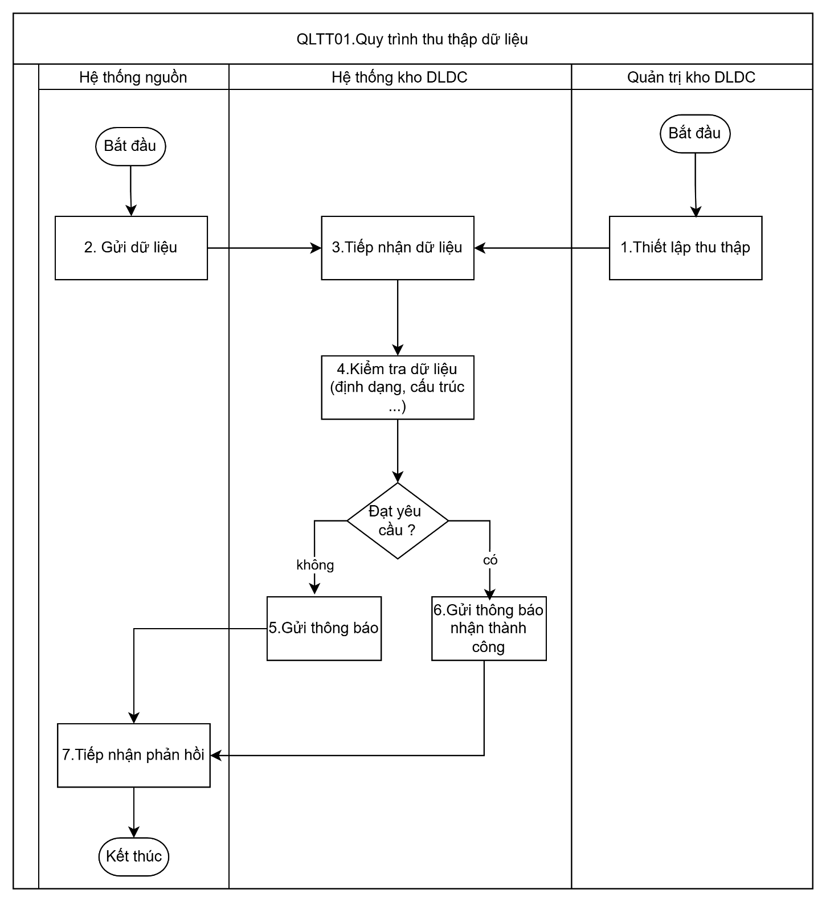

#### 3.2.1.2. Mô tả quy trình

| Bước | Tên bước | Đối tượng thực hiện | Mô tả vận hành |
| --- | --- | --- | --- |
| 1 | Thiết lập dịch vụ thu thập | Quản trị hệ thống | Thiết lập thực hiện quản lý thu thập dữ liệu từ hệ thống trong và ngoài ngành |
| 2 | Gửi dữ liệu | Hệ thống nguồn | Hệ thống nguồn gửi dữ liệu theo chuẩn kết nối, định dạng và giao thức đã thống nhất đến kho dữ liệu dùng chung. |
| 3 | Tiếp nhận dữ liệu | Hệ thống kho dữ liệu dùng chung | Kho dữ liệu dùng chung tiếp nhận dữ liệu từ hệ thống nguồn thông qua kênh tích hợp. Ghi nhận thời gian, định danh nguồn và loại dữ liệu. |
| 4 | Kiểm tra dữ liệu (định dạng, cấu trúc...) | Hệ thống kho dữ liệu dùng chung | Hệ thống tự động kiểm tra dữ liệu theo tiêu chí kỹ thuật: định dạng, cấu trúc, trường dữ liệu, giá trị bắt buộc, mã hóa, dung lượng, trạng thái. |
| 5 | Gửi thông báo lỗi | Hệ thống kho dữ liệu dùng chung | Trường hợp dữ liệu không đạt yêu cầu, hệ thống gửi thông báo lỗi kèm nguyên nhân (thiếu trường, sai định dạng, lỗi trùng, dung lượng vượt mức, v.v.). |
| 6 | Gửi thông báo nhận thành công | Hệ thống kho dữ liệu dùng chung | Khi dữ liệu đạt yêu cầu, hệ thống xác nhận tiếp nhận thành công và ghi nhận vào nhật ký tiếp nhận. |
| 7 | Tiếp nhận phản hồi | Hệ thống nguồn | Hệ thống nguồn nhận thông báo từ kho dữ liệu (thành công hoặc lỗi), thực hiện lưu log hoặc điều chỉnh dữ liệu theo phản hồi. |

### 3.2.2. Quy trình Đối sánh dữ liệu thu thập

#### 3.2.2.1. Sơ đồ quy trình

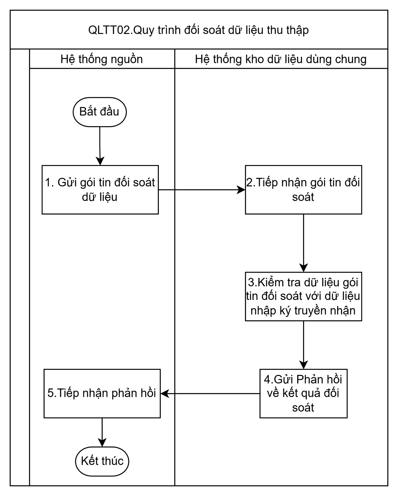

#### 3.2.2.2. Mô tả quy trình

| **STT** | **Bước thực hiện** | **Đối tượng thực hiện** | **Mô tả chi tiết** |
| --- | --- | --- | --- |
|  | Gửi gói tin đối soát dữ liệu | Hệ thống nguồn | Hệ thống nguồn định kỳ hoặc theo yêu cầu gửi gói tin chứa thông tin đối soát (danh sách dữ liệu, mã định danh, thời gian gửi, tổng số bản ghi...) tới hệ thống kho dữ liệu dùng chung để kiểm tra tính toàn vẹn, đồng bộ. |
|  | Tiếp nhận gói tin đối soát | Hệ thống kho dữ liệu dùng chung | Kho dữ liệu dùng chung tiếp nhận gói tin đối soát, ghi nhận thời điểm tiếp nhận và thông tin định danh của hệ thống nguồn. Dữ liệu được chuyển vào vùng kiểm tra để xử lý. |
|  | Kiểm tra dữ liệu gói tin đối soát với dữ liệu nhật ký truyền nhận | Hệ thống kho dữ liệu dùng chung | Hệ thống tự động đối chiếu nội dung gói tin đối soát với nhật ký truyền nhận (log hệ thống), bao gồm: số lượng bản ghi, mã dữ liệu, thời gian gửi, và trạng thái xử lý. Nếu phát hiện sai lệch hoặc thiếu dữ liệu, hệ thống đánh dấu và ghi nhận lỗi. |
|  | Gửi phản hồi về kết quả đối soát | Hệ thống kho dữ liệu dùng chung | Sau khi kiểm tra, hệ thống tổng hợp kết quả đối soát và gửi phản hồi về cho hệ thống nguồn, gồm: xác nhận đồng bộ thành công hoặc thông báo chênh lệch (thiếu, trùng, sai cấu trúc...). |
|  | Tiếp nhận phản hồi | Hệ thống nguồn | Hệ thống nguồn tiếp nhận phản hồi đối soát, ghi nhận kết quả, thực hiện xử lý sai lệch (nếu có) hoặc xác nhận hoàn tất đối soát thành công. |

### 3.2.3. Quy trình xử lý dữ liệu

#### 3.2.3.1. Sơ đồ quy trình

#### 3.2.3.2. Mô tả quy trình

| **STT** | **Bước thực hiện** | **Đối tượng thực hiện** | **Mô tả chi tiết** |
| --- | --- | --- | --- |
|  | Làm sạch dữ liệu | Hệ thống kho dữ liệu dùng chung | Sau khi dữ liệu được tiếp nhận, hệ thống tự động thực hiện kiểm tra chất lượng dữ liệu theo các quy tắc đã thiết lập như: loại bỏ dữ liệu trùng lặp, … |
|  | Chuẩn hóa dữ liệu | Hệ thống kho dữ liệu dùng chung | Sau khi dữ liệu được làm sạch sẽ tiếp tục được chuẩn hóa định dạng, mapping dữ liệu, biến đổi dữ liệu theo cấu trúc chuẩn, ghép nối với các tập dữ liệu liên quan để đảm bảo tính thống nhất và toàn vẹn. |
|  | Gửi phản hồi đến hệ thống nguồn | Hệ thống kho dữ liệu dùng chung | Nếu dữ liệu không đạt yêu cầu sau khi kiểm tra, hệ thống lập báo cáo lỗi và gửi thông báo phản hồi về cho hệ thống nguồn, nêu rõ nguyên nhân (ví dụ: lỗi trùng, sai cấu trúc, thiếu trường thông tin…). |
|  | Phân loại và lưu dữ liệu (mức độ công khai, mức độ nhạy cảm…) | Hệ thống kho dữ liệu dùng chung | Khi dữ liệu đạt yêu cầu, hệ thống tự động phân loại theo các tiêu chí đã định (mức độ công khai, mức độ nhạy cảm,…). Sau đó, dữ liệu được lưu vào kho lưu trữ tương ứng để phục vụ khai thác, chia sẻ hoặc công bố. |
|  | Tiếp nhận phản hồi | Hệ thống nguồn | Hệ thống nguồn tiếp nhận phản hồi từ kho dữ liệu dùng chung, thực hiện điều chỉnh dữ liệu (nếu có lỗi) hoặc ghi nhận trạng thái xử lý thành công. |

### 3.2.4. Quy trình quản lý dữ liệu danh mục dùng chung

#### 3.2.4.1. Quy trình lập danh sách danh mục dùng chung

##### 3.2.4.1.1. Sơ đồ quy trình

##### 3.2.4.1.2. Mô tả quy trình

| **STT** | **Bước thực hiện** | **Đối tượng thực hiện** | **Mô tả chi tiết** |
| --- | --- | --- | --- |
|  | Xây dựng danh sách dữ liệu danh mục | Quản trị hệ thống | Quản trị viên hệ thống thu thập, tổng hợp và xây dựng danh sách dữ liệu danh mục dùng chung (ví dụ: danh mục lĩnh vực, cơ quan, đơn vị, địa bàn, loại hình dữ liệu…) theo phạm vi được phân công. |
|  | Thiết lập cấu trúc danh mục | Quản trị hệ thống | Thiết lập các quy tắc kỹ thuật và nghiệp vụ cho việc cập nhật danh mục, bao gồm: định dạng dữ liệu, cấu trúc mã định danh, quy tắc đồng bộ, tần suất cập nhật và cơ chế phân quyền chỉnh sửa. |
|  | Kiểm tra và phê duyệt danh sách | Lãnh đạo nghiệp vụ | Lãnh đạo nghiệp vụ kiểm tra nội dung danh mục, bảo đảm tính chính xác, thống nhất và tuân thủ quy định quản lý dữ liệu dùng chung. Sau khi rà soát, lãnh đạo quyết định phê duyệt hoặc từ chối phê duyệt. |
|  | Từ chối duyệt danh sách | Lãnh đạo nghiệp vụ | Trường hợp danh sách chưa đạt yêu cầu (thiếu dữ liệu, sai cấu trúc, trùng lặp hoặc chưa đúng quy tắc), lãnh đạo nghiệp vụ từ chối phê duyệt và gửi lại yêu cầu chỉnh sửa cho quản trị hệ thống. |
|  | Phê duyệt danh sách | Lãnh đạo nghiệp vụ | Khi danh sách đáp ứng đầy đủ tiêu chí kỹ thuật và nghiệp vụ, lãnh đạo nghiệp vụ thực hiện phê duyệt chính thức. Danh mục được ghi nhận vào hệ thống kho dữ liệu dùng chung và sẵn sàng sử dụng, chia sẻ cho các đơn vị liên quan. |

#### 3.2.4.2. Quy trình biên tập danh mục dùng chung nội bộ

##### 3.2.4.2.1. Sơ đồ quy trình

##### 3.2.4.2.2. Mô tả quy trình

| **STT** | **Bước thực hiện** | **Đối tượng thực hiện** | **Mô tả chi tiết** |
| --- | --- | --- | --- |
|  | Xây dựng danh sách dữ liệu danh mục | Quản trị hệ thống | Quản trị viên hệ thống thu thập, tổng hợp và xây dựng danh sách dữ liệu danh mục dùng chung (ví dụ: danh mục lĩnh vực, cơ quan, đơn vị, địa bàn, loại hình dữ liệu…) theo phạm vi được phân công. |
|  | Thiết lập cấu trúc danh mục | Quản trị hệ thống | Thiết lập các quy tắc kỹ thuật và nghiệp vụ cho việc cập nhật danh mục, bao gồm: định dạng dữ liệu, cấu trúc mã định danh, quy tắc đồng bộ, tần suất cập nhật và cơ chế phân quyền chỉnh sửa. |
|  | Kiểm tra và phê duyệt danh sách | Lãnh đạo nghiệp vụ | Lãnh đạo nghiệp vụ kiểm tra nội dung danh mục, bảo đảm tính chính xác, thống nhất và tuân thủ quy định quản lý dữ liệu dùng chung. Sau khi rà soát, lãnh đạo quyết định phê duyệt hoặc từ chối phê duyệt. |
|  | Từ chối duyệt danh sách | Lãnh đạo nghiệp vụ | Trường hợp danh sách chưa đạt yêu cầu (thiếu dữ liệu, sai cấu trúc, trùng lặp hoặc chưa đúng quy tắc), lãnh đạo nghiệp vụ từ chối phê duyệt và gửi lại yêu cầu chỉnh sửa cho quản trị hệ thống. |
|  | Phê duyệt danh sách | Lãnh đạo nghiệp vụ | Khi danh sách đáp ứng đầy đủ tiêu chí kỹ thuật và nghiệp vụ, lãnh đạo nghiệp vụ thực hiện phê duyệt chính thức. Danh mục được ghi nhận vào hệ thống kho dữ liệu dùng chung và sẵn sàng sử dụng, chia sẻ cho các đơn vị liên quan. |

### 3.2.5. Quy trình quản lý dữ liệu mở

#### 3.2.5.1. Quy trình lập danh sách dữ liệu mở

##### Sơ đồ quy trình

##### Mô tả quy trình

| **STT** | **Bước thực hiện** | **Đối tượng thực hiện** | **Mô tả chi tiết** |
| --- | --- | --- | --- |
|  | Xây dựng danh sách dữ liệu mở | Quản trị hệ thống | Quản trị viên hệ thống tiến hành rà soát, tổng hợp và xây dựng danh sách dữ liệu mở thuộc phạm vi quản lý, bao gồm tên tập dữ liệu, mô tả, định dạng, tần suất cập nhật và đơn vị chịu trách nhiệm công bố. |
|  | Thiết lập quy tắc cập nhật | Quản trị hệ thống | Thiết lập các quy tắc, quy chuẩn kỹ thuật cho việc cập nhật dữ liệu mở: định dạng công bố, cơ chế đồng bộ, tần suất công khai, cấp độ truy cập và quy trình phê duyệt. |
|  | Kiểm tra và phê duyệt danh sách | Lãnh đạo nghiệp vụ | Lãnh đạo nghiệp vụ kiểm tra, đánh giá nội dung danh sách dữ liệu mở do quản trị hệ thống lập, bảo đảm tính phù hợp, chính xác, khả năng công khai và tuân thủ quy định về dữ liệu mở. |
|  | Từ chối duyệt danh sách | Lãnh đạo nghiệp vụ | Nếu danh sách chưa đáp ứng tiêu chuẩn (thiếu thông tin, sai định dạng hoặc chưa đủ điều kiện công khai), lãnh đạo nghiệp vụ từ chối phê duyệt và gửi lại yêu cầu chỉnh sửa cho quản trị hệ thống để hoàn thiện. |
|  | Phê duyệt danh sách | Lãnh đạo nghiệp vụ | Khi danh sách đạt yêu cầu, lãnh đạo nghiệp vụ thực hiện phê duyệt chính thức. Danh sách dữ liệu mở được ghi nhận, lưu trữ. |

#### 3.2.5.2. Quy trình Công bố dữ liệu mở

##### Sơ đồ quy trình

##### Mô tả quy trình

| **STT** | **Bước thực hiện** | **Đối tượng thực hiện** | **Mô tả chi tiết** |
| --- | --- | --- | --- |
|  | Nhập thông tin dữ liệu mở | Cán bộ nghiệp vụ | Cán bộ nghiệp vụ nhập thông tin dữ liệu đối với các dữ liệu mở chưa được cung cấp bởi các hệ thống nguồn |
|  | Rà soát, gửi yêu cầu công bố dữ liệu mở | Cán bộ nghiệp vụ | Cán bộ nghiệp vụ rà soát các tập dữ liệu đã được phê duyệt trong danh mục dữ liệu mở và lập yêu cầu công bố chính thức trên Cổng dữ liệu mở. Hồ sơ yêu cầu bao gồm thông tin mô tả, định dạng, tần suất cập nhật và phạm vi chia sẻ. |
|  | Phê duyệt dữ liệu mở | Lãnh đạo nghiệp vụ | Lãnh đạo nghiệp vụ kiểm tra nội dung yêu cầu phê duyệt dữ liệu mở, bao gồm: tính đầy đủ thông tin, độ chính xác của thông tin, tính phù hợp với quy định bảo mật và quy tắc công bố dữ liệu mở của cơ quan. |
|  | Từ chối công bố thông tin dữ liệu mở | Lãnh đạo nghiệp vụ | Nếu dữ liệu không đáp ứng yêu cầu (thiếu thông tin, sai định dạng, chưa qua phê duyệt danh mục hoặc có yếu tố nhạy cảm), lãnh đạo nghiệp vụ từ chối công bố và gửi phản hồi để cán bộ nghiệp vụ chỉnh sửa, hoàn thiện. |
|  | Công bố thông tin dữ liệu mở | Cán bộ nghiệp vụ | Khi thông tin đạt yêu cầu, lãnh đạo nghiệp vụ phê duyệt công bố dữ liệu mở. Dữ liệu được hiển thị trên Cổng dữ liệu, cho phép tổ chức, cá nhân truy cập và khai thác. |
|  | Hủy công bố thông tin dữ liệu mở | Cán bộ nghiệp vụ | Trong trường hợp dữ liệu công bố có sai sót, không còn hiệu lực hoặc cần điều chỉnh, lãnh đạo nghiệp vụ thực hiện hủy công bố. Hệ thống cập nhật trạng thái và ẩn dữ liệu khỏi danh sách công bố công khai. |

### 3.2.6. Quy trình quản lý dữ liệu chủ

#### Quy trình quản lý danh sách dữ liệu chủ

##### Sơ đồ quy trình

##### Mô tả quy trình

| **STT** | **Bước thực hiện** | **Đối tượng thực hiện** | **Mô tả chi tiết** |
| --- | --- | --- | --- |
|  | Xây dựng danh sách dữ liệu chủ | Quản trị hệ thống | Quản trị hệ thống tiến hành tổng hợp, rà soát các đối tượng dữ liệu cần được xác định là dữ liệu chủ (Master Data) theo từng lĩnh vực hoặc nhóm nghiệp vụ.  Thiết lập cấu trúc, thuộc tính, mối quan hệ giữa các dữ liệu chủ. |
|  | Thiết lập quy tắc hợp nhất | Quản trị hệ thống | Xác định và thiết lập các quy tắc hợp nhất, đồng bộ, định danh và làm sạch dữ liệu nhằm đảm bảo tính duy nhất và chính xác của dữ liệu chủ. |
|  | Kiểm tra và phê duyệt danh sách | Lãnh đạo nghiệp vụ | Lãnh đạo nghiệp vụ xem xét danh sách dữ liệu chủ và các quy tắc hợp nhất do quản trị hệ thống đề xuất, đánh giá tính hợp lý, đầy đủ và phù hợp nghiệp vụ. |
|  | Từ chối duyệt danh sách | Lãnh đạo nghiệp vụ | Trong trường hợp không đồng ý phê duyệt, lãnh đạo nghiệp vụ gửi lại danh sách cùng ý kiến điều chỉnh, yêu cầu bổ sung hoặc sửa đổi cho quản trị hệ thống. |
|  | Phê duyệt danh sách | Lãnh đạo nghiệp vụ | Nếu danh sách được đồng ý, lãnh đạo nghiệp vụ phê duyệt chính thức và ban hành danh sách dữ liệu chủ được sử dụng trong toàn hệ thống. |

#### Quy trình hợp nhất dữ liệu chủ

##### Sơ đồ quy trình

##### Mô tả quy trình

| **STT** | **Bước thực hiện** | **Đối tượng thực hiện** | **Mô tả chi tiết** |
| --- | --- | --- | --- |
|  | Xử lý dữ liệu | Cán bộ nghiệp vụ | Cán bộ nghiệp vụ thực hiện rà soát, làm sạch, chuẩn hóa dữ liệu từ nhiều nguồn khác nhau. Các thao tác gồm loại bỏ trùng lặp, chuẩn hóa định dạng, mã định danh, và kiểm tra tính toàn vẹn trước khi hợp nhất. |
|  | Tạo bản ghi hợp nhất | Cán bộ nghiệp vụ | Trên cơ sở dữ liệu đã được xử lý, cán bộ nghiệp vụ tiến hành tạo bản ghi dữ liệu chủ hợp nhất (Golden record). Bản ghi này đại diện duy nhất cho một thực thể dữ liệu (cơ quan, cá nhân, tổ chức, đối tượng quản lý…) và chứa các thuộc tính được thống nhất. |
|  | Gửi yêu cầu phê duyệt | Cán bộ nghiệp vụ | Sau khi hoàn tất việc tạo bản ghi hợp nhất, cán bộ nghiệp vụ gửi yêu cầu phê duyệt đến lãnh đạo nghiệp vụ. |
|  | Kiểm tra và phê duyệt | Lãnh đạo nghiệp vụ | Lãnh đạo nghiệp vụ kiểm tra thông tin bản ghi hợp nhất, đánh giá mức độ chính xác, thống nhất và tuân thủ quy tắc hợp nhất dữ liệu chủ. Nếu đạt yêu cầu, tiến hành phê duyệt; nếu chưa đạt, phản hồi lý do để chỉnh sửa. |
|  | Từ chối duyệt | Lãnh đạo nghiệp vụ | Khi bản ghi chưa đúng chuẩn (thiếu thông tin, trùng lặp, sai định dạng hoặc không phù hợp quy tắc), lãnh đạo nghiệp vụ từ chối duyệt và gửi phản hồi để cán bộ nghiệp vụ chỉnh sửa, xử lý lại dữ liệu. |
|  | Công bố dữ liệu chủ | Cán bộ nghiệp vụ | Khi thông tin đạt yêu cầu, lãnh đạo nghiệp vụ phê duyệt công bố dữ liệu dữ liệu chủ. Dữ liệu được hiển thị trên Cổng dữ liệu, cho phép tổ chức, cá nhân truy cập và khai thác. |
|  | Hủy công bố thông tin dữ liệu chủ | Cán bộ nghiệp vụ | Trong trường hợp dữ liệu công bố có sai sót, không còn hiệu lực hoặc cần điều chỉnh, lãnh đạo nghiệp vụ thực hiện hủy công bố. Hệ thống cập nhật trạng thái và ẩn dữ liệu khỏi danh sách công bố công khai. |

### 3.2.7. Quy trình điều phối dữ liệu

#### Quy trình cung cấp dịch vụ theo yêu cầu

##### Sơ đồ quy trình

##### Mô tả quy trình

| **STT** | **Bước thực hiện** | **Đối tượng thực hiện** | **Mô tả chi tiết** |
| --- | --- | --- | --- |
|  | Đăng ký yêu cầu cung cấp dịch vụ dữ liệu | Đơn vị khai thác | Đơn vị có nhu cầu khai thác dữ liệu gửi yêu cầu chính thức về việc cung cấp dịch vụ dữ liệu, nêu rõ mục đích sử dụng, loại dữ liệu cần truy cập, phạm vi, định dạng, tần suất và các yêu cầu kỹ thuật. |
|  | Tiếp nhận yêu cầu cung cấp dữ liệu | Cổng dữ liệu | Cổng dữ liệu tiếp nhận yêu cầu từ đơn vị khai thác, ghi nhận thông tin và chuyển yêu cầu tới bộ phận quản trị hệ thống để kiểm tra, xử lý. |
|  | Kiểm tra yêu cầu cung cấp dữ liệu | Quản trị hệ thống | Quản trị viên hệ thống kiểm tra tính hợp lệ của yêu cầu: dữ liệu có sẵn hay không, tính bảo mật, quyền truy cập và điều kiện khai thác. |
|  | Chuyển phê duyệt yêu cầu cung cấp dữ liệu | Quản trị hệ thống | Nếu yêu cầu hợp lệ, quản trị hệ thống chuyển hồ sơ lên lãnh đạo bộ phận quản trị để xem xét, phê duyệt việc cung cấp dữ liệu. |
|  | Phê duyệt yêu cầu cung cấp dữ liệu | Lãnh đạo bộ phận quản trị | Lãnh đạo bộ phận quản trị xem xét hồ sơ, nội dung yêu cầu, tính pháp lý và tính khả thi của dịch vụ dữ liệu, sau đó quyết định phê duyệt hoặc không phê duyệt. |
|  | Gửi thông báo từ chối cung cấp dịch vụ | Quản trị hệ thống | Nếu yêu cầu bị từ chối ở bước kiểm tra hoặc phê duyệt, hệ thống gửi thông báo phản hồi cho đơn vị khai thác, nêu rõ lý do từ chối. |
|  | Tiếp nhận phản hồi | Cổng dữ liệu | Cổng dữ liệu nhận thông báo phản hồi (chấp thuận hoặc từ chối) và cập nhật trạng thái xử lý của yêu cầu trong hệ thống. |
|  | Gửi thông báo chấp nhận cung cấp dịch vụ | Quản trị hệ thống | Khi yêu cầu được phê duyệt, quản trị hệ thống thông báo kết quả chấp thuận và chuẩn bị thiết lập dịch vụ dữ liệu. |
|  | Thiết lập dịch vụ dữ liệu | Quản trị hệ thống | Cấu hình và triển khai dịch vụ cung cấp dữ liệu theo yêu cầu đã được phê duyệt, bao gồm tạo API, phân quyền truy cập, cấu hình tần suất và bảo mật kết nối. |
|  | Kiểm tra dịch vụ | Lãnh đạo bộ phận quản trị | Lãnh đạo kiểm tra hoạt động của dịch vụ dữ liệu, đảm bảo tính chính xác, an toàn và tuân thủ quy chuẩn trước khi đưa vào sử dụng. |
|  | Từ chối duyệt dịch vụ | Lãnh đạo bộ phận quản trị | Nếu dịch vụ dữ liệu chưa đáp ứng yêu cầu kỹ thuật hoặc an toàn, lãnh đạo từ chối phê duyệt và yêu cầu quản trị hệ thống điều chỉnh lại. |
|  | Phê duyệt dịch vụ | Lãnh đạo bộ phận quản trị | Khi dịch vụ đạt yêu cầu, lãnh đạo phê duyệt chính thức cho phép triển khai cung cấp dữ liệu cho đơn vị khai thác. |
|  | Tiếp nhận dịch vụ | Đơn vị khai thác | Đơn vị khai thác nhận quyền truy cập hoặc kết nối đến dịch vụ dữ liệu được cung cấp, bắt đầu khai thác và sử dụng theo phạm vi được phê duyệt. |

#### Quy trình cung cấp dịch vụ chủ động

##### Sơ đồ quy trình

##### Mô tả quy trình

| **STT** | **Bước thực hiện** | **Đối tượng thực hiện** | **Mô tả chi tiết** |
| --- | --- | --- | --- |
|  | Thiết lập dịch vụ dữ liệu | Quản trị hệ thống | Quản trị hệ thống tiến hành thiết lập thông tin chi tiết về dịch vụ dữ liệu chủ động (loại dữ liệu cung cấp, tần suất, hình thức truy cập, cơ chế chia sẻ, mức độ bảo mật, người dùng được cấp quyền...). |
|  | Kiểm tra dịch vụ | Lãnh đạo bộ phận quản trị | Lãnh đạo xem xét, kiểm tra các thông số, phạm vi, đối tượng và quy tắc chia sẻ của dịch vụ dữ liệu để đảm bảo tuân thủ quy định và phù hợp nghiệp vụ. |
|  | Từ chối duyệt dịch vụ | Lãnh đạo bộ phận quản trị | Nếu không chấp thuận, lãnh đạo từ chối phê duyệt và gửi lại cho quản trị hệ thống để chỉnh sửa, bổ sung hoặc hủy bỏ thiết lập dịch vụ. |
|  | Phê duyệt dịch vụ | Lãnh đạo bộ phận quản trị | Nếu đồng ý, lãnh đạo thực hiện phê duyệt dịch vụ dữ liệu chủ động, chính thức cho phép cung cấp dịch vụ tới Cổng dữ liệu. |
|  | Hiển thị thông tin dịch vụ | Cổng dữ liệu | Sau khi được phê duyệt, thông tin dịch vụ dữ liệu được công bố và hiển thị trên Cổng dữ liệu, cho phép người dùng khai thác chủ động mà không cần đăng ký yêu cầu |

# 4. ĐẶC TẢ CHI TIẾT YÊU CẦU CHỨC NĂNG

## 4.1. Màn đăng nhập

### 4.1.1. Mục đích

*a.Phân quyền*  
Hệ thống cho phép các đối tượng người sử dụng sau đăng nhập vào hệ thống:

* Quản trị viên hệ thống:  
  Quản lý cấu hình hệ thống, phân quyền người dùng và theo dõi hoạt động của hệ thống.
* Lãnh đạo Cục/Vụ:  
  Truy cập hệ thống để xem các báo cáo, thống kê và theo dõi tình hình dữ liệu trong Kho DLDC.
* Chuyên viên quản lý dữ liệu:  
  Thực hiện các nghiệp vụ liên quan đến quản lý, cập nhật và khai thác dữ liệu trong hệ thống.

Quyền truy cập vào các chức năng cụ thể của hệ thống sẽ được xác định dựa trên **vai trò của người dùng sau khi đăng nhập thành công**.

b. Điều kiện thực hiện

Người sử dụng có thể thực hiện đăng nhập khi đáp ứng các điều kiện sau:

* Có **tài khoản đăng nhập hợp lệ** được cấp bởi quản trị hệ thống.
* Truy cập vào hệ thống thông qua **địa chỉ truy cập hợp lệ**.
* Hệ thống **đang hoạt động bình thường**.

### 4.1.2. Màn hình

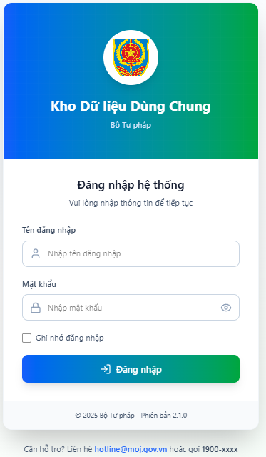

Hình 1- Màn hình đăng nhập

#### 4.1.2.1. Mô tả thông tin trên màn hình

| STT | **Trường thông tin** | **Kiểu dữ liệu** | **Bắt buộc** | **Mặc định** | **Mô tả** |
| --- | --- | --- | --- | --- | --- |
|  | **THÔNG TIN HỆ THỐNG** | |  |  |  |
| 1 | **Trường thông tin** | **Kiểu dữ liệu** | **Bắt buộc** | **Mặc định** | **Mô tả** |
| 2 | Logo hệ thống | Image |  |  | Hiển thị logo Bộ Tư pháp |
| 3 | Tên hệ thống | Label |  |  | Hiển thị tên hệ thống “Kho Dữ liệu Dùng Chung” |
| 4 | Tên đơn vị | Label |  |  | Hiển thị tên đơn vị quản lý “Bộ Tư pháp” |
|  | **THÔNG TIN ĐĂNG NHẬP** | |  |  |  |
| 5 | **Trường thông tin** | **Kiểu dữ liệu** | **Bắt buộc** | **Mặc định** | **Mô tả** |
| 6 | Tên đăng nhập | Textbox | x |  | Người dùng nhập tên tài khoản đăng nhập |
| 7 | Mật khẩu | Password | x |  | Người dùng nhập mật khẩu đăng nhập |
| 8 | Hiển thị mật khẩu | Icon |  | Ẩn | Cho phép hiển thị / ẩn mật khẩu |
| 9 | Ghi nhớ đăng nhập | Checkbox |  | Không chọn | Lưu thông tin đăng nhập cho lần truy cập tiếp theo |
|  | **THÔNG TIN HỖ TRỢ** | |  |  |  |
| 10 | **Trường thông tin** | **Kiểu dữ liệu** | **Bắt buộc** | **Mặc định** | **Mô tả** |
| 11 | Thông tin phiên bản | Label |  |  | Hiển thị thông tin phiên bản hệ thống |
| 12 | Thông tin hỗ trợ | Label |  |  | Hiển thị email và số hotline hỗ trợ người dùng |

#### 4.1.2.2. Chức năng trên màn hình

|  |  |  |  |
| --- | --- | --- | --- |
| **STT** | **Tên chức năng** | **Định dạng** | **Mô tả** |
| 1 | Đăng nhập | Nút | NSD bấm nút “Đăng nhập”, hệ thống kiểm tra thông tin tài khoản và mật khẩu. Nếu hợp lệ hệ thống chuyển NSD vào trang Dashboard của hệ thống |
| 2 | Hiển thị mật khẩu | Biểu tượng | NSD bấm biểu tượng hiển thị để xem mật khẩu đã nhập |
| 3 | Ghi nhớ đăng nhập | Checkbox | NSD chọn để hệ thống ghi nhớ tài khoản cho lần đăng nhập sau |

#### Quy tắc xử lý

*   **Xác thực tài khoản**: Hệ thống kiểm tra Tên đăng nhập và Mật khẩu trong CSDL người dùng tập trung của Bộ Tư pháp.
*   **Phân quyền sau đăng nhập**: Sau khi xác thực thành công, hệ thống căn cứ vào vai trò (Role) của người dùng để điều hướng về trang Dashbord tương ứng và hiển thị menu chức năng phù hợp.
*   **Bảo mật**: Mật khẩu được mã hóa khi truyền nhận. Sau 5 lần nhập sai liên tiếp, tài khoản sẽ bị khóa tạm thời trong 30 phút.

#### Danh sách thông báo

| STT | Mã thông báo | Nội dung thông báo | Diễn giải |
| --- | --- | --- | --- |
| 1 | MSG-LOGIN-001 | Đăng nhập thành công | Hiển thị khi thông tin tài khoản chính xác |
| 2 | MSG-LOGIN-002 | Tên đăng nhập hoặc mật khẩu không đúng | Hiển thị khi thông tin xác thực sai |
| 3 | MSG-LOGIN-003 | Tài khoản đã bị khóa. Vui lòng thử lại sau 30 phút. | Hiển thị khi nhập sai quá số lần quy định |
| 4 | MSG-LOGIN-004 | Vui lòng nhập đầy đủ Tên đăng nhập và Mật khẩu | Hiển thị khi để trống trường bắt buộc |

## 4.2. Tổng quan (Trang chủ)

#### 4.1.1. PM01.DB.01. Xem báo cáo thống kê thu thập

#### 4.1.1.1. Mục đích

Cho phép NSD có cái nhìn trực quan, báo cáo thống kê bằng số liệu và biểu đồ về tình hình thu thập dữ liệu vào kho DLDC.

a. Phân quyền Hệ thống thực hiện phân quyền theo nguyên tắc sau:

* NSD là: Lãnh đạo cấp Cục/Vụ, Quản trị viên hệ thống, Chuyên viên quản lý dữ liệu.

b. Điều kiện thực hiện

* Đã đăng nhập vào hệ thống thành công với tài khoản được cấp quyền.

#### 4.1.1.2. PM01.DB.01.MH01 – Màn hình Dashboard Thống kê thu thập

Màn hình

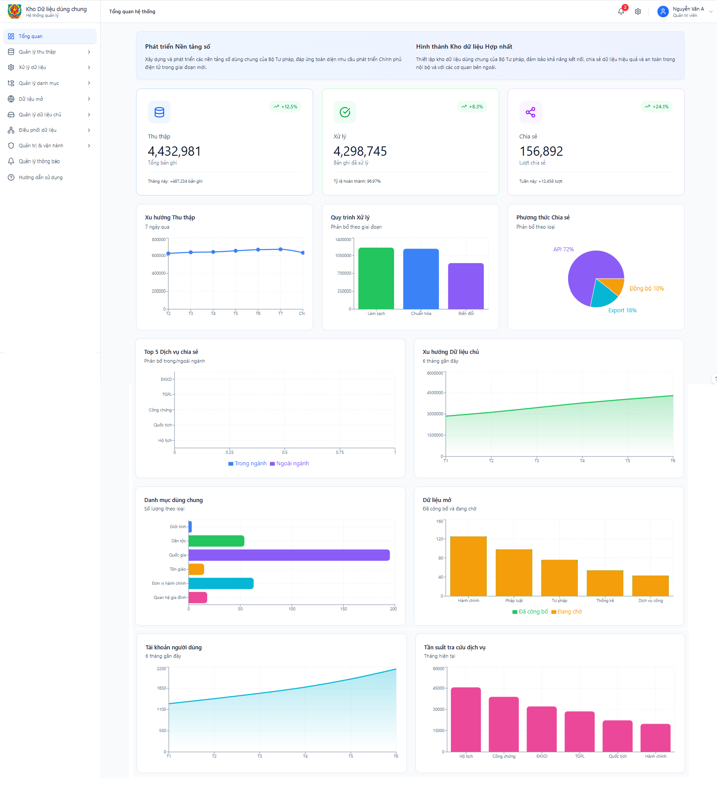

Hình 2 – Màn hình tổng quan hệ thống

##### 4.1.1.1. Mô tả thông tin trên màn hình

| **Trường thông tin** | **Kiểu dữ liệu** | **Bắt buộc** | **Mặc định** | **Mô tả** |
| --- | --- | --- | --- | --- |
| **Thẻ thống kê tổng quát (KPI Cards)** |  |  |  |  |
| Tổng số bản ghi đã thu thập | Số nguyên | Có | Hệ thống tự tính | Tổng số lượt bản ghi dữ liệu đã được thu thập vào kho. |
| Tổng số bản ghi thu thập ngoài ngành | Số nguyên | Có | Hệ thống tự tính | Tổng số lượng dữ liệu thu thập từ các CSDL Bộ/Ngành khác. |
| Tổng số bản ghi thu thập trong ngành | Số nguyên | Có | Hệ thống tự tính | Tổng số lượng dữ liệu thu thập từ hệ thống nội bộ Bộ Tư pháp. |
| **Biểu đồ (Charts)** |  |  |  |  |
| Xu hướng Thu thập | Biểu đồ đường | Có |  | Biểu đồ Line Chart hiển thị luỹ kế/số lượng dữ liệu được thu theo 12 tháng gần nhất trục Y là số lượng (0 - 80000+), trục X là tháng (từ tháng 1-12) |
| Biểu đồ thu thập dữ liệu theo phương thức thu thập | Biểu đồ cột | Có |  | Biểu đồ Bar Chart so sánh tỷ lệ thu thập qua REST API, SOAP API, File Upload, FTP. Có hiển thị Tổng số ở góc phải biểu đồ. |
| Biểu đồ thu thập dữ liệu theo nguồn cung cấp dữ liệu | Biểu đồ cột | Có |  | Biểu đồ Bar Chart so sánh dữ liệu lấy từ các nguồn: CSDL A, CSDL B, CSDL C... Có hiển thị Tổng số. |
| Biểu đồ thu thập dữ liệu theo kết quả thu thập | Biểu đồ cột | Có |  | Biểu đồ Bar Chart thống kê trạng thái: Thành công, Thất bại, Đang xử lý. Có hiển thị Tổng số. |
| Biểu đồ thu thập dữ liệu theo thời gian | Biểu đồ cột | Có |  | Biểu đồ Bar Chart phân bố lượng dữ liệu thu thập theo các mốc giờ trong ngày: 00:00, 04:00, 08:00, 12:00, 16:00, 20:00. Có hiển thị Tổng số. |

##### 4.1.1.2. Chức năng trên màn hình

|  |  |  |  |
| --- | --- | --- | --- |
| **STT** | **Tên chức năng** | **Định dạng** | **Mô tả** |
| 1 | Lọc thời gian biểu đồ | Dropdown list | - Tại mỗi block biểu đồ cột, NSD có thể click vào Dropdown (Ví dụ: "Tháng này"). - Hệ thống sổ danh sách tùy chọn (Vd: Hôm nay, Tuần này, Tháng này, Năm nay). - Chi tiết số liệu của biểu đồ đó tự cài đặt lại theo mốc t.gian người dùng chọn. |
| 2 | Kết xuất dữ liệu | Nút (Màu xanh) | - Tại góc mỗi block biểu đồ có nút "Kết xuất". - NSD click vào, hệ thống download về máy file thống kê dạng Excel (hoặc hình ảnh biểu đồ) ứng với chart đó. |
| 3 | Kích vào tổng số (**Cards)** | Button | * Chuyển sang màn hình xem chi tiết |

#### Quy tắc xử lý

*   **Tính toán số liệu**: Hệ thống thực hiện đếm (Count) số lượng bản ghi trong các bảng tương ứng (dữ liệu tập kết, dữ liệu xử lý) để hiển thị trên KPI Cards.
*   **Thời gian thực**: Số liệu trên Dashboard được cập nhật tự động sau mỗi phiên đồng bộ dữ liệu thành công.
*   **Phân quyền xem**: Lãnh đạo chỉ xem được số liệu tổng hợp của đơn vị mình quản lý. Quản trị hệ thống xem được toàn ngành.

#### Danh sách thông báo (Không áp dụng cho màn hình Dashboard)

#### 4.1.2. PM01.DB.01. Màn hình thông tin số lượng chi tiết

Màn hình

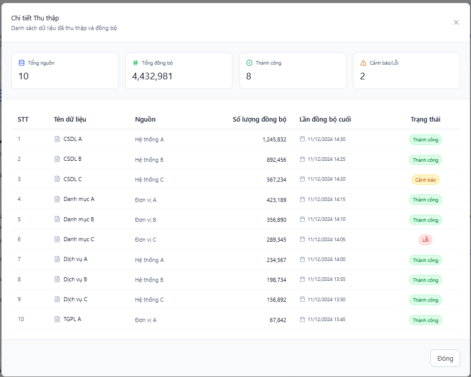

Hình 3 – Màn hình chỉ tiết số liệu tổng hợp

##### 4.1.2.1. Mô tả thông tin trên màn hình

| **Trường thông tin** | **Kiểu dữ liệu** | **Bắt buộc** | **Mặc định** | **Mô tả** |
| --- | --- | --- | --- | --- |
| **THÔNG TIN TỔNG QUAN THU THẬP** | | |  |  |
| **Trường thông tin** | **Kiểu dữ liệu** | **Bắt buộc** | **Mặc định** | **Mô tả** |
| Tổng nguồn | Number |  |  | Tổng số nguồn dữ liệu thực hiện thu thập |
| Tổng đồng bộ | Number |  |  | Tổng số bản ghi dữ liệu đã được đồng bộ về Kho DLDC |
| Thành công | Number |  |  | Số nguồn dữ liệu đồng bộ thành công |
| Cảnh báo/Lỗi | Number |  |  | Số nguồn dữ liệu phát sinh cảnh báo hoặc lỗi trong quá trình thu thập |
| **DANH SÁCH DỮ LIỆU THU THẬP** | | |  |  |
| **Trường thông tin** | **Kiểu dữ liệu** | **Bắt buộc** | **Mặc định** | **Mô tả** |
| STT | Number |  |  | Số thứ tự bản ghi |
| Tên dữ liệu | Label |  |  | Tên bộ dữ liệu được thu thập |
| Nguồn | Label |  |  | Hệ thống hoặc đơn vị cung cấp dữ liệu |
| Số lượng đồng bộ | Number |  |  | Tổng số bản ghi dữ liệu đã đồng bộ |
| Lần đồng bộ cuối | Datetime |  |  | Thời điểm hệ thống thực hiện đồng bộ dữ liệu gần nhất |
| Trạng thái | Status |  |  | Trạng thái đồng bộ dữ liệu (Thành công / Cảnh báo / Lỗi) |

##### 4.1.2.2. Chức năng trên màn hình

|  |  |  |  |
| --- | --- | --- | --- |
| **STT** | **Tên chức năng** | **Định dạng** | **Mô tả** |
| 1 | Đóng | Nút | NSD bấm nút “Đóng” để thoát màn hình chi tiết và quay lại màn hình trước đó |
| 2 | Xem danh sách dữ liệu | Bảng | Hệ thống hiển thị danh sách các bộ dữ liệu đã được thu thập và đồng bộ từ các nguồn |
| 3 | Hiển thị trạng thái đồng bộ | Nhãn trạng thái | Hệ thống hiển thị trạng thái thu thập dữ liệu của từng nguồn (Thành công, Cảnh báo, Lỗi) |

## 4.3. Quản lý thu thập

### 4.3.1. Mục đích

Cho phép NSD theo dõi tổng quan tình hình thu thập dữ liệu vào **Kho Dữ liệu Dùng Chung (DLDC)** thông qua các chỉ số thống kê và biểu đồ trực quan.  
Màn hình cung cấp thông tin về tổng số dữ liệu đã thu thập, dữ liệu thu thập trong và ngoài ngành, xu hướng thu thập theo thời gian, cũng như thống kê theo phương thức thu thập, nguồn cung cấp dữ liệu và trạng thái xử lý dữ liệu

a. Phân quyền

Hệ thống thực hiện phân quyền truy cập chức năng Dashboard theo nguyên tắc sau:

* **Lãnh đạo Cục/Vụ**:  
  Theo dõi tổng quan tình hình thu thập dữ liệu của các đơn vị thuộc phạm vi quản lý.
* **Quản trị viên hệ thống**:  
  Theo dõi hoạt động thu thập dữ liệu của toàn hệ thống và tình trạng đồng bộ dữ liệu.
* **Chuyên viên quản lý dữ liệu**:  
  Kiểm tra chi tiết tình trạng thu thập và xử lý dữ liệu từ các hệ thống nguồn.

b. Điều kiện thực hiện

* NSD đã **đăng nhập thành công** vào hệ thống.
* Tài khoản **được phân quyền truy cập chức năng Dashboard**.
* Hệ thống **đang hoạt động và có dữ liệu thu thập** từ các nguồn.

### 4.3.2. Dashboard

#### 4.3.2.1. QTLL.TL.01.Dashboard

Màn hình

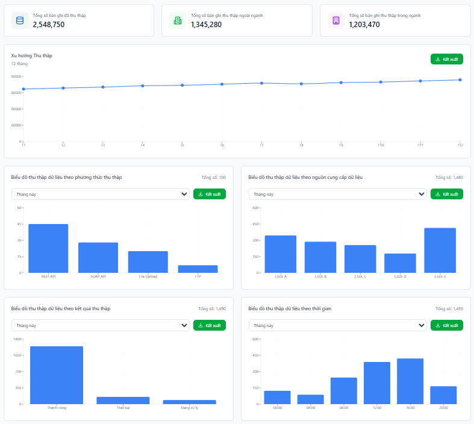

Hình 4- Màn hình dashboard thu thập

##### Mô tả thông tin trên màn hình

| **Trường thông tin** | **Kiểu dữ liệu** | **Bắt buộc** | **Mặc định** | **Mô tả** |
| --- | --- | --- | --- | --- |
| **THỐNG KÊ TỔNG QUAN DỮ LIỆU THU THẬP** | | |  |  |
| **Trường thông tin** | **Kiểu dữ liệu** |  |  |  |
| Tổng số bản ghi đã thu thập | Number |  |  | Tổng số bản ghi dữ liệu đã thu thập về Kho DLDC |
| Tổng số bản ghi thu thập ngoài ngành | Number |  |  | Tổng số bản ghi dữ liệu thu thập từ các hệ thống ngoài Bộ |
| Tổng số bản ghi thu thập trong ngành | Number |  |  | Tổng số bản ghi dữ liệu thu thập từ các hệ thống nội bộ Bộ Tư pháp |
| **XU HƯỚNG THU THẬP DỮ LIỆU** | | |  |  |
| **Trường thông tin** | **Kiểu dữ liệu** |  |  | **Mô tả** |
| Xu hướng thu thập | Line Chart |  |  | Biểu đồ thể hiện số lượng dữ liệu thu thập theo từng tháng trong khoảng thời gian 12 tháng |
| **BIỂU ĐỒ THU THẬP THEO PHƯƠNG THỨC THU THẬP** | | | |  |
| **Trường thông tin** | **Kiểu dữ liệu** |  |  | **Mô tả** |
| Phương thức thu thập | Label |  |  | Các phương thức thu thập dữ liệu như REST API, SOAP API, File Upload, FTP |
| Số lượng dữ liệu | Number |  |  | Số lượng dữ liệu thu thập theo từng phương thức |
| Biểu đồ cột | Chart |  |  | Thể hiện số lượng dữ liệu thu thập theo từng phương thức |
| **BIỂU ĐỒ THU THẬP THEO NGUỒN CUNG CẤP DỮ LIỆU** | | | |  |
| **Trường thông tin** | **Kiểu dữ liệu** |  |  | **Mô tả** |
| Nguồn cung cấp dữ liệu | Label |  |  | Tên hệ thống hoặc đơn vị cung cấp dữ liệu |
| Số lượng dữ liệu | Number |  |  | Số lượng dữ liệu thu thập từ từng nguồn |
| Biểu đồ cột | Chart |  |  | Thể hiện số lượng dữ liệu thu thập theo từng nguồn |
| **BIỂU ĐỒ THEO KẾT QUẢ THU THẬP** | | |  |  |
| **Trường thông tin** | **Kiểu dữ liệu** |  |  | **Mô tả** |
| Trạng thái thu thập | Label |  |  | Trạng thái xử lý dữ liệu: Thành công, Thất bại, Đang xử lý |
| Số lượng bản ghi | Number |  |  | Số lượng dữ liệu theo từng trạng thái |
| Biểu đồ cột | Chart |  |  | Thống kê số lượng dữ liệu theo kết quả thu thập |
| **BIỂU ĐỒ THU THẬP THEO THỜI GIAN** | | |  |  |
| **Trường thông tin** | **Kiểu dữ liệu** |  |  | **Mô tả** |
| Thời gian thu thập | Label |  |  | Các mốc thời gian thu thập dữ liệu trong ngày |
| Số lượng dữ liệu | Number |  |  | Số lượng dữ liệu được thu thập theo từng thời điểm |
| Biểu đồ cột | Chart |  |  | Thống kê tần suất thu thập dữ liệu theo thời gian |

##### Chức năng trên màn hình

|  |  |  |  |
| --- | --- | --- | --- |
| **STT** | **Tên chức năng** | **Định dạng** | **Mô tả** |
| 1 | Lọc thời gian | Danh sách chọn | Cho phép NSD chọn khoảng thời gian thống kê (tháng, năm, hoặc khoảng thời gian tùy chọn) |
| 2 | Kết xuất | Nút | NSD bấm nút **“Kết xuất”** để xuất dữ liệu thống kê ra file Excel |
| 3 | Xem biểu đồ thống kê | Biểu đồ | Hệ thống hiển thị các biểu đồ thống kê dữ liệu thu thập theo các tiêu chí khác nhau |

### Thiết lập dịch vụ thu thập

#### 4.3.3.1. QTLL.TL.01.Thêm mới kết nối

* Màn hình thông tin chung

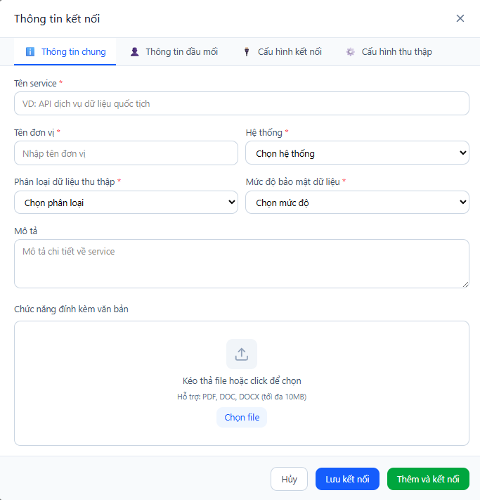

Hình 5 Nhóm thông tin kết nối chung

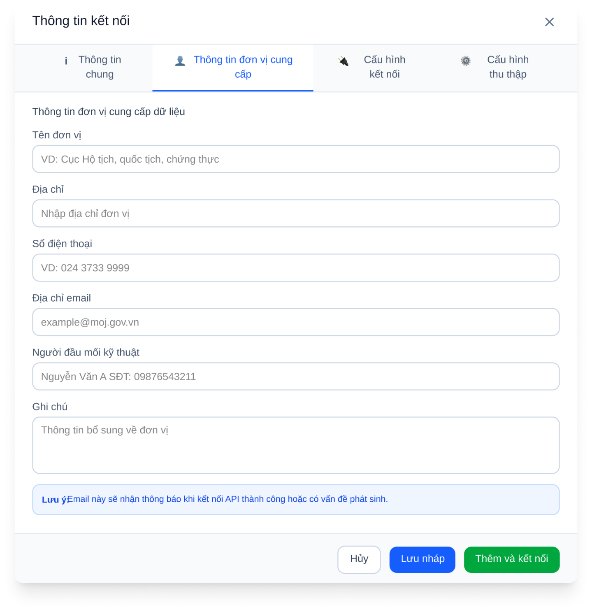

Hình 6 – Nhóm thông tin đầu mối

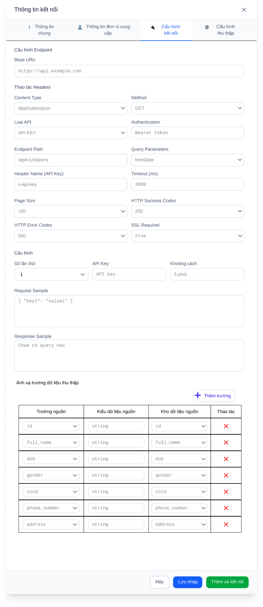

Hình 7 - Thông tin kết nối

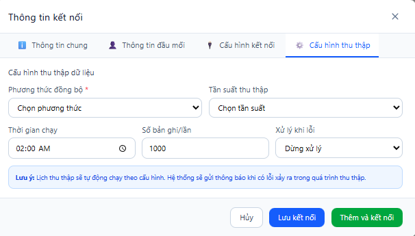

Hình 8 – Cấu hình thu thập

###### Mô tả thông tin trên màn hình

| **Trường thông tin** | **Kiểu dữ liệu** | **Bắt buộc** | **Mặc định** | **Mô tả** |
| --- | --- | --- | --- | --- |
| QTLL.TL.01\_01.TAB THÔNG TIN CHUNG | | | | |
| Tên service \* | Text | X | x | Nhập tên dịch vụ dữ liệu |
| Tên đơn vị \* | Text | X | x | Nhập tên đơn vị cung cấp |
| Hệ thống \* | Text | X | x | Nhập tên hệ thống cung cấp |
| Nguồn thu thập \* | Dropdown | X | x | Chọn nguồn (Hệ thống trong ngành/Hệ thống ngoài ngành) |
| Mức độ bảo mật dữ liệu \* | Dropdown | X | x | Chọn mức độ bảo mật (Dữ liệu mở/Dữ liệu nội nộ/Dữ liệu hạn chế/Dữ liệu nhạy cảm/Dữ liệu bảo mật/Dữ liệu tuyệt mật) |
| Mô tả | Text |  |  | Nhập mô tả |
| Chức năng đính kèm Text | File |  |  | Tải file đính kèm |
| QTLL.TL.01\_02.TAB THÔNG TIN ĐƠN VỊ CUNG CẤP DỮ LIỆU | | | | |
| Tên đơn vị | Text |  |  |  |
| Địa chỉ | Text |  |  |  |
| Địa chỉ email | Text |  |  | Nhập Email của hệ thống nguồn cấp dữ liệu  Mail sẽ nhận các thông báo về việc lỗi dữ liệu, thông báo về đối soát dữ liệu. |
| Đầu mối kỹ thuật | Text |  |  | Nhập tên người quản trị của hệ thống nguồn cấp dữ liệu |
| Ghi chú | Text |  |  | Nhập ghi chú |
| QTLL.TL.01\_03.TAB CẤU HÌNH KẾT NỐI | | | | |
| Base URL \* | Text |  | x | Nhập URL API |
| Content Type | Dropdown |  | x | Chọn (Application/json; application/xml; text/plain) |
| Method | Dropdown | x | x | Mặc định hiển thị giá trị method là GET (GET/PUT/POST/DELETE) |
| Loại API | Dropdown | x |  | Chọn (API KEY; OAuth 2.0; Basic Auth, Bearer Token) |
| Authentication | Dropdown |  |  | Nhập Authentication |
| Endpoint Path | Text |  |  | Nhập endpoint path |
| Query Parameters | Dropdown |  |  | Chọn Query Parameters |
| Header Name (API Key) | Text |  |  | Nhập Header Name (API Key) |
| Timeout (ms) | Text |  |  | Nhập Timeout (ms) |
| Page Size | Dropdown |  |  | Chọn số bản ghi cho từng trang |
| HTTP Success Codes | Dropdown |  |  | Chọn mã trạng thành thành công |
| HTTP Error Codes | Dropdown |  |  | Chọn mã thông báo không thành công |
| SSL Required | Dropdown |  |  | Chọn SSL Required |
| Số lần thử | Dropdown | x |  | Chọn số lần thử kết nối |
| API Key | Dropdown |  |  | Nhập thông tin API Key |
| Khoảng cách | Text |  |  | Nhập khoảng cách mỗi lần call API |
| Request Sample | Text |  |  | Nhập Request Sample gửi đi |
| Response Sample | Text |  |  | Nhập Request Sample trả về |
| Trường nguồn | Dropdown |  |  | Hiển thị trường nguồn |
| Kiểu dữ liệu | Dropdown |  |  | Hiển thị kiểu dữ liệu theo trường nguồn |
| Kho dữ liệu nguồn | Dropdown |  |  | Hiển thị các trường trong kho DLDC tương ứng hệ thống nguồn |
| Thao thác | Button |  | x | Hiển thị chức năng xóa trường (không ánh xạ) |
| Thêm trường | Button |  | x | Thêm trường mởi kho DLDC |
| QTLL.TL.01\_04. TAB CẤU HÌNH THU THẬP | | | | |
| Phương thức đồng bộ | Dropdown | x | x | Chọn Phương thức đồng bộ (Thời gian thực/Theo lô/Theo lịch) Mặc định để “Chọn Phương thức” |
| Tần suất thu thập | Dropdown |  | x | Ghi nhận thời gian gửi dữ liệu (theo giờ, theo ngày, theo tháng…) |

###### Chức năng trên màn hình

| **STT** | **Tên chức năng** | **Định dạng** | **Mô tả** |
| --- | --- | --- | --- |
|  | Lưu nháp | Button | NSD nhập thông tin thêm mới Việc và bấm nút “Lưu nháp” hệ thống thực hiện:   * Lưu nháp các thông tin đã nhập và Xảy ra các trường hợp:   + Đã nhập một số thông tin (chưa đủ thông tin)  + Đã nhập một số tab (chưa nhập hết)   * Kích để lưu dữ liệu thông tin kết nối về CSDL và đồng thời kiểm tra các thông tin đã đúng theo định dạng chưa.   + Nếu dữ liệu nhập đúng: Lưu nháp thành công.  + Nếu dữ liệu nhập chưa đúng theo định dạng: hiển thị thông báo lỗi (lỗi nhập sai ở trường nào của tab nào) |
|  | Thêm và kết nối | Button | * Kích để lưu dữ liệu thông tin kết nối về CSDL và đồng thời kiểm tra các thông tin đã đúng theo định dạng chưa.   + Nếu dữ liệu nhập đúng: Lưu nháp thành công.  + Nếu dữ liệu nhập chưa đúng theo định dạng: hiển thị thông báo lỗi (lỗi nhập sai ở trường nào của tab nào) |
|  | Hủy | Button | * NSD kích để không lưu dữ liệu * Hệ thống quay lại về màn Thiết lập dịch vụ |

#### Quy tắc xử lý

*   **Kiểm tra trùng lặp**: Hệ thống kiểm tra "Tên service" và "Base URL" không được trùng với các thiết lập đã có.
*   **Xác thực API**: Khi nhấn "Thêm và kết nối", hệ thống thực hiện gọi thử (dry-run) tới Endpoint Path với thông tin Authentication đã cấu hình mẫu để kiểm tra tính sẵn sàng của dịch vụ nguồn.
*   **Ánh xạ dữ liệu (Mapping)**: Người dùng phải thực hiện ánh xạ ít nhất một trường dữ liệu nguồn vào kho DLDC mới được phép lưu bản ghi ở trạng thái "Hoạt động".
*   **Mặc định**: Nếu không chọn "Phương thức đồng bộ", hệ thống mặc định cảnh báo yêu cầu chọn trước khi lưu.

#### Danh sách thông báo

| STT | Mã thông báo | Nội dung thông báo | Diễn giải |
| --- | --- | --- | --- |
| 1 | MSG-CONN-001 | Thiết lập kết nối thành công | Lưu thành công thông tin cấu hình |
| 2 | MSG-CONN-002 | Kết nối thử thất bại. Vui lòng kiểm tra lại thông tin cấu hình API. | Hiển thị khi gọi API thử không thành công (lỗi 4xx, 5xx) |
| 3 | MSG-CONN-003 | Tên service đã tồn tại. Vui lòng nhập tên khác. | Trùng khóa chính |
| 4 | MSG-CONN-004 | Dữ liệu nhập chưa đúng định dạng. Vui lòng kiểm tra các trường [Tên trường] | Lỗi validation |
| 5 | MSG-CONN-005 | Lưu nháp thành công | Thông báo sau khi nhấn Lưu nháp |

#### 4.3.3.2. QTLL.TL.02. Quản lý tra cứu phương thức thu thập dữ liệu

Màn hình quản lý thiết lập danh sách 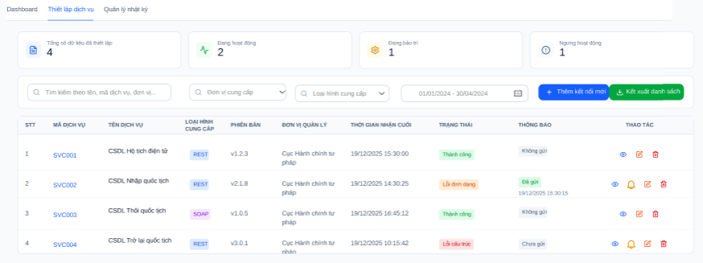

Hình 9 – Màn quản lý danh sách thiết lập thu thập

###### Mô tả thông tin trên màn hình

| **Trường thông tin** | **Kiểu dữ liệu** | **Bắt buộc** | **Mặc định** | **Mô tả** |
| --- | --- | --- | --- | --- |
| **Phần tổng hợp** | | | | |
| Tổng số dữ liệu đã thu thập | Text |  | x | Tổng số danh sách đã thiết lập để thu thập CSDL từ các hệ thống khác. |
| Đang hoạt động | Text |  | x | Tổng số danh sách đã thiết lập đang hoạt động. |
| Đang bảo trì | Text |  | x | Tổng số danh sách đã thiết lập đang bảo trì. |
| Ngưng hoạt động | Text |  | x | Tổng số danh sách đã thiết lập nhưng không còn hoạt động nữa |
| **Phần tìm kiếm** | | | | |
| Tìm kiếm toàn văn | Text |  |  | Cho phép tìm kiếm tất cả thông tin từ trường danh sách đã có |
| Đơn vị cung cấp | Dropdown |  |  | Tìm kiếm theo đơn vị cung cấp dữ liệu |
| Loại hình cung cấp | Dropdown |  |  | Tìm kiếm theo loại hình cung cấp dữ liệu |
| Từ ngày tiếp nhận | Date |  | x | Cho phép NSD nhập hoặc chọn giá trị ngày trong lịch theo định dạng dd/mm/yyyy  Hiển thị giá trị mặc định là tháng hiện tại  Từ ngày tiếp nhận <= đến ngày tiếp nhận |
| Đến ngày tiếp nhận | Date |  | x | Cho phép NSD nhập hoặc chọn giá trị ngày trong lịch theo định dạng dd/mm/yyyy.  Hiển thị giá trị mặc định là tháng hiện tại. |
| ***Kết quả tìm kiếm (Mặc định hiển thị Bảng kết quả)***   * Mặc định hiển thị Danh sách kết quả tìm kiếm theo điều kiện tìm kiếm mặc định * Tìm kiếm mặc định: hiển thị giá trị mà có ngày tiếp nhận từ - đến trong 1 tháng hiện tại | | | | |
| STT | Text |  | x | Hiển thị stt bản ghi |
| Mã dịch vụ | Text |  | x | Hiển thị mã giao dịch |
| Loại hình cung cấp | Text |  | x | Hiển thị loại hình cung cấp |
| Phiên bản | Text |  | x | Hiển thị phiên bản của dịch vụ |
| Đơn vị quản lý | Text |  | x | Hiển thị đơn vị quản lý dữ liệu nguồn |
| Thời gian nhận cuối | Date time |  | x | Hiển thị thời gian nhận dữ liệu cuối |
| Trạng thái | Text |  | x | Hiển thị trạng thái :( Thành công/Lỗi) |
| Thông báo | Text |  | x | Hiển thị tình trạng thông báo |
| Thao tác | Button |  | x | Hiển thị chức nặng - Xem chi tiết: Hiển thị màn xem chi tiết QTLL.TL.01\_01.Thông tin chung.   * Sửa: Thực hiện cập nhật thông tin kết nối cho các màn hình:   + QTLL.TL.01\_01. Thông tin chung.  + QTLL.TL.01\_02.Thông tin đơn vị cung cấp  + QTLL.TL.01\_03.Thông tin kết nối  + QTLL.TL.01\_04. Cấu hình thu thập  **Chỉ thực hiện sửa với các dữ liệu chưa có trạng thái Chưa gửi, Không gửi.**   * Gửi thông báo: Hiển thị chức năng gửi thông báo cho đơn vị nguồn nếu dịch vụ có lỗi |
| ***Phân trang*** | | | | |
| Mũi tên trỏ về trước | Button |  | x | Cho phép NSD bấm trở về số trang liền trước, bắt đầu từ 1 |
| Mũi tên trỏ về sau | Button |  | x | Cho phép NSD bấm trở về số trang liền sau đó, bắt đầu từ 1 |
| Tổng số | Number |  | x | Hệ thống hiển thị tổng số bản ghi tìm được theo điều kiện tìm kiếm, không được chỉnh sửa giá trị |
| Số bản ghi/ 1 trang | Text |  | x | Cho phép NSD chọn 1 trong các giá trị trong danh sách, bao gồm:   * 10 bản ghi/trang * 20 bản ghi/trang * 50 bản ghi/trang * 100 bản ghi/trang   Hiển thị mặc định: 10 bản ghi/ trang |

###### Chức năng trên màn hình

| **STT** | **Tên chức năng** | **Định dạng** | **Mô tả** |
| --- | --- | --- | --- |
| **MH02.1. Màn hình Danh sách việc** | | | |
|  | Tìm kiếm | Button | * NSD nhập thông tin tìm kiếm và bấm nút “Tìm kiếm” hoặc click enter, hệ thống thực hiện tìm kiếm theo:   + Tìm kiếm theo từ khóa  + Tìm kiếm theo Điều kiện tìm kiếm đã nhập   * Xảy ra các trường hợp:   + Trường hợp 1: Không có kết quả, Các trường dữ liệu để trống  + Trường hợp 2: Có kết quả, hệ thống hiển thị danh sách kết quả tìm kiếm **Mặc định dữ liệu hiển thị danh sách được đồng bộ mới nhất theo điều kiện tháng hiện tại.** |
|  | Thêm mới việc | Button | NSD bấm vào nút “Thêm kết nối mới” hệ thống chuyển đến màn hình [QTLL.TL.01.Thêm mới kết nối](#_QTLL.TL.01.Thêm_mới_kết "#_QTLL.TL.01.Thêm_mới_kết") |
|  | Xuất excel | Button | NSD bấm nút “Xuất excel” hệ thống thực hiện kết xuất các bản ghi tìm kiếm được theo file excel   * Trường hợp có tích chọn các bản ghi trong màn hình: NSD bấm vào nút “Xuất excel” hệ thống chỉ xuất file các bản ghi đã chọn   File excel hiển thị đủ các cột thông tin, giá trị như màn hình tìm kiếm  Mẫu xuất file excel (bổ sung sau) |
|  | Xem chi tiết việc | Button | Cho phép xem chi tiết việc  NSD bấm nút “Xem chi tiết việc” hệ thống hiển thị popup màn hình Xem chi tiết việc các thông tin như màn hình [QTLL.TL.04. Xem chi tiết việc thông tin kết nối](#_QTLL.TL.04._Xem_chi "#_QTLL.TL.04._Xem_chi") |
|  | Cập nhật thông tin việc | Button | Cho phép cập nhật thông tin việc  NSD bấm nút “Cập nhật thông tin việc” hệ thống hiển thị popup màn hình Cập nhật thông tin việc [(QTLL.TL.02.Sửa)](#_QTLL.TL.01.Thêm_mới_kết "#_QTLL.TL.01.Thêm_mới_kết")  **Chỉ tài khoản tạo hoặc tài khoản được phần quyền mới có quyền sửa.** |

#### 4.3.3.3. QTLL.TL.02 – Cập nhật thông tin thiết lập kết nối

Màn hình Cập nhật thông tin thiết lập kết nối

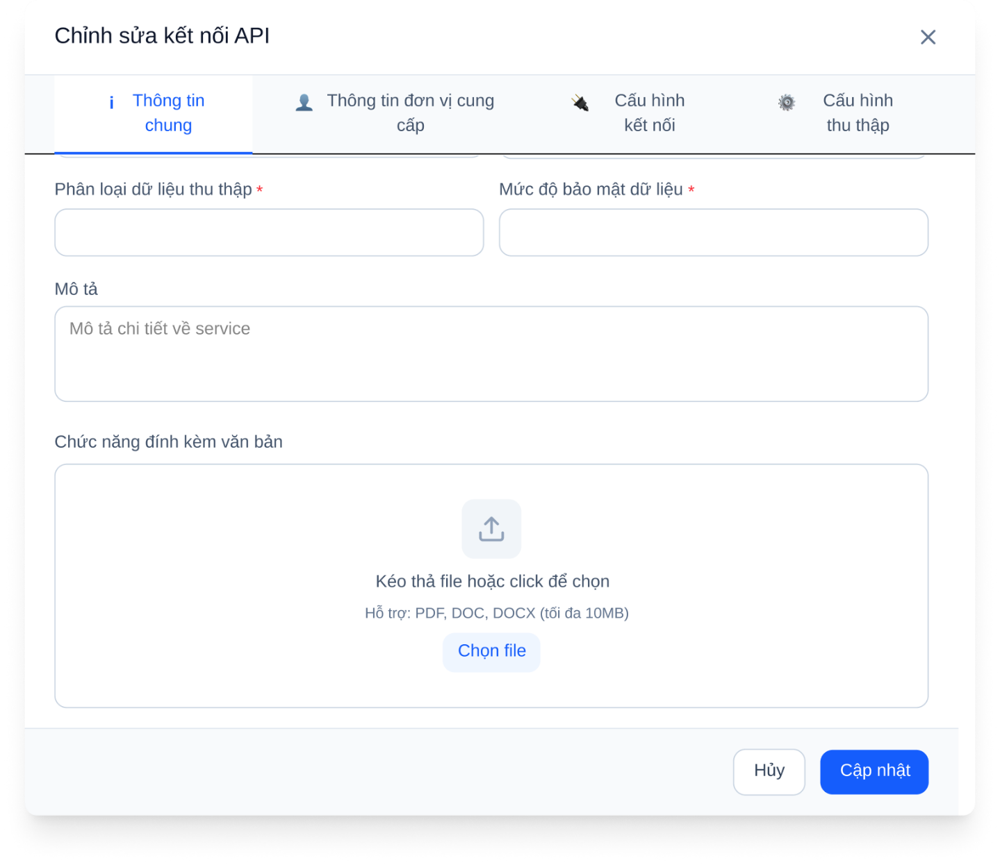

Hình 10 – Tab cập nhật thông tin chung

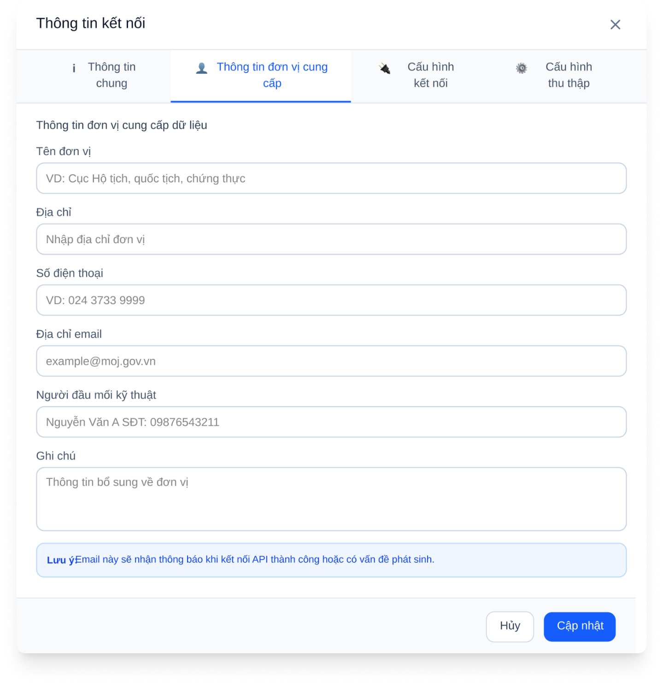

Hình 11- Thông tin đơn vị cung cấp

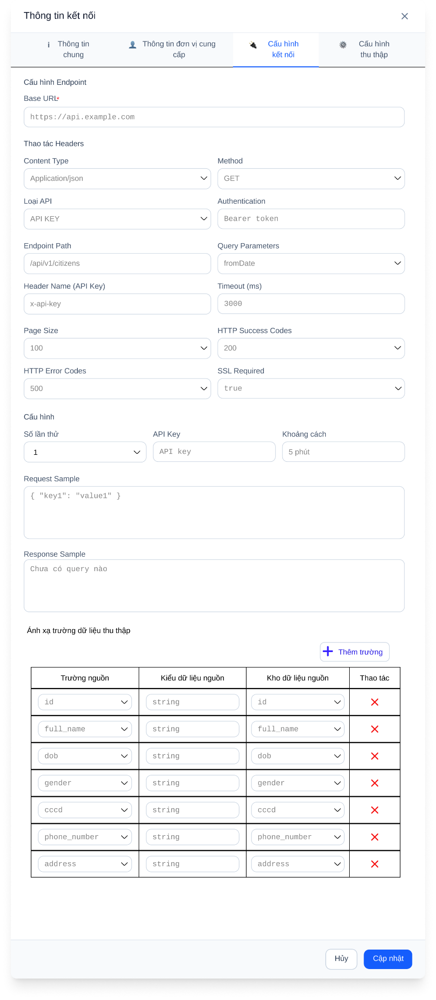

Hình 12 – Thông tin cấu hình kết nối

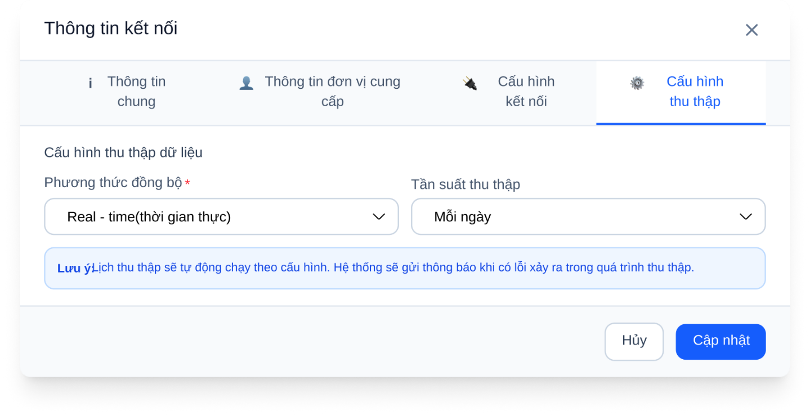

Hình 13 – Thông tin cấu hình thu thập

###### Mô tả thông tin trên màn hình

| **Trường thông tin** | **Kiểu dữ liệu** | **Bắt buộc** | **Mặc định** | **Mô tả** |
| --- | --- | --- | --- | --- |
| QTLL.TL.01\_01.TAB THÔNG TIN CHUNG | | | | |
| Tên service \* | Text | X | x | Cập Nhập tên dịch vụ dữ liệu |
| Tên đơn vị \* | Text | X | x | Cập Nhập tên đơn vị cung cấp |
| Hệ thống \* | Text | X | x | Cập Nhập tên hệ thống cung cấp |
| Nguồn thu thập \* | Dropdown | X | x | Cập Nhập nguồn (Hệ thống trong ngành/Hệ thống ngoài ngành) |
| Mức độ bảo mật dữ liệu \* | Dropdown | X | x | Cập Nhập mức độ bảo mật (Dữ liệu mở/Dữ liệu nội nộ/Dữ liệu hạn chế/Dữ liệu nhạy cảm/Dữ liệu bảo mật/Dữ liệu tuyệt mật) |
| Mô tả | Text |  |  | Cập Nhập mô tả |
| Chức năng đính kèm Text | File |  |  | Cập Nhập Tải file đính kèm |
| QTLL.TL.01\_02.TAB THÔNG TIN ĐƠN VỊ CUNG CẤP DỮ LIỆU | | | | |
| Tên đơn vị | Text |  |  | Cập Nhập tên đơn vị |
| Địa chỉ | Text |  |  | Cập Nhập địa chỉ |
| Địa chỉ email | Text |  |  | Cập Nhập Email của hệ thống nguồn cấp dữ liệu  Mail sẽ nhận các thông báo về việc lỗi dữ liệu, thông báo về đối soát dữ liệu. |
| Đầu mối kỹ thuật | Text |  |  | Cập Nhập tên người quản trị của hệ thống nguồn cấp dữ liệu |
| Ghi chú | Text |  |  | Cập Nhập ghi chú |
| QTLL.TL.01\_03.TAB CẤU HÌNH KẾT NỐI | | | | |
| Base URL \* | Text |  | x | Cập Nhập URL API |
| Content Type | Dropdown |  | x | Cập Nhập (Application/json; application/xml; text/plain) |
| Method | Dropdown | x | x | Cập Nhập giá trị method là GET (GET/PUT/POST/DELETE) |
| Loại API | Dropdown | x |  | Cập Nhập (API KEY; OAuth 2.0; Basic Auth, Bearer Token) |
| Authentication | Dropdown |  |  | Cập Nhập Authentication |
| Endpoint Path | Text |  |  | Cập Nhập endpoint path |
| Query Parameters | Dropdown |  |  | Cập Nhập Query Parameters |
| Header Name (API Key) | Text |  |  | Cập Nhập Header Name (API Key) |
| Timeout (ms) | Text |  |  | Cập Nhập Timeout (ms) |
| Page Size | Dropdown |  |  | Cập Nhập số bản ghi cho từng trang |
| HTTP Success Codes | Dropdown |  |  | Cập Nhập mã trạng thành thành công |
| HTTP Error Codes | Dropdown |  |  | Cập Nhập mã thông báo không thành công |
| SSL Required | Dropdown |  |  | Cập Nhập SSL Required |
| Số lần thử | Dropdown | x |  | Cập Nhập số lần thử kết nối |
| API Key | Dropdown |  |  | Cập Nhập thông tin API Key |
| Khoảng cách | Text |  |  | Cập Nhập khoảng cách mỗi lần call API |
| Request Sample | Text |  |  | Cập Nhập Request Sample gửi đi |
| Response Sample | Text |  |  | Cập Nhập Request Sample trả về |
| Trường nguồn | Dropdown |  |  | Hiển thị trường nguồn |
| Kiểu dữ liệu | Dropdown |  |  | Cập Nhập thị kiểu dữ liệu theo trường nguồn |
| Kho dữ liệu nguồn | Dropdown |  |  | Cập Nhập thị các trường trong kho DLDC tương ứng hệ thống nguồn |
| Thao thác | Button |  | x | Hiển thị chức năng xóa trường (không ánh xạ) |
| Thêm trường | Button |  | x | Cập Nhập trường mởi kho DLDC |
| QTLL.TL.01\_04. TAB CẤU HÌNH THU THẬP | | | | |
| Phương thức đồng bộ | Dropdown | x | x | Cập Nhập Phương thức đồng bộ (Thời gian thực/Theo lô/Theo lịch) Mặc định để “Chọn Phương thức” |
| Tần suất thu thập | Dropdown |  | x | Cập Nhập ghi nhận thời gian gửi dữ liệu (theo giờ, theo ngày, theo tháng…) |

###### Chức năng trên màn hình

| **STT** | **Tên chức năng** | **Định dạng** | **Mô tả** |
| --- | --- | --- | --- |
|  | Cập nhật | Button | NSD nhập thông tin và bấm nút “Cập nhật” hệ thống thực hiện:   * Cập nhật các thông tin mới thay thế cho thông tin cũ đã lưu * Kích để lưu dữ liệu thông tin kết nối về CSDL và đồng thời kiểm tra các thông tin đã đúng theo định dạng chưa.   + Nếu dữ liệu nhập đúng: Lưu nháp thành công.  + Nếu dữ liệu nhập chưa đúng theo định dạng: hiển thị thông báo lỗi (lỗi nhập sai ở trường nào của tab nào) |
|  | Hủy | Button | * NSD kích để không lưu dữ liệu * Hệ thống quay lại về màn Thiết lập dịch vụ |

#### 4.3.3.4. QTLL.TL.04. Xem chi tiết việc thông tin kết nối

Màn hình chi tiết

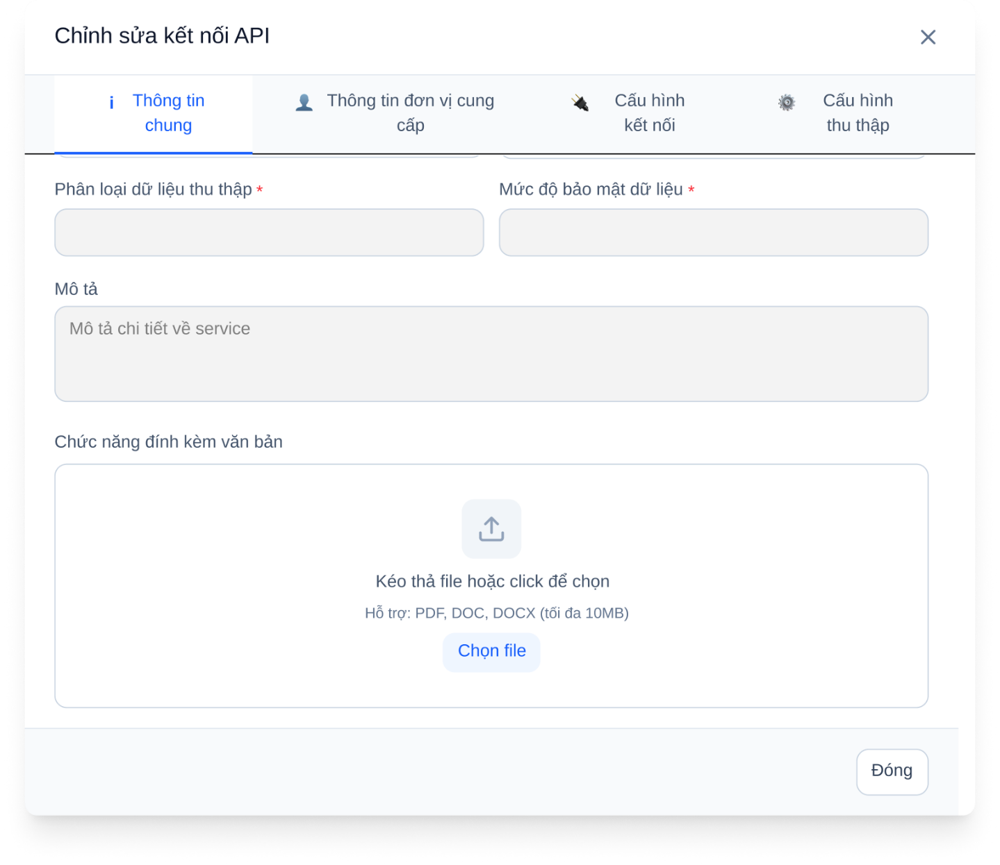

Hình 14 – Màn xem chi tiết thông tin chung

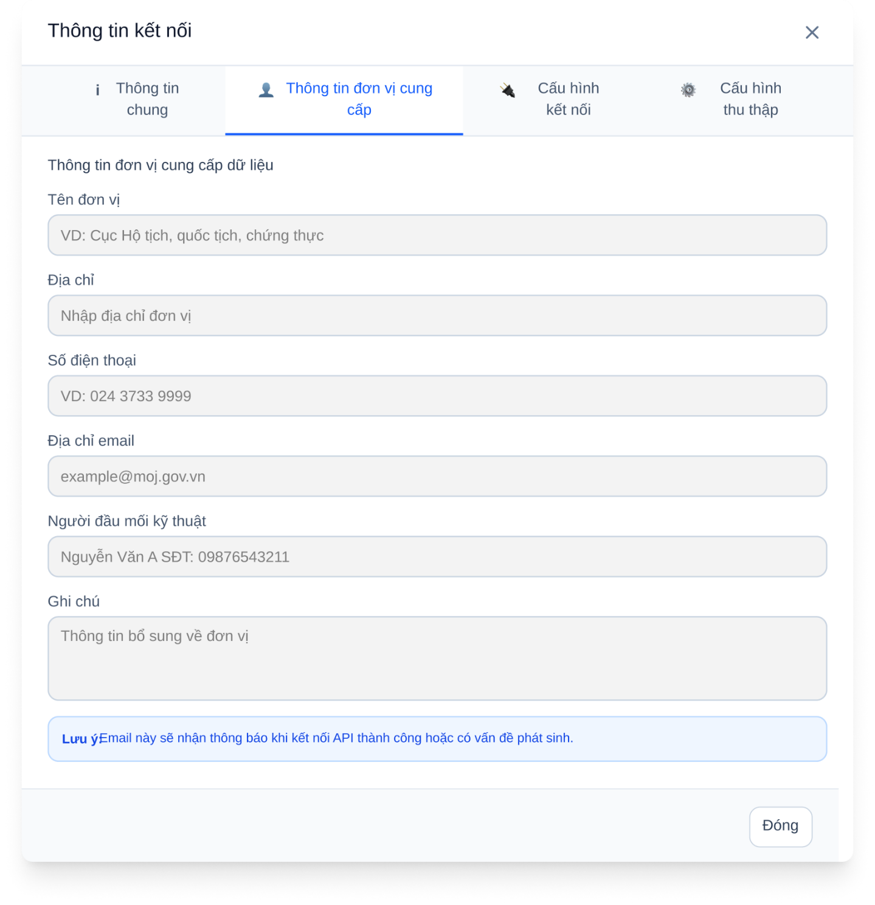

Hình 15 – Màn xem chi tiết thông tin đơn vị cung cấp

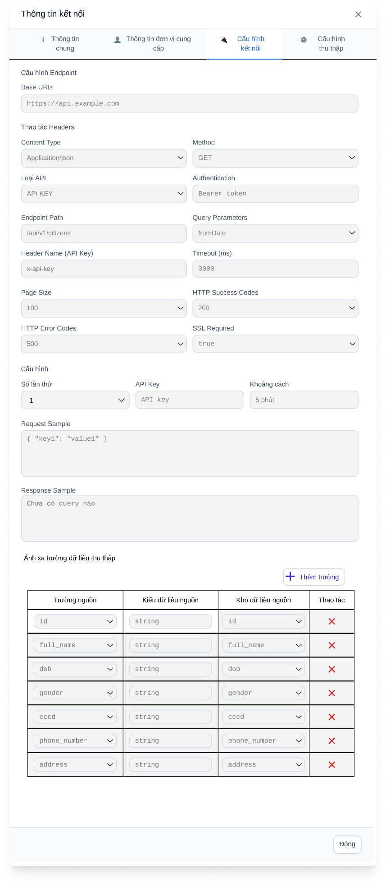

Hình 16- Màn xem chi tiết thông tin cấu hình kết nối

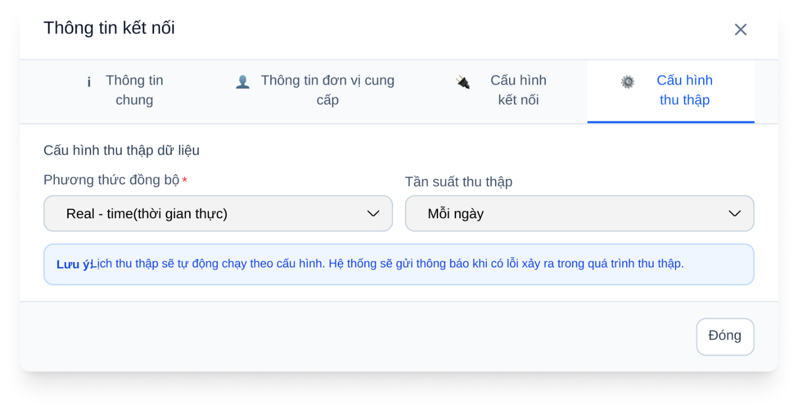

Hình 17 – Màn chi tiết thông tin cấu hình thu thập

###### Mô tả thông tin trên màn hình

| **Trường thông tin** | **Kiểu dữ liệu** | **Bắt buộc** | **Mặc định** | **Mô tả** |
| --- | --- | --- | --- | --- |
| QTLL.TL.01\_01.TAB THÔNG TIN CHUNG | | | | |
| Tên service \* | Text | X | x | Hiển thị tên dịch vụ dữ liệu |
| Tên đơn vị \* | Text | X | x | Hiển thị tên đơn vị cung cấp |
| Hệ thống \* | Text | X | x | Hiển thị tên hệ thống cung cấp |
| Nguồn thu thập \* | Dropdown | X | x | Hiển thị nguồn (Hệ thống trong ngành/Hệ thống ngoài ngành) |
| Mức độ bảo mật dữ liệu \* | Dropdown | X | x | Hiển thị mức độ bảo mật (Dữ liệu mở/Dữ liệu nội nộ/Dữ liệu hạn chế/Dữ liệu nhạy cảm/Dữ liệu bảo mật/Dữ liệu tuyệt mật) |
| Mô tả | Text |  |  | Hiển thị mô tả |
| Chức năng đính kèm Text | File |  |  | Hiển thị Tải file đính kèm |
| QTLL.TL.01\_02.TAB THÔNG TIN ĐƠN VỊ CUNG CẤP DỮ LIỆU | | | | |
| Tên đơn vị | Text |  |  | Hiển thị tên đơn vị |
| Địa chỉ | Text |  |  | Hiển thị địa chỉ |
| Địa chỉ email | Text |  |  | Hiển thị Email của hệ thống nguồn cấp dữ liệu  Mail sẽ nhận các thông báo về việc lỗi dữ liệu, thông báo về đối soát dữ liệu. |
| Đầu mối kỹ thuật | Text |  |  | Hiển thị tên người quản trị của hệ thống nguồn cấp dữ liệu |
| Ghi chú | Text |  |  | Hiển thị ghi chú |
| QTLL.TL.01\_03.TAB CẤU HÌNH KẾT NỐI | | | | |
| Base URL \* | Text |  | x | Hiển thị URL API |
| Content Type | Dropdown |  | x | Hiển thị (Application/json; application/xml; text/plain) |
| Method | Dropdown | x | x | Hiển thị giá trị method là GET (GET/PUT/POST/DELETE) |
| Loại API | Dropdown | x |  | Hiển thị (API KEY; OAuth 2.0; Basic Auth, Bearer Token) |
| Authentication | Dropdown |  |  | Hiển thị Authentication |
| Endpoint Path | Text |  |  | Hiển thị endpoint path |
| Query Parameters | Dropdown |  |  | Hiển thị Query Parameters |
| Header Name (API Key) | Text |  |  | Hiển thị Header Name (API Key) |
| Timeout (ms) | Text |  |  | Hiển thị Timeout (ms) |
| Page Size | Dropdown |  |  | Hiển thị số bản ghi cho từng trang |
| HTTP Success Codes | Dropdown |  |  | Hiển thị mã trạng thành thành công |
| HTTP Error Codes | Dropdown |  |  | Hiển thị mã thông báo không thành công |
| SSL Required | Dropdown |  |  | Hiển thị SSL Required |
| Số lần thử | Dropdown | x |  | Hiển thị số lần thử kết nối |
| API Key | Dropdown |  |  | Hiển thị thông tin API Key |
| Khoảng cách | Text |  |  | Hiển thị khoảng cách mỗi lần call API |
| Request Sample | Text |  |  | Hiển thị Request Sample gửi đi |
| Response Sample | Text |  |  | Hiển thị Request Sample trả về |
| Trường nguồn | Dropdown |  |  | Hiển thị trường nguồn |
| Kiểu dữ liệu | Dropdown |  |  | Hiển thị thị kiểu dữ liệu theo trường nguồn |
| Kho dữ liệu nguồn | Dropdown |  |  | Hiển thị thị các trường trong kho DLDC tương ứng hệ thống nguồn |
| Thao thác | Button |  | x | Hiển thị chức năng xóa trường (không ánh xạ) |
| Thêm trường | Button |  | x | Hiển thị trường mởi kho DLDC |
| QTLL.TL.01\_04. TAB CẤU HÌNH THU THẬP | | | | |
| Phương thức đồng bộ | Dropdown | x | x | Hiển thị Phương thức đồng bộ (Thời gian thực/Theo lô/Theo lịch) Mặc định để “Chọn Phương thức” |
| Tần suất thu thập | Dropdown |  | x | Hiển thị ghi nhận thời gian gửi dữ liệu (theo giờ, theo ngày, theo tháng…) |

###### Chức năng trên màn hình

| **STT** | **Tên chức năng** | **Định dạng** | **Mô tả** |
| --- | --- | --- | --- |
|  | Đóng | Nút | NSD bấm nút “Đóng” hệ thống thực hiện đóng popup và trở về màn hình Danh sách |

##### QTLL.TL.04. Xem chi tiết và gửi lỗi kết nối cho đơn vị nguồn

Màn hình chi tiết

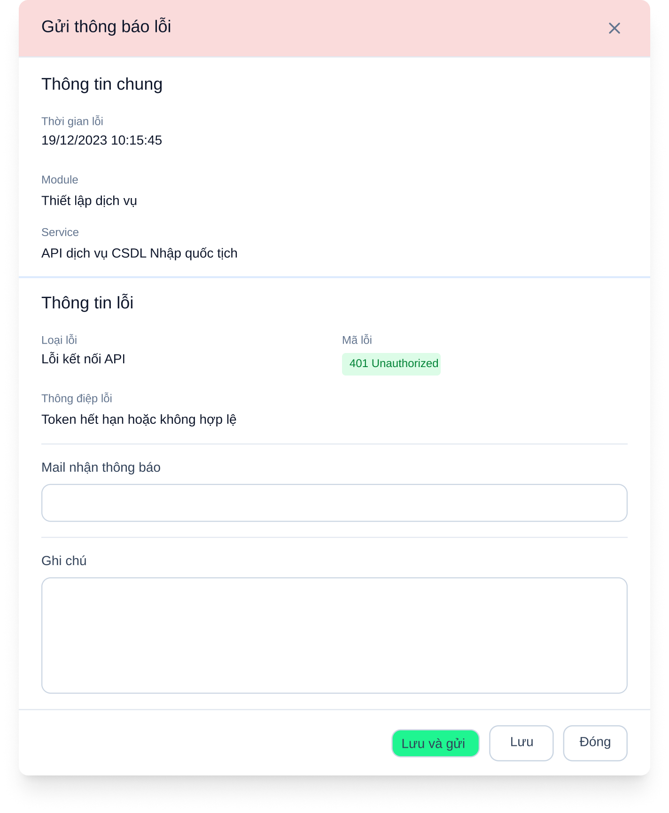

Hình 18 – Màn chi tiết thông tin cấu hình thu thập

###### Mô tả thông tin trên màn hình

| **Trường thông tin** | **Kiểu dữ liệu** | **Bắt buộc** | **Mặc định** | **Mô tả** |
| --- | --- | --- | --- | --- |
| **Thông tin chung** | | | | |
| Thời gian lỗi | Date time |  | x | Hiển thị thời gian lỗi |
| Service | Text |  | x | Hiển thị tên dịch vụ kết nối |
| **Thông tin lỗi** | | | | |
| Loại lỗi | Text |  | x | Hiển thị loại lỗi |
| Mã lỗi | Number |  | x | Hiển thị mã lỗi |
| Thông điệp lỗi | Text |  | x | Hiển thị thông điệp lỗi |
| Mail | Text |  |  | * Nhập thông tin mail người quản trị của hệ thống nguồn dữ liệu * NSD nếu nhập sai định dạng hiển thị cảnh báo |
| Ghi chú | Text |  |  | Nhập thông tin ghi chú |

###### Chức năng trên màn hình

| **STT** | **Tên chức năng** | **Định dạng** | **Mô tả** |
| --- | --- | --- | --- |
| 1 | Lưu và gửi | Button | NSD chọn “Lưu và gửi”. Hệ thống check định dạng mail + Nếu mail đúng định dạng hệ thống lưu thông tin vào CSDL và đồng thời kết nối sang mail để gửi email cho quản trị hệ thống nguồn. + Nếu mail sai hệ thống không cho lưu và hiển thị cảnh báo “Định dạng EMAIL chưa đúng vui lòng nhập lại” |
| 2 | Lưu | Button | NSD chọn “Lưu”. Hệ thống check định dạng mail + Nếu mail đúng định dạng hệ thống lưu thông tin vào CSDL. + Nếu mail sai hệ thống không cho lưu và hiển thị cảnh báo “Định dạng EMAIL chưa đúng vui lòng nhập lại” |
| 3 | Đóng | Button | NSD bấm nút “Đóng” hệ thống thực hiện đóng popup và trở về màn hình Danh sách |

##### QTLL.TL.03. Xác nhận xóa

Màn hình chi tiết

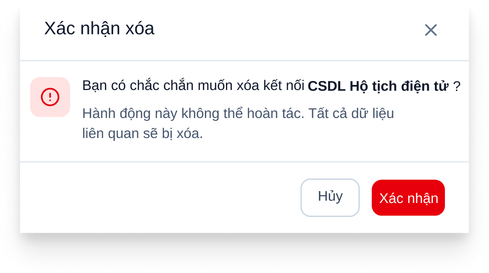

Hình 19 – Màn xác nhận xóa

###### Mô tả thông tin trên màn hình

| **Trường thông tin** | **Kiểu dữ liệu** | **Bắt buộc** | **Mặc định** | **Mô tả** |
| --- | --- | --- | --- | --- |
| Bạn có chắc chắn muốn xóa yêu cầu? | Ký tự (200) |  | x | Hệ thống hiển thị thông báo khi bấm vào nút “Xóa”  **chỉ quản trị mới được phép xóa. Disable nút “Xóa” với tài khoản thường, enable nút “Xóa” với tài khoản quản trị**  Chỉ xóa |

###### Chức năng trên màn hình

| **STT** | **Tên chức năng** | **Định dạng** | **Mô tả** |
| --- | --- | --- | --- |
| Xác nhận | Button |  | NSD bấm nút “Xác nhận” hệ thống thực hiện xóa bản ghi đã chọn (không hiển thị bản ghi đã chọn xóa trên màn hình chức năng), đồng thời hệ thống thực hiện chuyển trạng thái của bản ghi trong hệ thống sang “Hủy”, không xóa bản ghi lưu trong DB |
| Hủy | Button |  | NSD bấm nút “Hủy” hệ thống giữ nguyên bản ghi đã chọn, không xóa bản ghi |

#### Quản lý nhật ký

##### QTLL.TL.03.Quản lý nhật ký

* Màn hình thông tin chung

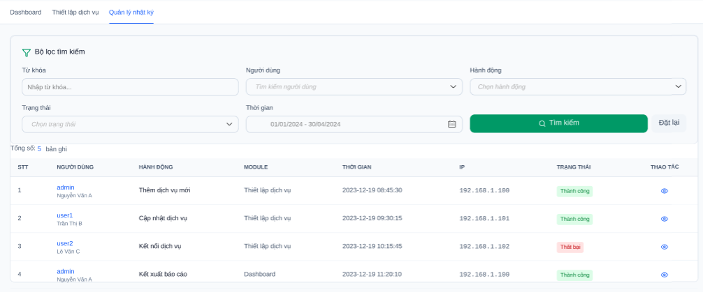

Hình 20 – Màn hình nhật ký hoạt động

###### Mô tả thông tin trên màn hình

| **Trường thông tin** | **Kiểu dữ liệu** | **Bắt buộc** | **Mặc định** | **Mô tả** |
| --- | --- | --- | --- | --- |
| Mục tìm kiếm dữ liệu | | | | |
| **Từ khóa** | Text |  | Trống | Nhập từ khóa cần tìm kiếm (ví dụ: nội dung hành động). |
| **Người dùng** | Dropdown |  | Tất cả | Chọn hoặc tìm kiếm tên người dùng thực hiện. |
| **Hành động** | Dropdown |  | Tất cả | Chọn loại hành động (Thêm mới, Cập nhật, Kết nối...). |
| **Trạng thái** | Dropdown |  | Tất cả | Chọn trạng thái (Thành công, Thất bại). |
| **Thời gian** | Date Range |  | Tháng hiện tại | Chọn khoảng thời gian muốn xem nhật ký. |
| **Mục hiển thị kết quả tìm kiếm** | | | | |
| **Người dùng** | Text (Link) |  | x | Hiển thị Username và Họ tên đầy đủ. Link dẫn tới chi tiết user. |
| **Hành động** | Text |  | x | Mô tả thao tác người dùng đã thực hiện. |
| **Module** | Text |  | x | Tên phân hệ xảy ra hành động (Thiết lập dịch vụ, Dashboard...). |
| **Thời gian** | DateTime |  | x | Thời điểm thực hiện hành động (YYYY-MM-DD HH:mm:ss). |
| **IP** | Text |  | x | Địa chỉ IP của thiết bị thực hiện thao tác. |
| **Trạng thái** | Label |  | x | Trạng thái thực hiện: Thành công (Xanh) hoặc Thất bại (Đỏ). |
| **Thao tác** | Icon Button |  | x | Button "Con mắt" để xem chi tiết log của bản ghi đó. |

###### Chức năng trên màn hình

| **STT** | **Tên chức năng** | **Định dạng** | **Mô tả** |
| --- | --- | --- | --- |
|  | Tìm kiếm | Button | * Khi người dùng click vào nút, hệ thống thực hiện lấy dữ liệu từ các bộ lọc (Từ khóa, Người dùng, Hành động, Trạng thái, Thời gian) để truy vấn và hiển thị kết quả tương ứng dưới danh sách bản ghi. * Nếu không nhập tiêu chí nào và nhấn tìm kiếm, hệ thống hiển thị toàn bộ danh sách bản ghi theo thời gian mặc định |
|  | Đặt lại | Button | * Khi người dùng click vào nút, hệ thống thực hiện xóa tất cả các giá trị hiện có trong các trường bộ lọc và đưa các trường về giá trị mặc định ban đầu. * Sau khi đặt lại, danh sách kết quả phía dưới nên được làm mới (refresh) về trạng thái mặc định |
|  | Xem chi tiết | Button | * Khi click vào Button "con mắt" tại cột Thao tác, hệ thống hiển thị màn hình/pop-up thông tin chi tiết của bản ghi nhật ký đó (bao gồm các thông tin chi tiết hơn về log dữ liệu nếu có). |

#### 4.3.4.2. QTLL.NK.01_01.Xem thông tin chi tiết

* Màn hình thông tin chung

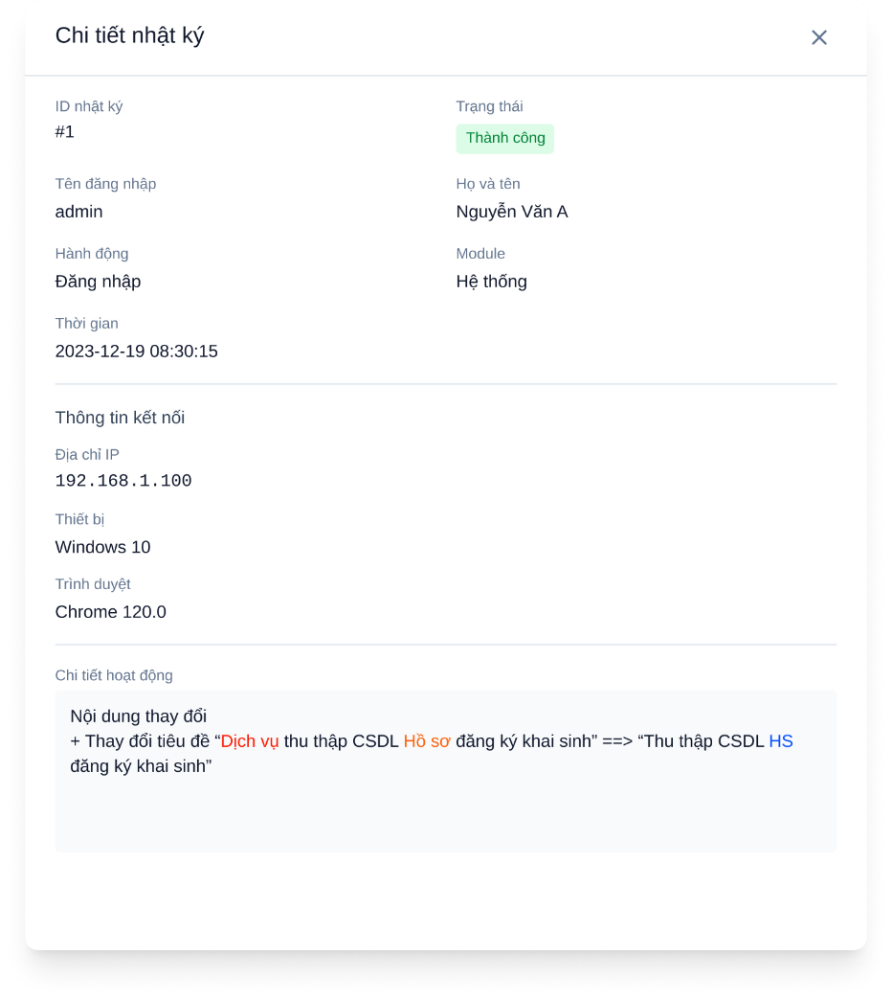

Hình 21 – Xem thông tin chi tiết

##### 4.3.4.2.1. Mô tả thông tin trên màn hình

| **Trường thông tin** | **Kiểu dữ liệu** | **Bắt buộc** | **Mặc định** | **Mô tả** |
| --- | --- | --- | --- | --- |
| ID nhật ký | Text |  | x | Mã định danh duy nhất của bản ghi nhật ký (Ví dụ: #1). |
| Trạng thái | Text |  | x | Trạng thái thực hiện hành động (Thành công/Thất bại). |
| Tên đăng nhập | Text |  | x | Username của tài khoản thực hiện thao tác. |
| Họ và tên | Text |  | x | Họ tên đầy đủ của người thực hiện. |
| Hành động | Text |  | x | Loại thao tác đã thực hiện (Ví dụ: Đăng nhập, Cập nhật...). |
| Module | Text |  | x | Phân hệ hệ thống nơi hành động diễn ra. |
| Thời gian | Text |  | x | Thời điểm chính xác xảy ra hành động (Ngày và giờ). |
| Địa chỉ IP | Text |  | x | Địa chỉ IP của thiết bị thực hiện kết nối. |
| Thiết bị | Text |  | x | Hệ điều hành của thiết bị (Ví dụ: Windows 10). |
| Trình duyệt | Text |  | x | Tên và phiên bản trình duyệt sử dụng. |
| Nội dung thay đổi | Text |  | x | Hiển thị chi tiết các thay đổi dữ liệu (Ví dụ: Thay đổi tiêu đề từ "A" sang "B"). |

##### 4.3.4.2.2. Chức năng trên màn hình

| **STT** | **Tên chức năng** | **Định dạng** | **Mô tả** |
| --- | --- | --- | --- |
|  | Tìm kiếm | Button | * Khi người dùng click vào nút, hệ thống thực hiện lấy dữ liệu từ các bộ lọc (Từ khóa, Người dùng, Hành động, Trạng thái, Thời gian) để truy vấn và hiển thị kết quả tương ứng dưới danh sách bản ghi. * Nếu không nhập tiêu chí nào và nhấn tìm kiếm, hệ thống hiển thị toàn bộ danh sách bản ghi theo thời gian mặc định |
|  | Đặt lại | Button | * Khi người dùng click vào nút, hệ thống thực hiện xóa tất cả các giá trị hiện có trong các trường bộ lọc và đưa các trường về giá trị mặc định ban đầu. * Sau khi đặt lại, danh sách kết quả phía dưới nên được làm mới (refresh) về trạng thái mặc định |
|  | Xem chi tiết | Button | * Khi click vào Button "con mắt" tại cột Thao tác, hệ thống hiển thị màn hình/pop-up thông tin chi tiết của bản ghi nhật ký đó (bao gồm các thông tin chi tiết hơn về log dữ liệu nếu có). |

#### 4.3.4.3. QTLL.NK.01_02.Xem thông tin chi tiết lỗi

* Màn hình thông tin chung

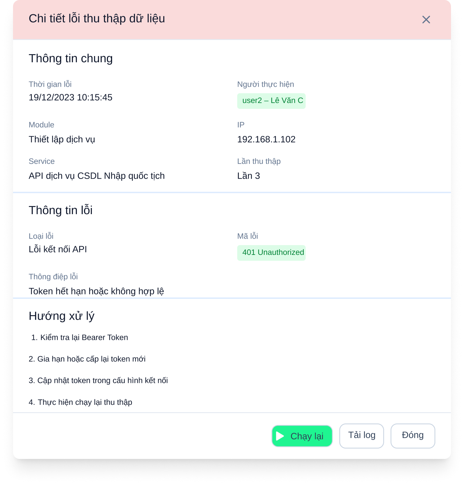

Hình 22 – Xem thông tin chi tiết lỗi

##### 4.3.4.3.1. Mô tả thông tin trên màn hình

| **Trường thông tin** | **Kiểu dữ liệu** | **Bắt buộc** | **Mặc định** | **Mô tả** |
| --- | --- | --- | --- | --- |
| **Thông tin chung** | | | | |
| Thời gian lỗi | Date time |  | x | Hiển thị thời gian lỗi |
| Người thực hiện | Text |  | x | Người tạo thông tin kết nối |
| Module |  |  | x | Hiển thị module phần mềm |
| IP | Text |  | x | Hiển thị địa chỉ IP |
| Service | Text |  | x | Hiển thị tên dịch vụ kết nối |
| **Thông tin lỗi** | | | | |
| Loại lỗi | Text |  | x | Hiển thị loại lỗi |
| Mã lỗi | Number |  | x | Hiển thị mã lỗi |
| Thông điệp lỗi | Text |  | x | Hiển thị thông điệp lỗi |
| Hướng xử lý | Text |  | x | Hiển thị các hướng xử lý |

##### 4.3.4.3.2. Chức năng trên màn hình

| **STT** | **Tên chức năng** | **Định dạng** | **Mô tả** |
| --- | --- | --- | --- |
|  | Tìm kiếm | Button | * Khi người dùng click vào nút, hệ thống thực hiện lấy dữ liệu từ các bộ lọc (Từ khóa, Người dùng, Hành động, Trạng thái, Thời gian) để truy vấn và hiển thị kết quả tương ứng dưới danh sách bản ghi. * Nếu không nhập tiêu chí nào và nhấn tìm kiếm, hệ thống hiển thị toàn bộ danh sách bản ghi theo thời gian mặc định |
|  | Đặt lại | Button | * Khi người dùng click vào nút, hệ thống thực hiện xóa tất cả các giá trị hiện có trong các trường bộ lọc và đưa các trường về giá trị mặc định ban đầu. * Sau khi đặt lại, danh sách kết quả phía dưới nên được làm mới (refresh) về trạng thái mặc định |
|  | Xem chi tiết | Button | * Khi click vào Button "con mắt" tại cột Thao tác, hệ thống hiển thị màn hình/pop-up thông tin chi tiết của bản ghi nhật ký đó (bao gồm các thông tin chi tiết hơn về log dữ liệu nếu có). |

### 4.3.5. Khai thác CSDL đã thu thập trong ngành

#### 4.3.5.1. QLTT.QL.01. Tổng quan thu thập CSDL hộ tịch điện tử

Màn hình tổng hợp tổng quan thu thập CSDL

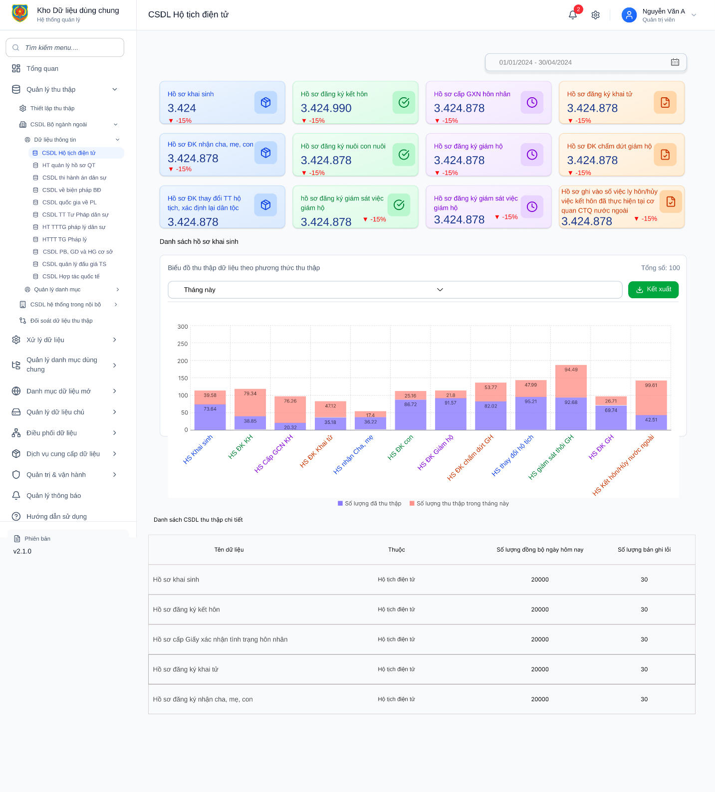

*Hình 23 – Màn tổng quan thu thập CSDL*

##### 4.3.5.1.1. Mô tả thông tin trên màn hình

| Trường thông tin | Kiểu dữ liệu | Bắt buộc | Mặc định | Mô tả |
| --- | --- | --- | --- | --- |
| **BỘ LỌC CHUNG** | | | | |
| Thời gian | Date Range |  | Tháng hiện tại | Chọn khoảng thời gian để thống kê toàn bộ dữ liệu trên Dashboard. |
| **Bộ TỔNG HỢP(CARDS)** |  |  |  |  |
| Khối chỉ số hồ sơ đăng ký khai sinh | Text |  | x |  |
| *tổng số đăng ký khai sinh* | *Number* |  | *x* | Hiển thị tổng số đăng ký khai sinh |
| *tỷ lệ tăng trưởng* | *Percentage* |  | *x* | Hiển thị tỷ lệ phần trăm tăng/giảm so với kỳ trước |
| Khối chỉ số hồ sơ đăng ký kết hôn | Text |  | x |  |
| *tổng số đăng ký kết hôn* | *Number* |  | *x* | Hiển thị tổng số đăng ký kết hôn |
| *tỷ lệ tăng trưởng* | *Percentage* |  | *x* | Hiển thị tỷ lệ phần trăm tăng/giảm so với kỳ trước |
| Khối chỉ số hồ sơ cấp giấy xác nhận tình trạng hôn nhân | Text |  | x |  |
| *tổng số cấp giấy xác nhận tình trạng hôn nhân* | Number |  | x | Hiển thị tổng số cấp giấy xác nhận tình trạng hôn nhân |
| *tỷ lệ tăng trưởng* | Percentage |  | x | Hiển thị tỷ lệ phần trăm tăng/giảm so với kỳ trước |
| Khối chỉ số hồ sơ đăng ký khai tử | Text |  | x |  |
| *tổng số đăng ký khai tử* | Number |  | x | Hiển thị tổng số đăng ký khai tử |
| *tỷ lệ tăng trưởng* | Percentage |  | x | Hiển thị tỷ lệ phần trăm tăng/giảm so với kỳ trước |
| Khối chỉ số hồ sơ đăng ký nuôi con nuôi | Text |  | x |  |
| *tổng số đăng ký nuôi con nuôi* | Number |  | x | Hiển thị tổng số đăng ký nuôi con nuôi |
| *tỷ lệ tăng trưởng* | Percentage |  | x | Hiển thị tỷ lệ phần trăm tăng/giảm so với kỳ trước |
| Khối chỉ số hồ sơ đăng ký giám hộ | Text |  | x |  |
| *tổng số đăng ký giám hộ* | Number |  | x | Hiển thị tổng số đăng ký giám hộ |
| *tỷ lệ tăng trưởng* | Percentage |  | x | Hiển thị tỷ lệ phần trăm tăng/giảm so với kỳ trước |
| Khối chỉ số hồ sơ đăng ký chấm dứt giám hộ | Text |  | x |  |
| *tổng số đăng ký chấm dứt giám hộ* | Number |  | x | Hiển thị tổng số đăng ký chấm dứt giám hộ |
| *tỷ lệ tăng trưởng* | Percentage |  | x | Hiển thị tỷ lệ phần trăm tăng/giảm so với kỳ trước |
| Khối chỉ số hồ sơ đăng ký thay đổi, cải chính, bổ sung thông tin hộ tịch, xác định lại dân tộc | Text |  | x |  |
| *tổng số đăng ký thay đổi, cải chính, bổ sung th* | Number |  | x | Hiển thị tổng số đăng ký thay đổi, cải chính, bổ sung th |
| *tỷ lệ tăng trưởng* | Percentage |  | x | Hiển thị tỷ lệ phần trăm tăng/giảm so với kỳ trước |
| Khối chỉ số hồ sơ đăng ký giám sát việc giám hộ | Text |  | x |  |
| *tổng số đăng ký giám sát việc giám hộ* | Number |  | x | Hiển thị tổng số đăng ký giám sát việc giám hộ |
| *tỷ lệ tăng trưởng* | Percentage |  | x | Hiển thị tỷ lệ phần trăm tăng/giảm so với kỳ trước |
| khối chỉ số hồ sơ đăng ký chấm dứt giám sát việc giám hộ | Text |  | x |  |
| *tổng số đăng ký chấm dứt giám sát việc giám hộ* | Number |  | x | Hiển thị tổng số đăng ký chấm dứt giám sát việc giám hộ |
| *tỷ lệ tăng trưởng* | Percentage |  | x | Hiển thị tỷ lệ phần trăm tăng/giảm so với kỳ trước |
| Khối chỉ số hồ sơ ghi vào sổ việc ly hôn/hủy việc kết hôn đã thực hiện tại cơ quan có thẩm quyền của nước ngoài (ghi chú ly hôn) | Text |  | x |  |
| *tổng số ghi vào sổ việc ly hôn/hủy việc kết hôn* | Number |  | x | Hiển thị tổng số ghi vào sổ việc ly hôn/hủy việc kết hôn |
| *Tỷ lệ tăng trưởng* | Percentage |  | x | Hiển thị tỷ lệ phần trăm tăng/giảm so với kỳ trước |
| **BIỂU ĐỒ THU THẬP** | | | | |
| Phương thức lọc | Dropdown |  | Tháng này | Chọn thời gian hiển thị dữ liệu cho biểu đồ. |
| **DANH SÁCH CHI TIẾT** |  |  |  |  |
| Tên dữ liệu | Text |  |  | Hiển thị tên loại hồ sơ (Ví dụ: Hồ sơ khai sinh). |
| Thuộc | Text |  |  | Phân loại nguồn dữ liệu (Ví dụ: Hộ tịch điện tử). |
| Số lượng đồng bộ | Number |  |  | Tổng số hồ sơ đã đồng bộ thành công trong ngày hôm nay. |
| Số lượng bản ghi lỗi | Number |  |  | Tổng số hồ sơ gặp lỗi trong quá trình đồng bộ. |

##### 4.3.5.1.2. Chức năng trên màn hình

| **STT** | **Tên chức năng** | **Định dạng** | **Mô tả** |
| --- | --- | --- | --- |
|  | Chọn thời gian | Calendar Icon | Mở trình chọn ngày để lọc lại toàn bộ dữ liệu thống kê trên trang. |
|  | Kết xuất | Button | Thực hiện xuất dữ liệu biểu đồ và báo cáo chi tiết ra tệp tin (Excel/PDF). |
|  | Lọc biểu đồ | Dropdown | Thay đổi phạm vi dữ liệu hiển thị trên biểu đồ cột chồng theo thời gian được chọn. |

##### 4.3.5.1.3. Thông tin chi tiết dữ liệu hồ sơ đăng ký khai sinh

QLTT.QL.01\_01\_01\_02.Màn danh sách dữ liệu hồ sơ đăng ký khai sinh

Màn hình thông tin chung

Hình 24 – Quản lý, khai thác dữ liệu khai sinh

Mô tả thông tin trên màn hình

| **Trường thông tin** | **Kiểu dữ liệu** | **Bắt buộc** | **Mặc định** | **Mô tả** |
| --- | --- | --- | --- | --- |
| **1. Khu vực tìm kiếm nhanh** | | | | |
| Từ khóa tìm kiếm | Text | Không | Trống | Nhập họ tên hoặc số giấy chứng nhận để tìm kiếm nhanh dữ liệu khai sinh. |
| Tìm kiếm nâng cao | Button | Không |  | Mở popup tìm kiếm nâng cao theo nhiều tiêu chí. |
| **2. Khu vực chức năng** | | | | |
|  |  |  |  |  |
| Nhập | Button | Không |  | Nhập dữ liệu khai sinh từ file (Excel/CSV). |
| Xuất | Button | Không |  | Xuất danh sách dữ liệu khai sinh ra file. |
| Đồng bộ | Button | Không |  | Thực hiện đồng bộ dữ liệu khai sinh với hệ thống nguồn. |
| **3. Bảng danh sách dữ liệu khai sinh** | | | | |
|  |  |  |  |  |
| STT | Number | Có | Tự tăng | Số thứ tự bản ghi trong danh sách. |
| Tình trạng | Text | Có |  | Trạng thái thay đổi dữ liệu (Mới / Cập nhật). |
| Họ tên | Text | Có |  | Họ và tên người khai sinh. |
| Ngày sinh | Date | Có |  | Ngày tháng năm sinh. |
| Quốc tịch | Text | Có | Việt Nam | Quốc tịch của người được khai sinh. |
| Số giấy chứng nhận | Text | Có |  | Số giấy chứng nhận khai sinh. |
| Ngày đăng ký | Date | Có |  | Ngày đăng ký khai sinh. |
| Trạng thái | Status | Có |  | Trạng thái xử lý dữ liệu (Đã duyệt / Chờ duyệt). |
| Thao tác | Icon/Button | Không |  | Xem chi tiết thông tin bản ghi. |
| **4. Phân trang** | | | | |
| Số bản ghi hiển thị | Number | Không | 15 | Hiển thị số lượng bản ghi trên mỗi trang. |
| Trang hiện tại | Number | Không | 1 | Trang đang được hiển thị. |
| Trước / Sau | Button | Không |  | Di chuyển giữa các trang dữ liệu. |
| **5.Popup: Tìm kiếm nâng cao** | | | | |
| Họ tên | Text | Không |  | Nhập họ tên người khai sinh cần tìm. |
| Số giấy chứng nhận | Text | Không |  | Nhập số giấy chứng nhận khai sinh. |
| Quốc tịch | Text | Không |  | Nhập hoặc chọn quốc tịch. |
| Trạng thái | Dropdown | Không | Tất cả | Lọc theo trạng thái xử lý (Đã duyệt / Chờ duyệt). |
| Hủy | Button | Không |  | Đóng popup tìm kiếm nâng cao, không áp dụng điều kiện. |
| Tìm kiếm | Button | Không |  | Thực hiện tìm kiếm theo các điều kiện đã nhập. |

Chức năng trên màn hình

| **TT** | **Tên chức năng** | **Định dạng** | **Mô tả** |
| --- | --- | --- | --- |
| 1 | Tìm kiếm nhanh | Button | NSD nhập **họ tên hoặc số giấy chứng nhận** và bấm tìm kiếm. – Hệ thống thực hiện lọc dữ liệu theo từ khóa nhập. – Trả về danh sách các bản ghi thỏa mãn điều kiện. |
| 2 | Tìm kiếm nâng cao | Button | NSD bấm nút “Tìm kiếm nâng cao”. – Hệ thống hiển thị màn hình popup tìm kiếm nâng cao [QLTT.QL.01\_01\_01\_01.Màn hình tìm kiếm nâng cao](#_QLTT.QL.01_01_01_01.Màn_hình_tìm "#_QLTT.QL.01_01_01_01.Màn_hình_tìm") . – Cho phép tìm kiếm theo nhiều tiêu chí kết hợp. |
| 3 | Thực hiện tìm kiếm nâng cao | Button | NSD nhập điều kiện và bấm “Tìm kiếm”. – Hệ thống kiểm tra dữ liệu nhập. – Thực hiện truy vấn và hiển thị kết quả phù hợp. |
| 4 | Hủy tìm kiếm nâng cao | Button | NSD bấm “Hủy”. – Hệ thống đóng popup tìm kiếm nâng cao. – Không áp dụng điều kiện tìm kiếm. |
| 5 | Xem chi tiết | Button | NSD bấm Button “Xem”. – Hệ thống hiển thị chi tiết thông tin bản ghi dữ liệu khai sinh. |
| 6 | Nhập dữ liệu | Button | NSD bấm “Nhập”. – Hệ thống cho phép tải lên file dữ liệu (Excel/CSV). – Kiểm tra định dạng file và cấu trúc dữ liệu. + Nếu hợp lệ: Thực hiện nhập dữ liệu. + Nếu không hợp lệ: Hiển thị thông báo lỗi. |
| 7 | Xuất dữ liệu | Button | NSD bấm “Xuất”. – Hệ thống xuất danh sách dữ liệu theo điều kiện lọc hiện tại ra file. |
| 8 | Đồng bộ dữ liệu | Button | NSD bấm “Đồng bộ”. – Hệ thống gửi yêu cầu đồng bộ dữ liệu khai sinh từ hệ thống nguồn. – Cập nhật trạng thái đồng bộ cho từng bản ghi. |
| 9 | Phân trang | Button | NSD sử dụng nút “Trước / Sau”. – Hệ thống hiển thị dữ liệu theo từng trang. |
| 10 | Hiển thị trạng thái xử lý | Label/Status | Hệ thống hiển thị trạng thái bản ghi: – Đã duyệt – Chờ duyệt Phục vụ theo dõi và kiểm soát dữ liệu. |

#### Quy tắc xử lý

*   **Tìm kiếm**: Hệ thống thực hiện tìm kiếm mờ (Like) đối với Họ tên và tìm kiếm chính xác đối với Số giấy chứng nhận.
*   **Đồng bộ dữ liệu**: Khi nhấn "Đồng bộ", hệ thống chỉ lấy các bản ghi có sự thay đổi (Update) hoặc bản ghi mới (Insert) từ hệ thống nguồn kể từ lần đồng bộ cuối cùng.
*   **Xuất dữ liệu**: File xuất ra định dạng Excel (.xlsx) chứa tối đa 65,000 dòng. Nếu vượt quá, hệ thống sẽ yêu cầu người dùng lọc lại để giảm phạm vi.

#### Danh sách thông báo

| STT | Mã thông báo | Nội dung thông báo | Diễn giải |
| --- | --- | --- | --- |
| 1 | MSG-BIRTH-001 | Đồng bộ dữ liệu hoàn tất. [X] bản ghi mới, [Y] bản ghi cập nhật. | Kết quả đồng bộ |
| 2 | MSG-BIRTH-002 | Đang thực hiện đồng bộ... Vui lòng không đóng trình duyệt. | Thông báo tiến trình |
| 3 | MSG-BIRTH-003 | Không tìm thấy dữ liệu phù hợp với điều kiện lọc. | Khi kết quả tìm kiếm trống |
| 4 | MSG-BIRTH-004 | Nhập dữ liệu thành công [X]/[Total] bản ghi. | Kết quả import |
| 5 | MSG-BIRTH-005 | File dữ liệu không đúng định dạng mẫu. Vui lòng kiểm tra lại. | Lỗi import |

###### 4.3.5.1.3.1. QLTT.QL.01_01_01_02. Màn hình thông tin chi tiết

Màn hình thông tin chung

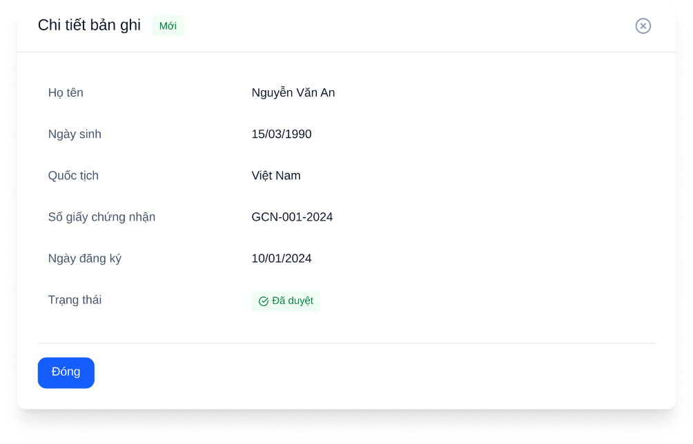

Hình 26 – Màn hình thông tin chi tiết

####### Mô tả thông tin trên màn hình

|  |  |  |  |  |
| --- | --- | --- | --- | --- |
| **Trường thông tin** | **Kiểu dữ liệu** | **Bắt buộc** | **Mặc định** | **Mô tả** |
| **5.Popup: Tìm kiếm nâng cao** | | | | |
| Họ tên | Text | Không |  | Nhập họ tên người khai sinh cần tìm. |
| Số giấy chứng nhận | Text | Không |  | Nhập số giấy chứng nhận khai sinh. |
| Quốc tịch | Dropdown | Không | X | * Nhập hoặc chọn quốc tịch. * Mặc định: Việt Nam |
| Trạng thái | Dropdown | Không | Đã duyệt | Lọc theo trạng thái xử lý (Đã duyệt / Chờ duyệt).   * Mặc định: Đã duyệt |
| Hủy | Button | Không |  | Đóng popup tìm kiếm nâng cao, không áp dụng điều kiện. |
| Tìm kiếm | Button | Không |  | Thực hiện tìm kiếm theo các điều kiện đã nhập. |

####### Chức năng trên màn hình

|  |  |  |  |
| --- | --- | --- | --- |
| **TT** | **Tên chức năng** | **Định dạng** | **Mô tả** |
| 1 | Đóng | Button | Đóng popup tìm kiếm nâng cao, không áp dụng điều kiện.  Quay về màn hình danh sách [QLTT.QL.01\_01\_01.Màn danh sách dữ liệu hồ sơ đăng ký khai sinh](#_QLTT.QL.01_01_01.Màn_danh_sách "#_QLTT.QL.01_01_01.Màn_danh_sách") |

###### 4.3.5.1.3.2. QLTT.QL.01_02. Tab Thông tin chi tiết cấu hình nguồn kết nối

Màn hình thông tin chung

Hình 27 – Thông tin cấu hình nguồn kết nối

####### Mô tả thông tin trên màn hình

| **Trường thông tin** | **Kiểu dữ liệu** | **Bắt buộc** | **Mặc định** | **Mô tả** |
| --- | --- | --- | --- | --- |
| Danh sách kết nối API | Number | Có | Tự tăng | Tổng danh sách lịch sử kết nối |
| Tiêu đề | Text |  | X | Hiển thị tên tiêu đề kết nối dữ liệu |
| Trạng thái | Text |  | X | Hiển thị trạng thái kết nối |
| Loại kết nối | Text |  | X | Hiển thị loại kết nối |
| Endpoint | Text |  | X | Hiển thị Endpoint |
| Method | Text |  | X | Hiển thị Method API |
| Timeout | Text |  | X | Hiển thị Timeout |
| Ngày tạo | Date\_time |  | X | Thời gian tạo |
| Thao tác | Button | Không |  | Xem chi tiết thông tin bản ghi. |

####### Chức năng trên màn hình

| **TT** | **Tên chức năng** | **Định dạng** | **Mô tả** |
| --- | --- | --- | --- |
| 1 | Xem chi tiết | Button | NSD bấm Button “Xem”. – Hệ thống chuyển sang popup xem chi tiết thông tin kết nối[QTLL.TL.04. Xem chi tiết việc thông tin kết nối](#_PM01.QLV.XCT._Xem_chi "#_PM01.QLV.XCT._Xem_chi") . |

###### 4.3.5.1.3.3. QLTT.QL.01_02. Tab lịch sử đồng bộ

Màn hình thông tin chung

Hình 28 – Thông tin lịch sử đồng bộ

####### Mô tả thông tin trên màn hình

| **Trường thông tin** | **Kiểu dữ liệu** | **Bắt buộc** | **Mặc định** | **Mô tả** |
| --- | --- | --- | --- | --- |
| Tổng số lần đồng bộ | Number | Có | Tự tăng | Tổng số lần đồng bộ |
| Thời gian | Text |  | X | Hiển thị Thời gian |
| Trạng thái | Text |  | X | Hiển thị trạng thái |
| Cập nhật | Text |  | X | Hiển thị Cập nhật |
| Lỗi | Text |  | X | Hiển thị Popup thông tin chi tiết lỗi [QTLL.NK.01\_02.Xem thông tin chi tiết lỗi](#_QTLL.NK.01_02.Xem_thông_tin "#_QTLL.NK.01_02.Xem_thông_tin") |
| Tổng số | Text |  | X | Hiển thị Tổng số |
| Thời lượng | Text |  | X | Hiển thị Thời lượng |

####### Chức năng trên màn hình

| **TT** | **Tên chức năng** | **Định dạng** | **Mô tả** |
| --- | --- | --- | --- |
| 1 | Làm mới | Button | Cập nhật lại danh sách nhật ký đồng bộ |
|  | Lỗi | Button | Hiển thị Popup chi tiết lỗi [QTLL.NK.01\_02.Xem thông tin chi tiết lỗi](#_QTLL.NK.01_02.Xem_thông_tin "#_QTLL.NK.01_02.Xem_thông_tin") |

##### 4.3.5.1.4. Bộ dữ liệu hồ sơ đăng ký kết hôn

##### 4.3.5.1.5. Bộ dữ liệu hồ sơ cấp Giấy xác nhận tình trạng hôn nhân

##### 4.3.5.1.6. Bộ dữ liệu hồ sơ đăng ký khai tử

##### 4.3.5.1.7. Bộ dữ liệu hồ sơ đăng ký nhận cha, mẹ, con

##### 4.3.5.1.8. Bộ dữ liệu hồ sơ đăng ký nuôi con nuôi

##### 4.3.5.1.9. Bộ dữ liệu hồ sơ đăng ký giám hộ

##### 4.3.5.1.10. Bộ dữ liệu hồ sơ đăng ký thay đổi, cải chính, bổ sung thông tin hộ tịch, xác định lại dân tộc

##### 4.3.5.1.11. Bộ dữ liệu hồ sơ đăng ký giám sát việc giám hộ

##### 4.3.5.1.12. Bộ dữ liệu hồ sơ đăng ký chấm dứt giám sát việc giám hộ

##### 4.3.5.1.13. Bộ dữ liệu hồ sơ ghi vào sổ việc ly hôn/hủy việc kết hôn đã thực hiện tại cơ quan có thẩm quyền của nước ngoài (ghi chú ly hôn)

##### 4.3.5.1.14. Bộ dữ liệu Nhập Quốc tịch

##### 4.3.5.1.15. Bộ dữ liệu Thôi Quốc tịch

##### 4.3.5.1.16. Bộ dữ liệu Trở lại Quốc tịch

##### 4.3.5.1.17. Bộ dữ liệu Yêu cầu thi hành án của cá nhân, cơ quan, tổ chức

##### 4.3.5.1.18. Bộ dữ liệu Quyết định thi hành án dân sự

##### 4.3.5.1.19. Bộ dữ liệu Người phải thi hành án, người được thi hành án, người có quyền lợi nghĩa vụ liên quan

##### 4.3.5.1.20. Bộ dữ liệu Nghĩa vụ thi hành án

##### 4.3.5.1.21. Bộ dữ liệu Trạng thái thi hành án

##### 4.3.5.1.22. Bộ dữ liệu Tài sản thi hành án

##### 4.3.5.1.23. Bộ dữ liệu Xác minh điều kiện trong thi hành án dân sự

##### 4.3.5.1.24. Bộ dữ liệu Cưỡng chế thi hành án trong thi hành án dân sự

##### 4.3.5.1.25. Bộ dữ liệu Áp dụng biện pháp bảo đảm trong thi hành án dân sự

##### 4.3.5.1.26. Bộ dữ liệu Chứng từ nghiệp vụ trong thi hành án dân sự

##### 4.3.5.1.27. Bộ dữ liệu Biên lai thu tiền thi hành án dân sự

##### 4.3.5.1.28. Bộ dữ liệu Vật chứng trong thi hành án dân sự

## 4.4. Quản lý đối soát dữ liệu thu thập

### 4.4.1. Mục đích

Đảm bảo rằng dữ liệu không bị sai lệch, thất thoát hoặc biến đổi trái phép trong quá trình luân chuyển

* Đảm bảo tính toàn vẹn của dữ liệu (Data Integrity)
* Phát hiện và xử lý lỗi kịp thời
* Đảm bảo tính chính xác trong báo cáo

### 4.4.2. Quản lý danh sách đối soát thu thập

#### 4.4.2.1. DSDL01. Màn danh sách đối soát thu thập

Màn hình

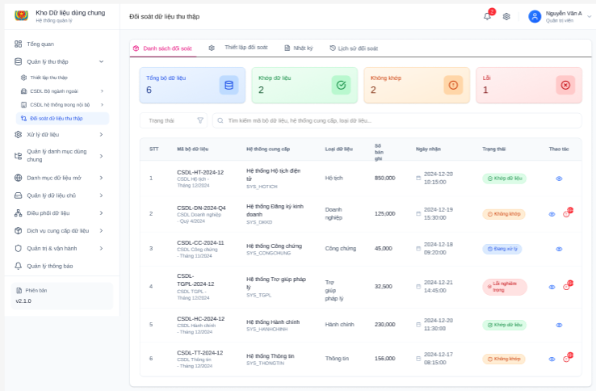

*Hình 29 – Màn danh sách đối soát dữ liệu thu thập*

##### 4.4.2.1.1. Mô tả thông tin trên màn hình

| **Trường thông tin** | **Kiểu dữ liệu** | **Bắt buộc** | **Mặc định** | **Mô tả** |
| --- | --- | --- | --- | --- |
| **BỘ LỌC CHUNG** | | | | |
| Tìm kiếm | Text | Không | Trống | Nhập mã bộ dữ liệu, hệ thống cung cấp hoặc loại dữ liệu để tìm kiếm nhanh. |
| Thời gian | Date Range | Không | Tháng hiện tại | Chọn khoảng thời gian để thống kê và lọc dữ liệu hiển thị trên Dashboard. |
| **BỘ TỔNG HỢP (CARDS)** | | | | |
| Tổng bộ dữ liệu | Number |  | x | Hiển thị tổng số lượng bộ dữ liệu hiện có trong hệ thống (Ví dụ: 6). |
| Khớp dữ liệu | Number |  | x | Hiển thị số lượng các bộ dữ liệu có trạng thái đối soát thành công (Ví dụ: 2). |
| Không khớp | Number |  | x | Hiển thị số lượng các bộ dữ liệu có sai lệch sau đối soát (Ví dụ: 2). |
| Lỗi | Number |  | x | Hiển thị số lượng các bộ dữ liệu gặp lỗi nghiêm trọng trong quá trình xử lý (Ví dụ: 1). |
| **DANH SÁCH ĐỐI SOÁT (TABLE)** | | | | |
| STT | Number | x | Tự động | Số thứ tự của bản ghi trong danh sách. |
| Mã bộ dữ liệu | Text | x |  | Hiển thị mã định danh và tên chi tiết của bộ dữ liệu (Ví dụ: CSDL-HT-2024-12). |
| Hệ thống cung cấp | Text | x |  | Tên hệ thống và mã hệ thống gửi dữ liệu (Ví dụ: Hệ thống Hộ tịch điện tử - SYS\_HOTICH). |
| Loại dữ liệu | Text | x |  | Phân loại nghiệp vụ của dữ liệu (Hộ tịch, Doanh nghiệp, Công chứng...). |
| Số bản ghi | Number | x |  | Tổng số lượng bản ghi có trong bộ dữ liệu (Ví dụ: 850,000). |
| Ngày nhận | DateTime | x |  | Thời gian hệ thống tiếp nhận bộ dữ liệu (Định dạng: YYYY-MM-DD HH:mm:ss). |
| Trạng thái | Label | x |  | Trạng thái đối soát: Khớp dữ liệu (Xanh), Không khớp (Cam), Đang xử lý (Xanh dương), Lỗi nghiêm trọng (Đỏ). |
| Thao tác | Icon/Button |  |  | Các nút chức năng: Xem chi tiết (icon mắt) và Cảnh báo lỗi (icon chấm than đỏ). |

##### 4.4.2.1.2. Chức năng trên màn hình

|  |  |  |  |
| --- | --- | --- | --- |
| **STT** | **Tên chức năng** | **Định dạng** | **Mô tả** |
| 1 | Lọc theo trạng thái | Dropdown | Cho phép người dùng chọn trạng thái cụ thể (Khớp dữ liệu, Không khớp, Đang xử lý, Lỗi nghiêm trọng) để lọc danh sách bên dưới. |
| 2 | Tìm kiếm nhanh | Textbox | Nhập từ khóa để tìm kiếm theo mã bộ dữ liệu, hệ thống cung cấp hoặc loại dữ liệu. |
| 3 | Xem chi tiết | Button | Nhấn để chuyển hướng sang màn hình xem thông tin chi tiết của bộ dữ liệu tương ứng. |
| 4 | Xem thông báo lỗi | Button | Hiển thị thông tin cảnh báo hoặc số lượng lỗi cụ thể phát sinh trong bộ dữ liệu (hiển thị kèm badge số lượng lỗi). |

#### 4.4.2.2. Quy tắc xử lý

*   **Tự động đối soát**: Hệ thống tự động kích hoạt tiến trình đối soát ngay sau khi bộ dữ liệu được tiếp nhận thành công vào vùng đệm.
*   **Phân loại lỗi**: Lỗi được phân loại dựa trên trọng số của trường dữ liệu (ví dụ: lỗi Họ tên/Số định danh là lỗi Nghiêm trọng, lỗi Địa chỉ là lỗi Trung bình).
*   **Cập nhật trạng thái**: Sau khi đối soát xong, hệ thống cập nhật trạng thái bộ dữ liệu (Khớp/Không khớp) và gửi thông báo cho quản trị viên.

#### 4.4.2.3. Danh sách thông báo

| STT | Mã thông báo | Nội dung thông báo | Diễn giải |
| --- | --- | --- | --- |
| 1 | MSG-RECON-001 | Tiến trình đối soát đã hoàn thành. | Thông báo trạng thái |
| 2 | MSG-RECON-002 | Phát hiện [X] bản ghi không khớp. Vui lòng kiểm tra chi tiết. | Cảnh báo sai lệch |
| 3 | MSG-RECON-003 | Lỗi hệ thống trong quá trình đối soát. Vui lòng thử lại. | Lỗi kỹ thuật |

#### 4.4.2.4. DSDL01_01. Màn xem chi tiết thông tin đối soát

Màn hình

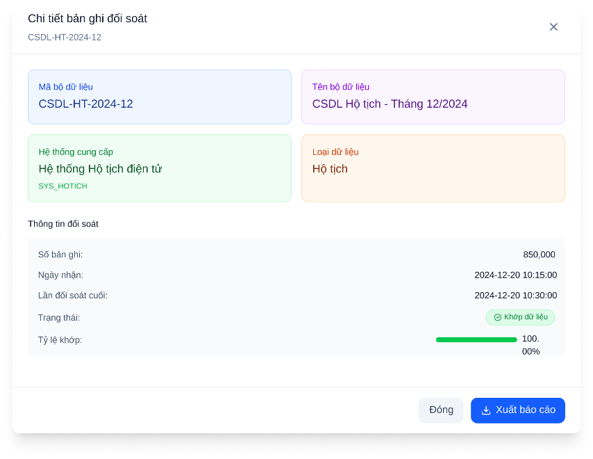

*Hình 30 – Màn danh sách đối soát dữ liệu thu thập*

##### 4.4.2.4.1. Mô tả thông tin trên màn hình

|  |  |  |  |  |  |
| --- | --- | --- | --- | --- | --- |
| **STT** | **Tên trường thông tin** | **Kiểu dữ liệu** | **Bắt buộc** | **Mặc định** | **Mô tả** |
| 1 | Mã bộ dữ liệu | Text |  | x | Mã định danh duy nhất của bộ dữ liệu (Ví dụ: CSDL-HT-2024-12). |
| 2 | Tên bộ dữ liệu | Text |  | x | Tên đầy đủ của bộ dữ liệu theo nội dung và thời gian (Ví dụ: CSDL Hộ tịch - Tháng 12/2024). |
| 3 | Hệ thống cung cấp | Text |  | x | Tên hệ thống nguồn và mã hệ thống gửi dữ liệu (Ví dụ: Hệ thống Hộ tịch điện tử - SYS\_HOTICH). |
| 4 | Loại dữ liệu | Text |  | x | Phân loại nghiệp vụ của dữ liệu (Ví dụ: Hộ tịch). |
| 5 | Số bản ghi | Number |  | x | Tổng số lượng bản ghi có trong bộ dữ liệu (Ví dụ: 850,000). |
| 6 | Ngày nhận | DateTime |  | x | Thời gian hệ thống tiếp nhận bộ dữ liệu. |
| 7 | Lần đối soát cuối | DateTime |  | x | Thời gian thực hiện phiên đối soát gần nhất cho bộ dữ liệu này. |
| 8 | Trạng thái | Label |  | x | Tình trạng đối soát hiện tại (Ví dụ: Khớp dữ liệu). |
| 9 | Tỷ lệ khớp | Percentage |  | x | Hiển thị % mức độ trùng khớp kèm theo thanh biểu đồ tiến trình (Progress bar). |

##### 4.4.2.4.2. Chức năng trên màn hình

|  |  |  |  |
| --- | --- | --- | --- |
| **STT** | **Tên chức năng** | **Định dạng** | **Mô tả** |
| 2 | Đóng | Button | Nút lệnh ở cuối popup dùng để đóng cửa sổ và quay lại màn hình danh sách. |
| 3 | Xuất báo cáo | Button | Thực hiện kết xuất thông tin chi tiết của bản ghi đối soát ra tệp tin. |

#### 4.4.2.5. DSDL01_02. Màn xem chi tiết thông tin đối soát lỗi

Màn hình

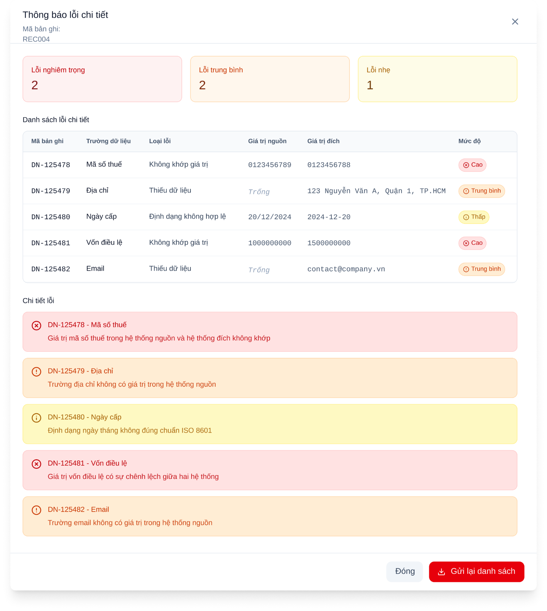

*Hình 31 – Màn danh sách đối soát dữ liệu thu thập lỗi*

##### 4.4.2.5.1. Mô tả thông tin trên màn hình

| **STT** | **Tên trường thông tin** | **Kiểu dữ liệu** | **Bắt buộc** | **Mặc định** | **Mô tả** |
| --- | --- | --- | --- | --- | --- |
| 1 | Tiêu đề | Text |  | x | Hiển thị tiêu đề màn hình |
| 2 | Lỗi nghiêm trọng | Number |  | x | Tổng số lượng lỗi mức độ cao cần xử lý gấp (hiển thị trong card màu đỏ). |
| 3 | Lỗi trung bình | Number |  | x | Tổng số lượng lỗi mức độ vừa phải (hiển thị trong card màu cam). |
| 4 | Lỗi nhẹ | Number |  | x | Tổng số lượng lỗi mức độ thấp hoặc cảnh báo (hiển thị trong card màu vàng). |
| 5 | Mã bản ghi (Table) | Text |  | x | Mã định danh của từng bản ghi con gặp lỗi trong bộ dữ liệu. |
| 6 | Trường dữ liệu | Text |  | x | Tên thuộc tính/trường thông tin phát sinh lỗi (Ví dụ: Mã số thuế, Địa chỉ, Email...). |
| 7 | Loại lỗi | Text |  | x | Phân loại nguyên nhân lỗi (Không khớp giá trị, Thiếu dữ liệu, Định dạng không hợp lệ). |
| 8 | Giá trị nguồn | Text |  | x | Dữ liệu ghi nhận từ hệ thống gốc gửi đi. |
| 9 | Giá trị đích | Text |  | x | Dữ liệu ghi nhận tại hệ thống tiếp nhận để đối chiếu. |
| 10 | Mức độ (Label) | Label |  | x | Trạng thái phân cấp lỗi: Cao (Đỏ), Trung bình (Cam), Thấp (Vàng). |
| 11 | Chi tiết lỗi (List) | Text |  | x | Khối Text mô tả cụ thể nội dung sai lệch cho từng mã bản ghi lỗi. |

##### 4.4.2.5.2. Chức năng trên màn hình

|  |  |  |  |
| --- | --- | --- | --- |
| **STT** | **Tên chức năng** | **Định dạng** | **Mô tả** |
| 2 | Đóng | Button | Nút lệnh ở cuối popup dùng để đóng cửa sổ và quay lại màn hình danh sách. |
| 3 | Gửi lại danh sách | Button | Thực hiện lệnh gửi lại hoặc yêu cầu xử lý lại cho các bản ghi đang bị lỗi. |

#### 4.4.2.6. DSDL01_02_01. Màn xác nhận gửi thông tin lỗi đối soát

Màn hình

*Hình 32 – Màn xác nhận gửi thông tin lỗi đối soát*

##### 4.4.2.6.1. Mô tả thông tin trên màn hình

|  |  |  |  |  |  |
| --- | --- | --- | --- | --- | --- |
| **STT** | **Tên trường thông tin** | **Kiểu dữ liệu** | **Bắt buộc** | **Mặc định** | **Mô tả** |
| 1 | Tiêu đề popup | Text |  | x | Tên chức năng đang thực hiện. |
| 2 | Thông báo khởi tạo | Text |  | x | Thông tin mô tả mục đích và số lượng bản ghi cụ thể sẽ được xử lý (số 80 hiển thị màu đỏ). |
| 3 | Thời gian thực hiện | Dropdown | x | x | Label tiêu đề và ô chọn thời điểm bắt đầu tiến trình. |
| 4 | Ưu tiên băng thông | Button | x | x | Label tiêu đề và các tùy chọn mức độ ưu tiên tài nguyên: Cao, Trung bình, Thấp. |
| 5 | Đăng ký thông báo | Checkbox |  | x | Ô tích chọn kèm nội dung "Thông báo khi hoàn thành qua Email/SMS". |

##### 4.4.2.6.2. Chức năng trên màn hình

| **STT** | **Tên chức năng** | **Định dạng** | **Mô tả** |
| --- | --- | --- | --- |
| 1 | **Hủy bỏ** | Button | Đóng popup và hủy bỏ toàn bộ các thiết lập vừa cấu hình. |
| 2 | **Xác nhận gửi** | Button | Xác nhận các thông số đã chọn và bắt đầu kích hoạt tiến trình đồng bộ lại dữ liệu. |

### 4.4.3. Thiết lập danh sách đối soát dữ liệu thu thập

#### 4.4.3.1. DSDL02. Tab thiết lập danh sách đối soát dữ liệu thu thập

Màn hình

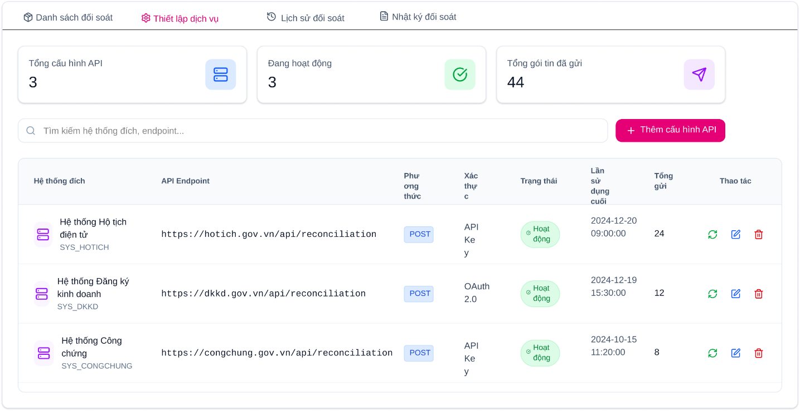

*Hình 33 – Màn danh sách thiết lập đối soát dữ liệu thu thập*

##### 4.4.3.1.1. Mô tả thông tin trên màn hình

| **STT** | **Tên trường thông tin** | **Kiểu dữ liệu** | **Bắt buộc** | **Mặc định** | **Mô tả** |
| --- | --- | --- | --- | --- | --- |
| 1 | Tổng cấu hình API (Card) | Number |  | x | Hiển thị tổng số lượng cấu hình API hiện có trong hệ thống. |
| 2 | Đang hoạt động (Card) | Number |  | x | Số lượng cấu hình API đang có trạng thái hoạt động. |
| 3 | Tổng gói tin đã gửi (Card) | Number |  | x | Tổng số lượng gói tin đã được gửi qua các API. |
| 4 | Tìm kiếm | Text |  |  | Nhập từ khóa để tìm kiếm theo hệ thống đích hoặc endpoint. |
| 5 | Hệ thống đích | Text | x | x | Tên hệ thống nhận dữ liệu và mã hệ thống (Ví dụ: Hệ thống Hộ tịch điện tử - SYS\_HOTICH). |
| 6 | API Endpoint | Text | x | x | Địa chỉ URL của API thực hiện đối soát. |
| 7 | Phương thức | Label | x | x | Phương thức giao tiếp của API (ví dụ: POST). |
| 8 | Xác thực | Text | x | x | Loại xác thực được sử dụng (Ví dụ: API Key, OAuth 2.0). |
| 9 | Trạng thái | Label | x | x | Tình trạng hoạt động của cấu hình (màu xanh lá). |
| 10 | Lần sử dụng cuối | DateTime |  | x | Thời gian gần nhất API được gọi thành công. |
| 11 | Tổng gửi | Number |  | x | Tổng số gói tin đã gửi riêng cho endpoint đó. |
| 12 | Thao tác | Button |  | x | Hiển thị các chức năng màn hình |

##### 4.4.3.1.2. Chức năng trên màn hình

| **STT** | **Tên chức năng** | **Định dạng** | **Mô tả** |
| --- | --- | --- | --- |
| 1 | Tìm kiếm hệ thống | Text | Thực hiện lọc danh sách dựa trên hệ thống đích hoặc địa chỉ endpoint. |
| 2 | Thêm cấu hình API | Button | Mở màn hình hoặc popup để tạo mới một cấu hình kết nối API. |
| 3 | Kiểm tra/Làm mới | Icon | Button vòng lặp xanh lá để kiểm tra lại kết nối hoặc làm mới trạng thái API. |
| 4 | Chỉnh sửa | Icon | Button bút xanh dương để thay đổi các thông số cấu hình API hiện có. |
| 5 | Xóa | Icon | Button thùng rác đỏ để gỡ bỏ cấu hình API khỏi hệ thống. |

#### 4.4.3.2. DSDL01_01. Thêm mới cấu hình API đối soát

Màn hình

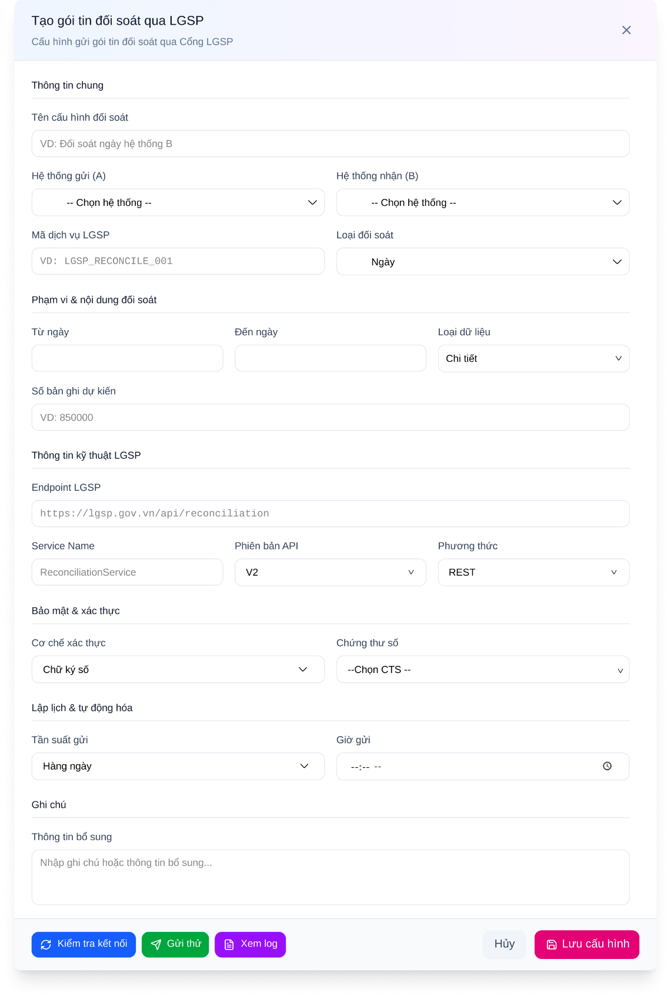

*Hình 34 – Màn danh thêm mới cấu hình API đối soát*

##### 4.4.3.3.1. Mô tả thông tin trên màn hình

| **STT** | **Tên trường thông tin** | **Kiểu dữ liệu** | **Bắt buộc** | **Mặc định** | **Mô tả** |
| --- | --- | --- | --- | --- | --- |
| 1 | Tên cấu hình đối soát | Textbox | x |  | Nhập tên gợi nhớ cho cấu hình đối soát. |
| 2 | Hệ thống gửi (A) | Dropdown | x |  | Chọn hệ thống nguồn gửi dữ liệu đối soát. |
| 3 | Hệ thống nhận (B) | Dropdown | x |  | Chọn hệ thống đích nhận dữ liệu đối soát. |
| 4 | Mã dịch vụ LGSP | Textbox | x |  | Nhập mã định danh dịch vụ trên trục LGSP. |
| 5 | Loại đối soát | Dropdown | x | Ngày | Chọn hình thức đối soát (ví dụ: theo ngày). |
| 6 | Từ ngày / Đến ngày | Date | x |  | Khoảng thời gian dữ liệu cần thực hiện đối soát. |
| 7 | Loại dữ liệu | Dropdown | x | Chi tiết | Phân loại dữ liệu đối soát (Tổng hợp/Chi tiết). |
| 8 | Số bản ghi dự kiến | Number |  |  | Số lượng bản ghi ước tính trong gói tin. |
| 9 | Endpoint LGSP | Textbox | x |  | Địa chỉ URL gọi dịch vụ LGSP. |
| 10 | Service Name | Textbox | x |  | Tên dịch vụ kỹ thuật của LGSP. |
| 11 | Phiên bản API | Dropdown | x |  | Phiên bản giao diện lập trình ứng dụng. |
| 12 | Phương thức | Dropdown | x | REST | Giao thức gửi tin (REST/SOAP). |
| 13 | Cơ chế xác thực | Dropdown | x |  | Hình thức bảo mật khi gửi gói tin. |
| 14 | Chứng thư số | Dropdown | x |  | Chọn chứng thư số hợp lệ để ký gói tin. |
| 15 | Tần suất gửi | Dropdown | x |  | Thiết lập lịch gửi tự động. |
| 16 | Giờ gửi | Time | x |  | Thời điểm cụ thể trong ngày để kích hoạt gửi tin. |
| 17 | Thông tin bổ sung | Textarea |  |  | Nhập các ghi chú hoặc mô tả thêm cho cấu hình. |

##### 4.4.3.2.2. Chức năng trên màn hình

| **STT** | **Tên chức năng** | **Định dạng** | **Mô tả** |
| --- | --- | --- | --- |
| 1 | Kiểm tra kết nối | Button (Blue) | Thực hiện gọi thử đến Endpoint LGSP để kiểm tra thông tuyến. |
| 2 | Gửi thử | Button (Green) | Gửi một gói tin mẫu dựa trên cấu hình hiện tại để kiểm tra dữ liệu. |
| 3 | Xem log | Button (Purple) | Mở lịch sử ghi nhật ký của các lần gửi thử hoặc kết nối trước đó. |
| 4 | Hủy | Button (Gray) | Đóng popup và không lưu các thay đổi vừa nhập. |
| 5 | Lưu cấu hình | Button (Pink) | Lưu toàn bộ thông tin cấu hình và tạo gói tin đối soát vào hệ thống. |
| 6 | Đóng (X) | Icon | Nằm ở góc trên bên phải, dùng để thoát nhanh màn hình cấu hình. |

#### 4.4.3.3. DSDL01_01. Màn xem chi tiết thông tin đối soát (LGSP)

Màn hình

*Hình 35 – Màn danh sách đối soát dữ liệu thu thập*

##### 4.4.3.3.1. Mô tả thông tin trên màn hình

|  |  |  |  |  |  |
| --- | --- | --- | --- | --- | --- |
| **STT** | **Tên trường thông tin** | **Kiểu dữ liệu** | **Bắt buộc** | **Mặc định** | **Mô tả** |
| 1 | Mã bộ dữ liệu | Text |  | x | Mã định danh duy nhất của bộ dữ liệu (Ví dụ: CSDL-HT-2024-12). |
| 2 | Tên bộ dữ liệu | Text |  | x | Tên đầy đủ của bộ dữ liệu theo nội dung và thời gian (Ví dụ: CSDL Hộ tịch - Tháng 12/2024). |
| 3 | Hệ thống cung cấp | Text |  | x | Tên hệ thống nguồn và mã hệ thống gửi dữ liệu (Ví dụ: Hệ thống Hộ tịch điện tử - SYS\_HOTICH). |
| 4 | Loại dữ liệu | Text |  | x | Phân loại nghiệp vụ của dữ liệu (Ví dụ: Hộ tịch). |
| 5 | Số bản ghi | Number |  | x | Tổng số lượng bản ghi có trong bộ dữ liệu (Ví dụ: 850,000). |
| 6 | Ngày nhận | DateTime |  | x | Thời gian hệ thống tiếp nhận bộ dữ liệu. |
| 7 | Lần đối soát cuối | DateTime |  | x | Thời gian thực hiện phiên đối soát gần nhất cho bộ dữ liệu này. |
| 8 | Trạng thái | Label |  | x | Tình trạng đối soát hiện tại (Ví dụ: Khớp dữ liệu). |
| 9 | Tỷ lệ khớp | Percentage |  | x | Hiển thị % mức độ trùng khớp kèm theo thanh biểu đồ tiến trình (Progress bar). |

##### 4.4.3.3.2. Chức năng trên màn hình

|  |  |  |  |
| --- | --- | --- | --- |
| **STT** | **Tên chức năng** | **Định dạng** | **Mô tả** |
| 2 | Đóng | Button | Nút lệnh ở cuối popup dùng để đóng cửa sổ và quay lại màn hình danh sách. |
| 3 | Xuất báo cáo | Button | Thực hiện kết xuất thông tin chi tiết của bản ghi đối soát ra tệp tin. |

#### 4.4.3.4. DSDL01_02. Màn xem chi tiết thông tin đối soát lỗi (LGSP)

Màn hình

*Hình 36 – Màn danh sách đối soát dữ liệu thu thập lỗi*

##### 4.4.3.4.1. Mô tả thông tin trên màn hình

| **STT** | **Tên trường thông tin** | **Kiểu dữ liệu** | **Bắt buộc** | **Mặc định** | **Mô tả** |
| --- | --- | --- | --- | --- | --- |
| 1 | Tiêu đề | Text |  | x | Hiển thị tiêu đề màn hình |
| 2 | Lỗi nghiêm trọng | Number |  | x | Tổng số lượng lỗi mức độ cao cần xử lý gấp (hiển thị trong card màu đỏ). |
| 3 | Lỗi trung bình | Number |  | x | Tổng số lượng lỗi mức độ vừa phải (hiển thị trong card màu cam). |
| 4 | Lỗi nhẹ | Number |  | x | Tổng số lượng lỗi mức độ thấp hoặc cảnh báo (hiển thị trong card màu vàng). |
| 5 | Mã bản ghi (Table) | Text |  | x | Mã định danh của từng bản ghi con gặp lỗi trong bộ dữ liệu. |
| 6 | Trường dữ liệu | Text |  | x | Tên thuộc tính/trường thông tin phát sinh lỗi (Ví dụ: Mã số thuế, Địa chỉ, Email...). |
| 7 | Loại lỗi | Text |  | x | Phân loại nguyên nhân lỗi (Không khớp giá trị, Thiếu dữ liệu, Định dạng không hợp lệ). |
| 8 | Giá trị nguồn | Text |  | x | Dữ liệu ghi nhận từ hệ thống gốc gửi đi. |
| 9 | Giá trị đích | Text |  | x | Dữ liệu ghi nhận tại hệ thống tiếp nhận để đối chiếu. |
| 10 | Mức độ (Label) | Label |  | x | Trạng thái phân cấp lỗi: Cao (Đỏ), Trung bình (Cam), Thấp (Vàng). |
| 11 | Chi tiết lỗi (List) | Text |  | x | Khối Text mô tả cụ thể nội dung sai lệch cho từng mã bản ghi lỗi. |

##### 4.4.3.4.2. Chức năng trên màn hình

|  |  |  |  |
| --- | --- | --- | --- |
| **STT** | **Tên chức năng** | **Định dạng** | **Mô tả** |
| 2 | Đóng | Button | Nút lệnh ở cuối popup dùng để đóng cửa sổ và quay lại màn hình danh sách. |
| 3 | Gửi lại danh sách | Button | Thực hiện lệnh gửi lại hoặc yêu cầu xử lý lại cho các bản ghi đang bị lỗi. |

#### 4.4.3.5. DSDL01_02_01. Màn xác nhận gửi thông tin lỗi đối soát (LGSP)

Màn hình

*Hình 37 – Màn xác nhận gửi thông tin lỗi đối soát*

##### 4.4.3.5.1. Mô tả thông tin trên màn hình

|  |  |  |  |  |  |
| --- | --- | --- | --- | --- | --- |
| **STT** | **Tên trường thông tin** | **Kiểu dữ liệu** | **Bắt buộc** | **Mặc định** | **Mô tả** |
| 1 | Tiêu đề popup | Text |  | x | Tên chức năng đang thực hiện. |
| 2 | Thông báo khởi tạo | Text |  | x | Thông tin mô tả mục đích và số lượng bản ghi cụ thể sẽ được xử lý (số 80 hiển thị màu đỏ). |
| 3 | Thời gian thực hiện | Dropdown | x | x | Label tiêu đề và ô chọn thời điểm bắt đầu tiến trình. |
| 4 | Ưu tiên băng thông | Button | x | x | Label tiêu đề và các tùy chọn mức độ ưu tiên tài nguyên: Cao, Trung bình, Thấp. |
| 5 | Đăng ký thông báo | Checkbox |  | x | Ô tích chọn kèm nội dung "Thông báo khi hoàn thành qua Email/SMS". |

##### 4.4.3.5.2. Chức năng trên màn hình

| **STT** | **Tên chức năng** | **Định dạng** | **Mô tả** |
| --- | --- | --- | --- |
| 1 | **Hủy bỏ** | Button | Đóng popup và hủy bỏ toàn bộ các thiết lập vừa cấu hình. |
| 2 | **Xác nhận gửi** | Button | Xác nhận các thông số đã chọn và bắt đầu kích hoạt tiến trình đồng bộ lại dữ liệu. |

#### 4.4.3.6. DSDL01_03. Đối soát thủ công

Màn hình

*Hình 38 – Màn xác nhận gửi thông tin đối soát thủ công*

##### 4.4.3.6.1. Mô tả thông tin trên màn hình

| **STT** | **Tên trường thông tin** | **Kiểu dữ liệu** | **Bắt buộc** | **Mặc định** | **Mô tả** |
| --- | --- | --- | --- | --- | --- |
| 1 | Tiêu đề popup | Text |  | x | Hiển thị tiêu đề của màn hình. |
| 2 | Thông báo khởi tạo | Text |  | x | Hiển thị câu hỏi xác nhận về việc có gửi dữ liệu đã thu thập nhưng đang lỗi về hệ thống nguồn |
| 3 | Đóng | Button |  | x | Kích để quay lại giao diện danh sách |
| 4 | Gửi | Button |  | x | Thực hiện gửi lại bảng danh sách lỗi trong quá trình đồng bộ dữ liệu |

##### 4.4.3.6.2. Chức năng trên màn hình

| **STT** | **Tên chức năng** | **Định dạng** | **Mô tả** |
| --- | --- | --- | --- |
| 1 | **Đóng** | Button | Đóng popup và hủy bỏ toàn bộ các thiết lập vừa cấu hình. |
| 2 | Gửi | Button | Gửi thông tin đang bị lỗi cho hệ thống nguồn |

#### 4.4.3.7. DSDL03.Lịch sử đối soát dữ liệu thu thập

Màn hình

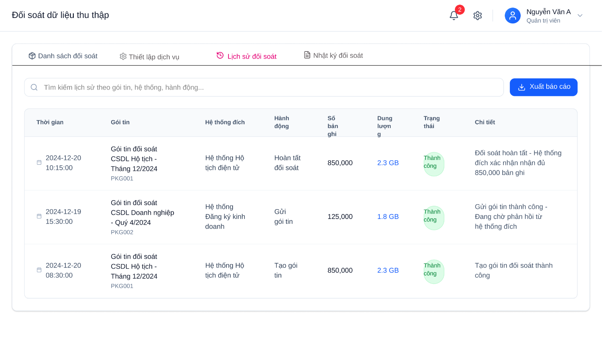

*Hình 39 – Màn lịch sử đối soát*

##### Mô tả thông tin trên màn hình

| **STT** | **Tên trường thông tin** | **Kiểu dữ liệu** | **Bắt buộc** | **Mặc định** | **Mô tả** |
| --- | --- | --- | --- | --- | --- |
| 1 | Tìm kiếm | Textbox |  |  | Text từ khóa tìm kiếm với gợi ý: "Tìm kiếm lịch sử theo gói tin, hệ thống, hành động...". |
| 2 | Thời gian | DateTime | x | x | Hiển thị ngày và giờ thực hiện tác vụ, có icon lịch đi kèm (Ví dụ: 2024-12-20 10:15:00). |
| 3 | Gói tin | Text |  | x | Tên gói tin đối soát và mã định danh gói tin (Ví dụ: PKG001) hiển thị ngay bên dưới. |
| 4 | Hệ thống đích | Text |  | x | Tên hệ thống nhận hoặc xử lý gói tin tương ứng. |
| 5 | Hành động | Text |  | x | Loại tác vụ hệ thống đã thực hiện (Hoàn tất đối soát, Gửi gói tin, Tạo gói tin). |
| 6 | Số bản ghi | Number |  | x | Tổng số lượng bản ghi dữ liệu có trong gói tin. |
| 7 | Dung lượng | Text |  | x | Kích thước dữ liệu của gói tin (Ví dụ: 2.3 GB, 1.8 GB). |
| 8 | Trạng thái | Label |  | x | Tình trạng thực hiện hành động, hiển thị dạng badge màu xanh lá. |
| 9 | Chi tiết | Text |  |  | Nội dung mô tả cụ thể kết quả hành động hoặc phản hồi từ hệ thống đích. |

##### Chức năng trên màn hình

| **STT** | **Tên chức năng** | **Định dạng** | **Mô tả** |
| --- | --- | --- | --- |
| 1 | Tìm kiếm lịch sử | Text | Thực hiện lọc nhanh danh sách lịch sử dựa trên các tiêu chí như tên gói tin, mã gói tin, hoặc hệ thống. |
| 2 | Xuất báo cáo | Button | Chức năng cho phép kết xuất toàn bộ hoặc danh sách lịch sử đang hiển thị ra tệp tin báo cáo. |

### 4.4.4. Tab lịch sử đối soát danh sách đối soát dữ liệu thu thập

Màn hình

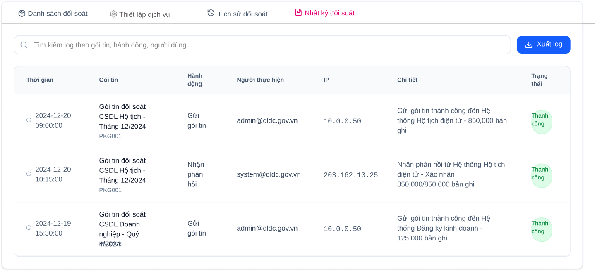

*Hình 40 – Màn nhật ký đối soát*

#### 4.4.4.1. Mô tả thông tin trên màn hình

|  |  |  |  |  |  |
| --- | --- | --- | --- | --- | --- |
| **STT** | **Tên trường thông tin** | **Kiểu dữ liệu** | **Bắt buộc** | **Mặc định** | **Mô tả** |
| 1 | Tìm kiếm nhật ký | Textbox |  |  | Text từ khóa với gợi ý: "Tìm kiếm log theo gói tin, hành động, người dùng...". |
| 2 | Thời gian | DateTime | x |  | Ghi lại thời điểm chính xác phát sinh log (Ví dụ: 2024-12-20 09:00:00). |
| 3 | Gói tin | Text | x |  | Tên gói tin và mã định danh gói tin liên quan đến log (Ví dụ: PKG001). |
| 4 | Hành động | Text | x |  | Loại tác vụ được thực hiện (Ví dụ: Gửi gói tin, Nhận phản hồi). |
| 5 | Người thực hiện | Text | x |  | Email hoặc định danh của tài khoản/hệ thống thực hiện tác vụ (Ví dụ: admin@dldc.gov.vn). |
| 6 | IP | Text | x |  | Địa chỉ IP của máy trạm hoặc máy chủ thực hiện yêu cầu (Ví dụ: 10.0.0.50). |
| 7 | Chi tiết | Text | x |  | Nội dung mô tả chi tiết về diễn biến và kết quả của hành động. |
| 8 | Trạng thái | Label |  | x | Trạng thái thực hiện của log, hiển thị dạng badge màu xanh lá. |

#### 4.4.4.2. Chức năng trên màn hình

|  |  |  |  |
| --- | --- | --- | --- |
| **STT** | **Tên chức năng** | **Định dạng** | **Mô tả** |
| 1 | Lọc/Tìm kiếm log | Text | Thực hiện lọc danh sách nhật ký theo tên gói tin, loại hành động hoặc người thực hiện. |
| 2 | Xuất log | Button | Kết xuất danh sách nhật ký hệ thống hiện tại ra tệp tin để phục vụ mục đích kiểm soát và lưu trữ. |

## 4.5. Quản lý xử lý dữ liệu

### 4.5.1. Thiết lập quy tắc xử lý dữ liệu

#### XLTL01\_Danh sách thiết lập quy tắc xử lý dữ liệu

Màn hình

*Hình 41 – Màn danh sách quy tắc xử lý dữ liệu*

##### 4.5.1.1.1. Mô tả thông tin trên màn hình

| **STT** | **Tên trường thông tin** | **Kiểu dữ liệu** | **Bắt buộc** | **Mặc định** | **Mô tả** |
| --- | --- | --- | --- | --- | --- |
| 1 | Thẻ thống kê (Tổng số, Đang xử lý,...) | Card/Number |  |  | Hiển thị tổng số lượng bộ dữ liệu theo từng trạng thái cụ thể. |
| 2 | Ô tìm kiếm | Search Box |  |  | Cho phép nhập từ khóa tìm kiếm theo tên, mô tả hoặc nguồn dữ liệu. |
| 3 | Bộ lọc Trạng thái | Dropdown |  | Tất cả | Lọc danh sách dữ liệu theo trạng thái (Đang xử lý, Hoàn thành, Lỗi...). |
| 4 | Bộ lọc Phân loại | Dropdown |  | Tất cả | Lọc danh sách dữ liệu theo nhóm phân loại. |
| 5 | Tên bộ dữ liệu | Text |  |  | Tên định danh của tiến trình xử lý dữ liệu. |
| 6 | Trạng thái | Badge |  |  | Label hiển thị trạng thái hiện tại của bộ dữ liệu (Màu sắc thay đổi theo trạng thái). |
| 7 | Thông tin chi tiết (Cơ quan, Người xử lý,...) | Text/Icon |  |  | Hiển thị các thông tin định danh đi kèm của từng mục dữ liệu. |
| 8 | Tiến độ xử lý | Progress Bar |  |  | Thanh biểu diễn phần trăm (%) đã hoàn thành của tiến trình. |
| 9 | Chỉ số bản ghi | Label |  |  | Hiển thị chi tiết số lượng: Đã xử lý / Tổng số bản ghi. |
| 10 | Số bản ghi lỗi | Text (Red) |  |  | Hiển thị số lượng bản ghi gặp lỗi trong quá trình xử lý (nếu có). |

##### 4.5.1.1.2. Chức năng trên màn hình

|  |  |  |  |
| --- | --- | --- | --- |
| **STT** | **Tên chức năng** | **Định dạng** | **Mô tả** |
| 1 | Thêm mới | Button | Mở cửa sổ popup XLTL02\_Thêm mới thiết lập quy tắc xử lý dữ liệu để tạo mới một tiến trình xử lý dữ liệu. |
| 2 | Xuất dữ liệu | Button | Xuất danh sách quản lý hiện tại ra file báo cáo (Excel/CSV). |
| 3 | Xem chi tiết | Button | Điều hướng đến màn hình XLTL03\_Xem chi tiết thiết lập quy tắc xử lý dữ liệu Để xem chi tiết cấu hình và tiến độ của bộ dữ liệu đó. |
| 4 | Phân loại dữ liệu | Button | Chuyển đến màn hình XLTL05\_Phân loại dữ liệu thiết lập quy tắc xử lý dữ liệu Để thực hiện phân loại cho bộ dữ liệu. |
| 5 | Quản lý quy tắc | Button | Mở giao diện XLTL04\_Quản lý quy tắc thiết lập quy tắc xử lý dữ liệu cấu hình các quy tắc áp dụng cho bộ dữ liệu này. |
| 6 | Chạy quy tắc | Button | Mở XLTL06\_Chạy quy tắc thiết lập quy tắc xử lý dữ liệu Kích hoạt tiến trình xử lý dữ liệu theo các quy tắc đã cấu hình. |
| 7 | Danh sách lỗi | Button | Mở XLTL07\_Danh sách lỗi thiết lập quy tắc xử lý dữ liệu nhanh danh sách các bản ghi bị lỗi để kiểm tra và xử lý. |
| 8 | Lịch sử xử lý | Button | Mở XLTL08\_Lịch sử xử lý thiết lập quy tắc xử lý dữ liệu Xem nhật ký các lần thực hiện xử lý của bộ dữ liệu trong quá khứ. |

#### 4.5.1.2. XLTL02_Thêm mới thiết lập quy tắc xử lý dữ liệu

Màn hình

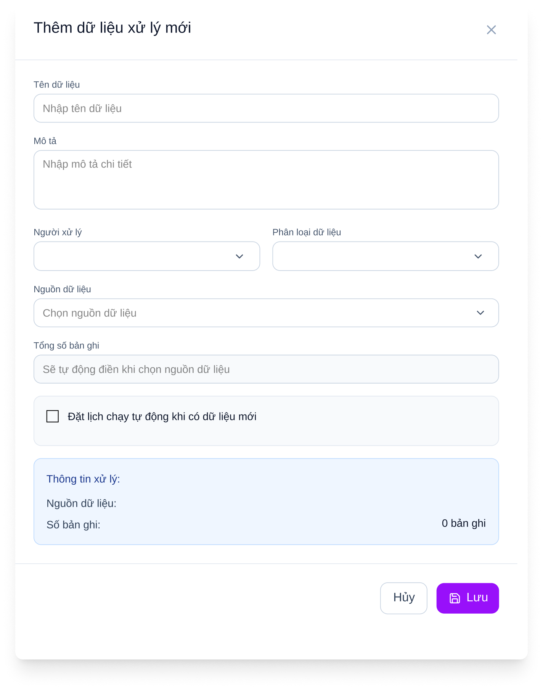

*Hình 42 – Màn danh thêm mới*

##### Mô tả thông tin trên màn hình

| **STT** | **Tên trường thông tin** | **Kiểu dữ liệu** | **Bắt buộc** | **Mặc định** | **Mô tả** |
| --- | --- | --- | --- | --- | --- |
| 1 | Tên dữ liệu | Text | x |  | Người dùng nhập tên gợi nhớ cho bộ dữ liệu xử lý mới. |
| 2 | Mô tả | Text |  |  | Nhập các nội dung mô tả chi tiết hoặc ghi chú cho bộ dữ liệu. |
| 3 | Người xử lý | Dropdown | x |  | Lựa chọn nhân sự chịu trách nhiệm xử lý từ danh sách hệ thống. |
| 4 | Phân loại dữ liệu | Dropdown | x |  | Chọn nhóm phân loại phù hợp cho dữ liệu đầu vào. |
| 5 | Nguồn dữ liệu | Dropdown | x |  | Lựa chọn nguồn cấp dữ liệu (ví dụ: CSDL, File, API...). |
| 6 | Tổng số bản ghi | Text |  | x | Hiển thị tổng số lượng bản ghi mà hệ thống quét được từ nguồn đã chọn. |
| 7 | Đặt lịch chạy tự động khi có dữ liệu mới | Checkbox |  |  | Tùy chọn cho phép hệ thống tự động kích hoạt quy trình xử lý khi phát hiện dữ liệu mới. |
| 8 | Nguồn dữ liệu (Tóm tắt) | Display |  |  | Hiển thị lại tên nguồn dữ liệu đã chọn tại mục "Thông tin xử lý" để người dùng kiểm tra. |
| 9 | Số bản ghi (Tóm tắt) | Display |  |  | Hiển thị tổng số bản ghi dự kiến sẽ được xử lý. |

##### Chức năng trên màn hình

|  |  |  |  |
| --- | --- | --- | --- |
| **STT** | **Tên chức năng** | **Định dạng** | **Mô tả** |
| 1 | Đóng | Icon | Tắt cửa sổ popup "Thêm dữ liệu xử lý mới" và không lưu thông tin. |
| 2 | Hủy | Button | Hủy bỏ các thao tác nhập liệu hiện tại và đóng cửa sổ. |
| 3 | Lưu | Button | Kiểm tra tính hợp lệ của các trường bắt buộc và thực hiện lưu bộ dữ liệu mới vào hệ thống. |

#### 4.5.1.3. XLTL03_Xem chi tiết thiết lập quy tắc xử lý dữ liệu

Màn hình

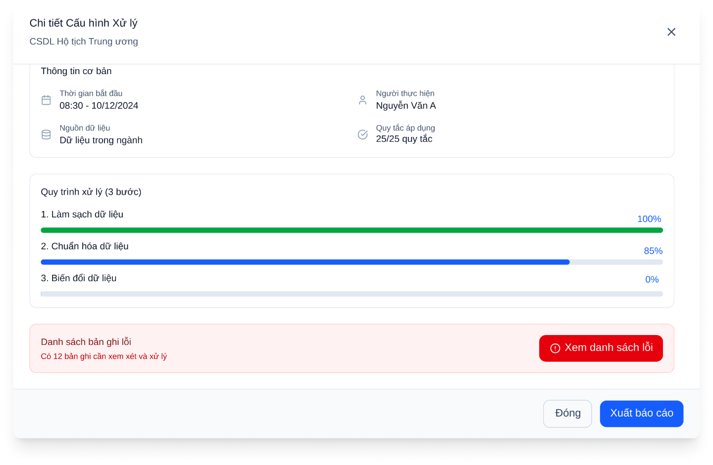

*Hình 43 – Màn xem chi tiết thiết lập quy tắc xử lý dữ liệu*

##### 4.5.1.3.1. Mô tả thông tin trên màn hình

| **STT** | **Tên trường thông tin** | **Kiểu dữ liệu** | **Bắt buộc** | **Mặc định** | **Mô tả** |
| --- | --- | --- | --- | --- | --- |
| 1 | Tiêu đề màn hình | Label |  | x | Tên của cửa sổ popup. |
| 2 | Tên bộ dữ liệu | Label |  | x | Tên định danh của bộ dữ liệu đang được xem chi tiết. |
| 3 | Thời gian bắt đầu | DateTime |  | x | Thời điểm hệ thống bắt đầu kích hoạt tiến trình xử lý. |
| 4 | Người thực hiện | Text |  | x | Tên nhân sự chịu trách nhiệm thực hiện phiên xử lý này. |
| 5 | Nguồn dữ liệu | Text |  | x | Nguồn gốc của dữ liệu đầu vào được chọn. |
| 6 | Quy tắc áp dụng | Text |  | x | Hiển thị số lượng quy tắc đã chạy trên tổng số quy tắc cấu hình. |
| 7 | Tên bước xử lý | Text |  |  | Hiển thị tên các giai đoạn: Làm sạch, Chuẩn hóa, Biến đổi. |
| 8 | Tiến độ từng bước | Progress Bar |  |  | Thanh biểu diễn % hoàn thành và màu sắc tương ứng cho mỗi bước. |
| 9 | Phần trăm (%) hoàn thành | Number |  | x | Chỉ số chi tiết mức độ hoàn thành của từng bước xử lý. |
| 10 | Thông báo bản ghi lỗi | Text |  |  | Cảnh báo số lượng bản ghi phát sinh lỗi cần xem xét (ví dụ: 12 bản ghi). |

##### 4.5.1.3.2. Chức năng trên màn hình

|  |  |  |  |
| --- | --- | --- | --- |
| **STT** | **Tên chức năng** | **Định dạng** | **Mô tả** |
| 1 | Đóng | Icon | Thoát khỏi màn hình chi tiết và quay lại danh sách quản lý. |
| 2 | Xem danh sách lỗi | Button | Mở giao diện liệt kê chi tiết các bản ghi bị lỗi để người dùng chỉnh sửa. |
| 3 | Đóng | Button | Tương tự icon (x), dùng để đóng cửa sổ popup. |
| 4 | Xuất báo cáo | Button | Thực hiện kết xuất báo cáo chi tiết về kết quả và tiến độ xử lý ra file. |

#### 4.5.1.4. XLTL04_Quản lý quy tắc thiết lập quy tắc xử lý dữ liệu

Màn hình

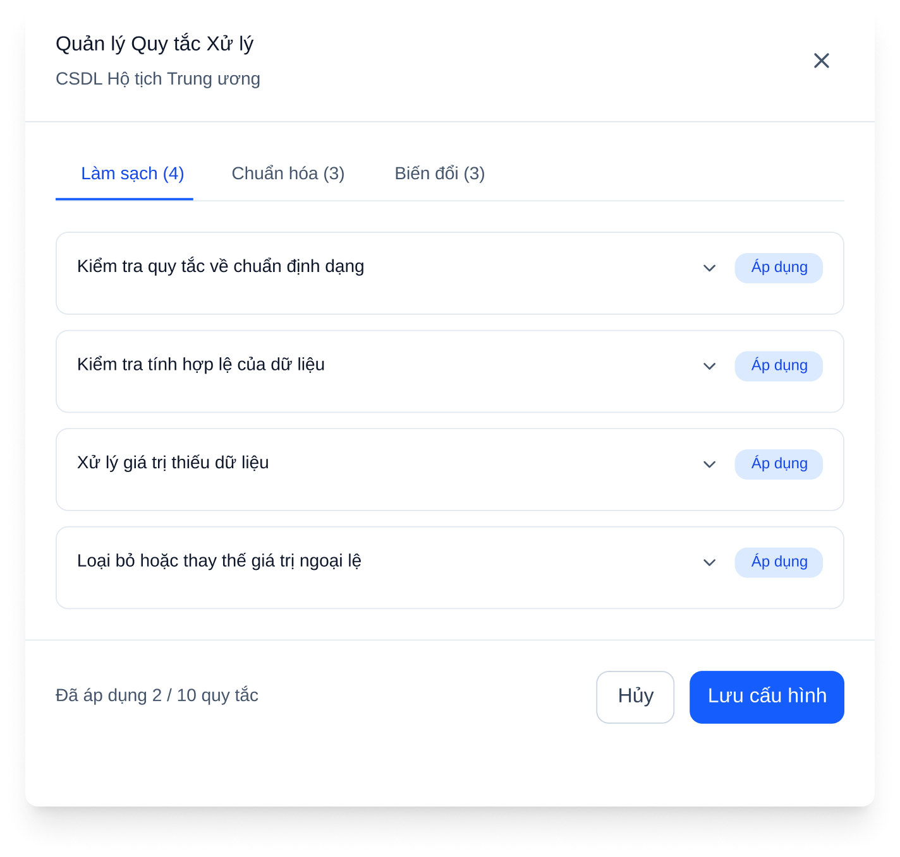

*Hình 44 – Màn hình chung về quy tắc thiết lập xử lý dữ liệu*

##### 4.5.1.4.1. Mô tả thông tin trên màn hình

| **STT** | **Tên trường thông tin** | **Kiểu dữ liệu** | **Bắt buộc** | **Mặc định** | **Mô tả** |
| --- | --- | --- | --- | --- | --- |
| 1 | Tiêu đề màn hình | Label |  |  | Tên của cửa sổ popup chức năng. |
| 2 | Tên bộ dữ liệu | Label |  |  | Tên bộ dữ liệu đang được cấu hình quy tắc. |
| 3 | Tên quy tắc | Text |  |  | Mô tả ngắn gọn nhiệm vụ của quy tắc (Ví dụ: Kiểm tra quy tắc về chuẩn định dạng). |
| 4 | Trạng thái Áp dụng | Button |  |  | Button để xác nhận việc sử dụng quy tắc này vào tiến trình xử lý. |
| 5 | Tổng hợp áp dụng | Label |  |  | Thống kê số lượng quy tắc đã được người dùng chọn trên tổng số quy tắc hiện có. |
| 6 | Tab "Làm sạch" | Tab |  |  | Nhóm các quy tắc về chuẩn hóa định dạng, xử lý dữ liệu thô. Số (4) chỉ tổng số quy tắc trong nhóm. |
| 7 | Tab "Chuẩn hóa" | Tab |  |  | Nhóm các quy tắc về đối soát và quy chuẩn dữ liệu. |
| 8 | Tab "Biến đổi" | Tab |  |  | Nhóm các quy tắc về thay đổi cấu trúc hoặc logic dữ liệu. |

##### 4.5.1.4.2. Chức năng trên màn hình

|  |  |  |  |
| --- | --- | --- | --- |
| **STT** | **Tên chức năng** | **Định dạng** | **Mô tả** |
| 1 | Đóng | Icon | Thoát khỏi màn hình quản lý quy tắc mà không lưu các thay đổi. |
| 2 | Chuyển đổi nhóm quy tắc | Tab Switch | Người dùng click vào các tab (Làm sạch, Chuẩn hóa, Biến đổi) để xem danh sách quy tắc tương ứng. |
| 3 | Xem chi tiết quy tắc | Icon | Mở rộng vùng hiển thị để xem nội dung chi tiết hoặc các tham số của từng quy tắc. |
| 4 | Chọn áp dụng quy tắc | Button | Khi click "Áp dụng", quy tắc sẽ được đưa vào danh sách thực thi. Nút sẽ đổi trạng thái hiển thị (ví dụ: đổi màu). |
| 5 | Hủy | Button | Hủy bỏ các thay đổi vừa thực hiện và đóng popup. |
| 6 | Lưu cấu hình | Button | Xác nhận và lưu lại toàn bộ danh sách các quy tắc đã chọn áp dụng vào hệ thống. |

#### Quy tắc xử lý

*   **Độ ưu tiên quy tắc**: Các quy tắc được thực thi theo thứ tự: Làm sạch -> Chuẩn hóa -> Biến đổi.
*   **Xử lý song song**: Hệ thống hỗ trợ xử lý nhiều quy tắc đồng thời trên cùng một bộ dữ liệu để tối ưu hiệu năng.
*   **Ghi nhận log**: Mọi thay đổi về cấu hình quy tắc đều được ghi lại trong nhật ký hệ thống để phục vụ đối soát.

#### Danh sách thông báo

| STT | Mã thông báo | Nội dung thông báo | Diễn giải |
| --- | --- | --- | --- |
| 1 | MSG-PROC-001 | Cấu hình quy tắc thành công. | Khi lưu cấu hình |
| 2 | MSG-PROC-002 | Lỗi xung đột quy tắc. Vui lòng kiểm tra lại logic. | Khi các quy tắc mâu thuẫn |

#### XLTL01\_Danh sách thiết lập quy tắc xử lý dữ liệu

Màn hình

*Hình 45 – Màn danh sách quy tắc xử lý dữ liệu*

##### Mô tả thông tin trên màn hình

| **STT** | **Tên trường thông tin** | **Kiểu dữ liệu** | **Bắt buộc** | **Mặc định** | **Mô tả** |
| --- | --- | --- | --- | --- | --- |
| 1 | Thẻ thống kê (Tổng số, Đang xử lý,...) | Card/Number |  |  | Hiển thị tổng số lượng bộ dữ liệu theo từng trạng thái cụ thể. |
| 2 | Ô tìm kiếm | Search Box |  |  | Cho phép nhập từ khóa tìm kiếm theo tên, mô tả hoặc nguồn dữ liệu. |
| 3 | Bộ lọc Trạng thái | Dropdown |  | Tất cả | Lọc danh sách dữ liệu theo trạng thái (Đang xử lý, Hoàn thành, Lỗi...). |
| 4 | Bộ lọc Phân loại | Dropdown |  | Tất cả | Lọc danh sách dữ liệu theo nhóm phân loại. |
| 5 | Tên bộ dữ liệu | Text |  |  | Tên định danh của tiến trình xử lý dữ liệu. |
| 6 | Trạng thái | Badge |  |  | Label hiển thị trạng thái hiện tại của bộ dữ liệu (Màu sắc thay đổi theo trạng thái). |
| 7 | Thông tin chi tiết (Cơ quan, Người xử lý,...) | Text/Icon |  |  | Hiển thị các thông tin định danh đi kèm của từng mục dữ liệu. |
| 8 | Tiến độ xử lý | Progress Bar |  |  | Thanh biểu diễn phần trăm (%) đã hoàn thành của tiến trình. |
| 9 | Chỉ số bản ghi | Label |  |  | Hiển thị chi tiết số lượng: Đã xử lý / Tổng số bản ghi. |
| 10 | Số bản ghi lỗi | Text (Red) |  |  | Hiển thị số lượng bản ghi gặp lỗi trong quá trình xử lý (nếu có). |

##### Chức năng trên màn hình

|  |  |  |  |
| --- | --- | --- | --- |
| **STT** | **Tên chức năng** | **Định dạng** | **Mô tả** |
| 1 | Thêm mới | Button | Mở cửa sổ popup XLTL02\_Thêm mới thiết lập quy tắc xử lý dữ liệu để tạo mới một tiến trình xử lý dữ liệu. |
| 2 | Xuất dữ liệu | Button | Xuất danh sách quản lý hiện tại ra file báo cáo (Excel/CSV). |
| 3 | Xem chi tiết | Button | Điều hướng đến màn hình XLTL03\_Xem chi tiết thiết lập quy tắc xử lý dữ liệu Để xem chi tiết cấu hình và tiến độ của bộ dữ liệu đó. |
| 4 | Phân loại dữ liệu | Button | Chuyển đến màn hình XLTL05\_Phân loại dữ liệu thiết lập quy tắc xử lý dữ liệu Để thực hiện phân loại cho bộ dữ liệu. |
| 5 | Quản lý quy tắc | Button | Mở giao diện XLTL04\_Quản lý quy tắc thiết lập quy tắc xử lý dữ liệu cấu hình các quy tắc áp dụng cho bộ dữ liệu này. |
| 6 | Chạy quy tắc | Button | Mở XLTL06\_Chạy quy tắc thiết lập quy tắc xử lý dữ liệu Kích hoạt tiến trình xử lý dữ liệu theo các quy tắc đã cấu hình. |
| 7 | Danh sách lỗi | Button | Mở XLTL07\_Danh sách lỗi thiết lập quy tắc xử lý dữ liệu nhanh danh sách các bản ghi bị lỗi để kiểm tra và xử lý. |
| 8 | Lịch sử xử lý | Button | Mở XLTL08\_Lịch sử xử lý thiết lập quy tắc xử lý dữ liệu Xem nhật ký các lần thực hiện xử lý của bộ dữ liệu trong quá khứ. |

##### 4.5.1.5.3. XLTL04_01. Quy tắc làm sạch

Màn hình

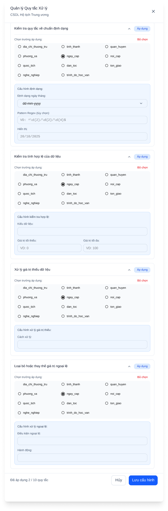

*Hình 46 – Màn danh sách quy tắc làm sạch dữ liệu*

Mô tả thông tin trên màn hình

| **STT** | **Tên trường thông tin** | **Kiểu dữ liệu** | **Bắt buộc** | **Mặc định** | **Mô tả** |
| --- | --- | --- | --- | --- | --- |
| 1 | Tiêu đề màn hình | Label |  | x | Tên cửa sổ chức năng hiện tại. |
| 2 | Tên bộ dữ liệu | Label |  | x | Tên bộ dữ liệu đang thực hiện cấu hình. |
| 3 | Tên quy tắc | Label |  |  | Tên của từng loại quy tắc (ví dụ: Kiểm tra quy tắc về chuẩn định dạng). |
| 4 | Chọn trường áp dụng | Radio Button | x |  | Danh sách các trường thông tin trong bộ dữ liệu để áp dụng quy tắc (ví dụ: ngày\_cap, tinh\_thanh...). |
| 5 | Định dạng ngày tháng | Dropdown | x | x | Lựa chọn định dạng chuẩn cho các trường dữ liệu kiểu ngày tháng. |
| 6 | Pattern Regex | Text Input |  |  | Nhập biểu thức chính quy để kiểm tra hoặc trích xuất dữ liệu. |
| 7 | Hiển thị (Preview) | Text Input |  |  | Hiển thị kết quả mẫu dựa trên cấu hình Regex đã nhập. |
| 8 | Kiểu dữ liệu | Text/Dropdown | x |  | Xác định kiểu dữ liệu cho quy tắc kiểm tra tính hợp lệ. |
| 9 | Giá trị tối thiểu/tối đa | Number Input |  |  | Giới hạn khoảng giá trị hợp lệ cho dữ liệu số. |
| 10 | Cách xử lý | Dropdown/Text | x |  | Lựa chọn phương pháp xử lý khi gặp giá trị thiếu (ví dụ: điền mặc định, bỏ qua). |
| 11 | Điều kiện ngoại lệ | Text Input | x |  | Nhập điều kiện để xác định một bản ghi là ngoại lệ (outlier). |
| 12 | Hành động xử lý | Dropdown/Text | x |  | Thao tác hệ thống sẽ thực hiện khi thỏa mãn điều kiện ngoại lệ. |
| 13 | Thống kê quy tắc | Label |  | x | Hiển thị tổng số quy tắc đã được kích hoạt trên tổng số quy tắc hiện có. |

Chức năng trên màn hình

| **STT** | **Tên chức năng** | **Định dạng** | **Mô tả** |
| --- | --- | --- | --- |
| 1 | Đóng | Icon | Thoát khỏi màn hình cấu hình mà không lưu các thông số đã nhập. |
| 2 | Thu gọn/Mở rộng | Icon | Click để ẩn hoặc hiện chi tiết các tham số cấu hình của từng quy tắc. |
| 3 | Chọn trường | Click | Người dùng chọn một hoặc nhiều radio button tương ứng với các trường dữ liệu muốn áp dụng quy tắc. |
| 4 | Áp dụng quy tắc | Button | Kích hoạt quy tắc này cho bộ dữ liệu sau khi đã cấu hình xong tham số. |
| 5 | Hủy | Button | Hủy bỏ các thay đổi tạm thời và đóng popup. |
| 6 | Lưu cấu hình | Button | Ghi nhận toàn bộ các tham số cấu hình của tất cả các quy tắc vào hệ thống. |

##### 4.5.1.5.4. XLTL04_02. Quy tắc chuẩn hóa

Màn hình

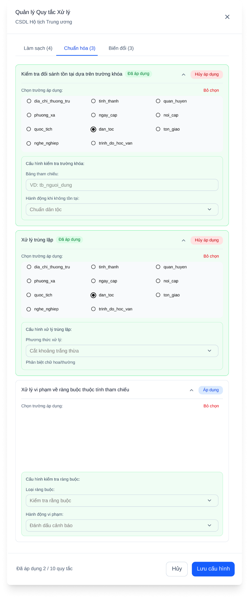

*Hình 47 – Màn danh sách quy chuẩn hóa dữ liệu*

Mô tả thông tin trên màn hình

|  |  |  |  |  |  |
| --- | --- | --- | --- | --- | --- |
| **STT** | **Tên trường thông tin** | **Kiểu dữ liệu** | **Bắt buộc** | **Mặc định** | **Mô tả** |
| 1 | Trạng thái quy tắc | Label |  | x | Hiển thị Label màu xanh lá cho các quy tắc đã được kích hoạt cấu hình. |
| 2 | Chọn trường áp dụng | Radio Button |  |  | Danh sách các trường dữ liệu (dia\_chi, tinh\_thanh, ngay\_cap...) để chọn trường đích thực hiện quy tắc. |
| 3 | Bảng tham chiếu | Text Input |  |  | Nhập tên bảng hoặc nguồn dữ liệu dùng để đối soát (Placeholder: "VD: tb\_nguoi\_dung"). |
| 4 | Hành động khi không tồn tại | Dropdown |  |  | Lựa chọn thao tác hệ thống (ví dụ: Chuẩn dân tộc) khi dữ liệu không khớp với bảng tham chiếu. |
| 5 | Phương thức xử lý (Trùng lặp) | Dropdown |  |  | Chọn cách giải quyết khi phát hiện bản ghi trùng (ví dụ: Cắt khoảng trắng thừa). |
| 6 | Phân biệt chữ hoa/thường | Checkbox |  |  | Tùy chọn có tính đến định dạng chữ khi đối soát trùng lặp hay không. |
| 7 | Loại ràng buộc | Dropdown |  |  | Lựa chọn kiểu ràng buộc thuộc tính cần kiểm tra. |
| 8 | Hành động vi phạm | Dropdown |  |  | Lựa chọn cách xử lý khi dữ liệu vi phạm ràng buộc (ví dụ: Đánh dấu cảnh báo). |
| 9 | Tổng hợp | Label |  | x | Thống kê số lượng quy tắc đã chọn trên tổng các tab. |

Chức năng trên màn hình

|  |  |  |  |
| --- | --- | --- | --- |
| **STT** | **Tên chức năng** | **Định dạng** | **Mô tả** |
| 1 | Áp dụng / Hủy áp dụng | Button | Nút chuyển đổi trạng thái: "Áp dụng" (Xanh dương) để kích hoạt, hoặc "Hủy áp dụng" (Đỏ) để tạm dừng quy tắc. |
| 2 | Thu gọn/Mở rộng | Icon | Click để ẩn/hiện chi tiết vùng cấu hình tham số của từng quy tắc. |
| 3 | Chuyển Tab | Tab Button | Người dùng click sang tab "Làm sạch" hoặc "Biến đổi" để cấu hình các nhóm quy tắc khác. |
| 4 | Hủy | Button | Đóng popup và không lưu các thay đổi vừa thực hiện. |
| 5 | Lưu cấu hình | Button | Lưu lại toàn bộ các thiết lập tham số và trạng thái áp dụng của các quy tắc. |

##### 4.5.1.5.5. XLTL04_03. Quy tắc biến đổi dữ liệu

Màn hình

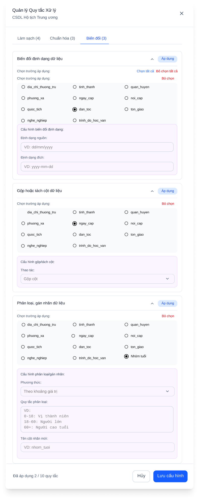

*Hình 48 – Màn quy tắc biến đổi dữ liệu*

Mô tả thông tin trên màn hình

|  |  |  |  |  |  |
| --- | --- | --- | --- | --- | --- |
| **STT** | **Tên trường thông tin** | **Kiểu dữ liệu** | **Bắt buộc** | **Mặc định** | **Mô tả** |
| 1 | Chọn trường áp dụng | Radio Button | x |  | Danh sách các trường dữ liệu để chọn đối tượng thực hiện biến đổi. |
| 2 | Định dạng nguồn | Text Input | x |  | Nhập mẫu định dạng dữ liệu hiện tại (Ví dụ: dd/mm/yyyy). |
| 3 | Định dạng đích | Text Input | x |  | Nhập mẫu định dạng muốn chuyển đổi sang (Ví dụ: yyyy-mm-dd). |
| 4 | Thao tác (Gộp/Tách) | Dropdown | x | x | Lựa chọn hành động xử lý trên các cột dữ liệu. |
| 5 | Phương thức phân loại | Dropdown | x | x | Chọn cách thức để hệ thống thực hiện gán Label dữ liệu. |
| 6 | Quy tắc phân loại | Text Area | x |  | Nhập các điều kiện phân loại chi tiết (Ví dụ: 0-18: Vị thành niên). |
| 7 | Tên cột Label mới | Text Input | x |  | Nhập tên cho cột dữ liệu mới sẽ chứa kết quả sau khi gán Label. |
| 8 | Thống kê áp dụng | Label |  | x | Tổng số quy tắc đã được bật trên toàn bộ các tab. |

Chức năng trên màn hình

|  |  |  |  |
| --- | --- | --- | --- |
| **STT** | **Tên chức năng** | **Định dạng** | **Mô tả** |
| 1 | Áp dụng / Hủy áp dụng | Button | Nút chuyển đổi trạng thái: "Áp dụng" (Xanh dương) để kích hoạt, hoặc "Hủy áp dụng" (Đỏ) để tạm dừng quy tắc. |
| 2 | Thu gọn/Mở rộng | Icon | Click để ẩn/hiện chi tiết vùng cấu hình tham số của từng quy tắc. |
| 3 | Chuyển Tab | Tab Button | Người dùng click sang tab "Làm sạch" hoặc "Biến đổi" để cấu hình các nhóm quy tắc khác. |
| 4 | Hủy | Button | Đóng popup và không lưu các thay đổi vừa thực hiện. |
| 5 | Lưu cấu hình | Button | Lưu lại toàn bộ các thiết lập tham số và trạng thái áp dụng của các quy tắc. |

### 4.5.2. XLTL05_Phân loại dữ liệu thiết lập quy tắc xử lý dữ liệu

Màn hình 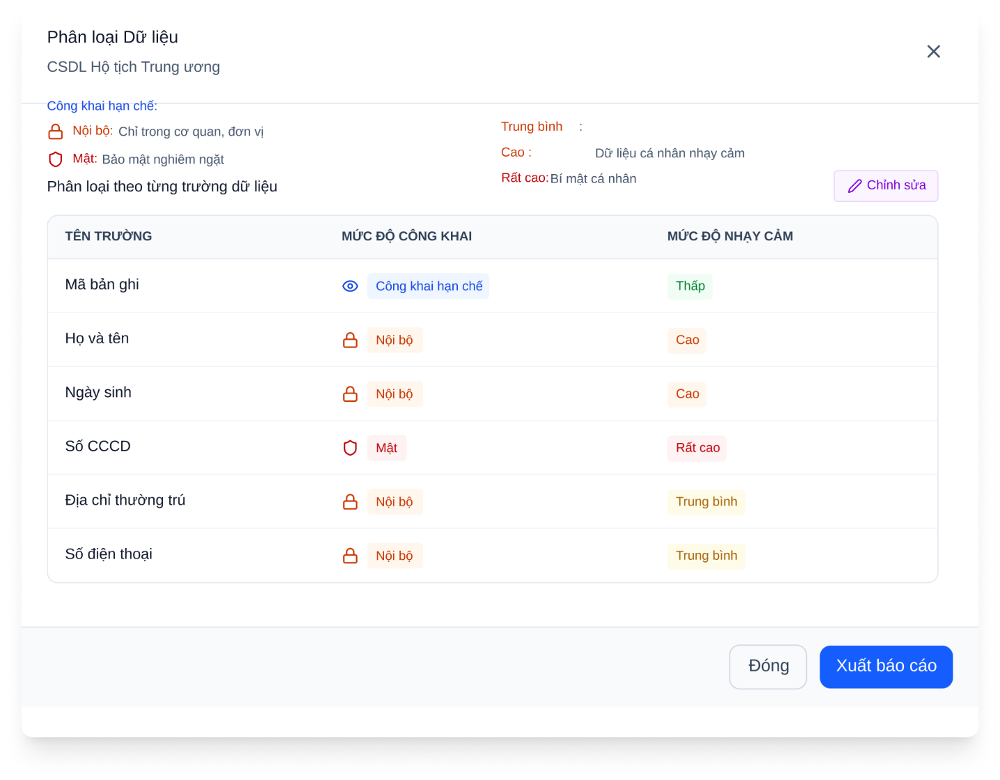

*Hình 49 – Màn phân loại dữ liệu*

##### Mô tả thông tin trên màn hình

|  |  |  |  |  |  |
| --- | --- | --- | --- | --- | --- |
| **STT** | **Tên trường thông tin** | **Kiểu dữ liệu** | **Bắt buộc** | **Mặc định** | **Mô tả** |
| 1 | Tiêu đề màn hình | Label |  | x | Tên chức năng của cửa sổ popup. |
| 2 | Tên bộ dữ liệu | Label |  | x | Tên bộ dữ liệu đang thực hiện phân loại. |
| 3 | Chú dẫn mức độ | Label |  | x | Hiển thị định nghĩa các mức độ bảo mật (Nội bộ, Mật) và nhạy cảm (Trung bình, Cao, Rất cao). |
| 4 | Tên trường | Text |  |  | Liệt kê danh sách các trường dữ liệu có trong bộ hồ sơ (Mã bản ghi, Họ và tên, Ngày sinh, Số CCCD...). |
| 5 | Mức độ công khai | Tag/Badge |  |  | Hiển thị Label kèm icon khóa tương ứng: Công khai hạn chế, Nội bộ, Mật. |
| 6 | Mức độ nhạy cảm | Tag/Badge |  |  | Hiển thị Label màu phân loại: Thấp (Xanh), Trung bình (Vàng), Cao (Cam), Rất cao (Đỏ). |

##### Chức năng trên màn hình

|  |  |  |  |
| --- | --- | --- | --- |
| **STT** | **Tên chức năng** | **Định dạng** | **Mô tả** |
| 1 | Đóng (x) | Icon | Thoát khỏi màn hình xem phân loại. |
| 2 | Chỉnh sửa | Button | Mở chế độ cho phép người dùng thay đổi mức độ công khai hoặc độ nhạy cảm cho từng trường. |
| 3 | Đóng | Button | Đóng cửa sổ popup và quay lại màn hình danh sách. |
| 4 | Xuất báo cáo | Button | Trích xuất thông tin phân loại dữ liệu này ra file báo cáo. |

#### 4.5.2.3. XLTL05_01. Sửa Phân loại dữ liệu thiết lập quy tắc xử lý dữ liệu

Màn hình

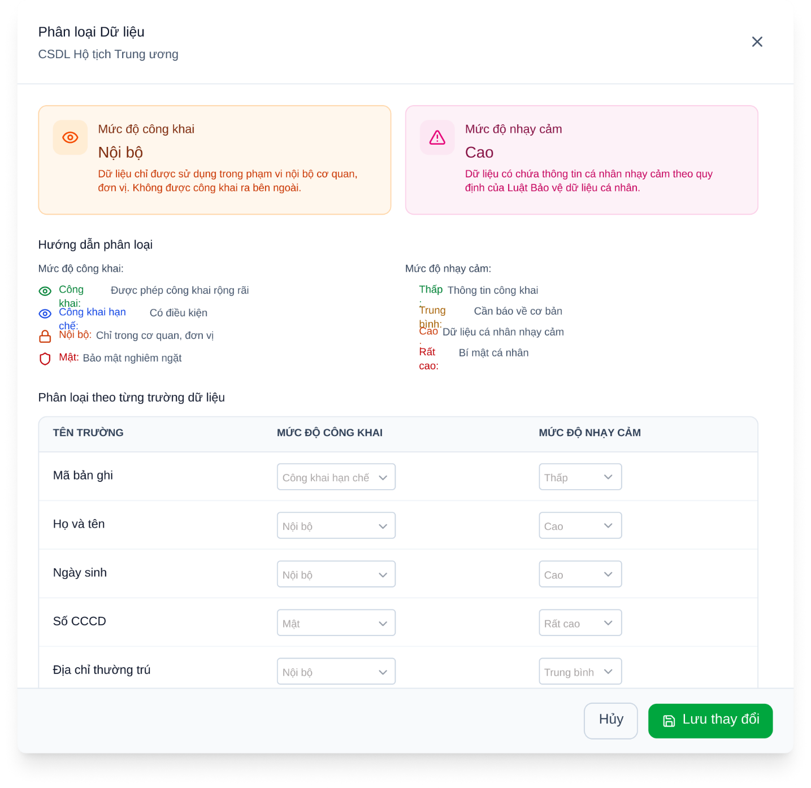

*Hình 50 – Màn sửa phân loại dữ liệu*

Mô tả thông tin trên màn hình

|  |  |  |  |  |  |
| --- | --- | --- | --- | --- | --- |
| **STT** | **Tên trường thông tin** | **Kiểu dữ liệu** | **Bắt buộc** | **Mặc định** | **Mô tả** |
| 1 | Tiêu đề màn hình | Label |  | x | Tên chức năng của cửa sổ popup. |
| 2 | Tên bộ dữ liệu | Label |  | x | Tên bộ dữ liệu đang thực hiện phân loại. |
| 3 | Chú dẫn mức độ | Label |  | x | Hiển thị định nghĩa các mức độ bảo mật (Nội bộ, Mật) và nhạy cảm (Trung bình, Cao, Rất cao). |
| 4 | Tên trường | Text |  | x | Liệt kê danh sách các trường dữ liệu có trong bộ hồ sơ (Mã bản ghi, Họ và tên, Ngày sinh, Số CCCD...). |
| 5 | Mức độ công khai | Tag/Badge |  | x | Hiển thị Label kèm icon khóa tương ứng: Công khai hạn chế, Nội bộ, Mật. |
| 6 | Mức độ nhạy cảm | Tag/Badge |  | x | Hiển thị Label màu phân loại: Thấp (Xanh), Trung bình (Vàng), Cao (Cam), Rất cao (Đỏ). |

Chức năng trên màn hình

|  |  |  |  |
| --- | --- | --- | --- |
| **STT** | **Tên chức năng** | **Định dạng** | **Mô tả** |
| 1 | Đóng | Icon | Thoát khỏi màn hình xem phân loại. |
| 2 | Chỉnh sửa | Button | Mở chế độ cho phép người dùng thay đổi mức độ công khai hoặc độ nhạy cảm cho từng trường. |
| 3 | Đóng | Button | Đóng cửa sổ popup và quay lại màn hình danh sách. |
| 4 | Lưu thay đổi | Button | Cập nhật lại thông tin phân loại vào CSDL. |

### 4.5.3. XLTL06_Chạy quy tắc thiết lập quy tắc xử lý dữ liệu

Màn hình

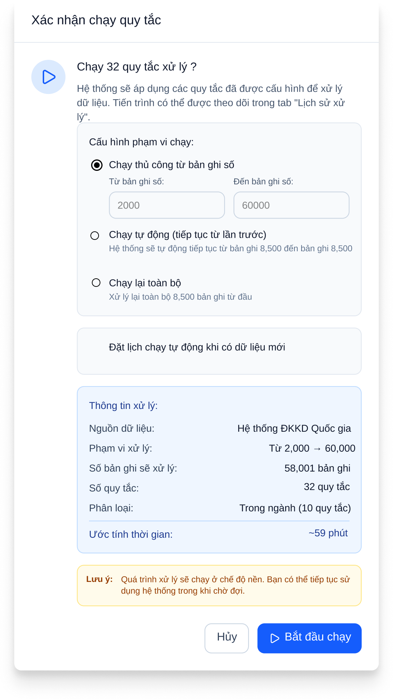

*Hình 51 – Màn chạy quy tắc xử lý dữ liệu*

##### Mô tả thông tin trên màn hình

|  |  |  |  |  |  |
| --- | --- | --- | --- | --- | --- |
| **STT** | **Tên trường thông tin** | **Kiểu dữ liệu** | **Bắt buộc** | **Mặc định** | **Mô tả** |
| 1 | Tiêu đề màn hình | Label |  | x | Tên cửa sổ xác nhận tác vụ. |
| 2 | Tổng số quy tắc | Label |  | x | Thông báo tổng số quy tắc sẽ được áp dụng. |
| 3 | Chạy thủ công | Radio Button | x | x | Lựa chọn phạm vi xử lý theo khoảng bản ghi định trước. |
| 4 | Từ bản ghi số | Number | x | x | Điểm bắt đầu của dải dữ liệu cần xử lý. |
| 5 | Đến bản ghi số | Number | x | x | Điểm kết thúc của dải dữ liệu cần x lý. |
| 6 | Các tùy chọn khác | Radio Button |  |  | Bao gồm: "Chạy tự động" (tiếp tục) và "Chạy lại toàn bộ". |
| 7 | Đặt lịch chạy tự động | Checkbox |  | x | Cho phép tự động chạy khi có dữ liệu mới phát sinh. |
| 8 | Nguồn dữ liệu | Label |  | x | Tên nguồn dữ liệu đang thực hiện. |
| 9 | Phạm vi xử lý | Label |  | x | Hiển thị tóm tắt khoảng bản ghi đã nhập ở trên. |
| 10 | Số bản ghi sẽ xử lý | Label |  | x | Tổng lượng dữ liệu thực tế trong khoảng đã chọn. |
| 11 | Ước tính thời gian | Label |  | x | Thời gian dự kiến để hoàn tất tiến trình. |
| 12 | Lưu ý | Alert Box |  |  | Nhắc nhở tiến trình chạy ngầm dưới nền hệ thống. |

##### Chức năng trên màn hình

|  |  |  |  |
| --- | --- | --- | --- |
| **STT** | **Tên chức năng** | **Định dạng** | **Mô tả** |
| 1 | Nhập khoảng dữ liệu | Text | Người dùng nhập số bản ghi vào ô "Từ bản ghi số" và "Đến bản ghi số". |
| 2 | Hủy | Button | Đóng popup và hủy bỏ lệnh chạy quy tắc. |
| 3 | Bắt đầu chạy | Button | Kích hoạt tiến trình xử lý dữ liệu theo phạm vi đã thiết lập. |

### 4.5.4. XLTL07_Danh sách dữ liệu cảnh báo

Màn hình

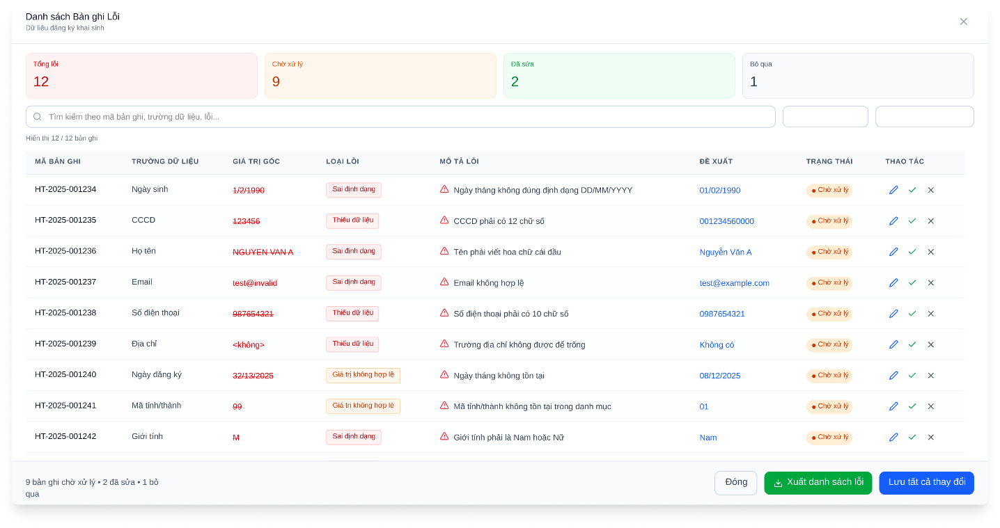

*Hình 52 – Màn danh sách cảnh báo dữ liệu*

##### Mô tả thông tin trên màn hình

| **STT** | **Tên trường thông tin** | **Kiểu dữ liệu** | **Bắt buộc** | **Mặc định** | **Mô tả** |
| --- | --- | --- | --- | --- | --- |
| 1 | Tiêu đề màn hình | Label |  | x | Tên của cửa sổ chức năng xử lý lỗi. |
| 2 | Tổng số lỗi | Card |  | x | Hiển thị tổng số lượng bản ghi vi phạm quy tắc (màu đỏ). |
| 3 | Chờ xử lý | Card |  | x | Số lượng bản ghi lỗi chưa được thao tác (màu cam). |
| 4 | Đã sửa | Card |  | x | Số lượng bản ghi đã được chỉnh sửa hợp lệ (màu xanh lá). |
| 5 | Bỏ qua | Card |  | x | Số lượng bản ghi lỗi được đánh dấu giữ nguyên (màu xám). |
| 6 | Tìm kiếm nhanh | Search Box |  |  | Cho phép tìm kiếm theo mã bản ghi, trường dữ liệu hoặc nội dung lỗi. |
| 7 | Mã bản ghi | Text |  |  | Định danh duy nhất của bản ghi gặp lỗi (ví dụ: HT-2025-001234). |
| 8 | Trường dữ liệu | Text |  |  | Tên trường thông tin bị lỗi (Ngày sinh, CCCD, Email...). |
| 9 | Giá trị gốc | Text |  |  | Dữ liệu thô ban đầu nhận được từ nguồn (hiển thị màu đỏ). |
| 10 | Loại lỗi | Tag |  |  | Phân loại lỗi (Sai định dạng, Thiếu dữ liệu, Giá trị không hợp lệ). |
| 11 | Mô tả lỗi | Text |  |  | Giải thích chi tiết nguyên nhân vi phạm quy tắc. |
| 12 | Đề xuất | Text |  |  | Gợi ý giá trị đúng hoặc đường dẫn sửa lỗi (màu xanh dương). |
| 13 | Trạng thái | Label |  | x | Trạng thái hiện tại của tiến trình khắc phục lỗi. |

##### Chức năng trên màn hình

|  |  |  |  |
| --- | --- | --- | --- |
| **STT** | **Tên chức năng** | **Định dạng** | **Mô tả** |
| 1 | Sửa dữ liệu | Icon | Mở Text liệu tại chỗ để người dùng thay đổi "Giá trị gốc" thành giá trị đúng. |
| 2 | Chấp nhận sửa | Icon | Đồng ý với giá trị đã sửa hoặc giá trị đề xuất của hệ thống. |
| 3 | Bỏ qua lỗi | Icon | Đánh dấu lỗi này là chấp nhận được và không cần sửa đổi thêm. |
| 4 | Xuất danh sách lỗi | Button | Trích xuất toàn bộ danh sách bản ghi lỗi ra file (Excel/CSV). |
| 5 | Lưu tất cả thay đổi | Button | Xác nhận ghi đè toàn bộ dữ liệu đã sửa vào hệ thống chính thức. |
| 6 | Đóng | Button | Thoát khỏi giao diện danh sách lỗi. |

#### XLTL08\_Lịch sử xử lý thiết lập quy tắc xử lý dữ liệu

Màn hình

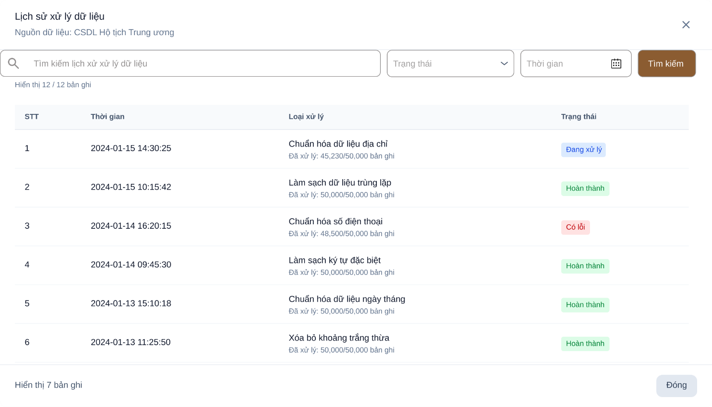

*Hình 53 – Màn lịch sử xử lý dữ liệu*

##### Mô tả thông tin trên màn hình

| **STT** | **Tên trường thông tin** | **Kiểu dữ liệu** | **Bắt buộc** | **Mặc định** | **Mô tả** |
| --- | --- | --- | --- | --- | --- |
| 1 | Thẻ thống kê (Tổng số, Đang xử lý,...) | Card |  |  | Hiển thị tổng số lượng bộ dữ liệu theo từng trạng thái cụ thể. |
| 2 | Ô tìm kiếm | Search Box |  |  | Cho phép nhập từ khóa tìm kiếm theo tên, mô tả hoặc nguồn dữ liệu. |
| 3 | Bộ lọc Trạng thái | Dropdown |  | x | Lọc danh sách dữ liệu theo trạng thái (Đang xử lý, Hoàn thành, Lỗi...). |
| 4 | Bộ lọc Phân loại | Dropdown |  | x | Lọc danh sách dữ liệu theo nhóm phân loại. |
| 5 | Tên bộ dữ liệu | Text |  |  | Tên định danh của tiến trình xử lý dữ liệu. |
| 6 | Trạng thái | Badge |  |  | Label hiển thị trạng thái hiện tại của bộ dữ liệu (Màu sắc thay đổi theo trạng thái). |
| 7 | Thông tin chi tiết (Cơ quan, Người xử lý,...) | Text/Icon |  |  | Hiển thị các thông tin định danh đi kèm của từng mục dữ liệu. |
| 8 | Tiến độ xử lý | Progress Bar |  |  | Thanh biểu diễn phần trăm (%) đã hoàn thành của tiến trình. |
| 9 | Chỉ số bản ghi | Label |  |  | Hiển thị chi tiết số lượng: Đã xử lý / Tổng số bản ghi. |
| 10 | Số bản ghi lỗi | Text |  |  | Hiển thị số lượng bản ghi gặp lỗi trong quá trình xử lý (nếu có). |

##### Chức năng trên màn hình

|  |  |  |  |
| --- | --- | --- | --- |
| **STT** | **Tên chức năng** | **Định dạng** | **Mô tả** |
| 1 | Đóng | Icon | Thoát khỏi màn hình xem lịch sử ở góc trên bên phải. |
| 2 | Tìm kiếm nhanh | Input | Lọc danh sách lịch sử ngay khi người dùng nhập ký tự vào ô tìm kiếm. |
| 3 | Đóng | Button | Đóng popup và quay lại màn hình quản lý chính. |

### Dữ liệu đã xử lý trong ngành

### Dữ liệu đã xử lý ngoài ngành

## 4.6. Quản lý danh mục dùng chung

### Mục đích

Chức năng quản lý danh mục dùng chung nhằm xây dựng, quản lý và sử dụng thống nhất các **danh mục, bảng mã dùng chung** trong kho dữ liệu dùng chung (DLDC), làm nền tảng cho việc **chuẩn hóa, liên thông, tích hợp và chia sẻ dữ liệu** giữa các hệ thống thông tin.

Thông qua chức năng này, hệ thống:

* Quản lý tập trung các danh mục, bảng mã dùng chung phục vụ khai thác và trao đổi dữ liệu;
* Đảm bảo việc sử dụng danh mục, mã hóa dữ liệu **thống nhất, đồng bộ và nhất quán** giữa các hệ thống trong và ngoài ngành;
* Hạn chế trùng lặp, sai khác dữ liệu do sử dụng nhiều danh mục khác nhau;
* Hỗ trợ công tác chuẩn hóa dữ liệu, nâng cao chất lượng dữ liệu trong kho DLDC;
* Tạo cơ sở cho việc kết nối, chia sẻ và tích hợp dữ liệu giữa các hệ thống thông tin.

*+ Phân quyền*

Việc quản lý danh mục dùng chung được thực hiện theo cơ chế phân quyền, phù hợp với vai trò và trách nhiệm của từng đối tượng sử dụng.

**Cán bộ quản trị được phân quyền** có trách nhiệm:

* Khai báo, cập nhật, bổ sung, chỉnh sửa và quản lý các danh mục, bảng mã dùng chung;
* Thiết lập phạm vi sử dụng danh mục cho từng hệ thống, đơn vị và lĩnh vực nghiệp vụ;
* Đảm bảo tính thống nhất, đầy đủ và chính xác của các danh mục trong kho DLDC;
* Quản lý lịch sử thay đổi, cập nhật danh mục dùng chung;
* Phối hợp với các đơn vị liên quan trong việc rà soát, chuẩn hóa và thống nhất danh mục sử dụng.

Các đơn vị, cá nhân khai thác dữ liệu chỉ được sử dụng danh mục dùng chung trong phạm vi quyền hạn được cấp, không được tự ý thay đổi nội dung danh mục.

*+ Điều kiện thực hiện*

Việc quản lý và sử dụng danh mục dùng chung được thực hiện khi đáp ứng các điều kiện sau:

* Cán bộ thực hiện đã được **cấp quyền quản trị danh mục dùng chung** trong hệ thống;
* Có quy định, tài liệu hoặc thỏa thuận thống nhất về danh mục, bảng mã sử dụng chung;
* Các hệ thống liên quan đáp ứng yêu cầu kỹ thuật để tích hợp và sử dụng danh mục dùng chung;
* Danh mục được xây dựng, rà soát và cập nhật theo đúng quy trình quản lý dữ liệu và quy định hiện hành;
* Có cơ chế theo dõi, ghi nhận và quản lý lịch sử cập nhật danh mục để phục vụ công tác kiểm tra, giám sát khi cần thiết.

### Thiết lập danh mục

#### 4.6.2.1. Tab thiết lập danh sách

##### 4.6.2.1.1. DMDC_01. Màn danh sách thiết lập danh mục dùng chung

Màn hình

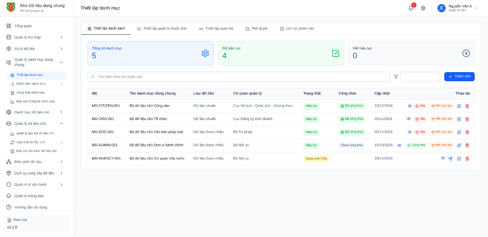

*Hình 54 – Màn danh sách thiết lập danh mục dùng chung*

###### Mô tả thông tin trên màn hình

| **STT** | **Tên trường thông tin** | **Kiểu dữ liệu** | **Bắt buộc** | **Mặc định** | **Mô tả** |
| --- | --- | --- | --- | --- | --- |
| 1 | Tổng số danh mục | Số nguyên |  | x | Tổng số lượng các danh mục dùng chung đã khởi tạo. |
| 2 | Đã hiệu lực | Số nguyên |  | x | Số lượng danh mục đang ở trạng thái hoạt động chính thức. |
| 3 | Hết hiệu lực | Số nguyên |  | x | Số lượng danh mục đã bị ngừng sử dụng. |
| 4 | Mã | Văn bản |  | x | Mã định danh duy nhất của danh mục (ví dụ: MD-CITIZEN-001). |
| 5 | Tên danh mục dùng chung | Văn bản |  | x | Tên gọi đầy đủ của bộ danh mục. |
| 6 | Loại dữ liệu | Văn bản |  | x | Phân loại tính chất dữ liệu (Dữ liệu chuẩn, Dữ liệu tham chiếu...). |
| 7 | Cơ quan quản lý | Văn bản |  | x | Đơn vị chịu trách nhiệm nội dung cho danh mục đó. |
| 8 | Trạng thái | Nhãn (Label) |  | x | Tình trạng pháp lý của danh mục (Hiệu lực, Đang soạn thảo). |
| 9 | Công khai | Nhãn (Label) |  | x | Tình trạng chia sẻ dữ liệu (Đã công khai, Chưa công khai). |
| 10 | Cập nhật | Ngày tháng |  | x | Ngày gần nhất dữ liệu danh mục được thay đổi. |

###### Chức năng trên màn hình

| **STT** | **Tên chức năng** | **Định dạng** | **Mô tả** |
| --- | --- | --- | --- |
| 1 | Tab điều hướng con | Tab | Chuyển đổi giữa các bước thiết lập: Danh sách, Thuộc tính, Quan hệ, Phê duyệt, Lịch sử. |
| 2 | Tìm kiếm danh mục | Text | Tìm kiếm nhanh theo tên hoặc mã danh mục. |
| 3 | Lọc nâng cao | Button | Mở các tiêu chí lọc chuyên sâu cho danh sách. |
| 4 | Thêm mới | Button | Mở giao diện để khởi tạo một danh mục dùng chung mới. |
| 5 | Xem chi tiết | Button | Mở xem thông tin chi tiết của bản ghi danh mục. |
| 6 | Hủy hiệu lực | Button | Chuyển trạng thái danh mục sang ngừng hoạt động. |
| 7 | Đặt hiệu lực | Button | Kích hoạt danh mục để đưa vào sử dụng chính thức. |
| 8 | Chỉnh sửa | Button | Cập nhật thông tin hoặc cấu hình của danh mục hiện có. |
| 9 | Xóa | Button | Gỡ bỏ hoàn toàn danh mục khỏi hệ thống (nếu chưa có dữ liệu liên kết). |
| 10 | Gửi phê duyệt | Button | Gửi cấu hình danh mục lên cấp có thẩm quyền để duyệt hiệu lực. |

#### Quy tắc xử lý

*   **Hiệu lực danh mục**: Danh mục chỉ có thể được sử dụng trong các chức năng khác khi ở trạng thái "Hiệu lực" và đã được "Công khai".
*   **Ràng buộc xóa**: Không được xóa các danh mục đang có dữ liệu liên kết hoặc đang được sử dụng bởi dịch vụ cung cấp dữ liệu.
*   **Phiên bản**: Mỗi lần cập nhật cấu hình thuộc tính, hệ thống sẽ tự động tăng số phiên bản (Version code).

#### Danh sách thông báo

| STT | Mã thông báo | Nội dung thông báo | Diễn giải |
| --- | --- | --- | --- |
| 1 | MSG-CAT-001 | Gửi phê duyệt danh mục thành công. | Trạng thái Chờ duyệt |
| 2 | MSG-CAT-002 | Danh mục đã được chuyển sang trạng thái Hết hiệu lực. | Khi hủy hiệu lực |
| 3 | MSG-CAT-003 | Không thể xóa danh mục đang có dữ liệu liên kết. | Cảnh báo ràng buộc |

##### 4.6.2.1.2. DMDC_02. Thêm mới thiết lập danh mục dùng chung

Màn hình

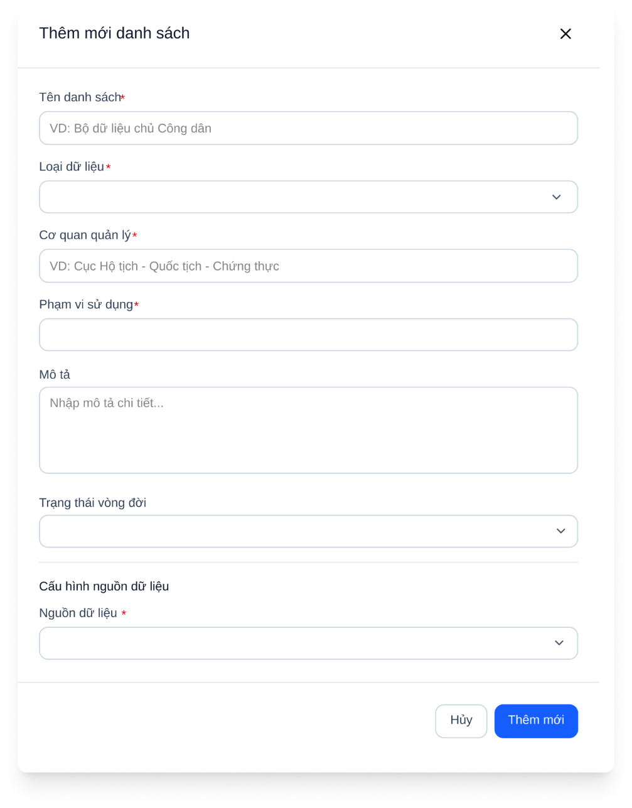

*Hình 55 – Màn Thêm mới thiết lập danh mục dùng chung*

##### 4.6.2.1.3.1. Mô tả thông tin trên màn hình

| **STT** | **Tên trường thông tin** | **Kiểu dữ liệu** | **Bắt buộc** | **Mặc định** | **Mô tả** |
| --- | --- | --- | --- | --- | --- |
| 1 | Tên danh sách | Văn bản |  |  | Nhập tên gọi đầy đủ của bộ danh mục dữ liệu dùng chung. |
| 2 | Loại dữ liệu | Danh mục (Dropdown) |  |  | Lựa chọn phân loại dữ liệu (ví dụ: Dữ liệu chuẩn, Dữ liệu tham chiếu). |
| 3 | Cơ quan quản lý | Văn bản |  |  | Nhập tên đơn vị chịu trách nhiệm chính về nội dung dữ liệu. |
| 4 | Phạm vi sử dụng | Văn bản |  |  | Xác định ranh giới hoặc các đối tượng được phép khai thác danh mục. |
| 5 | Mô tả | Văn bản (Nhiều dòng) |  |  | Nhập mô tả chi tiết về mục đích và nội dung của danh sách. |
| 6 | Trạng thái vòng đời | Danh mục (Dropdown) |  |  | Thiết lập giai đoạn hiện tại của danh mục trong quy trình quản lý. |
| 7 | Nguồn dữ liệu | Danh mục (Dropdown) |  |  | Lựa chọn hệ thống hoặc phương thức cung cấp dữ liệu đầu vào. |

##### 4.6.2.1.3.2. Chức năng trên màn hình

|  |  |  |  |
| --- | --- | --- | --- |
| **STT** | **Tên chức năng** | **Định dạng** | **Mô tả** |
| 1 | **Đóng (X)** | Biểu tượng | Đóng cửa sổ popup ngay lập tức và không lưu lại bất kỳ thay đổi nào. |
| 2 | **Hủy** | Nút bấm | Hủy bỏ các thông tin đã nhập và quay về màn hình danh sách thiết lập. |
| 3 | **Thêm mới** | Nút bấm (Màu xanh) | Kiểm tra tính hợp lệ của dữ liệu (Validation) và khởi tạo danh mục mới vào hệ thống. |

##### 4.6.2.1.3. DMDC_03. Chỉnh sửa thiết lập danh mục dùng chung

Màn hình

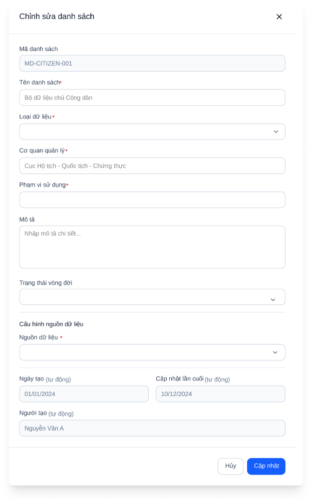

*Hình 56 – Màn Chỉnh sửa thiết lập danh mục dùng chung*

##### 4.6.2.1.4.1. Mô tả thông tin trên màn hình

| **STT** | **Tên trường thông tin** | **Kiểu dữ liệu** | **Bắt buộc** | **Mặc định** | **Mô tả** |
| --- | --- | --- | --- | --- | --- |
| 1 | Tên danh sách | Text |  | x | Nhập tên gọi đầy đủ của bộ danh mục dữ liệu dùng chung. |
| 2 | Loại dữ liệu | Dropdown |  | x | Lựa chọn phân loại dữ liệu (ví dụ: Dữ liệu chuẩn, Dữ liệu tham chiếu). |
| 3 | Cơ quan quản lý | Text |  | x | Nhập tên đơn vị chịu trách nhiệm chính về nội dung dữ liệu. |
| 4 | Phạm vi sử dụng | Text |  | x | Xác định ranh giới hoặc các đối tượng được phép khai thác danh mục. |
| 5 | Mô tả | Text |  | x | Nhập mô tả chi tiết về mục đích và nội dung của danh sách. |
| 6 | Trạng thái vòng đời | Dropdown |  | x | Thiết lập giai đoạn hiện tại của danh mục trong quy trình quản lý. |
| 7 | Nguồn dữ liệu | Dropdown |  | x | Lựa chọn hệ thống hoặc phương thức cung cấp dữ liệu đầu vào. |

##### 4.6.2.1.4.2. Chức năng trên màn hình

|  |  |  |  |
| --- | --- | --- | --- |
| **STT** | **Tên chức năng** | **Định dạng** | **Mô tả** |
| 1 | **Đóng (X)** | Button | Đóng cửa sổ popup ngay lập tức và không lưu lại bất kỳ thay đổi nào. |
| 2 | **Hủy** | Button | Hủy bỏ các thông tin đã nhập và quay về màn hình danh sách thiết lập. |
| 3 | **Cập nhật** | Button | Kiểm tra tính hợp lệ của dữ liệu (Validation) và cập nhật lại dữ liệu vào hệ thống. |

##### 4.6.2.1.4. DMDC_04. Xem chi tiết thiết lập danh mục dùng chung

Màn hình

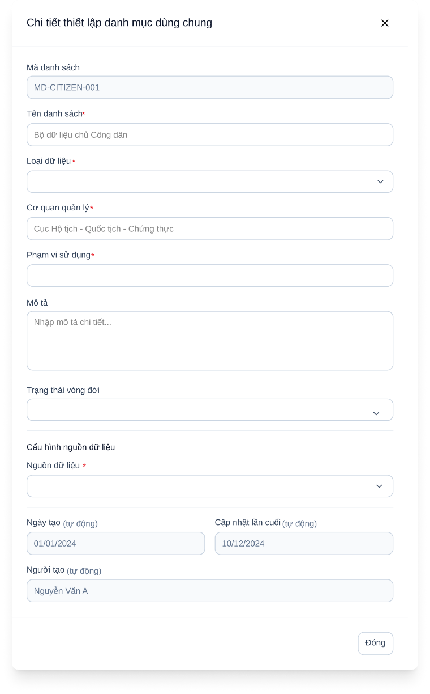

*Hình 57 – Màn chi tiết thiết lập danh mục dùng chung*

##### 4.6.2.1.5.1. Mô tả thông tin trên màn hình

| **STT** | **Tên trường thông tin** | **Kiểu dữ liệu** | **Bắt buộc** | **Mặc định** | **Mô tả** |
| --- | --- | --- | --- | --- | --- |
| 1 | Tên danh sách | Text |  | x | Nhập tên gọi đầy đủ của bộ danh mục dữ liệu dùng chung. |
| 2 | Loại dữ liệu | Dropdown |  | x | Lựa chọn phân loại dữ liệu (ví dụ: Dữ liệu chuẩn, Dữ liệu tham chiếu). |
| 3 | Cơ quan quản lý | Text |  | x | Nhập tên đơn vị chịu trách nhiệm chính về nội dung dữ liệu. |
| 4 | Phạm vi sử dụng | Text |  | x | Xác định ranh giới hoặc các đối tượng được phép khai thác danh mục. |
| 5 | Mô tả | Text |  | x | Nhập mô tả chi tiết về mục đích và nội dung của danh sách. |
| 6 | Trạng thái vòng đời | Dropdown |  | x | Thiết lập giai đoạn hiện tại của danh mục trong quy trình quản lý. |
| 7 | Nguồn dữ liệu | Dropdown |  | x | Lựa chọn hệ thống hoặc phương thức cung cấp dữ liệu đầu vào. |

###### Chức năng trên màn hình

|  |  |  |  |
| --- | --- | --- | --- |
| **STT** | **Tên chức năng** | **Định dạng** | **Mô tả** |
| 1 | **Đóng (X)** | Button | Đóng cửa sổ popup ngay lập tức và không lưu lại bất kỳ thay đổi nào. |
| 2 | **Đóng** | Button | Hủy bỏ các thông tin đã nhập và quay về màn hình danh sách thiết lập. |

##### 4.6.2.1.5. DMDC_05. Trình phê duyệt danh mục dùng chung

Màn hình

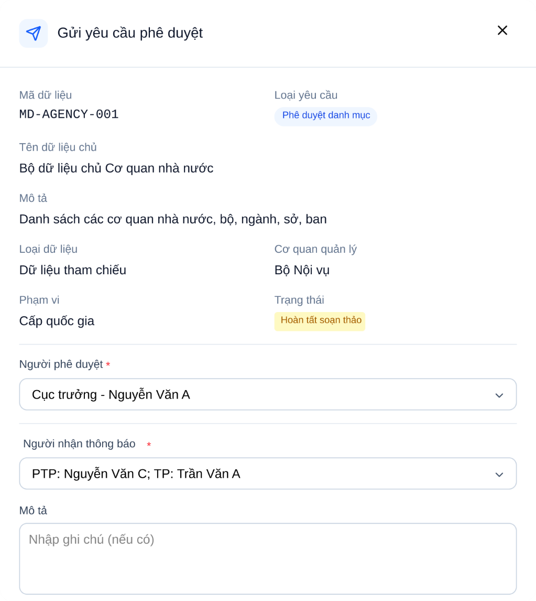

*Hình 58 – Màn gửi phê duyệt danh mục dùng chung*

###### Mô tả thông tin trên màn hình

| **STT** | **Tên trường thông tin** | **Kiểu dữ liệu** | **Bắt buộc** | **Mặc định** | **Mô tả** |
| --- | --- | --- | --- | --- | --- |
| **1** | **Thông tin đối tượng** |  |  |  |  |
| 1.1 | Mã dữ liệu | Label |  | x | Mã định danh của danh mục (ví dụ: MD-AGENCY-001). |
| 1.2 | Loại yêu cầu | Label |  | x | Loại tác vụ cần thực hiện phê duyệt. |
| 1.3 | Tên dữ liệu chủ | Label |  | x | Tên đầy đủ của danh mục đang thiết lập. |
| 1.4 | Mô tả | Label |  | x | Nội dung mô tả chi tiết về danh mục. |
| 1.5 | Loại dữ liệu | Label |  | x | Phân loại dữ liệu (ví dụ: Dữ liệu tham chiếu). |
| 1.6 | Cơ quan quản lý | Label |  | x | Đơn vị chủ quản của bộ dữ liệu. |
| 1.7 | Phạm vi | Label |  | x | Ranh giới áp dụng của danh mục (ví dụ: Cấp quốc gia). |
| 1.8 | Trạng thái | Label |  | x | Tình trạng hiện tại trước khi gửi duyệt. |
| **2** | **Thông tin điều hướng** |  |  |  |  |
| 2.1 | Người phê duyệt | Dropdown | x | x | Lựa chọn lãnh đạo hoặc cán bộ có thẩm quyền duyệt. |
| 2.2 | Người nhận thông báo | Dropdown | x | x | Lựa chọn các cá nhân/phòng ban nhận tin khi có kết quả. |
| 2.3 | Mô tả (Ghi chú) | Text |  |  | Nhập ghi chú thêm cho cấp phê duyệt (nếu có). |

###### Chức năng trên màn hình

|  |  |  |  |
| --- | --- | --- | --- |
| **STT** | **Tên chức năng** | **Định dạng** | **Mô tả** |
| 1 | **Đóng (X)** | Button | Tắt popup và hủy bỏ thao tác gửi yêu cầu. |
| 2 | **Chọn người phê duyệt** | Dropdown | Tìm kiếm và chọn tên cán bộ phê duyệt từ danh sách nhân sự. |
| 3 | **Chọn người nhận** | Text | Cho phép chọn nhiều người để nhận thông báo về trạng thái hồ sơ. |
| 4 | **Gửi yêu cầu** | Button | Thực hiện chuyển trạng thái bản ghi sang "Chờ phê duyệt" và gửi thông báo cho người liên quan. |

##### 4.6.2.1.6. DMDC_06. Phê duyệt danh mục dùng chung

Màn hình

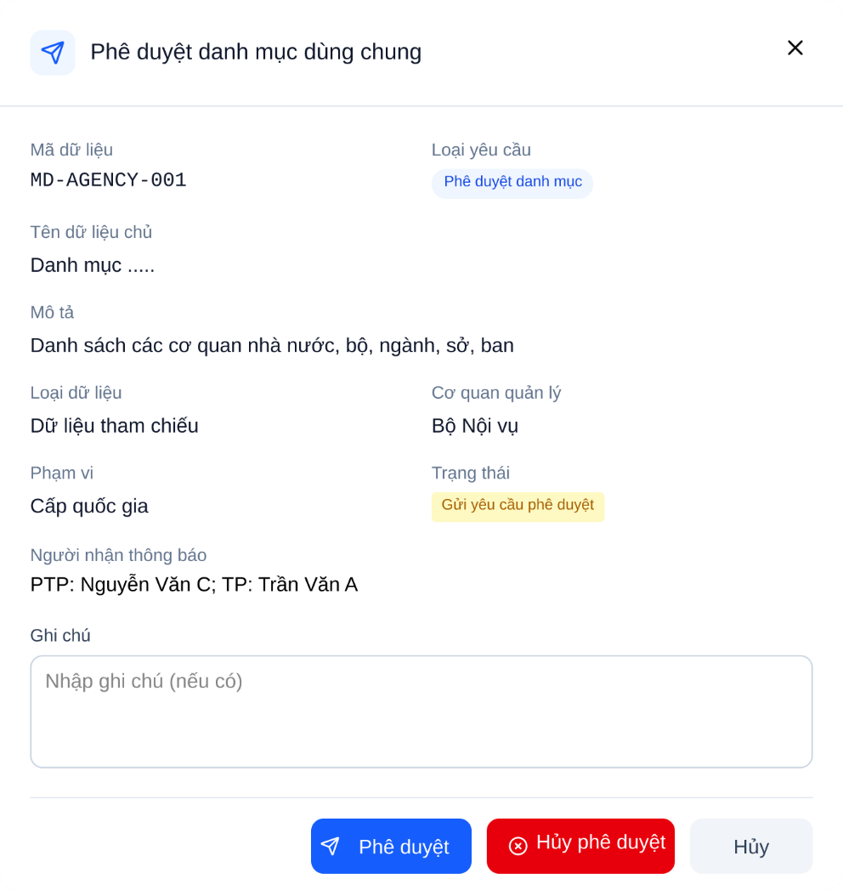

*Hình 59 – Màn phê duyệt danh mục dùng chung*

###### Mô tả thông tin trên màn hình

| **STT** | **Tên trường thông tin** | **Kiểu dữ liệu** | **Bắt buộc** | **Mặc định** | **Mô tả** |
| --- | --- | --- | --- | --- | --- |
| 1 | Mã quan hệ | Label |  | x | Mã định danh duy nhất cho mối liên kết (ví dụ: REL-001). |
| 2 | Danh mục nguồn | Label |  | x | Tên bảng danh mục gốc dùng để ánh xạ. |
| 3 | Thuộc tính nguồn | Label |  | x | Trường dữ liệu cụ thể trong bảng nguồn dùng để liên kết. |
| 4 | Danh mục đích | Label |  | x | Tên bảng danh mục được liên kết tới. |
| 5 | Thuộc tính đích | Label |  | x | Trường dữ liệu tương ứng trong bảng đích. |
| 6 | Loại quan hệ | Label |  | x | Định nghĩa kiểu liên kết (1-1, 1-N, N-N). |
| 7 | Mô tả quan hệ | Label |  | x | Diễn giải mục đích của việc thiết lập quan hệ này. |
| 8 | Trạng thái | Label |  | x | Tình trạng sử dụng của quan hệ (Hoạt động/Ngừng hoạt động). |
| 8 | Ghi chú | Text |  |  | Nhập thông tin cần ghi chú |

###### Chức năng trên màn hình

|  |  |  |  |
| --- | --- | --- | --- |
| **STT** | **Tên chức năng** | **Định dạng** | **Mô tả** |
| 1 | Thêm quan hệ | Button | Mở giao diện cấu hình để tạo mới một mối liên kết giữa các danh mục. |
| 2 | Tìm kiếm | Button | Tìm kiếm các thiết lập quan hệ theo tên danh mục hoặc mã quan hệ. |
| 3 | Chỉnh sửa | Button | Cập nhật lại các thuộc tính hoặc loại quan hệ đã thiết lập. |
| 4 | Xóa | Button | Gỡ bỏ mối liên kết giữa các danh mục (yêu cầu xác nhận trước khi thực hiện). |
| 5 | Kiểm tra logic | Button | Hệ thống tự động kiểm tra xem các thuộc tính liên kết có khớp kiểu dữ liệu hay không. |
| 6 | Xem sơ đồ quan hệ | Button | Hiển thị trực quan mối quan hệ giữa các danh mục dưới dạng sơ đồ (ERD). |

##### 4.6.2.1.7. DMDC_07. Gửi phê duyệt Hủy hiệu lực danh mục dùng chung

Màn hình

*Hình 60 – Màn phê duyệt danh mục dùng chung*

###### Mô tả thông tin trên màn hình

| **STT** | **Tên trường thông tin** | **Kiểu dữ liệu** | **Bắt buộc** | **Mặc định** | **Mô tả** |
| --- | --- | --- | --- | --- | --- |
| **1** | **Thông tin đối tượng** |  |  |  |  |
| 1.1 | Mã dữ liệu | Label |  | x | Mã định danh của danh mục cần duyệt. |
| 1.2 | Loại yêu cầu | Label |  | x | Loại tác vụ cần thực hiện. |
| 1.3 | Tên dữ liệu chủ | Label |  | x | Tên đầy đủ của danh mục. |
| 1.4 | Mô tả | Label |  | x | Nội dung diễn giải của danh mục. |
| 1.5 | Loại dữ liệu | Label |  | x | Phân loại tính chất dữ liệu. |
| 1.6 | Cơ quan quản lý | Label |  | x | Đơn vị chịu trách nhiệm danh mục. |
| 1.7 | Phạm vi | Label |  | x | Ranh giới sử dụng của dữ liệu. |
| 1.8 | Trạng thái | Label |  | x | Tình trạng hiện tại của hồ sơ. |
| **2** | **Thông tin điều hướng** |  |  |  |  |
| 2.1 | Người phê duyệt | Dropdown | **Có** |  | Chọn lãnh đạo có thẩm quyền duyệt. |
| 2.2 | Người nhận thông báo | Dropdown | **Có** |  | Chọn những người nhận kết quả sau khi duyệt. |
| 2.3 | Mô tả (Ghi chú) | Text |  |  | Nhập lời nhắn hoặc ghi chú gửi cấp trên. |

###### Chức năng trên màn hình

|  |  |  |  |
| --- | --- | --- | --- |
| **STT** | **Tên chức năng** | **Định dạng** | **Mô tả** |
| 1 | **Đóng (X)** | Biểu tượng | Thoát popup mà không gửi yêu cầu. |
| 2 | **Chọn người phê duyệt** | Dropdown | Hiển thị danh sách cán bộ có quyền phê duyệt để người dùng chọn. |
| 3 | **Chọn người nhận** | Multi-select | Cho phép chọn một hoặc nhiều người cùng nhận thông báo kết quả. |
| 4 | **Gửi yêu cầu (Icon)** | Button | Thực hiện lệnh gửi. Hệ thống sẽ kiểm tra các trường bắt buộc trước khi xử lý. |

##### 4.6.2.1.8. DMDC_08. Phê duyệt Hủy hiệu lực danh mục dùng chung

Màn hình

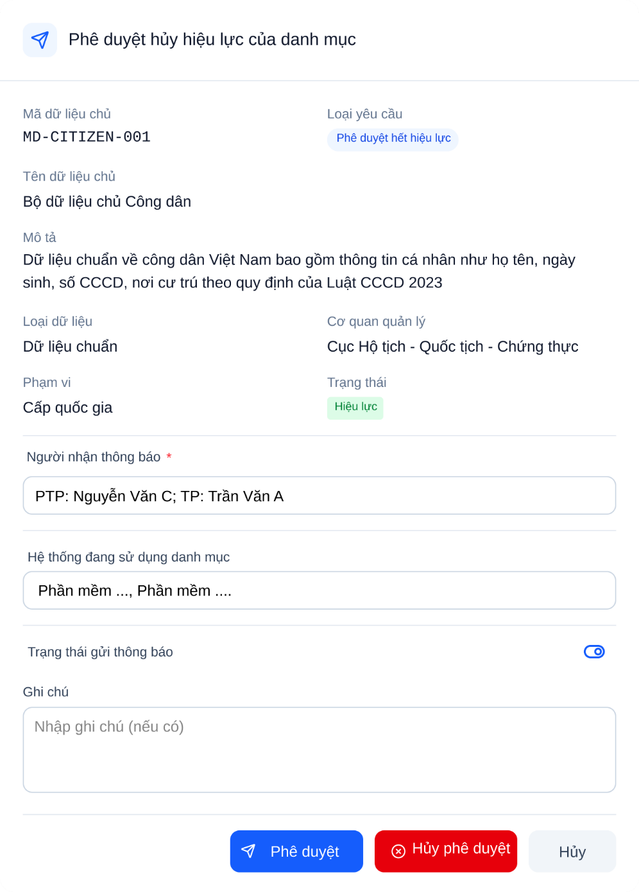

*Hình 61 – Màn Phê duyệtHủy phê duyệt Hủy hiệu lực danh mục dùng chung*

###### Mô tả thông tin trên màn hình

| **STT** | **Tên trường thông tin** | **Kiểu dữ liệu** | **Bắt buộc** | **Mặc định** | **Mô tả** |
| --- | --- | --- | --- | --- | --- |
| **1** | **Thông tin danh mục** |  |  |  |  |
| 1.1 | Mã dữ liệu danh mục | Label |  | x | Mã định danh duy nhất của bộ danh mục. |
| 1.2 | Loại yêu cầu | Label |  | x | Phân loại nghiệp vụ của yêu cầu phê duyệt. |
| 1.3 | Tên dữ liệu danh mục | Label |  | x | Tên hiển thị của danh mục dữ liệu. |
| 1.4 | Mô tả | Label |  | x | Diễn giải chi tiết nội dung và căn cứ pháp lý của danh mục. |
| 1.5 | Loại dữ liệu | Label |  | x | Phân loại tính chất dữ liệu. |
| 1.6 | Cơ quan quản lý | Label |  | x | Đơn vị chịu trách nhiệm quản lý danh mục này. |
| 1.7 | Phạm vi | Label |  | x | Quy mô áp dụng của bộ dữ liệu. |
| 1.8 | Trạng thái | Label |  | x | Tình trạng hiện tại của danh mục trên hệ thống. |
| **2** | **Thông tin bổ sung** |  |  |  |  |
| 2.1 | Người nhận thông báo | Text | x | x | Danh sách các cá nhân/đơn vị sẽ nhận được thông báo sau khi có kết quả duyệt. |
| 2.2 | Hệ thống đang sử dụng | Text |  | x | Liệt kê các hệ thống đang kết nối dữ liệu với danh mục này (dùng để đánh giá rủi ro khi hủy). |
| 2.3 | Trạng thái gửi thông báo | Switch |  | Bật | Tùy chọn cho phép hệ thống tự động gửi thông báo sau khi nhấn nút duyệt. |
| 2.4 | Ghi chú | Text |  |  | Ô nhập ý kiến chỉ đạo của lãnh đạo hoặc lý do nếu từ chối phê duyệt. |

###### Chức năng trên màn hình

|  |  |  |  |
| --- | --- | --- | --- |
| **STT** | **Tên chức năng** | **Định dạng** | **Mô tả** |
| 1 | Phê duyệt | Button | Chấp nhận yêu cầu. Hệ thống sẽ chuyển trạng thái danh mục sang **Hết hiệu lực** và cập nhật thời gian hoàn tất. |
| 2 | Hủy phê duyệt | Button | Từ chối yêu cầu hủy hiệu lực. Danh mục sẽ quay lại trạng thái **Hiệu lực** bình thường. |
| 3 | Hủy | Button | Đóng cửa sổ phê duyệt và không thực hiện bất kỳ thay đổi nào đối với yêu cầu. |
| 4 | Bật/Tắt thông báo | Switch | Quyết định việc gửi hoặc không gửi email/thông báo hệ thống cho các bên liên quan. |
| 5 | Đóng (X) | Button | Đóng nhanh popup phê duyệt. |

##### 4.6.2.1.9. DMDC_09. Công khai DM (chỉ dành cho tài khoản lãnh đạo)

Màn hình

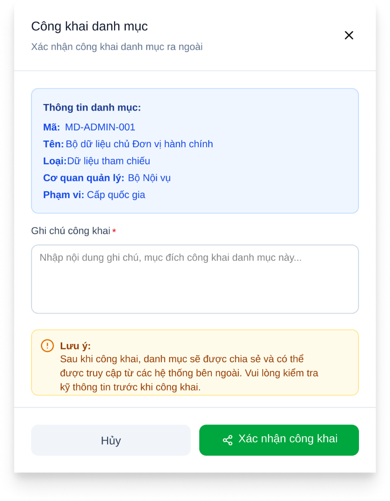

*Hình 62 – Màn Công khai danh mục dùng chung*

###### Mô tả thông tin trên màn hình

|  |  |  |  |  |  |
| --- | --- | --- | --- | --- | --- |
| **STT** | **Tên trường thông tin** | **Kiểu dữ liệu** | **Bắt buộc** | **Mặc định** | **Mô tả** |
| **1** | **Thông tin danh mục** |  |  |  |  |
| 1.1 | Mã | Label |  | x | Mã định danh duy nhất của danh mục cần công khai. |
| 1.2 | Tên | Label |  | x | Tên đầy đủ của bộ danh mục. |
| 1.3 | Loại | Label |  | x | Phân loại tính chất của dữ liệu. |
| 1.4 | Cơ quan quản lý | Label |  | x | Đơn vị chịu trách nhiệm quản lý và nội dung dữ liệu. |
| 1.5 | Phạm vi | Label |  | x | Quy mô áp dụng của bộ danh mục này. |
| **2** | **Thông tin xác nhận** |  |  |  |  |
| 2.1 | Ghi chú công khai | Label | **Có** |  | Nhập nội dung giải trình, mục đích hoặc lưu ý khi công khai danh mục này. |
| 2.2 | Thông tin Lưu ý | Label |  | x | Nhắc nhở người dùng về việc dữ liệu sẽ được chia sẻ ra ngoài sau khi xác nhận. |

###### Chức năng trên màn hình

|  |  |  |  |
| --- | --- | --- | --- |
| **STT** | **Tên chức năng** | **Định dạng** | **Mô tả** |
| 1 | Xác nhận công khai | Button | Thực hiện lệnh công khai danh mục. Trạng thái danh mục sẽ chuyển sang **"Đã công khai"** trên hệ thống. |
| 2 | Hủy | Button | Đóng popup và giữ nguyên trạng thái danh mục hiện tại. |
| 3 | Đóng (X) | Button | Thoát nhanh cửa sổ popup mà không lưu bất kỳ thay đổi nào. |

##### 4.6.2.1.10. DMDC_10. Hủy công khai danh mục dùng chung

Màn hình

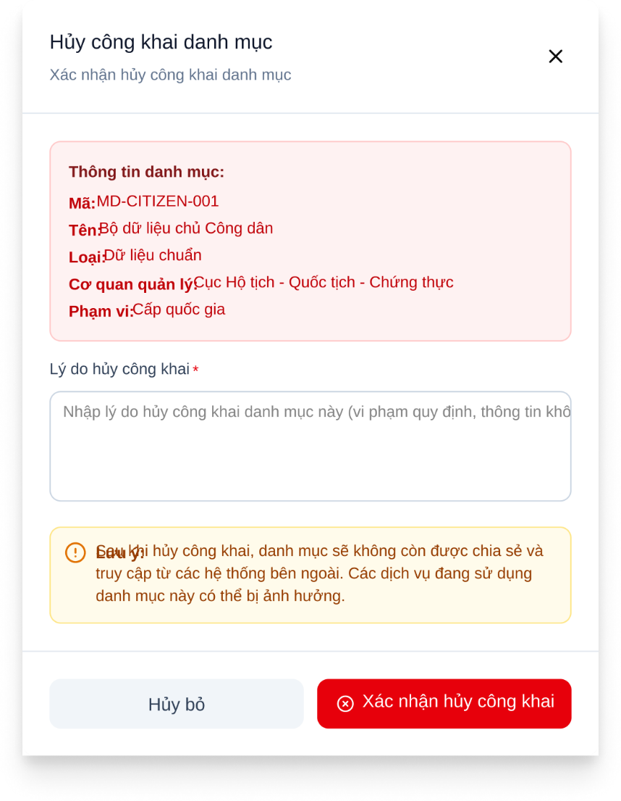

*Hình 63 – Màn Hủy công khai danh mục dùng chung*

###### Mô tả thông tin trên màn hình

| **STT** | **Tên trường thông tin** | **Kiểu dữ liệu** | **Bắt buộc** | **Mặc định** | **Mô tả** |
| --- | --- | --- | --- | --- | --- |
| **1** | **Thông tin danh mục** |  |  |  |  |
| 1.1 | Mã | Label |  | x | Mã định danh duy nhất của danh mục cần hủy công khai. |
| 1.2 | Tên | Label |  | x | Tên hiển thị đầy đủ của bộ dữ liệu. |
| 1.3 | Loại | Label |  | x | Phân loại tính chất dữ liệu. |
| 1.4 | Cơ quan quản lý | Label |  | x | Đơn vị chịu trách nhiệm nội dung cho bộ dữ liệu. |
| 1.5 | Phạm vi | Label |  | x | Quy mô áp dụng hiện tại của bộ danh mục. |
| **2** | **Thông tin xác nhận** |  |  |  |  |
| 2.1 | Lý do hủy công khai | Text | **Có** |  | Nhập lý do cụ thể cho việc ngừng chia sẻ (ví dụ: vi phạm quy định, thông tin không còn chính xác...). |
| 2.2 | Thông tin Lưu ý | Label |  | x | Nhắc nhở về việc các dịch vụ đang sử dụng danh mục này có thể bị ảnh hưởng/lỗi sau khi hủy công khai. |

###### Chức năng trên màn hình

|  |  |  |  |
| --- | --- | --- | --- |
| **STT** | **Tên chức năng** | **Định dạng** | **Mô tả** |
| 1 | Xác nhận hủy công khai | Button | Thực hiện lệnh ngừng chia sẻ danh mục. Trạng thái công khai của danh mục sẽ bị gỡ bỏ. |
| 2 | Hủy bỏ | Button | Thoát khỏi popup và giữ nguyên trạng thái công khai hiện tại của danh mục. |
| 3 | Đóng (X) | Button | Đóng nhanh cửa sổ mà không thực hiện bất kỳ thay đổi nào. |

#### 4.6.2.2. Thiết lập quản lý thuộc tính

##### 4.6.2.2.1. TLDM01. Màn danh sách thông tin thuộc tính của danh mục

Màn hình

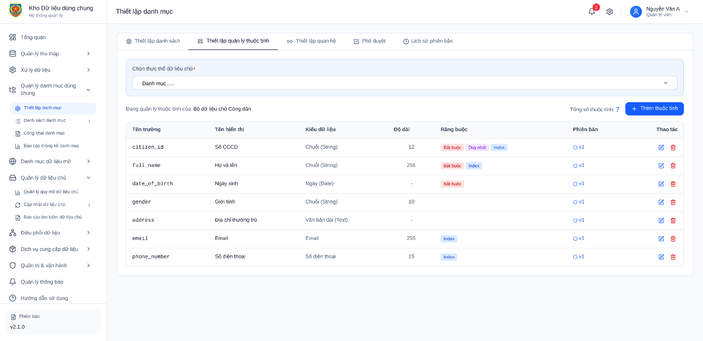

*Hình 64 – Màn danh sách thông tin thuộc tính của danh mục*

###### Mô tả thông tin trên màn hình

| **STT** | **Tên trường thông tin** | **Kiểu dữ liệu** | **Bắt buộc** | **Mặc định** | **Mô tả** |
| --- | --- | --- | --- | --- | --- |
| 1 | Chọn thực thể dữ liệu chủ | Dropdown | **x** | x | Chọn danh mục cần thiết lập thuộc tính. |
| 2 | Tổng số thuộc tính | Label |  | x | Hiển thị tổng số lượng trường dữ liệu hiện có. |
| 3 | Tên trường | Label | **x** | x | Tên định danh kỹ thuật trong CSDL (ví dụ: citizen\_id). |
| 4 | Tên hiển thị | Label | **x** | x | Tên gọi trên giao diện người dùng (ví dụ: Số CCCD). |
| 5 | Kiểu dữ liệu | Label | **x** | x | Định dạng dữ liệu của thuộc tính (Chuỗi, Ngày, Văn bản dài...). |
| 6 | Độ dài | Label |  | x | Giới hạn ký tự tối đa cho phép nhập. |
| 7 | Ràng buộc | Label |  | x | Các thuộc tính đặc biệt: **Bắt buộc**, **Duy nhất**, **Index**. |
| 8 | Phiên bản | Label |  | x | Phiên bản hiện hành của cấu trúc thuộc tính. |

###### Chức năng trên màn hình

| **STT** | **Tên chức năng** | **Định dạng** | **Mô tả** |
| --- | --- | --- | --- |
| 1 | Chọn danh mục | Button | Lọc danh sách thuộc tính theo thực thể dữ liệu chủ được chọn. |
| 2 | Thêm thuộc tính | Button | Mở giao diện để thêm mới một trường dữ liệu vào danh mục hiện tại. |
| 3 | Chỉnh sửa | Button | Cho phép thay đổi Tên hiển thị, Kiểu dữ liệu hoặc các Ràng buộc của thuộc tính. |
| 4 | Xóa | Button | Loại bỏ thuộc tính khỏi danh mục (thường chỉ cho phép khi chưa có dữ liệu phát sinh). |
| 5 | Tab điều hướng | Tab | Chuyển đổi giữa các phân hệ: Thiết lập danh sách, Thuộc tính, Quan hệ, Phê duyệt. |

##### 4.6.2.2.2. TLDM02. Màn Thêm mới thông tin thuộc tính của danh mục

Màn hình

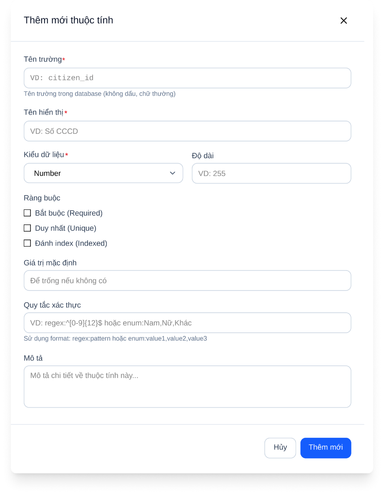

*Hình 65 – Màn Thêm mới thông tin thuộc tính của danh mục*

###### Mô tả thông tin trên màn hình

| **STT** | **Tên trường thông tin** | **Kiểu dữ liệu** | **Bắt buộc** | **Mặc định** | **Mô tả** |
| --- | --- | --- | --- | --- | --- |
| 1 | Tên trường | Text | **x** | x | Tên định danh trong cơ sở dữ liệu (không dấu, chữ thường, dùng dấu gạch dưới). |
| 2 | Tên hiển thị | Text | **x** | x | Tên nhãn xuất hiện trên giao diện người dùng. |
| 3 | Kiểu dữ liệu | Dropdown | **x** | x | Định dạng dữ liệu (Number, String, Date, Text...). |
| 4 | Độ dài | Number |  |  | Giới hạn số lượng ký tự tối đa. |
| 5 | Ràng buộc | Checkbox |  | x | Bao gồm các tùy chọn: **Bắt buộc**, **Duy nhất**, **Đánh index**. |
| 6 | Giá trị mặc định | Text |  | x | Giá trị tự động điền nếu người dùng để trống khi nhập liệu. |
| 7 | Quy tắc xác thực | Text |  |  | Sử dụng định dạng Regex hoặc Enum để kiểm tra tính hợp lệ của dữ liệu. |
| 8 | Mô tả | Text |  |  | Giải thích ý nghĩa hoặc hướng dẫn nhập cho thuộc tính này. |

###### Chức năng trên màn hình

|  |  |  |  |
| --- | --- | --- | --- |
| **STT** | **Tên chức năng** | **Định dạng** | **Mô tả** |
| 1 | Thêm mới | Button | Kiểm tra tính hợp lệ và lưu thuộc tính mới vào cấu trúc thực thể. |
| 2 | Hủy | Button | Đóng popup và hủy bỏ các nội dung đang nhập. |
| 3 | Đóng (X) | Button | Thoát nhanh cửa sổ thiết lập thuộc tính. |
| 4 | Chọn Kiểu dữ liệu | Button | Thay đổi các tùy chọn kiểu dữ liệu phù hợp với mục đích lưu trữ. |

##### 4.6.2.2.3. TLDM03. Màn sửa thông tin thuộc tính của danh mục

Màn hình

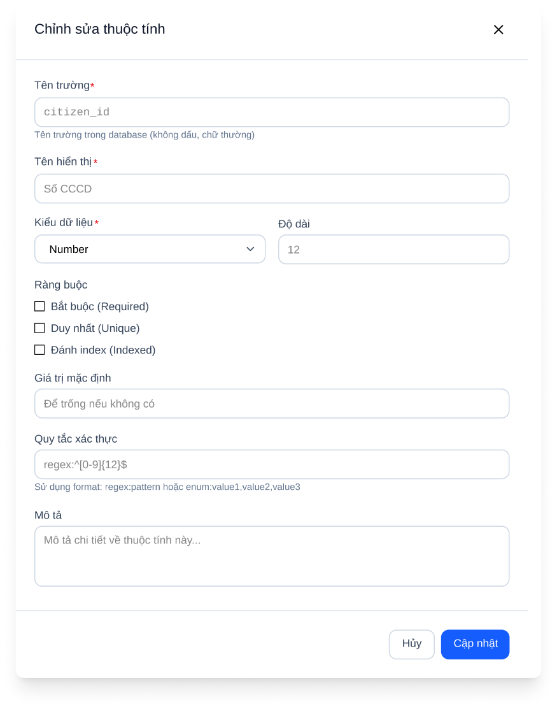

*Hình 66 – Màn sửa thông tin thuộc tính của danh mục*

###### Mô tả thông tin trên màn hình

| **STT** | **Tên trường thông tin** | **Kiểu dữ liệu** | **Bắt buộc** | **Mặc định** | **Mô tả** |
| --- | --- | --- | --- | --- | --- |
| 1 | Tên trường | Text | **x** | x | Tên định danh trong cơ sở dữ liệu (không dấu, chữ thường, dùng dấu gạch dưới). |
| 2 | Tên hiển thị | Text | **x** | x | Tên nhãn xuất hiện trên giao diện người dùng. |
| 3 | Kiểu dữ liệu | Dropdown | **x** | x | Định dạng dữ liệu (Number, String, Date, Text...). |
| 4 | Độ dài | Number |  |  | Giới hạn số lượng ký tự tối đa. |
| 5 | Ràng buộc | Checkbox |  | x | Bao gồm các tùy chọn: **Bắt buộc**, **Duy nhất**, **Đánh index**. |
| 6 | Giá trị mặc định | Text |  | x | Giá trị tự động điền nếu người dùng để trống khi nhập liệu. |
| 7 | Quy tắc xác thực | Text |  | x | Sử dụng định dạng Regex hoặc Enum để kiểm tra tính hợp lệ của dữ liệu. |
| 8 | Mô tả | Text |  | x | Giải thích ý nghĩa hoặc hướng dẫn nhập cho thuộc tính này. |

###### Chức năng trên màn hình

|  |  |  |  |
| --- | --- | --- | --- |
| **STT** | **Tên chức năng** | **Định dạng** | **Mô tả** |
| 1 | Cập nhật | Button | Kiểm tra tính hợp lệ và cập nhật thuộc tính mới vào cấu trúc thực thể. |
| 2 | Hủy | Button | Đóng popup và hủy bỏ các nội dung đang nhập. |
| 3 | Đóng (X) | Button | Thoát nhanh cửa sổ thiết lập thuộc tính. |
| 4 | Chọn Kiểu dữ liệu | Button | Thay đổi các tùy chọn kiểu dữ liệu phù hợp với mục đích lưu trữ. |

##### 4.6.2.2.4. TLDM04. Màn Xóa thông tin thuộc tính của danh mục

Màn hình

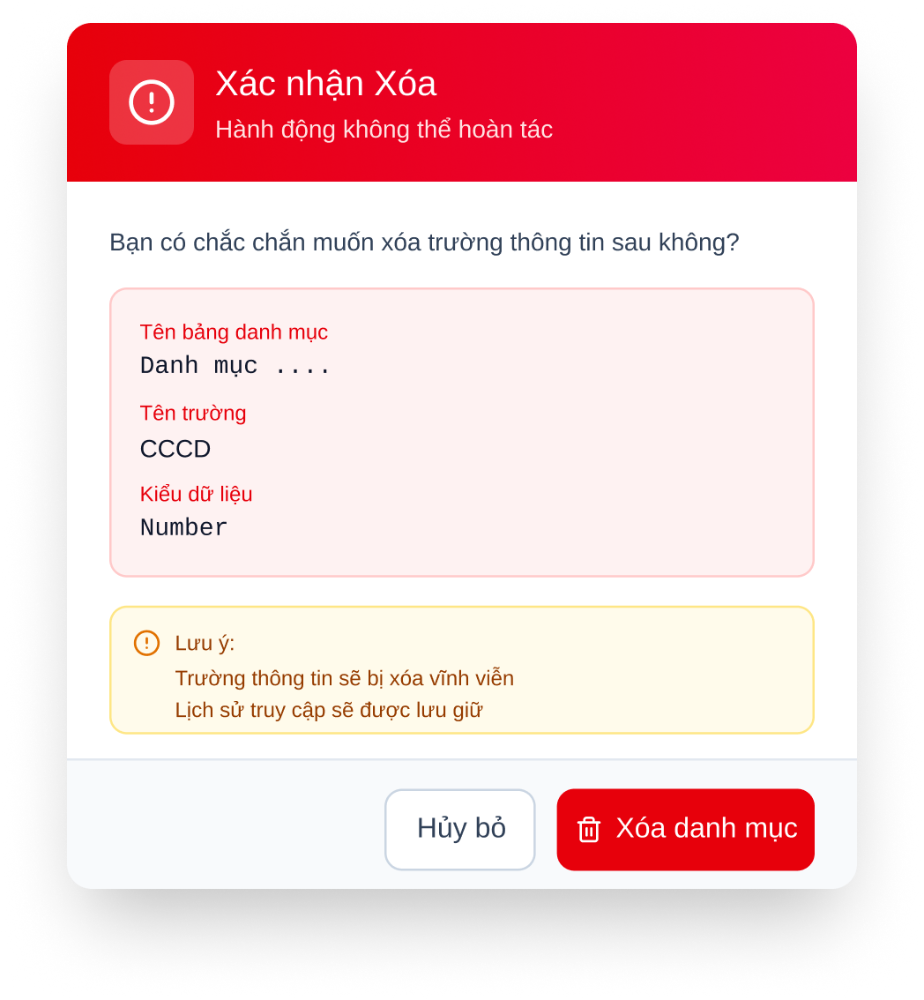

*Hình 67 – Màn Xóa thông tin thuộc tính của danh mục*

###### Mô tả thông tin trên màn hình

|  |  |  |  |  |  |
| --- | --- | --- | --- | --- | --- |
| **STT** | **Tên trường thông tin** | **Kiểu dữ liệu** | **Bắt buộc** | **Mặc định** | **Mô tả** |
| **1** | **Thông tin thực thể** |  |  |  |  |
| 1.1 | Tên bảng danh mục | Văn bản |  | x | Tên của bộ danh mục chủ chứa trường thông tin sắp xóa. |
| 1.2 | Tên trường | Văn bản |  | x | Tên hiển thị của thuộc tính cần xóa (ví dụ: CCCD). |
| 1.3 | Kiểu dữ liệu | Văn bản |  | x | Định dạng dữ liệu của thuộc tính đó (ví dụ: Number). |
| **2** | **Nội dung cảnh báo** |  |  |  |  |
| 2.1 | Tiêu đề cảnh báo | Văn bản |  | x | Thông báo mức độ nghiêm trọng của hành động. |
| 2.2 | Lưu ý | Văn bản |  | x | Cảnh báo: "Trường thông tin sẽ bị xóa vĩnh viễn" và "Lịch sử truy cập sẽ được lưu giữ". |

###### Chức năng trên màn hình

|  |  |  |  |
| --- | --- | --- | --- |
| **STT** | **Tên chức năng** | **Định dạng** | **Mô tả** |
| 1 | Xóa danh mục | Button | Thực hiện lệnh xóa vĩnh viễn thuộc tính khỏi cấu trúc danh mục. |
| 2 | Hủy bỏ | Button | Đóng popup cảnh báo và giữ nguyên thuộc tính, không thực hiện thay đổi. |
| 3 | Đóng (X) | Button | Thoát nhanh cửa sổ xác nhận mà không thực hiện thao tác xóa. |

#### 4.6.2.3. Thiết lập quan hệ

##### 4.6.2.3.1. TPQH01. Màn danh sách thiết lập quan hệ

Màn hình

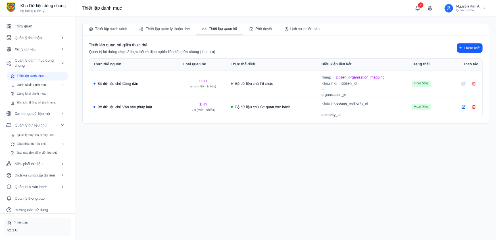

*Hình 68 – Màn danh sách thiết lập quan hệ*

###### Mô tả thông tin trên màn hình

| **STT** | **Tên trường thông tin** | **Kiểu dữ liệu** | **Bắt buộc** | **Mặc định** | **Mô tả** |
| --- | --- | --- | --- | --- | --- |
| 1 | Thực thể nguồn | Label |  | x | Tên bộ dữ liệu đóng vai trò là gốc của quan hệ (ví dụ: Bộ dữ liệu chủ Công dân). |
| 2 | Loại quan hệ | Label |  | x | Định nghĩa kiểu liên kết giữa hai thực thể (ví dụ: $n-n$, $1-n$). |
| 3 | Thực thể đích | Label |  | x | Tên bộ dữ liệu được liên kết tới (ví dụ: Bộ dữ liệu chủ Tổ chức). |
| 4 | Điều kiện liên kết | Label |  | x | Hiển thị thông tin bảng trung gian và các khóa chính ($PK$) dùng để ánh xạ dữ liệu. |
| 5 | Trạng thái | Label |  | x | Tình trạng khả dụng của mối quan hệ trên hệ thống. |

###### Chức năng trên màn hình

|  |  |  |  |
| --- | --- | --- | --- |
| **STT** | **Tên chức năng** | **Định dạng** | **Mô tả** |
| 1 | Thêm mới | Button | Mở giao diện cấu hình để thiết lập một mối quan hệ mới giữa hai thực thể dữ liệu. |
| 2 | Chỉnh sửa | Button | Cho phép thay đổi loại quan hệ hoặc cập nhật lại các khóa điều kiện liên kết. |
| 3 | Xóa | Button | Loại bỏ mối liên kết giữa các thực thể (yêu cầu xác nhận và kiểm tra ràng buộc dữ liệu). |
| 4 | Tab điều hướng | Tabs | Chuyển đổi qua lại giữa các phần: Thiết lập danh sách, Thuộc tính, Quan hệ, Phê duyệt, Lịch sử. |

##### 4.6.2.3.2. TPQH02. Màn thêm mới thiết lập quan hệ

Màn hình

*Hình 69 – Màn thêm mới thiết lập quan hệ*

###### Mô tả thông tin trên màn hình

|  |  |  |  |  |  |
| --- | --- | --- | --- | --- | --- |
| **STT** | **Tên trường thông tin** | **Kiểu dữ liệu** | **Bắt buộc** | **Mặc định** | **Mô tả** |
| **1** | **Chọn thực thể liên kết** |  |  |  |  |
| 1.1 | Thực thể nguồn | Dropdown | **Có** |  | Chọn bảng dữ liệu gốc khởi tạo quan hệ. |
| 1.2 | Thực thể đích | Dropdown | **Có** |  | Chọn bảng dữ liệu được liên kết tới. |
| **2** | **Loại quan hệ** |  |  |  |  |
| 2.1 | Chọn loại quan hệ | Dropdown | **Có** | x | Xác định kiểu liên kết: 1-1, 1-n hoặc n-n. |
| 2.2 | Giải thích quan hệ | Text | Không | x | Hiển thị diễn giải bằng ngôn ngữ tự nhiên và ví dụ thực tế (ví dụ: Một cơ quan ban hành nhiều văn bản). |
| **3** | **Điều kiện liên kết** |  |  |  |  |
| 3.1 | Khóa ngoại (Foreign Key) | Dropdown | **Có** |  | Chọn trường thông tin trong thực thể nguồn dùng để liên kết. |
| 3.2 | Khóa tham chiếu (Referenced Key) | Dropdown | **Có** |  | Chọn trường tương ứng trong thực thể đích để đối chiếu. |
| **4** | **Mô tả quan hệ** | Text | Không |  | Nhập diễn giải chi tiết về mục đích của mối quan hệ này. |

###### Chức năng trên màn hình

|  |  |  |  |
| --- | --- | --- | --- |
| **STT** | **Tên chức năng** | **Định dạng** | **Mô tả** |
| 1 | Lưu quan hệ | Button | Kiểm tra tính hợp lệ và ghi lại cấu hình quan hệ vào hệ thống. |
| 2 | Hủy | Button | Đóng popup và không lưu các thiết lập vừa nhập. |
| 3 | Đóng (X) | Button | Thoát nhanh màn hình cấu hình quan hệ. |

##### 4.6.2.3.3. TPQH02. Màn sửa thiết lập quan hệ

Màn hình

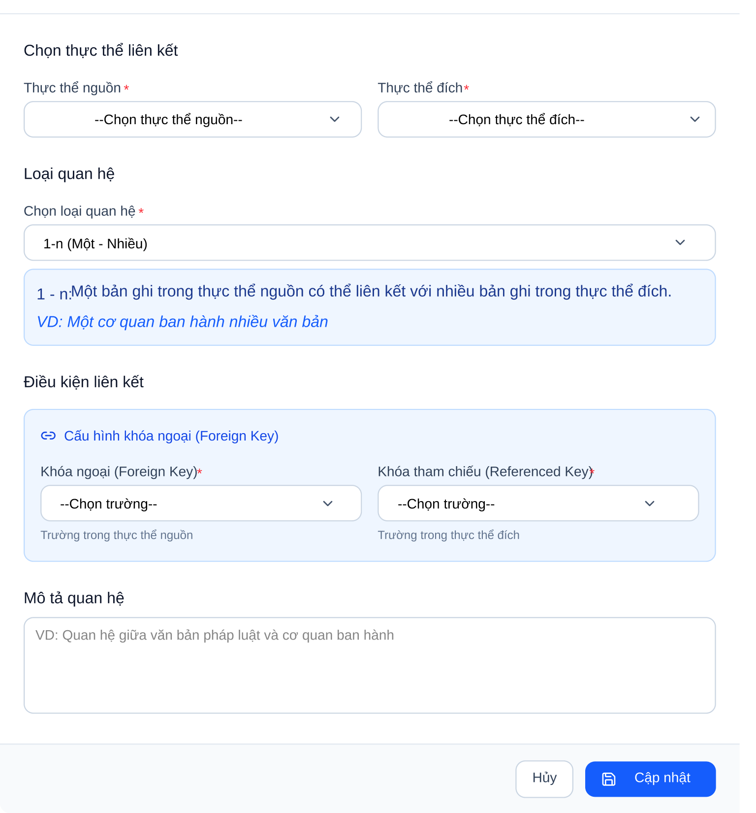

*Hình 70 – Màn sửa thiết lập quan hệ*

###### Mô tả thông tin trên màn hình

| **STT** | **Tên trường thông tin** | **Kiểu dữ liệu** | **Bắt buộc** | **Mặc định** | **Mô tả** |
| --- | --- | --- | --- | --- | --- |
| **1** | **Chọn thực thể liên kết** |  |  |  |  |
| 1.1 | Thực thể nguồn | Dropdown | **Có** |  | Chọn bảng dữ liệu gốc khởi tạo quan hệ. |
| 1.2 | Thực thể đích | Dropdown | **Có** |  | Chọn bảng dữ liệu được liên kết tới. |
| **2** | **Loại quan hệ** |  |  |  |  |
| 2.1 | Chọn loại quan hệ | Dropdown | **Có** | x | Xác định kiểu liên kết: 1-1, 1-n hoặc n-n. |
| 2.2 | Giải thích quan hệ | Text | Không | x | Hiển thị diễn giải bằng ngôn ngữ tự nhiên và ví dụ thực tế (ví dụ: Một cơ quan ban hành nhiều văn bản). |
| **3** | **Điều kiện liên kết** |  |  |  |  |
| 3.1 | Khóa ngoại (Foreign Key) | Dropdown | **Có** |  | Chọn trường thông tin trong thực thể nguồn dùng để liên kết. |
| 3.2 | Khóa tham chiếu (Referenced Key) | Dropdown | **Có** |  | Chọn trường tương ứng trong thực thể đích để đối chiếu. |
| **4** | **Mô tả quan hệ** | Text | Không |  | Nhập diễn giải chi tiết về mục đích của mối quan hệ này. |

###### Chức năng trên màn hình

|  |  |  |  |
| --- | --- | --- | --- |
| **STT** | **Tên chức năng** | **Định dạng** | **Mô tả** |
| 1 | Cập nhật | Button | Kiểm tra tính hợp lệ và cập nhật lại thông số vào hệ thống. |
| 2 | Hủy | Button | Đóng popup và không lưu các thiết lập vừa nhập. |
| 3 | Đóng (X) | Button | Thoát nhanh màn hình cấu hình quan hệ. |

##### 4.6.2.3.4. TPQH02. Màn xóa thiết lập quan hệ

Màn hình

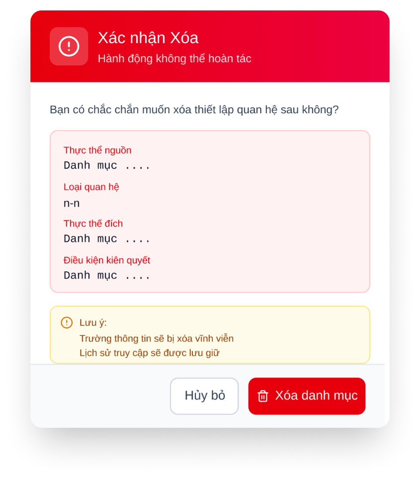

*Hình 71 – Màn xóa thiết lập quan hệ*

###### Mô tả thông tin trên màn hình

| **STT** | **Tên trường thông tin** | **Kiểu dữ liệu** | **Bắt buộc** | **Mặc định** | **Mô tả** |
| --- | --- | --- | --- | --- | --- |
| **1** | **Thông tin quan hệ** |  |  |  |  |
| 1.1 | Thực thể nguồn | Văn bản | Có | Theo bản ghi | Tên bảng dữ liệu chủ khởi tạo quan hệ (ví dụ: Danh mục ....). |
| 1.2 | Loại quan hệ | Văn bản | Có | Theo bản ghi | Kiểu liên kết hiện tại (ví dụ: n-n). |
| 1.3 | Thực thể đích | Văn bản | Có | Theo bản ghi | Tên bảng dữ liệu chủ được tham chiếu tới. |
| 1.4 | Điều kiện kiên quyết | Văn bản | Có | Theo bản ghi | Thông tin về các khóa hoặc ràng buộc bắt buộc của quan hệ. |
| **2** | **Cảnh báo & Lưu ý** |  |  |  |  |
| 2.1 | Tiêu đề xác nhận | Văn bản | Có | Xác nhận Xóa | Thông báo tiêu đề của hành động xóa. |
| 2.2 | Nội dung cảnh báo | Văn bản | Có | Cố định | Khẳng định "Hành động không thể hoàn tác" và "Trường thông tin sẽ bị xóa vĩnh viễn". |
| 2.3 | Ghi chú lịch sử | Văn bản | Có | Cố định | Thông báo "Lịch sử truy cập sẽ được lưu giữ" để phục vụ hậu kiểm. |

###### Chức năng trên màn hình

| **STT** | **Tên chức năng** | **Định dạng** | **Mô tả** |
| --- | --- | --- | --- |
| 1 | Xóa danh mục | Nút bấm (Đỏ) | Thực hiện xóa bỏ hoàn toàn thiết lập quan hệ giữa hai thực thể khỏi hệ thống. |
| 2 | Hủy bỏ | Nút bấm (Trắng) | Đóng popup, giữ nguyên thiết lập quan hệ và không thực hiện thay đổi. |
| 3 | Đóng nhanh | Icon (X) | Thoát khỏi màn hình xác nhận mà không thực hiện thao tác xóa. |

#### 4.6.2.4. Phê duyệt

##### 4.6.2.4.1. TPPD01. Màn danh sách phê duyệt danh mục

Màn hình

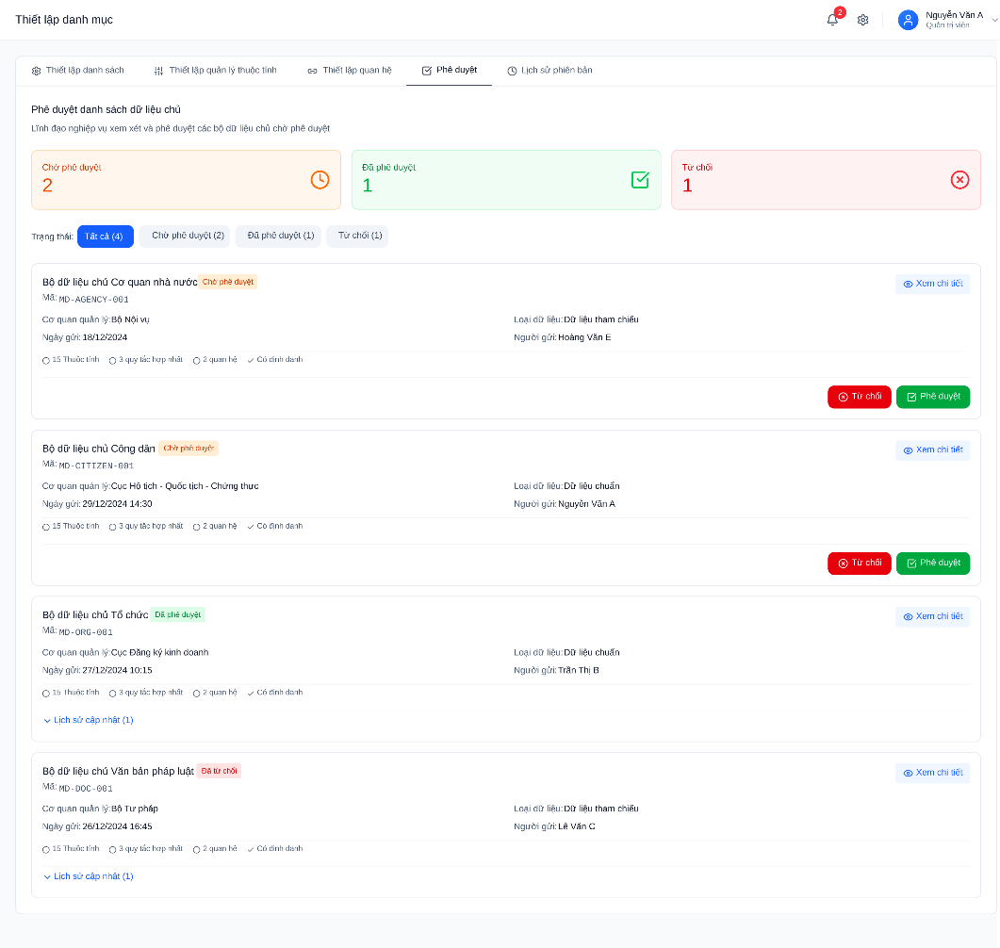

*Hình 72 – Màn danh sách phê duyệt danh mục*

###### Mô tả thông tin trên màn hình

| **STT** | **Tên trường thông tin** | **Kiểu dữ liệu** | **Bắt buộc** | **Mặc định** | **Mô tả** |
| --- | --- | --- | --- | --- | --- |
| **1** | **Bảng thống kê trạng thái** |  |  |  |  |
| 1.1 | Chờ phê duyệt | Number | Có | Theo hệ thống | Tổng số hồ sơ đang đợi xử lý. |
| 1.2 | Đã phê duyệt | Number | Có | Theo hệ thống | Tổng số hồ sơ đã được chấp thuận. |
| 1.3 | Từ chối | Number | Có | Theo hệ thống | Tổng số hồ sơ đã bị bác bỏ. |
| **2** | **Bộ lọc trạng thái (Tab)** |  |  |  |  |
| 2.1 | Trạng thái hiển thị | Label | Có | Tất cả | Lọc danh sách theo: Tất cả, Chờ phê duyệt, Đã phê duyệt, Từ chối. |
| **3** | **Danh sách hồ sơ phê duyệt** |  |  |  |  |
| 3.1 | Tên & Mã dữ liệu chủ | Label | Có | Theo bản ghi | Tên hiển thị kèm mã định danh của bộ dữ liệu (VD: MD-AGENCY-001). |
| 3.2 | Trạng thái hồ sơ | Label | Có | Chờ phê duyệt | Gắn nhãn màu sắc để nhận diện tình trạng hồ sơ. |
| 3.3 | Cơ quan quản lý | Label | Có | Theo bản ghi | Đơn vị chịu trách nhiệm cho bộ dữ liệu này. |
| 3.4 | Loại dữ liệu | Label | Có | Theo bản ghi | Phân loại dữ liệu (Dữ liệu tham chiếu, Dữ liệu chuẩn). |
| 3.5 | Ngày gửi | Date time | Có | Theo bản ghi | Thời điểm hồ sơ được gửi lên hệ thống. |
| 3.6 | Người gửi | Label | Có | Theo bản ghi | Tài khoản cán bộ thực hiện gửi yêu cầu phê duyệt. |
| 3.7 | Thông tin cấu trúc | Label | Không | Theo bản ghi | Hiển thị số lượng thuộc tính, quy tắc hợp nhất, quan hệ và định danh của bộ dữ liệu. |

###### Chức năng trên màn hình

| **STT** | **Tên chức năng** | **Định dạng** | **Mô tả** |
| --- | --- | --- | --- |
| 1 | **Phê duyệt** | Button | Chấp thuận hồ sơ ngay tại danh sách (Quick Approve). Trạng thái chuyển sang "Đã phê duyệt". |
| 2 | **Từ chối** | Button | Bác bỏ yêu cầu phê duyệt. Trạng thái chuyển sang "Từ chối". |
| 3 | **Xem chi tiết** | Button | Mở màn hình xem chi tiết toàn bộ cấu trúc và nội dung của bộ dữ liệu trước khi ra quyết định. |
| 4 | **Lịch sử cập nhật** | Button | Hiển thị danh sách các phiên bản hoặc lần chỉnh sửa trước đó (nếu có). |
| 5 | **Tab điều hướng** | Button | Chuyển đổi giữa các phân hệ: Thiết lập danh sách, Thuộc tính, Quan hệ, Phê duyệt, Lịch sử phiên bản. |

##### 4.6.2.4.2. TPPD02. Màn chi tiết yêu cầu phê duyệt

Màn hình

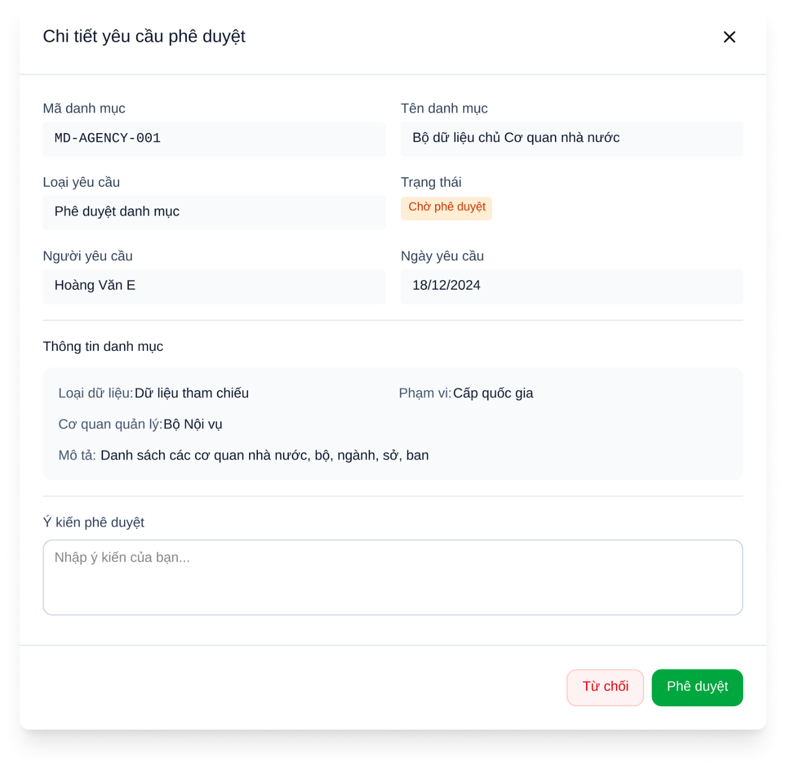

*Hình 73 – Màn chi tiết yêu cầu phê duyệt*

###### Mô tả thông tin trên màn hình

|  |  |  |  |  |  |
| --- | --- | --- | --- | --- | --- |
| **STT** | **Tên trường thông tin** | **Kiểu dữ liệu** | **Bắt buộc** | **Mặc định** | **Mô tả** |
| **1** | **Thông tin chung yêu cầu** |  |  |  |  |
| 1.1 | Mã danh mục | Label |  | x | Mã định danh của bộ dữ liệu (VD: MD-AGENCY-001). |
| 1.2 | Tên danh mục | Label |  | x | Tên đầy đủ của bộ dữ liệu chủ. |
| 1.3 | Loại yêu cầu | Label |  | x | Phân loại nghiệp vụ của hồ sơ. |
| 1.4 | Trạng thái | Label |  | x | Tình trạng hiện tại của yêu cầu. |
| 1.5 | Người yêu cầu | Label |  | x | Tên cán bộ gửi hồ sơ lên (VD: Hoàng Văn E). |
| 1.6 | Ngày yêu cầu | Date time |  | x | Thời điểm khởi tạo yêu cầu phê duyệt. |
| **2** | **Thông tin chi tiết danh mục** |  |  |  |  |
| 2.1 | Loại dữ liệu | Label |  | x | Phân loại tính chất dữ liệu (VD: Dữ liệu tham chiếu). |
| 2.2 | Phạm vi | Label |  | x | Quy mô áp dụng (VD: Cấp quốc gia). |
| 2.3 | Cơ quan quản lý | Label |  | x | Đơn vị chủ quản của bộ dữ liệu. |
| 2.4 | Mô tả | Label |  | x | Diễn giải chi tiết về mục đích và nội dung danh mục. |
| **3** | **Ý kiến phê duyệt** |  |  |  |  |
| 3.1 | Ý kiến phê duyệt | Label |  |  | Ô nhập nội dung chỉ đạo hoặc lý do đồng ý/từ chối. |

###### Chức năng trên màn hình

| **STT** | **Tên chức năng** | **Định dạng** | **Mô tả** |
| --- | --- | --- | --- |
| 1 | Phê duyệt | Button | Chấp thuận yêu cầu, cập nhật trạng thái danh mục sang "Đã phê duyệt". |
| 2 | Từ chối | Button | Bác bỏ yêu cầu, chuyển trạng thái về "Từ chối". |
| 3 | Đóng (X) | Button | Thoát khỏi màn hình chi tiết mà không thực hiện hành động nào. |

##### 4.6.2.4.3. TPPD03. Màn phê duyệt yêu cầu

Màn hình

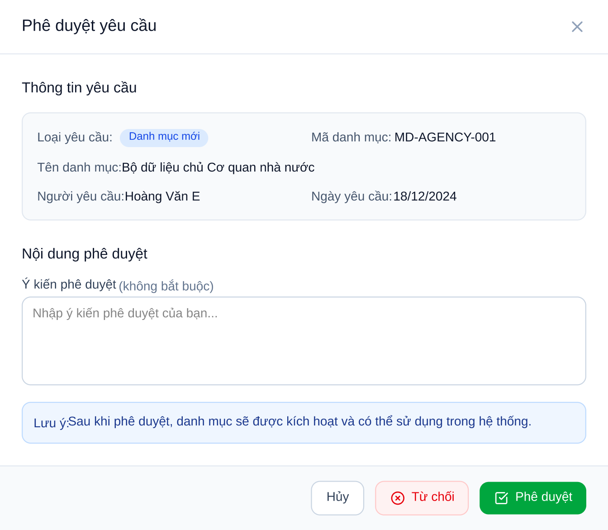

*Hình 74 – Màn sửa thiết lập quan hệ*

###### Mô tả thông tin trên màn hình

| **STT** | **Tên trường thông tin** | **Kiểu dữ liệu** | **Bắt buộc** | **Mặc định** | **Mô tả** |
| --- | --- | --- | --- | --- | --- |
| **1** | **Thông tin yêu cầu** |  |  |  |  |
| 1.1 | Loại yêu cầu | Label |  | x | Phân loại nghiệp vụ của yêu cầu. |
| 1.2 | Mã danh mục | Label |  | x | Mã định danh duy nhất của bộ dữ liệu. |
| 1.3 | Tên danh mục | Label |  | x | Tên hiển thị của danh mục dữ liệu chủ. |
| 1.4 | Người yêu cầu | Label |  | x | Tên tài khoản gửi yêu cầu phê duyệt. |
| 1.5 | Ngày yêu cầu | Date time |  | x | Ngày khởi tạo yêu cầu trên hệ thống. |
| **2** | **Nội dung phê duyệt** |  |  |  |  |
| 2.1 | Ý kiến phê duyệt | Text |  |  | Ô nhập ý kiến chỉ đạo hoặc phản hồi của người duyệt. |
| 2.2 | Ghi chú lưu ý | Label |  | x | Thông báo: "Sau khi phê duyệt, danh mục sẽ được kích hoạt...". |

###### Chức năng trên màn hình

|  |  |  |  |
| --- | --- | --- | --- |
| **STT** | **Tên chức năng** | **Định dạng** | **Mô tả** |
| 1 | Phê duyệt | Button | Xác nhận chấp thuận yêu cầu. Danh mục sẽ chuyển sang trạng thái "Hiệu lực". |
| 2 | Từ chối | Button | Bác bỏ yêu cầu. Danh mục sẽ chuyển sang trạng thái "Từ chối". |
| 3 | Hủy | Button | Đóng popup và không thực hiện bất kỳ thay đổi nào. |
| 4 | Đóng (X) | Button | Thoát nhanh cửa sổ phê duyệt. |

#### 4.6.2.5. Lịch sử phiên bản

##### 4.6.2.5.1. LSPB01. Màn danh sách lịch sử phiên bản

Màn hình

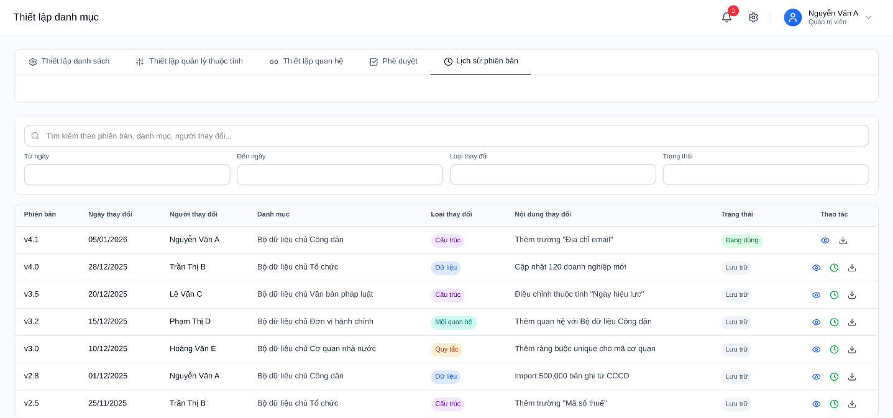

*Hình 75 – Màn danh sách lịch sử phiên bản*

###### Mô tả thông tin trên màn hình

| **STT** | **Tên trường thông tin** | **Kiểu dữ liệu** | **Bắt buộc** | **Mặc định** | **Mô tả** |
| --- | --- | --- | --- | --- | --- |
| **1** | **Thông tin danh mục** |  |  |  |  |
| 1.1 | Mã dữ liệu danh mục | Label |  | x | Mã định danh duy nhất của danh mục. |
| 1.2 | Loại yêu cầu | Label |  | x | Tính chất của hồ sơ cần xử lý. |
| 1.3 | Tên dữ liệu danh mục | Label |  | x | Tên gọi chính thức của bộ dữ liệu. |
| 1.4 | Mô tả | Label |  | x | Nội dung chi tiết về bộ danh mục. |
| 1.5 | Loại dữ liệu | Label |  | x | Phân loại danh mục (Dữ liệu chuẩn/tham chiếu). |
| 1.6 | Cơ quan quản lý | Label |  | x | Đơn vị chịu trách nhiệm nội dung. |
| 1.7 | Phạm vi | Label |  | x | Quy mô áp dụng của danh mục. |
| 1.8 | Trạng thái hiện tại | Label |  | x | Tình trạng danh mục trước khi phê duyệt hủy. |
| **2** | **Thông báo & Tác động** |  |  |  |  |
| 2.1 | Người nhận thông báo | Label | **x** | x | Những người sẽ nhận được email/system alert khi phê duyệt. |
| 2.2 | Hệ thống đang sử dụng | Label |  | x | Danh sách các phần mềm vệ tinh đang khai thác danh mục này. |
| 2.3 | Trạng thái gửi thông báo | Switch |  | x | Tùy chọn có gửi thông báo tự động hay không. |
| 2.4 | Ghi chú | Label |  |  | Ý kiến chỉ đạo hoặc lý do phê duyệt/hủy. |

###### Chức năng trên màn hình

|  |  |  |  |
| --- | --- | --- | --- |
| **STT** | **Tên chức năng** | **Định dạng** | **Mô tả** |
| 1 | Phê duyệt | Button | Đồng ý cho phép danh mục hết hiệu lực. Trạng thái danh mục chuyển sang "Hết hiệu lực". |
| 2 | Hủy phê duyệt | Button | Bác bỏ yêu cầu hủy hiệu lực. Danh mục vẫn giữ nguyên trạng thái "Hiệu lực". |
| 3 | Hủy | Button | Đóng màn hình mà không thực hiện thao tác nào. |

##### 4.6.2.5.2. LSPD02. Xem chi tiết lịch sử phiên bản

Màn hình

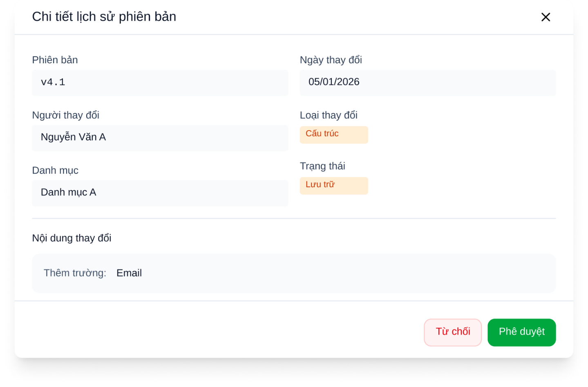

*Hình 76 – Màn chi tiết lịch sử phiên bản*

###### Mô tả thông tin trên màn hình

|  |  |  |  |  |  |
| --- | --- | --- | --- | --- | --- |
| **STT** | **Tên trường thông tin** | **Kiểu dữ liệu** | **Bắt buộc** | **Mặc định** | **Mô tả** |
| **1** | **Thông tin danh mục** |  |  |  |  |
| 1.1 | Mã | Label |  | x | Mã định danh duy nhất của bộ dữ liệu. |
| 1.2 | Tên | Label |  | x | Tên hiển thị của danh mục đơn vị hành chính. |
| 1.3 | Loại | Label |  | x | Phân loại tính chất của bộ dữ liệu. |
| 1.4 | Cơ quan quản lý | Label |  | x | Đơn vị chủ quản chịu trách nhiệm nội dung. |
| 1.5 | Phạm vi | Label |  | x | Quy mô sử dụng của bộ dữ liệu. |
| **2** | **Nội dung công khai** |  |  |  |  |
| 2.1 | Ghi chú công khai | Label |  |  | Nhập mục đích hoặc nội dung cần lưu ý khi chia sẻ danh mục này. |

###### Chức năng trên màn hình

| **STT** | **Tên chức năng** | **Định dạng** | **Mô tả** |
| --- | --- | --- | --- |
| 1 | Xác nhận công khai | Button | Hoàn tất quy trình, chuyển trạng thái danh mục sang "Công khai" để các bên có thể khai thác. |
| 2 | Hủy | Button | Đóng popup và giữ danh mục ở trạng thái nội bộ. |
| 3 | Đóng (X) | Button | Thoát nhanh cửa sổ công khai. |

##### 4.6.2.5.3. LSPD03. Gửi yêu cầu khôi phục phiên bản

Màn hình

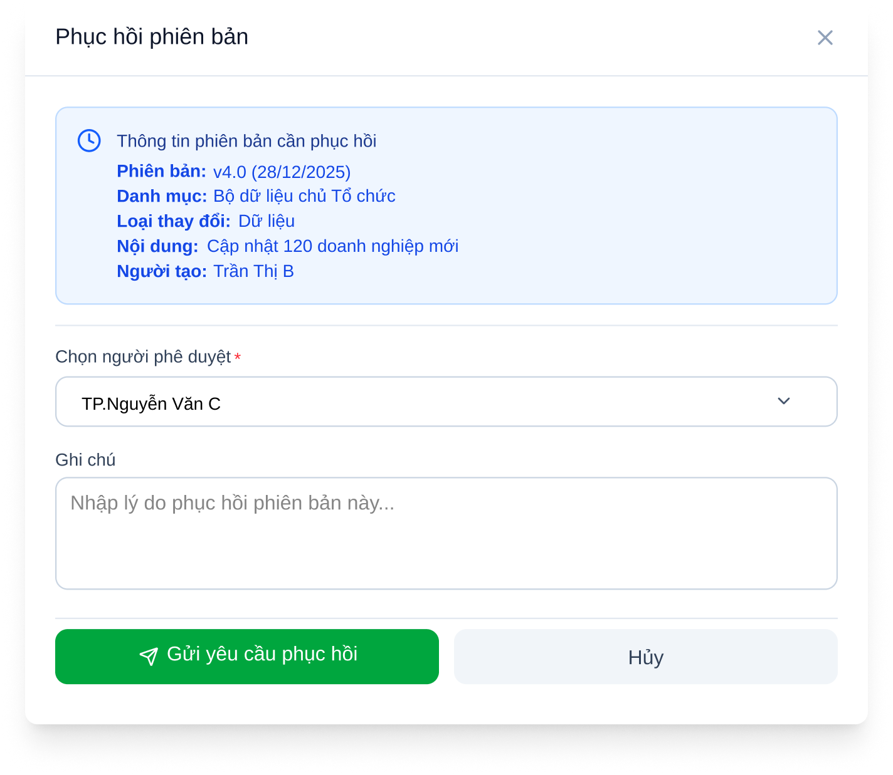

*Hình 77 – Khôi phục phiên bản*

###### Mô tả thông tin trên màn hình

| **STT** | **Tên trường thông tin** | **Kiểu dữ liệu** | **Bắt buộc** | **Mặc định** | **Mô tả** |
| --- | --- | --- | --- | --- | --- |
| **1** | **Thông tin phiên bản cần phục hồi** |  |  |  |  |
| 1.1 | Phiên bản | Label |  | x | Hiển thị mã phiên bản và ngày tạo (ví dụ: v4.0 (28/12/2025)). |
| 1.2 | Danh mục | Label |  | x | Tên bộ dữ liệu tương ứng với phiên bản. |
| 1.3 | Loại thay đổi | Label |  | x | Phân loại hình thức thay đổi của phiên bản. |
| 1.4 | Nội dung | Label |  | x | Chi tiết các cập nhật trong phiên bản. |
| 1.5 | Người tạo | Label |  | x | Tên người dùng đã tạo ra phiên bản này. |
| **2** | **Thông tin yêu cầu** |  |  |  |  |
| 2.1 | Chọn người phê duyệt | Dropdown | x |  | Danh sách người có thẩm quyền phê duyệt yêu cầu. |
| 2.2 | Ghi chú | Textarea |  |  | Nhập lý do hoặc nội dung giải trình phục hồi phiên bản. |

###### Chức năng trên màn hình

|  |  |  |  |
| --- | --- | --- | --- |
| **STT** | **Tên chức năng** | **Định dạng** | **Mô tả** |
| 1 | Gửi yêu cầu phục hồi | Button | Gửi lệnh phục hồi phiên bản đến người phê duyệt đã chọn. |
| 2 | Hủy | Button | Đóng cửa sổ và hủy bỏ các thông tin vừa nhập. |
| 3 | Đóng (X) | Button | Thoát nhanh khỏi màn hình Phục hồi phiên bản. |

##### 4.6.2.5.4. LSPD04. Phê duyệt khôi phục phiên bản

Màn hình

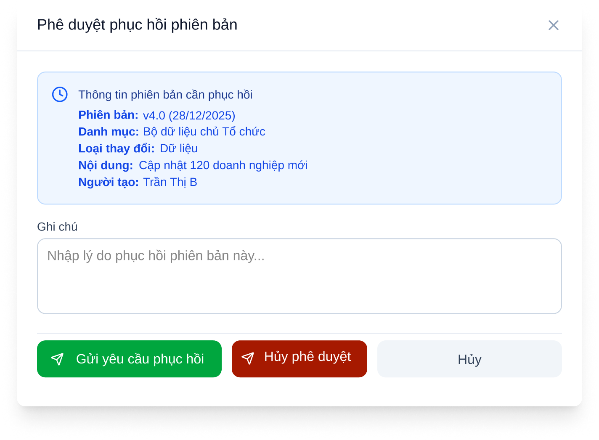

*Hình 78 – Phê duyệt Khôi phục phiên bản*

###### Mô tả thông tin trên màn hình

| **STT** | **Tên trường thông tin** | **Kiểu dữ liệu** | **Bắt buộc** | **Mặc định** | **Mô tả** |
| --- | --- | --- | --- | --- | --- |
| **1** | **Thông tin phiên bản cần phục hồi** |  |  |  | Hiển thị thông tin tổng quan của phiên bản được chọn để phục hồi. |
| 1.1 | Phiên bản | Label |  | x | Hiển thị số hiệu phiên bản và ngày tạo (Ví dụ: v4.0 (28/12/2025)). |
| 1.2 | Danh mục | Label |  | x | Tên bộ dữ liệu của phiên bản (Ví dụ: Bộ dữ liệu chủ Tổ chức). |
| 1.3 | Loại thay đổi | Label |  | x | Phân loại nội dung thay đổi (Ví dụ: Dữ liệu). |
| 1.4 | Nội dung | Label |  | x | Mô tả chi tiết các thay đổi trong phiên bản. |
| 1.5 | Người tạo | Label |  | x | Tên người dùng thực hiện tạo phiên bản. |
| **2** | **Thông tin yêu cầu/phê duyệt** |  |  |  |  |
| 2.1 | Chọn người phê duyệt | Dropdown | x |  | Danh sách lãnh đạo/người có thẩm quyền phê duyệt (Chỉ xuất hiện ở màn hình yêu cầu phục hồi). |
| 2.2 | Ghi chú | Textbox |  |  | Nhập lý do phục hồi hoặc lý do từ chối phê duyệt. |

###### Chức năng trên màn hình

|  |  |  |  |
| --- | --- | --- | --- |
| **STT** | **Tên chức năng** | **Định dạng** | **Mô tả** |
| 1 | Gửi yêu cầu phục hồi | Button | Gửi yêu cầu phục hồi phiên bản tới người phê duyệt đã chọn. |
| 2 | Hủy phê duyệt | Button | Từ chối yêu cầu phục hồi phiên bản (Chỉ xuất hiện ở màn hình phê duyệt). |
| 3 | Hủy | Button | Đóng popup và không thực hiện bất kỳ thay đổi nào. |
| 4 | Đóng (X) | Button | Thoát nhanh khỏi cửa sổ hiện tại. |

#### 4.6.2.6. Danh sách danh mục

#### 4.6.2.7. Công khai danh mục

##### 4.6.2.7.1. CKDM01. Màn danh sách danh mục được công khai

Màn hình

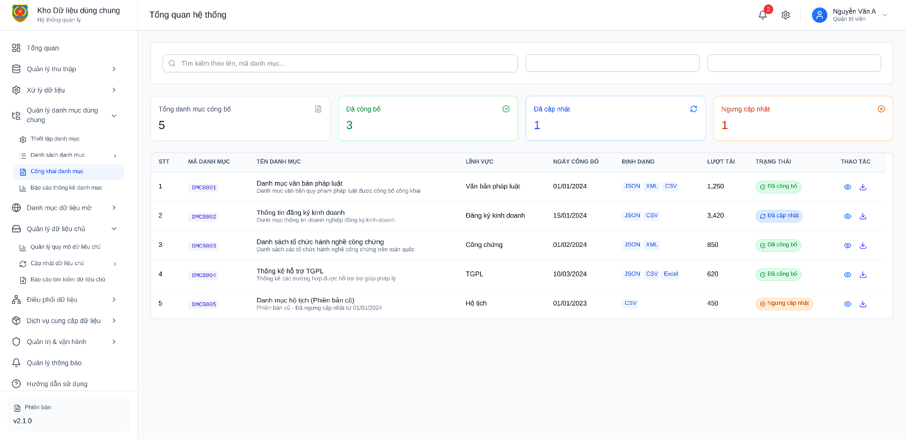

*Hình 79 – Màn danh sách danh mục được công khai*

##### Mô tả thông tin trên màn hình

|  |  |  |  |  |  |
| --- | --- | --- | --- | --- | --- |
| **STT** | **Tên trường thông tin** | **Kiểu dữ liệu** | **Bắt buộc** | **Mặc định** | **Mô tả** |
| **1** | **Thông số thống kê** |  |  |  | Hiển thị tổng số lượng danh mục theo từng trạng thái. |
| 1.1 | Tổng danh mục công bố | Number |  | 5 | Tổng số lượng danh mục hiện có trên hệ thống. |
| 1.2 | Đã công bố | Number |  | 3 | Số lượng danh mục đang ở trạng thái hoạt động công khai. |
| 1.3 | Đã cập nhật | Number |  | 1 | Số lượng danh mục vừa có sự thay đổi hoặc cập nhật mới. |
| 1.4 | Ngưng cập nhật | Number |  | 1 | Số lượng danh mục đã tạm dừng cập nhật dữ liệu. |
| **2** | **Danh sách danh mục** | **Bảng** |  |  | Hiển thị chi tiết thông tin các danh mục. |
| 2.1 | STT | Number |  | x | Số thứ tự của danh mục trong danh sách. |
| 2.2 | Mã danh mục | Label |  | x | Mã định danh duy nhất (Ví dụ: DMCB001). |
| 2.3 | Tên danh mục | Label |  | x | Tên đầy đủ và mô tả ngắn gọn của danh mục. |
| 2.4 | Lĩnh vực | Label |  | x | Phân loại lĩnh vực quản lý (Văn bản pháp luật, Hộ tịch...). |
| 2.5 | Ngày công bố | Date |  | x | Ngày danh mục được đưa lên hệ thống. |
| 2.6 | Định dạng | Label |  | x | Các loại tệp tin hỗ trợ (JSON, XML, CSV, Excel). |
| 2.7 | Lượt tải | Number |  | x | Tổng số lượt người dùng đã tải danh mục này. |
| 2.8 | Trạng thái | Label |  | x | Tình trạng hiện tại: Đã công bố, Đã cập nhật, Ngưng cập nhật. |

##### Chức năng trên màn hình

| **STT** | **Tên chức năng** | **Định dạng** | **Mô tả** |
| --- | --- | --- | --- |
| 1 | Tìm kiếm | Textbox | Nhập tên hoặc mã danh mục để lọc nhanh dữ liệu trong danh sách. |
| 2 | Lọc theo tiêu chí | Dropdown | Các ô lọc bổ sung để giới hạn phạm vi danh sách hiển thị. |
| 3 | Xem chi tiết (Biểu tượng mắt) | Button | Chuyển đến màn hình xem thông tin chi tiết của danh mục tương ứng. |
| 4 | Tải về (Biểu tượng download) | Button | Thực hiện tải dữ liệu danh mục về máy tính. |
| 5 | Thông báo (Biểu tượng chuông) | Button | Xem các tin nhắn hoặc cập nhật mới từ hệ thống. |
| 6 | Tài khoản người dùng | Dropdown | Hiển thị thông tin người dùng đang đăng nhập và các tùy chọn cá nhân. |

##### 4.6.2.7.2. CKDM01. Màn chi tiết thông tin danh mục được công khai

Màn hình

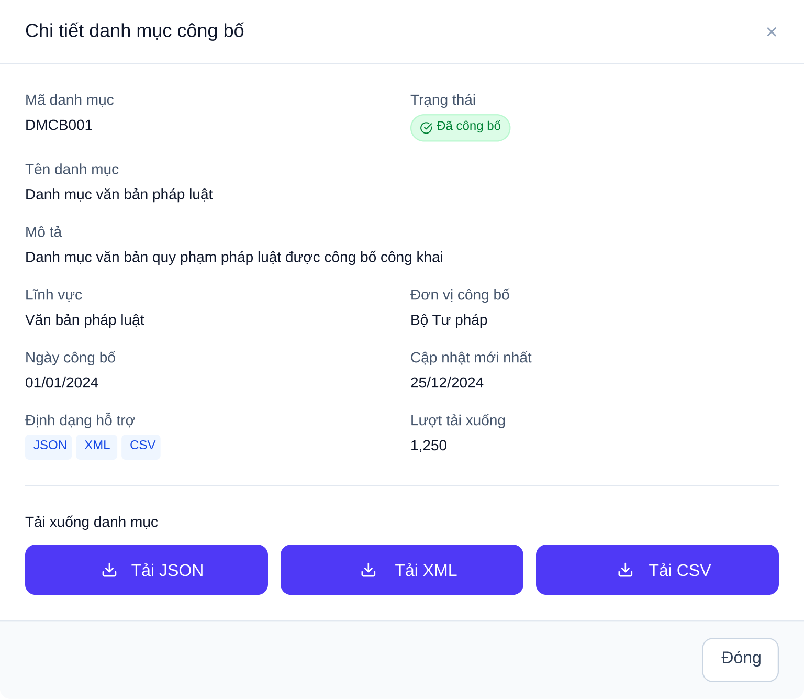

*Hình 80 – Màn chi tiết thông tin danh mục được công khai*

##### Mô tả thông tin trên màn hình

| **STT** | **Tên trường thông tin** | **Kiểu dữ liệu** | **Bắt buộc** | **Mặc định** | **Mô tả** |
| --- | --- | --- | --- | --- | --- |
| **1** | **Thông tin chung** |  |  |  | Hiển thị các thông tin định danh và phân loại của danh mục. |
| 1.1 | Mã danh mục | Label |  | x | Mã định danh duy nhất (ví dụ: DMCB001). |
| 1.2 | Trạng thái | Label |  | x | Tình trạng hiện tại (ví dụ: Đã công bố). |
| 1.3 | Tên danh mục | Label |  | x | Tên đầy đủ của danh mục công bố. |
| 1.4 | Mô tả | Label |  | x | Nội dung tóm tắt chi tiết về danh mục. |
| 1.5 | Lĩnh vực | Label |  | x | Nhóm chuyên môn quản lý danh mục. |
| 1.6 | Đơn vị công bố | Label |  | x | Tên cơ quan chịu trách nhiệm phát hành dữ liệu. |
| 1.7 | Ngày công bố | Date |  | x | Ngày dữ liệu bắt đầu được công khai. |
| 1.8 | Cập nhật mới nhất | Date |  | x | Ngày gần nhất dữ liệu có sự thay đổi. |
| 1.9 | Định dạng hỗ trợ | Tag |  | x | Các loại tệp tin hệ thống cung cấp (JSON, XML, CSV). |
| 1.10 | Lượt tải xuống | Number |  | x | Tổng số lần người dùng đã tải danh mục này. |

##### Chức năng trên màn hình

|  |  |  |  |
| --- | --- | --- | --- |
| **STT** | **Tên chức năng** | **Định dạng** | **Mô tả** |
| 1 | Tải JSON | Button | Thực hiện tải tệp tin dữ liệu theo định dạng JSON về máy tính. |
| 2 | Tải XML | Button | Thực hiện tải tệp tin dữ liệu theo định dạng XML về máy tính. |
| 3 | Tải CSV | Button | Thực hiện tải tệp tin dữ liệu theo định dạng CSV về máy tính. |
| 4 | Đóng | Button | Đóng cửa sổ chi tiết để quay lại màn hình danh sách. |
| 5 | Đóng (X) | Button | Thoát nhanh khỏi popup chi tiết danh mục. |

#### 4.6.2.8. Báo cáo thống kê danh mục

##### 4.6.2.8.1. BCTKDM01. Màn báo cáo thống kê danh mục dùng chung

Màn hình

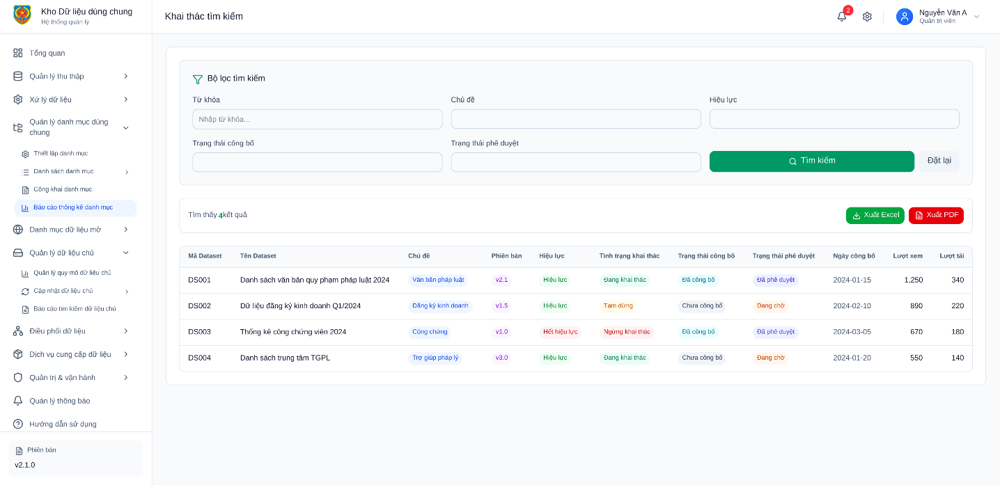

Hình 81 – Màn báo cáo thống kê danh mục dùng chung

##### Mô tả thông tin trên màn hình

| **STT** | **Tên trường thông tin** | **Kiểu dữ liệu** | **Bắt buộc** | **Mặc định** | **Mô tả** |
| --- | --- | --- | --- | --- | --- |
| **1** | **Bộ lọc tìm kiếm** |  |  |  | Các tiêu chí để giới hạn danh sách kết quả hiển thị. |
| 1.1 | Từ khóa | Textbox |  |  | Nhập từ khóa để tìm kiếm theo mã hoặc tên Dataset. |
| 1.2 | Chủ đề | Dropdown |  |  | Lọc danh mục theo các nhóm chủ đề (ví dụ: Văn bản pháp luật, Đăng ký kinh doanh...). |
| 1.3 | Hiệu lực | Dropdown |  |  | Lọc theo tình trạng pháp lý (Hiệu lực, Hết hiệu lực). |
| 1.4 | Trạng thái công bố | Dropdown |  |  | Lọc theo tình trạng đã phát hành dữ liệu (Đã công bố, Chưa công bố). |
| 1.5 | Trạng thái phê duyệt | Dropdown |  |  | Lọc theo tiến độ phê duyệt nội dung (Đã phê duyệt, Đang chờ). |
| **2** | **Danh sách kết quả** | **Bảng** |  |  |  |
| 2.1 | Mã danh mục | Label |  | x | Mã định danh duy nhất của bộ dữ liệu (ví dụ: DS001). |
| 2.2 | Tên danh mục | Label |  | x | Tên đầy đủ của bộ dữ liệu công bố. |
| 2.3 | Chủ đề | Tag |  | x | Phân loại chủ đề tương ứng của Dataset. |
| 2.4 | Phiên bản | Link |  | x | Số hiệu phiên bản hiện hành của danh mục. |
| 2.5 | Hiệu lực | Tag |  | x | Trạng thái hiệu lực của dữ liệu (Hiệu lực/Hết hiệu lực). |
| 2.6 | Tình trạng khai thác | Tag |  | x | Trạng thái sử dụng (Đang khai thác, Tạm dừng, Ngừng khai thác). |
| 2.7 | Trạng thái công bố | Tag |  | x | Tình trạng phát hành của bộ dữ liệu. |
| 2.8 | Trạng thái phê duyệt | Tag |  | x | Tình trạng kiểm duyệt nội dung. |
| 2.9 | Ngày công bố | Date |  | x | Ngày công bố được đưa lên hệ thống công khai. |
| 2.10 | Lượt xem | Number |  | x | Tổng số lượt truy cập xem thông tin Mã danh mục. |
| 2.11 | Lượt tải | Number |  | x | Tổng số lượt người dùng tải dữ liệu về. |

##### Chức năng trên màn hình

|  |  |  |  |
| --- | --- | --- | --- |
| **STT** | **Tên chức năng** | **Định dạng** | **Mô tả** |
| 1 | Tìm kiếm | Button | Kích hoạt lọc dữ liệu dựa trên các tiêu chí đã nhập/chọn trong bộ lọc. |
| 2 | Đặt lại | Button | Xóa nhanh các tiêu chí đang chọn trong bộ lọc về trạng thái ban đầu. |
| 3 | Xuất Excel | Button | Kết xuất toàn bộ danh sách kết quả đang hiển thị ra tệp tin định dạng Excel (.xlsx). |
| 4 | Xuất PDF | Button | Kết xuất danh sách kết quả đang hiển thị ra tệp tin định dạng PDF (.pdf). |

## 4.7. Quản lý danh mục dữ liệu mở

### 4.7.1. Mục đích

Chức năng quản lý danh mục dữ liệu mở nhằm xây dựng, quản lý và công bố **danh mục các tập dữ liệu mở** trong kho dữ liệu dùng chung (DLDC), phục vụ việc **chia sẻ, khai thác và sử dụng dữ liệu** theo định hướng dữ liệu mở, bảo đảm tuân thủ các quy định hiện hành về công khai, minh bạch và an toàn thông tin.

Thông qua chức năng này, hệ thống:

* Quản lý tập trung danh mục các tập dữ liệu được xác định là dữ liệu mở;
* Hỗ trợ việc phân loại, mô tả, cập nhật và công bố dữ liệu mở một cách thống nhất;
* Đảm bảo dữ liệu mở được cung cấp **đúng phạm vi, đúng mức độ mở**, không làm lộ dữ liệu mật, dữ liệu hạn chế chia sẻ;
* Tạo điều kiện cho các tổ chức, cá nhân trong và ngoài ngành tiếp cận, khai thác và sử dụng dữ liệu mở;
* Góp phần thúc đẩy minh bạch thông tin, đổi mới sáng tạo và phát triển các dịch vụ, ứng dụng dựa trên dữ liệu.

#### 4.7.1.1. Phân quyền

Việc quản lý danh mục dữ liệu mở được thực hiện theo cơ chế phân quyền, phù hợp với vai trò và trách nhiệm của từng đối tượng sử dụng.

**Cán bộ quản trị được phân quyền** có trách nhiệm:

* Khai báo, cập nhật, điều chỉnh và quản lý danh mục các tập dữ liệu mở;
* Xác định phạm vi, mức độ mở của từng tập dữ liệu theo quy định;
* Thực hiện công bố, tạm dừng hoặc thu hồi dữ liệu mở khi cần thiết;
* Quản lý thông tin mô tả (metadata) của dữ liệu mở;
* Theo dõi, giám sát việc công bố và khai thác dữ liệu mở;
* Quản lý lịch sử thay đổi, cập nhật danh mục dữ liệu mở.

Các tổ chức, cá nhân khai thác dữ liệu mở được truy cập và sử dụng dữ liệu theo đúng phạm vi, mục đích và quy định đã công bố.

#### 4.7.1.2. Điều kiện thực hiện

Việc quản lý và công bố danh mục dữ liệu mở được thực hiện khi đáp ứng đầy đủ các điều kiện sau:

* Cán bộ thực hiện đã được **cấp quyền quản trị danh mục dữ liệu mở** trong hệ thống;
* Các tập dữ liệu được lựa chọn công bố đã được **rà soát, phân loại và đánh giá mức độ mở**, bảo đảm không thuộc danh mục dữ liệu mật, dữ liệu hạn chế chia sẻ;
* Dữ liệu mở đã được chuẩn hóa, làm sạch và sẵn sàng khai thác;
* Có quy định, quy trình hoặc văn bản phê duyệt về việc công bố dữ liệu mở;
* Hệ thống đáp ứng yêu cầu kỹ thuật để công bố, cung cấp và quản lý dữ liệu mở;
* Có cơ chế theo dõi, ghi nhận và quản lý lịch sử công bố dữ liệu mở phục vụ công tác kiểm tra, giám sát.

### 4.7.2. Thiết lập danh mục dữ liệu mở

#### 4.7.2.1. Danh sách thiết lập danh mục dữ liệu mở

##### 4.7.2.1.1. DMDLM_01. Màn danh sách thiết lập danh mục dữ liệu mở

Màn hình

Hình 82 – Màn danh sách thiết lập danh mục dữ liệu mở

###### Mô tả thông tin trên màn hình

|  |  |  |  |  |  |
| --- | --- | --- | --- | --- | --- |
| **STT** | **Tên trường thông tin** | **Kiểu dữ liệu** | **Bắt buộc** | **Mặc định** | **Mô tả** |
| **1** | **Tab điều hướng** |  |  |  | Chuyển đổi giữa các danh sách quản lý. |
| 1.1 | Danh sách thiết lập | Tab |  | x | Hiển thị số lượng danh mục đang thiết lập (ví dụ: 3). |
| 1.2 | Phê duyệt thiết lập | Tab |  |  | Hiển thị số lượng danh mục đang chờ phê duyệt (ví dụ: 5). |
| 1.3 | Lịch sử thay đổi thiết lập | Tab |  |  | Hiển thị số lượng bản ghi lịch sử (ví dụ: 10). |
| **2** | **Danh sách thiết lập** | **Bảng** |  |  | Hiển thị chi tiết các danh mục dữ liệu mở đã thiết lập. |
| 2.1 | STT | Số |  | x | Số thứ tự của bản ghi trong danh sách. |
| 2.2 | Mã danh mục | Label |  | x | Mã định danh duy nhất (Ví dụ: ODC001). |
| 2.3 | Tên danh mục | Label |  | x | Tên và mô tả ngắn gọn của danh mục dữ liệu mở. |
| 2.4 | Lĩnh vực | Label |  | x | Phân loại lĩnh vực (Lĩnh vực A, B, C...). |
| 2.5 | Tần suất cập nhật | Tag |  | x | Chu kỳ cập nhật dữ liệu (Hàng tháng, Hàng quý, Hàng năm). |
| 2.6 | Trạng thái | Tag |  | x | Tình trạng hoạt động (Hoạt động, Hàng tháng, Ngừng hoạt động). |

###### Chức năng trên màn hình

|  |  |  |  |
| --- | --- | --- | --- |
| **STT** | **Tên chức năng** | **Định dạng** | **Mô tả** |
| 1 | Tìm kiếm | Textbox | Tìm nhanh danh mục theo tên hoặc mã danh mục. |
| 2 | Thêm danh mục mới | Button | Mở form để thực hiện thiết lập một danh mục dữ liệu mở mới vào hệ thống. |
| 3 | Xem chi tiết | Button | Xem thông tin cấu hình chi tiết của danh mục. |
| 4 | Chỉnh sửa | Button | Thay đổi thông tin thiết lập của danh mục đã chọn. |
| 5 | Xóa | Button | Gỡ bỏ thiết lập danh mục khỏi danh sách. |
| 6 | Gửi phê duyệt | Button | Gửi yêu cầu phê duyệt thiết lập cho cấp quản lý. |
| 7 | Phê duyệt nhanh | Button | Thực hiện phê duyệt ngay thiết lập (tùy theo phân quyền). |
| 8 | Từ chối/Ngừng | Button | Từ chối phê duyệt hoặc tạm ngừng hoạt động của danh mục. |

##### 4.7.2.1.2. DMDLM_01. Màn thêm mới thiết lập danh mục dữ liệu mở

Màn hình

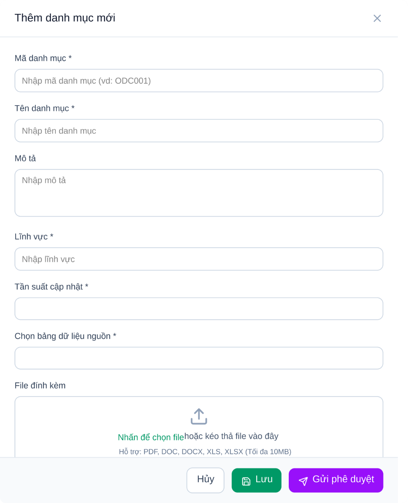

Hình 83 – Màn thêm mới thiết lập danh mục dữ liệu mở

###### Mô tả thông tin trên màn hình

|  |  |  |  |  |  |
| --- | --- | --- | --- | --- | --- |
| **STT** | **Tên trường thông tin** | **Kiểu dữ liệu** | **Bắt buộc** | **Mặc định** | **Mô tả** |
| **1** | **Thông tin cơ bản** |  |  |  |  |
| 1.1 | Mã danh mục | Textbox | x |  | Nhập mã định danh duy nhất (ví dụ: ODC001). |
| 1.2 | Tên danh mục | Textbox | x |  | Nhập tên hiển thị đầy đủ của danh mục. |
| 1.3 | Mô tả | Textarea |  |  | Nhập nội dung giới thiệu chi tiết về danh mục. |
| 1.4 | Lĩnh vực | Textbox | x |  | Nhập hoặc chọn lĩnh vực quản lý tương ứng. |
| 1.5 | Tần suất cập nhật | Dropdown | x |  | Thiết lập chu kỳ cập nhật dữ liệu (ví dụ: Hàng tháng). |
| **2** | **Cấu hình dữ liệu** |  |  |  |  |
| 2.1 | Chọn bảng dữ liệu nguồn | Dropdown/Text | x |  | Liên kết danh mục với nguồn dữ liệu gốc trong hệ thống. |
| 2.2 | File đính kèm | Upload |  |  | Khu vực tải lên tài liệu mô tả hoặc tệp mẫu (Hỗ trợ PDF, DOC, DOCX, XLS, XLSX tối đa 10MB). |

###### Chức năng trên màn hình

|  |  |  |  |
| --- | --- | --- | --- |
| **STT** | **Tên chức năng** | **Định dạng** | **Mô tả** |
| 1 | Nhấn để chọn file | Button | Mở trình duyệt file trên máy tính để chọn tài liệu đính kèm. |
| 2 | Gửi phê duyệt | Button | Lưu thông tin và chuyển trạng thái sang "Chờ phê duyệt". |
| 3 | Lưu | Button | Lưu tạm thời các thông tin đã nhập vào danh sách thiết lập (trạng thái Nháp). |
| 4 | Hủy | Button | Hủy bỏ các thao tác vừa nhập và đóng popup. |
| 5 | Đóng (X) | Button | Thoát nhanh màn hình thêm mới. |

##### 4.7.2.1.3. DMDLM_01. Màn chi tiết thiết lập danh mục dữ liệu mở

Màn hình

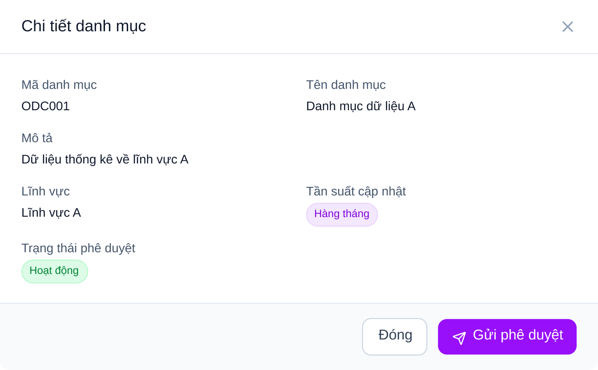

Hình 84 – Màn chi tiết thiết lập danh mục dữ liệu mở

###### Mô tả thông tin trên màn hình

| **STT** | **Tên trường thông tin** | **Kiểu dữ liệu** | **Bắt buộc** | **Mặc định** | **Mô tả** |
| --- | --- | --- | --- | --- | --- |
| **1** | **Thông tin danh mục** |  |  |  |  |
| 1.1 | Mã danh mục | Label |  | x | Mã định danh duy nhất của danh mục (Ví dụ: ODC001). |
| 1.2 | Tên danh mục | Label |  | x | Tên đầy đủ của danh mục dữ liệu mở (Ví dụ: Danh mục dữ liệu A). |
| 1.3 | Mô tả | Label |  | x | Nội dung tóm tắt chi tiết về danh mục (Ví dụ: Dữ liệu thống kê về lĩnh vực A). |
| 1.4 | Lĩnh vực | Label |  | x | Nhóm chuyên môn quản lý (Ví dụ: Lĩnh vực A). |
| 1.5 | Tần suất cập nhật | Tag |  | x | Chu kỳ cập nhật dữ liệu (Ví dụ: Hàng tháng). |
| 1.6 | Trạng thái phê duyệt | Tag |  | x | Tình trạng hiện tại của thiết lập (Ví dụ: Hoạt động). |

###### Chức năng trên màn hình

| **STT** | **Tên chức năng** | **Định dạng** | **Mô tả** |
| --- | --- | --- | --- |
| 1 | Gửi phê duyệt | Button | Gửi yêu cầu phê duyệt các thiết lập của danh mục này tới cấp quản lý. |
| 2 | Đóng | Button | Thoát khỏi màn hình xem chi tiết và quay lại danh sách chính. |
| 3 | Đóng (X) | Icon | Nút thoát nhanh ở góc trên bên phải popup. |

##### 4.7.2.1.4. DMDLM_01. Màn sửa thiết lập danh mục dữ liệu mở

Màn hình

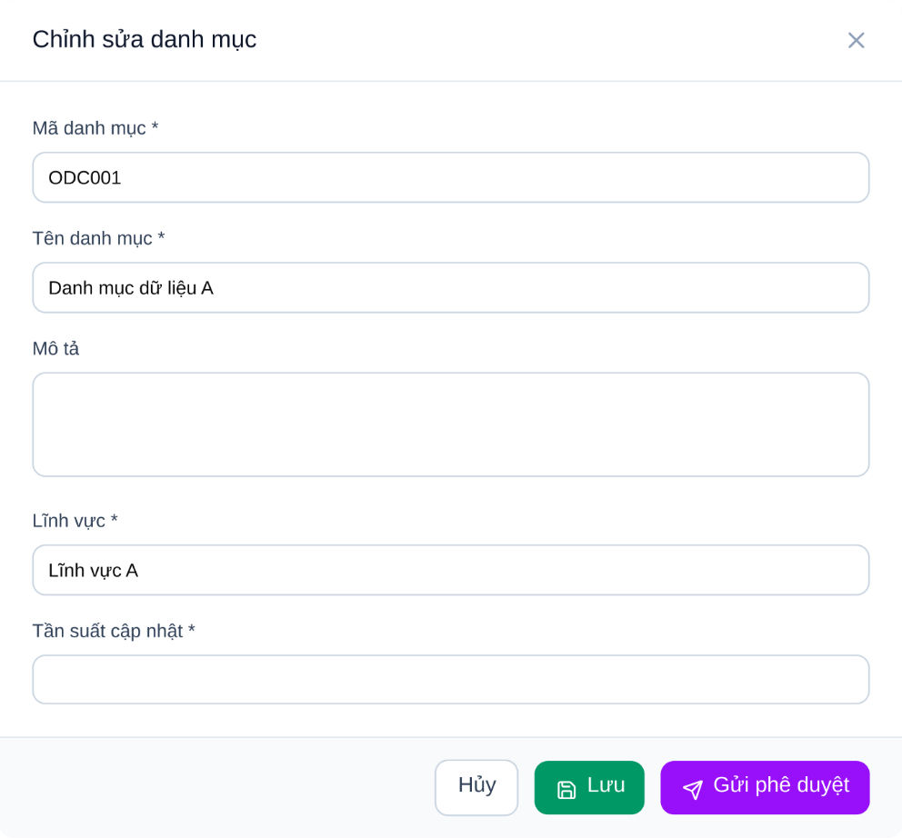

Hình 85 – Màn sửa thiết lập danh mục dữ liệu mở

###### Mô tả thông tin trên màn hình

|  |  |  |  |  |  |
| --- | --- | --- | --- | --- | --- |
| **STT** | **Tên trường thông tin** | **Kiểu dữ liệu** | **Bắt buộc** | **Mặc định** | **Mô tả** |
| 1 | Mã danh mục | Textbox | x | x | Nhập mã định danh duy nhất cho danh mục. |
| 2 | Tên danh mục | Textbox | x | x | Nhập tên hiển thị chính thức của danh mục. |
| 3 | Mô tả | Textarea |  |  | Nhập nội dung giới thiệu chi tiết về dữ liệu trong danh mục. |
| 4 | Lĩnh vực | Textbox | x | x | Nhập hoặc chọn lĩnh vực chuyên môn quản lý dữ liệu này. |
| 5 | Tần suất cập nhật | Textbox | x |  | Thiết lập chu kỳ cập nhật dữ liệu định kỳ. |

###### Chức năng trên màn hình

|  |  |  |  |
| --- | --- | --- | --- |
| **STT** | **Tên chức năng** | **Định dạng** | **Mô tả** |
| 1 | Hủy | Button | Hủy bỏ các thay đổi vừa nhập và đóng cửa sổ chỉnh sửa. |
| 2 | Lưu | Button | Lưu các thông tin đã chỉnh sửa vào hệ thống (trạng thái Nháp/Cập nhật). |
| 3 | Gửi phê duyệt | Button | Lưu thay đổi và gửi yêu cầu phê duyệt nội dung mới tới cấp quản lý. |
| 4 | Đóng (X) | Button | Thoát nhanh khỏi màn hình chỉnh sửa danh mục. |

##### 4.7.2.1.5. DMDLM_01. Màn xóa thiết lập danh mục dữ liệu mở

Màn hình

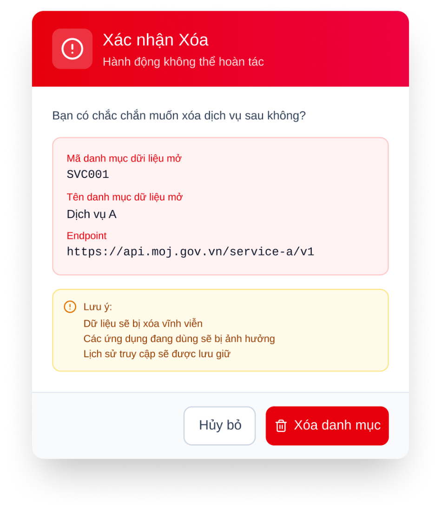

Hình 86 – Màn xóa thiết lập danh mục dữ liệu mở

###### Mô tả thông tin trên màn hình

| **STT** | **Tên trường thông tin** | **Kiểu dữ liệu** | **Bắt buộc** | **Mặc định** | **Mô tả** |
| --- | --- | --- | --- | --- | --- |
| **1** | **Tiêu đề cảnh báo** | Label |  | x | Hiển thị "Xác nhận Xóa" kèm dòng cảnh báo "Hành động không thể hoàn tác". |
| **2** | **Nội dung đối tượng** |  |  |  | Chứa thông tin định danh của dịch vụ cần xóa. |
| 2.1 | Mã danh mục dữ liệu mở | Label |  | x | Mã định danh của dịch vụ (ví dụ: SVC001). |
| 2.2 | Tên danh mục dữ liệu mở | Label |  | x | Tên hiển thị của dịch vụ (ví dụ: Dịch vụ A). |
| 2.3 | Endpoint | Label |  | x | Đường dẫn API liên kết với dịch vụ. |
| **3** | **Lưu ý quan trọng** | Label |  | x | Cảnh báo: Dữ liệu bị xóa vĩnh viễn, ảnh hưởng đến các ứng dụng đang dùng, nhưng lịch sử truy cập vẫn được lưu giữ. |

###### Chức năng trên màn hình

|  |  |  |  |
| --- | --- | --- | --- |
| **STT** | **Tên chức năng** | **Định dạng** | **Mô tả** |
| 1 | Xóa danh mục | Button | Thực hiện xóa vĩnh viễn dịch vụ và các dữ liệu liên quan khỏi hệ thống. |
| 2 | Hủy bỏ | Button | Đóng popup và giữ nguyên trạng thái của dịch vụ. |

##### 4.7.2.1.6. DMDLM_01. Màn gửi trình duyệt thiết lập danh mục dữ liệu mở

Màn hình

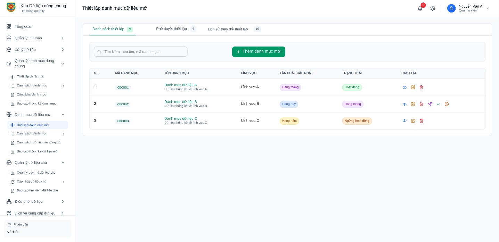

Hình 87 – Màn danh sách thiết lập danh mục dữ liệu mở

###### Mô tả thông tin trên màn hình

| **STT** | **Tên trường thông tin** | **Kiểu dữ liệu** | **Bắt buộc** | **Mặc định** | **Mô tả** |
| --- | --- | --- | --- | --- | --- |
| **1** | **Thông tin danh mục trình duyệt** |  |  |  | Hiển thị tóm tắt đối tượng đang thực hiện trình duyệt. |
| 1.1 | Danh mục | Label |  | x | Tên của danh mục dữ liệu mở cần trình duyệt. |
| 1.2 | Mã | Label |  | x | Mã định danh duy nhất của danh mục tương ứng. |
| **2** | **Thông tin trình duyệt** |  |  |  |  |
| 2.1 | Người phê duyệt | Dropdown | x | x | Danh sách lựa chọn lãnh đạo hoặc người có thẩm quyền phê duyệt thiết lập. |
| 2.2 | Nội dung trình duyệt | Text |  |  | Nhập nội dung đề xuất hoặc giải trình gửi tới người phê duyệt (Ví dụ: Đề nghị Lãnh đạo xem xét...). |

###### Chức năng trên màn hình

|  |  |  |  |
| --- | --- | --- | --- |
| **STT** | **Tên chức năng** | **Định dạng** | **Mô tả** |
| 1 | Gửi phê duyệt | Button | Lưu thông tin và gửi yêu cầu trình duyệt đến tài khoản người phê duyệt đã chọn. |
| 2 | Hủy | Button | Đóng popup và hủy bỏ các nội dung vừa nhập, trạng thái danh mục không thay đổi. |
| 3 | Đóng (X) | Button | Thoát nhanh khỏi màn hình trình duyệt danh mục. |

#### 4.7.2.2. Phê duyệt thiết lập danh mục dữ liệu mở

##### 4.7.2.2.1. PDDMM_01. Màn danh sách phê duyệt thiết lập danh mục dữ liệu mở

Màn hình

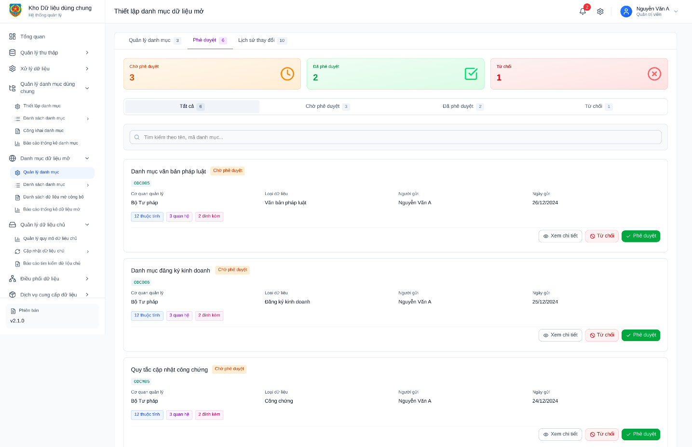

Hình 88 – Màn danh sách phê duyệt thiết lập danh mục dữ liệu mở

###### Mô tả thông tin trên màn hình

| **STT** | **Tên trường thông tin** | **Kiểu dữ liệu** | **Bắt buộc** | **Mặc định** | **Mô tả** |
| --- | --- | --- | --- | --- | --- |
| **1** | **Số liệu thống kê** |  |  |  | Hiển thị tổng số lượng bản ghi theo trạng thái. |
| 1.1 | Chờ phê duyệt | Number |  | 3 | Số lượng danh mục đang đợi xử lý. |
| 1.2 | Đã phê duyệt | Number |  | 2 | Số lượng danh mục đã được chấp thuận. |
| 1.3 | Từ chối | Number |  | 1 | Số lượng danh mục không được phê duyệt. |
| **2** | **Thẻ thông tin danh mục** |  |  |  | Chi tiết từng yêu cầu phê duyệt. |
| 2.1 | Tên danh mục | Label |  | x | Tên bộ dữ liệu cần phê duyệt (ví dụ: Danh mục văn bản pháp luật). |
| 2.2 | Mã danh mục | Label |  | x | Mã định danh duy nhất (ví dụ: ODC005). |
| 2.3 | Cơ quan quản lý | Label |  | x | Đơn vị chủ quản của bộ dữ liệu. |
| 2.4 | Loại dữ liệu | Label |  | x | Phân loại nội dung dữ liệu. |
| 2.5 | Người gửi | Label |  | x | Tên tài khoản thực hiện gửi yêu cầu trình duyệt. |
| 2.6 | Ngày gửi | Date |  | x | Thời gian yêu cầu được gửi lên hệ thống. |
| 2.7 | Chỉ số phụ | Tag |  | x | Hiển thị số lượng thuộc tính, quan hệ và định kèm. |

###### Chức năng trên màn hình

|  |  |  |  |
| --- | --- | --- | --- |
| **STT** | **Tên chức năng** | **Định dạng** | **Mô tả** |
| 1 | Tab điều hướng | Tab | Chuyển đổi giữa các danh sách: Quản lý danh mục, Phê duyệt, Lịch sử thay đổi. |
| 2 | Bộ lọc trạng thái | Button | Lọc nhanh danh sách theo các nút: Tất cả, Chờ phê duyệt, Đã phê duyệt, Từ chối. |
| 3 | Tìm kiếm | Textbox | Tìm kiếm yêu cầu phê duyệt theo tên hoặc mã danh mục. |
| 4 | Xem chi tiết | Button | Mở popup hiển thị đầy đủ thông tin cấu hình của danh mục. |
| 5 | Từ chối | Button | Không chấp thuận yêu cầu và cho phép nhập lý do từ chối. |
| 6 | Phê duyệt | Button | Xác nhận chấp thuận thiết lập danh mục để đưa vào sử dụng. |

##### 4.7.2.2.2. PDDMM_02. Màn chi tiết thiết lập danh mục dữ liệu mở

Màn hình

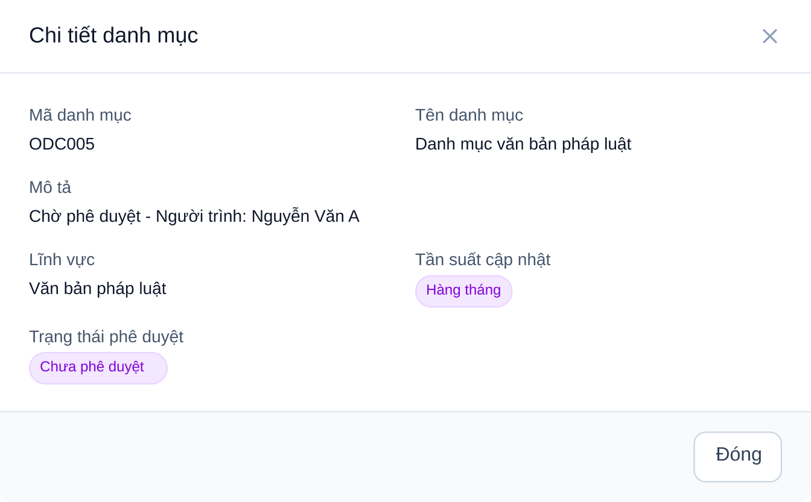

Hình 89 – Màn chi tiết thiết lập danh mục dữ liệumở

###### Mô tả thông tin trên màn hình

|  |  |  |  |  |  |
| --- | --- | --- | --- | --- | --- |
| **STT** | **Tên trường thông tin** | **Kiểu dữ liệu** | **Bắt buộc** | **Mặc định** | **Mô tả** |
| 1 | Mã danh mục | Label |  | x | Mã định danh duy nhất của danh mục cần phê duyệt. |
| 2 | Tên danh mục | Label |  | x | Tên đầy đủ của danh mục (Ví dụ: Danh mục văn bản pháp luật). |
| 3 | Mô tả | Label |  | x | Trạng thái hiện tại và thông tin người gửi trình duyệt (Ví dụ: Chờ phê duyệt - Người trình: Nguyễn Văn A). |
| 4 | Lĩnh vực | Label |  | x | Lĩnh vực chuyên môn mà danh mục này thuộc về. |
| 5 | Tần suất cập nhật | Tag |  | x | Chu kỳ cập nhật dữ liệu được thiết lập cho danh mục này. |
| 6 | Trạng thái phê duyệt | Tag |  | x | Tình trạng xử lý hiện tại của bản ghi thiết lập. |

###### Chức năng trên màn hình

|  |  |  |  |
| --- | --- | --- | --- |
| **STT** | **Tên chức năng** | **Định dạng** | **Mô tả** |
| 1 | Đóng | Button | Thoát khỏi popup chi tiết và quay lại màn hình danh sách phê duyệt. |
| 2 | Đóng (X) | Icon | Nút tắt nhanh cửa sổ ở góc trên bên phải. |

##### 4.7.2.2.3. PDDMM_03. Màn phê duyệt thiết lập danh mục dữ liệu mở

Màn hình

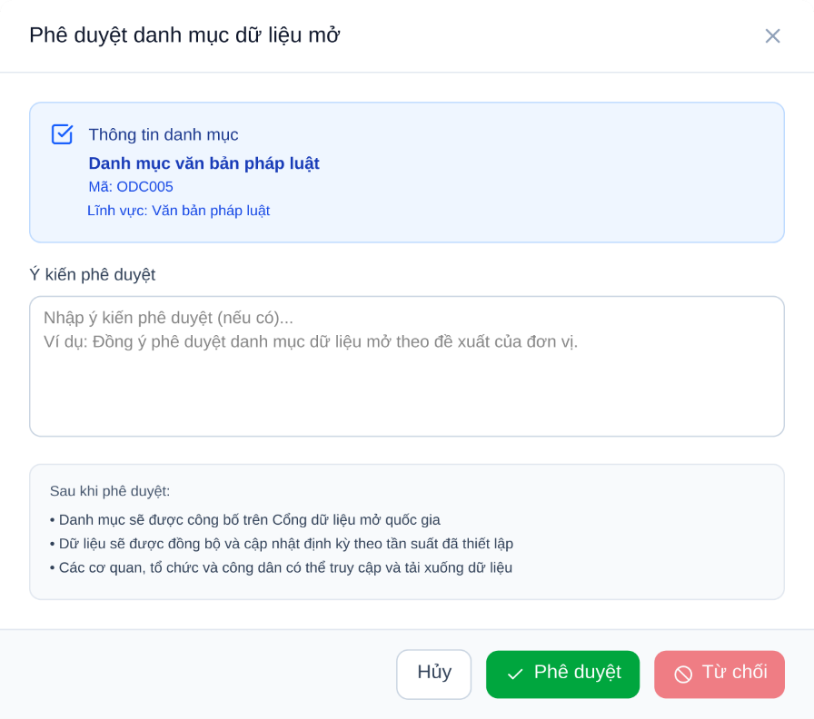

Hình 90 – Màn phê duyệt thiết lập danh mục dữ liệu mở

###### Mô tả thông tin trên màn hình

| **STT** | **Tên trường thông tin** | **Kiểu dữ liệu** | **Bắt buộc** | **Mặc định** | **Mô tả** |
| --- | --- | --- | --- | --- | --- |
| **1** | **Thông tin danh mục** |  |  |  | Hiển thị tóm tắt đối tượng đang được xem xét phê duyệt. |
| 1.1 | Tên danh mục | Label |  | x | Tên đầy đủ của bộ dữ liệu mở cần phê duyệt. |
| 1.2 | Mã | Label |  | x | Mã định danh duy nhất của danh mục. |
| 1.3 | Lĩnh vực | Label |  | x | Lĩnh vực chuyên môn quản lý của danh mục này. |
| **2** | **Ý kiến phê duyệt** |  |  |  |  |
| 2.1 | Nhập ý kiến phê duyệt | Textarea |  |  | Ô nhập nội dung nhận xét hoặc lý do phê duyệt/từ chối từ cấp quản lý. |
| **3** | **Thông tin hậu kiểm** | Label |  | x | Các lưu ý sau khi phê duyệt: Công bố trên Cổng dữ liệu mở quốc gia, đồng bộ dữ liệu định kỳ, và quyền truy cập của cộng đồng. |

###### Chức năng trên màn hình

|  |  |  |  |
| --- | --- | --- | --- |
| **STT** | **Tên chức năng** | **Định dạng** | **Mô tả** |
| 1 | Phê duyệt | Button | Xác nhận chấp thuận thiết lập danh mục, chuyển trạng thái sang "Hoạt động" và thực hiện các quy trình công bố dữ liệu. |
| 2 | Từ chối | Button | Không chấp thuận thiết lập danh mục dựa trên ý kiến đã nhập. |
| 3 | Hủy | Button | Đóng popup và không thực hiện bất kỳ thay đổi nào về trạng thái. |
| 4 | Đóng (X) | Icon | Thoát nhanh khỏi màn hình phê duyệt. |

#### 4.7.2.3. Lịch sử thay đổi thiết lập danh mục

##### 4.7.2.3.1. LSTLDM_01. Màn Lịch sử thiết lập danh mục dữ liệu mở

Màn hình

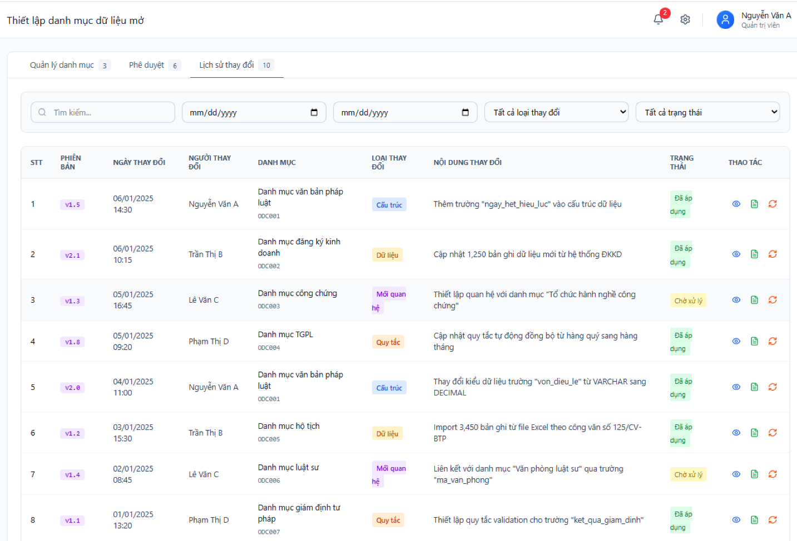

Hình 91 – Màn lịch sử thiết lập danh mục dữ liệu mở

###### Mô tả thông tin trên màn hình

| **STT** | **Tên trường thông tin** | **Kiểu dữ liệu** | **Bắt buộc** | **Mặc định** | **Mô tả** |
| --- | --- | --- | --- | --- | --- |
| **1** | **Bộ lọc tìm kiếm** |  |  |  | Công cụ giới hạn danh sách lịch sử hiển thị. |
| 1.1 | Tìm kiếm | Textbox |  |  | Nhập từ khóa để tìm theo tên danh mục hoặc nội dung thay đổi. |
| 1.2 | Từ ngày - Đến ngày | Date |  | x | Lọc các bản ghi thay đổi trong một khoảng thời gian cụ thể. |
| 1.3 | Loại thay đổi | Dropdown |  | x | Lọc theo tính chất cập nhật: Cấu trúc, Dữ liệu, Mối quan hệ, Quy tắc. |
| 1.4 | Trạng thái | Dropdown |  | x | Lọc theo tình trạng áp dụng: Đã áp dụng, Chờ xử lý. |
| **2** | **Danh sách lịch sử** | **Bảng** |  |  | Hiển thị chi tiết từng phiên bản thay đổi. |
| 2.1 | STT | Số |  | x | Số thứ tự bản ghi. |
| 2.2 | Phiên bản | Tag |  | x | Số hiệu phiên bản (ví dụ: v1.5, v2.1). |
| 2.3 | Ngày thay đổi | DateTime |  | x | Thời gian chính xác thực hiện việc cập nhật. |
| 2.4 | Người thay đổi | Label |  | x | Họ và tên tài khoản thực hiện thao tác. |
| 2.5 | Danh mục | Label |  | x | Tên và mã danh mục bị tác động (ví dụ: ODC001). |
| 2.6 | Loại thay đổi | Tag |  | x | Phân loại hạng mục thay đổi (Cấu trúc, Dữ liệu...). |
| 2.7 | Nội dung thay đổi | Label |  | x | Mô tả chi tiết hành động đã thực hiện. |
| 2.8 | Trạng thái | Tag |  | x | Tình trạng của phiên bản thay đổi. |

###### Chức năng trên màn hình

|  |  |  |  |
| --- | --- | --- | --- |
| **STT** | **Tên chức năng** | **Định dạng** | **Mô tả** |
| 1 | Tab điều hướng | Tab | Chuyển đổi qua lại giữa Quản lý danh mục, Phê duyệt và Lịch sử. |
| 2 | Xem chi tiết | Button | Xem thông tin đầy đủ về cấu hình của phiên bản đó. |
| 3 | Xem nhật ký | Button | Xem log chi tiết hoặc tệp tin đính kèm liên quan đến thay đổi. |
| 4 | Phục hồi phiên bản | Button | Thực hiện khôi phục dữ liệu/cấu trúc về phiên bản đã chọn. |

##### 4.7.2.3.2. LSTLDM_02. Màn Xem chi tiết lịch sử thiết lập danh mục dữ liệu mở

### 4.7.3. Danh sách danh mục

### 4.7.4. Danh sách dữ liệu mở công bố

### 4.7.5. Báo cáo thống kê dữ liệu mở

## 4.8. Quản lý dữ liệu chủ

## 4.9. Điều phối dữ liệu

### 4.9.1. Dịch vụ cung cấp dữ liệu

#### 4.9.1.1. Mục đích

Chức năng dịch vụ cung cấp dữ liệu nhằm hỗ trợ việc **cung cấp, chia sẻ và khai thác dữ liệu** từ kho dữ liệu dùng chung (DLDC) cho các **hệ thống trong ngành và ngoài ngành** theo đúng quy định, đảm bảo tính **đồng bộ, chính xác và an toàn thông tin**.

Thông qua chức năng này, hệ thống:

* Cung cấp dữ liệu từ kho DLDC cho các hệ thống, ứng dụng và đơn vị khai thác trong và ngoài ngành thông qua các phương thức phù hợp;
* Đảm bảo dữ liệu được cung cấp **đúng phạm vi, đúng đối tượng, đúng mục đích sử dụng** theo phân quyền;
* Hỗ trợ **đối soát, kiểm tra và xác nhận dữ liệu đã cung cấp**, đảm bảo tính toàn vẹn, nhất quán giữa dữ liệu trong kho DLDC và dữ liệu tại hệ thống tiếp nhận;
* Quản lý, theo dõi và lưu trữ **nhật ký cung cấp dữ liệu**, phục vụ công tác giám sát, báo cáo và truy vết khi cần thiết.

##### 4.9.1.1.1. Phân quyền

Việc cung cấp và đối soát dữ liệu từ kho DLDC được thực hiện theo cơ chế phân quyền chặt chẽ, phù hợp với vai trò và trách nhiệm của từng đối tượng sử dụng.

**Cán bộ quản trị được phân quyền** có trách nhiệm:

* Thiết lập, cấu hình và quản lý các dịch vụ cung cấp dữ liệu cho hệ thống trong và ngoài ngành;
* Phân quyền truy cập, khai thác và sử dụng dữ liệu theo từng hệ thống, đơn vị và mục đích sử dụng;
* Quản lý danh sách các hệ thống, đơn vị được phép tiếp nhận dữ liệu từ kho DLDC;
* Theo dõi, giám sát và thực hiện **đối soát dữ liệu đã cung cấp**, đảm bảo tính đầy đủ, chính xác và nhất quán của dữ liệu;
* Quản lý nhật ký, lịch sử cung cấp dữ liệu và phối hợp xử lý các vấn đề phát sinh trong quá trình cung cấp dữ liệu.

Các đơn vị, hệ thống khai thác dữ liệu chỉ được truy cập và sử dụng dữ liệu trong phạm vi quyền hạn đã được cấp.

##### 4.9.1.1.2. Điều kiện thực hiện

Việc cung cấp dữ liệu từ kho DLDC được thực hiện khi đáp ứng đầy đủ các điều kiện sau:

* Cán bộ thực hiện đã được **cấp quyền quản trị hoặc khai thác dịch vụ cung cấp dữ liệu** theo quy định;
* Có thỏa thuận, Text chấp thuận hoặc quy định cụ thể về việc chia sẻ, cung cấp dữ liệu giữa các đơn vị liên quan (đối với hệ thống ngoài ngành);
* Các hệ thống tiếp nhận dữ liệu đáp ứng yêu cầu kỹ thuật về kết nối, bảo mật và tích hợp dữ liệu;
* Dữ liệu cung cấp đã được kiểm tra, chuẩn hóa và sẵn sàng khai thác trong kho DLDC;
* Có cơ chế ghi nhận, theo dõi và **đối soát dữ liệu cung cấp** để phục vụ công tác giám sát, báo cáo và truy vết khi cần thiết.

#### 4.9.1.2. Cung cấp danh mục

#### 4.9.1.3. Cung cấp DLDC

#### 4.9.1.4. Đối soát dữ liệu cung cấp

##### 4.9.1.4.1. Quản lý danh sách đối soát dữ liệu

###### 4.9.1.4.1.1. DSCC01. Màn quản lý đối soát dữ liệu cung cấp

Màn hình thông tin chung

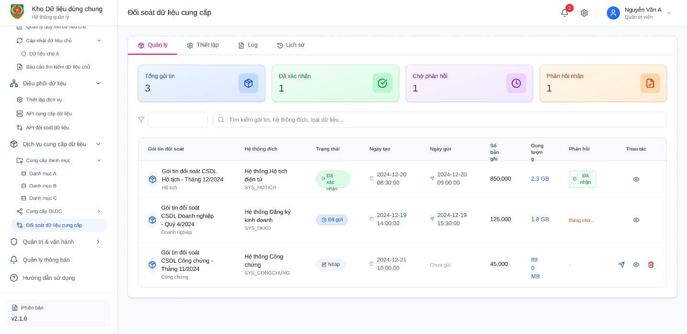

Hình 92 Màn quản lý danh sách đối soát dữ liệu cung cấp

###### Mô tả thông tin trên màn hình

| **STT** | **Tên trường thông tin** | **Kiểu dữ liệu** | **Bắt buộc** | **Mặc định** | **Mô tả** |
| --- | --- | --- | --- | --- | --- |
| 1 | Tổng bộ dữ liệu | Number |  | X | Tổng số lượng các bộ dữ liệu đang thực hiện đối soát. |
| 2 | Khớp dữ liệu | Number |  | X | Số lượng bộ dữ liệu có thông tin trùng khớp hoàn toàn giữa các bên. |
| 3 | Không khớp | Number |  | X | Số lượng bộ dữ liệu phát hiện có sai lệch thông tin. |
| 4 | Lỗi | Number |  | X | Số lượng bộ dữ liệu gặp lỗi kỹ thuật trong quá trình đối soát. |
| 5 | Mã bộ dữ liệu | Text |  | X | Mã định danh và tên gọi của bộ dữ liệu đối soát. |
| 6 | Hệ thống cung cấp | Text |  | X | Tên và mã hệ thống nguồn cung cấp dữ liệu. |
| 7 | Loại dữ liệu | Text |  | X | Phân loại dữ liệu (Hộ tịch, Doanh nghiệp, Công chứng...). |
| 8 | Số bản ghi | Number |  | X | Tổng số lượng bản ghi có trong bộ dữ liệu. |
| 9 | Ngày nhận | Date time |  | X | Thời điểm hệ thống nhận được dữ liệu để đối soát. |
| 10 | Trạng thái | Label |  | x | Tình trạng đối soát (Khớp dữ liệu, Không khớp, Lỗi nghiêm trọng...). |

###### Chức năng trên màn hình

|  |  |  |  |
| --- | --- | --- | --- |
| **STT** | **Tên chức năng** | **Định dạng** | **Mô tả** |
| 1 | Tìm kiếm | Text | Tìm kiếm theo mã bộ dữ liệu, hệ thống cung cấp hoặc loại dữ liệu. |
| 2 | Bộ lọc | Button | Lọc danh sách theo các tiêu chí trạng thái hoặc thời gian cụ thể. |
| 3 | Xem chi tiết | Button | Mở màn hình xem kết quả đối soát chi tiết của từng bộ dữ liệu. |
| 4 | Xem thông báo lỗi | Button | Hiển thị chi tiết nội dung lỗi đối với các bộ dữ liệu có trạng thái "Lỗi" hoặc "Không khớp". |

###### 4.9.1.4.1.2. DSCC01. Màn chi tiết đối soát dữ liệu cung cấp

Màn hình thông tin chung

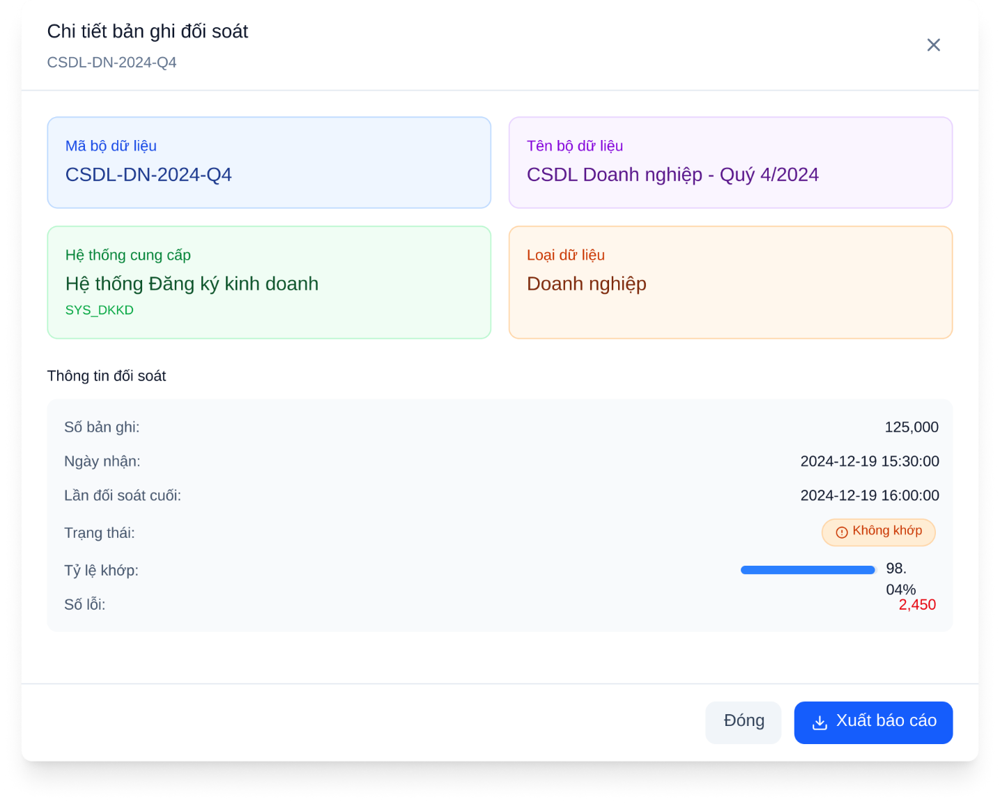

Hình 93 Màn xem chi tiết thông tin đối soát dữ liệu cung cấp

###### Mô tả thông tin trên màn hình

| **STT** | **Tên trường thông tin** | **Kiểu dữ liệu** | **Bắt buộc** | **Mặc định** | **Mô tả** |
| --- | --- | --- | --- | --- | --- |
| 1 | Mã bộ dữ liệu | Text |  | x | Mã định danh duy nhất của bộ dữ liệu (ví dụ: CSDL-DN-2024-Q4). |
| 2 | Tên bộ dữ liệu | Text |  | x | Tên hiển thị đầy đủ của bộ dữ liệu đối soát. |
| 3 | Hệ thống cung cấp | Text |  | x | Tên và mã của hệ thống nguồn gửi dữ liệu (ví dụ: Hệ thống Đăng ký kinh doanh - SYS\_DKKD). |
| 4 | Loại dữ liệu | Text |  | x | Phân loại nội dung dữ liệu (ví dụ: Doanh nghiệp). |
| 5 | Số bản ghi | Number |  | x | Tổng số lượng bản ghi có trong bộ dữ liệu này. |
| 6 | Ngày nhận | Date time |  | x | Thời điểm hệ thống tiếp nhận bộ dữ liệu. |
| 7 | Lần đối soát cuối | Date time |  | x | Thời gian thực hiện phiên đối soát gần nhất. |
| 8 | Trạng thái | Label |  | x | Kết quả đối soát tổng quát (ví dụ: Không khớp). |
| 9 | Tỷ lệ khớp | Tỷ lệ (%) |  | x | Phần trăm dữ liệu chính xác giữa các hệ thống (hiển thị kèm thanh tiến trình). |
| 10 | Số lỗi | Number |  | x | Số lượng bản ghi phát hiện sai lệch hoặc lỗi (hiển thị màu đỏ). |

###### Chức năng trên màn hình

|  |  |  |  |
| --- | --- | --- | --- |
| **STT** | **Tên chức năng** | **Định dạng** | **Mô tả** |
| 1 | Đóng (X) | Biểu tượng | Cho phép đóng nhanh cửa sổ popup chi tiết từ góc trên bên phải. |
| 2 | Đóng | Button | Thoát khỏi màn hình chi tiết để quay lại danh sách quản lý đối soát. |
| 3 | Xuất báo cáo | Button | Trích xuất toàn bộ kết quả đối soát chi tiết và danh sách lỗi ra tệp tài liệu. |

###### 4.9.1.4.1.3. DSCC01. Màn chi tiết thông báo lỗi

Màn hình thông tin chung

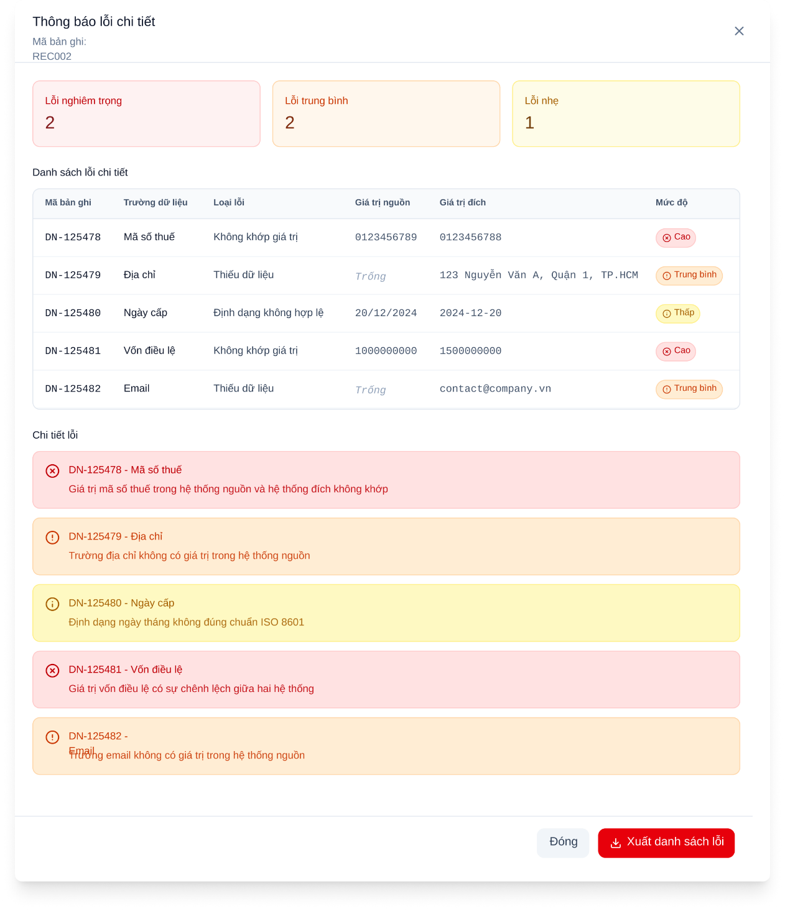

Hình 94 Màn xem chi tiết thông báo lỗ đối soát

###### Mô tả thông tin trên màn hình

| **STT** | **Tên trường thông tin** | **Kiểu dữ liệu** | **Bắt buộc** | **Mặc định** | **Mô tả** |
| --- | --- | --- | --- | --- | --- |
| 1 | Mã bản ghi (Tiêu đề) | Text | Có | Theo bản ghi | Mã định danh của bản ghi đang xem xét lỗi (ví dụ: REC002). |
| 2 | Tổng lỗi nghiêm trọng | Number | Có | Hệ thống tự tính | Số lượng lỗi ở mức độ cao, cần xử lý ngay. |
| 3 | Tổng lỗi trung bình | Number | Có | Hệ thống tự tính | Số lượng lỗi ở mức độ vừa phải. |
| 4 | Tổng lỗi nhẹ | Number | Có | Hệ thống tự tính | Số lượng các sai lệch nhỏ hoặc cảnh báo. |
| 5 | Mã bản ghi (Bảng) | Text | Có | Theo bản ghi | Mã chi tiết của từng bản ghi con bị lỗi. |
| 6 | Trường dữ liệu | Text | Có | Theo bản ghi | Tên thuộc tính dữ liệu phát hiện lỗi (ví dụ: Mã số thuế, Địa chỉ). |
| 7 | Loại lỗi | Text | Có | Theo bản ghi | Mô tả hình thức lỗi (ví dụ: Không khớp giá trị, Thiếu dữ liệu). |
| 8 | Giá trị nguồn | Text | Có | Theo bản ghi | Giá trị dữ liệu tại hệ thống gốc. |
| 9 | Giá trị đích | Text | Có | Theo bản ghi | Giá trị dữ liệu tại hệ thống nhận. |
| 10 | Mức độ | Label | Có | Theo bản ghi | Phân loại mức độ lỗi (Cao, Trung bình, Thấp) kèm màu sắc nhận diện. |
| 11 | Chi tiết lỗi | Text | Có | Theo bản ghi | Diễn giải chi tiết nội dung sai lệch để người dùng hiểu nguyên nhân. |

###### Chức năng trên màn hình

|  |  |  |  |
| --- | --- | --- | --- |
| **STT** | **Tên chức năng** | **Định dạng** | **Mô tả** |
| 1 | Đóng | Biểu tượng | Đóng nhanh popup thông báo lỗi ở góc trên bên phải. |
| 2 | Đóng | Button | Thoát khỏi màn hình xem lỗi để quay về danh sách đối soát. |
| 3 | Xuất danh sách lỗi | Button | Trích xuất toàn bộ chi tiết các dòng lỗi ra file để gửi cho các bên liên quan xử lý. |
| 4 | Tổng quan mức độ lỗi | Thẻ | Nhấn vào các thẻ (Nghiêm trọng, Trung bình, Nhẹ) để lọc nhanh danh sách lỗi theo mức độ tương ứng. |

##### 4.9.1.4.2. Thiết lập đối soát dữ liệu

###### 4.9.1.4.2.1. TLDS01. Màn danh sách thiết lập đối soát dữ liệu cung cấp

Màn hình thông tin chung

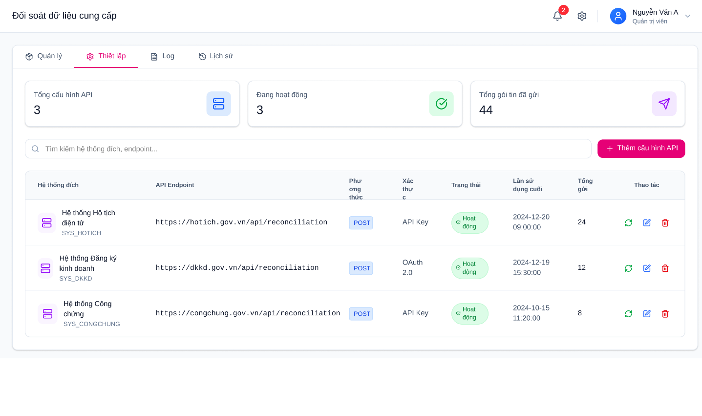

Hình 95 Màn danh sách thiết lập đối soát dữ liệu cung cấp

###### Mô tả thông tin trên màn hình

| **STT** | **Tên trường thông tin** | **Kiểu dữ liệu** | **Bắt buộc** | **Mặc định** | **Mô tả** |
| --- | --- | --- | --- | --- | --- |
| 1 | Tổng cấu hình API | Number |  | X | Tổng số lượng các kết nối API đã được thiết lập. |
| 2 | Đang hoạt động | Number |  | X | Số lượng API đang trong trạng thái sẵn sàng kết nối. |
| 3 | Tổng gói tin đã gửi | Number |  | X | Tổng số lượt truyền tải dữ liệu qua các API này. |
| 4 | Hệ thống đích | Text |  | X | Tên và mã định danh của hệ thống nhận dữ liệu đối soát. |
| 5 | API Endpoint | Đường dẫn (URL) |  | X | Địa chỉ URL cụ thể để gọi API đối soát. |
| 6 | Phương thức | Label |  | X | Phương thức giao tiếp HTTP (ví dụ: POST). |
| 7 | Xác thực | Text |  | X | Hình thức bảo mật để truy cập API (ví dụ: API Key, OAuth 2.0). |
| 8 | Trạng thái | Label |  | X | Tình trạng khả dụng của cấu hình (Hoạt động/Ngừng hoạt động). |
| 9 | Lần sử dụng cuối | Date time |  | X | Thời điểm gần nhất API được thực hiện lệnh gọi. |
| 10 | Tổng gửi | Number |  | X | Số lượng gói tin đã gửi thành công qua Endpoint tương ứng. |

###### Chức năng trên màn hình

|  |  |  |  |
| --- | --- | --- | --- |
| **STT** | **Tên chức năng** | **Định dạng** | **Mô tả** |
| 1 | Thêm cấu hình API | Button | Mở giao diện để thiết lập một kết nối API đối soát mới. |
| 2 | Tìm kiếm | Ô nhập | Tìm kiếm nhanh các cấu hình theo tên hệ thống đích hoặc Endpoint. |
| 3 | Làm mới/Kiểm tra kết nối | Biểu tượng | Thực hiện kiểm tra lại tình trạng hoạt động (Health check) của API. |
| 4 | Chỉnh sửa | Biểu tượng | Cho phép thay đổi các thông số kỹ thuật của cấu hình hiện có. |
| 5 | Xóa | Biểu tượng | Gỡ bỏ cấu hình API khỏi danh sách hệ thống. |

###### 4.9.1.4.2.2. TLDS01. Màn thêm mới thiết lập đối soát dữ liệu cung cấp

Màn hình thông tin chung

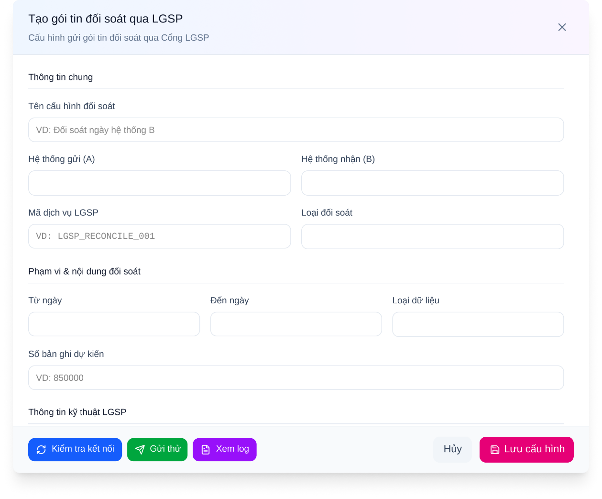

Hình 96 Màn xem chi tiết thông báo lỗ đối soát

###### Mô tả thông tin trên màn hình

| **STT** | **Tên trường thông tin** | **Kiểu dữ liệu** | **Bắt buộc** | **Mặc định** | **Mô tả** |
| --- | --- | --- | --- | --- | --- |
| **1** | **Thông tin chung** |  |  |  |  |
| 1.1 | Tên cấu hình đối soát | Text | Có | Trống | Tên định danh cho cấu hình đối soát. |
| 1.2 | Hệ thống gửi (A) | Text | Có | Trống | Tên đơn vị/hệ thống khởi tạo yêu cầu. |
| 1.3 | Hệ thống nhận (B) | Text | Có | Trống | Tên đơn vị/hệ thống tiếp nhận yêu cầu. |
| 1.4 | Mã dịch vụ LGSP | Mã | Có | Trống | Mã dịch vụ đăng ký trên cổng LGSP. |
| 1.5 | Loại đối soát | Danh mục | Có | Trống | Hình thức thực hiện (ví dụ: định kỳ, theo yêu cầu). |
| **2** | **Phạm vi & nội dung** |  |  |  |  |
| 2.1 | Từ ngày - Đến ngày | Ngày | Có | Trống | Khoảng thời gian dữ liệu cần đối soát. |
| 2.2 | Loại dữ liệu | Danh mục | Có | Trống | Phân loại nghiệp vụ của dữ liệu. |
| 2.3 | Số bản ghi dự kiến | Number | Có | Trống | Ước lượng số lượng bản ghi sẽ truyền tải. |
| **3** | **Thông tin kỹ thuật LGSP** |  |  |  |  |
| 3.1 | Endpoint LGSP | URL | Có | Trống | Đường dẫn API kết nối đến trục LGSP. |
| 3.2 | Service Name | Text | Có | Trống | Tên dịch vụ cụ thể trong hệ thống. |
| 3.3 | Phiên bản API | Text | Không | Trống | Phiên bản của dịch vụ API đang sử dụng. |
| 3.4 | Phương thức | Danh mục | Có | Trống | Phương thức truyền (GET, POST...). |
| **4** | **Bảo mật & Tự động hóa** |  |  |  |  |
| 4.1 | Cơ chế xác thực | Danh mục | Có | Trống | Hình thức xác thực (API Key, Token...). |
| 4.2 | Chứng thư số | Text | Không | Trống | Thông tin chữ ký số để ký gói tin. |
| 4.3 | Tần suất gửi | Danh mục | Không | Trống | Lịch trình gửi tự động (Hàng ngày, Hàng tuần). |
| 4.4 | Giờ gửi | Giờ | Không | Trống | Thời điểm cụ thể bắt đầu gửi gói tin. |
| 4.5 | Ghi chú | Text | Không | Trống | Thông tin bổ sung hoặc lưu ý cấu hình. |

###### Chức năng trên màn hình

| **STT** | **Tên chức năng** | **Định dạng** | **Mô tả** |
| --- | --- | --- | --- |
| 1 | Kiểm tra kết nối | Button | Thực hiện kiểm tra tính sẵn sàng của đường truyền LGSP. |
| 2 | Gửi thử | Button | Thực hiện gửi một mẫu dữ liệu thực tế để xác minh cấu hình. |
| 3 | Xem log | Button | Truy xuất nhật ký các lần kết nối thử nghiệm để chẩn đoán lỗi. |
| 4 | Lưu cấu hình | Button | Xác nhận lưu mọi thông tin thiết lập vào hệ thống quản lý. |
| 5 | Hủy | Button | Hủy bỏ các thay đổi và đóng giao diện tạo gói tin. |
| 6 | Đóng (X) | Biểu tượng | Đóng cửa sổ popup hiện tại. |

##### 4.9.1.4.3. NKTL01. Màn danh sách lịch sử cấu hình đối soát dữ liệu

Màn hình thông tin chung

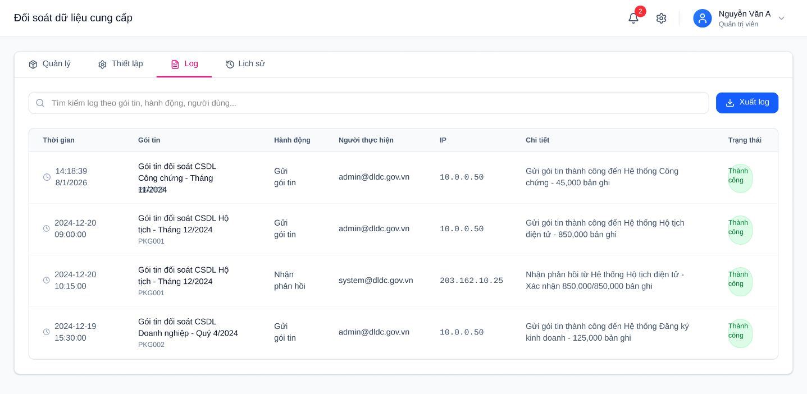

Hình 97 Màn xem chi tiết thông báo lỗ đối soát

##### Mô tả thông tin trên màn hình

| **STT** | **Tên trường thông tin** | **Kiểu dữ liệu** | **Bắt buộc** | **Mặc định** | **Mô tả** |
| --- | --- | --- | --- | --- | --- |
| 1 | Thời gian | Date time | Có | Hệ thống tự điền | Thời điểm chính xác xảy ra sự kiện. |
| 2 | Gói tin | Text | Có | Không | Tên gói tin đối soát và mã định danh liên quan (ví dụ: PKG001). |
| 3 | Hành động | Text | Có | Không | Loại thao tác được thực hiện (Gửi gói tin, Nhận phản hồi...). |
| 4 | Người thực hiện | Text (Email) | Có | Không | Tài khoản hệ thống hoặc người dùng thực hiện tác vụ. |
| 5 | IP | Text | Có | Hệ thống tự điền | Địa chỉ IP của máy chủ hoặc thiết bị thực hiện hành động. |
| 6 | Chi tiết | Text | Có | Không | Nội dung mô tả cụ thể kết quả hành động (ví dụ: số lượng bản ghi đã gửi/nhận). |
| 7 | Trạng thái | Label | Có | Thành công | Kết quả kỹ thuật của hành động (Thành công/Thất bại). |

##### Chức năng trên màn hình

|  |  |  |  |
| --- | --- | --- | --- |
| **STT** | **Tên chức năng** | **Định dạng** | **Mô tả** |
| 1 | Tab điều hướng | Thẻ (Tabs) | Chuyển đổi qua lại giữa các phân hệ: Quản lý, Thiết lập, Log, Lịch sử. |
| 2 | Tìm kiếm log | Ô nhập (Input) | Tìm kiếm nhanh nhật ký theo tên gói tin, loại hành động hoặc người dùng. |
| 3 | Xuất log | Button (Button) | Trích xuất danh sách nhật ký hiện tại ra file dữ liệu để lưu trữ hoặc báo cáo. |
| 4 | Phân trang | Button | Di chuyển qua các trang dữ liệu khi danh sách nhật ký có số lượng bản ghi lớn. |

##### 4.9.1.4.4. NKTLCC01. Màn nhật ký đối soát dữ liệu cung cấp

Màn hình thông tin chung

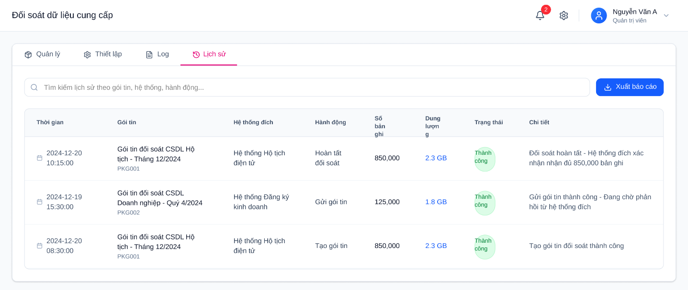

Hình 98 Màn nhật ký đối soát dữ liệu cung cấp

##### Mô tả thông tin trên màn hình

| **STT** | **Tên trường thông tin** | **Kiểu dữ liệu** | **Bắt buộc** | **Mặc định** | **Mô tả** |
| --- | --- | --- | --- | --- | --- |
| 1 | Thời gian | Date time |  | x | Thời điểm hoàn tất hoặc ghi nhận trạng thái cuối của gói tin. |
| 2 | Gói tin | Text |  | x | Tên và mã định danh của gói tin đối soát (ví dụ: PKG001). |
| 3 | Hệ thống đích | Text |  | x | Tên hệ thống tiếp nhận dữ liệu đối soát. |
| 4 | Hành động | Text |  | x | Trạng thái nghiệp vụ cuối cùng (Hoàn tất đối soát, Gửi gói tin, Tạo gói tin). |
| 5 | Số bản ghi | Number |  | x | Tổng số lượng bản ghi dữ liệu trong gói tin. |
| 6 | Dung lượng | Text |  | x | Kích thước tệp dữ liệu đã đối soát (ví dụ: 2.3 GB). |
| 7 | Trạng thái | Label |  | x | Kết quả cuối cùng của quy trình đối soát. |
| 8 | Chi tiết | Text |  | x | Diễn giải cụ thể kết quả (ví dụ: Hệ thống đích xác nhận nhận đủ bản ghi). |

##### Chức năng trên màn hình

|  |  |  |  |
| --- | --- | --- | --- |
| **STT** | **Tên chức năng** | **Định dạng** | **Mô tả** |
| 1 | Tab điều hướng | Thẻ (Tabs) | Cho phép di chuyển giữa các phân hệ: Quản lý, Thiết lập, Log, Lịch sử. |
| 2 | Tìm kiếm lịch sử | Ô nhập (Input) | Tìm kiếm bản ghi theo tên gói tin, hệ thống đích hoặc loại hành động. |
| 3 | Xuất báo cáo | Button (Button) | Kết xuất toàn bộ danh sách lịch sử đối soát ra file tài liệu. |
| 4 | Xem chi tiết | Dòng bản ghi | Nhấn vào từng dòng để xem lại thông tin chi tiết của phiên đối soát đó. |

## 4.10. Quản trị và vận hành (tài khoản quản trị kho DLDC)

### 4.10.1. Mục đích

Quản lý người dùng trong kho dữ liệu dùng chung (DLDC) nhằm đảm bảo việc khai thác và sử dụng dữ liệu **đúng đối tượng, đúng quyền hạn, đúng mục đích và đúng trách nhiệm**.

Thông qua cơ chế quản trị và phân quyền, hệ thống:

* Đảm bảo an toàn, bảo mật dữ liệu trong suốt quá trình vận hành;
* Kiểm soát chặt chẽ quyền truy cập, chỉnh sửa, khai thác và chia sẻ dữ liệu;
* Hỗ trợ cán bộ quản trị trong việc **giám sát, theo dõi, kiểm tra và vận hành** kho DLDC một cách hiệu quả;
* Nâng cao tính minh bạch, trách nhiệm giải trình của các đơn vị, cá nhân khi sử dụng dữ liệu.

#### 4.10.1.1. Phân quyền

**Cán bộ quản trị kho DLDC** là đối tượng được giao thực hiện chức năng quản lý, vận hành và phân quyền người dùng trong hệ thống, bao gồm các quyền chính:

* Tạo mới, cập nhật, khóa/mở khóa tài khoản người dùng;
* Phân quyền truy cập, khai thác, cập nhật dữ liệu theo vai trò, chức năng và phạm vi được giao;
* Giám sát hoạt động sử dụng hệ thống, theo dõi nhật ký truy cập và xử lý các vấn đề phát sinh;
* Phối hợp với các đơn vị liên quan trong công tác vận hành, bảo trì và đảm bảo an toàn hệ thống.

#### 4.10.1.2. Điều kiện thực hiện

Cán bộ quản trị kho DLDC phải:

* Được cơ quan, đơn vị có thẩm quyền **phân công nhiệm vụ** và **cấp quyền truy cập quản trị**;
* Có kiến thức, kỹ năng phù hợp để thực hiện công tác quản trị, vận hành hệ thống kho dữ liệu;
* Chịu trách nhiệm trước cơ quan quản lý về các hoạt động quản trị, phân quyền và vận hành kho DLDC theo quy định hiện hành.

### 4.10.2. Quản trị người dùng

#### 4.10.2.1. Quản trị người dùng

##### 4.10.2.1.1. QTND01. Màn danh sách quản lý người dùng

* Màn hình thông tin chung

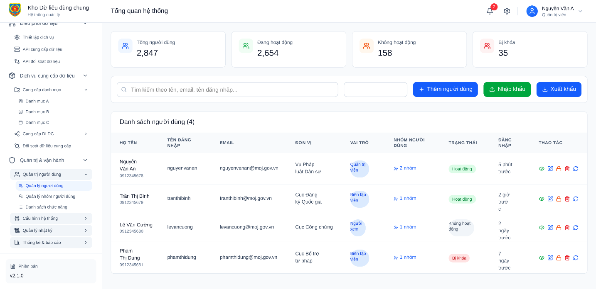

Hình 99 Màn quản lý người dùng

###### Mô tả thông tin trên màn hình

|  |  |  |  |  |  |
| --- | --- | --- | --- | --- | --- |
| **STT** | **Tên trường thông tin** | **Kiểu dữ liệu** | **Bắt buộc** | **Mặc định** | **Mô tả** |
| 1 | Tổng người dùng | Label |  | x | Hiển thị tổng số tài khoản có trên hệ thống. |
| 2 | Đang hoạt động | Label |  | x | Số lượng người dùng đang ở trạng thái hoạt động (màu xanh). |
| 3 | Không hoạt động | Label |  | x | Số lượng người dùng tạm ngừng truy cập (màu cam). |
| 4 | Bị khóa | Label |  | x | Số lượng tài khoản đang bị quản trị viên khóa (màu đỏ). |
| 5 | Tìm kiếm | Search Box |  |  | Tìm kiếm người dùng theo tên, email hoặc tên đăng nhập. |
| 6 | Họ tên | Label |  | x | Hiển thị Họ tên kèm số điện thoại của người dùng. |
| 7 | Tên đăng nhập | Label |  | x | Tên tài khoản dùng để đăng nhập hệ thống. |
| 8 | Đơn vị | Label |  | x | Tên cơ quan, đơn vị nơi người dùng công tác. |
| 9 | Vai trò | Label |  | x | Quyền hạn của người dùng (Quản trị viên, Biên tập viên, Người xem). |
| 10 | Trạng thái | Label |  | x | Trình trạng tài khoản: Hoạt động, Không hoạt động, Bị khóa. |
| 11 | Đăng nhập | Label |  | x | Thời gian kể từ lần cuối cùng người dùng truy cập hệ thống. |

###### Chức năng trên màn hình

|  |  |  |  |
| --- | --- | --- | --- |
| **STT** | **Tên chức năng** | **Định dạng** | **Mô tả** |
| 1 | Thêm người dùng | Button | Mở popup để tạo mới một tài khoản người dùng. |
| 2 | Nhập khẩu | Button | Cho phép thêm hàng loạt người dùng từ file dữ liệu có sẵn. |
| 3 | Xuất khẩu | Button | Trích xuất danh sách người dùng ra file báo cáo. |
| 4 | Xem chi tiết | Button | Xem thông tin hồ sơ chi tiết của người dùng. |
| 5 | Chỉnh sửa | Button | Thay đổi thông tin cá nhân hoặc phân quyền lại cho người dùng. |
| 6 | Khóa tài khoản | Button | Tạm dừng quyền truy cập của người dùng ngay lập tức. |
| 7 | Xóa | Button | Loại bỏ hoàn toàn tài khoản khỏi hệ thống (có yêu cầu xác nhận). |
| 8 | Đặt lại mật khẩu | Button | Cấp lại mật khẩu mặc định cho người dùng trong trường hợp quên. |

##### 4.10.2.1.2. QTND01_02. Màn thêm mới người dùng

* Màn hình thông tin chung

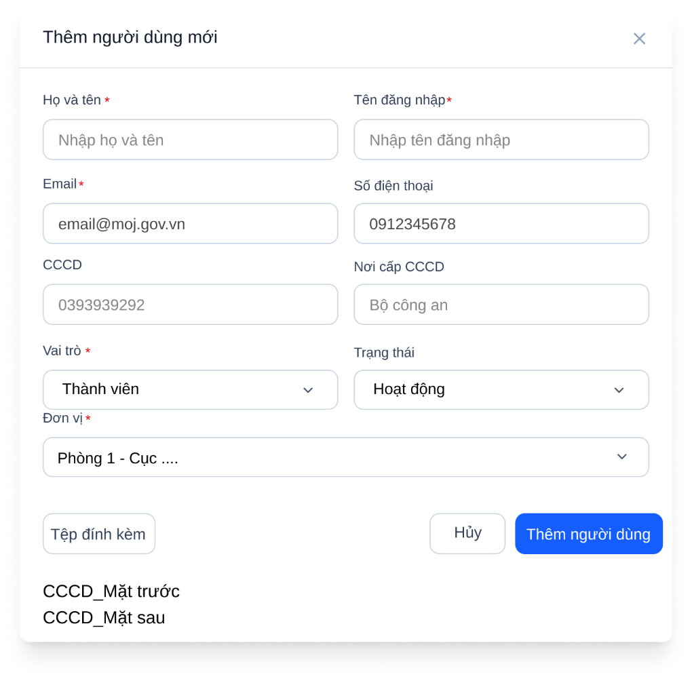

Hình 100 Màn thêm mới người dùng

###### Mô tả thông tin trên màn hình

|  |  |  |  |  |  |
| --- | --- | --- | --- | --- | --- |
| **STT** | **Tên trường thông tin** | **Kiểu dữ liệu** | **Bắt buộc** | **Mặc định** | **Mô tả** |
| 1 | Tiêu đề màn hình | Label |  | x | Tên của cửa sổ popup. |
| 2 | Họ và tên | Text Input | x |  | Nhập đầy đủ họ tên của người dùng (Placeholder: "Nhập họ và tên"). |
| 3 | Tên đăng nhập | Text Input | x |  | Nhập tên tài khoản dùng để truy cập (Placeholder: "Nhập tên đăng nhập"). |
| 4 | Email | Text Input | x |  | Nhập địa chỉ email công vụ (Placeholder: "email@moj.gov.vn"). |
| 5 | Số điện thoại | Text Input |  |  | Nhập số điện thoại liên hệ (Placeholder: "0912345678"). |
| 6 | CCCD | Text Input | x |  | Nhập số Căn cước công dân (Placeholder: "0393939292"). |
| 7 | Nơi cấp CCCD | Text Input |  |  | Nhập nơi cấp thẻ CCCD (Placeholder: "Bộ công an"). |
| 8 | Vai trò | Dropdown | x |  | Lựa chọn quyền hạn (Quản trị viên, Người dùng...). |
| 9 | Trạng thái | Dropdown |  |  | Lựa chọn tình trạng tài khoản ban đầu (Hoạt động, Khóa...). |
| 10 | Đơn vị | Dropdown | x |  | Lựa chọn cơ quan/đơn vị trực thuộc. |
| 11 | Danh sách tệp đính kèm | List |  |  | Hiển thị tên các tệp đã tải lên (ví dụ: CCCD\_Mặt trước, CCCD\_Mặt sau). |

###### Chức năng trên màn hình

|  |  |  |  |
| --- | --- | --- | --- |
| **STT** | **Tên chức năng** | **Định dạng** | **Mô tả** |
| 1 | Đóng | Icon | Thoát khỏi popup và hủy bỏ các thông tin đã nhập. |
| 2 | Tệp đính kèm | Button | Mở trình duyệt file để tải lên các tài liệu xác thực (CCCD, quyết định...). |
| 3 | Hủy | Button | Đóng cửa sổ và không lưu dữ liệu. |
| 4 | Thêm người dùng | Button | Xác nhận tạo tài khoản và ghi nhận vào cơ sở dữ liệu. |

##### 4.10.2.1.3. QTND01_03. Màn sửa người dùng

* Màn hình thông tin chung

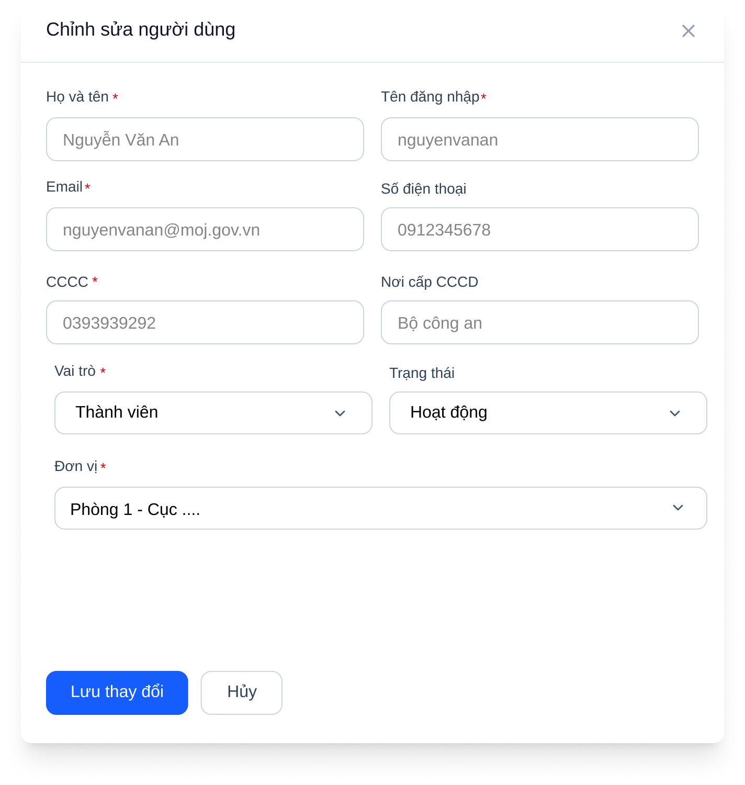

Hình 101 Màn quản sửa thông tin người dùng

###### Mô tả thông tin trên màn hình

| **STT** | **Tên trường thông tin** | **Kiểu dữ liệu** | **Bắt buộc** | **Mặc định** | **Mô tả** |
| --- | --- | --- | --- | --- | --- |
| 1 | Tiêu đề màn hình | Label |  | x | Tên của cửa sổ popup. |
| 2 | Họ và tên | Text Input | x | x | Cập nhập đầy đủ họ tên của người dùng (Placeholder: "Nhập họ và tên"). |
| 3 | Tên đăng nhập | Text Input | x | x | Cập nhập tên tài khoản dùng để truy cập (Placeholder: "Nhập tên đăng nhập"). |
| 4 | Email | Text Input | x | x | Cập nhập địa chỉ email công vụ (Placeholder: "email@moj.gov.vn"). |
| 5 | Số điện thoại | Text Input |  | x | Cập nhập số điện thoại liên hệ (Placeholder: "0912345678"). |
| 6 | CCCD | Text Input | x | x | Cập nhập số Căn cước công dân (Placeholder: "0393939292"). |
| 7 | Nơi cấp CCCD | Text Input |  | x | Cập nhập nơi cấp thẻ CCCD (Placeholder: "Bộ công an"). |
| 8 | Vai trò | Dropdown | x | x | Cập nhập Lựa chọn quyền hạn (Quản trị viên, Người dùng...). |
| 9 | Trạng thái | Dropdown |  | x | Cập nhập Lựa chọn tình trạng tài khoản ban đầu (Hoạt động, Khóa...). |
| 10 | Đơn vị | Dropdown | x | x | Cập nhập Lựa chọn cơ quan/đơn vị trực thuộc. |
| 11 | Danh sách tệp đính kèm | List |  | x | Hiển thị tên các tệp đã tải lên (ví dụ: CCCD\_Mặt trước, CCCD\_Mặt sau). |

###### Chức năng trên màn hình

|  |  |  |  |
| --- | --- | --- | --- |
| **STT** | **Tên chức năng** | **Định dạng** | **Mô tả** |
| 1 | Đóng | Icon | Thoát khỏi popup và hủy bỏ các thông tin đã nhập. |
| 2 | Tệp đính kèm | Button | Mở trình duyệt file để tải lên các tài liệu xác thực (CCCD, quyết định...). |
| 3 | Hủy | Button | Đóng cửa sổ và không lưu dữ liệu. |
| 4 | Cập nhật người dùng | Button | Xác nhận tạo tài khoản và ghi nhận vào cơ sở dữ liệu. |

##### 4.10.2.1.4. QTND01_04. Màn xóa người dùng

* Màn hình thông tin chung

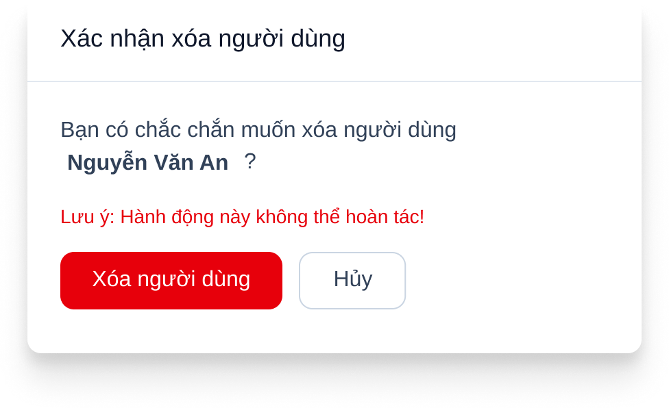

Hình 102 Màn xóa tài khoản người dùng

###### Mô tả thông tin trên màn hình

|  |  |  |  |  |  |
| --- | --- | --- | --- | --- | --- |
| **STT** | **Tên trường thông tin** | **Kiểu dữ liệu** | **Bắt buộc** | **Mặc định** | **Mô tả** |
| 1 | Tiêu đề màn hình | Label |  | x | Tên của cửa sổ thông báo. |
| 2 | Nội dung xác nhận | Label |  | x | Hiển thị tên người dùng cụ thể đang được chọn để xóa (Ví dụ: Nguyễn Văn An). |
| 3 | Cảnh báo hệ thống | Label |  | x | Thông báo cảnh báo rủi ro về việc mất dữ liệu vĩnh viễn (hiển thị màu đỏ). |

###### Chức năng trên màn hình

|  |  |  |  |
| --- | --- | --- | --- |
| **STT** | **Tên chức năng** | **Định dạng** | **Mô tả** |
| 1 | Xóa người dùng | Button | Thực hiện lệnh xóa vĩnh viễn tài khoản khỏi hệ thống và đóng popup. |
| 2 | Hủy | Button | Ngừng thao tác xóa, giữ nguyên trạng thái tài khoản và đóng popup. |

##### 4.10.2.1.5. QTND01_05. Màn xem chi tiết thông tin người dùng

* Màn hình thông tin chung

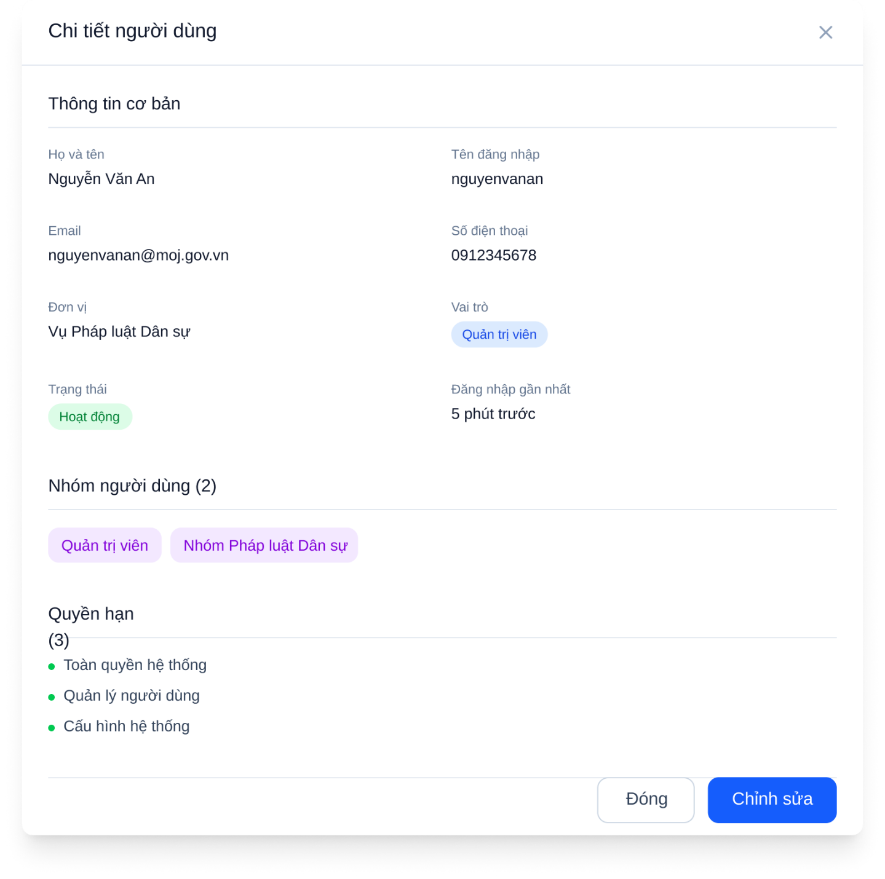

Hình 103 Màn xem chi tiết thông tin tài khoản người dùng

###### Mô tả thông tin trên màn hình

| **STT** | **Tên trường thông tin** | **Kiểu dữ liệu** | **Bắt buộc** | **Mặc định** | **Mô tả** |
| --- | --- | --- | --- | --- | --- |
| 1 | Tổng người dùng | Label |  | x | Hiển thị tổng số tài khoản có trên hệ thống. |
| 2 | Đang hoạt động | Label |  | x | Số lượng người dùng đang ở trạng thái hoạt động (màu xanh). |
| 3 | Không hoạt động | Label |  | x | Số lượng người dùng tạm ngừng truy cập (màu cam). |
| 4 | Bị khóa | Label |  | x | Số lượng tài khoản đang bị quản trị viên khóa (màu đỏ). |
| 5 | Tìm kiếm | Search Box |  |  | Tìm kiếm người dùng theo tên, email hoặc tên đăng nhập. |
| 6 | Họ tên | Label |  | x | Hiển thị Họ tên kèm số điện thoại của người dùng. |
| 7 | Tên đăng nhập | Label |  | x | Tên tài khoản dùng để đăng nhập hệ thống. |
| 8 | Đơn vị | Label |  | x | Tên cơ quan, đơn vị nơi người dùng công tác. |
| 9 | Vai trò | Label |  | x | Quyền hạn của người dùng (Quản trị viên, Biên tập viên, Người xem). |
| 10 | Trạng thái | Label |  | x | Trình trạng tài khoản: Hoạt động, Không hoạt động, Bị khóa. |
| 11 | Đăng nhập | Label |  | x | Thời gian kể từ lần cuối cùng người dùng truy cập hệ thống. |

###### Chức năng trên màn hình

|  |  |  |  |
| --- | --- | --- | --- |
| **STT** | **Tên chức năng** | **Định dạng** | **Mô tả** |
| 1 | Thêm người dùng | Button | Mở popup để tạo mới một tài khoản người dùng. |
| 2 | Nhập khẩu | Button | Cho phép thêm hàng loạt người dùng từ file dữ liệu có sẵn. |
| 3 | Xuất khẩu | Button | Trích xuất danh sách người dùng ra file báo cáo. |
| 4 | Xem chi tiết | Button | Xem thông tin hồ sơ chi tiết của người dùng. |
| 5 | Chỉnh sửa | Button | Thay đổi thông tin cá nhân hoặc phân quyền lại cho người dùng. |
| 6 | Khóa tài khoản | Button | Tạm dừng quyền truy cập của người dùng ngay lập tức. |
| 7 | Xóa | Button | Loại bỏ hoàn toàn tài khoản khỏi hệ thống (có yêu cầu xác nhận). |
| 8 | Đặt lại mật khẩu | Button | Cấp lại mật khẩu mặc định cho người dùng trong trường hợp quên. |

##### 4.10.2.1.6. QTND01_06. Màn khóa tài khoản người dùng

* Màn hình thông tin chung

Hình 104 Màn khóa tài khoản người dùng

###### Mô tả thông tin trên màn hình

|  |  |  |  |  |  |
| --- | --- | --- | --- | --- | --- |
| **STT** | **Tên trường thông tin** | **Kiểu dữ liệu** | **Bắt buộc** | **Mặc định** | **Mô tả** |
| 1 | Tiêu đề màn hình | Label |  | x | Tên của cửa sổ thông báo. |
| 2 | Nội dung xác nhận | Label |  | x | Hiển thị tên người dùng cụ thể đang được chọn để khóa (Ví dụ: Nguyễn Văn An). |
| 3 | Cảnh báo hệ thống | Label |  | x | Thông báo cảnh báo rủi ro về việc khóa tài khoản (hiển thị màu đỏ). |

###### Chức năng trên màn hình

|  |  |  |  |
| --- | --- | --- | --- |
| **STT** | **Tên chức năng** | **Định dạng** | **Mô tả** |
| 1 | Khóa tài khoản | Button | Thực hiện khóa tài khoản, người dùng sẽ lập tức bị logout khỏi hệ thống (nếu đang đăng nhập). |
| 2 | Hủy | Button | Ngừng thao tác xóa, giữ nguyên trạng thái tài khoản và đóng popup. |

#### 4.10.2.2. Quản lý nhóm người dùng

##### 4.10.2.2.1. QTND02. Màn danh sách nhóm quản lý người dùng

* Màn hình thông tin chung

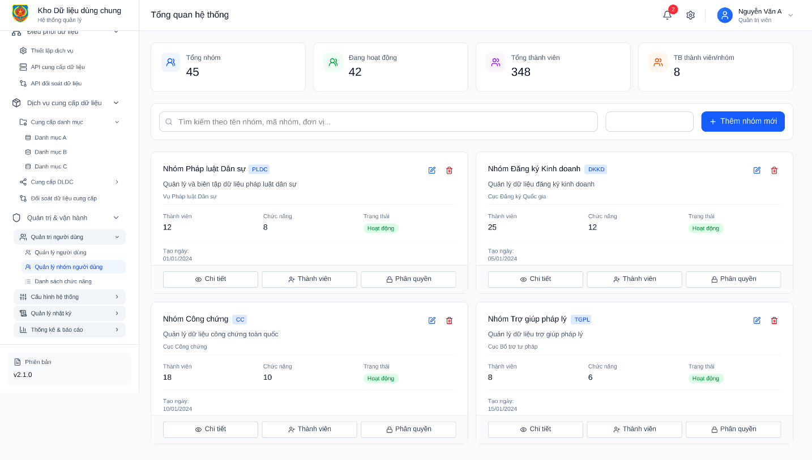

Hình 105 Màn quản lý nhóm người dùng

###### Mô tả thông tin trên màn hình

| **STT** | **Tên trường thông tin** | **Kiểu dữ liệu** | **Bắt buộc** | **Mặc định** | **Mô tả** |
| --- | --- | --- | --- | --- | --- |
| 1 | Tổng nhóm | Number |  | x | Tổng số lượng nhóm người dùng đã tạo. |
| 2 | Đang hoạt động | Number |  | x | Số lượng nhóm đang có trạng thái hoạt động. |
| 3 | Tổng thành viên | Number |  | x | Tổng số lượng người dùng được phân vào các nhóm. |
| 4 | TB thành viên/nhóm | Number |  | x | Chỉ số trung bình số lượng thành viên trong mỗi nhóm. |
| 5 | Ô tìm kiếm | Search Box |  |  | Tìm kiếm nhóm theo tên, mã nhóm hoặc đơn vị. |
| 6 | Tên nhóm | Label |  |  | Tên định danh của nhóm (Ví dụ: Nhóm Pháp luật Dân sự). |
| 7 | Mã nhóm | Tag |  |  | Mã viết tắt của nhóm (Ví dụ: PLDS, DKKD). |
| 8 | Mô tả nhóm | Text |  |  | Nội dung tóm tắt chức năng, nhiệm vụ của nhóm. |
| 9 | Đơn vị quản lý | Text |  |  | Tên cơ quan, đơn vị chủ quản của nhóm. |
| 10 | Thành viên | Number |  |  | Số lượng thành viên hiện có trong nhóm. |
| 11 | Chức năng | Number |  |  | Số lượng quyền/chức năng đã gán cho nhóm. |
| 12 | Trạng thái | Text |  | x | Tình trạng của nhóm: Hoạt động hoặc Tạm ngưng. |
| 13 | Ngày tạo | Date |  |  | Thời điểm khởi tạo nhóm trên hệ thống. |

###### Chức năng trên màn hình

|  |  |  |  |
| --- | --- | --- | --- |
| **STT** | **Tên chức năng** | **Định dạng** | **Mô tả** |
| 1 | Thêm nhóm mới | Button | Mở giao diện để khởi tạo một nhóm người dùng mới. |
| 2 | Chỉnh sửa | Icon | Thay đổi thông tin cơ bản hoặc trạng thái của nhóm. |
| 3 | Xóa nhóm | Icon | Loại bỏ nhóm khỏi hệ thống (hiển thị màu đỏ). |
| 4 | Chi tiết | Button | Xem thông tin chi tiết và lịch sử hoạt động của nhóm. |
| 5 | Thành viên | Button | Mở danh sách và quản lý việc thêm/bớt thành viên vào nhóm. |
| 6 | Phân quyền | Button | Giao diện gán các quyền chức năng cụ thể cho nhóm này. |

##### 4.10.2.2.2. QTND02_01. Màn thêm mới nhóm người dùng

* Màn hình thông tin chung

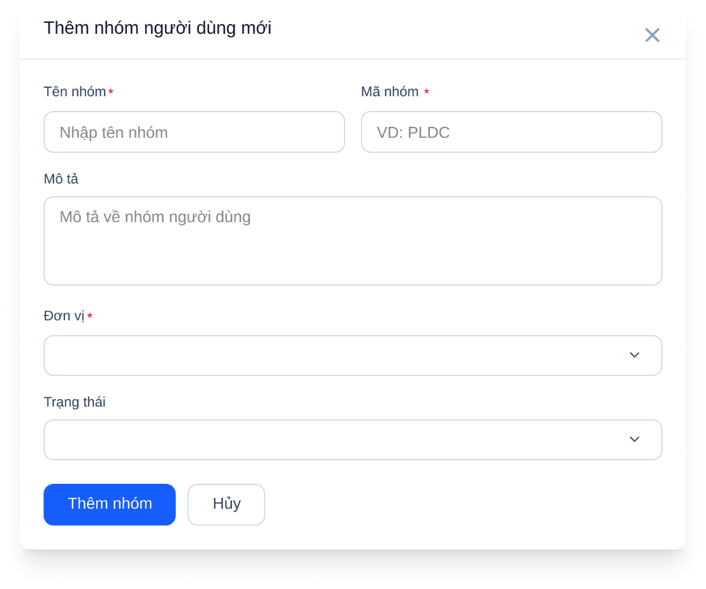

Hình 106 Màn thêm mới nhóm người dùng

###### Mô tả thông tin trên màn hình

|  |  |  |  |  |  |
| --- | --- | --- | --- | --- | --- |
| **STT** | **Tên trường thông tin** | **Kiểu dữ liệu** | **Bắt buộc** | **Mặc định** | **Mô tả** |
| 1 | Tiêu đề màn hình | Label |  | x | Tên của cửa sổ popup. |
| 2 | Tên nhóm | Text Input | x |  | Nhập tên định danh đầy đủ cho nhóm (Placeholder: "Nhập tên nhóm"). |
| 3 | Mã nhóm | Text Input | x |  | Nhập mã viết tắt của nhóm (Placeholder: "VD: PLDC"). |
| 4 | Mô tả | Text Area |  |  | Nhập nội dung giới thiệu hoặc chức năng của nhóm (Placeholder: "Mô tả về nhóm người dùng"). |
| 5 | Đơn vị | Dropdown | x |  | Lựa chọn cơ quan hoặc đơn vị quản lý nhóm. |
| 6 | Trạng thái | Dropdown |  |  | Lựa chọn tình trạng hoạt động ban đầu của nhóm. |

###### Chức năng trên màn hình

|  |  |  |  |
| --- | --- | --- | --- |
| **STT** | **Tên chức năng** | **Định dạng** | **Mô tả** |
| 1 | Đóng | Icon | Thoát khỏi cửa sổ và không lưu lại các thông tin đã nhập. |
| 2 | Hủy | Button | Đóng popup và hủy bỏ thao tác khởi tạo nhóm. |
| 3 | Thêm nhóm | Button | Xác nhận lưu thông tin và tạo nhóm mới vào hệ thống. |

##### 4.10.2.2.3. QTND02_02. Màn sửa nhóm người dùng

* Màn hình thông tin chung

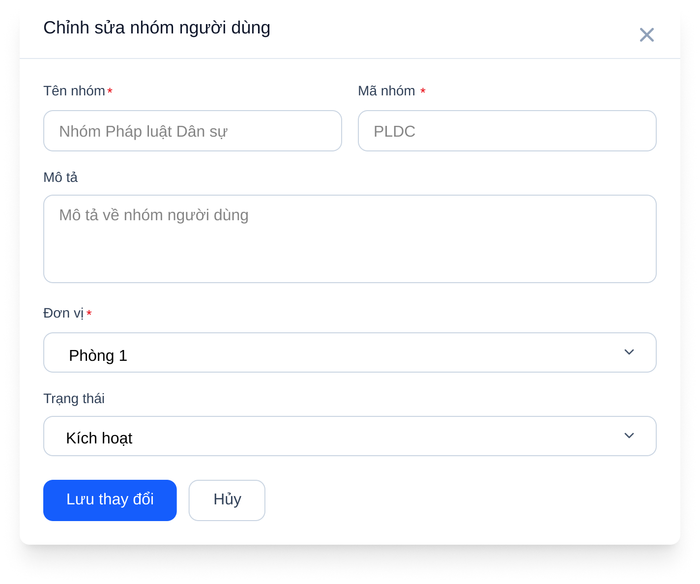

Hình 107 Màn quản sửa thông tin nhóm người dùng

###### Mô tả thông tin trên màn hình

|  |  |  |  |  |  |
| --- | --- | --- | --- | --- | --- |
| **STT** | **Tên trường thông tin** | **Kiểu dữ liệu** | **Bắt buộc** | **Mặc định** | **Mô tả** |
| 1 | Tiêu đề màn hình | Label |  | x | Tên của cửa sổ popup khi ở chế độ Edit. |
| 2 | Tên nhóm | Text Input | x | x | Tên định danh của nhóm đang thực hiện chỉnh sửa. |
| 3 | Mã nhóm | Text Input | x | x | Mã viết tắt duy nhất của nhóm (thường bị khóa hoặc hạn chế sửa). |
| 4 | Mô tả | Text Area |  | x | Nội dung giới thiệu chi tiết về chức năng của nhóm. |
| 5 | Đơn vị | Dropdown | x | x | Lựa chọn cơ quan hoặc đơn vị trực tiếp quản lý nhóm. |
| 6 | Trạng thái | Dropdown |  | x | Tình trạng hoạt động hiện tại của nhóm trên hệ thống. |

###### Chức năng trên màn hình

|  |  |  |  |
| --- | --- | --- | --- |
| **STT** | **Tên chức năng** | **Định dạng** | **Mô tả** |
| 1 | Đóng | Icon | Thoát khỏi cửa sổ và không lưu lại các thay đổi vừa nhập. |
| 2 | Hủy | Button | Hủy bỏ thao tác chỉnh sửa và quay lại màn hình danh sách. |
| 3 | Lưu thay đổi | Button | Xác nhận cập nhật các thông tin mới vào cơ sở dữ liệu. |

##### 4.10.2.2.4. QTND02_03. Màn xóa nhóm người dùng

* Màn hình thông tin chung

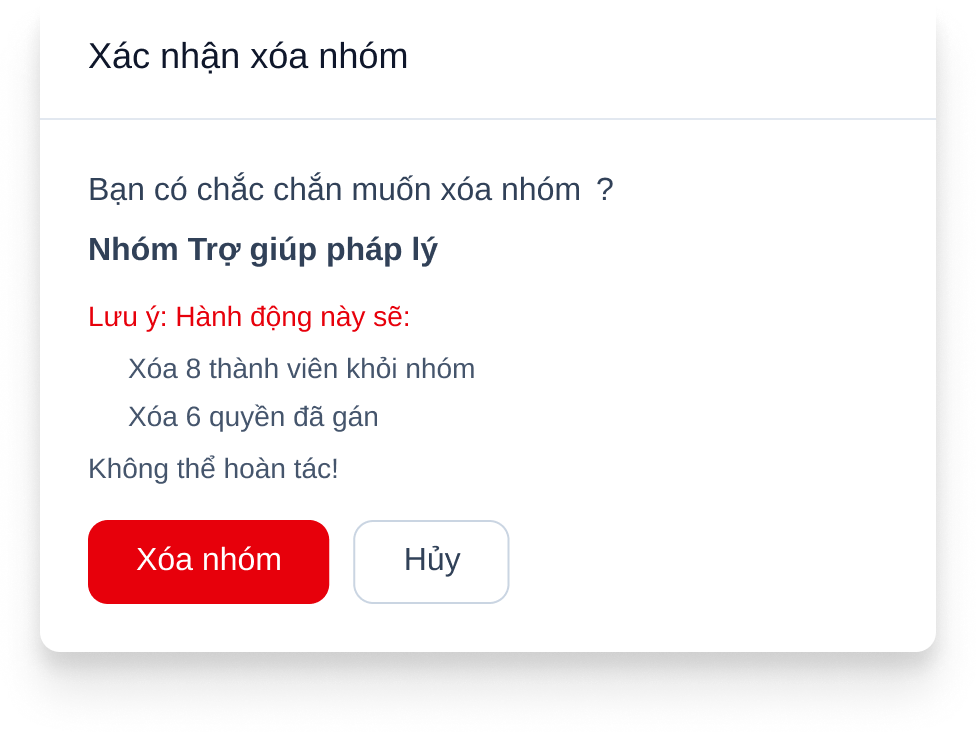

Hình 108 Màn xóa tài khoản nhóm người dùng

###### Mô tả thông tin trên màn hình

| **STT** | **Tên trường thông tin** | **Kiểu dữ liệu** | **Bắt buộc** | **Mặc định** | **Mô tả** |
| --- | --- | --- | --- | --- | --- |
| 1 | Tiêu đề màn hình | Label |  | x | Tên của cửa sổ thông báo. |
| 2 | Nội dung xác nhận | Label |  | x | Hiển thị tên người dùng cụ thể đang được chọn để xóa (Ví dụ: Nguyễn Văn An). |
| 3 | Cảnh báo hệ thống | Label |  | x | Thông báo cảnh báo rủi ro về việc mất dữ liệu vĩnh viễn (hiển thị màu đỏ). |

###### Chức năng trên màn hình

|  |  |  |  |
| --- | --- | --- | --- |
| **STT** | **Tên chức năng** | **Định dạng** | **Mô tả** |
| 1 | Xóa nhóm | Button | Thực hiện lệnh xóa vĩnh viễn nhóm khỏi hệ thống và đóng popup. |
| 2 | Hủy | Button | Ngừng thao tác xóa, giữ nguyên trạng thái tài khoản và đóng popup. |

##### QTND02\_04. Màn xem chi tiết thông tin nhóm người dùng

* Màn hình thông tin chung

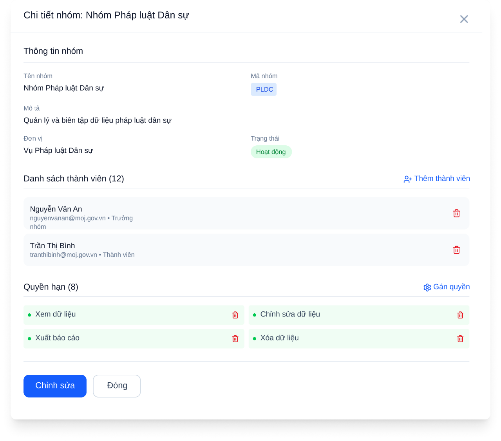

Hình 109 Màn xem chi tiết thông tin nhóm người dùng

###### Mô tả thông tin trên màn hình

|  |  |  |  |  |  |
| --- | --- | --- | --- | --- | --- |
| **STT** | **Tên trường thông tin** | **Kiểu dữ liệu** | **Bắt buộc** | **Mặc định** | **Mô tả** |
| 1 | Tiêu đề màn hình | Label |  | x | Hiển thị tên nhóm đang xem (ví dụ: Nhóm Pháp luật Dân sự). |
| 2 | Tên nhóm | Label |  | x | Tên đầy đủ của nhóm người dùng. |
| 3 | Mã nhóm | Badge |  | x | Mã định danh viết tắt của nhóm (ví dụ: PLDC). |
| 4 | Mô tả | Label |  | x | Nội dung giới thiệu về chức năng, nhiệm vụ của nhóm. |
| 5 | Đơn vị | Label |  | x | Tên cơ quan/đơn vị trực tiếp quản lý. |
| 6 | Trạng thái | Badge |  | x | Tình trạng hoạt động (Hoạt động - màu xanh). |
| 7 | Danh sách thành viên | List |  | x | Hiển thị Họ tên, Email và Vai trò của từng thành viên trong nhóm. |
| 8 | Số lượng thành viên | Label |  | x | Tổng số người dùng thuộc nhóm này. |
| 9 | Danh sách quyền hạn | List |  | x | Liệt kê các quyền chức năng đã gán (Xem, Sửa, Xuất báo cáo...). |
| 10 | Số lượng quyền hạn | Label |  | x | Tổng số hành động nhóm được phép thực hiện. |

###### Chức năng trên màn hình

|  |  |  |  |
| --- | --- | --- | --- |
| **STT** | **Tên chức năng** | **Định dạng** | **Mô tả** |
| 1 | Đóng | Icon | Thoát khỏi cửa sổ xem chi tiết. |
| 2 | Thêm thành viên | Link | Mở popup để tìm kiếm và gán thêm người dùng vào nhóm. |
| 3 | Xóa thành viên | Icon | Loại bỏ một thành viên cụ thể ra khỏi nhóm. |
| 4 | Gán quyền | Link/Icon | Mở giao diện cấu hình thêm hoặc bớt các quyền chức năng. |
| 5 | Xóa quyền hạn | Icon | Thu hồi một quyền cụ thể đã gán cho nhóm. |
| 6 | Chỉnh sửa | Button | Chuyển sang giao diện chỉnh sửa thông tin cơ bản của nhóm. |
| 7 | Đóng | Button | Đóng popup và quay lại màn hình quản lý nhóm. |

##### 4.10.2.2.5. QTND02_05. Màn thêm/xóa thành viên khỏi nhóm người dùng

* Màn hình thông tin chung

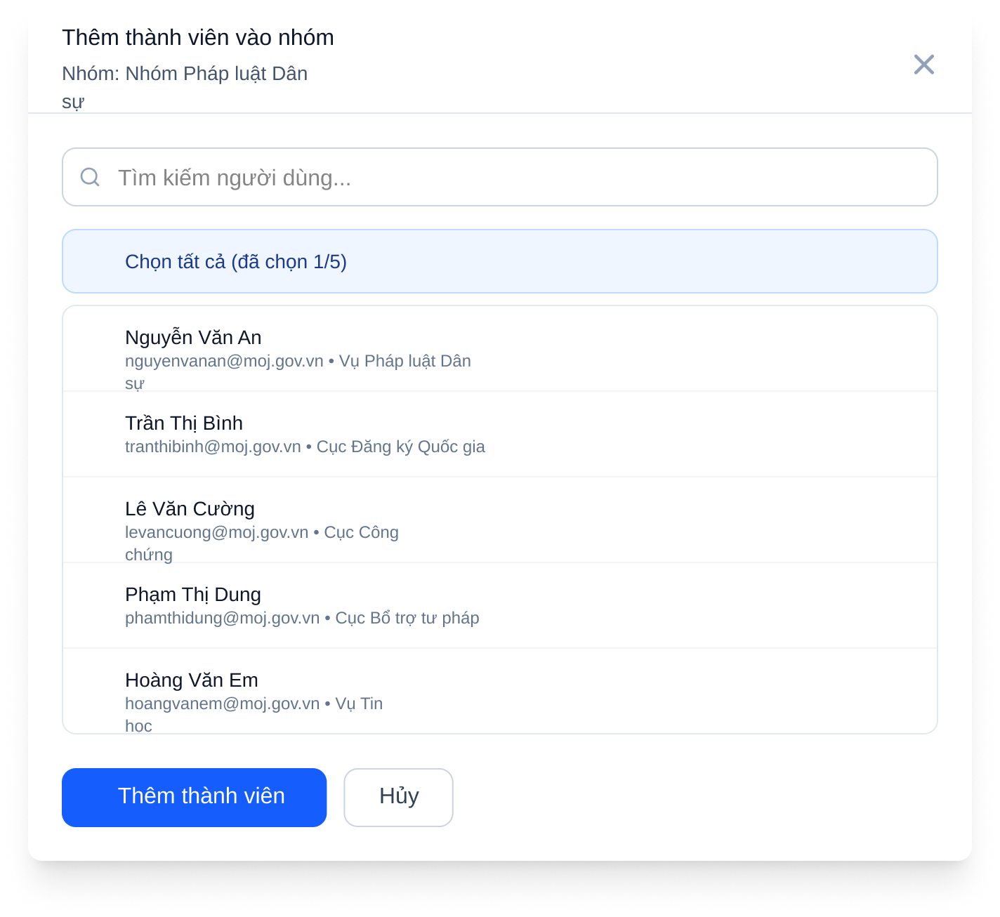

Hình 110 Màn hình thêm thành viên vào nhóm người dùng

###### Mô tả thông tin trên màn hình

| **STT** | **Tên trường thông tin** | **Kiểu dữ liệu** | **Bắt buộc** | **Mặc định** | **Mô tả** |
| --- | --- | --- | --- | --- | --- |
| 1 | Tiêu đề màn hình | Label |  | x | Tên của cửa sổ popup. |
| 2 | Tên nhóm mục tiêu | Label |  | x | Hiển thị tên nhóm hiện tại đang được thêm thành viên. |
| 3 | Ô tìm kiếm người dùng | Search Box |  |  | Nhập tên hoặc email để lọc nhanh danh sách người dùng cần thêm. |
| 4 | Chọn tất cả | Checkbox/Link |  |  | Cho phép chọn nhanh toàn bộ người dùng đang hiển thị trong danh sách. |
| 5 | Trạng thái lựa chọn | Label |  | x | Hiển thị số lượng người dùng đã được tích chọn trên tổng số người dùng khả dụng. |
| 6 | Danh sách người dùng | List Item |  |  | Mỗi dòng bao gồm: Họ tên, Email và Đơn vị công tác của người dùng. |

###### Chức năng trên màn hình

|  |  |  |  |
| --- | --- | --- | --- |
| **STT** | **Tên chức năng** | **Định dạng** | **Mô tả** |
| 1 | Khóa tài khoản | Button | Thực hiện khóa tài khoản, người dùng sẽ lập tức bị logout khỏi hệ thống (nếu đang đăng nhập). |
| 2 | Hủy | Button | Ngừng thao tác xóa, giữ nguyên trạng thái tài khoản và đóng popup. |

##### 4.10.2.2.6. QTND02_05. Màn phân quyền nhóm người dùng

* Màn hình thông tin chung

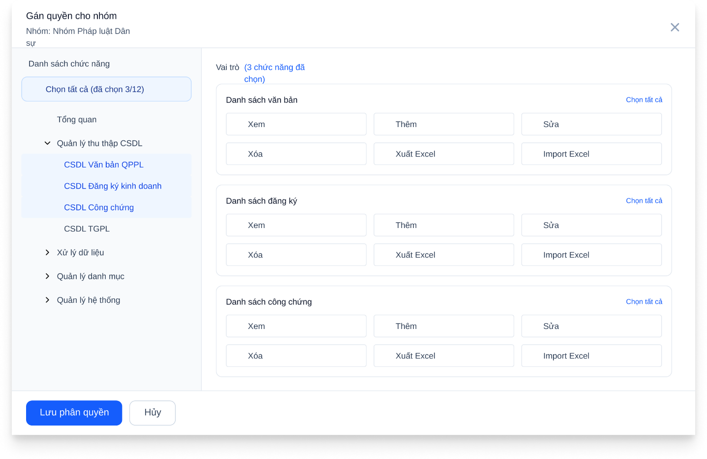

Hình 111 Màn hình phân quyền vào nhóm người dùng

###### Mô tả thông tin trên màn hình

| **STT** | **Tên trường thông tin** | **Kiểu dữ liệu** | **Bắt buộc** | **Mặc định** | **Mô tả** |
| --- | --- | --- | --- | --- | --- |
| 1 | Tiêu đề màn hình | Label |  | x | Tên của cửa sổ popup cấu hình quyền. |
| 2 | Tên nhóm mục tiêu | Label |  | x | Hiển thị tên nhóm đang được phân quyền (ví dụ: Nhóm Pháp luật Dân sự). |
| 3 | Cây thư mục chức năng | Tree View |  |  | Danh sách các nhóm chức năng lớn (Tổng quan, Quản lý thu thập CSDL, Xử lý dữ liệu...). |
| 4 | Chọn tất cả chức năng | Checkbox/Link |  | x | Cho phép chọn nhanh toàn bộ các chức năng có trong cây thư mục. |
| 5 | Nhóm quyền chi tiết | Section |  |  | Các khối quyền cụ thể theo từng module (Ví dụ: Danh sách Text, Danh sách đăng ký...). |
| 6 | Quyền thao tác | Toggle/Button |  |  | Các hành động cụ thể: Xem, Thêm, Sửa, Xóa, Xuất Excel, Import Excel. |
| 7 | Trạng thái quyền | Label |  | x | Thông báo tổng số lượng quyền chi tiết đã được tích chọn trong module hiện tại. |

###### Chức năng trên màn hình

|  |  |  |  |
| --- | --- | --- | --- |
| **STT** | **Tên chức năng** | **Định dạng** | **Mô tả** |
| 1 | Đóng | Icon | Thoát khỏi giao diện phân quyền mà không lưu thay đổi. |
| 2 | Chọn module | Click Tree | Người dùng chọn vào từng mục ở cây thư mục bên trái để hiển thị các quyền chi tiết bên phải. |
| 3 | Chọn tất cả (module) | Link | Tự động tích chọn toàn bộ các quyền thao tác (Xem, Thêm, Sửa...) trong một khối module cụ thể. |
| 4 | Tích chọn quyền | Click Box | Bật/Tắt từng quyền thao tác cụ thể cho nhóm. |
| 5 | Hủy | Button | Đóng popup và không ghi nhận các thay đổi vừa thực hiện. |
| 6 | Lưu phân quyền | Button | Xác nhận ghi đè các thiết lập quyền mới cho nhóm vào hệ thống. |

#### 4.10.2.3. Quản lý danh sách chức năng

##### 4.10.2.3.1. QTND02_05. Màn thêm mới chức năng

* Màn hình thông tin chung

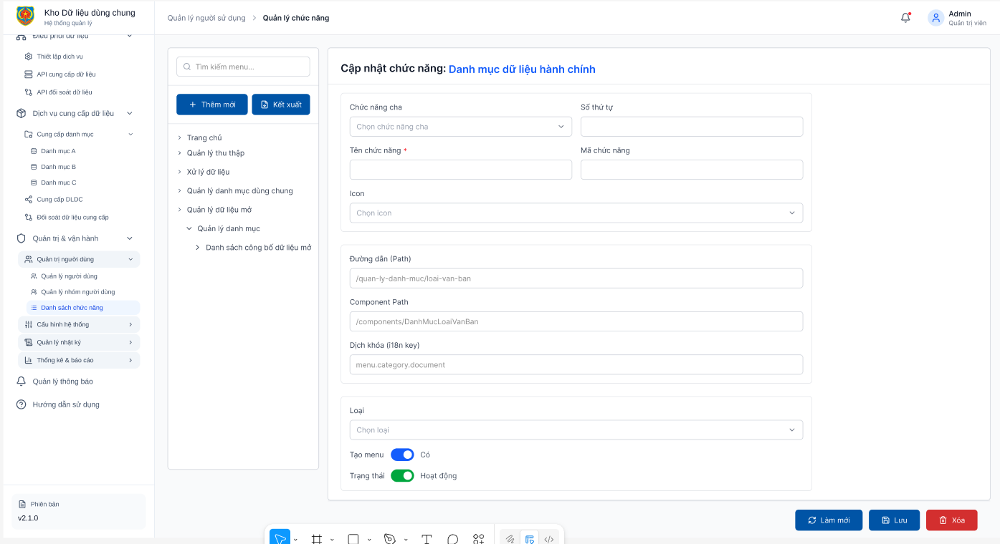

Hình 112 Màn hình thêm mới chức năng

###### Mô tả thông tin trên màn hình

| **STT** | **Tên trường thông tin** | **Kiểu dữ liệu** | **Bắt buộc** | **Mặc định** | **Mô tả** |
| --- | --- | --- | --- | --- | --- |
| 1 | Tên chức năng | Text Input | x | x | Tên hiển thị của chức năng hoặc menu. |
| 2 | Mã chức năng | Text Input | x | x | Mã định danh kỹ thuật (ID) của chức năng. |
| 3 | Icon | Dropdown |  | x | Lựa chọn Button hiển thị kèm theo tên menu. |
| 4 | Đường dẫn (Path) | Text Input | x | x | URL điều hướng khi người dùng nhấn vào chức năng. |
| 5 | Component Path | Text Input | x | x | Đường dẫn vật lý đến tệp mã nguồn tương ứng trong hệ thống. |
| 6 | Dịch khóa (i18n key) | Text Input |  | x | Mã dùng để đa ngôn ngữ hóa tên chức năng. |
| 7 | Loại | Dropdown | x | x | Phân loại mục này là Menu điều hướng hay là một Action (hành động). |
| 8 | Tạo menu | Switch |  | x | Bật/Tắt việc hiển thị mục này trên thanh Sidebar. |
| 9 | Trạng thái | Switch |  | x | Cho phép hoặc không cho phép chức năng này hoạt động trên hệ thống. |

###### Chức năng trên màn hình

|  |  |  |  |
| --- | --- | --- | --- |
| **STT** | **Tên chức năng** | **Định dạng** | **Mô tả** |
| 1 | Tìm kiếm menu | Search Box | Lọc danh sách cây thư mục chức năng ở cột bên trái. |
| 2 | Thêm mới | Button | Làm trống các trường để bắt đầu tạo một chức năng mới. |
| 3 | Kết xuất | Button | Xuất danh sách cấu hình chức năng ra file. |
| 4 | Làm mới | Button | Khôi phục lại dữ liệu ban đầu của chức năng trước khi sửa. |
| 5 | Lưu | Button | Xác nhận ghi đè các thay đổi cấu hình vào hệ thống. |
| 6 | Xóa | Button | Gỡ bỏ hoàn toàn chức năng này khỏi hệ thống. |

##### 4.10.2.3.2. QTND02_05. Màn cập nhật chức năng

* Màn hình thông tin chung

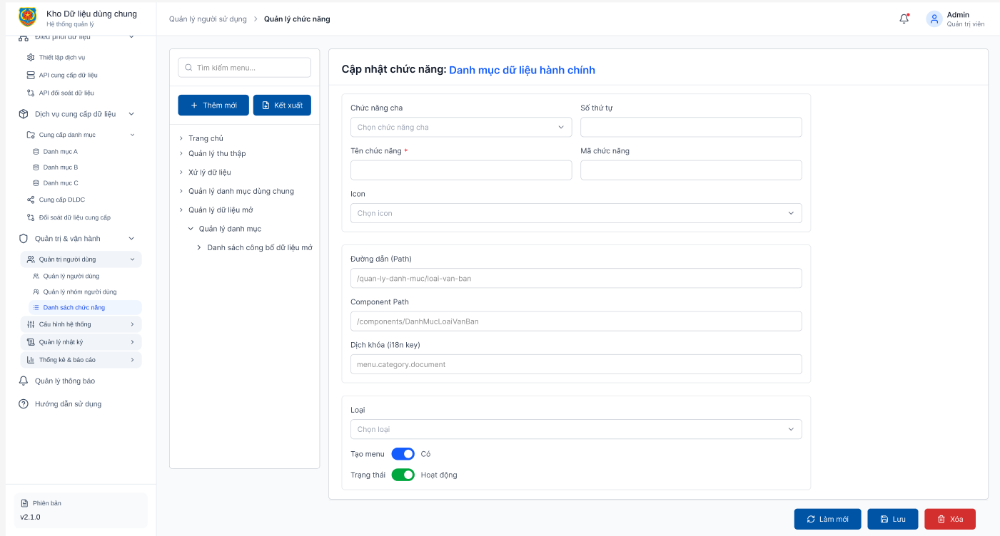

Hình 113 Màn hình thêm mới chức năng

###### Mô tả thông tin trên màn hình

| **STT** | **Tên trường thông tin** | **Kiểu dữ liệu** | **Bắt buộc** | **Mặc định** | **Mô tả** |
| --- | --- | --- | --- | --- | --- |
| 1 | Tên chức năng | Text Input | x | x | Tên hiển thị của chức năng hoặc menu. |
| 2 | Mã chức năng | Text Input | x | x | Mã định danh kỹ thuật (ID) của chức năng. |
| 3 | Icon | Dropdown |  | x | Lựa chọn Button hiển thị kèm theo tên menu. |
| 4 | Đường dẫn (Path) | Text Input | x | x | URL điều hướng khi người dùng nhấn vào chức năng. |
| 5 | Component Path | Text Input | x | x | Đường dẫn vật lý đến tệp mã nguồn tương ứng trong hệ thống. |
| 6 | Dịch khóa (i18n key) | Text Input |  | x | Mã dùng để đa ngôn ngữ hóa tên chức năng. |
| 7 | Loại | Dropdown | x | x | Phân loại mục này là Menu điều hướng hay là một Action (hành động). |
| 8 | Tạo menu | Switch |  | x | Bật/Tắt việc hiển thị mục này trên thanh Sidebar. |
| 9 | Trạng thái | Switch |  | x | Cho phép hoặc không cho phép chức năng này hoạt động trên hệ thống. |

###### Chức năng trên màn hình

|  |  |  |  |
| --- | --- | --- | --- |
| **STT** | **Tên chức năng** | **Định dạng** | **Mô tả** |
| 1 | Tìm kiếm menu | Search Box | Lọc danh sách cây thư mục chức năng ở cột bên trái. |
| 2 | Thêm mới | Button | Làm trống các trường để bắt đầu tạo một chức năng mới. |
| 3 | Kết xuất | Button | Xuất danh sách cấu hình chức năng ra file. |
| 4 | Làm mới | Button | Khôi phục lại dữ liệu ban đầu của chức năng trước khi sửa. |
| 5 | Lưu | Button | Xác nhận ghi đè các thay đổi cấu hình vào hệ thống. |
| 6 | Xóa | Button | Gỡ bỏ hoàn toàn chức năng này khỏi hệ thống. |

##### 4.10.2.3.3. QTND02_05. Màn xóa chức năng

* Màn hình thông tin chung

Hình 114 Màn hình xóa chức năng

###### Mô tả thông tin trên màn hình

| **STT** | **Tên trường thông tin** | **Kiểu dữ liệu** | **Bắt buộc** | **Mặc định** | **Mô tả** |
| --- | --- | --- | --- | --- | --- |
| 1 | Tiêu đề màn hình | Label |  | x | Tên của cửa sổ thông báo. |
| 2 | Nội dung xác nhận | Label |  | x | Hiển thị tên người dùng cụ thể đang được chọn để xóa (Ví dụ: Nguyễn Văn An). |
| 3 | Cảnh báo hệ thống | Label |  | x | Thông báo cảnh báo rủi ro về việc mất dữ liệu vĩnh viễn (hiển thị màu đỏ). |

###### Chức năng trên màn hình

|  |  |  |  |
| --- | --- | --- | --- |
| **STT** | **Tên chức năng** | **Định dạng** | **Mô tả** |
| 1 | Xóa chức năng | Button | Thực hiện lệnh xóa vĩnh viễn nhóm khỏi hệ thống và đóng popup. |
| 2 | Hủy | Button | Ngừng thao tác xóa, giữ nguyên trạng thái tài khoản và đóng popup. |

### 4.10.3. Cấu hình hệ thống

##### 4.10.3.1. QTCH01. Màn thiết lập cấu hình hệ thống

* Màn hình thông tin chung

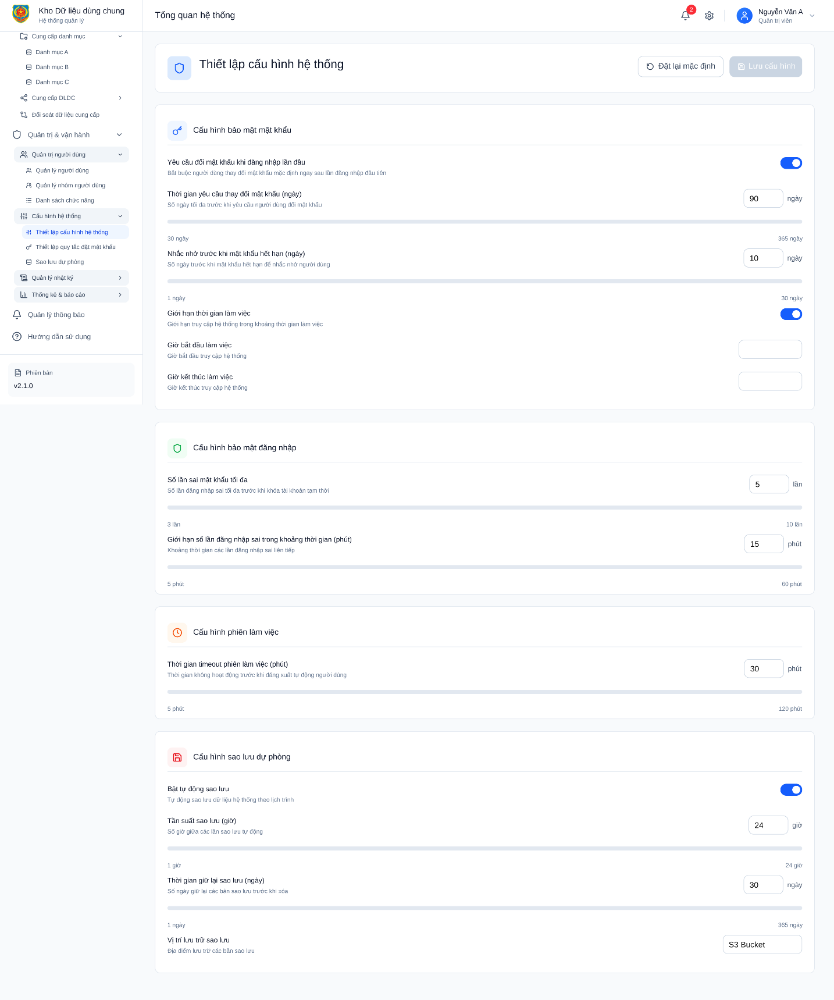

Hình 115 Màn hình thiết lập cấu hình hệ thống

###### Mô tả thông tin trên màn hình

| **STT** | **Tên trường thông tin** | **Kiểu dữ liệu** | **Bắt buộc** | **Mặc định** | **Mô tả** |
| --- | --- | --- | --- | --- | --- |
| **I** | **Cấu hình bảo mật mật khẩu** |  |  |  |  |
| 1 | Yêu cầu đổi mật khẩu lần đầu | Switch |  | x | Bắt buộc người dùng đổi mật khẩu ngay sau lần đăng nhập đầu tiên. |
| 2 | Thời gian yêu cầu thay đổi | Number | x | x | Số ngày tối đa mật khẩu có hiệu lực trước khi yêu cầu đổi mới. |
| 3 | Nhắc nhở trước khi hết hạn | Number | x | x | Số ngày thông báo trước cho người dùng khi mật khẩu sắp hết hạn. |
| 4 | Giới hạn thời gian làm việc | Switch |  | x | Bật/Tắt khung giờ cho phép truy cập hệ thống. |
| 5 | Giờ bắt đầu/kết thúc | Time |  |  | Khung giờ cụ thể cho phép đăng nhập nếu bật giới hạn. |
| **II** | **Cấu hình bảo mật đăng nhập** |  |  |  |  |
| 6 | Số lần sai mật khẩu tối đa | Number | x | x | Số lần nhập sai cho phép trước khi khóa tài khoản tạm thời. |
| 7 | Thời gian khóa tạm thời | Number | x | x | Khoảng thời gian tài khoản bị khóa sau khi nhập sai quá số lần. |
| **III** | **Cấu hình phiên làm việc** |  |  |  |  |
| 8 | Thời gian timeout phiên | Number | x | x | Thời gian không tương tác tối đa trước khi tự động đăng xuất. |
| **IV** | **Cấu hình sao lưu dự phòng** |  |  |  |  |
| 9 | Bật tự động sao lưu | Switch |  | x | Cho phép hệ thống tự động backup dữ liệu theo lịch. |
| 10 | Tần suất sao lưu | Number | x | x | Khoảng thời gian giữa các lần tự động sao lưu. |
| 11 | Thời gian giữ lại bản sao | Number | x | x | Số ngày lưu trữ các bản backup trước khi tự động xóa. |
| 12 | Vị trí lưu trữ | Text/Select |  | x | Địa điểm vật lý hoặc dịch vụ lưu trữ tệp sao lưu. |

###### Chức năng trên màn hình

|  |  |  |  |
| --- | --- | --- | --- |
| **STT** | **Tên chức năng** | **Định dạng** | **Mô tả** |
| 1 | Đặt lại mặc định | Button | Khôi phục toàn bộ các tham số về giá trị ban đầu của nhà sản xuất. |
| 2 | Lưu cấu hình | Button | Ghi nhận và áp dụng ngay lập tức các thay đổi cấu hình lên hệ thống. |

##### 4.10.3.2. QTCH02. Thiết lập quy tắc đặt mật khẩu

* Màn hình thông tin chung

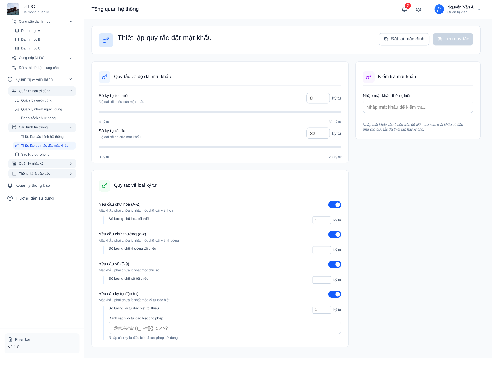

Hình 116 Màn hình thiết lập quy tắc đặt mật khẩu

###### Mô tả thông tin trên màn hình

| **STT** | **Tên trường thông tin** | **Kiểu dữ liệu** | **Bắt buộc** | **Mặc định** | **Mô tả** |
| --- | --- | --- | --- | --- | --- |
| **I** | **Quy tắc về độ dài mật khẩu** |  |  |  |  |
| 1 | Số ký tự tối thiểu | Number | x | x | Độ dài ngắn nhất mà mật khẩu phải đạt được. |
| 2 | Số ký tự tối đa | Number | x | x | Giới hạn độ dài lớn nhất của mật khẩu. |
| **II** | **Quy tắc về loại ký tự** |  |  |  |  |
| 3 | Yêu cầu chữ hoa (A-Z) | Switch/Num |  | x | Mật khẩu phải chứa ít nhất số lượng chữ cái viết hoa quy định. |
| 4 | Yêu cầu chữ thường (a-z) | Switch/Num |  | x | Mật khẩu phải chứa ít nhất số lượng chữ cái viết thường quy định. |
| 5 | Yêu cầu số (0-9) | Switch/Num |  | x | Mật khẩu phải chứa ít nhất số lượng chữ số quy định. |
| 6 | Yêu cầu ký tự đặc biệt | Switch/Num |  | x | Mật khẩu phải chứa ít nhất số lượng ký tự đặc biệt quy định. |
| 7 | Danh sách ký tự đặc biệt | Text Input |  | x | Các ký tự cụ thể được phép sử dụng trong mật khẩu. |
| **III** | **Kiểm tra mật khẩu** |  |  |  |  |
| 8 | Nhập mật khẩu thử nghiệm | Password |  |  | Text để quản trị viên kiểm tra xem mật khẩu dự định có thỏa mãn các quy tắc trên không. |

###### Chức năng trên màn hình

|  |  |  |  |
| --- | --- | --- | --- |
| **STT** | **Tên chức năng** | **Định dạng** | **Mô tả** |
| 1 | Đặt lại mặc định | Button | Khôi phục các quy tắc về tiêu chuẩn an toàn cơ bản của hệ thống. |
| 2 | Lưu quy tắc | Button | Xác nhận và áp dụng bộ quy tắc mới cho toàn bộ người dùng khi đổi mật khẩu. |
| 3 | Thử nghiệm mật khẩu | Logic | Hệ thống tự động kiểm tra và hiển thị các quy tắc chưa đạt khi người dùng nhập vào ô "Kiểm tra mật khẩu". |

##### 4.10.3.3. QTSLDP. Màn sao lưu dự phòng

Màn hình thông tin chung

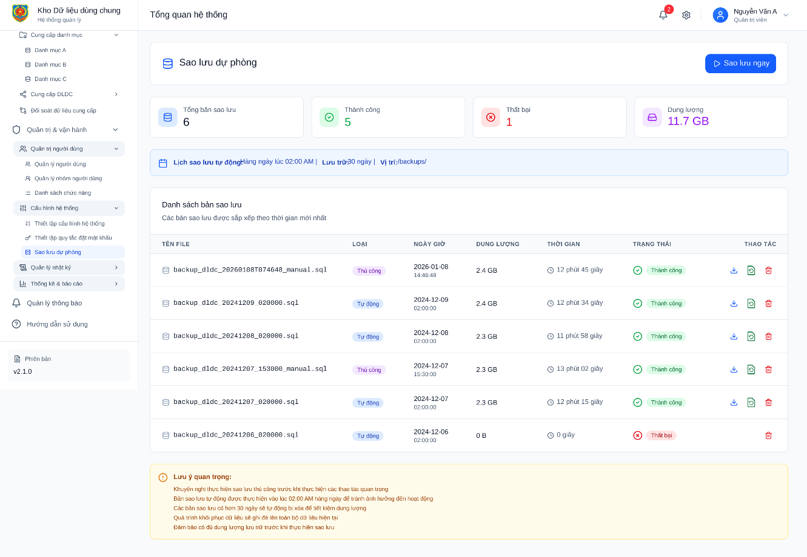

Hình 117 Màn hình thiết lập quy tắc đặt mật khẩu

###### Mô tả thông tin trên màn hình

| **STT** | **Tên trường thông tin** | **Kiểu dữ liệu** | **Bắt buộc** | **Mặc định** | **Mô tả** |
| --- | --- | --- | --- | --- | --- |
| 1 | Tổng bản sao lưu | Card/Number |  | x | Tổng số lượng tệp sao lưu hiện có trong kho lưu trữ. |
| 2 | Thành công | Card/Number |  | x | Số lượng bản sao lưu được tạo thành công và sẵn dụng. |
| 3 | Thất bại | Card/Number |  | x | Số lượng tiến trình sao lưu bị lỗi trong quá trình thực hiện. |
| 4 | Dung lượng | Card/Number |  | x | Tổng dung lượng bộ nhớ mà các bản sao lưu đang chiếm dụng. |
| 5 | Lịch sao lưu tự động | Banner/Label |  | x | Thông tin tóm tắt về lịch trình: Thời gian chạy, chu kỳ giữ lại (30 ngày) và vị trí lưu trữ. |
| 6 | Tên file | Text |  |  | Tên tệp sao lưu (thường bao gồm mã hệ thống, ngày tháng và loại hình sao lưu). |
| 7 | Loại | Tag |  |  | Phân loại: **Tự động** (theo lịch) hoặc **Thủ công** (do admin kích hoạt). |
| 8 | Date time | DateTime |  |  | Thời điểm chính xác bắt đầu thực hiện sao lưu. |
| 9 | Dung lượng file | Number |  |  | Kích thước vật lý của tệp sao lưu (ví dụ: 2.4 GB). |
| 10 | Thời gian thực hiện | Number |  |  | Tổng thời gian để hoàn thành tiến trình sao lưu (ví dụ: 12 phút 45 giây). |
| 11 | Trạng thái | Badge |  |  | Tình trạng tệp: **Thành công** (Xanh) hoặc **Thất bại** (Đỏ). |

###### Chức năng trên màn hình

|  |  |  |  |
| --- | --- | --- | --- |
| **STT** | **Tên chức năng** | **Định dạng** | **Mô tả** |
| 1 | Sao lưu ngay | Button | Kích hoạt tiến trình sao lưu thủ công tức thời cho hệ thống. |
| 2 | Tải xuống | Icon | Tải tệp sao lưu về máy tính cá nhân. |
| 3 | Khôi phục dữ liệu | Icon | Sử dụng bản sao lưu được chọn để ghi đè/khôi phục lại trạng thái hệ thống tại thời điểm đó. |
| 4 | Xóa bản sao lưu | Icon | Loại bỏ tệp sao lưu khỏi kho lưu trữ để giải phóng dung lượng. |

##### 4.10.3.4. QTSLDP. Xóa dự phòng

Màn hình thông tin chung

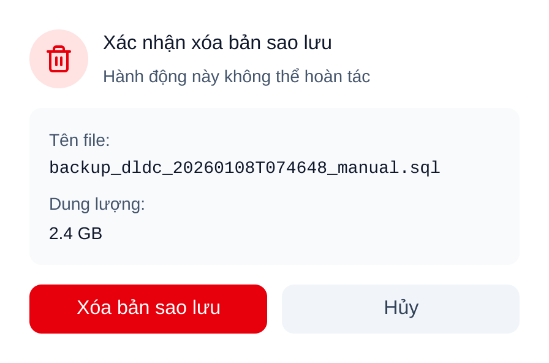

Hình 118 Màn hình xóa sao lưu

###### Mô tả thông tin trên màn hình

| **STT** | **Tên trường thông tin** | **Kiểu dữ liệu** | **Bắt buộc** | **Mặc định** | **Mô tả** |
| --- | --- | --- | --- | --- | --- |
| 1 | Tiêu đề màn hình | Label |  | x | Tên của cửa sổ thông báo. |
| 2 | Nội dung xác nhận | Label |  | x | Hiển thị tên người dùng cụ thể đang được chọn để xóa (Ví dụ: Nguyễn Văn An). |

###### Chức năng trên màn hình

|  |  |  |  |
| --- | --- | --- | --- |
| **STT** | **Tên chức năng** | **Định dạng** | **Mô tả** |
| 1 | Xóa bản sao lưu | Button | Thực hiện lệnh xóa vĩnh viễn nhóm khỏi hệ thống và đóng popup. |
| 2 | Hủy | Button | Ngừng thao tác xóa, giữ nguyên trạng thái tài khoản và đóng popup. |

### 4.10.4. Quản lý nhật ký

#### 4.10.4.1. Nhật ký truy cập

##### 4.10.4.1.1. NKTC01. Tra cứu danh nhật ký truy cập

Màn hình thông tin chung

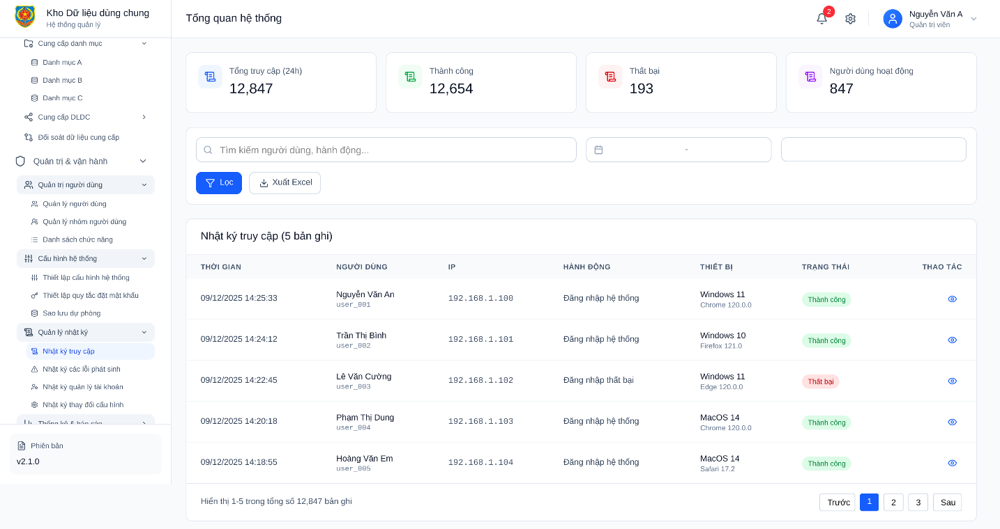

Hình 119 Màn hình tra cứu nhật ký truy cập

###### Mô tả thông tin trên màn hình

| **STT** | **Tên trường thông tin** | **Kiểu dữ liệu** | **Bắt buộc** | **Mặc định** | **Mô tả** |
| --- | --- | --- | --- | --- | --- |
| 1 | Tổng truy cập (24h) | Card/Number |  | x | Tổng số lượt tương tác được ghi nhận trong 24 giờ qua. |
| 2 | Thành công | Card/Number |  | x | Số lượng hành động thực hiện thành công. |
| 3 | Thất bại | Card/Number |  | x | Số lượng hành động bị lỗi hoặc đăng nhập không thành công. |
| 4 | Người dùng hoạt động | Card/Number |  | x | Số lượng tài khoản duy nhất có phát sinh tương tác. |
| 5 | Tìm kiếm tổng hợp | Search Box |  |  | Tìm kiếm theo tên người dùng hoặc hành động cụ thể. |
| 6 | Lọc theo thời gian | Date Range |  |  | Chọn khoảng ngày để xem nhật ký. |
| 7 | Thời gian | DateTime |  |  | Thời điểm chính xác phát sinh sự kiện (Ngày/Tháng/Năm Giờ:Phút:Giây). |
| 8 | Người dùng | Text |  |  | Họ tên và mã định danh (username) của người thực hiện. |
| 9 | IP | Text |  |  | Địa chỉ IP của thiết bị thực hiện truy cập. |
| 10 | Hành động | Text |  |  | Mô tả loại tương tác (Ví dụ: Đăng nhập hệ thống, Đăng nhập thất bại). |
| 11 | Thiết bị | Text |  |  | Thông tin hệ điều hành và trình duyệt sử dụng (Ví dụ: Windows 11, Chrome 120.0.0). |
| 12 | Trạng thái | Badge |  |  | Tình trạng: **Thành công** (Xanh) hoặc **Thất bại** (Đỏ). |

###### Chức năng trên màn hình

|  |  |  |  |
| --- | --- | --- | --- |
| **STT** | **Tên chức năng** | **Định dạng** | **Mô tả** |
| 1 | Lọc dữ liệu | Button | Áp dụng các điều kiện tìm kiếm và thời gian để làm mới danh sách. |
| 2 | Xuất Excel | Button | Trích xuất toàn bộ hoặc danh sách nhật ký đã lọc ra tệp Excel. |
| 3 | Chi tiết | Icon | Mở popup xem thông tin chi tiết đầy đủ của một bản ghi nhật ký. |
| 4 | Phân trang | Pagination | Chuyển đổi giữa các trang dữ liệu (Hiển thị 1-5 trong tổng số bản ghi). |

##### 4.10.4.1.2. NKTC01. Xem chi tiết danh nhật ký truy cập

Màn hình thông tin chung

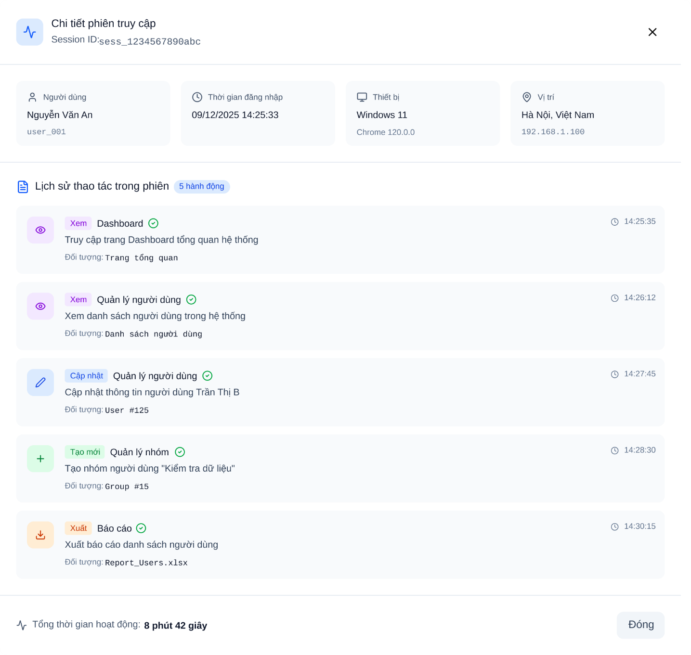

Hình 120 Màn hình chi tiết nhật ký truy cập

###### Mô tả thông tin trên màn hình

| **STT** | **Tên trường thông tin** | **Kiểu dữ liệu** | **Bắt buộc** | **Mặc định** | **Mô tả** |
| --- | --- | --- | --- | --- | --- |
| 1 | Session ID | Label |  |  | Mã định danh duy nhất của phiên làm việc (Ví dụ: sess\_1234567890abc). |
| 2 | Người dùng | Card/Text |  |  | Hiển thị Họ tên và Mã người dùng thực hiện phiên (Ví dụ: Nguyễn Văn An - user\_001). |
| 3 | Thời gian đăng nhập | Card/DateTime |  |  | Thời điểm chính xác người dùng bắt đầu phiên làm việc. |
| 4 | Thiết bị | Card/Text |  |  | Thông tin hệ điều hành và trình duyệt sử dụng (Ví dụ: Windows 11 - Chrome 120.0.0). |
| 5 | Vị trí | Card/Text |  |  | Địa điểm truy cập và địa chỉ IP của thiết bị (Ví dụ: Hà Nội, Việt Nam - 192.168.1.100). |
| 6 | Tổng số hành động | Badge/Number |  |  | Hiển thị tổng số lượng thao tác đã thực hiện trong phiên (Ví dụ: 5 hành động). |
| 7 | Thời gian hành động | DateTime (Timeline) |  |  | Mốc thời gian cụ thể phát sinh từng thao tác đơn lẻ trong phiên. |
| 8 | Loại hành động | Tag/Text |  |  | Phân loại thao tác: Xem, Cập nhật, Tạo mới, Xuất. |
| 9 | Tên chức năng | Text |  |  | Tên module hoặc trang mà người dùng đã tương tác (Ví dụ: Dashboard, Quản lý người dùng). |
| 10 | Nội dung chi tiết | Text |  |  | Mô tả ngắn gọn về hành động (Ví dụ: Truy cập trang Dashboard tổng quan hệ thống). |
| 11 | Đối tượng tác động | Label |  |  | Tên bản ghi hoặc tệp tin bị tác động bởi hành động (Ví dụ: User #125, Report\_Users.xlsx). |
| 12 | Tổng thời gian hoạt động | Label |  |  | Khoảng thời gian từ lúc bắt đầu đến khi kết thúc phiên (Ví dụ: 8 phút 42 giây). |

###### Chức năng trên màn hình

|  |  |  |  |
| --- | --- | --- | --- |
| **STT** | **Tên chức năng** | **Định dạng** | **Mô tả** |
| 1 | Đóng | Icon | Thoát khỏi cửa sổ xem chi tiết phiên. |
| 2 | Trạng thái hành động | Icon | Hiển thị xác nhận hành động đó đã được hệ thống thực hiện thành công. |
| 3 | Đóng | Button | Đóng popup và quay lại danh sách nhật ký truy cập. |

#### 4.10.4.2. Nhật ký các phát sinh

##### 4.10.4.2.1. NKPS01. Tra cứu danh nhật ký lỗi phát sinh

Màn hình thông tin chung

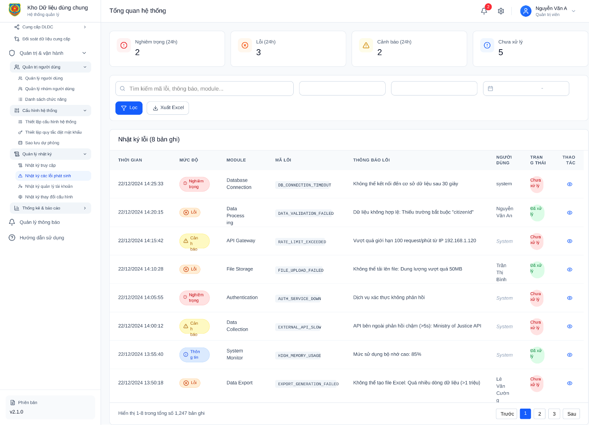

Hình 121 Màn hình tra cứu nhật ký lỗi phát sinh

###### Mô tả thông tin trên màn hình

| **STT** | **Tên trường thông tin** | **Kiểu dữ liệu** | **Bắt buộc** | **Mặc định** | **Mô tả** |
| --- | --- | --- | --- | --- | --- |
| 1 | Nghiêm trọng (24h) | Card/Number |  | x | Tổng số lỗi mức độ nghiêm trọng cần xử lý ngay lập tức. |
| 2 | Lỗi (24h) | Card/Number |  | x | Tổng số lỗi phát sinh trong quá trình vận hành thông thường. |
| 3 | Cảnh báo (24h) | Card/Number |  | x | Các sự kiện bất thường có nguy cơ gây lỗi hệ thống. |
| 4 | Chưa xử lý | Card/Number |  | x | Số lượng bản ghi lỗi chưa được quản trị viên xác nhận/khắc phục. |
| 5 | Tìm kiếm theo mã lỗi | Search Box |  |  | Tìm kiếm các bản ghi dựa trên mã lỗi, module hoặc thông báo. |
| 6 | Lọc theo thời gian | Date Range |  |  | Chọn khoảng ngày để xem nhật ký lỗi phát sinh. |
| 7 | Thời gian | DateTime |  |  | Thời điểm chính xác phát sinh sự kiện lỗi (Ngày/Tháng/Năm Giờ:Phút:Giây). |
| 8 | Mức độ | Badge |  |  | Phân loại độ ưu tiên: Nghiêm trọng (Đỏ), Lỗi (Cam), Cảnh báo (Vàng), Thông tin (Xanh). |
| 9 | Module | Text |  |  | Tên phân hệ hoặc dịch vụ xảy ra lỗi (Ví dụ: Database Connection, API Gateway). |
| 10 | Mã lỗi | Code |  |  | Mã định danh kỹ thuật của lỗi (Ví dụ: DB\_CONNECTION\_TIMEOUT). |
| 11 | Thông báo lỗi | Text |  |  | Nội dung chi tiết về sự cố xảy ra bằng ngôn ngữ dễ hiểu. |
| 12 | Người dùng | Text |  |  | Tài khoản đang vận hành khi xảy ra lỗi hoặc "system" nếu là lỗi hệ thống. |
| 13 | Trạng thái | Badge |  |  | Tình trạng xử lý lỗi: Chưa xử lý (Đỏ), Đã xử lý (Xanh). |

###### Chức năng trên màn hình

|  |  |  |  |
| --- | --- | --- | --- |
| **STT** | **Tên chức năng** | **Định dạng** | **Mô tả** |
| 1 | Lọc | Button | Thực hiện tìm kiếm theo các tiêu chí đã nhập. |
| 2 | Xuất Excel | Button | Trích xuất danh sách các lỗi đang hiển thị ra tệp Excel để báo cáo. |
| 3 | Chi tiết lỗi | Icon | Mở popup xem thông tin kỹ thuật chuyên sâu (Stack trace) của bản ghi lỗi. |
| 4 | Phân trang | Pagination | Chuyển đổi giữa các trang dữ liệu nhật ký (Hiển thị 1-8 trong tổng số bản ghi). |

##### 4.10.4.2.2. NKTC01. Xem chi tiết danh nhật ký lỗi phát sinh

Màn hình thông tin chung

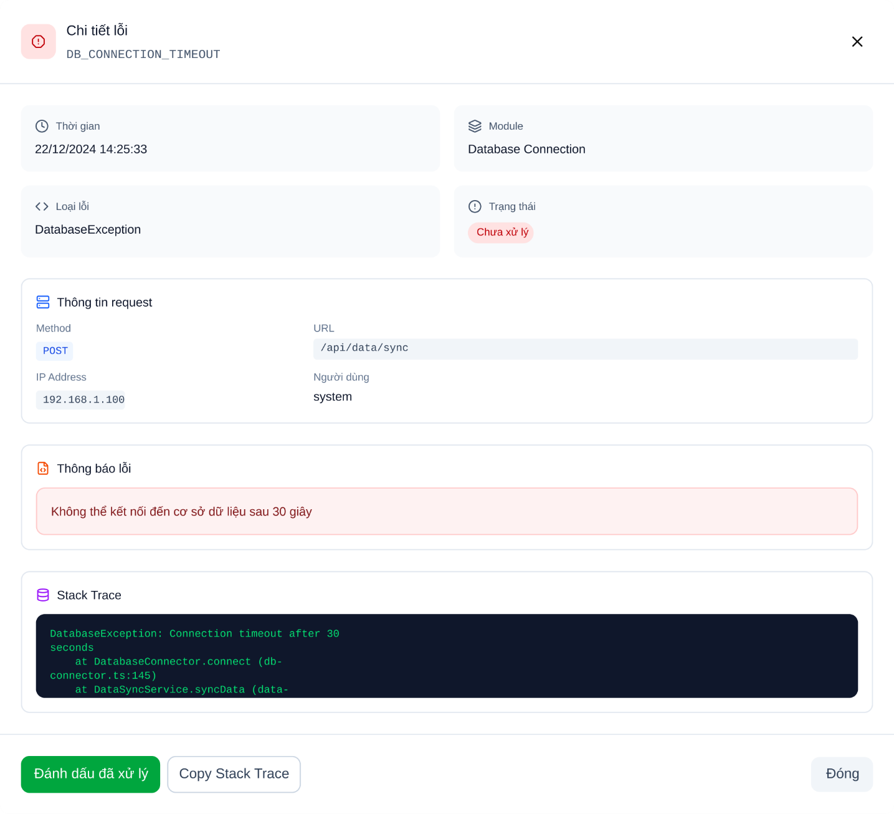

Hình 122 Màn hình chi tiết nhật ký lỗi

###### Mô tả thông tin trên màn hình

|  |  |  |  |  |  |
| --- | --- | --- | --- | --- | --- |
| **STT** | **Tên trường thông tin** | **Kiểu dữ liệu** | **Bắt buộc** | **Mặc định** | **Mô tả** |
| 1 | Thông tin Request | Card |  |  | Hiển thị Method (POST/GET), URL API, IP Address và Người dùng gây lỗi. |
| 2 | Thông báo lỗi | Text Box |  |  | Hiển thị nội dung lỗi trả về từ hệ thống (Màu đỏ). |
| 3 | Stack Trace | Code Block |  |  | Hiển thị chi tiết vết lỗi kỹ thuật từ mã nguồn (Log trace). |
| 4 | Đánh dấu đã xử lý | Button |  |  | Xác nhận lỗi đã được kiểm tra và khắc phục xong. |
| 5 | Copy Stack Trace | Button |  |  | Sao chép nhanh toàn bộ nội dung vết lỗi vào bộ nhớ tạm. |

###### Chức năng trên màn hình

|  |  |  |  |
| --- | --- | --- | --- |
| **STT** | **Tên chức năng** | **Định dạng** | **Mô tả** |
| 1 | Đóng | Icon | Thoát khỏi cửa sổ xem chi tiết phiên. |
| 2 | Đánh dấu đã xử lý | Icon | Đánh dấu lỗi này đã xử lý |
| 3 | Copy Stack Trace | Button | Copy Stack Trace |

#### 4.10.4.3. Nhật ký quản lý tài khoản

##### 4.10.4.3.1. NKPS01. Tra cứu danh nhật ký tài khoản

Màn hình thông tin chung

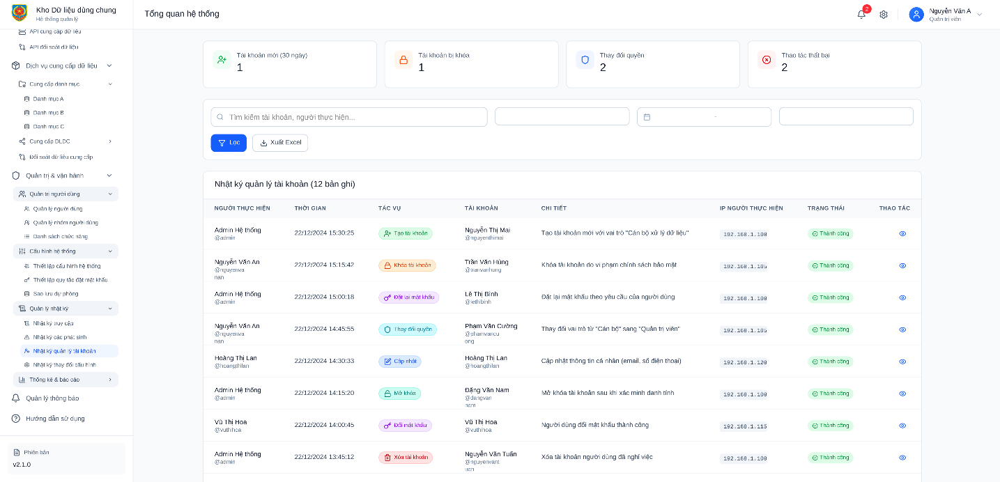

Hình 123 Màn hình tra cứu nhật ký quản lý tài khoản

###### Mô tả thông tin trên màn hình

| **STT** | **Tên trường thông tin** | **Kiểu dữ liệu** | **Bắt buộc** | **Mặc định** | **Mô tả** |
| --- | --- | --- | --- | --- | --- |
| 1 | Người thực hiện | Text | x | x | Tên và username của người tác động vào hệ thống. |
| 2 | Thời gian | Date time | x | x | Thời điểm chính xác xảy ra tác vụ (Ngày/Tháng/Năm Giờ:Phút:Giây). |
| 3 | Tác vụ | Danh mục/Label | x | x | Loại hành động (Tạo tài khoản, Khóa tài khoản, Đổi mật khẩu, v.v.). |
| 4 | Tài khoản | Text | x | x | Tên và username của đối tượng bị tác động. |
| 5 | Chi tiết | Text |  | x | Mô tả cụ thể về nội dung thay đổi hoặc lý do thực hiện. |
| 6 | IP người thực hiện | Text | x | x | Địa chỉ mạng của thiết bị thực hiện thao tác. |
| 7 | Trạng thái | Danh mục | x | x | Kết quả của tác vụ (Thành công/Thất bại). |
| 8 | Thao tác | Button |  | x | Nút xem chi tiết hơn về bản ghi nhật ký. |

###### Chức năng trên màn hình

|  |  |  |  |
| --- | --- | --- | --- |
| **STT** | **Tên chức năng** | **Định dạng** | **Mô tả** |
| 1 | Thống kê tổng quan | (Cards) | Hiển thị nhanh số lượng: Tài khoản mới, Tài khoản bị khóa, Thay đổi quyền, Tài khoản mất kết nối. |
| 2 | Tìm kiếm | Text | Cho phép tìm nhanh theo tên tài khoản hoặc người thực hiện. |
| 3 | Bộ lọc (Lọc) | Button | Lọc dữ liệu nhật ký theo các tiêu chí cụ thể (Thời gian, Tác vụ, Trạng thái). |
| 4 | Xuất Excel | Button | Trích xuất toàn bộ hoặc một phần nhật ký ra file Excel để báo cáo. |
| 5 | Xem chi tiết | Button | Xem thông tin đầy đủ của một dòng nhật ký cụ thể. |
| 6 | Phân trang | Button | Di chuyển giữa các trang khi danh sách nhật ký có nhiều bản ghi. |

##### 4.10.4.3.2. NKTC01. Xem chi tiết nhật ký tài khoản

Màn hình thông tin chung

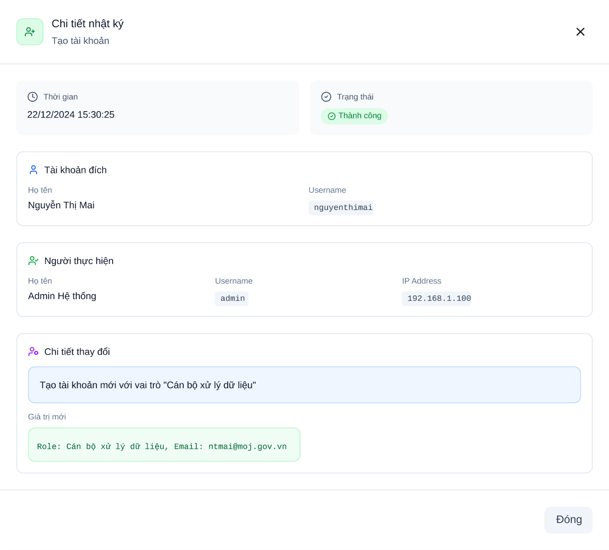

Hình 124 Màn hình chi tiết nhật ký tài khoản

###### Mô tả thông tin trên màn hình

| **STT** | **Tên trường thông tin** | **Kiểu dữ liệu** | **Bắt buộc** | **Mặc định** | **Mô tả** |
| --- | --- | --- | --- | --- | --- |
| 1 | Tiêu đề tác vụ | Text |  | x | Tên của loại nhật ký (ví dụ: Tạo tài khoản). |
| 2 | Thời gian | Date time |  | x | Thời điểm thực hiện hành động. |
| 3 | Trạng thái | Label |  | x | Trạng thái kết quả của tác vụ. |
| 4 | Họ tên (Tài khoản đích) | Text |  | x | Tên người dùng của tài khoản bị tác động. |
| 5 | Username (Tài khoản đích) | Text |  | x | Tên đăng nhập của tài khoản bị tác động. |
| 6 | Họ tên (Người thực hiện) | Text |  | x | Tên quản trị viên thực hiện thao tác. |
| 7 | Username (Người thực hiện) | Text |  | x | Tên đăng nhập của người thực hiện. |
| 8 | IP Address | Text |  | x | Địa chỉ mạng của người thực hiện. |
| 9 | Nội dung thay đổi | Text |  | x | Mô tả hành động thực hiện trong hệ thống. |
| 10 | Giá trị mới | Text |  | x | Chi tiết các tham số kỹ thuật (Role, Email) sau khi thay đổi. |

###### Chức năng trên màn hình

|  |  |  |  |
| --- | --- | --- | --- |
| **STT** | **Tên chức năng** | **Định dạng** | **Mô tả** |
| 1 | Đóng | Button | Cho phép người dùng thoát khỏi cửa sổ xem chi tiết để quay lại màn hình danh sách. |

#### 4.10.4.4. Nhật ký thay đổi cấu hình

##### 4.10.4.4.1. TDCH01. Tra cứu danh nhật ký thay đổi cấu hình

Màn hình thông tin chung

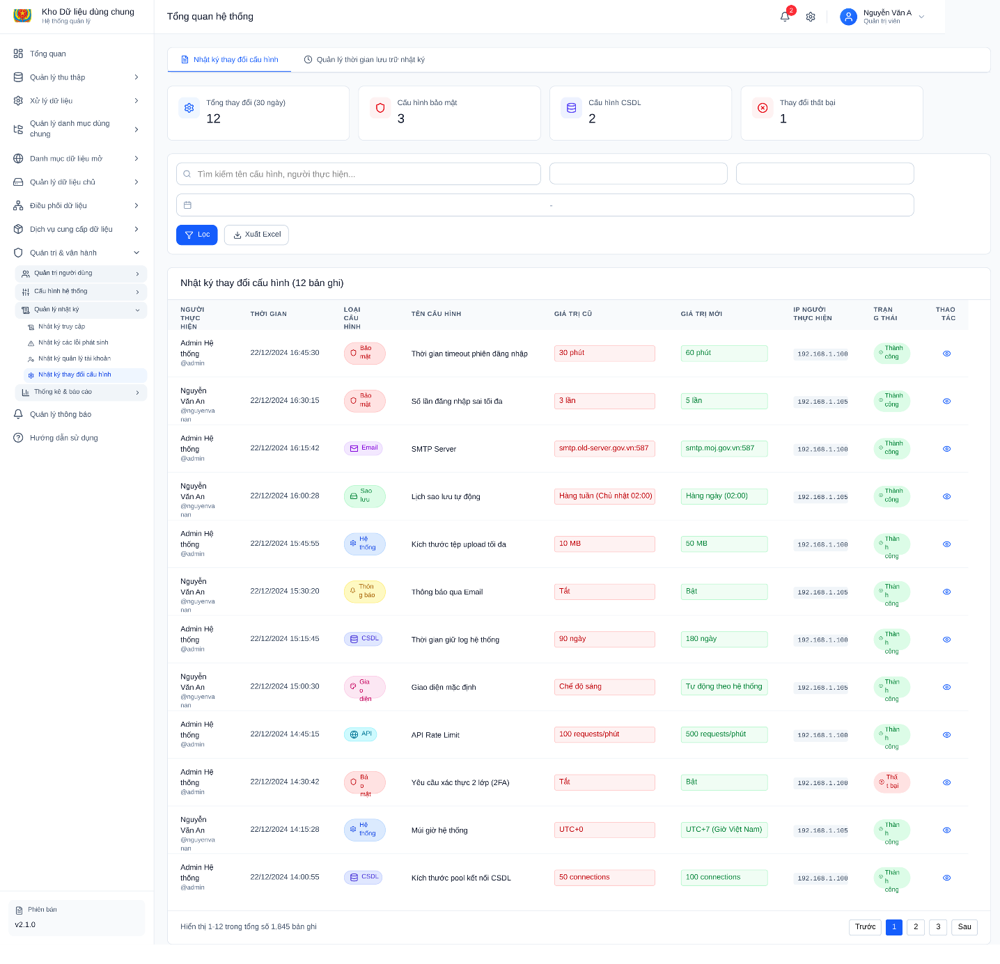

Hình 125 Màn hình nhật ký thay đổi cấu hình

###### Mô tả thông tin trên màn hình

| **STT** | **Tên trường thông tin** | **Kiểu dữ liệu** | **Bắt buộc** | **Mặc định** | **Mô tả** |
| --- | --- | --- | --- | --- | --- |
| 1 | Người thực hiện | Text |  | x | Hiển thị Họ tên và Username người thực hiện thay đổi. |
| 2 | Thời gian | Date time |  | x | Thời điểm thực hiện thay đổi (Ngày/Tháng/Năm Giờ:Phút). |
| 3 | Loại cấu hình | Label |  |  | Phân loại hạng mục cấu hình (Bảo mật, CSDL, Email, Hệ thống...). |
| 4 | Tên cấu hình | Text |  |  | Tên cụ thể của tham số hệ thống được thay đổi. |
| 5 | Giá trị cũ | Text |  |  | Thông số của cấu hình trước khi thay đổi (màu đỏ). |
| 6 | Giá trị mới | Text |  |  | Thông số của cấu hình sau khi thay đổi (màu xanh). |
| 7 | IP người thực hiện | Text |  | x | Địa chỉ IP của máy thực hiện tác vụ. |
| 8 | Trạng thái | Danh mục |  | x | Kết quả thực hiện (Thành công/Thất bại). |

###### Chức năng trên màn hình

|  |  |  |  |
| --- | --- | --- | --- |
| **STT** | **Tên chức năng** | **Định dạng** | **Mô tả** |
| 1 | Tìm kiếm | Text | Tìm kiếm theo tên cấu hình hoặc người thực hiện. |
| 2 | Lọc | Button | Thực hiện lọc dữ liệu theo các tiêu chí đã chọn. |
| 3 | Xuất Excel | Button | Kết xuất danh sách nhật ký ra file Excel. |
| 4 | Xem chi tiết | Button | Mở popup hiển thị chi tiết của một bản ghi nhật ký. |
| 5 | Phân trang | Button | Chuyển đổi giữa các trang dữ liệu. |

##### 4.10.4.4.2. TDCH02. Xem chi tiết nhật ký cấu hình

Màn hình thông tin chung

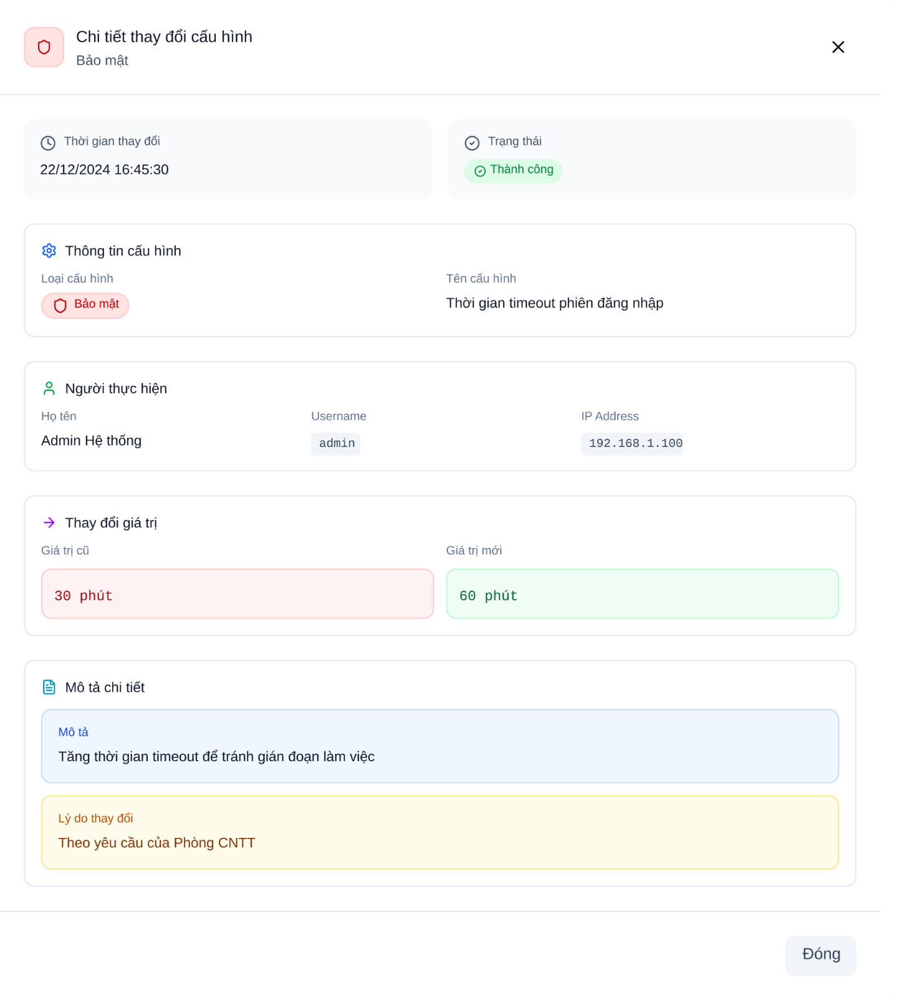

Hình 126 Màn hình chi tiết nhật ký cấu hình

###### Mô tả thông tin trên màn hình

| **STT** | **Tên trường thông tin** | **Kiểu dữ liệu** | **Bắt buộc** | **Mặc định** | **Mô tả** |
| --- | --- | --- | --- | --- | --- |
| 1 | Người thực hiện | Text |  | x | Tên và username của người thực hiện thay đổi. |
| 2 | Thời gian | Date time |  | x | Thời điểm thực hiện tác vụ. |
| 3 | Loại cấu hình | Label |  | x | Phân loại hạng mục (Bảo mật, CSDL, Email, v.v.). |
| 4 | Tên cấu hình | Text |  | x | Tên tham số cụ thể được điều chỉnh. |
| 5 | Giá trị cũ | Text |  | x | Giá trị trước khi thay đổi (hiển thị màu đỏ). |
| 6 | Giá trị mới | Text |  | x | Giá trị sau khi thay đổi (hiển thị màu xanh). |
| 7 | IP người thực hiện | Text |  | x | Địa chỉ IP của máy thực hiện thao tác. |
| 8 | Trạng thái | Text |  | x | Kết quả thực hiện (Thành công/Thất bại). |

###### Chức năng trên màn hình

|  |  |  |  |
| --- | --- | --- | --- |
| **STT** | **Tên chức năng** | **Định dạng** | **Mô tả** |
| 1 | Đóng | Button | Thoát khỏi màn hình chi tiết để quay lại danh sách. |

### 4.10.5. Thống kê & báo cáo

##### 4.10.5.1. BDTK. Xem thống kê CSDL tính hợp dạng biểu đồ

Màn hình thông tin chung

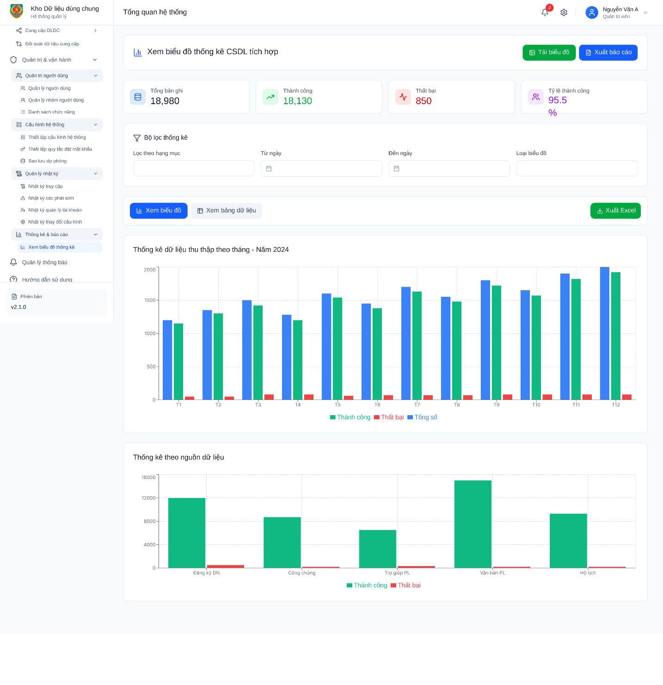

Hình 127 Màn hình thống kê tích hợp CSDL dạng biểu đồ

###### Mô tả thông tin trên màn hình

| **STT** | **Tên trường thông tin** | **Kiểu dữ liệu** | **Bắt buộc** | **Mặc định** | **Mô tả** |
| --- | --- | --- | --- | --- | --- |
| 1 | Tổng bản ghi | Number |  | x | Tổng số lượng dữ liệu đã thu thập được. |
| 2 | Thành công | Number |  | x | Số lượng bản ghi thu thập thành công. |
| 3 | Thất bại | Number |  | x | Số lượng bản ghi thu thập không thành công. |
| 4 | Tỷ lệ thành công | Tỷ lệ (%) |  | x | Phần trăm số bản ghi thành công trên tổng số. |
| 5 | Lọc theo hạng mục | Danh mục |  | x | Chọn nhóm dữ liệu cụ thể để xem thống kê. |
| 6 | Từ ngày | Ngày |  | x | Ngày bắt đầu khoảng thời gian thống kê. |
| 7 | Đến ngày | Ngày |  | x | Ngày kết thúc khoảng thời gian thống kê. |
| 8 | Loại biểu đồ | Danh mục |  | x | Lựa chọn định dạng hiển thị biểu đồ. |
| 9 | Thống kê theo tháng | Biểu đồ |  | x | Trực quan hóa dữ liệu Thành công/Thất bại theo từng tháng trong năm. |
| 10 | Thống kê theo nguồn dữ liệu | Biểu đồ |  | x | Trực quan hóa dữ liệu theo các nguồn (Đăng ký DN, Công chứng, Hộ tịch...). |

###### Chức năng trên màn hình

| **STT** | **Tên chức năng** | **Định dạng** | **Mô tả** |
| --- | --- | --- | --- |
| 1 | Tải biểu đồ | Button | Cho phép người dùng tải hình ảnh biểu đồ hiện tại về máy tính. |
| 2 | Xuất báo cáo | Button | Xuất các số liệu thống kê dưới dạng Text báo cáo. |
| 3 | Xem biểu đồ | Button | Chế độ hiển thị mặc định bằng các biểu đồ trực quan. |
| 4 | Xem bảng dữ liệu | Button | Chuyển đổi từ dạng biểu đồ sang dạng bảng số liệu chi tiết. |
| 5 | Xuất Excel | Button | Kết xuất dữ liệu thống kê ra file định dạng Excel. |
| 6 | Chú giải biểu đồ | Label tương tác | Nhấn vào các Label (Thành công, Thất bại, Tổng số) để ẩn/hiện dữ liệu tương ứng trên biểu đồ. |

##### 4.10.5.2. BDTK. Xem thống kê CSDL tính hợp dạng bảng

Màn hình thông tin chung

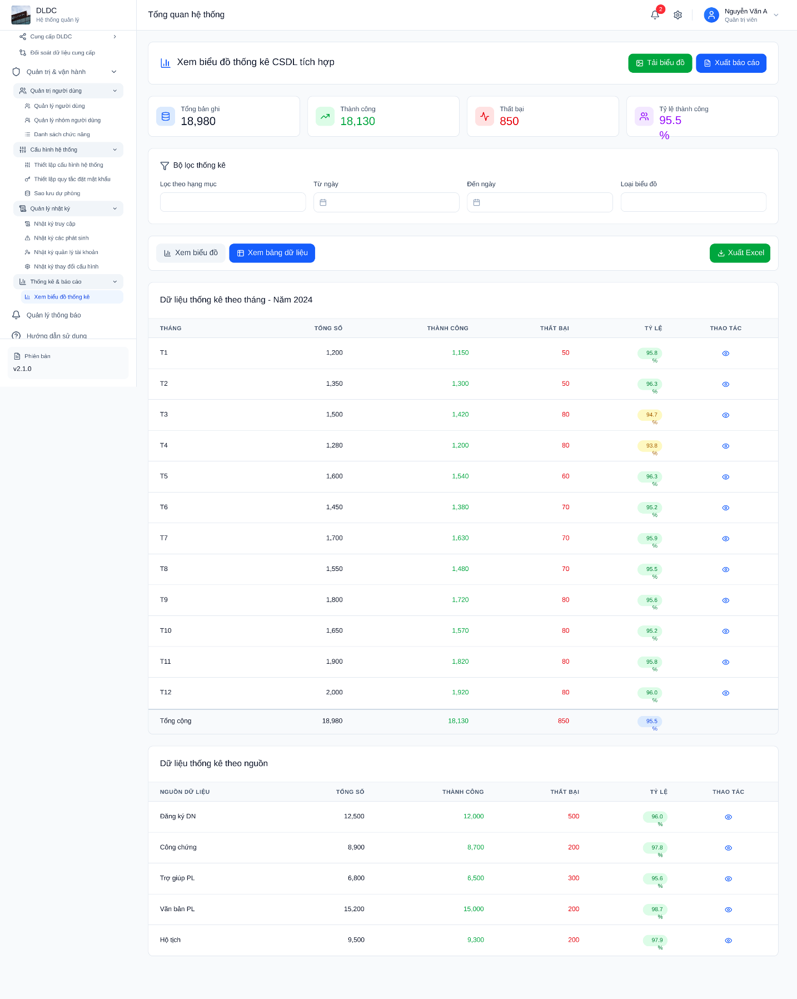

Hình 128 Màn hình thống kê tích hợp CSDL dạng bảng

###### Mô tả thông tin trên màn hình

| **STT** | **Tên trường thông tin** | **Kiểu dữ liệu** | **Bắt buộc** | **Mặc định** | **Mô tả** |
| --- | --- | --- | --- | --- | --- |
| 1 | Tổng bản ghi | Number |  | x | Tổng số lượng bản ghi trong kỳ báo cáo. |
| 2 | Thành công | Number |  | x | Tổng số bản ghi được xử lý thành công. |
| 3 | Thất bại | Number |  | x | Tổng số bản ghi xử lý lỗi. |
| 4 | Tỷ lệ thành công | Tỷ lệ (%) |  | x | Phần trăm thành công trên tổng số bản ghi. |
| 5 | Tháng / Nguồn dữ liệu | Text |  | x | Tiêu chí phân loại dữ liệu (theo thời gian hoặc theo nguồn). |
| 6 | Tổng số (Dòng) | Number |  | x | Số lượng bản ghi tương ứng với từng dòng cụ thể. |
| 7 | Thành công (Dòng) | Number |  | x | Số lượng thành công của dòng đó (hiển thị màu xanh). |
| 8 | Thất bại (Dòng) | Number |  | x | Số lượng thất bại của dòng đó (hiển thị màu đỏ). |
| 9 | Tỷ lệ (Dòng) | Tỷ lệ (%) |  | x | Tỷ lệ phần trăm thành công của riêng dòng đó. |

###### Chức năng trên màn hình

|  |  |  |  |
| --- | --- | --- | --- |
| **STT** | **Tên chức năng** | **Định dạng** | **Mô tả** |
| 1 | Tải biểu đồ | Button | Lưu hình ảnh biểu đồ thống kê về máy tính cá nhân. |
| 2 | Xuất báo cáo | Button | Tạo file báo cáo tổng hợp dựa trên số liệu hiện tại. |
| 3 | Xem biểu đồ | Button | Chuyển đổi giao diện sang dạng đồ thị (Cột/Đường). |
| 4 | Xem bảng dữ liệu | Button | Chế độ đang chọn, hiển thị số liệu chi tiết dưới dạng bảng. |
| 5 | Xuất Excel | Button | Trích xuất toàn bộ dữ liệu thống kê trong bảng ra file Excel. |
| 6 | Lọc dữ liệu | Bộ lọc | Thay đổi phạm vi thống kê theo hạng mục, thời gian hoặc loại biểu đồ. |
| 7 | Xem chi tiết (Thao tác) | Button (Mắt) | Cho phép nhấn vào để xem chi tiết các bản ghi thuộc nhóm đó. |

## 4.11. Quản lý thông báo

# PHỤ LỤC

## Danh mục

## Bảng map chức năng với usecase

| STT | Mã chức năng | Tên chức năng | Mã UC | Mô tả UC |
| --- | --- | --- | --- | --- |

