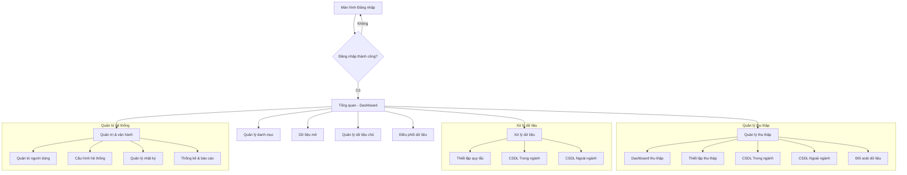

# 4.1. PM01.TQ - TỔNG QUAN (DASHBOARD)

## 4.1.1. Mục đích
Cung cấp cái nhìn toàn cảnh về hiệu năng và tình trạng hoạt động của hệ thống Kho DLDC thông qua các chỉ số KPI, biểu đồ xu hướng và dữ liệu thống kê chi tiết.

## 4.1.2. PM01.TQ.MH01 – Màn hình Tổng quan hệ thống
*(Giao diện tham chiếu: [DashboardHome.tsx](file:///d:/Tư%20pháp/KhoDLDC/DLDC_1/src/components/dashboard/DashboardHome.tsx))*

### 4.1.2.1. Nhóm chỉ số chính (KPI Cards)
Hiển thị các con số quan trọng nhất của hệ thống. Người dùng có thể nhấn vào từng thẻ để xem chi tiết.

| Chỉ số | Mô tả | Chi tiết hiển thị |
| :--- | :--- | :--- |
| **Thu thập** | Tổng số bản ghi đã được thu về kho. | Số lượng bản ghi tăng thêm trong tháng. |
| **Xử lý** | Số lượng bản ghi đã qua quy trình làm sạch/chuẩn hóa. | Tỷ lệ hoàn thành xử lý (%). |
| **Chia sẻ** | Tổng lượt truy xuất và cung cấp dữ liệu. | Số lượt phát sinh trong tuần. |

### 4.1.2.2. Hệ thống biểu đồ thống kê
| Tên biểu đồ | Loại | Mô tả |
| :--- | :--- | :--- |
| **Xu hướng Thu thập** | Line Chart | Theo dõi lượng dữ liệu thu thập trong 7 ngày gần nhất. |
| **Quy trình Xử lý** | Bar Chart | Thống kê số lượng theo giai đoạn: Làm sạch -> Chuẩn hóa -> Biến đổi. |
| **Phương thức Chia sẻ** | Pie Chart | Tỷ lệ chia sẻ qua: API, Export file, Đồng bộ hệ thống. |
| **Top 5 Dịch vụ** | Mixed Bar | 5 dịch vụ có lượt chia sẻ cao nhất (Phân loại Trong/Ngoài ngành). |
| **Xu hướng Dữ liệu chủ**| Area Chart | Biểu đồ tăng trưởng của kho dữ liệu gốc trong 6 tháng. |
| **Danh mục dùng chung** | Horiz. Bar | Thống kê số lượng danh mục (Giới tính, Dân tộc, Đơn vị hành chính...). |
| **Dữ liệu mở** | Stacked Bar | Tỷ lệ dữ liệu đã công bố và đang chờ phê duyệt theo lĩnh vực. |

### 4.1.2.3. Các thông tin khác
- **Kiến trúc hệ thống**: Tóm tắt mục tiêu phát triển Nền tảng số và Kho dữ liệu Hợp nhất.
- **Tài khoản người dùng**: Biểu đồ tăng trưởng số lượng người dùng hệ thống.
- **Tần suất tra cứu**: Thống kê các dịch vụ được tìm kiếm nhiều nhất trong tháng.

## 4.1.3. PM01.TQ.MH02 – Chi tiết chỉ số (Popup)
Hiển thị khi người dùng nhấn vào các thẻ KPI (Thu thập, Xử lý, Chia sẻ).

| Trường thông tin | Kiểu dữ liệu | Bắt buộc | Mặc định | Mô tả |
| :--- | :--- | :--- | :--- | :--- |
| Tên dữ liệu | Văn bản | - | - | Tên CSDL hoặc dịch vụ cụ thể. |
| Nguồn | Văn bản | - | - | Hệ thống hoặc đơn vị cung cấp dữ liệu. |
| Số lượng đồng bộ | Số | - | - | Tổng số bản ghi đã ghi nhận. |
| Lần đồng bộ cuối | Ngày giờ | - | - | Thời điểm cập nhật dữ liệu gần nhất. |
| Trạng thái | Nhãn | - | - | Thành công, Cảnh báo hoặc Lỗi. |

### 4.1.3.1. Thống kê tổng hợp trong Popup
- **Tổng nguồn**: Số lượng hệ thống đang kết nối.
- **Tổng đồng bộ**: Tổng bản ghi của nhóm đang xem.
- **Thành công/Lỗi**: Phân bổ trạng thái của các nguồn dữ liệu.

## 4.1.4. Luồng ứng dụng tổng quan

Sơ đồ dưới đây thể hiện luồng điều hướng chính của người dùng sau khi đăng nhập vào hệ thống:

---
*Tài liệu này cung cấp cái nhìn tổng thể. Chi tiết về từng phân hệ vui lòng tham khảo các tệp tin phân tích tương ứng.*
