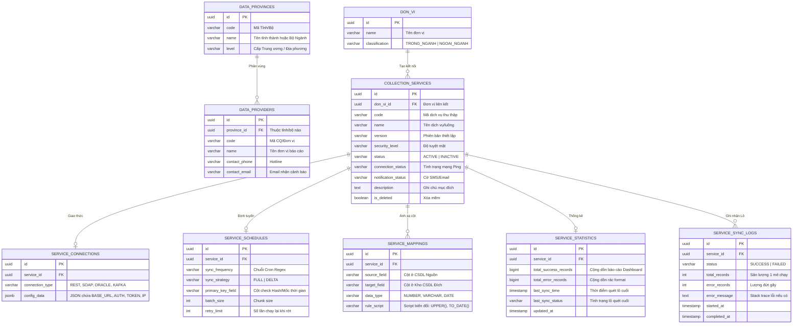

# Thiết kế Cơ sở dữ liệu Tổng thể: Module Thu Thập Dữ Liệu (Data Collection Module)

Dựa trên scope của dự án DLDC tập trung chuyên biệt vào Core của "Module Thu Thập", CSDL được chuẩn hóa tách biệt rạch ròi giữa: **Quản lý Nguồn dữ liệu (Hệ thống/Đơn vị)**, **Thiết lập Luồng Thu thập (ETL)**, **Cấu hình Ánh xạ (Mapping)** và **Giám sát (Dashboard & Logs)**.

Thiết kế này đảm bảo Dev có thể dựng Table, tạo Relation Key trên bất kỳ RDBMS nào (PostgreSQL/MySQL/Oracle) chặn được lỗi trùng lặp dữ liệu và đạt chuẩn thiết kế phần mềm linh hoạt (Extensibility).

---

## 1. Sơ đồ Quan hệ Thực thể Phân hệ Thu thập (ERD)

---

## 2. Giải nghĩa Thiết kế (Từ điển Database)

### Nhóm 1: Quản lý Danh mục & Môi trường Nguồn
Thay vì để User gõ tay tên Hệ Thống hay "Trong/Ngoài ngành" mỗi lần thêm mới Thiết lập (dễ sinh lỗi Typo rác CSDL), ta tách ra mảng **Danh mục (Master Data)** phân tầng:
1. **`DATA_PROVINCES` (Danh mục Vùng/Tỉnh/Bộ):** Quản lý Master địa giới hành chính hoặc Cấp Trung ương. VD: `Hà Nội`, `Bộ Công an`. Phục vụ tính năng thống kê xem Tỉnh/Bộ nào đang đóng góp nhiều Data nhất.
2. **`DON_VI` (Đơn vị cung cấp trực tiếp):** Lưu các Cơ quan, Sở, Ban, Ngành (Ví dụ: `Sở Thông tin TT Hà Nội`, `Cục Thống kê`). Bảng này có cột Enum `classification` giúp phân loại "Trong ngành" (Nội bộ BTP) hay "Ngoài ngành".

### Nhóm 2: Lõi Thiết lập Thu thập (Core ETL Setup)
1. **`COLLECTION_SERVICES`**: Đóng vai trò là TRỤC XOAY (Bảng cha). Quản lý thông tin định danh bề mặt của 1 luồng thu thập. Khóa ngoại `don_vi_id` xác định Dịch vụ/Kết nối này thuộc Đơn vị nào quản lý.
2. **`SERVICE_CONNECTIONS`**: Toàn bộ cấu hình phức tạp (User/Pass DB, Key OAUTH2, Base URL, IP/Port) được gói hết vào cột **JSONB `config_data`**. Dev BE không cần tạo thừa thãi 1 đống cột cứng, Database tự do linh hoạt scale khi xuất hiện chuẩn kết nối mới (KAFKA, MQTT).
3. **`SERVICE_SCHEDULES`**: Bảng giữ toàn bộ lệnh định tuyến lập lịch quét: Quét toàn thời gian (Full Sync) hoặc Quét cập nhật gia tăng (Delta Sync).

### Nhóm 3: Tiêu chuẩn hóa Dữ liệu (Schema Mapping)
1. **`SERVICE_MAPPINGS` (Bảng Ánh Xạ):** Chìa khóa vàng của hệ thống Dữ Liệu Đồng Bộ. Hệ thống thu thập không thể mang nguyên DB của đối tác đắp vào mình được. Bảng này lưu luật ánh xạ kiểu 1-1. Ví dụ cấu hình row 1: `source='CCCD' -> target='ma_dinh_danh' | rule='Bỏ mọi dấu cách thừa'`.

### Nhóm 4: Logs & Monitoring
1. **`SERVICE_SYNC_LOGS`**: Khi Worker / Hangfire quét theo Scheduled thì mọi lô (Batch Process) đều sinh ra 1 Row Audit ở đây để theo dõi Tiến trình, tính toán Runtime và phát hiện Exception thảm họa.
2. **`SERVICE_STATISTICS`**: Sinh ra để trả về Data cực lẹ cho màn hình **Báo cáo Thống kê Dashboard KPI (Hình ảnh cột/line chart)**. Dev không bao giờ được Select COUNT(*) bảng Logs. Thay vào đó, sau mỗi lô Sync Log thành công, Code Backend sẽ bắn lệnh Tăng dồn `total_success_records` tại bảng này lên. Tối ưu hoàn toàn tình trạng treo Data lock.
