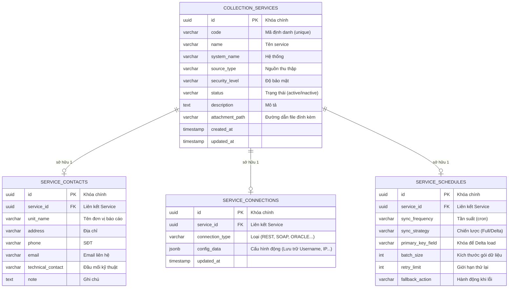

# Thiết kế Cơ sở dữ liệu: Module Thông tin kết nối (Collection Setup)

 Dựa trên 4 màn hình giao diện (Tab), mô hình CSDL tối ưu nhất là sử dụng một bảng chính làm trung tâm (`COLLECTION_SERVICES`) và các bảng phụ trợ có quan hệ 1-1 (hoặc tích hợp dữ liệu dạng JSON) để dễ dàng co giãn. Thiết kế dưới đây cấu trúc theo chuẩn RDBMS (như PostgreSQL / MySQL).

## 1. Sơ đồ Quan hệ Thực thể (ERD)

---

## 2. Chi tiết Cấu trúc các Bảng (Tables)

### Bảng `COLLECTION_SERVICES` (Thông tin chung - Tab 1)
Lưu trữ thông tin metadata gốc của một luồng thu thập dữ liệu.
* **id** (UUID/BIGINT): Khóa chính.
* **code** (VARCHAR): Mã hiển thị ngoài UI (VD: `DL_QT_001`). Unique.
* **name** (VARCHAR 255): Tên dịch vụ (VD: "API dịch vụ dữ liệu quốc tịch").
* **system_name** (VARCHAR 255): Tên hệ thống chứa dữ liệu.
* **source_type** (VARCHAR 50): Nguồn thu thập (`Hệ thống trong ngành` / `Hệ thống ngoài ngành`).
* **security_level** (VARCHAR 50): Mức độ bảo mật (`Dữ liệu nội bộ`, `Dữ liệu mở`...).
* **status** (VARCHAR 20): Trạng thái (`active`, `format_error`, `maintenance`).
* **description** (TEXT): Nội dung mô tả chi tiết.
* **attachment_path** (VARCHAR 500): URL vật lý trên server storage lưu file quyết định/văn bản.

### Bảng `SERVICE_CONTACTS` (Thông tin đơn vị cung cấp - Tab 2)
Tách riêng làm 1 bảng để quản lý thông tin liên lạc độc lập, không làm phình to bảng chính. Relational 1-to-1 với `COLLECTION_SERVICES`.
* **unit_name** (VARCHAR 255): Tên đơn vị (Đồng bộ với Tab 1).
* **phone** (VARCHAR 20): Chuỗi regex SĐT.
* **email** (VARCHAR 100): Nhận thông báo tự động.

### Bảng `SERVICE_CONNECTIONS` (Cấu hình kết nối - Tab 3)
Vì mỗi nền tảng có các config khác nhau (API cần Token, Oracle cần TNS/SID, FTP cần Port...):
Nên triển khai cột **`config_data`** dưới dạng **JSON/JSONB** thay vì tạo 20 cột rỗng thừa thãi.
* **connection_type** (VARCHAR 50): VD phân loại: `REST`, `SOAP`, `POSTGRES`.
* **config_data** (JSONB):
   * *Ví dụ JSON cho REST:* `{"base_url": "https://...", "auth_type": "Bearer", "token": "mã-hóa-aes-256" }`
   * *Ví dụ JSON cho Oracle:* `{"host": "10.0.0.1", "port": 1521, "sid": "ORCL", "username": "admin", "password": "mã-hóa" }`
   > **Lưu ý bảo mật:** Mật khẩu và Token nằm trong `config_data` phải được mã hóa hai chiều (AES-256) ở tầng Code (Backend) trước khi Insert xuống DB.

### Bảng `SERVICE_SCHEDULES` (Cấu hình thu thập - Tab 4)
Cung cấp tham số đầu vào cho hệ thống Cronjob / Orchestration (ví dụ Apache Airflow / Hangfire).
* **sync_frequency** (VARCHAR 50): Lưu chuỗi cron như `0 12 * * *` hoặc enum `DAILY`.
* **sync_strategy** (VARCHAR 20): `FULL_LOAD` hoặc `DELTA`.
* **primary_key_field** (VARCHAR 100): Tên trường để so sánh nếu chạy DELTA.
* **batch_size** (INT): Số dòng kéo về tối đa, ví dụ: `1000`.
* **retry_limit** (INT): VD `3`.
* **fallback_action** (VARCHAR 50): VD `SEND_EMAIL` hoặc `PAUSE_SYNC`.
