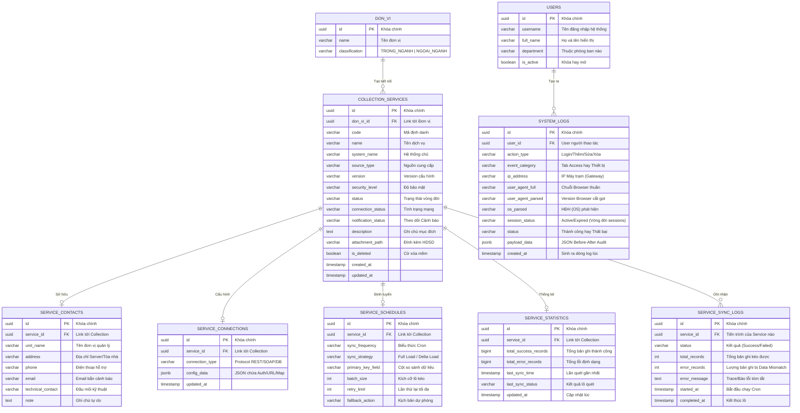

# Thiết kế Cơ sở dữ liệu: Module Thông tin kết nối (Collection Setup)

 Dựa trên 4 màn hình giao diện (Tab), mô hình CSDL tối ưu nhất là sử dụng một bảng chính làm trung tâm (`COLLECTION_SERVICES`) và các bảng phụ trợ có quan hệ 1-1 (hoặc tích hợp dữ liệu dạng JSON) để dễ dàng co giãn. Thiết kế dưới đây cấu trúc theo chuẩn RDBMS (như PostgreSQL / MySQL).

## 1. Sơ đồ Quan hệ Thực thể (ERD)

---

## 2. Chi tiết Cấu trúc các Bảng (Tables)

### Bảng `DON_VI` (Đơn vị kết nối)
Quản lý danh sách các đơn vị thực hiện kết nối.
* **id** (UUID): Khóa chính.
* **name** (VARCHAR 255): Tên đơn vị.
* **classification** (VARCHAR 50): Phân loại nguồn thu thập (Trong ngành / Ngoài ngành).

### Bảng `COLLECTION_SERVICES` (Thông vị chung - Tab 1)
Lưu trữ thông tin metadata gốc của một luồng thu thập dữ liệu.
* **id** (UUID/BIGINT): Khóa chính.
* **don_vi_id** (UUID): Khóa ngoại liên kết tới bảng DON_VI.
* **code** (VARCHAR): Mã hiển thị ngoài UI (VD: `DL_QT_001`). Unique.
* **name** (VARCHAR 255): Tên dịch vụ (VD: "API dịch vụ dữ liệu quốc tịch").
* **system_name** (VARCHAR 255): Tên hệ thống chứa dữ liệu.
* **source_type** (VARCHAR 50): Nguồn thu thập (`Hệ thống trong ngành` / `Hệ thống ngoài ngành`).
* **version** (VARCHAR 20): Mã lưu phiên bản cấu hình API.
* **security_level** (VARCHAR 50): Mức độ bảo mật (`mở`, `nội bộ`, `hạn chế`, `nhạy cảm`, `bảo mật`, `tuyệt mật`).
* **status** (VARCHAR 20): Trạng thái thiết lập chung vòng đời dịch vụ (`ACTIVE`, `MAINTENANCE`, `INACTIVE`).
* **connection_status** (VARCHAR 50): Trạng thái kết nối kỹ thuật thực thời (`SUCCESS`, `TIMED_OUT`, `AUTH_FAILED`...).
* **notification_status** (VARCHAR 20): Cờ đánh dấu đã gửi cảnh báo lỗi qua SMS/Email hay chưa (`UNSENT`, `SENT`).
* **description** (TEXT): Nội dung mô tả chi tiết.
* **attachment_path** (VARCHAR 500): URL vật lý trên server storage lưu file quyết định/văn bản.
* **is_deleted** (BOOLEAN): Cờ đánh dấu xóa mềm, hỗ trợ đếm dashboard, mặc định là `false`.

### Bảng `SERVICE_CONTACTS` (Thông tin đơn vị cung cấp - Tab 2)
Tách riêng làm 1 bảng để quản lý thông tin liên lạc độc lập, không làm phình to bảng chính. Relational 1-to-1 với `COLLECTION_SERVICES`.
* **unit_name** (VARCHAR 255): Tên đơn vị (Đồng bộ với Tab 1).
* **phone** (VARCHAR 20): Chuỗi regex SĐT.
* **email** (VARCHAR 100): Nhận thông báo tự động.

### Bảng `SERVICE_CONNECTIONS` (Cấu hình kết nối - Tab 3)
Vì mỗi nền tảng có các config khác nhau (API cần Token, Oracle cần TNS/SID, FTP cần Port...):
Nên triển khai cột **`config_data`** dưới dạng **JSON/JSONB** thay vì tạo 20 cột rỗng thừa thãi.
* **connection_type** (VARCHAR 50): VD phân loại: `REST`, `SOAP`, `POSTGRES`.
* **config_data** (JSONB):
   * *Ví dụ JSON cho REST:* `{"base_url": "https://...", "auth_type": "Bearer", "token": "mã-hóa-aes-256" }`
   * *Ví dụ JSON cho Oracle:* `{"host": "10.0.0.1", "port": 1521, "sid": "ORCL", "username": "admin", "password": "mã-hóa" }`
   > **Lưu ý bảo mật:** Mật khẩu và Token nằm trong `config_data` phải được mã hóa hai chiều (AES-256) ở tầng Code (Backend) trước khi Insert xuống DB.

### Bảng `SERVICE_SCHEDULES` (Cấu hình thu thập - Tab 4)
Cung cấp tham số đầu vào cho hệ thống Cronjob / Orchestration (ví dụ Apache Airflow / Hangfire).
* **sync_frequency** (VARCHAR 50): Lưu chuỗi cron như `0 12 * * *` hoặc enum `DAILY`.
* **sync_strategy** (VARCHAR 20): `FULL_LOAD` hoặc `DELTA`.
* **primary_key_field** (VARCHAR 100): Tên trường để so sánh nếu chạy DELTA.
* **batch_size** (INT): Số dòng kéo về tối đa, ví dụ: `1000`.
* **retry_limit** (INT): VD `3`.
* **fallback_action** (VARCHAR 50): VD `SEND_EMAIL` hoặc `PAUSE_SYNC`.

### Bảng `SERVICE_STATISTICS` (Thống kê Dịch vụ)
Bảng độc lập (Quan hệ 1-1) chịu trách nhiệm Tổng hợp toàn bộ chỉ số lưu lượng theo từng dịch vụ. Tránh việc phải dùng vòng lặp SUM() từ bảng Log khổng lồ mỗi khi load Màn hình Danh sách/Dashboard, giúp giảm triệt để tình trạng chậm truy vấn (Table lock/Slow query).
* **service_id** (UUID): Khóa ngoại chỉ định tới Collection Service.
* **total_success_records** (BIGINT): Tổng số lượng record lũy kế của dịch vụ kéo về CSDL thành công. Bảng này sẽ được API Update Tăng/Cộng dồn (Count up) mỗi khi có 1 lô mới chạy thành công.
* **total_error_records** (BIGINT): Tổng lượng record bị lỗi định dạng / schema mismatch.
* **last_sync_time** (TIMESTAMP): Trường kiểm tra "Cập nhật thời gian đồng bộ gần nhất". Việc tách vào bảng phụ giúp Update liên tục thời gian Cronjob chạy mà không làm đổi thông tin Cấu hình bảng chính.
* **last_sync_status** (VARCHAR): Ghi nhận tiến trình lô (batch) gần nhất là Thành công / Thất bại.
